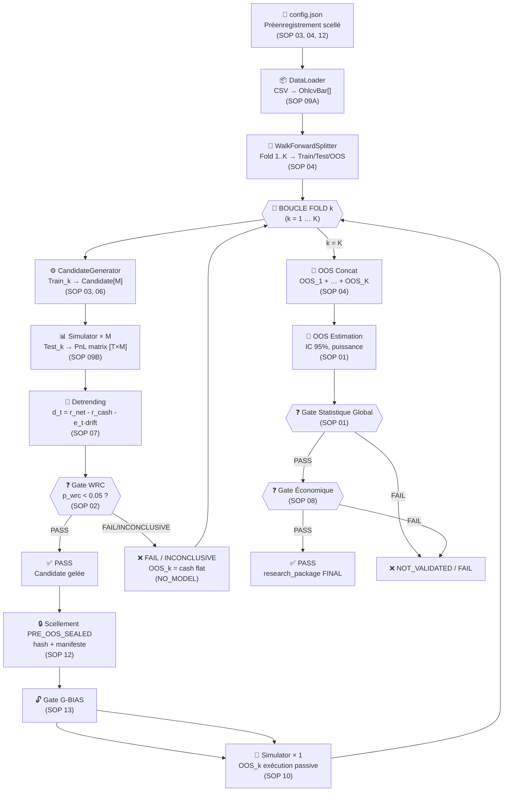
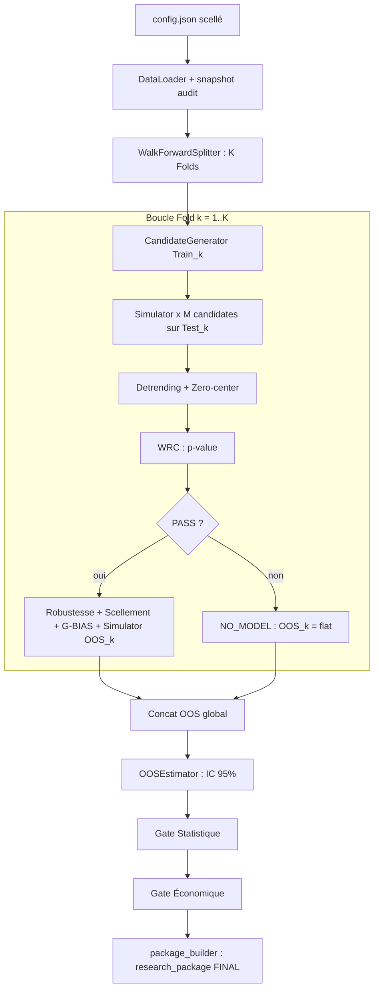
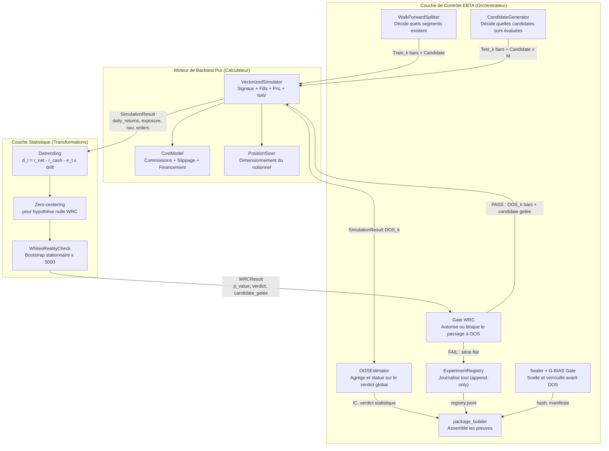
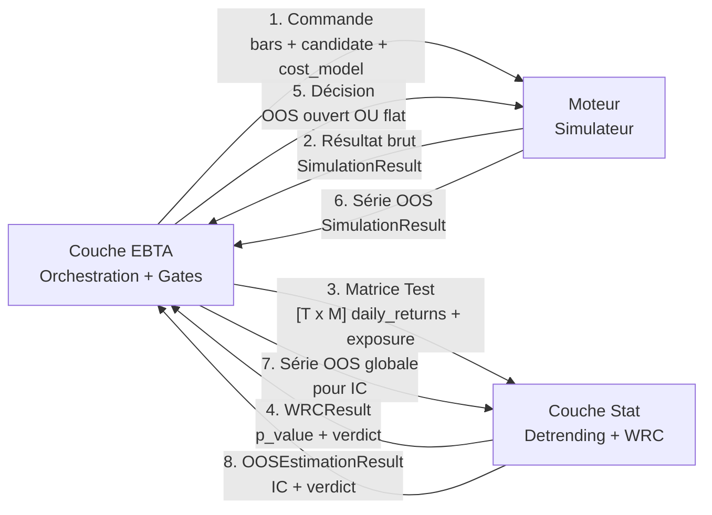
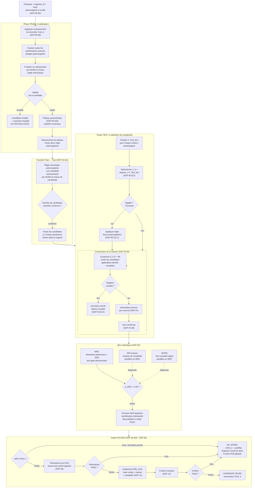
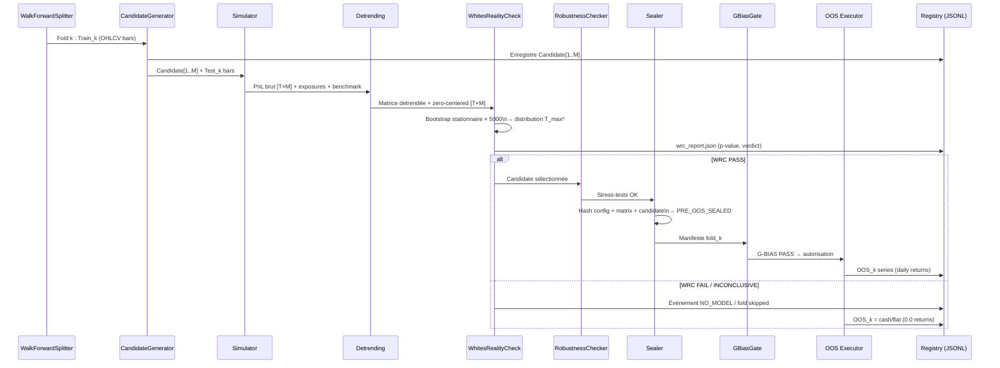
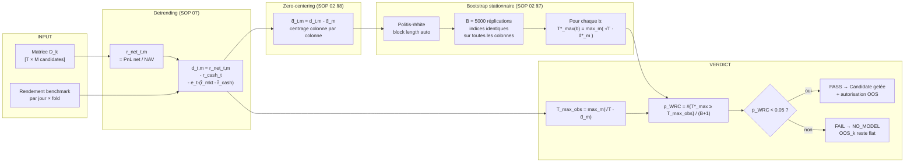
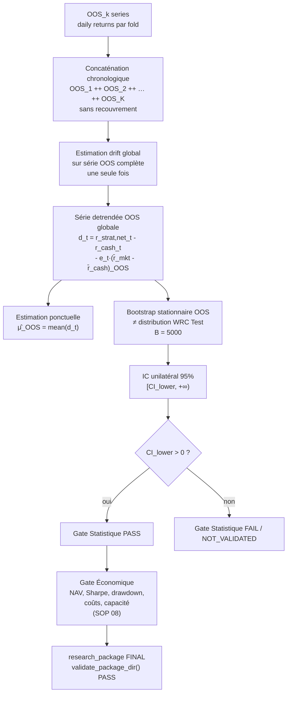
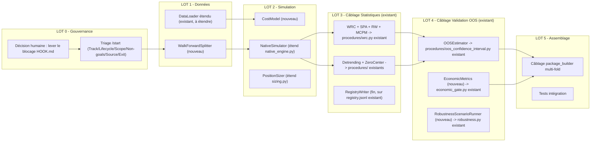

# Architecture Technique du Moteur EBTA
## Traduction du Protocole en Code Python Exécutable

---

> [!IMPORTANT]
> **Statut : INTAKE non audité, corrigé par audit d'architecture le 2026-07-06.**
> Ce document vit dans `0 - HUMAN START HERE/` et n'est donc pas exécutable en
> l'état (`AGENTS.md` / `CLAUDE.md`). Avant tout `/start`, il lui manque le
> triage obligatoire (`Track`, `Lifecycle`, `Scope`, `Non-goals`, `Source`,
> `Exit criteria`) déjà présent dans
> `.ai/backlog/mainline/PLAN_IMPLEMENTATION_MOTEUR_BACKTEST_EBTA_NATIF.md`.
>
> **Ce document recouvre un chantier déjà marqué `DONE` par la gouvernance
> active.** `.ai/checkpoint.json`, `Implementation/Active/tracking.json` et
> `Implementation/Active/HOOK.md` déclarent
> `PLAN_IMPLEMENTATION_MOTEUR_BACKTEST_EBTA_NATIF` `DONE` avec
> `NATIVE_ENGINE_PHASE_8_COMPLETED`, et posent un blocage explicite :
> *« Ne pas démarrer d'extension au-delà du MVP tant que le package natif
> courant ne reste pas `PASS`, que la suite runtime ne reste pas `PASS`, et
> que le gap licence/vendor des données locales n'est pas tranché si
> l'exécution devient une recherche réelle et non un MVP d'architecture. »*
> Or ce document (boucle Walk-Forward multi-folds réelle, WRC/robustesse/OOS
> en boucle, gate économique complet) est exactement l'extension au-delà du
> MVP visée par ce blocage. **Il ne peut pas être routé via `/start` sans
> qu'une décision humaine explicite lève ce verrou** (au même format que la
> décision `1A/2B/3A` du 2026-07-02 déjà tracée dans le plan mainline).
>
> **Une large partie de l'inventaire "à créer" de la section 6/7 existe déjà,
> testée et sans dépendance externe, dans `Implementation/ebta_engine/procedures/`
> et est déjà câblée dans
> `Implementation/examples/minimal_pilot_pipeline/build_research_package.py`.**
> Voir la section 6 corrigée ci-dessous. Les corrections de cet audit ont été
> appliquées directement dans ce fichier ; le texte substitué reste
> consultable via `git diff` / l'historique de ce fichier.

---

## 0. Rôle du Document

Ce document harmonise le plan technique du moteur EBTA natif. Il raconte le
pipeline dans son ordre réel :

```text
Protocole EBTA
  -> contrats exécutables
  -> pipeline de recherche
  -> boucles Train/Test/OOS
  -> gates statistiques et économiques
  -> artefacts de preuve
  -> research_package validable
```

Il ne modifie pas le protocole. Il traduit les exigences de `Protocole/` et des
SOP en modules Python, décisions de gate, artefacts et lots d'implémentation.

Position de ce fichier :

| Élément | Rôle |
|---|---|
| `Protocole/` | Autorité normative : ordre des gates, SOP, décisions, interdictions. |
| `Implementation/ebta_engine/` | Traduction exécutable : schémas, validateurs, procédures, moteur natif, tests. |
| `Implementation/notebooks/` | Cockpit Jupyter d'orchestration, non normatif, non source de verdict. |
| `research_package/` | Paquet de preuve produit par le pipeline et validé par EBTA. |
| Ce plan | Carte d'implémentation : quoi coder, où le coder, pourquoi et dans quel ordre. |

Non-objectifs :

- ne pas réécrire `Protocole/` ;
- ne pas créer de gate, statut ou seuil absent des SOP ;
- ne pas faire de BACKTRADER une dépendance runtime ;
- ne pas faire du notebook ou de la visualisation une source de verdict ;
- ne pas ouvrir OOS avant scellement et `G-BIAS PASS`.

---

## 1. Ce Que le Protocole Demande

EBTA ne valide pas une règle isolée. EBTA valide un **processus de recherche et
de sélection** :

```text
intention
  -> configuration préenregistrée
  -> données point-in-time
  -> folds Walk-Forward
  -> calibration Train_k
  -> sélection Test_k
  -> WRC local
  -> robustesse pré-OOS
  -> scellement PRE_OOS_SEALED
  -> G-BIAS
  -> ouverture OOS_k
  -> exécution passive
  -> estimation OOS globale
  -> gate statistique
  -> gate économique
  -> paquet reproductible
  -> incubation/live éventuel
```

Le code doit donc produire deux choses en même temps :

1. des résultats financiers calculés correctement ;
2. des preuves méthodologiques vérifiables que les résultats ont été produits
   dans le bon ordre.

### 1.1 Ordre des Gates à Respecter

| Ordre | Gate | Question posée au code | Sortie si échec |
|---|---|---|---|
| G0 | Préenregistrement | La recherche, les folds, les seeds, les coûts, les métriques et les règles sont-ils scellés avant résultat ? | Pas de recherche EBTA valide |
| G1 | Données point-in-time | Les données étaient-elles disponibles au moment de la décision ? | `FAIL` ou `INCONCLUSIVE` |
| G2 | Registre et candidates | Toutes les candidates influentes sont-elles dans le registre ? | `FAIL` ou `INCONCLUSIVE` |
| G3 | Sélection locale | La candidate locale est-elle choisie mécaniquement selon la règle préenregistrée ? | `NO_MODEL`, `STOP_PROCESS`, `NOT_VALIDATED` ou `INCONCLUSIVE` |
| G4 | Inférence multiple Test | Le WRC local primaire passe-t-il sur la famille complète ? | Pas d'exposition sur `OOS_k` |
| G5 | Robustesse pré-OOS | Les stress-tests décisionnels préenregistrés passent-ils ? | OOS non ouvert |
| G6 | Exécution et capacité | Le modèle d'exécution, les coûts, la capacité et la NAV sont-ils tradables ? | `REJECTED_ECONOMIC`, `FAIL` ou `INCONCLUSIVE` |
| G7 | Paquet pré-OOS | Le paquet `PRE_OOS_SEALED` est-il complet et hashé ? | OOS non ouvert |
| G8 | Ouverture OOS | L'accès OOS est-il autorisé, journalisé et précédé par `G-BIAS PASS` ? | OOS non ouvert |
| G9 | Estimation OOS globale | L'IC OOS, la puissance et le gate statistique sont-ils calculés sur l'OOS global ? | `NOT_VALIDATED`, `FAIL` ou `INCONCLUSIVE` |
| G10 | Gate économique | La performance nette réelle, les coûts, le risque et la capacité passent-ils le hurdle ? | `REJECTED_ECONOMIC` ou `INCONCLUSIVE` |
| G11 | Validation reproductible | Le paquet `VALIDATION_READY` est-il reproductible indépendamment ? | Pas d'incubation |
| G12 | Incubation | Le processus gelé passe-t-il le paper trading prospectif ? | `FAIL`, `INCONCLUSIVE`, `WATCH` ou archivage |
| G13 | Déploiement limité | Le paquet `DEPLOYMENT_CERTIFIED`, les limites et le kill switch sont-ils prêts ? | Pas de live |
| G14 | Cycle de vie | Monitoring, incidents, retraits et archive sont-ils journalisés ? | Nouvelle version ou retrait |

`G-BIAS` est transversal. Il ne renumérote pas `G0` à `G14`, mais bloque
notamment `G8`, `G11`, l'incubation ou le live s'il est `FAIL`,
`INCONCLUSIVE` ou `BURNED`.

### 1.2 Invariants Méthodologiques que le Code Doit Rendre Difficiles à Violer

1. Jamais de données Test ou OOS pendant la calibration Train.
2. Jamais d'ouverture OOS après WRC `FAIL` ou `INCONCLUSIVE`.
3. Jamais de sélection, réparation ou arbitrage sur OOS.
4. Jamais de matrice WRC réduite aux candidates prometteuses.
5. Jamais de suppression des folds `NO_MODEL` dans l'OOS global.
6. Jamais de SPA, Romano-Wolf ou MCPM utilisé comme rattrapage d'un WRC `FAIL`.
7. Jamais de gate économique utilisé pour remplacer le gate statistique.
8. Jamais de notebook, visualisation ou artefact externe comme source de verdict.

---

## 2. Vue Globale du Pipeline Exécutable

Le pipeline EBTA est un orchestrateur de recherche. Il ne se limite pas à
`data -> signal -> PnL`. Il doit enchaîner les blocs de recherche, produire les
artefacts attendus, puis faire passer ces artefacts dans les validateurs EBTA.

### 2.1 Schéma Global du Pipeline



### 2.2 Ordre d'Exécution Global



### 2.3 Étapes de Recherche et Traduction en Code

| Étape pipeline | Ce que le protocole demande | Brique Python responsable | Artefact principal |
|---|---|---|---|
| Préenregistrement | Hypothèse, univers, folds, coûts, seeds et gates scellés | `package_builder/`, schémas, validateurs | `config.json` |
| Données PIT | Données disponibles à la date de décision, sans leakage | `data/local_ohlcv.py`, `data/walk_forward.py` | `data_availability.json`, `fold_schedule.json` |
| Segmentation | `Train_k`, `Test_k`, `OOS_k`, purge, embargo, warm-up | `WalkForwardSplitter` | `fold_schedule.json` |
| Candidates | Famille complète, candidates perdantes incluses | `strategies/payloads.py`, `strategies/generator.py`, `registry/` | `candidate_matrix.json`, `registry.jsonl` |
| Simulation Test | PnL, NAV, exposition, coûts sur Test | `backtest/simulator.py`, `backtest/cost_model.py`, `risk/position_sizer.py` | matrices de rendements |
| WRC | Gate primaire de data-mining bias | `statistics/wrc.py`, `metrics/detrending.py` | `wrc_fold_k.json` |
| Secondaires | SPA/MCPM diagnostics ; Romano-Wolf conditionnel | `statistics/spa.py`, `statistics/mcpm.py`, `statistics/romano_wolf.py` | sections secondaires du WRC |
| Robustesse | Stress-tests pré-OOS | `risk/robustness.py` | `robustness_fold_k.json` |
| Scellement | Hash de config, matrice, candidate, code, environnement | `procedures/sealing.py`, `manifests/` | `pre_oos_sealed_fold_k.json` |
| G-BIAS | Contrôle biais humain/IA avant OOS | `governance/bias_gate.py` | `g_bias.json` |
| OOS passif | Exécution de la candidate gelée sans ajustement | `backtest/simulator.py` | `oos_fold_k.csv` |
| OOS global | Concaténation puis IC OOS propre | `statistics/oos_estimation.py` | `oos_global.json` |
| Économie | NAV nette, Sharpe, drawdown, coûts, capacité | `metrics/economic_gate.py` | `economic.json` |
| Paquet | Assemblage et validation | `package_builder/`, `validators/package_validator.py` | `research_package/` |

---

## 3. Séparation Moteur de Backtest / Couche de Contrôle EBTA

### 3.1 Pourquoi cette Séparation est Structurellement Nécessaire

La question n'est pas de style ou de préférence architecturale. Elle découle
directement du protocole.

Le **moteur de backtest** répond à une seule question : *"Si cette candidate
avait été exécutée sur cette série de prix avec ces coûts, qu'aurait-on
obtenu ?"* C'est un calculateur financier déterministe. Il n'a aucune raison de
savoir si on lui soumet des données `Train`, `Test` ou `OOS`, et aucune raison
de connaître les gates méthodologiques.

La **couche de contrôle EBTA** répond à une question différente : *"A-t-on le
droit d'utiliser ce résultat, dans ce contexte, à ce stade du processus ?"*
Elle encadre, séquence et bloque les appels au moteur selon les règles des SOP.

**Sans cette séparation, la fraude ou l'erreur méthodologique devient
invisible.** Rien dans le moteur ne peut empêcher quelqu'un d'appeler
`simulator.run(candidate, oos_bars)` sans avoir d'abord passé le WRC. La couche
de contrôle est le seul endroit où ce verrou existe réellement dans le code.

> [!IMPORTANT]
> Le moteur de backtest ne sait pas qu'il existe un protocole EBTA. La couche de
> contrôle transforme un simulateur générique en processus de recherche conforme
> EBTA.

### 3.2 Schéma d'Imbrication



### 3.3 Frontière Exacte des Couches

#### Moteur de backtest

| Il fait | Il ne fait pas |
|---|---|
| Lire les bars OHLCV dans l'ordre chronologique | Vérifier qu'il s'agit de données `Train`, `Test` ou `OOS` |
| Appliquer les signaux de la candidate anti-lookahead | Savoir si l'OOS est autorisé |
| Calculer les fills au prix du lendemain open | Exécuter le WRC ou vérifier `G-BIAS` |
| Appliquer commissions, slippage, financement | Sceller ou hasher quoi que ce soit |
| Calculer la NAV mark-to-market quotidienne | Décider si on peut passer au fold suivant |
| Produire `orders`, `fills`, `positions`, `daily_returns`, `exposure` | Journaliser dans le registre |

En résumé : le moteur reçoit une série de barres et une candidate. Il produit
des chiffres. Il est aveugle au contexte méthodologique.

#### Couche de contrôle EBTA

| Elle fait | Elle délègue au moteur |
|---|---|
| Décider quel segment soumettre au moteur (`Train`, `Test`, `OOS`) | Le calcul des PnL, fills et NAV |
| Vérifier que le registre est complet avant WRC | La génération des signaux de la candidate |
| Bloquer l'appel OOS si le WRC est `FAIL` | Le calcul du slippage et des coûts |
| Sceller le contexte cryptographiquement avant OOS | La valorisation mark-to-market quotidienne |
| Forcer la politique `NO_MODEL` si aucune candidate ne passe | |
| Journaliser chaque décision dans le registre append-only | |
| Passer le résultat OOS à la couche statistique | |

### 3.4 Contrat d'Interface entre Moteur et Contrôle

Le seul objet que le moteur produit et que la couche EBTA consomme est le
`SimulationResult`.

```python
@dataclass
class SimulationResult:
    # --- Ce que le moteur calcule ---
    candidate_id:   str
    segment:        str              # "train" | "test" | "oos" (posé par l'appelant, pas le moteur)
    daily_returns:  list[float]      # longueur T — r_net_t : rendement net quotidien
    daily_exposure: list[float]      # longueur T — e_t ∈ [-1, +1]
    nav:            list[float]      # longueur T+1 — NAV mark-to-market
    orders:         list[dict]       # journal signal → ordre → fill
    fills:          list[dict]
    positions:      list[dict]
    total_costs:    float

    # --- Ce que la couche EBTA ajoute après réception ---
    # fold_id, wrc_verdict, sealing_hash, oos_authorized...
    # Ces métadonnées appartiennent à l'orchestrateur et au research_package.
```

Direction du flux d'information :



### 3.5 Moments d'Intervention de la Couche EBTA

| Moment | Ce que fait la couche EBTA | Ce qu'elle empêche |
|---|---|---|
| M1 — Avant Train | Décide les dates exactes de `Train_k`, vérifie purge et embargo. | Un `Train_k` qui empiète sur `Test_k` ou `OOS_k`. |
| M2 — Avant WRC | Vérifie que le registre est complet et que la matrice `[T×M]` est reconstructible. | Un WRC sur univers incomplet. |
| M3 — Gate WRC | Lit le `WRCResult`; si `FAIL`, produit `NO_MODEL` et ne transmet pas OOS au moteur. | Ouverture OOS après WRC raté. |
| M4 — Avant OOS | Scelle config + matrice + candidate, puis applique `G-BIAS`. | Ajustement entre WRC et ouverture OOS. |
| M5 — Réception OOS | Enregistre le hash de la série dans `oos_access_log.jsonl` et le registre. | Modification silencieuse d'une série OOS après réception. |
| M6 — Verdict global | Concatène les OOS, lance `OOSEstimator`, compare aux gates préenregistrés. | Sélection post-hoc du meilleur sous-ensemble de folds. |

### 3.6 Pourquoi Garder Cette Séparation

1. **Le moteur peut être testé indépendamment.** On peut vérifier le PnL, la NAV
   et le slippage sans monter toute l'infrastructure EBTA.
2. **La couche de contrôle rend la recherche auditable.** Les preuves
   d'absence d'accès OOS, de scellement et de `G-BIAS PASS` ne vivent pas dans
   le simulateur.
3. **La séparation empêche les contaminations accidentelles.** Le moteur ne peut
   recevoir les barres OOS que si l'orchestrateur les lui transmet après les
   gates M3, M4 et M5.

---

## 4. Boucle Train / Test / OOS

> Sources normatives : SOP 06 §§ 3, 9, 10, 11, 12, 13, 17, 18, 19, 21, 22 ;
> SOP 04 §§ 2, 3, 6 ; SOP 02 §§ 3, 9, 10, 11 ; SOP 03 §§ 4, 5.

### 4.1 Ce que Valide un Fold

SOP 04 §2 est explicite : le Walk-Forward ne valide pas une règle fixe. Il
valide un **processus** : la capacité d'un algorithme préenregistré à produire
successivement des règles exploitables sans utiliser d'information future.

Dans chaque fold, le processus est :

```text
snapshot_univers (immuable, hashé)
  → calibration sur Train_k          [DONNÉES : Train_k uniquement]
  → candidate représentative par famille/niveau de complexité
  → évaluation sur Test_k            [DONNÉES : Test_k uniquement]
  → sélection mécanique du niveau de complexité optimal
  → construction de la matrice complète [T × M] sur Test_k
  → WRC local + SPA + MCPM (parallèles) + Romano-Wolf (si PASS)
  → gel de la candidate unique
  → déploiement éventuel sur OOS_k   [DONNÉES : OOS_k uniquement]
```

`Test_k` est une **donnée de sélection**. Sa performance est biaisée par
l'optimisation. Elle ne constitue jamais une estimation finale.

### 4.2 Schéma de la Boucle Train/Test avec Gates



### 4.3 Zoom sur la Boucle de Fold



### 4.4 Décisions, Artefacts et Chemins de Sortie par Étape

#### Étape 0 — Prérequis : snapshot préenregistré

| Élément | Détail |
|---|---|
| Ce qui se passe | Avant tout accès à `Train_k`, le run référence un snapshot immuable hashé contenant l'univers complet, les familles, les paramètres, le budget, la métrique primaire, le modèle de coûts. |
| Gate | Hash du snapshot == hash de référence. |
| PASS | Accès autorisé à `Train_k`. |
| FAIL | Arrêt immédiat : snapshot non reproductible. |
| Artefact | `config.json` + `universe_snapshot_hash`. |

#### Étape 1 — Calibration sur `Train_k`

| Élément | Détail |
|---|---|
| Ce qui se passe | Le simulateur applique exclusivement les données `Train_k`. Il évalue toutes les spécifications prévues et produit un représentant par famille et niveau de complexité selon une règle mécanique. |
| Boucle interne | Il n'y a pas de boucle entre Train et Test. Train calibre. Test évalue. |
| Interdit | Lire Test ou OOS pendant Train ; arrêter dès qu'un résultat favorable apparaît sans règle d'arrêt ; garder seulement la meilleure seed. |
| Gate | Complétude des séries quotidiennes + critères de validité préenregistrés. |
| Si candidat invalide | Exclusion traçable si la règle ex ante le permet, sinon `INCONCLUSIVE`. |
| Artefact | `train_calibration.json`. |

#### Étape 2 — Plateau paramétrique

| Élément | Détail |
|---|---|
| Ce qui se passe | Si la procédure est préenregistrée, vérifier que le maximum Train est stable : voisins, dispersion, largeur minimale. |
| Gate | Maximum en plateau valide == voisinage numériquement suffisant. |
| FAIL plateau | Grille étendue selon règle préenregistrée, ou `INCONCLUSIVE`. |
| Interdit | Choisir visuellement un plateau ; conclure sur un voisinage insuffisant. |
| Artefact | Section `[PLATEAU]` dans `train_calibration.json`. |

#### Étape 3 — Transfert Train → Test

| Élément | Détail |
|---|---|
| Ce qui se passe | La règle mécanique préenregistrée détermine combien et quelles candidates passent sur `Test_k`. |
| Interdit | Choisir k après lecture de Test ; réduire la famille après observation ; ne garder que la future gagnante. |
| Artefact | `candidate_transfer.json` + registre complet. |

#### Étape 4 — Sélection de complexité sur `Test_k`

| Élément | Détail |
|---|---|
| Ce qui se passe | Pour chaque niveau de complexité c préenregistré, mesurer `P_Test_k(c)` puis sélectionner `c*_k = argmax_c P_Test_k(c)`. |
| Tie-break | Règle lexicographique préenregistrée : complexité faible > stabilité forte > turnover faible > coûts faibles > identifiant canonique. |
| Interdit | Départager par OOS ; modifier l'espace après lecture Test ; sélectionner visuellement. |
| Artefact | `complexity_selection.json`. |

#### Étape 5 — Construction de la matrice `[T × M]`

| Élément | Détail |
|---|---|
| Ce qui se passe | Construire `D_k` sur `Test_k`, avec T jours et M candidates dans la famille complète, pas seulement la gagnante. |
| Gate | `ExperimentRegistry.is_complete(fold_id) == True`. |
| PASS | Construction de la matrice autorisée. |
| FAIL | `INCONCLUSIVE` ; WRC interdit. |
| Ensuite | Detrending colonne par colonne, puis zero-centering pour la distribution nulle WRC. |
| Artefact | `candidate_matrix.json`. |

#### Étape 6 — Bloc statistique

**6a — WRC, gate primaire**

| Élément | Détail |
|---|---|
| Ce qui se passe | Bootstrap stationnaire conjoint sur T indices, mêmes indices pour toutes les colonnes. `B = 5000`. `T_max_obs = max_m(sqrt(T) * d_bar_m)`. |
| Gate | `p_WRC < alpha`, avec `alpha = 0.05` préenregistré. |
| PASS | Candidate sélectionnée autorisée à passer aux gates pré-OOS. |
| FAIL | `NOT_VALIDATED` : `NO_MODEL` pour ce fold. Romano-Wolf ne s'exécute pas. |
| INCONCLUSIVE | Registre incomplet, données invalides ou minimum informationnel non atteint : `NO_MODEL`. |
| Artefact | `wrc_fold_k.json` section `[PRIMARY_RESULT]`. |

**6b — SPA et MCPM, diagnostics parallèles**

| Élément | Détail |
|---|---|
| Ce qui se passe | SPA : statistique studentisée + troncature de Hansen. MCPM : permutation préenregistrée des rendements futurs. |
| Effet décisionnel | Aucun. Un SPA `PASS` ne renverse pas un WRC `FAIL`. |
| Artefact | `wrc_fold_k.json` section `[SECONDARY_RESULTS]`. |

**6c — Romano-Wolf, conditionnel**

| Élément | Détail |
|---|---|
| Ce qui se passe | Stepdown : classement des candidates par statistique individuelle décroissante, test séquentiel et monotonie des p-values ajustées. |
| Condition | Seulement si WRC `PASS`. |
| Effet décisionnel | Aucun sur l'autorisation OOS. La candidate transmise à l'OOS reste celle de la règle préenregistrée. |
| Artefact | `wrc_fold_k.json` section `[ROMANO_WOLF]`. |

#### Étape 7 — Gates pré-OOS

Ces gates sont cumulatifs : tous doivent passer simultanément.

| Gate | Source | PASS → | FAIL → |
|---|---|---|---|
| WRC `PASS` | SOP 02 | Continuer | `NO_MODEL`, fin du fold |
| Stabilité / Plateau | SOP 06 | Continuer | `NO_MODEL` ou `INCONCLUSIVE` |
| Robustesse pré-OOS | SOP 05 | Continuer | `NO_MODEL` |
| Exécution / Capacité | SOP 09B | Continuer | `REJECTED_ECONOMIC` |
| Matrice statistique complète | SOP 02 | Continuer | `INCONCLUSIVE` |
| `G-BIAS` | SOP 13 | Continuer | Blocage et revue humaine |

Si tous passent : scellement `PRE_OOS`, candidate gelée, `OOS_k` autorisé.

Si au moins un échoue : `NO_MODEL` selon la politique préenregistrée, ou
`STOP_PROCESS` si la politique le prévoit.

| Artefact | Contenu |
|---|---|
| `robustness_fold_k.json` | Stress-tests, statuts individuels, verdict global. |
| `pre_oos_sealed_fold_k.json` | SHA-256, timestamp, candidate gelée, reviewer. |
| `g_bias.json` | Checklist `G-BIAS`, incidents détectés, statut. |

#### Étape 8 — `NO_MODEL`

| Élément | Détail |
|---|---|
| Ce qui se passe | Aucune candidate n'est déployée sur `OOS_k`. Le segment temporel reste dans l'OOS global avec exposition = 0 et rendement = cash/flat selon convention préenregistrée. |
| Interdit | Exclure ce segment de la concaténation OOS ; forcer la meilleure candidate Train ou Test. |
| Calendrier | Le fold suivant se déroule selon le calendrier préenregistré. |
| Artefact | Événement `NO_MODEL` dans `registry.jsonl` + série `oos_fold_k.csv` flat. |

#### Étape 9 — Exécution sur `OOS_k`

| Élément | Détail |
|---|---|
| Ce qui se passe | Le simulateur reçoit uniquement les barres `OOS_k` + la candidate gelée. Il exécute passivement, sans optimisation ni réajustement. |
| Interdit | Modifier la candidate après ouverture OOS ; lire les résultats OOS pour adapter les folds suivants. |
| Journalisation | Hash de la série `OOS_k` enregistré dans `oos_access_log.jsonl`. |
| Artefact | `oos_fold_k.csv` : date, r_net, r_strat_gross, exposure, nav, costs. |

### 4.5 Synthèse des Décisions par Étape

| Étape | Succès → | Échec → | Artefact produit |
|---|---|---|---|
| 0. Snapshot | Accès `Train_k` autorisé | Arrêt total | `config.json` |
| 1. Calibration Train | Représentants produits | `INCONCLUSIVE` si série manquante | `train_calibration.json` |
| 2. Plateau | Représentant stable sélectionné | Extension grille ou `INCONCLUSIVE` | section `[PLATEAU]` |
| 3. Transfert | Candidates transférées au Test | `FAIL` si règle violée | `candidate_transfer.json` |
| 4. Complexité Test | `c*_k` sélectionné mécaniquement | `INCONCLUSIVE` si budget incomplet | `complexity_selection.json` |
| 5. Matrice `[T×M]` | Matrice complète et hashée | `INCONCLUSIVE` | `candidate_matrix.json` |
| 6a. WRC | `PASS` → gates pré-OOS | `NOT_VALIDATED` → `NO_MODEL` | `wrc_fold_k.json` `[PRIMARY]` |
| 6b. SPA / MCPM | Diagnostic informatif | Diagnostic informatif | `wrc_fold_k.json` `[SECONDARY]` |
| 6c. Romano-Wolf | Candidates individuelles identifiées | Ne s'exécute pas si WRC `FAIL` | `wrc_fold_k.json` `[RW]` |
| 7. Gates pré-OOS | Candidate gelée, OOS autorisé | `NO_MODEL` ou `STOP_PROCESS` | `pre_oos_sealed_fold_k.json` |
| 8. `NO_MODEL` | Segment OOS = flat/cash | Pas d'échec supplémentaire | event `registry.jsonl` |
| 9. `OOS_k` | Série OOS produite | Anomalie → `INCONCLUSIVE` global | `oos_fold_k.csv` |

### 4.6 Invariants Absolus de la Boucle

Ces règles sont non négociables dans le code :

1. **Jamais de données Test ou OOS dans Train.** Le `WalkForwardSplitter` doit
   rendre cela physiquement impossible en ne transmettant que `train_bars` au
   `CandidateGenerator`.
2. **La candidate transmise à l'OOS est celle de la règle préenregistrée**, pas
   la candidate que Romano-Wolf identifie comme individuellement significative.
3. **Le segment `NO_MODEL` reste dans l'OOS global.** Le retirer créerait un
   biais favorable.
4. **Un WRC `FAIL` ne peut pas être contourné par SPA.** Le code
   `if wrc FAIL and spa PASS: authorize_oos()` ne doit jamais exister.
5. **La matrice contient toutes les candidates exposées à la sélection**, y
   compris les perdantes.

---

## 5. Gates Statistiques : WRC, Analyses Secondaires et OOS

### 5.1 Flux Interne du WRC



### 5.2 Positionnement des Méthodes SOP 02

| Méthode | Rôle SOP exact | Exécuté quand ? | Peut autoriser l'OOS ? | Peut renverser WRC `FAIL` ? |
|---|---|---|---|---|
| WRC | Gate confirmatoire primaire. Teste si le max de l'univers dépasse le hasard. | Toujours sur `Test_k` | Oui, seul à le faire | — |
| SPA | Analyse de sensibilité. Réduit l'influence des très mauvaises candidates via statistique studentisée et troncature Hansen. | En parallèle du WRC, mêmes données `Test_k` | Non | Non |
| Romano-Wolf | Identifie quelles candidates individuelles sont significatives avec contrôle FWER. | Uniquement si WRC `PASS` | Non | Non |
| MCPM | Test secondaire de relation causale signal → rendement. | En parallèle du WRC, mêmes données `Test_k` | Non | Non |

Le SPA réduit une source de perte de puissance du WRC quand l'univers contient
beaucoup de très mauvaises candidates, mais cela reste un diagnostic. Si le WRC
est `FAIL`, un SPA favorable ne change rien à la décision.

Romano-Wolf ne réduit pas le risque de Type II de la décision globale. Il
identifie des candidates individuellement significatives dans un univers déjà
validé globalement.

### 5.3 Estimation OOS Globale

L'OOS est l'estimation passive du processus gelé. Le Test est le lieu de
l'inférence multiple ; l'OOS est le lieu du verdict global.



Règle critique : la distribution bootstrap OOS est construite sur la série OOS.
La distribution WRC calculée sur Test ne doit jamais être réutilisée pour l'IC
OOS.

---

## 6. Inventaire des Briques Python

### 6.1 Ce qui Existe Déjà

> [!IMPORTANT]
> Correction d'audit (2026-07-06) : la ligne `procedures/` de la version
> précédente de ce tableau ("Enveloppe correcte", générique) sous-évaluait
> fortement ce module. `Implementation/ebta_engine/procedures/` contient déjà
> des implémentations réelles, testées, 100% stdlib (aucune dépendance
> externe, cf. `CLAUDE.md` "stdlib-only by design") d'une bonne partie des
> calculs que la section 6.2 d'origine qualifiait de "manquants". Elles sont
> déjà câblées bout en bout dans
> `Implementation/examples/minimal_pilot_pipeline/build_research_package.py`
> (voir imports lignes 26-44 de ce fichier). Le détail par module :

| Module actuel | Chemin | Rôle réel (vérifié) | Suffisant pour le vrai moteur ? |
|---|---|---|---|
| `DataLoader` partiel | `data/local_ohlcv.py` | Lit CSV → `OhlcvBar` (dataclass), filtre PIT par `start`/`end`, checksum par fichier | Bon socle ; pas de purge/embargo/warm-up — à étendre |
| `StrategyPayload` | `strategies/payloads.py` | Dataclass déjà conforme au schéma cible (`asset, timeframe, strategy_family, direction, entry_level, entry_criterion, bias_filter, time_filter, session, exit_criterion, risk_model, sizing_model, parameters, payload_version, payload_hash`), **déjà enregistrée en schéma versionné** `schemas/strategy_payload.schema.json` | Conserver tel quel ; c'est déjà la forme cible décrite en 4.1/Brique 2 |
| `native_engine.py` | `backtest/native_engine.py` | Calcule un vrai `log(close_exit/close_entry)` signé par le signal, mais fenêtre figée (`entry_bar = bars[index+3]`, `exit_bar = bars[index+4]`) et `max_observations: int = 4` par défaut — pas de fills/slippage/financement réels | À remplacer par un simulateur réel (Brique 3) — description globalement correcte, "PnL fictif" est cependant trop fort : le calcul est réel, seule la fenêtre est arbitraire |
| `unit_notional_size()` | `risk/sizing.py` | Renvoie `capital * risk_fraction`, notionnel fixe | Trop simplifié, confirmé |
| `mean_return()` | `metrics/performance.py` | Moyenne arithmétique seule | Fonctionnellement vide, confirmé |
| `validate_package_dir()` | `validators/` | Vérifie la structure et les gates du paquet EBTA | Conserver tel quel |
| `package_builder/` | `package_builder/`, `examples/minimal_pilot_pipeline/build_research_package.py` | Assemble le `research_package/` **et orchestre déjà** `candidate_matrix`, `complexity_selection`, `data_availability`, `detrending`, `economic_gate`, `incubation_report`, `lifecycle`, `ml_manifest`, `monitoring`, `oos_access`, `oos_confidence_interval`, `optimization`, `registry_lineage`, `reproduction_report`, `robustness`, `sealing`, `search_space`, `walk_forward`, `wrc` | Conserver comme orchestrateur ; c'est le squelette d'assemblage à étendre, pas à recréer |
| `persistence.py` | `persistence.py` | I/O bas niveau JSON/JSONL | Conserver |
| `governance/` | `governance/` | `G-BIAS`, registre incidents, `bias_gate` | Conforme SOP 13 |
| **`procedures/search_space.py`** | `procedures/search_space.py` | `expand_parameter_grid()`, `canonical_candidate_id()` — expansion de grille de paramètres et ID stable par hash | Couvre une bonne partie de la Brique 2 (`CandidateGenerator`) |
| **`procedures/optimization.py`** | `procedures/optimization.py` | `optimize_on_train()` — sélection du représentant par niveau de complexité sur Train, avec garde `require_not_oos` | Couvre l'Étape 1 (calibration Train) |
| **`procedures/complexity_selection.py`** | `procedures/complexity_selection.py` | `select_complexity()` — argmax `P_Test_k(c)` + tie-break, policy `NO_MODEL` si aucun candidat admissible | Couvre l'Étape 4 (sélection complexité Test) presque intégralement |
| **`procedures/candidate_matrix.py`** | `procedures/candidate_matrix.py` | `build_candidate_matrix()` — matrice `[T×M]`, rejette si des candidates influentes manquent | Couvre l'Étape 5 (construction matrice + gate registre complet) |
| **`procedures/detrending.py`** | `procedures/detrending.py` | `detrend_returns()` — implémente exactement `d_t = strat_net - cash - exposure*(market_drift - cash_drift)` (formule SOP 07 de la Brique 4) | Quasi-identique à la Brique 4 proposée |
| **`procedures/zero_centering.py`** | `procedures/zero_centering.py` | `zero_center_columns()` + garde `assert_not_oos_zero_centering()` | Couvre entièrement la seconde moitié de la Brique 4 |
| **`procedures/bootstrap.py`** | `procedures/bootstrap.py` | `stationary_block_indices()` (bootstrap stationnaire, seed déterministe) + `resample_columns()` | Couvre le bootstrap conjoint décrit en Brique 5 |
| **`procedures/wrc.py`** | `procedures/wrc.py` (341 lignes) | `wrc_test()` : bootstrap conjoint, statistique max, p-value, verdict `PASS/FAIL`, **et** `spa_sensitivity_test()`, `romano_wolf_stepdown()`, `mcpm_permutation_test()` déjà implémentés comme diagnostics secondaires subordonnés (jamais renversent le verdict WRC) | Couvre intégralement les Briques 5 et 6 |
| **`procedures/oos_confidence_interval.py`** | `procedures/oos_confidence_interval.py` (185 lignes) | `oos_confidence_interval()` : bootstrap OOS **distinct** du WRC (garde explicite : lève une erreur si `bootstrap_source` contient `WRC`/`TEST`), IC, p-value, puissance | Couvre intégralement la Brique 7 (`OOSEstimator`), y compris l'invariant "ne jamais réutiliser la distribution WRC" |
| **`procedures/robustness.py`** | `procedures/robustness.py` (298 lignes) | Valide un verdict de robustesse déjà classifié (`CENTRAL/PLAUSIBLE_BASE/EXTREME`, PASS/FAIL) ; **ne calcule pas** les scénarios de stress eux-mêmes (le module le documente explicitement : "without implementing the underlying stress-test calculations") | Couvre la moitié "validation de verdict" de la Brique 8 ; le calcul des scénarios reste un vrai manque |
| **`procedures/economic_gate.py`** | `procedures/economic_gate.py` | `economic_gate_report()` : agrège des flags déjà calculés (`return_hurdle_pass`, `drawdown_pass`, `capacity_pass`, ...) en un statut global, **sépare déjà** correctement gate statistique et gate économique | Couvre la logique de combinaison de la Brique 10 ; le calcul brut (Sharpe, drawdown, NAV depuis les rendements) reste un vrai manque |
| **`procedures/walk_forward.py`** | `procedures/walk_forward.py` (169 lignes) | `validate_walk_forward_schedule()` : valide un calendrier de folds déjà construit (overlap, purge, embargo, opportunisme DN-004) | Ne **construit** pas les folds depuis les barres — la Brique 1 (découpage réel) reste un vrai manque |
| Notebooks Jupyter | `Implementation/notebooks/` | Cockpit d'orchestration | Conserver, sans logique métier |

### 6.2 Ce qui Manque Réellement pour le Vrai Moteur (corrigé)

> [!IMPORTANT]
> La version précédente de cette table proposait de créer `statistics/wrc.py`,
> `statistics/spa.py`, `statistics/romano_wolf.py`, `statistics/mcpm.py`,
> `statistics/oos_estimation.py`, `risk/robustness.py` et
> `metrics/economic_gate.py` **comme des modules neufs**, sans mentionner que
> leur logique statistique/méthodologique existe déjà, testée, dans
> `procedures/`. Construire une seconde implémentation de WRC, du bootstrap
> ou de l'IC OOS sous un autre chemin créerait deux sources de vérité
> scientifique concurrentes pour le même calcul SOP — exactement le risque
> que `CLAUDE.md` interdit ("`.ai/`, `.agents/`, `.codex/` are never allowed
> to become a competing source of scientific or project-state truth" ;
> le même principe s'applique à toute duplication interne à
> `Implementation/`). La liste ci-dessous ne garde que les manques réels.

| Brique réellement manquante | Module à créer | SOP source | Ce qui existe déjà et doit être réutilisé (pas dupliqué) |
|---|---|---|---|
| Construction des folds depuis les barres (`WalkForwardSplitter.split()`) | `data/walk_forward.py` | SOP 04 | `procedures/walk_forward.py::validate_walk_forward_schedule()` doit valider le calendrier **produit** par ce nouveau module, pas être remplacé |
| Simulation financière réelle (fills, slippage, financement) | `backtest/simulator.py` | SOP 09B | `backtest/native_engine.py` est le point de départ à étendre |
| Modèle de coûts configuré | `backtest/cost_model.py` | SOP 09B | rien d'existant |
| Boucle multi-fold Train→Test→WRC→Robustesse→Scellement→G-BIAS→OOS | `strategies/generator.py` (orchestrateur de boucle) | SOP 03, SOP 06 | doit **appeler** `procedures/search_space.py`, `procedures/optimization.py`, `procedures/complexity_selection.py`, `procedures/candidate_matrix.py` — ne pas réimplémenter la sélection Train/Test |
| Exécution des scénarios de stress pré-OOS (perturbation de paramètres, bruitage, décalage de date) | `risk/robustness.py` (calcul des scénarios) | SOP 05 | doit produire l'évidence consommée par `procedures/robustness.py`, qui reste le validateur de verdict |
| Calcul des métriques économiques brutes (Sharpe, drawdown, NAV) depuis l'OOS | `metrics/economic_gate.py` (calcul, pas agrégation) | SOP 08 | doit alimenter `procedures/economic_gate.py::economic_gate_report()`, qui reste l'agrégateur de statut |
| Sizing configuré (au-delà du notionnel fixe) | `risk/position_sizer.py` | SOP 09B | `risk/sizing.py::unit_notional_size()` est le point de départ à étendre |
| Aide au suivi de complétude du registre avant WRC (`is_complete(fold_id)` interrogeable en cours de run) | wrapper fin autour du registre existant, pas une nouvelle classe `registry/experiment_registry.py` autonome | SOP 03 | la complétude est déjà vérifiée à la construction de la matrice par `procedures/candidate_matrix.py` (lève une erreur si des candidates influentes manquent) et le contrat append-only est déjà validé par `validators/registry_append_only_validator.py` ; un wrapper doit s'appuyer sur ces deux éléments, pas les concurrencer |

Ne sont donc **pas** des manques : `statistics/wrc.py`, `statistics/spa.py`,
`statistics/romano_wolf.py`, `statistics/mcpm.py`,
`statistics/oos_estimation.py`, `metrics/detrending.py` (le calcul lui-même,
`procedures/detrending.py` le fait déjà), le zero-centering, et la
validation de calendrier Walk-Forward.

---

## 7. Spécifications Techniques Brique par Brique

### Brique 1 — `data/walk_forward.py`

**Rôle SOP** : SOP 04 — Segmentation temporelle et Walk-Forward.

```python
@dataclass(frozen=True)
class FoldSpec:
    fold_id:      str
    warmup_start: date
    train_start:  date
    train_end:    date
    test_start:   date
    test_end:     date
    oos_start:    date
    oos_end:      date

@dataclass
class Fold:
    spec:      FoldSpec
    warmup:    list[OhlcvBar]    # lookback, non évalué
    train:     list[OhlcvBar]    # calibration
    test:      list[OhlcvBar]    # inférence WRC
    oos:       list[OhlcvBar]    # exécution passive, scellé avant accès

class WalkForwardSplitter:
    def __init__(self, config: WalkForwardConfig): ...

    def split(self, bars: list[OhlcvBar]) -> list[Fold]:
        """
        Produit K folds strictement non-chevauchants côté OOS.
        Garantit :
          - purge entre train et test (= max_holding_period)
          - embargo optionnel entre test et OOS
          - warm-up isolé, non évalué
          - non-superposition des segments OOS
        """

    def validate_no_oos_overlap(self, folds: list[Fold]) -> None:
        """Lève OOSOverlapError si deux OOS se chevauchent."""
```

| Élément | Détail |
|---|---|
| Entrées | `list[OhlcvBar]`, `WalkForwardConfig` : train_len, test_len, oos_len, step, purge, embargo, warmup, calendar. |
| Sorties | `list[Fold]` ; chaque fold contient warmup, train, test, oos. |
| Dépendances | `data/local_ohlcv.py`. |
| Artefact | `fold_schedule.json`, daté et hashé. |

> [!IMPORTANT]
> Correction d'audit : `Implementation/ebta_engine/procedures/walk_forward.py::validate_walk_forward_schedule()`
> existe déjà et valide un calendrier de folds (overlap, purge, embargo,
> ajout opportuniste — DN-001, DN-004, DN-027). `WalkForwardSplitter.split()`
> doit produire un `fold_schedule.json` que ce validateur existant vérifie,
> et non réimplémenter sa propre logique de validation d'overlap/purge en
> parallèle.

### Brique 2 — `strategies/generator.py`

**Rôle SOP** : SOP 03 — registre ; SOP 06 — candidates.

```python
@dataclass(frozen=True)
class Candidate:
    candidate_id:  str
    strategy_code: str
    asset:         str
    params:        dict
    version:       str            # PROCESS_VERSION_ID

class CandidateGenerator:
    def generate(
        self,
        payload: StrategyPayload,
        train_bars: list[OhlcvBar],
        config: SearchSpaceConfig,
    ) -> list[Candidate]:
        """
        Produit la famille complète des candidates applicables.
        Enregistre chaque candidate dans l'ExperimentRegistry.
        Interdit : supprimer des candidates perdantes a posteriori.
        """
```

| Élément | Détail |
|---|---|
| Entrées | `StrategyPayload`, `Train_k`, `SearchSpaceConfig`. |
| Sorties | `list[Candidate]`, famille complète M candidates. |
| Dépendances | `strategies/payloads.py`, append-only `registry.jsonl` existant (validé par `validators/registry_append_only_validator.py`) — pas de nouvelle classe `registry/experiment_registry.py` concurrente (voir 6.2). |

> [!IMPORTANT]
> Correction d'audit : ce `CandidateGenerator` ne doit pas réimplémenter
> l'expansion de grille, la sélection Train ou la sélection Test. Il doit
> appeler, dans cet ordre : `procedures/search_space.py::expand_parameter_grid()`
> pour produire l'espace de recherche, `procedures/optimization.py::optimize_on_train()`
> pour le représentant par niveau de complexité sur `Train_k`, puis
> `procedures/complexity_selection.py::select_complexity()` sur `Test_k`, et
> enfin `procedures/candidate_matrix.py::build_candidate_matrix()` pour la
> matrice `[T×M]` (ce dernier lève déjà une erreur si une candidate influente
> manque — c'est le gate M2/Étape 5 de la section 4). Ces quatre modules
> existent déjà, testés (`test_procedure_sop06.py`), et sont déjà appelés
> par `Implementation/examples/minimal_pilot_pipeline/build_research_package.py`.
| Artefact | `candidate_matrix.json`. |

> [!IMPORTANT]
> Correction d'audit transversale (Briques 3 à 10) : les spécifications
> d'origine typaient les séries en `np.ndarray` (18 occurrences dans ce
> chapitre). Or `Implementation/ebta_engine/` est **stdlib-only par
> conception** (`CLAUDE.md` : "no build step, linter, or package manifest —
> the engine is Python 3 standard library only ... do not add dependencies
> without an explicit human decision") et aucun module de `procedures/` ou
> du reste du moteur n'importe NumPy aujourd'hui. Ce document interdit
> lui-même, dans sa propre section 10.3, d'« Ajouter une dépendance
> technique avant décision explicite » — les spécifications suivantes la
> violaient silencieusement. Toutes les annotations `np.ndarray` ci-dessous
> sont donc corrigées en `list[float]` (ou `list[list[float]]` pour une
> matrice `[T×M]`, représentée comme `dict[str, list[float]]` par colonne
> dans le style déjà utilisé par `procedures/wrc.py` et
> `procedures/candidate_matrix.py`). Si un besoin de calcul vectorisé réel
> apparaît plus tard, l'ajout de NumPy reste une décision humaine séparée à
> tracer explicitement, pas un choix silencieux de spécification.

### Brique 3 — `backtest/cost_model.py` et `backtest/simulator.py`

**Rôle SOP** : SOP 09B — modèle d'exécution, frictions, sizing.

```python
@dataclass(frozen=True)
class CostModel:
    commission_per_lot:   float
    slippage_bps:         float
    financing_rate_daily: float
    impact_model:         str       # "zero" | "linear" | "sqrt"

@dataclass
class SimulationResult:
    candidate_id:   str
    segment:        str              # "train" | "test" | "oos"
    daily_returns:  list[float]      # longueur T — r_net_t
    daily_exposure: list[float]      # longueur T — e_t ∈ [-1, +1]
    nav:            list[float]      # longueur T+1 — NAV mark-to-market
    orders:         list[dict]
    fills:          list[dict]
    positions:      list[dict]
    total_costs:    float

class VectorizedSimulator:
    def __init__(self, cost_model: CostModel): ...

    def run(
        self,
        candidate: Candidate,
        bars: list[OhlcvBar],
    ) -> SimulationResult:
        """
        Calcule pour toute la série :
        1. Signaux de la candidate sur les bars, anti-lookahead.
        2. Fills avec slippage au prix du lendemain open.
        3. P&L mark-to-market quotidien, overnight inclus.
        4. Coûts : commission, financement, slippage, impact.
        5. NAV = NAV_prev * (1 + r_net_t).
        """
```

Le nom `VectorizedSimulator` prête à confusion sans NumPy ; un nom neutre
(`NativeSimulator`) est préférable si aucune vectorisation NumPy n'est
décidée.

`backtest/native_engine.py::run_native_backtest()` n'est pas un simple stub à
jeter : c'est un calcul réel (`math.log(exit_bar.close / entry_bar.close)`
signé par `decision.signal`) limité par une fenêtre figée
(`entry_bar = bars[index + 3]`, `exit_bar = bars[index + 4]`,
`max_observations=4`) et un coût forfaitaire (`0.00001`). Il manque le
slippage réel, le financement, une exposition quotidienne continue et un
`CostModel` configurable — mais la base (signal → fill → PnL net → NAV) est
déjà là et doit être étendue, pas remplacée depuis zéro.

| Élément | Détail |
|---|---|
| Entrées | `Candidate`, `list[OhlcvBar]`, `CostModel`. |
| Sorties | `SimulationResult` complet. |
| Dépendances | `strategies/generator.py`, `risk/position_sizer.py`. |
| Artefacts | `reports/execution.json`, séries de rendements, NAV, coûts. |

### Brique 4 — Detrending et Zero-Centering : réutiliser `procedures/detrending.py` et `procedures/zero_centering.py`

**Rôle SOP** : SOP 07 — detrending Aronson ; SOP 02 §8 — zero-centering.

> [!IMPORTANT]
> Correction d'audit : `procedures/detrending.py::detrend_returns()` implémente
> déjà exactement cette formule sur des `list[float]`, et
> `procedures/zero_centering.py::zero_center_columns()` implémente déjà le
> zero-centering colonne par colonne avec la garde
> `assert_not_oos_zero_centering()`. **Ne pas créer `metrics/detrending.py` en
> parallèle.** Le seul travail réel ici est d'appeler ces deux fonctions
> depuis le nouveau simulateur (Brique 3) colonne par colonne pour construire
> la matrice `[T×M]` avant le WRC.

```python
# Rappel de signature déjà existante (procedures/detrending.py) :
def detrend_returns(
    strat_net_returns: list[float],
    market_returns: list[float],
    cash_returns: list[float],
    exposures: list[float],
    *,
    segment_id: str,
) -> dict:
    """
    d_t = r_strat,net_t - r_cash_t - e_t * (r_bar_mkt - r_bar_cash)
    Le drift (r_bar_mkt, r_bar_cash) est estimé une seule fois par segment.
    Cette valeur n'affecte jamais les signaux ou le sizing.
    """

# Rappel de signature déjà existante (procedures/zero_centering.py) :
def zero_center_columns(candidate_series: dict[str, list[float]]) -> dict:
    """Zero-centering colonne par colonne, réservé à la distribution H0 du WRC."""
```

| Élément | Détail |
|---|---|
| Entrées | `list[float]` par colonne, issues du simulateur (Brique 3). |
| Sorties | `dict` (voir signatures existantes ci-dessus). |
| Invariant | Activer/désactiver le detrending ne modifie aucun signal (déjà respecté par l'implémentation existante). |

### Brique 5 — WRC : réutiliser `procedures/wrc.py`

**Rôle SOP** : SOP 02 — White's Reality Check, test primaire.

> [!IMPORTANT]
> Correction d'audit : `procedures/wrc.py::wrc_test()` (341 lignes, testé par
> `tests/test_procedure_wrc.py`) implémente déjà l'algorithme complet décrit
> ci-dessous : construction de `D_k`, zero-centering via
> `procedures/zero_centering.py`, bootstrap stationnaire joint via
> `procedures/bootstrap.py::stationary_block_indices()`, statistique max,
> p-value `(1 + exceedance_count) / (replications + 1)`, verdict
> `PASS`/`FAIL`. **Ne pas créer `statistics/wrc.py` en parallèle** — deux
> implémentations indépendantes du même test statistique divergeraient tôt
> ou tard et casseraient la propriété de source unique de vérité scientifique
> que `CLAUDE.md` impose. Le travail réel restant est de brancher la boucle
> multi-fold (Brique 2) sur cette fonction existante, pas de la réécrire.

```python
# Rappel de signature déjà existante (procedures/wrc.py) :
def wrc_test(
    candidate_series: dict[str, list[float]],
    *,
    replications: int,
    mean_block_length: float,
    seed: int,
    alpha: float = 0.05,
    run_secondary: bool = True,
    mcpm_permutation_scheme: dict | None = None,
    mcpm_recalculator: "Callable | None" = None,
) -> dict:
    """Retourne p-value, verdict, et sections secondaires SPA/Romano-Wolf/MCPM."""
```

| Élément | Détail |
|---|---|
| Entrées | Matrice `[T × M]` sous forme `dict[str, list[float]]`. |
| Sorties | `dict` (p-value, verdict, sections secondaires). |
| Dépendances | `procedures/detrending.py`, `procedures/zero_centering.py`, `procedures/bootstrap.py` — déjà câblées à l'intérieur de `wrc_test()`. |
| Artefact | `wrc.json` ou `wrc_fold_k.json`. |

### Brique 6 — SPA, Romano-Wolf, MCPM : déjà implémentés dans `procedures/wrc.py`

**Rôle SOP** : SOP 02 — analyses secondaires.

> [!IMPORTANT]
> Correction d'audit : `procedures/wrc.py` contient déjà
> `spa_sensitivity_test()`, `romano_wolf_stepdown()` et
> `mcpm_permutation_test()`, appelées automatiquement par `wrc_test()` quand
> `run_secondary=True`, avec exactement la règle de subordination requise
> (statut `NOT_RUN` tant que le WRC primaire n'est pas `PASS`, jamais de
> renversement du verdict primaire). **Ne pas créer
> `statistics/spa.py`, `statistics/romano_wolf.py` ni `statistics/mcpm.py`** :
> il n'y a rien à construire ici, seulement à consommer la section
> `[SECONDARY_RESULTS]` déjà produite par `wrc_test()`.

### Brique 7 — Estimation OOS globale : réutiliser `procedures/oos_confidence_interval.py`

**Rôle SOP** : SOP 01 — estimation et intervalle de confiance OOS.

> [!IMPORTANT]
> Correction d'audit : `procedures/oos_confidence_interval.py::oos_confidence_interval()`
> (185 lignes, testé par `tests/test_procedure_oos_ci.py`) implémente déjà le
> bootstrap stationnaire sur la série OOS, l'IC unilatéral, la p-value et la
> puissance — et lève explicitement une erreur si `bootstrap_source` contient
> `WRC` ou `TEST`, ce qui **est** la "règle critique" que ce document répète
> en 5.3 et ici. **Ne pas créer `statistics/oos_estimation.py` en parallèle.**
> Le travail réel restant est : (a) la concaténation chronologique des
> `SimulationResult` OOS par fold (simple concaténation de listes, pas un
> module statistique), et (b) l'appel à `detrend_returns()` sur la série OOS
> concaténée avant l'appel à `oos_confidence_interval()`.

```python
# Rappel de signature déjà existante (procedures/oos_confidence_interval.py) :
def oos_confidence_interval(
    oos_returns: list[float],
    *,
    replications: int,
    mean_block_length: float,
    seed: int,
    bootstrap_source: str = "OOS_STATIONARY_BLOCK",
    power: float = 0.80,
    sessions_per_year: int = 252,
) -> dict:
    """IC unilatéral 95%, p-value, puissance — bootstrap distinct du WRC."""
```

| Élément | Détail |
|---|---|
| Entrées | `list[float]` OOS concaténé et detrendé. |
| Sorties | `dict` (IC, p-value, puissance, statut). |
| Artefacts | `series/oos_concat.csv`, `reports/oos_global.json`. |

### Brique 8 — Robustesse : exécuter les scénarios (nouveau) + valider via `procedures/robustness.py` (existant)

**Rôle SOP** : SOP 05 — tests de robustesse pré-OOS.

> [!IMPORTANT]
> Correction d'audit : `procedures/robustness.py` (298 lignes) valide déjà un
> verdict de robustesse préclassifié (`CENTRAL`/`PLAUSIBLE_BASE`/`EXTREME`,
> `PASS`/`PASS_WITH_WARNING`/`FAIL`) — le module le documente lui-même :
> *"without implementing the underlying stress-test calculations (those
> belong to the backtesting engine)"*. Le manque réel n'est donc pas un
> validateur de robustesse (il existe déjà), c'est le **calculateur de
> scénarios** qui exécute les stress-tests eux-mêmes et produit l'évidence
> attendue par ce validateur.

```python
@dataclass
class RobustnessScenario:
    scenario_id:      str
    classification:   str   # "CENTRAL" | "PLAUSIBLE_BASE" | "EXTREME"
    perturbation:      dict # ex. {"kind": "param_shift", "delta": 1}
    result:           dict  # SimulationResult résumé sur ce scénario

class RobustnessScenarioRunner:
    """
    Exécute les stress-tests décisionnels préenregistrés sur la candidate
    gelée, avant ouverture de l'OOS (ex. décalage de paramètres +/- 1 cran,
    bruitage des données d'entrée, décalage de date de début dans la marge
    préenregistrée), puis transmet l'évidence classifiée à
    `procedures/robustness.py` pour verdict.

    Interdit : utiliser l'OOS pour réparer une robustesse insuffisante.
    """
    def run(
        self,
        candidate: Candidate,
        train_bars: list[OhlcvBar],
        test_bars: list[OhlcvBar],
        config: RobustnessConfig,
    ) -> list[RobustnessScenario]: ...
```

Artefact : `reports/robustness.json` (produit par
`procedures/robustness.py` à partir de la sortie de ce runner).

### Brique 9 — Registre : wrapper fin sur l'existant, pas de nouvelle classe autonome

**Rôle SOP** : SOP 03 — registre append-only.

> [!IMPORTANT]
> Correction d'audit : le contrat append-only de `registry.jsonl` est déjà
> validé par `validators/registry_append_only_validator.py`
> (`package_validator.py` l'invoque déjà), et la complétude de la famille de
> candidates est déjà vérifiée par
> `procedures/candidate_matrix.py::build_candidate_matrix()` (lève une
> erreur si une candidate influente déclarée manque). Créer une classe
> `ExperimentRegistry` autonome avec sa propre notion de complétude risquerait
> de dupliquer ce contrat plutôt que de s'appuyer dessus. Le besoin réel est
> plus étroit : un petit assistant d'écriture séquentielle des événements
> `registry.jsonl` pendant la boucle de fold, dont `is_complete()` délègue à
> `build_candidate_matrix()` (capture l'exception comme signal
> d'incomplétude) plutôt que de réimplémenter la vérification.

```python
class RegistryWriter:
    """
    Assistant d'écriture séquentielle de registry.jsonl pendant la boucle de
    fold. Le format et la vérification append-only restent ceux déjà validés
    par validators/registry_append_only_validator.py ; is_complete()
    délègue à procedures/candidate_matrix.py::build_candidate_matrix().
    """
    def log_candidate(self, c: Candidate) -> None: ...
    def log_run(self, run: RunRecord) -> None: ...
    def log_selection(self, fold_id: str, selected_id: str) -> None: ...
    def log_wrc_verdict(self, fold_id: str, result: dict) -> None: ...
    def log_oos_open(self, fold_id: str, authorization_id: str) -> None: ...
    def log_oos_close(self, fold_id: str, daily_series_hash: str) -> None: ...
    def is_complete(self, fold_id: str, influential_candidates: list[str]) -> bool: ...
```

| Élément | Détail |
|---|---|
| Format | `registry.jsonl`, append-only (contrat déjà validé, inchangé). |
| Gate bloquant | `is_complete()` doit être `True` avant WRC ; délègue à `build_candidate_matrix()`. |

### Brique 10 — Gate économique : calculer les métriques brutes (nouveau) + agréger via `procedures/economic_gate.py` (existant)

**Rôle SOP** : SOP 08 — gate économique.

> [!IMPORTANT]
> Correction d'audit : `procedures/economic_gate.py::economic_gate_report()`
> agrège déjà des flags précalculés (`return_hurdle_pass`, `drawdown_pass`,
> `capacity_pass`, `costs_pass`, `execution_pass`) en un statut global, et
> sépare déjà correctement le statut statistique du statut économique (un
> `REJECTED_ECONOMIC` ne peut jamais devenir `PASS` si le statut statistique
> n'est pas `PASS`, et inversement un gate économique ne remplace jamais le
> gate statistique — invariant déjà respecté par le code existant). **Ne pas
> créer `metrics/economic_gate.py` en parallèle avec sa propre logique
> d'agrégation.** Le manque réel est le calcul des métriques brutes
> (Sharpe, drawdown, NAV) depuis les séries OOS, qui doit ensuite alimenter
> les flags consommés par `economic_gate_report()`.

```python
@dataclass
class EconomicMetrics:
    mean_net_return_annual: float
    sharpe_ratio:           float
    max_drawdown:           float
    avg_daily_exposure:     float
    trade_count:            int
    total_costs:            float
    nav_final:              float

def compute_economic_metrics(
    oos_results: list[SimulationResult],
    hurdle: EconomicHurdle,
) -> dict:
    """
    Évalue la NAV nette réelle, non detrendée, sur l'OOS global, et produit
    les flags (return_hurdle_pass, drawdown_pass, capacity_pass, costs_pass,
    execution_pass) consommés par procedures/economic_gate.py::economic_gate_report().
    Ne décide pas elle-même du statut global.
    """
```

---

## 8. Artefacts Produits à Chaque Stade

| Stade | Fichier | SOP | Format |
|---|---|---|---|
| Préenregistrement | `config.json` | SOP 12 | JSON scellé + hash |
| Folds | `fold_schedule.json` | SOP 04 | JSON |
| Par fold — Candidates | `candidate_matrix.json` | SOP 03 | JSON |
| Par fold — WRC | `wrc_fold_k.json` | SOP 02 | JSON : p-value, indices bootstrap |
| Par fold — Robustesse | `robustness_fold_k.json` | SOP 05 | JSON |
| Par fold — Scellement | `pre_oos_sealed_fold_k.json` | SOP 12 | JSON + SHA-256 |
| Par fold — OOS accès | `oos_access_log.jsonl` | SOP 10 | JSONL append-only |
| Par fold — Série OOS | `oos_fold_k.csv` | SOP 08 | CSV : date, r_net, exposure, nav |
| Registre complet | `registry.jsonl` | SOP 03 | JSONL append-only |
| OOS global concaténé | `oos_concat.csv` | SOP 01 | CSV |
| Estimation OOS | `oos_global.json` | SOP 01 | JSON : IC, puissance, verdict |
| Gate économique | `economic.json` | SOP 08 | JSON : Sharpe, NAV, drawdown |
| Biais | `g_bias.json` | SOP 13 | JSON : incidents, verdict |
| Manifeste final | `manifests/hash_tree.json` | SOP 12 | JSON : hashes SHA-256 |
| Rapport reproduction | `reproduction.json` | SOP 12 | JSON |

### 8.1 Structure Attendue du `research_package`

```text
research_package/
  config.json
  registry.jsonl
  oos_access_log.jsonl
  reports/
    candidate_matrix.json
    optimization_log.json
    complexity_selection.json
    data_availability.json
    fold_schedule.json
    wrc.json
    execution.json
    economic.json
    robustness.json
    reproduction.json
    g_bias.json
  series/
    oos_concat.csv
    oos_fold_k.csv
  manifests/
    hash_tree.json
    reproducibility_manifest.json
```

Le paquet n'est pas une simple sortie de backtest. C'est la preuve que le
pipeline a suivi le protocole, produit les artefacts exigés, puis passé la
validation EBTA.

---

## 9. Priorisation — Chemin Critique vers l'Exécutable

Le chemin critique doit construire les dépendances dans l'ordre où les gates en
ont besoin. On ne peut pas coder WRC correctement sans PnL net réel ; on ne peut
pas produire PnL net réel sans segments de fold et modèle de coûts ; on ne peut
pas valider OOS sans WRC, scellement, `G-BIAS` et concaténation.

> [!IMPORTANT]
> Correction d'audit : la version précédente de ce chapitre traitait les LOT 3
> et LOT 4 comme la construction de `WhitesRealityCheck`, `OOSEstimator`,
> `EconomicGate` et `RobustnessChecker` **depuis zéro**. Après vérification de
> `Implementation/ebta_engine/procedures/`, ces quatre briques existent déjà,
> testées et stdlib-only (voir sections 6.1 et 7 corrigées). LOT 3 et LOT 4
> sont donc redéfinis comme du **câblage** vers l'existant, pas de la
> construction — ce qui réduit fortement leur risque et leur durée par
> rapport à l'estimation initiale. LOT 0 est ajouté pour lever le blocage de
> gouvernance actif (voir l'encart en tête de ce document) avant tout autre
> lot.



| Lot | Ce qu'il débloque | Critère de sortie |
|---|---|---|
| LOT 0 — Gouvernance | Décision humaine explicite levant le blocage `HOOK.md`/`tracking.json` sur l'extension au-delà du MVP, et triage `/start` de ce document. | `.ai/checkpoint.json`, `tracking.json`, `HOOK.md` cohérents avec ce plan ; ce document routé hors de `0 - HUMAN START HERE/`. |
| LOT 1 — Walk-Forward + DataLoader | Tous les modules suivants reçoivent des segments bien découpés. | Folds non chevauchants, données PIT, `fold_schedule.json`, validé par `procedures/walk_forward.py::validate_walk_forward_schedule()`. |
| LOT 2 — Simulator + CostModel | Rendements nets, exposition, NAV, coûts et capacité. | `SimulationResult` complet, tests anti-stub PnL. |
| LOT 3 — Câblage Detrending + WRC + Registry | Gate probabiliste d'Aronson et preuve de famille complète, **sans dupliquer** `procedures/`. | WRC exécutable sur matrice complète via `procedures/wrc.py::wrc_test()`, registre opposable. |
| LOT 4 — Câblage Robustesse + OOS + Gate économique | Verdict final statistique et économique, **sans dupliquer** `procedures/`. | IC OOS distinct du WRC via `procedures/oos_confidence_interval.py`, `economic.json` via `procedures/economic_gate.py`, conservation `NO_MODEL`. |
| LOT 5 — Assemblage | Paquet final produit par une vraie boucle multi-fold. | `research_package` complet validé par `validate_package_dir()`. |

> [!IMPORTANT]
> Les lots 0 à 4 correspondent aux briques que le protocole rend obligatoires
> pour obtenir un verdict EBTA défendable. Le lot 5 finalise le câblage avec
> l'infrastructure existante. Les "analyses secondaires SPA/Romano-Wolf/MCPM"
> autrefois prévues au lot 5 sont retirées de ce lot : elles sont déjà
> produites par `procedures/wrc.py::wrc_test()` (voir Brique 6 corrigée).

> [!NOTE]
> À chaque lot, la règle de validation est : `python -m unittest discover ...`
> doit rester `PASS` avant de commencer le lot suivant.

---

## 10. Règles de Validation du Plan d'Implémentation

### 10.1 Validations Minimales à Chaque Lot

```powershell
python -m unittest discover -s Implementation\ebta_engine\tests -t Implementation
python -m json.tool Implementation\Active\tracking.json
python -m json.tool .ai\checkpoint.json
git diff --check -- Implementation Protocole .ai "0 - HUMAN START HERE"
```

Pour un paquet produit :

```python
from pathlib import Path
from ebta_engine.validators.package_validator import validate_package_dir

report = validate_package_dir(Path("research_package"))
print(report["status"])
print(report["gate_report"])
print(report["invariant_results"])
```

### 10.2 Tests Spécifiques à Ajouter

> [!IMPORTANT]
> Correction d'audit : plusieurs tests listés ci-dessous comme "à ajouter"
> ont déjà un équivalent dans la suite existante et ne doivent pas être
> dupliqués — seulement étendus au nouveau chemin multi-fold. Marqués
> `[EXISTE DÉJÀ]` ci-dessous d'après `tests/test_procedure_wrc.py`,
> `tests/test_procedure_oos_ci.py` et `tests/test_procedure_sop06.py`.

- tests de segmentation Walk-Forward : purge, embargo, warm-up, non-recouvrement OOS (nouveau, côté `data/walk_forward.py` ; la validation de calendrier est `[EXISTE DÉJÀ]` côté `procedures/walk_forward.py`) ;
- tests PIT et no-lookahead (nouveau, côté simulateur étendu) ;
- tests de génération complète de candidates `[EXISTE DÉJÀ]` (`tests/test_procedure_sop06.py` couvre `search_space`/`optimization`/`complexity_selection`/`candidate_matrix`) ;
- tests de rejet `winner-only` `[EXISTE DÉJÀ]` (`candidate_matrix.py` rejette une famille incomplète) ;
- tests de registre incomplet qui bloquent WRC `[EXISTE DÉJÀ]` (même mécanisme) ;
- tests anti-stub PnL : pas de limite arbitraire à 4 observations (nouveau, dépend du simulateur étendu de la Brique 3) ;
- tests WRC avec bootstrap conjoint sur colonnes `[EXISTE DÉJÀ]` (`tests/test_procedure_wrc.py`) ;
- tests interdisant `SPA PASS -> OOS` si WRC `FAIL` `[EXISTE DÉJÀ]` (statut `NOT_RUN` tant que WRC n'est pas `PASS`, déjà dans `procedures/wrc.py`) ;
- tests `NO_MODEL` conservé dans l'OOS global (nouveau, dépend de la boucle multi-fold) ;
- tests bootstrap OOS distinct du bootstrap WRC `[EXISTE DÉJÀ]` (`procedures/oos_confidence_interval.py` lève une erreur si la source contient `WRC`/`TEST`) ;
- tests gate économique séparé du gate statistique `[EXISTE DÉJÀ]` (`procedures/economic_gate.py`) ;
- tests génération `research_package` complet à partir d'une vraie boucle multi-fold (nouveau — le test actuel `test_native_engine_mvp.py` couvre un seul passage, pas K folds) ;
- tests de rejet OOS pré-scellement ou sans `G-BIAS PASS` `[EXISTE DÉJÀ]` (`tests/test_procedure_governance.py`, `tests/test_package_validator.py`).

### 10.3 NO GO d'Implémentation

- Copier BACKTRADER comme dépendance runtime.
- Maintenir un pipeline sectionnel externe comme architecture EBTA.
- Utiliser des sections ou conventions externes comme source de vérité EBTA.
- Produire seulement le meilleur payload ou la meilleure candidate.
- Omettre une combinaison `stratégie × actif` évaluée.
- Ouvrir OOS avant scellement.
- **[Ajout audit]** Créer une seconde implémentation d'une procédure déjà
  présente dans `Implementation/ebta_engine/procedures/` (WRC, SPA,
  Romano-Wolf, MCPM, bootstrap, detrending, zero-centering, IC OOS,
  robustesse, gate économique) sous un nouveau chemin (`statistics/`,
  `metrics/`, `risk/`) — voir sections 6.2 et 7 corrigées.
- **[Ajout audit]** Ajouter NumPy (ou toute autre dépendance) aux
  spécifications de code sans decision humaine explicite tracée, alors que
  le moteur reste stdlib-only par conception.
- **[Ajout audit]** Démarrer un lot d'implémentation de ce plan avant qu'une
  décision humaine explicite lève le blocage `HOOK.md`/`tracking.json` sur
  l'extension au-delà du MVP `NATIVE_ENGINE_PHASE_8_COMPLETED` déjà marqué
  `DONE`.
- Faire d'un notebook une source de verdict.
- Faire de `viz` une source de verdict.
- Modifier `Protocole/` pour accommoder une facilité de code.
- Coder une règle méthodologique absente des SOP.
- Ajouter une dépendance technique avant décision explicite.

---

## 11. Résumé Narratif du Pipeline

Le protocole impose d'abord une recherche préenregistrée et contrôlée. Le code
commence donc par matérialiser `config.json`, les données point-in-time et les
folds Walk-Forward.

Chaque fold est ensuite une petite recherche fermée : `Train_k` calibre,
`Test_k` sélectionne et teste la famille complète, WRC décide si une candidate
peut être gelée, la robustesse et `G-BIAS` vérifient que rien ne contamine
l'ouverture OOS, puis `OOS_k` est exécuté passivement ou remplacé par
`NO_MODEL`.

Après le dernier fold, le pipeline ne choisit pas les meilleurs segments. Il
concatène tous les `OOS_k`, y compris les périodes `NO_MODEL`, puis estime une
série OOS globale avec un bootstrap distinct du WRC. Le gate statistique décide
si le processus est validé ; le gate économique décide ensuite s'il est
tradable. Les deux gates restent séparés.

La couche de contrôle EBTA orchestre les décisions, les verrous et les preuves.
Le moteur de backtest calcule seulement signaux, ordres, fills, coûts, NAV et
rendements. Le `research_package` final prouve que ces deux couches se sont
emboîtées correctement et que le pipeline EBTA est exécutable de bout en bout.
