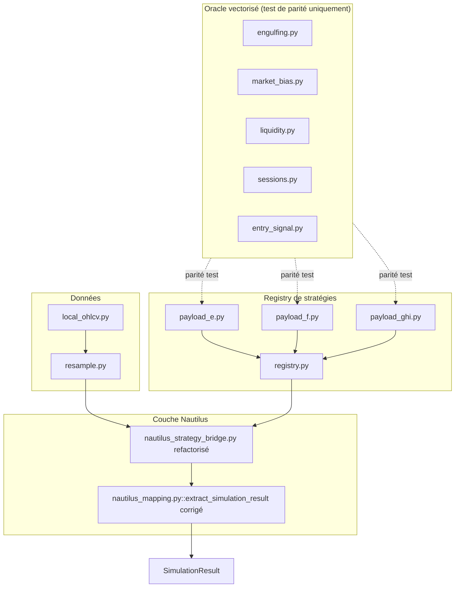
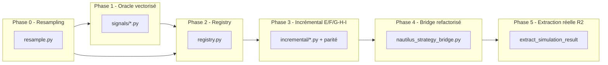

# Plan d'implémentation — R1 (moteur de signaux) + R2 (extraction réelle Nautilus)

## 0. Bandeau de statut (vérifié contre l'état machine réel)

| Question | Réponse |
| --- | --- |
| Un chantier actif couvre-t-il déjà ce périmètre (`DONE`, `ACTIVE`, ou `SUPERSEDED`) ? | Non — `PLAN_IMPLEMENTATION_MOTEUR_BACKTEST_EBTA_NAUTILUS` est `DONE` et fermé. Aucun workstream actif ne couvre R1/R2. |
| Un verrou de gouvernance actif bloque-t-il ce chantier ? | Non — HOOK.md signale « pour toute suite, repartir de `.ai/checkpoint.json` et ouvrir un nouveau workstream ». Le HOOK invite explicitement à ouvrir ce type de chantier. |
| Ce plan a-t-il besoin d'une décision humaine explicite avant d'être routable via `/start` ? | Non — le brouillon original déclare `mainline` et l'humain a déclenché `/start` explicitement. |
| Ce plan remplace-t-il un document ou chantier existant ? | Non — aucun chantier existant ne couvre le moteur de signaux réel ni l'extraction correcte. Complète (ne remplace pas) `PLAN_IMPLEMENTATION_MOTEUR_BACKTEST_EBTA_NAUTILUS`. |

---

## Audit IA de promotion

- [x] Plan relu dans le contexte du cockpit actif (AGENTS.md, .ai/README.md, .ai/checkpoint.json, HOOK.md, tracking.json).
- [x] Bandeau de statut rempli et vérifié contre l'état machine réel, pas supposé.
- [x] Ce plan a été ÉCRIT COMME NOUVEAU FICHIER dans `.ai/backlog/mainline/` ; le brouillon original reste intact dans `0 - HUMAN START HERE/` jusqu'à l'archivage mécanique par `plan.ps1 start`.
- [x] Chantier classé `mainline` : débloque la capacité de recherche réelle (R1+R2 sont les deux mensonges silencieux qui invalident tout backtest actuel).
- [x] Autorités normatives identifiées : `Protocole/` (EBTA-DOC-1.1), SOP 03, 04, 05, 07, 08.
- [x] Périmètre explicite : `strategies/signals/`, `strategies/incremental/`, `strategies/registry.py`, `data/resample.py`, `adapters/nautilus_strategy_bridge.py`, `adapters/nautilus_mapping.py`, `tests/`.
- [x] Aucune modification de `Protocole/`, `procedures/`, `validators/`, `governance/`, `manifests/`.
- [x] Prérequis factuels : logique BACKTRADER lue en lecture seule (done par l'humain le 2026-07-13) ; API Nautilus vérifiée empiriquement sur `nautilus_trader==1.230.0` ; venv disponible.
- [x] État des lieux vérifié : `strategies/signals/` est un dossier vide (aucune duplication de module à risque) ; `GenericPayloadStrategy` stub identifié et documenté comme à remplacer.

## Triage

| Champ | Valeur |
| --- | --- |
| Track | `mainline` |
| Lifecycle | `PLANNED` |
| Scope | Implémenter un moteur de signaux incrémental natif (R1, payloads E→I) + corriger l'extraction réelle des métriques depuis la comptabilité Nautilus (R2), sans modifier les contrats EBTA aval ni ouvrir R4 (données intraday production). |
| Non-goals | Voir section complète ci-dessous (§ Non-goals). |
| Source | Brouillon `0 - HUMAN START HERE/PLAN_R1_R2_SIGNAUX_ET_EXTRACTION_NAUTILUS_2026-07-13.md` ; audit maturité `AUDIT_MATURITE_MOTEUR_RECHERCHE_2026-07-13.md` (constats 1a, 1b) ; décision d'architecture `Mise à jour 2 - 2026-07-13` dans le brouillon. |
| Exit criteria | (1) Payloads E, F, G/H/I incrémentaux : chacun passe son test de parité vert contre l'oracle vectorisé sur un segment réel. (2) `extract_simulation_result` dérive `nav`, `daily_returns`, `daily_exposure`, `positions`, `total_costs` du portfolio/analyzer/rapports Nautilus, plus de reconstruction manuelle. (3) Suite runtime 110+ tests PASS. (4) `validate_package_dir()` PASS après R2. |

## Statut

| Champ | Valeur |
| --- | --- |
| Statut | `NON_DEMARRE` |
| Date de création | 2026-07-13 |
| Date d'activation | - |
| Autorité normative | `Protocole/` frozen as EBTA-DOC-1.1 |
| Autorité exécutable | `Implementation/ebta_engine/` |
| Changement normatif attendu | Aucun |
| Dépendances externes | Logique BACKTRADER (lecture seule, déjà lue) ; `nautilus_trader==1.230.0` (venv disponible) ; `pandas`/`numpy` (présents venv + interpréteur de base) |

---

## 1. Rôle de ce document et non-objectifs

| Élément | Rôle |
| --- | --- |
| `Protocole/` (EBTA-DOC-1.1) | Autorité normative — prime en tout conflit |
| `Implementation/ebta_engine/` | Traduction exécutable de la norme |
| `.ai/checkpoint.json` + `tracking.json` | Cockpit IA — non normatif, ne doit jamais être source de verdict |
| `Implementation/research_packages/nautilus_mvp` | Artefact de preuve final produit par ce chantier |
| Ce plan | Carte d'implémentation : quoi coder, où, pourquoi, dans quel ordre |

Non-objectifs de ce document :
- Ne pas réécrire l'autorité normative du projet.
- Ne pas introduire de règle, seuil ou statut absent du Protocole.
- Ne pas faire de BACKTRADER une dépendance runtime (portage de logique, une fois, lecture seule).
- Ne pas brancher dans `nautilus_research_package.py` (chemin de production) tant que R4 n'est pas résolu.
- Ne pas construire la couche portefeuille/monitoring/déploiement live (couche 5 de l'architecture en 5 niveaux).

---

## 2. Contexte obligatoire à lire avant de coder

1. **`AGENTS.md`** — règles de gouvernance de ce dépôt.
2. **`.ai/README.md`** — cockpit et cycle de vie des chantiers.
3. **`.ai/checkpoint.json`** — état machine courant (tous workstreams DONE, `active_workstream_id: null`).
4. **`Implementation/Active/HOOK.md`** — état courant du runtime (Nautilus MVP clos, instructions de reprise).
5. **`Implementation/ebta_engine/adapters/nautilus_strategy_bridge.py`** — code stub actuel à remplacer par le registry.
6. **`Implementation/ebta_engine/adapters/nautilus_mapping.py::extract_simulation_result`** — bug de reconstruction manuelle identifié (lignes 276-335).
7. **`Implementation/ebta_engine/strategies/payloads.py`** — payloads E–I déjà décrits (stubbés, pas encore de logique).
8. **`Implementation/ebta_engine/strategies/contracts.py`** — contrat `SimulationResult` immuable (ne pas changer sa signature).
9. **`Implementation/adapters/nautilus_env/NAUTILUS_API_NOTES.md`** — API Nautilus vérifiée empiriquement (multi-timeframe, portfolio, analyzer, ts_event).
10. **`D:\TRADING\ENTREPRISE\...\BACKTRADER\features\`** — source de logique validée, lecture seule, portage unique.

**Hiérarchie d'autorité applicable :**

```text
1. Protocole/ (EBTA-DOC-1.1) — norme scientifique
2. procedures/, validators/, governance/ — traduction procédurale de la norme
3. Implementation/ebta_engine/ — code exécutable
4. adapters/ (NautilusTrader) — couche d'exécution, jamais source de verdict
```

---

## 3. Table des gates (points de décision séquentiels)

| Ordre | Gate | Question posée au système | Sortie si échec |
| --- | --- | --- | --- |
| G0 | Suite non-régression | La suite 110+ tests reste-t-elle PASS avant chaque nouvelle phase ? | Bloquer, corriger avant de continuer |
| G1 | Parité oracle E | Le payload E incrémental produit-il les mêmes décisions que l'oracle vectorisé sur un segment réel ? | Bloquer payload F tant que non vert |
| G2 | Parité oracle F | Idem payload F (+ biais MTF) | Bloquer G/H/I |
| G3 | Parité oracle G/H/I | Idem G, H, I (+ filtre de session) | Bloquer R2 |
| G4 | Direction short empruntée | Les ordres SELL apparaissent-ils réellement quand le signal l'impose ? | Bloquer validation production |
| G5 | Anti-fuite segment | Deux runs du même candidat sur barres identiques étiquetées Train vs OOS produisent-ils le même `SimulationResult` ? | NO GO absolu |
| G6 | Extraction R2 | `total_costs > 0` sur candidat avec `maker_fee/taker_fee` non nuls ? Bug post-sortie corrigé (NAV plate) ? | Bloquer `validate_package_dir()` |

---

## 4. Etat des lieux (avant/après) — réutiliser avant de recréer

### Ce qui existe déjà

| Module actuel | Chemin | Rôle réel (vérifié) | Suffisant pour l'objectif ? |
| --- | --- | --- | --- |
| `GenericPayloadStrategy` | `adapters/nautilus_strategy_bridge.py` | Achète au 1er bar, sort après N bars. Aucune règle E–I. | ❌ à remplacer par délégation au registry |
| `extract_simulation_result` | `adapters/nautilus_mapping.py:276` | Reconstruit NAV manuellement (bug post-sortie), `total_costs=0.0` en dur | ❌ à remplacer par portfolio/analyzer |
| `run_segment` | `adapters/nautilus_mapping.py:211` | Orchestre BacktestEngine + appelle extract | ⚠️ garder, adapter pour multi-timeframe |
| `run_multifold_segments` | `adapters/nautilus_mapping.py:338` | Boucle sur segment_inputs | ✅ conserver tel quel |
| `StrategyPayload` | `strategies/payloads.py` | Décrit les payloads E–I (stubbés) | ⚠️ conserver, enrichir `parameters` si nécessaire |
| `SimulationResult` | `strategies/contracts.py` | Contrat EBTA immuable | ✅ ne pas modifier |
| `WalkForwardSplitter` | `data/walk_forward.py` | Découpe folds Train/Test/OOS (SOP 04) | ✅ conserver tel quel |
| `OhlcvBar` + `load_ohlcv_bars` | `data/local_ohlcv.py` | Charge barres 1-minute depuis CSV | ⚠️ 1 seul timeframe/actif — à compléter par `resample.py` |
| `strategies/signals/` | `strategies/signals/` | Dossier vide — aucun module signal | ❌ à créer intégralement |

### Ce qui manque réellement

| Brique manquante | Module à créer | Source de la règle | Ce qui existe et doit être réutilisé |
| --- | --- | --- | --- |
| Oracle vectorisé de l'engulfing | `strategies/signals/engulfing.py` | `BACKTRADER/features/core.py` (lecture seule) | Aucun |
| Oracle vectorisé du biais MTF | `strategies/signals/market_bias.py` | `BACKTRADER/features/core.py` | Aucun |
| Oracle vectorisé des pools de liquidité | `strategies/signals/liquidity.py` | `BACKTRADER/features/core.py` | Aucun |
| Oracle vectorisé filtre de session | `strategies/signals/sessions.py` | `BACKTRADER/features/filters.py` | Aucun |
| Oracle vectorisé signal d'entrée M1→M3 | `strategies/signals/entry_signal.py` | `BACKTRADER/features/entry_signal.py` | Aucun |
| Registry de stratégies | `strategies/registry.py` | Plan brouillon section R1.1 | `StrategyPayload` (payloads.py) |
| Payload E incrémental (state machine) | `strategies/incremental/payload_e.py` | R1.5 étape 1 | Oracle `signals/entry_signal.py` + `signals/liquidity.py` |
| Payload F incrémental (+ biais) | `strategies/incremental/payload_f.py` | R1.5 étape 2 | Payload E + oracle `signals/market_bias.py` |
| Payloads G/H/I incrémentaux (+ session) | `strategies/incremental/payload_ghi.py` | R1.5 étape 3 | Payload F + oracle `signals/sessions.py` |
| Resampling causal multi-timeframe | `data/resample.py` | Plan brouillon R1.2 | `OhlcvBar` (data/local_ohlcv.py) |
| Extraction réelle Nautilus | `adapters/nautilus_mapping.py::extract_simulation_result` (refactoring) | Plan brouillon R2, API vérifiée | `engine.portfolio`, `engine.portfolio.analyzer`, `engine.trader.generate_*_report()` |

---

## 5. Decision d'architecture

**Principe directeur** : la couche stratégie/exécution doit être écrite **une seule fois**, sous forme incrémentale native (état interne, mis à jour barre par barre), pour que le même code serve au backtest de recherche et au live sans réécriture. La couche d'exploration vectorisée (BACKTRADER pipeline existante) reste hors du chemin EBTA/Nautilus.

**Raisons** :
1. **Live-readiness** : un précalcul vectorisé ne peut pas fonctionner en live (pas de futur à précalculer) ; le réécrire serait un doublon.
2. **Séparation de responsabilité** : oracle vectorisé = outil de validation/test de parité, pas de production.
3. **Registry** : ajouter une stratégie = ajouter un fichier, jamais toucher `nautilus_mapping.py`, `nautilus_research_package.py`, `procedures/` ou `governance/`.
4. **R2** : dériver les métriques de la comptabilité réelle de Nautilus (portfolio/analyzer) élimine le bug de reconstruction manuelle et la dépendance à `total_costs=0.0`.



### Frontières explicites

| Couche | Elle fait | Elle NE fait PAS |
| --- | --- | --- |
| `strategies/signals/` (oracle) | Calcul vectorisé batch pour test de parité et exploration | Produire des décisions en production |
| `strategies/incremental/` + `registry.py` | Implémenter la logique E–I barre par barre avec état interne | Accéder au rôle du segment (Train/Test/OOS) |
| `adapters/nautilus_strategy_bridge.py` | Déléguer au registry, souscrire multi-timeframe | Contenir de la logique de pattern |
| `adapters/nautilus_mapping.py::extract_simulation_result` | Lire portfolio/analyzer/rapports Nautilus | Recalculer NAV manuellement |
| `data/resample.py` | Resampling causal (barres closes uniquement) | Accéder à des barres futures |

### Contrat d'interface entre les couches

```python
from typing import Protocol, runtime_checkable

@runtime_checkable
class IncrementalSignalStrategy(Protocol):
    """Interface stable du registry de stratégies."""
    
    def on_bar(self, bar: "Bar") -> None:
        """Met à jour l'état interne barre par barre. Ne décide pas seul."""
        ...
    
    def should_enter(self) -> tuple[bool, "OrderSide | None"]:
        """Retourne (True, side) si la state machine valide une entrée."""
        ...
    
    def should_exit(self, bar_count_since_entry: int) -> bool:
        """True si l'horizon fixe est atteint."""
        ...
```

### Décisions déjà actées

| Décision | Justification |
| --- | --- |
| NAV extraite via `portfolio.equity` snapshot à chaque `on_bar` (Option A de R2.2) | Élimine le bug post-sortie ; fidèle à l'état réel du compte barre par barre |
| Oracle vectorisé conservé dans `strategies/signals/` (pas supprimé) | Réutilisable pour l'exploration hors EBTA/Nautilus (couche 1) + garde-fou parité obligatoire |
| Pas de `cachetools` | Absent du venv et du venv Nautilus ; optimisation de performance non nécessaire pour la correction |
| Registry minimal (interface + dict) | Pas de framework anticipant des besoins non encore exprimés |
| Pas de branchement production (`nautilus_research_package.py`) | Bloqué par R4 (`_daily_sample`) — chantier séparé explicite |

### Structure cible

```text
Implementation/ebta_engine/
  strategies/
    signals/                        # NOUVEAU — oracle vectorisé (port de BACKTRADER)
      __init__.py
      engulfing.py                  # patterns bull/bear 2/3 bougies + pivots
      market_bias.py                # biais MTF H1/H4/D1, anti-lookahead shift(1)/shift(2)
      liquidity.py                  # pools avec expiration expiry_days
      sessions.py                   # DST-aware asia/london/us via pandas/zoneinfo/pytz
      entry_signal.py               # sweep M1 → engulfing M1 → confirmation M3
    incremental/                    # NOUVEAU — implémentations incrémentales state-machine
      __init__.py
      payload_e.py                  # confirmation seule
      payload_f.py                  # + biais MTF
      payload_ghi.py                # + filtre de session
    registry.py                     # NOUVEAU — IncrementalSignalStrategy + dict d'enregistrement
    contracts.py                    # INCHANGÉ
    payloads.py                     # INCHANGÉ
    payload_factory.py              # INCHANGÉ
  data/
    resample.py                     # NOUVEAU — resampling causal OhlcvBar M1→M3/M15/H1/H4/D1
    local_ohlcv.py                  # INCHANGÉ
    walk_forward.py                 # INCHANGÉ
  adapters/
    nautilus_strategy_bridge.py     # MODIFIÉ — délègue au registry, multi-timeframe subscribe
    nautilus_mapping.py             # MODIFIÉ — extract_simulation_result réécrit via portfolio/analyzer
  tests/
    test_signals_engulfing.py       # NOUVEAU
    test_signals_market_bias.py     # NOUVEAU
    test_signals_liquidity.py       # NOUVEAU
    test_signals_sessions.py        # NOUVEAU
    test_signals_entry_signal.py    # NOUVEAU
    test_incremental_parity_e.py    # NOUVEAU — test de parité payload E oracle vs incrémental
    test_incremental_parity_f.py    # NOUVEAU
    test_incremental_parity_ghi.py  # NOUVEAU
    test_r2_extraction.py           # NOUVEAU — NAV plate après sortie, total_costs>0
    test_nautilus_phase4_strategy_costs.py  # MODIFIÉ — recalibré golden-case
    test_nautilus_phase5_run_segment.py     # MODIFIÉ — recalibré sur vraie extraction
    fixtures/nautilus_golden_case/expected_result.py  # MODIFIÉ — recalibré
```

---

## 6. Decoupage en phases

### Phase 0 - Resampling multi-timeframe (`data/resample.py`)

Objectif : fournir le resampling causal M1→M3/M15/H1/H4/D1 nécessaire à la souscription multi-bar-type Nautilus.

Classification : IMPLEMENTATION_DETAIL

Actions :

- Créer `data/resample.py` : `resample_ohlcv(bars: list[OhlcvBar], target_minutes: int) -> list[OhlcvBar]` — agrégation right-closed, barres closes uniquement, sans lookahead.
- **Sémantique de borne** (correction audit) : la barre agrégée couvrant `[t_open, t_close]` utilise toutes les barres M1 dont le timestamp satisfait `t_open < ts <= t_close`. La borne inférieure est exclue, la borne supérieure est incluse (`t_close` = timestamp de la barre agrégée dans la série EBTA). Cette sémantique est identique à `pd.Grouper(freq='...')` avec `closed='right'`.
- Invariant : une barre agrégée à `t` ne contient jamais de barre M1 dont le timestamp `> t` (causalité stricte).
- Écrire `tests/test_resample.py` : vérifier alignement des timestamps, conservation du volume, monotonie, et que la borne supérieure est bien incluse (pas exclusive).

Livrables :

- `Implementation/ebta_engine/data/resample.py`
- `Implementation/ebta_engine/tests/test_resample.py`

Critère de sortie :

- `python -m unittest discover -s Implementation\ebta_engine\tests -t Implementation -p test_resample.py` → PASS
- Suite non-régression globale PASS.

---

### Phase 1 - Oracle vectorisé — port de la logique BACKTRADER

Objectif : porter fidèlement les modules de détection depuis la source BACKTRADER (lecture seule, une fois) comme oracle de parité testable sans Nautilus.

Classification : IMPLEMENTATION_DETAIL

Actions :

- Créer `strategies/signals/__init__.py`.
- `engulfing.py` : `detect_engulfing(df: pd.DataFrame) -> pd.Series[bool]` — patterns bull/bear 2/3 bougies + pivots.
- `market_bias.py` : `compute_market_bias(df: pd.DataFrame, tf_minutes: int) -> pd.Series[int]` — biais MTF H1/H4/D1, `shift(1)` anti-lookahead.
- `liquidity.py` : `compute_liquidity_pools(df: pd.DataFrame, expiry_days: int) -> pd.Series[list]` — pools avec expiration.
- `sessions.py` : `filter_session(df: pd.DataFrame, session: str, tz: str) -> pd.Series[bool]` — DST-aware via `pandas`/`zoneinfo`.
- `entry_signal.py` : `compute_entry_signals(bars_m1: pd.DataFrame, bars_m3: pd.DataFrame, pools_m15: pd.Series, ...) -> pd.Series[int]` — sweep M1 → engulfing M1 → confirmation M3, garde anti-signal-simultané BUY+SELL.
- Tests unitaires de chaque module sur données synthétiques.

Livrables :

- 5 modules `strategies/signals/*.py`
- 5 fichiers `tests/test_signals_*.py`

Critère de sortie :

- Tous les tests `test_signals_*.py` PASS sans Nautilus.
- Suite non-régression globale PASS.

---

### Phase 2 - Registry de stratégies (`strategies/registry.py`)

Objectif : définir le contrat `IncrementalSignalStrategy` et le dict d'enregistrement qui permettent d'ajouter une stratégie sans toucher le bridge Nautilus.

Classification : IMPLEMENTATION_DETAIL

Actions :

- Créer `strategies/registry.py` avec `IncrementalSignalStrategy` (Protocol) + `STRATEGY_REGISTRY: dict[str, type[IncrementalSignalStrategy]]` + `get_strategy(payload_code: str) -> type[IncrementalSignalStrategy]`.
- Ajouter `tests/test_registry.py` : vérifier que le registry lève `KeyError` sur code inconnu, retourne le bon type pour E/F/G/H/I (une fois ces classes créées), et que `get_strategy` fonctionne avant Phase 3.

Livrables :

- `Implementation/ebta_engine/strategies/registry.py`
- `Implementation/ebta_engine/tests/test_registry.py`

Critère de sortie :

- `test_registry.py` PASS (avec des stubs pour E/F/G/H/I jusqu'en Phase 3).
- Suite non-régression globale PASS.

---

### Phase 3 - Implémentations incrémentales (payloads E, F, G/H/I)

Objectif : implémenter les state machines incrémentales pour les payloads E, F, G/H/I et les enregistrer dans le registry, en garantissant la parité oracle via tests mécaniques.

Classification : IMPLEMENTATION_DETAIL

Actions :

- **Payload E** : `strategies/incremental/payload_e.py` — état M1 (engulfing, 2-3 dernières bougies) + pool de liquidité M15 (petite liste avec expiration) + state machine sweep→engulfing→confirmation M3. Enregistrer dans `STRATEGY_REGISTRY["E"]`.
- **Test de parité E** : `tests/test_incremental_parity_e.py` — charger un segment réel de 2+ jours de barres M1, exécuter oracle vectorisé + incrémental sur le même segment, vérifier barre par barre que les décisions coïncident (mêmes timestamps de sweep/engulfing/confirmation/signal final). Si données M1 absentes de `DEFAULT_DATA_ROOT`, le test se marque `SKIP` avec un message explicite (pas `FAIL` — caveat CI documenté).
- **Payload F** : ajoute état de biais MTF (mis à jour uniquement sur barres H1/H4/D1). Parité oracle F.
- **Payloads G/H/I** : filtre de session depuis timestamp de la barre courante (pas d'état supplémentaire). Parité oracle G/H/I.
- **Protocole warm-up** (correction audit) : `run_segment()` reçoit `warmup_bars` (liste d'`OhlcvBar`) concaténés en tête des barres de segment. La `GenericPayloadStrategyConfig` expose `warmup_bar_count: int`. Dans `on_bar()`, la Strategy ignore les ordres (`return` sans `submit_order`) pendant les `warmup_bar_count` premières barres — le warm-up initialise l'état interne sans produire de trades. Test explicite : un pool né avant le début du warm-up doit être visible à la première barre active ; un état froid (zéro barres de warm-up) doit manquer ce pool.
- **Test anti-fuite** : deux exécutions du même candidat sur barres identiques étiquetées Train vs OOS produisent le même `SimulationResult` (R1.10).
- Vérifier que la direction short (`OrderSide.SELL`) est bien soumise quand le signal l'exige.

Livrables :

- `strategies/incremental/payload_e.py`, `payload_f.py`, `payload_ghi.py`
- `strategies/incremental/__init__.py`
- `tests/test_incremental_parity_e.py`, `test_incremental_parity_f.py`, `test_incremental_parity_ghi.py`

Critère de sortie :

- Parité oracle vert pour E, F, G/H/I sur segment réel (pas une fixture jouet) — ou SKIP explicite si données absentes.
- Payloads E, F, G/H/I produisent des séries de décisions différentes entre eux sur le même segment.
- Direction short réellement empruntée par test.
- Test warm-up vert (R1.7) : pool né avant le warm-up visible, état froid manque ce pool.
- Test anti-fuite vert (R1.10).
- Suite non-régression globale PASS.

---

### Phase 4 - Refactoring `nautilus_strategy_bridge.py`

Objectif : faire de `GenericPayloadStrategy` un délégateur au registry (multi-timeframe subscribe, pas de logique de pattern en dur).

Classification : ADAPTER_MAPPING

Actions :

- **OCP — timeframes configurables** (correction audit) : `GenericPayloadStrategyConfig` expose `bar_types: list[str]` (liste de chaînes au format `bar_type_string(...)` — par défaut `[M1, M3, M15, H1, H4, D1]`). `on_start()` itère sur `self.config.bar_types` et appelle `subscribe_bars()` pour chacun. Ajouter un timeframe = modifier uniquement la config, jamais `on_start()`.
- `on_bar(bar)` : discriminer par `bar.bar_type`, router vers l'instance de la strategy incrémentale récupérée depuis le registry. Déléguer à `strategy.should_enter()` / `strategy.should_exit()`. Ne contient plus de logique de pattern.
- **NAV snapshots pour R2** (correction audit P1+P2) : la Strategy maintient `self._nav_snapshots: list[tuple[int, float, float]]` (ts_event_nanos, equity, net_exposure) mis à jour **uniquement lors des barres M1** (timeframe de référence, discriminé par `bar.bar_type`) via `self.portfolio.account(self._venue).balance_total(currency)` où `self._venue` est dérivé de `config.instrument_id.venue` à l'init. Mettre à jour à chaque appel `on_bar` M3/M15/H1/H4/D1 produirait 6× plus de points que prévu — uniquement M1. `extract_simulation_result` accède à cette liste via `engine.trader.strategies[0]._nav_snapshots` — attribut explicitement nommé et documenté.
- **Garde incompatibilité M1/production** (correction audit) : si après `warmup_bar_count` barres aucune barre M1 n'a été reçue, `on_bar()` émet `logging.warning("[EBTA] No M1 bar received after warm-up — strategy is in NO_SIGNAL mode")` et enregistre `{"no_m1_signal": True}` dans les métadonnées du résultat. Cette incompatibilité (`_daily_sample` en production) est ainsi visible et tracée, pas silencieuse.
- **Skip golden-case pendant Phase 4–5** (correction audit) : décorer `test_nautilus_phase2_golden_case.py` avec `@unittest.skip("Recalibration R2 Phase 5 en cours")` au début de Phase 4 ; retirer le skip après recalibration Phase 5.
- **Test direction short** (correction audit) : test explicite — soumettre un `OrderSide.SELL` sur le compte MARGIN/HEDGING configuré et vérifier que la position short apparaît dans `generate_positions_report()`. Confirme que le compte autorise bien le short.
- Un test d'intégration : exécuter au moins un segment réel (2+ jours M1) via `run_segment()` / Nautilus et vérifier que les ordres reflètent les décisions de la state machine (pas un achat systématique au premier bar). **Note d'implémentation** (correction audit P2) : `run_segment()` devra appeler `map_ohlcv_to_bars()` pour chaque timeframe (M1, M3, M15, H1, H4, D1) via `resample_ohlcv()`, puis `eng.add_data()` pour chaque série. Nautilus ne fait pas lui-même le resampling — c'est EBTA qui fournit des barres préagrégées pour chaque `BarType`.

Livrables :

- `adapters/nautilus_strategy_bridge.py` refactorisé
- `tests/test_nautilus_phase4_strategy_costs.py` mis à jour
- Test d'intégration + test direction short

Critère de sortie :

- Plus aucun `OrderSide.BUY` en dur dans `on_bar()`.
- Test direction short vert : position short dans `generate_positions_report()`.
- Test d'intégration : ordres reflètent les décisions de la state machine.
- Attribut `_nav_snapshots` présent et documenté dans la Strategy.
- Suite non-régression globale PASS (golden-case skippé explicitement).

---

### Phase 5 - Extraction réelle Nautilus (`extract_simulation_result` — R2)

Objectif : dériver `nav`, `daily_returns`, `daily_exposure`, `positions`, `total_costs` depuis la comptabilité réelle de Nautilus (portfolio/analyzer/rapports), éliminer le bug de reconstruction manuelle.

Classification : ADAPTER_MAPPING

Actions :

- **Décomposition SRP** (correction audit) : `extract_simulation_result` est divisée en 3 fonctions privées claires :
  - `_extract_nav_series(strategy) -> list[tuple[str, float, float]]` : lit `strategy._nav_snapshots`, convertit `ts_event_nanos` en timestamp ISO via `unix_nanos_to_dt()`, retourne `(timestamp, equity, net_exposure)` par barre.
  - `_extract_costs(fills_report) -> float` : somme la colonne `commission` du rapport de fills.
  - `_extract_positions(positions_report) -> list[dict]` : construit la liste EBTA depuis les lignes du rapport.
  - `extract_simulation_result` orchestre ces 3 fonctions + construit `SimulationResult`.
- **Option A** (confirmée) : `nav` = série `equity` issue de `_nav_snapshots`; `daily_exposure` = `net_exposure`/`equity`; `daily_returns` = variations relatives de `nav`. Élimine le bug post-sortie (la NAV reflète l'état réel, plat après clôture).
- **Cas NO_MODEL** (correction audit) : dériver depuis `portfolio.is_flat` ET rapport de fills vide ET `len(strategy._nav_snapshots) == 0`. Attention : `portfolio.is_flat` peut être `True` après annulation d'ordres partiels — vérifier également que `generate_order_fills_report()` est vide avant de retourner `_flat_simulation_result`. Tester ce cas-limite avec un scénario synthétique (ordre soumis puis annulé).
- `total_costs` = somme commissions réelles depuis `generate_order_fills_report()`.
- `positions` depuis `generate_positions_report()` (multi-positions, entry/exit/realized PnL réels).
- Test bug post-sortie : après clôture, NAV plate (test).
- Test `total_costs > 0` : candidat qui trade avec `maker_fee/taker_fee` non nuls.
- Retirer le `@skip` de `test_nautilus_phase2_golden_case.py`, recalibrer `tests/fixtures/nautilus_golden_case/expected_result.py` sur la vraie sortie (le `result_hash` changera — attendu et sain).
- Documenter la bascule dans `NAUTILUS_API_NOTES.md`.

Livrables :

- `adapters/nautilus_mapping.py::extract_simulation_result` réécrit
- `tests/test_r2_extraction.py`
- `tests/fixtures/nautilus_golden_case/expected_result.py` recalibré
- `NAUTILUS_API_NOTES.md` mise à jour

Critère de sortie :

- Bug post-sortie éliminé : NAV plate après clôture (test vert).
- `total_costs > 0` sur candidat qui trade (test vert).
- Golden-case recalibré.
- `validate_package_dir()` PASS.
- Suite non-régression globale PASS.

---

### Chemin critique (ordre des phases)



---

## 7. Artefacts produits

| Phase | Fichier/sortie | Format | Règle source |
| --- | --- | --- | --- |
| P0 | `data/resample.py` | Python | Plan brouillon R1.2 |
| P1 | `strategies/signals/*.py` (5 fichiers) | Python | BACKTRADER features (lecture seule) |
| P2 | `strategies/registry.py` | Python | Plan brouillon R1.1 |
| P3 | `strategies/incremental/*.py` (3 fichiers) | Python | Plan brouillon R1.5 |
| P4 | `adapters/nautilus_strategy_bridge.py` | Python | Plan brouillon R1.3/R1.4 |
| P5 | `adapters/nautilus_mapping.py` (extract réécrit) | Python | Plan brouillon R2 |
| P5 | `tests/fixtures/nautilus_golden_case/expected_result.py` | Python | R2.5 |
| P5 | `NAUTILUS_API_NOTES.md` (update) | Markdown | R2.3 note de calibration |

---

## 8. Invariants absolus et NO GO

### Invariants (non négociables)

1. La Strategy ne reçoit jamais le `fold_id` ou le rôle de segment — seulement des barres.
2. L'oracle vectorisé ne produit jamais de décisions en production (test de parité uniquement).
3. Aucun import de `nautilus_trader` en dehors de `adapters/` et `nautilus_env/`.
4. Le contrat `SimulationResult` ne change pas de signature.
5. Une barre agrégée par `resample.py` ne contient que des barres M1 dont le timestamp `<= t` (causalité stricte).
6. La suite non-régression reste PASS avant de démarrer chaque phase.

### NO GO (interdictions opérationnelles)

- Copier BACKTRADER comme dépendance runtime (portage de logique une fois, lecture seule).
- Modifier `Protocole/`, `procedures/`, `validators/`, `governance/`, `manifests/`.
- Brancher dans `nautilus_research_package.py` le moteur de signal avant que R4 (`_daily_sample`) soit résolu.
- Modifier le contrat `SimulationResult` (champs, types, sémantique).
- Ajouter `cachetools` ou toute nouvelle dépendance non déjà présente dans le venv.
- Utiliser `total_costs=0.0` en dur après R2.
- Sauter le test de parité oracle pour un payload (gate G1–G3 bloquant).

---

## 9. Verification a chaque etape

```powershell
# Suite non-régression — doit rester PASS avant chaque phase
python -m unittest discover -s Implementation\ebta_engine\tests -t Implementation

# Phase 0 — resampling
python -m unittest discover -s Implementation\ebta_engine\tests -t Implementation -p test_resample.py

# Phase 1 — oracle vectorisé
python -m unittest discover -s Implementation\ebta_engine\tests -t Implementation -p "test_signals_*.py"

# Phase 2 — registry
python -m unittest discover -s Implementation\ebta_engine\tests -t Implementation -p test_registry.py

# Phase 3 — parités incrémentales
python -m unittest discover -s Implementation\ebta_engine\tests -t Implementation -p "test_incremental_parity_*.py"

# Phase 4 — bridge refactorisé
python -m unittest discover -s Implementation\ebta_engine\tests -t Implementation -p test_nautilus_phase4_strategy_costs.py
python -m unittest discover -s Implementation\ebta_engine\tests -t Implementation -p test_nautilus_phase5_run_segment.py

# Phase 5 — extraction réelle R2
python -m unittest discover -s Implementation\ebta_engine\tests -t Implementation -p test_r2_extraction.py
python -c "from pathlib import Path; from ebta_engine.validators.package_validator import validate_package_dir; print(validate_package_dir(Path('Implementation/research_packages/nautilus_mvp'))['status'])"
```

**Notes de portabilité :**
- Les tests de parité oracle nécessitent de vraies données M1 intraday dans `DEFAULT_DATA_ROOT` — si absentes, ces tests doivent signaler `SKIP` (pas `FAIL`) avec un message explicite.
- Le `result_hash` du golden-case changera après R2 — documenter dans `NAUTILUS_API_NOTES.md`, ne pas traiter comme une régression.

**Premier lot exécutable proposé :**

```text
Phase 0 — Resampling multi-timeframe (data/resample.py + tests)
```

---

## 10. Journal des decisions humaines (autorisations)

| Date | Décision | Portée |
| --- | --- | --- |
| 2026-07-13 | Lancement `/start` sur le brouillon `PLAN_R1_R2_SIGNAUX_ET_EXTRACTION_NAUTILUS_2026-07-13.md` | Autorise l'implémentation R1 + R2 dans le périmètre défini par le plan |
| 2026-07-13 | Architecture incrémentale native retenue (Mise à jour 2 du brouillon) | Invalide le pattern « signal replay » ; impose la state machine barre par barre |
| 2026-07-13 | Branchement production (`nautilus_research_package.py`) explicitement différé | Bloqué tant que R4 (`_daily_sample`) n'est pas résolu — chantier séparé |
| 2026-07-13 | Lecture en lecture seule de BACKTRADER effectuée par l'humain | Portage de logique autorisé (une fois) ; pas d'import runtime |

---

## 11. Risques et blocages connus

| Risque | Impact | Mitigation / condition de déblocage |
| --- | --- | --- |
| Divergence silencieuse du portage incrémental (off-by-one, sémantique `reindex`/`ffill`) | Résultats incorrects non détectés | Test de parité oracle obligatoire (gate G1–G3) ; permanent dans la suite |
| Continuité des pools de liquidité et du biais entre folds (warm-up froid) | Fidélité au comportement validé de la source brisée | Test warm-up explicite (R1.7) |
| Changement de hash golden-case | Fausse alarme de régression | Documenter dans `NAUTILUS_API_NOTES.md` avant recalibrage |
| Performances sous-optimales (`subprocess`-par-segment) avec vraies données intraday | Impact R4 — pas R1/R2 | Anticiper, ne pas bloquer R1/R2 |
| Données M1 absentes de `DEFAULT_DATA_ROOT` pour tests de parité | Tests de parité impossibles à exécuter | Tests doivent signaler `SKIP` avec message explicite, pas `FAIL` |
| Sur-ingénierie du registry | Framework inutile | Registry reste : une interface, un dict, un point d'entrée `get_strategy()` |
| Fuite de segment dans la Strategy incrémentale | Invalidation méthodologique EBTA | Test anti-fuite obligatoire (gate G5, NO GO absolu) |

---

## 12. Definition of Done

- [ ] Phases 0–5 validées individuellement (section 9).
- [ ] Exit criteria du Triage atteints et vérifiables.
- [ ] Aucune modification hors périmètre (Protocole, procedures, validators, governance, manifests, contracts.py).
- [ ] Aucune régression sur la suite de tests existante (110+ tests PASS).
- [ ] Golden-case recalibré et documenté dans `NAUTILUS_API_NOTES.md`.
- [ ] Checklist post-modification exécutée (fichiers modifiés, fichiers volontairement non modifiés, décisions humaines restantes).
- [ ] `validate_package_dir()` PASS après Phase 5.

---

## 13. Clôture

À remplir au moment de `/close`.

| Champ | Valeur |
| --- | --- |
| Résultat final | - |
| Écarts par rapport au plan initial | - |
| Suites à prévoir | R4 (retrait `_daily_sample`, vraies données intraday), R3 (gates dérivés de `_write_reports`), R6 (robustesse stressée), R7 (hygiène reproductibilité) |

---

## 14. Journal d'audits post-hoc

| Date de l'audit | Ce qui a été corrigé | Pourquoi |
| --- | --- | --- |
| 2026-07-13 | Passage 1 `/evaluate` — 7 corrections appliquées : (1) sémantique right-closed de `resample.py` ; (2) protocole warm-up explicite dans Phase 3 ; (3) `bar_types` configurables (OCP) ; (4) attribut `_nav_snapshots` nommé explicitement (SRP) ; (5) garde incompatibilité M1/`_daily_sample` visible ; (6) skip temporaire golden-case documenté ; (7) test direction short + cas-limite NO_MODEL | Audit code-architecture-evaluator : angles morts 1–5, violations OCP/SRP |
| 2026-07-13 | Passage 2 `/evaluate` — 3 corrections résiduelles : (1) `_nav_snapshots` mis à jour uniquement sur barres M1 (pas 6× les timeframes) ; (2) `run_segment()` doit appeler `map_ohlcv_to_bars()` pour chaque timeframe avant `eng.add_data()` (Nautilus ne resamble pas) ; (3) `self._venue` dérivé de `config.instrument_id.venue` pour l'accès `portfolio.account()` dans la Strategy | Audit P2 : ambiguités de couplage, ordre d'injection multi-BarType dans Nautilus, dimension temporelle des snapshots |
