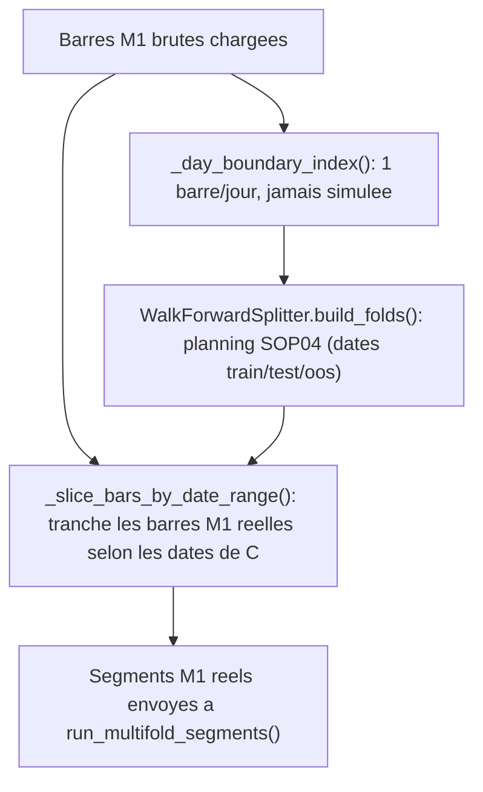
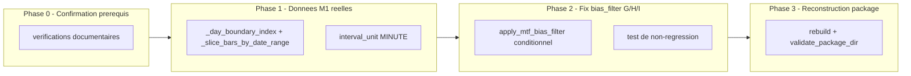

# Plan d'implementation — R4 : donnees intraday reelles et correction du candidate space de production

---

## 0. Bandeau de statut (a verifier avant toute promotion)

| Question | Reponse |
| --- | --- |
| Un chantier actif couvre-t-il deja ce perimetre (`DONE`, `ACTIVE`, ou `SUPERSEDED`) ? | Non. `PLAN_R1_R2_SIGNAUX_ET_EXTRACTION_NAUTILUS` (`DONE`, 2026-07-13) a construit le moteur de signaux incremental mais a explicitement exclu R4 de son perimetre (Non-goal : "Ne pas brancher dans `nautilus_research_package.py` ... tant que R4 n'est pas resolu"). `.ai/checkpoint.json::active_workstream_id` est `null`. |
| Un verrou de gouvernance actif bloque-t-il ce chantier (ex. "ne pas etendre au-dela du MVP tant que X") ? | Non identifie. Aucun risque `CONTROLLED`/`OPEN` dans `.ai/checkpoint.json::risks` ne mentionne R4 ou `nautilus_research_package.py` comme verrouille. |
| Ce plan a-t-il besoin d'une decision humaine explicite pour lever ce verrou avant d'etre routable via `/start` ? | Non — aucun verrou trouve. Deux decisions de perimetre (pas de verrou de gouvernance) ont ete tranchees par l'humain pendant l'audit (voir section 10). |
| Ce plan remplace-t-il un document ou chantier existant ? | Non. Il ouvre le chantier de suite explicitement annonce par `PLAN_R1_R2_SIGNAUX_ET_EXTRACTION_NAUTILUS.md` section 13 ("Suites a prevoir : R4"). |

---

## Audit IA de promotion

- [x] Plan relu dans le contexte du cockpit actif (`AGENTS.md`, `.ai/checkpoint.json`, `Implementation/Active/HOOK.md`, `Implementation/Active/tracking.json`).
- [x] Bandeau de statut (section 0) rempli et verifie contre l'etat machine reel.
- [x] Ce plan a ete ECRIT COMME NOUVEAU FICHIER dans `.ai/backlog/mainline/` ; le brouillon original reste intact dans `0 - HUMAN START HERE/` jusqu'a l'archivage mecanique par `plan.ps1 start`.
- [x] Chantier classe `mainline` — c'est la suite directe, sur le meme fichier de production, du chantier mainline `PLAN_R1_R2_SIGNAUX_ET_EXTRACTION_NAUTILUS`.
- [x] Autorite normative applicable identifiee : `Protocole/` (SOP 04 walk-forward, SOP 08 gate economique) prime ; `Implementation/ebta_engine/` est la traduction executable ; ce plan ne modifie aucune regle protocolaire.
- [x] Perimetre de fichiers/dossiers autorises et interdits explicite (section 5, "Perimetre de fichiers explicite").
- [x] Aucune modification hors perimetre requise pour activer le chantier.
- [x] Prerequis factuels verifies : donnees M1 reelles presentes sur disque pour XAUUSD et NASDAQ (`D:\TRADING\ENTREPRISE\0 - Phase de lancement\Stratégie de trading\0 - Backtest\Data\{XAUUSD 1m,NASDAQ 1m}`, fichiers mensuels 2020-01 a 2025-12, format `timestamp,open,high,low,close,volume`).
- [x] Etat des lieux (section 4) verifie directement dans le code (pas suppose) pour eviter de dupliquer une brique deja existante — la brique de mapping multi-timeframe Nautilus (`_map_multitimeframe_bars`) et le resampler causal (`resample_ohlcv`) existent deja et sont deja testes ; ce plan les reutilise, il ne les recree pas.

## Triage

| Champ | Valeur |
| --- | --- |
| Track | `mainline` |
| Lifecycle | `TRIAGED` |
| Scope | Faire consommer au chemin de production (`package_builder/nautilus_research_package.py`) de vraies donnees M1 (au lieu d'une barre/jour) et corriger un bug de contrat trouve en audit qui fait que les candidats G/H/I ignorent le reglage `bias_filter="none"` du candidate space. |
| Non-goals | Pas de changement `Protocole/` ; pas de changement de signature de `WalkForwardSplitter` (SOP 04) ; pas de changement des seuils du gate economique (SOP 08) ; pas de migration du candidate space vers les codes E/F/G/H/I purs (decision humaine : garder `bias_filter`/`session`) ; pas d'extension de la fenetre de donnees au-dela des 10 jours actuels (decision humaine) ; pas de branchement de `warmup_bars` inter-fold (caveat documente, section 9) ; pas d'optimisation semantique du runner Nautilus. Ecart controle en execution : parallelisme `subprocess` limite a 4 workers pour rendre la validation R4 praticable apres timeout de 70 minutes, sans changer les entrees/sorties de simulation. |
| Source | Brouillon humain `0 - HUMAN START HERE/PLAN_R4_DONNEES_INTRADAY_REELLES_PACKAGE_PRODUCTION.md` (deja routé vers l'archive par `plan.ps1 start`) ; audit de code realise en session (2026-07-14) confirmant les deux constats du brouillon et decouvrant un troisieme (heritage force du filtre de biais dans G/H/I) ; deux decisions humaines actees en session (section 10). |
| Exit criteria | (1) `nautilus_research_package.py` ne reduit plus les barres M1 a une barre/jour avant simulation — les segments train/test/OOS recoivent la resolution M1 reelle ; (2) `PayloadGStrategy`/`H`/`I` respectent `bias_filter="none"` (n'appliquent plus le filtre directionnel dans ce cas) ; (3) `python -m unittest discover -s Implementation\ebta_engine\tests -t Implementation` reste `PASS` ; (4) `Implementation/research_packages/nautilus_mvp` regenere via le venv Nautilus reste `status: PASS` sous `validate_package_dir()` ; (5) au moins un ordre reel est genere par au moins un segment (`execution.json`/metadonnees `total_orders > 0` pour au moins un candidat) — preuve que le `PASS` ne masque plus une strategie inerte a zero trade (voir constat critique, section 4). |

## Statut

| Champ | Valeur |
| --- | --- |
| Statut | `NON_DEMARRE` |
| Date de creation | 2026-07-14 |
| Date d'activation | - |
| Autorite normative | `Protocole/` (SOP 04, SOP 08) — gele en `EBTA-DOC-1.1`, non modifie par ce plan |
| Autorite executable | `Implementation/ebta_engine/` |
| Changement normatif attendu | Aucun |
| Dependances externes | Donnees CSV locales M1 deja presentes (verifiees en audit) ; venv Nautilus deja installe (`Implementation/adapters/nautilus_env/venv`, `nautilus_trader==1.230.0`) |

---

## 1. Role de ce document et non-objectifs

| Element | Role |
| --- | --- |
| `Protocole/` (SOP 04, SOP 08) | Prime en cas de conflit — ce plan ne touche a aucune regle de ces SOP, seulement a leur cablage de production |
| `Implementation/ebta_engine/` | Traduction executable de la norme |
| `Implementation/Active/` (hook/tracking) | Cockpit micro d'orchestration, non normatif |
| `Implementation/research_packages/nautilus_mvp` | Artefact de preuve final : research_package reconstruit, `status: PASS`, sur donnees M1 reelles |
| Ce plan | Carte d'implementation : quoi corriger, ou, pourquoi, dans quel ordre |

Non-objectifs :

- ne pas reecrire `Protocole/` ni les SOP 04/08 ;
- ne pas introduire de regle, seuil ou statut de gate absent de ces SOP ;
- ne pas faire de `_subprocess_segment_runner` une dependance runtime differente (aucun changement de mecanisme d'execution) ;
- ne pas changer la semantique d'execution Nautilus ; le parallelisme `subprocess`
  limite ajoute en execution ne change que l'ordonnancement des segments
  independants et conserve l'ordre des resultats retournes ;
- ne pas migrer le schema de candidate space `bias_filter`/`session` vers les codes E/F/G/H/I directs (decision humaine explicite, section 10) ;
- ne pas etendre la fenetre de donnees de production au-dela de 10 jours (decision humaine explicite, section 10) ;
- ne pas cabler `warmup_bars` entre folds dans ce chantier (documente comme caveat, pas comme defaut a corriger ici).

---

## 2. Contexte obligatoire a lire avant de coder

1. `AGENTS.md` — ordre de lecture et regles d'operation du depot.
2. `.ai/checkpoint.json` — etat machine courant, workstreams clotures pertinents (`PLAN_R1_R2_SIGNAUX_ET_EXTRACTION_NAUTILUS`).
3. `.ai/archive/20260713_PLAN_R1_R2_SIGNAUX_ET_EXTRACTION_NAUTILUS.md` — plan qui a construit le moteur de signaux incremental (`strategies/registry.py`, `strategies/incremental/`, `strategies/signals/`, `data/resample.py`) et a explicitement differe R4.
4. `Implementation/ebta_engine/package_builder/nautilus_research_package.py` — le chemin de production concerne par ce plan.
5. `Implementation/ebta_engine/adapters/nautilus_mapping.py` (fonctions `_map_multitimeframe_bars`, `run_segment`, `run_multifold_segments`) — deja capable de consommer du M1 reel et de generer la cascade M1/M3/M15/H1/H4/D1, mais jamais invoquee en mode M1 depuis la production (voir section 4).
6. `Implementation/ebta_engine/adapters/nautilus_strategy_bridge.py` (fonction `_registry_code`) — logique de routage `bias_filter`/`session` vers les codes de registry E/F/G/H/I.
7. `Implementation/ebta_engine/strategies/incremental/payload_f.py` et `payload_ghi.py` — implementations concernees par le bug de bias_filter (section 4).
8. `Implementation/ebta_engine/data/walk_forward.py` (`WalkForwardSplitter`) — contrat SOP 04 a ne pas modifier, seulement a reutiliser differemment (section 5).

**Hierarchie d'autorite applicable a ce chantier** :

```text
1. Protocole/MANIFESTE DE GEL EBTA.md
2. Protocole/PROTOCOLE EBTA.md
3. Protocole/REGISTRE DES DECISIONS NORMATIVES EBTA.md
4. SOP 04 (walk-forward), SOP 08 (gate economique)
5. Implementation/ebta_engine/ (traduction executable)
6. NautilusTrader (adaptateur, confine a adapters/)
```

Regle : si le code contredit `Protocole/`, c'est le code qui a tort. Ce plan ne modifie aucune regle de `Protocole/` — uniquement le cablage de donnees et un bug de contrat dans `Implementation/`.

---

## 3. Table des gates

Ce chantier ne modifie aucun gate (WRC, OOS, gate economique, G-BIAS). Il modifie la donnee qui alimente le pipeline en amont de ces gates. L'ordre et le comportement des gates existants doivent rester strictement inchanges — la verification (section 9) inclut la reconstruction complete du `research_package` et sa validation via `validate_package_dir()`, qui exerce tous les gates existants sans en modifier aucun.

---

## 4. Etat des lieux (avant/apres) — reutiliser avant de recreer

### Ce qui existe deja

| Module actuel | Chemin | Role reel (verifie, pas suppose) | Suffisant pour l'objectif ? |
| --- | --- | --- | --- |
| Chargeur CSV M1 | `Implementation/ebta_engine/data/local_ohlcv.py::load_ohlcv_bars` | Charge deja les barres M1 reelles depuis `DEFAULT_DATA_ROOT` (`XAUUSD 1m`, `NASDAQ 1m`) | ✅ suffisant, deja utilise |
| Reduction quotidienne | `nautilus_research_package.py::_daily_sample` | Reduit chaque jour a sa premiere barre M1 avant de construire les folds — c'est la cause du probleme, pas une brique a reutiliser telle quelle | ⚠️ a repurposer : garder uniquement comme index de bornes de jour pour le splitter, jamais comme donnee de trading |
| Construction des folds | `Implementation/ebta_engine/data/walk_forward.py::WalkForwardSplitter.build_folds` | Tranche une liste de barres par position et produit un planning SOP 04 valide (train/test/oos, purge, embargo) — generique, ne suppose aucune granularite | ✅ suffisant, contrat a ne pas toucher — seulement a alimenter avec un index de jours plutot que la donnee reelle |
| Resampling causal | `Implementation/ebta_engine/data/resample.py::resample_ohlcv` | Deja teste (Phase R1/R2), agrege M1 vers M3/M15/H1/H4/D1 sans lookahead (bucket right-closed) | ✅ suffisant, deja invoque par `_map_multitimeframe_bars` |
| Mapping multi-timeframe Nautilus | `Implementation/ebta_engine/adapters/nautilus_mapping.py::_map_multitimeframe_bars` | Genere la cascade M1/M3/M15/H1/H4/D1 **uniquement si** les barres source sont declarees `interval_value=1, interval_unit="MINUTE"` (sinon prend la branche `else` a une seule serie) | ✅ suffisant — jamais invoque en mode M1 par la production car `nautilus_research_package.py` declare `"interval_unit": "DAY"` en dur |
| Bridge de strategie generique | `Implementation/ebta_engine/adapters/nautilus_strategy_bridge.py::GenericPayloadStrategy` | Consomme deja `bar_types` multiples, delegue a `IncrementalSignalStrategy.on_bar()` par code de registry via `_registry_code()` | ✅ suffisant, aucune modification requise |
| Payloads E/F | `Implementation/ebta_engine/strategies/incremental/payload_e.py`, `payload_f.py` | E = sans filtre ; F = `PayloadEStrategy` + filtre MTF directionnel toujours applique (coherent, car `payload_by_code("F")` fixe toujours `bias_filter="directional_mtf_bias"`) | ✅ suffisant, aucune modification requise |
| Payloads G/H/I | `Implementation/ebta_engine/strategies/incremental/payload_ghi.py` | Heritent de `PayloadFStrategy` : filtre directionnel **toujours** applique, meme si le payload recu porte `bias_filter="none"` — decouvert en audit, non couvert par `test_incremental_parity_ghi.py` (qui ne teste G/H/I qu'avec `bias_filter="directional_mtf_bias"` via `payload_by_code`) | ❌ a corriger — l'axe `bias_filter` doit etre respecte independamment de l'axe `session` |

### Constat critique verifie en audit (renforce l'urgence du chantier)

Avec `"interval_unit": "DAY"` code en dur, `timeframe_from_bar()`
(`strategies/incremental/payload_e.py`) classe chaque barre recue comme
`"D1"`. Or `PayloadEStrategy.on_bar()` (ligne 44) contient `if timeframe !=
"M1": return` — la mise a jour d'etat et la generation de signal ne sont
donc **jamais** executees en production actuelle. Consequence verifiee dans
le code (pas supposee) : le research_package de production actuel ne genere
**aucun ordre** (`should_enter()` ne peut jamais retourner `True`), et
`compute_economic_pass_flags()` (`return_hurdle_pass = mean_return >= 0.0`,
`economic_calibration.py` ligne 43) laisse passer trivialement une serie de
rendements plats a zero puisque la comparaison est large (`>=`), pas
stricte. Le `status: PASS` actuel du research_package de production est donc
un faux-positif structurel : aucune strategie n'y est reellement testee.
Ce constat est directement lie a la memoire deja etablie sur ce depot ("PASS
structurel != validite scientifique") et renforce l'exit criterion (5) de
la section Triage : ne pas se contenter d'un `status: PASS` post-correction,
verifier explicitement qu'au moins un ordre reel est genere.

### Ce qui manque reellement

| Brique manquante | Module a creer/modifier | Source de la regle | Ce qui existe deja et doit etre reutilise (pas duplique) |
| --- | --- | --- | --- |
| Index de bornes de jour decouple de la donnee de trading | `nautilus_research_package.py` (renommer/repurposer `_daily_sample` en fonction d'index, ex. `_day_boundary_index`) | Ce plan, section 5 | `_daily_sample` existant (logique de dedup par jour conservee, mais plus jamais utilisee comme barres de simulation) |
| Decoupage des barres M1 par plage de dates de fold | `nautilus_research_package.py` (nouvelle fonction `_slice_bars_by_date_range`) | Ce plan, section 5 | `fold["schedule"]["train"/"test"/"oos"]` deja produit par `WalkForwardSplitter._schedule_row` (paires `[jour_debut, jour_fin]`) |
| Declaration M1 explicite au lieu de `"DAY"` en dur | `nautilus_research_package.py` (`segment_inputs`, `oos_inputs`) | `_map_multitimeframe_bars` (deja existant) | Aucune nouvelle brique — juste corriger la valeur passee a une fonction deja capable de gerer le cas M1 |
| Filtre de biais conditionnel dans G/H/I | `strategies/incremental/payload_f.py` (extraire une fonction reutilisable) + `payload_ghi.py` (appliquer conditionnellement) | Constat d'audit, ce plan section 5 | Logique de filtre MTF deja ecrite dans `PayloadFStrategy._signal` — a factoriser, pas a dupliquer |
| Test de non-regression du bug corrige | `tests/test_incremental_parity_ghi.py` | Ce plan | Structure de test existante (`_load_real_bars_or_skip`, oracle vectorise) — a etendre, pas a recreer |

---

## 5. Decision d'architecture

### Probleme central

`WalkForwardSplitter.build_folds()` tranche une liste par **position d'index**, pas par date : `train_size=2` signifie "les 2 premiers elements de la liste passee", quelle que soit leur granularite. Aujourd'hui, la liste passee est le resultat de `_daily_sample()` (1 element = 1 jour), donc `train_size=2` = 2 jours. Si on remplace naivement cette liste par les barres M1 brutes, `train_size=2` deviendrait 2 *minutes* — le planning SOP 04 (paires de dates `train`/`test`/`oos`) resterait correct dans son calcul de dates via `_day()`, mais les barres reellement decoupees pour la simulation seraient incoherentes avec ces dates.

### Principe directeur

Decoupler la granularite des **bornes de fold** (jours, pour respecter le planning SOP 04 tel quel) de la granularite des **donnees de simulation** (M1 reelles). `WalkForwardSplitter` continue de recevoir un index a un element par jour pour calculer les dates de chaque fold (aucun changement de son contrat) ; une nouvelle etape de decoupage vient ensuite extraire, pour chaque fold, les barres M1 reelles qui tombent dans la plage de dates ainsi calculee.



### Frontieres explicites

| Couche | Elle fait | Elle NE fait PAS |
| --- | --- | --- |
| `WalkForwardSplitter` (inchange) | Calcule des bornes de fold a partir d'une liste generique, valide le planning SOP 04 | Ne sait pas quelle granularite de donnee sera finalement simulee |
| `_day_boundary_index` (renommage de `_daily_sample`) | Produit un index 1 barre/jour, utilise uniquement pour le calcul des dates | N'est plus jamais transmis a un segment de simulation |
| `_slice_bars_by_date_range` (nouveau) | Filtre les barres M1 brutes selon une plage de dates inclusive | Ne recalcule pas de planning, ne modifie pas les barres |
| `nautilus_mapping.py` (inchange) | Genere la cascade M1/M3/M15/H1/H4/D1 des que `interval_unit="MINUTE"` est declare | Ne decide pas de la fenetre de donnees ni du decoupage de fold |

### Contrat d'interface

```python
def _day_boundary_index(bars: list[OhlcvBar]) -> list[OhlcvBar]:
    """Une barre par jour, utilisee uniquement pour calculer les bornes de fold.

    Jamais transmise a un runner de segment — cf. _slice_bars_by_date_range.
    """

def _slice_bars_by_date_range(bars: list[OhlcvBar], start_day: str, end_day: str) -> list[OhlcvBar]:
    """Retourne les barres M1 de `bars` dont la date (ISO, incluse) est
    dans [start_day, end_day]. Aucune barre hors plage n'est retournee."""
```

### Decisions deja actees

| Decision | Justification |
| --- | --- |
| Conserver la fenetre de production a 10 jours (`DEFAULT_NAUTILUS_START`/`END` inchanges) | Decision humaine (section 10) : prouver que le pipeline M1 fonctionne de bout en bout avant d'affronter le risque de performance `subprocess`-par-segment sur un plus grand volume |
| Corriger le bug G/H/I dans ce meme chantier plutot que de le differer | Decision humaine (section 10) : le candidate space de production doit reellement tester ce qu'il pretend tester avant que R4 soit considere clos |
| Ne pas migrer vers les codes E/F/G/H/I directs | Decision humaine (section 10) : perimetre plus large, hors de ce chantier |

### Structure cible

```text
Implementation/ebta_engine/
  package_builder/
    nautilus_research_package.py   # _daily_sample -> _day_boundary_index ; + _slice_bars_by_date_range ; interval_unit "DAY" -> "MINUTE"
  strategies/
    incremental/
      payload_f.py                 # extraire la fonction de filtre MTF pour reutilisation
      payload_ghi.py                # appliquer le filtre MTF conditionnellement a bias_filter
  tests/
    test_nautilus_research_package.py   # verifier la resolution M1 reelle des segments
    test_incremental_parity_ghi.py      # nouveau sous-test bias_filter="none" pour G/H/I
```

### Perimetre de fichiers explicite (autorises / interdits)

Liste fermee — toute modification hors de la colonne "Autorises" est hors
perimetre de ce plan et doit etre escaladee (section 10), pas decidee
silencieusement par l'executant.

**Autorises (creer ou modifier)** :

```text
Implementation/ebta_engine/package_builder/nautilus_research_package.py   [MODIFIER - Phase 1]
Implementation/ebta_engine/adapters/nautilus_mapping.py                  [MODIFIER - Phase 3bis, autorisation humaine 2026-07-15]
Implementation/ebta_engine/strategies/incremental/payload_f.py           [MODIFIER - Phase 2]
Implementation/ebta_engine/strategies/incremental/payload_ghi.py         [MODIFIER - Phase 2]
Implementation/ebta_engine/tests/test_incremental_parity_ghi.py         [MODIFIER - Phase 2]
Implementation/ebta_engine/tests/test_r2_extraction.py                  [MODIFIER - Phase 3bis, non-regression position ouverte Nautilus]
Implementation/ebta_engine/tests/test_nautilus_research_package.py      [MODIFIER SI NECESSAIRE - Phase 3, sans changer l'intention de preuve]
Implementation/research_packages/nautilus_mvp/                          [REGENERER - Phase 3]
```

**Interdits (ne jamais modifier dans ce chantier)** :

```text
Protocole/                                                      [NORME - intouchable]
Implementation/ebta_engine/procedures/                          [INTOUCHABLE]
Implementation/ebta_engine/validators/                          [INTOUCHABLE]
Implementation/ebta_engine/governance/                          [INTOUCHABLE]
Implementation/ebta_engine/manifests/                           [INTOUCHABLE]
Implementation/ebta_engine/strategies/contracts.py              [CONTRAT GELE]
Implementation/ebta_engine/strategies/payloads.py               [CONTRAT GELE - StrategyPayload]
Implementation/ebta_engine/data/walk_forward.py                 [CONSERVER TEL QUEL - contrat SOP 04]
Implementation/ebta_engine/adapters/nautilus_strategy_bridge.py [CONSERVER TEL QUEL]
Implementation/ebta_engine/strategies/incremental/payload_e.py  [CONSERVER TEL QUEL]
.ai/checkpoint.json                                             [METTRE A JOUR UNIQUEMENT via plan.ps1]
```

---

## 6. Decoupage en phases

### Phase 0 - Confirmation des prerequis (deblocage)

Objectif : confirmer qu'aucun verrou de gouvernance ni prerequis factuel manquant ne bloque ce chantier avant la premiere ligne de code.

Classification : GOVERNANCE

Constat :

- Aucun risque `.ai/checkpoint.json::risks` ne mentionne un verrou actif sur R4 ou `nautilus_research_package.py`.
- Les donnees M1 reelles sont deja presentes sur disque pour XAUUSD et NASDAQ (verifie en audit, section Audit IA de promotion).
- Deux decisions de perimetre ont ete tranchees par l'humain (section 10) : corriger le bug G/H/I dans ce chantier, garder la fenetre a 10 jours.

Actions :

- Aucune action de code. Verification documentaire uniquement (deja faite pendant l'audit ayant produit ce plan).

Livrables :

- Ce plan lui-meme, avec le bandeau de statut (section 0) et le journal des decisions (section 10) remplis.

Critere de sortie :

- Bandeau de statut section 0 rempli sans reponse "oui" bloquante non levee.

### Phase 1 - Retrait de `_daily_sample` comme donnee de trading

Objectif : faire consommer au chemin de production de vraies barres M1, sans changer le contrat SOP 04 de `WalkForwardSplitter`.

Classification : ADAPTER_MAPPING

Actions :

- Renommer `_daily_sample` en `_day_boundary_index` dans `nautilus_research_package.py`, avec une docstring qui interdit explicitement son usage comme donnee de simulation.
- Ajouter `_slice_bars_by_date_range(bars, start_day, end_day)` qui filtre les barres M1 brutes par date (bornes incluses).
- Dans `build_nautilus_inputs()` : calculer `reference_folds` via `splitter.build_folds(_day_boundary_index(raw_bars_by_asset[asset]))` (inchange dans son principe), puis construire les barres reellement simulees pour chaque fold/segment via `_slice_bars_by_date_range` applique aux barres M1 brutes et aux dates `fold["schedule"]["train"/"test"/"oos"]`.
- Remplacer `"interval_unit": "DAY"` par `"interval_unit": "MINUTE"` (et confirmer `"interval_value": 1`) dans les dictionnaires `segment_inputs` et `oos_inputs`, pour que `_map_multitimeframe_bars` (deja existant dans `nautilus_mapping.py`) prenne la branche qui genere la cascade M1/M3/M15/H1/H4/D1.
- Documenter en commentaire le caveat `warmup_bars` non cable (chaque segment test/oos demarre sans historique de contexte antérieur) — accepte pour cette iteration, non corrige ici.

Livrables :

- `nautilus_research_package.py` modifie.
- `Implementation/research_packages/nautilus_mvp` regenere via le venv Nautilus, avec des segments contenant des centaines/milliers de barres M1 (et non plus 1 barre par segment).

Critere de sortie :

- `python -m unittest discover -s Implementation\ebta_engine\tests -t Implementation` reste `PASS`.
- Le research_package regenere a un `status` de `PASS`.
- Une inspection manuelle d'un `segment_inputs[i]["bars"]` confirme une resolution M1 (plusieurs dizaines a plusieurs centaines de barres par jour de test/oos, pas 1).

### Phase 2 - Correction du bug de coherence `bias_filter` pour G/H/I

Objectif : faire en sorte que `PayloadGStrategy`/`H`/`I` respectent reellement `bias_filter="none"` au lieu d'appliquer systematiquement le filtre directionnel herite de `PayloadFStrategy`.

Classification : IMPLEMENTATION_DETAIL

Actions :

- Extraire de `PayloadFStrategy._signal` (dans `payload_f.py`) une fonction reutilisable appliquant le filtre MTF directionnel a un signal donne (ex. `apply_mtf_bias_filter(signal, bars_m1, frame_m3)`), sans changer le comportement de `PayloadFStrategy` elle-meme.
- Dans `payload_ghi.py`, faire heriter `_SessionStrategy` de `PayloadEStrategy` (plus de `PayloadFStrategy`), et appliquer `apply_mtf_bias_filter` **uniquement si** `self.payload.get("bias_filter") == "directional_mtf_bias"`, puis toujours appliquer le filtre de session (`filter_session`) par-dessus.
- Ajouter un sous-test dans `test_incremental_parity_ghi.py` : pour G/H/I avec `bias_filter="none"`, comparer les decisions a un oracle "session uniquement" (`compute_entry_signals` + `filter_session`, sans `align_mtf_filter`) ; verifier que ce resultat differe de celui obtenu avec `bias_filter="directional_mtf_bias"` sur les memes barres (preuve que l'axe est reellement respecte, pas juste present structurellement).
  Attention : `payload_by_code()` (dans `strategies/payloads.py`) fixe toujours `bias_filter="directional_mtf_bias"` pour les codes F/G/H/I (`has_bias = code in {"F","G","H","I"}`) — il ne peut donc pas produire la combinaison `bias_filter="none"` pour G/H/I. Le nouveau sous-test doit construire son payload directement via `dataclasses.replace(payload_by_code(asset, code), bias_filter="none", time_filter=..., ...)` ou un dict manuel passe a `cls(payload)`, pas via `payload_by_code()` seul (aucune validation de coherence dans `StrategyPayload.__post_init__` ne bloque cette combinaison).

Livrables :

- `payload_f.py` (fonction extraite), `payload_ghi.py` (comportement conditionnel), `test_incremental_parity_ghi.py` (nouveau sous-test).

Critere de sortie :

- `python -m unittest Implementation.ebta_engine.tests.test_incremental_parity_ghi` `PASS`, y compris le nouveau sous-test.
- Suite complete toujours `PASS`.

### Phase 3 - Reconstruction et validation du research_package de production

Objectif : prouver que les deux corrections combinees produisent un research_package de production valide, sans aucune regression sur les gates existants.

Classification : IMPLEMENTATION_DETAIL

Actions :

- Regenerer `Implementation/research_packages/nautilus_mvp` via `.\Implementation\adapters\nautilus_env\venv\Scripts\python.exe -m ebta_engine.package_builder.nautilus_research_package`.
- Executer `validate_package_dir()` sur le package regenere.
- Executer la suite complete.

Livrables :

- `Implementation/research_packages/nautilus_mvp` a jour, `status: PASS`.

Critere de sortie :

- `validate_package_dir()` retourne `PASS`.
- Suite complete `PASS`.
- Aucune regression sur `test_nautilus_research_package.py` (fixture de test existante a adapter si son assertion sur `interval_unit`/decompte de candidats change de sens, sans changer son intention de preuve).
- `reports/execution.json` ou les metadonnees de `SimulationResult` (`total_orders`) du package regenere montrent `total_orders > 0` pour au moins un segment — preuve mecanique que le `PASS` ne masque plus une strategie inerte a zero trade (constat critique, section 4).

### Chemin critique



---

## 7. Artefacts produits

| Etape | Fichier/sortie | Format | Regle source |
| --- | --- | --- | --- |
| Phase 1 | `Implementation/research_packages/nautilus_mvp/` (regenere) | research_package EBTA (JSON/JSONL) | SOP 04 (walk-forward), SOP 08 (gate economique) |
| Phase 3 | Rapport `validate_package_dir()` | dict Python / statut `PASS` | `validators/package_validator.py` |

---

## 8. Invariants absolus et NO GO

### Invariants

1. Aucune fuite Train/Test/OOS dans les barres transmises a Nautilus (invariant deja garanti par `run_multifold_segments`/`run_segment`, ne pas le contourner).
2. `WalkForwardSplitter.build_folds()` garde exactement sa signature et son contrat SOP 04 — seule la liste qu'on lui passe (index de jours) change de role, jamais son code.
3. Le filtre `bias_filter` doit produire un resultat differe entre `"none"` et `"directional_mtf_bias"` pour un meme couple asset/session — verifie explicitement par le nouveau test (Phase 2).

### NO GO

- Ne pas modifier `procedures/`, `validators/`, `governance/`, ou `Protocole/`.
- Ne pas changer les seuils du gate economique (`NAUTILUS_ECONOMIC_THRESHOLDS`).
- Ne pas etendre `DEFAULT_NAUTILUS_START`/`DEFAULT_NAUTILUS_END` au-dela de la fenetre actuelle (decision humaine, section 10).
- Ne pas migrer le candidate space vers les codes E/F/G/H/I directs.
- Ne pas cabler `warmup_bars` entre folds dans ce chantier (hors perimetre, documente comme caveat).

---

## 9. Verification a chaque etape

```powershell
python -m unittest discover -s Implementation\ebta_engine\tests -t Implementation
```

**Regle transversale bloquante** : la suite ci-dessus doit rester `PASS` avant de demarrer chaque phase suivante.

Verification specifique par phase :

```powershell
# Phase 1
python -m unittest Implementation.ebta_engine.tests.test_nautilus_research_package
.\Implementation\adapters\nautilus_env\venv\Scripts\python.exe -m ebta_engine.package_builder.nautilus_research_package

# Phase 2
python -m unittest Implementation.ebta_engine.tests.test_incremental_parity_ghi

# Phase 3
python -c "from pathlib import Path; from ebta_engine.validators.package_validator import validate_package_dir; print(validate_package_dir(Path('Implementation/research_packages/nautilus_mvp'))['status'])"
```

**Notes de portabilite / caveats connus** :

- Le runner `_subprocess_segment_runner` lance un processus Python par segment. Avec des segments M1 reels (potentiellement ~1440 barres/jour), le temps d'execution par segment augmente par rapport au mode 1 barre/jour. Apres timeout du build sequentiel, le builder R4 utilise un parallelisme `subprocess` controle a 4 workers ; une extension de fenetre future devra revisiter ce point.
- Aucun `warmup_bars` n'est cable entre folds dans ce chantier : chaque segment test/oos demarre sans contexte anterieur pour les motifs necessitant un lookback (ex. `window_back=10`). Documente, non corrige ici.

**Premier lot executable propose** :

```text
Phase 1 - _day_boundary_index + _slice_bars_by_date_range + interval_unit MINUTE
```

### Execution sans interruption

Ce plan est concu pour etre execute integralement (Phases 1 a 3) sans
retour vers l'humain entre les phases. Les deux seules decisions humaines
que ce chantier pouvait requerir sont deja tranchees (section 10). Les
seules causes d'arret legitimes en cours d'execution sont :

1. Un blocage technique impossible a resoudre sans information externe non
   disponible dans ce plan (ex. donnees M1 absentes de `DEFAULT_DATA_ROOT`,
   venv Nautilus corrompu ou introuvable).
2. Une decision hors du perimetre deja tranche a la section 10 apparait
   necessaire (ex. le perimetre de fichiers de la section 5 s'avere
   insuffisant pour atteindre un critere de sortie).
3. Les 3 phases sont terminees, verifiees, et le Definition of Done
   (section 12) est entierement coche.

En dehors de ces trois cas, ne pas s'arreter apres une implementation
partielle tant qu'une action de ce plan reste realisable. Si un blocage
technique survient (cause 1), termine d'abord toutes les actions de ce plan
qui ne dependent pas du blocage, puis documente precisement quel blocage,
son impact exact, et la commande ou l'action restante pour le lever.

### Autorite decisionnelle accordee

En dehors des decisions qui necessitent une levee de gouvernance (section
10) ou qui elargissent le perimetre de fichiers (section 5), l'IA qui
execute ce plan est autorisee a decider seule les details d'implementation
(ex. nom exact d'une variable intermediaire, ordre interne des sous-etapes
d'une phase), corriger les incoherences mineures rencontrees, et resoudre
les problemes techniques rencontres — sans demander de confirmation
humaine — tant que l'objectif (Triage), le perimetre (section 5) et les
invariants (section 8) restent respectes.

### Interdiction des raccourcis (aucun faux succes)

Rappel direct du constat critique de la section 4 : ce chantier existe
precisement parce qu'un `status: PASS` a deja masque une strategie a zero
trade sur ce meme fichier de production. Lorsqu'une verification (section
9) echoue :

- identifier la cause racine, ne jamais la masquer ;
- ne jamais desactiver, skipper ou affaiblir un test genant pour le faire
  passer (y compris `test_nautilus_research_package.py` ou
  `test_incremental_parity_ghi.py`) ;
- ne jamais remplacer une logique reelle par un stub, un mock, ou une
  valeur codee en dur en dehors des fixtures de test explicitement
  designees comme telles ;
- ne corriger un test que si le test lui-meme est objectivement errone,
  et documenter alors pourquoi (section 14) ;
- en particulier pour ce plan : ne jamais se contenter d'un
  `status: PASS` du research_package regenere sans verifier explicitement
  `total_orders > 0` (exit criterion 5, critere de sortie Phase 3) — c'est
  exactement le piege deja documente en section 4.

---

## 10. Journal des decisions humaines et ecarts d'execution documentes

| Date | Decision | Portee |
| --- | --- | --- |
| 2026-07-14 | "Corriger le bug (recommandé)" — le bug de coherence `bias_filter` pour G/H/I doit etre corrige dans ce meme chantier R4, pas differe. | Autorise la Phase 2 de ce plan (modification de `payload_f.py`/`payload_ghi.py`). |
| 2026-07-14 | "Garder la fenetre actuelle 10 jours (recommandé)" — `DEFAULT_NAUTILUS_START`/`END` restent inchanges apres retrait de `_daily_sample`. | Interdit toute extension de fenetre dans ce chantier (voir NO GO section 8) ; le risque de performance `subprocess`-par-segment reste documente mais non traite ici. |
| 2026-07-15 | "Oui j'autorise" — autorisation d'elargir le perimetre R4 a la correction ciblee de `nautilus_mapping.py::_extract_positions()` apres blocage reel du build sur `avg_px_close=None`. | Autorise la Phase 3bis : correction de l'extraction des positions ouvertes Nautilus, test de non-regression dans `test_r2_extraction.py`, puis reconstruction du package. |
| 2026-07-15 | Timeout de validation observe apres 70 minutes sur le build complet sequentiel. | Ecart d'execution documente : hardening non semantique necessaire pour terminer la validation R4, `run_multifold_segments(max_workers=4)` uniquement sur le runner `subprocess` reel du builder, runners injectes conserves en serie. |

---

## 11. Risques et blocages connus

| Risque | Impact | Mitigation / condition de deblocage |
| --- | --- | --- |
| Performance du runner `subprocess`-par-segment avec des segments M1 reels | Temps d'execution du pipeline de production augmente | Mitige dans ce chantier par parallelisme `subprocess` controle (`NAUTILUS_SEGMENT_WORKERS = 4`) ; le build complet reel passe en 1967 s. A revisiter si la fenetre est un jour etendue. |
| Absence de `warmup_bars` entre folds | Motifs necessitant un lookback (ex. `window_back=10`) peuvent manquer de contexte en debut de segment test/oos | Documente comme caveat explicite ; non corrige dans ce chantier |
| Le test `test_nautilus_research_package.py` utilise une fixture a 1 barre/jour (deja conforme a la nouvelle semantique) | Faible — la fixture existante ne devrait pas necessiter de changement de fond, seulement une verification de non-regression | Verifier explicitement en Phase 3 que ce test reste `PASS` sans modification de son intention |
| `nautilus_mapping.py::_extract_positions()` ne gereait pas une position Nautilus encore ouverte (`avg_px_close=None`) | Bloquait la reconstruction complete du package M1 reel en Phase 3 : le build atteignait l'OOS `FOLD-002`, candidat `CAND-1BD95A52F65A`, asset `NASDAQ`, puis echouait dans `_money_float('None')` | Resolu le 2026-07-15 apres autorisation humaine : `_row_float()` ignore les valeurs de rapport manquantes (`None`, `nan`, `<NA>`, etc.) et retombe sur le `default`; non-regression ajoutee dans `test_r2_extraction.py`. |

---

## 12. Definition of Done

- [x] Toutes les phases validees individuellement (section 9).
- [x] Exit criteria de la section Triage atteints et verifies.
- [x] Aucune modification hors perimetre non documentee : deux ecarts controles ont ete traces en section 10/11 (`nautilus_mapping.py` et parallelisme `subprocess`).
- [x] Aucune regression sur la suite de tests existante.
- [x] Checklist post-modification du projet executee (`.ai/governance/AI_MODIFICATION_CHECKLIST.md`).
- [x] `.agents/skills/bug-hunter/SKILL.md` applique sur les fichiers touches avant de considerer le chantier termine.
- [x] Aucune implementation partielle, stub, pseudo-code, ou placeholder ne subsiste comme substitut a une brique prevue par ce plan (`_day_boundary_index`, `_slice_bars_by_date_range`, `apply_mtf_bias_filter`, ou le sous-test `bias_filter="none"` de la Phase 2). Une brique reellement non terminee est signalee comme telle (section 11 ou 13), jamais presentee comme terminee.

---

## 13. Cloture

| Champ | Valeur |
| --- | --- |
| Resultat final | R4 implemente et valide : donnees M1 reelles consommees par les segments Nautilus, `bias_filter="none"` respecte par G/H/I, package `Implementation/research_packages/nautilus_mvp` regenere avec `status: PASS`, `validate_package_dir()` = `PASS`, `execution.json::total_orders = 29` et `oos_total_orders = 1`. |
| Ecarts par rapport au plan initial | Correction ciblee autorisee de `nautilus_mapping.py` pour positions ouvertes Nautilus (`avg_px_close=None`) ; ajout d'un parallelisme `subprocess` controle (`NAUTILUS_SEGMENT_WORKERS = 4`) apres timeout de validation de 70 minutes. Aucun changement normatif, aucun changement de seuil/gate. |
| Suites a prevoir (hors perimetre de ce plan) | Fenetre de donnees plus longue ; cablage de `warmup_bars` inter-fold ; decision future sur une eventuelle migration du candidate space vers les codes E/F/G/H/I purs ; eventuel chantier separe pour caracteriser finement la performance du runner sur un horizon multi-mois. |

### Resultat d'execution (a dupliquer a chaque session d'execution significative)

| Champ | Valeur |
| --- | --- |
| Date | 2026-07-15 |
| Phases executees | Phase 1, Phase 2, Phase 3 et Phase 3bis executees et validees |
| Artefact produit | Code/tests R4 mis a jour ; `Implementation/research_packages/nautilus_mvp` regenere avec succes |
| Validation | `python -m unittest discover -s Implementation\ebta_engine\tests -t Implementation` PASS (143 tests) ; Pyrefly bug-hunter sur fichiers touches PASS (0 erreurs) ; build reel `.\adapters\nautilus_env\venv\Scripts\python.exe -m ebta_engine.package_builder.nautilus_research_package` PASS en 1967 s ; `validate_package_dir(Path('research_packages/nautilus_mvp'))` PASS sans erreurs/warnings ; `reports/execution.json` : `total_orders=29`, `oos_total_orders=1`, `engine=nautilus_trader`. |
| Ecart par rapport au plan | Ecart resolu : correction autorisee de `nautilus_mapping.py` et hardening non semantique du runner `subprocess`; exit criteria maintenant atteints. |

---

## 14. Journal d'audits post-hoc

| Date de l'audit | Ce qui a ete corrige | Pourquoi |
| --- | --- | --- |
| 2026-07-14 | Passage 1 `/evaluate` — 3 corrections appliquees : (1) precision de la construction du payload de test Phase 2 (`payload_by_code()` ne peut pas produire `bias_filter="none"` pour G/H/I, le sous-test doit construire son payload autrement) ; (2) ajout du constat critique verifie en audit : la production actuelle ne genere aucun ordre (`on_bar()` ignore toute barre non-M1) et le `status: PASS` actuel est un faux-positif structurel (`return_hurdle_pass` compare en `>=`, pas en `>`, sur une serie plate a zero) ; (3) exit criteria et critere de sortie Phase 3 renforces pour exiger `total_orders > 0` observable, pas seulement `status: PASS` | Relecture critique du plan contre le code reel (`payload_e.py::on_bar`, `economic_calibration.py::compute_economic_pass_flags`) apres redaction initiale — un `PASS` qui ne prouve rien serait une regression silencieuse identique a celle deja documentee en memoire sur ce depot |
| 2026-07-14 | Passage 2 `/evaluate` — aucune correction supplementaire requise : verification de l'absence d'`isinstance`/`issubclass` sur les classes `PayloadFStrategy`/`PayloadGStrategy`/`H`/`I` ailleurs dans le depot (changement d'heritage en Phase 2 sans risque de rupture cachee) ; verification que le decoupage par date (Phase 1) ne viole pas l'invariant de disjonction train/test/oos deja garanti par `WalkForwardSplitter._assert_disjoint` (le chevauchement de jours calendaires entre le OOS d'un fold et le TEST du fold suivant est un comportement de walk-forward rolling deja existant et valide, pas une fuite nouvelle) | Deuxieme passe de verification cablage/heritage et invariants temporels avant de considerer le plan stable |
