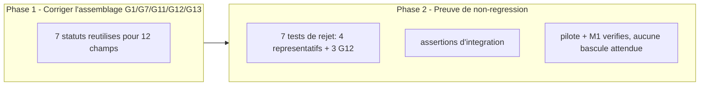

# Plan de correction — Brancher les attestations mecaniques deja calculees (Lot C : G1/G7/G11/G12/G13)

> Plan `fix`, sous-chantier 1/3 de
> `.ai/backlog/fixes/EPIC_CLOTURE_ATTESTATIONS_RESIDUELLES_GATES.md` (chantier
> mere de suivi). Produit a partir de l'observation d'intake
> `0 - HUMAN START HERE/PLAN_CORRECTION_GATES_MECANIQUES_LOT_C.md`, elle-meme
> issue du Lot C de
> `0 - HUMAN START HERE/archive/20260716_OBSERVATION_GATES_ATTESTATIONS_RESIDUELLES.md`.
> Ce document ne cree aucune nouvelle regle scientifique : il fait circuler
> des resultats deja calcules (`validate_availability()`,
> `validate_pre_oos_seal()`, `validate_reproduction_report()`,
> `validate_monitoring_plan()`, `validate_consultation_log()`,
> `validate_incubation_report()`, `deployment_gate()`) jusqu'aux 12 champs
> `gates.json` qui devraient en dependre, au lieu de les laisser ignorer ces
> calculs au profit de litteraux `True` codes en dur. Meme nature de defaut,
> meme patron de correction que
> `.ai/archive/20260716_PLAN_CORRECTION_GATE_STATISTIQUE_OOS_MASQUE.md` (Lot
> A1, `DONE`), applique ici a G1/G7/G11/G12/G13 plutot qu'a G9.

---

## 0. Bandeau de statut (a verifier avant toute promotion)

| Question | Reponse |
| --- | --- |
| Un chantier actif couvre-t-il deja ce perimetre (`DONE`, `ACTIVE`, ou `SUPERSEDED`) ? | Non. `PLAN_CORRECTION_GATE_STATISTIQUE_OOS_MASQUE` (`DONE`, 2026-07-16) a corrige `oos_report`/`concatenated_oos_series`/`oos_bootstrap_report`/`power_report` (G9 uniquement) — perimetre distinct, non chevauchant. Aucun autre chantier ne touche G1/G7/G11/G12/G13. |
| Un verrou de gouvernance actif bloque-t-il ce chantier ? | Non identifie pour ce perimetre. |
| Ce plan a-t-il besoin d'une decision humaine explicite pour lever un verrou avant d'etre routable via `/start` ? | Non — decision deja actee (`EPIC_CLOTURE_ATTESTATIONS_RESIDUELLES_GATES`, section 10 : "Lot C avant Lot A2, aucune decision requise pour C"). Aucune calibration de seuil a arbitrer : les 7 fonctions sous-jacentes retournent deja un verdict binaire/ternaire sans nouveau parametre a choisir. |
| Ce plan remplace-t-il un document ou chantier existant ? | Non. Il complete `PLAN_CORRECTION_GATE_STATISTIQUE_OOS_MASQUE` (`DONE`) sans le rouvrir, meme patron applique a des champs differents. |

---

## Audit IA de promotion

- [x] Plan relu dans le contexte du cockpit actif (`AGENTS.md`, `.ai/README.md`, `.ai/checkpoint.json`, `Implementation/Active/HOOK.md`).
- [x] Bandeau de statut (section 0) rempli et verifie contre l'etat machine reelle.
- [x] Ce plan est ECRIT COMME NOUVEAU FICHIER dans `.ai/backlog/fixes/` ; l'observation d'intake originale n'est pas modifiee, elle sera archivee telle quelle par `plan.ps1 start`.
- [x] Chantier classe `fix` — corrige un ecart de production (12 champs qui ne peuvent jamais refleter un statut reel calcule) sans changer de norme.
- [x] Autorite normative identifiee : `Protocole/PAQUET D'EXECUTION EBTA.md` sections 2 et 4 (G1/G7/G11/G12/G13) ; SOP 09A (data availability), SOP 10/SOP 12 (sealing, reproduction), SOP 11 (monitoring, incubation), SOP 11/12 (deployment) — citees module par module (section 4).
- [x] Perimetre de fichiers autorises et interdits explicite (section 5).
- [x] Aucune modification hors perimetre requise.
- [x] Prerequis factuels verifies dans le code le 2026-07-16 : les 7 fonctions (`validate_availability`, `validate_pre_oos_seal`, `validate_reproduction_report`, `validate_monitoring_plan`, `validate_consultation_log`, `validate_incubation_report`, `deployment_gate`) sont deja appelees avec les vraies entrees dans `_procedure_reports()` (`build_research_package.py:339-460`), leurs resultats existent deja en memoire au moment ou `gates` est construit, mais ne sont reutilises nulle part pour les 12 champs cibles.
- [x] Etat des lieux (section 4) verifie directement dans le code (pas suppose) : les 7 statuts sont tous confines a `{"PASS", "FAIL", "INCONCLUSIVE"}` — aucune normalisation requise, contrairement au cas G9/`"NOT_VALIDATED"`.
- [x] Verifie empiriquement (2026-07-16) : sur la fixture pilote (`pilot_inputs.json`), les 7 statuts sont tous `"PASS"` (execution directe de `_procedure_reports()`), et sur le package M1 de production reel (`Implementation/research_packages/nautilus_mvp/reports/`), les 7 fichiers de rapport correspondants sont egalement `"PASS"` — cette correction ne fait donc basculer aucun champ a un statut different sur les deux fixtures existantes ; elle rend seulement le lien mecanique reel au lieu d'un hasard heureux.

## Triage

| Champ | Valeur |
| --- | --- |
| Track | `fix` |
| Lifecycle | `TRIAGED` |
| Scope | Dans `_write_reports()` (`Implementation/examples/minimal_pilot_pipeline/build_research_package.py`, fonction partagee par le pipeline pilote et le chemin de production Nautilus) : remplacer 12 litteraux `True` codes en dur par une lecture directe des 7 statuts deja calcules dans `procedure_reports` (`data_availability`, `sealing`, `reproduction_validation`, `monitoring_plan`, `monitoring_consultation_log`, `incubation_report`, `deployment_gate`), sans modifier `validators/gate_validator.py`. |
| Non-goals | Ne pas modifier les 7 fonctions de `procedures/` citees (deja correctes et testees, alimentees sans etre reecrites) ; ne pas modifier `validators/gate_validator.py` ni `validators/package_validator.py` ; ne pas toucher G2 (`independent_registry_review`, tautologique, decision de source de verite non tranchee, hors perimetre) ; ne pas toucher G7 `independent_pre_oos_approval`, G13 `kill_switch`/`live_approval`, G14 (`retention_policy`/`incident_log`) — attestations humaines legitimes ; ne pas toucher G9 `power_report` (Lot A2, sous-chantier separe) ni G6 `execution_report`/`nav_reconciliation`/`cost_model`/`capacity_grid` (Lot B, sous-chantier separe, decision de seuil requise) ; ne pas modifier `Protocole/` ; ne pas ajuster une entree de fixture pour forcer artificiellement un resultat. |
| Source | Observation d'intake `0 - HUMAN START HERE/PLAN_CORRECTION_GATES_MECANIQUES_LOT_C.md` (2026-07-16), Lot C de `0 - HUMAN START HERE/archive/20260716_OBSERVATION_GATES_ATTESTATIONS_RESIDUELLES.md` (deja convergee, 3 passes `/evaluate`). Decision humaine du 2026-07-16 (`EPIC_CLOTURE_ATTESTATIONS_RESIDUELLES_GATES`, section 10) : traiter Lot C en premier, sans decision supplementaire requise. |
| Exit criteria | (1) Les 12 champs `gates.json` cites (section Scope) derivent chacun du `status` reel deja calcule par leur procedure source, via une fonction de lecture directe (aucune normalisation requise, verifie section 4), sans modification de `validators/gate_validator.py`. (2) Dans `tests/test_gates.py`, au meme patron que `test_gate_report_rejects_non_pass_wrc_verdict()`/`test_gate_report_rejects_non_pass_oos_gate()` : un test de rejet par champ representatif pour G1, G7, G11 et G13 (4 tests — un seul champ suffit par gate car tous les champs de ces 4 gates partagent une source unique, tester chaque champ separement serait redondant sans ajouter de preuve), et un test de rejet par champ pour les 3 champs de G12 (3 tests, car chacun provient d'une source distincte et peut echouer independamment) — soit 7 tests de rejet au total. (3) Une assertion d'integration dans `test_minimal_pilot_pipeline_builds_valid_package` confirme que **chacun des 12 champs** de `gates.json` est bien egal au `status` de sa procedure source (`procedure_reports[...]["status"]`), pas un litteral residuel a cote de la nouvelle lecture — ici les 12 assertions individuelles restent justifiees car ce sont de simples comparaisons sur un dict deja charge, sans cout de fixture supplementaire. (4) `test_minimal_pilot_pipeline_builds_valid_package` reste `PASS` sans modification de sa fixture ni de ses assertions preexistantes — deja verifie empiriquement que les 7 statuts sont `PASS` sur la fixture pilote (voir Audit IA de promotion). (5) Suite runtime complete reste `PASS`. (6) Zero modification de `procedures/`, `validators/`, `governance/`, `manifests/`, `Protocole/`. |

## Statut

| Champ | Valeur |
| --- | --- |
| Statut | `NON_DEMARRE` |
| Date de creation | 2026-07-16 |
| Date d'activation | - |
| Autorite normative | `Protocole/PAQUET D'EXECUTION EBTA.md` sections 2, 4 ; SOP 09A, SOP 10, SOP 11, SOP 12 (citees par module en section 4) — gelees, non modifiees par ce plan |
| Autorite executable | `Implementation/ebta_engine/` et `Implementation/examples/minimal_pilot_pipeline/` (traduction executable subordonnee) |
| Changement normatif attendu | Aucun — application d'une regle deja normative (un verdict deja calcule doit conditionner le gate qui en depend), pas de nouvelle regle |
| Dependances externes | Aucune nouvelle. |

---

## 1. Role de ce document et non-objectifs

| Element | Role |
| --- | --- |
| `Protocole/PAQUET D'EXECUTION EBTA.md` | Autorite normative des gates G1/G7/G11/G12/G13. Inchangee. |
| `Implementation/ebta_engine/procedures/{data_availability,sealing,reproduction_report,monitoring,incubation_report,lifecycle}.py` | Calculs deja corrects des verdicts reutilises. Inchanges — ce chantier reutilise leurs resultats, ne les recalcule pas differemment. |
| `Implementation/ebta_engine/validators/gate_validator.py::gate_report()` | Agregateur deja correct pour les valeurs qu'il reconnait (`PASS`/`FAIL`/`INCONCLUSIVE`). Inchange. |
| `Implementation/examples/minimal_pilot_pipeline/build_research_package.py::_write_reports()` | Chemin fautif : c'est le seul endroit ou les 7 verdicts deja calcules sont ignores au profit de 12 litteraux `True`. **Dans le perimetre.** |
| Ce plan | Carte de correction : ou brancher chaque verdict reel, comment prouver la non-regression. |

Non-objectifs :

- ne pas reecrire `Protocole/` ni les SOP citees ;
- ne pas introduire de regle, seuil, ou verdict absent des autorites normatives citees ;
- ne pas faire de ce plan une refonte generale de `gates.json`/`invariant_evidence.json` — perimetre strictement limite aux 12 champs cites (section Scope) ;
- ne pas transformer `gate_validator.py::gate_report()` en calculateur — il reste un agregateur pur ;
- ne pas etendre `validators/gate_validator.py::VERDICT_VALUES` (aucun besoin identifie, tous les statuts sources sont deja dans cet ensemble).

---

## 2. Contexte obligatoire a lire avant de coder

1. `AGENTS.md`, `.ai/README.md`, `.ai/checkpoint.json`, `Implementation/Active/HOOK.md` — etat machine courant.
2. `.ai/backlog/fixes/EPIC_CLOTURE_ATTESTATIONS_RESIDUELLES_GATES.md` — le chantier mere de suivi dont ce plan est le premier sous-chantier.
3. `0 - HUMAN START HERE/archive/20260716_OBSERVATION_GATES_ATTESTATIONS_RESIDUELLES.md` (une fois archivee) — l'observation source, section "Decoupage propose", Lot C.
4. `.ai/archive/20260716_PLAN_CORRECTION_GATE_STATISTIQUE_OOS_MASQUE.md` — le chantier Lot A1 (meme patron de correction et de preuve, applique ici a 5 gates au lieu d'1).
5. `Protocole/PAQUET D'EXECUTION EBTA.md` sections 2 et 4 (definition des gates).
6. Code existant a reutiliser (verifie 2026-07-16), voir section 4.

**Hierarchie d'autorite** :

```text
1. Protocole/MANIFESTE DE GEL EBTA.md
2. Protocole/PROTOCOLE EBTA.md
3. Protocole/REGISTRE DES DECISIONS NORMATIVES EBTA.md
4. SOP 09A, SOP 10, SOP 11, SOP 12
5. Protocole/PAQUET D'EXECUTION EBTA.md
6. Implementation/ (dont ce plan)
7. Adaptateurs externes (NautilusTrader)
```

Regle : si le code contredit `Protocole/`, c'est le code qui a tort. Si une
donnee necessaire au calcul manque, le systeme doit bloquer ou retourner un
statut explicite (`INCONCLUSIVE`/`FAIL`) plutot que de deviner ou de
supposer `True`.

---

## 3. Table des gates (points de decision sequentiels)

| Ordre | Gate | Champs vises | Source deja calculee | Sortie si echec |
| --- | --- | --- | --- | --- |
| G1 | `data_snapshots`, `availability_timestamps`, `anti_leakage_report` | `procedure_reports["data_availability"]["status"]` | `INCONCLUSIVE` si `status != "PASS"` |
| G7 | `pre_oos_manifest`, `frozen_config` | `procedure_reports["sealing"]["status"]` | idem |
| G11 | `validation_ready_manifest`, `reproduction_report`, `incubation_approval` | `procedure_reports["reproduction_validation"]["status"]` | idem |
| G12 | `incubation_report`, `paper_trading_log`, `monitoring_plan` | `procedure_reports["incubation_report"]["status"]`, `["monitoring_consultation_log"]["status"]`, `["monitoring_plan"]["status"]` respectivement (un champ par source, pas une seule source pour les trois) | idem, par champ |
| G13 | `deployment_certified_manifest` | `procedure_reports["deployment_gate"]["status"]` | idem |

Ce chantier ne touche que la **production des 12 entrees** consommees par
ces 5 gates dans `gate_validator.py::GATE_REQUIREMENTS` ; il ne change ni
l'ordre ni la logique d'agregation de `gate_report()`.

---

## 4. Etat des lieux (avant/apres) — reutiliser avant de recreer

### Ce qui existe deja et fonctionne (verifie 2026-07-16)

| Module | Chemin | Role reel (verifie) | Valeurs possibles | Suffisant ? |
| --- | --- | --- | --- | --- |
| `validate_availability()` | `procedures/data_availability.py:13,22` | Calcule `status` a partir de `decision_events` reels | `PASS`/`FAIL` | ✅ Reutiliser tel quel |
| `validate_pre_oos_seal()` | `procedures/sealing.py:10,20` | Calcule `status` a partir de `package_stage`/`manifest_hash`/`independent_approval` reels | `PASS`/`FAIL` | ✅ Reutiliser tel quel |
| `validate_reproduction_report()` | `procedures/reproduction_report.py` | Calcule `status` en comparant les hashes d'artefacts reproduits a l'original | `PASS`/`FAIL`/`INCONCLUSIVE` | ✅ Reutiliser tel quel |
| `validate_monitoring_plan()` | `procedures/monitoring.py:28-85` | Calcule `status` a partir du plan de monitoring reel | `PASS`/`FAIL`/`INCONCLUSIVE` | ✅ Reutiliser tel quel |
| `validate_consultation_log()` | `procedures/monitoring.py:87-198` | Calcule `status` a partir du journal de consultations reel (`_monitoring_result()` ligne 185-189 ne produit que `PASS`/`FAIL` pour ce chemin) | `PASS`/`FAIL` | ✅ Reutiliser tel quel |
| `validate_incubation_report()` | `procedures/incubation_report.py:21-126` | Calcule `status` a partir du rapport d'incubation reel ; verifie ligne 120-121 et 47-50 : ne retourne jamais `"WATCH"` dans `status` (seulement dans le sous-champ `verdict` du rapport source) | `PASS`/`FAIL`/`INCONCLUSIVE` | ✅ Reutiliser tel quel — verification explicite pour eviter le piege deja rencontre avec `"NOT_VALIDATED"` sur G9 |
| `deployment_gate()` | `procedures/lifecycle.py:30-40` | Calcule `status` a partir de l'evidence de deploiement reelle | `PASS`/`FAIL` | ✅ Reutiliser tel quel |
| `_procedure_reports()` | `build_research_package.py:339-460` | Appelle deja les 7 fonctions ci-dessus avec les vraies entrees et stocke leurs resultats dans le dict retourne | ✅ Deja correct, juste sous-exploite |
| `_write_reports()` | meme fichier, lignes ~200-254 | Ecrit les 12 champs cibles en `True` litteral, jamais les statuts ci-dessus | ❌ A corriger (coeur de ce chantier) |
| `package_builder/nautilus_research_package.py` | — | Ne fige aucun des 12 champs en amont (verifie par grep : `data_availability`, `sealing`, `reproduction`, `monitoring`, `incubation`, `deployment_gate` n'apparaissent que comme entrees `inputs[...]`, jamais comme sortie `gates`) | ✅ Aucun nettoyage d'appelant necessaire ici, comme deja constate pour G9 |

### Ce qui manque reellement

| Brique manquante | Module a modifier | A reutiliser (pas dupliquer) |
| --- | --- | --- |
| Propagation des 7 statuts deja calcules vers les 12 champs `gates.json` correspondants | `_write_reports()`, lignes ~200-254 | Les 7 valeurs `procedure_reports[...]["status"]` deja calculees quelques lignes plus haut dans la meme fonction |
| Preuve unitaire que `gate_report()` rejette deja un statut non-`PASS` : 1 champ representatif pour G1/G7/G11/G13 (source unique par gate), les 3 champs de G12 individuellement (3 sources distinctes) | `tests/test_gates.py` | Patron exact deja existant : `test_gate_report_rejects_non_pass_wrc_verdict()`/`test_gate_report_rejects_non_pass_oos_gate()`, fixture `_complete_evidence()` |
| Preuve d'integration que `_write_reports()` derive bien chaque champ de sa source, pas d'un litteral residuel | `tests/test_minimal_pilot_pipeline.py` | Patron exact deja existant (assertion `expected_g9_gate_value` du test G9) |

---

## 5. Decision d'architecture

Principe directeur : un resultat de calcul deja produit par une procedure
normative ne doit jamais etre shadow par une valeur litterale au point
d'assemblage — l'assemblage doit **lire** le resultat calcule, jamais le
**redeclarer**.

- Raison 1 — les 7 statuts sources existent deja en memoire au moment ou
  `gates` est construit (meme fonction, quelques lignes plus haut) : aucun
  nouveau calcul, aucune nouvelle dependance.
- Raison 2 — contrairement au cas G9 (`"NOT_VALIDATED"` hors de
  `VERDICT_VALUES`), les 7 statuts ici sont deja tous confines a
  `{"PASS", "FAIL", "INCONCLUSIVE"}` (verifie section 4) : **aucune fonction
  de normalisation n'est necessaire**, une lecture directe suffit. Ecrire
  une normalisation inutile ajouterait de la complexite sans le justifier
  par un risque reel.

### Frontieres explicites

| Couche | Elle fait | Elle NE fait PAS |
| --- | --- | --- |
| Les 7 fonctions `procedures/*` (inchangees) | Calculent le verdict reel de leur domaine respectif | Construire un gate |
| `_write_reports()` (corrigee) | Lit chaque `procedure_reports[...]["status"]` et l'injecte directement dans le champ `gates.json` correspondant | Recalculer un verdict differemment ; normaliser une valeur qui n'en a pas besoin |
| `gate_validator.py::gate_report()` (inchangee) | Agrege les entrees fournies en un statut de gate | Reconnaitre une regle specifique a ce lot |

### Contrat d'interface

Aucun nouveau contrat de type. Remplacement direct dans `_write_reports()` :

```python
data_availability_status = procedure_reports["data_availability"]["status"]
sealing_status = procedure_reports["sealing"]["status"]
reproduction_status = procedure_reports["reproduction_validation"]["status"]
monitoring_plan_status = procedure_reports["monitoring_plan"]["status"]
monitoring_consultation_status = procedure_reports["monitoring_consultation_log"]["status"]
incubation_report_status = procedure_reports["incubation_report"]["status"]
deployment_gate_status = procedure_reports["deployment_gate"]["status"]
```

puis substitution des 12 champs `gates.json` par la variable correspondante
(section 6, Phase 1).

### Decisions deja actees

| Decision | Justification |
| --- | --- |
| Ne pas ecrire de fonction de normalisation type `_g9_gate_value()` pour ce lot | Les 7 statuts sources sont deja confines a `VERDICT_VALUES` (verifie section 4) ; une normalisation serait un code mort, contraire au principe "ne pas construire au-dela du besoin" |
| Reutiliser un champ source distinct par champ `gates.json` pour G12 (au lieu d'un seul champ source pour les trois, comme fait pour G9) | G12 agrege trois preoccupations reellement distinctes (`incubation_report`, `paper_trading_log`/consultations, `monitoring_plan`), chacune avec sa propre procedure de calcul deja existante — contrairement a G9 ou les 4 champs representaient collectivement une seule preoccupation (validite du rapport OOS) |

### Structure cible

```text
Implementation/
  examples/minimal_pilot_pipeline/
    build_research_package.py   # CORRIGE -- _write_reports() reutilise les 7 statuts
  ebta_engine/
    procedures/                  # INCHANGE (7 fichiers)
    validators/
      gate_validator.py          # INCHANGE
    tests/
      test_gates.py                       # ETENDU -- 7 tests de rejet, patron WRC/robustesse/OOS deja existant
      test_minimal_pilot_pipeline.py       # ETENDU -- assertions d'integration additionnelles
```

### Perimetre de fichiers explicite (autorises / interdits)

**Autorises (creer ou modifier)** :

```text
Implementation/examples/minimal_pilot_pipeline/build_research_package.py   MODIFIER - Phase 1
Implementation/ebta_engine/tests/test_gates.py                             MODIFIER - Phase 2 (7 tests de rejet, patron deja existant)
Implementation/ebta_engine/tests/test_minimal_pilot_pipeline.py           MODIFIER - Phase 2 (assertions additionnelles uniquement)
```

**Interdits (ne jamais modifier dans ce chantier)** :

```text
Protocole/                                                                [NORME - intouchable]
Implementation/ebta_engine/procedures/data_availability.py                [CONTRAT DEJA CORRECT - reutiliser tel quel]
Implementation/ebta_engine/procedures/sealing.py                          [CONTRAT DEJA CORRECT - reutiliser tel quel]
Implementation/ebta_engine/procedures/reproduction_report.py              [CONTRAT DEJA CORRECT - reutiliser tel quel]
Implementation/ebta_engine/procedures/monitoring.py                       [CONTRAT DEJA CORRECT - reutiliser tel quel]
Implementation/ebta_engine/procedures/incubation_report.py                [CONTRAT DEJA CORRECT - reutiliser tel quel]
Implementation/ebta_engine/procedures/lifecycle.py                        [CONTRAT DEJA CORRECT - reutiliser tel quel]
Implementation/ebta_engine/validators/gate_validator.py                   [CONTRAT DEJA CORRECT - ne pas etendre VERDICT_VALUES]
Implementation/ebta_engine/validators/package_validator.py                [HORS PERIMETRE]
Implementation/ebta_engine/governance/                                    [HORS PERIMETRE - G-BIAS non concerne]
Implementation/ebta_engine/package_builder/nautilus_research_package.py    [AUCUNE MODIFICATION REQUISE ICI - verifie section 4]
Implementation/examples/minimal_pilot_pipeline/inputs/pilot_inputs.json    [FIXTURE INCHANGEE - deja verifiee produire 7x PASS reel]
.ai/checkpoint.json                                                        [METTRE A JOUR UNIQUEMENT via plan.ps1]
```

---

## 6. Decoupage en phases

### Phase 1 - Corriger l'assemblage des gates G1/G7/G11/G12/G13

Objectif : faire circuler les 7 statuts reellement calcules vers les 12
champs `gates.json` correspondants.

Classification : IMPLEMENTATION_DETAIL

Constat (preuve) :

- `_procedure_reports()` calcule les 7 statuts (lignes 339-460) puis
  `_write_reports()` code en dur les 12 champs cibles a `True` (lignes
  ~207-246), sans jamais les lire.

Actions :

- Dans `_write_reports()`, juste apres l'appel a `_procedure_reports()`
  (deja fait ligne 197), lire les 7 statuts dans des variables locales.
- Remplacer les 12 litteraux `True` par la variable correspondante (section
  5, Contrat d'interface) :
  - `data_snapshots`, `availability_timestamps`, `anti_leakage_report` <- `data_availability_status`
  - `pre_oos_manifest`, `frozen_config` <- `sealing_status`
  - `validation_ready_manifest`, `reproduction_report`, `incubation_approval` <- `reproduction_status`
  - `incubation_report` <- `incubation_report_status`
  - `paper_trading_log` <- `monitoring_consultation_status`
  - `monitoring_plan` <- `monitoring_plan_status`
  - `deployment_certified_manifest` <- `deployment_gate_status`
- Ne modifier aucune signature des 7 fonctions `procedures/*` ni de
  `gate_report()`/`_requirement_satisfied()`.
- Ne pas toucher aux autres champs de `gates`/`invariant_evidence` (G2, G6,
  G9 deja corrige, G13 `kill_switch`/`live_approval`, G14).

Livrables :

- `_write_reports()` corrigee, sans aucun des 12 litteraux `True` cibles.

Critere de sortie :

- Lecture du diff : plus aucune occurrence des 12 litteraux `True` cibles
  dans le fichier du perimetre.
- Suite runtime complete reste `PASS`.

### Phase 2 - Preuve de non-regression

Objectif : prouver mecaniquement que chacun des gates concernes reflete
desormais le statut reel de sa source, et qu'un statut non-`PASS` pose sur
un champ cible est deja rejete par `gate_report()`.

Actions :

- **Tests unitaires purs sur `gate_report()`** (`tests/test_gates.py`), meme
  patron que `test_gate_report_rejects_non_pass_oos_gate()` : 7 tests au
  total, pas 12 — un champ representatif pour G1 (`data_snapshots`), G7
  (`pre_oos_manifest`), G11 (`validation_ready_manifest`) et G13
  (`deployment_certified_manifest`) suffit dans chaque cas car les champs
  d'un meme gate y partagent tous la meme source unique (tester chaque champ
  separement serait redondant, verifie section 4) ; pour G12, tester
  individuellement ses 3 champs (`incubation_report`,
  `paper_trading_log`, `monitoring_plan`) car chacun provient d'une source
  distincte et peut echouer independamment. Pour chaque champ teste,
  construire `evidence = _complete_evidence()`, poser une valeur `"FAIL"`
  (et `"INCONCLUSIVE"` ou elle est possible) sur ce champ, verifier
  `results[gate_id].status != "PASS"` et que le champ apparait dans
  `results[gate_id].missing`.
- **Assertion d'integration** (`test_minimal_pilot_pipeline_builds_valid_package`) :
  charger `gates.json` (deja charge, variable `gates` existante ligne 43) et
  ajouter, pour chacun des 12 champs cibles, une assertion d'egalite avec le
  `status` de la source correspondante deja chargee (`procedure_reports`
  dict existant lignes 46-59, a completer avec `data_availability.json` et
  `monitoring_plan.json` si absents de ce dict) — pas seulement une
  comparaison a `"PASS"` en dur, pour que le test detecte aussi une
  regression si la fixture pilote change un jour de resultat.
- Executer le pipeline pilote complet et confirmer que `report["status"] ==
  "PASS"` et `gate_report["summary"]["inconclusive"] == 0` restent vrais
  (deja verifie empiriquement en amont que les 7 statuts sont `PASS` sur la
  fixture pilote).
- Optionnel, non bloquant : reconstruire le package Nautilus M1 de
  production et confirmer que les 12 champs restent `"PASS"` (deja verifie
  empiriquement sur les artefacts persistants committes,
  `Implementation/research_packages/nautilus_mvp/reports/*.json`) — aucune
  entree `HISTORIQUE...md` requise puisqu'aucun champ ne bascule (a la
  difference de WRC/G5/G9).
- Ne pas affaiblir ni skipper un test existant pour faire passer ce test.

Livrables :

- 7 tests de rejet dans `test_gates.py` (1 champ representatif pour G1,
  G7, G11, G13 ; 3 champs individuels pour G12).
- Assertions d'integration ajoutees au test pilote existant.

Critere de sortie :

- Tous les tests ajoutes sont `PASS`.
- Suite runtime complete reste `PASS`.

### Chemin critique (ordre des phases)



---

## 7. Artefacts produits

| Etape | Fichier/sortie | Format | Regle source |
| --- | --- | --- | --- |
| Gates G1/G7/G11/G12/G13 reels | `research_packages/nautilus_mvp/reports/gates.json` (12 champs cibles) | JSON | `Protocole/PAQUET D'EXECUTION EBTA.md` |
| Preuve de non-regression | `Implementation/ebta_engine/tests/test_gates.py`, `test_minimal_pilot_pipeline.py` (etendus) | Python `unittest` | Ce chantier |

---

## 8. Invariants absolus et NO GO

### Invariants

1. Chacun des 12 champs cibles de `gates.json` doit toujours proceder du
   `status` reellement calcule par sa procedure source dans la meme
   execution — jamais d'une constante.
2. Les 7 procedures sources restent l'unique implementation de leur calcul
   respectif ; aucune duplication.
3. Si une procedure source leve une exception, cette exception ne doit pas
   etre masquee par un `try/except` qui retombe sur `True`.

### NO GO

- Laisser un des 12 champs cibles a `True` non derive apres la Phase 1.
- Modifier une des 7 procedures `procedures/*` ou `validators/gate_validator.py`.
- Ajouter une fonction de normalisation non justifiee par un risque reel
  (aucune valeur hors `VERDICT_VALUES` n'est possible ici, verifie section 4).
- Toucher G2, G6, G9 (deja corrige), ou les champs G7/G13/G14 d'attestation
  humaine legitime.
- Ajuster la fixture pilote pour forcer artificiellement un resultat.
- Affaiblir, contourner, ou supprimer un test existant pour faire passer la
  correction.
- Declarer une phase terminee sans preuve executable (section 9).

---

## 9. Verification a chaque etape

```powershell
python -m unittest discover -s Implementation\ebta_engine\tests -t Implementation
```

Pipeline pilote (Phase 2) :

```powershell
python Implementation\examples\minimal_pilot_pipeline\build_research_package.py
```

Attendu : `"status": "PASS"` (deja verifie empiriquement que les 7 statuts
sources sont `PASS` sur la fixture pilote).

Build reel de production (Phase 2, optionnel, via venv Nautilus) :

```powershell
.\Implementation\adapters\nautilus_env\venv\Scripts\python.exe -m ebta_engine.package_builder.nautilus_research_package
```

**Regle transversale bloquante** : la suite runtime complete doit rester
`PASS` avant de demarrer chaque phase suivante.

**Premier lot executable propose** :

```text
Phase 1 - Corriger l'assemblage des gates G1/G7/G11/G12/G13
```

### Execution sans interruption

Ce plan est concu pour etre execute integralement (Phases 1 et 2) sans
retour vers l'humain entre les phases. Aucune bascule de statut n'est
attendue sur les fixtures existantes (verifie empiriquement en amont) — ce
n'est donc pas une cause d'arret.

### Autorite decisionnelle accordee

En dehors du perimetre de fichiers (section 5) et des invariants (section
8), l'IA qui execute ce plan est autorisee a decider seule les details
d'implementation (ex. nom exact des variables locales, ordre des tests)
sans demander de confirmation humaine.

### Interdiction des raccourcis (aucun faux succes)

Lorsqu'une verification (section 9) echoue : identifier la cause racine, ne
jamais la masquer ; ne jamais desactiver, skipper, ou affaiblir un test
genant ; ne jamais remplacer une des 7 procedures par un stub ou une valeur
codee en dur ; ne jamais declarer une phase terminee sans la preuve
executable exigee par la section 9.

---

## 10. Journal des decisions humaines (autorisations)

| Date | Decision | Portee |
| --- | --- | --- |
| 2026-07-16 | Traiter le Lot C en premier parmi C/A2/B (chantier mere `EPIC_CLOTURE_ATTESTATIONS_RESIDUELLES_GATES`), sans decision supplementaire requise. | Autorise la redaction et le routage de ce plan `fix`, strictement scope aux 12 champs G1/G7/G11/G12/G13. |

---

## 11. Risques et blocages connus

| Risque | Impact | Mitigation / condition de deblocage |
| --- | --- | --- |
| Un futur changement de fixture (pilote ou M1) fait basculer un des 7 statuts sources a `FAIL`/`INCONCLUSIVE` | Attendu et sain si cela arrive un jour — a documenter dans `HISTORIQUE...md` si constate, jamais masque | Aucune action requise dans ce chantier ; le mecanisme de propagation reste correct par construction |

---

## 12. Definition of Done

- [ ] Phases 1 et 2 validees individuellement (section 9).
- [ ] Exit criteria de la section Triage atteint et verifiable.
- [ ] Aucune modification hors perimetre (section Triage / Non-goals).
- [ ] Aucune regression sur la suite de tests existante.
- [ ] Checklist post-modification `.ai/governance/AI_MODIFICATION_CHECKLIST.md` executee.
- [ ] Aucune implementation partielle, stub, pseudo-code, ou placeholder ne subsiste comme substitut a une brique prevue par ce plan.

---

## 13. Cloture

A remplir au moment de `/close`.

| Champ | Valeur |
| --- | --- |
| Resultat final | [A remplir a la cloture] |
| Ecarts par rapport au plan initial | [A remplir a la cloture] |
| Suites a prevoir (hors perimetre de ce plan) | Lot A2 (`power_check.status`, fonction de puissance atteinte a ecrire) puis Lot B (`execution_report`/`nav_reconciliation`, decision de seuil humaine requise) — chantier mere `EPIC_CLOTURE_ATTESTATIONS_RESIDUELLES_GATES`. |

### Resultat d'execution (a dupliquer a chaque session d'execution significative)

| Champ | Valeur |
| --- | --- |
| Date | [AAAA-MM-JJ] |
| Phases executees | [liste] |
| Artefact produit | [chemin] |
| Validation | [PASS/FAIL + commande utilisee] |
| Ecart par rapport au plan | [aucun / liste] |

---

## 14. Journal d'audits post-hoc

| Date de l'audit | Ce qui a ete corrige | Pourquoi |
| --- | --- | --- |
| 2026-07-16 | Plan redige directement a partir de l'observation source deja convergee (3 passes `/evaluate` sur le document parent). Verification propre a la redaction de ce plan (pas une correction d'une passe anterieure) : les 7 statuts sources sont bien confines a `VERDICT_VALUES`, y compris le cas `incubation_report.status` qui aurait pu, par analogie avec `verdict="WATCH"`, sortir de cet ensemble — verifie explicitement que ce n'est pas le cas. | Eviter d'ecrire une fonction de normalisation inutile (contraire au principe de sobriete du gabarit) tout en s'assurant que l'absence de normalisation est un fait verifie, pas une supposition. |
| 2026-07-16 | Passage `code-architecture-evaluator` (`/evaluate`), passe 1. Angle mort trouve : la Phase 2 initiale prescrivait un test de rejet unitaire pour chacun des 12 champs cibles, alors que le patron deja accepte dans ce depot (`test_gate_report_rejects_non_pass_oos_gate`, G9) ne teste qu'un seul champ representatif par gate quand plusieurs champs partagent la meme source — G1/G7/G11/G13 sont chacun alimentes par une source unique (tester chaque champ separement y est redondant), seul G12 a 3 sources distinctes justifiant 3 tests individuels. Corrige : Phase 2 resserree a 7 tests de rejet (4 representatifs + 3 pour G12) au lieu de 12, en gardant les 12 assertions d'egalite du test d'integration (celles-la restent peu couteuses et utiles individuellement). Sections Triage/Exit criteria, Etat des lieux, Decoupage en phases, Structure cible et Perimetre mis a jour en consequence. | Eviter une sur-ingenierie de test qui n'ajoute aucune preuve supplementaire, conformement au principe de sobriete deja enonce par le gabarit et par ce plan lui-meme (section 5). |
| 2026-07-16 | Passage `code-architecture-evaluator` (`/evaluate`), passe 2 de convergence. Relecture complete du plan corrige : coherence interne verifiee (Triage, Etat des lieux, Decoupage, Perimetre, NO GO alignes sur les 7 tests de rejet + 12 assertions d'integration). Seul residu trouve : une ligne de tableau de la section 4 avait perdu son `\|` de tete lors de l'edition de la passe 1, cassant le rendu Markdown — corrige immediatement. Aucun nouvel angle mort majeur identifie. | Confirmer que la passe 1 a bien converge : le plan reste actionnable tel quel, sans extension de perimetre ni nouvelle decision humaine. |
