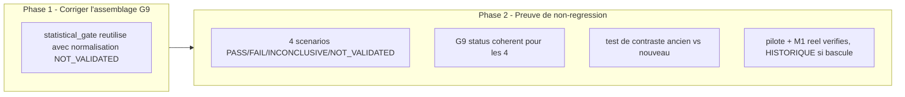

# Plan de correction — Reutiliser le verdict OOS reel (`statistical_gate`) dans le gate G9

> Plan `fix` produit a partir de l'observation d'intake
> `0 - HUMAN START HERE/OBSERVATION_GATES_ATTESTATIONS_RESIDUELLES.md`
> (2026-07-16, convergee apres 3 passes `/evaluate`), elle-meme issue du
> residu `R3 — Preuve vs attestation` de
> `0 - HUMAN START HERE/AUDIT_MATURITE_MOTEUR_RECHERCHE_2026-07-13.md`. Ce
> document ne cree aucune nouvelle regle scientifique : il fait circuler un
> resultat deja calcule (`oos_confidence_interval()`, SOP 01) jusqu'au gate
> G9 qui devrait en dependre, au lieu de le laisser ignorer ce calcul au
> profit de quatre litteraux `True` codes en dur. Meme nature de defaut,
> meme patron de correction que
> `.ai/archive/20260715_PLAN_CORRECTION_GATE_STATISTIQUE_WRC_MASQUE.md`
> (deja `DONE`), applique ici au gate OOS (G9) plutot qu'au gate statistique
> WRC (G4). **Perimetre volontairement restreint au seul sous-champ
> `statistical_gate`** (Lot A1 de l'observation source) — `power_check.status`
> (Lot A2), `execution_report`/`nav_reconciliation` (Lot B), et
> `independent_registry_review` (G2) sont explicitement geles hors
> perimetre par decision humaine du 2026-07-16 (voir section 10).

---

## 0. Bandeau de statut (a verifier avant toute promotion)

| Question | Reponse |
| --- | --- |
| Un chantier actif couvre-t-il deja ce perimetre (`DONE`, `ACTIVE`, ou `SUPERSEDED`) ? | Non. `.ai/checkpoint.json::active_workstream_id` est `null`. `PLAN_CORRECTION_GATE_STATISTIQUE_WRC_MASQUE` (`DONE`, 2026-07-15) a corrige `statistical_status` (WRC, gate G4/G10/G12), pas `statistical_gate` (OOS, gate G9) — perimetre distinct, non chevauchant. `PLAN_CORRECTION_VALIDATORS_STATUT_GLOBAL_PACKAGE` (`DONE`, 2026-07-15) a corrige `validators/gate_validator.py::_requirement_satisfied()` pour exiger `PASS` exact sur les valeurs de `VERDICT_VALUES = {"PASS", "FAIL", "INCONCLUSIVE"}` — verifie applicable ici (voir section 4, ligne `_requirement_satisfied`), mais avec une limite decouverte pendant l'audit de ce plan (voir ci-dessous). |
| Un verrou de gouvernance actif bloque-t-il ce chantier ? | Non identifie pour le perimetre A1. Le residu plus large (Lots A2/B/C, G2) reste hors perimetre par decision humaine explicite (section 10), pas par verrou de gouvernance externe. |
| Ce plan a-t-il besoin d'une decision humaine explicite pour lever un verrou avant d'etre routable via `/start` ? | Non — la decision humaine necessaire (perimetre A1 seul, reste differe/regroupe) est deja tranchee et journalisee en section 10. Aucune calibration de seuil a arbitrer : `oos_confidence_interval()` retourne deja un verdict binaire/quaternaire (`PASS`/`FAIL`/`INCONCLUSIVE`/`NOT_VALIDATED`) sans nouveau parametre a choisir. |
| Ce plan remplace-t-il un document ou chantier existant ? | Non. Il complete `PLAN_CORRECTION_GATE_STATISTIQUE_WRC_MASQUE` (`DONE`) sans le rouvrir ni le modifier — meme patron, gate different (G9 au lieu de G4/G10/G12). |

> **Limite decouverte pendant la redaction de ce plan (a traiter en Phase 1,
> pas un verrou de gouvernance a lever) :** `oos_confidence_interval()` peut
> retourner un 4e verdict, `"NOT_VALIDATED"` (`procedures/oos_confidence_interval.py`,
> `_statistical_verdict()`, ligne 86), qui **n'est pas dans**
> `gate_validator.py::VERDICT_VALUES = {"PASS", "FAIL", "INCONCLUSIVE"}`
> (ligne 37). Consequence verifiee : `_requirement_satisfied("NOT_VALIDATED")`
> retomberait sur `bool("NOT_VALIDATED")` = `True` — c'est-a-dire que
> brancher `statistical_gate` **tel quel** dans `gates.json` laisserait un
> verdict `NOT_VALIDATED` satisfaire G9 par accident, exactement le meme
> genre de piege deja identifie pour `power_check`/`registry_review` dans
> l'observation source. Ce plan traite cette limite **sans toucher
> `validators/gate_validator.py`** (module a plus haute autorite, deja
> corrige une fois par un chantier distinct) : la normalisation se fait au
> point d'assemblage (`_write_reports()`), pas dans le validateur — voir
> Phase 1 et invariant 2.

---

## Audit IA de promotion

- [x] Plan relu dans le contexte du cockpit actif (`AGENTS.md`, `.ai/README.md`, `.ai/checkpoint.json`, `Implementation/Active/HOOK.md`).
- [x] Bandeau de statut (section 0) rempli et verifie contre l'etat machine reelle (aucun workstream actif ; deux chantiers `DONE` de meme nature identifies et non chevauchants).
- [x] Ce plan est ECRIT COMME NOUVEAU FICHIER dans `.ai/backlog/fixes/` ; l'observation d'intake originale n'est pas modifiee, elle sera archivee telle quelle par `plan.ps1 start`.
- [x] Chantier classe `fix` — corrige un ecart de production (gate qui ne peut jamais refleter un OOS `FAIL`/`INCONCLUSIVE`/`NOT_VALIDATED` reel) sans changer de norme.
- [x] Autorite normative identifiee : `Protocole/` SOP 01 (OOS, sections 3, 4, 7, 8, 10, 13, 15, 20 ; DN-019 a DN-022) prime sur ce document et sur le code.
- [x] Perimetre de fichiers autorises et interdits explicite (section 5).
- [x] Aucune modification hors perimetre requise.
- [x] Prerequis factuels verifies dans le code le 2026-07-16 : `oos_confidence_interval()` est deja appele avec les vraies donnees OOS (`pilot_inputs["oos_returns"]`) dans `_procedure_reports()` (`build_research_package.py:380-385`), son verdict (`oos["statistical_gate"]`) existe deja en memoire au moment ou `gates` est construit (memes lignes 189-247), mais n'est reutilise nulle part pour les 4 champs G9.
- [x] Etat des lieux (section 4) verifie directement dans le code (pas suppose) pour eviter de reecrire `procedures/oos_confidence_interval.py` ou `validators/gate_validator.py` — le premier est deja correct et teste ; le second a une limite reelle (`NOT_VALIDATED`) traitee par normalisation en amont, pas par modification du validateur.
- [x] Verifie empiriquement (2026-07-16) : sur le package M1 de production reel (`Implementation/research_packages/nautilus_mvp/reports/oos.json`), `statistical_gate` vaut deja `"FAIL"` (`estimate=0.0`, `lower_95_one_sided=0.0`) ; sur la fixture statique du pilote (`pilot_inputs.json::oos_returns`), `oos_confidence_interval([0.01, 0.02, 0.015, 0.012], replications=5000, mean_block_length=2, seed=23)` retourne `statistical_gate="PASS"` — la correction ne casse donc pas `test_minimal_pilot_pipeline_builds_valid_package` (voir section 9).

## Triage

| Champ | Valeur |
| --- | --- |
| Track | `fix` |
| Lifecycle | `TRIAGED` |
| Scope | Dans `_write_reports()` (`Implementation/examples/minimal_pilot_pipeline/build_research_package.py`, fonction partagee par le pipeline pilote et le chemin de production Nautilus) : remplacer les 4 litteraux `True` codes en dur des champs `gates["oos_report"]`, `gates["concatenated_oos_series"]`, `gates["oos_bootstrap_report"]`, `gates["power_report"]` (lignes ~227-230) par une valeur derivee de `procedure_reports["oos"]["statistical_gate"]` (deja calcule ligne 191 via `oos_confidence_interval()`), normalisee de sorte que seul un `statistical_gate == "PASS"` exact satisfasse le gate G9 — `"FAIL"`, `"INCONCLUSIVE"`, et `"NOT_VALIDATED"` doivent tous les trois faire passer G9 a `INCONCLUSIVE` dans `gate_report()`, sans modifier `validators/gate_validator.py::VERDICT_VALUES`. |
| Non-goals | Ne pas modifier `procedures/oos_confidence_interval.py` (deja correct et teste, alimente sans etre reecrit) ; ne pas modifier `validators/gate_validator.py` ni `validators/package_validator.py` (deja corrects pour les valeurs qu'ils reconnaissent ; la normalisation `NOT_VALIDATED` se fait en amont, cf. Phase 1) ; ne pas toucher `power_check.status` (Lot A2 de l'observation source — vacueux par construction car `power` n'est jamais passe explicitement aux points d'appel, necessite d'ecrire une vraie fonction de puissance atteinte, hors perimetre, futur chantier distinct) ; ne pas toucher `execution_report`/`nav_reconciliation`/`cost_model`/`capacity_grid` (Lot B, G6 — calcul manquant en amont necessitant une decision de seuil humaine, futur chantier distinct) ; ne pas toucher `independent_registry_review` (G2 — appel tautologique `review_registry_lineage(candidate_ids, candidate_ids)`, necessite une decision de source de verite, gele indefiniment sauf nouvelle decision) ; ne pas toucher les champs du Lot C (`data_snapshots`, `availability_timestamps`, `anti_leakage_report`, `pre_oos_manifest`, `frozen_config`, `validation_ready_manifest`, `reproduction_report`, `incubation_approval`, `monitoring_plan`, `paper_trading_log`, `incubation_report`, `deployment_certified_manifest` — differe explicitement par decision humaine du 2026-07-16) ; ne pas modifier `Protocole/`, ni les parametres de `statistical_plan` (`oos_bootstrap_replications`, `oos_mean_block_length`, `oos_seed`) ; ne pas ajuster `power` pour forcer artificiellement un `PASS` sur le package M1 courant. |
| Source | Observation d'intake `0 - HUMAN START HERE/OBSERVATION_GATES_ATTESTATIONS_RESIDUELLES.md` (2026-07-16), convergee apres 3 passes `code-architecture-evaluator` (`/evaluate`). Decisions humaines explicites du 2026-07-16 (voir section 10) : demarrer par le Lot A1 seul ; differer le Lot C ; regrouper G2/A2/Lot B dans un futur chantier separe. |
| Exit criteria | (1) Les 4 champs `gates.json` du gate G9 (`oos_report`, `concatenated_oos_series`, `oos_bootstrap_report`, `power_report`) derivent de `oos["statistical_gate"]` reel au lieu d'un litteral `True`, via `_g9_gate_value()`, avec normalisation explicite de `"NOT_VALIDATED"` vers `"INCONCLUSIVE"`, sans modification de `validators/gate_validator.py`. (2) Trois tests prouvent la correction sans dependre du bootstrap : (2a) test unitaire pur de `_g9_gate_value()` sur les 4 chaines possibles ; (2b) dans `tests/test_gates.py`, un test au meme patron que `test_gate_report_rejects_non_pass_wrc_verdict()`/`test_gate_report_rejects_non_pass_robustness_verdict()` prouvant que `gate_report()` rejette deja `"FAIL"`/`"INCONCLUSIVE"` sur G9, PLUS un test de contraste prouvant qu'une valeur brute `"NOT_VALIDATED"` non normalisee serait acceptee a tort (`status == "PASS"`) ; (2c) une assertion d'integration sur le pipeline pilote reel confirmant que `gates["oos_report"]` (et les 3 autres champs) provient bien de `_g9_gate_value(oos["statistical_gate"])`. (3) `test_minimal_pilot_pipeline_builds_valid_package` reste `PASS` sans modification de sa fixture (`pilot_inputs.json`) ni de ses assertions preexistantes — deja verifie empiriquement que la fixture produit un `statistical_gate` reel `"PASS"` (voir Audit IA de promotion). (4) Suite runtime complete reste `PASS`. (5) Zero modification de `procedures/`, `validators/`, `governance/`, `manifests/`, `Protocole/`. (6) Le fait que ceci fait basculer `gates.json::oos_report`/`concatenated_oos_series`/`oos_bootstrap_report`/`power_report` (et donc le statut du gate G9 dans `gate_report()`) a `INCONCLUSIVE` sur le package M1 de production reel actuel (`statistical_gate` deja `"FAIL"` verifie empiriquement) est documente comme decouverte legitime dans `Implementation/HISTORIQUE DES VERSIONS EBTA ENGINE.md`, jamais presente comme une regression. |

## Statut

| Champ | Valeur |
| --- | --- |
| Statut | `ACTIVE` |
| Date de creation | 2026-07-16 |
| Date d'activation | 2026-07-16 |
| Autorite normative | `Protocole/` (`EBTA-DOC-1.1`), SOP 01 sections 3, 4, 7, 8, 10, 13, 15, 20 ; DN-019 a DN-022 — gele, non modifie par ce plan |
| Autorite executable | `Implementation/ebta_engine/` et `Implementation/examples/minimal_pilot_pipeline/` (traduction executable subordonnee) |
| Changement normatif attendu | Aucun — application d'une regle deja normative (le verdict OOS doit conditionner le gate G9 qui en depend), pas de nouvelle regle |
| Dependances externes | Aucune nouvelle. `nautilus_trader==1.230.0` deja installe (venv reproductible existant) pour la verification optionnelle sur le chemin de production reel. |

---

## 1. Role de ce document et non-objectifs

| Element | Role |
| --- | --- |
| `Protocole/` SOP 01 | Autorite normative absolue. Inchangee. |
| `Implementation/ebta_engine/procedures/oos_confidence_interval.py::oos_confidence_interval()` | Calcul deja correct du verdict OOS (`statistical_gate`). Inchange — ce chantier reutilise son resultat, ne le recalcule pas differemment. |
| `Implementation/ebta_engine/validators/gate_validator.py::gate_report()` | Agregateur deja correct pour les valeurs qu'il reconnait (`PASS`/`FAIL`/`INCONCLUSIVE`). Inchange — ce chantier corrige ce qu'on lui passe en entree, pas son fonctionnement. |
| `Implementation/examples/minimal_pilot_pipeline/build_research_package.py::_write_reports()` | Chemin fautif : c'est le seul endroit ou le verdict OOS deja calcule est ignore au profit de 4 litteraux `True`. **Dans le perimetre.** |
| Ce plan | Carte de correction : ou brancher le verdict reel, comment normaliser `NOT_VALIDATED`, comment prouver la non-regression. |

Non-objectifs :

- ne pas reecrire `Protocole/` ni SOP 01 ;
- ne pas introduire de regle, seuil, ou verdict absent de SOP 01 (`NOT_VALIDATED` existe deja dans le code, ce plan ne l'invente pas) ;
- ne pas faire de ce plan une refonte generale de `gates.json`/`invariant_evidence.json` — perimetre strictement limite aux 4 champs G9 lies a `statistical_gate` ;
- ne pas transformer `gate_validator.py::gate_report()` (deja correct) en calculateur — il reste un agregateur pur, alimente par une entree desormais honnete ;
- ne pas etendre `validators/gate_validator.py::VERDICT_VALUES` pour reconnaitre `NOT_VALIDATED` — la normalisation reste du cote de l'assembleur (`_write_reports()`), pas du validateur (module a plus haute autorite, deja corrige une fois par un chantier distinct).

---

## 2. Contexte obligatoire a lire avant de coder

1. `AGENTS.md`, `.ai/README.md`, `.ai/checkpoint.json`, `Implementation/Active/HOOK.md` — etat machine courant (aucun workstream actif).
2. `0 - HUMAN START HERE/archive/OBSERVATION_GATES_ATTESTATIONS_RESIDUELLES.md` (une fois archive par `plan.ps1 start`) — l'observation source, convergee apres 3 passes `/evaluate`, notamment la section "Decoupage propose" (Lots A1/A2/B/C) et le decoupage tranche en section "Questions ouvertes ... TRANCHEES".
3. `.ai/archive/20260715_PLAN_CORRECTION_GATE_STATISTIQUE_WRC_MASQUE.md` — le chantier precedent de meme nature (gate qui ne peut jamais refleter un verdict reel), dont ce plan reprend le patron de correction et de preuve, applique au gate OOS.
4. `Protocole/` SOP 01 (OOS, sections citees en tete de `procedures/oos_confidence_interval.py`).
5. Code existant a reutiliser (verifie 2026-07-16) :
   - `procedures/oos_confidence_interval.py::oos_confidence_interval()` (ligne 15) — calcule `statistical_gate` via `_statistical_verdict()` (ligne 42, definie ligne 79-86) et `power_check` via `validate_power_target()` (ligne 59, hors perimetre — Lot A2).
   - `procedures/oos_confidence_interval.py::_statistical_verdict()` (lignes 79-86) — 4 branches : `power < 0.80` -> `"INCONCLUSIVE"` ; `estimate <= 0` -> `"FAIL"` ; `lower_bound > 0` -> `"PASS"` ; sinon -> `"NOT_VALIDATED"`.
   - `validators/gate_validator.py::VERDICT_VALUES = {"PASS", "FAIL", "INCONCLUSIVE"}` (ligne 37) et `_requirement_satisfied()` (lignes 50-53) — traite `NOT_VALIDATED` comme une chaine truthy quelconque, PAS comme un verdict a exiger `PASS`.
   - `examples/minimal_pilot_pipeline/build_research_package.py::_procedure_reports()` (ligne 332), qui calcule `oos = oos_confidence_interval(...)` (ligne 380-385) puis `_write_reports()` (ligne 189) qui code en dur `"oos_report": True, "concatenated_oos_series": True, "oos_bootstrap_report": True, "power_report": True` (lignes ~227-230) sans jamais lire `oos["statistical_gate"]`.
   - `tests/test_gates.py` (lignes 1-48) — **patron exact a reutiliser** : `_complete_evidence()` (lignes 40-44) et les deux tests deja existants `test_gate_report_rejects_non_pass_wrc_verdict()`/`test_gate_report_rejects_non_pass_robustness_verdict()` (lignes 21-37) prouvent deja, pour G4/G5, exactement ce que ce plan doit prouver pour G9 — sans bootstrap, directement sur `validate_gates()`.
   - `tests/test_procedure_oos_ci.py::test_oos_ci_verdicts_are_mechanical` (patron d'entrees connues produisant `PASS`/`FAIL`/`INCONCLUSIVE` au niveau de `oos_confidence_interval()` elle-meme — utile pour comprendre `_statistical_verdict()`, mais PAS necessaire pour la preuve de Phase 2, qui teste `_g9_gate_value()` et `gate_report()` independamment du bootstrap, voir section 14).

**Hierarchie d'autorite** :

```text
1. Protocole/MANIFESTE DE GEL EBTA.md
2. Protocole/PROTOCOLE EBTA.md
3. Protocole/REGISTRE DES DECISIONS NORMATIVES EBTA.md
4. SOP 01-13 (ici : SOP 01)
5. Protocole/PAQUET D'EXECUTION EBTA.md
6. Implementation/ (dont ce plan)
7. Adaptateurs externes (NautilusTrader)
```

Regle : si le code contredit `Protocole/`, c'est le code qui a tort. Si une
donnee necessaire au calcul manque, le systeme doit bloquer ou retourner un
statut explicite (`INCONCLUSIVE`/`FAIL`) plutot que de deviner ou de
supposer `True`.

---

## 3. Table des gates (points de decision sequentiels)

| Ordre | Gate | Question posee au systeme | Sortie si echec |
| --- | --- | --- | --- |
| G9 | OOS (`oos_confidence_interval`, deja livre) | Le rendement OOS est-il statistiquement valide au seuil de puissance preenregistre (`statistical_gate == "PASS"`) ? | `INCONCLUSIVE` si `statistical_gate` est `"FAIL"`, `"INCONCLUSIVE"`, ou `"NOT_VALIDATED"` |

Ce chantier ne touche que la **production des 4 entrees** consommees par
G9 dans `gate_validator.py::GATE_REQUIREMENTS["G9"]` ; il ne change ni
l'ordre ni la logique d'agregation de `gate_report()`.

---

## 4. Etat des lieux (avant/apres) — reutiliser avant de recreer

### Ce qui existe deja et fonctionne (verifie 2026-07-16)

| Module | Chemin | Role reel (verifie) | Suffisant ? |
| --- | --- | --- | --- |
| Calcul OOS reel | `procedures/oos_confidence_interval.py::oos_confidence_interval()` | Calcule `estimate`, `lower_95_one_sided`, `statistical_gate` (`PASS`/`FAIL`/`INCONCLUSIVE`/`NOT_VALIDATED`) a partir de `oos_returns` reel via bootstrap par blocs stationnaires | ✅ Reutiliser tel quel |
| Agregateur de gate | `validators/gate_validator.py::gate_report()` / `_requirement_satisfied()` | Exige `value == "PASS"` exact pour toute valeur presente dans `VERDICT_VALUES` ; sinon `bool(value)` | ✅ Reutiliser tel quel pour `PASS`/`FAIL`/`INCONCLUSIVE` — ⚠️ ne reconnait pas `NOT_VALIDATED` comme verdict (voir limite section 0) |
| Point d'appel OOS | `examples/minimal_pilot_pipeline/build_research_package.py::_procedure_reports()` ligne 380-385 | Appelle deja `oos_confidence_interval(pilot_inputs["oos_returns"], ...)` avec les vraies donnees OOS et stocke le resultat dans la variable locale `oos` | ✅ Deja correct, juste sous-exploite |
| Assemblage gate G9 | meme fichier, `_write_reports()` lignes ~227-230 | `"oos_report": True, "concatenated_oos_series": True, "oos_bootstrap_report": True, "power_report": True` — quatre litteraux, jamais `oos["statistical_gate"]` | ❌ A corriger (coeur de ce chantier) |
| Chemin de production Nautilus | `package_builder/nautilus_research_package.py::build_nautilus_inputs()` | Ne fige aucune valeur `oos_report`/`statistical_gate` en amont (contrairement au cas WRC ou `nautilus_research_package.py` figeait `statistical_status="PASS"`) — reutilise directement `_write_reports()` du pilote via `_load_pilot_module()` | ✅ Aucun nettoyage d'appelant necessaire ici, contrairement au chantier WRC |

### Ce qui manque reellement

| Brique manquante | Module a modifier | Source de la regle | A reutiliser (pas dupliquer) |
| --- | --- | --- | --- |
| Propagation normalisee de `oos["statistical_gate"]` vers les 4 champs `gates.json` du gate G9 | `_write_reports()`, lignes ~227-230 | Cette observation, SOP 01 | `oos["statistical_gate"]` deja calcule quelques lignes plus haut dans la meme fonction (`procedure_reports["oos"]`) |
| Normalisation de `"NOT_VALIDATED"` vers une valeur qui ne satisfait pas G9 dans `gate_validator.py` tel qu'il existe aujourd'hui | meme fichier, meme endroit | Limite decouverte a l'audit de ce plan (section 0) | Aucune logique existante a dupliquer — mapping explicite `{"PASS": "PASS", "FAIL": "INCONCLUSIVE", "INCONCLUSIVE": "INCONCLUSIVE", "NOT_VALIDATED": "INCONCLUSIVE"}` documente en Phase 1 |
| Preuve unitaire de `_g9_gate_value()` (pure, sans bootstrap) | Nouveau test, colocalise avec `_write_reports()` ou dans `tests/test_gates.py` | Aucune — fonction pure a tester directement | Aucun bootstrap requis : `_g9_gate_value("PASS")`, `("FAIL")`, `("INCONCLUSIVE")`, `("NOT_VALIDATED")` |
| Preuve que `gate_validator.py` rejette deja "FAIL"/"INCONCLUSIVE" sur G9, et qu'une valeur brute "NOT_VALIDATED" NON normalisee serait acceptee a tort | `tests/test_gates.py` (fichier existant) | **Deja le bon patron dans ce depot** : `test_gate_report_rejects_non_pass_wrc_verdict()` / `test_gate_report_rejects_non_pass_robustness_verdict()` (lignes 21-37), sur la fixture `_complete_evidence()` (lignes 40-44) | Reutiliser `_complete_evidence()` telle quelle, ajouter un test G9 au meme patron — **decouvert lors de l'audit `/evaluate` (passe 1) de ce plan : non cite dans la version initiale, alors qu'il est le patron exact deja utilise pour G4/G5** |

---

## 5. Decision d'architecture

Principe directeur : un resultat de calcul deja produit par une procedure
normative (`oos_confidence_interval()`) ne doit jamais etre shadow par une
valeur litterale au point d'assemblage — l'assemblage doit **lire** le
resultat calcule, jamais le **redeclarer**. Quand le resultat calcule porte
une valeur que l'agregateur en aval ne reconnait pas nativement
(`"NOT_VALIDATED"`), l'assemblage doit la **normaliser explicitement** vers
une valeur que l'agregateur reconnait deja comme non satisfaisante, plutot
que de modifier l'agregateur pour un cas d'usage local.

- Raison 1 — `oos["statistical_gate"]` existe deja en memoire au moment ou
  `gates` est construit (meme fonction, quelques lignes plus haut) : aucun
  nouveau calcul, aucune nouvelle dependance.
- Raison 2 — modifier `validators/gate_validator.py::VERDICT_VALUES` pour
  ce seul cas elargirait le perimetre a un module de plus haute autorite
  deja corrige par un chantier distinct (`PLAN_CORRECTION_VALIDATORS_STATUT_GLOBAL_PACKAGE`),
  pour un besoin strictement local a G9 ; la normalisation en amont evite
  cette dependance inter-chantiers et reste reversible sans toucher a un
  module partage par les 14 autres gates.

### Frontieres explicites

| Couche | Elle fait | Elle NE fait PAS |
| --- | --- | --- |
| `oos_confidence_interval()` (inchangee) | Calcule le verdict OOS reel, y compris `"NOT_VALIDATED"` | Construire un gate |
| `_write_reports()` (corrigee) | Lit `oos["statistical_gate"]`, le normalise (mapping explicite), et l'injecte dans les 4 champs G9 | Recalculer le verdict OOS differemment ; decider un seuil de puissance |
| `gate_validator.py::gate_report()` (inchangee) | Agrege les entrees fournies en un statut de gate | Reconnaitre `"NOT_VALIDATED"` comme un verdict special |

### Contrat d'interface

Aucun nouveau contrat de type. Mapping explicite a ecrire dans
`_write_reports()` :

```python
_G9_SATISFYING_VALUES = {"PASS"}  # tout le reste normalise vers "INCONCLUSIVE"

def _g9_gate_value(statistical_gate: str) -> str:
    return statistical_gate if statistical_gate in _G9_SATISFYING_VALUES else "INCONCLUSIVE"
```

### Decisions deja actees

| Decision | Justification |
| --- | --- |
| Normaliser `"NOT_VALIDATED"` (et tout futur verdict non `"PASS"`) vers `"INCONCLUSIVE"` plutot que vers `"FAIL"` | `"INCONCLUSIVE"` est deja la valeur que `gate_report()` retourne pour un gate dont un champ requis n'est pas satisfait (`status = "PASS" if not missing else "INCONCLUSIVE"`, `gate_validator.py` ligne 45) — coherent avec la semantique existante des 14 autres gates, qui ne produisent jamais `FAIL` au niveau gate (seulement au niveau des rapports individuels comme `wrc.json`) |
| Reutiliser un seul champ source (`oos["statistical_gate"]`) pour les 4 champs G9 plutot que de calculer 4 valeurs distinctes | `GATE_REQUIREMENTS["G9"]` exige la presence des 4 champs mais ne leur attribue pas de semantique individuelle distincte dans le code actuel — ils representent collectivement "le rapport OOS est-il valide", pas 4 verifications independantes ; introduire une distinction inexistante serait une invention de regle, pas une correction |

### Structure cible

```text
Implementation/
  examples/minimal_pilot_pipeline/
    build_research_package.py   # CORRIGE -- _write_reports() reutilise oos["statistical_gate"]
  ebta_engine/
    procedures/
      oos_confidence_interval.py   # INCHANGE
    validators/
      gate_validator.py            # INCHANGE
    tests/
      test_gates.py                       # ETENDU -- test 2b, patron WRC/robustesse deja existant
      test_minimal_pilot_pipeline.py       # ETENDU -- test 2c, assertion d'integration
```

### Perimetre de fichiers explicite (autorises / interdits)

**Autorises (creer ou modifier)** :

```text
Implementation/examples/minimal_pilot_pipeline/build_research_package.py   MODIFIER - Phase 1
Implementation/ebta_engine/tests/test_gates.py                             MODIFIER - Phase 2 (tests 2b, patron WRC/robustesse deja existant)
Implementation/ebta_engine/tests/test_minimal_pilot_pipeline.py            MODIFIER - Phase 2 (test 2c, assertion additionnelle uniquement, pas de fixture modifiee)
Implementation/HISTORIQUE DES VERSIONS EBTA ENGINE.md                      MODIFIER - Phase 2 (nouvelle entree d'acquittement si le M1 courant bascule a INCONCLUSIVE)
```

**Interdits (ne jamais modifier dans ce chantier)** :

```text
Protocole/                                                       [NORME - intouchable]
Implementation/ebta_engine/procedures/oos_confidence_interval.py [CONTRAT DEJA CORRECT - reutiliser tel quel]
Implementation/ebta_engine/validators/gate_validator.py          [CONTRAT DEJA CORRECT pour PASS/FAIL/INCONCLUSIVE - ne pas etendre VERDICT_VALUES]
Implementation/ebta_engine/validators/package_validator.py       [HORS PERIMETRE]
Implementation/ebta_engine/governance/                           [HORS PERIMETRE - G-BIAS non concerne]
Implementation/ebta_engine/package_builder/nautilus_research_package.py   [AUCUNE MODIFICATION REQUISE ICI - reutilise _write_reports() sans figer de valeur amont, verifie section 4]
Implementation/examples/minimal_pilot_pipeline/inputs/pilot_inputs.json   [FIXTURE INCHANGEE - deja verifiee produire un PASS reel]
.ai/checkpoint.json                                              [METTRE A JOUR UNIQUEMENT via plan.ps1]
```

---

## 6. Decoupage en phases

### Phase 1 - Corriger l'assemblage du gate G9 avec normalisation

Objectif : faire circuler `oos["statistical_gate"]` reellement calcule vers
les 4 champs `gates.json` du gate G9, avec normalisation explicite de
`"NOT_VALIDATED"`.

Classification : IMPLEMENTATION_DETAIL

Constat (preuve) :

- `_procedure_reports()` calcule `oos = oos_confidence_interval(...)` (ligne
  380-385) puis `_write_reports()` code en dur les 4 champs G9 a `True`
  (lignes ~227-230), sans jamais lire `oos["statistical_gate"]`.
- `gate_validator.py::VERDICT_VALUES` ne contient pas `"NOT_VALIDATED"` —
  un branchement naif laisserait ce 4e verdict satisfaire G9 par accident.

Actions :

- Dans `_write_reports()`, juste apres le calcul de `procedure_reports`
  (ligne 191) et avant la construction du dict `gates`, ajouter une
  fonction locale (ou module-level) `_g9_gate_value(statistical_gate: str) -> str`
  qui retourne `statistical_gate` si `statistical_gate == "PASS"`, sinon
  `"INCONCLUSIVE"` (couvre `"FAIL"`, `"INCONCLUSIVE"`, `"NOT_VALIDATED"`, et
  toute valeur future non reconnue).
- Remplacer les 4 litteraux `True` (`oos_report`, `concatenated_oos_series`,
  `oos_bootstrap_report`, `power_report`) par
  `_g9_gate_value(procedure_reports["oos"]["statistical_gate"])`.
- Ne modifier aucune signature de `oos_confidence_interval()` ni de
  `gate_report()`/`_requirement_satisfied()`.
- Ne pas toucher `power_check` (Lot A2, hors perimetre).

Livrables :

- `_write_reports()` corrigee, sans aucun `True` litteral sur les 4 champs
  G9.

Critere de sortie :

- Lecture du diff : plus aucune occurrence de `"oos_report": True`,
  `"concatenated_oos_series": True`, `"oos_bootstrap_report": True`,
  `"power_report": True` dans le fichier du perimetre.
- Suite runtime complete reste `PASS`.

### Phase 2 - Preuve de non-regression (simplifiee suite a l'audit `/evaluate`, passe 1)

Objectif : prouver mecaniquement que G9 reflete desormais chacun des 4
verdicts possibles de `_statistical_verdict()`, et que l'ancien comportement
code en dur les aurait tous laisses passer — **sans passer par le bootstrap
reel**, qui n'est pas necessaire pour cette preuve (angle mort identifie et
corrige lors de l'audit `/evaluate` de ce plan, voir section 14).

Actions :

- **Test 2a (unitaire pur, aucune dependance au bootstrap)** : tester
  directement `_g9_gate_value()` avec les 4 chaines possibles
  (`"PASS"`, `"FAIL"`, `"INCONCLUSIVE"`, `"NOT_VALIDATED"`) et une valeur
  arbitraire non prevue, et verifier que seul `"PASS"` produit `"PASS"` en
  sortie, tout le reste `"INCONCLUSIVE"`.
- **Test 2b (reutilise le patron exact deja present dans le depot)** : dans
  `Implementation/ebta_engine/tests/test_gates.py`, ajouter un test
  `test_gate_report_rejects_non_pass_oos_gate()` sur le meme patron que
  `test_gate_report_rejects_non_pass_wrc_verdict()`/
  `test_gate_report_rejects_non_pass_robustness_verdict()` (lignes 21-37,
  fixture `_complete_evidence()` lignes 40-44) : construire
  `evidence = _complete_evidence()`, poser
  `evidence["oos_report"] = "FAIL"` (et variantes `"INCONCLUSIVE"`), verifier
  `results["G9"].status != "PASS"`. Ajouter ensuite le test de contraste
  demande par le plan initial : poser
  `evidence["oos_report"] = "NOT_VALIDATED"` **sans normalisation** et
  verifier que `results["G9"].status == "PASS"` (faux positif prouve —
  documente pourquoi la normalisation de la Phase 1 est necessaire, sans
  jamais modifier `gate_validator.py` lui-meme).
- **Test 2c (integration, un seul scenario suffit)** : dans
  `test_minimal_pilot_pipeline_builds_valid_package`, `reports/gates.json`
  n'est **pas encore charge** par ce test (verifie : seuls `config.json`,
  `wrc.json`, `oos.json`, `search_space.json`, `candidate_matrix.json`, et
  une liste fixe de `procedure_reports` le sont, lignes 26-48). Ajouter un
  chargement `gates = json.loads((reports_dir / "gates.json").read_text(...))`
  puis une assertion d'egalite entre `gates["oos_report"]` (et les 3 autres
  champs G9) et `_g9_gate_value(oos["statistical_gate"])` (`oos` deja
  charge ligne 31) — pas seulement une comparaison a `"PASS"` en dur, pour
  que le test detecte aussi une regression si la fixture pilote change un
  jour de resultat. Objectif unique de ce test : prouver que
  `_write_reports()` appelle reellement `_g9_gate_value()` sur le chemin de
  production/pilote (et non qu'un litteral `True` residuel subsiste a cote
  de la nouvelle fonction) — la correction de la logique de mapping
  elle-meme est deja prouvee, independamment du pipeline, par 2a/2b.
- Executer le pipeline pilote complet
  (`python Implementation/examples/minimal_pilot_pipeline/build_research_package.py`)
  et confirmer que `report["status"] == "PASS"` et
  `gate_report["summary"]["inconclusive"] == 0` restent vrais (deja
  verifie empiriquement en amont, section Audit IA de promotion — ce test
  ne fait que confirmer via l'execution reelle du script, pas juste le
  calcul isole).
- Si possible (facultatif, non bloquant si le venv Nautilus est instable) :
  reconstruire le package Nautilus M1 de production
  (`.\Implementation\adapters\nautilus_env\venv\Scripts\python.exe -m ebta_engine.package_builder.nautilus_research_package`)
  et confirmer que `reports/gates.json` reflete desormais `"INCONCLUSIVE"`
  sur les 4 champs G9 (coherent avec `oos.json::statistical_gate == "FAIL"`
  deja verifie).
- Ajouter une entree dans `Implementation/HISTORIQUE DES VERSIONS EBTA ENGINE.md`
  si l'execution reelle confirme le basculement du M1 courant, sur le
  meme patron que l'entree du 2026-07-16 deja existante pour le WRC/G5 :
  acter explicitement que ce n'est pas une regression introduite par ce
  plan, mais une decouverte honnete deja documentee comme attendue dans ce
  plan lui-meme (section 0 et Exit criteria (6)).
- Ne pas affaiblir ni skipper un test existant pour faire passer ce test.

Livrables :

- Test 2a (`_g9_gate_value()` unitaire pur).
- Test 2b dans `test_gates.py` (rejet reel + contraste `NOT_VALIDATED`).
- Test 2c (assertion d'integration ajoutee au test pilote existant).
- Entree `HISTORIQUE...md` si le M1 courant bascule reellement (attendu).

Critere de sortie :

- Les 3 tests (2a, 2b, 2c) sont `PASS`.
- Suite runtime complete reste `PASS`.

### Chemin critique (ordre des phases)



---

## 7. Artefacts produits

| Etape | Fichier/sortie | Format | Regle source |
| --- | --- | --- | --- |
| Gate G9 reel | `research_packages/nautilus_mvp/reports/gates.json` (champs `oos_report`, `concatenated_oos_series`, `oos_bootstrap_report`, `power_report`) | JSON | SOP 01 |
| Preuve de non-regression | `Implementation/ebta_engine/tests/test_nautilus_research_package.py` (etendu) | Python `unittest` | Ce chantier |
| Trace de decouverte (si bascule M1) | `Implementation/HISTORIQUE DES VERSIONS EBTA ENGINE.md` (nouvelle entree) | Markdown | Ce chantier |

---

## 8. Invariants absolus et NO GO

### Invariants

1. Les 4 champs G9 de `gates.json` doivent toujours proceder de
   `oos["statistical_gate"]` reellement calcule dans la meme execution —
   jamais d'une constante.
2. Toute valeur de `statistical_gate` differente de `"PASS"` (y compris
   `"NOT_VALIDATED"` et toute valeur future non prevue) doit produire une
   valeur qui NE satisfait PAS G9 dans `gate_report()`, sans modifier
   `validators/gate_validator.py::VERDICT_VALUES`.
3. `procedures/oos_confidence_interval.py` reste l'unique implementation du
   calcul OOS ; aucune duplication.
4. Si `oos_confidence_interval()` leve une exception (ex. serie OOS vide,
   `ValueError` deja leve ligne 26), cette exception ne doit pas etre
   masquee par un `try/except` qui retombe sur `True` — elle doit se
   propager.

### NO GO

- Ecrire ou laisser un `"oos_report": True` (ou equivalent pour les 3
  autres champs G9) non derive de `statistical_gate` apres la Phase 1.
- Modifier `procedures/oos_confidence_interval.py` ou
  `validators/gate_validator.py`.
- Etendre `VERDICT_VALUES` pour reconnaitre `"NOT_VALIDATED"` (la
  normalisation reste du cote de l'assembleur, cf. section 5).
- Toucher `power_check.status` (Lot A2), `execution_report`/`nav_reconciliation`
  (Lot B), `independent_registry_review` (G2), ou tout champ du Lot C.
- Ajuster `power`, `oos_seed`, ou tout parametre de `statistical_plan` pour
  forcer artificiellement un `PASS` sur le package M1 courant.
- Affaiblir, contourner, ou supprimer un test existant pour faire passer
  la correction.
- Declarer une phase terminee sans preuve executable (section 9).

---

## 9. Verification a chaque etape

```powershell
python -m unittest discover -s Implementation\ebta_engine\tests -t Implementation
```

Pipeline pilote (Phase 2) :

```powershell
python Implementation\examples\minimal_pilot_pipeline\build_research_package.py
```

Attendu : `"status": "PASS"` (deja verifie empiriquement que la fixture
statique produit un `statistical_gate` reel `"PASS"`, voir Audit IA de
promotion).

Build reel de production (Phase 2, optionnel, via venv Nautilus) :

```powershell
.\Implementation\adapters\nautilus_env\venv\Scripts\python.exe -m ebta_engine.package_builder.nautilus_research_package
```

```python
import json
from pathlib import Path
gates = json.loads(Path("Implementation/research_packages/nautilus_mvp/reports/gates.json").read_text(encoding="utf-8"))
print(gates["oos_report"], gates["concatenated_oos_series"], gates["oos_bootstrap_report"], gates["power_report"])
# Attendu apres correction : "INCONCLUSIVE" x4, car oos.json::statistical_gate
# est deja verifie "FAIL" sur ce package -- PAS une regression introduite par
# ce plan, une decouverte deja documentee en section 0 et Exit criteria (6).
```

**Regle transversale bloquante** : la suite runtime complete doit rester
`PASS` avant de demarrer chaque phase suivante.

**Note de portabilite / caveat connu** : le build Nautilus reel complet peut
timeouter selon l'environnement (deja documente dans le chantier WRC
precedent, cloture section 13) — non bloquant, la preuve de Phase 2 repose
d'abord sur le test unitaire a verite connue, la reconstruction reelle du
M1 est une confirmation supplementaire facultative.

**Premier lot executable propose** :

```text
Phase 1 - Corriger l'assemblage du gate G9 avec normalisation NOT_VALIDATED
```

### Execution sans interruption

Ce plan est concu pour etre execute integralement (Phases 1 et 2) sans
retour vers l'humain entre les phases. Le basculement attendu du M1 courant
a `INCONCLUSIVE` (Exit criteria (6)) n'est pas une cause d'arret — il est
deja anticipe et doit simplement etre documente en section 13 et dans
`HISTORIQUE...md`, pas escalade comme un blocage.

### Autorite decisionnelle accordee

En dehors du perimetre de fichiers (section 5) et des invariants (section
8), l'IA qui execute ce plan est autorisee a decider seule les details
d'implementation (ex. forme exacte des scenarios synthetiques de la Phase
2, fichier de test choisi) sans demander de confirmation humaine.

### Interdiction des raccourcis (aucun faux succes)

Lorsqu'une verification (section 9) echoue : identifier la cause racine,
ne jamais la masquer ; ne jamais desactiver, skipper, ou affaiblir un test
genant ; ne jamais remplacer `oos_confidence_interval()` par un stub ou une
valeur codee en dur ; ne jamais declarer une phase terminee sans la preuve
executable exigee par la section 9.

---

## 10. Journal des decisions humaines (autorisations)

| Date | Decision | Portee |
| --- | --- | --- |
| 2026-07-16 | Demarrer par le Lot A1 (G9 `statistical_gate`) seul, parmi les 4 lots identifies par l'observation source (A1/A2/B/C). | Autorise la redaction et le routage de ce plan `fix`, strictement scope a G9. N'autorise pas l'ouverture simultanee des Lots A2/B/C. |
| 2026-07-16 | Differer explicitement le Lot C (G1/G7/G11/G12/G13). | Interdit d'ouvrir un chantier sur ces champs sans nouvelle decision humaine. |
| 2026-07-16 | Regrouper G2 (`independent_registry_review`) et A2 (`power_check`) avec le Lot B (`execution_report`/`nav_reconciliation`) dans un futur chantier distinct, apres ce plan. | N'autorise aucune modification de ces champs dans ce plan-ci ; acte qu'un second chantier `fix` sera ouvert separement, jamais fusionne avec celui-ci. |

---

## 11. Risques et blocages connus

| Risque | Impact | Mitigation / condition de deblocage |
| --- | --- | --- |
| Le package M1 de production reel bascule de `gates.json` G9 `PASS` (attestation) a `INCONCLUSIVE` (verdict reel) | Attendu et deja verifie (`oos.json::statistical_gate == "FAIL"` sur le M1 courant) — a documenter explicitement dans `HISTORIQUE...md` et la cloture (section 13), jamais presente comme une regression ni masque par un ajustement de parametre | Documenter en Phase 2 ; ne pas ajuster `power`/`oos_seed`/`statistical_plan` pour forcer un `PASS` |
| Un futur code appelant `oos_confidence_interval()` avec `power` explicite (ex. si le Lot A2 est traite plus tard) change la distribution des verdicts observes sur le M1 | Le mapping `_g9_gate_value()` reste valide (il normalise toute valeur non-`"PASS"`), aucun impact sur ce plan | Aucune action requise ici ; le Lot A2 futur devra juste reutiliser `_g9_gate_value()` telle quelle |
| ~~Le test de scenario `NOT_VALIDATED` s'avere difficile a construire de maniere deterministe (bootstrap sensible au seed)~~ | Sans objet depuis la correction `/evaluate` passe 1 (section 14) : les tests 2a/2b n'utilisent plus le bootstrap, `NOT_VALIDATED` est pose directement comme chaine dans `evidence`/l'appel a `_g9_gate_value()` | Aucune action requise |

---

## 12. Definition of Done

- [ ] Phases 1 et 2 validees individuellement (section 9).
- [ ] Exit criteria de la section Triage atteint et verifiable.
- [ ] Aucune modification hors perimetre (section Triage / Non-goals).
- [ ] Aucune regression sur la suite de tests existante.
- [ ] Checklist post-modification `.ai/governance/AI_MODIFICATION_CHECKLIST.md` executee.
- [ ] Aucune implementation partielle, stub, pseudo-code, ou placeholder ne subsiste comme substitut a une brique prevue par ce plan.

---

## 13. Cloture

A remplir au moment de `/close`.

| Champ | Valeur |
| --- | --- |
| Resultat final | [A remplir a la cloture] |
| Ecarts par rapport au plan initial | [A remplir a la cloture] |
| Suites a prevoir (hors perimetre de ce plan) | Futur chantier `fix` regroupant G2 (`independent_registry_review`, appel tautologique) + Lot A2 (`power_check.status`, vacueux car `power` jamais explicite) + Lot B (`execution_report`/`nav_reconciliation`, calcul manquant en amont, decision de seuil humaine requise — meme nature que `PLAN_CORRECTION_GATE_ECONOMIQUE_CALIBRATION`). Lot C (G1/G7/G11/G12/G13) differe indefiniment sauf nouvelle decision humaine. |

### Resultat d'execution (a dupliquer a chaque session d'execution significative)

| Champ | Valeur |
| --- | --- |
| Date | 2026-07-16 |
| Phases executees | Phase 1 et Phase 2 executees : `_g9_gate_value()` ajoute, quatre champs G9 branches sur `oos["statistical_gate"]`, tests 2a/2b/2c ajoutes, package pilote regenere. |
| Artefact produit | `gates.json` pilote : quatre champs G9 a `"PASS"` car `oos.json::statistical_gate == "PASS"` sur la fixture pilote ; package Nautilus M1 courant : quatre champs G9 a `"INCONCLUSIVE"` car `oos.json::statistical_gate == "FAIL"`. |
| Validation | `python -m unittest discover -s Implementation\ebta_engine\tests -t Implementation -p test_gates.py` PASS (5 tests) ; `python -m unittest discover -s Implementation\ebta_engine\tests -t Implementation -p test_minimal_pilot_pipeline.py` PASS (5 tests) ; `python -m unittest discover -s Implementation\ebta_engine\tests -t Implementation` PASS (155 tests) ; `python Implementation\examples\minimal_pilot_pipeline\build_research_package.py` PASS ; `.\adapters\nautilus_env\venv\Scripts\python.exe -m ebta_engine.package_builder.nautilus_research_package` depuis `Implementation/` termine en `status: FAIL` attendu ; `pyrefly check` cible PASS (0 errors) ; `git diff --check -- Implementation` PASS avec avertissements CRLF attendus sur artefacts JSON regeneres. |
| Ecart par rapport au plan | Aucun ecart fonctionnel. Artefacts suivis du package pilote regeneres par le pipeline pour refléter `gates.json` et ses hashes derives ; `Protocole/`, `procedures/`, `validators/`, `package_builder/` restent non modifies. |

---

## 14. Journal d'audits post-hoc

| Date de l'audit | Ce qui a ete corrige | Pourquoi |
| --- | --- | --- |
| 2026-07-16 | Plan redige directement a partir de l'observation source deja convergee (3 passes `/evaluate`) ; decouverte propre a la redaction de ce plan (pas une correction d'une passe anterieure) : le verdict `"NOT_VALIDATED"` de `_statistical_verdict()` n'est pas dans `VERDICT_VALUES` de `gate_validator.py` — traite en Phase 1 par normalisation en amont plutot que par extension du validateur. | Eviter qu'un branchement naif de `statistical_gate` laisse un verdict `NOT_VALIDATED` satisfaire G9 par accident, ce qui aurait recreee une variante du meme piege que celui deja identifie pour `power_check`/`registry_review` dans l'observation source. |
| 2026-07-16 | Passage `code-architecture-evaluator` (`/evaluate`), passe 1. Angle mort trouve : la Phase 2 initiale prescrivait une preuve construite via des series OOS synthetiques passees dans le bootstrap reel (`oos_confidence_interval`) pour produire chacun des 4 verdicts, avec calibration de seed pour obtenir `NOT_VALIDATED` — alors que `Implementation/ebta_engine/tests/test_gates.py` (lignes 1-48) contient deja le patron exact necessaire (`_complete_evidence()` + `test_gate_report_rejects_non_pass_wrc_verdict()`/`test_gate_report_rejects_non_pass_robustness_verdict()`, deja utilise pour G4/G5), qui teste `validate_gates()` directement sur un dictionnaire d'evidence, sans aucune dependance au bootstrap. Corrige : Phase 2 scindee en 3 tests plus simples et deterministes (2a : `_g9_gate_value()` unitaire pur ; 2b : extension de `test_gates.py` au meme patron que G4/G5, incluant le test de contraste `NOT_VALIDATED` non normalise ; 2c : une seule assertion d'integration sur le pipeline pilote existant). Perimetre fichiers (section 5), Exit criteria, structure cible, et risques (section 11) mis a jour en consequence. | Eviter une complexite de test inutile et un risque de flakiness lie au seed du bootstrap pour prouver un fait qui ne depend pas du bootstrap ; reutiliser une infrastructure de test deja eprouvee plutot que d'en recreer une, conformement au principe directeur du gabarit ("reutiliser avant de recreer", section 4). |
| 2026-07-16 | Passage `code-architecture-evaluator` (`/evaluate`), passe 2 de convergence avant implementation. Verification contre le code courant apres activation du workstream : `_write_reports()` contient toujours les quatre litteraux G9 `True`, `_procedure_reports()` calcule deja `oos_confidence_interval()`, `gate_validator.py` reconnait seulement `PASS`/`FAIL`/`INCONCLUSIVE`, et `test_minimal_pilot_pipeline.py` ne charge pas encore `gates.json`. Aucun nouveau blind spot majeur ni changement de phase n'est identifie. | Confirmer que la passe 1 a bien converge : le plan reste actionnable tel quel, sans extension de `validators/gate_validator.py`, sans modification de `procedures/oos_confidence_interval.py`, et sans decision humaine supplementaire. |
