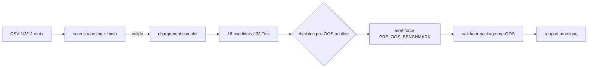

# Plan - R4-long : benchmark donnees longues et scalabilite du runner

> Sous-chantier 4/4 de
> `EPIC_MATURITE_MOTEUR_CAMPAGNE_RECHERCHE`. Le brouillon d'intake a ete
> audite et converge en deux passes `/evaluate` le 2026-07-20. Ce plan mesure
> une capacite operationnelle ; il n'ouvre jamais l'OOS et ne transforme pas
> un verdict `DENIED`/`FAIL` en succes scientifique.

## 0. Bandeau de statut (a verifier avant toute promotion)

| Question | Reponse |
| --- | --- |
| Un chantier actif couvre-t-il deja ce perimetre ? | Non. `.ai/checkpoint.json::active_workstream_id` est `null`; aucun workstream R4-long n'existe. |
| Un verrou de gouvernance actif bloque-t-il ce chantier ? | Non pour mesurer le chemin pre-OOS. Le benchmark utilisera un scope executable `PRE_OOS_BENCHMARK` qui retourne avant toute boucle OOS, meme si les gates deviennent plus tard autorisants; le refus actuel sur `wrc_pass` reste publie comme constat, pas comme seul mecanisme de securite. |
| Decision humaine necessaire avant routage ? | Non. Les budgets operationnels sont preregistres apres un smoke pre-OOS. Une decision ne sera requise que si la cellule 1 an depasse encore son budget apres correction raisonnable. |
| Remplace-t-il un chantier existant ? | Non. Il execute le Lot 4 de l'EPIC sans rouvrir R4 intraday ni R7 clos. |
| Test multi-lot | `SINGLE`. Qualite CSV -> benchmark -> rapport sont dependants, non reordonnables, et un blocage qualite contamine les phases suivantes. |

## Audit IA de promotion

- [x] Bootstrap, hook, tracking, point d'entree Protocole et checklist lus.
- [x] Bandeau verifie contre l'etat machine du 2026-07-20.
- [x] Nouveau fichier backlog cree; intake conserve jusqu'a `plan.ps1 start`.
- [x] Track `mainline` : capacite de campagne R4-long, pas correction de facade.
- [x] `EBTA_Protocol_Guardian`, `epic-orchestrator`,
      `code-architecture-evaluator` et `nautilus-docs-research` appliques.
- [x] Autorites : SOP 04 (Walk-Forward), SOP 10 (acces OOS), SOP 12
      (reproductibilite) et contrat package; aucune modification normative.
- [x] Perimetre ferme section 5; aucune extension/schema/dependance requise.
- [x] Prerequis donnees `DISPONIBLE` : 72 CSV mensuels/actif, 2020-2025;
      1 an 2020 scanne sans anomalie structurelle sur 509 760 lignes/actif.
- [x] Etat du loader, snapshot, splitter et runner verifie directement.
- [x] Intake converge en deux passes; smoke XAUUSD 1 mois = 47,086 s,
      `DENIED(wrc_pass)`, aucun journal OOS.

## Triage

| Champ | Valeur |
| --- | --- |
| Track | `mainline` |
| Lifecycle | `TRIAGED` |
| Type de chantier | `SINGLE` |
| Scope | Construire un validateur CSV streaming et un benchmark reproductible 1/3/12 mois qui mesure qualite, chargement et pipeline Test conjoint NASDAQ+XAUUSD, puis versionner un rapport de budget honnete. |
| Non-goals | Ne pas modifier `Protocole/`/schemas/gates; ne pas calibrer R5/R6; ne pas ouvrir OOS; ne pas optimiser la strategie; ne pas promettre qu'une fenetre chargee a ete integralement simulee; ne pas toucher BACKTRADER. |
| Source | `/continue` du 2026-07-20 sur `EPIC_MATURITE_MOTEUR_CAMPAGNE_RECHERCHE`, Lot 4, et intake audite `0 - HUMAN START HERE/PLAN_BENCHMARK_DONNEES_LONGUES_R4_LONG.md`. |
| Exit criteria | (1) inspection exacte >10 000 barres et tests negatifs qualite; (2) rapport canonique 1/3/12 mois, deux actifs et cellule pipeline conjointe par fenetre; (3) temps, peak RSS arbre, barres chargees/simulees, couverture, 16 candidats/32 segments, ordres et budgets; (4) OOS zero et refus atteste; (5) build/validateur package reels sans facade; (6) cellule 1 an dans budget ou decision humaine explicite; (7) suite, Pyrefly, bug-hunter et conformance PASS. |

## Statut

| Champ | Valeur |
| --- | --- |
| Statut | `PRET_A_CLOTURER - IMPLEMENTATION ET AUDITS PASS` |
| Date de creation | 2026-07-20 |
| Date d'activation | 2026-07-20 |
| Autorite normative | `Protocole/` : SOP 04, SOP 10, SOP 12 et `PAQUET D'EXECUTION EBTA.md` |
| Autorite executable | `Implementation/ebta_engine/data`, `package_builder`, adaptateur Nautilus existant |
| Changement normatif attendu | Aucun |
| Dependances externes | CSV locaux `NASDAQ 1m`/`XAUUSD 1m` disponibles; venv Nautilus 1.230.0 disponible; aucune nouvelle dependance |

## Carte d'execution IA (lecture prioritaire pour `/continue`)

| Champ | Contenu operationnel |
| --- | --- |
| Objectif executable | Produire `Implementation/benchmarks/r4_long/benchmark_report.json` depuis les trois fenetres preregistrees, avec preuve pre-OOS et budgets. |
| Autorite et lecture minimale | Ce plan -> SOP 04/10/12 -> `local_ohlcv.py` -> `walk_forward.py` -> `nautilus_research_package.py` -> `nautilus_mapping.py` -> tests. |
| Perimetre autorise | Liste fermee section 5 uniquement. |
| Interdits absolus | OOS, Protocole/schemas/gates/R5-R6, approbations, BACKTRADER, mock comme mesure canonique. |
| Phase de reprise | Phase 1, contrat qualite streaming et tests negatifs. |
| Preuve attendue | Tests cibles/complets, CLI canonique, JSON/README, validator reel, Pyrefly et audits. |
| Arret et escalade | OOS inopinement `AUTHORIZED`; extension hors perimetre/normative; 1 an encore hors budget apres une correction raisonnable. |

## 1. Role de ce document et non-objectifs

| Element | Role |
| --- | --- |
| `Protocole/` | Autorite scientifique : ordre Walk-Forward, non-consultation OOS, reproductibilite. |
| `Implementation/` | Traduction executable et mesures techniques. |
| `.ai/` | Orchestration non normative du workstream. |
| Rapport R4-long | Preuve operationnelle versionnee, jamais verdict scientifique. |
| Ce plan | Perimetre, ordre, contrats, budgets et controles de cloture. |

Ce document ne modifie aucune regle scientifique, ne remplace pas le gate OOS,
ne qualifie pas une strategie et ne fait pas d'une projection une mesure.

## 2. Contexte obligatoire a lire avant de coder

1. `AGENTS.md`, `.ai/README.md`, checkpoint, hook et tracking actifs.
2. Ce plan et `EPIC_MATURITE_MOTEUR_CAMPAGNE_RECHERCHE.md`.
3. `Protocole/0-README - Comprendre et maintenir le protocole EBTA.md`.
4. SOP 04, SOP 10, SOP 12 et `PAQUET D'EXECUTION EBTA.md`.
5. `.ai/governance/AI_MODIFICATION_CHECKLIST.md`.
6. `local_ohlcv.py`, `walk_forward.py`, `nautilus_research_package.py`,
   `nautilus_mapping.py`, `package_validator.py` et tests associes.
7. `Implementation/adapters/nautilus_env/NAUTILUS_API_NOTES.md`.

Hierarchie : Protocole gele > contrat package > Implementation > benchmark et
adaptateur. Une absence de preuve produit un statut explicite, jamais un PASS.

## 3. Table des gates

| Ordre | Gate | Question | Sortie si echec |
| --- | --- | --- | --- |
| B0 | Prerequis | Donnees, venv et budgets preregistres sont-ils disponibles ? | `BLOCKED` avant run canonique |
| B1 | Qualite | Chaque fenetre est-elle lisible et structurellement valide ? | `DATA_INVALID`, pipeline non lance |
| B2 | Budget | Cellule terminee sous timeout et 8 Gio peak RSS arbre ? | `BUDGET_EXCEEDED` |
| B3 | Cardinalite/alignement | Pipeline conjoint a-t-il 16 candidats, 32 segments Test et des bornes de folds alignees entre actifs ? | `ERROR` |
| B4 | OOS | Le scope `PRE_OOS_BENCHMARK` s'est-il arrete avant la boucle OOS, avec zero lecture/execution/journal OOS, quel que soit le verdict des gates ? | `NO GO`, arret immediat |
| B5 | Package | Build et validateur ont-ils retourne leurs statuts reels sans exception/facade ? | `ERROR`, rapport non canonique |
| B6 | Publication | Toutes les cellules et empreintes sont-elles presentes dans un JSON atomique ? | Ne pas versionner |

## 4. Etat des lieux (avant/apres) - reutiliser avant de recreer

### Ce qui existe deja

| Module | Role reel verifie | Decision |
| --- | --- | --- |
| `data/local_ohlcv.py` | Liste/charge CSV; snapshot limite a 10 000 barres et hash noms+tailles. | Etendre, ne pas dupliquer parsing/racine. |
| `data/walk_forward.py` | Splitter generique; builder lui passe un index journalier mais tailles fixes 2/1/1. | Observer la couverture; ne pas changer SOP/schedule dans ce lot. |
| `package_builder/nautilus_research_package.py` | Charge toute fenetre, construit 16 candidats/32 Test pour deux actifs, puis entre dans la boucle OOS si les gates autorisent. | Reutiliser; ajouter un scope pre-OOS explicite et instrumentation optionnelle, avec defaut production inchange. |
| `adapters/nautilus_mapping.py` | Runner reel Nautilus; 1 worker par defaut pour stabilite Windows. | Reutiliser tel quel sauf aucun changement prevu. |
| `validators/package_validator.py` | Retourne le verdict package derive. | Appeler et publier le verdict reel. |

### Ce qui manque reellement

| Brique | Cible | Reutilisation imposee |
| --- | --- | --- |
| Inspection streaming exacte | `data/local_ohlcv.py` | `parse_utc_timestamp`, `list_asset_files`, `REQUIRED_COLUMNS`; conserver le `checksum` historique et ajouter `content_checksum` |
| Orchestrateur/worker benchmark | `ebta_engine/benchmarks/long_data.py` | builder en scope pre-OOS, validator, stdlib subprocess/horloges/hash |
| Contrats et tests negatifs | tests cibles | fixtures temporaires, runners espions seulement en tests |
| Preuve canonique lisible | `Implementation/benchmarks/r4_long/` | sortie du CLI, aucune edition manuelle des mesures |

## 5. Decision d'architecture

Principe : mesurer trois couches sans les confondre : source CSV, materialisation
Python, pipeline conjoint Test. Le processus parent orchestre des workers isoles,
mesure leur arbre et assemble atomiquement la preuve. Le builder expose un scope
ferme `PRE_OOS_BENCHMARK` qui retourne juste apres la decision pre-OOS et avant
toute construction/lecture/execution d'un segment OOS. Le scope de production
reste la valeur par defaut et conserve son comportement actuel.



### Frontieres

| Couche | Elle fait | Elle ne fait pas |
| --- | --- | --- |
| Inspecteur | Compte, valide structure, hash contenu, rapporte gaps. | Inventer un calendrier de marche ou charger toutes les barres. |
| Worker donnees | Mesure scan/chargement par actif. | Simuler une strategie. |
| Worker pipeline | Execute l'univers conjoint Test, observe cardinalite/ordres et demande le scope `PRE_OOS_BENCHMARK`. | Construire/lire/executer un segment OOS, recalibrer R5/R6, appeler une projection mesure. |
| Parent | Timeout, statuts, atomicite et `peak_tree_rss_bytes = max_t(sum(RSS des processus vivants de l'arbre a t))`. | Modifier un resultat worker ou sommer des pics individuels non simultanes. |
| Rapport | Publie environnement, mesures et verdicts. | Certifier une performance scientifique. |

### Contrat de rapport

Le JSON porte `schema_id = "ebta.r4_long_benchmark.v1"`, les fenetres UTC,
assets, empreintes sources/code, environnement, budgets, cellules donnees,
cellules pipeline, statuts package/OOS et synthese. Toute duree est en secondes,
toute memoire en octets, tout compteur en entier. `measured` et `projected` sont
des branches distinctes; aucune projection n'alimente un critere de succes.

### Decisions actees

| Decision | Justification |
| --- | --- |
| Workstream unique | Dependances qualite -> benchmark -> rapport. |
| Fenetres 2020 fixes | Disponibilite verifiee et comparaison progressive reproductible. |
| Qualite par actif, pipeline conjoint | Evite de masquer l'orchestration 16 candidats/32 segments. |
| Timeout 180 s donnees, 240 s pipeline, 18 min global | Preregistre apres smoke 47,086 s mono-actif. |
| Peak RSS arbre <= 8 Gio | Inclut allocations Python/Rust; seuil operationnel sur poste 32 Gio. |
| `checksum` snapshot preserve + nouveau `content_checksum` | Evite une rupture silencieuse de contrat/hash tout en ajoutant une empreinte des octets lus. |
| Alignement des folds inter-actifs mesure | Un meme `fold_id` avec des dates divergentes ne peut pas etre masque par la seule cardinalite. |
| Build `DENIED`/validator `FAIL` admissibles | Verdicts reels; R5/R6 restent hors scope et preuve globale ulterieure. |
| Scope ferme `PRE_OOS_BENCHMARK` | Un simple controle apres retour serait trop tard si les gates devenaient autorisants; le chemin benchmark doit retourner avant la boucle OOS. |
| Aucun nouveau mode streaming Nautilus | Le lot mesure d'abord l'architecture reelle; toute refonte serait un nouveau perimetre si necessaire. |

### Structure cible

```text
Implementation/
  ebta_engine/
    benchmarks/__init__.py
    benchmarks/long_data.py
    data/local_ohlcv.py
    tests/test_local_ohlcv.py
    tests/test_long_data_benchmark.py
  benchmarks/r4_long/
    README.md
    benchmark_report.json
```

### Perimetre de fichiers explicite

Autorises :

```text
Implementation/ebta_engine/data/local_ohlcv.py                         MODIFIER
Implementation/ebta_engine/benchmarks/__init__.py                      CREER
Implementation/ebta_engine/benchmarks/long_data.py                     CREER
Implementation/ebta_engine/tests/test_local_ohlcv.py                   MODIFIER
Implementation/ebta_engine/tests/test_long_data_benchmark.py           CREER
Implementation/benchmarks/r4_long/README.md                            CREER
Implementation/benchmarks/r4_long/benchmark_report.json                CREER
Implementation/ebta_engine/package_builder/nautilus_research_package.py MODIFIER CONDITIONNEL instrumentation seulement
Implementation/ebta_engine/tests/test_nautilus_research_package.py      MODIFIER CONDITIONNEL test instrumentation
.ai/backlog/mainline/PLAN_BENCHMARK_DONNEES_LONGUES_R4_LONG.md         MODIFIER suivi/cloture
```

Interdits :

```text
Protocole/                              NORME GELEE
Implementation/ebta_engine/schemas/    CONTRATS GELES
Implementation/ebta_engine/procedures/ GATES/WRC/R5-R6 HORS SCOPE
Implementation/ebta_engine/risk/       R6 HORS SCOPE
Implementation/ebta_engine/adapters/   ADAPTATEUR REUTILISE SANS MODIFICATION
BACKTRADER                              REFERENCE SEULEMENT
.ai/checkpoint.json                    UNIQUEMENT plan.ps1
```

## 6. Decoupage en phases

### Phase 1 - Inspection streaming et snapshot exact

Objectif : etablir une preuve de qualite et de volumetrie exacte sans charger
toute la fenetre.

Classification : IMPLEMENTATION_DETAIL

Actions :

- Implementer le scan streaming : header, UTC, ordre strict, doublons, finitude,
  enveloppe OHLC, volume, bornes, gaps descriptifs et SHA-256 contenu.
- Remplacer le comptage snapshot tronque par le rapport exact, conserver la
  semantique du champ `checksum` existant et ajouter `content_checksum`.
- Ajouter fixtures >10 000 et cas negatifs unitaires.

Livrables :

- Contrat d'inspection et snapshot exact testes.

Critere de sortie :

- Tests cibles PASS; une barre invalide echoue explicitement; compte >10 000 exact.

### Phase 2 - Runner de benchmark isole et budgete

Objectif : mesurer donnees et pipeline Test conjoint sans OOS.

Classification : ADAPTER_MAPPING

Actions :

- Implementer parent/worker, timeouts, mesure peak RSS arbre et statuts fermes.
- Ajouter au builder un scope type ferme `FULL_RESEARCH_PACKAGE` (defaut) /
  `PRE_OOS_BENCHMARK`; ce dernier retourne apres cache/decision pre-OOS et avant
  toute boucle OOS. Tester que le defaut production reste identique.
- Instrumenter minimalement le builder pour compter barres/segments Test,
  sans modifier selection, ordre, resultats ni autorisation.
- Verifier cardinalite 16 candidats/32 Test, alignement des bornes de folds par
  actif et agreger les ordres reels.
- Tester timeout, erreur, budget memoire, cardinalite et atomicite avec workers
  fixtures; aucun mock ne sert au rapport canonique.

Livrables :

- CLI `python -m ebta_engine.benchmarks.long_data` et tests.

Critere de sortie :

- Tests cibles PASS; scope benchmark prouve zero execution/journal OOS avec
  decision `DENIED` ET avec decision fixture `AUTHORIZED`.

### Phase 3 - Run canonique 1/3/12 mois

Objectif : produire les mesures reproductibles sur donnees reelles.

Classification : IMPLEMENTATION_DETAIL

Actions :

- Executer les fenetres `2020-01-01..01-31`, `..03-31`, `..12-31`.
- Mesurer deux cellules donnees et une cellule pipeline conjointe par fenetre.
- Enregistrer environnement, empreintes, build/validator/OOS et rapport atomique.
- Si 1 an depasse le budget : diagnostiquer/corriger dans le perimetre puis
  reexecuter comme nouvelle version; sinon escalader avant cloture.

Livrables :

- `benchmark_report.json` genere et `README.md` d'interpretation.

Critere de sortie :

- Rapport complet, 1 an dans budget, OOS zero, validator retourne sans exception.

### Phase 4 - Validation et audits de cloture

Objectif : prouver absence de regression et conformite au plan.

Classification : IMPLEMENTATION_DETAIL

Actions :

- Executer tests cibles, suite complete, smoke package et validation du rapport.
- Appliquer bug-hunter sur tout le diff Implementation puis Pyrefly.
- Appliquer plan-conformance-audit avant `/close`.

Livrables :

- Preuves de tests/audits et section 13 remplie.

Critere de sortie :

- Zero bug confirme, zero Exit criterion manquant, JSON canonique relisible.

Chemin critique : Phase 1 -> Phase 2 -> Phase 3 -> Phase 4.

## 7. Artefacts produits

| Etape | Sortie | Format | Regle |
| --- | --- | --- | --- |
| 1 | rapport d'inspection retourne au snapshot | dict JSON-compatible | exactitude/reproductibilite |
| 2 | CLI benchmark | module Python | isolation/budget/OOS |
| 3 | `benchmark_report.json` | JSON canonique v1 | preuve R4-long |
| 3 | `README.md` | Markdown | distinguer mesure, projection, limites |

## 8. Invariants absolus et NO GO

1. Aucun segment OOS n'est construit avec ses barres, lu ou execute dans le
   scope benchmark; meme `AUTHORIZED` retourne avant la boucle OOS.
2. Une fenetre chargee n'est pas dite simulee; couverture publie les deux
   volumes et toute divergence de bornes inter-actifs.
3. Hash, compte, duree, memoire, ordres et verdicts proviennent de l'execution.
4. `BUDGET_EXCEEDED`, `DATA_INVALID`, `ERROR`, `DENIED`, `FAIL` et
   `INCONCLUSIVE` ne sont jamais convertis en `COMPLETED`/`PASS`.
5. Rapport final ecrit atomiquement; aucun JSON partiel n'est une preuve.

NO GO : changer splitter/SOP/gates/R5-R6; modifier adaptateur Nautilus; ajouter
une dependance; utiliser un runner fake dans le canonique; exposer OOS; augmenter
un budget apres resultat sans nouvelle version/justification; toucher BACKTRADER.

## 9. Verification a chaque etape

```powershell
Implementation\adapters\nautilus_env\venv\Scripts\python.exe -m unittest Implementation.ebta_engine.tests.test_local_ohlcv Implementation.ebta_engine.tests.test_long_data_benchmark
Implementation\adapters\nautilus_env\venv\Scripts\python.exe -m unittest discover -s Implementation\ebta_engine\tests -t Implementation
Implementation\adapters\nautilus_env\venv\Scripts\python.exe -m ebta_engine.benchmarks.long_data --output Implementation\benchmarks\r4_long\benchmark_report.json
Implementation\adapters\nautilus_env\venv\Scripts\python.exe -m json.tool Implementation\benchmarks\r4_long\benchmark_report.json > $null
pyrefly check Implementation\ebta_engine\data\local_ohlcv.py Implementation\ebta_engine\benchmarks\long_data.py
```

Le run canonique utilise le venv Nautilus et le data root resolu. Les tests de
timeout/erreur utilisent des workers fixtures, clairement labels, jamais le
rapport versionne. Le hash de code porte sur les fichiers mesures plutot que sur
un commit qui ne peut inclure son propre rapport.

Execution sans interruption autorisee dans ce perimetre. Arrets legitimes :
donnee/venv indisponible; extension normative/hors liste; `AUTHORIZED` inattendu;
1 an hors budget apres correction; toutes phases finies.

## 10. Journal des decisions humaines

| Date | Decision | Portee |
| --- | --- | --- |
| 2026-07-20 | `/continue` de l'EPIC de maturite. | Autorise l'execution du Lot 4 dans son perimetre. |
| 2026-07-20 | R5/R6 et approbations restent en attente de choix. | R4-long peut mesurer le chemin pre-OOS mais ne les calibre/invente pas. |

## 11. Risques et blocages connus

| Risque | Impact | Mitigation |
| --- | --- | --- |
| Snapshot historique tronque 10 000 | Fausse volumetrie longue. | Scan exact Phase 1 et regression >10 000. |
| Splitter fixe ne consomme que quelques jours | Faux claim « runner 1 an ». | Publier charge/simule/couverture; pas de refonte silencieuse. |
| Allocations Rust/enfants invisibles a tracemalloc | Memoire sous-estimee. | Peak working set agrege de l'arbre OS. |
| Sous-processus Windows sequentiels | Runtime long. | Timeout par cellule/global, statuts partiels atomiques. |
| Build pre-OOS incomplet car R5/R6 | Validator peut FAIL. | Publier le verdict; validation globale apres R5/R6. |
| Gates futurs autorisants | Un controle apres retour ouvrirait deja l'OOS. | Scope builder ferme qui retourne avant la boucle, teste avec autorisation fixture. |
| Donnees sans calendrier venue normatif | Gaps ambigus. | Rapporter, ne pas declarer invalides sur hypothese. |

## 12. Definition of Done

- [x] Phases 1-4 validees.
- [x] Exit criteria du triage atteints.
- [x] Aucun fichier hors liste modifie.
- [x] Rapport canonique relisible et regenerable, trois fenetres completes.
- [x] OOS zero prouve; aucun journal/serie OOS.
- [x] Suite complete, Pyrefly, bug-hunter et conformance PASS.
- [x] Checklist post-modification executee.
- [x] Aucun stub/mock/placeholder ne sert de preuve canonique.

## 13. Cloture

| Champ | Valeur |
| --- | --- |
| Resultat final | `PRET_A_CLOTURER` - 7/7 Exit criteria implementes; aucun manque. |
| Ecarts | Aucun ecart de perimetre. Le pilote minimal regenere retourne le `FAIL` G14 honnete deja attendu; ses fichiers generes ont ete remis au baseline car hors scope. |
| Suites hors perimetre | Revalidation package globale apres R5/R6; refonte streaming seulement si benchmark l'exige. |

### Resultat d'execution

| Champ | Valeur |
| --- | --- |
| Date | 2026-07-20 |
| Phases executees | 1-4 |
| Artefact produit | `Implementation/benchmarks/r4_long/benchmark_report.json` (`COMPLETED`, 316,074 s) et README |
| Validation | 195 tests PASS; Pyrefly 0; JSON/empreintes PASS; bug-hunter 0 bug ouvert; conformance 7/7 IMPLEMENTE; Guardian CONFORME |
| Ecart | Aucun. Rapport : 1 an = 1 019 520 barres chargees, 5 760 Test uniques, 46 080 bar-evaluations, 28 ordres, peak RSS 995 188 736 octets, OOS 0. |

## 14. Journal d'audits post-hoc

| Date | Passe | Correction |
| --- | --- | --- |
| 2026-07-20 | Intake `/evaluate` 1 | Ajout hash contenu, gaps descriptifs, peak RSS arbre, environnement et budgets preregistres. |
| 2026-07-20 | Intake `/evaluate` 2 | Ajout cellule pipeline conjointe 16 candidats/32 Test; distinction budget dur/seuil memoire; convergence sans nouveau blind spot majeur. |
| 2026-07-20 | Plan route `/evaluate` 1 | Ajout du scope `PRE_OOS_BENCHMARK` : securite independante du verdict futur des gates, defaut production inchange, test `AUTHORIZED` sans OOS. |
| 2026-07-20 | Plan route `/evaluate` 2 | Preservation checksum historique + content hash distinct, alignement folds inter-actifs, definition non ambigue du peak RSS arbre; convergence sans nouveau blind spot majeur. |
| 2026-07-20 | Bug-hunter | Pyrefly 13 -> 0 (portabilite `sysconf` et inference dict heterogene); deux vrais contrats runtime corriges : `DATA_INVALID` structure et pipeline non lance si prerequis data echoue. Suite 195 PASS. |
| 2026-07-20 | Plan-conformance-audit | 7/7 Exit criteria `IMPLEMENTE`; aucun `MANQUANT`, `HORS-SCOPE` ou non-goal viole. Cloture autorisee. |
| 2026-07-20 | EBTA_Protocol_Guardian | `CONFORME` : aucune norme/schema/gate modifie; scope pre-OOS bloque toute execution OOS; verdicts reels preserves. |
