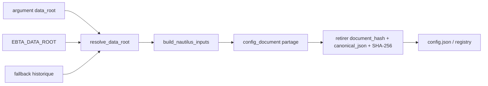

# Plan - Lot 1 R7 : reproductibilite operationnelle

> Sous-chantier 1/4 de
> `EPIC_MATURITE_MOTEUR_CAMPAGNE_RECHERCHE`. Ce plan est un chantier unique :
> resolution du data root, empreinte de configuration et documentation du venv
> sont trois phases sequentielles d'un meme contrat de reproductibilite.

## 0. Bandeau de statut (a verifier avant toute promotion)

| Question | Reponse |
| --- | --- |
| Un chantier actif couvre-t-il deja ce perimetre ? | Non. Le chantier mere est `TRIAGED` et le backend interdit son activation directe tant que ses enfants ne sont pas `DONE`. Aucun workstream `PLAN_REPRODUCTIBILITE_OPERATIONNELLE_R7` n'existe. |
| Un verrou de gouvernance bloque-t-il ce chantier ? | Non. Il encode SOP 12 sans changer la norme, les schemas ou une API Nautilus. |
| Une decision humaine est-elle requise avant routage ? | Non. La demande `/continue` du 2026-07-20 autorise le Lot 1 dans l'ordre delegue du chantier mere. |
| Le plan remplace-t-il un chantier existant ? | Non. Il traite R7, explicitement ouvert par l'audit de maturite. |
| Test multi-lot | `SINGLE_CHANTIER`. Les trois phases partagent un seul Exit criteria ; le hash depend de la configuration assemblee et la preuve venv complete le meme contrat de reproduction. Un blocage du resolver ou du hash invalide le lot entier. |

## Audit IA de promotion

- [x] Bootstrap lu : `AGENTS.md`, `.ai/README.md`, `.ai/checkpoint.json`, point d'entree Protocole, checklist de modification.
- [x] `EBTA_Protocol_Guardian`, `epic-orchestrator` et `code-architecture-evaluator` appliques.
- [x] Constats reverifies dans le code le 2026-07-20.
- [x] Brouillon source audite et converge en deux passes avant `/start`.
- [x] Autorite normative identifiee : SOP 12 et `PAQUET D'EXECUTION EBTA.md`.
- [x] Perimetre ferme et fichiers interdits explicites.
- [x] Aucune dependance, migration de schema ou decision normative requise.

## Triage

| Champ | Valeur |
| --- | --- |
| Track | `mainline` |
| Lifecycle | `TRIAGED` |
| Type de chantier | `SINGLE_CHANTIER` - trois phases sequentielles sous un Exit criteria commun. |
| Scope | Rendre le build Nautilus reproductible hors de cette machine : data root injectable, SHA-256 reel de la configuration preenregistree et procedure canonique de recreation du venv. |
| Non-goals | Ne pas traiter R5/R6, modifier les schemas ou `Protocole/`, recalibrer un gate, changer une API Nautilus, committer un venv ou regenerer le package persistant final. |
| Source | `0 - HUMAN START HERE/PLAN_REPRODUCTIBILITE_OPERATIONNELLE_R7.md`, Lot 1/4 du chantier mere. |
| Exit criteria | Precedence argument > `EBTA_DATA_ROOT` > fallback historique prouvee ; build sans argument utilisant le resolver ; `document_hash` egal au SHA-256 canonique du document `config.json` effectif hors champ auto-referentiel ; README distinguant le venv canonique court et le venv historique de compatibilite ; tests cibles, suite complete et analyses statiques PASS. |

## Statut

| Champ | Valeur |
| --- | --- |
| Statut | `ACTIVE - IMPLEMENTATION TERMINEE, AUDITS DE CLOTURE PASS` |
| Date de creation | 2026-07-20 |
| Date d'activation | 2026-07-20 |
| Autorite normative | SOP 12 ; `PAQUET D'EXECUTION EBTA.md` section 3.1 |
| Classification | `IMPLEMENTATION_DETAIL` |
| Changement normatif attendu | Aucun |
| Dependances externes | `nautilus_trader==1.230.0`, deja pinne ; aucune nouvelle dependance |

## Carte d'execution IA (lecture prioritaire pour `/continue`)

| Champ | Contenu operationnel |
| --- | --- |
| Objectif executable | Produire un build Nautilus portable dont le data root et l'environnement sont recreables et dont la configuration possede une empreinte reelle. |
| Autorite et lecture minimale | Ce plan ; SOP 12 ; `local_ohlcv.py` ; `nautilus_research_package.py` ; scripts `nautilus_env`. |
| Perimetre autorise | Fichiers listes section 5 uniquement. |
| Interdits absolus | `Protocole/`, schemas, mapping API Nautilus, couts/stress R5/R6, package persistant. |
| Phase de reprise | Phase 1 - tests du resolver et de l'empreinte. |
| Preuve attendue | Tests cibles, suite complete, smoke venv, Pyrefly/bug-hunter et audit de conformite. |
| Arret et escalade | Seulement si le perimetre ferme est insuffisant, si une nouvelle dependance est necessaire ou si une regle normative manque. |

---

## 1. Role de ce document et non-objectifs

| Element | Role |
| --- | --- |
| SOP 12 | Autorite normative sur la reproductibilite et le paquet. |
| `PAQUET D'EXECUTION EBTA.md` | Contrat minimal de `config.json`, dont `document_hash`. |
| `Implementation/ebta_engine/` | Traduction executable a corriger. |
| `Implementation/adapters/nautilus_env/` | Procedure locale de recreation de l'environnement subordonne. |
| Ce plan | Carte executable du Lot 1, sans autorite scientifique propre. |

Non-objectifs :

- ne pas modifier une regle, un gate, un seuil ou un schema EBTA ;
- ne pas toucher au mapping ou aux signatures de l'API Nautilus ;
- ne pas calibrer les couts ou la robustesse ;
- ne pas confondre hash de configuration et checksum des donnees ;
- ne pas produire la preuve globale finale du chantier mere.

## 2. Contexte obligatoire a lire avant de coder

1. `AGENTS.md`, `.ai/README.md`, `.ai/checkpoint.json`.
2. Ce plan et `.agents/skills/epic-orchestrator/SKILL.md`.
3. `Protocole/0-README - Comprendre et maintenir le protocole EBTA.md`.
4. `Protocole/SOP 12 - Reproductibilite et paquet de validation EBTA.md`.
5. `Protocole/PAQUET D'EXECUTION EBTA.md` section 3.1.
6. `Implementation/ebta_engine/data/local_ohlcv.py`.
7. `Implementation/ebta_engine/package_builder/nautilus_research_package.py`.
8. `Implementation/adapters/nautilus_env/setup_env.ps1`, wrapper et requirements.

Hierarchie d'autorite :

```text
1. Protocole/MANIFESTE DE GEL EBTA.md
2. Protocole/PROTOCOLE EBTA.md et registre normatif
3. SOP 12 et PAQUET D'EXECUTION EBTA.md
4. Implementation/
5. Adaptateur Nautilus
```

## 3. Etat des lieux (avant/apres) - reutiliser avant de recreer

### Ce qui existe deja

| Module | Role reel | Suffisant ? |
| --- | --- | --- |
| `local_ohlcv.py` | Charge des CSV depuis un `Path` explicite, construit un snapshot et un checksum. | Partiel : le defaut est absolu et aucun resolver d'environnement n'existe. |
| `build_nautilus_inputs()` | Accepte un `data_root` et le propage aux lectures et `read_paths`. | Partiel : le default argument est lie a l'import. |
| `_write_config()` du pilote | Assemble aujourd'hui directement le document `config.json`. | A extraire en helper pur et reutiliser ; sinon le builder Nautilus dupliquerait la projection du document a hasher. |
| `manifest_builder.py` | Calcule les hashes des artefacts produits. | Ne resout pas le hash auto-referentiel du document de configuration. |
| `procedures._utils.canonical_json` | Serialisation JSON canonique deja testee. | A reutiliser ; ne pas creer une deuxieme convention JSON. |
| `setup_env.ps1` | Cree la venv canonique sous le lecteur court `N:\Implementation\.venv-nautilus`, installe le requirements pinne et fait un smoke import. | Suffisant ; ne pas modifier. Le venv imbrique historique est une compatibilite locale explicite. |

### Ce qui manque reellement

| Brique | Emplacement | Source | Reutilisation |
| --- | --- | --- | --- |
| Resolver du data root | `data/local_ohlcv.py` | SOP 12 | `DEFAULT_DATA_ROOT` reste fallback de compatibilite. |
| Document de config pur | `examples/minimal_pilot_pipeline/build_research_package.py` | Paquet section 3.1 | Extraire le dict actuellement construit par `_write_config()`. |
| Empreinte preenregistree | `package_builder/nautilus_research_package.py` | Paquet section 3.1 | Helper de config exact + `canonical_json` existant + `hashlib.sha256`. |
| Tests de precedence et empreinte | tests cibles | Exit criteria | Fixtures et fake runners existants. |
| Guide venv canonique | `adapters/nautilus_env/README.md` | SOP 12 environnement | Scripts et requirements existants, inchanges. |

## 4. Decision d'architecture

Principe : resoudre les dependances machine au bord du build, puis propager des
valeurs explicites. L'environnement n'est jamais relu au coeur des fonctions de
donnees. L'empreinte couvre exactement le document `config.json` effectif hors
son propre champ `document_hash`, via le meme helper que l'ecriture ; elle ne
duplique donc pas la projection du contrat et n'inclut aucun resultat absent de
ce document.



### Frontieres explicites

| Couche | Elle fait | Elle ne fait pas |
| --- | --- | --- |
| Resolver | Choisit un `Path` selon une precedence testable. | Lire ou valider le contenu CSV. |
| Loader | Lit les donnees depuis le `Path` fourni. | Consulter l'environnement. |
| `config_document()` | Produit l'unique dict ecrit comme `config.json`. | Ecrire sur disque ou calculer un hash. |
| Fingerprint | Retire `document_hash` d'une copie du document exact, puis le canonicalise et le hashe. | Dupliquer la liste des champs ou hasher `document_hash`. |
| Documentation venv | Explique le chemin court canonique et l'override historique. | Requalifier le venv historique en defaut ou changer les scripts. |

### Contrats cibles

```python
def resolve_data_root(
    data_root: Path | str | None = None,
    *,
    environ: Mapping[str, str] | None = None,
) -> Path:
    """Argument explicite > EBTA_DATA_ROOT > DEFAULT_DATA_ROOT."""

def config_document(pilot_inputs: dict) -> dict:
    """Document exact ecrit dans config.json, sans effet de bord."""

def _config_document_hash(pilot: Any, inputs: dict) -> str:
    """SHA-256 uppercase de config_document(inputs) sans document_hash."""
```

`config_document()` devient l'unique projection du schema minimal deja utilisee
par `_write_config()`. `_config_document_hash()` copie ce document, retire
uniquement `document_hash`, applique `canonical_json()` puis SHA-256 uppercase.
Le checksum du snapshot reste la preuve distincte du contenu des donnees. Un
chemin de provenance different modifie legitimement le document effectif et donc
son hash ; aucune normalisation cachee n'est introduite.

### Decisions deja actees

| Decision | Justification |
| --- | --- |
| Variable `EBTA_DATA_ROOT` | Nom explicite et scope repo, sans collision generique. |
| Fallback historique conserve | Compatibilite des tests de parite et usage local. |
| Helper de document partage + canonicalisation existante | Evite deux projections concurrentes de `config.json`. |
| Venv canonique sous `N:\Implementation\.venv-nautilus` | Decision d'architecture deja actee par le plan Nautilus archive : contourne les limites de longueur Windows. Le venv `adapters/nautilus_env/venv` reste une compatibilite locale reutilisable avec `-VenvRelativePath`. |

### Perimetre de fichiers explicite

Autorises :

```text
Implementation/ebta_engine/data/local_ohlcv.py                              MODIFIER
Implementation/ebta_engine/package_builder/nautilus_research_package.py     MODIFIER
Implementation/examples/minimal_pilot_pipeline/build_research_package.py    MODIFIER
Implementation/ebta_engine/tests/test_local_ohlcv.py                        CREER
Implementation/ebta_engine/tests/test_nautilus_research_package.py          MODIFIER
Implementation/ebta_engine/tests/test_minimal_pilot_pipeline.py             MODIFIER
Implementation/adapters/nautilus_env/README.md                              CREER
Implementation/HISTORIQUE DES VERSIONS EBTA ENGINE.md                       MODIFIER
```

Interdits :

```text
Protocole/                                      NORME GELEE
Implementation/ebta_engine/schemas/             SCHEMAS INCHANGES
Implementation/ebta_engine/adapters/             API NAUTILUS HORS SCOPE
Implementation/adapters/nautilus_env/setup_env.ps1           CONSERVER - DEJA CANONIQUE
Implementation/adapters/nautilus_env/setup_nautilus_env.ps1   CONSERVER - WRAPPER DEJA ALIGNE
Implementation/research_packages/               PREUVE GLOBALE DIFFEREE
.ai/checkpoint.json                              UNIQUEMENT VIA plan.ps1
.ai/checkpoint.schema.json                       NE PAS ETENDRE
```

## 5. Decoupage en phases

### Phase 1 - Verrouiller les contrats par tests

Objectif : prouver les comportements manquants avant implementation.

Classification : TEST_FIXTURE

Actions :

- Creer les tests de precedence du resolver, avec environnement injecte.
- Tester `build_nautilus_inputs(data_root=None)` via `EBTA_DATA_ROOT`.
- Tester absence de placeholder, format SHA-256, stabilite et egalite exacte
  avec le hash canonique de `config.json` apres retrait de `document_hash`.

Livrables :

- `test_local_ohlcv.py` et extensions de `test_nautilus_research_package.py`.

Critere de sortie :

- Les tests echouent pour les seules briques R7 absentes, puis passent apres Phase 2.

### Phase 2 - Implementer resolution et empreinte

Objectif : rendre le build portable et sa configuration identifiable.

Classification : IMPLEMENTATION_DETAIL

Actions :

- Ajouter `resolve_data_root()` sans effet de bord cache.
- Rendre les arguments `data_root` des builds nullable et resoudre une fois.
- Extraire `config_document()` du writer pilote et faire reutiliser ce helper
  par `_write_config()`.
- A la fin de l'assemblage des inputs, construire le document exact, retirer
  son champ auto-referentiel, reutiliser `canonical_json` et calculer SHA-256
  uppercase avant tout appel a `pilot.build_package()`.

Livrables :

- Loader, helper de document pilote et package builder corriges.

Critere de sortie :

- Tous les tests cibles R7 passent et le placeholder n'apparait plus dans le chemin de production.

### Phase 3 - Documenter la recreation du venv

Objectif : fournir une procedure unique, pinnee et executable.

Classification : DOCUMENTATION_CLARIFICATION_NEEDED

Actions :

- Documenter creation/recreation canonique sous le lecteur court, smoke, build,
  variable `EBTA_DATA_ROOT` et absence de commit du venv.
- Documenter l'override explicite du venv historique imbrique sans le presenter
  comme le defaut canonique.
- Executer le smoke `-SkipInstall` sur le venv existant via
  `-VenvRelativePath "Implementation\adapters\nautilus_env\venv"`.

Livrables :

- `README.md` executable ; scripts existants inchanges.

Critere de sortie :

- Le chemin canonique et l'override sont non ambigus, et le smoke affiche Nautilus `1.230.0`.

### Phase 4 - Journaliser et valider

Objectif : prouver la non-regression et tracer le changement runtime.

Classification : GOVERNANCE

Actions :

- Ajouter une entree append-only dans l'historique moteur.
- Lancer tests cibles, suite complete, Pyrefly et hygiene du diff.
- Appliquer bug-hunter puis plan-conformance-audit.

Livrables :

- Historique et preuves de validation.

Critere de sortie :

- Toutes les validations sont PASS et aucun bug confirme ne reste ouvert.

### Chemin critique


## 6. Artefacts produits

| Etape | Artefact | Format | Source |
| --- | --- | --- | --- |
| Resolution | `resolve_data_root()` | Python | SOP 12 |
| Empreinte | `identifiers.document_hash` | SHA-256 hex uppercase | Paquet 3.1 |
| Environnement | `nautilus_env/README.md` | Markdown | SOP 12 |
| Trace | Historique moteur | Markdown append-only | Gouvernance runtime |

## 7. Invariants absolus et NO GO

### Invariants

1. Argument explicite > environnement > fallback.
2. Le loader recoit un `Path` explicite et ne lit pas l'environnement.
3. Le hash n'inclut pas lui-meme et utilise exactement la projection de `config.json`.
4. Meme document effectif hors hash = meme hash ; changement du document = hash different.
5. Hash de configuration et checksum de donnees restent distincts.

### NO GO

- Ajouter une dependance ou committer une venv.
- Modifier `Protocole/`, schemas, couts, stress ou mapping Nautilus.
- Hasher l'objet `inputs` complet apres simulation.
- Remplacer le placeholder par une constante differente.
- Affaiblir ou skipper un test existant.

## 8. Verification a chaque etape

```powershell
python -m unittest discover -s Implementation\ebta_engine\tests -t Implementation -p test_local_ohlcv.py
python -m unittest discover -s Implementation\ebta_engine\tests -t Implementation -p test_nautilus_research_package.py
python -m unittest discover -s Implementation\ebta_engine\tests -t Implementation
.\Implementation\adapters\nautilus_env\setup_env.ps1 -VenvRelativePath "Implementation\adapters\nautilus_env\venv" -SkipInstall
.\Implementation\adapters\nautilus_env\venv\Scripts\python.exe -m pyrefly check Implementation\ebta_engine\data\local_ohlcv.py Implementation\ebta_engine\package_builder\nautilus_research_package.py Implementation\examples\minimal_pilot_pipeline\build_research_package.py Implementation\ebta_engine\tests\test_local_ohlcv.py Implementation\ebta_engine\tests\test_nautilus_research_package.py Implementation\ebta_engine\tests\test_minimal_pilot_pipeline.py --output-format min-text
git diff --check -- .ai Implementation Protocole
```

Regle transversale : la suite complete doit rester PASS avant la cloture.

Notes de portabilite : le fallback historique est volontairement machine-local ;
la portabilite est fournie par argument ou `EBTA_DATA_ROOT`. Le hash utilise le
document effectif canonicalise, pas son indentation sur disque.

Premier lot executable : tests du resolver dans `test_local_ohlcv.py`.

### Execution sans interruption

Le plan est executable integralement sans retour humain. Arret seulement si une
dependance nouvelle, une modification normative ou un fichier hors perimetre est
necessaire.

### Autorite decisionnelle accordee

Les details internes respectant les signatures cibles, le perimetre et les
invariants peuvent etre tranches par l'IA.

### Interdiction des raccourcis

Un echec est diagnostique, jamais masque ; aucun test n'est desactive ; aucun
placeholder ou stub ne compte comme implementation.

## 9. Journal des decisions humaines (autorisations)

| Date | Decision | Portee |
| --- | --- | --- |
| 2026-07-20 | `/continue` du chantier mere et delegation de l'ordre R7 en premier. | Autorise le cycle complet du Lot 1 dans son perimetre. |

## 10. Risques et blocages connus

| Risque | Impact | Mitigation |
| --- | --- | --- |
| Le default argument reste lie a l'import | Variable d'environnement inoperante | Signature nullable + test integration. |
| Hash contamine par sorties OOS | Fuite et non-reproductibilite | Payload ferme calcule avant resultats. |
| Projection du hash dupliquee du writer | Drift silencieux entre document et hash | Extraire `config_document()` et le reutiliser dans les deux chemins. |
| Deux venv lourdes | Ambiguite et cout disque | Conserver le defaut court deja acté ; documenter l'override existant sans creer de nouvelle venv. |
| Fallback absolu conserve | Portabilite non automatique sans config | Documenter et tester les deux mecanismes portables prioritaires. |

## 11. Definition of Done

- [x] Toutes les phases validees.
- [x] Exit criteria du Triage atteint.
- [x] Tests cibles et suite complete PASS (179 tests).
- [x] Pyrefly/bug-hunter sans bug confirme (0 erreur ; 1 warning non affiche).
- [x] Audit de conformite sans critere manquant.
- [x] Historique moteur append-only mis a jour.
- [x] Aucun fichier hors perimetre modifie.
- [x] Aucun placeholder R7 restant dans le chemin de production ; l'ancien
  package persistant `nautilus_mvp/config.json`, hors perimetre et non regenere,
  reste reserve a la preuve globale de l'EPIC.

## 12. Cloture

| Champ | Valeur |
| --- | --- |
| Resultat final | `DONE` - data root portable, hash reel du document de configuration, environnement recreable documente. |
| Ecarts | Scripts venv volontairement inchanges apres l'audit post-routage : leur defaut court etait deja la decision canonique. Le helper `config_document()` a ete ajoute au perimetre pour eviter une projection de hash concurrente. |
| Suites hors perimetre | Lot 2 R5/R6 du chantier mere. |

### Resultat d'execution

| Champ | Valeur |
| --- | --- |
| Date | 2026-07-20 |
| Phases executees | 1 a 4 |
| Artefact produit | `resolve_data_root()` ; `config_document()` ; SHA-256 reel ; `nautilus_env/README.md` ; tests et historique. |
| Validation | Tests cibles PASS (4 + 7 + 9 + 4) ; suite 179 tests PASS ; minimal pilot package PASS ; smoke Nautilus 1.230.0/Cache PASS ; Pyrefly 0 erreur ; `git diff --check` PASS. |
| Ecart | Aucun ecart fonctionnel. Package Nautilus persistant non regenere, conformement au perimetre et reporte a la preuve globale du chantier mere. |

## 13. Journal d'audits post-hoc

| Date | Correction | Pourquoi |
| --- | --- | --- |
| 2026-07-20 | Brouillon passe 1 : signatures nullable, payload ferme, test integration et scripts inclus. | Fermer les angles morts de binding a l'import, hash de sorties et divergence venv. |
| 2026-07-20 | Brouillon passe 2 : canonicalisation/version du payload explicites. | Garantir la stabilite inter-machine ; convergence sans nouvel angle mort majeur. |
| 2026-07-20 | Plan route, passe 1 : annulation de la proposition d'aligner le defaut sur le venv imbrique ; scripts retires du perimetre. | Le plan Nautilus archive avait deja acte `N:\Implementation\.venv-nautilus` pour contourner les limites Windows. Modifier ce defaut aurait reintroduit le risque et contredit une decision existante. |
| 2026-07-20 | Plan route, passe 2 : remplacement du payload de hash duplique par un helper `config_document()` partage avec `_write_config()` ; ajout du pilote minimal et de son test au perimetre. | Un hash pretendument reel ne doit pas dependre d'une seconde liste de champs susceptible de diverger du document effectivement ecrit. |
| 2026-07-20 | Plan route, passe 3 : aucun nouvel angle mort majeur ; convergence actee. | Les frontieres sont maintenant uniques et testables : resolver au bord, document de config partage, canonicalisation existante, scripts venv inchanges et documentation seule. |
