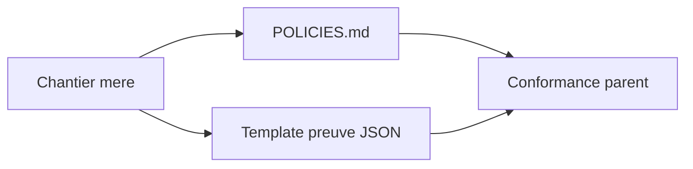

# Chantier mere — Phase 1 policies et preuve de session

## 0. Bandeau de statut

| Question | Reponse |
| --- | --- |
| Un chantier couvre-t-il deja ce perimetre ? | Non. La Phase 0 est `DONE`; la Phase 1 etait explicitement « non proposee ». |
| Un verrou bloque-t-il ce chantier ? | Non. La condition de declenchement « Phase 0 tranchee » est satisfaite. |
| Decision humaine necessaire ? | Non pour le palier documentaire demande par la boucle de cloture. |
| Remplacement ? | Non. |

Test `epic-orchestrator` : **MULTI_LOT**. Les deux livrables ont chacun un Exit
criteria autonome, leur ordre est interchangeable, et un blocage sur l'un ne
bloque pas l'autre.

## Audit IA de promotion

- [x] Source archivee relue aux sections Phase 1, Fil A et veilles #2/#5.
- [x] Deux passes `/evaluate` d'intake convergentes.
- [x] Cockpit et gouvernance relus.
- [x] Aucun changement normatif ou runtime.
- [x] Structure chantier mere retenue selon `epic-orchestrator`.
- [x] Deux sous-chantiers nommes avec perimetres distincts.

## Triage

| Champ | Valeur |
| --- | --- |
| Track | `annexe` |
| Lifecycle | `TRIAGED` |
| Type de chantier | `MULTI_LOT` |
| Scope | Coordonner la livraison separee d'un index déclaratif `POLICIES.md` et d'un template JSON de preuve de session. |
| Non-goals | Ne produire aucun artefact de fond dans le chantier mere ; ne pas creer `lessons-learned/`, de Policy Engine, de validateur, de registre d'etat, de workflow interface ni modifier `Protocole/` ou `Implementation/`. |
| Source | Phase 1 de la feuille de route du brouillon archivé du 2026-07-29, ajoutée à la file de la boucle de clôture le 2026-07-30. |
| Exit criteria | Les deux sous-chantiers existent dans le checkpoint et sont `DONE`; `POLICIES.md` existe et est routé par une ligne courte d'`AGENTS.md`; `.ai/governance/TEMPLATE_PREUVE_SESSION_IA.json` existe et est référencé par `.ai/governance/README.md`; aucun ne revendique une autorité ou garantie mécanique inexistante. |

## Sous-chantiers

| # | ID prevu | Titre |
| --- | --- | --- |
| 1 | PLAN_POLICIES_DECLARATIF_IA | Index declaratif des autorisations IA |
| 2 | PLAN_GABARIT_PREUVE_SESSION_IA | Template JSON de preuve de session IA |

## Statut

| Champ | Valeur |
| --- | --- |
| Statut | `IMPLEMENTE — ENFANTS DONE, /close EN ATTENTE` |
| Date de creation | 2026-07-30 |
| Date d'activation | - |
| Autorite normative | Aucune nouvelle ; `AGENTS.md` et les fichiers pointes restent propriétaires de leurs règles. |
| Autorite executable | Aucune. |
| Changement normatif attendu | Aucun. |
| Dependances externes | Aucune. |

## Carte d'execution IA

| Champ | Contenu |
| --- | --- |
| Objectif executable | Fermer successivement les deux lots, puis ce chantier mere. |
| Lecture minimale | Bootstrap → workflows → epic-orchestrator → ce plan → source archivee. |
| Perimetre autorise | Ce plan et checkpoint via `plan.ps1`; chaque lot porte son propre scope. |
| Interdits absolus | Aucun artefact de fond directement depuis le parent. |
| Phase de reprise | Router puis executer `PLAN_POLICIES_DECLARATIF_IA`. |
| Preuve attendue | Deux enfants `DONE`, conformance du parent, checkpoint schema PASS. |
| Arret et escalade | Nouvelle règle d'autorisation, obligation mécanique ou autorité concurrente. |

## 1. Role de ce document et non-objectifs

Ce document coordonne. Il ne duplique pas le contenu des enfants et ne devient
ni policy, ni preuve de session, ni état parallèle.

Non-objectifs :

- ne pas implémenter les lots ;
- ne pas modifier les règles consolidées ;
- ne pas mécaniser les autorisations ;
- ne pas imposer le template à toutes les sessions sans chantier séparé.

## 2. Contexte obligatoire

1. `AGENTS.md`.
2. `.ai/workflows/common/WORKFLOW.md`.
3. `.agents/skills/epic-orchestrator/SKILL.md`.
4. `.ai/governance/*.md`.
5. Le brouillon archivé du 2026-07-29, lignes relatives à Phase 1.

## 3. Etat des lieux

| Besoin | Existant | Manque |
| --- | --- | --- |
| Autorisations consultables | Règles dispersées dans le bootstrap, les workflows et la gouvernance. | Index déclaratif unique avec sources. |
| Preuve de session | Corps de commit structuré en prose. | Template JSON copiable reliant claims et evidence. |

Les deux manques sont documentaires, indépendants et ne justifient aucune
mécanique d'exécution.

## 4. Decision d'architecture

Le parent porte seulement l'ordre et l'état narratif. Chaque enfant possède
son plan, sa baseline, son commit de livraison, ses gates et sa clôture.



Perimetre parent autorise :

```text
.ai/backlog/annexes/EPIC_PHASE_1_POLICIES_ET_PREUVE_SESSION.md
.ai/checkpoint.json [plan.ps1 uniquement]
```

## 5. Decoupage en phases

### Phase 1 - Livrer les sous-chantiers

Objectif : executer les deux cycles enfants sans fusion.

Classification : GOVERNANCE

Actions :

- router, evaluer, baseliner, continuer et clore
  `PLAN_POLICIES_DECLARATIF_IA`;
- faire de meme pour `PLAN_GABARIT_PREUVE_SESSION_IA`;
- journaliser leur statut dans la suite immediate de ce plan.

Livrables :

- deux workstreams enfants `DONE`.

Critere de sortie :

- les deux IDs declares sont `DONE` dans `.ai/checkpoint.json`.

### Phase 2 - Clore le chantier mere

Objectif : verifier le point fixe de Phase 1 sans ajouter d'artefact.

Classification : GOVERNANCE

Actions :

- appliquer plan-conformance au parent ;
- verifier qu'aucune suite nouvelle ne nait des enfants ;
- clore et archiver le parent.

Livrables :

- parent `DONE`.

Critere de sortie :

- Exit criteria du Triage prouve et checkpoint valide.

## 6. Artefacts produits

| Producteur | Artefact |
| --- | --- |
| Lot 1 | `POLICIES.md` |
| Lot 2 | `.ai/governance/TEMPLATE_PREUVE_SESSION_IA.json` et mise a jour du README |
| Parent | Aucun artefact de fond |

## 7. Invariants absolus et NO GO

1. Les sources citées restent propriétaires de leurs règles.
2. Aucun enfant n'est déclaré `DONE` par le parent.
3. Aucun état parallèle n'est créé.

NO GO :

- fusionner les deux lots ;
- coder un Policy Engine ;
- prétendre qu'un template est automatiquement validé ;
- modifier `Protocole/` ou `Implementation/`.

## 8. Verification a chaque etape

```powershell
python -m json.tool .ai/checkpoint.json
python -c "import json,jsonschema; jsonschema.validate(json.load(open('.ai/checkpoint.json',encoding='utf-8')),json.load(open('.ai/checkpoint.schema.json',encoding='utf-8')))"
git diff --check
```

### Execution sans interruption

Exécuter les enfants successivement. Ne s'arrêter que si une règle nouvelle,
une autorité concurrente ou une obligation mécanique non autorisée apparaît.

### Autorite decisionnelle accordee

L'IA choisit la formulation documentaire et l'ordre des enfants, sans élargir
leurs périmètres.

### Interdiction des raccourcis

Chaque enfant conserve ses deux boucles d'audit, baseline, gates et clôture.

## 9. Journal des decisions humaines

| Date | Decision | Portee |
| --- | --- | --- |
| 2026-07-30 | Exécuter le prompt de boucle de clôture. | Rend la Phase 1 actionnable après clôture de la Phase 0. |

## 10. Risques et blocages connus

| Risque | Mitigation |
| --- | --- |
| `POLICIES.md` devient une autorité concurrente | Pointeurs et clause déclarative obligatoire. |
| Template confondu avec une preuve réelle | Valeurs exemple, mode d'emploi et absence de gate explicités. |
| Lots fusionnés | IDs et cycles séparés. |

## 11. Definition of Done

- [x] Les deux sous-chantiers sont `DONE`.
- [x] Exit criteria du parent prouvé.
- [x] Aucun artefact de fond produit directement par le parent.
- [x] Aucun changement dans `Protocole/` ou `Implementation/`.
- [x] Checkpoint schema et `git diff --check` PASS.
- [x] Plan-conformance du parent sans critère manquant.

## 12. Cloture

| Champ | Valeur |
| --- | --- |
| Resultat final | `DONE` propose : deux enfants fermés et deux artefacts documentaires découvrables. |
| Ecarts | Aucun ; le découpage MULTI_LOT prévu a été respecté. |
| Suites a prevoir | Aucune issue des enfants. Le Policy Engine mécanisé reste Phase 2, conditionné au démarrage du workflow `interface`, donc non actionnable dans cette boucle. |

### Resultat d'execution

| Champ | Valeur |
| --- | --- |
| Date | 2026-07-30 |
| Enfants | `PLAN_POLICIES_DECLARATIF_IA` DONE ; `PLAN_GABARIT_PREUVE_SESSION_IA` DONE. |
| Preuves | `POLICIES.md` existe et est routé une fois par `AGENTS.md`; le template existe et est référencé deux fois dans le README de gouvernance. |
| Frontieres | Aucun diff `Protocole/` ou `Implementation/` depuis la baseline du parent. |
| Gates | Bug-hunter non applicable ; plan-conformance parent PASS ; checkpoint schema et diff check PASS. |

## 13. Journal d'audits post-hoc

| Date | Passe | Correction |
| --- | --- | --- |
| 2026-07-30 | Intake 1 | Format JSON et absence de gate mécanique figés pour le lot preuve. |
| 2026-07-30 | Intake 2 | `lessons-learned/`, Policy Engine et runtime confirmés hors scope ; convergence. |
| 2026-07-30 | Plan normalise 1 | Découvrabilité rendue binaire : `AGENTS.md` route `POLICIES.md`, le README de gouvernance route le template JSON. |
| 2026-07-30 | Plan normalise 2 | Contrôle des frontières parent/enfants, des sources d'autorité et du test MULTI_LOT ; aucun nouvel angle mort majeur, convergence. |
