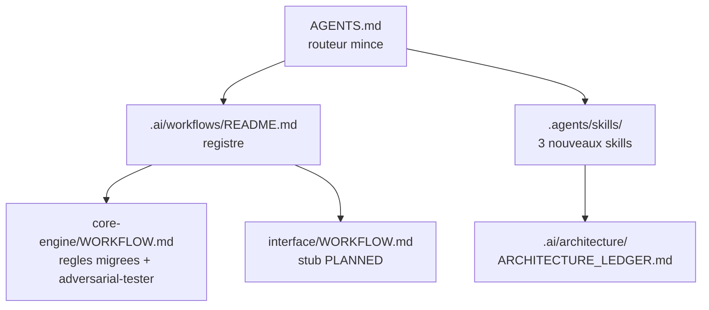
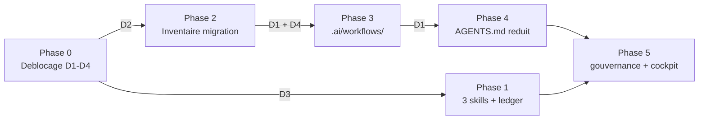

# Plan d'implementation — Formalisation des workflows IA et des trois skills (`adversarial-tester`, `expert-panel`, `agent-architecte`)

> Ce plan est la reecriture structuree, selon
> `.ai/backlog/TEMPLATE_PLAN_IMPLEMENTATION.md`, du brouillon humain
> `0 - HUMAN START HERE/PROPOSITION_FORMALISATION_WORKFLOWS_IA_ADVERSARIAL_EXPERT_PANEL.md`
> (2006 lignes), archive intact par `plan.ps1 start` sous
> `0 - HUMAN START HERE/archive/`. Le brouillon reste la **source
> narrative** : il porte la chronologie complete des 20 etapes de discussion,
> les debats, les fils abandonnes et les 5 passes de la boucle `/evaluate`
> d'intake. Ce plan ne la duplique pas — il encode ce qui est **executable**.
> En cas de divergence sur une intention, le brouillon archive fait foi.

---

## 0. Bandeau de statut

| Question | Reponse |
| --- | --- |
| Un chantier actif couvre-t-il deja ce perimetre (`DONE`, `ACTIVE`, ou `SUPERSEDED`) ? | **Non.** Aucun des 35 workstreams de `.ai/checkpoint.json` (compte verifie le 2026-07-29, ce plan inclus) ne touche `.agents/skills/`, `.ai/workflows/` ou la structure d'`AGENTS.md`. Le plus proche, `EPIC_AI_GOVERNANCE_LAYER` (`DONE`, annexe), a cree `.ai/governance/` sans toucher aux skills ni a `AGENTS.md`. Aucun recouvrement. |
| Un verrou de gouvernance actif bloque-t-il ce chantier ? | **Oui, un.** `.ai/governance/AI_MODIFICATION_CHECKLIST.md` autorise sans decision normative de « Mettre a jour `AGENTS.md` avec une regle courte de lecture de `.ai/governance/` ». **Retirer** des regles d'`AGENTS.md` pour le reduire a un routeur mince n'est ni dans cette liste d'autorisations, ni dans la liste des interdits — zone grise sur le fichier designe « official AI entrypoint ». Verrou leve par la decision D1 de la Phase 0. |
| Ce plan a-t-il besoin d'une decision humaine explicite avant d'etre routable via `/start` ? | **Non pour le routage** (le lot est majoritairement additif). **Oui pour la Phase 4** : la Phase 0 est une phase de deblocage bloquante, decidee par l'humain le 2026-07-29 (voir section 10). Les Phases 1 a 3 sont purement additives et n'attendent que D2/D3/D4. |
| Ce plan remplace-t-il un document ou chantier existant ? | **Non.** Il en cotoie deux, tous deux `INTAKE` et non touches : `PROPOSITION_INTERFACE_PILOTAGE_VISUEL_RECHERCHE_EBTA.md` (D1-D15) et `PROPOSITION_WORKFLOW_VALIDATION_UX_EBTA.md` (ex-`.ai/workflows/`, reclasse `INTAKE` le 2026-07-29). |

---

## Audit IA de promotion

- [x] Plan relu dans le contexte du cockpit actif : `AGENTS.md`, `.ai/README.md`,
      `.ai/checkpoint.json`, `Implementation/Active/HOOK.md`,
      `.ai/governance/AI_MODIFICATION_CHECKLIST.md`, `.ai/tools/plan.ps1`.
- [x] Bandeau de statut (section 0) rempli contre l'etat machine reel :
      `active_workstream_id` est `null`, aucun workstream `ACTIVE`, le hook
      actif declare le chantier Nautilus clos depuis le 2026-07-10.
- [x] Ce plan a ete ECRIT COMME NOUVEAU FICHIER dans `.ai/backlog/annexes/`.
      Le brouillon original n'a jamais ete deplace ni reecrit en place ;
      seules les corrections de la boucle `/evaluate` d'intake y ont ete
      appliquees, conformement a `AGENTS.md` qui impose cette boucle **sur le
      brouillon tel quel** avant restructuration.
- [x] Chantier classe `annexe` — justification en section Triage.
- [x] Autorites normatives identifiees : voir section 2.
- [x] Perimetre de fichiers autorises/interdits explicite en liste fermee
      (section 5).
- [x] Aucune modification hors perimetre requise pour activer le chantier.
- [x] Prerequis factuels identifies : 4 decisions humaines (Phase 0), aucune
      donnee ni acces externe requis.
- [x] Etat des lieux (section 3) verifie fichier par fichier — aucune brique
      proposee ne duplique une logique existante.
- [x] Test de detection multi-lot de `.agents/skills/epic-orchestrator/SKILL.md`
      applique et documente (section Triage).

## Triage

| Champ | Valeur |
| --- | --- |
| Track | `annexe` |
| Lifecycle | `TRIAGED` |
| Type de chantier | `SINGLE` |
| Scope | Creer trois skills (`adversarial-tester`, `expert-panel`, `agent-architecte`) avec leur memoire (`ARCHITECTURE_LEDGER.md`), creer le dossier `.ai/workflows/` avec son registre, un workflow partage `common`, le workflow moteur `core-engine` et le stub `interface`, puis reduire `AGENTS.md` a un routeur mince en migrant fidelement ses regles procedurales vers le workflow qui les possede. |
| Non-goals | Ne pas demarrer le workflow `interface` (D1-D15 non tranches). Ne pas modifier `Protocole/` ni `Implementation/ebta_engine/` — y compris le defaut `_call_float`, qui part en chantier `fix` separe. Ne pas construire la mecanique de routage `workflow` (champ de schema, parametre `-Workflow`, ligne de gabarit) : coupe assumee tant qu'un seul workflow est reel. Ne pas creer `FINDINGS_LOG.md`. Ne pas dupliquer `workflow` dans `tracking.json`. Ne pas toucher `.codex/` ni `.agents/AGENTS.md`. Ne pas introduire de RAG, d'embeddings, de base vectorielle ni d'agents autonomes. Ne pas faire d'`agent-architecte` un declencheur automatique de `/start`. Ne pas trancher le Fil ouvert D (contradiction de gouvernance) — seulement le rendre visible. |
| Source | Brouillon humain depose le 2026-07-29 dans `0 - HUMAN START HERE/`, issu d'une discussion en 19 etapes (veille IA, pivot workflows, 4 debats de conception, conseil des 5). `/start` demande par l'humain le 2026-07-29. Boucle `/evaluate` d'intake obligatoire executee le meme jour : 5 passes, convergence, 18 corrections appliquees au brouillon. Decision humaine du 2026-07-29 : le workflow UX qui occupait `.ai/workflows/` est un brouillon d'une autre discussion, reclasse `INTAKE` — le depot est considere comme n'ayant aucun workflow formalise. Decision humaine du 2026-07-29 : les 4 decisions ouvertes sont encodees en Phase 0 de deblocage bloquante. |
| Exit criteria | (1) Les 13 fichiers de la colonne « Autorises » (section 5) marques `[CREER]` existent, et les 3 marques `[MODIFIER]` portent la modification specifiee en section 6. (2) La table d'inventaire de migration (Phase 2) est integralement soldee : chaque regle d'`AGENTS.md` porte une destination parmi `RESTE` / `MIGRE common` / `MIGRE core-engine` / `SUPPRIMEE`, aucune ligne ne porte le marqueur d'indecision. (3) `.ai/README.md` porte une ligne de role commencant par `` - `workflows/` `` et une commencant par `` - `architecture/` `` (patrons ancres, non satisfiables par le contenu initial du fichier — voir section 9). (4) Chaque chemin de fichier cite dans un fichier cree par ce lot designe un fichier existant (verification manuelle declaree comme telle). (5) Chaque fichier cree sous `.ai/workflows/` est liste dans `.ai/workflows/README.md`. (6) `AGENTS.md` est un routeur mince de 60 lignes maximum et ne porte plus le detail des commandes, boucles d'evaluation ou commits. (7) `git diff --check` retourne exit 0. |

### Resultat du test de detection multi-lot

`.agents/skills/epic-orchestrator/SKILL.md` impose d'appliquer ce test au
moment du `/start` et d'en documenter le resultat explicitement.

| Condition | Verifiee ? |
| --- | --- |
| 1. Chaque composante a son propre Exit criteria verifiable sans dependre des autres | **Non** — un Exit criteria unique couvre l'ensemble (aucune regle perdue **et** aucun orphelin). |
| 2. L'ordre est interchangeable sans changer le sens | **Non** — la Phase 4 (`AGENTS.md` reduit) n'a de sens qu'apres la Phase 3 (`core-engine/WORKFLOW.md` ecrit), sous peine d'un instant sans regle documentee nulle part. |
| 3. Un blocage sur une composante n'empeche pas les autres d'avancer | **Partiellement** — les 3 skills sont autonomes entre eux, mais la chaine Phase 2 → 3 → 4 → 5 est strictement sequentielle. |

Les trois conditions ne sont pas toutes vraies : **chantier `SINGLE`**, gabarit
normal, aucune section `## Sous-chantiers`. Le decoupage en phases de la
section 6 n'est pas un decoupage en lots independants — c'est exactement le
contre-exemple donne par le skill lui-meme.

Test rejoue le 2026-07-30 apres D2bis : resultat **SINGLE** inchange.
`common/WORKFLOW.md` doit etre cree et inscrit avant le retrait des regles
d'`AGENTS.md`; la correction partage le meme Exit criteria et ne peut pas
etre routee ou cloturee independamment du reste de la migration.

### Justification du track `annexe`

Ce lot ne fait pas avancer la mainline runtime : il ne touche ni le moteur,
ni le protocole, ni un package de recherche. Il organise la gouvernance IA.
Precedent direct et assume : `EPIC_AI_GOVERNANCE_LAYER`, route `annexe` avec
la raison « Governance layer documents how knowledge, conflicts, and
modification requests are classified before any protocol or implementation
change ». Meme nature, meme track.

## Statut

| Champ | Valeur |
| --- | --- |
| Statut | `IMPLEMENTE — /close NON EXECUTE` |
| Date de creation | 2026-07-29 |
| Date d'activation | 2026-07-30 |
| Autorite normative | `Protocole/` (non touche par ce lot). Pour le processus IA : `AGENTS.md` puis `.ai/governance/`. |
| Autorite executable | Aucune — ce lot ne produit aucun code. |
| Changement normatif attendu | Aucun. |
| Dependances externes | Aucune. Le corpus `D:\Livre\Veille\IA` (13 documents) est lu en reference pour le remplissage initial du ledger, jamais copie dans le depot. |

## Carte d'execution IA (lecture prioritaire pour `/continue`)

| Champ | Contenu operationnel |
| --- | --- |
| Objectif executable | Treize fichiers de gouvernance IA crees et trois modifies, `AGENTS.md` reduit a un routeur mince de 60 lignes maximum sans qu'aucune de ses regles actuelles ne disparaisse. |
| Autorite et lecture minimale | 1. `AGENTS.md` — 2. `.ai/README.md` — 3. `.ai/checkpoint.json` — 4. `.ai/governance/AI_MODIFICATION_CHECKLIST.md` — 5. le brouillon archive sous `0 - HUMAN START HERE/archive/` pour l'intention de fond — 6. les 5 `SKILL.md` existants sous `.agents/skills/` comme moule de forme. |
| Perimetre autorise | Liste fermee en section 5. Rien hors de cette liste. |
| Interdits absolus | `Protocole/`, `Implementation/`, `.codex/`, `.agents/AGENTS.md`, `Implementation/Active/tracking.json`, `0 - HUMAN START HERE/archive/`. `.ai/checkpoint.json` uniquement via `plan.ps1`. |
| Phase de reprise | **Phase 0 — deblocage.** Les 4 decisions D1-D4 doivent etre obtenues de l'humain avant toute autre phase. Dependances : D3 conditionne la Phase 1, D2 la Phase 2, **D1 les Phases 3 et 4**, D4 la Phase 3. **Nature de l'arret (precisee a la passe 2 de la boucle `/evaluate` sur ce plan)** : `plan.ps1 continue` n'a **aucun** gate correspondant — sa seule garde est `Assert-SubChantiersClosed`, inactive sur un plan `SINGLE`. Il passera ce chantier en `ACTIVE` sans lire la section 10. L'arret en Phase 0 est donc un **contrat procedural que l'IA executante doit tenir elle-meme** : premiere action de tout `/continue`, executer la commande de verification de la Phase 0 (section 9) et refuser d'aller plus loin si elle retourne des lignes. Ne pas ecrire ailleurs que `/continue` « s'arrete » : rien ne l'arrete mecaniquement. |
| Preuve attendue | Les 6 conditions de `Exit criteria` (section Triage), chacune verifiable par une commande de la section 9. |
| Arret et escalade | Toute modification necessaire hors de la liste « Autorises » de la section 5 ; toute decision au-dela de D1-D4 ; toute regle d'`AGENTS.md` dont la destination de migration ne peut pas etre tranchee par D2. |

---

## 1. Role de ce document et non-objectifs

| Element | Role |
| --- | --- |
| `Protocole/` | Autorite normative EBTA. **Hors perimetre total de ce lot.** |
| `Implementation/` | Traduction executable du protocole. **Hors perimetre total de ce lot.** |
| `.ai/` | Cockpit IA : etat projet, backlog, gouvernance de modification. Non normatif scientifiquement. |
| `.agents/skills/` | Catalogue cross-IA de playbooks. Non normatif. |
| `AGENTS.md` | Point d'entree IA officiel du depot. Cible de la reduction en routeur mince. |
| Ce plan | Carte d'implementation : quels fichiers, dans quel ordre, avec quelle preuve. |

Non-objectifs de ce document lui-meme :

- ne pas rejouer la chronologie du brouillon (elle reste dans l'original
  archive, seule source narrative) ;
- ne pas reouvrir les coupes deja tranchees (mecanique de routage `workflow`,
  `FINDINGS_LOG.md`) ;
- ne pas trancher les decisions D1-D4 a la place de l'humain ;
- ne pas faire de `.ai/workflows/` ni de `.ai/architecture/` une autorite
  scientifique EBTA.

---

## 2. Contexte obligatoire a lire avant de coder

1. `AGENTS.md` — c'est a la fois la source de la migration (Phase 2) et la
   cible de la reduction (Phase 4). A lire **integralement**, pas en diagonale :
   la table d'inventaire de la Phase 2 doit couvrir chacune de ses regles.
2. `.ai/README.md` — section « Roles » et « Regle de source de verite », a
   completer en Phase 5.
3. `.ai/governance/AI_MODIFICATION_CHECKLIST.md` — porte le verrou leve par
   D1, et sera modifie en Phase 5.
4. `.ai/checkpoint.json` — en particulier `relay_contract.do_not_create` et
   les risques `R1`/`R3`/`R6`, opposables au `ARCHITECTURE_LEDGER.md`.
5. Le brouillon archive sous `0 - HUMAN START HERE/archive/` — pour toute
   question d'intention non tranchee par ce plan.
6. Les 6 `SKILL.md` sous `.agents/skills/` — moule de forme obligatoire.
   Distinction verifiee : 3 d'entre eux (`bug-hunter`, `epic-orchestrator`,
   `plan-conformance-audit`) portent une section « Ce que ce skill ne fait
   pas » et sont les **gates proceduraux** ; les 3 autres sont des skills
   d'analyse. `adversarial-tester` appartient a la premiere famille, les deux
   autres a la seconde.

**Hierarchie d'autorite applicable a ce chantier** :

```text
1. Protocole/ (non touche)
2. Implementation/ (non touche)
3. AGENTS.md
4. .ai/README.md et .ai/governance/
5. .ai/workflows/ et .agents/skills/ (crees ou modifies par ce lot)
```

Regle : si un fichier cree par ce lot contredit `AGENTS.md` ou
`.ai/governance/`, c'est le fichier cree qui a tort. Si une regle manque,
bloquer et escalader — ne jamais inventer une regle de gate absente.

---

## 3. Etat des lieux (avant/apres) — reutiliser avant de recreer

### Ce qui existe deja

| Module actuel | Chemin | Role reel (verifie, pas suppose) | Suffisant pour l'objectif ? |
| --- | --- | --- | --- |
| Catalogue de skills | `.agents/skills/` | 6 skills. 3 gates proceduraux avec section « ne fait pas » ; 4 avec `EXAMPLE_REPORT.md` ; 2 avec stub `.claude/skills/`. | ⚠️ a etendre — le moule existe, les 3 nouveaux skills manquent |
| Stubs de declenchement | `.claude/skills/` | 2 stubs (`code-architecture-evaluator`, `nautilus-docs-research`), pointeurs purs vers `.agents/skills/`, avec clauses `TRIGGER` **et** `SKIP` bornant le declenchement. | ⚠️ a etendre — modele a suivre pour `expert-panel` et `agent-architecte` |
| Gate reactif de bugs | `.agents/skills/bug-hunter/SKILL.md` | Typage Pyrefly + suite de tests existante. Reactif, jamais adversarial. | ❌ ne couvre pas le besoin — ne pas l'etendre, `adversarial-tester` est distinct |
| Audit d'architecture | `.agents/skills/code-architecture-evaluator/SKILL.md` | Audite un plan ecrit face au code. Structure, SOLID, angles morts. | ✅ suffisant pour son role — ne pas dupliquer dans `expert-panel` |
| Detection multi-lot | `.agents/skills/epic-orchestrator/SKILL.md` | Test de detection a 3 conditions, applique a `/start` et `/continue`. | ✅ deja applique a ce plan (section Triage) |
| Backend mecanique | `.ai/tools/plan.ps1` | `Assert-PlanAuditReady` (structure de plan), `Assert-SubChantiersClosed` (`MULTI_LOT`). Aucun gate de skill. | ✅ suffisant — **ne pas y ajouter de gate** dans ce lot |
| Taxonomies de gouvernance | `.ai/governance/` | 4 politiques descriptives (conflits, intake, checklist, changement normatif). Aucun routage comportemental. | ⚠️ a etendre — checklist a completer (Phase 5) |
| Validateur append-only | `Implementation/ebta_engine/validators/registry_append_only_validator.py` | Controle reel de `registry.jsonl` / `oos_access_log.jsonl`. | ✅ existe — **hors perimetre**, cite uniquement comme contre-exemple du ledger |
| Dossier de workflows | *(inexistant)* | `.ai/workflows/` a ete supprime le 2026-07-29 apres reclassement de son unique fichier en `INTAKE`. Terrain vierge confirme. | ❌ a creer |

### Ce qui manque reellement

| Brique manquante | Module a creer | Source de la regle | Ce qui existe deja et doit etre reutilise |
| --- | --- | --- | --- |
| Passe adversariale sur le code moteur | `.agents/skills/adversarial-tester/SKILL.md` | Brouillon archive, sections « logique interne » et « Detail des fichiers » ; veilles #2 et #6 | Moule des 3 gates proceduraux ; format de `bug-hunter/EXAMPLE_REPORT.md` |
| Debat multi-personas tranchant | `.agents/skills/expert-panel/SKILL.md` | Brouillon archive, etape 13 | Moule de `code-architecture-evaluator` ; clauses `TRIGGER`/`SKIP` de `nautilus-docs-research` |
| Memoire longue veille → architecture | `.agents/skills/agent-architecte/SKILL.md` | Brouillon archive, etapes 18-19 (4 piliers) | Aucun equivalent — nouvelle responsabilite |
| Registre de pratiques de veille | `.ai/architecture/ARCHITECTURE_LEDGER.md` | Brouillon archive, etape 18 pilier 4 ; passes 2 et 3 de la boucle | Ethique append-only de `registry.jsonl`, **sans** son validateur (cf. section 8) |
| Registre des workflows | `.ai/workflows/README.md` | Brouillon archive, etapes 3-4 | Aucun |
| Regles du workflow existant | `.ai/workflows/core-engine/WORKFLOW.md` | Migration fidele d'`AGENTS.md` | `AGENTS.md` lui-meme — **migrer, jamais resumer ni reecrire** |
| Emplacement du workflow futur | `.ai/workflows/interface/WORKFLOW.md` | Brouillon archive ; les deux propositions `INTAKE` | Aucun — stub uniquement |

---

## 4. Decision d'architecture

Principe directeur : **separer le bootstrap universel du manuel de procedure
d'un workflow donne**, sans construire de mecanique de routage tant qu'un
seul workflow est reel.

- Raison 1 — *un seul fichier porte aujourd'hui deux responsabilites*.
  `AGENTS.md` est a la fois le point d'entree universel (ordre de lecture,
  hierarchie d'autorite, forme de commit) et le manuel detaille du seul
  workflow existant (`/start`/`/evaluate`/`/continue`/`/close`, regle
  BACKTRADER, liste des gates). Un second workflow heriterait de regles qui
  ne le concernent pas.
- Raison 2 — *registre de reference, pas mecanisme route*. Le debat de
  simplicite (brouillon, etape 12) a tranche : aucun champ de schema, aucun
  parametre CLI, aucun routage comportemental. `.ai/workflows/README.md` est
  un document de reference que l'IA lit, pas une machine. Cette coupe est un
  non-goal explicite, pas un oubli.
- Raison 3 — *trois skills, trois altitudes distinctes*.
  `adversarial-tester` opere sur un diff (gate bloquant avant `/close`) ;
  `expert-panel` sur une tension de conception ponctuelle (recommande) ;
  `agent-architecte` sur le temps long (memoire des pratiques de veille).
  Aucun ne peut absorber un autre sans perdre son altitude.



### Frontieres explicites

| Couche | Elle fait | Elle NE fait PAS |
| --- | --- | --- |
| `AGENTS.md` | Ordre de lecture, hierarchie d'autorite, forme de commit, pointeur vers le bon `WORKFLOW.md` | Porter le detail procedural d'un workflow particulier |
| `.ai/workflows/<id>/WORKFLOW.md` | Regles, gates et sequence propres a un workflow | Creer une autorite scientifique ; dupliquer une regle d'un autre workflow |
| `.agents/skills/<nom>/SKILL.md` | Procedure d'un role, invoquee par une IA | Executer un changement de structure de sa propre initiative |
| `.ai/architecture/ARCHITECTURE_LEDGER.md` | Etat d'adoption des pratiques issues de la veille externe | Porter un statut de chantier (`status`, `lifecycle`, step/task) — ce serait un cockpit concurrent |

### Decisions deja actees

| Decision | Justification |
| --- | --- |
| Un seul skill adversarial, specialise sur le pattern « succes fabrique / repli silencieux » | Historique reel du depot : chaque bug trouve en est une variante (gates codes en dur a `True`, stub buy-and-hold, `LIVE_LIMITED_STARTED` auto-atteste au commit `3bcfe35`, `_call_float`). Zero race condition, zero corruption de schema jamais observee ici. |
| Pas de `FINDINGS_LOG.md` | Les tests de regression sont deja la protection **et** la memoire. Confirme par la veille #6 (son palier 1 decrit une fiche par incident valide, pas un journal automatique). |
| Pas de mecanique de routage `workflow` | Rien ne route de comportement tant qu'il n'y a qu'un workflow reel. A construire quand `interface` demarre. |
| `adversarial-tester` sans stub `.claude/skills/` | C'est un gate procedural deterministe, invoque a un point precis — meme statut que `bug-hunter`, qui n'en a pas. Les deux autres skills en ont un. |
| Ledger a deux registres (veilles ingerees + pratiques) | Le registre des pratiques est borne par un nombre fini de pratiques recurrentes ; c'est lui qui repond au pilier « Efficacite & Scalabilite ». Le registre des veilles croit lineairement — borne assumee et documentee, pas niee. |
| `agent-architecte` produit un plan, jamais une execution | Ligne rouge du conseil des 5 (brouillon, etape 18). Le passage a l'implementation reste un geste humain (`/start`). Automatiser ce geste rouvrirait l'interdiction `CLAUDE.md` sur les agents autonomes. |
| Invocation d'`agent-architecte` strictement manuelle | Decision humaine (brouillon, etape 19), par simplicite. **Pas** par impossibilite technique : la boucle `/evaluate` a etabli que le remote GitHub existe (`origin https://github.com/LucBrice/EBTA---David-Aronson.git`) et que `CLAUDE.md` interdit les agents autonomes « sans decision humaine explicite », pas de facon absolue. |

### Structure cible

```text
.agents/skills/
  adversarial-tester/       # CREER
  expert-panel/             # CREER
  agent-architecte/         # CREER
  bug-hunter/               # existe deja, conserver
  code-architecture-evaluator/
  epic-orchestrator/
  plan-conformance-audit/
  EBTA_Protocol_Guardian/
  nautilus-docs-research/
.claude/skills/
  expert-panel/             # CREER (stub)
  agent-architecte/         # CREER (stub)
.ai/
  workflows/                # CREER
    README.md
    common/WORKFLOW.md
    core-engine/WORKFLOW.md
    interface/WORKFLOW.md
  architecture/             # CREER
    ARCHITECTURE_LEDGER.md
```

---

## 5. Perimetre de fichiers explicite (autorises / interdits)

**Autorises (creer ou modifier)** :

```text
.agents/skills/adversarial-tester/SKILL.md            [CREER - Phase 1]
.agents/skills/adversarial-tester/EXAMPLE_REPORT.md   [CREER - Phase 1]
.agents/skills/expert-panel/SKILL.md                  [CREER - Phase 1]
.agents/skills/expert-panel/EXAMPLE_REPORT.md         [CREER - Phase 1]
.claude/skills/expert-panel/SKILL.md                  [CREER - Phase 1]
.agents/skills/agent-architecte/SKILL.md              [CREER - Phase 1]
.agents/skills/agent-architecte/EXAMPLE_REPORT.md     [CREER - Phase 1]
.claude/skills/agent-architecte/SKILL.md              [CREER - Phase 1]
.ai/architecture/ARCHITECTURE_LEDGER.md               [CREER - Phase 1]
.ai/workflows/README.md                               [CREER - Phase 3]
.ai/workflows/common/WORKFLOW.md                      [CREER - Phase 3]
.ai/workflows/core-engine/WORKFLOW.md                 [CREER - Phase 3]
.ai/workflows/interface/WORKFLOW.md                   [CREER - Phase 3]
AGENTS.md                                             [MODIFIER - Phase 4]
.ai/governance/AI_MODIFICATION_CHECKLIST.md           [MODIFIER - Phase 5]
.ai/README.md                                         [MODIFIER - Phase 5]
.ai/backlog/annexes/PLAN_FORMALISATION_WORKFLOWS_IA_ET_TROIS_SKILLS.md
                                                      [MODIFIER - Phases 0, 2, 13, 14 : journal de decisions, table d'inventaire, cloture]
```

**Interdits (ne jamais modifier dans ce chantier)** :

```text
Protocole/                          [NORME - intouchable, ce chantier n'est pas normatif]
Implementation/                     [HORS PERIMETRE - y compris nautilus_strategy_bridge.py::_call_float, qui part en chantier fix separe (D3)]
Implementation/Active/tracking.json [GRANULARITE MICRO - ce lot est macro, cf. risque R6]
.ai/checkpoint.json                 [METTRE A JOUR UNIQUEMENT via plan.ps1]
.ai/tools/plan.ps1                  [CONSERVER TEL QUEL - aucun gate de skill ajoute dans ce lot]
.agents/AGENTS.md                   [CONSERVER TEL QUEL - rien a y changer]
.codex/                             [ADAPTATEUR NON NORMATIF - rien a y changer]
0 - HUMAN START HERE/archive/       [TRACABILITE - brouillons archives, jamais reecrits]
0 - HUMAN START HERE/PROPOSITION_INTERFACE_PILOTAGE_VISUEL_RECHERCHE_EBTA.md   [INTAKE d'un autre chantier]
0 - HUMAN START HERE/PROPOSITION_WORKFLOW_VALIDATION_UX_EBTA.md                [INTAKE d'un autre chantier]
```

---

## 6. Decoupage en phases

### Phase 0 - Deblocage des quatre decisions humaines

Objectif : obtenir et journaliser les quatre decisions sans lesquelles les phases suivantes devraient deviner.

Classification : GOVERNANCE

Constat (pourquoi cette phase est necessaire) :

- `.ai/governance/AI_MODIFICATION_CHECKLIST.md` autorise d'ajouter une regle courte a `AGENTS.md`, jamais d'en retirer ; reduire le fichier en routeur mince est une zone grise sur le point d'entree IA officiel du depot.
- La boucle `/evaluate` d'intake (passe 3) a etabli que migrer la boucle `/evaluate` vers `core-engine/` retrecit sans le dire une regle aujourd'hui universelle — aucun decoupage par defaut n'est sur.
- La boucle `/evaluate` d'intake (passe 4) a etabli que `_call_float` est un defaut vivant non corrige sur le chemin de production ; s'en servir comme materiau documentaire sans decider de son sort reviendrait a consigner un bug que personne ne porte.
- Le Fil ouvert D (cinq roles d'agents committes vs une seule IA executante) est une contradiction de gouvernance reelle qu'aucune IA ne doit trancher seule.

Actions :

- Poser a l'humain la decision D1 : autorise-t-il le retrait de regles d'`AGENTS.md` au profit de `core-engine/WORKFLOW.md` ?
- Poser la decision D2 : quel decoupage de la boucle `/evaluate` entre regle universelle et regle `core-engine` — option 1 (tout reste universel, seuls les gates du code moteur migrent), option 2 (seule la boucle d'intake reste universelle), option 3 (tout migre) ? L'option 3 est ecartee d'office : elle imposerait une duplication dans `interface/WORKFLOW.md`, donc une seconde source de verite.
- Poser la decision D3 : `_call_float` est-il route comme chantier `fix` separe, vers lequel `adversarial-tester/EXAMPLE_REPORT.md` pointera ?
- Poser la decision D4 : le Fil ouvert D est-il seulement rendu visible via `.ai/governance/CONFLICT_RESOLUTION_POLICY.md`, ou arbitre maintenant ?
- Journaliser chaque reponse verbatim en section 10 de ce plan.

Livrables :

- Section 10 de ce plan renseignee avec les quatre decisions, leur date et leur portee exacte.

Critere de sortie :

- Les quatre lignes D1 a D4 de la section 10 portent chacune une reponse humaine explicite en premiere colonne (une date), plus aucune le marqueur d'attente. Verifie par le patron ancre de la section 9, qui ne matche que des lignes de table — jamais la prose de ce plan ni la commande elle-meme.

### Phase 1 - Les trois skills et le registre des pratiques

Objectif : creer les trois skills et leur memoire, sans toucher a aucun fichier existant.

Classification : GOVERNANCE

Actions :

- Ecrire `.agents/skills/adversarial-tester/SKILL.md` au moule des trois gates proceduraux existants : frontmatter `name`+`description`, corps francais, sections `# Role`, `# Quand s'invoquer`, `# Procedure`, `# Regle de blocage`, `# Ce que ce skill ne fait pas`.
- Y encoder le pattern unique chasse (succes fabrique / repli silencieux) et les cinq zones de declenchement obligatoire : (a) code produisant ou consommant un verdict, (b) ecriture d'un artefact persiste ou append-only, (c) franchissement d'une frontiere externe non fiable, (d) construction ou scellement de `config.json` ou d'un artefact G0, (e) logique conditionnelle derivee de parametres.
- Y encoder le double controle de la veille #5 : un scenario ne tient que si l'entree invalide est rejetee **au point d'entree** ET le resultat est correct.
- Y ecrire la regle de blocage en la qualifiant explicitement de **refus procedural, non mecanise** : `plan.ps1 close` ne porte aucun gate correspondant, exactement comme pour `bug-hunter` aujourd'hui.
- Ecrire `.agents/skills/adversarial-tester/EXAMPLE_REPORT.md`. **Si D3 = oui** : le construire sur `nautilus_strategy_bridge.py:163-174::_call_float`, avec un renvoi explicite vers le chantier `fix` route. **Si D3 = non** : le construire sur un defaut historique **deja corrige** — `LIVE_LIMITED_STARTED` auto-atteste, corrige au commit `3bcfe35` — et ne mentionner `_call_float` nulle part. Un defaut vivant sans porteur ne peut pas servir de materiau documentaire : ce serait consigner un bug connu que personne ne suit, exactement ce que la passe 4 de la boucle d'intake a ecarte.
- Ne pas y faire figurer `payload_factory.py::allowed_values`, requalifie en comportement voulu par la passe 4 de la boucle d'intake — son unique appelant, `_axis_combinations`, enumere l'espace de recherche, et l'effondrement de l'axe sur sa valeur par defaut y est intentionnel.
- Ecrire `.agents/skills/expert-panel/SKILL.md` et son `EXAMPLE_REPORT.md` (condense du debat de l'etape 8 du brouillon archive).
- Ecrire `.claude/skills/expert-panel/SKILL.md` en pointeur pur, avec une clause `TRIGGER` **et** une clause `SKIP` bornant le declenchement dans les deux sens, au modele de `.claude/skills/nautilus-docs-research/SKILL.md`. Clause `SKIP` minimale : question a reponse conventionnelle, arbitrage relevant de l'humain, tension de structure relevant de `code-architecture-evaluator`.
- Ecrire `.agents/skills/agent-architecte/SKILL.md` et son `EXAMPLE_REPORT.md`, plus le stub `.claude/skills/agent-architecte/SKILL.md` avec les memes clauses bornees.
- Y encoder la procedure en 9 etapes du brouillon, le controle anti-scellement (re-deriver a chaque invocation, par rotation, le palier d'au moins une pratique non touchee par le delta du jour ; relire a la source toute pratique non reevaluee depuis N invocations), et l'obligation de citer les sections « Paliers de progression » et « Bon timing de mise en place » de la veille source au mot pres.
- Creer `.ai/architecture/ARCHITECTURE_LEDGER.md` avec ses deux registres, pre-rempli depuis l'audit chronologique des 13 veilles du brouillon archive, cite par son chemin d'archive reel et non par « ce document ».
- Y inscrire en en-tete la limite anti-cockpit-concurrent : le ledger ne porte aucun statut de chantier ; s'il devait en porter un, il tomberait sous `checkpoint.json::relay_contract.do_not_create`.

Livrables :

- Les neuf fichiers de skills et de registre listes en section 5 sous `[CREER - Phase 1]`.

Critere de sortie :

- Les neuf fichiers existent, chacun cite au moins une source verifiable du depot, et aucun ne reference un chemin inexistant.

### Phase 2 - Inventaire de migration d'AGENTS.md

Objectif : produire la table ligne-a-ligne qui rend la migration verifiable au lieu de reposer sur une relecture cote a cote.

Classification : GOVERNANCE

Constat :

- La boucle `/evaluate` d'intake (passe 3) a juge le critere initial (« relire `AGENTS.md` et `core-engine/WORKFLOW.md` cote a cote ») non reproductible sur les 135 lignes denses d'`AGENTS.md` : aucune commande ne detecterait une regle perdue.

Actions :

- Lire `AGENTS.md` integralement.
- Construire dans ce plan une table `regle | destination | justification`, une ligne par regle, avec pour destination exactement une valeur parmi `RESTE dans AGENTS.md`, `MIGRE vers common/WORKFLOW.md`, `MIGRE vers core-engine/WORKFLOW.md`, `SUPPRIMEE`. Une ligne encore indecise porte le marqueur `NON_TRANCHE` dans la colonne destination — token choisi pour n'apparaitre nulle part ailleurs dans ce plan, afin que le patron ancre de la section 9 ne produise ni faux positif ni faux negatif.
- Appliquer la decision D2 a chaque ligne concernant la boucle `/evaluate` et la regle `epic-orchestrator`, toutes deux universelles aujourd'hui.
- Justifier toute ligne `SUPPRIMEE` — une suppression non justifiee est un echec de phase.

Livrables :

- Table d'inventaire de migration, dans une nouvelle section de ce plan.

Critere de sortie :

- Chaque regle d'`AGENTS.md` apparait exactement une fois dans la table, avec une destination parmi `RESTE` / `MIGRE` / `SUPPRIMEE`. Aucune ligne de table ne porte encore le marqueur d'indecision, verifie par le patron ancre de la section 9.

#### Inventaire de migration d'`AGENTS.md` (baseline `bc678f2`)

Les 135 lignes de la baseline sont couvertes ci-dessous par regle
semantique. Les titres, lignes blanches et continuations typographiques
appartiennent a la meme regle que leur paragraphe ; aucune prose n'est
traitee comme une regle autonome. D2bis conserve le caractere universel des
commandes et boucles, mais les loge dans `common/WORKFLOW.md` afin que
`AGENTS.md` reste reellement un routeur. Les gates propres au code moteur et
la frontiere BACKTRADER migrent vers `core-engine/WORKFLOW.md`.

| Lignes baseline | Regle | Destination | Justification |
| --- | --- | --- | --- |
| 1-3 | `AGENTS.md` est le point d'entree IA officiel. | RESTE dans AGENTS.md | Bootstrap universel. |
| 5-15 | Ordre de lecture : `AGENTS.md`, cockpit, hook/tracking, entree protocole conditionnelle, checklist de modification. | RESTE dans AGENTS.md | Applicable a tout workflow. |
| 17-26 | Carte des responsabilites de `Protocole/`, `Implementation/`, `.ai/`, gouvernance, intake, cockpit micro, `.agents/`, `.codex/`. | RESTE dans AGENTS.md | Hierarchie d'autorite universelle ; deux roles nouveaux seront ajoutes sans retirer les existants. |
| 30 | Ne pas creer de source de verite concurrente. | RESTE dans AGENTS.md | Invariant universel. |
| 31 | Ne modifier `Protocole/` que si la tache l'exige explicitement. | RESTE dans AGENTS.md | Protection normative universelle. |
| 32 | Lire `.ai/governance/` avant une modification normative, structurante ou impactant `Implementation/`. | RESTE dans AGENTS.md | Gate universel de modification. |
| 33 | Lire la gouvernance locale et obtenir un scope explicite avant toute modification de BACKTRADER. | MIGRE vers core-engine/WORKFLOW.md | Frontiere de l'adaptateur de backtest, propre au workflow moteur ; la preuve Phase 4 exige son absence du routeur universel. |
| 34 | Garder `AGENTS.md` mince et l'etat projet dans `.ai/`. | RESTE dans AGENTS.md | Principe du routeur universel. |
| 35 | Les brouillons humains entrent par `0 - HUMAN START HERE/` et ne sont pas executables par defaut. | RESTE dans AGENTS.md | Intake universel. |
| 36 | Mettre a jour `.ai/checkpoint.json` avant tout changement de hook/tracking ; `.ai/README.md` seulement pour les regles stables. | RESTE dans AGENTS.md | Contrat du cockpit universel. |
| 37-52 | Forme detaillee obligatoire des commits : titre, pourquoi, changements, fichiers modifies, non touches, validations reelles, co-auteur ; amend si message trop mince. | MIGRE vers common/WORKFLOW.md | Convention universelle conservee, mais detail procedural deplace hors du bootstrap. |
| 53 | Consulter les skills specialises et suivre leur declencheur. | RESTE dans AGENTS.md | Routeur cross-IA universel. |
| 54 | Appliquer `bug-hunter` apres modification du moteur/adaptateurs/exemples et traiter tout bug confirme. | MIGRE vers core-engine/WORKFLOW.md | Gate specifique au code moteur, conformement a D2. |
| 55 | Avant fermeture, appliquer le balayage complet `bug-hunter` et `plan-conformance-audit`, puis bloquer si bug ou critere manquant. | MIGRE vers core-engine/WORKFLOW.md | Gates specifiques au workflow moteur, conformement a D2 ; `adversarial-tester` sera ajoute dans la migration. |
| 56 | Appliquer `epic-orchestrator` aux demandes multi-lot. | MIGRE vers common/WORKFLOW.md | Le test reste universel selon D2, mais D2bis le deplace dans le workflow commun lu pour toute action. |
| 58-61 | Interpreter `/start`, `/continue`, `/close` comme commandes humaines de gestion de plan. | MIGRE vers common/WORKFLOW.md | Interface conversationnelle universelle, pointee depuis le bootstrap. |
| 63-76 | Avant `/start`, boucle `/evaluate` d'intake en place, minimum deux passes, convergence, cap 5-6 et escalade. | MIGRE vers common/WORKFLOW.md | Boucle universelle conservee mot pour mot hors du bootstrap selon D2bis. |
| 77-91 | `/start` reecrit un nouveau plan backlog, archive l'original intact et respecte les refus mecaniques de `plan.ps1`. | MIGRE vers common/WORKFLOW.md | Promotion universelle conservee dans le workflow commun. |
| 92-107 | Apres `/start`, seconde boucle `/evaluate`, convergence et commit de baseline avant implementation. | MIGRE vers common/WORKFLOW.md | Boucle universelle conservee dans le workflow commun. |
| 108-114 | `/continue` active le workstream et rejoue le test `epic-orchestrator` avant implementation. | MIGRE vers common/WORKFLOW.md | Commande et gate multi-lot universels conserves dans le workflow commun. |
| 115-121 | `/close` exige les gates moteur et interdit la fermeture en presence d'un bug ou critere manquant. | MIGRE vers core-engine/WORKFLOW.md | Detail des gates `bug-hunter`/`plan-conformance-audit`, specifique au workflow moteur. |
| 122-129 | Apres fermeture, valider les JSON touches puis committer automatiquement et ne jamais pousser ; ne pas committer si validation echoue. | MIGRE vers common/WORKFLOW.md | Semantique universelle de fermeture conservee hors du bootstrap. |
| 131-132 | `plan.ps1` est un backend mecanique et ne remplace pas l'audit IA. | MIGRE vers common/WORKFLOW.md | Limite universelle du backend conservee dans la procedure qu'elle borne. |
| 134-135 | Si des parametres manquent, inspecter l'intake et le checkpoint avant de questionner l'humain. | MIGRE vers common/WORKFLOW.md | Politique universelle de clarification conservee dans le workflow commun. |

Aucune regle n'est `SUPPRIMEE`. Les blocs `RESTE` sont exclusivement le
bootstrap, la carte d'autorite et les invariants universels courts ; tout
detail procedural migre vers `common` ou `core-engine`.

### Phase 3 - Creation de .ai/workflows/

Objectif : materialiser le registre des workflows et migrer les regles vers
`common/WORKFLOW.md` ou `core-engine/WORKFLOW.md` selon leur proprietaire.

Classification : GOVERNANCE

Constat (dependance corrigee a la passe 1 de la boucle `/evaluate` sur ce plan) :

- Cette phase depend de **D1 autant que de D2**, contrairement a ce que la premiere redaction laissait entendre en n'attachant D1 qu'a la Phase 4. Ecrire `core-engine/WORKFLOW.md` comme migration fidele n'a de sens que si `AGENTS.md` est ensuite reduit : si D1 est refusee et que la Phase 4 n'a pas lieu, les memes regles vivent simultanement dans `AGENTS.md` et dans `core-engine/WORKFLOW.md` — une seconde source de verite, exactement ce que `AGENTS.md` interdit en premiere ligne de ses Operating Rules (« Do not create competing sources of truth »).
- Si D1 est refusee, ne pas executer cette phase telle quelle : produire uniquement `.ai/workflows/README.md` (registre, sans regle) et `interface/WORKFLOW.md` (stub, sans regle), s'arreter, et escalader. `core-engine/WORKFLOW.md` devient alors un pointeur vers `AGENTS.md`, jamais une copie.

Actions :

- Creer `.ai/workflows/README.md` : concept de workflow, tableau-registre
  (`common` obligatoire, `core-engine` actif, `interface` planned), note
  explicite que c'est un registre de reference et non un mecanisme route, et
  regle de convention obligatoire — tout fichier depose ici doit etre inscrit
  au registre.
- Y documenter le precedent d'orphelinat : `WORKFLOW_VALIDATION_UX_EBTA.updated.md` a vecu dans ce dossier sans etre reference nulle part, jusqu'a son reclassement en `INTAKE` le 2026-07-29.
- Creer `.ai/workflows/common/WORKFLOW.md` et y migrer fidelement la forme
  detaillee des commits, le cycle `/start` → `/continue` → `/close`, les
  deux boucles `/evaluate`, le test `epic-orchestrator`, la limite du backend
  et la politique de clarification. Ce workflow est lu pour toute action,
  quel que soit le workflow specialise.
- Creer `.ai/workflows/core-engine/WORKFLOW.md` en appliquant la table de la Phase 2 ligne par ligne. Migration fidele, jamais un resume.
- Y inserer les deux ajouts nets : `adversarial-tester` dans la sequence de cloture, `expert-panel` mentionne comme recommande pendant `/evaluate`.
- Creer `.ai/workflows/interface/WORKFLOW.md` en stub `PLANNED — non demarre`, avec **deux** pointeurs (proposition d'interface D1-D15, et proposition de workflow UX) et la note qu'ils se recoupent et devront etre arbitres ensemble.
- Y porter la note differee sur le pattern D4/G0 (verrouillage serveur) et la ligne de delimitation entre `adversarial-tester` (code moteur) et un futur gate adversarial UX (frontend).
- N'inventer ni recopier aucune regle de gate depuis les brouillons `INTAKE`.

Livrables :

- Les quatre fichiers de `.ai/workflows/`.

Critere de sortie :

- Chaque ligne de la table de la Phase 2 marquee `MIGRE` a son contenu present
  dans le workflow proprietaire (`common` ou `core-engine`), et
  `interface/WORKFLOW.md` ne contient aucune regle de gate.

### Phase 4 - Reduction d'AGENTS.md en routeur mince

Objectif : retirer d'`AGENTS.md` exactement ce que la table de la Phase 2 marque `MIGRE`, sans rien perdre.

Classification : GOVERNANCE

Constat :

- Cette phase est la seule du lot qui soit soustractive. Elle ne demarre qu'apres la decision D1 (Phase 0) et la Phase 3 : jamais un instant sans regle documentee nulle part.

Actions :

- Conserver l'ordre de lecture, en y ajoutant l'etape « consulter `.ai/workflows/README.md` ».
- Conserver la Responsibility Map, en y ajoutant les lignes `.ai/workflows/` et `.ai/architecture/`.
- Conserver les regles universelles : source de verite unique, autorite de `Protocole/`, lecture de `.ai/governance/`, intake par `0 - HUMAN START HERE/`, forme de commit obligatoire.
- Remplacer la forme detaillee du commit par un pointeur obligatoire vers
  `common/WORKFLOW.md`.
- Reduire la section « Conversational Commands » a un pointeur vers
  `common/WORKFLOW.md`, puis vers le `WORKFLOW.md` specialise concerne.
- Retirer uniquement ce que la table marque `MIGRE`.

Livrables :

- `AGENTS.md` reduit.

Critere de sortie :

- Chaque ligne `MIGRE` de la table est absente d'`AGENTS.md` et presente dans
  son workflow proprietaire. Chaque ligne `RESTE` est toujours dans
  `AGENTS.md`. `AGENTS.md` compte au maximum 60 lignes.

### Phase 5 - Mise a jour de la gouvernance et du cockpit

Objectif : refermer les deux fichiers qui rendraient les nouveaux dossiers orphelins.

Classification : GOVERNANCE

Actions :

- Ajouter `adversarial-tester` a `.ai/governance/AI_MODIFICATION_CHECKLIST.md` avec sa condition de declenchement, au style de la mention existante de `bug-hunter` et `plan-conformance-audit`.
- Y ajouter `agent-architecte` comme skill recommande non bloquant a l'arrivee d'une nouvelle veille.
- Ajouter les lignes `workflows/` et `architecture/` a la section « Roles » de `.ai/README.md`.
- Rappeler dans la « Regle de source de verite » de `.ai/README.md` que `.ai/workflows/` decrit le processus par workflow et `.ai/architecture/` l'adoption des pratiques externes, ni l'un ni l'autre n'etant une autorite scientifique EBTA ni un cockpit d'etat projet.

Livrables :

- `.ai/governance/AI_MODIFICATION_CHECKLIST.md` et `.ai/README.md` mis a jour.

Critere de sortie :

- `grep -c "workflows" .ai/README.md` et `grep -c "architecture" .ai/README.md` retournent chacun au moins 1 ; `grep -c "adversarial-tester" .ai/governance/AI_MODIFICATION_CHECKLIST.md` retourne au moins 1.

### Chemin critique (ordre des phases)



Les etiquettes portent la decision dont chaque transition depend. **D1
conditionne les Phases 3 et 4**, pas la seule Phase 4 : sans reduction
d'`AGENTS.md`, une migration fidele vers `core-engine/WORKFLOW.md`
dupliquerait la regle au lieu de la deplacer.

---

## 7. Artefacts produits

| Etape | Fichier/sortie | Format | Regle source |
| --- | --- | --- | --- |
| Phase 0 | Section 10 de ce plan | Markdown | `.ai/governance/AI_MODIFICATION_CHECKLIST.md` |
| Phase 1 | 8 fichiers de skills | Markdown + frontmatter YAML | Moule des 6 skills existants |
| Phase 1 | `.ai/architecture/ARCHITECTURE_LEDGER.md` | Markdown, deux tables append-only | Brouillon archive, etapes 18-19 |
| Phase 2 | Table d'inventaire dans ce plan | Markdown | Passe 3 de la boucle `/evaluate` |
| Phase 3 | 4 fichiers de `.ai/workflows/` | Markdown | `AGENTS.md` (migration fidele vers `common` et `core-engine`) |
| Phase 4 | `AGENTS.md` reduit | Markdown | Table d'inventaire de la Phase 2 |
| Phase 5 | 2 fichiers de gouvernance mis a jour | Markdown | `.ai/README.md` existant |

---

## 8. Invariants absolus et NO GO

### Invariants

1. **Aucune regle perdue.** Toute regle presente dans `AGENTS.md` avant la
   Phase 4 est, apres la Phase 4, soit toujours dans `AGENTS.md`, soit dans
   `common/WORKFLOW.md`, soit dans `core-engine/WORKFLOW.md`, soit
   explicitement justifiee comme supprimee dans la table de la Phase 2.
2. **Aucun orphelin.** Tout fichier cree sous `.ai/workflows/` est inscrit
   dans son `README.md`, et les deux nouveaux dossiers sont inscrits dans
   `.ai/README.md`.
3. **Aucune reference pendante.** Tout chemin de fichier cite dans un fichier
   cree par ce lot designe un fichier qui existe reellement.
4. **Aucune regle inventee dans un stub.** `interface/WORKFLOW.md` ne
   contient aucun gate, verdict ou budget recopie des brouillons `INTAKE`.
5. **Aucun cockpit concurrent.** `ARCHITECTURE_LEDGER.md` ne porte aucun
   `status`, `lifecycle`, `active_workstream_id`, step ni task.
6. **Aucune duplication de regle entre deux `WORKFLOW.md`.** Une regle
   commune reste dans `AGENTS.md`, elle n'est jamais recopiee dans deux
   workflows.

### NO GO

- Modifier un fichier absent de la colonne « Autorises » de la section 5.
- Corriger `_call_float` dans ce chantier — c'est `Implementation/`, hors
  perimetre, chantier `fix` separe (D3).
- Faire figurer `payload_factory.py::allowed_values` comme defaut dans
  l'`EXAMPLE_REPORT.md` — requalifie en comportement voulu par la passe 4.
- Ajouter un gate de skill dans `.ai/tools/plan.ps1`.
- Ecrire « `/close` refuse » sans preciser que le refus est procedural et non
  mecanise.
- Ecrire dans `interface/WORKFLOW.md` que le workflow interface est
  « non demarre » sans mentionner les deux brouillons `INTAKE` existants.
- Demarrer la Phase 4 avant que D1 soit journalisee en section 10.
- Introduire RAG, embeddings, base vectorielle ou agent autonome.
- Faire declencher `/start` par `agent-architecte`.

---

## 9. Verification a chaque etape

Aucune commande Python ni pytest : ce lot ne touche ni
`Implementation/ebta_engine/`, ni aucun fichier JSON schema-contraint.

> **Regle de conception des verifications, imposee par la passe 1 de la
> boucle `/evaluate` sur ce plan (2026-07-29).** Une commande qui cherche un
> marqueur textuel dans ce plan **matchera aussi la prose qui decrit le
> marqueur, et la commande elle-meme**. La premiere redaction de cette
> section en portait trois occurrences : deux checks qui n'auraient jamais
> pu retourner vide, et un troisieme qui passait **avant** toute
> modification. Tout patron ci-dessous est donc **ancre sur une ligne de
> table** (`^\|`) ou sur un prefixe qui ne peut pas preexister. Une
> verification qui ne peut pas echouer ne prouve rien — c'est le pattern
> exact que ce lot cree un skill pour chasser.

Phase 0 — aucune decision n'est plus en attente (le patron ne matche que les
lignes de la table de la section 10, jamais la prose ni cette commande) :

```powershell
Select-String -Path ".ai\backlog\annexes\PLAN_FORMALISATION_WORKFLOWS_IA_ET_TROIS_SKILLS.md" -Pattern '^\|\s*\*\*EN ATTENTE\*\*'
```

Attendu : aucune sortie. Contre-epreuve avant la Phase 0 : la meme commande
doit retourner **exactement 4 lignes** (D1 a D4). Si elle en retourne 0
avant que les decisions soient prises, le patron est casse — corriger le
patron, pas le plan.

Phase 1 — les neuf fichiers de skills et de registre existent :

```powershell
Get-ChildItem .agents\skills\adversarial-tester, .agents\skills\expert-panel, .agents\skills\agent-architecte, .claude\skills\expert-panel, .claude\skills\agent-architecte, .ai\architecture -Recurse -File | Select-Object -ExpandProperty FullName
```

Attendu : 9 chemins.

Phase 2 — aucune ligne de la table d'inventaire n'est encore indecise :

```powershell
Select-String -Path ".ai\backlog\annexes\PLAN_FORMALISATION_WORKFLOWS_IA_ET_TROIS_SKILLS.md" -Pattern '^\|.*NON_TRANCHE'
```

Attendu : aucune sortie. Contre-epreuve : pendant la construction de la
table, cette commande doit retourner au moins une ligne — sinon le marqueur
n'est pas pose ou le patron est casse.

Phase 3 — chaque fichier de `.ai/workflows/` est inscrit au registre :

```powershell
$fichiers = Get-ChildItem .ai\workflows -Recurse -File -Filter *.md | Where-Object { $_.Name -ne 'README.md' }
$registre = Get-Content .ai\workflows\README.md -Raw
$fichiers | Where-Object { $registre -notmatch [regex]::Escape($_.Name) }
```

Attendu : aucune sortie (tout fichier autre que le registre y est cite).

Phase 4 — les regles migrees ont bien quitte `AGENTS.md` :

```powershell
Select-String -Path "AGENTS.md" -Pattern "BACKTRADER"
(Get-Content "AGENTS.md").Count -le 60
Select-String -Path "AGENTS.md" -Pattern "plan\.ps1 start|minimum 2 passes|Co-Authored-By"
```

Attendu : aucune sortie pour les deux recherches et `True` pour le compte de
lignes. **Ces commandes ne remplacent pas l'inventaire.** Le
controle reel de la Phase 4 est **manuel et pilote par la table de la
Phase 2** : pour chaque ligne marquee `MIGRE`, verifier son absence
d'`AGENTS.md` et sa presence dans `common/WORKFLOW.md` ou
`core-engine/WORKFLOW.md` ; pour chaque ligne `RESTE`, verifier sa presence
dans `AGENTS.md`. Aucune commande unique ne peut le faire ; la declarer
manuelle est la seule facon honnete de la porter.
Ne pas grepper `bug-hunter` ni `plan-conformance-audit` ici : leur
destination est precisement ce que D2 tranche, et une commande qui presume
la reponse fabrique son propre succes.

Phase 5 — les deux dossiers sont inscrits comme roles dans `.ai/README.md`,
et le skill adversarial dans la checklist :

```powershell
Select-String -Path ".ai\README.md" -Pattern '^- `workflows/`'
Select-String -Path ".ai\README.md" -Pattern '^- `architecture/`'
Select-String -Path ".ai\governance\AI_MODIFICATION_CHECKLIST.md" -Pattern 'adversarial-tester'
```

Attendu : une ligne pour chacune des trois. Les deux premiers patrons sont
ancres sur le format de ligne de role du fichier (`` - `nom/` ``) : ils ne
peuvent pas etre satisfaits par le contenu actuel de `.ai/README.md`, qui
contient deja le mot « architecture » a la ligne 101 dans un tout autre
contexte (« Decision d'architecture », enumeration des sections du gabarit).
Contre-epreuve obligatoire avant la Phase 5 : les deux premieres commandes
doivent retourner **zero** ligne.

**Regle transversale bloquante** — hygiene de patch avant chaque fin de phase :

```powershell
git diff --check
```

Regle de progression : la phase N+1 ne demarre que si la commande de la
phase N retourne le resultat attendu. La verification de l'invariant 3
(aucune reference pendante) est manuelle et doit etre declaree comme telle
dans le rapport de phase — ne jamais annoncer un succes suppose.

**Premier lot executable propose** :

```text
Phase 0 - obtention et journalisation des quatre decisions D1 a D4
```

### Execution sans interruption

Ce plan est concu pour etre execute integralement sans retour vers l'humain
**entre les phases 1 et 5**. La Phase 0 est, par construction, un point
d'arret humain assume — c'est sa raison d'etre. Une fois D1 a D4
journalisees, les seules causes d'arret legitimes sont :

1. Un blocage technique impossible a resoudre sans information externe
   absente de ce plan. Dans ce cas : terminer d'abord toutes les actions qui
   n'en dependent pas, puis documenter le blocage precis, son impact et
   l'action restante pour le lever.
2. Une decision hors du perimetre deja tranche en section 10 s'avere
   necessaire — notamment si le perimetre de fichiers de la section 5 se
   revele insuffisant pour atteindre un critere de sortie.
3. Toutes les phases sont terminees, verifiees, et la Definition of Done est
   entierement cochee.

En dehors de ces trois cas, ne pas s'arreter sur une implementation
partielle tant qu'une action reste realisable.

### Autorite decisionnelle accordee

Hors des cas ci-dessus, l'IA qui execute ce plan decide seule la formulation
exacte des skills, la structure interne de chaque fichier cree, et la
resolution des incoherences mineures rencontrees — tant que l'objectif
(Triage), le perimetre (section 5) et les invariants (section 8) sont
respectes.

### Interdiction des raccourcis (aucun faux succes)

Regle justifiee par l'historique de ce depot : gates codes en dur a `True`,
strategie de reference reduite a un stub buy-and-hold, reduction de donnees
masquant une strategie a zero trade derriere un `status: PASS`. Elle
s'applique avec une force particuliere a ce lot, dont l'objet meme est de
creer le skill qui chasse ce pattern.

- Ne jamais declarer une phase terminee sans la preuve executable exigee par
  la section 9.
- Ne jamais ecrire dans un fichier cree une garantie mecanique qui n'existe
  pas (ex. un gate `plan.ps1` inexistant).
- Ne jamais recopier une regle depuis un brouillon `INTAKE` pour combler un
  stub.
- Ne jamais presenter une verification manuelle comme automatique.

---

## 10. Journal des decisions humaines (autorisations)

| Date | Decision | Portee |
| --- | --- | --- |
| 2026-07-29 | Le workflow UX qui occupait `.ai/workflows/` est un brouillon d'une autre discussion : le deplacer en `0 - HUMAN START HERE/` et le passer en `INTAKE` ; considerer qu'il n'y a pas encore de workflow. | Autorise le deplacement de `.ai/workflows/WORKFLOW_VALIDATION_UX_EBTA.updated.md` vers `0 - HUMAN START HERE/PROPOSITION_WORKFLOW_VALIDATION_UX_EBTA.md` et la suppression de `.ai/workflows/`. Fonde la premisse de terrain vierge de la Phase 3. |
| 2026-07-29 | Les quatre decisions ouvertes sont encodees comme Phase 0 de deblocage bloquante. | Autorise le routage de ce plan sans que D1 a D4 soient tranchees ; interdit a `/continue` de depasser la Phase 0 tant qu'elles ne le sont pas. |
| 2026-07-29 | **D1 — OUI.** Le retrait de regles d'`AGENTS.md` au profit de `core-engine/WORKFLOW.md` est autorise. | Leve le verrou de la section 0. Debloque la Phase 4. La Phase 3 ecrit `core-engine/WORKFLOW.md` en migration fidele (pas en pointeur) et `AGENTS.md` sera reellement reduit. |
| 2026-07-29 | **D2 — Option 1.** La boucle `/evaluate` (intake et post-`/start`) reste entierement une regle universelle dans `AGENTS.md`. Seuls les gates specifiques au code moteur (`bug-hunter`, `adversarial-tester`, `plan-conformance-audit`) migrent vers `core-engine/WORKFLOW.md`. Meme decoupage pour la regle `epic-orchestrator` : elle reste universelle. | Fixe le contenu de la table d'inventaire de migration (Phase 2) : toute ligne portant sur `/evaluate`, `/start`, `/continue`, `/close` ou `epic-orchestrator` recoit la destination `RESTE dans AGENTS.md` ; seules les lignes nommant explicitement `bug-hunter`, `adversarial-tester` ou `plan-conformance-audit` recoivent `MIGRE vers core-engine/WORKFLOW.md`. |
| 2026-07-30 | **D2bis — clarification humaine : « les regles devaient migrer dans les workflows », puis `/continue`.** Le caractere universel des commandes, de `/evaluate` et d'`epic-orchestrator` est conserve, mais leur detail quitte `AGENTS.md` pour un workflow partage `common/WORKFLOW.md`. | Corrige la contradiction entre D2 et l'objectif « routeur mince ». D2bis remplace uniquement l'emplacement impose par D2, pas la portee universelle des regles. Autorise le 13e fichier `.ai/workflows/common/WORKFLOW.md`, la mise a jour de l'inventaire et la reduction effective d'`AGENTS.md` a 60 lignes maximum. |
| 2026-07-29 | **D3 — OUI.** `_call_float` (`nautilus_strategy_bridge.py:163-174`) est route comme chantier `fix` separe. | `adversarial-tester/EXAMPLE_REPORT.md` (Phase 1) est construit sur ce defaut et pointe vers le chantier `fix` route. Le routage mecanique de ce chantier `fix` (via `plan.ps1 start`) est une suite hors perimetre de ce plan (section 13), a effectuer separement — ce plan ne le fait pas lui-meme. |
| 2026-07-29 | **D4 — Rendre visible seulement,** via `.ai/governance/CONFLICT_RESOLUTION_POLICY.md`, sans arbitrer. Renvoye a quand le workflow `interface` demarrera reellement (`PROPOSITION_WORKFLOW_VALIDATION_UX_EBTA.md` est lui-meme `INTAKE`, non audite, avec des ecarts connus — trancher maintenant statuerait sur un document non mur). | `interface/WORKFLOW.md` (Phase 3) documente la tension « cinq roles d'agents (workflow UX) vs une seule IA executante » comme contradiction non resolue, avec un renvoi vers `CONFLICT_RESOLUTION_POLICY.md`, sans en trancher le sens. |

Toute decision levant une restriction de gouvernance doit etre tracee ici
avant que l'IA agisse en consequence — jamais deduite implicitement.

---

## 11. Risques et blocages connus

| Risque | Impact | Mitigation / condition de deblocage |
| --- | --- | --- |
| Une regle d'`AGENTS.md` disparait a la migration | Le depot perd une regle de gouvernance sans que rien ne le detecte | Table d'inventaire de la Phase 2, soldee ligne par ligne (invariant 1) |
| `.ai/workflows/` ou `.ai/architecture/` redeviennent orphelins | Precedent deja vecu avec `WORKFLOW_VALIDATION_UX_EBTA.updated.md` | Phase 5 obligatoire + invariant 2 + regle de convention dans `.ai/workflows/README.md` |
| `ARCHITECTURE_LEDGER.md` scelle une erreur | Une pratique classee a tort ne peut plus etre detrompee, le pilier 4 interdisant de relire les sources | Controle anti-scellement par rotation (Phase 1) ; a defaut, le ledger reste declaratif et l'humain reste juge |
| `expert-panel` se declenche en permanence | Recree la ceremonie coupee au debat de simplicite | Clause `SKIP` obligatoire dans le stub `.claude/skills/` (Phase 1) |
| Deux gates adversariaux concurrents apparaissent | `adversarial-tester` et un futur gate UX chassent le meme defaut avec deux vocabulaires | Ligne de delimitation ecrite dans `interface/WORKFLOW.md` (Phase 3) |
| `interface/WORKFLOW.md` recopie des regles d'un brouillon `INTAKE` | Fabrique une regle en vigueur a partir d'un document non audite | NO GO explicite + critere de sortie de la Phase 3 |
| D1 est refusee | **La Phase 4 devient impossible ET la Phase 3 doit etre redefinie** — un `core-engine/WORKFLOW.md` en migration fidele, sans reduction d'`AGENTS.md`, cree deux sources de verite pour la meme regle | Les Phases 1, 2 et 5 restent realisables integralement. La Phase 3 est reduite a son registre et a son stub ; `core-engine/WORKFLOW.md` devient un **pointeur** vers `AGENTS.md`, jamais une copie. Puis arret et escalade — a signaler, jamais a contourner en dupliquant |

---

## 12. Definition of Done

- [x] Toutes les phases validees individuellement (section 9).
- [x] Les sept conditions de `Exit criteria` (section Triage) atteintes et verifiees.
- [x] Aucune modification hors de la colonne « Autorises » de la section 5
      (`.ai/checkpoint.json` modifie uniquement par `plan.ps1 continue`).
- [x] Les six invariants de la section 8 verifies.
- [x] Aucun NO GO enfreint.
- [x] `git diff --check` retourne exit 0.
- [x] Checklist post-modification de `.ai/governance/AI_MODIFICATION_CHECKLIST.md` executee : fichiers modifies et pourquoi, fichiers volontairement non modifies, conflits non resolus, decisions humaines restantes.
- [x] `.agents/` et `.codex/` n'ont pas ete rendus normatifs.
- [x] `.ai/governance/` ne contient aucune verite EBTA concurrente.
- [x] Aucun stub, placeholder ou section vide ne subsiste comme substitut a une brique prevue. Le stub `interface` est le livrable PLANNED explicite de la Phase 3 et ne pretend porter aucune regle active.
- [x] `.agents/skills/bug-hunter/SKILL.md` non applicable (aucun code Python touche) — declare explicitement.

---

## 13. Cloture

### Chemin de cloture si une decision de la Phase 0 bloque une phase

*Ajoute a la passe 3 de la boucle `/evaluate` sur ce plan (2026-07-29).* La
Definition of Done exige que toutes les phases soient validees. Si **D1 est
refusee**, la Phase 4 ne peut jamais s'executer et ce plan ne peut donc
jamais atteindre `DONE` — sans chemin de sortie, il resterait indefiniment
`ACTIVE`, ce qui est exactement le genre d'etat fantome que
`.ai/checkpoint.json` existe pour eviter.

Conduite a tenir dans ce cas, et dans ce cas seulement :

1. Executer integralement les Phases 1, 2 et 5, plus la Phase 3 reduite a
   son registre et a son stub (voir le Constat de la Phase 3).
2. Documenter dans le tableau ci-dessous quelles phases sont terminees et
   laquelle est bloquee, avec la decision qui la bloque.
3. Cloturer avec `.ai/tools/plan.ps1 close -Id
   PLAN_FORMALISATION_WORKFLOWS_IA_ET_TROIS_SKILLS -Outcome BLOCKED
   -Reason "<phase bloquee + decision en cause>"`. Le script positionne
   alors `status` et `lifecycle` a `BLOCKED`, pas a `DONE`.
4. Ne **jamais** cocher la Definition of Done ni declarer `DONE` un plan
   dont une phase n'a pas pu s'executer. Une cloture `BLOCKED` honnete vaut
   mieux qu'un `DONE` qui masque une phase absente — c'est le meme principe
   que le `DENIED/FAIL` assume du package pre-OOS.

A remplir au moment de `/close` :

| Champ | Valeur |
| --- | --- |
| Resultat final | Implementation terminee ; workstream laisse `ACTIVE` car la commande humaine etait `/continue`, pas `/close`. |
| Ecarts par rapport au plan initial | Correction D2bis : ajout de `common/WORKFLOW.md` apres constat humain que `AGENTS.md` restait long (133 lignes). Le scaffold `skill-creator` n'a pas ete utilise car il aurait cree `agents/openai.yaml`, absent de la liste fermee ; son validateur `quick_validate.py` a ete applique aux trois skills a la place. |
| Suites a prevoir (hors perimetre) | Chantier `fix` pour `_call_float` (D3) ; arbitrage du Fil ouvert D (D4) ; Phase 1 de la feuille de route du brouillon (`POLICIES.md` + gabarit de preuve de session) ; ouvrir un chantier separe de **formalisation executable des workflows** avec, par workflow, un contrat machine-readable autoritatif (`WORKFLOW.json` ou format equivalent), une machine a etats et transitions validees, les preuves obligatoires de chaque gate dans le checkpoint, des tests negatifs des transitions interdites et un diagramme Mermaid genere depuis ce contrat comme vue documentaire non autoritative. |

### Resultat d'execution

| Champ | Valeur |
| --- | --- |
| Date | 2026-07-30 |
| Phases executees | Phases 0 a 5. Phase 0 etait deja tranchee dans la baseline `bc678f2`; Phases 1 a 5 executees sous `/continue`. |
| Artefact produit | 13 fichiers crees : 6 fichiers cross-IA de skills/exemples, 2 stubs Claude, `ARCHITECTURE_LEDGER.md`, et 4 fichiers de workflows. Trois fichiers de gouvernance modifies, plus ce plan et le checkpoint mecanique. |
| Validation | **PASS** — Phase 0 `0`; Phase 1 `9`; Phase 2 `0`; Phase 3 `0`; Phase 4 `AGENTS.md=48 lignes` et recherches detaillees `0`; Phase 5 `1/1/2`; trois `quick_validate.py` PASS ; checkpoint syntaxe/schema PASS ; references manuelles PASS ; `git diff --check` exit 0. |
| Ecart par rapport au plan | D2bis ajoute un workflow `common` pour atteindre l'objectif materiel de routeur mince ; perimetre et Exit criteria mis a jour avant validation finale. |

### Rapport post-modification

- Fichiers modifies : `AGENTS.md` (routeur), `.ai/README.md` (roles),
  `.ai/governance/AI_MODIFICATION_CHECKLIST.md` (declencheurs), ce plan
  (inventaire et preuves), `.ai/checkpoint.json` (activation mecanique).
- Fichiers crees : les 13 artefacts enumeres en section 5.
- Fichiers volontairement non modifies : `Protocole/`, `Implementation/`,
  `.codex/`, `.agents/AGENTS.md`, `Implementation/Active/tracking.json`,
  les deux propositions `INTAKE` et le brouillon archive.
- Conflit non resolu : cinq roles du brouillon UX contre une IA executante,
  rendu visible dans `interface/WORKFLOW.md` selon D4.
- Decision humaine restante pour ce lot : aucune. Les suites D3/D4 sont des
  chantiers separes, non des criteres manquants du present plan.

---

## 14. Journal d'audits post-hoc

| Date de l'audit | Ce qui a ete corrige | Pourquoi |
| --- | --- | --- |
| 2026-07-29 | Boucle `/evaluate` d'intake, 5 passes, sur le brouillon original avant restructuration : 18 corrections. Voir etapes 20 a 20 quinquies du brouillon archive. | Premisses factuelles fausses (dossier `.ai/workflows/` deja existant, remote GitHub, convention des skills), ledger auto-scellant, migration `/evaluate` trop large, verrou de gouvernance non identifie, exemple canonique faux positif. |
| 2026-07-29 | Boucle `/evaluate` sur CE plan normalise, passe 1 : section 9 entierement reecrite ; dependance D1 ajoutee a la Phase 3 (constat + chemin critique + table des risques) ; comptes corriges (35 workstreams, 135 lignes d'`AGENTS.md`, 6 `SKILL.md`) ; renvoi « section 4 » corrige en « section 3 » ; Exit criteria (1)(2)(3) reecrits. | Trois verifications de la section 9 etaient **fausses par construction** : `EN ATTENTE` et `a decider` matchaient leur propre prose et leur propre commande (jamais vides), et le patron `architecture` sur `.ai/README.md` etait **deja satisfait** avant toute modification (ligne 101, « Decision d'architecture »). Un lot qui cree le skill anti-faux-succes ne peut pas embarquer trois faux succes dans ses propres preuves. La dependance D1 de la Phase 3 etait traitee comme une note de mitigation alors qu'un `core-engine/WORKFLOW.md` ecrit sans reduction d'`AGENTS.md` cree deux sources de verite. |
| 2026-07-29 | Passe 2 : nature de l'arret en Phase 0 qualifiee de contrat procedural dans la Carte d'execution ; repli explicite ajoute a la Phase 1 et a la portee de D3 si D3 est refusee. | La Phase 0 etait annoncee « bloquante » alors que `plan.ps1 continue` ne porte aucun gate correspondant (`Assert-SubChantiersClosed` est inactif sur un plan `SINGLE`) : le plan reproduisait, sur lui-meme, la garantie mecanique fictive qu'il prenait soin d'eviter pour `adversarial-tester`. Et D3 refusee laissait l'`EXAMPLE_REPORT.md` « sans suite », c'est-a-dire documentant un defaut vivant sans porteur — le scenario que la passe 4 de la boucle d'intake avait justement ecarte. |
| 2026-07-29 | Passe 3 : compte de lignes d'`AGENTS.md` corrige (135) dans le Constat de la Phase 2 ; chemin de cloture `BLOCKED` ajoute en section 13. | Sans chemin de sortie, un refus de D1 rendait la Definition of Done inatteignable a perpetuite : le chantier serait reste `ACTIVE` indefiniment. `plan.ps1 close -Outcome BLOCKED` existe pour ca — une cloture bloquee honnete vaut mieux qu'un `DONE` masquant une phase absente, meme principe que le `DENIED/FAIL` assume du package pre-OOS. |
| 2026-07-29 | Passe 4 : controle de convergence. Aucun angle mort majeur inedit ; conformite mecanique re-verifiee apres edition (checklist, 7 labels, 10 sections du gabarit, `SINGLE`, 6 phases parsables par `tasks_from_plan.ps1`). Patrons de verification de la section 9 testes avec leurs contre-epreuves : 4 / 0 / 0 / 0, chacun se comportant comme annonce. | Convergence de la boucle `/evaluate` post-`/start`, en 4 passes, dans la limite de 5-6 fixee par `AGENTS.md`. |
| 2026-07-30 | **HISTORIQUE — remplace par D2bis ci-dessous.** Audit post-implementation initial : inventaire relu, 12 creations comptees et Exit criteria initiaux 6/6 declares implementes. | Resultat techniquement conforme a l'inventaire initial, mais insuffisant : `AGENTS.md` restait a 133 lignes et n'etait pas materiellement un routeur mince. |
| 2026-07-30 | Correction D2bis apres retour humain : le resultat 133 lignes etait conforme a l'inventaire initial mais contredisait l'objectif materiel « routeur mince ». Ajout de `common/WORKFLOW.md`, remigration des regles universelles, mise a jour de l'inventaire et reduction d'`AGENTS.md` a 48 lignes. | Retablit la finalite du plan sans perdre de regle : portee universelle conservee dans `common`, gates moteur conserves dans `core-engine`, bootstrap limite aux autorites/invariants/pointeurs. |
| 2026-07-30 | `plan-conformance-audit` rejoue apres D2bis : **7/7 IMPLEMENTES**. Preuves : 13 creations, 3 modifications cibles, inventaire integralement tranche, roles `workflows/` et `architecture/` presents, chemins cites existants, 0 workflow orphelin, `AGENTS.md` 48 lignes sans detail migre, `git diff --check` exit 0. | Aucun critere manquant ni non-goal viole. Workstream conserve `ACTIVE` car `/close` n'a pas ete demande. |
