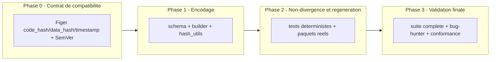

# Plan d'implementation — Mise en conformite du manifeste `[FREEZE]` (SOP 06 §22.1)

---

## 0. Bandeau de statut (a verifier avant toute promotion)

| Question | Reponse |
| --- | --- |
| Un chantier actif couvre-t-il deja ce perimetre (`DONE`, `ACTIVE`, ou `SUPERSEDED`) ? | Non. `checkpoint.json::active_workstream_id` est `null` a la date d'intake (2026-07-31). Aucun workstream existant ne revendique `code_hash`/`data_hash`/`timestamp` du bloc `[FREEZE]`. |
| Un verrou de gouvernance actif bloque-t-il ce chantier ? | Non identifie. `Implementation/Active/HOOK.md` documente uniquement la cloture du pivot Nautilus et invite a "ouvrir un nouveau workstream" pour toute suite. |
| Ce plan a-t-il besoin d'une decision humaine explicite pour lever un verrou avant `/start` ? | Non. |
| Ce plan remplace-t-il un document ou chantier existant ? | Non. Il corrige un ecart de conformite laisse ouvert par `PLAN_REPRODUCTIBILITE_OPERATIONNELLE_R7` (DONE, a livre `document_hash`/`config_hash`) et `PLAN_HORODATAGE_TRANSVERSAL_ET_ATTESTATIONS` (DONE, a livre `sealed_at`), sans les reouvrir : il reutilise leurs artefacts. |

---

## Audit IA de promotion

- [x] Plan relu dans le contexte du cockpit actif (`AGENTS.md`, `.ai/README.md`, `.ai/checkpoint.json`, `Implementation/Active/HOOK.md`, `Implementation/Active/tracking.json`).
- [x] Bandeau de statut (section 0) rempli et verifie contre l'etat machine reel.
- [x] Ce plan a ete ECRIT COMME NOUVEAU FICHIER dans `.ai/backlog/fixes/` ; le brouillon original reste intact dans `0 - HUMAN START HERE/` jusqu'a l'archivage mecanique par `plan.ps1 start`.
- [x] Chantier classe `fix` — corrige un ecart de conformite sur un livrable deja normatif (SOP 06 §22.1), pas une nouvelle fonctionnalite ni une refonte mainline.
- [x] Autorite(s) normative(s) identifiee(s) : `Protocole/SOP 06` §22.1 (bloc `[FREEZE]`), `Protocole/PAQUET D'EXECUTION EBTA.md` §5, `Protocole/SOP 12`.
- [x] Perimetre de fichiers autorises/interdits explicite (section 5).
- [x] Aucune modification hors perimetre requise pour activer le chantier (le perimetre couvre exactement les producteurs et consommateurs reels du manifeste).
- [x] Prerequis factuels verifies disponibles : `content_checksum` par snapshot deja produit par `build_data_snapshot()`, horloge injectable deja disponible via le pattern `procedures/sealing.py`, pattern anti-autoreference deja livre par R7. Aucune donnee ni acces manquant.
- [x] Etat des lieux (section 4) verifie pour eviter de dupliquer un calcul existant.

## Triage

| Champ | Valeur |
| --- | --- |
| Track | `fix` |
| Lifecycle | `DONE` |
| Type de chantier | `SINGLE` |
| Scope | Faire produire par `build_manifest()` les trois champs racine `code_hash`, `data_hash` et `timestamp` exiges par le bloc `[FREEZE]` de SOP 06 §22.1, en reutilisant les artefacts deja livres par R7 (empreinte canonique) et le lot horodatage (horloge injectable), sans toucher au calcul scientifique ni a l'OOS. |
| Non-goals | Ne pas modifier `Protocole/`, les SOP, les statuts, seuils ou gates ; ne pas rouvrir le pivot Nautilus ni l'adapter Nautilus (`adapters/nautilus_mapping.py`, `strategies/`) ; ne pas rouvrir ou consommer l'OOS ; ne pas changer les calculs WRC, robustesse, OOS ou economiques (`procedures/`, `governance/`) ; ne pas transformer une preuve absente en `PASS` ; ne pas re-hasher silencieusement les paquets historiques comme s'ils avaient ete scelles avec le nouveau contrat ; ne pas corriger dans ce chantier le placeholder `code_hash`/`data_hash` deja fabrique dans `Implementation/examples/minimal_pilot_pipeline/build_research_package.py` et `inputs/pilot_inputs.json` (portee SOP 03/registre distincte de SOP 06 §22.1 — documente en section 11, pas traite ici) ; ne pas toucher `protocol_version`/`PROTOCOL_VERSION` (incoherence `EBTA-DOC-1.0` vs `EBTA-DOC-1.1` pre-existante, hors perimetre — documentee en section 11) ; ne pas introduire de dependance `git`/subprocess dans le runtime moteur pour calculer `code_hash` (rester stdlib-only, hashage de fichiers uniquement). |
| Source | Brouillon humain `0 - HUMAN START HERE/PROPOSITION_MISE_EN_CONFORMITE_MANIFESTE_FREEZE.md`, deplace en INTAKE le 2026-07-31 ; promu via `/start` demande explicitement par l'utilisateur le 2026-07-31. |
| Exit criteria | Le manifeste produit par `build_manifest()` contient `code_hash`, `config_hash`, `data_hash`, `timestamp` et `timestamp_source`, tous non vides et conformes au schema `2.0.0` sur le paquet reel regenere `minimal_pilot_pipeline` ; `schema_errors=[]`, `manifest_failures=[]` et `manifest_artifact_failures=[]` prouvent sa conformite propre sans exiger que les gates scientifiques/lifecycle du paquet global deviennent `PASS`. Le chemin d'integration Nautilus prouve les memes champs lorsque les prerequis sont fournis sous scope `TEST_FIXTURE` explicitement visible, tandis que le run Nautilus reel conserve son resultat `DENIED` (`WRC FAIL`, robustesse `FAIL`, preuves humaines absentes) et ne fabrique aucun manifeste post-gate. Les nouvelles valeurs sont derivees de sources explicites et deterministes (fichiers reels du moteur, `content_checksum`, horloge injectable), avec tests de determinisme, sensibilite et rejet des entrees absentes/malformees. Le schema porte une migration majeure explicite `1.0.0 -> 2.0.0` sans reinterpretation silencieuse des historiques. Aucune ouverture OOS, modification de gate/verdict/calcul WRC-robustesse-economique ou modification de `Protocole/` n'a lieu ; la suite complete, les schemas, `bug-hunter`, `adversarial-tester` et `plan-conformance-audit` passent avant `/close`, sans masquer les `FAIL`/`INCONCLUSIVE` globaux. |

## Statut

| Champ | Valeur |
| --- | --- |
| Statut | `DONE` |
| Date de creation | 2026-07-31 |
| Date d'activation | 2026-07-31 |
| Autorite normative | `Protocole/SOP 06` §22.1, `Protocole/PAQUET D'EXECUTION EBTA.md` §5, `Protocole/SOP 12` |
| Autorite executable | `Implementation/ebta_engine/manifests/`, `Implementation/ebta_engine/schemas/`, `Implementation/ebta_engine/migrations/` |
| Changement normatif attendu | Aucun |
| Dependances externes | Aucune (stdlib-only) |

## Carte d'execution IA (lecture prioritaire pour `/continue`)

| Champ | Contenu operationnel |
| --- | --- |
| Objectif executable | `build_manifest()` produit `code_hash`, `data_hash`, `timestamp` et `timestamp_source` a la racine, en plus de `config_hash`, avec conformite propre du manifeste prouvee sur le paquet minimal reel et par les integrations builders, independamment des verdicts scientifiques/lifecycle globaux. |
| Autorite et lecture minimale | Section 2 ci-dessous, dans l'ordre. `Protocole/SOP 06` §22.1 prime en cas de conflit sur la definition des champs ; `Implementation/` est la traduction executable, jamais l'inverse. |
| Perimetre autorise | Section 5 — colonne "Autorises" uniquement. |
| Interdits absolus | `Protocole/`, `procedures/`, `governance/`, `adapters/nautilus_mapping.py`, `strategies/`, `protocol_version`/`PROTOCOL_VERSION`, tout code utilisant `git`/subprocess pour `code_hash`. |
| Phase de reprise | Phase 3 — validation finale apres re-scope humain autorise le 2026-07-31. |
| Preuve attendue | Commandes de la section 9, dans l'ordre des phases. |
| Arret et escalade | Arreter si une preuve propre du manifeste echoue, si une valeur FREEZE est absente/fabriquee, ou si satisfaire le chantier exige de modifier/masquer un verdict scientifique ou lifecycle global. |

---

## 1. Role de ce document et non-objectifs

| Element | Role |
| --- | --- |
| `Protocole/SOP 06` §22.1, `Protocole/PAQUET D'EXECUTION EBTA.md` §5, `Protocole/SOP 12` | Autorite normative EBTA — priment en cas de conflit |
| `Implementation/ebta_engine/manifests/`, `schemas/`, `migrations/` | Traduction executable de la norme |
| `.ai/` | Cockpit non normatif, jamais source de verdict |
| `reports/manifests/reproducibility_manifest.json` produit par `build_manifest()` | Artefact de preuve final que ce chantier rend conforme au bloc `[FREEZE]` |
| Ce plan | Carte d'implementation : quoi coder, ou, pourquoi, dans quel ordre |

Non-objectifs (distincts des `Non-goals` du Triage) :

- ne pas reecrire `Protocole/` ni ses SOP ;
- ne pas introduire de regle, seuil ou statut absent de `Protocole/` ;
- ne pas faire de `git` une dependance runtime du moteur (`Implementation/ebta_engine/` reste stdlib-only) ;
- ne pas faire du manifeste une source de verdict scientifique (il reste un artefact de preuve, pas un gate) ;
- ne pas corriger silencieusement l'incoherence `protocol_version` (`EBTA-DOC-1.0` vs `EBTA-DOC-1.1`) au passage — elle est nommee en section 11 et laissee intacte.

---

## 2. Contexte obligatoire a lire avant de coder

1. `AGENTS.md`, `.ai/README.md`, `.ai/checkpoint.json`, `Implementation/Active/HOOK.md`, `Implementation/Active/tracking.json` — bootstrap standard, confirment qu'aucun workstream actif ne couvre ce perimetre.
2. `Protocole/SOP 06 - Selection des regles candidates et optimisation de la complexite.md` §22.1 (lignes ~501-550) — definit exactement le bloc `[FREEZE]` : `code_hash`, `config_hash`, `data_hash`, `reviewer`, `timestamp`.
3. `Protocole/PAQUET D'EXECUTION EBTA.md` §5 "Manifeste de reproductibilite" (lignes 315-333) — liste les champs obligatoires au niveau paquet, dont "code, dependances et environnement" et "configuration gelee et hash".
4. `Protocole/SOP 12 - Reproductibilite et paquet de validation EBTA.md` — contrat general de reproductibilite.
5. `Implementation/ebta_engine/manifests/manifest_builder.py` et `hash_utils.py` — etat actuel : seul `configuration.config_hash` est produit ; `_artifact_metadata()` cite deja les sources normatives par artefact.
6. `Implementation/ebta_engine/schemas/reproducibility_manifest.schema.json` — contrat actuellement ferme (`additionalProperties: false`, `required` exhaustif, `protocol_version` enum limite a `["EBTA-DOC-1.0"]`).
7. `Implementation/ebta_engine/data/local_ohlcv.py::build_data_snapshot()` (lignes 224-270) — produit deja `checksum` et `content_checksum` par snapshot, deja consomme par `nautilus_research_package.py` ligne 108. Source directe et reutilisable de `data_hash` : ne pas recalculer depuis zero.
8. `Implementation/ebta_engine/procedures/sealing.py` (lignes 18-43) — pattern d'horloge injectable deja livre (`clock: Callable[[], datetime] | None`, exigence tz-aware, `sealed_at_source` distinguant `INJECTED_FIXTURE_CLOCK`/`RUNTIME_UTC`) : reappliquer ce pattern a l'identique pour `timestamp`, pas en inventer un nouveau.
9. `.ai/archive/20260720_PLAN_REPRODUCTIBILITE_OPERATIONNELLE_R7.md` (notamment le motif `_config_document_hash`) — pattern anti-autoreference deja livre : retirer le champ avant canonicalisation puis hasher. A reappliquer pour `code_hash`/`data_hash`/`timestamp`, pas a reinventer.
10. `Implementation/examples/minimal_pilot_pipeline/build_research_package.py` et `inputs/pilot_inputs.json` — contiennent deja des labels `code_hash`/`data_hash` **non cryptographiques** (`code_commit_hash: "PILOT-COMMIT-HASH"` en dur ligne 244 de `pilot_inputs.json` ; `data_hash: pilot_inputs["data_snapshots"][0]["data_snapshot_id"]` ligne 1196 ; `universe_snapshot_hash=f"{snapshot_id}-HASH"` ligne 1214 de `build_research_package.py`). Lire ce fichier pour NE PAS reproduire ce pattern de faux succes dans le nouveau code ; voir section 11.

**Hierarchie d'autorite applicable a ce chantier** :

```text
1. Protocole/MANIFESTE DE GEL EBTA.md
2. Protocole/PROTOCOLE EBTA.md
3. Protocole/REGISTRE DES DECISIONS NORMATIVES EBTA.md
4. Protocole/SOP 06, SOP 12, PAQUET D'EXECUTION EBTA.md
5. Implementation/ebta_engine/ (manifests/, schemas/, migrations/)
6. .ai/ (non normatif)
```

Regle : si le code contredit l'autorite normative, c'est le code qui a tort. Si une definition manque, ce plan la fige explicitement en section 5 avant tout code (voir Phase 0) plutot que de laisser l'implementation deviner.

---

## 4. Etat des lieux (avant/apres) — reutiliser avant de recreer

### Ce qui existe deja

| Module actuel | Chemin | Role reel (verifie) | Suffisant pour l'objectif ? |
| --- | --- | --- | --- |
| `build_manifest()` | `Implementation/ebta_engine/manifests/manifest_builder.py:13-55` | Produit `configuration.config_hash`, `data_snapshots` (passe tel quel), `artifacts[].sha256`, mais aucun `code_hash`/`data_hash`/`timestamp` racine. | ⚠️ a etendre |
| `sha256_file()` | `Implementation/ebta_engine/manifests/hash_utils.py` | Hash SHA-256 uppercase d'un fichier unique. | ⚠️ a completer (besoin d'un hash d'arborescence pour `code_hash`) |
| `build_data_snapshot()` | `Implementation/ebta_engine/data/local_ohlcv.py:224-270` | Calcule deja `checksum` (nom+taille) et `content_checksum` (contenu, gap-aware) par snapshot ; deja appele par le builder de production. | ✅ reutilisable directement pour `data_hash` |
| Horloge injectable de scellement | `Implementation/ebta_engine/procedures/sealing.py:18-43` | Pattern `clock` optionnel, UTC tz-aware, `*_source` distinguant fixture vs runtime — deja livre pour `sealed_at`. | ✅ pattern reutilisable a l'identique pour `timestamp` |
| Empreinte canonique anti-autoreference | Motif `_config_document_hash` du builder R7 (`.ai/archive/20260720_PLAN_REPRODUCTIBILITE_OPERATIONNELLE_R7.md`) | Retire son propre champ avant canonicalisation + SHA-256. | ✅ pattern reutilisable |
| `reproducibility_manifest.schema.json` | `Implementation/ebta_engine/schemas/` | `additionalProperties: false` + `required` exhaustif ; toute addition de champ doit toucher schema ET liste `required` simultanement. | ⚠️ a etendre avec decision SemVer explicite |

### Ce qui manque reellement

| Brique manquante | Module a creer/etendre | Source de la regle | Ce qui existe deja et doit etre reutilise |
| --- | --- | --- | --- |
| `code_hash` | `hash_utils.py` (nouvelle fonction d'empreinte d'arborescence) + `manifest_builder.py` | SOP 06 §22.1 | `sha256_file()` comme brique de base, motif anti-autoreference de R7 pour la canonicalisation |
| `data_hash` | `manifest_builder.py` (agregation) | SOP 06 §22.1 | `content_checksum` deja produit par `build_data_snapshot()` — pas de nouveau calcul de fond |
| `timestamp` | `manifest_builder.py` (parametre `clock` injectable) | SOP 06 §22.1 | Pattern `sealing.py::clock` a reappliquer a l'identique |
| `content_checksum` sur les fixtures de test | `fixtures/valid_minimal/config.json`, `examples/minimal_pilot_pipeline/inputs/pilot_inputs.json` | Consequence directe du nouvel invariant `data_hash` (echec explicite si absent) | Aucun — ces deux fichiers n'ont actuellement qu'un `data_snapshot_id`/`available_at`, verifie par lecture directe (ni l'un ni l'autre ne produit de checksum) ; ~13 sites d'appel de `build_manifest()` (dont 11 dans `test_package_validator.py`) reutilisent la fixture `valid_minimal` et casseraient sans cet ajout |

---

## 5. Decision d'architecture

Principe directeur : chaque nouveau champ du bloc `[FREEZE]` reutilise un artefact ou un pattern deja livre et teste ailleurs dans le moteur, plutot que d'inventer un second mecanisme concurrent. C'est la lecon explicite du gabarit de ce depot (une duplication silencieuse de logique deja implementee est une regression architecturale).

- Raison 1 : `data_hash` et `timestamp` ont deja des briques source directement reutilisables (`content_checksum`, horloge injectable) — les reinventer creerait une deuxieme source de verite pour la meme notion.
- Raison 2 : `code_hash` n'a pas d'equivalent direct, mais doit suivre le meme principe d'auditabilite deterministe que le reste du manifeste (hash de contenu reel, pas d'identifiant externe comme un hash Git qui suppose un working tree propre non garanti).

### Frontieres explicites

| Couche | Elle fait | Elle NE fait PAS |
| --- | --- | --- |
| `hash_utils.py` | Calcule des empreintes SHA-256 deterministes de fichiers/arborescences | Ne decide jamais du perimetre metier (quels fichiers hasher) — ce choix reste dans `manifest_builder.py` |
| `manifest_builder.py` | Assemble le manifeste, decide du perimetre `code_hash`, agrege `data_hash` depuis `data_snapshots`, injecte `timestamp` | Ne recalcule jamais `content_checksum` ou `sealed_at` — les consomme tels que deja produits |
| `reproducibility_manifest.schema.json` | Valide la forme du manifeste produit | Ne valide jamais la verite scientifique d'un verdict — reste un contrat de forme |

### Contrat d'interface entre les couches

> Correction Pass 2 de la boucle `/evaluate` post-`/start` (voir section 14) :
> la premiere version de ce contrat exposait `code_root`/`code_relative_paths`
> comme parametres obligatoires de `build_manifest()`. Verification faite,
> `build_manifest()` a **~15 sites d'appel reels** (`manifest_builder.py`,
> `minimal_pilot_pipeline/build_research_package.py:1319`,
> `tests/test_manifest_hashes.py`, `tests/test_schemas.py`,
> `tests/test_package_validator.py` — 11 sites a lui seul). Rendre ces deux
> parametres obligatoires aurait force une reecriture mecanique des ~15 sites
> pour une valeur identique partout. Le perimetre de fichiers couverts par
> `code_hash` est donc une **constante interne** du module (relative a
> l'emplacement du package, pas a une variable d'environnement — ce qui reste
> conforme a l'interdiction de "lecture cachee de l'environnement" du
> brouillon original, qui visait les variables d'environnement, pas une
> constante de code), a l'image de `code_environment` deja statique dans le
> builder actuel. Seul `clock` devient un parametre appelant, optionnel,
> preservant tous les sites d'appel existants sauf ceux qui exercent
> explicitement l'injection de temps fixe.

```python
_CODE_HASH_ROOT = Path(__file__).resolve().parents[1]  # Implementation/ebta_engine/
_CODE_HASH_EXCLUDED_DIRS = {"tests", "fixtures", "__pycache__"}  # perimetre fige, non caller-supplied

def sha256_tree(root: Path, *, relative_paths: list[str]) -> str:
    """SHA-256 uppercase d'une concatenation canonique triee de
    "chemin_relatif_posix\\n" + sha256_file(chemin) pour chaque chemin de
    relative_paths. Aucune dependance a git ni au systeme de fichiers hors
    des chemins explicitement fournis (deterministe, stdlib-only)."""

def build_manifest(
    package_dir: Path,
    artifact_paths: list[str],
    package_stage: str,
    *,
    clock: Callable[[], datetime] | None = None,
) -> dict:
    """Etend la signature actuelle avec un seul nouveau parametre appelant
    (clock, suit exactement le pattern sealing.py). code_hash utilise
    _CODE_HASH_ROOT/_CODE_HASH_EXCLUDED_DIRS en interne : aucun site d'appel
    existant n'a besoin d'etre modifie pour ce champ. data_hash agrege
    content_checksum depuis config["data_snapshots"] sans nouveau parametre
    non plus."""
```

### Decisions deja actees

| Decision | Justification |
| --- | --- |
| `code_hash` = SHA-256 uppercase d'une concatenation canonique triee par chemin relatif POSIX de `"chemin\n"` + `sha256_file(fichier)`, pour tous les fichiers `.py` sous `Implementation/ebta_engine/` hors `tests/`, `fixtures/`, `__pycache__/` — perimetre fige comme **constante interne** du module (`_CODE_HASH_ROOT`/`_CODE_HASH_EXCLUDED_DIRS`), pas comme parametre appelant, pour eviter de forcer une reecriture des ~15 sites d'appel existants de `build_manifest()` (cf. section 5, contrat d'interface) ; aucune dependance a `git`/subprocess. | Le moteur reste stdlib-only (`CLAUDE.md`) ; un hash Git suppose un working tree propre non garanti en environnement de recherche ; une constante interne explicite est deterministe, auditable, et n'oblige pas chaque appelant a repeter le meme perimetre. |
| `data_hash` = SHA-256 uppercase d'une concatenation canonique triee par `data_snapshot_id` de `"data_snapshot_id\n"` + `content_checksum` (deja produit par `build_data_snapshot()`) pour chaque entree de `config.json.data_snapshots` ; echec explicite (pas de valeur par defaut) si un snapshot n'a pas de `content_checksum`. | `content_checksum` existe deja, couvre le contenu reel (gap-aware), et est deja utilise en production par `nautilus_research_package.py`. Recalculer depuis zero dupliquerait une logique deja testee. |
| `timestamp` = horloge injectable identique au pattern `sealing.py` (`clock: Callable[[], datetime] \| None`, UTC tz-aware obligatoire, format ISO `Z`), avec un champ `timestamp_source` distinguant `INJECTED_FIXTURE_CLOCK`/`RUNTIME_UTC`, distinct de `sealed_at` et des timestamps d'evenements registry. | Reutilise un pattern deja livre, teste et approuve par `PLAN_HORODATAGE_TRANSVERSAL_ET_ATTESTATIONS` (DONE) ; evite une deuxieme convention d'horodatage concurrente. |
| Le placeholder `code_hash`/`data_hash` deja present dans `Implementation/examples/minimal_pilot_pipeline/build_research_package.py` (registre `registry.jsonl`, SOP 03) n'est PAS corrige dans ce chantier. | Portee normative distincte (SOP 03 / contrat d'evenement du registre vs SOP 06 §22.1 / manifeste de recherche) ; le corriger ici elargirait le perimetre sans decision explicite. Documente en section 11 comme risque connu pour eviter toute confusion future. |
| `protocol_version` (`EBTA-DOC-1.0` fige dans `constants.py` et l'enum du schema manifeste) n'est PAS touche dans ce chantier. | Incoherence pre-existante avec `Protocole/` gele `EBTA-DOC-1.1`, non introduite par ce chantier ; la corriger au passage serait une modification normative-adjacente non demandee. Documentee en section 11. |

### Structure cible

```text
Implementation/ebta_engine/
  manifests/
    manifest_builder.py     # etendu : code_hash, data_hash, timestamp
    hash_utils.py           # etendu : sha256_tree()
  schemas/
    reproducibility_manifest.schema.json   # etendu : nouveaux champs requis
  migrations/
    schema_migrations.py    # etendu si migration SemVer necessaire
```

### Perimetre de fichiers explicite (autorises / interdits)

**Autorises (creer ou modifier)** :

```text
Implementation/ebta_engine/manifests/manifest_builder.py                        MODIFIER - Phase 1
Implementation/ebta_engine/manifests/hash_utils.py                              MODIFIER - Phase 1
Implementation/ebta_engine/schemas/reproducibility_manifest.schema.json         MODIFIER - Phase 1
Implementation/ebta_engine/constants.py                                         MODIFIER - Phase 1 (SCHEMA_VERSION uniquement, jamais PROTOCOL_VERSION)
Implementation/ebta_engine/migrations/schema_migrations.py                      MODIFIER si migration requise - Phase 1
Implementation/ebta_engine/validators/package_validator.py                      MODIFIER si necessaire - Phase 1
Implementation/ebta_engine/tests/test_manifest_hashes.py                        MODIFIER - Phase 1/2
Implementation/ebta_engine/tests/test_schemas.py                                MODIFIER - Phase 1/2
Implementation/ebta_engine/tests/test_package_validator.py                      MODIFIER si necessaire - Phase 2
Implementation/ebta_engine/tests/test_traceability.py                          MODIFIER si necessaire - Phase 2
Implementation/ebta_engine/tests/test_nautilus_research_package.py              MODIFIER - Phase 2
Implementation/ebta_engine/tests/test_minimal_pilot_pipeline.py                 MODIFIER - Phase 2
Implementation/ebta_engine/fixtures/valid_minimal/config.json                   MODIFIER - Phase 1/2 (ajouter content_checksum a data_snapshots[0], valeur reelle de fixture, pas fabriquee)
Implementation/examples/minimal_pilot_pipeline/inputs/pilot_inputs.json         MODIFIER - Phase 2 (ajouter content_checksum a data_snapshots[0], meme regle)
Implementation/research_packages/nautilus_mvp/**                                REGENERER via commande - Phase 2 (jamais edite a la main)
Implementation/examples/minimal_pilot_pipeline/research_package/**              REGENERER via commande - Phase 2 (jamais edite a la main)
Implementation/HISTORIQUE DES VERSIONS EBTA ENGINE.md                           MODIFIER uniquement a la cloture reelle - Phase 3
```

**Interdits (ne jamais modifier dans ce chantier)** :

```text
Protocole/                                                    NORME - intouchable
Implementation/ebta_engine/procedures/                        CONTRAT GELE - calculs scientifiques hors perimetre
Implementation/ebta_engine/governance/                        CONTRAT GELE - G-BIAS hors perimetre
Implementation/ebta_engine/adapters/nautilus_mapping.py        CONSERVER TEL QUEL - pivot Nautilus clos
Implementation/ebta_engine/strategies/                        CONSERVER TEL QUEL - hors perimetre
Implementation/examples/minimal_pilot_pipeline/build_research_package.py (labels code_hash/data_hash du registre)  HORS PERIMETRE - portee SOP 03 distincte, cf. section 11
Implementation/ebta_engine/constants.py::PROTOCOL_VERSION      CONTRAT GELE - incoherence pre-existante hors perimetre, cf. section 11
.ai/checkpoint.json                                            METTRE A JOUR UNIQUEMENT via plan.ps1
```

---

## 6. Decoupage en phases

### Phase 0 - Audit et contrat de compatibilite du manifeste FREEZE

Objectif : figer les trois definitions canoniques (`code_hash`, `data_hash`, `timestamp`) et la strategie SemVer avant tout code.

Classification : CONTRACT_ENCODING

Constat (deja verifie en amont de ce plan, cf. section 2 et section 5 "Decisions deja actees") :

- SOP 06 §22.1 exige `code_hash`/`config_hash`/`data_hash`/`reviewer`/`timestamp` ; `manifest_builder.py` ne produit que `config_hash`.
- `reproducibility_manifest.schema.json` a `additionalProperties: false` et un `required` ferme : l'ajout de champs doit etre atomique (schema + required + builder).
- `build_data_snapshot()` produit deja `content_checksum` par snapshot, deja consomme en production.
- `sealing.py` fournit deja le pattern d'horloge injectable a reappliquer.
- Le motif anti-autoreference `_config_document_hash` de R7 est deja livre et reutilisable.

Actions :

- Confirmer (ou corriger si le code a divergé depuis l'audit de ce plan) le perimetre exact de fichiers `.py` couverts par `code_hash` (inclusion/exclusion de `tests/`, `fixtures/`, `migrations/`) et l'ecrire explicitement dans `manifest_builder.py` avant tout calcul.
- Determiner le niveau SemVer du schema (mineur si les paquets historiques restent lisibles via une regle de compatibilite explicite, majeur sinon) et ecrire la migration correspondante dans `migrations/schema_migrations.py` si necessaire.

Livrables :

- Ce document (section 5) porte deja les trois definitions figees ; toute revision reste tracee en section 14 (Journal d'audits post-hoc).

Critere de sortie :

- Les trois definitions et la strategie SemVer sont ecrites noir sur blanc avant que la Phase 1 ne commence a coder.

### Phase 1 - Encodage du manifeste (`code_hash`, `data_hash`, `timestamp`)

Objectif : implementer les trois champs dans le contrat et le builder.

Actions :

- Etendre `reproducibility_manifest.schema.json` : ajouter `code_hash`, `data_hash`, `timestamp` (+ `timestamp_source`) a `required` et `properties`, bumper `schema_version` selon la decision Phase 0.
- Implementer `sha256_tree()` dans `hash_utils.py`, reutilisee par `manifest_builder.py` pour `code_hash`.
- Implementer l'agregation `data_hash` dans `manifest_builder.py` a partir de `config["data_snapshots"]`, en levant une erreur explicite (`ValueError` ou equivalent) si `content_checksum` manque sur une entree.
- Ajouter le parametre `clock` injectable a `build_manifest()`, identique au pattern `sealing.py`, produisant `timestamp` + `timestamp_source`.
- Ajouter `content_checksum` a `data_snapshots[0]` dans `Implementation/ebta_engine/fixtures/valid_minimal/config.json` (valeur reelle calculee sur la fixture, pas une chaine fabriquee), pour que le nouvel invariant `data_hash` (echec explicite si absent) ne casse pas les tests existants qui reutilisent cette fixture.
- Enumerer tous les sites d'appel reels de `build_manifest()` avant de figer la signature, et verifier qu'aucun ne requiert plus que le nouveau parametre optionnel `clock` :

```powershell
rg -n "build_manifest\(" Implementation -g "*.py"
```

- Ne toucher aucun autre champ existant du manifeste.

Livrables :

- `manifest_builder.py`, `hash_utils.py`, `reproducibility_manifest.schema.json`, `migrations/schema_migrations.py` (si migration necessaire) modifies.

Critere de sortie :

```powershell
python -m unittest Implementation.ebta_engine.tests.test_manifest_hashes
python -m unittest Implementation.ebta_engine.tests.test_schemas
```

PASS, avec les nouveaux champs presents et non vides.

### Phase 2 - Verifications de non-divergence et regeneration des fixtures

Objectif : prouver le determinisme, la sensibilite au changement, et regenerer les paquets reels sans requalifier l'historique.

Actions :

- Ecrire/etendre des tests prouvant : (a) meme code + memes donnees + horloge injectee => meme manifeste ; (b) une modification du code couvert change `code_hash` sans changer `data_hash`, et une modification de `content_checksum` change `data_hash` sans changer `code_hash` (les hash existants derives du fichier `config.json` changent legitimement si ce fichier change) ; (c) une donnee absente/incoherente (snapshot sans `content_checksum` verifiable) echoue explicitement, sans valeur par defaut silencieuse.
- Executer le builder Nautilus reel et conserver son resultat gouverne tel quel ; un `DENIED` scientifique/pre-OOS n'est ni une regression du manifeste ni un `PASS` a fabriquer, et l'absence de manifeste post-gate reste attendue.
- Regenerer `Implementation/examples/minimal_pilot_pipeline/research_package` via `build_research_package.py`, puis verifier separement la conformite propre de son manifeste (`schema_errors=[]`, `manifest_failures=[]`, `manifest_artifact_failures=[]`) sans convertir les gates globales `FAIL`/`INCONCLUSIVE` en succes.
- Verifier le chemin d'integration Nautilus qui atteint le manifeste avec des prerequis `TEST_FIXTURE` explicitement autorises dans le test ; cette preuve technique ne vaut jamais approbation humaine ou qualification scientifique du paquet reel.
- Documenter (pas implementer) la regle de compatibilite choisie en Phase 0 pour tout paquet historique deja `PRE_OOS_SEALED` : rester lisible comme historique, jamais requalifie `PASS` avec le nouveau contrat.

Livrables :

- Paquet minimal regenere avec manifeste conforme ; run Nautilus reel regenere jusqu'a son arret `DENIED` ; preuves d'integration manifeste sur les deux builders.

Critere de sortie :

```powershell
python -m unittest discover -s Implementation\ebta_engine\tests -t Implementation
.\adapters\nautilus_env\venv\Scripts\python.exe -m ebta_engine.package_builder.nautilus_research_package
python Implementation\examples\minimal_pilot_pipeline\build_research_package.py
python -c "from pathlib import Path; from ebta_engine.validators.package_validator import validate_package_dir; r=validate_package_dir(Path('examples/minimal_pilot_pipeline/research_package')); assert r['schema_errors']==[] and r['manifest_failures']==[] and r['manifest_artifact_failures']==[]; print('MANIFEST_PASS')"
```

La suite et la preuve `MANIFEST_PASS` passent. Les builders reels conservent
leurs codes/verdicts globaux gouvernes (`DENIED`/`FAIL`) et ces verdicts sont
consignes comme preuve de non-masquage, pas comme regression de ce chantier.

### Phase 3 - Validation finale et cloture

Objectif : verifier l'absence de regression globale et clore proprement.

Actions :

- Suite complete + validations schema + `git diff --check`.
- `bug-hunter` sur les fichiers touches.
- `plan-conformance-audit` contre les Exit criteria de ce plan (Triage).

Livrables :

- Rapports `bug-hunter` / `plan-conformance-audit` references en section 13.

Critere de sortie :

- Zero bug ouvert confirme ; zero exit criterion manquant.

### Chemin critique (ordre des phases)



---

## 7. Artefacts produits

| Etape | Fichier/sortie | Format | Regle source |
| --- | --- | --- | --- |
| Phase 1/2 | `manifests/reproducibility_manifest.json` dans le paquet minimal regenere et dans les packages temporaires d'integration | JSON | SOP 06 §22.1 |
| Phase 2 | `Implementation/research_packages/nautilus_mvp/**` jusqu'au paquet de preuve pre-OOS `DENIED` | JSON/JSONL | SOP 12, PAQUET D'EXECUTION EBTA.md §5 |
| Phase 2 | `Implementation/examples/minimal_pilot_pipeline/research_package/**` | JSON/JSONL | SOP 12, PAQUET D'EXECUTION EBTA.md §5 |

---

## 8. Invariants absolus et NO GO

### Invariants (non negociables dans le code)

1. Aucun champ metier existant du manifeste ne change arbitrairement. Les changements mecaniques attendus et seuls autorises sont : `schema_version` (`1.0.0 -> 2.0.0`) ; `configuration.config_hash` et l'empreinte `artifacts[].sha256` de `config.json` apres ajout autorise de `content_checksum` ; les empreintes d'autres artefacts reellement regeneres si leur contenu horodate change ; et les nouveaux champs FREEZE. Chaque empreinte doit verifier le contenu courant qu'elle reference. `sealed_at`, les evenements registry, les gates et les verdicts ne sont jamais reecrits pour obtenir un succes.
2. `code_hash` change si et seulement si le contenu des fichiers couverts change ; `data_hash` change si et seulement si un `content_checksum` de `data_snapshots` change.
3. Aucun paquet historique n'est re-scelle ni requalifie `PASS` avec le nouveau contrat.
4. Le calcul de `data_hash` echoue explicitement (pas de valeur par defaut, pas de `None` silencieux) si un `data_snapshot` ne porte pas de `content_checksum` verifiable.
5. `timestamp` ne doit jamais etre confondu avec `sealed_at` (`sealing.py`) ni avec les timestamps d'evenements du registre — champs distincts, sources distinctes.

### NO GO (actions explicitement interdites)

- Ne jamais utiliser un identifiant (`data_snapshot_id`, nom de fichier) comme valeur de `code_hash`/`data_hash` deguisee en hash — c'est exactement le pattern deja present et desormais documente comme risque connu dans `Implementation/examples/minimal_pilot_pipeline/build_research_package.py` (`universe_snapshot_hash=f"{snapshot_id}-HASH"`, ligne 1214) : ne jamais reproduire ce pattern dans le code nouveau de ce chantier.
- Ne jamais rendre `protocol_version`/`PROTOCOL_VERSION` incoherent ou le "corriger" au passage dans ce chantier.
- Ne jamais valider un paquet historique comme conforme au nouveau contrat sans migration explicite versionnee.
- Ne jamais introduire `git`/subprocess comme dependance runtime du moteur pour produire `code_hash`.
- Ne jamais coder un gate, un statut ou une exception methodologique non presente dans `Protocole/` sous pretexte de "faciliter" l'encodage — si une definition semble l'exiger, arreter et escalader (`NORMATIVE_CHANGE_REQUIRED`), ne pas coder l'interpretation.

---

## 9. Verification a chaque etape

```powershell
# Phase 1
python -m unittest Implementation.ebta_engine.tests.test_manifest_hashes
python -m unittest Implementation.ebta_engine.tests.test_schemas

# Phase 2
python -m unittest discover -s Implementation\ebta_engine\tests -t Implementation
.\adapters\nautilus_env\venv\Scripts\python.exe -m ebta_engine.package_builder.nautilus_research_package
python Implementation\examples\minimal_pilot_pipeline\build_research_package.py
python -c "from pathlib import Path; from ebta_engine.validators.package_validator import validate_package_dir; r=validate_package_dir(Path('Implementation/examples/minimal_pilot_pipeline/research_package')); assert r['schema_errors']==[] and r['manifest_failures']==[] and r['manifest_artifact_failures']==[]; print('MANIFEST_PASS')"

# Phase 3
python -m json.tool .ai\checkpoint.json
python -m json.tool Implementation\Active\tracking.json
git diff --check -- Implementation .ai
```

**Regle transversale bloquante** : la suite de tests de reference doit rester `PASS` avant de demarrer chaque phase suivante :

```powershell
python -m unittest discover -s Implementation\ebta_engine\tests -t Implementation
```

Regle de progression : la phase N+1 ne demarre que si la commande de la phase N retourne un succes explicite.

**Notes de portabilite / caveats connus** :

- Le perimetre exact de fichiers couverts par `code_hash` doit rester stable entre deux executions sur le meme commit (tri deterministe par chemin POSIX) ; documenter tout ecart de fin de ligne (CRLF/LF) s'il affecte le hash, comme deja fait pour `document_hash` dans R7.

**Premier lot executable propose** :

```text
Phase 0 - Audit et contrat de compatibilite du manifeste FREEZE
```

### Execution sans interruption

Ce plan est concu pour etre execute integralement (Phases 0 a 3) sans retour vers l'humain entre les phases. Les seules causes d'arret legitimes en cours d'execution sont celles listees au gabarit standard (blocage technique externe non resoluble avec l'information de ce plan ; decision hors perimetre section 5 qui s'avere necessaire ; toutes les phases terminees et Definition of Done cochee).

### Autorite decisionnelle accordee

En dehors des decisions qui necessitent une levee de gouvernance (section 10) ou qui elargissent le perimetre de fichiers (section 5), l'IA qui execute ce plan est autorisee a decider seule les details d'implementation (ex. nom exact des fonctions internes, organisation des tests) tant que l'objectif (Triage), le perimetre (section 5) et les invariants (section 8) restent respectes.

### Interdiction des raccourcis (aucun faux succes)

Regle directement justifiee par l'historique de ce depot (gates codes en dur a `True`, strategie de reference reduite a un stub buy-and-hold, reduction de donnees masquant une strategie a zero trade derriere un `status: PASS`) **et par le pattern deja trouve dans ce chantier meme** (`data_hash`/`code_hash` fabriques comme de simples concatenations de chaines dans `minimal_pilot_pipeline`, cf. section 11). Ne jamais reproduire ce pattern dans le code nouveau. Lorsqu'une verification (section 9) echoue : identifier la cause racine, ne jamais la masquer, ne jamais desactiver un test genant, ne jamais remplacer un calcul reel par une valeur codee en dur hors fixtures explicitement designees comme telles.

---

## 10. Journal des decisions humaines (autorisations)

| Date | Decision | Portee |
| --- | --- | --- |
| 2026-07-31 | L'utilisateur demande explicitement `/start` sur `0 - HUMAN START HERE/PROPOSITION_MISE_EN_CONFORMITE_MANIFESTE_FREEZE.md`. | Autorise l'audit et la promotion de ce brouillon en chantier `TRIAGED`. N'autorise aucune implementation avant la boucle `/evaluate` post-`/start` et la baseline pre-implementation requises par `.ai/workflows/common/WORKFLOW.md`. |
| 2026-07-31 | L'utilisateur declare explicitement : `J'autorise le re-scope recommande`. | Autorise apres baseline le remplacement de l'Exit criterion global `validate_package_dir() PASS` sur deux paquets par des preuves propres au manifeste, tout en imposant de conserver sans alteration le `DENIED` Nautilus, les `FAIL` WRC/robustesse et les `INCONCLUSIVE` lifecycle. N'autorise ni `/close`, ni nouveau chantier residual, ni preuve humaine fabriquee. |
| 2026-07-31 | L'utilisateur demande explicitement `/close`. | Autorise les gates de fermeture, la transition `READY_TO_CLOSE -> DONE`, l'archivage et le commit borne au chantier. N'autorise aucun push. |

Le re-scope post-baseline est couvert par la decision humaine ci-dessus ; aucune autre levee de gouvernance n'est accordee.

---

## 11. Risques et blocages connus

| Risque | Impact | Mitigation / condition de deblocage |
| --- | --- | --- |
| Deux notions incompatibles de `data_hash`/`code_hash` coexistent dans le depot : le nouveau champ reel du manifeste (ce chantier) vs le placeholder deja fabrique dans `Implementation/examples/minimal_pilot_pipeline/build_research_package.py` et `inputs/pilot_inputs.json` (`code_commit_hash: "PILOT-COMMIT-HASH"` en dur ligne 244 ; `data_hash: data_snapshot_id` ligne 1196 ; `universe_snapshot_hash=f"{snapshot_id}-HASH"` ligne 1214). | Une IA future pourrait reutiliser ce pattern fabrique comme reference de "comment on fait un data_hash ici", propageant un faux succes. | Documente explicitement ici et en section 8 (NO GO). Hors perimetre de correction de ce chantier (portee SOP 03/registre distincte de SOP 06 §22.1). A traiter par un chantier `fix` dedie ulterieur — signale separement (voir suivi hors session). |
| `protocol_version` fige a `EBTA-DOC-1.0` dans `reproducibility_manifest.schema.json` (ligne 37) et `constants.py::PROTOCOL_VERSION` (ligne 3), alors que `Protocole/` est gele `EBTA-DOC-1.1` et que `config.schema.json` accepte deja les deux valeurs. | Un implementeur presse pourrait "corriger" silencieusement cet enum en meme temps que la migration SemVer de Phase 0, elargissant le perimetre sans decision explicite. | Explicitement hors perimetre (section 1, section 5, Non-goals du Triage) : ne pas toucher `protocol_version`/`PROTOCOL_VERSION` dans ce chantier, quelle que soit la tentation lors de la migration de schema. |
| `additionalProperties: false` rend un paquet historique deja `PRE_OOS_SEALED` potentiellement "invalide" contre le nouveau schema s'il est revalide sans distinction de version. | Un paquet historique legitime pourrait sembler casse. | Regle de compatibilite explicite figee en Phase 0 (migration versionnee dans `migrations/schema_migrations.py`, jamais de reinterpretation silencieuse d'un paquet ancien comme conforme au nouveau contrat). |

---

## 12. Definition of Done

- [x] Toutes les phases (0 a 3) validees individuellement (section 9).
- [x] Exit criteria re-scope de la section Triage atteint et verifiable.
- [x] Aucune modification hors perimetre (section 5 / Non-goals du Triage).
- [x] Aucune regression sur la suite de tests existante.
- [x] `Implementation/HISTORIQUE DES VERSIONS EBTA ENGINE.md` mis a jour.
- [x] Checklist post-modification de `.ai/governance/AI_MODIFICATION_CHECKLIST.md` executee.
- [x] Aucune implementation partielle, stub, pseudo-code ou placeholder ne subsiste comme substitut a une brique prevue (en particulier : aucun `code_hash`/`data_hash` fabrique comme simple concatenation de chaine, cf. section 11).

---

## 13. Cloture

A remplir au moment de `/close` :

| Champ | Valeur |
| --- | --- |
| Resultat final | `DONE` confirme : manifeste FREEZE schema `2.0.0` conforme, deterministe et fail-closed ; 219 tests PASS ; Pyrefly 0 ; adversarial et conformite au plan re-scope PASS ; checkpoint et tracking valides contre leurs schemas. |
| Ecarts par rapport au plan initial | Exit criterion global re-scope apres autorisation humaine explicite : conformite propre du manifeste au lieu d'un `validate_package_dir() PASS` incompatible avec les gates scientifiques/lifecycle courants. Les `DENIED`/`FAIL`/`INCONCLUSIVE` restent inchanges. |
| Suites a prevoir (hors perimetre de ce plan) | Correction du placeholder `code_hash`/`data_hash` dans `Implementation/examples/minimal_pilot_pipeline/build_research_package.py` (registre `registry.jsonl`, portee SOP 03) ; reconciliation de `protocol_version`/`PROTOCOL_VERSION` avec `EBTA-DOC-1.1` ; approbations humaines pre-OOS, nouvelle recherche eventuelle apres WRC/robustesse `FAIL`, et couverture G14 uniquement via chantiers distincts autorises. |

### Resultat d'execution (a dupliquer a chaque session d'execution significative)

| Champ | Valeur |
| --- | --- |
| Date | 2026-07-31 |
| Phases executees | Phases 0 a 3 terminees selon l'Exit criterion re-scope autorise ; paquet minimal regenere, run Nautilus reel arrete proprement en `DENIED`, aucune cloture mecanique appelee. |
| Artefact produit | Builder/schema manifeste `2.0.0` avec `code_hash`, `data_hash`, `timestamp`, `timestamp_source` ; migration `1.0.0 -> 2.0.0` fail-closed ; paquet minimal regenere avec manifeste techniquement valide. |
| Validation | 219 tests `PASS` avec le venv Nautilus ; `bug-hunter` cible : Pyrefly `0 errors` ; `adversarial-tester` : `PASS_ADVERSARIAL` sur scope code vide, checksum absent/malforme, provenance fixture, horloge naive et migration sans preuve ; tests cibles manifeste/schema/integration `PASS` ; `MANIFEST_PASS` sur le paquet minimal (`schema_errors=[]`, `manifest_failures=[]`, `manifest_artifact_failures=[]`) ; paquet minimal global `FAIL` et paquet Nautilus reel `DENIED` conserves ; `plan-conformance-audit` re-scope : `PASS`. |
| Ecart par rapport au plan | Re-scope post-baseline explicitement autorise par l'humain : remplacement du `validate_package_dir() PASS` global, incompatible avec les gates courants, par la conformite propre du manifeste. Les residuels approbations, WRC/robustesse et G14 restent hors scope et leurs verdicts restent inchanges. |

### Audit de conformite au plan re-scope

| Critere | Classification | Preuve |
| --- | --- | --- |
| Champs FREEZE reels et schema `2.0.0` | IMPLEMENTE | `manifest_builder.py`, `reproducibility_manifest.schema.json`, paquet minimal regenere ; tests manifeste/schema PASS |
| Determinisme, sensibilite et provenance des checksums | IMPLEMENTE | `test_manifest_hashes.py`, `test_minimal_pilot_pipeline.py` ; 24 tests cibles PASS |
| Rejet fail-closed des preuves absentes/malformees | IMPLEMENTE | Tests checksum absent/malforme, scope code vide, horloge naive et migration sans preuve PASS |
| Compatibilite historique explicite | IMPLEMENTE | Migration majeure `migrate_reproducibility_manifest_1_0_to_2_0()` exigeant les preuves FREEZE ; aucun historique requalifie |
| Paquet minimal reel conforme sur le manifeste | IMPLEMENTE | `MANIFEST_PASS` : `schema_errors=[]`, `manifest_failures=[]`, `manifest_artifact_failures=[]` |
| Integration Nautilus et verite du run reel | IMPLEMENTE | Test d'integration manifeste PASS sous `TEST_FIXTURE` visible ; run reel `DENIED`, WRC/robustesse `FAIL`, aucun manifeste post-gate fabrique |
| Non-goals et frontieres | IMPLEMENTE | Aucun diff sous `Protocole/`, `procedures/`, `governance/`, adaptateurs ou strategies ; aucun changement de gate/verdict/OOS |
| Validation globale et controles skills | IMPLEMENTE | 219 tests PASS ; Pyrefly 0 ; adversarial PASS ; JSON et `git diff --check` PASS |

### Decision humaine recue et re-scope applique

Le test `epic-orchestrator` rejoue sur les residuels est positif : les trois
composantes ci-dessous ont chacune leur propre critere de sortie, peuvent etre
traitees dans un ordre different et peuvent rester bloquees independamment.
Elles ne doivent donc pas etre absorbees dans ce chantier `CONTRACT_ENCODING` :

1. preuves humaines externes `registry_review` / `pre_oos_approval` ;
2. resultat scientifique Nautilus actuellement rejete (`WRC FAIL`, p-value
   globale `0.3173365326934613` ; robustesse `FAIL` sur
   `ROB-NAUTILUS-PLAUSIBLE`, verdict `REJECTED_ECONOMIC`) ;
3. cycle lifecycle G14 du pilote minimal (`lifecycle_archive`, `incident_log`,
   `retention_policy` encore `INCONCLUSIVE`).

Decision autorisee : corriger l'Exit criterion de ce plan pour juger la
conformite du manifeste sur ses preuves propres — schema `2.0.0`, champs FREEZE
non vides et reels, `schema_errors=[]`, `manifest_failures=[]`, tests de
determinisme/sensibilite/rejet et integrations builders — tout en conservant
les statuts globaux `DENIED`/`FAIL` comme resultats scientifiques/lifecycle
explicites. L'autorisation humaine explicite a ete recue le 2026-07-31 et
journalisee en section 10.

Les residuels restent hors scope : une nouvelle recherche scientifique (pas
une correction de code) serait necessaire pour remplacer le `WRC FAIL` /
robustesse `FAIL`, et les lots approbations humaines et G14 devraient suivre
leurs propres cycles gouvernes. Aucun de ces lots n'est cree ou declare `PASS`
par ce plan.

---

## 14. Journal d'audits post-hoc

| Date de l'audit | Ce qui a ete corrige | Pourquoi |
| --- | --- | --- |
| 2026-07-31 (intake, avant premiere promotion) | Correction de l'hypothese initiale du brouillon original (`§3 data_hash`, "le checksum distinct deja existant dans la configuration doit etre reutilise") : verification du code reelle a montre que ce checksum existe bien (`content_checksum` de `build_data_snapshot()`), contrairement a une premiere lecture qui l'avait cru absent. Ajout du risque pre-existant des labels `code_hash`/`data_hash` fabriques dans `minimal_pilot_pipeline` (non mentionne dans le brouillon original), et de l'incoherence `protocol_version` (non mentionnee dans le brouillon original), toutes deux decouvertes par lecture directe du code pendant l'audit `/evaluate` (2 passes) requis avant `/start`. | Le brouillon original etait factuellement correct sur le constat SOP 06/manifest_builder.py mais incomplet sur l'etat reel du code environnant (risques d'incoherence non vus faute de lecture du code des consommateurs reels du manifeste). |
| 2026-07-31 (boucle `/evaluate` post-`/start`, avant baseline) | Pass 1 de cette boucle a identifie que le contrat d'interface initial (section 5) rendait `code_root`/`code_relative_paths` obligatoires pour l'appelant, alors que `build_manifest()` compte ~15 sites d'appel reels (verifies par `rg -n "build_manifest\("`), dont 11 dans `Implementation/ebta_engine/tests/test_package_validator.py`. Correction : le perimetre de `code_hash` devient une constante interne du module (aucun site d'appel a modifier pour ce champ). Pass 1 a egalement trouve que `Implementation/ebta_engine/fixtures/valid_minimal/config.json` et `Implementation/examples/minimal_pilot_pipeline/inputs/pilot_inputs.json` n'ont pas de `content_checksum` sur leurs `data_snapshots`, ce qui aurait fait echouer tous les tests reutilisant ces fixtures des l'ajout du nouvel invariant `data_hash`. Ajoutes explicitement au perimetre (section 5). Pass 2 (relecture complete du plan corrige) n'a trouve aucun nouvel angle mort majeur : convergence. | Une premiere version du contrat d'interface, ecrite avant d'avoir enumere les sites d'appel reels, aurait impose une reecriture mecanique evitable de ~15 fichiers ; les fixtures partagees n'avaient pas ete inspectees avant la premiere ecriture du plan. |
| 2026-07-31 (`/continue`, audit de conformite en cours) | Le changement de champs obligatoires est classe MAJEUR selon la politique SemVer du depot : schema manifeste `1.0.0 -> 2.0.0`, sans requalification silencieuse des historiques. L'execution a aussi revele que les deux commandes de regeneration du plan ne peuvent pas produire `PASS` dans le perimetre actuel : preuves humaines absentes sur les deux, `wrc_pass`/`robustness_pass` manquants sur le run Nautilus reel, et G14 `INCONCLUSIVE` sur le pilote minimal. | La boucle post-`/start` avait audite le contrat de hash mais pas confronte les commandes de Phase 2 au comportement fail-closed actuel des preuves pre-OOS ni aux gates scientifiques/lifecycle actuels. L'ecart est persiste sans fabriquer d'approbation, ouvrir OOS ou remplacer un verdict scientifique. |
| 2026-07-31 (re-scope humain, audit de coherence final) | Correction de l'invariant 1 et du test de sensibilite Phase 2 : le plan interdisait initialement toute variation de `schema_version`, `config_hash` et `artifacts[].sha256` tout en exigeant une migration majeure, l'ajout de `content_checksum` dans `config.json` et la regeneration des paquets. La version corrigee interdit les changements arbitraires mais exige que les hash derives suivent honnêtement les contenus modifies. | Conserver les anciennes empreintes apres modification de `config.json` ou d'un artefact regenere aurait cree une preuve fausse et contredit `verify_manifest()`. Cette correction factuelle est incluse dans le re-scope post-baseline explicitement autorise par l'humain. |
