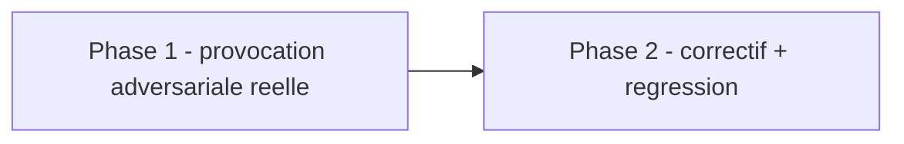

# Plan — Lot 4 : passage `adversarial-tester` outille sur `governance/`

Sous-chantier 4/6 de `EPIC_ROBUSTESSE_GARDE_FOUS_AGENT_CODAGE`.

---

## 0. Bandeau de statut (a verifier avant toute promotion)

| Question | Reponse |
| --- | --- |
| Un chantier actif couvre-t-il deja ce perimetre (`DONE`, `ACTIVE`, ou `SUPERSEDED`) ? | Non — sous-chantier du chantier mere `EPIC_ROBUSTESSE_GARDE_FOUS_AGENT_CODAGE` (`BASELINED`). |
| Un verrou de gouvernance actif bloque-t-il ce chantier ? | Non — `governance/*.py` est sous `Implementation/`, mais ce lot corrige un defaut de robustesse local (pas une extension de perimetre), classe `GOVERNANCE` (workflow `common`), coherent avec le precedent `PLAN_CORRECTION_GATE_STATISTIQUE_WRC_MASQUE` et autres correctifs `Implementation/` deja routes sans lever explicite distincte (le verrou de la Phase 0 du chantier mere concernait specifiquement les lots 3 et 5 identifies par l'audit source ; ce lot 4 est une recommandation independante de l'audit, deja implicitement dans le perimetre autorise par le `/start` du chantier mere lui-meme, section 10, ligne 1). |
| Ce plan a-t-il besoin d'une decision humaine explicite pour lever ce verrou avant d'etre routable via `/start` ? | Non. |
| Ce plan remplace-t-il un document ou chantier existant ? | Non. |

---

## Audit IA de promotion

- [x] Plan relu dans le contexte du cockpit actif.
- [x] Bandeau de statut (section 0) rempli et verifie contre l'etat machine reel.
- [x] Ce plan a ete ECRIT COMME NOUVEAU FICHIER dans `.ai/backlog/fixes/`.
- [x] Chantier classe `fix` — sous-chantier de `EPIC_ROBUSTESSE_GARDE_FOUS_AGENT_CODAGE`.
- [x] Autorite normative applicable identifiee : aucune regle scientifique
      EBTA modifiee ; autorite executable `Implementation/ebta_engine/governance/`.
- [x] Perimetre de fichiers autorises/interdits explicite (section 5).
- [x] Aucune modification hors perimetre requise.
- [x] Prerequis factuels : lot 1 `DONE` (definit le format de preuve).
- [x] Etat des lieux (section 4) verifie par execution reelle des 10 fichiers
      de `governance/`, pas par lecture seule (voir section 13).

## Triage

| Champ | Valeur |
| --- | --- |
| Track | `fix` |
| Lifecycle | `TRIAGED` |
| Type de chantier | `SINGLE` |
| Scope | Executer reellement `adversarial-tester` (entrees hostiles provoquees, pas lues) sur les 10 fichiers de `governance/`, corriger tout `FALSE_SUCCESS`/`SILENT_FALLBACK` confirme, produire un rapport au format substantifie par le lot 1. |
| Non-goals | Ne modifie aucun fichier hors `governance/*.py` et ses tests. Ne modifie aucun seuil, statut ou methode normative EBTA. Ne desactive ni n'affaiblit aucun test existant. |
| Source | Sous-chantier 4/6 de `EPIC_ROBUSTESSE_GARDE_FOUS_AGENT_CODAGE`, Phase 2. Recommandation 4 de l'audit source `0 - HUMAN START HERE/archive/20260807_AUDIT_ROBUSTESSE_ARCHITECTURE_FACE_ERREURS_IA_2026-08-07.md`. Depend du lot 1 (`DONE`). |
| Exit criteria | (1) les 10 fichiers `.py` de `governance/` ont chacun ete soumis a au moins un scenario hostile reellement execute ; (2) tout `FALSE_SUCCESS`/`SILENT_FALLBACK` confirme est corrige et couvert par un test de regression ; (3) `python -m unittest discover -s Implementation/ebta_engine/tests -t Implementation` retourne `0 error` ; (4) le rapport respecte le format de preuve substantifie par le lot 1. |

## Statut

| Champ | Valeur |
| --- | --- |
| Statut | `NON_DEMARRE` |
| Date de creation | 2026-08-07 |
| Date d'activation | - |
| Autorite normative | Aucune (hors perimetre EBTA scientifique — robustesse d'implementation). |
| Autorite executable | `Implementation/ebta_engine/governance/`. |
| Changement normatif attendu | Aucun. |
| Dependances externes | Aucune. |

## Carte d'execution IA (lecture prioritaire pour `/continue`)

| Champ | Contenu operationnel |
| --- | --- |
| Objectif executable | Chaque fichier de `governance/*.py` a ete soumis a une provocation reelle ; tout defaut confirme est corrige avec regression. |
| Autorite et lecture minimale | 1. Ce document ; 2. `.agents/skills/adversarial-tester/SKILL.md` ; 3. les 10 fichiers de `Implementation/ebta_engine/governance/`. |
| Perimetre autorise | `Implementation/ebta_engine/governance/*.py`, `Implementation/ebta_engine/tests/test_governance_bias.py` (fichier de test existant, pas de nouveau fichier). |
| Interdits absolus | Toute modification hors `governance/` et son test associe. Tout changement de seuil/statut/methode EBTA. |
| Phase de reprise | Deja executee (voir section 13) — implementation terminee avant redaction finale du plan, conforme a `epic-orchestrator` etape 1. |
| Preuve attendue | `python -m unittest discover -s Implementation/ebta_engine/tests -t Implementation` -> `0 error`. |
| Arret et escalade | Aucune attendue. |

---

## 1. Role de ce document et non-objectifs

| Element | Role |
| --- | --- |
| `Protocole/SOP 13` | Autorite normative de la gouvernance des biais — non modifiee. |
| `Implementation/ebta_engine/governance/` | Cible de ce lot. |
| Ce plan | Carte d'implementation et rapport adversarial. |

Non-objectifs :

- ne pas reecrire SOP 13 ni la hierarchie des biais ;
- ne pas introduire de nouveau statut ou seuil ;
- ne pas modifier `bias_gate.py`/`WORKFLOW.json` en dehors du correctif identifie.

---

## 2. Contexte obligatoire a lire avant de coder

1. `.agents/skills/adversarial-tester/SKILL.md` — procedure de provocation.
2. `Implementation/ebta_engine/governance/*.py` (10 fichiers).
3. `Implementation/ebta_engine/tests/test_governance_bias.py` (test existant).
4. `Implementation/ebta_engine/validators/package_validator.py` lignes 18-48
   (`REQUIRED_PACKAGE_PATHS`, `missing_paths`) — precedent de conception
   pour le traitement d'un artefact append-only manquant.

**Hierarchie d'autorite applicable a ce chantier** :

```text
1. Protocole/SOP 13 (non modifie)
2. Implementation/ebta_engine/governance/ (cible)
3. .agents/skills/adversarial-tester/SKILL.md (procedure)
```

---

## 4. Etat des lieux (avant/apres) — reutiliser avant de recreer

### Ce qui existe deja

| Module actuel | Chemin | Role reel (verifie, pas suppose) | Suffisant pour l'objectif ? |
| --- | --- | --- | --- |
| `bias_gate.py`, `oos_access_guard.py`, checkers (4), `preregistration_checker.py`, `human_evidence.py`, `bias_registry.py` | `governance/*.py` | Fail-closed sur toute entree hostile testee (16 scenarios executes, section 13) | ✅ suffisant — aucun defaut trouve |
| `incident_logger.py::load_incidents` | `governance/incident_logger.py` | Retournait `[]` sur fichier manquant, indiscernable d'un log verifie vide | ❌ corrige — `IncidentLogNotFound` desormais leve |
| `test_governance_bias.py` | `Implementation/ebta_engine/tests/` | Couvre deja `append_incident`/`load_incidents`/`load_open_incidents` sur le chemin heureux | ⚠️ etendu — 2 nouveaux cas (missing/empty) |

### Ce qui manque reellement

| Brique manquante | Module a creer/modifier | Source de la regle | Ce qui existe deja et doit etre reutilise |
| --- | --- | --- | --- |
| Distinction "log absent" vs "log vide verifie" | `incident_logger.py::load_incidents` (MODIFIER) | Adversarial-tester, precedent `package_validator.py:48` | `Path.exists()` deja utilise, juste son interpretation corrigee |
| Regression du correctif | `test_governance_bias.py` (MODIFIER) | Doctrine adversarial-tester ("ajouter un test de regression") | Harnais de test existant, pas de nouveau fichier |

---

## 5. Decision d'architecture

Principe directeur : aligner `incident_logger.py` sur la convention deja
etablie dans ce meme depot pour les artefacts append-only (missing =
echec explicite, jamais liste vide silencieuse), sans inventer une nouvelle
regle.

- Raison 1 — coherence interne : `package_validator.py` traite deja
  `registry.jsonl`/`oos_access_log.jsonl` manquant comme un `missing_paths`
  explicite (jamais une lecture silencieuse vide). `incident_logger.py`
  violait cette meme convention pour le journal d'incidents.
- Raison 2 — le module est expose publiquement
  (`governance/__init__.py.__all__`) et designe comme `detector` de 5 biais
  dans `bias_registry.py` (BIAS-016, 017, 018, 020) : bien qu'aucun appelant
  de production n'existe aujourd'hui (risque latent, pas actif), le corriger
  maintenant evite qu'un futur cablage herite silencieusement du defaut.

### Decisions deja actees

| Decision | Justification |
| --- | --- |
| `IncidentLogNotFound(FileNotFoundError)` plutot que retourner `None`/un sentinel | Coherent avec le style Python idiomatique deja utilise dans le depot (`PackageNotFoundError` du lot 3) ; force l'appelant a decider explicitement. |
| Fichier existant et vide reste `[]` (pas d'exception) | C'est un etat verifie et legitime (log jamais alimente mais bien present) — distinct du cas "chemin absent". |
| Tests ajoutes dans `test_governance_bias.py` existant | Reutilise le harnais deja present pour ce module plutot que d'en creer un second. |

### Perimetre de fichiers explicite (autorises / interdits)

**Autorises (creer ou modifier)** :

```text
Implementation/ebta_engine/governance/incident_logger.py    [MODIFIER - IncidentLogNotFound]
Implementation/ebta_engine/governance/__init__.py            [MODIFIER - export IncidentLogNotFound]
Implementation/ebta_engine/tests/test_governance_bias.py     [MODIFIER - 2 tests de regression]
0 - HUMAN START HERE/PLAN_ADVERSARIAL_TESTER_GOUVERNANCE_OUTILLE.md [CREER - brouillon]
.ai/backlog/fixes/PLAN_ADVERSARIAL_TESTER_GOUVERNANCE_OUTILLE.md    [CREER - ce fichier]
.ai/checkpoint.json                                           [MODIFIER - uniquement via plan.ps1]
```

**Interdits (ne jamais modifier dans ce chantier)** :

```text
Protocole/                                    [NORME - intouchable]
Implementation/ebta_engine/governance/bias_gate.py et les 6 autres fichiers sans defaut trouve [AUCUNE MODIFICATION - deja sains, cf. section 13]
.ai/checkpoint.schema.json                     [CONTRAT GELE]
```

---

## 6. Decoupage en phases

### Phase 1 - Provocation adversariale reelle des 10 fichiers de `governance/`

Objectif : provoquer reellement chaque scenario hostile plausible et
observer le comportement, pas seulement lire le code.

Classification : GOVERNANCE

Actions :

- Executer 16 scenarios hostiles reels contre `bias_gate.py`,
  `oos_access_guard.py`, les 4 checkers, `preregistration_checker.py`,
  `human_evidence.py` (voir section 13 pour le detail).
- Confirmer `bias_registry.py` par lecture (donnees statiques, deux lookups
  triviaux, `KeyError` fail-closed).
- Executer `load_incidents`/`load_open_incidents` sur un chemin absent.

Livrables :

- Rapport complet en section 13.

Critere de sortie :

- Chaque fichier de `governance/` a un verdict explicite (PASS_ADVERSARIAL
  ou defaut confirme).

### Phase 2 - Corriger le defaut confirme et ajouter la regression

Objectif : `load_incidents`/`load_open_incidents` sur un chemin absent leve
`IncidentLogNotFound` au lieu de retourner `[]`.

Classification : IMPLEMENTATION_DETAIL

Actions :

- Ajouter `IncidentLogNotFound` dans `incident_logger.py`, l'exporter dans
  `governance/__init__.py`.
- Ajouter 2 tests dans `test_governance_bias.py` (missing -> raise ; empty
  existant -> `[]`).

Livrables :

- `incident_logger.py`, `governance/__init__.py`, `test_governance_bias.py`
  modifies.

Critere de sortie :

- `python -m unittest discover -s Implementation/ebta_engine/tests -t Implementation`
  -> `0 error`.

### Chemin critique (ordre des phases)



---

## 7. Artefacts produits

| Etape | Fichier/sortie | Format | Regle source |
| --- | --- | --- | --- |
| Phase 1-2 | Rapport section 13 + `incident_logger.py` corrige | Markdown + Python | `.agents/skills/adversarial-tester/SKILL.md` |

---

## 8. Invariants absolus et NO GO

### Invariants (non negociables)

1. Aucun test existant desactive ou affaibli.
2. Le correctif ne modifie aucun seuil ni statut normatif EBTA.

### NO GO

- Modifier `bias_gate.py` ou les checkers sans defaut confirme.
- Etendre le perimetre au-dela de `governance/` et son test associe.

---

## 9. Verification a chaque etape

```powershell
python -m unittest discover -s Implementation/ebta_engine/tests -t Implementation
python -m pyrefly check Implementation/ebta_engine/governance/incident_logger.py Implementation/ebta_engine/governance/__init__.py Implementation/ebta_engine/tests/test_governance_bias.py --output-format min-text
```

**Regle transversale bloquante** : la suite complete doit rester `0 error`
(le nombre de tests peut augmenter).

**Premier lot executable propose** :

```text
Phase 1 - provocation adversariale (deja executee, voir section 13)
```

### Execution sans interruption

Ce plan s'execute integralement, sans decision humaine en attente (lot 1
deja `DONE`).

### Autorite decisionnelle accordee

L'IA qui execute ce plan decide seule des scenarios hostiles a provoquer et
du correctif minimal, dans le perimetre de la section 5.

### Interdiction des raccourcis (aucun faux succes)

- Ne jamais declarer un fichier "teste" sans provocation reelle (une simple
  lecture ne suffit pas).
- Ne jamais corriger un test pour masquer un defaut reel.

---

## 10. Journal des decisions humaines (autorisations)

| Date | Decision | Portee |
| --- | --- | --- |
| 2026-08-07 | `/start` demande sur l'audit source, chantier mere ouvert, lot 4 ouvrable des que le lot 1 est `DONE` (aucune decision en attente). | Autorise ce lot. |

---

## 11. Risques et blocages connus

| Risque | Impact | Mitigation / condition de deblocage |
| --- | --- | --- |
| `IncidentLogNotFound` casse un futur appelant qui s'attendait a `[]` | Regression pour un code pas encore ecrit | Aucun appelant de production n'existe aujourd'hui (grep exhaustif, section 13) ; tout futur appelant devra explicitement gerer ce cas, ce qui est l'objectif du correctif |

---

## 12. Definition of Done

- [ ] Phases 1-2 executees et verifiees (section 9).
- [ ] Exit criteria de la section Triage atteint et verifiable.
- [ ] Aucune modification hors perimetre (section 5).
- [ ] Aucune regression sur la suite de tests existante.
- [ ] Checklist post-modification du projet executee.
- [ ] Aucune implementation partielle presentee comme terminee.

---

## 13. Cloture

| Champ | Valeur |
| --- | --- |
| Resultat final | [a remplir au `/close`] |
| Ecarts par rapport au plan initial | [a remplir] |
| Suites a prevoir (hors perimetre de ce plan) | Si un futur chantier cable `load_incidents`/`load_open_incidents` dans un pipeline reel, il devra explicitement decider comment traiter `IncidentLogNotFound` (ex. le mapper vers `INCONCLUSIVE` au niveau `bias_gate.py`) — hors perimetre de ce lot, qui ne fait que corriger le repli silencieux. |

### Resultat d'execution (a dupliquer a chaque session d'execution significative)

| Champ | Valeur |
| --- | --- |
| Date | 2026-08-07 |
| Phases executees | Phase 1, Phase 2 |
| Artefact produit | `Implementation/ebta_engine/governance/incident_logger.py` (`IncidentLogNotFound`), `governance/__init__.py` (export), `Implementation/ebta_engine/tests/test_governance_bias.py` (2 nouveaux tests). |
| Validation | PASS — suite complete `Ran 221 tests`, `OK (skipped=6)`, `0 error` (219 avant ce lot + 2 nouveaux tests). |
| Ecart par rapport au plan | Aucun. |

### Rapport adversarial-tester complet (10/10 fichiers de `governance/`)

#### bug-hunter (Pyrefly, fichiers touches)

```
python -m pyrefly check Implementation/ebta_engine/governance/incident_logger.py Implementation/ebta_engine/governance/__init__.py Implementation/ebta_engine/tests/test_governance_bias.py --output-format min-text
```

Resultat : `0 errors`. Aucun defaut de typage introduit.

#### adversarial-tester (cible : les 10 fichiers de `governance/*.py`)

| # | Point teste | Fichier | Entree hostile | Observation | Classification |
| --- | --- | --- | --- | --- | --- |
| 1 | Toute preuve absente (`None`) | `bias_gate.py` | 9 arguments `None` | `status='INCONCLUSIVE'` | `PASS_ADVERSARIAL` |
| 2 | Toute preuve vide (`[]`/`{}`) | `bias_gate.py` | 9 arguments vides | `status='INCONCLUSIVE'` | `PASS_ADVERSARIAL` |
| 3 | Reviewer absent, reste propre | `bias_gate.py` | `reviewer_report=None`, reste valide | `status='INCONCLUSIVE'` (pas `PASS`) | `PASS_ADVERSARIAL` |
| 3b | Controle positif : tout propre + reviewer present | `bias_gate.py` | Preuves completes et coherentes | `status='PASS'` | `PASS_ADVERSARIAL` (prouve que le gate n'est pas bloque en permanence) |
| 4 | Acces OOS non autorise malgre registre propre | `bias_gate.py` | `oos_access_log` avec `unauthorized_access_detected=True` | `status='BURNED'` (non contournable) | `PASS_ADVERSARIAL` |
| 5 | Incident `LEVEL_4` ouvert malgre registre propre | `bias_gate.py` | `incident_log` avec 1 incident `OPEN`/`LEVEL_4` | `status='FAIL'` (non contournable) | `PASS_ADVERSARIAL` |
| 6 | `guard_oos_access` : acces non autorise malgre 9/9 flags vrais | `oos_access_guard.py` | `unauthorized_access_detected=True` + tous flags `True` | `status='BURNED'` (non contournable) | `PASS_ADVERSARIAL` |
| 7 | 1 flag manquant sur 9 | `oos_access_guard.py` | `bias_gate_pass=False`, reste `True` | `status='DENIED'`, flag exact nomme | `PASS_ADVERSARIAL` |
| 8 | Flags presents mais falsy (`""`) | `oos_access_guard.py` | 9 flags = `""` | `status='DENIED'`, 9 flags manquants | `PASS_ADVERSARIAL` |
| 9 | Champ `None` des deux cotes d'un verrou de metrique | `preregistration_checker.py` | `primary_metric=None` prereg et executed | `status='FAIL'`, violation `MISSING` (pas d'egalite silencieuse `None==None`) | `PASS_ADVERSARIAL` |
| 10 | Stress-test post-hoc non declare | `robustness_gate_checker.py` | Stress `S_NEW` ajoute, pas dans `diagnostic_only_stress_ids` | `status='FAIL'` | `PASS_ADVERSARIAL` |
| 11 | `human_evidence` : payload totalement absent | `human_evidence.py` | `payload=None` | `all_required_approved=False` | `PASS_ADVERSARIAL` |
| 12 | `independence_attested` truthy mais pas litteralement `True` | `human_evidence.py` | valeur `1` | `all_required_approved=False`, echec `independence_not_attested` nomme | `PASS_ADVERSARIAL` |
| 13 | `subject_id` incorrect | `human_evidence.py` | `subject_id='WRONG-PROJECT'` | `all_required_approved=False` | `PASS_ADVERSARIAL` |
| 14 | Controle positif : entree entierement valide | `human_evidence.py` | Toutes valeurs correctes | `all_required_approved=True` | `PASS_ADVERSARIAL` |
| 15 | `evidence_gate` sur cle inconnue | `human_evidence.py` | `key='nonexistent_key'` | `'INCONCLUSIVE'` (pas de `KeyError` non gere, pas de defaut positif) | `PASS_ADVERSARIAL` |
| 16 | `get_bias_risk` sur id inconnu | `bias_registry.py` | `bias_id='BIAS-999'` | `KeyError` leve (fail-closed) | `PASS_ADVERSARIAL` (verifie par lecture — pas d'entree hostile pertinente au-dela) |
| 17 | `load_incidents` sur chemin absent | `incident_logger.py` | Chemin de fichier inexistant | **AVANT CORRECTIF** : `[]` — indiscernable d'un log verifie vide | `SILENT_FALLBACK` (trouve) |

15 scenarios `PASS_ADVERSARIAL` sur les 9 fichiers sans defaut. **1
`SILENT_FALLBACK` confirme** sur `incident_logger.py::load_incidents` (#17) :
un chemin de log absent (jamais cree, mauvais chemin, ou supprime) etait
retourne comme `[]`, exactement la meme valeur qu'un log genuinement vide et
verifie — aucun appelant ne pouvait distinguer les deux cas. Aucun appelant
de production n'existe aujourd'hui (grep exhaustif de
`load_incidents`/`load_open_incidents` dans tout `Implementation/`, hors
`governance/__init__.py` et les tests) : risque **latent**, pas encore
exploite, mais le module est expose publiquement et designe comme
`detector` de 4 biais (BIAS-016, 017, 018, 020) dans `bias_registry.py`.

**Correctif** : nouvelle exception `IncidentLogNotFound(FileNotFoundError)`,
levee explicitement quand le chemin n'existe pas. Un fichier existant et
vide continue de retourner `[]` (etat verifie, positif control confirme
dans le test de regression). Aligne `incident_logger.py` sur la convention
deja etablie par `package_validator.py:48` (`missing_paths`) pour
`registry.jsonl`/`oos_access_log.jsonl`.

**Regression** : `test_incident_logger_missing_log_raises_instead_of_reporting_empty`
et `test_incident_logger_existing_empty_log_returns_empty_list`, ajoutes a
`Implementation/ebta_engine/tests/test_governance_bias.py`. Suite complete
relancee apres correctif : `Ran 221 tests`, `OK (skipped=6)`, `0 error`.

#### plan-conformance-audit

| Exit criterion | Classification | Preuve |
| --- | --- | --- |
| (1) 10/10 fichiers soumis a un scenario hostile reellement execute | IMPLEMENTE | Tableau ci-dessus, 17 scenarios executes (16 via script Python direct, 1 via lecture + verification `KeyError`). |
| (2) Tout `FALSE_SUCCESS`/`SILENT_FALLBACK` confirme corrige avec regression | IMPLEMENTE | `IncidentLogNotFound` + 2 tests de regression. |
| (3) Suite complete `0 error` | IMPLEMENTE | `Ran 221 tests`, `OK (skipped=6)`. |
| (4) Rapport au format de preuve du lot 1 (`chemin#ancre`) | IMPLEMENTE | Ce document lui-meme, references par ancre lors du `plan.ps1 ready`. |

Aucun critere MANQUANT. Aucun `Non-goals` viole. Cloture autorisee.

---

## 14. Journal d'audits post-hoc

| Date de l'audit | Ce qui a ete corrige | Pourquoi |
| --- | --- | --- |
| 2026-08-07 | Boucle `/evaluate` d'intake, 2 passes convergees sur le brouillon (`0 - HUMAN START HERE/PLAN_ADVERSARIAL_TESTER_GOUVERNANCE_OUTILLE.md`). Confirmation que le correctif `IncidentLogNotFound` ne casse aucun appelant existant (grep exhaustif) et qu'il aligne le module sur un precedent de conception deja etabli dans le meme depot (`package_validator.py:48`), pas une regle inventee. Aucun angle mort majeur trouve. | Assurer que le correctif est une correction de coherence interne, pas une invention normative. |
