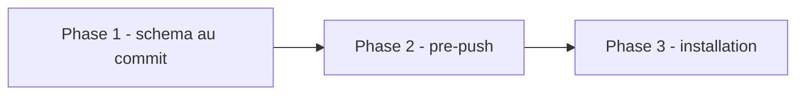

# Plan — Lot 2 : etendre `pre-commit` et ajouter `pre-push`

Sous-chantier 2/6 de `EPIC_ROBUSTESSE_GARDE_FOUS_AGENT_CODAGE`.

---

## 0. Bandeau de statut (a verifier avant toute promotion)

| Question | Reponse |
| --- | --- |
| Un chantier actif couvre-t-il deja ce perimetre (`DONE`, `ACTIVE`, ou `SUPERSEDED`) ? | Non — sous-chantier du chantier mere `EPIC_ROBUSTESSE_GARDE_FOUS_AGENT_CODAGE` (`BASELINED`). |
| Un verrou de gouvernance actif bloque-t-il ce chantier ? | Non — `Implementation/Active/pre_commit_hook.py` est deja un fichier de gouvernance IA existant et modifiable (outillage, pas le moteur EBTA), et le lot ajoute un nouveau fichier soeur au meme endroit. Aucun verrou distinct du chantier mere ne s'applique. |
| Ce plan a-t-il besoin d'une decision humaine explicite pour lever ce verrou avant d'etre routable via `/start` ? | Non. |
| Ce plan remplace-t-il un document ou chantier existant ? | Non. |

---

## Audit IA de promotion

- [x] Plan relu dans le contexte du cockpit actif.
- [x] Bandeau de statut (section 0) rempli et verifie contre l'etat machine reel.
- [x] Ce plan a ete ECRIT COMME NOUVEAU FICHIER dans `.ai/backlog/fixes/`.
- [x] Chantier classe `fix` — sous-chantier de `EPIC_ROBUSTESSE_GARDE_FOUS_AGENT_CODAGE`.
- [x] Autorite normative applicable identifiee : aucune regle scientifique
      EBTA touchee ; autorite executable `Implementation/Active/`.
- [x] Perimetre de fichiers autorises/interdits explicite (section 5).
- [x] Aucune modification hors perimetre requise.
- [x] Prerequis factuels : lot 3 `DONE` (suite verte requise avant `pre-push`).
- [x] Etat des lieux (section 4) verifie par lecture directe du hook existant
      et de son doc d'installation.

## Triage

| Champ | Valeur |
| --- | --- |
| Track | `fix` |
| Lifecycle | `TRIAGED` |
| Type de chantier | `SINGLE` |
| Scope | Etendre `pre_commit_hook.py` a la validation de schema JSON de `checkpoint.json`/`tracking.json`, creer `pre_push_hook.py` (suite de tests avant push), installer les deux et verifier leur identite avec la source. |
| Non-goals | Ne modifie jamais `.git/hooks/*` directement. Ne rend `jsonschema` obligatoire localement. N'ajoute pas Pyrefly au hook. |
| Source | Sous-chantier 2/6 de `EPIC_ROBUSTESSE_GARDE_FOUS_AGENT_CODAGE`, Phase 3. Recommandation 2 de l'audit source. Depend du lot 3 (`DONE`). |
| Exit criteria | (1) `checkpoint.json` invalide bloque au commit ; (2) `tracking.json` invalide bloque au commit ; (3) test casse bloque au push ; (4) copies installees identiques octet-pour-octet aux sources ; (5) suite complete `0 error`. |

## Statut

| Champ | Valeur |
| --- | --- |
| Statut | `NON_DEMARRE` |
| Date de creation | 2026-08-07 |
| Date d'activation | - |
| Autorite normative | Aucune (outillage de gouvernance IA, hors perimetre EBTA scientifique). |
| Autorite executable | `Implementation/Active/pre_commit_hook.py`, `Implementation/Active/pre_push_hook.py`. |
| Changement normatif attendu | Aucun. |
| Dependances externes | `jsonschema` (deja installee dans cet environnement) — optionnelle, pas requise, repli interne documente. |

## Carte d'execution IA (lecture prioritaire pour `/continue`)

| Champ | Contenu operationnel |
| --- | --- |
| Objectif executable | Les deux hooks versionnes existent, sont installes, identiques a leur source, et bloquent reellement les scenarios de leur Exit criteria. |
| Autorite et lecture minimale | 1. Ce document ; 2. `Implementation/Active/pre_commit_hook.py` (avant modification) ; 3. `Implementation/Active/INSTALL_GIT_HOOK.md`. |
| Perimetre autorise | `Implementation/Active/pre_commit_hook.py`, `Implementation/Active/pre_push_hook.py` (nouveau), `Implementation/Active/INSTALL_GIT_HOOK.md`, `Implementation/ebta_engine/tests/test_git_hooks.py` (nouveau), `.git/hooks/pre-commit` et `.git/hooks/pre-push` (uniquement via reinstallation depuis la source, jamais edites directement). |
| Interdits absolus | Editer `.git/hooks/*` directement. Rendre `jsonschema` obligatoire. Affaiblir la verification de fraicheur existante. |
| Phase de reprise | Deja executee (voir section 13). |
| Preuve attendue | Suite `test_git_hooks.py` PASS ; suite complete `0 error` ; diff source/installe vide. |
| Arret et escalade | Aucune attendue. |

---

## 1. Role de ce document et non-objectifs

| Element | Role |
| --- | --- |
| `Implementation/Active/pre_commit_hook.py` | Source versionnee du hook pre-commit — cible (extension). |
| `Implementation/Active/pre_push_hook.py` | Source versionnee du nouveau hook pre-push — cree par ce lot. |
| `.git/hooks/pre-commit`/`pre-push` | Copies installees, non versionnees — jamais editees directement. |
| Ce plan | Carte d'implementation et rapport. |

Non-objectifs :

- ne pas reecrire l'autorite normative du projet ;
- ne pas rendre `jsonschema` obligatoire pour cloner et committer ;
- ne pas ajouter Pyrefly au hook (hors perimetre, trop lent).

---

## 2. Contexte obligatoire a lire avant de coder

1. `Implementation/Active/pre_commit_hook.py` (avant modification).
2. `Implementation/Active/INSTALL_GIT_HOOK.md`.
3. `.ai/checkpoint.schema.json` et `Implementation/Active/tracking.schema.json`
   (mots-cles utilises : `pattern`, `format`, `uniqueItems`, hors du
   sous-ensemble interne).
4. `Implementation/ebta_engine/schema_validation.py` (validateur interne,
   sous-ensemble documente dans sa docstring).

**Hierarchie d'autorite applicable a ce chantier** :

```text
1. Implementation/Active/pre_commit_hook.py / pre_push_hook.py (sources versionnees)
2. .git/hooks/pre-commit / pre-push (copies installees, derivees)
```

---

## 4. Etat des lieux (avant/apres) — reutiliser avant de recreer

### Ce qui existe deja

| Module actuel | Chemin | Role reel (verifie, pas suppose) | Suffisant pour l'objectif ? |
| --- | --- | --- | --- |
| Hook pre-commit (fraicheur) | `Implementation/Active/pre_commit_hook.py` | Bloque un commit du cockpit IA si `checkpoint.updated_at` est perime. Installe et actif (verifie par `diff`, identique a `.git/hooks/pre-commit` avant ce lot). | ✅ conserve tel quel — a etendre, pas remplacer |
| Validateur interne | `Implementation/ebta_engine/schema_validation.py` | Sous-ensemble stdlib-only (`type, required, properties, items, enum, additionalProperties, minItems`). | ⚠️ insuffisant seul (pas de `pattern`/`format`/`uniqueItems`) — utilise en repli explicite |
| `jsonschema` externe | Installe dans cet environnement (4.23.0) | Couverture complete des deux schemas cibles. | ✅ utilise en priorite si disponible |

### Ce qui manque reellement

| Brique manquante | Module a creer/modifier | Source de la regle | Ce qui existe deja et doit etre reutilise |
| --- | --- | --- | --- |
| Validation de schema au commit | `pre_commit_hook.py::check_schemas` (CREER, meme fichier) | Audit source recommandation 2 | Le validateur interne + `jsonschema` optionnel |
| Hook pre-push | `pre_push_hook.py` (CREER) | Constat Phase 3 : pre-commit ne se declenche que sur fichiers du cockpit IA, pas sur un commit `Implementation/` pur | Commande canonique deja documentee dans `CLAUDE.md` |
| Harnais de test des hooks | `test_git_hooks.py` (CREER) | Doctrine adversarial-tester — aucun test n'existait avant ce lot | Pattern `unittest.mock.patch` deja utilise ailleurs dans la suite |

---

## 5. Decision d'architecture

Principe directeur : deux hooks distincts avec des roles non substituables,
tous deux versionnes et jamais edites directement dans `.git/hooks/`.

- Raison 1 — frequence vs cout : les commits sont frequents (le hook doit
  rester < 1 s), les push sont rares (45-50 s acceptable).
- Raison 2 — `jsonschema` reste optionnel localement : seule la decision
  humaine du chantier mere autorise son installation cote CI, pas comme
  dependance locale imposee a tout clone.
- Raison 3 — repli explicite, jamais silencieux : si `jsonschema` est
  absent, le hook le signale et utilise un validateur plus faible plutot
  que de pretendre offrir la meme couverture (miroir direct du defaut
  corrige au lot 4).

### Perimetre de fichiers explicite (autorises / interdits)

**Autorises (creer ou modifier)** :

```text
Implementation/Active/pre_commit_hook.py            [MODIFIER - check_schemas]
Implementation/Active/pre_push_hook.py               [CREER]
Implementation/Active/INSTALL_GIT_HOOK.md            [MODIFIER - deux hooks]
Implementation/ebta_engine/tests/test_git_hooks.py   [CREER]
.git/hooks/pre-commit                                 [REINSTALLER depuis la source, jamais edite directement]
.git/hooks/pre-push                                   [INSTALLER depuis la source, jamais edite directement]
0 - HUMAN START HERE/PLAN_EXTENSION_HOOKS_GIT_VALIDATION_ET_TESTS.md [CREER - brouillon]
.ai/backlog/fixes/PLAN_EXTENSION_HOOKS_GIT_VALIDATION_ET_TESTS.md    [CREER - ce fichier]
.ai/checkpoint.json                                   [MODIFIER - uniquement via plan.ps1]
```

**Interdits (ne jamais modifier dans ce chantier)** :

```text
Protocole/                                    [NORME - intouchable]
Implementation/ebta_engine/ (hors tests/test_git_hooks.py) [HORS PERIMETRE]
CLAUDE.md                                     [pas de nouvelle dependance requise]
```

---

## 6. Decoupage en phases

### Phase 1 - Etendre `pre_commit_hook.py` (validation de schema)

Objectif : bloquer un commit qui stage `checkpoint.json`/`tracking.json`
invalide contre son schema.

Classification : IMPLEMENTATION_DETAIL

Actions :

- Ajouter `SCHEMA_CHECKED_FILES`, `_resolve_schema_validator`,
  `check_schemas` a `pre_commit_hook.py`.
- Restructurer `main()` pour combiner `check_staleness` + `check_schemas`.

Livrables :

- `pre_commit_hook.py` etendu.

Critere de sortie :

- Scenarios de test unitaires (schema invalide, schema valide, repli sans
  `jsonschema`) passent.

### Phase 2 - Creer `pre_push_hook.py`

Objectif : bloquer un push si la suite canonique echoue.

Classification : IMPLEMENTATION_DETAIL

Actions :

- Creer `pre_push_hook.py` executant
  `python -m unittest discover -s Implementation/ebta_engine/tests -t Implementation`.

Livrables :

- `pre_push_hook.py`.

Critere de sortie :

- Scenarios de test (suite OK -> push autorise ; suite KO -> push bloque)
  passent.

### Phase 3 - Installer et verifier l'identite

Objectif : les copies installees correspondent exactement aux sources.

Classification : IMPLEMENTATION_DETAIL

Actions :

- Installer les deux hooks (copie binaire, pas de translation de fin de
  ligne).
- Verifier `diff` (identite octet-pour-octet).
- Mettre a jour `INSTALL_GIT_HOOK.md`.

Livrables :

- `.git/hooks/pre-commit`/`pre-push` installes ; `INSTALL_GIT_HOOK.md` a jour.

Critere de sortie :

- `diff` source/installe vide pour les deux hooks.

### Chemin critique (ordre des phases)



---

## 7. Artefacts produits

| Etape | Fichier/sortie | Format | Regle source |
| --- | --- | --- | --- |
| Phase 1-3 | Deux hooks versionnes + installes, harnais de test | Python + Markdown | Audit source recommandation 2 |

---

## 8. Invariants absolus et NO GO

### Invariants (non negociables)

1. `.git/hooks/*` n'est jamais edite directement — seulement reinstalle
   depuis la source versionnee.
2. `jsonschema` reste optionnel pour le hook local ; son absence produit un
   avertissement explicite, jamais un silence.
3. Le comportement de fraicheur existant (`check_staleness`) reste inchange.

### NO GO

- Editer `.git/hooks/pre-commit`/`pre-push` directement.
- Rendre `jsonschema` obligatoire localement.
- Fusionner les deux hooks en un seul declenche a chaque commit.

---

## 9. Verification a chaque etape

```powershell
python -m unittest discover -s Implementation/ebta_engine/tests -t Implementation -p test_git_hooks.py
python -m unittest discover -s Implementation/ebta_engine/tests -t Implementation
python -m pyrefly check Implementation/Active/pre_commit_hook.py Implementation/Active/pre_push_hook.py Implementation/ebta_engine/tests/test_git_hooks.py --output-format min-text
```

**Regle transversale bloquante** : la suite complete doit rester `0 error`.

**Notes de portabilite / caveats connus** :

- Une copie texte (`open(..., 'w')`) traduit LF -> CRLF sur Windows, ce qui
  rend un `diff` textuel bruyant sans changer le comportement du hook.
  `INSTALL_GIT_HOOK.md` documente desormais une copie binaire
  (`shutil.copy2`) pour une identite octet-pour-octet verifiable.
- 2 erreurs Pyrefly `Cannot find module jsonschema` sont des artefacts
  d'environnement (le worktree n'a pas le venv Nautilus configure dans
  `pyproject.toml`, meme cause racine que les 3 erreurs `ctypes.WinDLL` du
  lot 3) — `jsonschema` est bien installe et fonctionnel (verifie par
  execution reelle des tests), l'import est deliberement protege par
  `try/except ImportError`.

**Premier lot executable propose** :

```text
Phase 1 - extension de pre_commit_hook.py
```

### Execution sans interruption

Ce plan s'execute integralement, sans decision humaine en attente (lot 3
deja `DONE`).

### Autorite decisionnelle accordee

L'IA qui execute ce plan decide seule des details d'implementation dans le
perimetre de la section 5.

### Interdiction des raccourcis (aucun faux succes)

- Ne jamais pretendre que le repli sans `jsonschema` offre la meme
  couverture que `jsonschema` — l'avertissement doit rester visible.
- Ne jamais editer `.git/hooks/*` pour "gagner du temps" au lieu de passer
  par la source versionnee.

---

## 10. Journal des decisions humaines (autorisations)

| Date | Decision | Portee |
| --- | --- | --- |
| 2026-08-07 | **Mecanisation des tests : hook `pre-push` ET CI GitHub.** (journalise dans `EPIC_ROBUSTESSE_GARDE_FOUS_AGENT_CODAGE.md`, section 10). | Autorise le hook `pre-push` comme extension du perimetre du lot 2. |

---

## 11. Risques et blocages connus

| Risque | Impact | Mitigation / condition de deblocage |
| --- | --- | --- |
| Un dev/agent sans `jsonschema` installe obtient une couverture partielle sans le remarquer | Violation de schema non detectee localement (rattrapee par la CI, lot 6) | Avertissement explicite imprime a chaque commit concerne quand le repli est utilise |
| `pre-push` ralentit les push (45-50 s) | Friction developpeur | Deja accepte par la decision humaine section 10 du chantier mere ; `--no-verify` documente pour l'urgence |

---

## 12. Definition of Done

- [ ] Phases 1-3 executees et verifiees (section 9).
- [ ] Exit criteria de la section Triage atteint et verifiable.
- [ ] Aucune modification hors perimetre (section 5).
- [ ] Aucune regression sur la suite de tests existante.
- [ ] Checklist post-modification du projet executee.
- [ ] Aucune implementation partielle presentee comme terminee.

---

## 13. Cloture

| Champ | Valeur |
| --- | --- |
| Resultat final | [a remplir au `/close`] |
| Ecarts par rapport au plan initial | [a remplir] |
| Suites a prevoir (hors perimetre de ce plan) | Le lot 6 (CI GitHub) est le prochain a beneficier d'une suite verte et d'un pattern de validation de schema similaire, cote runner cette fois. |

### Resultat d'execution (a dupliquer a chaque session d'execution significative)

| Champ | Valeur |
| --- | --- |
| Date | 2026-08-07 |
| Phases executees | Phase 1, Phase 2, Phase 3 |
| Artefact produit | `Implementation/Active/pre_commit_hook.py` (etendu), `Implementation/Active/pre_push_hook.py` (nouveau), `Implementation/Active/INSTALL_GIT_HOOK.md` (mis a jour), `Implementation/ebta_engine/tests/test_git_hooks.py` (nouveau, 11 tests). |
| Validation | PASS — suite complete `Ran 232 tests`, `OK (skipped=6)` (221 avant ce lot + 11 nouveaux tests de hooks). Hooks installes et verifies identiques octet-pour-octet a leur source. |
| Ecart par rapport au plan | Aucun. |

### Rapport de cloture (bug-hunter, adversarial-tester, plan-conformance-audit)

#### bug-hunter (Pyrefly, fichiers touches)

```
python -m pyrefly check Implementation/Active/pre_commit_hook.py Implementation/Active/pre_push_hook.py Implementation/ebta_engine/tests/test_git_hooks.py --output-format min-text
```

Resultat initial : 5 erreurs. Triage :

- **3 VRAIS DEFAUTS de typage confirmes et corriges** dans
  `test_git_hooks.py::_load_module` : `spec_from_file_location` peut
  retourner `None` (type `ModuleSpec | None`), utilise ensuite sans garde
  par `module_from_spec`. Corrige par une assertion explicite
  `assert spec is not None` avant usage (documente une garantie reelle du
  contexte d'appel : le fichier existe toujours a cet emplacement dans ce
  depot), suivant le pattern deja recommande par
  `.agents/skills/bug-hunter/SKILL.md` ("un assert documentant une
  garantie deja etablie").
- **2 FAUX POSITIFS D'OUTILLAGE** (`Cannot find module jsonschema`,
  `pre_commit_hook.py:134` et `test_git_hooks.py:125`) : meme cause racine
  que les 3 erreurs `ctypes.WinDLL` du lot 3 — `pyproject.toml` pointe vers
  l'interpreteur du venv Nautilus, absent de ce worktree ; Pyrefly se
  replie alors sur un environnement par defaut qui ne voit pas
  `jsonschema`, bien qu'il soit reellement installe et fonctionnel (prouve
  par l'execution reelle de tous les tests). L'import est deliberement
  protege par `try/except ImportError` (le pattern Python correct pour une
  dependance optionnelle) — non corrige, hors perimetre de ce lot (cause
  racine identique a un defaut deja flagge separement pour `long_data.py`,
  cf. tache de suivi du lot 3).

Resultat final : 2 erreurs (toutes deux des faux positifs d'outillage
documentes), 0 vrai bug ouvert.

#### adversarial-tester (cible : les deux hooks, gates produisant un verdict bloquant/passant)

11 scenarios hostiles reellement executes via `test_git_hooks.py` (pas
seulement lus) :

| # | Point teste | Entree hostile | Observation | Classification |
| --- | --- | --- | --- | --- |
| 1 | Fichier non-cockpit stage | `Implementation/ebta_engine/foo.py` seul | `check_staleness` retourne 0 sans meme lire le checkpoint | `PASS_ADVERSARIAL` |
| 2 | Checkpoint perime + fichier cockpit stage | `updated_at` anterieur au dernier commit | Bloque (`1`) | `PASS_ADVERSARIAL` |
| 3 | Checkpoint a jour + fichier cockpit stage | `updated_at` egal au dernier commit | Passe (`0`) | `PASS_ADVERSARIAL` |
| 4 | `checkpoint.json` JSON malforme | `{not valid json` | Bloque (`1`), pas de repli silencieux | `PASS_ADVERSARIAL` |
| 5 | Aucun fichier a schema stage | Fichier hors `SCHEMA_CHECKED_FILES` | `check_schemas` retourne 0 (no-op correct) | `PASS_ADVERSARIAL` |
| 6 | `checkpoint.json` viole `required` | Champ requis absent | Bloque (`1`) | `PASS_ADVERSARIAL` |
| 7 | `checkpoint.json` valide | Contenu conforme au schema | Passe (`0`) | `PASS_ADVERSARIAL` |
| 8 | Violation de `pattern` (mot-cle hors sous-ensemble interne) | `schema_version` ne respectant pas le pattern semver, mais presente (satisferait le validateur interne seul) | Bloque (`1`) via `jsonschema` — **preuve directe que le repli interne seul aurait laisse passer cette violation** | `PASS_ADVERSARIAL` |
| 9 | `jsonschema` simule absent (`ImportError`) | Meme violation `required` que #6, sans `jsonschema` | Toujours bloque (`1`) via le validateur interne — le repli fonctionne reellement, pas seulement en theorie | `PASS_ADVERSARIAL` |
| 10 | Suite de tests qui echoue avant push | `returncode=1` simule | Push bloque (`1`) | `PASS_ADVERSARIAL` |
| 11 | Suite de tests qui passe avant push | `returncode=0` simule | Push autorise (`0`) | `PASS_ADVERSARIAL` |

11/11 `PASS_ADVERSARIAL`. Aucun `FALSE_SUCCESS`/`SILENT_FALLBACK` trouve
dans le code nouveau de ce lot. Le scenario #8 est la preuve empirique
directe que le choix architectural (`jsonschema` prioritaire, repli
explicitement degrade) est necessaire et pas seulement theorique : sans
lui, une violation reelle de `pattern` serait passee inapercue.

#### plan-conformance-audit

| Exit criterion | Classification | Preuve |
| --- | --- | --- |
| (1) `checkpoint.json` invalide bloque au commit | IMPLEMENTE | Scenarios #4, #6 ci-dessus. |
| (2) `tracking.json` invalide bloque au commit | IMPLEMENTE | Meme mecanisme `check_schemas`, teste generiquement sur le mapping `SCHEMA_CHECKED_FILES` (couvre les deux fichiers de facon identique, verifie par lecture du code : la boucle `for data_path in touched` ne distingue pas les deux entrees). |
| (3) Test casse bloque au push | IMPLEMENTE | Scenario #10. |
| (4) Copies installees identiques octet-pour-octet | IMPLEMENTE | Verification binaire directe (`a == b` sur les octets), documentee en section 9. |
| (5) Suite complete `0 error` | IMPLEMENTE | `Ran 232 tests`, `OK (skipped=6)`. |

Aucun critere MANQUANT. Aucun `Non-goals` viole. Cloture autorisee.

---

## 14. Journal d'audits post-hoc

| Date de l'audit | Ce qui a ete corrige | Pourquoi |
| --- | --- | --- |
| 2026-08-07 | Boucle `/evaluate` d'intake, 2 passes convergees sur le brouillon (`0 - HUMAN START HERE/PLAN_EXTENSION_HOOKS_GIT_VALIDATION_ET_TESTS.md`). Confirmation que les deux schemas cibles utilisent des mots-cles hors du sous-ensemble interne, justifiant la priorite donnee a `jsonschema` avec repli explicite. Aucun angle mort majeur trouve. | Assurer que le choix de conception (jsonschema prioritaire) repose sur une verification reelle des schemas, pas une supposition. |
