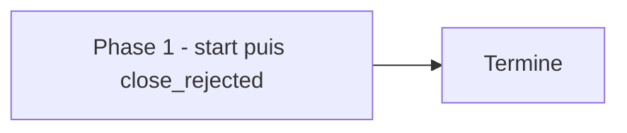

# Plan — Lot 5 : isolation des tests dépendants de Nautilus (clôture REJECTED)

Sous-chantier 5/6 de `EPIC_ROBUSTESSE_GARDE_FOUS_AGENT_CODAGE`.

---

## 0. Bandeau de statut (a verifier avant toute promotion)

| Question | Reponse |
| --- | --- |
| Un chantier actif couvre-t-il deja ce perimetre (`DONE`, `ACTIVE`, ou `SUPERSEDED`) ? | Non — sous-chantier du chantier mere `EPIC_ROBUSTESSE_GARDE_FOUS_AGENT_CODAGE` (`BASELINED`), aucun autre chantier ne couvre l'isolation des tests Nautilus. |
| Un verrou de gouvernance actif bloque-t-il ce chantier ? | Non applicable directement : ce lot ne modifie aucun fichier `Implementation/`, `Protocole/` ni `.ai/tools/` — il ne fait que router et cloturer un refus humain deja journalise. |
| Ce plan a-t-il besoin d'une decision humaine explicite pour lever ce verrou avant d'etre routable via `/start` ? | Non — la decision humaine necessaire (refus du lot) est deja journalisee dans `EPIC_ROBUSTESSE_GARDE_FOUS_AGENT_CODAGE.md`, section 10, le 2026-08-07. |
| Ce plan remplace-t-il un document ou chantier existant ? | Non. |

---

## Audit IA de promotion

- [x] Plan relu dans le contexte du cockpit actif (`AGENTS.md`, `.ai/README.md`,
      `.ai/checkpoint.json`, `Implementation/Active/HOOK.md`).
- [x] Bandeau de statut (section 0) rempli et verifie contre l'etat machine reel.
- [x] Ce plan a ete ECRIT COMME NOUVEAU FICHIER dans `.ai/backlog/fixes/` ;
      le brouillon original reste intact dans `0 - HUMAN START HERE/` jusqu'a
      son archivage mecanique par `plan.ps1 start`.
- [x] Chantier classe `fix` — sous-chantier de coordination du chantier mere
      `EPIC_ROBUSTESSE_GARDE_FOUS_AGENT_CODAGE`, meme track.
- [x] Autorite normative applicable identifiee : aucune regle scientifique
      EBTA touchee ; autorite procedurale `.ai/workflows/common/WORKFLOW.md`.
- [x] Perimetre de fichiers autorises/interdits explicite (section 5).
- [x] Aucune modification hors perimetre requise pour cloturer ce lot.
- [x] Prerequis factuels identifies : decision humaine deja actee (section 10
      du chantier mere), aucun autre prerequis.
- [x] Etat des lieux (section 4) verifie par lecture directe des sept fichiers
      de test `nautilus` du depot (aucun `skipUnless`/`skipIf`/`import
      nautilus_trader`).

## Triage

| Champ | Valeur |
| --- | --- |
| Track | `fix` |
| Lifecycle | `TRIAGED` |
| Type de chantier | `SINGLE` |
| Scope | Acter mecaniquement le refus humain du 2026-08-07 de la recommandation 5 de l'audit source, sans implementer la segmentation de la suite de tests. |
| Non-goals | Ne modifie ni `CLAUDE.md`, ni la commande canonique `python -m unittest discover -s Implementation/ebta_engine/tests -t Implementation`, ni `.ai/checkpoint.json::validation.commands`, ni aucun fichier de test. Ne rouvre pas la decision humaine deja actee. |
| Source | Sous-chantier 5/6 de `EPIC_ROBUSTESSE_GARDE_FOUS_AGENT_CODAGE` (section "Sous-chantiers" et section 10). Recommandation 5 de l'audit source `0 - HUMAN START HERE/archive/20260807_AUDIT_ROBUSTESSE_ARCHITECTURE_FACE_ERREURS_IA_2026-08-07.md`. |
| Exit criteria | Ce workstream existe dans `.ai/checkpoint.json` avec `status: DONE` / `lifecycle: REJECTED`, et aucun fichier hors de ce plan n'a ete modifie. |

## Statut

| Champ | Valeur |
| --- | --- |
| Statut | `NON_DEMARRE` |
| Date de creation | 2026-08-07 |
| Date d'activation | - |
| Autorite normative | Aucune (hors perimetre EBTA scientifique). Autorite procedurale : `.ai/workflows/common/WORKFLOW.md`. |
| Autorite executable | `.ai/tools/plan.ps1` (transition `close_rejected` depuis `TRIAGED`). |
| Changement normatif attendu | Aucun. |
| Dependances externes | Aucune. |

## Carte d'execution IA (lecture prioritaire pour `/continue`)

| Champ | Contenu operationnel |
| --- | --- |
| Objectif executable | Router ce plan (`plan.ps1 start`) puis le cloturer immediatement `REJECTED` (`plan.ps1 close -Outcome REJECTED`), sans etape `baseline`/`continue`/`ready`. |
| Autorite et lecture minimale | 1. `EPIC_ROBUSTESSE_GARDE_FOUS_AGENT_CODAGE.md` section 10 (decision humaine) ; 2. ce document. |
| Perimetre autorise | Ce fichier uniquement, plus `.ai/checkpoint.json` via `plan.ps1`. |
| Interdits absolus | Modifier `CLAUDE.md`, un fichier de test, ou `.ai/checkpoint.json::validation.commands`. Implementer la segmentation. |
| Phase de reprise | Aucune phase de code : `start` puis `close_rejected` directement. |
| Preuve attendue | `.ai/checkpoint.json` porte `status: DONE` / `lifecycle: REJECTED` pour cet ID. |
| Arret et escalade | Aucune attendue — la decision humaine est deja tranchee. |

---

## 1. Role de ce document et non-objectifs

| Element | Role |
| --- | --- |
| `Protocole/` | Hors perimetre total. |
| `Implementation/ebta_engine/tests/` | Cible de la recommandation refusee — non modifie par ce plan. |
| `.ai/checkpoint.json` | Etat machine — jamais edite a la main, uniquement via `plan.ps1`. |
| Ce plan | Formalise et cloture un refus humain deja acte, sans coder. |

Non-objectifs :

- ne pas reecrire l'autorite normative du projet ;
- ne pas introduire de regle, seuil ou statut absent de cette autorite ;
- ne pas segmenter la suite de tests ni modifier `CLAUDE.md` ;
- ne pas rouvrir la decision humaine de refus.

---

## 2. Contexte obligatoire a lire avant de coder

1. `EPIC_ROBUSTESSE_GARDE_FOUS_AGENT_CODAGE.md` section 10 — la decision
   humaine de refus, verbatim.
2. `0 - HUMAN START HERE/archive/20260807_AUDIT_ROBUSTESSE_ARCHITECTURE_FACE_ERREURS_IA_2026-08-07.md`
   — recommandation 5, motif du refus.
3. `.ai/checkpoint.json` — etat machine courant.

**Hierarchie d'autorite applicable a ce chantier** :

```text
1. Protocole/ (non touche)
2. Implementation/ (non touche par ce lot)
3. .ai/ (cockpit IA : etat machine, gouvernance procedurale)
```

Regle : ce lot ne code rien ; il ne fait que journaliser mecaniquement un
refus deja tranche par l'humain.

---

## 4. Etat des lieux (avant/apres) — reutiliser avant de recreer

### Ce qui existe deja

| Module actuel | Chemin | Role reel (verifie, pas suppose) | Suffisant pour l'objectif ? |
| --- | --- | --- | --- |
| Suite de tests `nautilus` | `Implementation/ebta_engine/tests/test_nautilus_*.py` (7 fichiers) | Verifie le 2026-08-07 : aucun `skipUnless`/`skipIf`/`import nautilus_trader` — s'executent hors venv avec simulateurs factices. | ✅ suffisant tel quel — pas de segmentation necessaire |
| Garde d'environnement | `Implementation/ebta_engine/benchmarks/long_data.py:487` | Seul point de rupture reel lie a l'environnement Nautilus ; traite par le lot 3, pas par ce lot. | ✅ couvert par le lot 3 |

### Ce qui manque reellement

| Brique manquante | Module a creer | Source de la regle | Ce qui existe deja et doit etre reutilise |
| --- | --- | --- | --- |
| Aucune — la recommandation est refusee | — | Decision humaine du 2026-08-07 | — |

---

## 5. Decision d'architecture

Principe directeur : ce lot ne construit rien ; il formalise un refus.

- Raison 1 — la premisse de la recommandation (« un echec d'environnement se
  noie dans le run ») tombe des que le lot 3 livre sa garde locale : le seul
  point de rupture reel est isole a la source, pas par une segmentation de
  suite.
- Raison 2 — le cout de la segmentation (mise a jour coherente de
  `CLAUDE.md` et `.ai/checkpoint.json::validation.commands`) resterait reel
  pour un benefice devenu nul.

### Perimetre de fichiers explicite (autorises / interdits)

**Autorises (creer ou modifier)** :

```text
0 - HUMAN START HERE/PLAN_ISOLATION_TESTS_DEPENDANTS_NAUTILUS.md   [CREER - brouillon, archive par plan.ps1]
.ai/backlog/fixes/PLAN_ISOLATION_TESTS_DEPENDANTS_NAUTILUS.md      [CREER - ce fichier]
.ai/checkpoint.json                                                  [MODIFIER - uniquement via plan.ps1]
```

**Interdits (ne jamais modifier dans ce chantier)** :

```text
Protocole/                                   [NORME - intouchable]
Implementation/ebta_engine/tests/            [CIBLE DE LA RECOMMANDATION REFUSEE - non modifie]
CLAUDE.md                                    [COMMANDE CANONIQUE - non modifiee, recommandation refusee]
.ai/checkpoint.schema.json                   [CONTRAT GELE]
```

---

## 6. Decoupage en phases

### Phase 1 - Routage et cloture immediate

Objectif : router ce plan puis le cloturer `REJECTED` en une seule session,
sans phase de code.

Classification : TEST_FIXTURE

Actions :

- Router via `plan.ps1 start -Audited` (transition `INTAKE_AUDITED -> TRIAGED`).
- Cloturer immediatement via `plan.ps1 close -Outcome REJECTED -Reason`
  citant la decision de section 10 du chantier mere comme `closure_reason`.

Livrables :

- Workstream `PLAN_ISOLATION_TESTS_DEPENDANTS_NAUTILUS` enregistre et
  cloture dans `.ai/checkpoint.json`.

Critere de sortie :

- `.ai/checkpoint.json` porte `status: DONE` / `lifecycle: REJECTED` pour cet
  ID, valide contre son schema.

### Chemin critique (ordre des phases)



---

## 7. Artefacts produits

| Etape | Fichier/sortie | Format | Regle source |
| --- | --- | --- | --- |
| Phase 1 | Entree de workstream `REJECTED` dans `.ai/checkpoint.json` | JSON | `.ai/checkpoint.schema.json` |

---

## 8. Invariants absolus et NO GO

### Invariants (non negociables)

1. Ce lot ne modifie aucun fichier de test, `CLAUDE.md`, ou
   `.ai/checkpoint.json::validation.commands`.
2. `.ai/checkpoint.json` n'est modifie que par `.ai/tools/plan.ps1`.

### NO GO

- Implementer la segmentation de la suite de tests dans ce lot.
- Rouvrir la decision humaine de refus.
- Modifier `CLAUDE.md` ou la commande canonique de test.

---

## 9. Verification a chaque etape

```powershell
python -m json.tool .ai\checkpoint.json
python -c "import json, jsonschema; jsonschema.validate(json.load(open('.ai/checkpoint.json', encoding='utf-8')), json.load(open('.ai/checkpoint.schema.json', encoding='utf-8')))"
```

**Regle transversale bloquante** : aucune regression n'est possible sur la
suite de reference, ce lot ne la touchant pas. Verification neanmoins
executee par prudence :

```powershell
python -m unittest discover -s Implementation/ebta_engine/tests -t Implementation
```

**Premier lot executable propose** :

```text
Phase 1 - start puis close_rejected, en une seule session
```

### Execution sans interruption

Ce plan s'execute integralement en une seule phase, sans decision humaine en
attente : la decision de refus est deja journalisee (section 10 du chantier
mere). Aucune cause d'arret legitime ne s'applique.

### Autorite decisionnelle accordee

L'IA qui execute ce plan route puis cloture directement, sans repasser par
l'humain.

### Interdiction des raccourcis (aucun faux succes)

- Ne jamais presenter cette cloture `REJECTED` comme une implementation
  partielle ou differee — c'est un refus definitif tel que cadre, pas un
  report.
- Ne jamais enregistrer une reference de preuve qui ne designe pas un
  artefact reel.

---

## 10. Journal des decisions humaines (autorisations)

| Date | Decision | Portee |
| --- | --- | --- |
| 2026-08-07 | **Lot 5 refuse tel que cadre.** L'isolation des tests dependants de Nautilus n'est pas retenue (journalise dans `EPIC_ROBUSTESSE_GARDE_FOUS_AGENT_CODAGE.md`, section 10). | Motif factuel : aucun des sept fichiers de test `nautilus` n'utilise `skipUnless`/`skipIf`/`import nautilus_trader` ; le seul test reellement dependant de l'environnement est traite par le lot 3. Lot 5 a cloturer `status: DONE` / `lifecycle: REJECTED`. |

---

## 11. Risques et blocages connus

| Risque | Impact | Mitigation / condition de deblocage |
| --- | --- | --- |
| Aucun — lot sans implementation | — | — |

---

## 12. Definition of Done

- [ ] Phase 1 executee (section 9).
- [ ] Exit criteria de la section Triage atteint et verifiable.
- [ ] Aucune modification hors perimetre (section 5).
- [ ] Aucune regression sur la suite de tests existante.
- [ ] Checklist post-modification du projet executee.
- [ ] Aucune implementation partielle presentee comme terminee.

---

## 13. Cloture

| Champ | Valeur |
| --- | --- |
| Resultat final | [a remplir au `/close`] |
| Ecarts par rapport au plan initial | Aucun attendu. |
| Suites a prevoir (hors perimetre de ce plan) | La question residuelle (« ces tests passent-ils pour de bonnes raisons ? ») revient au lot 4 (`PLAN_ADVERSARIAL_TESTER_GOUVERNANCE_OUTILLE`). |

---

## 14. Journal d'audits post-hoc

| Date de l'audit | Ce qui a ete corrige | Pourquoi |
| --- | --- | --- |
| 2026-08-07 | Boucle `/evaluate` d'intake, 2 passes convergees, sur le brouillon source (`0 - HUMAN START HERE/PLAN_ISOLATION_TESTS_DEPENDANTS_NAUTILUS.md`) : ajout de la reference explicite au precedent `EPIC_ARCHITECTURE_IA_RAG` comme modele de cloture `REJECTED` sans implementation. Aucun angle mort majeur trouve, le fait et la decision etant deja etablis par le chantier mere. | Assurer la tracabilite du precedent invoque et confirmer qu'aucun fichier hors de ce plan n'est necessaire pour cloturer. |
