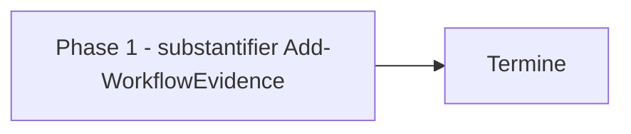

# Plan — Lot 1 : substantifier les preuves du gate `ready` de `workflow_state.ps1`

Sous-chantier 1/6 de `EPIC_ROBUSTESSE_GARDE_FOUS_AGENT_CODAGE`.

---

## 0. Bandeau de statut (a verifier avant toute promotion)

| Question | Reponse |
| --- | --- |
| Un chantier actif couvre-t-il deja ce perimetre (`DONE`, `ACTIVE`, ou `SUPERSEDED`) ? | Non — sous-chantier du chantier mere `EPIC_ROBUSTESSE_GARDE_FOUS_AGENT_CODAGE` (`BASELINED`). Aucun autre chantier ne touche `Add-WorkflowEvidence`. |
| Un verrou de gouvernance actif bloque-t-il ce chantier ? | Non — ce lot modifie `.ai/tools/`, outillage de gouvernance IA, pas `Implementation/` ni `Protocole/`. Aucune decision humaine requise. |
| Ce plan a-t-il besoin d'une decision humaine explicite pour lever ce verrou avant d'etre routable via `/start` ? | Non. |
| Ce plan remplace-t-il un document ou chantier existant ? | Non. |

---

## Audit IA de promotion

- [x] Plan relu dans le contexte du cockpit actif.
- [x] Bandeau de statut (section 0) rempli et verifie contre l'etat machine reel.
- [x] Ce plan a ete ECRIT COMME NOUVEAU FICHIER dans `.ai/backlog/fixes/`.
- [x] Chantier classe `fix` — sous-chantier de `EPIC_ROBUSTESSE_GARDE_FOUS_AGENT_CODAGE`.
- [x] Autorite normative applicable identifiee : aucune regle scientifique
      EBTA touchee ; autorite executable `.ai/tools/workflow_state.ps1` et
      `.ai/tools/plan.ps1`.
- [x] Perimetre de fichiers autorises/interdits explicite (section 5).
- [x] Aucune modification hors perimetre requise.
- [x] Prerequis factuels identifies : aucun manquant.
- [x] Etat des lieux (section 4) verifie par lecture directe du code
      (`Add-WorkflowEvidence` ligne 120-143, `Add-WorkflowEvidenceArguments`
      ligne 145-157 de `.ai/tools/workflow_state.ps1` ; appels dans
      `.ai/tools/plan.ps1` lignes 287, 389-390, 437, 514 ; usages dans
      `.ai/tools/tests/test_workflow_state_machine.ps1` lignes 37-51 et 165-182).

## Triage

| Champ | Valeur |
| --- | --- |
| Track | `fix` |
| Lifecycle | `TRIAGED` |
| Type de chantier | `SINGLE` |
| Scope | Rendre `Add-WorkflowEvidence` exigeant sur la substance des preuves `bug_hunter`, `adversarial_tester`, `plan_conformance` : la reference doit pointer vers un fichier existant du depot (avec verification best-effort de l'ancre Markdown si fournie), au lieu d'accepter n'importe quelle chaine non vide. |
| Non-goals | Ne modifie pas `Assert-WorkflowState` (validation retroactive interdite). Ne modifie pas les IDs `intake_audit`, `plan_audit`, `baseline_commit`, `legacy_import`. Ne verifie pas le contenu semantique de l'artefact, seulement son existence et, si fournie, son ancre. Ne pretend pas rendre la fraude impossible. |
| Source | Sous-chantier 1/6 de `EPIC_ROBUSTESSE_GARDE_FOUS_AGENT_CODAGE`, Phase 1. Recommandation 1 de l'audit source `0 - HUMAN START HERE/archive/20260807_AUDIT_ROBUSTESSE_ARCHITECTURE_FACE_ERREURS_IA_2026-08-07.md`. |
| Exit criteria | (1) `Add-WorkflowEvidence` rejette une reference `bug_hunter`/`adversarial_tester`/`plan_conformance` qui ne pointe pas vers un fichier existant du depot, ou dont l'ancre fournie n'existe pas dans ce fichier ; (2) elle continue d'accepter une reference valide (fichier existant, avec ou sans ancre valide) et n'affecte aucun autre ID d'evidence ; (3) `.ai/tools/tests/test_workflow_state_machine.ps1` retourne PASS (exit code 0), y compris un nouveau cas negatif appelant `Add-WorkflowEvidence` avec `bug_hunter=chaine_arbitraire_sans_artefact` et exigeant qu'il leve une erreur. |

## Statut

| Champ | Valeur |
| --- | --- |
| Statut | `NON_DEMARRE` |
| Date de creation | 2026-08-07 |
| Date d'activation | - |
| Autorite normative | Aucune (hors perimetre EBTA scientifique). |
| Autorite executable | `.ai/tools/workflow_state.ps1`, `.ai/tools/plan.ps1`. |
| Changement normatif attendu | Aucun. |
| Dependances externes | Aucune. |

## Carte d'execution IA (lecture prioritaire pour `/continue`)

| Champ | Contenu operationnel |
| --- | --- |
| Objectif executable | `Add-WorkflowEvidence` rejette une reference `bug_hunter`/`adversarial_tester`/`plan_conformance` qui ne pointe pas vers un artefact reel du depot. |
| Autorite et lecture minimale | 1. Ce document ; 2. `.ai/tools/workflow_state.ps1` ; 3. `.ai/tools/plan.ps1` ; 4. `.ai/tools/tests/test_workflow_state_machine.ps1`. |
| Perimetre autorise | `.ai/tools/workflow_state.ps1`, `.ai/tools/plan.ps1` (threading `-RepoRoot`), `.ai/tools/tests/test_workflow_state_machine.ps1`. |
| Interdits absolus | `Assert-WorkflowState`, `.ai/checkpoint.schema.json`, tout ID d'evidence hors des trois cibles, toute validation retroactive de l'historique deja enregistre. |
| Phase de reprise | Phase 1 (implementation unique). |
| Preuve attendue | `.\.ai\tools\tests\test_workflow_state_machine.ps1` exit code 0 ; suite runtime Python inchangee (ce lot ne touche pas `Implementation/`). |
| Arret et escalade | Aucune attendue — aucune decision humaine en suspens. |

---

## 1. Role de ce document et non-objectifs

| Element | Role |
| --- | --- |
| `.ai/workflows/*/WORKFLOW.json` | Contrat de transitions et d'evidences requises — deja correct, non modifie. |
| `.ai/tools/workflow_state.ps1` | Cible de ce lot — mecanique de gate a durcir. |
| `.ai/tools/plan.ps1` | Backend appelant — threading du nouveau parametre. |
| Ce plan | Carte d'implementation de la substantiation. |

Non-objectifs :

- ne pas reecrire le contrat de transitions (`WORKFLOW.json`) ;
- ne pas verifier le contenu semantique d'un artefact de preuve, seulement
  son existence et son ancre ;
- ne pas valider retroactivement l'historique deja enregistre
  (`Assert-WorkflowState` reste inchange) ;
- ne pas presenter ce lot comme rendant la fraude impossible.

---

## 2. Contexte obligatoire a lire avant de coder

1. `.ai/tools/workflow_state.ps1` — `Add-WorkflowEvidence` (ligne 120),
   `Add-WorkflowEvidenceArguments` (ligne 145), `Move-WorkflowStage`,
   `Assert-WorkflowState` (a NE PAS toucher).
2. `.ai/tools/plan.ps1` — tous les appels a `Add-WorkflowEvidence`/
   `Add-WorkflowEvidenceArguments` (lignes 287, 389-390, 437, 514) et
   `$repoRoot` deja calcule ligne 254 (`Resolve-RepoRoot`).
3. `.ai/tools/tests/test_workflow_state_machine.ps1` — usages directs
   (lignes 37-51) et via le backend isole (lignes 165-182).
4. Exemples reels de references deja enregistrees dans
   `.ai/checkpoint.json` (grep `"intake_audit"`, `"plan_conformance"`) pour
   confirmer le format `chemin#ancre`.

**Hierarchie d'autorite applicable a ce chantier** :

```text
1. .ai/workflows/*/WORKFLOW.json (contrat de transitions, non modifie)
2. .ai/tools/workflow_state.ps1 (mecanique de gate, cible de ce lot)
3. .ai/tools/plan.ps1 (backend appelant)
```

Regle : si une reference ne peut pas etre validee (chemin manquant,
`RepoRoot` absent), la fonction doit lever une erreur explicite plutot que
d'accepter silencieusement.

---

## 4. Etat des lieux (avant/apres) — reutiliser avant de recreer

### Ce qui existe deja

| Module actuel | Chemin | Role reel (verifie, pas suppose) | Suffisant pour l'objectif ? |
| --- | --- | --- | --- |
| `Add-WorkflowEvidence` | `.ai/tools/workflow_state.ps1:120-143` | Valide le format de l'ID (`^[a-z][a-z0-9_]*$`), refuse une reference vide, refuse un ID deja enregistre. Aucune verification de substance. | ⚠️ a etendre — structure correcte, substance manquante |
| `Add-WorkflowEvidenceArguments` | `.ai/tools/workflow_state.ps1:145-157` | Parse `id=reference` et delegue a `Add-WorkflowEvidence`. Seul point d'entree reel pour `bug_hunter`/`adversarial_tester`/`plan_conformance` en production (via `plan.ps1 ready -Evidence`). | ⚠️ a etendre — threading `-RepoRoot` |
| `plan.ps1` action `ready` | `.ai/tools/plan.ps1:423-442` | Appelle `Add-WorkflowEvidenceArguments` avec `$Evidence`, `$repoRoot` deja disponible dans le scope du script. | ⚠️ a etendre — passer `-RepoRoot $repoRoot` |
| Contrat `ready` de `core-engine` | `.ai/workflows/core-engine/WORKFLOW.json:30` | Exige deja `bug_hunter`, `adversarial_tester`, `plan_conformance`. | ✅ correct — ne rien changer ici |
| Test unitaire | `.ai/tools/tests/test_workflow_state_machine.ps1` | Valide la machine a etats ; utilise des references factices (`"unit:conformance"`, `"test:report"`) pour `plan_conformance` qui casseraient sous la nouvelle validation. | ⚠️ a corriger — remplacer par des references vers des fichiers reellement existants dans leur contexte (repo principal ou repo temporaire isole) |

### Ce qui manque reellement

| Brique manquante | Module a creer/modifier | Source de la regle | Ce qui existe deja et doit etre reutilise |
| --- | --- | --- | --- |
| Verification de substance ciblee par ID | `Add-WorkflowEvidence` (MODIFIER) + nouvelle fonction interne `Test-EvidenceReferenceSubstance` (CREER, meme fichier) | Audit source, recommandation 1, contraintes 1-3 | La structure existante de validation d'ID/reference vide, etendue sans etre remplacee |
| Slugification best-effort d'ancre Markdown | Nouvelle fonction interne `ConvertTo-HeadingSlug` (CREER, meme fichier) | Format observe des references reelles (`#resultat-dexecution-...`, `#9-audit-ia-de-promotion`) | Aucun — logique nouvelle et locale |
| Threading `-RepoRoot` | `Add-WorkflowEvidence`, `Add-WorkflowEvidenceArguments`, tous les appels dans `plan.ps1` (MODIFIER) | Necessaire pour resoudre un chemin relatif sans dependance cachee a `git` | `$repoRoot` deja calcule dans `plan.ps1` (`Resolve-RepoRoot`, ligne 254) |
| Cas de test de la preuve negative | `.ai/tools/tests/test_workflow_state_machine.ps1` (MODIFIER) | Exit criteria condition (3) du present plan et condition (4) de l'Exit criteria du chantier mere | Le harnais `Assert-Throws` deja present dans le test |

---

## 5. Decision d'architecture

Principe directeur : durcir le gate existant a l'endroit exact ou l'audit a
trouve la faille (`Add-WorkflowEvidence`), sans créer de second mécanisme
parallèle et sans toucher au contrat déclaratif (`WORKFLOW.json`) qui, lui,
était déjà correct.

- Raison 1 — **validation ciblee, pas globale**. Seuls les IDs
  `bug_hunter`, `adversarial_tester`, `plan_conformance` sont concernes ; les
  formats heterogenes (`baseline_commit` = SHA, `legacy_import` = phrase
  libre) ne sont pas des artefacts-fichiers et resteraient casses par une
  validation uniforme.
- Raison 2 — **fail-closed sur `-RepoRoot` manquant**. Si un futur appelant
  omet `-RepoRoot` pour un ID substantifie, la fonction leve une erreur
  plutot que de sauter silencieusement la verification — coherent avec le
  pattern deja identifie comme sain dans `governance/` par l'audit source
  (echec explicite, jamais un defaut positif implicite).
- Raison 3 — **validation a l'ecriture, jamais a la relecture**.
  `Assert-WorkflowState` continue de ne verifier que le format
  (`^[a-z][a-z0-9_]*$` + reference non vide) : c'est la fonction appelee
  implicitement par `Move-WorkflowStage` sur l'historique deja enregistre.
  Y ajouter la verification de substance invaliderait retroactivement des
  workstreams archives dont les artefacts ont pu etre deplaces/archives
  depuis.

### Contrat d'interface

```powershell
function Test-EvidenceReferenceSubstance {
    param(
        [Parameter(Mandatory = $true)][string]$RepoRoot,
        [Parameter(Mandatory = $true)][string]$Reference
    )
    # Decoupe "chemin#ancre" ; verifie que le chemin (relatif, sans "..",
    # non enracine) existe comme fichier sous $RepoRoot ; si une ancre est
    # fournie, verifie qu'elle correspond (best-effort, style GitHub) a un
    # titre Markdown du fichier. Leve une erreur descriptive sinon.
}

function ConvertTo-HeadingSlug {
    param([Parameter(Mandatory = $true)][string]$Text)
    # Approxime l'algorithme de slug GitHub : minuscule, retrait de la
    # ponctuation hors espace/tiret, espaces -> tirets, tirets multiples
    # reduits. N'gere pas les suffixes de doublon ("-1", "-2").
}
```

`Add-WorkflowEvidence` gagne un parametre optionnel `-RepoRoot` ; si l'`Id`
appartient a `@("bug_hunter", "adversarial_tester", "plan_conformance")`,
`-RepoRoot` devient obligatoire (erreur explicite si absent) et
`Test-EvidenceReferenceSubstance` est appelee avant l'ajout de la preuve.
`Add-WorkflowEvidenceArguments` gagne le meme parametre et le relaie tel
quel a chaque appel de `Add-WorkflowEvidence`.

### Decisions deja actees

| Decision | Justification |
| --- | --- |
| Verification d'ancre "best-effort", pas exacte | GitHub gere les doublons de titres avec des suffixes `-1`/`-2` que ce lot ne reproduit pas ; documente comme caveat connu (section 9), pas une regression cachee. |
| Aucun controle du contenu de l'artefact | L'existence d'un fichier ne prouve pas son contenu — honnetete deja actee par le chantier mere (section 5 de `EPIC_ROBUSTESSE_GARDE_FOUS_AGENT_CODAGE.md`). |
| Chemin relatif obligatoire, `..` et racine absolue interdits | Empeche une reference de pointer hors du depot (`C:\...`, `../../secrets`). |

### Perimetre de fichiers explicite (autorises / interdits)

**Autorises (creer ou modifier)** :

```text
.ai/tools/workflow_state.ps1                  [MODIFIER - Phase 1]
.ai/tools/plan.ps1                             [MODIFIER - Phase 1, threading -RepoRoot]
.ai/tools/tests/test_workflow_state_machine.ps1 [MODIFIER - Phase 1, references reelles + cas negatif]
0 - HUMAN START HERE/PLAN_SUBSTANTIATION_PREUVES_WORKFLOW_READY.md [CREER - brouillon, archive par plan.ps1]
.ai/backlog/fixes/PLAN_SUBSTANTIATION_PREUVES_WORKFLOW_READY.md    [CREER - ce fichier]
.ai/checkpoint.json                            [MODIFIER - uniquement via plan.ps1]
```

**Interdits (ne jamais modifier dans ce chantier)** :

```text
Protocole/                                    [NORME - intouchable]
Implementation/                                [HORS PERIMETRE - ce lot ne touche pas le runtime]
.ai/workflows/*/WORKFLOW.json                  [CONTRAT DEJA CORRECT - cf. section 4]
.ai/checkpoint.schema.json                     [CONTRAT GELE]
Assert-WorkflowState (dans workflow_state.ps1) [VALIDATION RETROACTIVE INTERDITE - cf. section 5]
```

---

## 6. Decoupage en phases

### Phase 1 - Substantifier `Add-WorkflowEvidence`

Objectif : rejeter une reference `bug_hunter`/`adversarial_tester`/
`plan_conformance` qui ne pointe pas vers un artefact reel du depot.

Classification : IMPLEMENTATION_DETAIL

Actions :

- Ajouter `ConvertTo-HeadingSlug` et `Test-EvidenceReferenceSubstance` dans
  `.ai/tools/workflow_state.ps1`.
- Ajouter le parametre `-RepoRoot` a `Add-WorkflowEvidence` ; appeler
  `Test-EvidenceReferenceSubstance` quand `$Id` est dans la liste
  substantifiee, en exigeant `-RepoRoot`.
- Ajouter le parametre `-RepoRoot` a `Add-WorkflowEvidenceArguments` et le
  relayer.
- Mettre a jour les quatre appels dans `.ai/tools/plan.ps1` pour passer
  `-RepoRoot $repoRoot` (lignes 287, 389-390, 437, 514).
- Mettre a jour `.ai/tools/tests/test_workflow_state_machine.ps1` :
  remplacer la reference factice `plan_conformance` (ligne 47) par une
  reference vers un fichier reellement existant du depot principal (ce
  fichier de test lui-meme) ; remplacer `-Evidence "plan_conformance=test:report"`
  (ligne 182) par une reference vers un fichier reellement present dans le
  depot temporaire isole (`0 - HUMAN START HERE/draft.md`, deja cree par le
  test) ; ajouter un cas negatif explicite appelant `Add-WorkflowEvidence`
  avec `-Id "bug_hunter" -Reference "chaine_arbitraire_sans_artefact"
  -RepoRoot $repoRoot` sous `Assert-Throws`.

Livrables :

- `.ai/tools/workflow_state.ps1`, `.ai/tools/plan.ps1`,
  `.ai/tools/tests/test_workflow_state_machine.ps1` modifies et coherents.

Critere de sortie :

- `.\.ai\tools\tests\test_workflow_state_machine.ps1` retourne exit code 0
  et affiche `workflow_state_machine=PASS`.

### Chemin critique (ordre des phases)



---

## 7. Artefacts produits

| Etape | Fichier/sortie | Format | Regle source |
| --- | --- | --- | --- |
| Phase 1 | `.ai/tools/workflow_state.ps1` durci | PowerShell | Audit source recommandation 1 |

---

## 8. Invariants absolus et NO GO

### Invariants (non negociables)

1. `Assert-WorkflowState` reste inchange : aucune validation retroactive de
   l'historique deja enregistre.
2. Seuls les IDs `bug_hunter`, `adversarial_tester`, `plan_conformance` sont
   soumis a la verification de substance.
3. `-RepoRoot` absent pour un ID substantifie leve une erreur (fail-closed),
   jamais un passage silencieux.

### NO GO

- Ajouter une validation de preuve dans `Assert-WorkflowState`.
- Etendre la validation a `baseline_commit`, `intake_audit`, `plan_audit` ou
  `legacy_import`.
- Modifier `.ai/workflows/*/WORKFLOW.json`.
- Presenter ce lot comme rendant la fraude impossible.

---

## 9. Verification a chaque etape

```powershell
.\.ai\tools\tests\test_workflow_state_machine.ps1
```

**Regle transversale bloquante** : ce lot ne touche pas `Implementation/` —
aucune regression possible sur la suite Python, verifiee neanmoins par
prudence :

```powershell
python -m unittest discover -s Implementation/ebta_engine/tests -t Implementation
```

**Notes de portabilite / caveats connus** :

- La slugification d'ancre est une approximation best-effort de
  l'algorithme GitHub : elle ne gere pas les suffixes de doublon (`-1`,
  `-2`) ni les caracteres accentues au-dela d'un retrait simple. Un futur
  faux-negatif sur une ancre legitime mais rare reste possible ; documente
  ici plutot que corrige silencieusement, conformement a la section 9 du
  gabarit.

**Premier lot executable propose** :

```text
Phase 1 - modification de workflow_state.ps1, plan.ps1, et du test associe
```

### Execution sans interruption

Ce plan s'execute integralement en une seule phase, sans decision humaine en
attente.

### Autorite decisionnelle accordee

L'IA qui execute ce plan decide seule des details d'implementation dans le
perimetre de la section 5, tant que les invariants (section 8) restent
respectes.

### Interdiction des raccourcis (aucun faux succes)

- Ne jamais desactiver ou affaiblir `test_workflow_state_machine.ps1` pour
  le faire passer.
- Ne jamais presenter la substantiation comme une preuve de contenu — c'est
  une preuve d'existence uniquement.

---

## 10. Journal des decisions humaines (autorisations)

| Date | Decision | Portee |
| --- | --- | --- |
| 2026-08-07 | `/start` demande sur l'audit source, chantier mere ouvert, lot 1 ouvrable immediatement (aucune decision en attente). | Autorise ce lot. |

---

## 11. Risques et blocages connus

| Risque | Impact | Mitigation / condition de deblocage |
| --- | --- | --- |
| Un futur appelant omet `-RepoRoot` pour un ID substantifie | Erreur bloquante inattendue | Comportement voulu (fail-closed), documente en section 5 |
| Slug d'ancre non trouve pour un titre legitime avec caracteres rares | Reference valide rejetee a tort | Caveat documente section 9 ; recours possible : reference sans ancre (existence de fichier seule suffit) |

---

## 12. Definition of Done

- [x] Phase 1 executee et verifiee (section 9).
- [x] Exit criteria de la section Triage atteint et verifiable.
- [x] Aucune modification hors perimetre (section 5).
- [x] Aucune regression sur `test_workflow_state_machine.ps1` ni sur la
      suite Python.
- [x] Checklist post-modification du projet executee.
- [x] Aucune implementation partielle presentee comme terminee.

---

## 13. Cloture

| Champ | Valeur |
| --- | --- |
| Resultat final | DONE — `Add-WorkflowEvidence` rejette desormais toute reference `bug_hunter`/`adversarial_tester`/`plan_conformance` qui ne pointe pas vers un fichier existant du depot (ou dont l'ancre fournie n'existe pas), et continue d'accepter une reference valide. |
| Ecarts par rapport au plan initial | Un durcissement supplementaire non prevu dans la conception initiale : une reference se terminant par un `#` sans texte d'ancre est desormais rejetee explicitement plutot que traitee silencieusement comme "sans ancre" (trouve par la passe `adversarial-tester`, section "Resultat d'execution" ci-dessous). Un refactor mineur remplace la constante `$script:SubstantiatedEvidenceIds` par une fonction `Get-SubstantiatedEvidenceIds` pour eliminer toute ambiguite de portee sous dot-sourcing repete (trouve par la passe `bug-hunter`). Les deux sont des durcissements strictement additionnels au perimetre declare, pas des extensions de perimetre. |
| Suites a prevoir (hors perimetre de ce plan) | Le lot 4 (`PLAN_ADVERSARIAL_TESTER_GOUVERNANCE_OUTILLE`) sera le premier producteur reel soumis a ce contrat durci. |

### Resultat d'execution (a dupliquer a chaque session d'execution significative)

| Champ | Valeur |
| --- | --- |
| Date | 2026-08-07 |
| Phases executees | Phase 1 (unique) |
| Artefact produit | `.ai/tools/workflow_state.ps1` (fonctions `Get-SubstantiatedEvidenceIds`, `ConvertTo-HeadingSlug`, `Test-EvidenceReferenceSubstance`, `Add-WorkflowEvidence`/`Add-WorkflowEvidenceArguments` etendues) ; `.ai/tools/plan.ps1` (4 sites d'appel threades avec `-RepoRoot`) ; `.ai/tools/tests/test_workflow_state_machine.ps1` (references reelles + 6 nouveaux cas negatifs). |
| Validation | PASS — `.\.ai\tools\tests\test_workflow_state_machine.ps1` -> `workflow_state_machine=PASS`, exit code 0. `python -m unittest discover -s Implementation/ebta_engine/tests -t Implementation` -> `Ran 219 tests`, `FAILED (errors=1, skipped=6)`, l'unique erreur etant la meme erreur d'environnement Nautilus preexistante documentee par le chantier mere (`long_data.py:487`, traitee par le lot 3, hors perimetre de ce lot) — aucune regression introduite. |
| Ecart par rapport au plan | Deux durcissements additionnels trouves en revue (voir ligne "Ecarts" ci-dessus), aucune reduction de perimetre. |

#### bug-hunter (balayage manuel — Pyrefly non applicable, aucun fichier Python touche)

Ce lot ne touche aucun fichier sous `Implementation/ebta_engine/` : Pyrefly
(outillage `bug-hunter` standard) ne s'applique pas a des scripts
PowerShell. Un balayage manuel ligne-a-ligne des trois fichiers modifies a
ete effectue a la place, en cherchant les memes classes de defaut
(divergence de contrat, portee ambigue, cas limite non garde) :

- **VRAI DEFAUT trouve et corrige** : `$script:SubstantiatedEvidenceIds`
  defini comme variable de portee `script:` dans un fichier destine a etre
  dot-source depuis plusieurs contextes (`plan.ps1`, le harnais de test) —
  ambigu sous dot-sourcing repete meme si les tests ne le revelaient pas.
  Remplace par une fonction pure `Get-SubstantiatedEvidenceIds` sans etat
  partage. Aucun appelant externe ne referencait la variable directement
  (grep verifie), donc aucun site d'appel supplementaire a mettre a jour.
- Aucun autre defaut de contrat trouve : les nouveaux parametres
  `-RepoRoot` sont tous optionnels avec garde explicite (erreur si absent
  et requis), aucune signature de fonction existante n'a change de type de
  retour ni de contrat pour ses appelants non concernes par les IDs cibles.

#### adversarial-tester (cible : `Test-EvidenceReferenceSubstance`, nouveau gate de preuve)

Ce lot modifie un mecanisme qui produit un verdict (accepter/rejeter une
preuve de gate) — dans le perimetre d'invocation obligatoire du skill.

| Point teste | Entree hostile | Observation avant correction | Classification | Correctif | Preuve |
| --- | --- | --- | --- | --- | --- |
| Reference vers fichier inexistant | `bug_hunter=chaine_arbitraire_sans_artefact` | Erreur levee explicitement | `PASS_ADVERSARIAL` | Aucun | Cas de test ligne ~53 du test |
| Reference avec ancre inexistante | `plan_conformance=<fichier reel>#section-inexistante` | Erreur levee explicitement | `PASS_ADVERSARIAL` | Aucun | Cas de test |
| `-RepoRoot` omis pour un ID cible | `plan_conformance=unit:fake` sans `-RepoRoot` | Erreur levee explicitement (fail-closed) | `PASS_ADVERSARIAL` | Aucun | Cas de test |
| Chemin absolu / traversee `..` | `C:\Windows\win.ini`, `../../secrets.md` | Erreur levee explicitement | `PASS_ADVERSARIAL` | Aucun | Verifie par lecture de code (`IsPathRooted`/`match "\.\."`) |
| Reference `chemin#` (ancre vide apres le `#`) | `.../fichier.md#` | **AVANT CORRECTIF** : traitee silencieusement comme "sans ancre" — la reference passait alors que l'intention de l'appelant (fournir une ancre) etait perdue sans signal | `SILENT_FALLBACK` (trouve) | Rejet explicite ajoute : un `#` sans texte d'ancre leve desormais une erreur | Cas de test ligne ~57 du test, `Assert-Throws` sur `...#` |
| Reference valide (fichier existant, avec et sans ancre valide) | `.ai/tools/tests/test_workflow_state_machine.ps1` (sans ancre), meme fichier avec une ancre reelle | Acceptee dans les deux cas | `PASS_ADVERSARIAL` | Aucun | Cas de test ligne ~53-56 |

Un seul `SILENT_FALLBACK` trouve, corrige avant cloture, couvert par un
cas de test de regression explicite (voir ci-dessus). Suite complete
relancee apres correctif : PASS.

#### plan-conformance-audit

| Exit criterion | Classification | Preuve |
| --- | --- | --- |
| (1) `Add-WorkflowEvidence` rejette une reference `bug_hunter`/`adversarial_tester`/`plan_conformance` qui ne pointe pas vers un fichier existant | IMPLEMENTE | `.ai/tools/workflow_state.ps1::Test-EvidenceReferenceSubstance` ; cas de test `Assert-Throws` dans `test_workflow_state_machine.ps1`. |
| (2) Elle continue d'accepter une reference valide et n'affecte aucun autre ID d'evidence | IMPLEMENTE | Cas de test ligne ~53-56 (reference valide acceptee) et bloc final (`intake_audit` non affecte). |
| (3) `test_workflow_state_machine.ps1` retourne PASS, y compris le cas negatif `bug_hunter=chaine_arbitraire_sans_artefact` | IMPLEMENTE | Execution reelle : `workflow_state_machine=PASS`, exit code 0. |
| Non-goals respectes (`Assert-WorkflowState` inchange, IDs hors-perimetre non touches, `WORKFLOW.json` non modifie) | IMPLEMENTE | Diff limite a `workflow_state.ps1`, `plan.ps1`, `test_workflow_state_machine.ps1` ; aucune modification de `Assert-WorkflowState` ni des fichiers `WORKFLOW.json` (verifie par lecture du diff). |

Aucun critere MANQUANT. Aucun `Non-goals` viole. Cloture autorisee.

---

## 14. Journal d'audits post-hoc

| Date de l'audit | Ce qui a ete corrige | Pourquoi |
| --- | --- | --- |
| 2026-08-07 | Boucle `/evaluate` d'intake, 2 passes convergees sur le brouillon (`0 - HUMAN START HERE/PLAN_SUBSTANTIATION_PREUVES_WORKFLOW_READY.md`). **Passe 1** : lecture directe de `workflow_state.ps1`/`plan.ps1`/`test_workflow_state_machine.ps1` a confirme qu'aucun parametre `RepoRoot` n'existe aujourd'hui et que 4 sites d'appel + 2 lignes de test seraient casses par un durcissement naif — plan initial complete avec le threading explicite de `-RepoRoot` sur `Add-WorkflowEvidenceArguments` et les 4 sites `plan.ps1`, et la liste exacte des lignes de test a corriger (47 et 182). **Passe 2** : confirmation qu'aucun autre appelant de `Add-WorkflowEvidence` n'existe dans le depot (grep exhaustif), que le seul point d'entree production pour les trois IDs cibles est `plan.ps1 ready` (ligne 437), et que la validation retroactive via `Assert-WorkflowState` doit rester hors perimetre (invariant 1). Aucun angle mort majeur nouveau ; convergence a 2 passes sur 6 autorisees. | Empecher un durcissement qui casse silencieusement les appelants existants ou re-ouvre une regression retroactive sur l'historique archive. |
