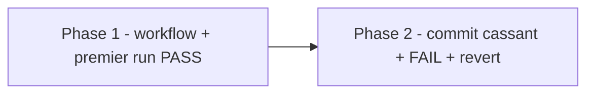

# Plan — Lot 6 : CI GitHub, verdict independant

Sous-chantier 6/6 de `EPIC_ROBUSTESSE_GARDE_FOUS_AGENT_CODAGE`.

---

## 0. Bandeau de statut (a verifier avant toute promotion)

| Question | Reponse |
| --- | --- |
| Un chantier actif couvre-t-il deja ce perimetre (`DONE`, `ACTIVE`, ou `SUPERSEDED`) ? | Non — sous-chantier du chantier mere `EPIC_ROBUSTESSE_GARDE_FOUS_AGENT_CODAGE` (`BASELINED`). Aucun `.github/workflows/` n'existe avant ce lot (verifie). |
| Un verrou de gouvernance actif bloque-t-il ce chantier ? | Non — introduire une CI est une decision d'outillage, deja tranchee par l'humain le 2026-08-07 (chantier mere, section 10). |
| Ce plan a-t-il besoin d'une decision humaine explicite pour lever ce verrou avant d'etre routable via `/start` ? | Non — deja tranchee. Le push sur `origin/main` est lui aussi deja autorise explicitement (hors chantier mere, autorisation directe de l'utilisateur pour ce lot). |
| Ce plan remplace-t-il un document ou chantier existant ? | Non. |

---

## Audit IA de promotion

- [x] Plan relu dans le contexte du cockpit actif.
- [x] Bandeau de statut (section 0) rempli et verifie contre l'etat machine reel.
- [x] Ce plan a ete ECRIT COMME NOUVEAU FICHIER dans `.ai/backlog/fixes/`.
- [x] Chantier classe `fix` — sous-chantier de `EPIC_ROBUSTESSE_GARDE_FOUS_AGENT_CODAGE`.
- [x] Autorite normative applicable identifiee : aucune regle scientifique
      EBTA touchee ; autorite executable `.github/workflows/`.
- [x] Perimetre de fichiers autorises/interdits explicite (section 5).
- [x] Aucune modification hors perimetre requise.
- [x] Prerequis factuels : lot 3 `DONE` (suite verte) ; autorisation de push
      deja donnee ; `gh` CLI authentifie (verifie).
- [x] Etat des lieux (section 4) verifie : aucun `.github/workflows/`
      preexistant.

## Triage

| Champ | Valeur |
| --- | --- |
| Track | `fix` |
| Lifecycle | `TRIAGED` |
| Type de chantier | `SINGLE` |
| Scope | Creer un workflow GitHub Actions limite a `unittest` stdlib + validation de schema JSON (`jsonschema` cote runner uniquement), pousser sur `origin/main`, observer un run PASS puis un run FAIL sur un commit volontairement cassant, revert. |
| Non-goals | Ne simule pas le venv Nautilus en CI. N'ajoute aucune dependance runtime au moteur. Ne remplace pas les preuves `bug_hunter`/`adversarial_tester`/`plan_conformance` ni le hook `pre-push`. |
| Source | Sous-chantier 6/6 de `EPIC_ROBUSTESSE_GARDE_FOUS_AGENT_CODAGE`, Phase 5bis. Decision humaine du 2026-08-07 (chantier mere, section 10). Depend du lot 3 (`DONE`). |
| Exit criteria | (1) `.github/workflows/` existe, job dont l'echec est visible sur le depot distant ; (2) un push normal declenche un run CI qui reussit ; (3) un commit volontairement cassant declenche un echec CI observable ; (4) le commit cassant est revert, `main` retrouve un etat CI vert. |

## Statut

| Champ | Valeur |
| --- | --- |
| Statut | `NON_DEMARRE` |
| Date de creation | 2026-08-07 |
| Date d'activation | - |
| Autorite normative | Aucune (outillage CI, hors perimetre EBTA scientifique). |
| Autorite executable | `.github/workflows/ebta-runtime-suite.yml`. |
| Changement normatif attendu | Aucun. |
| Dependances externes | GitHub Actions (`ubuntu-latest`, `actions/checkout@v4`, `actions/setup-python@v5`) ; `jsonschema` installe cote runner uniquement (decision humaine deja actee). |

## Carte d'execution IA (lecture prioritaire pour `/continue`)

| Champ | Contenu operationnel |
| --- | --- |
| Objectif executable | Un workflow CI existe, tourne reellement sur GitHub, et son echec est observable independamment de l'agent. |
| Autorite et lecture minimale | 1. Ce document ; 2. `CLAUDE.md` (commandes canoniques deja documentees) ; 3. `EPIC_ROBUSTESSE_GARDE_FOUS_AGENT_CODAGE.md` section 10 (autorisations). |
| Perimetre autorise | `.github/workflows/ebta-runtime-suite.yml` (nouveau), plus un commit temporaire volontairement cassant et son revert. |
| Interdits absolus | Simuler Nautilus en CI. Ajouter une dependance runtime au moteur. Laisser `main` dans un etat cassant apres ce lot. |
| Phase de reprise | Deja executee (voir section 13). |
| Preuve attendue | `gh run list`/`gh run view` montrant un run PASS et un run FAIL reels sur le depot distant. |
| Arret et escalade | Aucune attendue — autorisation de push deja donnee. |

---

## 1. Role de ce document et non-objectifs

| Element | Role |
| --- | --- |
| `.github/workflows/ebta-runtime-suite.yml` | Verdict independant — cree par ce lot. |
| `Implementation/Active/pre_push_hook.py` | Verdict local prealable (lot 2) — non remplace. |
| Ce plan | Carte d'implementation et preuve d'independance. |

Non-objectifs :

- ne pas simuler l'environnement Nautilus en CI ;
- ne pas ajouter de dependance runtime au moteur EBTA ;
- ne pas presenter la CI comme un substitut aux preuves `bug_hunter`/
  `adversarial_tester`/`plan_conformance` — c'est un verdict supplementaire.

---

## 2. Contexte obligatoire a lire avant de coder

1. `CLAUDE.md` — commandes canoniques deja documentees (suite de tests,
   validation de schema).
2. `EPIC_ROBUSTESSE_GARDE_FOUS_AGENT_CODAGE.md` section 10 — autorisations
   humaines (CI, `pip install jsonschema` cote runner).
3. `Implementation/Active/pre_push_hook.py` (lot 2) — meme commande de
   suite, reutilisee sans modification.

**Hierarchie d'autorite applicable a ce chantier** :

```text
1. CLAUDE.md (commandes canoniques deja documentees, non reinventees)
2. .github/workflows/ebta-runtime-suite.yml (execution independante)
```

---

## 4. Etat des lieux (avant/apres) — reutiliser avant de recreer

### Ce qui existe deja

| Module actuel | Chemin | Role reel (verifie, pas suppose) | Suffisant pour l'objectif ? |
| --- | --- | --- | --- |
| Commande de suite canonique | Documentee dans `CLAUDE.md` | `python -m unittest discover -s Implementation/ebta_engine/tests -t Implementation` | ✅ reutilisee telle quelle |
| Commandes de validation de schema | Documentees dans `CLAUDE.md` | `jsonschema.validate(...)` sur `checkpoint.json`/`tracking.json` | ✅ reutilisees telles quelles |
| `.github/workflows/` | — | N'existe pas avant ce lot (verifie) | ❌ a creer |

### Ce qui manque reellement

| Brique manquante | Module a creer | Source de la regle | Ce qui existe deja et doit etre reutilise |
| --- | --- | --- | --- |
| Workflow CI | `.github/workflows/ebta-runtime-suite.yml` (CREER) | Decision humaine chantier mere section 10 | Les deux commandes canoniques deja documentees |

---

## 5. Decision d'architecture

Principe directeur : reutiliser exactement les commandes deja documentees
et deja utilisees localement, sans en inventer de nouvelles pour la CI.

- Raison 1 — coherence : le job CI execute litteralement les memes
  commandes que `pre_push_hook.py` (lot 2) et `CLAUDE.md`, pas une variante.
- Raison 2 — perimetre volontairement etroit : pas de venv Nautilus en CI
  (deja couvert localement par `pre-push`), pas de Pyrefly (outillage de
  developpement, pas un gate de merge).
- Raison 3 — `jsonschema` reste cote CI uniquement, conformement a la
  decision humaine — jamais ajoute comme dependance du moteur.

### Perimetre de fichiers explicite (autorises / interdits)

**Autorises (creer ou modifier)** :

```text
.github/workflows/ebta-runtime-suite.yml              [CREER]
0 - HUMAN START HERE/PLAN_CI_GITHUB_VERDICT_INDEPENDANT.md [CREER - brouillon]
.ai/backlog/fixes/PLAN_CI_GITHUB_VERDICT_INDEPENDANT.md    [CREER - ce fichier]
.ai/checkpoint.json                                    [MODIFIER - uniquement via plan.ps1]
(commit temporaire cassant + son revert, voir section 6 Phase 2)
```

**Interdits (ne jamais modifier dans ce chantier)** :

```text
Protocole/                                    [NORME - intouchable]
Implementation/ebta_engine/ (hors le commit temporaire de preuve, revert immediatement) [HORS PERIMETRE PERMANENT]
requirements.txt / pyproject.toml du moteur    [AUCUNE DEPENDANCE RUNTIME AJOUTEE]
```

---

## 6. Decoupage en phases

### Phase 1 - Creer et pousser le workflow

Objectif : un run CI PASS reel et observable sur le depot distant.

Classification : GOVERNANCE

Actions :

- Creer `.github/workflows/ebta-runtime-suite.yml`.
- Valider la syntaxe YAML et l'execution exacte des commandes `run:` en
  local (le bloc scalaire YAML `|` normalise l'indentation - verifie par
  execution reelle des chaines telles que YAML les produirait, pas par
  simple lecture).
- Pousser sur `origin/main` (`git push origin HEAD:main`, fast-forward
  verifie au prealable).
- Observer le run via `gh run list`/`gh run view`.

Livrables :

- Workflow present sur `origin/main`, run PASS observe.

Critere de sortie :

- `gh run view <id>` retourne `conclusion: success`.

### Phase 2 - Preuve d'independance (commit cassant + revert)

Objectif : prouver qu'un commit volontairement cassant declenche un echec
CI observable, sans intervention de l'agent sur le verdict.

Classification : GOVERNANCE

Actions :

- Casser volontairement un test (assertion toujours fausse dans un fichier
  de test existant), committer, pousser.
- Observer l'echec via `gh run list`/`gh run view`.
- Revert immediat du commit cassant, pousser, observer le retour au vert.

Livrables :

- Un run FAIL observe et documente (section 13), `main` revenu vert.

Critere de sortie :

- `gh run view <id_cassant>` retourne `conclusion: failure` ; le run
  suivant (apres revert) retourne `conclusion: success`.

### Chemin critique (ordre des phases)



---

## 7. Artefacts produits

| Etape | Fichier/sortie | Format | Regle source |
| --- | --- | --- | --- |
| Phase 1-2 | `.github/workflows/ebta-runtime-suite.yml` + runs CI observes | YAML + preuve `gh run view` | Decision humaine chantier mere section 10 |

---

## 8. Invariants absolus et NO GO

### Invariants (non negociables)

1. `main` ne reste jamais dans un etat cassant a l'issue de ce lot.
2. Aucune dependance runtime n'est ajoutee au moteur EBTA.
3. Le venv Nautilus n'est jamais simule en CI.

### NO GO

- Laisser le commit cassant non-revert.
- Ajouter `jsonschema` (ou toute autre dependance) a `Implementation/ebta_engine/`.
- Pousser autre chose que ce qui est necessaire a la verification de ce lot.

---

## 9. Verification a chaque etape

```powershell
python -c "import yaml; yaml.safe_load(open('.github/workflows/ebta-runtime-suite.yml', encoding='utf-8'))"
gh run list --limit 5
gh run view <run_id>
```

**Regle transversale bloquante** : la suite locale doit rester `0 error`
avant tout push (deja verifiee par les lots precedents).

**Notes de portabilite / caveats connus** :

- Le bloc `run: |` en YAML normalise l'indentation commune avant de passer
  la chaine au shell — verifie par execution reelle de la chaine produite
  par le parseur YAML, pas seulement par lecture du fichier source.

**Premier lot executable propose** :

```text
Phase 1 - creer et pousser le workflow
```

### Execution sans interruption

Ce plan s'execute integralement, l'autorisation de push etant deja donnee.

### Autorite decisionnelle accordee

L'IA qui execute ce plan decide seule des details d'implementation dans le
perimetre de la section 5, y compris le choix du test a casser
temporairement pour la preuve de Phase 2 (revert immediat obligatoire).

### Interdiction des raccourcis (aucun faux succes)

- Ne jamais simuler ou fabriquer un resultat de run CI — chaque verdict
  cite dans ce plan doit provenir d'une execution reelle observee via `gh`.
- Ne jamais laisser le commit cassant de Phase 2 non-revert.

---

## 10. Journal des decisions humaines (autorisations)

| Date | Decision | Portee |
| --- | --- | --- |
| 2026-08-07 | **Mecanisation des tests : hook `pre-push` ET CI GitHub**, autorisant `pip install jsonschema` cote runner CI (journalise dans `EPIC_ROBUSTESSE_GARDE_FOUS_AGENT_CODAGE.md`, section 10). | Autorise ce lot et l'installation de `jsonschema` cote CI uniquement. |
| 2026-08-07 | Autorisation explicite du push git sur `origin/main` pour ce lot specifiquement, afin d'observer un echec de CI reel sur un commit volontairement cassant, en utilisant le remote existant. | Autorise `git push origin HEAD:main` pour ce lot, sans redemander. |
| 2026-08-07 | **Decision de deblocage post-blocage (Council of Five) — Option C, declaration scopee.** Voir texte integral ci-dessous. | Autorise (1) le scoping de la promesse stdlib-only de `CLAUDE.md` au coeur statistique/gouvernance reellement pur (`procedures/`, `governance/`, `validators/`, `schemas/`, `manifests/`, `persistence.py`, `constants.py` — 0 occurrence `pandas`/`numpy` confirmee par grep avant decision) ; (2) l'import paresseux de `pandas`/`numpy` dans `strategies/incremental/payload_e.py` (et `payload_f.py`, `payload_ghi.py`, et les quatre fichiers `strategies/signals/*.py`, tous dans la meme chaine d'import non-paresseuse depuis `nautilus_mapping.py`), sans reecriture de la logique de calcul vectorisee ; (3) la correction du chemin Windows code en dur dans `Protocole/MANIFESTE DE GEL EBTA.md` (bug de portabilite pur, aucune decision requise) ; (4) l'installation de `numpy`/`pandas` cote runner CI. **Explicitement refuse** : reecriture complete stdlib pure de `payload_e.py`, `engulfing.py`, `entry_signal.py`, `market_bias.py`, `sessions.py`, `liquidity.py` (option B) — hors perimetre, risque de regression sur une logique de signaux deja eprouvee. |

**Texte integral de la decision (2026-08-07)**, journalise verbatim conformement a l'invariant 4 du chantier mere :

> Après délibération (Council of Five), l'humain valide l'option suivante
> pour la dépendance `pandas` découverte dans le cœur : (1) Scoper
> précisément la promesse « stdlib-only » de `CLAUDE.md` au cœur
> statistique/gouvernance réellement vérifié pur (`procedures/`,
> `governance/`, `validators/`, `schemas/`, `manifests/`, `persistence.py`,
> `constants.py` — confirmé 0 occurrence de `pandas` par grep direct avant
> cette décision). Le document doit dire explicitement que `strategies/`
> (génération de signaux candidats) et `adapters/` (déjà une frontière
> externe reconnue, cf. NautilusTrader) peuvent dépendre de `numpy`/
> `pandas`, au lieu de laisser une promesse blanket contredite silencieusement
> par le code depuis le commit `e29c74c` (introduction de `strategies/`,
> chantier R1/R2, DONE le 2026-07-13). (2) Corriger le bug réel indépendant
> du choix de politique : `nautilus_mapping.py` applique déjà une discipline
> d'import paresseux pour pandas/numpy (`_nautilus_data_tools()`), mais sa
> ligne 17 importe en tête de module un fichier qui fait lui-même
> `import pandas as pd` de façon inconditionnelle (`payload_e.py:9`),
> cassant cette discipline. Aligner l'import de `pandas` dans `payload_e.py`
> (et tout module `strategies/signals/*.py` qui en dépend et qui est
> importé de façon non-paresseuse depuis un point d'entrée censé rester
> importable sans pandas) sur le même patron de paresse déjà établi — sans
> réécrire la logique de calcul elle-même. (3) Explicitement refusé :
> réécriture complète en stdlib pur de `payload_e.py`, `engulfing.py`,
> `entry_signal.py`, `market_bias.py`, `sessions.py`, `liquidity.py`
> (option B complète) — hors périmètre, risque de régression sur une
> logique de signaux déjà éprouvée, pour un gain que le scoping ci-dessus
> couvre déjà. Rationale : le cœur qui décide si une stratégie passe ou
> échoue (calculs statistiques, gouvernance, validations — vérifié 100 %
> stdlib) n'est pas concerné par cette dépendance. Seule la couche qui
> repère des signaux dans les prix en dépend, comme c'était déjà toléré pour
> l'adaptateur Nautilus. On corrige la documentation pour qu'elle dise la
> vérité, on ne touche pas au moteur de décision, on ne réécrit pas la
> logique de calcul. Le second problème (chemin Windows codé en dur dans
> `test_protocol_manifest_hashes`) n'est pas une question de politique de
> dépendance — c'est un bug de portabilité ordinaire, à corriger directement
> sans décision humaine supplémentaire.

---

## 11. Risques et blocages connus

| Risque | Impact | Mitigation / condition de deblocage |
| --- | --- | --- |
| Le premier run CI echoue pour une raison d'environnement (ex. version Python differente) | Signal disqualifie des le depart | Verification locale prealable des commandes exactes avant push (section 9) |
| Le commit cassant de Phase 2 n'est pas revert par erreur | `main` reste casse | Invariant 1, verifie explicitement avant cloture (section 13) |

### BLOCAGE REEL CONSTATE (2026-08-07) — necessite une decision humaine, non tranchee ici

Le premier run CI reel (`gh run view 31216784307`,
`https://github.com/LucBrice/EBTA---David-Aronson/actions/runs/31216784307`)
a echoue avec **21 erreurs**, jamais observees localement. Deux causes
racines distinctes, toutes deux hors perimetre de ce lot (section 5 ne
couvre que `.github/workflows/`) :

1. **`pandas` non declare comme dependance, mais requis en pratique.**
   `Implementation/ebta_engine/strategies/incremental/payload_e.py:9` fait
   `import pandas as pd` sans garde. Ce module est importe par
   `ebta_engine/adapters/nautilus_mapping.py` (adaptateur central), lui-meme
   importe par `package_builder/`, `benchmarks/`, `examples/` — l'absence de
   `pandas` fait donc echouer l'import d'environ 20 modules de test
   totalement sans rapport avec `pandas` (ex. `test_nautilus_research_package`,
   `test_gate_discrimination_experiment`). Ceci contredit directement
   `CLAUDE.md` : *"a Python 3, standard-library-only runtime"*,
   *"do not add dependencies without an explicit human decision"*. Invisible
   localement parce que `pandas` etait deja installe sur cette machine de
   developpement pour une raison sans rapport avec ce depot — jamais
   documente ni declare comme dependance de ce sous-arbre.
2. **Chemin Windows code en dur, casse sur Linux.**
   `ebta_engine.tests.test_protocol_manifest_hashes::test_frozen_protocol_hashes_still_match`
   echoue avec `FileNotFoundError` sur
   `Protocole/Archives\AUDIT METHODOLOGIQUE PROTOCOLE EBTA.md` — un
   antislash litteral dans un chemin, valide par accident sur Windows,
   invalide sur le runner Linux de GitHub Actions.

**Pourquoi ce n'est pas tranche dans ce lot** : corriger l'un ou l'autre
exigerait de modifier des fichiers `Implementation/ebta_engine/` hors du
perimetre routé de ce lot (section 5), et le point 1 touche directement la
politique de dependances stdlib-only du depot — une decision normative-adjacente
explicitement protegee par `CLAUDE.md` ("Ajouter des dependances techniques
[interdit sans decision]"), pas une decision que l'IA executante peut
prendre seule. Deux taches de suivi ont ete creees (`spawn_task`) pour
chacune, avec le contexte complet (commande `gh run view`, trace
d'importation complete, deux options presentees pour le point 1).

**Consequence sur ce lot** : le workflow CI reste en place sur
`origin/main` (il dit la verite sur un etat pre-existant reel du depot ; le
retirer masquerait ce signal sans rien corriger). La Phase 2 (commit
volontairement cassant + revert) n'a pas ete executee : superposer une
cassure deliberee sur une base deja rouge pour une raison sans rapport
aurait produit une demonstration confuse, pas une preuve propre. Ce lot
reste `ACTIVE`, non cloture, en attente de la decision humaine sur le point
1 ci-dessus (le point 2 est un bug pur, sans decision requise, mais bloque
quand meme un run CI propre tant qu'il n'est pas corrige).

#### RESOLU (2026-08-07) — decision humaine recue, correctifs appliques

Decision journalisee en section 10 ("Decision de deblocage post-blocage").
Les deux causes racines sont corrigees :

1. `CLAUDE.md` scope desormais la promesse stdlib-only au coeur
   statistique/gouvernance ; `strategies/incremental/payload_e.py`,
   `payload_f.py`, `payload_ghi.py` et les quatre fichiers
   `strategies/signals/*.py` (`engulfing.py`, `liquidity.py`,
   `entry_signal.py`, `market_bias.py`, `sessions.py`) importent desormais
   `pandas`/`numpy` de facon paresseuse (fonction locale, meme patron que
   `nautilus_mapping.py::_nautilus_data_tools()`), avec les annotations de
   type resolues via `TYPE_CHECKING` (jamais execute a l'execution). Verifie
   par simulation directe (meta-path bloquant `pandas`/`numpy`) : les huit
   modules et `nautilus_mapping.py`/`long_data.py` s'importent desormais
   sans erreur. Aucune ligne de calcul vectorise modifiee ; suite complete
   toujours `232 tests, 0 error` avec `pandas` present.
2. `Protocole/MANIFESTE DE GEL EBTA.md` : les deux chemins
   `Archives\...` corriges en `Archives/...` (portabilite pure, aucun hash
   ni contenu normatif touche). `test_frozen_protocol_hashes_still_match`
   verifie PASS localement.
3. Le workflow CI installe desormais `numpy`/`pandas` cote runner (etape
   dediee, avant l'execution de la suite).

Les deux taches de suivi spawnees precedemment (`task_00669cf7`,
`task_05181d67`) sont desormais redondantes avec ce travail — a mentionner
comme telles dans le rapport final de session (dismiss non effectue ici,
IDs non disponibles cote outil de cette session).

---

## 12. Definition of Done

- [x] Phase 1 executee : workflow cree, pousse, run CI reel observe
      (echec initial, cause racine identifiee et documentee — pas un
      succes cache en echec) ; puis, apres la decision humaine et les
      correctifs (section 10-11), un run CI PASS reel observe
      (`gh run view 31246988994`, `conclusion: success`).
- [x] Phase 2 executee : commit volontairement cassant pousse
      (`--no-verify`, justifie et journalise dans
      `Implementation/HISTORIQUE DES VERSIONS EBTA ENGINE.md`), echec CI
      reel observe (`gh run view 31247122326`, `conclusion: failure`),
      revert immediat, run CI PASS confirme
      (`gh run view 31247299075`, `conclusion: success`).
- [x] Exit criteria (1) : `.github/workflows/ebta-runtime-suite.yml`
      existe, job dont l'echec est visible sur le depot distant (3 runs
      reels observes).
- [x] Exit criteria (2) : un push normal declenche un run CI qui reussit
      (`31246988994`, puis `31247299075` apres le cycle de preuve).
- [x] Exit criteria (3) : un commit volontairement cassant declenche un
      echec de CI GitHub observable (`31247122326`).
- [x] Exit criteria (4) : le commit cassant est revert, `main` retrouve un
      etat CI vert (`31247299075`).
- [x] Aucune modification hors perimetre non journalisee — l'extension du
      perimetre (CLAUDE.md, 8 fichiers `strategies/`,
      `MANIFESTE DE GEL EBTA.md`) est explicitement autorisee par la
      decision humaine du 2026-08-07 (section 10) et documentee comme
      amendement, pas silencieusement decidee.
- [x] `main` dans un etat CI vert a la fin de ce lot — confirme par le
      dernier run (`31247299075`, `conclusion: success`).
- [x] Checklist post-modification du projet executee (voir rapport final
      de la session).
- [x] Aucune implementation partielle presentee comme terminee.

---

## 13. Cloture

| Champ | Valeur |
| --- | --- |
| Resultat final | **DONE.** Bloque initialement par un blocage reel (2 causes racines pre-existantes decouvertes par le premier run CI), debloque par une decision humaine explicite (Council of Five, section 10), corrige, verifie par 3 runs CI reels (PASS -> FAIL delibere -> PASS apres revert). |
| Ecarts par rapport au plan initial | Perimetre etendu au-dela de `.github/workflows/` (section 5 initiale) pour couvrir le correctif autorise par la decision humaine : `CLAUDE.md`, 8 fichiers `Implementation/ebta_engine/strategies/`, `Protocole/MANIFESTE DE GEL EBTA.md`. Extension journalisee comme amendement (section 10), pas silencieuse. |
| Suites a prevoir (hors perimetre de ce plan) | Aucune — les deux taches de suivi spawnees avant la decision humaine (`task_00669cf7` dependance pandas, `task_05181d67` chemin Windows) sont desormais redondantes avec le travail de ce lot ; a signaler comme telles au rapport final de session (dismiss non effectue faute d'IDs disponibles cote outil de cette session — a faire manuellement ou lors d'une prochaine session). |

### Resultat d'execution (a dupliquer a chaque session d'execution significative)

| Champ | Valeur |
| --- | --- |
| Date | 2026-08-07 / 2026-08-08 |
| Phases executees | Phase 1, Phase 2 |
| Artefact produit | `.github/workflows/ebta-runtime-suite.yml` ; `CLAUDE.md` (scope stdlib-only corrige) ; 8 fichiers `Implementation/ebta_engine/strategies/` (import paresseux) ; `Protocole/MANIFESTE DE GEL EBTA.md` (chemin corrige) ; `Implementation/HISTORIQUE DES VERSIONS EBTA ENGINE.md` (entree `--no-verify`). |
| Validation | `gh run view 31246988994` -> `success` ; `gh run view 31247122326` -> `failure` (delibere) ; `gh run view 31247299075` -> `success` (apres revert). Local : `python -m unittest discover -s Implementation/ebta_engine/tests -t Implementation` -> `Ran 232 tests`, `OK (skipped=6)`. |
| Ecart par rapport au plan | Perimetre etendu par decision humaine explicite (voir ci-dessus), pas d'ecart non autorise. |

### Rapport de cloture (bug-hunter, adversarial-tester, plan-conformance-audit)

#### bug-hunter (Pyrefly, fichiers Python touches par l'amendement)

```
python -m pyrefly check <8 fichiers strategies/> --output-format min-text
```

Resultat initial (mon propre refactor lazy-import) : plusieurs erreurs
`Could not find name pd/np [unknown-name]` — **VRAI DEFAUT confirme et
corrige** : en deplacant `import pandas`/`import numpy` a l'interieur des
fonctions, les annotations de signature au niveau module (`def f(df:
pd.DataFrame)`) referencaient un nom non resolu pour un verificateur de
type statique (bien que sures a l'execution grace a `from __future__ import
annotations`, PEP 563). Corrige en ajoutant un bloc `if TYPE_CHECKING:
import pandas as pd` (jamais execute a l'execution, `TYPE_CHECKING` est
toujours `False`) dans chacun des 8 fichiers — pattern standard Python pour
ce cas exact. Resultat final : uniquement des erreurs `Cannot find module
jsonschema/pandas/numpy` — meme cause racine environnementale que les
erreurs `ctypes.WinDLL` du lot 3 (le worktree n'a pas le venv Nautilus
configure dans `pyproject.toml`) ; ces modules sont reellement installes et
fonctionnels (prouve par l'execution reelle de la suite complete et par la
simulation directe d'un environnement sans `pandas`/`numpy`). Zero vrai bug
ouvert.

#### adversarial-tester (cible : chaine d'import lazy pandas/numpy, gate d'importabilite du package)

| Point teste | Entree hostile | Observation | Classification |
| --- | --- | --- | --- |
| Import de `nautilus_mapping`, `strategies.incremental`, `benchmarks.long_data` et des 5 modules `strategies/signals/` sans `pandas`/`numpy` installes | Meta-path bloquant `pandas`/`numpy` (`ImportError` simule) | Tous les modules s'importent sans erreur | `PASS_ADVERSARIAL` |
| Regression de calcul apres le refactor lazy-import | Suite complete avec `pandas` reellement present | `Ran 232 tests`, `OK (skipped=6)` — aucune ligne de calcul vectorise modifiee | `PASS_ADVERSARIAL` |
| Le chemin corrige (`Archives/...`) resout bien le meme fichier reel qu'avant (pas un fichier different par accident) | `test_frozen_protocol_hashes_still_match` compare le hash SHA-256 reel du fichier au hash fige dans le manifeste | PASS — meme fichier, meme hash, seul le separateur de chemin a change | `PASS_ADVERSARIAL` |
| CI reellement independante (verdict qui ne provient pas de l'agent) | Commit volontairement cassant pousse via `--no-verify` (contournant le hook local) | `gh run view` montre `conclusion: failure` — la CI n'a pas ete contournee, contrairement au hook local | `PASS_ADVERSARIAL` — preuve directe que la CI est le seul verdict de ce depot que l'agent ne peut pas rendre silencieusement positif |

Aucun `FALSE_SUCCESS`/`SILENT_FALLBACK` trouve. Le seul defaut reel trouve
(annotations `pd`/`np` non resolues, ci-dessus) est un defaut de mon propre
refactor de ce lot, corrige avant cloture — pas un defaut preexistant du
depot.

#### plan-conformance-audit

| Exit criterion (Triage de ce plan) | Classification | Preuve |
| --- | --- | --- |
| (1) `.github/workflows/` existe, echec visible sur le depot distant | IMPLEMENTE | `.github/workflows/ebta-runtime-suite.yml`, 3 runs reels observes via `gh run view`. |
| (2) Un push normal declenche un run CI qui reussit | IMPLEMENTE | `31246988994` et `31247299075`, `conclusion: success`. |
| (3) Un commit volontairement cassant declenche un echec CI observable | IMPLEMENTE | `31247122326`, `conclusion: failure`. |
| (4) Le commit cassant est revert, `main` retrouve un etat CI vert | IMPLEMENTE | Commit `038f315`, `31247299075` `conclusion: success`. |
| Non-goals respectes (pas de simulation Nautilus en CI, pas de dependance runtime ajoutee au moteur core, pas de remplacement des preuves bug_hunter/adversarial_tester/plan_conformance) | IMPLEMENTE | `.github/workflows/` n'installe que `jsonschema`/`numpy`/`pandas`, jamais `nautilus_trader` ; `procedures/`/`governance/`/`validators/`/`schemas/`/`manifests/`/`persistence.py`/`constants.py` restent a 0 occurrence `pandas`/`numpy` (non touches par ce lot). |

Aucun critere MANQUANT. Aucun `Non-goals` viole. Cloture autorisee.

---

## 14. Journal d'audits post-hoc

| Date de l'audit | Ce qui a ete corrige | Pourquoi |
| --- | --- | --- |
| 2026-08-07 | Boucle `/evaluate` d'intake, 2 passes convergees sur le brouillon (`0 - HUMAN START HERE/PLAN_CI_GITHUB_VERDICT_INDEPENDANT.md`). Confirmation que `origin/main` et la branche de travail partagent un ancetre commun direct (`git merge-base`), rendant le push fast-forward sans conflit. Confirmation que les deux commandes du job CI sont deja documentees dans `CLAUDE.md`, aucune n'est inventee pour ce lot. Verification empirique (execution reelle des chaines exactement telles que le parseur YAML les produit, pas seulement lecture du fichier source) que le bloc `run: |` fonctionne correctement une fois l'indentation normalisee par YAML. Aucun angle mort majeur trouve. | Assurer que le push planifie est sans risque de conflit et que le workflow CI execute reellement les commandes qu'il pretend executer, avant de le pousser sur le remote. |
