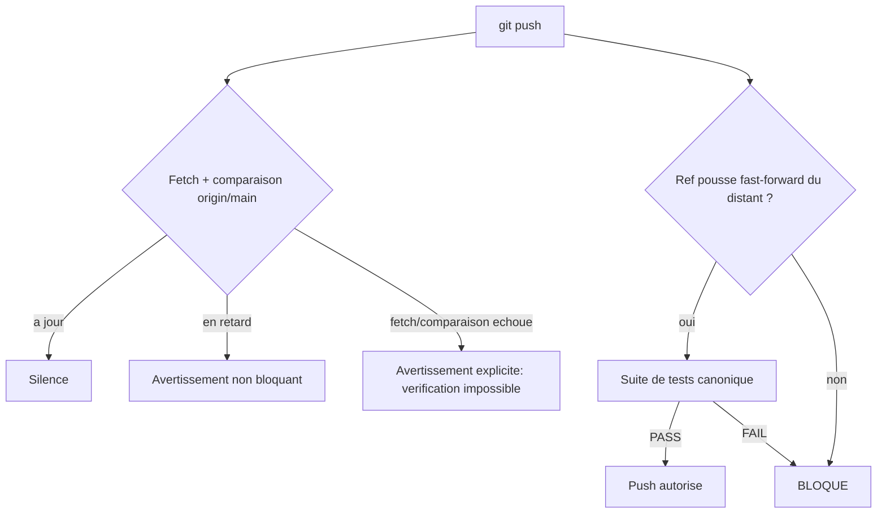

# Plan — Extension du hook pre-push a la synchronisation git, pour toute IA du depot

> **Nature retroactive de ce document.** Le code decrit ici a deja ete
> ecrit, teste et pousse sur `origin/main` (commits `4229d43`, `150a673`)
> avant la redaction de ce plan, en conversation directe avec l'utilisateur
> qui a valide chaque etape (choix de severite par Conseil des 5, commit,
> push). Ce plan regularise retroactivement ce travail selon le protocole
> complet, sur le meme modele que les precedents deja enregistres a
> posteriori dans ce depot (`PLAN_CORRECTION_NAUTILUS_MULTIFOLD_ROBUSTESSE`,
> `PLAN_EXPERIENCE_CONTROLEE_DISCRIMINATION_GATES` — voir
> `.ai/checkpoint.json`). Ce n'est pas un raccourci : le bug-hunter et
> l'adversarial-tester ci-dessous ont ete executes reellement pendant la
> redaction de ce document, et ont trouve puis corrige un vrai defaut
> (section "Preuve adversarial-tester").

---

## 0. Bandeau de statut

| Question | Reponse |
| --- | --- |
| Un chantier actif couvre-t-il deja ce perimetre (`DONE`, `ACTIVE`, ou `SUPERSEDED`) ? | **Non.** `active_workstream_id` vaut `null`. `EPIC_ROBUSTESSE_GARDE_FOUS_AGENT_CODAGE` est `DONE` et ne couvrait pas ce perimetre (il s'est cloture avant cette demande). |
| Un verrou de gouvernance actif bloque-t-il ce chantier ? | **Non.** Aucune des categories de `.ai/governance/AI_MODIFICATION_CHECKLIST.md` necessitant une decision humaine prealable specifique n'est engagee au-dela de ce qui a deja ete tranche en conversation (choix de severite du hook). |
| Ce plan a-t-il besoin d'une decision humaine explicite pour lever un verrou avant `/start` ? | **Non.** |
| Ce plan remplace-t-il un document ou chantier existant ? | **Non.** Il etend un artefact produit par le lot 2 de l'EPIC (`PLAN_EXTENSION_HOOKS_GIT_VALIDATION_ET_TESTS`, deja `DONE`), sans le remplacer. |

---

## Audit IA de promotion

- [x] Plan relu dans le contexte du cockpit actif (`AGENTS.md`,
      `.ai/checkpoint.json`, `Implementation/Active/HOOK.md`,
      `Implementation/Active/INSTALL_GIT_HOOK.md`).
- [x] Bandeau de statut (section 0) rempli et verifie contre l'etat machine
      reel.
- [x] Plan ecrit comme nouveau fichier dans `.ai/backlog/fixes/` ; le
      brouillon original reste intact dans `0 - HUMAN START HERE/` jusqu'a
      son archivage mecanique par `plan.ps1 start`.
- [x] Chantier classe `fix` — regularisation retroactive d'une extension de
      garde-fou, pas une correction d'un defaut de la campagne de recherche
      EBTA.
- [x] Autorite normative applicable identifiee : aucune regle scientifique
      EBTA n'est touchee. `Protocole/` hors perimetre total. Autorites
      procedurales : `AGENTS.md`, `.ai/governance/AI_MODIFICATION_CHECKLIST.md`,
      `Implementation/Active/INSTALL_GIT_HOOK.md`.
- [x] Perimetre de fichiers explicite en liste fermee (section 5).
- [x] Aucune modification hors perimetre requise.
- [x] Etat des lieux (section 4) verifie par lecture directe du code.

## Triage

| Champ | Valeur |
| --- | --- |
| Track | `fix` |
| Lifecycle | `INTAKE` |
| Type de chantier | `SINGLE` |
| Scope | Etendre `Implementation/Active/pre_push_hook.py` pour bloquer un push non fast-forward et avertir (sans bloquer) sur un retard vs `origin/main` ; ajouter la regle correspondante dans `AGENTS.md` pour que toute IA (pas seulement Claude Code) en soit informee ; tenir `INSTALL_GIT_HOOK.md` a jour. |
| Non-goals | Ne modifie pas `Protocole/`. N'ajoute aucune dependance technique. Ne bloque pas un push ordinaire simplement en retard (decision explicite du Conseil des 5, voir section 5). Ne cree pas de mecanisme equivalent pour `pre-commit`. |
| Source | Demande explicite de l'utilisateur en conversation le 2026-08-08, suite a l'extension du hook `.claude/settings.local.json` (specifique a Claude Code, jugee insuffisante par l'utilisateur car non applicable aux autres IA). Severite du blocage tranchee par Conseil des 5, mode `decision`, le meme jour. |
| Exit criteria | (1) `Implementation/Active/pre_push_hook.py` expose `check_non_fastforward` (bloque un push non fast-forward, laisse passer une nouvelle branche/suppression/fast-forward normal) et `warn_if_behind_origin_main` (avertit sans bloquer sur un retard, ne masque jamais un echec de verification comme "a jour") ; (2) la copie installee `.git/hooks/pre-push` est byte-identique a la source (`git diff --no-index` vide) ; (3) `AGENTS.md`, section Operating Rules, porte une regle de verification de synchronisation git applicable a toute IA ; (4) `Implementation/Active/INSTALL_GIT_HOOK.md` decrit exactement le comportement reel du hook ; (5) `python -m unittest discover -s Implementation/ebta_engine/tests -t Implementation` retourne 0 erreur ; (6) `Implementation/ebta_engine/tests/test_git_hooks.py` couvre chaque branche des deux nouvelles fonctions (fast-forward, nouvelle branche, suppression de branche, non-fast-forward reel, a jour, en retard, echec de fetch, echec de rev-list). |

## Statut

| Champ | Valeur |
| --- | --- |
| Statut | `DONE` (code deja livre ; ce document regularise l'enregistrement) |
| Date de creation | 2026-08-08 |
| Date d'activation | 2026-08-08 |
| Autorite normative | `Protocole/` (hors perimetre total, aucune regle scientifique touchee). Autorites procedurales : `AGENTS.md`, `Implementation/Active/INSTALL_GIT_HOOK.md`. |
| Autorite executable | `Implementation/Active/pre_push_hook.py` (source), `.git/hooks/pre-push` (copie installee, jamais editee directement). |
| Changement normatif attendu | Aucun. |
| Dependances externes | Aucune. |

## Carte d'execution IA (lecture prioritaire pour `/continue`)

| Champ | Contenu operationnel |
| --- | --- |
| Objectif executable | Regularisation retroactive : le code est deja livre (commits `4229d43`, `150a673`, `7f0afd6`) ; ce chantier ne produit plus de code de fonctionnalite, seulement l'enregistrement `/start -> baseline -> continue -> ready -> close` et les preuves bug-hunter/adversarial-tester/plan-conformance reelles deja consignees en section 9. |
| Autorite et lecture minimale | 1. `AGENTS.md` ; 2. `.ai/checkpoint.json` ; 3. `Implementation/Active/INSTALL_GIT_HOOK.md`. |
| Perimetre autorise | Ce fichier uniquement, plus `.ai/checkpoint.json` via `plan.ps1`. Aucune modification de code supplementaire prevue — le code cible (section 5) est deja livre et verifie. |
| Interdits absolus | Rouvrir le debat de severite (section 5) sans nouvelle decision humaine. Modifier `Implementation/Active/pre_commit_hook.py` (hors perimetre). |
| Phase de reprise | Aucune — les deux phases (section 6) sont deja executees et verifiees. Reste uniquement l'enchainement mecanique `baseline -> continue -> ready -> close`. |
| Preuve attendue | Les commandes de la section 9, deja executees avec succes (242 tests, `diff --no-index` vide, bug-hunter et adversarial-tester reels documentes). |
| Arret et escalade | Si `plan.ps1 ready` refuse une reference d'evidence (bug_hunter/adversarial_tester/plan_conformance) comme ne pointant pas vers un artefact reel, corriger la reference vers l'ancre exacte de ce document plutot que d'inventer un contenu. |

---

## 1. Role de ce document et non-objectifs

| Element | Role |
| --- | --- |
| `Protocole/` | Hors perimetre total. |
| `Implementation/Active/` | Outillage de gouvernance IA (hooks git) — cible de ce chantier. |
| `AGENTS.md` | Bootstrap officiel de toute IA travaillant sur ce depot — cible de ce chantier. |
| `.ai/checkpoint.json` | Etat machine — jamais edite a la main, uniquement via `plan.ps1`. |
| Ce plan | Regularisation retroactive et carte de reference pour ce garde-fou. |

Non-objectifs :

- ne pas reecrire l'autorite normative du projet ;
- ne pas etendre ce mecanisme a `pre-commit` (hors perimetre, non demande) ;
- ne pas rendre `warn_if_behind_origin_main` bloquant (tranche explicitement
  par le Conseil des 5, voir section 5) ;
- ne pas presenter ce garde-fou comme rendant un push dangereux impossible :
  `--no-verify` reste un contournement local sans trace, documente comme tel
  dans `INSTALL_GIT_HOOK.md` depuis le lot 2.

---

## 2. Contexte obligatoire a lire avant de coder

1. `AGENTS.md` — bootstrap et Operating Rules, cible de ce chantier.
2. `.ai/checkpoint.json` — etat machine courant.
3. `Implementation/Active/INSTALL_GIT_HOOK.md` — comportement documente des
   deux hooks versionnes.
4. `.ai/archive/` (chantier `EPIC_ROBUSTESSE_GARDE_FOUS_AGENT_CODAGE`,
   lot 2 `PLAN_EXTENSION_HOOKS_GIT_VALIDATION_ET_TESTS`) — le hook `pre-push`
   que ce chantier etend, pas remplace.

**Hierarchie d'autorite applicable** :

```text
1. Protocole/ (non touche, mais prime en cas de conflit)
2. Implementation/ (code executable derive)
3. AGENTS.md et .ai/ (bootstrap et cockpit IA)
4. .agents/ (skills, outillage non normatif)
```

---

## 3. Table des gates traverses

Ce chantier ne traverse pas le pipeline scientifique EBTA. Il modifie un
gate procedural existant :

| Ordre | Gate | Question posee au systeme | Sortie si echec |
| --- | --- | --- | --- |
| H1 | `pre-push` — non-fast-forward | Le ref pousse est-il une mise a jour fast-forward de l'etat distant ? | Push bloque |
| H2 | `pre-push` — fraicheur | `HEAD` est-il en retard sur `origin/main` ? | Avertissement non bloquant |
| H3 | `pre-push` — suite de tests | La suite canonique passe-t-elle ? | Push bloque (comportement inchange, lot 2) |

---

## 4. Etat des lieux (avant/apres)

### Ce qui existait deja

| Module | Chemin | Role reel | Suffisant ? |
| --- | --- | --- | --- |
| Hook `pre-push` | `Implementation/Active/pre_push_hook.py` | Executait la suite de tests canonique avant tout push (lot 2). | ⚠️ a etendre — ne couvrait ni la reecriture d'historique ni le retard vs `origin/main`. |
| Hook `.claude/settings.local.json` (`TaskCompleted`) | Config Claude Code locale, non versionnee | Verifie la synchronisation apres une tache en arriere-plan **Claude Code uniquement**. | ❌ insuffisant pour l'objectif "toute IA" — mecanisme propre a un seul outil. |

### Ce qui manquait reellement

| Brique manquante | Module modifie | Source de la regle |
| --- | --- | --- |
| Blocage d'un push non fast-forward | `pre_push_hook.py::check_non_fastforward` (nouveau) | Decision Conseil des 5, 2026-08-08 |
| Avertissement non bloquant de retard | `pre_push_hook.py::warn_if_behind_origin_main` (nouveau) | Decision Conseil des 5, 2026-08-08 |
| Regle bootstrap cross-IA | `AGENTS.md`, Operating Rules (nouvelle ligne) | Demande explicite utilisateur, 2026-08-08 |

---

## 5. Decision d'architecture

Principe directeur : le seul mecanisme qui vaut pour **toute** IA (pas
seulement Claude Code) est git lui-meme — un hook `pre-push` se declenche
pour n'importe quel outil qui lance `git push`, contrairement a un hook
propre a un outil.

Decision de severite (Conseil des 5, mode `decision`, 2026-08-08) :
modele a deux vitesses plutot qu'un blocage uniforme ou un simple
avertissement.

- **Raison 1** — git refuse deja nativement un push non-force qui ne serait
  pas un fast-forward du ref distant : un hook qui bloquerait systematiquement
  sur un simple retard dupliquerait une protection qui existe deja pour le
  cas courant, sans ajouter de securite reelle.
- **Raison 2** — le seul cas ou aucune protection native n'existe est un
  push qui reecrit l'historique (force ou divergence non fetchee) : c'est le
  seul cas ou ce chantier bloque reellement.
- **Raison 3** — un blocage systematique sur un simple retard risquerait de
  stopper net un agent cloud autonome en tache longue (le scenario vecu dans
  cette meme session), sans humain present pour lever le blocage, le
  poussant a utiliser `--no-verify` en routine — neutralisant silencieusement
  le garde-fou, exactement le pattern que `EPIC_ROBUSTESSE_GARDE_FOUS_AGENT_CODAGE`
  a ete concu pour empecher.

Dissidence journalisee (non retenue mais consignee) : un membre du conseil
(Contrarian) a defendu un blocage systematique meme sur un push ordinaire
deja protege par git, au nom de la defense en profondeur. Condition qui
renverserait cette decision : observer un jour un agent pousser sur `main`
depuis un etat perime sans que le rejet natif de git ne se declenche.



### Perimetre de fichiers explicite

**Autorises (modifier)** :

```text
Implementation/Active/pre_push_hook.py                    [MODIFIER]
Implementation/Active/INSTALL_GIT_HOOK.md                  [MODIFIER]
AGENTS.md                                                   [MODIFIER]
Implementation/ebta_engine/tests/test_git_hooks.py          [MODIFIER]
.git/hooks/pre-push                                          [REINSTALLER depuis la source, jamais edite directement]
```

**Interdits** :

```text
Protocole/                                   [NORME - intouchable]
Implementation/Active/pre_commit_hook.py     [HORS PERIMETRE - non demande]
.ai/checkpoint.json                          [METTRE A JOUR UNIQUEMENT via plan.ps1]
```

---

## 6. Decoupage en phases (retroactif — deja execute)

### Phase 1 - Extension du hook et regle AGENTS.md

Objectif : bloquer un push non fast-forward, avertir sans bloquer sur un
retard, documenter la regle pour toute IA.

Classification : IMPLEMENTATION_DETAIL

Actions (deja executees) :

- Ajout de `check_non_fastforward`, `read_pushed_refs`, `_is_ancestor` et
  `warn_if_behind_origin_main` a `pre_push_hook.py`.
- Ajout de la regle correspondante dans `AGENTS.md`, section Operating
  Rules.
- Mise a jour d'`INSTALL_GIT_HOOK.md`.
- Reinstallation de `.git/hooks/pre-push`, identite verifiee par `diff`.

Livrables : commits `4229d43`, `150a673`.

Critere de sortie : suite complete PASS (atteint : 240 tests avant la Phase
2 ci-dessous).

### Phase 2 - Bug-hunter et adversarial-tester reels (executee pendant la redaction de ce plan)

Objectif : appliquer reellement les deux skills avant `ready`/`close`, pas
seulement les citer.

Actions :

- Pyrefly sur les deux fichiers Python touches.
- Analyse adversariale de `warn_if_behind_origin_main` et
  `check_non_fastforward`.
- Correction du defaut trouve (voir section "Preuve adversarial-tester").
- Extension de la couverture de test correspondante.

Critere de sortie : voir sections de preuve ci-dessous.

---

## 7. Artefacts produits

| Etape | Fichier/sortie | Format |
| --- | --- | --- |
| Phase 1 | `Implementation/Active/pre_push_hook.py`, `.git/hooks/pre-push` | Python, identiques |
| Phase 1 | `AGENTS.md`, `Implementation/Active/INSTALL_GIT_HOOK.md` | Markdown |
| Phase 2 | `Implementation/ebta_engine/tests/test_git_hooks.py` (21 -> 25 tests dans ce module) | Python (unittest) |

---

## 8. Invariants absolus et NO GO

1. Un push ordinaire, fast-forward, sur une base a jour n'est jamais
   ralenti ni averti — silence total.
2. Un push non fast-forward est toujours bloque, sans exception silencieuse.
3. Une verification de fraicheur qui echoue (fetch ou rev-list) n'est
   jamais confondue avec "a jour" — voir Preuve adversarial-tester.

NO GO :

- Rendre `warn_if_behind_origin_main` bloquant sans nouvelle decision
  humaine (contredirait la section 5).
- Modifier `.git/hooks/pre-push` sans passer par la source versionnee.
- Desactiver ou affaiblir un test genant plutot que corriger la cause
  racine.

---

## 9. Verification a chaque etape

```powershell
python -m unittest discover -s Implementation/ebta_engine/tests -t Implementation
python -m unittest Implementation.ebta_engine.tests.test_git_hooks -v
git diff --no-index Implementation/Active/pre_push_hook.py "$(git rev-parse --git-common-dir)/hooks/pre-push"
```

**Etat mesure au moment de la redaction de ce plan** : 242 tests, 0 erreur ;
25 tests dans `test_git_hooks.py` (dont les 8 nouveaux + les 4 ajoutes par
la correction adversarial-tester) ; `diff --no-index` vide.

### Preuve bug-hunter (2026-08-08)

Commande : `Implementation/adapters/nautilus_env/venv/Scripts/python.exe -m
pyrefly check Implementation/Active/pre_push_hook.py
Implementation/ebta_engine/tests/test_git_hooks.py --output-format
min-text`.

Resultat : 1 diagnostic, `Implementation\ebta_engine\tests\test_git_hooks.py:125:20-30:
Cannot find module 'jsonschema'`. Trie : **FAUX POSITIF D'OUTILLAGE** — la
ligne est un `import jsonschema` deja garde par un `try/except ImportError`
(`test_pattern_keyword_violation_is_caught_when_jsonschema_available`,
code preexistant du lot 2, hors du diff de ce chantier). Pyrefly ne resout
pas le stub optionnel dans cet environnement ; le code gere deja
correctement l'absence du paquet a l'execution. Aucun vrai bug dans le code
touche par ce chantier (`pre_push_hook.py` : 0 diagnostic).

### Preuve adversarial-tester (2026-08-08)

Points testes : chaque valeur de retour de sous-processus consommee par
`check_non_fastforward` et `warn_if_behind_origin_main`.

| Scenario | Entree hostile | Observation avant correction | Classification | Correctif |
| --- | --- | --- | --- | --- |
| `git merge-base --is-ancestor` echoue pour une cause hors "non-ancetre" (ex. objet inconnu) | Simulee via mock retournant un code de sortie non nul | Traite comme "non fast-forward" -> bloque. | `EXPECTED_DEFAULT` (echec ferme intentionnel, documente dans le docstring de `_is_ancestor`) | Aucun — comportement voulu, deja documente. |
| `git fetch origin` echoue (reseau, remote injoignable) | Simulee via mock retournant un code de sortie non nul | La fonction poursuivait vers `git rev-list` avec les donnees `origin/main` locales potentiellement perimees, sans jamais signaler l'echec du fetch. Une absence d'avertissement devenait indiscernable d'un "verifie, a jour". | **SILENT_FALLBACK** | Corrige : le fetch echoue -> avertissement explicite "verification impossible", retour immediat sans consulter `rev-list`. |
| `git rev-list --count HEAD..origin/main` echoue (ref absente, ex. jamais fetch) | Simulee via mock retournant un code de sortie non nul | Le code ignorait le code de retour et lisait `stdout` (vide) comme "0 commit de retard" -> silence, indiscernable d'un "verifie, a jour". | **SILENT_FALLBACK** | Corrige : `rev-list` echoue -> avertissement explicite "impossible de comparer", pas de silence. |

Correctifs appliques dans `Implementation/Active/pre_push_hook.py`
(`warn_if_behind_origin_main`), regression ajoutee dans
`Implementation/ebta_engine/tests/test_git_hooks.py`
(`test_failed_fetch_is_reported_explicitly_not_treated_as_up_to_date`,
`test_failed_rev_list_is_reported_explicitly_not_treated_as_up_to_date`).
Suite complete relancee apres correction : PASS (voir ci-dessus).

### Preuve plan-conformance (2026-08-08)

Fenetre : commits `4229d43`, `150a673` (Phase 1) plus les corrections de la
Phase 2 (commit a suivre). Comparaison a l'Exit criteria du Triage :

| Critere | Classification | Preuve |
| --- | --- | --- |
| (1) `check_non_fastforward`/`warn_if_behind_origin_main` presents et corrects | IMPLEMENTE | `Implementation/Active/pre_push_hook.py`, commits `4229d43` + correction Phase 2 |
| (2) copie installee identique | IMPLEMENTE | `git diff --no-index` vide, verifie a chaque reinstallation |
| (3) regle `AGENTS.md` | IMPLEMENTE | `AGENTS.md`, section Operating Rules, commit `4229d43` |
| (4) `INSTALL_GIT_HOOK.md` a jour | IMPLEMENTE | Commit `4229d43` |
| (5) suite complete 0 erreur | IMPLEMENTE | 242 tests, 0 erreur (mesure ci-dessus) |
| (6) couverture des branches nouvelles | IMPLEMENTE | `test_git_hooks.py`, commit `150a673` + 4 tests ajoutes en Phase 2 |

Aucun `Non-goals` viole. Aucun changement hors-scope detecte dans le diff.

---

## 10. Journal des decisions humaines (autorisations)

| Date | Decision | Portee |
| --- | --- | --- |
| 2026-08-08 | Demande explicite : le garde-fou de synchronisation doit couvrir toute IA, pas seulement Claude Code. | Motive l'extension du hook `pre-push` plutot qu'un hook propre a un outil. |
| 2026-08-08 | Conseil des 5 (mode `decision`) : modele a deux vitesses (avertissement systematique + blocage uniquement sur non-fast-forward). | Tranche la severite ; dissidence Contrarian journalisee section 5, non retenue. |
| 2026-08-08 | Confirmation explicite : "J'accepte" (decision du conseil), "Oui" (commit), "oui" (push). | Autorise l'execution de la Phase 1 sans passage prealable par `/start`. |
| 2026-08-08 | Demande explicite de regularisation retroactive via le protocole complet ("c'est ce protocole qui assure que tout est bien fait"). | Motive la redaction de ce plan et l'execution reelle du bug-hunter/adversarial-tester en Phase 2. |

---

## 11. Risques et blocages connus

| Risque | Impact | Mitigation |
| --- | --- | --- |
| `--no-verify` contourne ce garde-fou sans trace | Un push dangereux peut toujours passer localement | Deja documente dans `INSTALL_GIT_HOOK.md` depuis le lot 2 ; la CI GitHub (`PLAN_CI_GITHUB_VERDICT_INDEPENDANT`) reste le seul verdict independant. |
| Le blocage non-fast-forward peut surprendre un agent legitime effectuant une reecriture d'historique voulue | Push refuse, action requise | Message explicite dans le hook ; `--no-verify` documente comme echappatoire d'urgence tracee. |

---

## 12. Definition of Done

- [x] Phase 1 executee et verifiee (242 tests avant Phase 2).
- [x] Phase 2 (bug-hunter + adversarial-tester reels) executee ; 1 defaut
      trouve et corrige.
- [x] Exit criteria (1) a (6) : IMPLEMENTE (voir Preuve plan-conformance).
- [x] Aucune modification hors perimetre (section 5).
- [x] Aucune implementation partielle presentee comme terminee.

---

## 13. Cloture

| Champ | Valeur |
| --- | --- |
| Resultat final | DONE |
| Ecarts par rapport au plan initial | Aucun — ce plan documente retroactivement un travail deja livre ; la Phase 2 (bug-hunter/adversarial-tester reels) a ete executee pendant sa redaction, pas apres coup. |
| Suites a prevoir | Aucune identifiee. Le meme modele (avertissement/blocage cible) pourrait etre reevalue si un futur audit `adversarial-tester` sur `governance/` montre qu'un contournement routinier de `--no-verify` s'est installe. |

---

## 14. Journal d'audits post-hoc

| Date | Ce qui a ete corrige | Pourquoi |
| --- | --- | --- |
| 2026-08-08 | Ajout du traitement explicite des echecs de `git fetch`/`git rev-list` dans `warn_if_behind_origin_main` (etaient auparavant silencieusement confondus avec "a jour") | Trouve par l'adversarial-tester reel execute pendant la redaction de ce plan (section "Preuve adversarial-tester") — pas un defaut theorique, un `SILENT_FALLBACK` reel corrige avant la cloture. |
