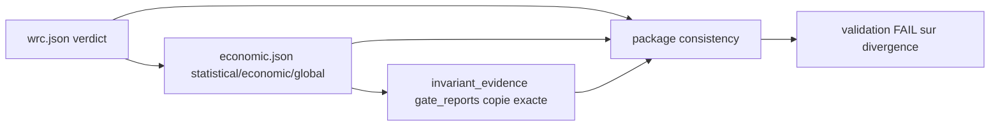

# Plan d'implementation — Coherence des verdicts persistes

## 0. Bandeau de statut

| Question | Reponse |
| --- | --- |
| Un chantier actif couvre-t-il ce perimetre ? | Non. Les enfants 1 a 4 sont `DONE`; aucun workstream actif. |
| Un verrou bloque-t-il le chantier ? | Non. L'epic designe explicitement ce lot 5/10. |
| Decision humaine manquante ? | Non. Les proprietaires executables publient deja les trois valeurs a recouper. |
| Type de chantier | `SINGLE` : derivation, invariant interne et recoupement package forment une seule preuve bout en bout. |

Test `epic-orchestrator` : `SINGLE_CHANTIER`. Les phases sont
interdependantes et partagent un seul Exit criteria.

## Audit IA de promotion

- [x] Bootstrap, checkpoint, hook, tracking et workflows relus.
- [x] Finding A3 confronte a `economic_gate_report`, INV-010 et package validator.
- [x] Proprietaires de chaque valeur identifies sans nouvelle precedence.
- [x] Consommateurs, fixtures et tests recherches.
- [x] Perimetre ferme ; aucun schema, Protocole ou BACKTRADER requis.
- [x] Baseline canonique observee : 259 tests `OK`.

## Triage

| Champ | Valeur |
| --- | --- |
| Track | `mainline` |
| Lifecycle | `TRIAGED` apres routage ; non executable avant baseline |
| Type de chantier | `SINGLE` |
| Classification | `CONTRACT_ENCODING` |
| Scope | Deriver `invariant_evidence.gate_reports` des rapports proprietaires et faire echouer INV-010/package validation sur toute divergence. |
| Non-goals | Aucun nouveau statut/precedence, aucune modification economique/WRC, schema, Protocole, live, garde AST, artefact BACKTRADER ou package persistant regenere sans diff semantique. |
| Source | Epic parent, audit 2026-08-09 finding A3. |
| Exit criteria | Aucun literal de verdict dans `gate_reports`; valeurs derivees exactes ; incoherence interne ou avec WRC/economique nommee et bloquante ; fixture valide conservee ; suite complete `OK`. |

## Statut

| Champ | Valeur |
| --- | --- |
| Statut | `DONE` |
| Date | 2026-08-09 |
| Date d'activation | 2026-08-09 |
| Autorite normative | SOP 08/SOP 10 et INV-010 du paquet d'execution. |
| Autorite executable | `economic_gate_report` pour les statuts economiques/globaux ; WRC pour le statut statistique. |
| Impact protocole | Aucun ; Guardian `CONTRACT_ENCODING`. |

## Carte d'execution IA

| Champ | Contenu |
| --- | --- |
| Objectif | Supprimer les trois `PASS` fabriques et rendre toute contradiction explicite. |
| Lecture minimale | Epic, audit A3, ce plan, builder, economic gate, invariant/package validators et tests. |
| Preuve | Tests unitaires internes, mutation de package temporaire, pipeline hostile, suite complete et audits. |
| Arret | Toute regle de combinaison absente des rapports proprietaires ou nouveau statut requis. |

## 1. Role et non-objectifs

Ce plan ne recalcule aucun verdict. Il transporte et recoupe les verdicts
publies par leurs proprietaires. `economic_gate_report()` est deja le SSoT
executable des trois champs :

- `statistical_status` : statut statistique fourni au rapport ;
- `economic_status` : resultat des hurdles economiques ;
- `global_status` : combinaison deja implementee et testee.

Le lot ne change pas cette combinaison.

## 2. Contexte obligatoire a lire avant de coder

1. Bootstrap repo, cockpit vivant, gouvernance et workflow core-engine.
2. Epic parent, audit de robustesse finding A3 et plans 3A/3B archives.
3. SOP 08, SOP 10 et INV-010 du paquet d'execution.
4. `economic_gate.py`, `build_research_package.py`,
   `invariant_validator.py`, `package_validator.py`.
5. Tests invariants/package/pipeline et fixtures minimale/invalides.

## 3. Table des gates

| Controle | PASS | Sinon |
| --- | --- | --- |
| Producteur | Copie exacte des trois champs proprietaires | Aucun fallback positif |
| INV-010 interne | Champs presents, composants statistique/economique, final compatible avec les composants | `FAIL` |
| Recoupement WRC | WRC verdict = economic.statistical = copie statistical | Erreur semantique nommee |
| Recoupement economique | economic/economic global = copies economic/final | Erreur semantique nommee |
| Package | Zero erreur/invariant failure | status `FAIL` |

## 4. Etat des lieux

| Fichier | Existe | Manque |
| --- | --- | --- |
| `economic_gate.py` | Trois statuts proprietaires et combinaison globale. | Rien ; hors modification. |
| Builder pilote | Rapports proprietaires disponibles avant invariant evidence. | Trois literals `PASS` a remplacer par copie exacte. |
| `invariant_validator.py` | Presence et separation partielle. | Coherence interne et refus du final positif contradictoire. |
| `package_validator.py` | Charge deja WRC/economic/invariant et produit `semantic_errors`. | Recoupement transversal nomme. |
| Tests | Fixtures forme/validite et erreurs economiques separees. | Contrastes de divergence des copies. |

## 5. Decision d'architecture



Decisions :

1. Le builder construit `gate_reports` depuis le rapport economique deja
   produit : statistical/economic/global deviennent statistical/economic/final.
2. INV-010 reste autonome sur la structure interne : composants exacts,
   valeurs presentes et impossibilite d'un `final PASS` si un composant
   n'est pas `PASS`.
3. Le package validator, seule couche ayant acces aux trois artefacts,
   compare WRC, economic et invariant evidence et ajoute des
   `semantic_errors` explicites.
4. Une divergence bloque le package mais ne reecrit aucun artefact.
5. Aucun schema/migration : la forme JSON reste identique.

## 6. Perimetre de fichiers explicite

Autorises :

```text
Implementation/examples/minimal_pilot_pipeline/build_research_package.py
Implementation/ebta_engine/validators/invariant_validator.py
Implementation/ebta_engine/validators/package_validator.py
Implementation/ebta_engine/tests/test_invariants.py
Implementation/ebta_engine/tests/test_package_validator.py
Implementation/ebta_engine/tests/test_minimal_pilot_pipeline.py
Implementation/ebta_engine/tests/test_inventory.txt
Implementation/ebta_engine/fixtures/invalid_invariants/all_invalid_cases.json
Implementation/HISTORIQUE DES VERSIONS EBTA ENGINE.md
.ai/backlog/mainline/PLAN_COHERENCE_VERDICTS_PERSISTES.md
.ai/archive/20260809_PLAN_COHERENCE_VERDICTS_PERSISTES.md
.ai/checkpoint.json
0 - HUMAN START HERE/archive/20260809_PLAN_COHERENCE_VERDICTS_PERSISTES.md
0 - HUMAN START HERE/archive/AUDIT_BUG_HUNTER_PLAN_COHERENCE_VERDICTS_PERSISTES_2026-08-09.md
0 - HUMAN START HERE/archive/AUDIT_ADVERSARIAL_PLAN_COHERENCE_VERDICTS_PERSISTES_2026-08-09.md
0 - HUMAN START HERE/archive/AUDIT_CONFORMITE_PLAN_COHERENCE_VERDICTS_PERSISTES_2026-08-09.md
```

Interdits :

```text
Protocole/
Implementation/ebta_engine/schemas/
Implementation/ebta_engine/procedures/economic_gate.py
Implementation/ebta_engine/procedures/wrc.py
Implementation/ebta_engine/validators/gate_validator.py
Implementation/ebta_engine/manifests/
Implementation/ebta_engine/package_builder/
Implementation/examples/minimal_pilot_pipeline/inputs/
Implementation/examples/minimal_pilot_pipeline/research_package/
Implementation/research_packages/
Implementation/Active/
D:/TRADING/.../BACKTRADER/
```

## 7. Decoupage en phases

### Phase 1 — Derivation et invariant interne

- extraire un helper pur de construction de `gate_reports` ;
- remplacer les trois literals du chemin complet ;
- faire consommer le meme helper au chemin de paquet pre-OOS refuse, avec
  absence economique derivee en `INCONCLUSIVE`, afin de supprimer le second
  assembleur sans transformer ce refus legitime en succes ;
- renforcer INV-010 sur champs/composants et final positif contradictoire ;
- adapter fixture invalide et tests unitaires.

### Phase 2 — Recoupement package

- ajouter une fonction de comparaison sans mutation ;
- nommer chaque mismatch avec attendu/trouve et artefacts ;
- tester divergences statistical, economic, final et controle coherent ;
- prouver que le status package devient `FAIL`.

### Phase 3 — Pipeline et trace

- ajouter un contraste bout en bout `REJECTED_ECONOMIC` ;
- verifier que la copie porte le rejet et INV-010 reste coherent ;
- mettre a jour inventaire/historique ;
- lancer suite et audits de fermeture.

## 8. Invariants absolus et NO GO

1. Le builder ne contient aucun verdict literal dans `gate_reports`.
2. WRC, economic et invariant evidence ne peuvent diverger silencieusement.
3. Un final `PASS` exige statistical et economic `PASS`.
4. Un non-PASS conserve son vocabulaire proprietaire ; il n'est pas converti en PASS.
5. Le validateur observe et echoue ; il ne repare jamais les fichiers.
6. La fixture valide demeure PASS et les formes publiques sont stables.

NO GO : recalculer les hurdles, choisir une precedence nouvelle, convertir
`REJECTED_ECONOMIC` en `INCONCLUSIVE` dans la copie, accepter une absence,
modifier un schema/protocole, ou regenerer un package persistant pour masquer
un diff.

## 9. Verification a chaque etape

```powershell
python -m unittest discover -s Implementation\ebta_engine\tests -t Implementation -p test_invariants.py
python -m unittest discover -s Implementation\ebta_engine\tests -t Implementation -p test_package_validator.py
python -m unittest discover -s Implementation\ebta_engine\tests -t Implementation -p test_minimal_pilot_pipeline.py
python -m unittest discover -s Implementation\ebta_engine\tests -t Implementation -p test_test_inventory.py
python -m unittest discover -s Implementation\ebta_engine\tests -t Implementation
rg -n -U '"gate_reports"\s*:\s*\{\s*"statistical"\s*:\s*"PASS"' Implementation/examples/minimal_pilot_pipeline/build_research_package.py
git diff --check
```

## 10. Journal des decisions humaines

| Date | Decision | Portee |
| --- | --- | --- |
| 2026-08-09 | `AUDIT_ARCHITECTURE_D_ABORD`. | Separe A3 du garde AST. |
| 2026-08-09 | `/continue` persistant sur l'epic. | Autorise la boucle gouvernee 5/10. |

Aucune decision de precedence n'est prise : `global_status` existant reste
le proprietaire du verdict final.

## 11. Risques

| Risque | Mitigation |
| --- | --- |
| Double validation concurrente | INV-010 verifie l'interne ; package validator seul recoupe les fichiers. |
| Mutation de fixture apres manifeste | Tests reconstruisent le manifeste apres chaque mutation. |
| Statut proprietaire perdu | Comparaisons exactes, pas de coercition par `_gate_verdict`. |
| Test hostile masque par autre FAIL | Assertions ciblent le message de coherence nomme. |

## 12. Definition of Done

- [x] Trois valeurs derivees sans literal.
- [x] INV-010 refuse contradiction interne.
- [x] Package validator refuse chaque divergence externe.
- [x] Contraste economique rejete conserve dans la copie.
- [x] Fixture valide et suite/inventaire verts.
- [x] Pyrefly, adversarial et conformite sans finding bloquant.
- [x] Aucun fichier interdit touche.

## 13. Cloture

| Champ | Valeur |
| --- | --- |
| Resultat | Helper unique sur les deux chemins, INV-010 coherent, recoupements WRC/economic/invariant bloquants, 266 tests `OK`, Pyrefly 0 erreur et audits `PASS`. |
| Ecart | Aucun ecart fonctionnel. Le build pilote hostile reste legitimement `FAIL` lorsque l'economie est rejetee. |
| Suite | 6/10 `PLAN_GARDE_LITTERAUX_VERDICT`. |

## 14. Journal d'audits post-route

| Passe | Verification | Resultat |
| --- | --- | --- |
| 1 | Plan route confronte aux deux constructions de `gate_reports`, au validateur package et aux fixtures. | Ajout du chemin pre-OOS refuse au helper unique : ses `INCONCLUSIVE` restent honnetes, mais aucun second assembleur ne subsiste. Perimetre de fichiers inchange. |
| 2 | Relecture apres correction contre les proprietaires WRC/economic, INV-010, package validator et les non-goals. | Aucun nouvel angle mort majeur : chemin complet copie les trois champs, chemin refuse derive l'absence, recoupement externe nomme chaque divergence et aucun statut/precedence n'est cree. Convergence. |

## Journal de convergence de l'intake

| Passe | Verification | Resultat |
| --- | --- | --- |
| 1 | A3 confronte au builder et a INV-010. | Separation derivation/interne/recoupement package. |
| 2 | Proprietaires WRC/economic et combinaison globale verifies. | `global_status` existant evite toute precedence inventee. |
| 3 | Consommateurs, fixtures, manifests temporaires et non-goals relus. | Aucun schema ni package persistant requis ; convergence. |
