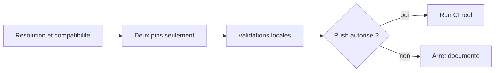

# Plan d'implementation — Correction de la depreciation Node.js 20 dans `ebta-runtime-suite`

## 0. Bandeau de statut (a verifier avant toute promotion)

| Question | Reponse |
| --- | --- |
| Un chantier actif couvre-t-il deja ce perimetre ? | Non. `.ai/checkpoint.json::active_workstream_id` vaut `null`. Le chantier ferme `PLAN_CORRECTION_PYREFLY_CI_WINDLL_LINUX` excluait explicitement le warning Node.js 20. |
| Un verrou de gouvernance bloque-t-il ce chantier ? | Non. Le changement cible uniquement deux pins d'actions officielles dans `.github/workflows/ebta-runtime-suite.yml`; il ne touche ni `Protocole/` ni `Implementation/`. |
| Une decision humaine normative est-elle requise ? | Non. Le choix de version est un detail technique CI, borne par la decision d'architecture ci-dessous. Toute modification, tout commit et tout push restent des actions separees de `/start`. |
| Ce plan remplace-t-il un chantier existant ? | Non. |
| Resultat du test multi-lot | `SINGLE`. Les deux pins appartiennent au meme workflow, corrigent le meme avertissement et partagent un unique Exit criteria : un run `runtime-suite` sans warning Node.js 20 et entierement `PASS`. |

---

## Audit IA de promotion

- [x] Bootstrap et cockpit actifs lus : `AGENTS.md`, `.ai/README.md`, `.ai/checkpoint.json`, `Implementation/Active/HOOK.md`, `Implementation/Active/tracking.json`.
- [x] Checkout compare a `origin/main` le 2026-08-09 : `HEAD == origin/main` avant promotion.
- [x] Workflow reel inspecte : les seuls pins concernes sont `actions/checkout@... # v4.2.2` et `actions/setup-python@... # v5.6.0`.
- [x] Absence de doublon actif verifiee dans `.ai/`, `0 - HUMAN START HERE/` et `.github/`.
- [x] Releases officielles relues via `gh api` le 2026-08-09 : `actions/checkout v7.0.1` (`3d3c42e5aac5ba805825da76410c181273ba90b1`) et `actions/setup-python v7.0.0` (`5fda3b95a4ea91299a34e894583c3862153e4b97`) declarent toutes deux `runs.using: node24`.
- [x] Test `epic-orchestrator` applique : chantier `SINGLE`, pas de chantier mere ni de sous-chantiers.
- [x] Brouillon original laisse intact avant l'appel a `plan.ps1 start`; ce fichier est une nouvelle reecriture dans `.ai/backlog/fixes/`.
- [x] Perimetre, invariants, rollback, preuves locales et preuve CI distante explicites.

## Triage

| Champ | Valeur |
| --- | --- |
| Track | `fix` |
| Lifecycle | `TRIAGED` apres routage ; non executable avant audit post-`/start` et baseline |
| Type de chantier | `SINGLE` |
| Classification | `GOVERNANCE` |
| Scope | Remplacer uniquement les deux SHA/commentaires de version de `actions/checkout` et `actions/setup-python` dans `.github/workflows/ebta-runtime-suite.yml` par les dernieres releases stables officielles qui declarent nativement `node24`, puis verifier le workflow reel. |
| Non-goals | Aucun changement d'etapes, d'ordre, de permissions, de triggers, de version Python ou de pins Python; aucune modification de `Protocole/`, `Implementation/`, `.agents/` ou `.codex/`; aucun affaiblissement de gate; aucune publication sans autorisation humaine explicite. |
| Source | Demande humaine `/start` du 2026-08-09 sur `0 - HUMAN START HERE/PLAN_CORRECTION_CI_NODE20_DEPRECATION_ACTIONS.md`, archivee mecaniquement par `plan.ps1 start`. |
| Exit criteria | (1) diff du workflow limite aux deux lignes `uses:` et commentaires de version; (2) chaque SHA correspond au tag stable officiel retenu et son `action.yml` declare `node24`; (3) un run reel `ebta-runtime-suite` est `success`; (4) ses logs ne contiennent plus le warning `Node.js 20 is deprecated` pour ces actions. |

## Statut

| Champ | Valeur |
| --- | --- |
| Statut | `NON_DEMARRE` |
| Date de creation | 2026-08-09 |
| Date d'activation | - |
| Autorite normative | Aucune autorite scientifique EBTA concernee. |
| Autorite executable | `.github/workflows/ebta-runtime-suite.yml` et metadonnees publiees par les depots officiels `actions/checkout` et `actions/setup-python`. |
| Changement normatif attendu | Aucun. |
| Dependances externes | GitHub Actions et `gh` CLI authentifie pour la resolution read-only et la verification du run. |

## Carte d'execution IA (lecture prioritaire pour `/continue`)

| Champ | Contenu operationnel |
| --- | --- |
| Objectif executable | Eliminer le warning de depreciation Node.js 20 sans modifier le comportement fonctionnel du job `runtime-suite`. |
| Autorite et lecture minimale | Ce plan; `.github/workflows/ebta-runtime-suite.yml`; release et `action.yml` du tag cible dans les deux depots officiels. |
| Perimetre autorise | Deux lignes `uses:` et leurs commentaires de version dans `.github/workflows/ebta-runtime-suite.yml`. |
| Interdits absolus | Toute autre ligne du workflow; tous les autres fichiers hors mutations de cockpit faites mecaniquement par `plan.ps1`. |
| Phase de reprise | Phase 1 — resolution live et audit des deux cibles. |
| Preuve attendue | Correspondance tag/SHA/node24, diff minimal, validations locales, puis run GitHub Actions `success` sans warning Node.js 20. |
| Arret et escalade | Arreter avant toute edition si la derniere release stable d'une action ne declare pas `node24`, exige un input incompatible avec le workflow, ou si l'obtention de la preuve distante exige un push non autorise. |

---

## 1. Role de ce document et non-objectifs

Ce plan gouverne un correctif de maintenance CI cible. Il ne change aucune regle scientifique EBTA et ne modifie pas le runtime. `.ai/` ne porte que le cycle de vie du chantier; le comportement executable reste dans le workflow GitHub Actions.

Non-objectifs :

- ne pas profiter du bump pour moderniser ou reformater le workflow;
- ne pas modifier les commandes Pyrefly, Ruff, unittest ou validation JSON;
- ne pas changer `ubuntu-latest`, Python 3.13, `permissions: contents: read`, `persist-credentials: false`, `push` ou `workflow_dispatch`;
- ne pas remplacer les SHA complets par des tags flottants;
- ne pas committer ni pousser sur la seule autorisation `/start`.

## 2. Contexte obligatoire a lire avant de coder

1. `AGENTS.md`, `.ai/README.md` et `.ai/checkpoint.json`.
2. `.ai/workflows/common/WORKFLOW.md` pour les frontieres `/start`, `/continue`, commit et push.
3. `.github/workflows/ebta-runtime-suite.yml` dans son etat live.
4. Ce plan, notamment les phases, invariants, NO GO et decisions.
5. Pour chaque action : release stable courante, ref Git du tag et `action.yml` officiel a ce tag.

Hierarchie d'autorite :

```text
1. Gouvernance du repo pour l'autorisation et le cycle du chantier.
2. Workflow local pour les inputs et invariants a conserver.
3. Depots officiels GitHub Actions pour tag, SHA, runtime Node et changelog.
```

## 3. Table des gates (points de decision sequentiels)

| Gate | Question | PASS | Echec |
| --- | --- | --- | --- |
| G1 — provenance | Les tags et SHA sont-ils resolus depuis les depots officiels ? | Continuer. | Arreter; ne rien editer. |
| G2 — runtime | Les deux `action.yml` declarent-ils `node24` ? | Continuer. | Choisir une autre release stable ou escalader. |
| G3 — compatibilite | Les changelogs et inputs utilises ne signalent-ils aucune incompatibilite avec ce workflow ? | Continuer. | Documenter et escalader avant edition. |
| G4 — diff | Seules les deux lignes `uses:` ont-elles change ? | Continuer. | Retirer toute modification parasite. |
| G5 — local | Les validations locales pertinentes sont-elles `PASS` ? | Demander l'autorisation de publication. | Corriger sans affaiblir les gates. |
| G6 — CI reelle | Le run est-il `success` et sans warning Node.js 20 cible ? | Chantier eligible a `/close`. | Inspecter la cause; ne pas declarer `DONE`. |

## 4. Etat des lieux (avant/apres) — reutiliser avant de recreer

### Ce qui existe deja

| Element | Etat verifie | A conserver |
| --- | --- | --- |
| `actions/checkout` | Pin SHA complet `v4.2.2`, `persist-credentials: false`. | L'input et la forme pin SHA + commentaire. |
| `actions/setup-python` | Pin SHA complet `v5.6.0`, `python-version: "3.13"`. | L'input et la forme pin SHA + commentaire. |
| Gates CI | Pyrefly, Ruff, unittest, checkpoint schema, tracking schema. | Commandes, ordre et exigence de succes. |
| Preuve independante | Run GitHub Actions hors du controle local de l'agent. | Verification distante obligatoire. |

### Ce qui manque reellement

Deux pins dont le runtime embarque cible encore Node.js 20 doivent etre remplaces par des releases stables officielles declarant `node24`. Aucun nouveau job, script, test, schema ou module n'est necessaire.

Etat observe au 2026-08-09, informatif et a revalider lors de `/continue` :

| Action | Release stable observee | SHA observe | Runtime declare |
| --- | --- | --- | --- |
| `actions/checkout` | `v7.0.1` | `3d3c42e5aac5ba805825da76410c181273ba90b1` | `node24` |
| `actions/setup-python` | `v7.0.0` | `5fda3b95a4ea91299a34e894583c3862153e4b97` | `node24` |

## 5. Decision d'architecture

Retenir, au moment de l'implementation, la derniere release stable officielle de chaque action qui satisfait G1-G3, puis l'epingler par son SHA de commit complet. Cette regle evite deux echecs opposes : figer dans le plan un SHA susceptible de vieillir, ou choisir une ancienne release uniquement parce qu'elle est la premiere a abandonner Node.js 20.

Le choix est borne : si la release stable courante introduit une incompatibilite factuelle avec les seuls inputs utilises ici, l'IA ne choisit pas silencieusement une autre majeure; elle documente le conflit et escalade.

### Frontieres explicites

| Couche | Elle fait | Elle ne fait pas |
| --- | --- | --- |
| Workflow EBTA | Consomme deux actions officielles epinglees et execute les gates existants. | Ne porte pas la logique interne ni le runtime Node de ces actions. |
| Depots `actions/*` | Publient tags, commits, `action.yml` et changelogs. | Ne donnent aucune autorisation de modifier ou publier le repo EBTA. |
| Plan/cockpit `.ai/` | Borne, route et trace le chantier. | Ne devient pas une source de version flottante pour les actions. |

### Decisions deja actees

| Decision | Justification |
| --- | --- |
| Derniere release stable officielle satisfaisant G1-G3 | Strategie recommandee par le brouillon et retenue par l'audit technique `/start`; le workflow n'utilise que les inputs de base conserves. |
| SHA complet + commentaire de tag | Preserve le durcissement supply-chain existant et la lisibilite humaine. |
| Re-resolution live a `/continue` | Les releases sont une donnee externe susceptible de changer apres la promotion. |
| Un seul plan `SINGLE` | Les deux changements sont inseparables pour produire la preuve CI finale. |

### Perimetre de fichiers explicite (autorises / interdits)

Autorise pour l'implementation :

```text
.github/workflows/ebta-runtime-suite.yml  [MODIFIER: deux lignes uses uniquement]
```

Interdits :

```text
Protocole/                                [NORME]
Implementation/                           [RUNTIME]
.agents/ .codex/                          [TOOLING]
toute autre ligne de .github/workflows/ebta-runtime-suite.yml
```

Les mutations `.ai/checkpoint.json` et l'archivage du brouillon sont reserves a `.ai/tools/plan.ps1`.

## 6. Decoupage en phases

### Phase 1 — Resolution live et audit de compatibilite

Objectif : fixer deux couples tag/SHA prouvant `node24` sans incompatibilite connue avec les inputs actuels.

Actions :

- interroger `releases/latest` et `git/ref/tags/<tag>` pour chaque depot officiel;
- verifier que l'objet de tag pointe vers un commit (ou le peler jusqu'au commit si le tag est annote);
- lire `action.yml` au tag et confirmer `runs.using: node24`;
- lire le changelog de la release et verifier les inputs `persist-credentials` et `python-version` utilises ici.

Critere de sortie : G1-G3 `PASS`, couples tag/SHA consignes dans le journal d'execution.

### Phase 2 — Bump minimal du workflow

Objectif : remplacer exactement deux pins.

Actions :

- remplacer le SHA et commentaire de version de `actions/checkout`;
- remplacer le SHA et commentaire de version de `actions/setup-python`;
- relire le diff complet du fichier.

Critere de sortie : `git diff -- .github/workflows/ebta-runtime-suite.yml` ne montre que deux lignes retirees et deux lignes ajoutees.

### Phase 3 — Verification locale et preparation de publication

Objectif : prouver que le fichier reste valide et que les gates locales existantes ne regressent pas.

Actions : executer les commandes de la section 9; produire un commit cible seulement si l'autorisation de commit est explicite; demander l'autorisation humaine avant tout push.

Critere de sortie : validations locales `PASS`, diff toujours limite, aucun push non autorise.

### Phase 4 — Preuve GitHub Actions reelle

Objectif : obtenir la preuve independante exigee par l'Exit criteria.

Actions : apres autorisation explicite, pousser la branche/commit convenu ou declencher le mecanisme autorise; suivre le run; inspecter ses annotations et logs.

Critere de sortie : run `success` et absence du warning Node.js 20 pour les deux actions.

### Chemin critique (ordre des phases)



## 7. Artefacts produits

| Etape | Fichier/sortie | Format | Regle source |
| --- | --- | --- | --- |
| Phase 2 | `.github/workflows/ebta-runtime-suite.yml` | YAML, deux pins SHA | Convention supply-chain existante. |
| Phase 4 | Run `ebta-runtime-suite` | GitHub Actions run + logs | Preuve independante de non-regression. |

## 8. Invariants absolus et NO GO

### Invariants (non negociables dans le code)

1. Les deux actions restent epinglees par SHA complet avec commentaire de tag exact.
2. Les tags/SHA/runtime Node sont verifies dans les depots officiels au moment de l'implementation.
3. Le workflow conserve ses triggers, permissions, runner, inputs, etapes, ordre et commandes.
4. Un avertissement disparu ne vaut pas `PASS` si une autre etape du job echoue.
5. Un run non declenche, annule ou sans logs exploitables reste `INCONCLUSIVE`, jamais `PASS`.

### NO GO

- utiliser un tag flottant comme `@v7`;
- recopier un SHA du plan sans re-resolution live;
- modifier un pin Python, une commande ou une permission;
- masquer le warning, ignorer une annotation ou supprimer une etape;
- declarer la CI verte depuis une validation locale seulement;
- committer ou pousser sans l'autorisation correspondante.

## 9. Verification a chaque etape

Resolution officielle, a adapter uniquement avec le tag retourne :

```powershell
$repos = @('actions/checkout', 'actions/setup-python')
foreach ($repo in $repos) {
    $tag = gh api "repos/$repo/releases/latest" --jq '.tag_name'
    $ref = gh api "repos/$repo/git/ref/tags/$tag" | ConvertFrom-Json
    $encoded = gh api "repos/$repo/contents/action.yml?ref=$tag" --jq '.content'
    $yaml = [Text.Encoding]::UTF8.GetString(
        [Convert]::FromBase64String(($encoded -replace '\s', ''))
    )
    [pscustomobject]@{
        repo = $repo
        tag = $tag
        object_type = $ref.object.type
        sha = $ref.object.sha
        node_runtime = [regex]::Match($yaml, 'using:\s*[''"]?(node[0-9]+)').Groups[1].Value
        required_input_present = if ($repo -eq 'actions/checkout') {
            $yaml -match '(?m)^\s{2}persist-credentials:'
        } else {
            $yaml -match '(?m)^\s{2}python-version:'
        }
    }
}
```

Sortie exigee pour chaque action : `object_type=commit`, SHA hexadecimal de
40 caracteres, `node_runtime=node24` et `required_input_present=True`. Toute
valeur vide ou differente fait echouer G1-G3; l'inspection visuelle d'un blob
Base64 brut ne constitue pas une preuve.

Diff et validations locales :

```powershell
git diff --check -- .github/workflows/ebta-runtime-suite.yml
git diff -- .github/workflows/ebta-runtime-suite.yml
python -m pyrefly check --python-interpreter-path python --replace-imports-with-any "nautilus_trader.*" Implementation/ebta_engine Implementation/notebooks
python -m ruff check Implementation/ebta_engine
python -m unittest discover -s Implementation/ebta_engine/tests -t Implementation
python -c "import json, jsonschema; jsonschema.validate(json.load(open('.ai/checkpoint.json', encoding='utf-8')), json.load(open('.ai/checkpoint.schema.json', encoding='utf-8')))"
python -c "import json, jsonschema; jsonschema.validate(json.load(open('Implementation/Active/tracking.json', encoding='utf-8')), json.load(open('Implementation/Active/tracking.schema.json', encoding='utf-8')))"
```

Preuve distante apres publication autorisee :

```powershell
gh run list --workflow=ebta-runtime-suite.yml --limit 5
$run = gh run view <run-id> --json conclusion,headSha,status,url | ConvertFrom-Json
if ($run.status -ne 'completed' -or $run.conclusion -ne 'success') {
    throw "Run CI non PASS: status=$($run.status), conclusion=$($run.conclusion)"
}
$logs = gh run view <run-id> --log | Out-String
if ($logs -match 'Node\.js 20 is deprecated') {
    throw 'Le warning Node.js 20 subsiste dans les logs du run.'
}
```

Regle de progression : chaque gate de la section 3 doit etre `PASS` avant le suivant. Une absence de sortie, un timeout, un run annule ou une impossibilite d'inspecter les logs n'est pas un succes.

Premier lot executable propose :

```text
Phase 1 — Resolution live et audit de compatibilite des deux releases stables.
```

### Execution sans interruption

Apres baseline et `/continue`, les Phases 1 a 3 peuvent etre executees sans nouvelle decision humaine tant que G1-G5 restent `PASS`. La Phase 4 s'arrete obligatoirement avant push si aucune autorisation de publication explicite n'a ete donnee. Un conflit de compatibilite en G3 est egalement un arret legitime.

### Autorite decisionnelle accordee

L'IA peut choisir les couples tag/SHA qui appliquent strictement la decision d'architecture, corriger une erreur de transcription dans les deux lignes autorisees et relancer les validations locales. Elle ne peut ni elargir le perimetre ni choisir silencieusement une ancienne majeure en cas de conflit.

### Interdiction des raccourcis (aucun faux succes)

- ne jamais confondre disparition du warning et succes complet du job;
- ne jamais valider un SHA uniquement par le commentaire local;
- ne jamais affaiblir un gate pour compenser une incompatibilite de release;
- ne jamais conclure `DONE` avant preuve distante verifiee.

## 10. Journal des decisions humaines (autorisations)

| Date | Decision | Portee |
| --- | --- | --- |
| 2026-08-09 | Demander la redaction d'un plan avant tout fix du warning Node.js 20. | Autorisait le brouillon `INTAKE` seulement. |
| 2026-08-09 | `/start D:\Livre\Trading\Trading algorithmic\EBTA - David Aronson\0 - HUMAN START HERE\PLAN_CORRECTION_CI_NODE20_DEPRECATION_ACTIONS.md` | Autorise l'audit, la reecriture, l'archivage du brouillon et le routage du plan. N'autorise ni implementation, ni commit, ni push. |
| 2026-08-09 | `Go`, en reponse a l'etape annoncee « double audit post-promotion puis baseline ». | Autorise les corrections du plan, le commit de baseline du plan et le commit separe de transition `TRIAGED -> BASELINED`. N'autorise ni `/continue`, ni modification du workflow CI, ni push. |
| 2026-08-09 | `Oui`, en reponse a la demande de superseder ce workstream et de creer/promouvoir un remplacement `CONTRACT_ENCODING/core-engine` couvrant le YAML et son test supply-chain. | Autorise la cloture `SUPERSEDED`, la creation/promotion/baseline du remplacement et l'extension a `Implementation/ebta_engine/tests/test_ci_supply_chain.py`. N'autorise toujours aucun push. |

## 11. Risques et blocages connus

| Risque | Impact | Mitigation / condition de deblocage |
| --- | --- | --- |
| Une nouvelle release sort entre `/start` et `/continue`. | Les SHA observes dans ce plan ne sont plus les derniers. | Re-resolution live obligatoire en Phase 1. |
| Une nouvelle majeure change un input ou son comportement. | Regression du workflow. | G3 : changelog + inputs relus; escalade si incompatibilite. |
| Le push n'est pas autorise. | Preuve CI distante impossible. | Arret apres validations locales; demander l'autorisation sans fabriquer `PASS`. |
| Le run echoue pour une cause differente. | Exit criteria non atteint. | Diagnostiquer la cause et replanifier si elle depasse les deux lignes autorisees. |
| `Implementation/ebta_engine/tests/test_ci_supply_chain.py` fige les anciens SHA dans `EXPECTED_USES` et dans la mutation hostile `mutable_tag`. | La suite canonique echoue avec 2 tests en `FAIL` apres le bump pourtant conforme aux nouvelles releases. Le precedent `.ai/archive/20260809_PLAN_DURCISSEMENT_WORKFLOW_CI.md` classait ce meme contrat de test `CONTRACT_ENCODING` sous `core-engine`; une simple extension du workstream actuel `GOVERNANCE/common` serait incoherente. | Decision humaine requise pour remplacer/superseder ce workstream par un plan `CONTRACT_ENCODING/core-engine` couvrant le YAML et les trois substitutions du test; ne pas affaiblir ni supprimer les assertions supply-chain. |

## 12. Definition of Done

- [ ] G1 a G6 sont tous `PASS` avec preuves consultables.
- [ ] Exit criteria du Triage atteint integralement.
- [ ] Diff d'implementation limite aux deux lignes `uses:` et commentaires associes.
- [ ] Aucun fichier hors scope modifie par l'implementation.
- [ ] Aucune regression des gates existants.
- [ ] Checklist post-modification executee.
- [ ] Autorisations de commit et de push tracees si ces actions ont eu lieu.
- [ ] Aucun resultat `FAIL`, `DENIED`, `INCONCLUSIVE` ou timeout presente comme `PASS`.

## 13. Cloture

| Champ | Valeur |
| --- | --- |
| Resultat final | `SUPERSEDED` — classification `GOVERNANCE/common` insuffisante apres decouverte du contrat executable figeant les SHA sous `Implementation/`. |
| Ecarts par rapport au plan initial | Le changement YAML de deux lignes exige trois substitutions synchrones dans `test_ci_supply_chain.py`; le workflow live a ete restaure avant supersession, donc aucune implementation partielle n'est conservee par ce chantier. |
| Suites a prevoir | Nouveau workstream `PLAN_CORRECTION_CI_NODE20_DEPRECATION_CORE_ENGINE`, `CONTRACT_ENCODING/core-engine`, couvrant le YAML et le contrat de test. |

### Resultat d'execution (a dupliquer a chaque session significative)

| Champ | Valeur |
| --- | --- |
| Date | [a remplir] |
| Phases executees | [a remplir] |
| Artefact produit | [a remplir] |
| Validation | [PASS/FAIL/INCONCLUSIVE + commandes et run-id] |
| Ecart par rapport au plan | [aucun / liste] |

### Resultat d'execution — 2026-08-09 `/continue` (partiel)

| Champ | Valeur |
| --- | --- |
| Date | 2026-08-09 |
| Phases executees | Phases 1 et 2 terminees; Phase 3 arretee sur suite canonique `FAIL`. |
| Artefact produit | `.github/workflows/ebta-runtime-suite.yml` modifie localement sur les deux lignes `uses:`, puis restaure avant supersession; aucun commit d'implementation, aucun push. |
| Validation | G1-G4 `PASS`; Pyrefly `PASS` (`0 errors`, 1 suppression); Ruff `PASS`; schemas checkpoint/tracking `PASS`; unittest `FAIL` (292 tests, 2 echecs dans `test_ci_supply_chain.py` dus aux anciens SHA attendus). Simulation non persistante des trois substitutions proposees : 8/8 tests supply-chain `PASS`, y compris `test_hostile_workflow_mutations_are_rejected`. |
| Ecart par rapport au plan | Dependance cachee hors perimetre : le contrat de test supply-chain doit etre synchronise avec les nouveaux pins examines. Extension de scope non deduite. |

## 14. Journal d'audits post-hoc

| Date de l'audit | Ce qui a ete corrige | Pourquoi |
| --- | --- | --- |
| 2026-08-09 — intake passe 1 | Verification du workflow live, des doublons et des releases officielles; ajout du SHA `setup-python v7.0.0`; remplacement du choix ambigu « derniere ou premiere release Node24 » par une regle deterministe : derniere stable satisfaisant provenance, node24 et compatibilite. | Le brouillon laissait une decision ouverte et une cible non verifiee, incompatibles avec une execution bornee. |
| 2026-08-09 — intake passe 2 | Test multi-lot explicite (`SINGLE`); separation des gates provenance/runtime/compatibilite/diff/local/CI; ajout des statuts non-PASS et de la frontiere d'autorisation avant push. | Eviter un faux succes fonde uniquement sur la disparition du warning ou sur une validation locale. Aucun nouvel angle mort majeur apres correction. |
| 2026-08-09 — plan passe 1 | Remplacement des commandes qui affichaient le blob Base64 d'`action.yml` par une preuve structuree extrayant tag, type d'objet Git, SHA, runtime Node et presence de l'input requis; ajout des valeurs de sortie obligatoires et de l'autorisation `Go` strictement bornee a la baseline. | Le plan exigeait G1-G3 mais ses commandes ne prouvaient pas directement `node24` ni la compatibilite des inputs; la frontiere entre commit de baseline et commit d'implementation devait aussi rester explicite. |
| 2026-08-09 — plan passe 2 | Ajout de la commande Pyrefly exacte du workflow aux validations locales; remplacement de la simple lecture des logs par deux assertions fail-closed sur `completed/success` et sur l'absence du warning Node.js 20. | Toutes les gates existantes doivent rester couvertes et une commande de lecture seule ne doit pas permettre de conclure `PASS` sans tester son resultat. |
| 2026-08-09 — plan passe 3 (convergence) | Relecture complete de la structure, des gates, du chemin critique, des commandes et des frontieres d'autorisation; execution de la preuve structuree sur les deux releases courantes. Aucun nouvel angle mort majeur trouve. | Convergence etablie apres deux passes correctives; les deux sorties ont prouve `object_type=commit`, SHA 40 caracteres, `node24` et input requis present. |
