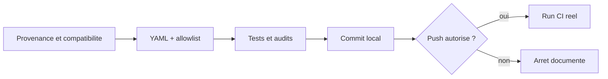

# Plan d'implementation — Correction Node.js 20 et contrat supply-chain

## 0. Bandeau de statut (a verifier avant toute promotion)

| Question | Reponse |
| --- | --- |
| Un chantier actif couvre-t-il deja ce perimetre ? | Non. `PLAN_CORRECTION_CI_NODE20_DEPRECATION_ACTIONS` est `DONE/SUPERSEDED`, son YAML a ete restaure et `active_workstream_id` est `null`. |
| Un verrou de gouvernance bloque-t-il le chantier ? | Non. L'humain a explicitement autorise le remplacement `CONTRACT_ENCODING/core-engine` et l'extension au contrat de test. |
| Une decision normative EBTA est-elle requise ? | Non. Le changement encode un contrat CI existant sans toucher au protocole, aux gates scientifiques, aux seuils ni aux verdicts EBTA. |
| Ce plan remplace-t-il un chantier existant ? | Oui, le workstream supersede `PLAN_CORRECTION_CI_NODE20_DEPRECATION_ACTIONS`. |
| Resultat du test multi-lot | `SINGLE`. Le YAML et son allowlist de test doivent evoluer atomiquement; aucun ne peut satisfaire seul la suite canonique ni l'Exit criteria CI. |

## Audit IA de promotion

- [x] Checkout synchronise avec `origin/main` avant le premier `/continue`; branche seulement en avance de commits locaux gouvernes.
- [x] Cockpit live, hook et tracking lus; runtime historique `DONE`, aucun autre workstream actif apres supersession.
- [x] Workflow live et `Implementation/ebta_engine/tests/test_ci_supply_chain.py` inspectes directement.
- [x] Cause du `FAIL` reproduite : 2 echecs sur 292, tous deux dus a `EXPECTED_USES` conserve sur les anciens SHA.
- [x] Simulation non persistante des trois substitutions du test : 8/8 tests supply-chain `PASS`, scenario hostile inclus.
- [x] Precedent de classification verifie : `.ai/archive/20260809_PLAN_DURCISSEMENT_WORKFLOW_CI.md` est `CONTRACT_ENCODING/core-engine`.
- [x] Brouillon original distinct conserve jusqu'a l'archivage mecanique par `plan.ps1 start`.

## Triage

| Champ | Valeur |
| --- | --- |
| Track | `fix` |
| Lifecycle | `TRIAGED` apres routage; non executable avant audits post-promotion et baseline |
| Type de chantier | `SINGLE` |
| Classification | `CONTRACT_ENCODING` |
| Scope | Mettre a jour les deux pins SHA/commentaires de `.github/workflows/ebta-runtime-suite.yml` et les trois chaines correspondantes de `Implementation/ebta_engine/tests/test_ci_supply_chain.py`. |
| Non-goals | Aucun changement de triggers, permissions, runner, etapes, commandes, pins Python, logique de validation ou comportement hostile; aucune modification de `Protocole/`; aucune nouvelle dependance; aucun push implicite. |
| Source | Workstream supersede `.ai/archive/20260809_PLAN_CORRECTION_CI_NODE20_DEPRECATION_ACTIONS.md`, `FAIL` canonique 2/292, simulation 8/8 `PASS`, autorisation humaine `Oui` du 2026-08-09. |
| Exit criteria | G1-G7 `PASS`; diff executable limite a deux lignes YAML et trois chaines de test; targeted 8/8, Pyrefly, Ruff, suite canonique complete (292 tests au diagnostic) et schemas `PASS`; run GitHub Actions reel `success` sans warning Node.js 20. |

## Statut

| Champ | Valeur |
| --- | --- |
| Statut | `ACTIVE` |
| Date de creation | 2026-08-09 |
| Date d'activation | 2026-08-09 |
| Autorite normative | `Protocole/` non concerne et non modifie. |
| Autorite executable | Workflow CI et contrat `test_ci_supply_chain.py`. |
| Changement normatif attendu | Aucun. |
| Dependances externes | Depots officiels `actions/checkout`, `actions/setup-python`, GitHub Actions et `gh` CLI. |

## Carte d'execution IA (lecture prioritaire pour `/continue`)

| Champ | Contenu operationnel |
| --- | --- |
| Objectif executable | Eliminer le warning Node.js 20 tout en conservant une allowlist supply-chain exacte et hostile aux tags flottants. |
| Autorite et lecture minimale | Ce plan; les deux fichiers autorises; release/ref/`action.yml` officiels; workflows common et core-engine. |
| Perimetre autorise | Deux lignes `uses:` du YAML; deux valeurs `EXPECTED_USES`; chaine source de `mutable_tag`. |
| Interdits absolus | Toute autre ligne executable; toute suppression/relaxation de test; toute modification de `Protocole/`; tout push non autorise. |
| Phase de reprise | Phase 1 — revalidation externe live. |
| Preuve attendue | Provenance/tag/SHA/node24/inputs, diff 5 substitutions, suites locales, audits core-engine, puis run distant. |
| Arret et escalade | Release incompatible; diff hors scope; gate local en echec; push non autorise; run distant absent/annule/echec ou warning persistant. |

## 1. Role de ce document et non-objectifs

Ce plan encode la synchronisation atomique entre le consommateur CI et son
contrat de non-regression. `Implementation/` reste subordonne au protocole;
le test touche uniquement la gouvernance technique du workflow et ne cree
aucune regle scientifique.

Non-objectifs :

- ne pas moderniser ou reformater le workflow;
- ne pas changer le contenu des gates Pyrefly, Ruff, unittest ou schemas;
- ne pas deriver automatiquement `EXPECTED_USES` du YAML, ce qui annulerait
  l'independance de l'allowlist;
- ne pas modifier l'historique runtime pour une simple synchronisation de
  fixture CI sans changement du moteur;
- ne pas publier sans autorisation separee.

## 2. Contexte obligatoire a lire avant de coder

1. `AGENTS.md`, `.ai/README.md`, `.ai/checkpoint.json`.
2. `Implementation/Active/HOOK.md` et `tracking.json`.
3. `.ai/governance/AI_MODIFICATION_CHECKLIST.md`.
4. `.ai/workflows/common/WORKFLOW.md` et `.ai/workflows/core-engine/WORKFLOW.md`.
5. `.github/workflows/ebta-runtime-suite.yml`.
6. `Implementation/ebta_engine/tests/test_ci_supply_chain.py`.
7. `.ai/archive/20260809_PLAN_DURCISSEMENT_WORKFLOW_CI.md` et le plan supersede.

Hierarchie applicable :

```text
1. Gouvernance EBTA pour autorisation, classification et preuves.
2. Contrat supply-chain executable pour l'allowlist et les mutations hostiles.
3. Workflow CI pour les pins consommes.
4. Depots officiels actions/* pour tags, SHA, runtime et changelogs.
```

## 3. Table des gates

| Gate | Preuve | Echec |
| --- | --- | --- |
| G1 provenance | Tag stable officiel, objet Git `commit`, SHA-40. | Arret avant edition. |
| G2 runtime | `action.yml::runs.using == node24`. | Arret ou autre release stable documentee. |
| G3 compatibilite | Inputs utilises encore presents; changelog sans incompatibilite applicable. | Escalade. |
| G4 diff | Exactement deux lignes YAML et trois chaines de test. | Retirer tout ecart. |
| G5 contrat cible | 8/8 tests supply-chain `PASS`, mutation `mutable_tag` toujours rejetee. | Corriger sans affaiblir. |
| G6 local complet | Pyrefly, Ruff, suite canonique complete (292 tests au diagnostic), schemas `PASS`; bug-hunter et adversarial-tester sans finding ouvert. | Pas de commit final ni fermeture. |
| G7 CI distante | Run `completed/success`, SHA attendu, aucun warning Node.js 20. | `FAIL` ou `INCONCLUSIVE`, jamais `PASS`. |

## 4. Etat des lieux (avant/apres) — reutiliser avant de recreer

### Ce qui existe deja

| Element | Etat live | A conserver |
| --- | --- | --- |
| Checkout | SHA v4.2.2, `persist-credentials: false`. | Input et pin SHA complet. |
| Setup Python | SHA v5.6.0, Python 3.13. | Input et pin SHA complet. |
| `EXPECTED_USES` | Allowlist exacte des deux anciens pins. | Allowlist independante et egalite stricte. |
| Mutation `mutable_tag` | Remplace le pin checkout exact par `@v4`. | Test hostile adaptatif au nouveau major, toujours flottant. |
| Gates locales | Pyrefly, Ruff, suite canonique complete (292 tests au diagnostic), schemas. | Commandes et exigences intactes. |

### Ce qui manque reellement

Les deux actions ciblent Node.js 20. Le contrat supply-chain, correctement
strict, doit examiner les nouveaux pins. Aucune nouvelle fonction, classe,
dependance, schema ou regle EBTA n'est requise.

Etat externe observe le 2026-08-09, a revalider :

| Action | Tag | SHA | Runtime |
| --- | --- | --- | --- |
| `actions/checkout` | `v7.0.1` | `3d3c42e5aac5ba805825da76410c181273ba90b1` | `node24` |
| `actions/setup-python` | `v7.0.0` | `5fda3b95a4ea91299a34e894583c3862153e4b97` | `node24` |

## 5. Decision d'architecture

Le workflow et son allowlist evoluent dans le meme commit d'implementation.
Les valeurs restent dupliquees intentionnellement : le test doit comparer le
workflow a un ensemble examine independamment, pas recalculer l'attendu depuis
le sujet teste.

### Frontieres explicites

| Couche | Fait | Ne fait pas |
| --- | --- | --- |
| Workflow | Consomme les actions epinglees. | Ne definit pas seul ce qui est examine. |
| Test supply-chain | Porte l'allowlist et les mutations hostiles. | Ne derive pas l'attendu du YAML. |
| Plan/cockpit | Trace autorisations, gates et etat. | Ne devient pas une dependance runtime. |

### Decisions deja actees

| Decision | Justification |
| --- | --- |
| Classification `CONTRACT_ENCODING/core-engine` | Precedent proprietaire du test et modification sous `Implementation/`. |
| Changement atomique de cinq chaines | Simulation 8/8 et suite canonique montrent la dependance bilaterale. |
| Dernieres releases stables satisfaisant G1-G3 | Corrige la deprecation sans tag flottant ni SHA memorise aveuglement. |
| Aucun historique moteur | Aucun comportement du moteur ou contrat EBTA ne change; seule une fixture CI est synchronisee. |

### Perimetre de fichiers explicite

Autorises :

```text
.github/workflows/ebta-runtime-suite.yml
Implementation/ebta_engine/tests/test_ci_supply_chain.py
```

Interdits :

```text
Protocole/
Implementation/ hors test_ci_supply_chain.py
.agents/
.codex/
toute autre ligne du workflow
```

`.ai/` n'est modifie que par le cycle du plan et les journaux de preuve.

## 6. Decoupage en phases

### Phase 1 — Revalidation externe

Objectif : prouver les couples tag/SHA, `node24`, inputs et compatibilite.

Livrable : sortie structuree G1-G3 pour les deux actions.

Critere : objet `commit`, SHA-40, `node24`, input requis present.

### Phase 2 — Synchronisation atomique

Objectif : appliquer exactement cinq substitutions.

Actions :

- deux lignes `uses:` avec SHA et commentaire de tag;
- deux valeurs `EXPECTED_USES` identiques aux pins examines;
- source de la mutation checkout mise au nouveau pin, cible flottante mise au
  major correspondant (`@v7` pour la cible observee).

Critere : G4 `PASS`; aucun autre diff executable.

### Phase 3 — Validation locale et audits core-engine

Objectif : franchir G5-G6 sans faux succes.

Actions : commandes section 9, puis `bug-hunter`, `adversarial-tester` et
`plan-conformance-audit`. Tout finding ouvert bloque la progression.

Critere : toutes les commandes et audits `PASS`/sans finding ouvert.

### Phase 4 — Commit local et preuve distante

Objectif : produire un commit cible, puis obtenir G7 apres autorisation de
push explicite.

Critere : run sur le SHA attendu, `completed/success`, warning absent.

### Chemin critique



## 7. Artefacts produits

| Etape | Artefact | Regle |
| --- | --- | --- |
| Phase 2 | Workflow et allowlist synchronises | Cinq substitutions exactes. |
| Phase 3 | Sorties de tests et rapports d'audit | Resultats reels, aucun masque. |
| Phase 4 | Commit + run GitHub Actions | SHA correle, conclusion et logs inspectes. |

## 8. Invariants absolus et NO GO

### Invariants

1. SHA complets et commentaires de tag exacts.
2. Allowlist independante, egalite stricte conservee.
3. Mutation hostile vers un tag flottant conservee et prouvee.
4. Permissions, credentials, triggers, runner, Python et gates inchanges.
5. Aucun statut local ou warning absent ne remplace G7.
6. Aucun changement normatif ou scientifique EBTA.

### NO GO

- utiliser `@v7`, `@main` ou tout tag flottant dans le workflow;
- deriver `EXPECTED_USES` depuis le YAML;
- supprimer/skip/relacher un test;
- changer une autre ligne executable;
- presenter timeout, run annule, logs absents ou suite partielle comme `PASS`;
- pousser sans autorisation explicite.

## 9. Verification a chaque etape

Revalidation externe :

```powershell
$targets = @(
    @{ repo = 'actions/checkout'; required = 'persist-credentials' },
    @{ repo = 'actions/setup-python'; required = 'python-version' }
)
foreach ($target in $targets) {
    $tag = gh api "repos/$($target.repo)/releases/latest" --jq '.tag_name'
    $ref = gh api "repos/$($target.repo)/git/ref/tags/$tag" | ConvertFrom-Json
    $encoded = gh api "repos/$($target.repo)/contents/action.yml?ref=$tag" --jq '.content'
    $yaml = [Text.Encoding]::UTF8.GetString([Convert]::FromBase64String(($encoded -replace '\s', '')))
    [pscustomobject]@{
        repo = $target.repo
        tag = $tag
        object_type = $ref.object.type
        sha = $ref.object.sha
        runtime = [regex]::Match($yaml, 'using:\s*[''"]?(node[0-9]+)').Groups[1].Value
        input_present = $yaml -match "(?m)^\s{2}$([regex]::Escape($target.required)):"
    }
}
```

Validations :

```powershell
git diff --check -- .github/workflows/ebta-runtime-suite.yml Implementation/ebta_engine/tests/test_ci_supply_chain.py
python -m unittest discover -s Implementation\ebta_engine\tests -t Implementation -p test_ci_supply_chain.py
python -m pyrefly check --python-interpreter-path python --replace-imports-with-any "nautilus_trader.*" Implementation/ebta_engine Implementation/notebooks
python -m ruff check Implementation/ebta_engine
python -m unittest discover -s Implementation\ebta_engine\tests -t Implementation
python -c "import json, jsonschema; jsonschema.validate(json.load(open('.ai/checkpoint.json', encoding='utf-8')), json.load(open('.ai/checkpoint.schema.json', encoding='utf-8')))"
python -c "import json, jsonschema; jsonschema.validate(json.load(open('Implementation/Active/tracking.json', encoding='utf-8')), json.load(open('Implementation/Active/tracking.schema.json', encoding='utf-8')))"
```

Preuve distante fail-closed :

```powershell
$run = gh run view <run-id> --json conclusion,headSha,status,url | ConvertFrom-Json
if ($run.status -ne 'completed' -or $run.conclusion -ne 'success') { throw 'Run CI non PASS' }
$logs = gh run view <run-id> --log | Out-String
if ($logs -match 'Node\.js 20 is deprecated') { throw 'Warning Node.js 20 present' }
```

Regle de progression : la gate suivante ne commence qu'apres `PASS` explicite
de la precedente. Premier lot executable : Phase 1.

### Execution sans interruption

Apres baseline et `/continue`, les Phases 1 a 3 et le commit local peuvent
etre executes sans retour humain dans ce perimetre. La Phase 4 s'arrete avant
push sans autorisation separee.

### Autorite decisionnelle accordee

L'IA peut resoudre les versions selon G1-G3, effectuer les cinq substitutions,
corriger une erreur de transcription dans ces chaines et relancer les gates.
Elle ne peut elargir le perimetre ni affaiblir le contrat.

### Interdiction des raccourcis

- verifier la source officielle, pas le commentaire local;
- verifier les tests hostiles, pas seulement le cas nominal;
- conserver tout `FAIL`/`INCONCLUSIVE`;
- ne pas clore avant G7 et les trois audits core-engine.

## 10. Journal des decisions humaines

| Date | Decision | Portee |
| --- | --- | --- |
| 2026-08-09 | `/continue` sur le plan initial. | Autorisait l'implementation dans son ancien perimetre. |
| 2026-08-09 | `Oui` a la supersession et au remplacement `CONTRACT_ENCODING/core-engine` couvrant YAML et test. | Autorise replanification, baseline et implementation locale des deux fichiers; aucun push. |
| 2026-08-09 | `J'autorise le push`. | Autorise explicitement la publication fast-forward des six commits locaux sur `origin/main` et l'observation du run CI resultant. |

## 11. Risques et blocages connus

| Risque | Impact | Mitigation |
| --- | --- | --- |
| Release drift | SHA du plan obsolete. | Revalidation Phase 1. |
| Breaking change d'action | CI en echec. | Inputs/changelog G3, puis run reel. |
| Allowlist mal synchronisee | Faux negatif/positif supply-chain. | Egalite exacte + 8 tests hostiles. |
| Push non autorise | G7 impossible. | Commit local puis demande explicite; rester ACTIVE. |
| Echec CI distinct | Chantier non clos. | Diagnostiquer sans elargir silencieusement. |

## 12. Definition of Done

- [x] G1-G7 `PASS` avec preuves consultables.
- [x] Diff executable limite aux cinq substitutions.
- [x] 8/8 tests supply-chain et suite canonique complete `PASS`.
- [x] Pyrefly, Ruff et schemas `PASS`.
- [x] Bug-hunter, adversarial-tester et plan-conformance sans finding ouvert.
- [x] Aucune modification hors scope ou normative.
- [x] Commit et push autorises et traces.
- [x] Aucun `FAIL`, `DENIED`, `INCONCLUSIVE` ou timeout aplati en `PASS`.

## 13. Cloture

| Champ | Valeur |
| --- | --- |
| Resultat final | `PASS` — G1-G7 satisfaites; fermeture nominale `DONE` autorisee. |
| Ecarts | Aucun ecart de perimetre, aucun finding ouvert. |
| Suites | Aucune suite corrective; conserver le run GitHub Actions comme preuve distante. |

### Resultat d'execution

| Champ | Valeur |
| --- | --- |
| Date | 2026-08-09 |
| Phases | Phases 1 a 4 terminees; push explicitement autorise puis execute en fast-forward. |
| Artefacts | Deux pins SHA/commentaires synchronises avec les trois chaines du contrat executable. |
| Validation | G1-G7 `PASS`; run `31318437757` `completed/success` sur `54e00f4e9020b99fff85e76157725d23a8a626a8`, aucun warning Node.js 20. |
| Ecart | Aucun. |

## 14. Journal d'audits post-hoc

| Passe | Correction | Motif |
| --- | --- | --- |
| Intake 1 | Reclassification `CONTRACT_ENCODING/core-engine`, ajout du test dans le scope et enumeration des cinq substitutions. | Suite canonique `FAIL` et precedent proprietaire du contrat. |
| Intake 2 | Gates hostiles, simulation 8/8, test multi-lot `SINGLE`, frontiere de push. | Convergence sans affaiblissement du contrat. |
| Plan 1 | Le nombre `292` est conserve comme evidence historique du diagnostic, mais la gate exige la suite canonique complete quelle que soit sa taille au moment de l'execution. | Eviter qu'un ajout legitime de test rende le plan artificiellement non conforme ou qu'une suite tronquee de 292 tests paraisse suffisante. |
| Plan 2 (convergence) | Relecture complete des sections, execution de la preuve externe structuree et verification de la presence des trois gates core-engine. Aucun nouvel angle mort majeur. | Les deux releases prouvent encore objet `commit`, SHA-40, `node24` et input requis; le plan est executable sans decision locale supplementaire avant la frontiere de push. |
| Execution G1-G3 | `actions/checkout` v7.0.1 -> `3d3c42e5aac5ba805825da76410c181273ba90b1`; `actions/setup-python` v7.0.0 -> `5fda3b95a4ea91299a34e894583c3862153e4b97`; refs de type `commit`, runtime `node24`, inputs requis presents. | API et contenus officiels GitHub revalides le 2026-08-09; le retrait de `pip-install` dans setup-python v7 est sans effet car le workflow ne consomme pas cet input. |
| Execution G4-G6 | Diff executable exact; tests supply-chain 8/8; Pyrefly global 0 erreur (1 suppression), Ruff `PASS`, suite canonique 292/292, schemas checkpoint/tracking `PASS`. | Toutes les commandes declarees par le plan ont retourne un code 0. |
| Bug-hunter | Balayage cible du seul fichier modifie sous `Implementation/ebta_engine/`: 0 erreur Pyrefly dans le venv Nautilus; aucune branche conditionnee par la plateforme. | Aucun diagnostic a trier, aucun vrai bug ouvert. |
| Adversarial-tester | Etat courant sans erreur; sept mutations hostiles rejetees explicitement, dont tag `actions/checkout@v7`, action additionnelle, dependance flottante, permissions/credentials, et retraits des trois gates. | `PASS_ADVERSARIAL`; aucun `FALSE_SUCCESS` ni `SILENT_FALLBACK`. |
| Plan-conformance (intermediaire) | G1-G6 `IMPLEMENTE`; G7 `MANQUANT` faute de push autorise; aucun extra dans les deux chemins de scope et aucun non-goal viole. | Cloture interdite tant que le run distant n'est pas `completed/success` sans warning Node.js 20. |
| Execution G7 | Push fast-forward `704af88..54e00f4` autorise; run GitHub Actions `31318437757` `completed/success`, `headSha` exact, zero occurrence de deprecation Node.js 20 dans les logs. | [Preuve distante consultable](https://github.com/LucBrice/EBTA---David-Aronson/actions/runs/31318437757). |
| Plan-conformance (final) | Tous les Exit criteria `IMPLEMENTE`: G1-G7, cinq substitutions exactes, 8/8 cible, Pyrefly, Ruff, 292/292, schemas et CI distante; aucun non-goal viole. | Diff executable borne aux deux fichiers autorises; les mutations `.ai/` relevent uniquement du cycle gouverne du plan. Aucun `MANQUANT` ni `HORS-SCOPE / EXTRA` ouvert. |
