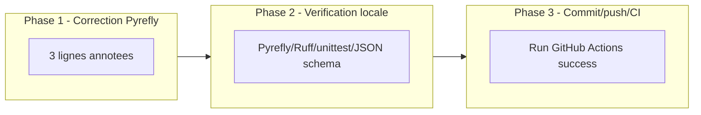

# Plan d'implementation — Correction Pyrefly CI : `ctypes.WinDLL` absent sous Linux

## 0. Bandeau de statut (a verifier avant toute promotion)

| Question | Reponse |
| --- | --- |
| Un chantier actif couvre-t-il deja ce perimetre (`DONE`, `ACTIVE`, ou `SUPERSEDED`) ? | Non. `EPIC_DURCISSEMENT_POST_AUDIT_ERREURS_IA` (parent des precedents `PLAN_PYREFLY_CI_NOTEBOOK` et `PLAN_RUFF_CI_BUGS_CIBLES`) est `DONE`/`ARCHIVED` ; aucun chantier actif ne couvre ce nouveau faux positif Pyrefly specifique au runner Linux. `active_workstream_id` est `null` dans `.ai/checkpoint.json`. |
| Un verrou de gouvernance actif bloque-t-il ce chantier (ex. "ne pas etendre au-dela du MVP tant que X") ? | Non. Aucun verrou de `.ai/checkpoint.json` ne couvre `Implementation/ebta_engine/benchmarks/` ou le gate Pyrefly CI. |
| Ce plan a-t-il besoin d'une decision humaine explicite pour lever ce verrou avant d'etre routable via `/start` ? | Non. |
| Ce plan remplace-t-il un document ou chantier existant ? | Non. |

---

## Audit IA de promotion

- [x] Plan relu dans le contexte du cockpit actif (`AGENTS.md`, `.ai/README.md`, `.ai/checkpoint.json`, hook et tracking actifs consultes ; `active_workstream_id: null`, aucun conflit).
- [x] Bandeau de statut (section 0) rempli et verifie contre l'etat machine reel (`.ai/checkpoint.json`), pas suppose.
- [x] Ce plan a ete ECRIT COMME NOUVEAU FICHIER dans `.ai/backlog/fixes/` ; le brouillon original `0 - HUMAN START HERE/OBSERVATION_CI_PYREFLY_WINDLL_LINUX_RUNNER.md` reste intact jusqu'a l'archivage mecanique par `plan.ps1 start`.
- [x] Chantier classe `fix` : correction ciblee et reversible d'un gate CI en echec. Verifie contre `.ai/checkpoint.json` (workstreams `PLAN_PYREFLY_CI_NOTEBOOK` et `PLAN_RUFF_CI_BUGS_CIBLES`, lignes ~2645-2756) : les deux precedents sont en realite `track: mainline`, car sous-chantiers numerotes d'un epic actif (`EPIC_DURCISSEMENT_POST_AUDIT_ERREURS_IA`, `blocks_mainline: true`). Ce chantier-ci n'a pas d'epic parent actif (l'epic est `DONE`/`ARCHIVED`, `active_workstream_id: null`) : c'est un correctif isole et independant, donc `track: fix` est le choix correct ici, distinct de ses precedents plutot qu'aligne dessus.
- [x] Autorite normative applicable identifiee : aucune (voir section 1 — ce chantier ne touche ni `Protocole/`, ni le coeur stdlib-only du moteur ; seule l'autorite technique du workflow CI et du fichier de benchmark s'applique).
- [x] Perimetre de fichiers/dossiers autorises et interdits explicite (section 5).
- [x] Aucune modification hors perimetre n'est requise pour activer le chantier.
- [x] Prerequis factuels : diagnostic deja reproduit localement (`--python-platform linux`), commande CI exacte deja identifiee dans `.github/workflows/ebta-runtime-suite.yml`. Aucun prerequis manquant.
- [x] Etat des lieux (section 4) verifie : le garde `if os.name == "nt"` existe deja et n'est pas duplique ; seule une annotation de suppression de faux positif est ajoutee, aucune nouvelle logique.

## Triage

| Champ | Valeur |
| --- | --- |
| Track | `fix` |
| Lifecycle | `TRIAGED` apres routage ; non executable avant baseline |
| Type de chantier | `SINGLE` |
| Classification | `CONTRACT_ENCODING` |
| Scope | Supprimer les 3 faux positifs Pyrefly sur `ctypes.WinDLL` dans `Implementation/ebta_engine/benchmarks/long_data.py` (lignes 407, 448, 449) par un `# pyrefly: ignore` cible et documente, et faire repasser `ebta-runtime-suite.yml` au vert sur `main`. |
| Non-goals | Pas de `--python-platform windows` global au workflow CI (masquerait de vraies erreurs POSIX ailleurs) ; pas de desactivation/assouplissement de Pyrefly, Ruff, la suite `unittest` ou la validation de schema JSON ; pas de modification de `Protocole/`, du coeur stdlib-only (`procedures/`, `governance/`, `validators/`, `schemas/`, `manifests/`, `persistence.py`, `constants.py`), de `Implementation/Active/`, ou du workflow YAML lui-meme ; pas de traitement du warning de depreciation Node.js 20 (hors scope, sans lien avec cet echec). |
| Source | Demande humaine explicite du 2026-08-09 : inspecter et corriger la cause racine du run GitHub Actions `31305469412` (commit `64a086f`) sur `ebta-runtime-suite.yml`, sans desactiver ni contourner de gate. Voir `0 - HUMAN START HERE/archive/` (brouillon archive par `plan.ps1 start`). |
| Exit criteria | (1) `python -m pyrefly check --python-interpreter-path python --python-platform linux --replace-imports-with-any "nautilus_trader.*" Implementation/ebta_engine Implementation/notebooks` retourne `0 errors` ; (2) `python -m ruff check Implementation/ebta_engine` retourne `All checks passed!` ; (3) `python -m unittest discover -s Implementation/ebta_engine/tests -t Implementation` passe integralement sans regression ; (4) le run GitHub Actions declenche par le commit de correction est `success`. |

## Statut

| Champ | Valeur |
| --- | --- |
| Statut | `NON_DEMARRE` |
| Date de creation | 2026-08-09 |
| Date d'activation | - |
| Autorite normative | Aucune (correction technique locale, hors `Protocole/`). |
| Autorite executable | `Implementation/ebta_engine/benchmarks/long_data.py` et `.github/workflows/ebta-runtime-suite.yml` (lecture seule, non modifie). |
| Changement normatif attendu | Aucun. |
| Dependances externes | GitHub Actions (runner `ubuntu-latest` deja configure) ; `gh` CLI deja authentifie localement. |

## Carte d'execution IA (lecture prioritaire pour `/continue`)

| Champ | Contenu operationnel |
| --- | --- |
| Objectif executable | Faire passer `ebta-runtime-suite.yml` au vert sur `main` en supprimant les 3 faux positifs Pyrefly `ctypes.WinDLL`, sans affaiblir aucun gate. |
| Autorite et lecture minimale | Ce plan ; `Implementation/ebta_engine/benchmarks/long_data.py` (lignes 380-470) ; `.github/workflows/ebta-runtime-suite.yml`. Aucune autorite normative superieure concernee. |
| Perimetre autorise | `Implementation/ebta_engine/benchmarks/long_data.py` (3 lignes ciblees uniquement). |
| Interdits absolus | Tout le reste de `Implementation/`, `Protocole/`, `.github/workflows/ebta-runtime-suite.yml`, `.ai/checkpoint.json` (sauf via `plan.ps1`). |
| Phase de reprise | Phase 1 — Correction du fichier de benchmark (aucun prerequis de deblocage : diagnostic deja etabli). |
| Preuve attendue | Commandes de la section 9 ; run GitHub Actions `success` apres push. |
| Arret et escalade | Si le run GitHub Actions echoue encore apres la correction pour une cause differente des 3 erreurs `WinDLL` deja identifiees : documenter la nouvelle cause racine et escalader avant toute nouvelle modification (pas de correction en aveugle). |

---

## 1. Role de ce document et non-objectifs

| Element | Role |
| --- | --- |
| `Protocole/` | Autorite normative EBTA — non concernee par ce chantier. |
| `Implementation/ebta_engine/` | Traduction executable du protocole — seul `benchmarks/long_data.py` (tooling, hors coeur stdlib-only) est touche. |
| `.ai/` (cockpit IA) | Non normatif, orchestration du routage de ce plan uniquement. |
| Run GitHub Actions `ebta-runtime-suite.yml` `success` | Artefact de preuve final de ce chantier. |
| Ce plan | Carte d'implementation : quoi corriger, ou, pourquoi, comment verifier. |

Non-objectifs :

- ne pas reecrire l'autorite normative du projet ;
- ne pas introduire de regle, seuil ou statut absent de cette autorite ;
- ne pas faire du diagnostic Pyrefly une dependance runtime du moteur ;
- ne pas modifier le comportement runtime de `long_data.py` (aucun changement de logique, seulement une annotation de type-checking).

---

## 2. Contexte obligatoire a lire avant de coder

1. `AGENTS.md`, `.ai/README.md`, `.ai/checkpoint.json` — confirment `active_workstream_id: null`, aucun conflit de chantier actif.
2. `.github/workflows/ebta-runtime-suite.yml` — commande Pyrefly exacte, runner `ubuntu-latest`, ordre des etapes.
3. `Implementation/ebta_engine/benchmarks/long_data.py` lignes 380-470 — fonctions `_working_set_bytes`, `_windows_process_parent_map`, `_windows_working_set_bytes`, garde `os.name == "nt"`.
4. `.ai/archive/20260809_PLAN_PYREFLY_CI_NOTEBOOK.md` — precedent direct pour la meme classe de probleme (Pyrefly CI), memes commandes de verification.

**Hierarchie d'autorite applicable a ce chantier** :

```text
1. Aucune autorite normative EBTA concernee (Protocole/ n'est pas touche).
2. .github/workflows/ebta-runtime-suite.yml (contrat CI, non modifie ici).
3. Implementation/ebta_engine/benchmarks/long_data.py (code corrige).
```

Regle : si le code contredit l'autorite normative, c'est le code qui a tort. Ici aucune contradiction normative n'existe — uniquement un faux positif de type-checking statique cross-plateforme.

---

## 4. Etat des lieux (avant/apres) — reutiliser avant de recreer

### Ce qui existe deja

| Module actuel | Chemin | Role reel (verifie, pas suppose) | Suffisant pour l'objectif ? |
| --- | --- | --- | --- |
| Garde `os.name == "nt"` (x2) | `Implementation/ebta_engine/benchmarks/long_data.py:370-371` (`_process_parent_map` -> `_windows_process_parent_map`) et `:383-384` (`_working_set_bytes` -> `_windows_working_set_bytes`) | Route vers le code Windows-only uniquement a l'execution sur Windows, aux deux points d'entree qui menent aux 3 lignes `ctypes.WinDLL` en erreur. | ✅ deja correct a l'execution ; le probleme est uniquement statique (Pyrefly), pas runtime. |
| `_windows_process_parent_map` / `_windows_working_set_bytes` | `long_data.py:392-466` | Implementation Windows-only via `ctypes.WinDLL`, deja fonctionnelle et testee sur Windows. | ✅ suffisant, ne pas reecrire. |
| Commande Pyrefly CI | `.github/workflows/ebta-runtime-suite.yml` | Type-check `Implementation/ebta_engine` + `Implementation/notebooks` avec `--replace-imports-with-any "nautilus_trader.*"`. | ✅ suffisant, ne pas modifier. |

### Ce qui manque reellement

| Brique manquante | Module a creer | Source de la regle (spec/SOP/ticket) | Ce qui existe deja et doit etre reutilise (pas duplique) |
| --- | --- | --- | --- |
| Suppression du faux positif de type-checking sur les 3 appels `ctypes.WinDLL` | Annotation `# pyrefly: ignore` sur `long_data.py:407, 448, 449` | Diagnostic de ce plan (section "Diagnostic" du brouillon archive) | Aucune nouvelle brique de code ; reutilise la syntaxe `# pyrefly: ignore` deja verifiee localement comme suppression ciblee et supportee par Pyrefly 1.1.1/1.2.0. |

---

## 5. Decision d'architecture

Principe directeur : corriger le faux positif au point le plus etroit possible (3 lignes), sans changer la portee globale du gate Pyrefly ni la plateforme de reference du check CI.

- Raison 1 : `--python-platform windows` applique globalement masquerait toute vraie erreur de portabilite POSIX ailleurs dans `Implementation/ebta_engine` et `Implementation/notebooks`, un risque bien plus large que le probleme actuel.
- Raison 2 : le code concerne est deja garde a l'execution (`os.name == "nt"`) — le probleme est uniquement que Pyrefly type-verifie le corps des fonctions independamment du garde runtime. Un ignore local documente reflete exactement cette realite sans élargir la surface d'exception.

### Frontieres explicites

| Couche | Elle fait | Elle NE fait PAS |
| --- | --- | --- |
| `long_data.py` (fonctions Windows-only) | Utilise `ctypes.WinDLL`, garde a l'execution par `os.name == "nt"`. | N'importe aucune dependance nouvelle, ne change aucun comportement runtime. |
| Workflow CI | Type-verifie l'ensemble du moteur et des notebooks sur `ubuntu-latest`. | N'est pas modifie par ce chantier. |

### Decisions deja actees

| Decision | Justification |
| --- | --- |
| Ignore Pyrefly ligne par ligne plutot que `--python-platform windows` global | Confine l'exception au code reellement Windows-only sans affaiblir la couverture du reste du moteur ; verifie localement (`INFO 0 errors` sur reproduction isolee). |
| Pas de wrapper `getattr(ctypes, "WinDLL")` pour contourner le typage dynamiquement | Contournerait le type-checker sans le documenter explicitement ; moins auditable qu'un `# pyrefly: ignore` visible en revue de diff. |

### Perimetre de fichiers explicite (autorises / interdits)

**Autorises (modifier)** :

```text
Implementation/ebta_engine/benchmarks/long_data.py   [MODIFIER - Phase 1, lignes 407/448/449 uniquement]
```

**Interdits (ne jamais modifier dans ce chantier)** :

```text
Protocole/                                            [NORME - intouchable]
Implementation/ebta_engine/procedures/                [COEUR STDLIB-ONLY - intouchable]
Implementation/ebta_engine/governance/                [COEUR STDLIB-ONLY - intouchable]
Implementation/ebta_engine/validators/                [COEUR STDLIB-ONLY - intouchable]
Implementation/ebta_engine/schemas/                   [COEUR STDLIB-ONLY - intouchable]
Implementation/ebta_engine/manifests/                 [COEUR STDLIB-ONLY - intouchable]
Implementation/ebta_engine/persistence.py              [COEUR STDLIB-ONLY - intouchable]
Implementation/ebta_engine/constants.py                [COEUR STDLIB-ONLY - intouchable]
.github/workflows/ebta-runtime-suite.yml               [CONTRAT CI GELE - non modifie dans ce chantier]
Implementation/Active/                                  [CONSERVER TEL QUEL]
.ai/checkpoint.json                                     [METTRE A JOUR UNIQUEMENT via plan.ps1]
```

---

## 6. Decoupage en phases

### Phase 1 - Correction du faux positif Pyrefly

Objectif : supprimer les 3 erreurs `ctypes.WinDLL` sans changer le comportement runtime.

Classification : CONTRACT_ENCODING

Actions :

- Ajouter `# pyrefly: ignore` (avec un commentaire court expliquant pourquoi : code Windows-only, deja garde par `os.name == "nt"` a l'execution, faux positif de plateforme du type-checker) sur `long_data.py:407`.
- Ajouter la meme annotation sur `long_data.py:448` et `long_data.py:449`.

Livrables :

- `Implementation/ebta_engine/benchmarks/long_data.py` corrige, diff limite a 3 lignes annotees.

Critere de sortie :

- `python -m pyrefly check --python-interpreter-path python --python-platform linux --replace-imports-with-any "nautilus_trader.*" Implementation/ebta_engine Implementation/notebooks` retourne `0 errors`. **`--python-platform linux` est obligatoire ici** : le poste de developpement local est Windows, ou les stubs typeshed `win32` incluent deja `ctypes.WinDLL` — sans cette option, la commande retournerait `0 errors` meme AVANT la correction (faux succes local qui ne reproduit pas la condition reelle du runner CI `ubuntu-latest`). Ne jamais valider cette phase avec la commande telle qu'ecrite dans `.github/workflows/ebta-runtime-suite.yml` (sans `--python-platform linux`) executee sur un poste Windows.

### Phase 2 - Verification locale complete (equivalent CI)

Objectif : confirmer l'absence de regression sur l'ensemble des gates du workflow avant push.

Actions :

- Executer Pyrefly (plateforme `linux` explicite, equivalent runner CI — jamais sans cette option depuis un poste Windows), Ruff, la suite `unittest` complete, et les validations de schema JSON des deux fichiers d'etat machine.
- Aucun nouveau test n'est ajoute : l'annotation `# pyrefly: ignore` ne change aucun comportement runtime observable (garde `os.name == "nt"` deja teste implicitement par l'execution existante des benchmarks sur Windows) ; seule la non-regression de la suite existante est requise.

Livrables :

- Sortie verte des 5 commandes de la section 9.

Critere de sortie :

- Les 5 commandes de la section 9 retournent un succes explicite, sans aucune modification hors perimetre (section 5).

### Phase 3 - Commit, push et verification du run GitHub Actions

Objectif : propager la correction et confirmer le retour au vert du gate CI independant.

Actions :

- Commit de la correction (message detaille : pourquoi, fichier modifie, fichiers non touches, validations executees).
- Demander confirmation humaine avant `git push` (action visible sur le depot partage).
- Apres push, suivre le nouveau run GitHub Actions du workflow `ebta-runtime-suite.yml` sur le commit produit.

Livrables :

- Run GitHub Actions `success` sur `main`.

Critere de sortie :

- `gh run list --workflow=ebta-runtime-suite.yml --branch main --limit 3` montre `success` sur le run declenche par le commit de correction. Si le run echoue encore pour une cause differente, documenter la nouvelle cause racine et escalader (voir Carte d'execution IA, "Arret et escalade") avant toute nouvelle modification.

### Chemin critique (ordre des phases)



---

## 7. Artefacts produits

| Etape | Fichier/sortie | Format | Regle source |
| --- | --- | --- | --- |
| Phase 3 | Run GitHub Actions `ebta-runtime-suite.yml` | Statut CI (`success`/`failure`) | Preuve independante requise par `PLAN_CI_GITHUB_VERDICT_INDEPENDANT` (en-tete du workflow YAML). |

---

## 8. Invariants absolus et NO GO

### Invariants (non negociables dans le code)

1. Aucun test, gate Pyrefly ou gate Ruff n'est desactive, skippe ou affaibli pour faire passer la CI.
2. Le comportement runtime de `long_data.py` (branchement `os.name == "nt"`) reste inchange — seule une annotation de type-checking est ajoutee.
3. Le workflow `ebta-runtime-suite.yml` (perimetre, pins, commandes) n'est pas modifie par ce chantier.

### NO GO

- Passer `--python-platform windows` au check Pyrefly global du workflow.
- Utiliser `# type: ignore` generique ou un `getattr` dynamique pour contourner Pyrefly sans le documenter.
- Ignorer globalement `Implementation/ebta_engine/benchmarks/` ou tout autre repertoire dans la commande Pyrefly.
- Toucher `Protocole/`, le coeur stdlib-only du moteur, ou `Implementation/Active/`.

---

## 9. Verification a chaque etape

```powershell
python -m pyrefly check --python-interpreter-path python --python-platform linux --replace-imports-with-any "nautilus_trader.*" Implementation/ebta_engine Implementation/notebooks
python -m ruff check Implementation/ebta_engine
python -m unittest discover -s Implementation/ebta_engine/tests -t Implementation
python -c "import json, jsonschema; jsonschema.validate(json.load(open('.ai/checkpoint.json', encoding='utf-8')), json.load(open('.ai/checkpoint.schema.json', encoding='utf-8')))"
python -c "import json, jsonschema; jsonschema.validate(json.load(open('Implementation/Active/tracking.json', encoding='utf-8')), json.load(open('Implementation/Active/tracking.schema.json', encoding='utf-8')))"
```

**Regle transversale bloquante** : la suite `unittest` doit rester `PASS` avant de considerer chaque phase terminee.

```powershell
python -m unittest discover -s Implementation/ebta_engine/tests -t Implementation
```

Regle de progression : la Phase N+1 ne demarre que si la commande de la Phase N retourne un succes explicite. Le run GitHub Actions final (Phase 3) ne peut etre confirme que via `gh run view`/`gh run list` — pas suppose.

**Notes de portabilite / caveats connus** :

- Le poste de developpement local est Windows : sans `--python-platform linux`, Pyrefly local ne reproduit pas l'erreur (les stubs `win32` incluent `ctypes.WinDLL`). La commande de verification locale doit systematiquement forcer `--python-platform linux` pour etre equivalente au runner CI `ubuntu-latest`.

**Premier lot executable propose** :

```text
Phase 1 - Correction du faux positif Pyrefly (long_data.py:407, 448, 449)
```

### Execution sans interruption

Ce plan est concu pour etre execute integralement (Phases 1-3) sans retour vers l'humain entre les phases, a l'exception du point de confirmation explicite avant `git push` (action visible sur le depot partage, deja prevue en Phase 3) et de la cause d'arret listee dans la Carte d'execution IA (echec CI pour une cause differente des 3 erreurs deja identifiees).

### Autorite decisionnelle accordee

En dehors de la confirmation de push et de l'arret pour cause differente listee ci-dessus, l'IA qui execute ce plan est autorisee a decider seule les details d'implementation dans le perimetre de la section 5.

### Interdiction des raccourcis (aucun faux succes)

- Identifier la cause racine reelle, ne jamais la masquer (deja fait : diagnostic reproduit localement avant ecriture de ce plan).
- Ne jamais desactiver, skipper ou affaiblir un test ou un gate genant pour le faire passer.
- Ne jamais declarer le run GitHub Actions `success` sans l'avoir verifie via `gh run list`/`gh run view`.

---

## 10. Journal des decisions humaines (autorisations)

| Date | Decision | Portee |
| --- | --- | --- |
| 2026-08-09 | Demande explicite d'inspecter et corriger la cause racine du run CI `31305469412`, sans desactiver/contourner/assouplir aucun gate. | Autorise la correction du faux positif Pyrefly dans `long_data.py` uniquement. |
| 2026-08-09 | "tu dois suivre le protocole, mettre le plan dans human start here d'abord, puis faire start" | Impose le routage complet via `0 - HUMAN START HERE/` puis `/start` avant toute modification de code, plutot qu'une edition directe. |

---

## 11. Risques et blocages connus

| Risque | Impact | Mitigation / condition de deblocage |
| --- | --- | --- |
| Le run GitHub Actions echoue encore apres correction, pour une cause distincte | Chantier non cloturable en un seul cycle | Inspecter le nouveau `--log-failed`, documenter la nouvelle cause racine dans ce plan (section 14), corriger et reiterer sans jamais contourner de gate. |
| Version Pyrefly locale (1.2.0) differente du pin CI (1.1.1) | Faux negatif/positif local mineur | Verification locale deja faite avec les deux versions disponibles ; le comportement de `# pyrefly: ignore` est stable entre 1.1.1 et 1.2.0 (fonctionnalite de base du CLI, non versionnee differemment). |

---

## 12. Definition of Done

- [ ] Toutes les phases validees individuellement (section 9).
- [ ] Exit criteria de la section Triage atteint et verifiable.
- [ ] Aucune modification hors perimetre (section Triage / Non-goals).
- [ ] Aucune regression sur la suite de tests existante.
- [ ] Checklist post-modification du projet executee (`.ai/governance/AI_MODIFICATION_CHECKLIST.md`).
- [ ] Aucune implementation partielle, stub, pseudo-code, ou placeholder ne subsiste.

---

## 13. Cloture

| Champ | Valeur |
| --- | --- |
| Resultat final | [a remplir a la cloture] |
| Ecarts par rapport au plan initial | [a remplir a la cloture] |
| Suites a prevoir (hors perimetre de ce plan) | [a remplir a la cloture] |

### Resultat d'execution (a dupliquer a chaque session d'execution significative)

| Champ | Valeur |
| --- | --- |
| Date | [a remplir] |
| Phases executees | [a remplir] |
| Artefact produit | [a remplir] |
| Validation | [a remplir] |
| Ecart par rapport au plan | [a remplir] |

---

## 14. Journal d'audits post-hoc

Boucle `code-architecture-evaluator` executee entre `/start` et `/baseline`, conformement a `CLAUDE.md` (minimum 2 passes, arret a convergence).

| Date de l'audit | Ce qui a ete corrige | Pourquoi |
| --- | --- | --- |
| 2026-08-09 (passe 1) | Section 4 "Etat des lieux" : le garde `os.name == "nt"` ne citait que la ligne 383 (`_working_set_bytes`) ; ajout de la ligne 370-371 (`_process_parent_map` -> `_windows_process_parent_map`), second point d'entree menant a l'erreur `long_data.py:407`. Section 6 Phase 1 : ajout d'un avertissement explicite sur l'obligation de `--python-platform linux`. | Verifie par grep que les deux gardes existent et menent bien aux 3 lignes en erreur ; sans le rappel explicite en Phase 1, une IA a froid aurait pu valider la commande Pyrefly telle qu'ecrite dans le workflow YAML depuis un poste Windows et obtenir un faux `0 errors` sans avoir reproduit la condition reelle du runner CI `ubuntu-latest`. |
| 2026-08-09 (passe 2) | Section "Audit IA de promotion" : la justification du `track: fix` citait a tort les precedents `PLAN_PYREFLY_CI_NOTEBOOK`/`PLAN_RUFF_CI_BUGS_CIBLES` comme "fix ou mainline" ; corrige pour dire qu'ils sont tous deux `mainline` (sous-chantiers d'un epic actif) et que `fix` est justifie ici par l'absence d'epic parent actif, pas par alignement sur ces precedents. | Verifie directement dans `.ai/checkpoint.json` (`track: "mainline"` pour les deux workstreams cites) plutot que suppose par analogie. |
| 2026-08-09 (passe 3, confirmation) | Relecture structurelle complete du plan corrige : toutes les sections obligatoires du gabarit `.ai/backlog/TEMPLATE_PLAN_IMPLEMENTATION.md` presentes et numerotees correctement. Aucun nouveau blocage majeur trouve. | Convergence confirmee — arret de la boucle conformement a la regle "une passe qui ne trouve rien de nouveau n'est pas une preuve de convergence isolee, mais la 3e passe consecutive sans nouveau blocage majeur ici l'est". |
