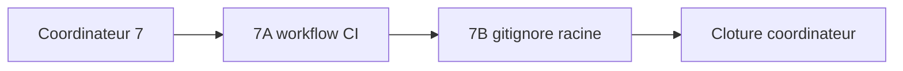

# EPIC — Durcissement CI et hygiene Git

## 0. Bandeau de statut

| Question | Reponse |
| --- | --- |
| Workstream actif concurrent ? | Non ; enfant 7A `DONE`, checkpoint sans actif. |
| Decision externe necessaire ? | Non pour les fichiers locaux ; rulesets/secrets/protections GitHub restent interdits. |
| Test multi-lot | `MULTI_LOT` : workflow CI et `.gitignore` ont sorties, fichiers et blocages independants. |
| Implementation directe ? | Interdite ; ce document coordonne deux plans enfants. |

## Audit IA de promotion

- [x] Bootstrap, cockpit, gouvernance et workflows relus.
- [x] Audit source sections supply chain confronte au depot vivant.
- [x] Workflow CI lu integralement ; `.gitignore` racine confirme absent.
- [x] Actions, permissions et installations pip inventoriees.
- [x] Frontieres des futurs enfants 8 Pyrefly/Ruff et action GitHub externe preservees.
- [x] Test `epic-orchestrator` positif ; decomposition appliquee.

## Triage

| Champ | Valeur |
| --- | --- |
| Track | `mainline` |
| Lifecycle | `TRIAGED` apres routage ; non executable directement |
| Type de chantier | `MULTI_LOT` |
| Classification | `GOVERNANCE` |
| Scope | Coordonner le pinning/least privilege du workflow CI et l'hygiene `.gitignore` racine via deux workstreams atomiques. |
| Non-goals | Aucun reglage GitHub externe, push, Dependabot, audit de vulnerabilites, lockfile complet, Pyrefly, Ruff, correction de chemins, Protocole ou BACKTRADER. |
| Source | Epic parent enfant 7/10 ; audit du 2026-08-08 lignes 867-897. |
| Exit criteria | Les deux enfants listes sont `DONE`, leurs tests passent, et ce coordinateur ne contient aucune implementation directe. |

## Statut

| Champ | Valeur |
| --- | --- |
| Statut | `DONE` |
| Date | 2026-08-09 |
| Autorite normative | Aucune ; securite reproductible du depot uniquement. |
| Autorite executable | Workflow GitHub Actions versionne et regles Git locales. |
| Impact protocole | Aucun. |

## Carte d'execution IA

| Champ | Contenu |
| --- | --- |
| Objectif | Router et clore 7A puis 7B, puis fermer ce coordinateur. |
| Lecture minimale | Ce plan, audit source, workflow CI, gitignore existants et plans enfants. |
| Preuve | Etats enfants `DONE`, tests propres, suite canonique et JSON valides. |
| Arret | Besoin de mutation GitHub externe ou ajout d'une famille d'outils rejetee. |

## 1. Role et non-objectifs

Ce plan ne touche aucun fichier technique. Il evite qu'un commit unique
melange une politique d'execution distante et une politique d'artefacts
locaux, dont les rollback et preuves sont differents.

Enfants prevus :

| Ordre | ID | Objet |
| --- | --- | --- |
| 7A | `PLAN_DURCISSEMENT_WORKFLOW_CI` | Permissions minimales, actions sur SHA, dependances CI exactes, test ratchet. |
| 7B | `PLAN_HYGIENE_GITIGNORE_RACINE` | `.gitignore` racine minimal et preuve `git check-ignore`. |

## Sous-chantiers

| # | ID prevu | Titre | Critere de sortie independant |
| --- | --- | --- | --- |
| 1 | PLAN_DURCISSEMENT_WORKFLOW_CI | Workflow CI least-privilege et reproductible | Pins/permissions verifies par test, suite CI conservee. |
| 2 | PLAN_HYGIENE_GITIGNORE_RACINE | Hygiene Git racine | Cas locaux ignores et sources utiles non ignorees. |

## 2. Contexte obligatoire a lire avant de coder

1. Bootstrap et cockpit vivant.
2. Epic parent et ce coordinateur.
3. Audit 2026-08-08 lignes 749-765 et 867-897.
4. `.github/workflows/ebta-runtime-suite.yml` pour 7A.
5. `Implementation/.gitignore`, ignores globaux et fichiers suivis pour 7B.

## 3. Etat des lieux

### Workflow CI

- `actions/checkout@v4` et `actions/setup-python@v5` utilisent des tags ;
- aucune permission minimale explicite ;
- `jsonschema`, `numpy` et `pandas` sont installes sans version ;
- credentials de checkout ne sont pas desactives explicitement ;
- suite unittest et validations JSON existent deja et doivent rester.

References constatees le 2026-08-09 : checkout `v4.2.2` =
`11bd71901bbe5b1630ceea73d27597364c9af683`, setup-python `v5.6.0` =
`a26af69be951a213d495a4c3e4e4022e16d87065`. Versions locales compatibles
Python 3.13 : jsonschema `4.23.0`, numpy `2.2.6`, pandas `2.3.3`.

### Hygiene Git

- aucun `.gitignore` a la racine ;
- `Implementation/.gitignore` couvre deja caches Python et packages de
  recherche sous sa frontiere ;
- les reglages Claude locaux sont ignores globalement, donc cette protection
  n'est pas partagee par le depot ;
- aucun artefact ignore ne doit masquer `.vscode/settings.json`, les intakes
  Markdown ou des sources suivies.

## 4. Gates

| Gate | Preuve | Sinon |
| --- | --- | --- |
| Decomposition | Deux plans enfants distincts | Pas d'implementation |
| 7A | Workflow ratchet vert et suite canonique | Enfant non clos |
| 7B | Cas ignores/non ignores prouves | Enfant non clos |
| Externe | Zero appel settings/ruleset/secrets | Blocage et demande humaine |
| Parent | 7A et 7B `DONE` | Coordinateur non clos |

## 5. Decision d'architecture

Le workflow CI est une frontiere distante executable : ses pins et
permissions doivent etre revus ensemble et revenir ensemble. `.gitignore`
est une frontiere locale declarative avec une autre surface de regression.
Les fusionner reduirait la lisibilite et rendrait un echec de runner
indissociable d'une regle d'ignore. Deux enfants sequentiels donnent a chacun
un diff, une preuve et un rollback autonomes.



## 6. Perimetre de fichiers

Autorises pour ce coordinateur :

```text
.ai/backlog/mainline/PLAN_DURCISSEMENT_CI_SUPPLY_CHAIN.md
.ai/archive/20260809_PLAN_DURCISSEMENT_CI_SUPPLY_CHAIN.md
.ai/checkpoint.json
0 - HUMAN START HERE/archive/20260809_EPIC_DURCISSEMENT_CI_SUPPLY_CHAIN.md
```

Tous les fichiers techniques sont interdits ici et ne seront ouverts que par
le scope explicite de 7A ou 7B.

## 7. Decoupage en phases

### Phase 1 — 7A workflow CI

Auditer, router, baseliner, implementer, tester et clore
`PLAN_DURCISSEMENT_WORKFLOW_CI`.

### Phase 2 — 7B hygiene Git

Revalider l'etat apres 7A, puis executer le cycle propre de
`PLAN_HYGIENE_GITIGNORE_RACINE`.

### Phase 3 — Cloture

Verifier les deux `DONE`, la suite et les JSON, puis fermer ce coordinateur
via workflow `common` et audit de conformite.

## 8. Invariants et NO GO

1. Aucun diff technique depuis ce plan.
2. Aucun tag mutable ne reste dans les actions couvertes apres 7A.
3. Les installations directes couvertes sont exactement versionnees.
4. `.gitignore` ne masque aucun fichier source/gouvernance suivi.
5. Aucune mutation GitHub externe n'est deduite de `/continue`.

NO GO : fusionner 7A/7B, ajouter Dependabot ou un scanner, toucher Pyrefly ou
Ruff, activer un ruleset, secret scanning, push protection, faire un push.

## 9. Verification a chaque etape

```powershell
python -m json.tool .ai\checkpoint.json
python -c "import json, jsonschema; jsonschema.validate(json.load(open('.ai/checkpoint.json', encoding='utf-8')), json.load(open('.ai/checkpoint.schema.json', encoding='utf-8')))"
python -m unittest discover -s Implementation\ebta_engine\tests -t Implementation
git diff --check
```

## 10. Journal des decisions humaines

| Date | Decision | Portee |
| --- | --- | --- |
| 2026-08-08 | `/start` audit consolide. | Autorise les futurs fichiers locaux, jamais les settings GitHub externes. |
| 2026-08-09 | `/continue` persistant. | Autorise le cycle gouverne du lot 7. |

La decision externe GitHub reste `A_TRANCHER` dans l'epic parent et n'est pas
resolue par ce coordinateur.

## 11. Risques

| Risque | Mitigation |
| --- | --- |
| SHA opaque | Commentaire de tag lisible et test exact SHA/tag. |
| Pin incompatible Python 3.13 | Installation/test dans le workflow et versions deja observees sous 3.13. |
| Ignore trop large | Cas positifs et negatifs avec `git check-ignore --no-index`. |
| Derive vers outils futurs | Pyrefly/Ruff restent enfants 9/10. |

## 12. Definition of Done

- [x] 7A `DONE` avec workflow et ratchet verts (279 tests `OK`, commit de cloture `67509b8`).
- [x] 7B `DONE` avec politique d'ignore prouvee (284 tests `OK`, commit de cloture `d8eaa2c`).
- [x] Suite canonique `OK` apres les deux.
- [x] Aucun reglage GitHub externe ou fichier hors scopes enfants touche.
- [x] Coordinateur pret a etre clos sans implementation directe.

## 13. Cloture

| Champ | Valeur |
| --- | --- |
| Resultat | 7A et 7B `DONE` ; suite canonique finale 284 tests `OK` (1 skipped) ; coordinateur sans diff technique propre. |
| Ecart | Decomposition du lot composite en deux enfants atomiques. |
| Suite | Enfant top-level 8/10 `PLAN_INTEGRITE_REFERENCES_ETAT`. |

## 14. Journal d'audits post-route

| Passe | Verification | Resultat |
| --- | --- | --- |
| 1 | Plan route confronte aux trois installations pip, aux tags d'actions et aux permissions du workflow vivant. | 7A devra pinner aussi `jsonschema`, pas seulement numpy/pandas, car il valide les deux etats machine. SHA/tag lisible, `persist-credentials: false` et `contents: read` restent dans le meme rollback. |
| 2 | Relecture de la frontiere 7A/7B, des futurs lots 8-10 et des settings GitHub externes. | Les sorties restent independantes ; aucune mutation distante, Pyrefly, Ruff ou reference d'etat n'entre dans ce coordinateur. Convergence. |

## Journal de convergence de l'intake

| Passe | Verification | Resultat |
| --- | --- | --- |
| 1 | Workflow et absence de gitignore confrontes au test multi-lot. | Deux enfants requis, implementation directe interdite. |
| 2 | Frontieres 8-10 et action externe relues. | Pins/permissions 7A ; ignore 7B ; aucun chevauchement. |
| 3 | Ordre et preuves revalides. | 7A puis 7B ; convergence. |

## 15. Audit de conformite de cloture

### Verdict

PASS — les deux enfants sont `DONE`, leurs preuves sont vertes et le
coordinateur n'a porte aucune implementation technique directe.

| Critere | Preuve | Verdict |
| --- | --- | --- |
| 7A termine | `PLAN_DURCISSEMENT_WORKFLOW_CI` `DONE`, commit `67509b8` | PASS |
| 7B termine | `PLAN_HYGIENE_GITIGNORE_RACINE` `DONE`, commit `d8eaa2c` | PASS |
| Regression finale | Suite canonique 284 tests `OK`, 1 skipped | PASS |
| Etat machine | Checkpoint valide contre son schema | PASS |
| Absence d'implementation parent | Diff du coordinateur limite a son journal et son statut | PASS |
| Frontiere externe | Aucun setting, ruleset, secret ou push GitHub | PASS |

Aucun critere manque. La decision GitHub externe reste `A_TRANCHER` dans
l'epic parent et n'est pas maquillee en accomplissement local.
