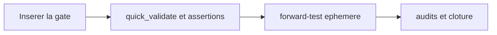

# Plan — Recherche des consommateurs contractuels pendant `/evaluate`

> Sous-chantier 1/3 de
> `EPIC_AMELIORATIONS_POST_RETROSPECTIVE_CI_NODE20`. Ce plan modifie un seul
> proprietaire existant et ne touche ni le protocole EBTA ni son runtime.

## 0. Bandeau de statut (a verifier avant toute promotion)

| Question | Reponse |
| --- | --- |
| Portee du chantier | `meta` — amelioration d'un skill d'audit d'architecture |
| Un chantier actif couvre-t-il deja ce perimetre ? | Non. Le parent est `BASELINED`, `active_workstream_id` vaut `null`, et aucun workstream ne porte l'ID de ce lot. |
| Un verrou de gouvernance actif bloque-t-il ce chantier ? | Non. Le parent autorise le cycle autonome du Lot 1; aucun dossier normatif ou runtime n'est touche. |
| Une decision humaine explicite est-elle requise avant routage ? | Non. `Je valide tes propositions`, puis `/continue`, autorisent ce cycle gouverne. |
| Ce plan remplace-t-il un chantier existant ? | Non. Il realise uniquement le sous-chantier 1/3 declare par le parent. |
| Resultat du test multi-lot | `SINGLE` : insertion de la gate puis validation/forward-test sont sequentiels et couverts par un seul Exit criteria. |

## Audit IA de promotion

- [x] Cockpit live, parent, gouvernance, workflow `common`, skill cible et
      consommateurs proceduraux lus.
- [x] Checkout verifie `behind 0` sur `origin/main`.
- [x] Brouillon source audite en place en deux passes `/evaluate` et converge.
- [x] Nature revalidee : amelioration `GOVERNANCE` d'un skill existant, pas
      nouveau contrat scientifique ni code runtime.
- [x] Validateur reel identifie et execute sur l'etat initial :
      `skill-creator/scripts/quick_validate.py` retourne `Skill is valid!`.
- [x] Perimetre ferme a un seul fichier modifiable.
- [x] Aucun fichier humain ou changement sans rapport ne sera absorbe.

## Triage

| Champ | Valeur |
| --- | --- |
| Track | `fix` |
| Lifecycle | `TRIAGED` |
| Type de chantier | `SINGLE` |
| Scope | Ajouter dans `code-architecture-evaluator/SKILL.md` une gate bloquante de recherche des producteurs, consommateurs et tests qui figent un workflow, une configuration, un schema, un manifeste ou autre contrat persiste avant de valider le plan audite. |
| Non-goals | Ne pas creer de skill, script ou test dans le depot; ne pas modifier les fichiers auxiliaires du dossier; ne pas specialiser la regle pour EBTA/CI/Node.js; ne pas modifier `Protocole/`, `Implementation/`, `.ai/workflows/` ou le checkpoint autrement que via `plan.ps1`; ne pas pousser. |
| Source | Sous-chantier 1/3 de `EPIC_AMELIORATIONS_POST_RETROSPECTIVE_CI_NODE20`, issu de la retrospective du correctif CI Node.js 20 et autorise par `/continue`. |
| Exit criteria | (1) La gate se declenche sur les familles de contrats enumerees. (2) Elle exige producteurs, lecteurs/appelants, validateurs, tests, fixtures, snapshots et CI, avec preuves citees. (3) Une recherche impossible interdit `VALIDE` sans incertitude explicite. (4) `quick_validate.py` retourne `Skill is valid!`. (5) Un forward-test montre la recherche du test contractuel avant conclusion. (6) Frontmatter valide, forme imperative, moins de 500 lignes. (7) Aucun fichier hors perimetre modifie. |

## Statut

| Champ | Valeur |
| --- | --- |
| Statut | `NON_DEMARRE` |
| Date de creation | 2026-08-09 |
| Date d'activation | `-` |
| Autorite normative | Aucune autorite scientifique touchee; le skill cible gouverne son propre comportement d'audit |
| Autorite executable | `.agents/skills/code-architecture-evaluator/SKILL.md` |
| Changement normatif attendu | Aucun |
| Dependances externes | Validateur local du skill systeme `skill-creator`; aucune dependance ajoutee |

## Carte d'execution IA (lecture prioritaire pour `/continue`)

| Champ | Contenu operationnel |
| --- | --- |
| Objectif executable | Inserer une gate concise de scan des consommateurs contractuels, puis la valider structurellement et comportementalement. |
| Autorite et lecture minimale | Ce plan; skill cible; `skill-creator/SKILL.md`; parent; consommateurs read-only `common/WORKFLOW.md` et `epic-orchestrator/SKILL.md`. |
| Perimetre autorise | `.agents/skills/code-architecture-evaluator/SKILL.md` uniquement. |
| Interdits absolus | Nouveau skill/script/test; edition des fichiers auxiliaires; specialisation EBTA; modification `Protocole/`, `Implementation/`, `.ai/workflows/`. |
| Phase de reprise | Phase 1 — inserer la gate dans le flux de travail existant. |
| Preuve attendue | `quick_validate.py`, compte de lignes < 500, assertions textuelles et forward-test documente. |
| Arret et escalade | Besoin de modifier un second fichier ou impossibilite d'obtenir un forward-test probant sans elargir le scope. |

## 1. Role de ce document et non-objectifs

| Element | Role |
| --- | --- |
| `code-architecture-evaluator/SKILL.md` | Proprietaire unique du comportement `/evaluate`; seul fichier modifiable. |
| `skill-creator/SKILL.md` | Regles de forme, concision et validation d'un skill; lecture seule. |
| `common/WORKFLOW.md` | Consommateur procedural qui impose `/evaluate`; lecture seule. |
| `epic-orchestrator/SKILL.md` | Consommateur procedural des doubles boucles; lecture seule. |
| Ce plan | Contrat d'execution et de preuve du Lot 1. |

Ce document ne recrit pas les workflows, ne cree pas de test permanent et ne
transforme pas l'incident CI particulier en instruction durable.

## 2. Contexte obligatoire a lire avant de coder

1. `AGENTS.md`, `.ai/README.md`, `.ai/checkpoint.json` et chemins actifs.
2. `.ai/workflows/common/WORKFLOW.md`.
3. `.ai/backlog/fixes/EPIC_AMELIORATIONS_POST_RETROSPECTIVE_CI_NODE20.md`.
4. `.agents/skills/code-architecture-evaluator/SKILL.md` en entier.
5. `C:/Users/liant/.codex/skills/.system/skill-creator/SKILL.md` et son
   `scripts/quick_validate.py`.
6. Consommateurs read-only trouves par `rg -n
   "code-architecture-evaluator|/evaluate" AGENTS.md .ai .agents`.

Hierarchie applicable :

```text
1. AGENTS.md et workflow common pour le cycle gouverne
2. Plan parent pour la frontiere parent/enfant
3. Ce plan enfant pour le scope du Lot 1
4. code-architecture-evaluator/SKILL.md pour le comportement modifie
5. skill-creator pour la forme et la validation du skill
```

## 3. Table des gates (points de decision sequentiels)

| Ordre | Gate | Question | Sortie si echec |
| --- | --- | --- | --- |
| G0 | Scope | Le diff est-il limite au seul `SKILL.md` cible ? | Arret et retour au plan |
| G1 | Contrat | La nouvelle regle couvre-t-elle toutes les familles et consommateurs declares ? | Corriger avant validation |
| G2 | Structure | Frontmatter valide, forme imperative, fichier sous 500 lignes ? | `quick_validate`/compte non-PASS |
| G3 | Comportement | Le forward-test inspecte-t-il un consommateur contractuel reel avant conclusion ? | Corriger le skill et rejouer |
| G4 | Audits | Bug-hunter applicable et conformite sans finding ouvert ? | Ne pas clore |

## 4. Etat des lieux (avant/apres) — reutiliser avant de recreer

### Ce qui existe deja

| Module actuel | Chemin | Role reel verifie | Suffisant ? |
| --- | --- | --- | --- |
| Analyse d'impact systematique | `SKILL.md`, section `ANALYSE D'IMPACT SYSTEMATIQUE` | Demande dependances cachees et couverture de tests pour chaque modification | Partiel : aucune gate de scan ni preuve citee |
| Checklist angles morts | `SKILL.md`, `DEPENDANCES INVERSEES` et `COUVERTURE DE TESTS` | Invite a examiner appels indirects et tests | Partiel : peut etre cochee sans recherche par symbole/valeur |
| Incertitude | `SKILL.md`, `ZERO HALLUCINATION` | Demande une clarification si le plan est flou | Partiel : ne traite pas l'impossibilite d'inspecter les consommateurs |
| Validateur | `skill-creator/scripts/quick_validate.py` | Verifie frontmatter, champs requis et nommage | Oui pour la structure, pas le comportement |

### Ce qui manque reellement

| Brique manquante | Module a modifier | Source | Reutilisation |
| --- | --- | --- | --- |
| Gate bloquante de consommateurs contractuels | `code-architecture-evaluator/SKILL.md` | Parent et incident CI source | Reutiliser les sections d'impact/tests; ne pas les dupliquer |
| Preuve comportementale | Forward-test ephemere documente dans ce plan | `skill-creator` | Aucun nouveau test permanent |

## 5. Decision d'architecture

Inserer une section courte apres l'extraction du plan et avant l'audit
critique. A ce moment, l'evaluateur connait a la fois le code et les contrats
proposes sans avoir encore porte de jugement; le scan peut donc corriger la
classification et le scope avant le rapport.

### Frontieres explicites

| Couche | Fait | Ne fait pas |
| --- | --- | --- |
| Gate ajoutee | Detecte les contrats cibles, cherche producteurs/consommateurs/preuves, bloque une validation non etayee | Imposer un outil unique ou une taxonomie EBTA |
| Rapport existant | Cite les impacts et rectifie le plan | Refaire silencieusement le scan sans en montrer les resultats |
| Validateur structurel | Verifie la forme du skill | Prouver son comportement |
| Forward-test | Prouve le comportement sur un cas reel | Modifier le depot ou devenir un test persistant |

### Contrat d'interface entre les couches

La gate produit des constats cites dans les sections existantes du rapport :
artefact contractuel, producteurs, consommateurs, preuves qui figent ses
valeurs, impact sur scope/classification et incertitude restante.

### Decisions deja actees

| Decision | Justification |
| --- | --- |
| Modifier seulement `SKILL.md` | Proprietaire unique; aucune duplication dans workflow ou docs auxiliaires |
| Formulation generique | Le probleme concerne tout contrat persiste, pas seulement GitHub Actions |
| Reutiliser quick_validate + forward-test | Structure et comportement exigent deux preuves complementaires |

### Structure cible

```text
.agents/skills/code-architecture-evaluator/
`- SKILL.md  # section gate ajoutee, reste < 500 lignes
```

### Perimetre de fichiers explicite (autorises / interdits)

Autorise :

```text
.agents/skills/code-architecture-evaluator/SKILL.md  MODIFIER
.ai/backlog/fixes/PLAN_EVALUATE_RECHERCHE_CONSOMMATEURS_CONTRACTUELS.md  MODIFIER - preuves et cloture du plan
```

Interdits :

```text
.agents/skills/code-architecture-evaluator/*         SAUF SKILL.md
.ai/workflows/                                       LECTURE SEULE
Protocole/                                            HORS SCOPE
Implementation/                                      HORS SCOPE
.ai/checkpoint.schema.json                           HORS SCOPE
.ai/checkpoint.json                                  plan.ps1 UNIQUEMENT
0 - HUMAN START HERE/ autres fichiers                PRESERVER
```

## 6. Decoupage en phases

### Phase 1 - Ajouter la gate de consommateurs contractuels

Objectif : inserer une instruction concise et bloquante dans le flux de
travail du skill existant.

Classification : GOVERNANCE

Actions :

- Ajouter la gate apres l'extraction du plan et avant son jugement critique.
- Enumerer declencheurs, familles de consommateurs, preuve citee et traitement
  fail-closed d'une recherche impossible.
- Conserver frontmatter, forme imperative et concision.

Livrables :

- `.agents/skills/code-architecture-evaluator/SKILL.md` modifie uniquement.

Critere de sortie :

- Les Exit criteria 1, 2, 3 et 6 sont satisfaits par lecture directe et
  assertions textuelles.

### Phase 2 - Valider la structure et le comportement

Objectif : prouver que le skill reste valide et applique la nouvelle gate sur
un plan de contrat reel.

Classification : GOVERNANCE

Actions :

- Executer `quick_validate.py` et verifier le compte de lignes.
- Executer un forward-test ephemere avec le skill sur un plan de modification
  de workflow; verifier que le test contractuel correspondant est inspecte.
- Documenter les preuves dans la section 14 sans creer de fichier de test.

Livrables :

- Sorties de validation et rapport de forward-test consignes dans ce plan.

Critere de sortie :

- `Skill is valid!`, moins de 500 lignes et forward-test conforme sans
  modification hors scope.

### Chemin critique (ordre des phases)



## 7. Artefacts produits

| Etape | Fichier/sortie | Format | Regle source |
| --- | --- | --- | --- |
| Implementation | `.agents/skills/code-architecture-evaluator/SKILL.md` | Markdown + frontmatter YAML | Ce plan et `skill-creator` |
| Validation | Section 14 de ce plan | Markdown | Workflow common |

## 8. Invariants absolus et NO GO

### Invariants

1. La gate est bloquante avant une conclusion `VALIDE`.
2. Elle reste generique et ne cite pas l'incident CI dans l'instruction
   durable.
3. Aucun outil de recherche unique n'est impose.
4. Aucun second fichier du skill n'est modifie.
5. Le frontmatter reste valide et le fichier sous 500 lignes.

### NO GO

- Creer un nouveau skill, script, test ou document auxiliaire.
- Recopier une regle dans `WORKFLOW.md` ou `epic-orchestrator`.
- Affirmer un forward-test sans sortie reelle.
- Degrader une incertitude en validation silencieuse.
- Modifier un fichier humain sans rapport, `Protocole/` ou `Implementation/`.

## 9. Verification a chaque etape

```powershell
python C:\Users\liant\.codex\skills\.system\skill-creator\scripts\quick_validate.py .agents\skills\code-architecture-evaluator
(Get-Content .agents\skills\code-architecture-evaluator\SKILL.md).Count
rg -n "workflow|configuration|schema|manifest|producteur|consommateur|fixture|snapshot|CI|incertitude|VALIDE" .agents\skills\code-architecture-evaluator\SKILL.md
git diff --check -- .agents\skills\code-architecture-evaluator\SKILL.md
```

Caveat : le chemin du validateur est propre a l'installation Codex courante;
il a ete verifie avant routage. Le skill repo reste cross-IA et ne depend pas
de ce script a l'execution.

Premier lot executable :

```text
Inserer uniquement la gate de consommateurs contractuels dans SKILL.md.
```

### Execution sans interruption

Executer les deux phases sans retour humain tant que le scope reste limite au
fichier autorise. Arreter si le forward-test exige une mutation du depot ou si
un second proprietaire doit etre modifie.

### Autorite decisionnelle accordee

L'IA peut choisir l'emplacement exact et la formulation concise de la gate,
corriger le skill apres forward-test et documenter les preuves. Elle ne peut
pas elargir le perimetre, committer hors contrats gouvernes ni pousser.

### Interdiction des raccourcis

Une validation structurelle seule ne prouve pas le comportement; un
forward-test sans inspection des consommateurs est non-PASS. Aucun echec ou
absence de sortie ne devient une preuve positive.

## 10. Journal des decisions humaines (autorisations)

| Date | Decision | Portee |
| --- | --- | --- |
| 2026-08-09 | `Je valide tes propositions`. | Autorise la persistance du parent et des trois orientations; pas de push. |
| 2026-08-09 | `/continue`. | Autorise le cycle gouverne du prochain lot, ici Lot 1. |

## 11. Risques et blocages connus

| Risque | Impact | Mitigation |
| --- | --- | --- |
| Instruction trop vague | Le meme faux classement reste possible | Families et preuve attendue explicites |
| Instruction trop specifique | Skill inutilisable hors EBTA | Aucune mention durable de CI/Node.js/EBTA |
| Duplication des checklists existantes | Skill plus long sans comportement nouveau | Gate courte, sections existantes reutilisees |
| Forward-test contamine par le contexte attendu | Faux succes | Prompt generique, artefacts live, evaluation de la sortie factuelle |

## 12. Definition of Done

- [x] Portee `meta`, track `fix`, type `SINGLE` coherents.
- [x] Phases 1 et 2 validees avec sorties reelles.
- [x] Exit criteria du Triage entierement prouve.
- [x] Aucun fichier hors perimetre modifie.
- [x] `quick_validate.py` PASS et fichier sous 500 lignes.
- [x] Forward-test probant et consigne.
- [x] Audits requis sans finding ouvert.
- [x] Checkpoint valide apres transitions.
- [x] Aucun push.

## 13. Cloture

| Champ | Valeur |
| --- | --- |
| Resultat final | `DONE` — Gate 2 bis livree; validations structurelle et comportementale PASS; audits sans finding ouvert |
| Ecarts par rapport au plan initial | Premier forward-test sans sortie interrompu et non compte; relance bornee probante. Plan ajoute explicitement a son propre perimetre pour persister preuves et cloture. |
| Suites a prevoir | Mettre a jour le parent, puis revalider et ouvrir le Lot 2 dans son propre cycle; aucune fusion de lots |

### Resultat d'execution

| Champ | Valeur |
| --- | --- |
| Date | 2026-08-09 |
| Phases executees | Phase 1 et Phase 2 |
| Artefact produit | Gate 2 bis dans `.agents/skills/code-architecture-evaluator/SKILL.md` |
| Validation | `quick_validate.py`: `Skill is valid!`; 461 lignes; assertions textuelles PASS; diff check PASS; forward-test probant |
| Ecart | Premier forward-test sans sortie, explicitement non-PASS; relance bornee reussie |

## 14. Journal d'audits post-hoc

### Journal de convergence de l'intake

| Passe | Constat | Correction | Resultat |
| --- | --- | --- | --- |
| `/evaluate` 1 | Le manque est confirme, mais le brouillon omettait preservation du frontmatter, forme imperative et limite recommandee de 500 lignes. | Contraintes et Exit criteria ajoutes. | Corrections appliquees. |
| `/evaluate` 2 | Contre-audit contre skill cible, consommateurs, incident source et `skill-creator`; plan `SINGLE`, preuves binaires, aucun angle mort majeur. | Aucune correction supplementaire. | `CONVERGE` en 2 passes. |

### Journal d'audits post-route

| Passe | Constat | Correction | Resultat |
| --- | --- | --- | --- |
| `/evaluate` 1 | Defaut de sequence : la decision d'architecture placait la gate entre ingestion du repo et extraction du plan, donc avant de connaitre precisement les contrats proposes. La Phase 2 etait classee `TEST_FIXTURE` alors qu'elle ne cree aucune fixture persistante. | Gate repositionnee apres extraction du plan et avant audit critique; Phase 2 requalifiee `GOVERNANCE`. Les autres angles morts (migration, API, tests, deploiement, transition, monitoring, dependances, documentation) ont ete controles; seuls contrats/tests/dependances sont applicables et deja couverts. | Corrections appliquees; seconde passe requise. |
| `/evaluate` 2 | Contre-audit complet du plan corrige : la sequence ingestion -> extraction du plan -> scan contractuel -> audit critique est coherente; le changement reste mono-fichier, `SINGLE`, sans migration, deploiement ni contrat runtime. Les commandes de structure et la preuve comportementale sont complementaires et l'arret sur extension de scope est explicite. | Aucune correction supplementaire. | `CONVERGE` en 2 passes post-route; aucun angle mort majeur restant. |

### Preuves d'implementation et de validation

| Preuve | Resultat | Detail |
| --- | --- | --- |
| Diff cible | `PASS` | Une seule section `Gate 2 bis` ajoutee apres extraction du plan et avant audit critique; aucun frontmatter ni fichier auxiliaire modifie. |
| Validation structurelle | `PASS` | `python C:/Users/liant/.codex/skills/.system/skill-creator/scripts/quick_validate.py .agents/skills/code-architecture-evaluator` -> `Skill is valid!`. |
| Taille | `PASS` | `(Get-Content .../SKILL.md).Count` -> `461`, inferieur a 500. |
| Assertions textuelles | `PASS` | Declencheurs, producteurs, lecteurs, appelants, validateurs, tests, fixtures, snapshots, CI, incertitude et interdiction de conclure `VALIDE` sont tous presents. |
| Forward-test initial | `NO_RESULT` | Agent isole sans sortie dans le delai; interrompu; jamais compte comme PASS. |
| Forward-test borne | `PASS` | Sur un plan hypothetique limite a `.github/workflows/ebta-runtime-suite.yml`, l'agent a spontanement inspecte `Implementation/ebta_engine/tests/test_ci_supply_chain.py:9,13-16,31-41,66-76`, rejete le scope mono-fichier et exige la synchronisation de l'allowlist sans l'affaiblir. Aucun fichier edite. |
| Bug-hunter | `NON_APPLICABLE` | Aucun fichier sous `Implementation/` n'est modifie; le skill a ete invoque et son perimetre confirme. Aucun balayage Pyrefly hors scope n'est fabrique comme preuve. |
| Adversarial-tester | `PASS_ADVERSARIAL` | Entree hostile : plan affirmant un scope limite au workflow malgre une allowlist de test figee. Point d'entree : Gate 2 bis impose le scan. Resultat final observe : `NON-VIABLE`, test contractuel cite et extension de scope exigee; aucun `VALIDE`, valeur plausible ou repli silencieux. Le diff n'est pas du code EBTA, donc l'invocation etait recommandee plutot que mecaniquement obligatoire, mais le pattern de verdict a ete teste reellement. |

### Audit de conformite pre-close

| # | Exit criterion | Classification | Preuve |
| --- | --- | --- | --- |
| 1 | Declenchement sur les familles de contrats | `IMPLEMENTE` | `SKILL.md`, Gate 2 bis : workflow, configuration, schema, manifeste, format serialise, enumeration, valeur persistee. |
| 2 | Couverture de tous les consommateurs et preuve citee | `IMPLEMENTE` | Etapes 1-4 de la Gate 2 bis; forward-test cite le workflow et `test_ci_supply_chain.py`. |
| 3 | Recherche impossible fail-closed | `IMPLEMENTE` | Fin de la Gate 2 bis : incertitude obligatoire et interdiction de conclure `VALIDE`. |
| 4 | `quick_validate.py` | `IMPLEMENTE` | Sortie reelle `Skill is valid!`. |
| 5 | Forward-test contractuel | `IMPLEMENTE` | Relance bornee `PASS`; test contractuel exact inspecte avant verdict. |
| 6 | Frontmatter, imperatif, moins de 500 lignes | `IMPLEMENTE` | Frontmatter valide; verbes d'action; compte `461`. |
| 7 | Aucun fichier hors perimetre | `IMPLEMENTE` | Diff fonctionnel limite au skill; plan et checkpoint sont uniquement les traces gouvernees declarees. Fichiers humains preexistants preserves. |

Verdict `plan-conformance-audit` : `PASS`, aucun Exit criterion manquant,
aucun Non-goal viole et aucun finding ouvert.
