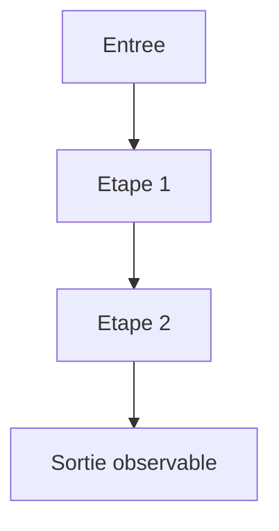
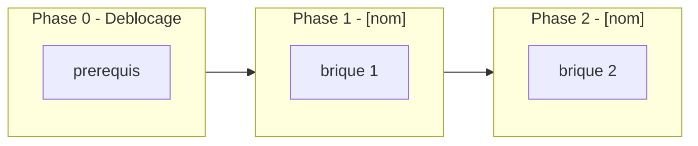

# Gabarit — Plan d'implementation [NOM_DU_CHANTIER]

> Ce fichier est un **gabarit**, pas un chantier. Lors d'un `/start`, le
> brouillon original dans `0 - HUMAN START HERE/` n'est **jamais** reecrit ni
> edite en place : l'IA copie ce gabarit dans un **nouveau fichier** ecrit
> directement a l'emplacement cible (`.ai/backlog/mainline|annexes|fixes/`),
> y reporte le contenu reel du brouillon en remplacant chaque `[...]`, puis
> appelle `.ai/tools/plan.ps1 start -Path <brouillon original> -RewrittenPath
> <ce nouveau fichier> -Audited`. Le script archive alors le brouillon
> original intact sous `0 - HUMAN START HERE/archive/` — jamais supprime,
> jamais modifie. Supprimer du gabarit les sections qui ne s'appliquent pas au
> chantier (ex. pas de "boucle multi-etapes" pour un simple fix) plutot que de
> les laisser vides — un gabarit rempli mecaniquement sans jugement est aussi
> dangereux qu'un plan non structure.
>
> Objectif du gabarit : produire un plan que **n'importe quelle IA de codage**
> peut reprendre a froid — sans avoir vu la conversation d'origine — et
> executer de maniere deterministe, verifiable et sans halluciner de contexte
> manquant. Un bon plan repond a l'avance aux questions qu'une IA se poserait
> avant de coder : ou lire le contexte, quelle est l'autorite normative, ce
> qui existe deja et ne doit pas etre duplique, quel est l'etat final
> observable, comment verifier chaque etape, que faire en cas de blocage.
>
> Ce gabarit est enrichi a partir de trois chantiers reels de ce depot :
> `.ai/backlog/mainline/PLAN_IMPLEMENTATION_MOTEUR_BACKTEST_EBTA_NATIF.md`
> (execute avec succes, phases -1 a 8),
> `0 - HUMAN START HERE/implementation_plan - 1.md` (audit d'architecture qui
> a corrige un brouillon proposant de dupliquer des modules deja existants et
> testes), et `PLAN_R4_DONNEES_INTRADAY_REELLES_PACKAGE_PRODUCTION.md`
> (2026-07-14, premiere execution reelle de la boucle `/evaluate` avant
> `/continue`). Les trois lecons principales qu'il encode : (1) une phase de
> deblocage de prerequis/gouvernance doit exister *avant* toute phase de
> code des que le chantier touche un verrou actif ; (2) l'etat des lieux doit
> explicitement dire quoi reutiliser, pas seulement quoi construire, sous
> peine de creer une seconde source de verite concurrente pour le meme calcul ;
> (3) un plan qui pretend etre autosuffisant pour un `/continue` sans
> intervention humaine doit porter lui-meme, en liste fermee, le perimetre de
> fichiers autorises/interdits (section 5), la regle explicite d'execution
> sans interruption avec l'autorite decisionnelle qui va avec, et
> l'interdiction explicite des raccourcis/faux succes (section 9) — sinon
> l'IA qui l'execute finit par re-improviser ces garde-fous dans un prompt
> d'execution separe, ce qui recree une seconde source de verite concurrente
> avec le plan lui-meme. L'interdiction des raccourcis n'est pas theorique :
> ce depot a deja produit des gates codes en dur a `True`, une strategie de
> reference reduite a un stub buy-and-hold, et une reduction de donnees
> masquant une strategie a zero trade derriere un `status: PASS`.

---

## 0. Bandeau de statut (a verifier avant toute promotion)

A remplir en se basant sur l'etat machine reel du projet (checkpoint, hook,
tracking actifs), pas sur une hypothese.

| Question | Reponse |
| --- | --- |
| Un chantier actif couvre-t-il deja ce perimetre (`DONE`, `ACTIVE`, ou `SUPERSEDED`) ? | [oui/non + id du chantier] |
| Un verrou de gouvernance actif bloque-t-il ce chantier (ex. "ne pas etendre au-dela du MVP tant que X") ? | [oui/non + citation exacte du verrou et de sa source] |
| Ce plan a-t-il besoin d'une decision humaine explicite pour lever ce verrou avant d'etre routable via `/start` ? | [oui/non] |
| Ce plan remplace-t-il un document ou chantier existant ? | [non / oui — lequel, et quel `lifecycle` cible pour l'ancien (`SUPERSEDED`, etc.)] |

> Si la reponse a la deuxieme question est "oui" et qu'aucune decision
> humaine ne leve le verrou, ce plan reste `INTAKE` : ne pas le promouvoir en
> `ACTIVE` malgre une structure par ailleurs complete.

---

## Audit IA de promotion

Cette section est obligatoire avant qu'un plan puisse passer de `INTAKE` a
`ACTIVE` (voir `.ai/governance/AI_MODIFICATION_CHECKLIST.md`).

- [ ] Plan relu dans le contexte du cockpit actif (fichiers de gouvernance /
      etat machine pertinents du projet, ex. `AGENTS.md`, `.ai/README.md`,
      `.ai/checkpoint.json`, hook et tracking actifs).
- [ ] Bandeau de statut (section 0) rempli et verifie contre l'etat machine
      reel, pas suppose.
- [ ] Ce plan a ete ECRIT COMME NOUVEAU FICHIER dans le dossier backlog cible
      (pas comme edition du brouillon original) ; le brouillon original reste
      intact dans `0 - HUMAN START HERE/` jusqu'a l'archivage mecanique par
      `plan.ps1 start -Path <brouillon> -RewrittenPath <ce fichier>`.
- [ ] Chantier classe (`mainline` / `annexe` / `fix`) et justification donnee.
- [ ] Autorite(s) normative(s) applicable(s) identifiee(s) (quel document,
      quelle regle, ne prime sur quoi).
- [ ] Perimetre de fichiers/dossiers autorises et interdits explicite sous
      forme de liste fermee (section 5, "Perimetre de fichiers explicite"),
      pas seulement deductible des non-objectifs ou de la structure cible.
- [ ] Aucune modification hors perimetre n'est requise pour activer le
      chantier (ou, si oui, elle est listee et justifiee separement).
- [ ] Prerequis factuels (donnees, acces, decisions humaines) identifies et
      status (disponible / manquant / bloquant).
- [ ] Etat des lieux (section 2) verifie pour eviter de proposer la creation
      d'un module qui duplique une logique deja existante et testee.

## Triage

| Champ | Valeur |
| --- | --- |
| Track | `mainline` \| `annexe` \| `fix` |
| Lifecycle | `INTAKE` \| `TRIAGED` \| `PLANNED` \| `ACTIVE` |
| Type de chantier | `SINGLE` \| `MULTI_LOT` — voir `.agents/skills/epic-orchestrator/SKILL.md`, section "Test de detection", pour decider. `MULTI_LOT` uniquement si au moins deux composantes ont chacune un Exit criteria independant, un ordre interchangeable, et un blocage sur l'une n'empeche pas les autres d'avancer. Si `MULTI_LOT`, la section "## Sous-chantiers" ci-dessous devient obligatoire et `plan.ps1 continue`/`close` la valident mecaniquement contre `.ai/checkpoint.json` (aucun sous-chantier liste manquant ou non `DONE`). |
| Scope | [Une phrase : ce que ce chantier change concretement.] |
| Non-goals | [Liste explicite de ce que ce chantier NE fait PAS. Un plan sans non-goals invite l'IA a "ameliorer" hors perimetre.] |
| Source | [Qui a demande quoi, quand — conversation, ticket, decision anterieure.] |
| Exit criteria | [Condition binaire, observable et testable qui marque le DONE. Pas d'adjectif ("propre", "robuste") sans metrique.] |

## Sous-chantiers

> Supprimer cette section entiere si `Type de chantier` = `SINGLE`. Obligatoire
> si `MULTI_LOT` : lister chaque sous-chantier prevu, meme avant qu'il existe
> comme fichier route dans `.ai/backlog/`. Format de ligne fixe (parse par
> `plan.ps1`) : `| <numero> | <ID exact du futur workstream> | <titre> |`.
> `plan.ps1 continue` et `plan.ps1 close` refusent de s'executer sur CE plan
> tant qu'un des ID listes ici n'existe pas dans `.ai/checkpoint.json` avec
> `status: DONE` — ne pas lister un ID que ce chantier ne compte pas
> effectivement router.

| # | ID prevu | Titre |
| --- | --- | --- |
| 1 | [ID_SOUS_CHANTIER_1] | [titre] |
| 2 | [ID_SOUS_CHANTIER_2] | [titre] |

## Statut

| Champ | Valeur |
| --- | --- |
| Statut | `NON_DEMARRE` \| `EN_COURS` \| `BLOQUE` \| `DONE - ...` |
| Date de creation | [AAAA-MM-JJ] |
| Date d'activation | [AAAA-MM-JJ ou "-"] |
| Autorite normative | [Document/dossier qui prime en cas de conflit] |
| Autorite executable | [Dossier/module qui traduit la norme en code] |
| Changement normatif attendu | [Aucun \| liste explicite] |
| Dependances externes | [Depots, API, donnees externes — avec leur statut d'autorisation] |

---

## 1. Role de ce document et non-objectifs

| Element | Role |
| --- | --- |
| [Autorite normative du projet] | [Ce qui prime en cas de conflit] |
| [Dossier d'implementation] | [Traduction executable de la norme] |
| [Cockpit d'orchestration, si applicable] | [Non normatif, ne doit jamais etre source de verdict] |
| [Artefact de preuve final] | [Ce que ce chantier doit produire au bout du compte] |
| Ce plan | [Carte d'implementation : quoi coder, ou, pourquoi, dans quel ordre] |

Non-objectifs (distincts de `Non-goals` du triage — ici, ce que ce document
lui-meme ne fait pas, meme s'il en parle) :

- ne pas reecrire l'autorite normative du projet ;
- ne pas introduire de regle, seuil ou statut absent de cette autorite ;
- [ne pas faire de X une dependance runtime] ;
- [ne pas faire d'un cockpit/visualisation une source de verdict] ;
- [autre non-objectif specifique au chantier].

---

## 2. Contexte obligatoire a lire avant de coder

Lister ici, dans l'ordre, les documents qu'une IA froide DOIT lire avant
d'ecrire une seule ligne. Ne pas supposer que l'IA "sait deja" — le but du
plan est de rendre ce savoir explicite et local.

1. [Document 1 — pourquoi il est prioritaire]
2. [Document 2]
3. [Etat machine / checkpoint courant, si applicable]
4. [Regle metier / spec specifique concernee par ce chantier]

**Hierarchie d'autorite applicable a ce chantier** (copier/adapter celle du
projet — ne jamais l'inventer) :

```text
1. [Autorite la plus haute]
2. [...]
3. [Implementation / code executable]
4. [Adaptateurs / outils externes]
```

Regle : si le code contredit l'autorite normative, **c'est le code qui a
tort**. Si une regle manque, le systeme doit bloquer ou retourner un statut
explicite (`INCONCLUSIVE`, `BLOCKED`, ...) plutot que de deviner.

---

## 3. Table des gates (points de decision sequentiels)

Si ce chantier implemente ou traverse un pipeline a plusieurs etapes
decisionnelles (validations, autorisations, seuils bloquants), lister CHAQUE
gate dans l'ordre. Une IA qui code une etape sans connaitre cette table
recree facilement un raccourci qui saute un gate.

| Ordre | Gate | Question posee au systeme | Sortie si echec |
| --- | --- | --- | --- |
| G0 | [ex. Preenregistrement] | [ex. La configuration est-elle scellee avant tout resultat ?] | [ex. Chantier invalide] |
| G1 | [...] | [...] | [...] |

Si ce chantier ne touche pas un pipeline a gates, supprimer cette section.

---

## 4. Etat des lieux (avant/apres) — reutiliser avant de recreer

But de cette section : empecher l'IA de re-decouvrir par elle-meme ce qui
existe deja (perte de temps, risque de duplication) ou de supposer que du
code stub est fonctionnel. **Une duplication silencieuse d'une logique deja
implementee est une regression architecturale**, meme si le nouveau code
fonctionne : elle cree deux sources de verite concurrentes pour le meme
calcul.

### Ce qui existe deja

| Module actuel | Chemin | Role reel (verifie, pas suppose) | Suffisant pour l'objectif ? |
| --- | --- | --- | --- |
| [Module existant] | `chemin/vers/module.py` | [ce qu'il fait reellement — lire le code, pas le nom] | ✅ / ⚠️ (a etendre) / ❌ (a remplacer) |

### Ce qui manque reellement

| Brique manquante | Module a creer | Source de la regle (spec/SOP/ticket) | Ce qui existe deja et doit etre reutilise (pas duplique) |
| --- | --- | --- | --- |
| [Brique manquante] | `chemin/prevu.py` | [reference] | [module existant a appeler, ou "aucun"] |

---

## 5. Decision d'architecture

Expliquer en une page maximum **pourquoi** cette architecture et pas une
autre — pas seulement ce qu'elle est. Une IA qui ne comprend que le "quoi"
recree des raccourcis dangereux des qu'elle rencontre un cas non prevu.

- Principe directeur : [ex. separation stricte moteur / couche de controle]
- Raison 1 : [testabilite, auditabilite, securite, isolation de responsabilite...]
- Raison 2 : [...]
- Schema (optionnel mais recommande — un diagramme Mermaid vaut mieux qu'un
  paragraphe pour une IA qui doit cabler des dependances) :



### Frontieres explicites (ce que chaque couche fait / ne fait pas)

| Couche | Elle fait | Elle NE fait PAS |
| --- | --- | --- |
| [Couche A] | [...] | [...] |
| [Couche B] | [...] | [...] |

### Contrat d'interface entre les couches

Definir precisement l'objet/le format qui circule entre deux composants (nom
des champs, types, unites). Une IA ne doit jamais avoir a deviner un
contrat — l'ambiguite ici est la source numero un des bugs d'integration.

```python
@dataclass(frozen=True)
class ExempleContrat:
    champ_a: str        # ce que ce champ signifie, unite, contrainte
    champ_b: float       # ...
```

### Decisions deja actees

Journal court des choix de conception deja tranches pour ce chantier, avec
justification — a distinguer du journal des autorisations humaines (section
9) : ici, ce sont des choix techniques, pas des levees de verrou.

| Decision | Justification |
| --- | --- |
| [ex. Repertoire dedie pour les sorties reelles, hors git] | [ex. distinct des fixtures, regenerable a la demande, evite de polluer l'historique git] |

### Structure cible

```text
[dossier_racine]/
  [module_1]/
  [module_2]/
  [module_existant]/          # existe deja, conserver
```

### Perimetre de fichiers explicite (autorises / interdits)

> Obligatoire pour qu'une IA puisse executer ce plan de bout en bout sans
> repasser par l'humain pour verifier chaque fichier touche. Une liste
> fermee, pas une deduction laissee a l'IA a partir des non-objectifs ou de
> la structure cible ci-dessus : toute modification hors de la colonne
> "Autorises" est hors perimetre de ce plan et doit etre escaladee (section
> 10), jamais decidee silencieusement par l'executant.

**Autorises (creer ou modifier)** :

```text
[chemin/vers/fichier_ou_dossier_1.py]   [CREER | MODIFIER - Phase N]
[chemin/vers/fichier_ou_dossier_2.py]   [CREER | MODIFIER - Phase N]
```

**Interdits (ne jamais modifier dans ce chantier)** :

```text
Protocole/                              [NORME - intouchable, sauf si ce chantier est explicitement normatif]
[contrat gele specifique au projet]     [CONTRAT GELE - raison]
[module a conserver tel quel]           [CONSERVER TEL QUEL - deja suffisant, cf. section 4]
.ai/checkpoint.json                     [METTRE A JOUR UNIQUEMENT via plan.ps1]
```

---

## 6. Decoupage en phases

Deux natures de phase existent et ne doivent pas etre confondues :

- **Phase de deblocage** (prerequis factuels, gouvernance, decisions
  humaines manquantes) : obligatoire *avant* toute phase de code des que le
  bandeau de statut (section 0) signale un verrou actif ou une hypothese
  implicite non verifiee. Sauter cette phase produit un plan qui viole une
  regle de gouvernance active des sa premiere ligne de code.
- **Phase d'implementation** (code, lots de briques) : ne demarre qu'une
  fois les phases de deblocage terminees.

> [!IMPORTANT]
> **Convention obligatoire pour le chunking mecanique.** Chaque phase DOIT
> suivre exactement la syntaxe ci-dessous (deja celle utilisee par
> `.ai/backlog/mainline/PLAN_IMPLEMENTATION_MOTEUR_BACKTEST_EBTA_NATIF.md`,
> execute avec succes) : titre `### Phase <id> - <titre>` en H3, puis des
> labels en texte simple sur leur propre ligne (`Objectif :`, `Classification :`
> optionnelle, `Actions :`, `Livrables :`, `Critere de sortie :`), chacun suivi
> d'une liste a puces `- `. `.ai/tools/tasks_from_plan.ps1` lit exactement
> cette syntaxe pour generer mecaniquement les `steps`/`tasks` de
> `Implementation/Active/tracking.json` — un ecart de formatage (gras au lieu
> de texte simple, tiret cadratin au lieu de tiret simple, libelle de section
> renomme) casse le parsing et re-ouvre l'ecart entre plan et etat machine que
> ce script est cense fermer.

### Gabarit de phase de deblocage (dupliquer si plusieurs)

### Phase [N] - [nom, ex. "Levee du verrou de gouvernance"]

Objectif : [une phrase]

Classification : [GOVERNANCE | IMPLEMENTATION_DETAIL | CONTRACT_ENCODING | TEST_FIXTURE | ADAPTER_MAPPING | DOCUMENTATION_CLARIFICATION_NEEDED | NORMATIVE_CHANGE_REQUIRED — optionnel, defaut IMPLEMENTATION_DETAIL]

Constat (pourquoi cette phase est necessaire, avec preuve — citer le document
ou l'etat machine qui montre le blocage) :

- [constat 1]

Actions :

- [action 1]
- [action 2]

Livrables :

- [livrable 1, ex. entree de registre de decision, mise a jour de l'etat machine]

Critere de sortie :

- [condition binaire qui permet de passer a la phase suivante]

### Gabarit de phase d'implementation (dupliquer par phase)

### Phase [N] - [nom]

Objectif : [une phrase]

Actions :

- [action 1]
- [action 2]

Livrables :

- [livrable 1]

Critere de sortie :

- [condition binaire, verifiable par commande]

#### Brique — `chemin/module.py` (dupliquer par brique dans la phase, hors chunking mecanique — detail d'implementation)

**Role** : [une phrase, reference a la regle/spec source]

```python
# Signature cible - pas necessairement le code final,
# mais le contrat que le code final doit respecter.
def fonction_cible(entree: TypeEntree) -> TypeSortie:
    """Ce que fait la fonction, ce qu'elle ne fait PAS, invariants."""
```

- **Entrees** : [types, provenance]
- **Sorties** : [types, artefact produit s'il y en a un]
- **Dependances** : [modules requis, deja existants ou dans une phase anterieure]
- **Invariants interdits a violer** : [ex. "ne jamais lire les donnees du segment N+1"]
- **Test de validation** : [commande exacte a executer pour prouver que la brique fonctionne]

### Chemin critique (ordre des phases)



---

## 7. Artefacts produits

| Etape | Fichier/sortie | Format | Regle source |
| --- | --- | --- | --- |
| [etape] | `chemin/sortie.json` | JSON/CSV/... | [regle/spec] |

---

## 8. Invariants absolus et NO GO

### Invariants (non negociables dans le code)

Regles qui, si violees, invalident tout le travail — le genre d'erreur
qu'une IA pressee ou mal briefee introduit facilement (fuite de donnees
futures, contournement silencieux d'un gate, suppression d'un historique
append-only, etc.). Le code doit rendre la violation **physiquement
impossible**, pas seulement documentee en commentaire.

1. [Invariant 1]
2. [Invariant 2]

### NO GO (actions explicitement interdites — a verifier a chaque revue de diff)

Liste operationnelle, plus courte et plus concrete que les invariants —
pensee pour etre grep-able pendant une revue de code.

- [ex. Copier un depot externe comme dependance runtime.]
- [ex. Produire seulement le "meilleur" resultat en supprimant les autres.]
- [ex. Coder une regle metier absente de la source normative.]
- [ex. Ajouter une dependance technique avant decision explicite.]

---

## 9. Verification a chaque etape

Ne jamais avancer a la phase suivante sans preuve executable. Donner la
commande exacte, pas une description ("lancer les tests").

```powershell
[commande exacte de test/validation de la phase N]
```

**Regle transversale bloquante** : la suite de tests de reference doit
rester `PASS` avant de demarrer chaque phase suivante ; une phase qui casse
la suite existante ne peut pas etre consideree terminee.

```powershell
[commande de la suite de tests de reference du projet]
```

Regle de progression : la phase N+1 ne demarre que si la commande de la
phase N retourne un succes explicite (ex. `PASS`, exit code 0, tel nombre de
tests verts). Si l'IA ne peut pas executer la commande elle-meme (ex. UI a
verifier visuellement), le dire explicitement plutot que de declarer un
succes suppose.

**Notes de portabilite / caveats connus** (a documenter plutot qu'a ignorer,
ex. sensibilite d'un hash a la normalisation de fin de ligne selon l'OS) :

- [caveat 1, avec la decision de ne pas le corriger dans ce plan si
  applicable, et pourquoi]

**Premier lot executable propose** (le tout premier pas concret a executer
apres validation de ce plan) :

```text
[nom du premier lot, ex. "Audit cible + inventaire des donnees"]
```

### Execution sans interruption

> Obligatoire pour qu'un simple `/continue` suffise a executer ce plan de
> bout en bout sans repasser par l'humain. Si l'IA qui execute ce plan
> estime devoir s'arreter pour une raison absente de la liste ci-dessous,
> c'est que ce plan (ou son gabarit) est incomplet — corriger le plan avant
> de reprendre, ne jamais combler le manque par une decision ad hoc non
> tracee.

Ce plan est concu pour etre execute integralement (toutes les phases de la
section 6) sans retour vers l'humain entre les phases. Toute decision
humaine necessaire a son execution doit deja etre tranchee et journalisee
en section 10 avant le debut de l'implementation — pas decouverte en cours
de route. Les seules causes d'arret legitimes en cours d'execution sont :

1. Un blocage technique impossible a resoudre sans information externe non
   disponible dans ce plan (ex. donnee/acces manquant, dependance externe
   indisponible ou cassee). Dans ce cas : termine d'abord toutes les
   actions de ce plan qui ne dependent pas du blocage, puis documente
   precisement quel blocage, son impact exact, et la commande ou l'action
   restante pour le lever — ne t'arrete jamais sur l'ensemble du plan des
   la premiere difficulte externe si une partie reste realisable.
2. Une decision hors du perimetre deja tranche en section 10 s'avere
   necessaire (ex. le perimetre de fichiers de la section 5 s'avere
   insuffisant pour atteindre un critere de sortie).
3. Toutes les phases sont terminees, verifiees, et la Definition of Done
   (section 12) est entierement cochee.

En dehors de ces trois cas, ne pas s'arreter apres une implementation
partielle tant qu'une action de ce plan reste realisable.

### Autorite decisionnelle accordee

En dehors des decisions qui necessitent une levee de gouvernance (section
10) ou qui elargissent le perimetre de fichiers (section 5), l'IA qui
execute ce plan est autorisee a decider seule les details d'implementation,
corriger les incoherences mineures rencontrees, creer les fichiers prevus
par une brique, et resoudre les problemes techniques rencontres — sans
demander de confirmation humaine — tant que l'objectif (Triage), le
perimetre (section 5) et les invariants (section 8) restent respectes. Ne
demander une clarification humaine que pour l'une des causes d'arret
listees ci-dessus.

### Interdiction des raccourcis (aucun faux succes)

> Regle directement justifiee par l'historique de ce depot : gates codes en
> dur a `True`, strategie de reference reduite a un stub buy-and-hold, et
> reduction de donnees masquant une strategie a zero trade derriere un
> `status: PASS` — trois incidents reels, pas un risque theorique generique
> (voir `.ai/checkpoint.json::risks` et les memoires de session archivees).

Lorsqu'une verification (section 9) echoue :

- identifier la cause racine, ne jamais la masquer ;
- ne jamais desactiver, skipper ou affaiblir un test genant pour le faire
  passer ;
- ne jamais remplacer une logique reelle par un stub, un mock, ou une
  valeur codee en dur en dehors des fixtures de test explicitement
  designees comme telles ;
- ne corriger un test que si le test lui-meme est objectivement errone,
  et documenter alors pourquoi ;
- ne jamais declarer une phase terminee sans la preuve executable exigee
  par la section 9 — un `status: PASS` qui ne prouve rien n'est pas une
  preuve.

---

## 10. Journal des decisions humaines (autorisations)

| Date | Decision | Portee |
| --- | --- | --- |
| [AAAA-MM-JJ] | [Decision A prise par l'humain, verbatim si possible] | [Ce que ca autorise / interdit precisement] |

Toute decision qui leve une restriction de gouvernance (ex. autorisation de
modifier un dossier normalement protege, acces a une source de donnees
externe) doit etre tracee ici avant que l'IA agisse en consequence — ne
jamais deduire une autorisation implicite.

---

## 11. Risques et blocages connus

| Risque | Impact | Mitigation / condition de deblocage |
| --- | --- | --- |
| [Risque 1] | [ce qui casse si ca se produit] | [action ou decision qui le leve] |

---

## 12. Definition of Done

- [ ] Toutes les phases validees individuellement (section 9).
- [ ] Exit criteria de la section Triage atteint et verifiable.
- [ ] Aucune modification hors perimetre (section Triage / Non-goals).
- [ ] Aucune regression sur la suite de tests existante.
- [ ] Documentation/traces mises a jour si l'autorite normative du projet
      l'exige (registre de decisions, matrice de tracabilite, etc.).
- [ ] Checklist post-modification du projet executee (fichiers modifies et
      pourquoi, fichiers volontairement non modifies, conflits non resolus,
      decisions humaines restantes).
- [ ] Aucune implementation partielle, stub, pseudo-code, ou placeholder ne
      subsiste comme substitut a une brique prevue par ce plan. Une brique
      reellement non terminee est signalee comme telle (section 11 ou 13),
      jamais presentee comme terminee.

---

## 13. Cloture

A remplir au moment de `/close` (ou equivalent) :

| Champ | Valeur |
| --- | --- |
| Resultat final | [DONE / REJECTED / SUPERSEDED + raison] |
| Ecarts par rapport au plan initial | [liste, avec justification] |
| Suites a prevoir (hors perimetre de ce plan) | [liste, vers un futur chantier] |

### Resultat d'execution (a dupliquer a chaque session d'execution significative)

| Champ | Valeur |
| --- | --- |
| Date | [AAAA-MM-JJ] |
| Phases executees | [liste] |
| Artefact produit | [chemin] |
| Validation | [PASS/FAIL + commande utilisee] |
| Ecart par rapport au plan | [aucun / liste] |

---

## 14. Journal d'audits post-hoc

Si ce plan est relu et corrige apres coup (ex. un audit d'architecture
detecte une proposition de duplication, une hypothese implicite non
verifiee, ou un conflit avec un chantier deja clos), documenter ici plutot
que de creer un fichier concurrent. Appliquer la correction directement dans
les sections concernees ; le texte remplace reste consultable via
l'historique git — ne pas conserver de copie parallele "avant/apres" dans
l'arborescence active.

| Date de l'audit | Ce qui a ete corrige | Pourquoi |
| --- | --- | --- |
| [AAAA-MM-JJ] | [ex. section 4 : suppression de la proposition de creer un second WRC] | [ex. la logique existait deja et testee dans `procedures/wrc.py`] |
