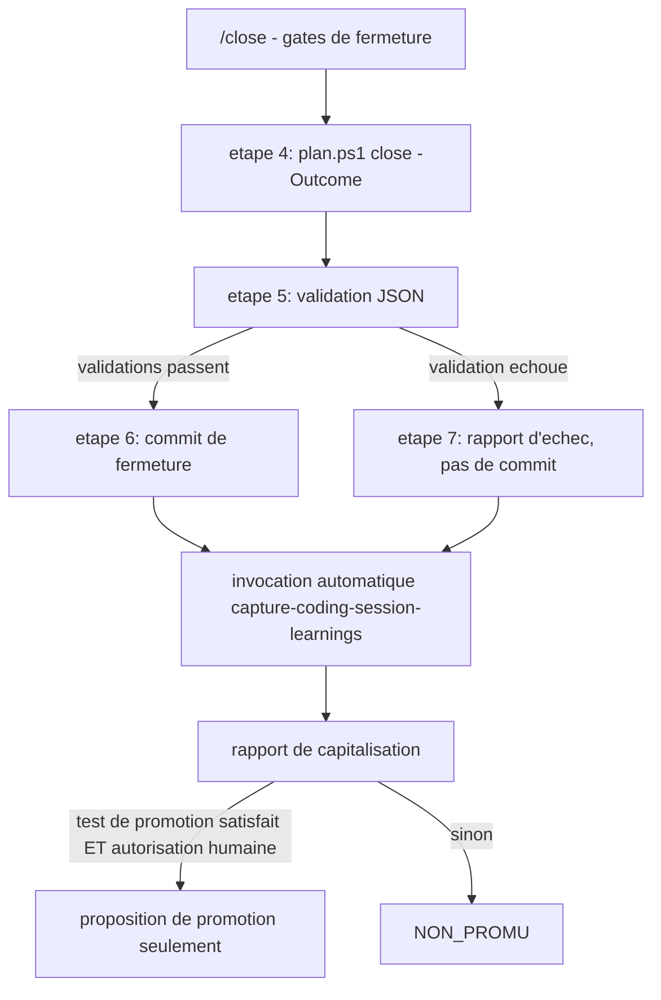

# Plan - integration automatique de /learn-session en fin de /close

## 0. Bandeau de statut

| Champ | Valeur |
| --- | --- |
| ID | `PLAN_INTEGRATION_LEARN_SESSION_POST_CLOSE` |
| Statut | `TRIAGED` - route le 2026-08-09 |
| Lifecycle | `INTAKE_AUDITED` -> `TRIAGED` via `plan.ps1 start -Audited` |
| Track | `annexe` |
| Classification | `GOVERNANCE` |
| Workflow | `common` |
| Type de chantier | `SINGLE` |
| Verrou actif | Aucun workstream actif (`.ai/checkpoint.json::active_workstream_id` = `null`, verifie le 2026-08-09) |
| Source | `0 - HUMAN START HERE/PLAN_INTEGRATION_LEARN_SESSION_POST_CLOSE.md` |
| Brouillon archive attendu | `0 - HUMAN START HERE/archive/20260809_PLAN_INTEGRATION_LEARN_SESSION_POST_CLOSE.md` |

Le test `epic-orchestrator` conclut `SINGLE` sur les phases 0 a 4 d'origine
(sequentielles et interdependantes). **Rejoue le 2026-08-09 (passe 2
`/evaluate` post-extension)** sur le plan etendu (Phases 5, 6, 7 ajoutees) :
techniquement `MULTI_LOT` entre trois groupes independants ({0-4}, {5+6},
{7}) selon les trois conditions du test. **Deviation justifiee, decidee par
l'humain (section 10, decision du 2026-08-09 "Deviation MULTI_LOT")** :
rester `SINGLE`, un seul plan, plutot que fractionner en chantier mere +
sous-chantiers — les trois groupes partagent le meme theme de fond (reduire
le babysitting de la capitalisation post-mission), le meme sujet, la meme
session d'origine, et ne touchent que de la documentation de gouvernance
(pas de code, pas de risque de regression cache par le regroupement).
Fractionner recreerait exactement la proliferation de mini-chantiers que ce
plan cherche a reduire.

## Audit IA de promotion

- [x] Intention humaine preservee : eliminer le babysitting du declenchement
      manuel de `/learn-session` apres chaque `/close`, sans changer ce que
      la retrospective a le droit de faire.
- [x] Autorite scientifique identifiee : aucune modification scientifique ;
      `Protocole/` reste intact et hors scope.
- [x] Autorite procedurale identifiee : `AGENTS.md`, le skill canonique
      `.agents/skills/capture-coding-session-learnings/SKILL.md` et
      `.ai/workflows/common/WORKFLOW.md`.
- [x] Etat live relu : `.ai/checkpoint.json::active_workstream_id` = `null` ;
      `.ai/backlog/mainline|annexes|fixes/` vides (hors `README.md`) ; aucun
      chantier concurrent actif sur ce perimetre.
- [x] Precedent direct verifie : `PLAN_PARTAGE_CROSS_IA_CAPITALISATION_SESSIONS`
      (`DONE`, `annexe`, `GOVERNANCE`, `common`) a livre le skill canonique,
      son stub Claude et le routage manuel de `/learn-session` ; il excluait
      explicitement toute persistance automatique et tout declenchement
      implicite, donc ne couvre pas ce chantier.
- [x] Dependances inversees verifiees : `grep capture-coding-session-learnings`
      sur le depot retourne exactement 7 fichiers, tous deja dans le
      perimetre de ce plan (section 5, "Perimetre de fichiers explicite") ou
      hors scope a raison (archives `.ai/archive/` et
      `0 - HUMAN START HERE/archive/`, non modifiables retroactivement).
      Aucun adaptateur Codex separe a mettre a jour : `.codex/README.md` ne
      fait que rediriger vers `AGENTS.md`.
- [x] Test multi-lot applique : `SINGLE`.
- [x] Boucle d'intake `/evaluate` executee 2 passes, convergee (voir
      `0 - HUMAN START HERE/archive/20260809_PLAN_INTEGRATION_LEARN_SESSION_POST_CLOSE.md#19-journal-de-convergence-de-lintake`) :
      passe 1 a releve une ambiguite reelle du point d'insertion de la
      rétrospective dans `/close` (risque de commit implicite, invariant
      §8.3 du brouillon) ; passe 2 a confirme la correction et n'a releve
      aucun nouvel angle mort majeur.
- [x] Aucune implementation n'est autorisee par ce `/start` ; elle attend la
      boucle `/evaluate` post-route puis `/continue`.

## Triage

| Champ | Valeur |
| --- | --- |
| Track | `annexe` |
| Lifecycle | `TRIAGED` |
| Type de chantier | `SINGLE` |
| Scope | Faire en sorte qu'un `/close` aboutissant a une sortie terminale (`DONE`, `BLOCKED`, `REJECTED`, `SUPERSEDED`) declenche automatiquement, dans la meme conversation, l'analyse et le rapport de `capture-coding-session-learnings`, sans commande `/learn-session` separee, sans autoriser implicitement ecriture/commit/push/publication. **Extension actee le 2026-08-09** (voir section 10, decision du 2026-08-09 "Extension babysitting") : (a) chaque signal capitalise porte un tag `Portee: meta \| objet` (`meta` = gouvernance/outillage/skills/workflow, `objet` = Protocole/moteur/capacite EBTA) ; (b) la Definition of Done de toute mission gouvernee inclut desormais l'application (pas seulement la proposition) de tout correctif de robustesse strictement dans le perimetre de fichiers deja ouvert par cette mission, avant `/close` ; (c) la file "Suites a prevoir" (section 13 du gabarit) n'est plus traitee en cascade immediate item-par-item : elle s'accumule et est triee en un lot unique au rythme choisi par l'humain. |
| Non-goals | Ne pas modifier `.ai/tools/plan.ps1`, `.ai/workflows/common/WORKFLOW.json`, `.ai/checkpoint.schema.json`, `Protocole/`, `Implementation/`, BACKTRADER, ou une memoire personnelle hors depot ; ne pas creer de registre chronologique de sessions, de RAG, de base vectorielle ou d'agent autonome ; ne pas modifier la logique interne de classification/promotion du skill (seul le declencheur change). **Extension** : ne pas etendre la DoD "correctif applique" au-dela du perimetre de fichiers deja ouvert par la mission en cours (toute correction hors perimetre reste un item de file, jamais une ecriture silencieuse) ; ne pas automatiser le triage de la file "Suites a prevoir" (aucun agent autonome qui route seul vers `/start`) ; ne pas creer de nouveau registre de suivi pour la file — elle reste le champ texte "Suites a prevoir" deja normalise par `TEMPLATE_PLAN_IMPLEMENTATION.md` section 13. |
| Source | Brouillon humain audite `0 - HUMAN START HERE/PLAN_INTEGRATION_LEARN_SESSION_POST_CLOSE.md`, converge en 2 passes `/evaluate` (voir Audit IA de promotion). Extension du 2026-08-09 : Conseil des 5 (mode standard) + echange humain direct sur le babysitting du triage post-mission, meme conversation. |
| Exit criteria | Un `/close` terminal declenche automatiquement l'analyse/rapport de capitalisation sans commande separee (preuve : cas `DONE` et cas non-`DONE`) ; aucune ecriture/commit/push/publication n'est produite par le seul declenchement ; un echec de retrospective n'altere jamais le statut d'une cloture deja valide ; `/learn-session` manuel reste fonctionnel a l'identique ; `WORKFLOW.json`, `plan.ps1`, `Protocole/`, `Implementation/` restent inchanges ; le comportement est reproductible par au moins une IA autre que celle qui l'a implemente. **Extension** : chaque nouveau signal classe par le skill porte un tag `meta`/`objet` verifiable par lecture du rapport ; un `/close` type applique au moins un correctif de robustesse en perimetre deja ouvert quand un signal `A_REUTILISER`/`ERREUR_OU_FRICTION` de type `meta` est detecte dans ce perimetre (preuve : cas positif et cas "rien a corriger, rapporte comme tel") ; la section "Suites a prevoir" de `TEMPLATE_PLAN_IMPLEMENTATION.md` documente explicitement qu'elle n'est plus traitee en cascade immediate. |
| Dependances externes | Une session IA fraiche (au minimum Codex, meme precedent que le chantier predecesseur) pour le forward-test cross-IA ; aucune API ni dependance logicielle nouvelle. |

## Statut

| Champ | Valeur |
| --- | --- |
| Statut | `NON_DEMARRE` |
| Date de creation | 2026-08-09 |
| Date d'activation | - |
| Autorite normative | `Protocole/` (hors scope, non modifie) ; `AGENTS.md` et `.ai/workflows/common/` pour la procedure du depot |
| Autorite executable | `.agents/skills/capture-coding-session-learnings/SKILL.md` pour la procedure de retrospective ; `.ai/workflows/common/WORKFLOW.md` pour le contrat `/close` |
| Changement normatif attendu | Aucun |
| Dependances externes | Session IA fraiche pour le forward-test cross-IA (voir Triage) |

## Carte d'execution IA (lecture prioritaire pour `/continue`)

| Champ | Contenu operationnel |
| --- | --- |
| Objectif executable | Un `/close` terminal invoque automatiquement l'analyse/rapport de `capture-coding-session-learnings`, avec les memes autorisations separees que l'invocation manuelle. |
| Autorite et lecture minimale | `AGENTS.md` -> `.ai/README.md` -> `.ai/checkpoint.json` -> `.ai/workflows/common/WORKFLOW.md` -> ce plan (sections 4, 5, 6, 8, 9) -> `.agents/skills/capture-coding-session-learnings/SKILL.md`. |
| Perimetre autorise | `.agents/skills/capture-coding-session-learnings/SKILL.md`, `.ai/workflows/common/WORKFLOW.md`, `AGENTS.md` (mineur), `.claude/skills/capture-coding-session-learnings/SKILL.md` (seulement si sa resolution doit reellement changer), ce plan pour les preuves d'execution. |
| Interdits absolus | `Protocole/`, `Implementation/`, BACKTRADER, `.ai/workflows/common/WORKFLOW.json`, `.ai/checkpoint.schema.json`, `.ai/tools/plan.ps1`, toute memoire personnelle hors depot. |
| Phase de reprise | Phase 0 : reconfirmer l'absence de chantier actif conflictuel et l'etat du skill/stub avant toute modification. |
| Preuve attendue | `quick_validate.py` sur le skill ; cas `/close` terminal `DONE` et non-`DONE` ; preuve d'absence d'ecriture non autorisee ; preuve qu'un echec de retrospective simule ne modifie pas le statut de cloture ; `git diff --exit-code` sur `WORKFLOW.json`/`plan.ps1`/`Protocole/`/`Implementation/` ; validations JSON ; forward-test cross-IA. |
| Arret et escalade | Arreter si le forward-test cross-IA echoue de facon non resoluble dans ce perimetre ; documenter et escalader vers une decision humaine plutot que de livrer un comportement non prouve sur toutes les IA cibles. |

## 1. Role de ce document et non-objectifs

| Element | Role |
| --- | --- |
| `Protocole/` | Autorite scientifique EBTA, intouchable dans ce chantier. |
| `.agents/skills/capture-coding-session-learnings/SKILL.md` | Procedure cross-IA canonique de retrospective ; ce chantier ne modifie que son declencheur (`TRIGGER`/`SKIP`), jamais sa logique de classification/promotion. |
| `.ai/workflows/common/WORKFLOW.md` | Contrat humain des commandes `/close` et `/learn-session` ; document du point d'insertion, pas source d'etat. |
| `AGENTS.md` | Bootstrap mince ; mise a jour mineure seulement si necessaire pour refleter le declenchement automatique. |
| Ce plan | Carte d'implementation et de preuve ; aucune autorite scientifique. |

Non-objectifs du document :

- ne pas reecrire l'autorite normative du projet ;
- ne pas introduire de regle, seuil ou statut absent de `Protocole/` ;
- ne pas faire de la rétrospective automatique une source d'etat ou de
  verdict EBTA ;
- ne pas transformer le declenchement automatique en autorisation implicite
  d'ecriture, de commit, de push ou de publication externe ;
- ne pas dupliquer la procedure du skill canonique dans `WORKFLOW.md` ou
  `AGENTS.md`.

## 2. Contexte obligatoire a lire avant de coder

1. `AGENTS.md` et `.ai/README.md` pour les frontieres du cockpit.
2. `.ai/checkpoint.json`, puis les chemins actifs qu'il declare, pour
   confirmer que le chantier peut etre repris sans conflit.
3. `.ai/governance/AI_MODIFICATION_CHECKLIST.md` et
   `.ai/workflows/common/WORKFLOW.md` (sections `/close` et `/learn-session`)
   pour le cycle gouverne et le contrat exact des 7 etapes de `/close`.
4. Ce plan, en particulier les sections 4, 5, 6, 8 et 9.
5. `.agents/skills/capture-coding-session-learnings/SKILL.md` en entier,
   notamment le frontmatter `TRIGGER`/`SKIP` (ligne 3) et la section
   "Separer les autorisations" (etape 6 de la procedure).
6. `0 - HUMAN START HERE/archive/20260809_PLAN_INTEGRATION_LEARN_SESSION_POST_CLOSE.md`
   pour le contenu de fond original et le journal de convergence de l'intake
   (section 19).

Hierarchie d'autorite applicable a ce chantier :

```text
1. Protocole/ pour toute verite scientifique EBTA (hors scope ici)
2. AGENTS.md et .ai/workflows/common/ pour la procedure du depot
3. .agents/skills/capture-coding-session-learnings/SKILL.md pour la
   procedure de retrospective elle-meme
4. Ce plan pour le declencheur automatique et ses preuves
```

Regle : si le code ou la documentation contredit l'autorite normative,
c'est la documentation qui a tort. Si une regle manque, `/close` doit
rapporter l'echec de retrospective explicitement plutot que de deviner un
comportement.

## 3. Table des gates

Ce chantier ne traverse pas un pipeline de gates statistiques/economiques ;
il modifie un declencheur procedural. Section omise (voir gabarit, "supprimer
si non applicable").

## 4. Etat des lieux (avant/apres)

### Ce qui existe deja

| Module actuel | Chemin | Role reel (verifie) | Suffisant pour l'objectif ? |
| --- | --- | --- | --- |
| Skill canonique de retrospective | `.agents/skills/capture-coding-session-learnings/SKILL.md` | Procedure complete (delimiter, recueillir, classer, tester la promotion, router, separer les autorisations, rendre compte) ; fonctionnelle et validee (`PLAN_PARTAGE_CROSS_IA_CAPITALISATION_SESSIONS`, `DONE`). | ⚠️ (a etendre seulement sur le frontmatter `TRIGGER`/`SKIP`, ligne 3 ; le corps de la procedure reste intact) |
| Stub de decouverte Claude | `.claude/skills/capture-coding-session-learnings/SKILL.md` | Pointeur pur (18 lignes) vers le corps canonique. | ✅ (aucune modification necessaire a priori, sauf si sa resolution effective change) |
| Contrat `/learn-session` | `.ai/workflows/common/WORKFLOW.md`, section dediee | Documente `/learn-session` comme retrospective manuelle sans transition d'etat, avec les memes autorisations separees que le skill. | ⚠️ (a etendre pour documenter le declenchement automatique post-`/close`) |
| Sequence `/close` | `.ai/workflows/common/WORKFLOW.md`, section `/close` | 7 etapes numerotees : gates, `ready`, `close -Outcome`, validation JSON (etape 5), commit si validations passent (etape 6), rapport d'echec sinon (etape 7). Aucune mention de retrospective. | ❌ (brique manquante : point d'insertion explicite) |
| Bootstrap | `AGENTS.md`, lignes 52-55 | Route `/learn-session` vers le skill canonique, avec la meme separation d'autorisations. | ✅ (peut rester tel quel ; mise a jour mineure seulement si l'audit le juge necessaire pour la coherence avec `WORKFLOW.md`) |
| `WORKFLOW.json` | `.ai/workflows/common/WORKFLOW.json` | Machine a etats des workstreams ; aucune notion de retrospective. | ✅ (doit rester ainsi — non-objectif explicite, decision actee) |

### Ce qui manque reellement

| Brique manquante | Module a modifier | Source de la regle | Ce qui existe deja et doit etre reutilise |
| --- | --- | --- | --- |
| Declencheur automatique post-`/close` | `.agents/skills/capture-coding-session-learnings/SKILL.md` (frontmatter) | Decision humaine actee 2026-08-09 (brouillon source, section 3) | La procedure complete du skill (etapes 1-7) : reutilisee telle quelle, seul le `TRIGGER`/`SKIP` change. |
| Point d'insertion explicite dans `/close` | `.ai/workflows/common/WORKFLOW.md`, section `/close` | Meme decision humaine | La sequence a 7 etapes existante : ancrer l'insertion apres resolution de l'etape 6 ou 7, ne pas la reecrire. |
| Coherence bootstrap | `AGENTS.md`, lignes 52-55 | Coherence documentaire | Le routage existant, etendu au minimum necessaire. |

## 5. Decision d'architecture

Principe directeur : le declenchement automatique est un changement de
**declencheur conversationnel** de `/close`, jamais un nouvel etat de
workstream ni une nouvelle autorite de persistance. La procedure de
retrospective elle-meme (classification, test de promotion, autorisations
separees) reste strictement celle deja canonique et prouvee par le chantier
predecesseur.

- Raison 1 : `WORKFLOW.json` n'a pas de notion de retrospective et ne doit
  pas en acquerir une — la decision humaine actee (§3.3 du brouillon
  archive) l'exclut explicitement. Le declenchement reste donc documente
  dans `WORKFLOW.md` (jugements humains et commandes), pas dans le contrat
  machine.
- Raison 2 : separer strictement "declenchement automatique de l'analyse"
  de "autorisation d'ecriture" empeche qu'un comportement conversationnel
  nouveau ne devienne, par glissement, une autorisation de commit implicite
  — risque concret identifie lors de l'audit `code-architecture-evaluator`
  (voir section 19 du brouillon archive).



### Frontieres explicites

| Couche | Elle fait | Elle NE fait PAS |
| --- | --- | --- |
| Sequence `/close` (`WORKFLOW.md`) | Documente le point d'insertion exact (apres etape 6 ou 7) et la regle qu'un echec de retrospective n'invalide pas une cloture deja valide. | Ne modifie ni `WORKFLOW.json`, ni `plan.ps1`, ni la transition d'etat elle-meme. |
| Skill canonique (`SKILL.md`) | Distingue, dans son frontmatter, le declenchement automatique post-`/close` terminal du `SKIP` pour statut/`continue`/memorisation automatique hors cycle. | Ne change pas sa logique de classification, de test de promotion, ni ses destinations de routage. |
| Invocation automatique elle-meme | Analyse des preuves bornees de la session, classification, rapport, proposition de promotion. | N'ecrit, ne commit, ne push, ne publie jamais par elle-meme. |

### Contrat d'interface entre les couches

Pas de contrat de donnees typé (documentation procedurale, pas de code) :
le "contrat" est la regle textuelle suivante, a faire figurer littéralement
dans `WORKFLOW.md` :

> L'invocation automatique de `capture-coding-session-learnings` a lieu
> immediatement apres la resolution de l'etape 6 (commit de fermeture
> reussi) ou de l'etape 7 (validation echouee, echec rapporte) de la
> sequence `/close` ci-dessus — jamais entre les etapes 4 et 6. Un echec,
> timeout ou absence de sortie de la retrospective est rapporte mais
> n'annule ni ne transforme le statut de cloture deja atteint. L'invocation
> automatique n'autorise, par elle-meme, aucune ecriture de fichier, commit,
> push ou publication externe.

### Decisions deja actees

| Decision | Justification |
| --- | --- |
| Point d'insertion ancre sur la resolution de l'etape 6 ou 7 (jamais entre 4 et 6) | Correction issue de l'audit `code-architecture-evaluator` (passe 1) : une formulation "avant/independamment du commit" laissait une IA libre d'executer la retrospective avant le commit de fermeture (limite exactement aux fichiers de fermeture), avec un risque reel d'y faire glisser un artefact d'analyse — violation potentielle de l'invariant "aucun commit implicite". |
| `WORKFLOW.json` strictement inchangé | Decision humaine actee (brouillon archive, §3.3) : la retrospective n'est pas un etat de workstream. |
| Seul le frontmatter `TRIGGER`/`SKIP` du skill change | Le corps de la procedure (classification, test de promotion, autorisations) est deja canonique et prouve ; le modifier sortirait du perimetre de ce chantier. |
| `SINGLE`, pas `MULTI_LOT` | Test `epic-orchestrator` : phases sequentielles et interdependantes, un seul jeu d'Exit criteria. |

### Structure cible

```text
.agents/skills/capture-coding-session-learnings/
  SKILL.md                    # frontmatter TRIGGER/SKIP corrige, corps inchangé
.ai/workflows/common/
  WORKFLOW.md                 # section /close etendue, section /learn-session precisee
  WORKFLOW.json                # inchangé (verifie par diff)
AGENTS.md                      # inchangé ou mise a jour mineure
.claude/skills/capture-coding-session-learnings/
  SKILL.md                    # inchangé sauf si sa resolution doit reellement changer
```

### Perimetre de fichiers explicite (autorises / interdits)

**Autorises (modifier) :**

```text
.agents/skills/capture-coding-session-learnings/SKILL.md   [MODIFIER - Phase 1, frontmatter uniquement ; Phase 5, etape 3 de la procedure (tag Portee)]
.ai/workflows/common/WORKFLOW.md                            [MODIFIER - Phase 2 ; Phase 6 (DoD correctif en perimetre) ; Phase 7 (triage en lot de la file "Suites a prevoir")]
AGENTS.md                                                    [MODIFIER, mineur, si necessaire - Phase 3]
.claude/skills/capture-coding-session-learnings/SKILL.md    [MODIFIER, seulement si sa resolution doit reellement changer - Phase 3]
.ai/backlog/TEMPLATE_PLAN_IMPLEMENTATION.md                 [MODIFIER - Phase 5, ajouter le champ `Portee` a la Definition of Done (section 12) et clarifier section 13 "Suites a prevoir" comme file non-cascadante]
.ai/backlog/annexes/PLAN_INTEGRATION_LEARN_SESSION_POST_CLOSE.md [METTRE A JOUR - preuves d'execution, Phase 4]
```

**Interdits (ne jamais modifier dans ce chantier) :**

```text
Protocole/                                                   [NORME - intouchable]
Implementation/                                               [RUNTIME - hors scope]
.ai/tools/plan.ps1                                            [BACKEND MECANIQUE - hors scope, decision actee]
.ai/workflows/common/WORKFLOW.json                            [CONTRAT D'ETATS - inchangé, decision actee]
.ai/checkpoint.schema.json                                    [SCHEMA - inchangé]
BACKTRADER (repo externe)                                     [REFERENCE-ONLY - hors scope]
Toute memoire personnelle hors depot                          [HORS DEPOT - aucune mutation]
Logique interne de classification/promotion du skill (corps du SKILL.md hors frontmatter) [DEJA CANONIQUE - ne pas reecrire]
```

## 6. Decoupage en phases

### Phase 0 - Verification de la baseline et du non-recouvrement

Objectif : confirmer qu'aucun chantier actif ne couvre deja ce perimetre et
que l'etat verifie a la promotion reste exact au moment de la reprise.

Classification : GOVERNANCE

Actions :

- Relire `.ai/checkpoint.json::active_workstream_id` et le hook actif.
- Reconfirmer `git status` / position par rapport a `origin/main`.
- Reconfirmer que le skill canonique et le stub Claude n'ont pas change
  depuis la redaction de ce plan (sinon adapter les phases suivantes).

Livrables :

- Constat consigne dans les Resultats d'execution (section 13).

Critere de sortie :

- Aucun chantier actif conflictuel ; etat machine coherent ou divergences
  documentees et traitees avant de continuer.

### Phase 1 - Corriger le frontmatter `TRIGGER`/`SKIP` du skill canonique

Objectif : distinguer explicitement le declenchement automatique post-`/close`
terminal du `SKIP` pour statut/`continue`/memorisation automatique hors
cycle, sans toucher au corps de la procedure.

Classification : GOVERNANCE

Actions :

- Reformuler uniquement le frontmatter `description` (ligne 3) de
  `.agents/skills/capture-coding-session-learnings/SKILL.md` pour couvrir :
  (a) TRIGGER automatique apres un `/close` aboutissant a une sortie
  terminale (`DONE`, `BLOCKED`, `REJECTED`, `SUPERSEDED`) ; (b) TRIGGER
  manuel identique a aujourd'hui (`/learn-session`, demande explicite) ;
  (c) SKIP pour un simple statut, un `/continue`, ou toute tentative de
  memorisation automatique d'une conversation *hors* cycle `/close`.
- Ne modifier aucune autre ligne du fichier.

Livrables :

- `SKILL.md` corrige (frontmatter uniquement) ; validation
  `quick_validate.py` en succes.

Critere de sortie :

- Le validateur passe ; la clause ne contient plus d'ambiguite entre
  "declenchement automatique attendu" et "SKIP par defaut" ; `git diff`
  du fichier ne touche que les lignes du frontmatter.

### Phase 2 - Documenter le point d'insertion dans le workflow commun

Objectif : rendre le declenchement automatique explicite et non ambigu dans
`.ai/workflows/common/WORKFLOW.md`, ancre sur les etapes reelles de `/close`,
sans toucher `WORKFLOW.json`.

Classification : GOVERNANCE

Actions :

- Etendre la section `/close` existante (7 etapes) pour inserer
  l'invocation automatique de la retrospective strictement apres la
  resolution de l'etape 6 (branche commit-reussi) ou de l'etape 7 (branche
  echec-rapporte), selon celle des deux qui s'est effectivement produite —
  jamais entre les etapes 4 et 6 (voir contrat d'interface, section 5).
- Ajouter la regle explicite qu'un echec, timeout ou absence de sortie de
  la retrospective ne transforme ni n'annule une cloture deja valide.
- Mettre a jour la section `/learn-session` existante pour indiquer qu'elle
  est desormais aussi invoquee automatiquement en fin de `/close`, en
  renvoyant au skill canonique pour la procedure detaillee (pas de
  duplication).

Livrables :

- `WORKFLOW.md` modifie ; `WORKFLOW.json` strictement inchangé (verifie par
  diff).

Critere de sortie :

- Une IA froide qui lit uniquement `WORKFLOW.md` sait que `/close` declenche
  automatiquement la retrospective, a quel point exact de la sequence, dans
  quelles conditions, et avec quelles autorisations — sans avoir besoin de
  recroiser avec ce plan.

### Phase 3 - Mise a jour mince du bootstrap (si necessaire)

Objectif : refleter dans `AGENTS.md` (et, si sa resolution doit reellement
changer, dans le stub `.claude/skills/.../SKILL.md`) le declenchement
automatique sans dupliquer la procedure.

Classification : GOVERNANCE

Actions :

- Evaluer si la ligne de routage actuelle d'`AGENTS.md` (lignes 52-55) reste
  suffisante telle quelle, ou si elle doit etre completee d'une clause
  courte renvoyant a `.ai/workflows/common/WORKFLOW.md` pour le declenchement
  automatique.
- Verifier mecaniquement que le stub Claude pointe toujours vers le corps
  canonique sans le recopier ; ne le modifier que si sa resolution effective
  doit changer (peu probable, a confirmer en Phase 0/3).

Livrables :

- `AGENTS.md` inchangé ou modifie a minima ; stub Claude inchangé sauf
  necessite averee.

Critere de sortie :

- Coherence entre `AGENTS.md`, le stub Claude et `WORKFLOW.md`, sans
  duplication de contenu procedural.

### Phase 4 - Tests et forward-tests cross-IA

Objectif : prouver le comportement attendu plutot que l'affirmer.

Classification : TEST_FIXTURE

Actions :

- Executer les 11 preuves listees dans le brouillon archive (section 11,
  reprises ici en section 9 "Verification a chaque etape").
- Executer un forward-test depuis une session IA fraiche (au minimum Codex).

Livrables :

- Resultats factuels consignes en section 13 (Resultats d'execution).

Critere de sortie :

- Toutes les preuves de la section 9 passent ; le forward-test confirme la
  reproductibilite cross-IA.

### Phase 5 - Tag `Portee: meta | objet` sur chaque signal capitalise

Objectif : distinguer, dans le rapport de `capture-coding-session-learnings`
et dans le gabarit de plan, un apprentissage sur le fonctionnement du systeme
(`meta` : skills, workflow, gates CI, gouvernance de cloture) d'un
apprentissage sur ce que le systeme fait (`objet` : Protocole, moteur,
adapters). Objectif de fond : rendre observable si la file `meta` converge
(stock fini de defauts de gouvernance) sans jamais exiger que la file
`objet` converge (extension normale du perimetre EBTA, non bornee par
construction).

Classification : GOVERNANCE

Actions :

- Etendre l'etape 3 ("Classer chaque signal") de
  `.agents/skills/capture-coding-session-learnings/SKILL.md` pour exiger,
  en plus de `BIEN_FAIT`/`A_REUTILISER`/`ERREUR_OU_FRICTION`/`NON_PROMU`, un
  tag `Portee: meta` ou `Portee: objet` sur chaque signal promu ou propose.
  Inserer litteralement dans le skill (correction issue de l'audit
  `code-architecture-evaluator`, passe 1, qui notait l'absence de texte
  precis) :

  > `Portee: meta` — le signal porte sur le fonctionnement du systeme lui-
  > meme : skills (`.agents/skills/`), workflow (`.ai/workflows/`), gates
  > CI, gouvernance de cloture, outillage de backlog. Un stock fini de
  > defauts : chaque correction reduit la probabilite d'en retrouver un du
  > meme genre.
  >
  > `Portee: objet` — le signal porte sur ce que le systeme EBTA fait :
  > `Protocole/`, `Implementation/` (moteur, procedures, adapters),
  > capacite statistique ou de backtest. Un perimetre etendu deliberement :
  > chaque extension produit normalement de nouveaux apprentissages, sans
  > obligation de convergence.
  >
  > En cas de doute (ex. un skill qui encode une regle Protocole), classer
  > `objet` si le signal touche `Protocole/`/`Implementation/` meme
  > indirectement, `meta` sinon.
- Ajouter le meme champ `Portee` a la Definition of Done (section 12) et au
  bandeau de statut (section 0) de `.ai/backlog/TEMPLATE_PLAN_IMPLEMENTATION.md`,
  pour que tout futur chantier routé via `/start` declare lui-meme s'il est
  `meta` ou `objet`.
- Ne modifier ni la logique de test de promotion (etape 4 du skill), ni le
  routage vers les proprietaires (etape 5) : le tag s'ajoute a la
  classification existante, il ne la remplace pas.

Livrables :

- `SKILL.md` etendu (etape 3 + definition des deux categories) ; validation
  `quick_validate.py` en succes.
- `TEMPLATE_PLAN_IMPLEMENTATION.md` etendu (champ `Portee`).

Critere de sortie :

- Un rapport de capitalisation genere apres cette phase porte, pour chaque
  signal `A_REUTILISER`/`ERREUR_OU_FRICTION`, un tag `Portee` explicite ; un
  nouveau plan cree apres cette phase avec le gabarit porte le meme champ.

### Phase 6 - DoD : appliquer, pas seulement proposer, un correctif en perimetre deja ouvert ET sur le meme sujet

Objectif : eliminer le babysitting du triage manuel pour les correctifs de
robustesse qui ne sortent pas du perimetre de fichiers deja autorise par la
mission en cours ET qui restent sur le sujet fonctionnel deja approuve —
sans jamais autoriser une ecriture hors de ce double critere sans decision
separee (invariant §8.3 de ce plan, inchangé), et sans jamais folder ce
correctif dans le commit de fermeture deja restreint par `WORKFLOW.md`
etape 6 ("limite exactement aux fichiers de fermeture").

Classification : GOVERNANCE

**Correction issue de l'audit `code-architecture-evaluator` (passe 1)** :
la formulation initiale ("commite dans la meme cloture") contredisait
`WORKFLOW.md` etape 6, qui restreint deja le commit automatique de `/close`
aux seuls fichiers de fermeture — la retrospective s'execute *apres* cette
etape (ancrage Phase 2), donc son correctif ne peut structurellement pas
entrer dans ce commit deja passe. Corrige ci-dessous par un second commit
explicite et distinct, jamais un elargissement silencieux du commit de
fermeture.

Actions :

- Etendre la section `/close` de `.ai/workflows/common/WORKFLOW.md` (le meme
  point d'insertion que la Phase 2, apres l'etape 6/7) : si l'invocation
  automatique de `capture-coding-session-learnings` classe un signal
  `A_REUTILISER` ou `ERREUR_OU_FRICTION` de tag `Portee: meta` dont la
  correction ne touche QUE des fichiers deja dans le perimetre autorise de
  la mission qui vient de se clore, **ET** dont l'objet reste directement
  rattachable au sujet fonctionnel deja approuve de cette mission (pas
  seulement au meme fichier par coincidence), la Definition of Done de
  cette mission n'est consideree pleinement remplie que si le correctif est
  edite immediatement.
- Si une autorisation de commit etait deja accordee a la mission pour son
  perimetre, editer PUIS creer un second commit, explicitement distinct du
  commit de fermeture (etape 6), suivant a l'identique "Forme obligatoire
  des commits" (`WORKFLOW.md` ligne 10), avec un message referencant
  litteralement l'ID du workstream deja clos et le rapport de capitalisation
  qui a motive le correctif. Ce second commit n'est jamais cree par
  l'invocation automatique elle-meme (qui reste, invariant §8.3, sans
  aucune autorisation d'ecriture) — il est cree par l'agent qui execute la
  sequence `/close`, sous l'autorisation de commit deja accordee a la
  mission pour son perimetre de fichiers deja ouvert et son sujet
  fonctionnel deja approuve.
- Si aucune autorisation de commit n'etait accordee a la mission (ex.
  mission en analyse seule), le correctif reste edite mais non commite,
  signale explicitement dans le rapport de cloture comme "correctif
  applique, commit en attente d'autorisation separee".
- Documenter explicitement la double limite : un signal dont la correction
  sort du perimetre deja ouvert, OU dont l'objet n'est pas rattachable au
  sujet fonctionnel deja approuve (meme si le fichier est en commun),
  n'est jamais applique automatiquement — il rejoint la file "Suites a
  prevoir" (Phase 7), jamais une ecriture silencieuse.
- Ne pas toucher aux autorisations de persistance/commit/push de la mission
  elle-meme au-dela de ce second commit explicitement documente : cette
  phase ne cree aucune autorisation implicite nouvelle, elle precise
  seulement ce qui compte comme "mission terminee" et sous quelle forme de
  commit distincte, quand une autorisation d'ecriture/commit deja accordee
  couvre le perimetre ET le sujet du correctif.

Livrables :

- `WORKFLOW.md` modifie (section `/close`, regle DoD explicite + regle du
  second commit distinct).

Critere de sortie :

- Une IA froide qui lit `WORKFLOW.md` sait qu'un correctif `meta` en
  perimetre deja ouvert ET sur le meme sujet doit etre applique avant la
  fin de la mission, sous quel commit distinct (ou non-commit signale) ; et
  qu'un correctif hors perimetre ou hors sujet ne l'est jamais
  automatiquement.

### Phase 7 - File "Suites a prevoir" : triage en lot, plus de cascade immediate

Objectif : remplacer le traitement immediat item-par-item de la section
"Suites a prevoir" (tel que pratique par
`0 - HUMAN START HERE/PROMPT_BOUCLE_CLOTURE_SUITES_A_PREVOIR.md`, qui
enchaine `/start` sur chaque suite des sa detection) par une accumulation
suivie d'un triage en un seul lot, au rythme choisi par l'humain — sans
creer de nouveau registre ni de nouvel etat.

Classification : GOVERNANCE

Actions :

- Preciser dans `.ai/workflows/common/WORKFLOW.md`, section `/close`, que le
  champ "Suites a prevoir" (`TEMPLATE_PLAN_IMPLEMENTATION.md`, section 13)
  documente une suite possible mais n'implique aucune obligation de
  `/start` immediat ni de traitement en cascade dans la meme session : ces
  suites s'accumulent comme des lignes de texte dans les plans clos, et
  sont revues par lot a l'initiative humaine (ex. lors d'une session dediee
  a la revue de backlog), pas au fil de l'eau.
- Ne pas modifier `PROMPT_BOUCLE_CLOTURE_SUITES_A_PREVOIR.md` lui-meme (hors
  perimetre — c'est un prompt d'execution ponctuel, pas un artefact
  gouverne) ; la regle nouvelle vaut pour tout futur usage du mecanisme de
  file, pas retroactivement sur ce prompt deja execute.
- Ne pas introduire de nouveau fichier de suivi de la file : elle reste
  observable par grep des sections "Suites a prevoir" a travers
  `.ai/backlog/*/` et `.ai/archive/`.

Livrables :

- `WORKFLOW.md` modifie (section `/close`, regle de triage en lot).

Critere de sortie :

- Une IA froide qui lit `WORKFLOW.md` sait qu'une "suite a prevoir" n'a pas
  a etre routee immediatement, et qu'aucun nouveau registre n'est attendu
  pour la suivre.

### Chemin critique (ordre des phases)

```mermaid
flowchart LR
    subgraph P0["Phase 0 - Baseline"]
        p0a[verification non-recouvrement]
    end
    subgraph P1["Phase 1 - Frontmatter skill"]
        p1a[TRIGGER/SKIP corrige]
    end
    subgraph P2["Phase 2 - WORKFLOW.md"]
        p2a[point d'insertion ancre etape 6/7]
    end
    subgraph P3["Phase 3 - Bootstrap"]
        p3a[AGENTS.md coherent]
    end
    subgraph P5["Phase 5 - Tag Portee"]
        p5a[meta/objet dans skill + gabarit]
    end
    subgraph P6["Phase 6 - DoD correctif en perimetre"]
        p6a[applique, pas seulement propose]
    end
    subgraph P7["Phase 7 - File en lot"]
        p7a[Suites a prevoir non-cascadante]
    end
    subgraph P4["Phase 4 - Tests"]
        p4a[preuves + forward-test cross-IA]
    end
    P0 --> P1 --> P2 --> P3 --> P5 --> P6 --> P7 --> P4
```



## 7. Artefacts produits

| Etape | Fichier/sortie | Format | Regle source |
| --- | --- | --- | --- |
| Phase 1 | `.agents/skills/capture-coding-session-learnings/SKILL.md` | Frontmatter YAML | Decision humaine actee 2026-08-09 |
| Phase 2 | `.ai/workflows/common/WORKFLOW.md` | Markdown, section `/close` et `/learn-session` | Meme decision, ancrage sur la sequence reelle de `/close` |
| Phase 3 | `AGENTS.md` (mineur, si necessaire) | Markdown | Coherence documentaire |
| Phase 4 | Section 13 de ce plan | Preuves en prose bornees | Workflow de cloture (`common`) |

## 8. Invariants absolus et NO GO

### Invariants

1. Le declenchement automatique n'a lieu qu'apres une sortie terminale de
   `/close` (`DONE`, `BLOCKED`, `REJECTED`, `SUPERSEDED`) et strictement
   apres la resolution de l'etape 6 ou 7 de la sequence `/close` existante
   — jamais avant, jamais entre les etapes 4 et 6.
2. Une cloture mecaniquement valide reste valide meme si la retrospective
   echoue, timeout, ou ne produit aucune sortie ; l'echec de retrospective
   est rapporte, jamais absorbe ni transforme en `PASS`.
3. L'invocation automatique n'autorise jamais, par elle-meme, une ecriture
   de fichier, un commit, un push ou une publication externe : ces
   autorisations restent strictement distinctes et doivent etre demandees
   separement si le skill propose une promotion.
4. `/learn-session` reste appelable manuellement a tout moment, avec un
   comportement identique a aujourd'hui.
5. Aucune nouvelle source d'etat, de verite ou de memoire n'est creee par ce
   chantier ; `WORKFLOW.json` reste strictement inchangé.
6. Les verdicts `FAIL`, `DENIED`, `INCONCLUSIVE`, les timeouts et les
   absences de sortie restent litteraux dans le rapport de capitalisation.
7. Le corps de la procedure du skill (classification, test de promotion,
   routage, autorisations) reste inchangé ; seul le frontmatter
   `TRIGGER`/`SKIP` est modifie (Phase 1) et l'etape 3 est etendue du tag
   `Portee` (Phase 5, sans toucher aux etapes 4-5).
8. La file `objet` (apprentissages sur ce que le systeme EBTA fait) n'a
   jamais de critere de convergence ni d'obligation de triage : seule la
   file `meta` (gouvernance/outillage) est visee par la Phase 6 et la
   mesure de convergence.
9. Un correctif applique automatiquement sous la DoD etendue (Phase 6) ne
   touche jamais un fichier hors du perimetre deja autorise de la mission
   en cours, ET reste toujours rattachable au sujet fonctionnel deja
   approuve de cette mission (pas seulement au meme fichier par
   coincidence) ; tout correctif hors perimetre ou hors sujet rejoint la
   file "Suites a prevoir" (Phase 7), jamais une ecriture silencieuse.
9bis. Le correctif applique sous la Phase 6 n'est jamais folde dans le
   commit de fermeture de l'etape 6 (deja restreint aux fichiers de
   fermeture par `WORKFLOW.md`) : il fait l'objet d'un second commit
   explicitement distinct si une autorisation de commit couvrait deja son
   perimetre et son sujet, ou reste edite non commite et signale comme tel
   sinon. L'invocation automatique de la retrospective elle-meme ne cree
   jamais ce commit (invariant §8.3 inchangé).
10. Le triage en lot de la file "Suites a prevoir" (Phase 7) ne cree ni
    nouveau registre, ni nouvel etat `WORKFLOW.json`, ni obligation
    temporelle contraignante — le rythme de revue reste a la discretion de
    l'humain.

### NO GO

- Inserer l'invocation automatique avant le commit de fermeture (etape 6)
  ou entre les etapes 4 et 6 de `/close`.
- Ajouter une transition ou un etat lie a la retrospective dans
  `WORKFLOW.json`.
- Modifier `.ai/tools/plan.ps1`, `Protocole/`, `Implementation/` ou
  BACKTRADER.
- Recopier le corps du skill canonique dans `WORKFLOW.md`, `AGENTS.md` ou
  le stub Claude.
- Transformer le declenchement automatique en autorisation implicite de
  persistance, commit, push ou publication.
- Modifier la logique interne de classification/promotion du skill (etapes
  4 et 5), au-dela de l'ajout du tag `Portee` a l'etape 3 (Phase 5).
- Muter une memoire personnelle hors depot.
- Appliquer automatiquement (Phase 6) un correctif touchant un fichier hors
  du perimetre deja ouvert par la mission en cours, ou hors du sujet
  fonctionnel deja approuve de cette mission (meme si le fichier est en
  commun).
- Folder le correctif de la Phase 6 dans le commit de fermeture de l'etape 6
  de `/close` (deja restreint aux fichiers de fermeture) : il exige son
  propre commit distinct ou reste explicitement non commite.
- Automatiser le triage de la file "Suites a prevoir" (Phase 7) via un
  agent qui route seul vers `/start` sans decision humaine.

## 9. Verification a chaque etape

Phase 1 :

```powershell
python 'C:\Users\liant\.codex\skills\.system\skill-creator\scripts\quick_validate.py' '.agents\skills\capture-coding-session-learnings'
git diff -- '.agents\skills\capture-coding-session-learnings\SKILL.md'
```

Le `git diff` de cette commande doit montrer uniquement des lignes du bloc
frontmatter (lignes 1-4) ; toute autre ligne modifiee est une derive hors
perimetre de la Phase 1.

Phase 2 :

```powershell
git diff --exit-code -- '.ai\workflows\common\WORKFLOW.json'
rg -n "capture-coding-session-learnings|etape 6|etape 7" '.ai\workflows\common\WORKFLOW.md'
```

Phase 3 :

```powershell
git diff -- AGENTS.md '.claude\skills\capture-coding-session-learnings\SKILL.md'
```

Phase 5 :

```powershell
python 'C:\Users\liant\.codex\skills\.system\skill-creator\scripts\quick_validate.py' '.agents\skills\capture-coding-session-learnings'
rg -n "Portee" '.agents\skills\capture-coding-session-learnings\SKILL.md' '.ai\backlog\TEMPLATE_PLAN_IMPLEMENTATION.md'
```

Preuve comportementale : un rapport de capitalisation produit apres cette
phase porte un tag `Portee` explicite pour chaque signal `A_REUTILISER`/
`ERREUR_OU_FRICTION`.

Phase 6 :

```powershell
git diff --exit-code -- '.ai\workflows\common\WORKFLOW.json'
rg -n "perimetre deja ouvert|sujet fonctionnel|second commit" '.ai\workflows\common\WORKFLOW.md'
```

Preuves comportementales :

1. Simuler une mission avec autorisation de commit dont la retrospective
   post-`/close` classe un signal `meta` `A_REUTILISER` en perimetre deja
   ouvert ET sur le meme sujet fonctionnel -> le correctif est edite puis
   fait l'objet d'un second commit distinct du commit de fermeture,
   reference a l'ID du workstream clos.
2. Meme simulation sans autorisation de commit -> le correctif est edite,
   non commite, signale explicitement comme "commit en attente".
3. Simuler un signal en perimetre deja ouvert mais **hors sujet**
   fonctionnel de la mission (meme fichier, tache sans rapport) -> aucune
   ecriture automatique ; l'item rejoint la file "Suites a prevoir".
4. Simuler un signal hors perimetre -> aucune ecriture automatique, l'item
   rejoint la file "Suites a prevoir".
5. Verifier qu'aucun des cas 1-4 ne modifie le commit deja cree a l'etape 6
   de `/close` (`git log` du commit de fermeture inchange apres coup).

Phase 7 :

```powershell
rg -n "Suites a prevoir" '.ai\workflows\common\WORKFLOW.md'
```

Preuve comportementale : le texte de `WORKFLOW.md` ne prescrit aucun
`/start` automatique ou immediat pour un item de la file "Suites a
prevoir".

Phase 4 (reprend les 11 preuves du brouillon archive, section 11) :

```powershell
python -m json.tool '.ai\checkpoint.json'
python -c "import json, jsonschema; jsonschema.validate(json.load(open('.ai/checkpoint.json', encoding='utf-8')), json.load(open('.ai/checkpoint.schema.json', encoding='utf-8')))"
python -m json.tool 'Implementation\Active\tracking.json'
python -c "import json, jsonschema; jsonschema.validate(json.load(open('Implementation/Active/tracking.json', encoding='utf-8')), json.load(open('Implementation/Active/tracking.schema.json', encoding='utf-8')))"
git diff --exit-code -- '.ai\workflows\common\WORKFLOW.json' '.ai\tools\plan.ps1' Protocole Implementation
git diff --check
```

Preuves comportementales (pas seulement mecaniques) :

1. Simuler ou observer un `/close` aboutissant a `DONE` : la retrospective
   demarre automatiquement, sans commande separee.
2. Meme verification pour un `/close` aboutissant a `BLOCKED`, `REJECTED`
   ou `SUPERSEDED`.
3. Verifier qu'aucune ecriture de fichier n'est produite par le seul
   declenchement automatique (session read-only ou instrumentee).
4. Simuler un echec de retrospective (timeout ou absence de sortie) et
   verifier que le statut de cloture deja persiste dans
   `.ai/checkpoint.json` reste inchangé.
5. Verifier que `/learn-session` manuel fonctionne encore a l'identique.
6. Forward-test depuis une session IA fraiche (Codex) : meme comportement
   observe sans reformulation specifique a Claude.

**Regle transversale bloquante** : les validations JSON et `git diff --check`
ci-dessus doivent rester `PASS` avant de considerer une phase terminee.

**Notes de portabilite / caveats connus** :

- Le chemin exact de `skill-creator`/`quick_validate.py` peut differer d'une
  machine a l'autre (deja observe sur le chantier predecesseur avec une
  bascule `gpt-5.6-sol` -> `gpt-5.4`) ; consigner la commande reellement
  utilisee plutot que de simuler un succes.

**Premier lot executable propose :**

```text
Phase 0 puis Phase 1 - baseline et correction du frontmatter du skill
```

### Execution sans interruption

Ce plan est concu pour etre execute integralement (Phases 0 a 4) sans retour
vers l'humain entre les phases. Les seules causes d'arret legitimes sont :

1. Un blocage technique impossible a resoudre sans information externe non
   disponible dans ce plan (ex. le forward-test cross-IA ne peut pas etre
   execute faute d'acces a une seconde IA).
2. Une decision hors du perimetre deja tranche en section 10 s'avere
   necessaire (ex. le perimetre de fichiers de la section 5 s'avere
   insuffisant).
3. Toutes les phases sont terminees, verifiees, et la Definition of Done
   (section 12) est entierement cochee.

### Autorite decisionnelle accordee

En dehors des decisions qui necessitent une levee de gouvernance (section
10) ou qui elargissent le perimetre de fichiers (section 5), l'IA qui
execute ce plan est autorisee a decider seule les details de redaction
(formulation exacte des clauses dans `SKILL.md`/`WORKFLOW.md`/`AGENTS.md`),
tant que l'objectif (Triage), le perimetre (section 5) et les invariants
(section 8) restent respectes.

### Interdiction des raccourcis (aucun faux succes)

- Ne jamais declarer le forward-test cross-IA reussi sans preuve du chemin
  effectivement resolu par la seconde IA (meme exigence que le chantier
  predecesseur).
- Ne jamais affaiblir ou contourner `quick_validate.py` pour le faire
  passer.
- Ne jamais declarer une phase terminee sans la preuve executable exigee
  par la section 9.

## 10. Journal des decisions humaines (autorisations)

| Date | Decision | Portee |
| --- | --- | --- |
| 2026-08-09 | Decider que `/close` doit declencher automatiquement la retrospective de capitalisation, selon la sequence et les 10 decisions d'architecture du brouillon (section 3 du brouillon archive). | Autorise la redaction du brouillon `INTAKE`. |
| 2026-08-09 | Executer `/start` sur ce brouillon. | Autorise audit, restructuration et routage de ce plan ; n'autorise ni `/continue`, ni implementation, ni mutation hors des fichiers de ce plan et de son archivage mecanique. |
| 2026-08-09 | Extension "babysitting" : ajouter le tag `Portee: meta \| objet` (Phase 5), la DoD "correctif applique en perimetre deja ouvert" (Phase 6), et le triage en lot de la file "Suites a prevoir" (Phase 7) — issue d'un Conseil des 5 (mode standard) et d'un echange direct sur le babysitting du triage post-mission, meme conversation. | Autorise la redaction de ces trois phases dans ce plan `TRIAGED`/`NON_DEMARRE` ; n'autorise ni `/continue`, ni implementation, ni commit/push de ce fichier. |
| 2026-08-09 | Deviation MULTI_LOT : le test `epic-orchestrator`, rejoue en passe 2 `/evaluate` sur le plan etendu, detecte trois lots independants ({Phases 0-4}, {Phases 5+6}, {Phase 7}). Decision humaine explicite (question posee directement, reponse choisie) : garder un seul plan `SINGLE`, ne pas fractionner en chantier mere + sous-chantiers. Justification retenue : theme, sujet, session et perimetre (documentation de gouvernance uniquement, aucun code) communs ; fractionner recreerait la proliferation de mini-chantiers que ce plan cherche precisement a reduire. | Autorise ce plan a rester `SINGLE` malgre le resultat technique `MULTI_LOT` du test ; n'autorise aucune autre deviation future de ce type sans nouvelle decision explicite (cette deviation est specifique a ce plan, pas un precedent generique). |

## 11. Risques et blocages connus

| Risque | Impact | Mitigation / condition de deblocage |
| --- | --- | --- |
| Une IA interprete le declenchement automatique comme une autorisation implicite d'ecrire/committer/pousser. | Violation directe de l'invariant §8.3. | Formulation explicite et redondante dans `SKILL.md` (frontmatter) et `WORKFLOW.md` (contrat d'interface, section 5) ; cas de test dedie (section 9, preuve 3). |
| Une retrospective automatique en echec est silencieusement ignoree ou masque un vrai probleme de cloture. | Perte d'information ; faux sentiment de robustesse. | Invariant §8.2 ; cas de test dedie (section 9, preuve 4). |
| La correction de la clause `SKIP` est mal formulee et declenche la retrospective hors `/close`. | Sur-declenchement, bruit, babysitting inverse. | Reformulation testee explicitement contre `/close` terminal (doit declencher) vs statut/`continue` (doit rester `SKIP`). |
| Le chantier elargit implicitement le perimetre vers `WORKFLOW.json`. | Contredit la decision actee ; cree un etat machine inutile. | Interdit en section 8 (NO GO) ; verifie par `git diff --exit-code` avant `/close`. |
| Une IA differente ne resout pas le meme comportement post-`/close`, faute de lire `WORKFLOW.md` de la meme facon. | Divergence cross-IA malgre un skill canonique commun. | Forward-test explicite depuis une session IA fraiche (section 9, preuve 6) avant de considerer le chantier termine. |
| La DoD etendue (Phase 6) est interpretee comme une autorisation d'appliquer un correctif hors du perimetre deja ouvert, ou en perimetre mais hors du sujet fonctionnel deja approuve (meme fichier, tache sans rapport). | Ecriture silencieuse hors autorisation, contournement de la separation analyse/persistance deja actee. | Invariants §8.9/§8.9bis ; double critere explicite "perimetre ET sujet" dans `WORKFLOW.md` ; second commit toujours distinct du commit de fermeture, jamais folde dans l'etape 6 ; cas de test dedie (section 9, preuves 1-5). |
| Le tag `Portee` (Phase 5) est mal applique et classe des apprentissages `objet` comme `meta`, biaisant la mesure de convergence. | Le signal de convergence meta devient trompeur, recree l'illusion de boucle infinie que ce plan cherche a lever. | Definir les deux categories litteralement dans `SKILL.md`, pas seulement dans ce plan ; cas de calibration ajoute au skill (section 9). |
| Le triage en lot (Phase 7) degenere en file jamais revue, faute d'obligation temporelle. | Les "Suites a prevoir" s'accumulent indefiniment sans jamais etre traitees, recreant le babysitting sous une autre forme. | Ce risque est accepte explicitement : la Phase 7 transfere le rythme a l'humain par choix (feedback direct de la conversation source), pas par omission ; aucune mitigation mecanique prevue au-dela de la lisibilite (grep des sections "Suites a prevoir"). |

## 12. Definition of Done

- [ ] Toutes les phases (0, 1, 2, 3, 5, 6, 7, 4 — voir chemin critique) validees individuellement (section 9).
- [ ] Exit criteria de la section Triage atteints et verifiables.
- [ ] Aucune modification hors perimetre (section 5 / Non-goals du Triage).
- [ ] `WORKFLOW.json`, `plan.ps1`, `Protocole/`, `Implementation/` restent
      inchangés (`git diff --exit-code`).
- [ ] Documentation/traces mises a jour (`WORKFLOW.md`, `SKILL.md`
      frontmatter, `AGENTS.md` si necessaire).
- [ ] Checklist post-modification d'`AI_MODIFICATION_CHECKLIST.md` executee.
- [ ] Aucune implementation partielle, stub, pseudo-code, ou placeholder ne
      subsiste comme substitut a une brique prevue par ce plan.

## 13. Cloture

A remplir au moment de `/close` :

| Champ | Valeur |
| --- | --- |
| Resultat final | - (reserve, chantier `TRIAGED`, non implemente) |
| Ecarts par rapport au plan initial | - |
| Suites a prevoir | - |

### Resultats d'execution (a dupliquer a chaque session d'execution significative)

| Date | Phases executees | Artefact produit | Validation | Ecart par rapport au plan |
| --- | --- | --- | --- | --- |
| - | - | - | - | - |

## 14. Journal d'audits post-hoc

Reserve pour la boucle `/evaluate` post-route (minimum 2 passes) exigee par
`.ai/workflows/common/WORKFLOW.md` section "Boucle post-`/start` et baseline"
avant la baseline pre-implementation et `/continue`.

| Date de l'audit | Ce qui a ete corrige | Pourquoi |
| --- | --- | --- |
| 2026-08-09 | Ajout des Phases 5, 6, 7 (tag `Portee: meta \| objet`, DoD "correctif applique en perimetre deja ouvert", triage en lot de la file "Suites a prevoir") ; extension du Scope, des Non-goals, des invariants, du NO GO, du perimetre de fichiers autorises et des risques en consequence. | Retour humain direct (meme conversation que le Conseil des 5 mode standard sur "boucle sans fin de mini-projets") : le vrai probleme n'est pas la convergence statistique du backlog mais le babysitting individuel de chaque amelioration detectee. Distinction retenue : les correctifs `meta` en perimetre deja ouvert peuvent etre appliques sans nouveau chantier (zero babysitting) ; les correctifs hors perimetre restent une decision humaine mais bornee a un triage en lot plutot qu'en cascade immediate (babysitting borne, pas supprime — accepte explicitement, voir section 11). Ce plan lui-meme, deja routé par une session concurrente pendant cette conversation, en est la preuve vivante : une amelioration de la capitalisation a genere son propre chantier a suivre. |
| 2026-08-09 (passe 1 `/evaluate`) | Phase 6 corrigee : le correctif n'est plus "commite dans la meme cloture" (contredisait `WORKFLOW.md` etape 6, "limite exactement aux fichiers de fermeture", puisque la retrospective s'execute apres cette etape) mais fait l'objet d'un second commit explicitement distinct (ou reste edite non commite si aucune autorisation de commit n'existait) ; ajout du double critere "perimetre deja ouvert ET sujet fonctionnel deja approuve" (pas seulement le meme fichier par coincidence) ; ajout des invariants §8.9bis et des entrees NO GO correspondantes ; ajout des preuves comportementales 1-5 (section 9, Phase 6) ; ajout du texte litteral de definition `meta`/`objet` dans la Phase 5 (absent jusque-la, laisse a l'improvisation d'une IA d'execution). | Audit `code-architecture-evaluator` (passe 1) : deux points 🔴 CRITIQUE identifies — contradiction mecanique avec `WORKFLOW.md` etape 6, et autorisation implicite deductible au-dela de ce que les invariants pretendaient border (meme fichier mais sujet different). Corriges avant relance de la passe 2. |
| 2026-08-09 (passe 2 `/evaluate`) | Retest `epic-orchestrator` sur le plan etendu : **MULTI_LOT detecte** entre trois groupes ({Phases 0-4 originales}, {Phases 5+6 tag+DoD}, {Phase 7 triage en lot}). Resolu par decision humaine explicite (voir section 0, bandeau de statut, et section 10) : deviation justifiee, le plan reste `SINGLE`. Aucun nouvel angle mort majeur releve au-dela de ce point structurel desormais tranche. | Le test `epic-orchestrator` est explicitement "OBLIGATOIRE, pas optionnel" ; il a ete applique, pas contourne silencieusement — la deviation qui en resulte est tracee comme decision humaine, pas comme skip du gate. |
| 2026-08-09 (convergence) | Boucle `/evaluate` post-route declaree convergee a 2 passes (minimum requis par `WORKFLOW.md` "Boucle post-`/start` et baseline") : passe 1 a corrige 2 points 🔴 CRITIQUE + angles morts mineurs ; passe 2 a souleve un point structurel (MULTI_LOT) desormais resolu par decision humaine tracee, sans nouvel angle mort. | Condition de convergence remplie : une passe qui ne souleve plus de nouvel angle mort majeur. Pret pour baseline pre-implementation (`plan.ps1 baseline`) puis `/continue`. |
