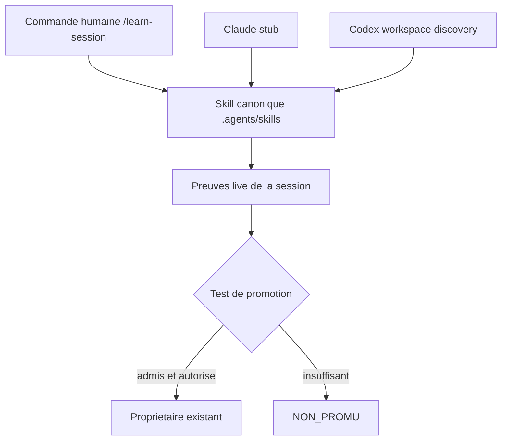

# Plan - partage cross-IA de la capitalisation des sessions

## 0. Bandeau de statut

| Champ | Valeur |
| --- | --- |
| ID | `PLAN_PARTAGE_CROSS_IA_CAPITALISATION_SESSIONS` |
| Statut | `PENDING` apres `/start`, puis `BASELINED` apres convergence post-route |
| Lifecycle | `TRIAGED`, puis `BASELINED` avant toute implementation |
| Track | `annexe` |
| Classification | `GOVERNANCE` |
| Workflow | `common` |
| Type de chantier | `SINGLE` |
| Verrou actif | Aucun workstream actif ; la copie personnelle Codex reste hors scope et ne doit pas etre modifiee |
| Source | `0 - HUMAN START HERE/PLAN_PARTAGE_CROSS_IA_CAPITALISATION_SESSIONS.md` |
| Brouillon archive attendu | `0 - HUMAN START HERE/archive/20260809_PLAN_PARTAGE_CROSS_IA_CAPITALISATION_SESSIONS.md` |

Le test `epic-orchestrator` conclut `SINGLE`. Le skill canonique est le
prerequis commun au pointeur Claude, au routage `/learn-session` et aux tests de
decouverte. Ces elements ne disposent pas de criteres de sortie autonomes et
ne peuvent pas etre clos utilement dans un ordre arbitraire.

## Audit IA de promotion

- [x] Intention humaine preservee : rendre la retrospective de session
      reutilisable par toutes les IA travaillant sur EBTA.
- [x] Autorite scientifique identifiee : aucune modification scientifique ;
      `Protocole/` reste intact et prioritaire.
- [x] Autorite procedurale identifiee : `AGENTS.md`, le skill canonique sous
      `.agents/skills/` et `.ai/workflows/common/WORKFLOW.md`.
- [x] Etat live relu : `.ai/checkpoint.json` ne declare aucun workstream actif.
- [x] Precedents verifies : les stubs `.claude/skills/` pointent vers les
      skills canoniques `.agents/skills/` sans recopier leur corps.
- [x] Source existante verifiee : le skill personnel Codex contient deja le
      noyau de la procedure a adapter, sans devenir une autorite EBTA.
- [x] Test multi-lot applique : `SINGLE`.
- [x] Scope destructif corrige : aucune suppression, aucun renommage et aucune
      edition du skill personnel Codex dans ce chantier.
- [x] BACKTRADER reste reference-only et hors scope.
- [x] Aucune implementation n'est autorisee par `/start`.

## Triage

| Champ | Valeur |
| --- | --- |
| Track | `annexe` |
| Lifecycle | `TRIAGED`, puis `BASELINED` |
| Type de chantier | `SINGLE` |
| Scope | Versionner une procedure cross-IA canonique, ajouter un pointeur Claude mince, declarer `/learn-session` dans le bootstrap et le workflow humain, puis valider decouverte et non-duplication. |
| Non-goals | Ne modifier ni `Protocole/`, ni `Implementation/`, ni BACKTRADER, ni `WORKFLOW.json`, ni la copie personnelle Codex ; ne creer aucun ledger, RAG, agent autonome, commit ou push implicite. |
| Source | Brouillon humain audite `0 - HUMAN START HERE/PLAN_PARTAGE_CROSS_IA_CAPITALISATION_SESSIONS.md`. |
| Exit criteria | Une seule procedure canonique versionnee est resolue par Claude et Codex dans EBTA ; `/learn-session` est borne ; les cas positif et `NON_PROMU` passent ; les zones hors scope restent intactes. |
| Dependances externes | Une nouvelle session Codex est requise pour observer le chemin de skill effectivement charge ; aucune API ni dependance logicielle nouvelle. |

## Carte d'execution IA

| Champ | Contenu operationnel |
| --- | --- |
| Objectif executable | Creer le skill cross-IA canonique `capture-coding-session-learnings` et une commande `/learn-session` qui promeut seulement des apprentissages prouves vers leurs proprietaires existants. |
| Autorite et lecture minimale | `AGENTS.md` -> `.ai/README.md` -> `.ai/checkpoint.json` -> `.ai/workflows/common/WORKFLOW.md` -> ce plan -> skill personnel source -> exemples de stubs Claude. |
| Perimetre autorise | `.agents/skills/capture-coding-session-learnings/SKILL.md`, `.claude/skills/capture-coding-session-learnings/SKILL.md`, `AGENTS.md`, `.ai/workflows/common/WORKFLOW.md`, ce plan pour les preuves d'execution. |
| Interdits absolus | `Protocole/`, `Implementation/`, BACKTRADER, `.ai/workflows/common/WORKFLOW.json`, `.ai/checkpoint.schema.json`, copie personnelle Codex, creation d'une memoire ou d'un ledger concurrent. |
| Phase de reprise | Phase 0 : enregistrer la baseline de decouverte et le hash de la copie personnelle hors depot sans la modifier. |
| Preuve attendue | Validation du skill, controles de pointeur/commande, deux cas de comportement, chemin charge dans une nouvelle session Codex, invariants Git et `git diff --check`. |
| Arret et escalade | Arreter si Codex ne peut pas resoudre la source EBTA a cause d'une precedence de la copie personnelle ; proposer alors un chantier local separe sans muter cette copie. |

## 1. Role de ce document et non-objectifs

| Element | Role |
| --- | --- |
| `Protocole/` | Autorite scientifique EBTA, intouchable dans ce chantier. |
| `.agents/skills/capture-coding-session-learnings/SKILL.md` | Procedure cross-IA canonique, non normative et sans etat projet. |
| `.claude/skills/.../SKILL.md` | Adaptateur de decouverte Claude, pointeur pur. |
| `AGENTS.md` | Bootstrap mince qui reconnait la commande et route vers la procedure. |
| `.ai/workflows/common/WORKFLOW.md` | Contrat humain de la commande ; ne stocke aucune retrospective. |
| Ce plan | Carte d'implementation et de preuve ; aucune autorite scientifique. |

Non-objectifs du document :

- ne pas transformer une retrospective en preuve de performance de trading ;
- ne pas persister automatiquement un apprentissage ;
- ne pas creer une base de connaissances, un journal de sessions ou un etat
  projet parallele ;
- ne pas rendre une copie personnelle necessaire au fonctionnement EBTA ;
- ne pas autoriser implicitement commit, push ou publication externe.

## 2. Contexte obligatoire a lire avant de coder

1. `AGENTS.md` et `.ai/README.md` pour les frontieres du cockpit.
2. `.ai/checkpoint.json`, puis les chemins actifs qu'il declare, pour confirmer
   que le chantier peut etre repris.
3. `.ai/governance/AI_MODIFICATION_CHECKLIST.md` et
   `.ai/workflows/common/WORKFLOW.md` pour le cycle gouverne.
4. Ce plan, en particulier les sections 5, 6, 8, 9 et 10.
5. `C:/Users/liant/.codex/skills/capture-coding-session-learnings/SKILL.md`
   comme source de contenu existante a adapter, jamais comme autorite EBTA.
6. Les stubs existants sous `.claude/skills/`, notamment
   `.claude/skills/code-architecture-evaluator/SKILL.md`.
7. Le skill systeme `skill-creator` disponible dans la session pour ses regles
   de frontmatter, de concision et de validation.

Hierarchie d'autorite :

```text
1. Protocole/ pour toute verite scientifique EBTA
2. AGENTS.md et .ai/workflows/common/ pour la procedure du depot
3. .agents/skills/capture-coding-session-learnings/SKILL.md pour /learn-session
4. Adaptateurs de decouverte propres a chaque IA
5. Copie personnelle Codex, hors depot et non autoritative pour EBTA
```

## 3. Etat des lieux

### Ce qui existe deja

| Module actuel | Chemin | Role reel verifie | Suffisant ? |
| --- | --- | --- | --- |
| Skill personnel | `C:/Users/liant/.codex/skills/capture-coding-session-learnings/SKILL.md` | Procedure de retrospective avec preuves, categories, promotion selective et autorisations. | A adapter aux proprietaires EBTA ; ne peut pas etre la source partagee. |
| Catalogue cross-IA | `.agents/skills/` | Catalogue versionne consulte via `AGENTS.md` et expose comme racine de skills de ce workspace. | Oui comme emplacement canonique. |
| Stubs Claude | `.claude/skills/*/SKILL.md` | Frontmatter de decouverte suivi d'un pointeur explicite vers `.agents/skills/`. | Oui comme precedent a reproduire. |
| Workflow commun | `.ai/workflows/common/WORKFLOW.md` | Contrat humain de `/start`, `/continue`, `/close` et publication locale. | A etendre par une commande sans transition machine. |
| Preuve de session optionnelle | `.ai/governance/TEMPLATE_PREUVE_SESSION_IA.json` | Gabarit copiable, sans registre, schema permanent ni gate `/close`. | A reutiliser comme destination possible, jamais obligatoire. |

### Ce qui manque reellement

| Brique manquante | Chemin cible | Source | Reutilisation imposee |
| --- | --- | --- | --- |
| Skill canonique EBTA | `.agents/skills/capture-coding-session-learnings/SKILL.md` | Intention humaine + skill personnel valide | Reprendre le noyau prouve et adapter les destinations EBTA. |
| Pointeur Claude | `.claude/skills/capture-coding-session-learnings/SKILL.md` | Precedents Claude existants | Reprendre uniquement le pattern de pointeur. |
| Routage commun | `AGENTS.md` et `.ai/workflows/common/WORKFLOW.md` | Bootstrap et workflow proprietaire | Ajouter une mention mince et un contrat detaille, sans toucher au JSON d'etats. |
| Preuve de resolution Codex | Nouvelle session Codex | Racine de skill repo exposee dans ce workspace | Verifier le chemin charge, pas seulement l'existence du dossier. |

## 4. Decision d'architecture

Principe directeur : une procedure versionnee unique sous `.agents/skills/`,
des adaptateurs de decouverte minces, et une promotion selective vers les
proprietaires existants.

Cette architecture evite deux erreurs : recopier la procedure pour chaque IA,
et creer un ledger de retrospectives qui concurrencerait les plans, workflows,
tests ou documents proprietaires. La commande `/learn-session` ne modifie pas
le cycle d'un workstream ; `WORKFLOW.json` doit donc rester inchangé.



### Frontieres explicites

| Couche | Elle fait | Elle ne fait pas |
| --- | --- | --- |
| Skill canonique | Analyse, classe, propose et persiste seulement sous autorisation. | Ne cree ni verdict EBTA, ni source d'etat, ni succes artificiel. |
| Stub Claude | Rend le trigger visible et pointe vers la source canonique. | Ne paraphrase pas la procedure. |
| Bootstrap/workflow | Declare la commande et ses autorisations separees. | Ne stocke pas le contenu des sessions. |
| Proprietaires existants | Recoivent un apprentissage admis dans leur responsabilite. | Ne recoivent ni bruit, ni secret, ni fait non prouve. |

### Decisions deja actees

| Decision | Justification |
| --- | --- |
| Source canonique sous `.agents/skills/` | Catalogue cross-IA versionne deja etabli par le depot. |
| Stub Claude pur | Precedent reel et absence de duplication. |
| Aucun changement de `WORKFLOW.json` | `/learn-session` ne change aucun stage de workstream. |
| Copie personnelle Codex hors scope | Mutation hors depot, destructive ou transversale, non autorisee par `/start`. |
| `SINGLE` | Toutes les phases dependent du skill canonique et partagent un seul Exit criteria. |

### Structure cible

```text
.agents/skills/capture-coding-session-learnings/
  SKILL.md
.claude/skills/capture-coding-session-learnings/
  SKILL.md
AGENTS.md
.ai/workflows/common/WORKFLOW.md
```

### Perimetre de fichiers explicite

Autorises :

```text
.agents/skills/capture-coding-session-learnings/SKILL.md   [CREER - Phase 1]
.claude/skills/capture-coding-session-learnings/SKILL.md  [CREER - Phase 2]
AGENTS.md                                                  [MODIFIER - Phase 3]
.ai/workflows/common/WORKFLOW.md                           [MODIFIER - Phase 3]
.ai/backlog/annexes/PLAN_PARTAGE_CROSS_IA_CAPITALISATION_SESSIONS.md [METTRE A JOUR - preuves]
```

Interdits :

```text
Protocole/                                                 [NORME - intouchable]
Implementation/                                            [RUNTIME - hors scope]
.ai/workflows/common/WORKFLOW.json                         [CONTRAT D'ETATS - inchangé]
.ai/checkpoint.schema.json                                 [SCHEMA - inchangé]
D:/TRADING/.../BACKTRADER/                                 [REPO EXTERNE - reference-only]
C:/Users/liant/.codex/skills/capture-coding-session-learnings/ [HORS DEPOT - aucune mutation]
```

## 5. Decoupage en phases

### Phase 0 - Etablir la baseline de decouverte

Objectif : enregistrer les faits necessaires sans muter le skill personnel.

Classification : GOVERNANCE

Actions :

- relever le chemin du skill actuellement charge par Codex et la racine repo
  `.agents/skills/` exposee dans le workspace ;
- calculer le hash SHA-256 du skill personnel pour pouvoir prouver qu'il reste
  intact ;
- confirmer l'absence du skill canonique et du stub cibles avant creation.

Livrables :

- entree datee dans la section 13 avec chemin charge et hash initial ;
- constat explicite des deux fichiers a creer.

Critere de sortie :

- baseline consignée sans aucune mutation hors depot.

### Phase 1 - Canonicaliser la procedure cross-IA

Objectif : creer un skill EBTA concis, declenchable et sans autorite concurrente.

Classification : GOVERNANCE

Actions :

- creer le dossier via le processus `skill-creator`, puis conserver seulement
  les ressources necessaires au standard du catalogue EBTA ;
- adapter le skill personnel avec `TRIGGER`, `SKIP`, categories, test de
  promotion, destinations EBTA, autorisations separees et preservation des
  verdicts `FAIL`, `DENIED`, `INCONCLUSIVE` ;
- interdire toute persistance automatique ou creation systematique de skill.

Livrables :

- `.agents/skills/capture-coding-session-learnings/SKILL.md` ;
- validation `quick_validate.py` en succes.

Critere de sortie :

- le skill passe le validateur et ne contient ni placeholder, ni source d'etat,
  ni procedure de commit/push implicite.

### Phase 2 - Ajouter les adaptateurs de decouverte

Objectif : faire resoudre la meme procedure canonique par Claude et Codex.

Classification : GOVERNANCE

Actions :

- creer le stub Claude selon les precedents existants ;
- verifier mecaniquement qu'il pointe vers le skill canonique et n'en recopie
  pas le corps ;
- ouvrir une nouvelle session Codex et relever le chemin du skill effectivement
  charge ;
- si la copie personnelle masque la source EBTA, arreter avec un echec explicite
  et proposer un chantier local separe, sans modifier la copie.

Livrables :

- `.claude/skills/capture-coding-session-learnings/SKILL.md` ;
- preuves des chemins resolus par Claude et Codex.

Critere de sortie :

- les deux IA resolvent `.agents/skills/capture-coding-session-learnings/SKILL.md`
  comme corps canonique ; aucun adaptateur ne contient la procedure complete.

### Phase 3 - Declarer la commande commune

Objectif : exposer `/learn-session` sans creer de transition machine.

Classification : GOVERNANCE

Actions :

- ajouter une ligne de routage mince dans `AGENTS.md` ;
- ajouter dans `.ai/workflows/common/WORKFLOW.md` le contrat complet de la
  commande : analyse, proposition, persistance, commit et push sont des
  autorisations distinctes ;
- citer le skill canonique comme procedure proprietaire.

Livrables :

- bootstrap et workflow documentes ;
- `WORKFLOW.json` strictement inchangé.

Critere de sortie :

- une IA froide sait quand invoquer la commande, quoi lire, quand persister et
  quand s'arreter, sans nouvelle source d'etat.

### Phase 4 - Tester la promotion selective et les invariants

Objectif : prouver que le skill capitalise une preuve utile sans promouvoir le bruit.

Classification : TEST_FIXTURE

Actions :

- executer un cas positif borne qui satisfait le test de promotion ;
- executer un cas insuffisant qui doit rester `NON_PROMU` ;
- verifier la preservation de `FAIL`, `DENIED` et `INCONCLUSIVE` ;
- verifier les chemins touches, la copie personnelle intacte et l'hygiene du diff.

Livrables :

- resultats factuels consignés en section 13 ;
- aucune persistance reelle issue des cas de test hors artefacts temporaires
  explicitement nettoyes.

Critere de sortie :

- les deux cas ont les sorties attendues, tous les invariants de scope passent
  et aucun faux succes n'est observe.

## 6. Artefacts produits

| Etape | Fichier ou sortie | Format | Regle source |
| --- | --- | --- | --- |
| Phase 1 | `.agents/skills/capture-coding-session-learnings/SKILL.md` | Markdown + frontmatter YAML | `skill-creator` et conventions EBTA |
| Phase 2 | `.claude/skills/capture-coding-session-learnings/SKILL.md` | Pointeur Markdown | Stubs Claude existants |
| Phase 3 | `AGENTS.md` | Routage court | Bootstrap EBTA |
| Phase 3 | `.ai/workflows/common/WORKFLOW.md` | Contrat humain | Workflow common |
| Phase 4 | Section 13 de ce plan | Preuves en prose bornees | Workflow de cloture |

## 7. Invariants absolus et NO GO

### Invariants

1. `Protocole/` reste l'unique autorite scientifique et n'est pas modifie.
2. `.agents/skills/.../SKILL.md` est l'unique corps canonique EBTA de la
   procedure ; les adaptateurs ne font que pointer.
3. Une retrospective ne transforme jamais `FAIL`, `DENIED`, `INCONCLUSIVE`,
   timeout ou absence de sortie en `PASS`.
4. Une persistance, un commit, un push et une publication externe exigent chacun
   leur autorisation correspondante.
5. Aucun secret, fait non verifie ou sortie brute volumineuse n'est promu.
6. La copie personnelle Codex reste byte-for-byte intacte dans ce chantier.

### NO GO

- Modifier `Protocole/`, `Implementation/`, BACKTRADER ou `WORKFLOW.json`.
- Supprimer, renommer ou editer le skill personnel Codex.
- Copier le corps du skill dans `.claude/skills/`, `AGENTS.md` ou le workflow.
- Creer un ledger, une base memoire, un RAG, des embeddings ou un agent autonome.
- Promouvoir automatiquement chaque retrospective ou chaque detail ponctuel.
- Declarer la portabilite Codex sans preuve du chemin effectivement charge.
- Commettre ou pousser implicitement depuis `/learn-session`.

## 8. Verification a chaque etape

Phase 0 :

```powershell
Get-FileHash -Algorithm SHA256 -LiteralPath 'C:\Users\liant\.codex\skills\capture-coding-session-learnings\SKILL.md'
Test-Path -LiteralPath '.agents\skills\capture-coding-session-learnings\SKILL.md'
Test-Path -LiteralPath '.claude\skills\capture-coding-session-learnings\SKILL.md'
```

Phase 1 :

```powershell
python 'C:\Users\liant\.codex\skills\.system\skill-creator\scripts\quick_validate.py' '.agents\skills\capture-coding-session-learnings'
rg -n "BIEN_FAIT|A_REUTILISER|ERREUR_OU_FRICTION|NON_PROMU|FAIL|DENIED|INCONCLUSIVE" '.agents\skills\capture-coding-session-learnings\SKILL.md'
```

Phase 2 :

```powershell
rg -n "\.agents/skills/capture-coding-session-learnings/SKILL\.md" '.claude\skills\capture-coding-session-learnings\SKILL.md'
$stubLines = (Get-Content -LiteralPath '.claude\skills\capture-coding-session-learnings\SKILL.md').Count
if ($stubLines -gt 45) { throw "Stub Claude trop long: $stubLines lignes" }
```

La preuve Codex exige en plus une nouvelle session et le chemin du skill charge.
La simple presence du fichier n'est pas un PASS.

Phase 3 :

```powershell
rg -n "/learn-session|capture-coding-session-learnings" AGENTS.md '.ai\workflows\common\WORKFLOW.md'
git diff --exit-code -- '.ai\workflows\common\WORKFLOW.json'
```

Phase 4 et validation transversale :

```powershell
python -m json.tool '.ai\checkpoint.json' > $null
python -c "import json, jsonschema; jsonschema.validate(json.load(open('.ai/checkpoint.json', encoding='utf-8')), json.load(open('.ai/checkpoint.schema.json', encoding='utf-8')))"
git diff --check -- AGENTS.md .agents .claude '.ai\workflows\common\WORKFLOW.md' '.ai\backlog\annexes\PLAN_PARTAGE_CROSS_IA_CAPITALISATION_SESSIONS.md'
git diff --exit-code -- Protocole Implementation '.ai\workflows\common\WORKFLOW.json' '.ai\checkpoint.schema.json'
Get-FileHash -Algorithm SHA256 -LiteralPath 'C:\Users\liant\.codex\skills\capture-coding-session-learnings\SKILL.md'
```

Le dernier hash doit etre identique a celui consigne en Phase 0. Toute commande
indisponible sur une autre machine doit etre remplacee par le validateur
`skill-creator` effectivement expose dans cette session et la substitution doit
etre consignée ; elle ne peut pas etre simulee.

Premier lot executable propose :

```text
Phase 0 puis Phase 1 - baseline de decouverte et skill canonique
```

### Execution sans interruption

Le plan peut enchainer ses phases sans nouvelle decision humaine tant que le
scope ferme et les invariants sont respectes. Les seuls arrets legitimes sont :

1. la nouvelle session Codex charge encore la copie personnelle au lieu de la
   source EBTA ;
2. une modification hors de la liste autorisee devient necessaire ;
3. une validation echoue apres corrections bornees ;
4. toutes les phases et la Definition of Done sont satisfaites.

### Autorite decisionnelle accordee

L'IA peut ajuster la redaction du skill et du workflow, creer les deux fichiers
prevus et corriger leurs tests dans le scope ferme. Elle ne peut pas changer la
doctrine EBTA, modifier un fichier hors scope, ni deduire une autorisation de
mutation externe.

### Interdiction des raccourcis

Une presence de fichier, un trigger visible ou un test positif unique ne prouve
pas la portabilite. Tout echec doit rester visible ; aucun test ne peut etre
affaibli, ignore ou remplace par une affirmation narrative.

## 9. Journal des decisions humaines

| Date | Decision | Portee |
| --- | --- | --- |
| 2026-08-09 | Consigner les bonnes et mauvaises pratiques et transformer la commande de capitalisation en skill. | Autorise la conception du skill. |
| 2026-08-09 | Rendre ce skill utilisable par toutes les IA travaillant sur EBTA. | Fixe la cible cross-IA et la source versionnee dans le depot. |
| 2026-08-09 | Executer `/start` sur le brouillon nomme. | Autorise audit, restructuration, routage et baseline ; n'autorise ni `/continue`, ni implementation, ni mutation hors depot. |

## 10. Risques et blocages connus

| Risque | Impact | Mitigation ou condition de deblocage |
| --- | --- | --- |
| La copie personnelle masque la source EBTA dans Codex | Deux procedures homonymes peuvent diverger. | Test en nouvelle session ; si echec, blocage et chantier local separe sur autorisation explicite. |
| Le stub Claude duplique la procedure | Deux sources versionnees divergent. | Taille bornee, pointeur direct et revue mecanique. |
| `/learn-session` devient un raccourci de publication | Mutation externe non autorisee. | Autorisations separees ecrites dans le skill et le workflow. |
| La retrospective devient un nouveau ledger | Concurrence avec le cockpit et les proprietaires existants. | Promotion selective ; `NON_PROMU` obligatoire ; aucun journal par defaut. |
| Le validateur systeme change de chemin | Faux echec de portabilite. | Resoudre le `skill-creator` expose dans la session et consigner la commande reelle. |

## 11. Definition of Done

- [ ] Toutes les phases sont executees et validees individuellement.
- [ ] Le skill canonique existe sous `.agents/skills/` et passe son validateur.
- [ ] Claude et une nouvelle session Codex resolvent le meme corps canonique.
- [ ] Aucun adaptateur ne duplique la procedure.
- [ ] `/learn-session` est documente dans `AGENTS.md` et le workflow humain,
      sans modification de `WORKFLOW.json`.
- [ ] Analyse, persistance, commit et push restent des autorisations distinctes.
- [ ] Un cas positif est promu et un cas insuffisant reste `NON_PROMU`.
- [ ] `FAIL`, `DENIED` et `INCONCLUSIVE` sont preserves.
- [ ] La copie personnelle Codex conserve le hash enregistre en Phase 0.
- [ ] Aucun ledger, schema, RAG, agent autonome ou dependance n'est introduit.
- [ ] `Protocole/`, `Implementation/` et BACKTRADER restent inchanges.
- [ ] Les validations JSON et `git diff --check` passent.
- [ ] Aucun placeholder, stub fonctionnel ou faux succes ne subsiste.

## 12. Cloture

| Champ | Valeur |
| --- | --- |
| Resultat final | A remplir lors de `/close`. |
| Ecarts par rapport au plan initial | A remplir lors de `/close`. |
| Suites a prevoir | Eventuel chantier local de precedence Codex, uniquement si le test Phase 2 echoue et apres autorisation humaine explicite. |

## 13. Resultats d'execution

| Date | Phases executees | Artefact produit | Validation | Ecart |
| --- | --- | --- | --- | --- |
| A remplir | A remplir | A remplir | A remplir | A remplir |

## 14. Journal d'audits post-hoc

| Date | Passe | Verdict | Ce qui a ete corrige | Pourquoi |
| --- | --- | --- | --- | --- |
| 2026-08-09 | 1 post-route | `A_CORRIGER`, risque modere | Le test de precedence Codex est rendu observable en nouvelle session ; la copie personnelle est sortie du scope executable ; les commandes et chemins autorises sont fermes. | Eviter une suppression hors depot et un faux succes de decouverte fonde sur la seule presence du fichier. |
| 2026-08-09 | 2 post-route | `CONVERGE`, risque minimal | Le type `SINGLE`, l'arret sur precedence, les preuves par phase et la non-modification de `WORKFLOW.json` sont confirmes apres relecture du plan route. | Aucun nouvel angle mort majeur apres confrontation au checkpoint route, au repo, au workflow common, aux stubs Claude et au skill source. |
