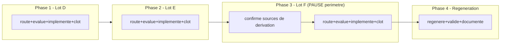

# Plan — Chantier mere : attestations residuelles R3 (Lots D, E, F) et regeneration du package persistant

> Chantier mere de **suivi**, pas d'implementation directe — structure selon
> `.agents/skills/epic-orchestrator/SKILL.md` (test de detection multi-lot
> applique et documente section 0), meme patron que
> `EPIC_CLOTURE_ATTESTATIONS_RESIDUELLES_GATES` (Lots C/A2/B, `DONE` commit
> `063246b`, precedent qui a motive ce skill). Il ne modifie aucun fichier de
> `Implementation/` lui-meme ; il coordonne trois sous-chantiers `fix`
> distincts (Lot D, Lot E, Lot F) plus une phase finale de regeneration,
> chacun route, audite, implemente et clos independamment via son propre
> cycle `/start` -> `/evaluate` x2 -> baseline -> `/continue` -> bug-hunter +
> conformance -> `/close`, en suivant la "Boucle par lot" de
> `.agents/skills/epic-orchestrator/SKILL.md` section "Procedure" (revalider
> la nature de chaque lot dans le code reel avant redaction, ne jamais
> fusionner deux lots dans un commit/boucle `/evaluate`/cloture). Redige a
> partir de la note d'intake
> `0 - HUMAN START HERE/EPIC_ATTESTATIONS_RESIDUELLES_R3_INVARIANT_EVIDENCE.md`
> (contenu de fond preserve, structure reformattee selon
> `.ai/backlog/TEMPLATE_PLAN_IMPLEMENTATION.md`). Boucle `/evaluate`
> (code-architecture-evaluator) executee et convergee sur cette note en 2
> passes le 2026-07-17 — voir section 10.

---

## 0. Bandeau de statut (a verifier avant toute promotion)

| Question | Reponse |
| --- | --- |
| Un chantier actif couvre-t-il deja ce perimetre (`DONE`, `ACTIVE`, ou `SUPERSEDED`) ? | Non. `.ai/checkpoint.json::active_workstream_id` est `null`. `EPIC_CLOTURE_ATTESTATIONS_RESIDUELLES_GATES` (Lots C/A2/B) est `DONE` mais ne couvre pas G2/G3/G4/G5/G7-residuel/G8/G10 ni `invariant_evidence.json`. |
| Un verrou de gouvernance actif bloque-t-il ce chantier ? | Non. Aucun verrou actif ne couvre ce perimetre precis. |
| Ce plan a-t-il besoin d'une decision humaine explicite pour lever ce verrou avant d'etre routable via `/start` ? | Non pour le routage de ce chantier mere. Les decisions de perimetre necessaires (post-OOS/live hors perimetre, decoupage D/E, inclusion de la regeneration, fusion des deux bugs trouves en passe 1 `/evaluate` dans D/E) sont deja actees le 2026-07-17 (section 10). Le perimetre exact du Lot F et la source de `test_reports` (G7) restent a trancher au `/start` de chaque sous-chantier concerne, pas ici. |
| Ce plan remplace-t-il un document ou chantier existant ? | Non. Il complete `EPIC_CLOTURE_ATTESTATIONS_RESIDUELLES_GATES` sans le rouvrir. |

### Test de detection multi-lot (`.agents/skills/epic-orchestrator/SKILL.md`)

Applique explicitement (obligatoire au moment du `/start`, pas a laisser
implicite). Verdict : **multi-lot, ce skill s'applique** — Lot D, Lot E et
Lot F satisfont les trois conditions simultanement :

1. Exit criteria independants : Lot D (G2/G3/G4/G5/G7-residuel/G10), Lot E
   (G8) et Lot F (`invariant_evidence.json`) ont chacun un Exit criteria
   verifiable sans dependre de l'etat des deux autres (section 5).
2. Ordre non contraint par le sens : Lot D et Lot E touchent des fonctions
   distinctes (`_write_reports()`/`registry_lineage.py` vs
   `_oos_access_request()`/`oos_access.py`) ; leur ordre relatif pourrait
   etre inverse sans changer le sens de l'un ou l'autre. Lot F ne depend
   techniquement d'aucun des deux (seule sa confirmation de perimetre le
   retient, section 5 Phase 3).
3. Un blocage sur un lot n'empeche pas les autres : la pause de Lot F
   (confirmation de perimetre requise) ne bloque pas Lot D ni Lot E.

Consequence mecanique (`.agents/skills/epic-orchestrator/SKILL.md` section
"Contrainte structurelle a respecter") : chaque lot devient son propre
workstream distinct, route separement par son propre `plan.ps1 start`, avec
un `routing_reason` commencant par
`"Sous-chantier <n>/<total> de EPIC_ATTESTATIONS_RESIDUELLES_R3"` — jamais de
`parent_workstream_id` dans `.ai/checkpoint.schema.json` (le lien reste
narratif). Ce chantier mere ne code et n'implemente rien lui-meme.

---

## Audit IA de promotion

- [x] Plan relu dans le contexte du cockpit actif (`AGENTS.md`, `.ai/README.md`, `.ai/checkpoint.json`, `Implementation/Active/HOOK.md`, `Implementation/Active/tracking.json`).
- [x] Bandeau de statut rempli et verifie contre l'etat machine reel.
- [x] Ce plan est ECRIT COMME NOUVEAU FICHIER dans `.ai/backlog/fixes/` ; le brouillon original `0 - HUMAN START HERE/EPIC_ATTESTATIONS_RESIDUELLES_R3_INVARIANT_EVIDENCE.md` sera archive tel quel par `plan.ps1 start`.
- [x] Chantier classe `fix` (corrige un ecart de production deja identifie : attestations codees en dur et deux bugs de calcul), avec un role de suivi/coordination plutot que d'implementation directe.
- [x] Autorite normative identifiee : `Protocole/PAQUET D'EXECUTION EBTA.md` sections 2 et 4 (gates G0-G14, notamment G2/G3/G4/G5/G7/G8/G10) ; SOP 03 (registry lineage), SOP 10 (acces OOS), SOP 08/09B (economique).
- [x] Perimetre de fichiers autorises/interdits explicite (section 5) : ce chantier mere ne modifie AUCUN fichier de `Implementation/` — seuls les sous-chantiers le font.
- [x] Aucune modification hors perimetre requise pour activer ce chantier mere.
- [x] Prerequis factuels verifies dans le code le 2026-07-17 (section 3) : les champs G2/G3/G4/G5/G7-residuel/G8/G10 sont verifies un a un comme litteraux `True` dans `build_research_package.py:255-309` ; deux bugs de fond sont verifies directement (`review_registry_lineage()` tautologique, `wrc_pass` fige dans `_oos_access_request()`).
- [x] Etat des lieux (section 3) verifie directement dans le code (`economic_gate.py`, `oos_access.py`, `registry_lineage.py`, `gate_validator.py::GATE_REQUIREMENTS`), pas suppose.

## Triage

| Champ | Valeur |
| --- | --- |
| Track | `fix` |
| Lifecycle | `TRIAGED` |
| Type de chantier | `MULTI_LOT` — verdict deja motive et documente ci-dessus ("Test de detection multi-lot", section 0). Champ ajoute a posteriori (2026-07-17) pour se conformer au garde-fou mecanique introduit dans `plan.ps1`/`TEMPLATE_PLAN_IMPLEMENTATION.md` apres la redaction initiale de ce plan — voir section 10. |
| Scope | Chantier mere de suivi (aucune modification directe de `Implementation/`) qui coordonne trois sous-chantiers `fix` (Lot D, Lot E, Lot F) et une phase finale de regeneration, pour que les champs residuels de `gates.json` (G2/G3/G4/G5/G7-residuel/G8/G10) et les valeurs fabriquees de `invariant_evidence.json` derivent de rapports/registres reels au lieu de litteraux `True`/valeurs figees, en corrigeant au passage deux bugs de calcul deja existants (registre tautologique pour G2, `wrc_pass` fige pour G8) trouves lors de la boucle `/evaluate`. |
| Non-goals | Ne pas rouvrir G2 (`independent_registry_review`), G7 (`independent_pre_oos_approval`), G13/G14 (`kill_switch`, `live_approval`, `lifecycle_archive`, `incident_log`, `retention_policy`, `live_version_id`) deja exclus par decision humaine du 2026-07-16 et reconduits le 2026-07-17. Ne pas construire un vrai cycle paper trading/deploiement live/kill switch. Ne pas fusionner Lot D et Lot E dans un seul commit ou une seule boucle `/evaluate`. Ne pas etendre `.ai/checkpoint.schema.json` (pas de `parent_workstream_id`). Ne jamais modifier `Protocole/`, `validators/gate_validator.py::VERDICT_VALUES`/`GATE_REQUIREMENTS`, `governance/`, les manifests, ni les lots C/A2/B deja clos. |
| Source | Demande humaine du 2026-07-17 de poursuivre le sujet R3-residuel identifie dans `AUDIT_MATURITE_MOTEUR_RECHERCHE_2026-07-13.md` (Partie A) apres cloture de `EPIC_CLOTURE_ATTESTATIONS_RESIDUELLES_GATES`. Note d'intake convergee en 2 passes `/evaluate` : `0 - HUMAN START HERE/archive/20260717_EPIC_ATTESTATIONS_RESIDUELLES_R3_INVARIANT_EVIDENCE.md` (apres archivage par ce `/start`). |
| Exit criteria | (1) Lot D `DONE` dans `.ai/checkpoint.json` (G2/G3/G4/G5/G7-residuel/G10 derives de statuts reels, bug `review_registry_lineage()` corrige ou son remplacement documente, suite runtime `PASS`, bug-hunter et audit de conformite sans ouverture). (2) Lot E `DONE` dans les memes conditions (G8 derive de `oos_access_decision` corrige, bug `wrc_pass` fige corrige, test de contraste WRC-FAIL-donc-acces-refuse `PASS`). (3) Lot F `DONE` ou explicitement differe par decision humaine documentee (section 10), pour `invariant_evidence.json`. (4) Package persistant `nautilus_mvp` regenere et `validate_package_dir()` execute, avec le statut de chaque gate affecte documente explicitement (y compris un basculement `PASS` -> `FAIL`/`INCONCLUSIVE` accepte comme succes). (5) Ce chantier mere lui-meme cloture (`plan.ps1 close`) seulement quand (1), (2), (3) et (4) sont satisfaits. |

## Sous-chantiers

> Section ajoutee a posteriori (2026-07-17, voir section 10) pour se
> conformer au format exige par `plan.ps1`/`TEMPLATE_PLAN_IMPLEMENTATION.md`
> depuis le commit `568b8c8`. Les trois lots suivants sont les seuls a
> satisfaire le test de detection multi-lot (section 0) — la Phase 4
> "Regeneration du package persistant" en est deliberement exclue : elle
> depend structurellement de l'achevement de D/E/F (elle regenere le package
> pour refleter leurs corrections), ce n'est donc pas un lot independant au
> sens du test, mais la propre activite de cloture de ce chantier mere
> (comme la "Cloture generale" de `.agents/skills/epic-orchestrator/SKILL.md`
> section 3). Les ID ci-dessous sont ceux qui DOIVENT etre utilises au
> `/start` de chaque lot (`plan.ps1 start -Id <ID prevu> ...`), sinon
> `plan.ps1 continue`/`close` sur ce chantier mere ne les reconnaitront pas.

| # | ID prevu | Titre |
| --- | --- | --- |
| 1 | PLAN_CORRECTION_REGISTRE_ECONOMIQUE_LOT_D | Lot D - G2/G3/G4/G5/G7-residuel/G10 (registre, WRC/robustesse, economique) |
| 2 | PLAN_CORRECTION_ACCES_OOS_LOT_E | Lot E - G8 acces OOS et correction du bug wrc_pass fige |
| 3 | PLAN_CORRECTION_INVARIANT_EVIDENCE_LOT_F | Lot F - invariant_evidence.json non fabrique |

## Statut

| Champ | Valeur |
| --- | --- |
| Statut | `BLOQUE - Lots D/E DONE ; Lot F attend decision de source pour pre_oos_sealed_at` |
| Date de creation | 2026-07-17 |
| Date d'activation | 2026-07-17 |
| Autorite normative | `Protocole/PAQUET D'EXECUTION EBTA.md` (gates G0-G14) ; SOP 03 (Lot D, registry lineage) ; SOP 10 (Lot E, acces OOS) ; SOP 08/09B (Lot D, gate economique G10) — gelees, non modifiees par ce chantier |
| Autorite executable | `Implementation/examples/minimal_pilot_pipeline/build_research_package.py::_write_reports()`/`_procedure_reports()`/`_oos_access_request()` ; `Implementation/ebta_engine/procedures/registry_lineage.py` ; `Implementation/ebta_engine/procedures/oos_access.py` (chemin partage par le pilote et par la production Nautilus, modifie uniquement par les sous-chantiers) |
| Changement normatif attendu | Aucun — application de regles deja normatives (des verdicts deja calcules, ou calculables a partir de donnees deja ecrites comme `registry.jsonl`, doivent conditionner les gates qui en dependent), pas de nouvelle regle |
| Dependances externes | Aucune nouvelle pour ce chantier mere. Chaque sous-chantier documente les siennes. |

---

## 1. Role de ce document et non-objectifs

| Element | Role |
| --- | --- |
| `Protocole/PAQUET D'EXECUTION EBTA.md` | Autorite normative des gates G0-G14. Inchangee. |
| `Implementation/ebta_engine/validators/gate_validator.py::GATE_REQUIREMENTS`/`VERDICT_VALUES` | Agregateur deja correct (verifie section 3.2). Inchange par ce chantier mere et ses sous-chantiers. |
| `Implementation/examples/minimal_pilot_pipeline/build_research_package.py::_write_reports()`/`_procedure_reports()`/`_oos_access_request()` | Chemin fautif partage par le pilote et la production Nautilus — modifie uniquement par les sous-chantiers D, E, F, chacun dans son perimetre de champs propre. |
| Ce document | Carte de coordination : ordre des lots, decisions deja actees, mecanisme de suivi sans modification de schema. Ne code rien lui-meme. |

Non-objectifs :

- ne pas reecrire `Protocole/` ni les SOP citees ;
- ne pas introduire de regle, seuil, ou verdict absent des autorites normatives citees par chaque sous-chantier ;
- ne pas transformer ce document en un quatrieme sous-chantier d'implementation — il reste un document de suivi pur ;
- ne pas etendre `validators/gate_validator.py::VERDICT_VALUES`/`GATE_REQUIREMENTS` pour un besoin local a un sous-chantier ;
- ne pas faire de la regeneration du package persistant une condition de succes garanti `PASS` — un statut reel `FAIL`/`INCONCLUSIVE` apres correction est un succes du chantier, pas un echec.

---

## 2. Contexte obligatoire a lire avant de coder

1. `AGENTS.md`, `.ai/README.md`, `.ai/checkpoint.json`, `Implementation/Active/HOOK.md`, `Implementation/Active/tracking.json` — etat machine courant (aucun workstream actif).
2. `0 - HUMAN START HERE/archive/20260717_EPIC_ATTESTATIONS_RESIDUELLES_R3_INVARIANT_EVIDENCE.md` (apres archivage) — la note source, notamment les sections 1.5 (bugs trouves en passe 1 `/evaluate`) et 4 (decoupage propose).
3. `.ai/archive/20260717_EPIC_CLOTURE_ATTESTATIONS_RESIDUELLES_GATES.md` — le chantier mere precedent deja clos, dont chaque sous-chantier de ce plan reprend le patron de correction et de preuve (`_g9_gate_value()`, `_g6_capacity_grid_gate()`, etc.).
4. `Protocole/PAQUET D'EXECUTION EBTA.md` sections 2 et 4 (definition des gates G0-G14, notamment G2/G3/G4/G5/G7/G8/G10).
5. Le plan restructure de chaque sous-chantier au moment ou il est route (lu a ce moment, pas a l'avance).

**Hierarchie d'autorite** :

```text
1. Protocole/MANIFESTE DE GEL EBTA.md
2. Protocole/PROTOCOLE EBTA.md
3. Protocole/REGISTRE DES DECISIONS NORMATIVES EBTA.md
4. SOP 01-13 (selon le sous-chantier : SOP 03 pour D/G2 ; SOP 10 pour E/G8 ; SOP 08/09B pour D/G10)
5. Protocole/PAQUET D'EXECUTION EBTA.md
6. Implementation/ (dont ce plan et ses sous-chantiers)
7. Adaptateurs externes (NautilusTrader)
```

---

## 3. Etat des lieux (avant/apres) — reutiliser avant de recreer

### 3.1 Table des gates concernes

| Gate | Champs residuels vises | Lot |
| --- | --- | --- |
| G2 | `registry_initialized`, `candidate_catalog`, `local_matrix` | Lot D |
| G3 | `selection_rule`, `train_only_calibration_log` | Lot D |
| G4 | `wrc_report`, `wrc_family_matrix` | Lot D |
| G5 | `robustness_report`, `robustness_matrix` | Lot D |
| G7 (residuel, apres Lot C) | `test_reports` | Lot D |
| G8 | `oos_access_log`, `opening_authorization`, `single_oos_execution_log` | Lot E |
| G10 | `economic_report`, `statistical_gate_report`, `economic_gate_report` | Lot D |
| — | `invariant_evidence.json` (`pre_oos_sealed_at`, `oos_openings[].wrc_local_status`, `transformation_fits`, `decision_events`) | Lot F |

### 3.2 Ce qui existe deja et fonctionne (verifie 2026-07-17)

| Module | Chemin | Role reel (verifie) | Suffisant pour reutilisation directe ? |
| --- | --- | --- | --- |
| `validate_gates()` / `GATE_REQUIREMENTS` | `validators/gate_validator.py:19-53` | `_requirement_satisfied()` traite deja toute valeur `PASS`/`FAIL`/`INCONCLUSIVE` correctement (n'accepte que `PASS`) ; sinon `bool(value)`. Deja utilise avec succes par G1/G6/G7-partiel/G9/G11/G12/G13-partiel (Lots C/A2/B). | ✅ Reutiliser tel quel — aucune extension necessaire |
| `procedure_reports["wrc"]` | `build_research_package.py:434-441` | Verdict WRC deja reel (`wrc["verdict"]`), deja propage a `wrc_status` (Lot correction WRC-masque 2026-07-15). | ✅ Reutiliser pour deriver `wrc_report`/`wrc_family_matrix` (Lot D) |
| `procedure_reports["robustness"]` | `build_research_package.py:455` | Statut reel deja propage a `pre_oos_robustness_verdict` (Lot G5 2026-07-16). | ✅ Reutiliser pour deriver `robustness_report`/`robustness_matrix` (Lot D) |
| `economic_gate_report()` | `procedures/economic_gate.py:14-40` | Retourne deja `economic_status`, `statistical_status`, `global_status` separement, sources distinctes et deja calculees (verifie en passe 2 `/evaluate`). | ✅ Reutiliser pour deriver `economic_report`/`statistical_gate_report`/`economic_gate_report` (Lot D, G10) |
| `procedures/oos_access.py::authorize_oos_access()` | deja appele `build_research_package.py:458`, resultat stocke `procedure_reports["oos_access_decision"]`, ecrit dans `reports/oos_access_decision.json` | Calcule deja `status` `AUTHORIZED`/`DENIED` a partir de 6 flags requis. Jamais propage vers `gates.json`. | ✅ Reutiliser pour deriver G8 (Lot E) — apres correction du flag `wrc_pass` (voir 3.3) |
| `_write_registry()` | `build_research_package.py:149-182` | Ecrit deja les evenements `REGISTER_CANDIDATE` reels dans `registry.jsonl`, appele AVANT `_write_reports()` dans `build_package()`. | ✅ Source potentielle pour un vrai calcul G2 (Lot D), apres clarification de "registered vs influential" (section 3.3) |
| `_g9_gate_value()`, `_g6_capacity_grid_gate()`, `_g6_cost_model_gate()` | `build_research_package.py:190-227` | Patron deja etabli et teste : fonction dediee `_gN_xxx_gate()` par champ plutot qu'un dict geant avec littéraux inline. | ✅ Reutiliser ce patron pour les nouvelles fonctions `_g2_registry_gate()`, `_g8_oos_access_gate()`, etc. (Lot D/E) |

### 3.3 Ce qui manque reellement (dont deux bugs trouves lors de la boucle `/evaluate`)

| Brique manquante | Module a modifier | Sous-chantier |
| --- | --- | --- |
| Propagation de `wrc["verdict"]`/`robustness["status"]`/`economic_gate_report()` vers G2(partiel via 3.3-bug)/G4/G5/G10 | `_write_reports()` | Lot D |
| **Bug** : `review_registry_lineage(candidate_ids, candidate_ids)` (`build_research_package.py:516`) est appele avec la MEME liste comme `registered_candidates` et `influential_candidates`, sans `lineage_events` -> `missing`/`unresolved_lineage_events` TOUJOURS vides -> `status` TOUJOURS `"PASS"`, quel que soit l'etat reel du registre. De plus, `_write_registry()` enregistre deja TOUS les candidats de `search_space["candidates"]` pour chaque fold sans filtrage, et `invariant_evidence.json` utilise deja `candidate_ids` identique pour les trois roles (`registered`/`influential`/`applicable`, lignes 324-326) : le pipeline actuel ne calcule encore aucune vraie distinction "enregistre" vs "influent". | `registry_lineage.py` + son appelant | Lot D — a trancher au `/start` du Lot D : soit une distinction reelle est identifiee/construite (ex. lecture des evenements reels de `registry.jsonl` face a un sous-ensemble de candidats effectivement testes en WRC), soit `registry_review` est redefini comme un controle de presence/coherence plus modeste et documente comme tel |
| **Bug** : `_oos_access_request()` (`build_research_package.py:520-530`) fige `"wrc_pass": True` en litteral au lieu de `wrc["verdict"] == "PASS"`, alors que ce verdict est deja calcule au meme endroit. Le package `nautilus_mvp` courant a `wrc_status = "FAIL"` mais `oos_access_decision.status` resterait `"AUTHORIZED"` si les autres flags sont vrais — resurgence du meme type de bug que celui corrige par `PLAN_CORRECTION_GATE_STATISTIQUE_WRC_MASQUE` (2026-07-15), sur un chemin (G8) que ce plan-la ne couvrait pas. | `_oos_access_request()` | Lot E |
| Source de derivation pour `test_reports` (G7 residuel) : aucune fonction de `_procedure_reports()` ne produit de rapport nommable "test_reports" ; la chaine n'apparait nulle part dans `Protocole/PAQUET D'EXECUTION EBTA.md` (G7 decrit en prose sans mapping 1:1 explicite). | A identifier au `/start` du Lot D | Lot D |
| Remplacement des 4 valeurs fabriquees de `invariant_evidence.json` (`pre_oos_sealed_at`, `oos_openings[].wrc_local_status` par fold, `transformation_fits`, `decision_events`) par des valeurs derivees de `sealing.json`, du verdict WRC reel par fold, des transformations reellement appliquees, et des evenements reels de `registry.jsonl`/`oos_access_log.jsonl`. | `_write_reports()` | Lot F |
| Regeneration de `Implementation/research_packages/nautilus_mvp` (obsolete depuis Lot B, `execution_report`/`cost_model`/`capacity_grid`/`nav_reconciliation` encore en litteraux d'avant-correction dans l'artefact persistant) | Script `nautilus_research_package.py::main()` | Phase finale |

---

## 4. Decision d'architecture

Principe directeur : ce chantier mere ne fait que **coordonner**, jamais
**implementer**. Chaque sous-chantier reste seul responsable de son
perimetre de fichiers, de son cycle `/evaluate`, et de sa preuve de
non-regression — exactement comme les sous-chantiers Lots C/A2/B deja clos.

Difference explicite avec le chantier mere precedent : deux des trois lots
de ce chantier (D et E) ne sont **pas** de purs branchements mecaniques
comme l'etait le Lot C — ils portent chacun une correction de bug de calcul
deja identifiee (section 3.3), integree a leur propre perimetre par decision
humaine du 2026-07-17 (section 10), plutot que traitee comme un
sous-chantier separe.

### Frontieres explicites

| Couche | Elle fait | Elle NE fait PAS |
| --- | --- | --- |
| Ce chantier mere | Ordonnance D -> E -> F -> regeneration, journalise les decisions humaines qui s'appliquent aux quatre, met a jour son propre statut apres chaque cloture de sous-chantier | Modifier `Implementation/` ; fusionner les sous-chantiers en un seul cycle |
| Chaque sous-chantier (D, E, F, regeneration) | Route, evalue, implemente, teste, cloture son propre perimetre de fichiers | Modifier un fichier hors de son propre perimetre declare |

### Perimetre de fichiers explicite (autorises / interdits)

**Autorises (creer ou modifier par CE document, chantier mere)** :

```text
.ai/backlog/fixes/EPIC_ATTESTATIONS_RESIDUELLES_R3.md   MODIFIER - mise a jour du statut apres chaque cloture de sous-chantier
```

**Interdits (ne jamais modifier par ce document lui-meme — delegue aux sous-chantiers)** :

```text
Protocole/                                                                [NORME - intouchable]
Implementation/examples/minimal_pilot_pipeline/build_research_package.py  [DELEGUE aux sous-chantiers D/E/F, jamais modifie directement ici]
Implementation/ebta_engine/procedures/                                   [DELEGUE aux sous-chantiers]
Implementation/ebta_engine/validators/gate_validator.py                  [CONTRAT DEJA CORRECT - ne jamais etendre GATE_REQUIREMENTS/VERDICT_VALUES]
Implementation/research_packages/nautilus_mvp/                          [DELEGUE a la phase finale de regeneration]
.ai/checkpoint.json                                                       [METTRE A JOUR UNIQUEMENT via plan.ps1]
.ai/checkpoint.schema.json                                                [PAS D'EXTENSION - lien parent/enfant reste narratif]
```

---

## 5. Decoupage en phases

Rappel mecanique (`.agents/skills/epic-orchestrator/SKILL.md`) : chaque lot
ci-dessous est route via son PROPRE `plan.ps1 start` (brouillon propre dans
`0 - HUMAN START HERE/`, propre boucle `/evaluate` x2), avec
`-Reason` commencant par `"Sous-chantier <n>/4 de EPIC_ATTESTATIONS_RESIDUELLES_R3"`
(Lot D = 1/4, Lot E = 2/4, Lot F = 3/4, Regeneration = 4/4). Avant de rediger
le brouillon d'un lot, revalider sa nature dans le code reel tel qu'il est a
ce moment-la (la nature peut avoir change depuis la redaction de ce document).

### Phase 1 - Lot D : G2/G3/G4/G5/G7-residuel/G10

Objectif : rediger, router (`/start`), evaluer (`/evaluate` x2), committer la
baseline, implementer, tester et clore le sous-chantier Lot D.

Classification : IMPLEMENTATION_DETAIL

Actions :

- Corriger `review_registry_lineage()`/son appelant (section 3.3) pour que
  G2 derive d'un statut non-tautologique, ou documenter explicitement le
  controle plus modeste retenu si une vraie distinction registered/influential
  n'est pas construite dans ce lot.
- Deriver `selection_rule`/`train_only_calibration_log` (G3),
  `wrc_report`/`wrc_family_matrix` (G4), `robustness_report`/`robustness_matrix`
  (G5), `economic_report`/`statistical_gate_report`/`economic_gate_report`
  (G10) des rapports de procedure reels deja calcules (section 3.2), patron
  `_gN_xxx_gate()` deja etabli.
- Trancher la source de `test_reports` (G7 residuel) avant implementation,
  ou documenter comme attestation declarative legitime avec justification.
- Rediger la note d'intake et le plan restructure du Lot D (document separe,
  propre brouillon dans `0 - HUMAN START HERE/`), suivre le cycle complet.

Livrables : Workstream `fix` Lot D `DONE` dans `.ai/checkpoint.json`.

Critere de sortie :

- Suite runtime complete `PASS`.
- Aucun des champs G2/G3/G4/G5/G7-residuel/G10 n'est plus un litteral `True`
  non derive (ou documente explicitement comme attestation declarative
  legitime pour `test_reports` si aucune source n'est trouvee).
- `registry_review`/G2 n'est plus structurellement toujours `PASS` par
  construction (ou son remplacement documente).

### Phase 2 - Lot E : G8 (acces OOS)

Objectif : corriger `wrc_pass` fige et brancher G8 sur `oos_access_decision`
reel, une fois Lot D clos.

Classification : IMPLEMENTATION_DETAIL

Actions :

- Corriger `_oos_access_request()` : `"wrc_pass": wrc["verdict"] == "PASS"`.
- Deriver `oos_access_log`/`opening_authorization`/`single_oos_execution_log`
  de `procedure_reports["oos_access_decision"]["status"]`.
- Ecrire un test de contraste obligatoire : un cas ou WRC est reel `FAIL`
  (deja disponible via le package `nautilus_mvp` courant) doit produire
  `oos_access_decision.status = "DENIED"` et les trois champs G8 ne doivent
  plus pouvoir afficher un acces autorise.
- Meme cycle complet que la Phase 1.

Livrables : Workstream `fix` Lot E `DONE` dans `.ai/checkpoint.json`.

Critere de sortie :

- Suite runtime complete `PASS`.
- Test de contraste WRC-FAIL-donc-acces-refuse `PASS`.
- Les trois champs G8 derivent de `oos_access_decision` corrige.

### Phase 3 - Lot F : `invariant_evidence.json` non fabrique

Objectif : remplacer les 4 valeurs fabriquees (section 3.1) par des valeurs
derivees, une fois Lot D et Lot E clos.

Classification : IMPLEMENTATION_DETAIL

Constat (pourquoi cette phase necessite une pause) : le perimetre exact
(quelles valeurs deriver de quelles sources precises, notamment pour
`transformation_fits` qui suppose un suivi de transformation par
candidat/fold non encore forcement disponible) n'a pas ete verifie dans le
code au niveau de detail des Lots D/E — a confirmer au `/start` du Lot F.

Actions :

- Demander/confirmer explicitement la source de derivation exacte pour
  chacune des 4 valeurs avant de rediger le plan du Lot F.
- Une fois confirme, suivre le meme cycle complet que les phases precedentes.

Livrables : Workstream `fix` Lot F `DONE` dans `.ai/checkpoint.json`, ou
explicitement differe par decision humaine documentee (section 10).

Critere de sortie :

- Les 4 valeurs de `invariant_evidence.json` derivent de rapports/logs reels,
  ou le perimetre est explicitement reduit avec justification.

### Phase 4 - Regeneration du package persistant

Objectif : reconstruire `Implementation/research_packages/nautilus_mvp`
apres cloture de D/E(/F) et verifier `validate_package_dir()`.

Classification : IMPLEMENTATION_DETAIL

Actions :

- Executer `nautilus_research_package.py::main()`.
- Documenter explicitement, gate par gate, le statut attendu apres
  regeneration — y compris si un gate jusque-la `PASS` bascule en
  `FAIL`/`INCONCLUSIVE` (succes du chantier, pas un echec, cf. section 1).
- Mettre a jour `Implementation/TRACEABILITY_MATRIX.md` si applicable.

Livrables : package `nautilus_mvp` regenere, rapport de statut par gate.

Critere de sortie : `validate_package_dir()` execute et son resultat
documente (quel que soit le statut global).

### Chemin critique (ordre des phases)



---

## 6. Artefacts produits

| Etape | Fichier/sortie | Format | Regle source |
| --- | --- | --- | --- |
| Suivi du chantier mere | `.ai/backlog/fixes/EPIC_ATTESTATIONS_RESIDUELLES_R3.md` (ce fichier, mis a jour a chaque cloture de sous-chantier) | Markdown | Ce chantier |
| Chaque sous-chantier | Son propre plan dans `.ai/backlog/fixes/` puis `.ai/archive/` a la cloture | Markdown | Gabarit `.ai/backlog/TEMPLATE_PLAN_IMPLEMENTATION.md` |
| Phase finale | `Implementation/research_packages/nautilus_mvp/` regenere | JSON research_package | `validators/package_validator.py` |

---

## 7. Invariants absolus et NO GO

### Invariants

1. Aucun sous-chantier ne demarre son implementation avant que sa propre
   boucle `/evaluate` (min 2 passes) ait converge et que sa baseline
   pre-implementation soit committee.
2. Lot F ne peut pas etre route (`/start`) tant que ses sources de
   derivation exactes ne sont pas confirmees (section 5, Phase 3).
3. Ce chantier mere ne modifie jamais directement un fichier de
   `Implementation/` — seuls les sous-chantiers le font.
4. `.ai/checkpoint.schema.json` n'est jamais etendu pour ce besoin.
5. Un basculement d'un gate de `PASS` a `FAIL`/`INCONCLUSIVE` apres
   correction n'est jamais traite comme un echec a masquer.

### NO GO

- Fusionner deux lots dans un seul commit ou une seule boucle `/evaluate`.
- Router le Lot F sans confirmation des sources de derivation.
- Corriger `review_registry_lineage()` ou `_oos_access_request()` par un
  simple renommage de literal (ex. remplacer `True` par un autre literal
  `"PASS"` sans source de calcul reelle) — ce serait reproduire exactement
  le bug trouve.
- Modifier `validators/gate_validator.py::GATE_REQUIREMENTS`/`VERDICT_VALUES`.
- Declarer ce chantier mere `DONE` avant que D, E et F le soient chacun (ou
  que F soit explicitement differe par decision humaine documentee) et que
  la Phase 4 de regeneration soit executee et documentee.

---

## 8. Verification a chaque etape

```powershell
python -m unittest discover -s Implementation\ebta_engine\tests -t Implementation
```

**Regle transversale bloquante** : la suite runtime complete doit rester
`PASS` avant de demarrer chaque phase suivante (chaque sous-chantier).

**Prochaine etape executable proposee** :

```text
Phase 3 : decision humaine requise avant routage du Lot F
```

### Analyse de reprise Lot F du 2026-07-18

La revalidation dans le code reel confirme que Lot F ne peut pas etre route
sans decision explicite sur au moins une source :

| Valeur `invariant_evidence.json` | Source candidate verifiee | Statut |
| --- | --- | --- |
| `oos_openings[].wrc_local_status` | `procedure_reports["wrc"]["verdict"]`, replie par fold du `walk_forward_schedule` courant. | Confirmable dans le code, mais le mapping multi-fold exact devra etre fixe dans le plan Lot F. |
| `transformation_fits` | `procedure_reports["ml_manifest"]["transformations"]`, deja derive de `pilot_inputs["ml_manifest"]["transformations"]`. | Source exploitable. |
| `decision_events` | `pilot_inputs["data_availability_checks"]` (`available_at`/`decision_at`). | Source exploitable avec renommage vers `data_available_at`. |
| `pre_oos_sealed_at` | Aucune source temporelle dans `procedure_reports["sealing"]` : `validate_pre_oos_seal()` retourne seulement `artifact_type`, `status`, `violations`. | Decision humaine requise : ajouter explicitement un timestamp de scellement dans les inputs/rapport pilote, ou differer Lot F. |

Decision attendue avant `/start` Lot F :

```text
Autoriser ou non l'ajout d'une source executable explicite `sealed_at` /
`pre_oos_sealed_at` dans les inputs et le rapport de scellement pilote,
sans modifier Protocole/ ni changer la logique de validation normative.
```

### Execution sans interruption

Autorite decisionnelle accordee : en dehors du perimetre de fichiers
(section 4), des invariants (section 7), et de la pause obligatoire de la
Phase 3 (Lot F), l'IA qui execute ce plan est autorisee a rediger, router,
evaluer, implementer et clore les sous-chantiers Lot D et Lot E sans
repasser par l'humain entre les deux, les decisions necessaires etant deja
actees en section 10.

### Interdiction des raccourcis (aucun faux succes)

Meme regle que chaque sous-chantier applique individuellement : ne jamais
masquer un echec de verification, ne jamais desactiver un test genant, ne
jamais inventer une decision de seuil ou de methode a la place de l'humain,
et ne jamais remplacer un `True` litteral par un autre statut tout aussi
automatique sous couvert de "derivation" (cf. le bug `review_registry_lineage`
trouve precisement pour cette raison).

---

## 9. Definition of Done

- [x] Lot D `DONE`.
- [x] Lot E `DONE`.
- [ ] Lot F `DONE` ou explicitement differe par decision humaine documentee (section 10).
- [ ] Phase 4 (regeneration) executee et documentee.
- [ ] Aucune modification hors perimetre par ce document lui-meme (section 4).
- [ ] Checklist post-modification `.ai/governance/AI_MODIFICATION_CHECKLIST.md` executee a chaque sous-chantier.

---

## 10. Journal des decisions humaines (autorisations)

| Date | Decision | Portee |
| --- | --- | --- |
| 2026-07-17 | Poursuivre le sujet R3-residuel maintenant, apres cloture de l'EPIC C/A2/B. | Autorise la redaction de la note d'intake `EPIC_ATTESTATIONS_RESIDUELLES_R3_INVARIANT_EVIDENCE.md`. |
| 2026-07-17 | Champs post-OOS/live (`kill_switch`, `live_approval`, `incident_log`, `retention_policy`, et par extension `live_version_id`/`lifecycle_archive` deja exclus le 2026-07-16) : documenter comme hors perimetre plutot que construire un vrai mecanisme. | Reconduit a l'identique la decision du 2026-07-16 ; aucune extension de perimetre live n'est autorisee par ce chantier. |
| 2026-07-17 | Decoupage retenu : deux lots distincts (Lot D registre/pre-OOS/economique, Lot E acces OOS), chacun avec son propre cycle complet. | Autorise la structure en phases de la section 5. |
| 2026-07-17 | Regeneration du package persistant `nautilus_mvp` incluse dans ce chantier, comme phase finale. | Autorise la Phase 4. |
| 2026-07-17 | Boucle `/evaluate` (code-architecture-evaluator) executee sur la note d'intake : passe 1 a trouve deux bugs de fond (`review_registry_lineage()` tautologique pour G2, `wrc_pass` fige pour G8) ; passe 2 a confirme les sources de derivation G10 et documente l'ambiguite residuelle "registered vs influential" pour G2 sans nouveau blind spot majeur. Convergence actee apres 2 passes. | Autorise la cloture de la boucle `/evaluate` a ce stade (pas de 3e passe requise). |
| 2026-07-17 | Les deux bugs trouves en passe 1 sont integres aux Lots D et E existants respectivement, plutot que traites comme des sous-chantiers separes. | Autorise le perimetre elargi de Lot D (bug registry) et Lot E (bug wrc_pass) tel que decrit section 3.3 et 5. |
| 2026-07-17 | Backfill demande explicitement par l'humain, apres coup : ajout du champ `Type de chantier: MULTI_LOT` (table Triage) et de la section `## Sous-chantiers` (IDs `PLAN_CORRECTION_REGISTRE_ECONOMIQUE_LOT_D`, `PLAN_CORRECTION_ACCES_OOS_LOT_E`, `PLAN_CORRECTION_INVARIANT_EVIDENCE_LOT_F`), car ce plan avait ete route avant le commit `568b8c8` (garde mecanique `plan.ps1 continue`/`close` sur les chantiers `MULTI_LOT`) et en aurait ete exempte par le defaut retro-compatible `SINGLE`, malgre son verdict multi-lot deja explicite section 0. La Phase 4 (Regeneration) reste volontairement exclue de cette liste : elle depend de D/E/F et constitue la cloture propre de ce chantier mere, pas un lot independant. | Autorise l'edition en place de ce plan deja `TRIAGED` (pas un nouveau `/start`) pour qu'il beneficie retroactivement du garde-fou mecanique. Les trois ID prevus deviennent contraignants : le `/start` reel de chaque lot devra utiliser exactement ces ID. |
| 2026-07-18 | Lot D (`PLAN_CORRECTION_REGISTRE_ECONOMIQUE_LOT_D`) clos en `DONE` : G2/G3/G4/G5/G7-residuel/G10 derivent de preuves reelles dans le builder pilote ; bug `registry_review` tautologique corrige ; tests cibles, suite runtime, build pilote, bug-hunter et conformance audit PASS. | Autorise la progression vers le Lot E (`PLAN_CORRECTION_ACCES_OOS_LOT_E`) comme prochaine etape executable. |
| 2026-07-18 | Lot E (`PLAN_CORRECTION_ACCES_OOS_LOT_E`) clos en `DONE` : `wrc_pass` derive du verdict WRC reel ; G8 derive de `oos_access_decision` ; test production Nautilus WRC FAIL -> OOS DENIED PASS ; tests cibles, suite runtime, build pilote, bug-hunter et conformance audit PASS. | Autorise la progression vers la Phase 3, mais Lot F reste soumis a la pause prevue : confirmer les sources exactes de derivation de `invariant_evidence.json` avant tout routage. |
| 2026-07-18 | Reprise Lot F : sources revalidees dans le code reel. `transformation_fits`, `decision_events` et `oos_openings[].wrc_local_status` ont des sources candidates exploitables ; `pre_oos_sealed_at` n'a pas de source temporelle dans `sealing.json` ni dans `validate_pre_oos_seal()`. | Bloque le routage Lot F jusqu'a decision humaine : autoriser l'ajout d'une source explicite `sealed_at`/`pre_oos_sealed_at` dans les inputs/rapport pilote, ou differer Lot F. |

---

## 11. Risques et blocages connus

| Risque | Impact | Mitigation / condition de deblocage |
| --- | --- | --- |
| Le Lot D ne trouve pas de vraie distinction "registered vs influential" pour G2 et doit redefinir `registry_review` comme un controle plus modeste | Le champ G2 pourrait rester un controle de presence plutot qu'une preuve de non-selection biaisee du registre | Documenter explicitement le choix retenu et sa justification au moment du `/start` du Lot D, ne pas le laisser implicite |
| La correction `wrc_pass` (Lot E) fait basculer `oos_access_decision.status` a `DENIED` sur le package `nautilus_mvp` courant (WRC `FAIL` deja observe) | G8 pourrait devenir `INCONCLUSIVE`/`FAIL` sur le package persistant courant, en plus de G4 deja rouge | Verdict EBTA legitime attendu, pas une regression a masquer — coherent avec le principe deja accepte pour G4/G5/G9 |
| Lot F reste sans perimetre confirme si personne ne tranche la source de `transformation_fits`/`decision_events` | Lot F resterait bloque indefiniment | Pause explicite en Phase 3 ; ne pas router le Lot F sans confirmation |
| `pre_oos_sealed_at` n'a pas de source temporelle executable dans `sealing.json` | Si Lot F est route sans decision, il reproduirait un timestamp fabrique ou modifierait implicitement le contrat de scellement | Decision humaine requise avant routage : ajouter une source explicite dans les inputs/rapport pilote, ou differer Lot F |

---

## 12. Cloture

A remplir au moment de `/close` du chantier mere (apres cloture de Lot D, Lot E, Lot F ou son report explicite, et de la Phase 4).

| Champ | Valeur |
| --- | --- |
| Resultat final | [a remplir a la cloture] |
| Ecarts par rapport au plan initial | [a remplir a la cloture] |
| Suites a prevoir (hors perimetre de ce plan) | [a remplir a la cloture] |

### Audits globaux pre-cloture

| Audit | Resultat | Preuve |
| --- | --- | --- |
| bug-hunter global | [a remplir] | [a remplir] |
| plan-conformance-audit EPIC | [a remplir] | [a remplir] |
