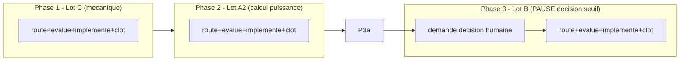

# Plan — Chantier mere : cloture des attestations residuelles de `gates.json` (Lots C, A2, B)

> Chantier mere de **suivi**, pas d'implementation directe. Il ne modifie
> aucun fichier de `Implementation/` lui-meme ; il coordonne trois
> sous-chantiers `fix` distincts (Lot C, Lot A2, Lot B), chacun route,
> audite, implemente et clos independamment via son propre cycle
> `/start` -> `/evaluate` x2 -> baseline -> `/continue` -> bug-hunter +
> conformance -> `/close`. Redige a partir de la note d'intake
> `0 - HUMAN START HERE/EPIC_CLOTURE_ATTESTATIONS_RESIDUELLES_GATES.md`
> (contenu de fond preserve, structure reformattee selon
> `.ai/backlog/TEMPLATE_PLAN_IMPLEMENTATION.md`).

---

## 0. Bandeau de statut (a verifier avant toute promotion)

| Question | Reponse |
| --- | --- |
| Un chantier actif couvre-t-il deja ce perimetre (`DONE`, `ACTIVE`, ou `SUPERSEDED`) ? | Non. `.ai/checkpoint.json::active_workstream_id` est `null`. `PLAN_CORRECTION_GATE_STATISTIQUE_OOS_MASQUE` (`DONE`, 2026-07-16) a deja clos le Lot A1 (perimetre distinct, non chevauchant : `statistical_gate` -> G9 uniquement). Aucun chantier ne couvre C/A2/B. |
| Un verrou de gouvernance actif bloque-t-il ce chantier ? | Non pour C et A2 (methode decidee en session, voir section 10). Oui pour B : decision de seuil execution/NAV non encore prise — ce chantier mere ne route PAS le Lot B tant que cette decision n'est pas actee ; il reste au niveau tracking pour B jusque-la. |
| Ce plan a-t-il besoin d'une decision humaine explicite pour lever un verrou avant d'etre routable via `/start` ? | Non pour l'ouverture du chantier mere lui-meme (decisions C/A2 deja actees en session, voir section 10). Oui pour le sous-chantier Lot B specifiquement, a demander au moment venu. |
| Ce plan remplace-t-il un document ou chantier existant ? | Non. Il complete `PLAN_CORRECTION_GATE_STATISTIQUE_OOS_MASQUE` (`DONE`, Lot A1) sans le rouvrir, et regroupe le suivi des lots A2/B/C que l'observation source avait deliberement laisses non routes. |

---

## Audit IA de promotion

- [x] Plan relu dans le contexte du cockpit actif (`AGENTS.md`, `.ai/README.md`, `.ai/checkpoint.json`, `Implementation/Active/HOOK.md`, `Implementation/Active/tracking.json`).
- [x] Bandeau de statut (section 0) rempli et verifie contre l'etat machine reelle.
- [x] Ce plan est ECRIT COMME NOUVEAU FICHIER dans `.ai/backlog/fixes/` ; le brouillon original `0 - HUMAN START HERE/EPIC_CLOTURE_ATTESTATIONS_RESIDUELLES_GATES.md` sera archive tel quel par `plan.ps1 start`.
- [x] Chantier classe `fix` (corrige un ecart de production deja identifie : attestations codees en dur), avec un role de suivi/coordination plutot que d'implementation directe.
- [x] Autorite normative identifiee : `Protocole/PAQUET D'EXECUTION EBTA.md` sections 2 et 4 (definition des gates G0-G14) ; `Protocole/SOP 01` pour le Lot A2 ; SOP 09A/10/11/12 pour le Lot C (sources citees module par module, section 4).
- [x] Perimetre de fichiers autorises et interdits explicite (section 5) : ce chantier mere ne modifie AUCUN fichier de `Implementation/` — seuls les sous-chantiers le font, chacun dans son propre perimetre.
- [x] Aucune modification hors perimetre requise pour activer ce chantier mere.
- [x] Prerequis factuels verifies dans le code le 2026-07-16 (section 4) : les 6 fonctions du Lot C retournent deja un `status` confine a `PASS`/`FAIL`/`INCONCLUSIVE` (verifie directement dans `procedures/data_availability.py`, `sealing.py`, `reproduction_report.py`, `monitoring.py`, `incubation_report.py`, `lifecycle.py`) ; `power_check` (Lot A2) est un calcul manquant confirme (`oos_confidence_interval.py:43`, `validate_power_target(power, target_power=0.80)` recoit le meme parametre qu'il valide).
- [x] Etat des lieux (section 4) verifie directement dans le code, pas suppose.

## Triage

| Champ | Valeur |
| --- | --- |
| Track | `fix` |
| Lifecycle | `TRIAGED` |
| Scope | Chantier mere de suivi (aucune modification directe de `Implementation/`) qui coordonne trois sous-chantiers `fix` distincts et successifs (Lot C, Lot A2, Lot B) pour brancher/calculer les ~12 champs residuels de `gates.json` encore codes en dur a `True`, en gardant un seul id traçable dans `.ai/checkpoint.json` jusqu'a cloture generale. |
| Non-goals | Ne pas fusionner C/A2/B en un seul commit ou un seul cycle `/evaluate` — chacun garde son propre cycle complet. Ne pas router le Lot B tant que la decision de seuil execution/NAV n'est pas explicitement actee par l'humain. Ne pas etendre `.ai/checkpoint.schema.json` (pas de `parent_workstream_id` — le lien parent/enfant reste narratif via `routing_reason`). Ne pas toucher G2 (`independent_registry_review`, tautologique, decision de source de verite non tranchee), G7 `independent_pre_oos_approval`, G13 `kill_switch`/`live_approval`, G14 (`retention_policy`/`incident_log`) — attestations humaines legitimes, hors perimetre par decision humaine du 2026-07-16 deja actee dans l'observation source. Ne jamais modifier `Protocole/`, `validators/gate_validator.py` (VERDICT_VALUES), `governance/`, `manifests/`. |
| Source | Conversation IA 2026-07-16 : demande humaine explicite de gerer les lots residuels A2/B/C comme un seul chantier suivi de bout en bout. Observation source deja convergee (3 passes `/evaluate`) : `0 - HUMAN START HERE/archive/20260716_OBSERVATION_GATES_ATTESTATIONS_RESIDUELLES.md`. Lot A1 deja clos : `.ai/archive/20260716_PLAN_CORRECTION_GATE_STATISTIQUE_OOS_MASQUE.md`. |
| Exit criteria | (1) Lot C `DONE` dans `.ai/checkpoint.json` (suite runtime `PASS`, bug-hunter et audit de conformite sans ouverture). (2) Lot A2 `DONE` dans les memes conditions, avec la fonction de puissance atteinte reellement implementee (pas de branchement vide) suivant la methode actee section 10. (3) Lot B `DONE` OU explicitement differe par une nouvelle decision humaine documentee dans ce fichier, apres qu'une decision de seuil execution/NAV ait ete demandee et tranchee. (4) Ce chantier mere lui-meme cloture (`plan.ps1 close`) seulement quand (1), (2) et (3) sont satisfaits. |

## Statut

| Champ | Valeur |
| --- | --- |
| Statut | `NON_DEMARRE` |
| Date de creation | 2026-07-16 |
| Date d'activation | 2026-07-16 |
| Autorite normative | `Protocole/PAQUET D'EXECUTION EBTA.md` (gates G0-G14) ; SOP 01/09A/10/11/12 pour les procedures sous-jacentes — gelees, non modifiees par ce chantier |
| Autorite executable | `Implementation/examples/minimal_pilot_pipeline/build_research_package.py::_write_reports()` (traduction executable subordonnee, modifiee uniquement par les sous-chantiers) |
| Changement normatif attendu | Aucun — application de regles deja normatives (des verdicts deja calcules doivent conditionner les gates qui en dependent), pas de nouvelle regle |
| Dependances externes | Aucune nouvelle pour ce chantier mere. Chaque sous-chantier documente les siennes. |

---

## 1. Role de ce document et non-objectifs

| Element | Role |
| --- | --- |
| `Protocole/PAQUET D'EXECUTION EBTA.md` | Autorite normative des gates G0-G14. Inchangee. |
| `Implementation/ebta_engine/validators/gate_validator.py::GATE_REQUIREMENTS`/`VERDICT_VALUES` | Agregateur deja correct. Inchange par ce chantier mere et par ses trois sous-chantiers. |
| `Implementation/examples/minimal_pilot_pipeline/build_research_package.py::_write_reports()` | Chemin fautif partage par le pilote et la production Nautilus — modifie uniquement par les sous-chantiers C, A2, B, chacun dans son perimetre de champs propre. |
| Ce document | Carte de coordination : ordre des lots, decisions deja actees, mecanisme de suivi sans modification de schema. Ne code rien lui-meme. |

Non-objectifs :

- ne pas reecrire `Protocole/` ni les SOP citees ;
- ne pas introduire de regle, seuil, ou verdict absent des autorites normatives citees par chaque sous-chantier ;
- ne pas transformer ce document en un quatrieme sous-chantier d'implementation — il reste un document de suivi pur ;
- ne pas etendre `validators/gate_validator.py::VERDICT_VALUES` pour un besoin local a un sous-chantier.

---

## 2. Contexte obligatoire a lire avant de coder

1. `AGENTS.md`, `.ai/README.md`, `.ai/checkpoint.json`, `Implementation/Active/HOOK.md`, `Implementation/Active/tracking.json` — etat machine courant (aucun workstream actif).
2. `0 - HUMAN START HERE/archive/20260716_OBSERVATION_GATES_ATTESTATIONS_RESIDUELLES.md` — l'observation source convergee, notamment le "Decoupage propose" (Lots A1/A2/B/C) et les "Questions ouvertes ... TRANCHEES".
3. `.ai/archive/20260716_PLAN_CORRECTION_GATE_STATISTIQUE_OOS_MASQUE.md` — le chantier Lot A1 deja clos, dont chaque sous-chantier de ce plan mere reprend le patron de correction et de preuve (`_g9_gate_value()` -> `_g1_gate_value()`/etc. selon le lot).
4. `Protocole/PAQUET D'EXECUTION EBTA.md` sections 2 et 4 (definition des gates G0-G14).
5. Le plan restructure de chaque sous-chantier au moment ou il est route (lu a ce moment, pas a l'avance).

**Hierarchie d'autorite** :

```text
1. Protocole/MANIFESTE DE GEL EBTA.md
2. Protocole/PROTOCOLE EBTA.md
3. Protocole/REGISTRE DES DECISIONS NORMATIVES EBTA.md
4. SOP 01-13 (selon le sous-chantier : SOP 01 pour A2 ; SOP 09A/10/11/12 pour C)
5. Protocole/PAQUET D'EXECUTION EBTA.md
6. Implementation/ (dont ce plan et ses sous-chantiers)
7. Adaptateurs externes (NautilusTrader)
```

---

## 3. Table des gates concernes

| Ordre | Gate | Champs residuels vises | Lot |
| --- | --- | --- | --- |
| G1 | `data_snapshots`, `availability_timestamps`, `anti_leakage_report` | Lot C |
| G7 | `pre_oos_manifest`, `frozen_config` | Lot C |
| G9 | `power_report` (deja partiellement corrige par A1 via `oos_report`/`concatenated_oos_series`/`oos_bootstrap_report`) | Lot A2 |
| G11 | `validation_ready_manifest`, `reproduction_report`, `incubation_approval` | Lot C |
| G12 | `incubation_report`, `paper_trading_log`, `monitoring_plan` | Lot C |
| G13 | `deployment_certified_manifest` | Lot C |
| G6 | `execution_report`, `cost_model`, `capacity_grid`, `nav_reconciliation` | Lot B |

---

## 4. Etat des lieux (avant/apres) — reutiliser avant de recreer

### Ce qui existe deja et fonctionne (verifie 2026-07-16)

| Module | Chemin | Role reel (verifie) | Suffisant pour reutilisation directe ? |
| --- | --- | --- | --- |
| `validate_availability()` | `procedures/data_availability.py:13,22` | Retourne `status` : `"PASS"` si aucune violation, sinon `"FAIL"` — deux valeurs, toutes deux dans `VERDICT_VALUES` | ✅ Reutiliser tel quel (Lot C) |
| `validate_pre_oos_seal()` | `procedures/sealing.py:10,20` | Meme patron, `status` `PASS`/`FAIL` | ✅ Reutiliser tel quel (Lot C) |
| `validate_reproduction_report()` | `procedures/reproduction_report.py` | `status` `PASS`/`FAIL`/`INCONCLUSIVE` (docstring ligne 52) | ✅ Reutiliser tel quel (Lot C) |
| `validate_monitoring_plan()` / `validate_consultation_log()` | `procedures/monitoring.py:28,87,201` | `status` `PASS`/`FAIL`/`INCONCLUSIVE` (docstring ligne 40 ; `_monitoring_result()` ligne 191-198 ne produit que `PASS`/`FAIL`) | ✅ Reutiliser tel quel (Lot C) |
| `validate_incubation_report()` | `procedures/incubation_report.py:21-126` | Le champ `status` retourne est toujours `"PASS"`/`"FAIL"` (ligne 120-121), ou `"INCONCLUSIVE"` si rapport vide (ligne 47-50) — le `"WATCH"` possible n'existe que dans le sous-champ `verdict` du rapport source, jamais dans `status` lui-meme | ✅ Reutiliser tel quel (Lot C) — verifie explicitement pour eviter le piege deja rencontre avec `"NOT_VALIDATED"` sur G9 |
| `deployment_gate()` | `procedures/lifecycle.py:30-40` | `status` `PASS`/`FAIL` | ✅ Reutiliser tel quel (Lot C) |
| `_procedure_reports()` | `build_research_package.py:339-460` | Appelle deja les 6 fonctions ci-dessus avec les vraies entrees et stocke leurs resultats (`procedure_reports["data_availability"]`, `["sealing"]`, `["reproduction_validation"]`, `["monitoring_plan"]`, `["monitoring_consultation_log"]`, `["incubation_report"]`, `["deployment_gate"]`) | ✅ Deja correct, juste sous-exploite pour les 12 champs `gates.json` du Lot C |
| `_write_reports()` | meme fichier, lignes ~200-254 | Ecrit ~12 champs Lot C en `True` litteral au lieu de lire les statuts ci-dessus, exactement comme le faisait G9 avant A1 | ❌ A corriger par le sous-chantier Lot C (patron `_g9_gate_value()` deja existant ligne 189-192) |
| `oos_confidence_interval()` | `procedures/oos_confidence_interval.py:15-61` | Calcule deja `power_check` (ligne 43, 59) via `validate_power_target(power, target_power=0.80)`, mais `power` recu est le defaut de signature (0.80), jamais une puissance estimee depuis l'echantillon — verifie ligne 22 et aucun appelant ne passe `power=` explicitement | ❌ Calcul manquant, pas un branchement (Lot A2) |
| `procedures/bootstrap.py::stationary_block_indices()` | `procedures/bootstrap.py` | Deja normatif et gele pour le calcul OOS (bootstrap stationnaire par blocs) | ✅ A reutiliser pour estimer l'erreur type pre-OOS necessaire au calcul de puissance (Lot A2), decision actee section 10 |
| `nautilus_research_package.py::build_nautilus_inputs()` | `package_builder/nautilus_research_package.py` | Ne fige aucun des champs Lot C/A2 en amont (verifie par grep : aucune occurrence de `data_availability`/`sealing`/`reproduction`/`monitoring`/`incubation`/`deployment_gate` cote gates, seulement des entrees `inputs[...]` alimentant `_procedure_reports()`) | ✅ Aucun nettoyage d'appelant necessaire, comme deja constate pour G9 |

### Ce qui manque reellement

| Brique manquante | Module a modifier | Sous-chantier |
| --- | --- | --- |
| Propagation des 6 statuts deja calcules vers les 12 champs `gates.json` correspondants | `_write_reports()` | Lot C |
| Fonction de puissance atteinte reelle, basee sur l'effet minimal detectable (SOP 01 section 10.6) et une erreur type estimee par bootstrap stationnaire par blocs sur les rendements pre-OOS | Nouveau, colocalise avec `oos_confidence_interval.py` ou `_procedure_reports()` | Lot A2 |
| Calcul reel de `execution_report`/`nav_reconciliation` a partir d'un critere de seuil humain a definir | `nautilus_research_package.py` | Lot B (bloque tant que la decision de seuil n'est pas prise) |

---

## 5. Decision d'architecture

Principe directeur : ce chantier mere ne fait que **coordonner**, jamais
**implementer**. Chaque sous-chantier reste seul responsable de son
perimetre de fichiers, de son cycle `/evaluate`, et de sa preuve de
non-regression — exactement comme le sous-chantier Lot A1 (G9) deja clos.
La seule chose que ce document ajoute par rapport a trois notes d'intake
isolees est un point d'ancrage unique et un ordre explicite, tracable dans
`.ai/checkpoint.json` sans modification de schema.

### Frontieres explicites

| Couche | Elle fait | Elle NE fait PAS |
| --- | --- | --- |
| Ce chantier mere | Ordonnance C -> A2 -> B, journalise les decisions humaines qui s'appliquent aux trois, met a jour son propre statut apres chaque cloture de sous-chantier | Modifier `Implementation/` ; fusionner les sous-chantiers en un seul cycle |
| Chaque sous-chantier (C, A2, B) | Route, evalue, implemente, teste, cloture son propre perimetre de fichiers | Modifier un fichier hors de son propre perimetre declare |

### Perimetre de fichiers explicite (autorises / interdits)

**Autorises (creer ou modifier par CE document, chantier mere)** :

```text
.ai/backlog/fixes/EPIC_CLOTURE_ATTESTATIONS_RESIDUELLES_GATES.md   MODIFIER - mise a jour du statut apres chaque cloture de sous-chantier
```

**Interdits (ne jamais modifier par ce document lui-meme — delegue aux sous-chantiers)** :

```text
Protocole/                                                                [NORME - intouchable]
Implementation/examples/minimal_pilot_pipeline/build_research_package.py  [DELEGUE aux sous-chantiers C/A2/B, jamais modifie directement ici]
Implementation/ebta_engine/procedures/                                   [DELEGUE aux sous-chantiers]
Implementation/ebta_engine/validators/gate_validator.py                  [CONTRAT DEJA CORRECT - ne jamais etendre VERDICT_VALUES]
.ai/checkpoint.json                                                       [METTRE A JOUR UNIQUEMENT via plan.ps1]
.ai/checkpoint.schema.json                                                [PAS D'EXTENSION - lien parent/enfant reste narratif]
```

---

## 6. Decoupage en phases

### Phase 1 - Lot C : branchements mecaniques surs (G1/G7/G11/G12/G13)

Objectif : rediger, router (`/start`), evaluer (`/evaluate` x2), committer la
baseline, implementer, tester et clore le sous-chantier Lot C.

Classification : IMPLEMENTATION_DETAIL

Actions :

- Rediger la note d'intake et le plan restructure du Lot C (document separe,
  propre brouillon dans `0 - HUMAN START HERE/`).
- Suivre le cycle complet : `/start -Audited` -> boucle `/evaluate` (min 2
  passes) -> commit baseline -> `/continue` -> implementation -> bug-hunter
  + `plan-conformance-audit` -> `/close`.
- Mettre a jour ce document (section "Suite immediate") pour pointer vers
  Lot A2 une fois Lot C clos.

Livrables :

- Workstream `fix` Lot C `DONE` dans `.ai/checkpoint.json`.

Critere de sortie :

- Suite runtime complete `PASS`.
- Aucun des 12 champs Lot C de `gates.json` n'est plus un litteral `True`
  non derive.

### Phase 2 - Lot A2 : fonction de puissance atteinte reelle (G9 `power_check`)

Objectif : implementer une vraie estimation de puissance atteinte suivant
`Protocole/SOP 01` section 10.6, en reutilisant le bootstrap stationnaire
par blocs deja normatif sur les rendements pre-OOS de developpement
(decision actee section 10), puis brancher `power_check.status` dans
`gates.json`.

Classification : IMPLEMENTATION_DETAIL

Actions :

- Rediger la note d'intake et le plan restructure du Lot A2 (propre
  brouillon dans `0 - HUMAN START HERE/`), une fois Lot C clos.
- Meme cycle complet que la Phase 1.

Livrables :

- Workstream `fix` Lot A2 `DONE` dans `.ai/checkpoint.json`.

Critere de sortie :

- Suite runtime complete `PASS`.
- `power_check.status` derive d'une puissance reellement estimee depuis
  l'echantillon, jamais du parametre `power` par defaut renvoye a
  lui-meme.

### Phase 3 - Lot B : execution_report / nav_reconciliation (G6) — PAUSE OBLIGATOIRE

Objectif : demander et journaliser la decision de seuil humaine necessaire
avant toute redaction de plan, puis suivre le meme cycle complet que les
phases precedentes une fois la decision actee.

Classification : IMPLEMENTATION_DETAIL

Constat (pourquoi cette phase necessite une pause, contrairement aux deux
precedentes) :

- `nautilus_research_package.py` ecrit `execution_report`/`nav_reconciliation`
  en dur malgre `_total_orders(...)` deja disponible au meme endroit — mais
  aucun seuil de "NAV non plate" ou de volume d'ordres minimal n'est encore
  preenregistre pour ce chantier ; l'inventer serait une regle metier non
  sourcee (interdit par la section 8).

Actions :

- Demander explicitement a l'humain le critere de seuil a reutiliser (ex.
  reutiliser l'invariant deja teste par
  `test_dedicated_venv_m1_segment_records_real_nav_without_false_no_m1`).
- Journaliser la decision en section 10 de ce document avant de rediger le
  plan du Lot B.
- Une fois la decision actee, suivre le meme cycle complet que les phases
  precedentes.

Livrables :

- Decision de seuil journalisee (section 10).
- Workstream `fix` Lot B `DONE` dans `.ai/checkpoint.json`.

Critere de sortie :

- La decision de seuil est explicitement actee par l'humain avant toute
  ligne de code de ce lot.
- Suite runtime complete `PASS` apres implementation.

### Chemin critique (ordre des phases)



---

## 7. Artefacts produits

| Etape | Fichier/sortie | Format | Regle source |
| --- | --- | --- | --- |
| Suivi du chantier mere | `.ai/backlog/fixes/EPIC_CLOTURE_ATTESTATIONS_RESIDUELLES_GATES.md` (ce fichier, mis a jour a chaque cloture de sous-chantier) | Markdown | Ce chantier |
| Chaque sous-chantier | Son propre plan dans `.ai/backlog/fixes/` puis `.ai/archive/` a la cloture | Markdown | Gabarit `.ai/backlog/TEMPLATE_PLAN_IMPLEMENTATION.md` |

---

## 8. Invariants absolus et NO GO

### Invariants

1. Aucun sous-chantier ne demarre son implementation avant que sa propre
   boucle `/evaluate` (min 2 passes) ait converge et que sa baseline
   pre-implementation soit committee.
2. Le Lot B ne peut pas etre route (`/start`) tant que la decision de seuil
   humaine n'est pas journalisee en section 10.
3. Ce chantier mere ne modifie jamais directement un fichier de
   `Implementation/` — seuls les sous-chantiers le font.
4. `.ai/checkpoint.schema.json` n'est jamais etendu pour ce besoin.

### NO GO

- Fusionner deux lots dans un seul commit ou une seule boucle `/evaluate`.
- Router le Lot B sans decision de seuil humaine deja journalisee.
- Inventer un estimateur de variance/puissance different de celui deja
  acte (bootstrap stationnaire par blocs) sans nouvelle decision humaine.
- Modifier `validators/gate_validator.py::VERDICT_VALUES`.
- Declarer ce chantier mere `DONE` avant que C, A2 et B le soient chacun
  (ou que B soit explicitement differe par decision humaine documentee).

---

## 9. Verification a chaque etape

```powershell
python -m unittest discover -s Implementation\ebta_engine\tests -t Implementation
```

**Regle transversale bloquante** : la suite runtime complete doit rester
`PASS` avant de demarrer chaque phase suivante (chaque sous-chantier).

**Premier lot executable propose** :

```text
Phase 1 - Lot C : redaction et routage du sous-chantier
```

### Execution sans interruption

Ce chantier mere est concu pour enchainer les Phases 1 et 2 (Lots C et A2)
sans retour vers l'humain entre elles, les decisions necessaires etant deja
actees en section 10. La Phase 3 (Lot B) marque un arret legitime et
obligatoire pour demander la decision de seuil manquante — ce n'est pas un
echec d'execution, c'est une cause d'arret prevue par ce plan lui-meme.

### Autorite decisionnelle accordee

En dehors du perimetre de fichiers (section 5), des invariants (section 8),
et de la pause obligatoire de la Phase 3, l'IA qui execute ce plan est
autorisee a rediger, router, evaluer, implementer et clore les
sous-chantiers Lot C et Lot A2 sans repasser par l'humain entre les deux.

### Interdiction des raccourcis (aucun faux succes)

Meme regle que chaque sous-chantier applique individuellement (section 9 de
chacun) : ne jamais masquer un echec de verification, ne jamais
desactiver un test genant, ne jamais inventer une decision de seuil ou de
methode a la place de l'humain.

---

## 10. Journal des decisions humaines (autorisations)

| Date | Decision | Portee |
| --- | --- | --- |
| 2026-07-16 | Regrouper A2+B+C dans un seul chantier mere de suivi, avec enchainement automatique de C puis A2 sans repasser par l'humain, et pause obligatoire avant B. | Autorise la creation de ce document et le routage successif de Lot C puis Lot A2. N'autorise pas le routage du Lot B sans nouvelle decision. |
| 2026-07-16 | Ordre revise en session : Lot C avant Lot A2 (inversion de l'ordre initialement propose), suite a la decouverte que A2 necessite un calcul manquant et non un simple branchement. | Remplace l'ordre initial. |
| 2026-07-16 | Lot A2 : methode actee — reutiliser le bootstrap stationnaire par blocs deja normatif (`procedures/bootstrap.py`) applique aux rendements pre-OOS de developpement pour estimer l'erreur type de la puissance atteinte. | Autorise la redaction et l'implementation du sous-chantier Lot A2 avec cette methode precise, sans nouvelle consultation humaine sur ce point. |

---

## 11. Risques et blocages connus

| Risque | Impact | Mitigation / condition de deblocage |
| --- | --- | --- |
| Le Lot A2 fait basculer `power_check.status`/G9 a `INCONCLUSIVE` sur le package M1 de production reel si la puissance estimee est insuffisante | Attendu, documenter comme decouverte legitime (meme clause que WRC/G5/G9 deja actees), jamais comme regression | Documenter en cloture du sous-chantier Lot A2 dans `Implementation/HISTORIQUE DES VERSIONS EBTA ENGINE.md` |
| Le Lot B reste bloque indefiniment si l'humain ne tranche jamais la decision de seuil | Ce chantier mere ne peut pas se clore | Demander explicitement la decision au debut de la Phase 3, ne pas la contourner |

---

## 12. Definition of Done

- [ ] Lot C `DONE`.
- [ ] Lot A2 `DONE`.
- [ ] Lot B `DONE` ou explicitement differe par decision humaine documentee (section 10).
- [ ] Aucune modification hors perimetre par ce document lui-meme (section 5).
- [ ] Checklist post-modification `.ai/governance/AI_MODIFICATION_CHECKLIST.md` executee a chaque sous-chantier.

---

## 13. Cloture

A remplir au moment de `/close` du chantier mere (apres cloture des trois sous-chantiers).

| Champ | Valeur |
| --- | --- |
| Resultat final | [A remplir a la cloture] |
| Ecarts par rapport au plan initial | [A remplir a la cloture] |
| Suites a prevoir (hors perimetre de ce plan) | G2 (`independent_registry_review`, decision de source de verite non tranchee), G7/G13/G14 (attestations humaines, hors perimetre par nature) |

---

## 14. Journal d'audits post-hoc

| Date de l'audit | Ce qui a ete corrige | Pourquoi |
| --- | --- | --- |
| 2026-07-16 | Verification directe du code du Lot A2 (`oos_confidence_interval.py:22,43`) contredisant l'hypothese initiale "le plus urgent... calcul reel" de l'observation source : `power_check` est en realite un calcul manquant, pas un branchement. Ordre des phases revise (C avant A2) en consequence, avant toute redaction de sous-chantier. | Eviter d'ecrire un plan Lot A2 qui traiterait a tort ce lot comme un branchement mecanique, ce qui aurait recree exactement le piege deja identifie (`power` renvoye a lui-meme = `PASS` par construction). |
