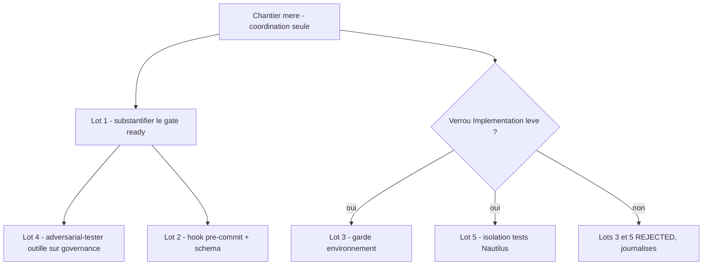
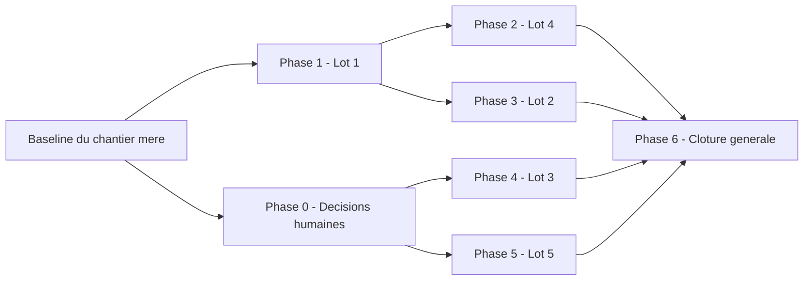

# Plan — Chantier mere : robustesse des garde-fous face a l'agent de codage

Chantier mere de coordination. Il **ne code rien lui-meme** : il ordonne et
suit cinq lots independants issus de l'audit
`0 - HUMAN START HERE/AUDIT_ROBUSTESSE_ARCHITECTURE_FACE_ERREURS_IA_2026-08-07.md`
(5 passes d'audit + 3 passes `/evaluate` d'intake, convergees).

---

## 0. Bandeau de statut (verifie contre l'etat machine reel)

| Question | Reponse |
| --- | --- |
| Un chantier actif couvre-t-il deja ce perimetre (`DONE`, `ACTIVE`, ou `SUPERSEDED`) ? | **Non.** `.ai/checkpoint.json::active_workstream_id` vaut `null` et les 40+ workstreams enregistres sont tous `status: DONE`. Aucun ne porte sur l'outillage de gouvernance IA (`.ai/tools/`, hook git, segmentation de la suite de tests). |
| Un verrou de gouvernance actif bloque-t-il ce chantier ? | **Oui, partiellement.** `.ai/governance/AI_MODIFICATION_CHECKLIST.md`, section "Modifications interdites sans decision explicite" : « Modifier du code d'implementation sauf si strictement necessaire pour mettre a jour une trace documentaire ». Ce verrou concerne les lots 3 et 5 (qui touchent `Implementation/`), pas les lots 1, 2 et 4. |
| Ce plan a-t-il besoin d'une decision humaine explicite pour lever ce verrou avant d'etre routable via `/start` ? | **Non pour ce chantier mere** (il ne modifie aucun code). **Oui pour les lots 3 et 5** : la levee doit etre journalisee en section 10 du plan de chaque lot avant son propre `/start`. Ce chantier mere reste routable et executable sans cette decision, et les lots 1, 2, 4 avancent independamment. |
| Ce plan remplace-t-il un document ou chantier existant ? | **Non.** Aucun chantier anterieur ne couvre ce perimetre. |

> Consequence operationnelle : le verrou ne bloque pas ce chantier mere, il
> conditionne deux de ses cinq lots. Les lots 3 et 5 restent listes en
> section "Sous-chantiers" ; s'ils sont refuses par l'humain, ils se cloturent
> en `status: DONE` / `lifecycle: REJECTED` (precedent : `EPIC_ARCHITECTURE_IA_RAG`),
> ce qui satisfait `plan.ps1::Assert-SubChantiersClosed` sans forcer une
> implementation non autorisee.

---

## Audit IA de promotion

- [x] Plan relu dans le contexte du cockpit actif (`AGENTS.md`, `.ai/README.md`,
      `.ai/checkpoint.json`, `Implementation/Active/HOOK.md`,
      `.ai/workflows/README.md`, `.ai/workflows/common/WORKFLOW.md`,
      `.ai/workflows/core-engine/WORKFLOW.json`).
- [x] Bandeau de statut (section 0) rempli et verifie contre l'etat machine
      reel (`active_workstream_id: null`, aucun workstream non terminal).
- [x] Ce plan a ete ECRIT COMME NOUVEAU FICHIER dans `.ai/backlog/fixes/` ;
      le brouillon original reste intact dans `0 - HUMAN START HERE/`
      jusqu'a son archivage mecanique par `plan.ps1 start`.
- [x] Chantier classe `fix` — il corrige des faiblesses de garde-fous
      identifiees par un audit, sans faire avancer la campagne de recherche
      EBTA. Precedent identique : `EPIC_CLOTURE_ATTESTATIONS_RESIDUELLES_GATES`
      (chantier mere `fix` issu d'une meme observation d'intake).
- [x] Autorite normative applicable identifiee : **aucune regle scientifique
      EBTA n'est touchee**. `Protocole/` reste hors perimetre total. Les
      autorites procedurales applicables sont `.ai/workflows/common/WORKFLOW.md`
      et `.ai/governance/AI_MODIFICATION_CHECKLIST.md`.
- [x] Perimetre de fichiers autorises/interdits explicite en liste fermee
      (section 5).
- [x] Aucune modification hors perimetre requise pour activer ce chantier.
- [x] Prerequis factuels identifies (section 11) avec leur statut.
- [x] Etat des lieux (section 4) verifie par lecture directe du code, pas
      suppose — aucun lot ne propose de creer un mecanisme qui existe deja.

## Triage

| Champ | Valeur |
| --- | --- |
| Track | `fix` |
| Lifecycle | `INTAKE` |
| Type de chantier | `MULTI_LOT` |
| Scope | Coordonner l'execution ordonnee de cinq corrections independantes des garde-fous du depot contre l'erreur d'un agent de codage, sans en implementer aucune dans ce document. |
| Non-goals | Ne code aucune des cinq corrections. Ne modifie ni `Protocole/`, ni `Implementation/`, ni `.ai/tools/`, ni `.git/hooks/`. Ne tranche aucune decision humaine en attente (levee du verrou `Implementation/` pour les lots 3 et 5 ; opportunite d'une CI). N'introduit aucune dependance technique. Ne cree aucun lien parent/enfant structurel dans `.ai/checkpoint.json`. |
| Source | Audit `0 - HUMAN START HERE/AUDIT_ROBUSTESSE_ARCHITECTURE_FACE_ERREURS_IA_2026-08-07.md`, produit le 2026-08-07 par `.agents/skills/robustness-audit-coding-agent/SKILL.md` sur demande explicite de l'utilisateur (risque prioritaire enonce : l'erreur d'un agent de codage qui implemente dans `Implementation/`, pas l'erreur methodologique). `/start` demande par l'humain le 2026-08-07. |
| Exit criteria | Les quatre conditions binaires suivantes sont toutes vraies : (1) les cinq ID listes en section "Sous-chantiers" existent dans `.ai/checkpoint.json` avec `status: DONE` (`lifecycle` `DONE` ou `REJECTED` selon la decision humaine) ; (2) `.\.ai\tools\tests\test_workflow_state_machine.ps1` retourne exit code 0 ; (3) l'ensemble des commandes de test declarees canoniques dans `CLAUDE.md` a cet instant retourne zero erreur — soit `219 tests, 0 error` sur la commande unique si le lot 5 est refuse, soit zero erreur sur chacune des suites segmentees s'il est execute ; (4) **preuve negative executable** : `.\.ai\tools\tests\test_workflow_state_machine.ps1` contient un cas qui appelle `Add-WorkflowEvidence` avec `bug_hunter=chaine_arbitraire_sans_artefact` et **exige** qu'il leve une erreur ; ce cas echoue sur le code actuel et passe apres le lot 1. La preuve negative est ainsi portee par la suite de tests existante, sans creer de workstream jetable qui polluerait `.ai/checkpoint.json`. |

## Sous-chantiers

> Ces cinq ID sont **contraignants** : le `/start` reel de chaque lot devra
> utiliser exactement l'ID liste ici, sans quoi
> `plan.ps1::Assert-SubChantiersClosed` ne le reconnaitra pas et refusera de
> cloturer ce chantier mere (precedent : section 10 de
> `.ai/archive/20260720_EPIC_ATTESTATIONS_RESIDUELLES_R3.md`).

| # | ID prevu | Titre |
| --- | --- | --- |
| 1 | PLAN_SUBSTANTIATION_PREUVES_WORKFLOW_READY | Substantifier les preuves du gate `ready` (`workflow_state.ps1`) |
| 2 | PLAN_EXTENSION_HOOK_PRECOMMIT_VALIDATION_SCHEMA | Etendre le hook `pre-commit` a la validation de schema JSON |
| 3 | PLAN_GARDE_ENVIRONNEMENT_BENCHMARK_NAUTILUS | Garde d'environnement dans `benchmarks/long_data.py` |
| 4 | PLAN_ADVERSARIAL_TESTER_GOUVERNANCE_OUTILLE | Passage `adversarial-tester` outille sur `governance/` |
| 5 | PLAN_ISOLATION_TESTS_DEPENDANTS_NAUTILUS | Isoler les tests dependants de l'environnement Nautilus |

## Statut

| Champ | Valeur |
| --- | --- |
| Statut | `NON_DEMARRE` |
| Date de creation | 2026-08-07 |
| Date d'activation | - |
| Autorite normative | `Protocole/` (hors perimetre — aucun lot ne le touche). Autorites procedurales : `.ai/workflows/common/WORKFLOW.md`, `.ai/governance/AI_MODIFICATION_CHECKLIST.md`. |
| Autorite executable | `.ai/tools/workflow_state.ps1` et `.ai/tools/plan.ps1` pour le contrat de workflow ; `Implementation/Active/pre_commit_hook.py` pour le hook ; `Implementation/ebta_engine/` pour les lots 3 et 5. |
| Changement normatif attendu | Aucun. |
| Dependances externes | Aucune. Pyrefly (deja installe dans `Implementation/adapters/nautilus_env/venv`) est utilise par `bug-hunter`, pas ajoute par ce chantier. |

## Carte d'execution IA (lecture prioritaire pour `/continue`)

| Champ | Contenu operationnel |
| --- | --- |
| Objectif executable | Router, executer et cloturer les cinq lots dans l'ordre fixe en section 6, en mettant a jour ce document apres chaque cloture. Ce document ne produit aucun code. |
| Autorite et lecture minimale | 1. `AGENTS.md` ; 2. `.ai/checkpoint.json` ; 3. `.ai/workflows/common/WORKFLOW.md` ; 4. `.agents/skills/epic-orchestrator/SKILL.md` (procedure de boucle par lot) ; 5. le brouillon d'audit archive sous `0 - HUMAN START HERE/archive/`. |
| Perimetre autorise | Ce fichier uniquement (`.ai/backlog/fixes/EPIC_ROBUSTESSE_GARDE_FOUS_AGENT_CODAGE.md`), plus les brouillons de lots crees dans `0 - HUMAN START HERE/`. `.ai/checkpoint.json` uniquement via `.ai/tools/plan.ps1`. |
| Interdits absolus | Coder directement une des cinq corrections depuis ce chantier mere. Fusionner deux lots dans un seul plan, une seule boucle `/evaluate` ou un seul commit. Trancher a la place de l'humain la levee du verrou `Implementation/` (lots 3 et 5) ou l'opportunite d'une CI. Etendre `.ai/checkpoint.schema.json`. |
| Phase de reprise | Phase 0 puis Phase 1 — **executees depuis l'etat `BASELINED` de ce chantier mere, sans appeler `plan.ps1 continue` dessus** (voir "Mecanique de reprise" ci-dessous). Prerequis immediat : aucun pour le lot 1. |
| Preuve attendue | Les cinq ID de la section "Sous-chantiers" presents `status: DONE` dans `.ai/checkpoint.json`, plus les quatre conditions de l'Exit criteria et les commandes de la section 9. |
| Arret et escalade | Avant le lot 3 et avant le lot 5 : s'arreter et demander la levee explicite du verrou `AI_MODIFICATION_CHECKLIST.md` sur `Implementation/`. Journaliser la reponse en section 10 avant de rediger le brouillon du lot. |

### Mecanique de reprise (contrainte mecanique, pas une preference)

`plan.ps1::Assert-SubChantiersClosed` est appele avant `continue`
(`plan.ps1:406`), avant `ready` (`:432`) et avant `close` (`:453`). Sur un
plan declare `MULTI_LOT`, ces trois actions **echouent** tant qu'un ID de la
section "Sous-chantiers" n'est pas `status: DONE` dans `.ai/checkpoint.json`.

Consequence directe sur l'execution de ce chantier mere :

1. Il est route (`TRIAGED`), puis passe `BASELINED` apres la seconde boucle
   `/evaluate` et son commit de baseline.
2. Il **reste `BASELINED`** pendant toute la duree des lots. Ce document est
   alors lu comme carte de coordination ; `active_workstream_id` pointe vers
   le lot en cours, jamais vers ce chantier mere.
3. Chaque lot suit son propre cycle complet et devient `DONE`.
4. Seulement une fois les cinq lots `DONE`, ce chantier mere enchaine
   `continue` -> `ready` -> `close` (Phase 6, ci-dessous), qui ne sont plus
   bloques par la garde.

Ne pas tenter `plan.ps1 continue -Id EPIC_ROBUSTESSE_GARDE_FOUS_AGENT_CODAGE`
avant l'etape 4 : l'echec est attendu et ne doit jamais etre contourne en
retirant les ID de la section "Sous-chantiers". Modele identique aux
precedents `EPIC_ATTESTATIONS_RESIDUELLES_R3` et
`EPIC_MATURITE_MOTEUR_CAMPAGNE_RECHERCHE`, dont la "Phase de reprise" est
elle aussi la cloture generale.

---

## 1. Role de ce document et non-objectifs

| Element | Role |
| --- | --- |
| `Protocole/` | Autorite normative EBTA — hors perimetre total de ce chantier. |
| `Implementation/` | Traduction executable du protocole — touchee uniquement par les lots 3 et 5, sous reserve de levee de verrou. |
| `.ai/tools/`, `Implementation/Active/pre_commit_hook.py` | Outillage de gouvernance IA — cible des lots 1 et 2. Non normatif. |
| `.ai/checkpoint.json` | Etat machine — jamais edite a la main, uniquement via `plan.ps1`. |
| Ce plan | Carte de coordination : quel lot, dans quel ordre, avec quelle decision humaine prealable. |

Non-objectifs de ce document lui-meme :

- ne pas reecrire l'autorite normative du projet (`Protocole/` intouche) ;
- ne pas introduire de regle, seuil ou statut absent de cette autorite ;
- ne pas devenir une source d'etat concurrente de `.ai/checkpoint.json` — le
  lien parent/enfant reste narratif, via le `routing_reason` de chaque lot ;
- ne pas implementer, meme partiellement, une des cinq corrections ;
- ne pas presenter le lot 1 comme rendant la fraude impossible (voir section 5).

---

## 2. Contexte obligatoire a lire avant de coder

1. `0 - HUMAN START HERE/archive/<date>_AUDIT_ROBUSTESSE_ARCHITECTURE_FACE_ERREURS_IA_2026-08-07.md`
   — le brouillon source archive : constats verifies, contraintes decouvertes
   par la boucle `/evaluate`, et honnetete sur les limites du lot 1.
2. `.agents/skills/epic-orchestrator/SKILL.md` — procedure obligatoire de la
   boucle par lot (etape 1 : revalider la nature du lot dans le code reel
   avant de rediger son plan).
3. `.ai/checkpoint.json` — etat machine courant, source unique de la
   completude des lots.
4. `.ai/tools/workflow_state.ps1` et `.ai/tools/plan.ps1` — le mecanisme que
   le lot 1 modifie ; a lire avant toute redaction de son plan.
5. `.agents/skills/robustness-audit-coding-agent/SKILL.md` — la procedure de
   re-audit qui servira a verifier que le lot 1 ferme reellement le gate.

**Hierarchie d'autorite applicable a ce chantier** :

```text
1. Protocole/ (non touche, mais prime en cas de conflit)
2. Implementation/ (code executable derive)
3. .ai/ (cockpit IA : gouvernance procedurale, outillage, etat machine)
4. .agents/ (skills, outillage non normatif)
```

Regle : si le code contredit l'autorite normative, c'est le code qui a tort.
Si une regle manque, le systeme doit bloquer ou retourner un statut explicite
plutot que de deviner.

---

## 3. Table des gates traverses

Ce chantier ne traverse pas le pipeline scientifique EBTA. Il traverse le
pipeline procedural de workflow, qu'il modifie :

| Ordre | Gate | Question posee au systeme | Sortie si echec |
| --- | --- | --- | --- |
| W1 | `start` | Le plan porte-t-il les sections exigees et une preuve d'audit d'intake ? | Routage refuse |
| W2 | `baseline` | Le SHA de baseline existe-t-il et contient-il le `source_path` ? | Baseline refusee |
| W3 | `ready` | Les IDs de preuve exiges sont-ils enregistres ? | Cloture impossible |
| W4 | `close` | Le workstream est-il `READY_TO_CLOSE` et ses sous-chantiers tous `DONE` ? | Cloture refusee |

Le lot 1 modifie exactement W3 : aujourd'hui il verifie qu'un ID existe et
qu'une reference est non vide (`workflow_state.ps1:128-133`, `:174`), jamais
que la reference designe un artefact reel.

---

## 4. Etat des lieux (avant/apres) — reutiliser avant de recreer

### Ce qui existe deja

| Module actuel | Chemin | Role reel (verifie par lecture du code) | Suffisant pour l'objectif ? |
| --- | --- | --- | --- |
| Gate de preuve de workflow | `.ai/tools/workflow_state.ps1:120-143` (`Add-WorkflowEvidence`), `:174` (`Move-WorkflowStage`) | Valide l'ID contre `^[a-z][a-z0-9_]*$` et refuse une reference vide ; `Move-WorkflowStage` ne compare que des IDs. | ⚠️ a etendre — le mecanisme est au bon endroit, seule la substance manque (lot 1) |
| Contrat `ready` du workflow moteur | `.ai/workflows/core-engine/WORKFLOW.json:30` | Exige deja `bug_hunter`, `adversarial_tester`, `plan_conformance`. | ✅ correct — **ne rien ajouter ici**, le gate existe |
| Hook `pre-commit` | `Implementation/Active/pre_commit_hook.py` (source versionnee), installe a l'identique dans `.git/hooks/pre-commit` (verifie par `diff`) | Bloque un commit touchant `.ai/README.md`, `.ai/checkpoint.json`, `.ai/checkpoint.schema.json`, `.ai/backlog/`, `.ai/tools/` si `checkpoint.updated_at` est anterieur a la date du dernier commit. | ⚠️ a etendre (lot 2) — **modifier la source versionnee, pas la copie installee** |
| Suite de tests | `Implementation/ebta_engine/tests/` | 219 tests, 1 erreur d'environnement reproduite le 2026-08-07. | ⚠️ a corriger (lots 3 et 5) |
| Test du contrat de workflow | `.ai/tools/tests/test_workflow_state_machine.ps1` | Non-regression de la machine a etats. | ✅ existe — doit rester PASS, ne pas le dupliquer |
| Skill de re-audit | `.agents/skills/robustness-audit-coding-agent/SKILL.md` | Procedure de ré-audit convergent des garde-fous. Non versionne a ce jour (`git status` : `??`). | ✅ suffisant — a committer avec la baseline, pas a reecrire |
| Skill de detection multi-lot | `.agents/skills/epic-orchestrator/SKILL.md` | Test de detection + procedure de boucle par lot. | ✅ suffisant — ce chantier l'applique, ne le duplique pas |

### Ce qui manque reellement

| Brique manquante | Module a creer/modifier | Source de la regle | Ce qui existe deja et doit etre reutilise |
| --- | --- | --- | --- |
| Verification de substance d'une preuve | `.ai/tools/workflow_state.ps1::Add-WorkflowEvidence` (MODIFIER) | Audit source, recommandation 1 | Le gate `ready` de `core-engine/WORKFLOW.json:30` — deja correct, ne pas y toucher |
| Cas de test prouvant le refus d'une preuve bidon | `.ai/tools/tests/test_workflow_state_machine.ps1` (MODIFIER) | Exit criteria condition (4) | La suite de tests PowerShell existante — l'etendre, ne pas creer un second harnais ni un workstream jetable |
| Validation de schema avant commit | `Implementation/Active/pre_commit_hook.py` (MODIFIER) | Audit source, recommandation 2 | Le hook existant et sa logique `is_ai_cockpit_file` |
| Garde d'environnement | `Implementation/ebta_engine/benchmarks/long_data.py:487` (MODIFIER) | Audit source, recommandation 3 | Aucun — correction locale |
| Rapport adversarial outille sur `governance/` | Aucun module — execution de skill produisant un rapport | Audit source, recommandation 4 | `.agents/skills/adversarial-tester/SKILL.md` |
| Segmentation de la suite | `Implementation/ebta_engine/tests/` + `CLAUDE.md` + `.ai/checkpoint.json::validation.commands` (MODIFIER) | Audit source, recommandation 5 | La suite existante — segmenter, ne pas dupliquer |

---

## 5. Decision d'architecture

Principe directeur : **un chantier mere qui coordonne sans jamais
implementer**, chaque lot suivant son propre cycle complet
`/start -> /evaluate x2 -> baseline -> /continue -> bug-hunter +
adversarial-tester + plan-conformance -> /close`.

- Raison 1 — **le test multi-lot est objectivement satisfait**. Les cinq
  recommandations ont chacune un Exit criteria verifiable sans dependre des
  autres, peuvent etre routees dans un ordre different, et un blocage sur
  l'une (ex. verrou `Implementation/` non leve pour les lots 3 et 5)
  n'empeche pas les autres d'avancer. `epic-orchestrator` rend alors
  l'implementation directe **interdite**, pas simplement deconseillee.
- Raison 2 — **l'humain garde son triage**. L'audit source declare
  explicitement ne trancher aucune priorite. Un chantier mere qui route les
  lots un par un preserve cette autorite : chaque lot repasse par un `/start`
  distinct, ou une decision de deferrement reste possible.
- Raison 3 — **l'auto-reference se resout mecaniquement, pas par arbitrage**.
  Le lot 1 modifie du code d'outillage : classe `IMPLEMENTATION_DETAIL`, il
  est force sous le workflow `core-engine` par
  `workflow_state.ps1::Get-LegacyWorkflowId:184` et `plan.ps1:283`. Il sera
  donc lui-meme soumis aux trois preuves qu'il vient de durcir — le
  correctif est teste sur son propre auteur.



### Frontieres explicites

| Couche | Elle fait | Elle NE fait PAS |
| --- | --- | --- |
| Chantier mere (ce document) | Fixe l'ordre, journalise les decisions humaines, suit la completude des lots | Coder, fusionner deux lots, trancher une decision humaine |
| Plan de lot | Porte l'implementation d'une seule correction et ses preuves | Deborder sur un autre lot, modifier ce chantier mere hors section "Suite immediate" |
| `.ai/checkpoint.json` | Detient la verite sur la completude de chaque lot | Porter un lien parent/enfant structurel (interdit par `additionalProperties: false`) |

### Decisions deja actees

| Decision | Justification |
| --- | --- |
| Ordre : lot 1 avant lot 4 | Le lot 1 definit ce qu'est une preuve recevable ; le lot 4 en produit une. L'inverse imposerait de refaire le rapport du lot 4. |
| Le lot 1 ne sera pas presente comme rendant la fraude impossible | L'existence d'un fichier ne prouve pas son contenu. Vendre ce gain comme total recreerait le pattern « faux succes » que ce depot combat (gates codes en dur a `True`, stub buy-and-hold, `status: PASS` sur zero trade). |
| Le lot 2 modifie `Implementation/Active/pre_commit_hook.py`, jamais `.git/hooks/pre-commit` directement | `.git/` n'est pas versionne : une modification directe echapperait a toute revue de diff. La copie installee est aujourd'hui identique a la source (verifie par `diff`). |
| Les lots 3 et 5 restent listes malgre leur verrou | Un lot refuse par l'humain se cloture `status: DONE` / `lifecycle: REJECTED` (precedent `EPIC_ARCHITECTURE_IA_RAG`), ce qui satisfait `Assert-SubChantiersClosed` sans forcer une implementation non autorisee. |

### Structure cible

```text
.ai/backlog/fixes/
  EPIC_ROBUSTESSE_GARDE_FOUS_AGENT_CODAGE.md   # ce document
  PLAN_SUBSTANTIATION_PREUVES_WORKFLOW_READY.md      # cree par le lot 1
  PLAN_EXTENSION_HOOK_PRECOMMIT_VALIDATION_SCHEMA.md # cree par le lot 2
  PLAN_GARDE_ENVIRONNEMENT_BENCHMARK_NAUTILUS.md     # cree par le lot 3
  PLAN_ADVERSARIAL_TESTER_GOUVERNANCE_OUTILLE.md     # cree par le lot 4
  PLAN_ISOLATION_TESTS_DEPENDANTS_NAUTILUS.md        # cree par le lot 5
```

### Perimetre de fichiers explicite (autorises / interdits)

**Autorises (creer ou modifier) dans CE chantier mere** :

```text
.ai/backlog/fixes/EPIC_ROBUSTESSE_GARDE_FOUS_AGENT_CODAGE.md   [MODIFIER - Phases 1 a 5]
0 - HUMAN START HERE/<brouillon de chaque lot>.md              [CREER - Phases 1 a 5]
```

**Interdits (ne jamais modifier dans ce chantier mere)** :

```text
Protocole/                                   [NORME - intouchable, aucun lot ne le touche]
Implementation/                              [VERROU - lots 3 et 5 uniquement, apres levee humaine]
.ai/tools/workflow_state.ps1                 [PERIMETRE DU LOT 1 - jamais depuis ce document]
Implementation/Active/pre_commit_hook.py     [PERIMETRE DU LOT 2 - jamais depuis ce document]
.git/hooks/pre-commit                        [NON VERSIONNE - modifier la source, puis reinstaller]
.ai/checkpoint.json                          [METTRE A JOUR UNIQUEMENT via plan.ps1]
.ai/checkpoint.schema.json                   [CONTRAT GELE - extension interdite par epic-orchestrator]
.ai/workflows/core-engine/WORKFLOW.json      [DEJA CORRECT - le gate existe, cf. section 4]
```

---

## 6. Decoupage en phases

Chaque phase = un lot = un cycle complet `epic-orchestrator`. Aucune phase de
ce chantier mere ne produit de code : elle produit un brouillon, un routage,
une cloture et la mise a jour de ce document.

### Phase 0 - Deblocage : decisions humaines prealables

Objectif : obtenir les decisions humaines manquantes avant les lots concernes.

Classification : GOVERNANCE

Constat (pourquoi cette phase est necessaire) :

- `.ai/governance/AI_MODIFICATION_CHECKLIST.md` interdit de modifier du code
  d'implementation sans decision explicite ; les lots 3 et 5 le font.
- L'audit source constate « Aucune CI » sans produire de recommandation
  correspondante — cet ecart doit etre pose a l'humain, pas comble d'office.

Actions :

- Poser a l'humain la levee du verrou `Implementation/` pour les lots 3 et 5.
- Poser a l'humain la question ouverte de la CI (hors perimetre des 5 lots).
- Journaliser chaque reponse en section 10 avant d'ouvrir le lot concerne.

Livrables :

- Section 10 de ce document completee.

Critere de sortie :

- Les lots 3 et 5 ont soit une autorisation journalisee, soit un refus
  journalise entrainant leur cloture `REJECTED`.

> Cette phase **ne bloque pas** les phases 1, 2 et 3 : les lots 1, 2 et 4
> n'attendent aucune decision et peuvent demarrer en parallele de la
> demande. Voir le chemin critique en fin de section 6.

### Phase 1 - Lot 1 : substantifier les preuves du gate `ready`

Objectif : rendre `Add-WorkflowEvidence` exigeant sur la substance des preuves
`bug_hunter`, `adversarial_tester`, `plan_conformance`.

Classification : IMPLEMENTATION_DETAIL

Actions :

- Rediger le brouillon du lot dans `0 - HUMAN START HERE/`, en reprenant les
  quatre contraintes techniques etablies par l'audit source (decoupe sur `#`,
  validation ciblee par ID, validation a l'ecriture seulement, non-regression
  de `test_workflow_state_machine.ps1`).
- Executer le cycle complet `epic-orchestrator` sur ce lot.

Livrables :

- `.ai/backlog/fixes/PLAN_SUBSTANTIATION_PREUVES_WORKFLOW_READY.md` route et
  cloture ; `.ai/tools/workflow_state.ps1` modifie.

Critere de sortie :

- `PLAN_SUBSTANTIATION_PREUVES_WORKFLOW_READY` est `status: DONE` dans
  `.ai/checkpoint.json` et `test_workflow_state_machine.ps1` retourne PASS.

### Phase 2 - Lot 4 : passage `adversarial-tester` outille sur `governance/`

Objectif : confirmer par execution outillee, et non par lecture d'audit,
qu'aucun repli silencieux n'est present dans `governance/`.

Classification : GOVERNANCE

Actions :

- Rediger le brouillon, executer le cycle complet du lot.
- Produire le rapport au format exige par le lot 1 — ce lot est le premier
  producteur soumis au nouveau contrat de preuve.

Livrables :

- Rapport adversarial versionne ; lot route et cloture.

Critere de sortie :

- `PLAN_ADVERSARIAL_TESTER_GOUVERNANCE_OUTILLE` est `status: DONE`, et tout
  faux succes confirme est soit corrige, soit route comme lot supplementaire.

### Phase 3 - Lot 2 : etendre le hook `pre-commit`

Objectif : valider le schema JSON de `checkpoint.json`/`tracking.json` avant
tout commit qui les touche.

Classification : IMPLEMENTATION_DETAIL

Actions :

- Rediger le brouillon, executer le cycle complet du lot.
- Modifier `Implementation/Active/pre_commit_hook.py`, mettre a jour
  `Implementation/Active/INSTALL_GIT_HOOK.md`, reinstaller, verifier par
  `diff` que la copie installee correspond a la source.

Livrables :

- Hook etendu, source et copie installee identiques.

Critere de sortie :

- `PLAN_EXTENSION_HOOK_PRECOMMIT_VALIDATION_SCHEMA` est `status: DONE` et un
  `checkpoint.json` volontairement invalide est effectivement bloque au commit.

### Phase 4 - Lot 3 : garde d'environnement dans `long_data.py`

Objectif : faire passer la suite de 219 tests a zero erreur hors du venv
Nautilus, sans masquer l'absence du paquet.

Classification : IMPLEMENTATION_DETAIL

Constat :

- Verrou `Implementation/` — cette phase ne demarre qu'apres autorisation
  journalisee en section 10.

Actions :

- Rediger le brouillon, executer le cycle complet du lot.

Livrables :

- `long_data.py:487` protege, valeur explicite enregistree dans le rapport.

Critere de sortie :

- `PLAN_GARDE_ENVIRONNEMENT_BENCHMARK_NAUTILUS` est `status: DONE` et la suite
  retourne `219 tests, 0 error` hors venv Nautilus.

### Phase 5 - Lot 5 : isoler les tests dependants de Nautilus

Objectif : separer les tests dependants de l'environnement Nautilus de la
suite stdlib-only.

Classification : TEST_FIXTURE

Constat :

- Verrou `Implementation/` — meme condition que la phase 4.
- La commande de decouverte est citee dans `CLAUDE.md` et enregistree dans
  `.ai/checkpoint.json::validation.commands` : toute segmentation impose de
  mettre a jour ces deux references.

Actions :

- Rediger le brouillon, executer le cycle complet du lot.

Livrables :

- Suite segmentee, references de commande mises a jour de facon coherente.

Critere de sortie :

- `PLAN_ISOLATION_TESTS_DEPENDANTS_NAUTILUS` est `status: DONE` et aucune
  commande canonique documentee ne diverge de ce qui est reellement executable.

### Phase 6 - Cloture generale du chantier mere

Objectif : cloturer ce chantier mere une fois les cinq lots termines.

Classification : GOVERNANCE

Constat (pourquoi cette phase existe et n'est pas un sixieme lot) :

- Elle depend de la completude des cinq lots et ne peut donc pas etre routee
  independamment ; elle echoue le test de detection multi-lot. Elle est
  volontairement **exclue** de la section "Sous-chantiers" — l'y inscrire
  creerait une dependance circulaire (le chantier mere attendrait sa propre
  cloture). Meme traitement que la Phase 4 de
  `EPIC_ATTESTATIONS_RESIDUELLES_R3`.

Actions :

- Appliquer `.agents/skills/bug-hunter/SKILL.md` en balayage complet sur
  l'union des fichiers touches par tous les lots, identifiee via
  `git diff --stat <baseline>..HEAD`. Le SHA `<baseline>` n'est pas a
  deviner : il est lu dans
  `.ai/checkpoint.json::workstreams[id=EPIC_ROBUSTESSE_GARDE_FOUS_AGENT_CODAGE].workflow.evidence[id=baseline_commit].reference`.
- Appliquer `.agents/skills/plan-conformance-audit/SKILL.md` contre les
  quatre conditions de l'Exit criteria de CE document, pas seulement contre
  celles de chaque lot.
- Executer la preuve negative (condition 4 de l'Exit criteria).
- Enchainer `plan.ps1 continue`, `ready`, puis `close -Outcome DONE`.

Livrables :

- Sections 12 et 13 de ce document completees ; workstream `DONE`.

Critere de sortie :

- `.ai/checkpoint.json` valide contre son schema et
  `EPIC_ROBUSTESSE_GARDE_FOUS_AGENT_CODAGE` en `status: DONE`.

### Chemin critique (ordre des phases)



---

## 7. Artefacts produits

| Etape | Fichier/sortie | Format | Regle source |
| --- | --- | --- | --- |
| Chaque phase | `.ai/backlog/fixes/<ID_LOT>.md` | Markdown (gabarit) | `.ai/backlog/TEMPLATE_PLAN_IMPLEMENTATION.md` |
| Chaque phase | Entree de workstream dans `.ai/checkpoint.json` | JSON | `.ai/checkpoint.schema.json` |
| Ce chantier | Sections 10 et 13 de ce document, completees | Markdown | `epic-orchestrator`, etape 9 |

---

## 8. Invariants absolus et NO GO

### Invariants (non negociables)

1. Ce chantier mere ne modifie aucun fichier de code, aucun schema, aucun
   contrat de workflow.
2. Chaque lot conserve son propre cycle complet et son propre commit ; aucun
   commit ne couvre deux lots.
3. `.ai/checkpoint.json` n'est modifie que par `.ai/tools/plan.ps1`.
4. Aucune decision de gouvernance humaine n'est deduite : elle est journalisee
   en section 10 avant l'action, ou l'action n'a pas lieu.
5. Le gain reel du lot 1 est enonce sans exageration : durcir la forme d'une
   preuve n'est pas prouver son contenu.

### NO GO

- Coder une des cinq corrections directement depuis ce chantier mere.
- Fusionner deux lots dans un plan, une boucle `/evaluate` ou un commit.
- Modifier `.git/hooks/pre-commit` sans passer par sa source versionnee.
- Ajouter une validation de preuve dans `Assert-WorkflowState` (casserait
  retroactivement `migrate-workflows`, cf. `plan.ps1:502-515`).
- Etendre `.ai/checkpoint.schema.json` pour representer le lien parent/enfant.
- Ouvrir les lots 3 ou 5 sans levee de verrou journalisee.
- Introduire une CI, une dependance technique, un RAG ou un agent autonome.

---

## 9. Verification a chaque etape

Apres chaque cloture de lot, verifier la completude reelle dans l'etat machine :

```powershell
python -c "import json; att=['PLAN_SUBSTANTIATION_PREUVES_WORKFLOW_READY','PLAN_EXTENSION_HOOK_PRECOMMIT_VALIDATION_SCHEMA','PLAN_GARDE_ENVIRONNEMENT_BENCHMARK_NAUTILUS','PLAN_ADVERSARIAL_TESTER_GOUVERNANCE_OUTILLE','PLAN_ISOLATION_TESTS_DEPENDANTS_NAUTILUS']; ws={w['id']:w for w in json.load(open('.ai/checkpoint.json',encoding='utf-8'))['workstreams']}; [print(i, ws[i]['status'] if i in ws else 'ABSENT', ws[i]['lifecycle'] if i in ws else '-') for i in att]"
```

Cette commande liste les cinq ID attendus et affiche `ABSENT` pour ceux qui
ne sont pas encore routes — elle ne peut pas donner un faux vert par
omission, contrairement a un filtre par prefixe.

Validation de l'etat machine apres chaque `plan.ps1` :

```powershell
python -m json.tool .ai\checkpoint.json
python -c "import json, jsonschema; jsonschema.validate(json.load(open('.ai/checkpoint.json', encoding='utf-8')), json.load(open('.ai/checkpoint.schema.json', encoding='utf-8')))"
```

Non-regression du contrat de workflow (obligatoire des que le lot 1 est
implemente) :

```powershell
.\.ai\tools\tests\test_workflow_state_machine.ps1
```

**Regle transversale bloquante** : la suite de tests de reference doit rester
`PASS` avant de demarrer chaque phase suivante.

```powershell
python -m unittest discover -s Implementation/ebta_engine/tests -t Implementation
```

Etat de reference a l'ouverture de ce chantier (mesure le 2026-08-07) :
`Ran 219 tests` / `FAILED (errors=1)`, l'unique erreur etant
`test_long_data_benchmark.py:105 -> long_data.py:487`
(`PackageNotFoundError: nautilus_trader`). Toute erreur supplementaire est une
regression introduite par ce chantier.

**Notes de portabilite / caveats connus** :

- Tout commit de ce chantier touche `.ai/backlog/`, present dans
  `RELAY_PREFIXES` du hook `pre-commit` : `checkpoint.updated_at` doit etre a
  jour ou le commit sera bloque. Comportement voulu, pas un defaut a contourner.
- `git commit --no-verify` contourne le hook. Ne jamais l'utiliser dans ce
  chantier.

**Premier lot executable propose** :

```text
Phase 0 - poser les deux decisions humaines, puis Phase 1 (lot 1)
```

### Execution sans interruption

Ce chantier mere est concu pour etre execute de bout en bout, avec deux
exceptions explicites et prevues : les phases 4 et 5 requierent une decision
humaine journalisee (section 10) avant de demarrer. En dehors de ces deux
points d'arret et des trois causes generales (blocage technique externe,
depassement du perimetre de la section 5, achevement complet), ne pas
s'arreter apres une execution partielle tant qu'une action reste realisable :
les lots 1, 2 et 4 avancent sans aucune decision en attente.

### Autorite decisionnelle accordee

L'IA qui execute ce chantier decide seule de la redaction des brouillons de
lots, de leur structuration selon le gabarit, et de l'enchainement des cycles
`epic-orchestrator`. Elle ne decide jamais : la levee du verrou
`Implementation/`, l'opportunite d'une CI, ni le contenu d'un seuil ou d'une
methode.

### Interdiction des raccourcis (aucun faux succes)

Lorsqu'une verification echoue :

- identifier la cause racine, ne jamais la masquer ;
- ne jamais desactiver, skipper ou affaiblir un test genant ;
- ne jamais declarer un lot `DONE` sans que `.ai/checkpoint.json` le porte
  reellement ;
- ne jamais enregistrer une reference de preuve qui ne designe pas un
  artefact reel — ce chantier serait auto-invalide s'il fraudait le gate
  qu'il est cense durcir.

---

## 10. Journal des decisions humaines (autorisations)

| Date | Decision | Portee |
| --- | --- | --- |
| 2026-08-07 | `/start` demande sur `AUDIT_ROBUSTESSE_ARCHITECTURE_FACE_ERREURS_IA_2026-08-07.md` | Autorise le routage de l'audit en chantier mere `fix` et l'ouverture des lots 1, 2 et 4. N'autorise aucune modification de `Implementation/`. |
| 2026-08-07 | Risque prioritaire enonce anterieurement : « l'erreur d'un agent de codage qui implemente dans `Implementation/` », pas l'erreur methodologique | Fixe l'ordre : le lot 1 est prioritaire car il corrige exactement ce risque. |
| [en attente] | Levee du verrou `AI_MODIFICATION_CHECKLIST.md` sur `Implementation/` pour les lots 3 et 5 | Conditionne l'ouverture des phases 4 et 5. |
| [en attente] | Opportunite d'une CI (`.github/workflows`) — constat de l'audit sans recommandation associee | Hors perimetre des cinq lots ; ne pas ouvrir de sixieme lot sans reponse. |

---

## 11. Risques et blocages connus

| Risque | Impact | Mitigation / condition de deblocage |
| --- | --- | --- |
| Le lot 1 implemente un `Test-Path` naif sur la reference brute | Casse `migrate-workflows` et les references a ancre Markdown deja enregistrees | Les quatre contraintes techniques sont ecrites dans l'audit source et rappelees en Phase 1 ; `test_workflow_state_machine.ps1` doit rester PASS |
| Le lot 1 cree un faux sentiment de securite | Un agent de codage produit un fichier bidon et franchit le gate | Enonce explicitement en section 5 et en invariant 5 ; un re-audit `robustness-audit-coding-agent` est exige par l'Exit criteria |
| Le verrou `Implementation/` n'est jamais leve | Les lots 3 et 5 restent ouverts indefiniment et bloquent la cloture du chantier mere | Cloture `status: DONE` / `lifecycle: REJECTED` sur decision humaine journalisee (precedent `EPIC_ARCHITECTURE_IA_RAG`) |
| Un lot est implemente directement sans son propre cycle | Perte de tracabilite, violation de `epic-orchestrator` | NO GO explicite ; `Assert-SubChantiersClosed` refuse mecaniquement la cloture du chantier mere |
| `checkpoint.updated_at` obsolete au moment d'un commit | Commit bloque par le hook | Comportement attendu : mettre a jour le checkpoint via `plan.ps1`, jamais `--no-verify` |

---

## 12. Definition of Done

- [ ] Les phases 0 a 5 sont terminees ou explicitement refusees par une
      decision humaine journalisee en section 10, et la Phase 6 est executee.
- [ ] Exit criteria condition (1) : les cinq ID de la section
      "Sous-chantiers" existent dans `.ai/checkpoint.json` avec
      `status: DONE`.
- [ ] Exit criteria condition (2) :
      `.\.ai\tools\tests\test_workflow_state_machine.ps1` retourne exit code 0.
- [ ] Exit criteria condition (3) : zero erreur sur l'ensemble des commandes
      de test declarees canoniques dans `CLAUDE.md` a cet instant — commande
      unique `219 tests, 0 error` si le lot 5 est refuse, suites segmentees
      toutes vertes s'il est execute.
- [ ] Exit criteria condition (4) : la preuve negative echoue comme attendu
      (`-Evidence "bug_hunter=chaine_arbitraire_sans_artefact"` refuse).
- [ ] Aucune modification hors perimetre (section 5) depuis ce chantier mere.
- [ ] Checklist post-modification de `.ai/governance/AI_MODIFICATION_CHECKLIST.md`
      executee.
- [ ] Aucune implementation partielle presentee comme terminee.

---

## 13. Cloture

| Champ | Valeur |
| --- | --- |
| Resultat final | [a remplir au `/close`] |
| Ecarts par rapport au plan initial | [a remplir] |
| Suites a prevoir (hors perimetre de ce plan) | Decision CI (question ouverte, section 10) ; toute correction revelee par le rapport adversarial du lot 4 et depassant son perimetre. |

---

## 14. Journal d'audits post-hoc

| Date de l'audit | Ce qui a ete corrige | Pourquoi |
| --- | --- | --- |
| 2026-08-07 | Boucle `/evaluate` d'intake, 3 passes convergees, sur le brouillon source | Le brouillon etait factuellement exact mais non routable : aucun Exit criteria binaire, multi-lot non declare, recommandation 1 techniquement incorrecte en l'etat (`Test-Path` sur des references a ancre Markdown et sur des SHA), verrou `Implementation/` non evalue, cause racine de l'erreur de test supposee et non prouvee. Detail complet dans la section « Boucle /evaluate d'intake » du brouillon archive. |
| 2026-08-07 | Boucle `/evaluate` post-`/start`, 3 passes convergees, sur CE plan normalise | **Passe 1** — quatre defauts introduits par la normalisation elle-meme : (a) 🔴 la Carte d'execution annoncait « Phase de reprise : Phase 1 », mecaniquement impossible car `plan.ps1::Assert-SubChantiersClosed` bloque `continue` (`:406`), `ready` (`:432`) et `close` (`:453`) tant que les cinq lots ne sont pas `DONE` — corrige par la sous-section « Mecanique de reprise », alignee sur les precedents `EPIC_ATTESTATIONS_RESIDUELLES_R3` et `EPIC_MATURITE_MOTEUR_CAMPAGNE_RECHERCHE` dont la reprise est la cloture generale ; (b) l'Exit criteria exigeait `219 tests, 0 error` sur la commande globale que le lot 5 segmente precisement — contradiction avec la Definition of Done, reformulee en « suites canoniques a cet instant » ; (c) un Exit criteria a jugement (« un re-audit confirme… ») remplace par une preuve negative executable ; (d) absence de phase de cloture propre du chantier mere — ajout de la Phase 6, volontairement exclue de la section « Sous-chantiers » pour ne pas creer de dependance circulaire. **Passe 2** — trois angles morts nouveaux : (e) la preuve negative supposait un workstream de test jetable qui aurait pollue `.ai/checkpoint.json` — portee desormais par un cas de `test_workflow_state_machine.ps1`, mecanisme existant a etendre plutot qu'a doubler ; (f) le SHA de baseline necessaire a la Phase 6 etait a deviner — source exacte designee dans l'etat machine ; (g) le chemin critique faisait dependre le lot 1 de la Phase 0 alors qu'il n'attend aucune decision humaine. **Passe 3** — aucun angle mort majeur nouveau ; deux points mineurs corriges (commande de verification par prefixe remplacee par une liste d'ID exacts insensible aux faux verts par omission, et consignation de ce journal). Convergence a 3 passes sur 6 autorisees. |
