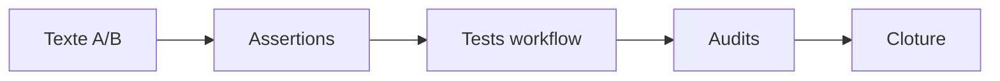

# Plan — Autorisation explicite des deux pushes potentiels

> Sous-chantier 2/3 de
> `EPIC_AMELIORATIONS_POST_RETROSPECTIVE_CI_NODE20`. Clarification
> conversationnelle du workflow commun, sans changement de son contrat JSON.

## 0. Bandeau de statut (a verifier avant toute promotion)

| Question | Reponse |
| --- | --- |
| Portee du chantier | `meta` — contrat d'autorisation et publication du workflow IA |
| Un chantier actif couvre-t-il deja ce perimetre ? | Non. Lot 1 `DONE`, parent `BASELINED`, `active_workstream_id` nul, aucun Lot 2 route. |
| Un verrou de gouvernance bloque-t-il le chantier ? | Non. Le changement reste documentaire dans le proprietaire `WORKFLOW.md`. |
| Une decision humaine est-elle requise avant routage ? | Non. Les propositions sont validees et `/continue` autorise le cycle gouverne; aucun push n'est autorise. |
| Ce plan remplace-t-il un chantier existant ? | Non. `PLAN_INTEGRATION_LEARN_SESSION_POST_CLOSE` est `DONE` et deja integre au texte courant; ce lot rebaseline dessus. |
| Resultat du test multi-lot | `SINGLE` : une clarification de contrat et sa preuve de non-regression sont sequentielles et inseparables. |

## Audit IA de promotion

- [x] Cockpit, parent, workflow live, contrat JSON et backend lus.
- [x] Nature revalidee : `GOVERNANCE/common`, aucun changement executable.
- [x] Intake autonome audite en deux passes et converge.
- [x] Cas seul A, autorisation A+B et echec du commit de fermeture bornes.
- [x] Perimetre ferme; aucun fichier humain sans rapport absorbe.
- [x] Aucun push autorise ni planifie par l'execution de ce lot.

## Triage

| Champ | Valeur |
| --- | --- |
| Track | `fix` |
| Lifecycle | `TRIAGED` |
| Type de chantier | `SINGLE` |
| Scope | Clarifier dans `.ai/workflows/common/WORKFLOW.md` qu'un cycle avec gate distant peut comporter un push A d'implementation puis un push B conditionnel du commit de fermeture, chacun exigeant une autorisation explicitement nommee. |
| Non-goals | Aucun push implicite/automatique; aucune modification de `WORKFLOW.json`, Mermaid, `plan.ps1`, hook Git, transition, preuve machine ou champ checkpoint; aucun changement de `Protocole/`, `Implementation/` ou autre fichier humain. |
| Source | Sous-chantier 2/3 du parent post-retrospective CI Node.js 20, revalide apres Lot 1 `DONE` et autorise par `/continue`. |
| Exit criteria | (1) A et B sont nommes et ordonnes. (2) A n'autorise jamais B. (3) Une autorisation anticipee A+B reste explicite et B conditionnel au commit de fermeture valide, sans commit hors scope. (4) Seul A autorise implique arret apres commit local; echec validation/commit interdit B. (5) Avant B, la plage distante -> HEAD est inspectee; tout commit additionnel, notamment retrospectif, impose arret et autorisation separee. (6) `/close` reste sans push automatique, `WORKFLOW.json` identique et tests workflow PASS. (7) Contre-preuve textuelle sans autorisation implicite. (8) Aucun fichier hors perimetre modifie. |

## Statut

| Champ | Valeur |
| --- | --- |
| Statut | `NON_DEMARRE` |
| Date de creation | 2026-08-09 |
| Date d'activation | `-` |
| Autorite normative | `.ai/workflows/common/WORKFLOW.md` pour le jugement conversationnel |
| Autorite executable | `.ai/workflows/common/WORKFLOW.json` inchange et `.ai/tools/plan.ps1` inchange |
| Changement normatif attendu | Aucun changement scientifique EBTA |
| Dependances externes | Gate GitHub distant eventuel; aucune operation externe dans ce lot |

## Carte d'execution IA (lecture prioritaire pour `/continue`)

| Champ | Contenu operationnel |
| --- | --- |
| Objectif executable | Ajouter une regle A/B concise au contrat d'autorisation puis prouver l'absence de changement machine. |
| Autorite et lecture minimale | Ce plan, `common/WORKFLOW.md`, `common/WORKFLOW.json`, `plan.ps1`, parent. |
| Perimetre autorise | `common/WORKFLOW.md` et ce plan pour preuves/cloture. |
| Interdits absolus | `WORKFLOW.json`, Mermaid, backend, hook, Protocole, Implementation, push. |
| Phase de reprise | Phase 1 — inserer la clarification dans le contrat d'autorisation. |
| Preuve attendue | Tests workflow PASS, diff JSON vide, assertions A/B et contre-preuve. |
| Arret et escalade | Besoin de changer une transition machine ou d'autoriser effectivement un push. |

## 1. Role de ce document et non-objectifs

| Element | Role |
| --- | --- |
| `WORKFLOW.md` | Proprietaire du contrat conversationnel; seul comportement modifie. |
| `WORKFLOW.json` | Autorite machine des transitions/preuves; doit rester identique. |
| `plan.ps1` | Backend de transition et fermeture; doit rester identique. |
| Ce plan | Contrat d'execution et preuves du Lot 2. |

Le lot ne donne aucune autorisation de publication. Il precise seulement la
forme non ambigue d'une future question d'autorisation lorsqu'un gate distant
rend possibles deux pushes successifs.

## 2. Contexte obligatoire a lire avant de coder

1. `AGENTS.md`, cockpit live et chemins actifs.
2. `.ai/workflows/common/WORKFLOW.md` en entier.
3. `.ai/workflows/common/WORKFLOW.json` et `.ai/tools/plan.ps1` en lecture.
4. Parent EPIC et archive du plan CI core-engine.
5. Archive `PLAN_INTEGRATION_LEARN_SESSION_POST_CLOSE` pour verifier le texte
   deja integre sans le rouvrir.

Hierarchie :

```text
1. WORKFLOW.json pour transitions et IDs de preuves
2. WORKFLOW.md pour jugements conversationnels et autorisations
3. plan.ps1 pour application mecanique
4. Ce plan pour le scope du Lot 2
```

## 3. Table des gates (points de decision sequentiels)

| Ordre | Gate | Question | Sortie si echec |
| --- | --- | --- | --- |
| G0 | Scope | Le diff fonctionnel est-il limite a `WORKFLOW.md` ? | Arret |
| G1 | Separation | A et B sont-ils nommes et autorises separement ? | Corriger le texte |
| G2 | Condition B | B depend-il d'une fermeture valide et d'aucun commit extra ? | Interdire B |
| G3 | Plage publiee | La plage distante -> HEAD contient-elle uniquement le commit de fermeture autorise ? | Arret et autorisation separee |
| G4 | Non-regression | JSON inchange et tests workflow PASS ? | Ne pas clore |
| G5 | Audits | Adversarial et conformite sans finding ? | Ne pas clore |

## 4. Etat des lieux (avant/apres) — reutiliser avant de recreer

### Ce qui existe deja

| Element | Chemin | Role reel | Suffisant ? |
| --- | --- | --- | --- |
| Contrat d'autorisation | `WORKFLOW.md:49-57` | Separe analyse, persistance, commit et push | Partiel : aucun cycle A/B |
| Fermeture | `WORKFLOW.md:164-208` | Commit local automatique apres validations; jamais de push | Oui, a conserver |
| Transitions | `WORKFLOW.json` | TRIAGED -> BASELINED -> ACTIVE -> READY_TO_CLOSE -> DONE | Oui, inchange |
| Tests | `.ai/tools/tests/test_workflow_state_machine.ps1` | Verifie contrats et transitions | Oui pour non-regression machine |

### Ce qui manque reellement

| Brique | Module | Source | Reutilisation |
| --- | --- | --- | --- |
| Regle d'autorisation A/B | `WORKFLOW.md`, contrat d'autorisation | Parent + incident CI | Reutiliser separation existante et interdiction push automatique |

## 5. Decision d'architecture

Ajouter un item au contrat d'autorisation universel, et non a `/close` ou au
JSON : la question intervient avant publication et concerne la portee du
consentement humain, pas une nouvelle transition machine.

### Frontieres explicites

| Couche | Fait | Ne fait pas |
| --- | --- | --- |
| Contrat A/B | Nomme les deux publications potentielles, separe leurs autorisations et borne B | Executer un push |
| `/close` existant | Valide, commit localement et invoque la retrospective | Pousser automatiquement |
| JSON/backend | Applique les transitions | Interpreter une autorisation de publication |

### Contrat d'interface entre les couches

```text
A = push du commit d'implementation pour lancer/prouver le gate distant
B = push conditionnel du seul commit de fermeture, apres validation et commit reussis
```

Etats : A seul autorise -> commit de fermeture local, B en attente; A+B
explicitement autorises -> B permis seulement si sa condition est satisfaite;
validation/commit echoue -> B interdit. Apres la retrospective automatique,
inspecter la plage distante -> HEAD : un correctif retrospectif ou tout autre
commit additionnel n'est pas couvert par B et impose une autorisation separee.

### Decisions deja actees

| Decision | Justification |
| --- | --- |
| Texte dans contrat d'autorisation | Proprietaire du consentement, avant toute action externe |
| Aucun changement JSON | Aucune transition ni preuve machine nouvelle |
| B strictement conditionnel | Evite qu'une autorisation anticipee transforme un echec en publication |
| Plage distante -> HEAD verifiee avant B | Empeche qu'un correctif retrospectif ou commit concurrent parte avec le commit de fermeture |

### Structure cible

```text
.ai/workflows/common/
|- WORKFLOW.md    # item A/B ajoute
`- WORKFLOW.json  # identique
```

### Perimetre de fichiers explicite (autorises / interdits)

Autorises :

```text
.ai/workflows/common/WORKFLOW.md
.ai/backlog/fixes/PLAN_AUTORISATION_PUBLICATION_DEUX_PUSHES.md  preuves/cloture
```

Interdits :

```text
.ai/workflows/common/WORKFLOW.json
.ai/workflows/common/WORKFLOW.mmd
.ai/tools/plan.ps1
Implementation/Active/pre_push_hook.py
Protocole/
Implementation/
.ai/checkpoint.schema.json
0 - HUMAN START HERE/ autres fichiers
```

## 6. Decoupage en phases

### Phase 1 - Clarifier l'autorisation A/B

Objectif : ajouter le contrat conversationnel des deux pushes potentiels.

Classification : GOVERNANCE

Actions :

- Inserer un item concis dans le contrat d'autorisation.
- Nommer A, B, ordre, separation, condition de B, comportement A-seul/echec
  et controle de la plage distante -> HEAD apres retrospective.
- Preserver l'interdiction de push automatique.

Livrables :

- `.ai/workflows/common/WORKFLOW.md` clarifie.

Critere de sortie :

- Exit criteria 1 a 5 satisfaits par lecture et assertions textuelles.

### Phase 2 - Prouver la non-regression machine

Objectif : verifier que la clarification n'a modifie aucune transition ni
autorisation executable.

Classification : GOVERNANCE

Actions :

- Executer la suite workflow.
- Prouver `WORKFLOW.json`, Mermaid, backend et hook sans diff.
- Executer l'audit adversarial et la conformite.

Livrables :

- Preuves dans la section 14; aucun artefact executable modifie.

Critere de sortie :

- Tests PASS, diff interdit vide, audits sans finding ouvert.

### Chemin critique (ordre des phases)



## 7. Artefacts produits

| Etape | Artefact | Format | Source |
| --- | --- | --- | --- |
| Clarification | `.ai/workflows/common/WORKFLOW.md` | Markdown | Ce plan |
| Preuves | Section 14 de ce plan | Markdown | Workflow common |

## 8. Invariants absolus et NO GO

### Invariants

1. A n'autorise jamais B.
2. B reste conditionnel a validation + commit de fermeture reussis.
3. B ne publie aucun commit hors scope apparu apres A.
4. `/close` ne pousse jamais automatiquement.
5. Aucun contrat machine n'est modifie.

### NO GO

- Formulation « autoriser le cycle » sans nommer A et B.
- Deduire B de A ou d'une autorisation de commit.
- Pousser B apres echec/absence de commit de fermeture.
- Pousser B si la plage distante -> HEAD contient un correctif retrospectif ou
  un autre commit non explicitement autorise.
- Modifier JSON, Mermaid, backend ou hook.
- Effectuer un push pendant ce lot.

## 9. Verification a chaque etape

```powershell
.\.ai\tools\tests\test_workflow_state_machine.ps1
git diff --exit-code -- .ai\workflows\common\WORKFLOW.json .ai\workflows\common\WORKFLOW.mmd .ai\tools\plan.ps1 Implementation\Active\pre_push_hook.py
rg -n "push A|push B|n'autorise pas|conditionnel|commit de fermeture|plage|autorisation separee" .ai\workflows\common\WORKFLOW.md
git diff --check -- .ai\workflows\common\WORKFLOW.md
```

Premier lot executable : inserer uniquement l'item A/B dans le contrat
d'autorisation.

### Execution sans interruption

Executer les deux phases sans retour humain tant que le scope reste
documentaire et aucun push n'est tente. Arreter si une transition machine ou
une operation externe devient necessaire.

### Autorite decisionnelle accordee

L'IA peut choisir la formulation concise et les assertions de preuve. Elle ne
peut modifier aucun fichier executable, autoriser/pousser, ni elargir le scope.

### Interdiction des raccourcis

Une phrase ambigue ou un test non execute est non-PASS. Une autorisation
anticipee de B ne survit pas a l'echec de sa condition.

## 10. Journal des decisions humaines (autorisations)

| Date | Decision | Portee |
| --- | --- | --- |
| 2026-08-09 | `Je valide tes propositions`, puis `/continue`. | Autorise le Lot 2 documentaire; n'autorise aucun push. |

## 11. Risques et blocages connus

| Risque | Impact | Mitigation |
| --- | --- | --- |
| A est interprete comme cycle complet | Push B non autorise | Phrase litterale A n'autorise jamais B |
| B autorise malgre echec close | Publication incoherente | Condition validation + commit reussis |
| Changement du JSON pour un jugement humain | Nouvelle source mecanique inutile | Diff JSON interdit |
| Texte du Lot 1/learn-session ecrase | Regression workflow | Insertion locale, relecture live et tests |

## 12. Definition of Done

- [ ] Portee meta, track fix, type SINGLE coherents.
- [ ] Exit criteria 1-8 prouves.
- [ ] Tests workflow PASS.
- [ ] Fichiers executables interdits sans diff.
- [ ] Adversarial et conformite sans finding.
- [ ] Checkpoint valide apres transitions.
- [ ] Aucun push.

## 13. Cloture

| Champ | Valeur |
| --- | --- |
| Resultat final | A remplir lors de `/close` |
| Ecarts | A remplir lors de `/close` |
| Suites a prevoir | Retour au parent puis Lot 3 autonome |

### Resultat d'execution

| Champ | Valeur |
| --- | --- |
| Date | 2026-08-09 |
| Phases executees | Aucune avant baseline |
| Artefact | Plan uniquement |
| Validation | Intake converge en 2 passes |
| Ecart | Aucun |

## 14. Journal d'audits post-hoc

### Journal de convergence de l'intake

| Passe | Constat | Correction | Resultat |
| --- | --- | --- | --- |
| `/evaluate` 1 | Manquaient comportement A-seul, interdiction de B apres echec et test workflow. | Bornes et preuve ajoutees. | Corrections appliquees. |
| `/evaluate` 2 | Contre-audit workflow/JSON/backend/historique; chantier SINGLE, B conditionnel fail-closed, aucune transition modifiee. | Aucune. | `CONVERGE`. |

### Journal d'audits post-route

| Passe | Constat | Correction | Resultat |
| --- | --- | --- | --- |
| `/evaluate` 1 | Angle mort : la retrospective automatique s'execute apres le commit de fermeture et peut, sous autorisation preexistante, creer un correctif local distinct. Un push B non borne publierait alors plus que le commit de fermeture nomme. | Ajout d'une verification de la plage distante -> HEAD apres retrospective; tout commit additionnel impose arret et autorisation separee. Gates, invariants, NO GO et Exit criteria mis a jour. | Corrections appliquees; seconde passe requise. |
| `/evaluate` 2 | Contre-audit du plan corrige contre l'ordre reel `/close` -> commit -> retrospective et le contrat Git du depot. A, B et les commits intermediaires sont bornes sans ajouter de transition; le texte reste dans le proprietaire conversationnel, les preuves machine demeurent inchangees et le chantier reste `SINGLE`. | Aucune correction supplementaire. | `CONVERGE` en 2 passes post-route; aucun angle mort majeur restant. |
