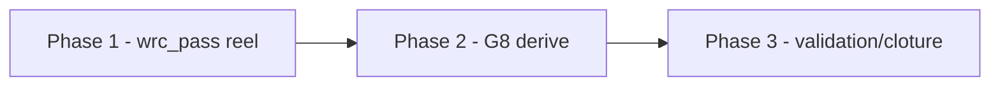

# Plan — Lot E : G8 acces OOS et correction du bug wrc_pass fige

> Sous-chantier 2/4 de `EPIC_ATTESTATIONS_RESIDUELLES_R3`. Ce plan est
> `SINGLE` : il corrige un seul flux coherent, l'autorisation OOS G8, et ne
> coordonne aucun sous-lot independant.

---

## 0. Bandeau de statut (a verifier avant toute promotion)

| Question | Reponse |
| --- | --- |
| Un chantier actif couvre-t-il deja ce perimetre (`DONE`, `ACTIVE`, ou `SUPERSEDED`) ? | Non. `.ai/checkpoint.json::active_workstream_id` est `null`. Lot D est `DONE`; aucun workstream `PLAN_CORRECTION_ACCES_OOS_LOT_E` n'existe encore. |
| Un verrou de gouvernance actif bloque-t-il ce chantier ? | Non. Le chantier mere autorise explicitement Lot E apres cloture Lot D. |
| Ce plan a-t-il besoin d'une decision humaine explicite pour lever ce verrou avant d'etre routable via `/start` ? | Non. Les decisions necessaires a Lot E sont deja journalisees dans le chantier mere le 2026-07-17 et le 2026-07-18. |
| Ce plan remplace-t-il un document ou chantier existant ? | Non. Il materialise le sous-chantier prevu par l'EPIC parent. |

---

## Audit IA de promotion

- [x] Plan relu dans le contexte du cockpit actif : `AGENTS.md`, `.ai/README.md`, `.ai/checkpoint.json`, `Implementation/Active/HOOK.md`, `Implementation/Active/tracking.json`.
- [x] Bandeau de statut rempli et verifie contre l'etat machine reel.
- [x] Ce plan a ete ECRIT COMME NOUVEAU FICHIER dans `.ai/backlog/fixes/`; le brouillon original reste dans `0 - HUMAN START HERE/` jusqu'a archivage par `plan.ps1 start`.
- [x] Chantier classe `fix`, car il corrige des attestations G8 encore codees en dur et un bug de calcul `wrc_pass`.
- [x] Autorite normative identifiee : `Protocole/PAQUET D'EXECUTION EBTA.md` pour G8 et SOP 10 pour l'autorisation OOS.
- [x] Perimetre de fichiers autorises/interdits explicite en section 5.
- [x] Aucune modification hors perimetre n'est requise pour activer le chantier.
- [x] Prerequis factuels verifies dans le code : `wrc_pass` est fige a `True`; les trois champs G8 sont des litteraux `True`; `authorize_oos_access()` sait deja refuser un acces quand `wrc_pass` est faux.
- [x] Etat des lieux section 4 verifie pour reutiliser le calcul existant plutot que recreer une autorisation concurrente.

## Triage

| Champ | Valeur |
| --- | --- |
| Track | `fix` |
| Lifecycle | `TRIAGED` |
| Type de chantier | `SINGLE` |
| Scope | Corriger Lot E en faisant deriver `wrc_pass` du verdict WRC reel et les trois champs G8 (`oos_access_log`, `opening_authorization`, `single_oos_execution_log`) du rapport `oos_access_decision`. |
| Non-goals | Ne pas modifier `Protocole/`; ne pas modifier `validators/gate_validator.py`; ne pas changer les valeurs admises des gates; ne pas traiter Lot F; ne pas regenerer `Implementation/research_packages/nautilus_mvp` dans ce lot; ne pas transformer un WRC `FAIL` en succes pour garder un package vert. |
| Source | Sous-chantier 2/4 declare par `EPIC_ATTESTATIONS_RESIDUELLES_R3`, apres cloture Lot D le 2026-07-18. |
| Exit criteria | (1) `_oos_access_request()` utilise `wrc["verdict"] == "PASS"` ou une source equivalente, pas un litteral `True`. (2) Les trois champs G8 de `gates.json` derivent de `oos_access_decision["status"]`. (3) Un test de contraste prouve qu'un WRC `FAIL` produit `oos_access_decision.status = "DENIED"` et que les champs G8 ne passent pas. (4) Les tests cibles, la suite runtime, le build pilote, bug-hunter et plan-conformance-audit sont `PASS` avant cloture. |

## Statut

| Champ | Valeur |
| --- | --- |
| Statut | `NON_DEMARRE` |
| Date de creation | 2026-07-18 |
| Date d'activation | - |
| Autorite normative | `Protocole/PAQUET D'EXECUTION EBTA.md` ; SOP 10 - Gouvernance OOS et gestion des echecs |
| Autorite executable | `Implementation/examples/minimal_pilot_pipeline/build_research_package.py` ; `Implementation/ebta_engine/procedures/oos_access.py` |
| Changement normatif attendu | Aucun |
| Dependances externes | Aucune nouvelle |

---

## 1. Role de ce document et non-objectifs

| Element | Role |
| --- | --- |
| `Protocole/PAQUET D'EXECUTION EBTA.md` et SOP 10 | Autorite normative pour l'acces OOS et le gate G8. |
| `procedures/oos_access.py::authorize_oos_access()` | Calcul executable deja existant de l'autorisation ou du refus OOS. |
| `build_research_package.py::_oos_access_request()` | Assemblage fautif du signal d'acces OOS, a corriger. |
| `reports/gates.json` | Artefact de gate qui ne doit plus porter G8 en litteraux `True`. |
| Ce plan | Carte d'execution du Lot E, sans modifier la norme. |

Non-objectifs :

- ne pas reecrire l'autorite normative ;
- ne pas introduire un nouveau seuil ou un nouveau statut ;
- ne pas modifier le validateur global des gates ;
- ne pas ouvrir l'OOS ni construire un workflow live ;
- ne pas regenerer le package persistant `nautilus_mvp`, reserve a la Phase 4 du chantier mere.

---

## 2. Contexte obligatoire a lire avant de coder

1. `AGENTS.md`, `.ai/README.md`, `.ai/checkpoint.json`, `Implementation/Active/HOOK.md`, `Implementation/Active/tracking.json`.
2. `.ai/backlog/fixes/EPIC_ATTESTATIONS_RESIDUELLES_R3.md`, surtout sections 3.3, 5 Phase 2, 7, 8, 9 et 10.
3. `0 - HUMAN START HERE/archive/20260718_PLAN_CORRECTION_REGISTRE_ECONOMIQUE_LOT_D.md` et `.ai/archive/20260718_PLAN_CORRECTION_REGISTRE_ECONOMIQUE_LOT_D.md` pour le precedent de derivation de gates depuis rapports reels.
4. `Protocole/PAQUET D'EXECUTION EBTA.md` pour G8 et SOP 10 pour l'acces OOS.
5. `Implementation/examples/minimal_pilot_pipeline/build_research_package.py`.
6. `Implementation/ebta_engine/procedures/oos_access.py`.
7. `Implementation/ebta_engine/tests/test_minimal_pilot_pipeline.py` et `Implementation/ebta_engine/tests/test_nautilus_research_package.py`.

**Hierarchie d'autorite applicable a ce chantier** :

```text
1. Protocole/MANIFESTE DE GEL EBTA.md
2. Protocole/PROTOCOLE EBTA.md
3. Protocole/REGISTRE DES DECISIONS NORMATIVES EBTA.md
4. SOP 10 et PAQUET D'EXECUTION EBTA.md
5. Implementation/ebta_engine/procedures/oos_access.py
6. Implementation/examples/minimal_pilot_pipeline/build_research_package.py
7. Adaptateur Nautilus, subordonne au runtime EBTA
```

Regle : si WRC vaut `FAIL`, l'autorisation OOS ne peut pas rester
`AUTHORIZED` par un raccourci de builder.

---

## 3. Table des gates (points de decision sequentiels)

| Ordre | Gate | Question posee au systeme | Sortie si echec |
| --- | --- | --- | --- |
| G4 | WRC pre-OOS | Le verdict WRC primaire est-il `PASS` ? | Gate statistique non passant. |
| G5 | Robustesse pre-OOS | Les controles de robustesse sont-ils `PASS` ? | Acces OOS refuse. |
| G6 | Execution reconstructible | Execution, couts, capacite et NAV sont-ils exploitables ? | Acces OOS refuse. |
| G8 | Acces OOS | Tous les prerequis pre-OOS, dont WRC, robustesse, execution, approbation independante et G-BIAS, sont-ils satisfaits ? | `oos_access_decision.status = DENIED`; les champs G8 ne passent pas. |

---

## 4. Etat des lieux (avant/apres) — reutiliser avant de recreer

### Ce qui existe deja

| Module actuel | Chemin | Role reel (verifie, pas suppose) | Suffisant pour l'objectif ? |
| --- | --- | --- | --- |
| `authorize_oos_access()` | `Implementation/ebta_engine/procedures/oos_access.py` | Calcule `AUTHORIZED` seulement si les six flags requis sont truthy; sinon `DENIED` et liste `missing_requirements`. | Oui, a reutiliser sans changement. |
| `_procedure_reports()` | `Implementation/examples/minimal_pilot_pipeline/build_research_package.py` | Calcule deja `wrc["verdict"]`, `robustness`, `sealing`, `g_bias`, puis appelle `authorize_oos_access()`. | Oui, mais son appel a `_oos_access_request()` doit transmettre WRC. |
| `_write_reports()` | `Implementation/examples/minimal_pilot_pipeline/build_research_package.py` | Assemble `gates.json`; G8 y est encore trois litteraux `True`. | A corriger. |
| Tests Nautilus | `Implementation/ebta_engine/tests/test_nautilus_research_package.py` | Contient deja un runner produisant un WRC `FAIL` pour tester la propagation statistique. | A etendre pour prouver OOS DENIED. |

### Ce qui manque reellement

| Brique manquante | Module a creer | Source de la regle | Ce qui existe deja et doit etre reutilise |
| --- | --- | --- | --- |
| Derivation de `wrc_pass` | Aucun module nouveau | SOP 10 / G8 | Utiliser `wrc["verdict"] == "PASS"` dans `_oos_access_request()`. |
| Derivation des champs G8 | Aucun module nouveau | `PAQUET D'EXECUTION EBTA.md` G8 | Utiliser `procedure_reports["oos_access_decision"]["status"]`. |
| Test de contraste WRC FAIL | Aucun module nouveau | Exit criteria du chantier mere | Reutiliser `_statistical_fail_segment_runner` dans `test_nautilus_research_package.py`. |

---

## 5. Decision d'architecture

Principe directeur : ne pas creer un second moteur d'autorisation OOS. Le
builder doit corriger les entrees envoyees a `authorize_oos_access()` puis
faire deriver G8 du rapport produit par cette procedure.

Raison 1 : `authorize_oos_access()` est deja la source executable du verdict
OOS; dupliquer son calcul dans `gates.json` recreerait une source concurrente.

Raison 2 : le bug vient d'un assemblage qui masque un verdict WRC reel.
Brancher G8 sur `oos_access_decision` rend le masquage observable par les
tests et par `gate_report()`.

### Frontieres explicites

| Couche | Elle fait | Elle NE fait PAS |
| --- | --- | --- |
| `procedures/oos_access.py` | Decide `AUTHORIZED` ou `DENIED` selon les flags fournis. | Ne lit pas les rapports WRC, ne derive pas les flags. |
| `build_research_package.py` | Derive les flags depuis les rapports deja calcules et expose le verdict dans `gates.json`. | Ne change pas les regles d'autorisation. |
| Tests | Prouvent le chemin PASS et le contraste WRC FAIL. | Ne remplacent pas les rapports par des literals de complaisance. |

### Contrat d'interface entre les couches

```python
def _oos_access_request(
    pilot_inputs: dict,
    wrc: dict,
    robustness: dict,
    sealing: dict,
    g_bias: dict,
) -> dict:
    """Retourne les flags attendus par authorize_oos_access()."""
```

`wrc_pass` doit valoir `wrc.get("verdict") == "PASS"`.

### Decisions deja actees

| Decision | Justification |
| --- | --- |
| Reutiliser `authorize_oos_access()` sans modification | La procedure sait deja refuser l'acces si `wrc_pass` est faux. |
| Mapper les trois champs G8 sur le meme statut OOS | Les trois attestations representent la presence/autorisation du meme acces OOS dans ce package pilote; si l'acces est refuse, aucune ne doit passer. |
| Ne pas regenerer `nautilus_mvp` dans ce lot | L'EPIC parent reserve cette action a la Phase 4 apres D/E/F. |

### Perimetre de fichiers explicite (autorises / interdits)

**Autorises (creer ou modifier)** :

```text
Implementation/examples/minimal_pilot_pipeline/build_research_package.py          MODIFIER
Implementation/ebta_engine/tests/test_minimal_pilot_pipeline.py                  MODIFIER
Implementation/ebta_engine/tests/test_nautilus_research_package.py               MODIFIER
Implementation/examples/minimal_pilot_pipeline/research_package/                 MODIFIER - artefact genere pilote
Implementation/HISTORIQUE DES VERSIONS EBTA ENGINE.md                            MODIFIER - historique runtime
.ai/backlog/fixes/PLAN_CORRECTION_ACCES_OOS_LOT_E.md                             MODIFIER - statut/cloture du plan
.ai/backlog/fixes/EPIC_ATTESTATIONS_RESIDUELLES_R3.md                            MODIFIER - suivi parent apres cloture
.ai/checkpoint.json                                                               MODIFIER via plan.ps1 uniquement
```

**Interdits (ne jamais modifier dans ce chantier)** :

```text
Protocole/                                                                        NORME - intouchable
Implementation/ebta_engine/validators/gate_validator.py                          CONTRAT DEJA SUFFISANT
Implementation/ebta_engine/procedures/oos_access.py                              CONSERVER TEL QUEL sauf bug confirme dans la procedure elle-meme
Implementation/research_packages/nautilus_mvp/                                   HORS LOT E - Phase 4 du chantier mere
.ai/checkpoint.schema.json                                                        PAS D'EXTENSION
Lot F / invariant_evidence.json                                                   HORS LOT E
```

---

## 6. Decoupage en phases

### Phase 1 - Corriger la requete OOS

Objectif : faire deriver `wrc_pass` du verdict WRC reel.

Classification : IMPLEMENTATION_DETAIL

Actions :

- Modifier `_procedure_reports()` pour transmettre `wrc` a `_oos_access_request()`.
- Modifier `_oos_access_request()` pour calculer `wrc_pass` depuis `wrc["verdict"]`.

Livrables :

- `oos_access_decision.status` devient `DENIED` quand WRC vaut `FAIL`.

Critere de sortie :

- Un test cible prouve WRC `FAIL` -> `missing_requirements` contient `wrc_pass`.

### Phase 2 - Deriver G8 depuis oos_access_decision

Objectif : remplacer les trois litteraux G8 par un verdict derive du rapport OOS.

Classification : IMPLEMENTATION_DETAIL

Actions :

- Ajouter un helper local de gate G8 si necessaire.
- Remplacer `oos_access_log`, `opening_authorization` et `single_oos_execution_log` par le statut derive de `oos_access_decision`.
- Regenerer le package pilote minimal.

Livrables :

- `reports/gates.json` pilote ne contient plus les trois `True` G8.

Critere de sortie :

- Les tests verifient que les trois champs G8 sont des strings derivees et non des booleens.

### Phase 3 - Validation et cloture

Objectif : prouver que Lot E respecte son plan et ne regresse pas le runtime.

Classification : GOVERNANCE

Actions :

- Executer les tests cibles et la suite runtime.
- Executer le build pilote minimal.
- Executer bug-hunter Pyrefly sur les fichiers touches.
- Executer plan-conformance-audit avant `plan.ps1 close`.
- Clore le plan si tout est `PASS`.
- Mettre a jour l'EPIC parent pour pointer vers Lot F ou sa pause de confirmation.

Livrables :

- Workstream `PLAN_CORRECTION_ACCES_OOS_LOT_E` archive en `DONE`.

Critere de sortie :

- `.ai/checkpoint.json` montre Lot E `DONE`; EPIC parent coche Lot E.

### Chemin critique (ordre des phases)



---

## 7. Artefacts produits

| Etape | Fichier/sortie | Format | Regle source |
| --- | --- | --- | --- |
| Correction builder | `build_research_package.py` | Python | SOP 10 / G8 |
| Non-regression pilote | `test_minimal_pilot_pipeline.py` | unittest | Plan Lot E |
| Non-regression production | `test_nautilus_research_package.py` | unittest | Plan Lot E |
| Preuve generee | `Implementation/examples/minimal_pilot_pipeline/research_package/reports/gates.json` | JSON | Package pilote |
| Historique runtime | `Implementation/HISTORIQUE DES VERSIONS EBTA ENGINE.md` | Markdown | Gouvernance Implementation |

---

## 8. Invariants absolus et NO GO

### Invariants

1. Un WRC `FAIL` ne peut jamais produire `wrc_pass: True`.
2. Les champs G8 ne peuvent pas passer si `oos_access_decision.status` vaut `DENIED`.
3. Le validateur global des gates reste inchangé.
4. Aucun statut EBTA nouveau n'est introduit.

### NO GO

- Remplacer `True` par un autre litteral qui ne lit pas `oos_access_decision`.
- Changer les exigences de `authorize_oos_access()` pour faire passer le test.
- Modifier `Protocole/`.
- Regenerer `Implementation/research_packages/nautilus_mvp` dans ce lot.
- Masquer un basculement `PASS` -> `FAIL`/`INCONCLUSIVE`.

---

## 9. Verification a chaque etape

```powershell
python -m unittest discover -s Implementation\ebta_engine\tests -t Implementation -p test_minimal_pilot_pipeline.py
```

```powershell
python -m unittest discover -s Implementation\ebta_engine\tests -t Implementation -p test_nautilus_research_package.py
```

```powershell
python -m unittest discover -s Implementation\ebta_engine\tests -t Implementation
```

```powershell
python Implementation\examples\minimal_pilot_pipeline\build_research_package.py
```

```powershell
Implementation\adapters\nautilus_env\venv\Scripts\python.exe -m pyrefly check Implementation\examples\minimal_pilot_pipeline\build_research_package.py Implementation\ebta_engine\tests\test_minimal_pilot_pipeline.py Implementation\ebta_engine\tests\test_nautilus_research_package.py --output-format min-text
```

**Regle transversale bloquante** : la suite runtime complete doit rester
`PASS`; un G8 devenu non passant dans un cas WRC `FAIL` est une preuve de
correction, pas une regression.

**Premier lot executable propose** :

```text
Phase 1 - Corriger la requete OOS
```

### Execution sans interruption

Ce plan est concu pour etre execute integralement sans retour humain. Les
decisions de perimetre sont deja tracees dans l'EPIC parent. Stopper
uniquement si une modification hors perimetre devient necessaire, si une
decision normative manque, ou si une validation revele un vrai bug non
corrigeable dans le perimetre.

### Autorite decisionnelle accordee

L'IA peut choisir les helpers locaux et les assertions de test tant que le
scope, les invariants et les non-goals restent respectes.

### Interdiction des raccourcis (aucun faux succes)

Ne jamais affaiblir un test, ignorer un WRC `FAIL`, ou modifier le validateur
global pour compenser un builder fautif.

---

## 10. Journal des decisions humaines (autorisations)

| Date | Decision | Portee |
| --- | --- | --- |
| 2026-07-17 | Le chantier mere R3 retient Lot E comme sous-chantier distinct, apres Lot D. | Autorise correction G8 et bug `wrc_pass` dans son propre cycle complet. |
| 2026-07-18 | Lot D est `DONE`; le chantier mere pointe Lot E comme prochaine etape executable. | Autorise le routage et l'execution de ce Lot E. |

---

## 11. Risques et blocages connus

| Risque | Impact | Mitigation / condition de deblocage |
| --- | --- | --- |
| WRC `FAIL` fait basculer G8 a `INCONCLUSIVE`/non passant dans certains packages | Le package peut devenir rouge apres correction | Verdict legitime : documenter, ne pas masquer. |
| Les trois champs G8 sont plus fins que le statut unique `oos_access_decision` dans un futur package | Risque de mapping trop compact | Pour ce lot, le package pilote expose un seul evenement OOS; tout besoin de granularite future devra etre un chantier separe. |

---

## 12. Definition of Done

- [ ] `_oos_access_request()` ne contient plus `wrc_pass: True`.
- [ ] Les trois champs G8 ne sont plus des litteraux `True`.
- [ ] Test WRC FAIL -> `oos_access_decision.status = "DENIED"` et G8 non passant.
- [ ] Tests cibles et suite runtime `PASS`.
- [ ] Build pilote minimal `PASS`.
- [ ] Bug-hunter Pyrefly `PASS`.
- [ ] Plan-conformance-audit `PASS`.
- [ ] Plan clos via `plan.ps1 close` et checkpoint valide.

---

## 13. Cloture

| Champ | Valeur |
| --- | --- |
| Resultat final | [a remplir a la cloture] |
| Ecarts par rapport au plan initial | [a remplir a la cloture] |
| Suites a prevoir (hors perimetre de ce plan) | [a remplir a la cloture] |

### Resultat d'execution

| Champ | Valeur |
| --- | --- |
| Date | [a remplir] |
| Phases executees | [a remplir] |
| Artefact produit | [a remplir] |
| Validation | [a remplir] |
| Ecart par rapport au plan | [a remplir] |

---

## 14. Journal d'audits post-hoc

| Date de l'audit | Ce qui a ete corrige | Pourquoi |
| --- | --- | --- |
| 2026-07-18 | Passe `/evaluate` 1 sur le brouillon et le plan initial : ajout explicite du package Nautilus WRC FAIL comme preuve de contraste obligatoire. | Eviter un test uniquement unitaire qui ne prouverait pas le chemin production. |
| 2026-07-18 | Passe `/evaluate` 2 : convergence, aucun nouveau blind spot majeur. | Le plan reutilise la procedure existante, interdit les modifications normatives et borne la regeneration persistante hors Lot E. |
