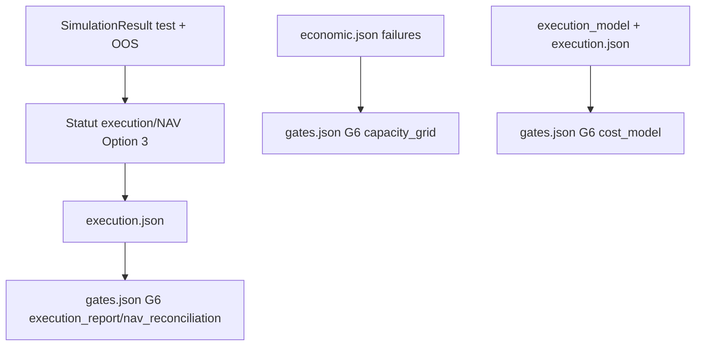
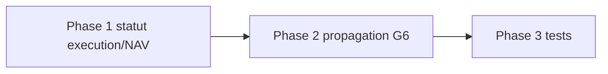

# Plan — Lot B : G6 execution/NAV reconstructible

> Sous-chantier `fix` de l'EPIC
> `EPIC_CLOTURE_ATTESTATIONS_RESIDUELLES_GATES`. Ce plan applique la decision
> humaine du 2026-07-17 : Option 3 stricte pour le seuil execution/NAV.

---

## 0. Bandeau de statut (a verifier avant toute promotion)

| Question | Reponse |
| --- | --- |
| Un chantier actif couvre-t-il deja ce perimetre (`DONE`, `ACTIVE`, ou `SUPERSEDED`) ? | Non. `.ai/checkpoint.json::active_workstream_id` est `null`. Les lots C (`PLAN_CORRECTION_GATES_MECANIQUES_LOT_C`) et A2 (`PLAN_CORRECTION_POWER_CHECK_A2`) sont `DONE`, mais ne couvrent pas G6. |
| Un verrou de gouvernance actif bloque-t-il ce chantier ? | Non depuis le GO humain du 2026-07-17, journalise dans l'EPIC section 10. |
| Ce plan a-t-il besoin d'une decision humaine explicite pour lever ce verrou avant d'etre routable via `/start` ? | Non. La decision requise est deja actee : Option 3 stricte. |
| Ce plan remplace-t-il un document ou chantier existant ? | Non. Il complete l'EPIC sans rouvrir les lots C/A2 ni les plans Nautilus deja clos. |

---

## Audit IA de promotion

- [x] Plan relu dans le contexte du cockpit actif (`AGENTS.md`, `.ai/README.md`, `.ai/checkpoint.json`, `Implementation/Active/HOOK.md`, `Implementation/Active/tracking.json`).
- [x] Bandeau de statut rempli et verifie contre l'etat machine reel.
- [x] Ce plan est ECRIT COMME NOUVEAU FICHIER dans `.ai/backlog/fixes/` ; le brouillon original reste intact dans `0 - HUMAN START HERE/` jusqu'a l'archivage par `plan.ps1 start`.
- [x] Chantier classe `fix` : correction de champs G6 codes en dur dans `gates.json` et du rapport execution/NAV Nautilus.
- [x] Autorites normatives identifiees : `Protocole/PAQUET D'EXECUTION EBTA.md` G6, `Protocole/SOP 08`, `Protocole/SOP 09B`.
- [x] Perimetre de fichiers autorises/interdits explicite en section 5.
- [x] Aucune modification hors perimetre n'est requise pour activer ce chantier.
- [x] Prerequis factuels disponibles : decision humaine Lot B, code fautif verifie, tests cibles identifies.
- [x] Etat des lieux verifie pour reutiliser `_total_orders`, `SimulationResult.nav`, `economic_gate_report`, `_procedure_reports()` et `gate_validator.py` au lieu de creer une source concurrente.

## Triage

| Champ | Valeur |
| --- | --- |
| Track | `fix` |
| Lifecycle | `TRIAGED` |
| Scope | Remplacer les attestations G6 codees en dur par des verdicts derives de la preuve execution/NAV et des rapports existants, puis bloquer le `PASS` si la preuve execution/NAV est insuffisante ou contradictoire. |
| Non-goals | Ne pas modifier `Protocole/`, les SOP, `validators/gate_validator.py::VERDICT_VALUES`, les manifests, la gouvernance, BACKTRADER, ni les lots C/A2 deja clos. Ne pas introduire de nouveau statut de gate, de nouveau seuil statistique, ni de nouvel appel API Nautilus. |
| Source | Brouillon `0 - HUMAN START HERE/PLAN_CORRECTION_EXECUTION_NAV_LOT_B.md`, EPIC `EPIC_CLOTURE_ATTESTATIONS_RESIDUELLES_GATES.md` section 10, GO humain du 2026-07-17. |
| Exit criteria | (1) `execution_report.status` et `nav_reconciliation` ne sont plus codes en dur a `PASS` dans `nautilus_research_package.py`. (2) Les champs G6 `execution_report`, `cost_model`, `capacity_grid`, `nav_reconciliation` ne sont plus des litteraux `True` dans `build_research_package.py`. (3) Un cas zero-trade/OOS sans ordre ou NAV non prouvee ne peut pas produire un G6 `PASS`. (4) Tests cibles, suite runtime, build pilote, pyrefly, bug-hunter et conformance audit passent avant cloture. |

## Statut

| Champ | Valeur |
| --- | --- |
| Statut | `NON_DEMARRE` |
| Date de creation | 2026-07-17 |
| Date d'activation | - |
| Autorite normative | `Protocole/PAQUET D'EXECUTION EBTA.md` G6 ; `Protocole/SOP 08` ; `Protocole/SOP 09B` |
| Autorite executable | `Implementation/` |
| Changement normatif attendu | Aucun |
| Dependances externes | Aucune nouvelle ; Nautilus reste confine aux adaptateurs existants. |

---

## 1. Role de ce document et non-objectifs

| Element | Role |
| --- | --- |
| `Protocole/PAQUET D'EXECUTION EBTA.md` | Autorite des gates et des artefacts attendus, dont G6. |
| `Protocole/SOP 08` | Autorite pour NAV, serie de rendement et statut `INCONCLUSIVE` si preuve economique non reconstructible. |
| `Protocole/SOP 09B` | Autorite pour chaine execution, couts, capacite, sizing, ordres/fills/positions. |
| `Implementation/ebta_engine/package_builder/nautilus_research_package.py` | Produit les entrees Nautilus qui alimentent le package pilote. |
| `Implementation/examples/minimal_pilot_pipeline/build_research_package.py` | Ecrit `gates.json` et les rapports du package. |
| Ce plan | Carte d'implementation verifiable du fix Lot B. |

Non-objectifs :

- ne pas reecrire les SOP ou le protocole ;
- ne pas modifier le validateur pour accepter une valeur locale ;
- ne pas transformer NotebookLM ou le livre en source executable ;
- ne pas produire un `PASS` a partir d'une simple presence de champ ;
- ne pas reouvrir les corrections Lot C/A2.

---

## 2. Contexte obligatoire a lire avant de coder

1. `AGENTS.md`, `.ai/README.md`, `.ai/checkpoint.json`, `Implementation/Active/HOOK.md`, `Implementation/Active/tracking.json`.
2. `.ai/backlog/fixes/EPIC_CLOTURE_ATTESTATIONS_RESIDUELLES_GATES.md`, section 10.
3. `Protocole/PAQUET D'EXECUTION EBTA.md`, G6 et tableau des rapports.
4. `Protocole/SOP 08 - Mesures de performance et série de rendement de référence.md`, sections NAV/reconciliation/INCONCLUSIVE.
5. `Protocole/SOP 09B - Modèle d’exécution frictions capacité et sizing.md`, sections execution/capacite.
6. `Implementation/ebta_engine/package_builder/nautilus_research_package.py`.
7. `Implementation/examples/minimal_pilot_pipeline/build_research_package.py`.
8. `Implementation/ebta_engine/validators/gate_validator.py`.

**Hierarchie d'autorite applicable** :

```text
1. Protocole/ et SOP geles
2. Decision humaine journalisee dans l'EPIC pour le seuil Lot B
3. Implementation/ comme traduction executable
4. NautilusTrader comme moteur/adaptateur subordonne
```

Regle : si la preuve est absente ou non reconstructible, produire
`INCONCLUSIVE` plutot que `PASS`.

---

## 3. Table des gates (points de decision sequentiels)

| Ordre | Gate | Question posee au systeme | Sortie si echec |
| --- | --- | --- | --- |
| G6.1 | `execution_report` | La preuve execution/NAV calculee par Nautilus satisfait-elle Option 3 stricte ? | `INCONCLUSIVE` si preuve insuffisante ; `FAIL` si contradiction explicite. |
| G6.2 | `cost_model` | Le modele de cout scelle existe-t-il et reste-t-il coherent avec le rapport execution ? | `INCONCLUSIVE` si preuve absente ; `FAIL` si contradiction. |
| G6.3 | `capacity_grid` | La grille de capacite existe-t-elle et ne signale-t-elle pas un echec de capacite ? | `INCONCLUSIVE` si preuve absente ; `FAIL` si violation explicite. |
| G6.4 | `nav_reconciliation` | La NAV globale et la NAV OOS sont-elles presentes, positives, non plates et reconciliables a minima avec l'execution produite ? | `INCONCLUSIVE` si non prouve ; `FAIL` si NAV non positive ou contradiction. |

---

## 4. Etat des lieux (avant/apres) — reutiliser avant de recreer

### Ce qui existe deja

| Module actuel | Chemin | Role reel (verifie, pas suppose) | Suffisant pour l'objectif ? |
| --- | --- | --- | --- |
| `_total_orders()` | `Implementation/ebta_engine/package_builder/nautilus_research_package.py` | Additionne `metadata["total_orders"]` ou `len(result.orders)` pour une liste de `SimulationResult`. | A reutiliser. |
| `SimulationResult.nav` | `Implementation/ebta_engine/strategies/contracts.py` | Porte la serie NAV extraite par le runner/adaptateur. | A reutiliser pour presence, positivite, non-platitude. |
| `_procedure_reports()` | `Implementation/examples/minimal_pilot_pipeline/build_research_package.py` | Expose deja `execution` et `economic` au moment d'ecrire `gates.json`. | A etendre sans nouveau rapport. |
| `economic_gate_report()` | `Implementation/ebta_engine/procedures/economic_gate.py` | Retourne `failures` contenant `capacity_pass` ou `capacity_grid` quand la preuve capacite echoue/manque. | A reutiliser pour convertir `capacity_grid`. |
| `gate_validator.py` | `Implementation/ebta_engine/validators/gate_validator.py` | Ne traite specialement que `PASS`/`FAIL`/`INCONCLUSIVE`; toute autre chaine non vide est consideree presente. | A ne pas modifier ; impose une conversion explicite. |

### Ce qui manque reellement

| Brique manquante | Module a creer/modifier | Source de la regle | Ce qui existe deja et doit etre reutilise |
| --- | --- | --- | --- |
| Evaluation execution/NAV Option 3 stricte | `nautilus_research_package.py` | EPIC section 10 + G6/SOP 08/SOP 09B | `_total_orders`, `SimulationResult.nav`, resultats OOS. |
| Conversion G6 vers verdicts gate | `build_research_package.py` | `gate_validator.py` + G6 | `procedure_reports["execution"]`, `procedure_reports["economic"]`. |
| Non-regression zero-trade/NAV insuffisante | Tests Nautilus et pilote | Incident gates codes en dur | Fixtures existantes avec `segment_runner` injecte. |

---

## 5. Decision d'architecture

Principe directeur : faire descendre la preuve deja produite par le moteur vers
les gates, sans changer la norme et sans etendre le validateur.

- `nautilus_research_package.py` calcule un statut execution/NAV local a partir
  des `SimulationResult` deja disponibles.
- `build_research_package.py` ne recalcule pas les simulations ; il traduit les
  rapports `execution` et `economic` existants en verdicts de gate
  `PASS`/`INCONCLUSIVE`/`FAIL`.
- Aucun statut brut non reconnu (`REJECTED_ECONOMIC`, `AUTHORIZED`, etc.) ne
  doit etre injecte dans les champs G6.



### Frontieres explicites

| Couche | Elle fait | Elle NE fait PAS |
| --- | --- | --- |
| Package builder Nautilus | Evalue la preuve d'execution et NAV a partir des resultats produits. | Ne cree pas de nouvelle norme ni de nouveau statut. |
| Pipeline pilote | Ecrit `gates.json` a partir des rapports existants. | Ne simule pas Nautilus et ne transforme pas un statut inconnu en succes. |
| Validateur | Interprete les champs G6 selon son contrat existant. | N'est pas modifie. |

### Contrat d'interface entre les couches

```python
def _execution_nav_verdict(
    all_results: list[SimulationResult],
    oos_results: list[SimulationResult],
) -> dict[str, object]:
    """Return status/nav_reconciliation plus audit details for G6."""
```

Champs attendus dans `execution_report` :

```text
status: PASS | INCONCLUSIVE | FAIL
nav_reconciliation: PASS | INCONCLUSIVE | FAIL
total_orders: int
oos_total_orders: int
nav_observation_count: int
oos_nav_observation_count: int
nav_positive: bool
nav_non_flat: bool
oos_nav_non_flat: bool
failures: list[str]
```

### Decisions deja actees

| Decision | Justification |
| --- | --- |
| Option 3 stricte | Decision humaine du 2026-07-17, journalisee dans l'EPIC. |
| `INCONCLUSIVE` pour preuve insuffisante | SOP 08 : preuve economique/NAV non reconstructible produit `INCONCLUSIVE`. |
| `FAIL` pour contradiction explicite | NAV non positive ou violation encodee = violation bloquante. |
| Pas de modification du validateur | `VERDICT_VALUES` est un contrat global, hors perimetre. |

### Structure cible

```text
Implementation/
  ebta_engine/
    package_builder/nautilus_research_package.py
    tests/test_nautilus_research_package.py
    tests/test_minimal_pilot_pipeline.py
  examples/minimal_pilot_pipeline/
    build_research_package.py
    inputs/pilot_inputs.json        # seulement si necessaire
```

### Perimetre de fichiers explicite (autorises / interdits)

**Autorises (creer ou modifier)** :

```text
Implementation/ebta_engine/package_builder/nautilus_research_package.py          MODIFIER - Phase 1
Implementation/examples/minimal_pilot_pipeline/build_research_package.py         MODIFIER - Phase 2
Implementation/examples/minimal_pilot_pipeline/inputs/pilot_inputs.json          MODIFIER - Phase 2 seulement si preuve NAV pilote manquante
Implementation/ebta_engine/tests/test_nautilus_research_package.py               MODIFIER - Phase 3
Implementation/ebta_engine/tests/test_minimal_pilot_pipeline.py                  MODIFIER - Phase 3
.ai/backlog/fixes/PLAN_CORRECTION_EXECUTION_NAV_LOT_B.md                         MODIFIER - suivi/cloture
.ai/checkpoint.json                                                              MODIFIER via plan.ps1 uniquement
```

**Interdits (ne jamais modifier dans ce chantier)** :

```text
Protocole/                                                                        NORME - intouchable
Implementation/ebta_engine/validators/gate_validator.py                           CONTRAT GLOBAL - ne pas etendre VERDICT_VALUES
Implementation/ebta_engine/manifests/                                             HORS PERIMETRE
Implementation/ebta_engine/governance/                                            HORS PERIMETRE
.ai/checkpoint.schema.json                                                        HORS PERIMETRE
.ai/archive/20260716_PLAN_CORRECTION_GATES_MECANIQUES_LOT_C.md                    LOT C CLOS
.ai/archive/20260716_PLAN_CORRECTION_POWER_CHECK_A2.md                            LOT A2 CLOS
BACKTRADER                                                                        HORS SCOPE
```

---

## 6. Decoupage en phases

### Phase 1 - Statut execution/NAV Nautilus

Objectif : remplacer les `PASS` codes en dur du rapport execution Nautilus par
un verdict calcule selon Option 3 stricte.

Classification : IMPLEMENTATION_DETAIL

Actions :

- Ajouter un helper local dans `nautilus_research_package.py` qui inspecte
  `all_simulation_results` et `oos_results`.
- Produire `PASS` seulement si `total_orders > 0`, `oos_total_orders > 0`,
  NAV presente, NAV OOS presente, toutes les NAV sont strictement positives,
  au moins une variation NAV est observee globalement et au moins une variation
  NAV est observee dans l'OOS.
- Produire `INCONCLUSIVE` si ordres, OOS orders, NAV ou variation NAV ne sont
  pas prouves.
- Produire `FAIL` si une NAV non positive ou une contradiction explicite est
  observee.

Livrables :

- `execution_report.status` et `execution_report.nav_reconciliation` calcules.
- Details auditables dans `execution_report` (`failures`, compteurs NAV).

Critere de sortie :

- `rg -n '"status": "PASS"|nav_reconciliation": "PASS"' Implementation\ebta_engine\package_builder\nautilus_research_package.py` ne trouve plus de `PASS` code en dur pour le rapport execution.

### Phase 2 - Propagation G6 dans gates.json

Objectif : remplacer les quatre champs G6 codes en dur par des verdicts issus
des rapports reels.

Classification : IMPLEMENTATION_DETAIL

Actions :

- Ajouter des helpers de conversion G6 dans `build_research_package.py`.
- Mapper `execution_report` sur `procedure_reports["execution"]["status"]`.
- Mapper `nav_reconciliation` sur `procedure_reports["execution"]["nav_reconciliation"]`.
- Mapper `cost_model` sur la coherence `execution_model.cost_model` /
  `execution_report.cost_model`.
- Mapper `capacity_grid` sur `procedure_reports["economic"]["capacity_grid"]`
  et les echecs `capacity_pass`/`capacity_grid`.
- Ne jamais injecter `economic_status` brut dans `gates.json`.

Livrables :

- Les quatre champs G6 de `gates.json` sont des verdicts explicites.

Critere de sortie :

- `rg -n '"execution_report": True|"cost_model": True|"capacity_grid": True|"nav_reconciliation": True' Implementation\examples\minimal_pilot_pipeline\build_research_package.py` ne trouve plus de litteral G6.

### Phase 3 - Tests de non-regression

Objectif : prouver que le cas nominal passe et que les preuves insuffisantes
ne peuvent plus produire G6 `PASS`.

Classification : TEST_FIXTURE

Actions :

- Ajouter un test Nautilus avec `segment_runner` retournant zero ordre OOS ou
  NAV plate, et verifier `execution.status == INCONCLUSIVE` et G6 non `PASS`.
- Ajouter un test Nautilus avec NAV non positive et verifier `FAIL` dans le
  rapport execution.
- Ajouter/etendre un test pilote qui compare les quatre champs G6 de
  `gates.json` aux rapports `execution`/`economic`.

Livrables :

- Tests cibles couvrant nominal, preuve insuffisante, contradiction.

Critere de sortie :

- Tests cibles `test_nautilus_research_package.py` et
  `test_minimal_pilot_pipeline.py` passent.

### Chemin critique (ordre des phases)



---

## 7. Artefacts produits

| Etape | Fichier/sortie | Format | Regle source |
| --- | --- | --- | --- |
| Phase 1 | `reports/execution.json` | JSON | G6/SOP 08/SOP 09B + decision humaine |
| Phase 2 | `reports/gates.json` | JSON | `gate_validator.py::GATE_REQUIREMENTS["G6"]` |
| Phase 3 | Tests de non-regression | Python unittest | Incident attestations residuelles |

---

## 8. Invariants absolus et NO GO

### Invariants

1. `PASS` G6 exige une preuve execution/NAV positive, non plate et avec ordre
   OOS, pas une simple presence de champ.
2. Une preuve absente ou non reconstructible produit `INCONCLUSIVE`.
3. Une contradiction explicite produit `FAIL`.
4. Les champs G6 de `gates.json` doivent etre `PASS`, `INCONCLUSIVE` ou
   `FAIL`, jamais un statut brut non reconnu par `VERDICT_VALUES`.
5. Aucun changement de `Protocole/` ou de `gate_validator.py`.

### NO GO

- Modifier `VERDICT_VALUES`.
- Transformer `REJECTED_ECONOMIC` en succes G6 par presence de chaine.
- Declarer une NAV plate comme preuve d'execution.
- Faire passer un OOS sans ordre en `PASS`.
- Ajouter une nouvelle dependance ou un nouvel appel Nautilus.

---

## 9. Verification a chaque etape

```powershell
python -m unittest discover -s Implementation\ebta_engine\tests -t Implementation -p test_nautilus_research_package.py
python -m unittest discover -s Implementation\ebta_engine\tests -t Implementation -p test_minimal_pilot_pipeline.py
python Implementation\examples\minimal_pilot_pipeline\build_research_package.py
python -m unittest discover -s Implementation\ebta_engine\tests -t Implementation
.\Implementation\adapters\nautilus_env\venv\Scripts\python.exe -m pyrefly check Implementation\ebta_engine\package_builder\nautilus_research_package.py Implementation\examples\minimal_pilot_pipeline\build_research_package.py Implementation\ebta_engine\tests\test_nautilus_research_package.py Implementation\ebta_engine\tests\test_minimal_pilot_pipeline.py --output-format min-text
python -m json.tool .ai\checkpoint.json
python -c "import json, jsonschema; jsonschema.validate(json.load(open('.ai/checkpoint.json', encoding='utf-8')), json.load(open('.ai/checkpoint.schema.json', encoding='utf-8')))"
git diff --check -- .ai Implementation "0 - HUMAN START HERE"
```

**Regle transversale bloquante** : la suite de tests de reference doit rester
`PASS` avant cloture.

**Premier lot executable propose** :

```text
Phase 1 - Statut execution/NAV Nautilus
```

### Execution sans interruption

Ce plan est executable sans retour humain : la seule decision de seuil
necessaire a deja ete tranchee et journalisee. S'arreter uniquement si le
perimetre de fichiers s'avere insuffisant, si une dependance locale est
indisponible, ou si toutes les phases et validations sont terminees.

### Autorite decisionnelle accordee

L'IA est autorisee a choisir les details d'implementation internes aux fichiers
autorises, tant que les invariants, le seuil humain et le contrat du validateur
sont respectes.

### Interdiction des raccourcis (aucun faux succes)

Ne jamais masquer un test rouge, ne jamais remplacer une preuve d'execution par
un stub hors fixture de test, et ne jamais declarer `PASS` sans preuve
observable dans les artefacts produits.

---

## 10. Journal des decisions humaines (autorisations)

| Date | Decision | Portee |
| --- | --- | --- |
| 2026-07-17 | GO Lot B : Option 3 stricte. `PASS` uniquement si preuve execution/NAV reconstructible avec `total_orders > 0`, `oos_total_orders > 0`, NAV presente, positive et non plate ; `INCONCLUSIVE` si preuve insuffisante/non reconstructible ; `FAIL` si contradiction ou violation explicite. | Autorise le routage et l'implementation de ce Lot B sans modifier la norme ni le validateur. |

---

## 11. Risques et blocages connus

| Risque | Impact | Mitigation / condition de deblocage |
| --- | --- | --- |
| `economic_status` brut injecte dans G6 | `REJECTED_ECONOMIC` serait traite comme present par le validateur. | Conversion explicite vers `PASS`/`INCONCLUSIVE`/`FAIL`. |
| Package M1 courant devient `INCONCLUSIVE` si OOS sans ordre ou NAV plate | Verdict legitime, mais peut surprendre. | Ne pas contourner ; documenter comme preuve insuffisante si observe. |
| NAV non positive detectee | Package `FAIL`. | Conforme SOP 08 ; corriger la cause execution, pas le gate. |

---

## 12. Definition of Done

- [ ] Toutes les phases validees individuellement (section 9).
- [ ] Exit criteria de la section Triage atteint et verifiable.
- [ ] Aucune modification hors perimetre.
- [ ] Aucune regression sur la suite de tests existante.
- [ ] Bug-hunter applique sur les fichiers touches et sans bug confirme ouvert.
- [ ] Plan-conformance-audit applique et sans critere manquant.
- [ ] `.ai/checkpoint.json` valide apres close.
- [ ] Aucune implementation partielle, stub ou placeholder ne subsiste comme substitut a une brique prevue.

---

## 13. Cloture

| Champ | Valeur |
| --- | --- |
| Resultat final | A remplir a la cloture |
| Ecarts par rapport au plan initial | A remplir a la cloture |
| Suites a prevoir (hors perimetre de ce plan) | A remplir a la cloture |

### Resultat d'execution

| Champ | Valeur |
| --- | --- |
| Date | A remplir |
| Phases executees | A remplir |
| Artefact produit | A remplir |
| Validation | A remplir |
| Ecart par rapport au plan | A remplir |

---

## 14. Journal d'audits post-hoc

| Date de l'audit | Ce qui a ete corrige | Pourquoi |
| --- | --- | --- |
| 2026-07-17 | Intake pass 1 : ajout de la conversion explicite `capacity_grid`/`cost_model` vers verdict gate. | Eviter qu'un statut brut comme `REJECTED_ECONOMIC` soit considere present par `gate_validator.py`. |
| 2026-07-17 | Intake pass 2 : convergence sans nouvelle correction. | Le plan reste dans le perimetre fix, sans nouveau statut, schema, norme ou appel Nautilus. |
| 2026-07-17 | Post-route pass 1 : exigence NAV OOS non plate ajoutee. | Eviter qu'une NAV globale non plate masque une NAV OOS plate alors que `oos_total_orders > 0` est une condition explicite du GO Lot B. |
| 2026-07-17 | Post-route pass 2 : convergence. | Le plan route couvre le seuil humain, les conversions G6 et les tests insuffisant/contradictoire sans nouveau fichier hors perimetre. |
