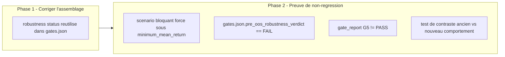

# Plan de correction — Reutiliser le verdict de robustesse pre-OOS reel dans gates.json (G5)

> Plan `fix` produit a partir de l'observation d'intake
> `0 - HUMAN START HERE/OBSERVATION_GATE_ROBUSTESSE_G5_FIGE.md` (2026-07-16),
> elle-meme issue du risque `R3 — Preuve vs attestation` de
> `0 - HUMAN START HERE/AUDIT_MATURITE_MOTEUR_RECHERCHE_2026-07-13.md`
> (section "Suite proposee") et explicitement anticipee comme suite
> residuelle par
> `.ai/archive/20260715_PLAN_CORRECTION_VALIDATORS_STATUT_GLOBAL_PACKAGE.md`
> (section 13, "Suites a prevoir" : *"corriger le contenu du gate
> robustesse G5 (`pre_oos_robustness_verdict` fige a `PASS`)"*). Meme
> nature de defaut, meme patron de correction que
> `.ai/archive/20260715_PLAN_CORRECTION_GATE_STATISTIQUE_WRC_MASQUE.md`
> (verdict deja calcule, jamais reutilise a l'assemblage), applique ici au
> gate G5 (robustesse) plutot qu'au gate G4 (WRC). Ce document ne cree
> aucune nouvelle regle scientifique : il fait circuler un resultat deja
> calcule (`pre_oos_robustness_verdict()`, SOP 05 / DN-030) jusqu'au champ
> `gates.json` qui devrait deja le porter.

---

## 0. Bandeau de statut (a verifier avant toute promotion)

| Question | Reponse |
| --- | --- |
| Un chantier actif couvre-t-il deja ce perimetre (`DONE`, `ACTIVE`, ou `SUPERSEDED`) ? | Non. `.ai/checkpoint.json::active_workstream_id` est `null`. `PLAN_CORRECTION_GATE_STATISTIQUE_WRC_MASQUE` (`DONE`, 2026-07-15) a corrige le meme type de defaut mais pour G4 (WRC), en excluant explicitement G5 de son perimetre. `PLAN_CORRECTION_VALIDATORS_STATUT_GLOBAL_PACKAGE` (`DONE`, 2026-07-15) a corrige la lecture de valeur par `gate_validator.py`/`package_validator.py`, mais a explicitement laisse hors perimetre le defaut de **contenu** de `pre_oos_robustness_verdict` (voir citation en tete de ce document) — c'est precisement ce que ce plan traite. |
| Un verrou de gouvernance actif bloque-t-il ce chantier ? | Non identifie. Aucun risque `CONTROLLED`/`OPEN` de `.ai/checkpoint.json::risks` ne mentionne ce champ. |
| Ce plan a-t-il besoin d'une decision humaine explicite pour lever ce verrou avant d'etre routable via `/start` ? | Non — aucun verrou trouve. Aucune calibration de seuil requise : `pre_oos_robustness_verdict()` et `compute_robustness_scenarios()` sont deja parametres par `robustness_plan`/`scenario_grid` existants (deja calibres par `.ai/archive/20260710_PLAN_CORRECTION_GATE_ECONOMIQUE_CALIBRATION.md` pour les seuils economiques attenants), et leur verdict est deja binaire (`PASS`/`FAIL`) sans nouvelle decision de seuil a arbitrer ici. |
| Ce plan remplace-t-il un document ou chantier existant ? | Non. Il complete `PLAN_CORRECTION_GATE_STATISTIQUE_WRC_MASQUE` et `PLAN_CORRECTION_VALIDATORS_STATUT_GLOBAL_PACKAGE` (tous deux `DONE`) sans les rouvrir ni les modifier. |

---

## Audit IA de promotion

- [x] Plan relu dans le contexte du cockpit actif (`AGENTS.md`, `.ai/README.md`, `.ai/checkpoint.json`, `Implementation/Active/HOOK.md`, `Implementation/Active/tracking.json`).
- [x] Bandeau de statut (section 0) rempli et verifie contre l'etat machine reelle (aucun workstream actif).
- [x] Ce plan est ECRIT COMME NOUVEAU FICHIER dans `.ai/backlog/fixes/` ; l'observation d'intake originale n'est pas modifiee, elle sera archivee telle quelle par `plan.ps1 start`.
- [x] Chantier classe `fix` — corrige un ecart de contenu (une attestation fige a `"PASS"` alors qu'un calcul reel existe deja) sans changer de norme.
- [x] Autorite normative identifiee : `Protocole/` SOP 05 (robustesse pre-OOS, DN-030) prime sur ce document et sur le code.
- [x] Perimetre de fichiers autorises et interdits explicite (section 5).
- [x] Aucune modification hors perimetre requise.
- [x] Prerequis factuels verifies dans le code le 2026-07-16 : `procedure_reports["robustness"]["status"]` (calcule ligne ~390 de `build_research_package.py` via `robustness_verdict()` → `procedures/robustness.py::pre_oos_robustness_verdict()`) existe deja en memoire au moment ou `gates` est construit (ligne ~193-247), mais son champ `pre_oos_robustness_verdict` (ligne 215) reste un litteral `"PASS"` non lie a ce calcul.
- [x] Etat des lieux (section 4) verifie directement dans le code (pas suppose) pour eviter de reecrire `procedures/robustness.py`, `risk/robustness.py`, `procedures/lifecycle.py`, `validators/gate_validator.py`, ou `validators/package_validator.py` — les cinq sont deja corrects et testes ; seul l'assemblage d'une entree de `gates.json` est fautif.

## Triage

| Champ | Valeur |
| --- | --- |
| Track | `fix` |
| Lifecycle | `TRIAGED` |
| Scope | Dans `_write_reports()` (`Implementation/examples/minimal_pilot_pipeline/build_research_package.py`, fonction partagee par le pipeline pilote classique et le chemin de production Nautilus) : remplacer le litteral `"pre_oos_robustness_verdict": "PASS"` (ligne ~215 du dict `gates`) par `procedure_reports["robustness"]["status"]`, deja calcule quelques lignes plus tot par `_procedure_reports()` (ligne ~390) et deja utilise honnetement ailleurs dans le meme fichier (`robustness.json` ligne ~303, `incubation_gate.json::robustness_status` ligne ~410). Exactement le meme patron que la correction deja livree pour `wrc_status` (ligne 211, meme fonction). |
| Non-goals | Ne pas modifier `procedures/robustness.py`, `risk/robustness.py`, `procedures/lifecycle.py`, `validators/gate_validator.py`, ou `validators/package_validator.py` (les cinq sont deja corrects et testes, alimentes sans etre reecrits) ; ne pas modifier `Protocole/` ni les seuils/parametres de `robustness_plan`/`scenario_grid` (`minimum_mean_return`, `blocking`, classifications) ; ne pas activer `preregistered_catalogue` sur `robustness_verdict()`/`pre_oos_robustness_verdict()` (verification de couverture DN-030, sujet distinct non couvert ici) ; ne pas toucher au risque `R6` de l'audit (les trois scenarios CENTRAL/PLAUSIBLE/EXTREME recoivent aujourd'hui les memes donnees, aucun choc reel de cout/slippage/latence n'est applique — un gate G5 honnete est un prealable utile a R6 mais R6 reste un chantier de calibration distinct) ; ne pas toucher aux ~35 autres booleens auto-attestes de `gates.json`/`invariant_evidence.json` (`kill_switch`, `live_approval`, `independent_pre_oos_approval`, etc.) — attestations de gouvernance necessitant un mecanisme de decision humaine, hors perimetre ici. |
| Source | Observation d'intake `0 - HUMAN START HERE/OBSERVATION_GATE_ROBUSTESSE_G5_FIGE.md` (2026-07-16), redigee en session sur demande explicite de creer un plan pour le risque `R3` residuel documente par `AUDIT_MATURITE_MOTEUR_RECHERCHE_2026-07-13.md` et par la section "Suites a prevoir" de `PLAN_CORRECTION_VALIDATORS_STATUT_GLOBAL_PACKAGE.md`. Demande utilisateur explicite le 2026-07-16 de router ce plan via `/start`. |
| Exit criteria | (1) `gates["pre_oos_robustness_verdict"]` dans `_write_reports()` provient de `procedure_reports["robustness"]["status"]`, plus aucun `"PASS"` litteral a cet endroit. (2) Un test de non-regression a verite connue prouve que, sur le chemin de production reel (`build_nautilus_research_package()` avec un `segment_runner` synthetique produisant, pour au moins un scenario bloquant `CENTRAL` ou `PLAUSIBLE_BASE`, une moyenne de `daily_returns` strictement inferieure a `minimum_mean_return = -1.0` — voir Phase 2 pour la technique exacte), `reports/gates.json::pre_oos_robustness_verdict == "FAIL"` et `gate_report()` classe G5 avec `status == "INCONCLUSIVE"` (valeur exacte produite par `validate_gates()` pour un champ de verdict connu different de `"PASS"`, verifiee dans le code le 2026-07-16 — jamais `"FAIL"` au niveau gate, voir section 3) — alors qu'avant correction, le meme scenario aurait produit `pre_oos_robustness_verdict == "PASS"` et G5 `status == "PASS"` malgre un `robustness["status"] == "FAIL"` deja calcule. (3) Un test de contraste explicite documente que l'ancien comportement (litteral fige) aurait laisse passer `"PASS"`, meme patron que `test_hardcoded_true_flags_would_let_same_loser_pass`. (4) Suite runtime complete reste `PASS`. (5) Zero modification de `procedures/`, `risk/`, `validators/`, `governance/`, `manifests/`, `Protocole/`. |

## Statut

| Champ | Valeur |
| --- | --- |
| Statut | `NON_DEMARRE` |
| Date de creation | 2026-07-16 |
| Date d'activation | - |
| Autorite normative | `Protocole/` (`EBTA-DOC-1.1`), en particulier SOP 05 (robustesse pre-OOS, DN-030) — gele, non modifie par ce plan |
| Autorite executable | `Implementation/ebta_engine/` et `Implementation/examples/minimal_pilot_pipeline/` (traduction executable subordonnee) |
| Changement normatif attendu | Aucun — application d'une regle deja normative (le verdict de robustesse pre-OOS reel doit conditionner G5), pas de nouvelle regle |
| Dependances externes | Aucune nouvelle. `nautilus_trader==1.230.0` deja installe (venv reproductible existant, confine a `adapters/`) pour la preuve de non-regression sur le chemin de production reel. |

---

## 1. Role de ce document et non-objectifs

| Element | Role |
| --- | --- |
| `Protocole/` SOP 05 (DN-030) | Autorite normative absolue sur la robustesse pre-OOS. Inchangee. |
| `Implementation/ebta_engine/procedures/robustness.py::pre_oos_robustness_verdict()` | Calcul deja correct du verdict de robustesse pre-OOS (violations DN-030, statut `PASS`/`FAIL`/`INCONCLUSIVE`). Inchange — ce chantier reutilise son resultat, ne le recalcule pas differemment. |
| `Implementation/ebta_engine/risk/robustness.py::compute_robustness_scenarios()` | Calcule deja les `scenario_verdict` (`PASS`/`REJECTED_ECONOMIC`/`INCONCLUSIVE`) a partir des `SimulationResult` reels par scenario. Inchange. |
| `Implementation/examples/minimal_pilot_pipeline/build_research_package.py::_write_reports()` | Chemin fautif : c'est le seul endroit ou le verdict de robustesse deja calcule (`procedure_reports["robustness"]["status"]`) est ignore au profit d'un litteral `"PASS"`, uniquement pour le champ `gates.json::pre_oos_robustness_verdict`. **Dans le perimetre.** |
| Ce plan | Carte de correction : ou brancher le verdict reel, comment prouver la non-regression sur le chemin de production reel. |

Non-objectifs :

- ne pas reecrire `Protocole/` ni la SOP 05 ;
- ne pas introduire de regle, seuil ou statut absent de la SOP 05 ;
- ne pas faire de ce plan une refonte generale de `gates.json`/`invariant_evidence.json` — perimetre strictement limite au champ `pre_oos_robustness_verdict` du gate G5 ;
- ne pas transformer un agregateur/calculateur deja correct (`pre_oos_robustness_verdict()`, `compute_robustness_scenarios()`) — ils restent inchanges, seule l'entree de `gates.json` qui devrait les refleter est corrigee ;
- ne pas etendre la couverture de catalogue preregistre (`preregistered_catalogue`) ni le realisme des scenarios (R6) — sujets distincts.

---

## 2. Contexte obligatoire a lire avant de coder

1. `AGENTS.md`, `.ai/README.md`, `.ai/checkpoint.json`, `Implementation/Active/HOOK.md` — etat machine courant (aucun workstream actif).
2. `0 - HUMAN START HERE/OBSERVATION_GATE_ROBUSTESSE_G5_FIGE.md` (sera archive sous `0 - HUMAN START HERE/archive/` par `plan.ps1 start`) — l'observation source, a ne pas modifier ni deplacer manuellement.
3. `.ai/archive/20260715_PLAN_CORRECTION_GATE_STATISTIQUE_WRC_MASQUE.md` — le chantier precedent de meme nature (verdict calcule mais ignore a l'assemblage), dont ce plan reprend le patron de correction et de preuve, applique a G5 plutot qu'a G4.
4. `.ai/archive/20260715_PLAN_CORRECTION_VALIDATORS_STATUT_GLOBAL_PACKAGE.md` (section 13) — identifie explicitement ce defaut precis (`pre_oos_robustness_verdict` fige) comme suite residuelle et confirme que `validators/gate_validator.py::_requirement_satisfied()` verifie deja la **valeur** des champs de verdict connus (donc pret a refleter une correction de contenu sans modification supplementaire de `validators/`).
5. `Protocole/` SOP 05 (sections 5, 17, 19, 21, 23, 29 ; DN-030, DN-031), citees en tete de `procedures/robustness.py`.
6. Code existant a reutiliser (verifie 2026-07-16) : `procedures/robustness.py::pre_oos_robustness_verdict()` (ligne 37, verdict `"FAIL"` si un scenario bloquant CENTRAL/PLAUSIBLE_BASE echoue, ligne 137-149), `procedures/robustness.py::robustness_verdict()` (ligne 260, shim sans catalogue preregistre), `risk/robustness.py::compute_robustness_scenarios()` (ligne 17, `scenario_verdict = "REJECTED_ECONOMIC"` si `mean_return < minimum_mean_return`, ligne 51), `examples/minimal_pilot_pipeline/build_research_package.py::_procedure_reports()` (ligne 332, calcule `robustness` a la ligne ~390 puis `_write_reports()` l'ignore a la ligne 215), `validators/gate_validator.py::GATE_REQUIREMENTS["G5"]` (ligne 25, exige `pre_oos_robustness_verdict` parmi ses trois champs) et `_requirement_satisfied()` (ligne 50-53, deja value-check).

**Hierarchie d'autorite** :

```text
1. Protocole/MANIFESTE DE GEL EBTA.md
2. Protocole/PROTOCOLE EBTA.md
3. Protocole/REGISTRE DES DECISIONS NORMATIVES EBTA.md
4. SOP 01-13 (ici : SOP 05)
5. Protocole/PAQUET D'EXECUTION EBTA.md
6. Implementation/ (dont ce plan)
7. Adaptateurs externes (NautilusTrader)
```

Regle : si le code contredit `Protocole/`, c'est le code qui a tort. Si une
donnee necessaire au calcul manque, le systeme doit bloquer ou retourner un
statut explicite (`INCONCLUSIVE`/`FAIL`) plutot que de deviner ou de
supposer `"PASS"`.

---

## 3. Table des gates (points de decision sequentiels)

| Ordre | Gate | Question posee au systeme | Sortie si echec |
| --- | --- | --- | --- |
| G-ROB (interne a `pre_oos_robustness_verdict`) | Robustesse pre-OOS (`pre_oos_robustness_verdict`, deja livre) | Chaque scenario preregistre bloquant (CENTRAL/PLAUSIBLE_BASE) passe-t-il, sans utiliser d'OOS observe ? | `status = "FAIL"` deja calcule correctement |
| G5 (`validators/gate_validator.py`) | Gate structurel de robustesse (presence + **valeur** de `robustness_report`, `robustness_matrix`, `pre_oos_robustness_verdict`) | Les trois champs requis sont-ils presents ET, pour `pre_oos_robustness_verdict`, valent-ils `"PASS"` ? | `status = "INCONCLUSIVE"` si un champ manque ou si sa valeur n'est pas `"PASS"` (deja corrige par `PLAN_CORRECTION_VALIDATORS_STATUT_GLOBAL_PACKAGE`) |

Ce chantier ne touche que la **production de l'entree `pre_oos_robustness_verdict`**
consommee par G5 ; il ne change ni le calcul de G-ROB ni la logique de
verification de valeur de G5 (deja corrigee).

---

## 4. Etat des lieux (avant/apres) — reutiliser avant de recreer

### Ce qui existe deja et fonctionne (verifie 2026-07-16)

| Module | Chemin | Role reel (verifie) | Suffisant ? |
| --- | --- | --- | --- |
| Calcul robustesse pre-OOS reel | `procedures/robustness.py::pre_oos_robustness_verdict()` | Calcule `status = "PASS" if not violations else "FAIL"` (ligne 151-152) a partir des scenarios reels, verdict `"FAIL"` si un scenario bloquant CENTRAL/PLAUSIBLE_BASE a un `scenario_verdict` hors `{"PASS", "PASS_WITH_WARNING"}` | ✅ Reutiliser tel quel |
| Calcul des scenarios reels | `risk/robustness.py::compute_robustness_scenarios()` | Produit `scenario_verdict = "REJECTED_ECONOMIC"` des que `mean_return` (calcule depuis les vrais `SimulationResult`) passe sous `minimum_mean_return` (ligne 51) | ✅ Reutiliser tel quel |
| Verificateur de valeur du gate G5 | `validators/gate_validator.py::_requirement_satisfied()` | Verifie deja la **valeur** des champs de verdict connus (`VERDICT_VALUES = {"PASS", "FAIL", "INCONCLUSIVE"}`, ligne 37, 50-53) — corrige par `PLAN_CORRECTION_VALIDATORS_STATUT_GLOBAL_PACKAGE` (2026-07-15) | ✅ Deja pret a refleter la correction de ce plan, aucune modification necessaire |
| Point d'appel robustesse | `examples/minimal_pilot_pipeline/build_research_package.py::_procedure_reports()` ligne ~390 | Appelle deja `robustness_verdict(pilot_inputs["robustness_plan"]["scenarios"])` avec les vrais scenarios et stocke le resultat dans `procedure_reports["robustness"]` | ✅ Deja correct, juste sous-exploite pour `gates.json` |
| Usage honnete n°1 | meme fichier, ligne ~303 | `"robustness.json": procedure_reports["robustness"]` — reporte le statut reel tel quel | ✅ Deja honnete |
| Usage honnete n°2 | meme fichier, ligne ~410 | `incubation_gate({..., "robustness_status": robustness["status"], ...})` — reporte le statut reel tel quel, et `procedures/lifecycle.py::incubation_gate()` fait deja basculer `status` en `FAIL` si `robustness_status != "PASS"` | ✅ Deja honnete — un `FAIL` reel de robustesse atteint deja `incubation_gate.json` et donc le `status` global de `validate_package_dir()` (via `_semantic_consistency_errors()`, deja corrige) |
| Assemblage `gates.json` (G5) | meme fichier, ligne 215 | `"pre_oos_robustness_verdict": "PASS"` — litteral en dur, jamais lie a `procedure_reports["robustness"]["status"]` | ❌ A corriger (coeur de ce chantier) |

### Ce qui manque reellement

| Brique manquante | Module a modifier | Source de la regle | A reutiliser (pas dupliquer) |
| --- | --- | --- | --- |
| Propagation du verdict de robustesse reel vers `gates["pre_oos_robustness_verdict"]` | `_write_reports()`, ligne ~215 | Cette observation, SOP 05 / DN-030 | `procedure_reports["robustness"]["status"]`, deja calcule dans `_procedure_reports()` et deja passe en parametre a `_write_reports()` via `procedure_reports` |
| Preuve de non-regression sur le chemin de production reel avec un scenario bloquant force en echec (robustesse `FAIL` connu) | Nouveau test ou extension de `tests/test_nautilus_research_package.py` | Patron de `tests/test_nautilus_research_package.py::test_real_wrc_fail_reaches_economic_and_incubation_gates` (meme fichier, meme famille de tests, applique a la robustesse plutot qu'au WRC) | Reutiliser le patron de `segment_runner` synthetique injecte, deja utilise par les tests Nautilus existants |

---

## 5. Decision d'architecture

Principe directeur (identique a celui deja applique et valide par
`PLAN_CORRECTION_GATE_STATISTIQUE_WRC_MASQUE`) : un resultat de calcul deja
produit par une procedure normative (`pre_oos_robustness_verdict()`) ne doit
jamais etre shadow par une valeur litterale au point d'assemblage —
l'assemblage doit **lire** le resultat calcule, jamais le **redeclarer**.

- Raison 1 — `procedure_reports["robustness"]["status"]` existe deja en
  memoire au moment ou `gates` est construit dans `_write_reports()` (le
  dict `procedure_reports` complet, y compris `["robustness"]`, est deja
  un parametre de la fonction) : aucun nouveau calcul, aucune nouvelle
  dependance, aucun risque de divergence entre deux calculs paralleles.
- Raison 2 — ce meme champ est deja lu honnetement deux fois dans le meme
  fichier (`robustness.json`, `incubation_gate.json::robustness_status`) :
  laisser `gates.json` seul en desaccord avec ces deux autres artefacts
  est une incoherence interne, pas seulement une attestation faible.

### Frontieres explicites

| Couche | Elle fait | Elle NE fait PAS |
| --- | --- | --- |
| `pre_oos_robustness_verdict()` / `compute_robustness_scenarios()` (inchangees) | Calculent le verdict de robustesse reel a partir des scenarios et des `SimulationResult` | Construire un gate |
| `_write_reports()` (corrigee) | Lit `procedure_reports["robustness"]["status"]` et l'injecte comme `pre_oos_robustness_verdict` reel dans `gates` | Recalculer la robustesse differemment ; decider un seuil |
| `gate_validator.py` (inchangee) | Verifie la valeur du champ fourni | Calculer cette valeur elle-meme |

### Contrat d'interface

Aucun nouveau contrat. `procedure_reports["robustness"]` retourne deja un
dict avec une cle `"status"` (`"PASS"`/`"FAIL"`/`"INCONCLUSIVE"`, voir
`procedures/robustness.py::_robustness_result()` ligne 274-298). Ce chantier
fait circuler cette valeur existante vers un champ `gates.json` qui accepte
deja une valeur de type `str` parmi les memes trois verdicts (voir
`validators/gate_validator.py::VERDICT_VALUES`).

### Decisions deja actees

| Decision | Justification |
| --- | --- |
| Lire `procedure_reports["robustness"]["status"]` directement (pas une nouvelle variable intermediaire) | `procedure_reports` est deja le parametre recu par `_write_reports()` ; aucune restructuration necessaire, coherent avec le patron deja utilise pour `wrc_status` (`procedure_reports["wrc"]["verdict"]`, ligne 211) |
| Ne pas activer `preregistered_catalogue` sur cet appel dans ce chantier | Sujet distinct (couverture DN-030), non demande par l'observation source, risquerait d'introduire un nouveau mode d'echec (`DN-030_CATALOGUE_COVERAGE`) non couvert par la preuve de non-regression prevue ici |

### Structure cible

```text
Implementation/
  examples/minimal_pilot_pipeline/
    build_research_package.py   # CORRIGE -- _write_reports() reutilise procedure_reports["robustness"]["status"]
  ebta_engine/
    procedures/
      robustness.py              # INCHANGE
    risk/
      robustness.py               # INCHANGE
    validators/
      gate_validator.py           # INCHANGE (deja pret, cf. section 4)
    tests/
      test_nautilus_research_package.py   # ETENDU -- preuve de non-regression robustesse FAIL
```

### Perimetre de fichiers explicite (autorises / interdits)

**Autorises (creer ou modifier)** :

```text
Implementation/examples/minimal_pilot_pipeline/build_research_package.py   MODIFIER - Phase 1
Implementation/ebta_engine/tests/test_nautilus_research_package.py         MODIFIER - Phase 2
Implementation/HISTORIQUE DES VERSIONS EBTA ENGINE.md                      MODIFIER - Phase 2 (ajout d'une entree de cloture, meme convention que les plans WRC/validators precedents ; ce fichier documente deja ce defaut exact, section "2026-07-15 - ... statut global package", sous-section "Suite")
```

**Interdits (ne jamais modifier dans ce chantier)** :

```text
Protocole/                                              [NORME - intouchable]
Implementation/ebta_engine/procedures/robustness.py                       [CONTRAT DEJA CORRECT - reutiliser tel quel]
Implementation/ebta_engine/risk/robustness.py                             [CONTRAT DEJA CORRECT - reutiliser tel quel]
Implementation/ebta_engine/procedures/lifecycle.py                        [CONTRAT DEJA CORRECT - reutiliser tel quel]
Implementation/ebta_engine/validators/gate_validator.py                   [DEJA CORRIGE (2026-07-15) - hors perimetre]
Implementation/ebta_engine/validators/package_validator.py                [DEJA CORRIGE (2026-07-15) - hors perimetre]
Implementation/ebta_engine/governance/                                    [HORS PERIMETRE - G-BIAS non concerne]
Implementation/ebta_engine/package_builder/nautilus_research_package.py   [HORS PERIMETRE - ne construit pas gates.json, cf. section 4]
.ai/checkpoint.json                                     [METTRE A JOUR UNIQUEMENT via plan.ps1]
```

---

## 6. Decoupage en phases

### Phase 1 - Corriger l'assemblage du pre_oos_robustness_verdict reel

Objectif : faire circuler `procedure_reports["robustness"]["status"]`
reellement calcule vers le champ `gates.json::pre_oos_robustness_verdict`.

Classification : IMPLEMENTATION_DETAIL

Constat (preuve) :

- `_procedure_reports()` calcule `robustness = robustness_verdict(pilot_inputs["robustness_plan"]["scenarios"])`
  a la ligne ~390 et le retourne dans `procedure_reports["robustness"]`.
- `_write_reports()` recoit `procedure_reports` en parametre (via l'appel
  `procedure_reports = _procedure_reports(pilot_inputs)` en tete de
  fonction, ligne 191) mais code en dur `"pre_oos_robustness_verdict": "PASS"`
  a la ligne 215 au lieu de lire `procedure_reports["robustness"]["status"]`,
  alors que le champ voisin `wrc_status` (ligne 211) fait deja exactement
  cette lecture pour `procedure_reports["wrc"]["verdict"]`.

Actions :

- A la ligne 215 de `_write_reports()`, remplacer le litteral
  `"pre_oos_robustness_verdict": "PASS"` par
  `"pre_oos_robustness_verdict": procedure_reports["robustness"]["status"]`.
- Ne modifier aucune signature de `pre_oos_robustness_verdict()`,
  `robustness_verdict()`, `compute_robustness_scenarios()`, ou
  `_procedure_reports()`.
- Verifier qu'aucun autre appelant de `_write_reports()` ne dependait
  implicitement du litteral `"PASS"` (recherche des usages de `gates.json`
  dans `Implementation/ebta_engine/tests/`).

Livrables :

- `_write_reports()` corrigee, sans aucun `"pre_oos_robustness_verdict": "PASS"`
  litteral.

Critere de sortie :

- Lecture du diff : le champ `pre_oos_robustness_verdict` de `gates` est
  une expression derivee de `procedure_reports["robustness"]`, plus un
  litteral.
- Suite runtime complete reste `PASS` (le scenario de robustesse pilote
  actuel doit deja passer `PASS` reel, sinon investiguer avant de
  continuer — voir NO GO).

### Phase 2 - Preuve de non-regression sur le chemin de production reel

Objectif : prouver qu'un `FAIL` de robustesse pre-OOS reel se propage
desormais jusqu'a `reports/gates.json::pre_oos_robustness_verdict` et au
statut G5 de `gate_report()`, sur le chemin de production
(`build_nautilus_research_package()`), pas seulement dans un module isole.

Actions :

- Etendre `tests/test_nautilus_research_package.py` (patron identique a
  `test_real_wrc_fail_reaches_economic_and_incubation_gates`, meme fichier)
  avec un nouveau `segment_runner` synthetique (meme technique que
  `_losing_segment_runner`/`_statistical_fail_segment_runner`, meme
  fichier lignes 145-187 : `daily_returns` entierement fabriques, pas
  derives de vrais prix) qui renvoie des `daily_returns` fortement negatifs
  (ex. `-1.5` par barre). **Ne pas modifier `_nautilus_robustness_grid()`
  ni `NAUTILUS_ROBUSTNESS_GRID`** : le seuil reel `minimum_mean_return = -1.0`
  (ligne ~509, ~516) est deliberement large (symptome du risque `R6`,
  hors perimetre ici) — c'est le `segment_runner` de test, pas le seuil,
  qui doit produire une moyenne de rendements strictement inferieure a
  `-1.0` pour franchir ce seuil et obtenir `scenario_verdict = "REJECTED_ECONOMIC"`
  via `compute_robustness_scenarios()` (`risk/robustness.py` ligne 51-54).
  Note attendue et sans consequence hors de ce test : avec des rendements
  aussi negatifs, la NAV synthetique calculee par le test (compoundee via
  `current_nav *= (1.0 + value)`) devient negative — acceptable, purement
  un artefact de la fixture synthetique du test, pas un invariant du
  moteur a proteger ici.
- Construire le research_package resultant et verifier :
  1. `reports/gates.json::pre_oos_robustness_verdict == "FAIL"`.
  2. `gate_report(evidence)` classe G5 avec `status == "INCONCLUSIVE"` —
     valeur exacte produite par `validate_gates()` (`gate_validator.py`
     ligne 40-46) pour un champ de verdict connu different de `"PASS"`
     (`"pre_oos_robustness_verdict"` sort alors de `present` et entre dans
     `missing`) ; ne jamais asserter `"FAIL"` a ce niveau, `validate_gates()`
     ne produit que `"PASS"`/`"INCONCLUSIVE"` par gate (verifie dans le
     code le 2026-07-16, voir section 3).
- Ajouter un test de contraste explicite (meme patron que
  `test_hardcoded_true_flags_would_let_same_loser_pass`) qui reconstruit
  le meme scenario avec l'ancien comportement (litteral `"PASS"` fige)
  pour documenter que le defaut aurait laisse passer G5 en `"PASS"` malgre
  un `robustness["status"] == "FAIL"` deja calcule — preuve mecanique que
  la correction change reellement l'issue, pas seulement le chemin de
  code.
- Ne pas affaiblir ni skipper un test existant pour faire passer ce test.

Livrables :

- Nouveau test (ou extension) de non-regression en production.
- Preuve ecrite (assertions du test) que le defaut identifie aurait
  produit un faux `PASS` pour G5.
- Entree de cloture ajoutee a `Implementation/HISTORIQUE DES VERSIONS EBTA ENGINE.md`,
  meme format que les entrees `2026-07-15` deja presentes pour les plans
  WRC et validators (tableau Version/Type/Statut/Source normative/Fichiers
  impactes/Impact protocole/Verification, section Contexte/Decision/Impact/Suite).

Critere de sortie :

- Le test prouve la discrimination reelle du gate G5 sur le chemin de
  production — `PASS`.
- Suite runtime complete reste `PASS`.

### Chemin critique (ordre des phases)



---

## 7. Artefacts produits

| Etape | Fichier/sortie | Format | Regle source |
| --- | --- | --- | --- |
| Gate G5 reel | `research_packages/nautilus_mvp/reports/gates.json` (ou equivalent selon `package_shape`) | JSON | SOP 05 / DN-030 |
| Preuve de non-regression | `Implementation/ebta_engine/tests/test_nautilus_research_package.py` (etendu) | Python `unittest` | Ce chantier |

---

## 8. Invariants absolus et NO GO

### Invariants

1. `pre_oos_robustness_verdict` fourni dans `gates.json` doit toujours
   proceder de `procedure_reports["robustness"]["status"]` reellement
   calcule dans la meme execution — jamais d'une constante.
2. `procedures/robustness.py`, `risk/robustness.py`,
   `procedures/lifecycle.py`, `validators/gate_validator.py` restent les
   uniques implementations de leur logique respective ; aucune
   duplication.
3. Le gate G5 doit pouvoir refleter un `FAIL` de robustesse reel (verifie
   par test, Phase 2).
4. Si `pre_oos_robustness_verdict()` ou `compute_robustness_scenarios()`
   levent une exception (ex. `scenario_grid` vide, `ValueError` deja levee
   par `risk/robustness.py` ligne 30), cette exception ne doit pas etre
   masquee par un `try/except` qui retombe sur `"PASS"` — elle doit se
   propager ou etre traduite en statut `INCONCLUSIVE`/`FAIL` explicite,
   jamais en succes silencieux.

### NO GO

- Ecrire ou laisser un `pre_oos_robustness_verdict = "PASS"` litteral non
  justifie dans le perimetre de ce plan apres la Phase 1.
- Modifier `procedures/robustness.py`, `risk/robustness.py`,
  `procedures/lifecycle.py`, `validators/gate_validator.py`, ou
  `validators/package_validator.py`.
- Affaiblir, contourner, ou supprimer un test existant pour faire passer
  la correction.
- Etendre ce chantier a la refonte des ~35 autres booleens de
  `gates.json`/`invariant_evidence.json`, a la couverture de catalogue
  preregistre (`preregistered_catalogue`), ou au realisme des scenarios de
  robustesse (R6) — hors perimetre, voir Non-goals.
- Declarer une phase terminee sans preuve executable (section 9).

---

## 9. Verification a chaque etape

```powershell
python -m unittest discover -s Implementation\ebta_engine\tests -t Implementation
```

Build reel de production (Phase 2, via venv Nautilus) :

```powershell
.\Implementation\adapters\nautilus_env\venv\Scripts\python.exe -m ebta_engine.package_builder.nautilus_research_package
```

Validation du package produit :

```python
from pathlib import Path
from ebta_engine.validators.package_validator import validate_package_dir
report = validate_package_dir(Path("Implementation/research_packages/nautilus_mvp"))
print(report["status"])  # PASS attendu avant ET apres ce plan sur le MVP actuel (la robustesse
                          # pre-OOS reelle du MVP est deja PASS, ce plan ne la fait pas echouer) --
                          # la preuve d'un FAIL reel se fait via le segment_runner synthetique
                          # injecte de la Phase 2, pas sur le package de production courant.
```

**Regle transversale bloquante** : la suite runtime complete doit rester
`PASS` avant de demarrer chaque phase suivante.

**Note de portabilite / caveat connu** : contrairement au plan WRC
precedent, ce plan ne s'attend PAS a reveler un `FAIL` deja present sur le
MVP actuel — le gate incubation (`incubation_gate.json::robustness_status`)
prouve deja que la robustesse pre-OOS reelle du package de production
courant est `PASS` (sinon `incubation_gate.status` serait deja `FAIL`
aujourd'hui, ce qui n'est pas le cas d'apres l'etat courant documente dans
`AUDIT_MATURITE_MOTEUR_RECHERCHE_2026-07-13.md` section 5). La preuve de
non-regression (Phase 2) doit donc forcer un `FAIL` synthetique via un
`segment_runner`/`scenario_grid` injecte, pas attendre un `FAIL` naturel
sur les donnees de production actuelles.

**Premier lot executable propose** :

```text
Phase 1 - Corriger l'assemblage du pre_oos_robustness_verdict reel
```

### Execution sans interruption

Ce plan est concu pour etre execute integralement (Phases 1 et 2) sans
retour vers l'humain entre les phases.

### Autorite decisionnelle accordee

En dehors du perimetre de fichiers (section 5) et des invariants (section
8), l'IA qui execute ce plan est autorisee a decider seule les details
d'implementation (ex. forme exacte du `segment_runner`/`scenario_grid`
synthetique de la Phase 2, choix du fichier de test etendu vs nouveau
fichier) sans demander de confirmation humaine.

### Interdiction des raccourcis (aucun faux succes)

Lorsqu'une verification (section 9) echoue : identifier la cause racine,
ne jamais la masquer ; ne jamais desactiver, skipper, ou affaiblir un test
genant ; ne jamais remplacer `pre_oos_robustness_verdict()` ou
`compute_robustness_scenarios()` par un stub ou une valeur codee en dur ;
ne jamais declarer une phase terminee sans la preuve executable exigee par
la section 9.

---

## 10. Journal des decisions humaines (autorisations)

| Date | Decision | Portee |
| --- | --- | --- |
| 2026-07-16 | Demande utilisateur explicite de creer un plan pour le risque `R3` residuel (gate robustesse G5 fige), puis de le router via `/start`. | Autorise la redaction et le routage de ce plan `fix` ; n'autorise pas l'ouverture d'un chantier plus large sur les ~35 autres booleens, la couverture de catalogue preregistre, ou le realisme des scenarios de robustesse (R6) sans nouvelle decision explicite. |

---

## 11. Risques et blocages connus

| Risque | Impact | Mitigation / condition de deblocage |
| --- | --- | --- |
| Le `segment_runner`/`scenario_grid` synthetique de la Phase 2 ne produit pas un `mean_return` deterministe sous `minimum_mean_return` avec les parametres choisis | Test de non-regression non concluant | Utiliser des rendements synthetiques a amplitude negative connue, verifier `mean_return` obtenu avant de figer le test, suivant le meme soin que `PLAN_CORRECTION_GATE_STATISTIQUE_WRC_MASQUE` pour son propre scenario synthetique |
| Un test existant verifie encore implicitement `pre_oos_robustness_verdict == "PASS"` comme valeur figee (plutot que comme consequence d'un calcul reel `PASS`) | Regression sur un test existant apres la Phase 1 | Verifier tous les usages de `gates.json`/`pre_oos_robustness_verdict` dans `Implementation/ebta_engine/tests/` avant la Phase 1 ; adapter si l'assertion portait sur l'ancien comportement fautif, en documentant pourquoi |
| Confusion future entre "G5 corrige" et "robustesse reellement stressee (R6)" | Faux sentiment de securite methodologique : ce plan rend G5 honnete par rapport a un calcul deja existant, il n'ajoute aucun nouveau choc de cout/slippage/latence aux scenarios | Ce plan documente explicitement cette limite (Non-goals, section 1) ; la cloture (section 13) doit la reprendre explicitement |
| Le seuil reel `minimum_mean_return = -1.0` de `_nautilus_robustness_grid()` est tres large (R6) : un `segment_runner` de test doit produire des rendements synthetiques fortement negatifs (ex. `-1.5`/barre) pour le franchir, ce qui fait passer la NAV synthetique du test en negatif | Aucun impact sur le moteur reel — artefact isole a la fixture du test de la Phase 2 ; risque seulement si un futur lecteur confond ce test avec une preuve de realisme economique | Documente explicitement en Phase 2 (technique du `segment_runner` synthetique) ; ne pas modifier `_nautilus_robustness_grid()` pour "faciliter" le test (interdit par Non-goals) |

---

## 12. Definition of Done

- [ ] Phases 1 et 2 validees individuellement (section 9).
- [ ] Exit criteria de la section Triage atteint et verifiable.
- [ ] Aucune modification hors perimetre (section Triage / Non-goals).
- [ ] Aucune regression sur la suite de tests existante.
- [ ] Checklist post-modification `.ai/governance/AI_MODIFICATION_CHECKLIST.md` executee.
- [ ] Aucune implementation partielle, stub, pseudo-code, ou placeholder ne subsiste comme substitut a une brique prevue par ce plan.

---

## 13. Cloture

A remplir au moment de `/close`.

| Champ | Valeur |
| --- | --- |
| Resultat final | [a remplir a la cloture] |
| Ecarts par rapport au plan initial | [a remplir a la cloture] |
| Suites a prevoir (hors perimetre de ce plan) | Couverture de catalogue preregistre (`preregistered_catalogue` sur `pre_oos_robustness_verdict()`, DN-030) ; realisme des scenarios de robustesse (R6 — CENTRAL/PLAUSIBLE/EXTREME recoivent aujourd'hui les memes donnees, aucun choc reel applique) ; realisme couts/slippage/latence (R5) ; reproductibilite operationnelle (R7) ; refonte des ~35 autres booleens auto-attestes de `gates.json`/`invariant_evidence.json`. |

### Resultat d'execution (a dupliquer a chaque session d'execution significative)

| Champ | Valeur |
| --- | --- |
| Date | [a remplir] |
| Phases executees | [a remplir] |
| Artefact produit | [a remplir] |
| Validation | [a remplir] |
| Ecart par rapport au plan | [a remplir] |

---

## 14. Journal d'audits post-hoc

| Date de l'audit | Ce qui a ete corrige | Pourquoi |
| --- | --- | --- |
| 2026-07-16 | Passage `code-architecture-evaluator` (`/evaluate`), passe 1. Corrections : (1) Phase 2 precisait "forcer un scenario bloquant sous son `minimum_mean_return`" sans dire comment — verifie dans le code que `minimum_mean_return = -1.0` (`_nautilus_robustness_grid()`) est tres large (symptome R6) et qu'un `segment_runner` synthetique doit produire des rendements fortement negatifs (ex. `-1.5`/barre) pour le franchir, avec la mise en garde explicite de ne jamais toucher au `scenario_grid` lui-meme pour "faciliter" le test. (2) Exit criteria et Phase 2 affirmaient vaguement que G5 serait classe "non-PASS" — verifie directement dans `gate_validator.py::validate_gates()` que la valeur exacte produite est `"INCONCLUSIVE"`, jamais `"FAIL"` au niveau gate ; le plan asserte desormais cette valeur precise plutot qu'un flou. | Eviter qu'une IA a froid executant ce plan ne conclue a tort a l'infaisabilite de la Phase 2, ne prenne le raccourci interdit de modifier le seuil calibre, ou n'ecrive une assertion incorrecte (`"FAIL"` au lieu de `"INCONCLUSIVE"`) qui ferait echouer le test de non-regression pour une mauvaise raison. |
| 2026-07-16 | Passage `code-architecture-evaluator` (`/evaluate`), passe 2. Verification complementaire (aucune regression trouvee) : `tests/test_gates.py::test_gate_report_rejects_non_pass_robustness_verdict` prouve deja unitairement que `gate_validator.py` rejette un G5 `FAIL`, independamment de `_write_reports()` — confirme que la Phase 1 ne risque aucune regression sur ce test. Correction : `Implementation/HISTORIQUE DES VERSIONS EBTA ENGINE.md` (qui documente deja ce defaut exact, section "2026-07-15 - ... statut global package") ajoute au perimetre de fichiers autorises (section 5) et a la Phase 2 (livrable), pour suivre la meme convention de cloture que les deux plans precedents de cette famille sans qu'une future IA n'ait a le deduire seule. | Eviter un blocage de perimetre en cours d'execution (fichier de trace non liste comme autorise) et rester coherent avec la convention deja etablie par les plans WRC et validators. Aucun nouvel angle mort majeur trouve a cette passe — plan considere converge. |
