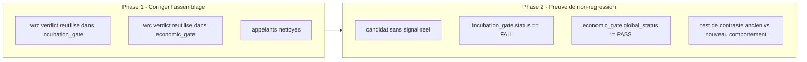

# Plan de correction — Reutiliser le verdict WRC reel dans les gates incubation et economique

> Plan `fix` produit a partir de l'observation d'intake
> `0 - HUMAN START HERE/OBSERVATION_GATE_STATISTIQUE_WRC_MASQUE.md`
> (2026-07-15), elle-meme issue d'une cartographie de code demandee en
> session sur le risque `R3 — Preuve vs attestation` de
> `0 - HUMAN START HERE/AUDIT_MATURITE_MOTEUR_RECHERCHE_2026-07-13.md`. Ce
> document ne cree aucune nouvelle regle scientifique : il fait circuler un
> resultat deja calcule (`wrc_test()`, SOP 02) jusqu'aux deux gates qui en
> dependent normativement, au lieu de les laisser ignorer ce calcul au
> profit d'un `"PASS"` code en dur. Meme nature de defaut, meme patron de
> correction que `.ai/archive/20260710_PLAN_CORRECTION_GATE_ECONOMIQUE_CALIBRATION.md`
> (gate qui ne peut jamais rejeter), applique ici au gate statistique plutot
> qu'au gate economique.
>
> **Revise apres passage `/evaluate` (2026-07-15, voir section 14)** : le
> perimetre initial affirmait a tort que le `status` global de
> `validate_package_dir()` refleterait un WRC `FAIL` reel. Verification
> directe du code (`validators/gate_validator.py`,
> `validators/package_validator.py`) : ce n'est pas le cas — defaut plus
> large et separe (verification de presence, jamais de valeur, sur les 15
> gates G0-G14). Ce plan reste correctement scope sur les artefacts JSON
> individuels (`gates.json.wrc_status`, `economic.json.statistical_status`,
> `incubation_gate.json.status`), mais ne pretend plus faire basculer le
> `status` global du package — voir Suites a prevoir, section 13.

---

## 0. Bandeau de statut (a verifier avant toute promotion)

| Question | Reponse |
| --- | --- |
| Un chantier actif couvre-t-il deja ce perimetre (`DONE`, `ACTIVE`, ou `SUPERSEDED`) ? | Non. `.ai/checkpoint.json::active_workstream_id` est `null` ; `PLAN_R4_DONNEES_INTRADAY_REELLES_PACKAGE_PRODUCTION` (`DONE`, 2026-07-15) a corrige la resolution de donnees et le `bias_filter` de G/H/I, pas ce defaut de gate. `PLAN_CORRECTION_GATE_ECONOMIQUE_CALIBRATION` (`DONE`, 2026-07-10) a corrige les cinq booleens du gate economique, mais a laisse `statistical_status` en dehors de son perimetre (son Non-goals excluait explicitement `procedures/wrc.py`). |
| Un verrou de gouvernance actif bloque-t-il ce chantier ? | Non identifie. Aucun risque `CONTROLLED`/`OPEN` dans `.ai/checkpoint.json::risks` ne mentionne ce fichier ou ce defaut. |
| Ce plan a-t-il besoin d'une decision humaine explicite pour lever ce verrou avant d'etre routable via `/start` ? | Non — aucun verrou trouve. Ce plan ne requiert aucune calibration de seuil (contrairement a `PLAN_CORRECTION_GATE_ECONOMIQUE_CALIBRATION`) : `wrc_test()` est deja parametre par `statistical_plan` (existant), et son verdict est deja binaire (`PASS`/`FAIL`) sans decision de seuil supplementaire a arbitrer. |
| Ce plan remplace-t-il un document ou chantier existant ? | Non. Il complete `PLAN_CORRECTION_GATE_ECONOMIQUE_CALIBRATION` (`DONE`) sans le rouvrir ni le modifier. |

---

## Audit IA de promotion

- [x] Plan relu dans le contexte du cockpit actif (`AGENTS.md`, `.ai/README.md`, `.ai/checkpoint.json`, `Implementation/Active/HOOK.md`, `Implementation/Active/tracking.json`).
- [x] Bandeau de statut (section 0) rempli et verifie contre l'etat machine reelle (aucun workstream actif).
- [x] Ce plan est ECRIT COMME NOUVEAU FICHIER dans `.ai/backlog/fixes/` ; l'observation d'intake originale n'est pas modifiee, elle sera archivee telle quelle par `plan.ps1 start`.
- [x] Chantier classe `fix` — corrige un ecart de production (gate qui ne peut jamais refleter un WRC FAIL) sans changer de norme.
- [x] Autorite normative identifiee : `Protocole/` SOP 02 (WRC), SOP 11 (incubation), SOP 08 (gate economique) priment sur ce document et sur le code.
- [x] Perimetre de fichiers autorises et interdits explicite (section 5).
- [x] Aucune modification hors perimetre requise.
- [x] Prerequis factuels verifies dans le code le 2026-07-15 : `wrc_test()` est deja appele avec les vraies donnees de candidats (`candidate_returns`) dans `_procedure_reports()`, son verdict (`wrc["verdict"]`, `"PASS"`/`"FAIL"`) existe deja en memoire au moment ou les deux gates concernes sont construits, mais n'est reutilise nulle part pour eux.
- [x] Etat des lieux (section 4) verifie directement dans le code (pas suppose) pour eviter de reecrire `procedures/wrc.py`, `procedures/economic_gate.py`, ou `procedures/lifecycle.py` — les trois sont deja corrects et testes ; seul l'assemblage de leurs entrees est fautif.

## Triage

| Champ | Valeur |
| --- | --- |
| Track | `fix` |
| Lifecycle | `TRIAGED` |
| Scope | Dans `_procedure_reports()` (`Implementation/examples/minimal_pilot_pipeline/build_research_package.py`, fonction partagee par le pipeline pilote classique et le chemin de production Nautilus) : reutiliser `wrc["verdict"]` (deja calcule ligne ~372-378) comme `statistical_status` reel pour (1) l'entree de `incubation_gate()` (ligne ~404, actuellement `"PASS"` code en dur) et (2) `pilot_inputs["economic_gate"]["statistical_status"]` avant l'appel a `economic_gate_report()` (ligne ~385, actuellement fige en amont par l'appelant a `"PASS"`). Nettoyer les appelants (`nautilus_research_package.py` et la fixture JSON du pilote classique) pour qu'ils ne passent plus une valeur `statistical_status` destinee a etre ecrasee, afin de ne pas laisser une seconde source de verite morte dans le code. |
| Non-goals | Ne pas modifier `procedures/wrc.py`, `procedures/economic_gate.py`, ou `procedures/lifecycle.py` (deja corrects et testes, alimentes sans etre reecrits) ; ne pas modifier `Protocole/` ni les seuils/parametres de `statistical_plan` (`wrc_alpha`, `wrc_bootstrap_replications`, etc.) ; ne pas toucher aux ~35 autres booleens auto-attestes de `gates.json`/`invariant_evidence.json` dans `_write_reports()` (`kill_switch`, `live_approval`, `independent_pre_oos_approval`, etc.) — la plupart sont des attestations de gouvernance necessitant un mecanisme de decision humaine, hors perimetre de ce chantier, a traiter dans un futur plan separe si priorise ; ne pas modifier `capacity_pass`/`execution_pass` (deja documentes comme constantes assumees par `PLAN_CORRECTION_GATE_ECONOMIQUE_CALIBRATION`, inchange ici) ; ne pas modifier `deployment_gate`/`live_approval` (meme nature d'attestation de gouvernance, hors perimetre) ; ne pas etendre le perimetre de donnees (dates, actifs, K folds) au-dela du MVP Nautilus existant ; **ne pas modifier `validators/gate_validator.py` ni `validators/package_validator.py`** — decouvert lors de l'audit `/evaluate` (2026-07-15) comme necessaires pour que le `status` global du package reflete un WRC `FAIL`, mais explicitement hors perimetre ici (module a plus haute autorite, necessite une decision humaine separee, voir section 13). Consequence assumee : ce plan corrige le **contenu** des rapports (`gates.json`, `economic.json`, `incubation_gate.json`), pas le **verdict global** `validate_package_dir()["status"]`, qui restera `PASS` meme apres cette correction tant que le futur plan de suite n'est pas execute. |
| Source | Observation d'intake `0 - HUMAN START HERE/OBSERVATION_GATE_STATISTIQUE_WRC_MASQUE.md` (2026-07-15), issue d'une cartographie de code demandee en session sur `R3` de `AUDIT_MATURITE_MOTEUR_RECHERCHE_2026-07-13.md`. Confirmation humaine en conversation le 2026-07-15 : perimetre resserre sur ce bug precis choisi explicitement plutot que la refonte complete des gates, avec confirmation de rediger et router ce plan. |
| Exit criteria | (1) `incubation_gate()` recoit `wrc["verdict"]` reel comme `statistical_status`, plus aucun `"PASS"` litteral a cet endroit. (2) `economic_gate_report()` recoit egalement `wrc["verdict"]` reel comme `statistical_status` (et non une valeur figee par l'appelant avant le calcul WRC). (3) Un test de non-regression a verite connue (patron `test_hardcoded_true_flags_would_let_same_loser_pass`, `tests/test_gate_discrimination_experiment.py`) prouve que, sur le chemin de production reel (`build_nautilus_research_package()` avec un `segment_runner` synthetique produisant une famille de candidats sans signal reel), un WRC `FAIL` reel produit `incubation_gate.status == "FAIL"` et `economic_gate.global_status != "PASS"` — alors qu'avant correction, le meme scenario aurait produit `"PASS"` aux deux endroits (a prouver par un test de contraste explicite, comme pour le gate economique). **Ces deux assertions portent sur le contenu de `reports/incubation_gate.json` et `reports/economic.json` directement, pas sur `validate_package_dir()["status"]`** (voir Non-goals : ce champ global reste insensible a cette correction, defaut separe documente en section 4 et 13). (4) Suite runtime complete reste `PASS`. (5) Zero modification de `procedures/`, `validators/`, `governance/`, `manifests/`, `Protocole/`. |

## Statut

| Champ | Valeur |
| --- | --- |
| Statut | `NON_DEMARRE` |
| Date de creation | 2026-07-15 |
| Date d'activation | - |
| Autorite normative | `Protocole/` (`EBTA-DOC-1.1`), en particulier SOP 02 (WRC), SOP 11 (incubation), SOP 08 (gate economique) — gele, non modifie par ce plan |
| Autorite executable | `Implementation/ebta_engine/` et `Implementation/examples/minimal_pilot_pipeline/` (traduction executable subordonnee) |
| Changement normatif attendu | Aucun — application d'une regle deja normative (le verdict WRC doit conditionner le statut statistique des gates qui en dependent), pas de nouvelle regle |
| Dependances externes | Aucune nouvelle. `nautilus_trader==1.230.0` deja installe (venv reproductible existant, confine a `adapters/`) pour la preuve de non-regression sur le chemin de production reel. |

---

## 1. Role de ce document et non-objectifs

| Element | Role |
| --- | --- |
| `Protocole/` SOP 02, SOP 11, SOP 08 | Autorite normative absolue. Inchangee. |
| `Implementation/ebta_engine/procedures/wrc.py::wrc_test()` | Calcul deja correct du verdict statistique. Inchange — ce chantier reutilise son resultat, ne le recalcule pas differemment. |
| `Implementation/ebta_engine/procedures/incubation_gate()` (`lifecycle.py`) et `procedures/economic_gate.py::economic_gate_report()` | Agregateurs deja corrects. Inchanges — ce chantier corrige uniquement ce qu'on leur passe en entree. |
| `Implementation/examples/minimal_pilot_pipeline/build_research_package.py::_procedure_reports()` | Chemin fautif : c'est le seul endroit ou le verdict WRC deja calcule est ignore au profit d'un litteral `"PASS"`. **Dans le perimetre.** |
| `Implementation/ebta_engine/package_builder/nautilus_research_package.py` | Appelant de production qui fige aujourd'hui `statistical_status="PASS"` avant meme que le WRC ne soit calcule ; a nettoyer pour ne plus laisser une valeur destinee a etre ecrasee. |
| Ce plan | Carte de correction : ou brancher le verdict reel, comment prouver la non-regression sur le chemin de production reel. |

Non-objectifs :

- ne pas reecrire `Protocole/` ni les SOP concernees ;
- ne pas introduire de regle, seuil ou statut absent des SOP concernees ;
- ne pas faire de ce plan une refonte generale de `gates.json`/`invariant_evidence.json` — perimetre strictement limite au `statistical_status` du gate incubation et du gate economique ;
- ne pas transformer un agregateur deja correct (`incubation_gate()`, `economic_gate_report()`) en calculateur — ils restent des agregateurs purs, alimentes par des entrees desormais honnetes.

---

## 2. Contexte obligatoire a lire avant de coder

1. `AGENTS.md`, `.ai/README.md`, `.ai/checkpoint.json`, `Implementation/Active/HOOK.md` — etat machine courant (aucun workstream actif).
2. `0 - HUMAN START HERE/OBSERVATION_GATE_STATISTIQUE_WRC_MASQUE.md` — l'observation source, a ne pas modifier ni deplacer (archivage mecanique par `plan.ps1 start`).
3. `.ai/archive/20260710_PLAN_CORRECTION_GATE_ECONOMIQUE_CALIBRATION.md` — le chantier precedent de meme nature (gate qui ne peut jamais rejeter), dont ce plan reprend le patron de correction et de preuve, applique au gate statistique.
4. `Protocole/` SOP 02 (WRC, en particulier les sections citees en tete de `procedures/wrc.py`), SOP 11 (incubation), SOP 08 (gate economique).
5. Code existant a reutiliser (verifie 2026-07-15) : `procedures/wrc.py::wrc_test()` (verdict `"PASS"`/`"FAIL"` selon `pvalue < alpha`, ligne 48), `procedures/lifecycle.py::incubation_gate()` (comparaison stricte `evidence.get(key) != expected`, ligne 13), `procedures/economic_gate.py::economic_gate_report()` (cascade de statuts a partir de `statistical_status`, ligne 13), `examples/minimal_pilot_pipeline/build_research_package.py::_procedure_reports()` (ligne 332, calcule `wrc` a la ligne ~372-378 puis l'ignore aux lignes ~385 et ~404), `tests/test_gate_discrimination_experiment.py` (patron de test de contraste a reproduire).

**Hierarchie d'autorite** :

```text
1. Protocole/MANIFESTE DE GEL EBTA.md
2. Protocole/PROTOCOLE EBTA.md
3. Protocole/REGISTRE DES DECISIONS NORMATIVES EBTA.md
4. SOP 01-13 (ici : SOP 02, SOP 08, SOP 11)
5. Protocole/PAQUET D'EXECUTION EBTA.md
6. Implementation/ (dont ce plan)
7. Adaptateurs externes (NautilusTrader)
```

Regle : si le code contredit `Protocole/`, c'est le code qui a tort. Si une
donnee necessaire au calcul manque, le systeme doit bloquer ou retourner un
statut explicite (`INCONCLUSIVE`/`FAIL`) plutot que de deviner ou de
supposer `"PASS"`.

---

## 3. Table des gates (points de decision sequentiels)

| Ordre | Gate | Question posee au systeme | Sortie si echec |
| --- | --- | --- | --- |
| G-STAT | Statistique (`wrc_test`, deja livre, calcul correct) | Le candidat bat-il le hasard apres correction de test multiple ? | Verdict `"FAIL"` deja calcule correctement |
| G-ECO | Economique (`economic_gate_report`, deja livre) | `statistical_status == "PASS"` ET les cinq booleens economiques sont-ils vrais ? | `REJECTED_ECONOMIC` ou statut statistique propage si `statistical_status != "PASS"` |
| G-INCUB | Incubation (`incubation_gate`, deja livre) | `statistical_status`, `economic_status`, `robustness_status`, `execution_status` sont-ils tous `"PASS"`, `package_stage` est-il `VALIDATION_READY`, `reproduction_status` est-il `"PASS"` ? | `FAIL` si un seul champ ne correspond pas |

Ce chantier ne touche que la **production de l'entree `statistical_status`**
consommee par G-ECO et G-INCUB ; il ne change ni l'ordre ni la logique
d'agregation d'aucun des trois gates.

---

## 4. Etat des lieux (avant/apres) — reutiliser avant de recreer

### Ce qui existe deja et fonctionne (verifie 2026-07-15)

| Module | Chemin | Role reel (verifie) | Suffisant ? |
| --- | --- | --- | --- |
| Calcul WRC reel | `procedures/wrc.py::wrc_test()` | Calcule `observed_statistic`, bootstrap, `pvalue`, `verdict = "PASS" if pvalue < alpha else "FAIL"` (ligne 48) a partir de `candidate_series` reel | ✅ Reutiliser tel quel |
| Agregateur incubation | `procedures/lifecycle.py::incubation_gate()` | Compare six champs requis (`statistical_status` inclus) a `"PASS"`/valeurs attendues ; `status = "FAIL"` si un seul diverge | ✅ Reutiliser tel quel |
| Agregateur economique | `procedures/economic_gate.py::economic_gate_report()` | Lit `statistical_status` depuis `evidence`, cascade vers `global_status` (ligne 27-34) | ✅ Reutiliser tel quel |
| Point d'appel WRC | `examples/minimal_pilot_pipeline/build_research_package.py::_procedure_reports()` ligne ~372-378 | Appelle deja `wrc_test(candidate_returns, ...)` avec les vraies donnees de la famille de candidats et stocke le resultat dans la variable locale `wrc` | ✅ Deja correct, juste sous-exploite |
| Assemblage gate economique | meme fichier, ligne ~385 | `economic = economic_gate_report(pilot_inputs["economic_gate"])` — `pilot_inputs["economic_gate"]["statistical_status"]` est deja fige par l'appelant avant cet appel, jamais recroise avec `wrc` | ❌ A corriger (coeur de ce chantier) |
| Assemblage gate incubation | meme fichier, ligne ~404 | `incubation_gate({"statistical_status": "PASS", ...})` — litteral en dur | ❌ A corriger (coeur de ce chantier) |
| Appelant Nautilus | `package_builder/nautilus_research_package.py` ligne ~265 | `selected_oos.economic_gate_evidence(statistical_status="PASS", ...)` — fige la valeur qui sera de toute facon ecrasee apres correction | ⚠️ A nettoyer pour eviter une seconde source de verite morte |
| Appelant pilote classique | `examples/minimal_pilot_pipeline/inputs/pilot_inputs.json::economic_gate.statistical_status` (fixture statique, si le champ existe) | Meme nature | ⚠️ A verifier et nettoyer si present |
| Verificateur de gate G4 (WRC) | `validators/gate_validator.py::validate_gates()` ligne 41 | `missing = [name for name in requirements if not evidence.get(name)]` — verifie la **presence/verite Python** de `wrc_status`, pas sa valeur. Une chaine `"FAIL"` est truthy : G4 reste `"PASS"` que `wrc_status` vaille `"PASS"` ou `"FAIL"`. Defaut identique sur les 15 gates G0-G14, pas specifique a WRC. | ❌ Defaut reel, decouvert lors de l'audit `/evaluate` de ce plan (2026-07-15) — **hors perimetre de ce chantier** (voir Interdits, section 5) ; a traiter par un plan separe (section 13) |
| Consommateur du statut global | `validators/package_validator.py::validate_package_dir()` (lignes 46-121) et `_semantic_consistency_errors()` (lignes 171-217) | Ne lit jamais `reports/incubation_gate.json` (absent de `REQUIRED_PACKAGE_PATHS`) ; ne lit jamais `economic.json.global_status` ni `.statistical_status` (seulement `economic_status`, les 5 booleens economiques). Le `status` global du package ne peut donc pas refleter un WRC `FAIL`, meme apres correction de ce plan. | ❌ Meme defaut, meme conclusion — hors perimetre, a traiter par le meme futur plan |

### Ce qui manque reellement

| Brique manquante | Module a modifier | Source de la regle | A reutiliser (pas dupliquer) |
| --- | --- | --- | --- |
| Propagation du verdict WRC reel vers `pilot_inputs["economic_gate"]["statistical_status"]` avant l'appel a `economic_gate_report()` | `_procedure_reports()`, juste avant la ligne ~385 | Cette observation, SOP 08 (le statut statistique doit conditionner le gate economique) | `wrc["verdict"]` deja calcule quelques lignes plus haut dans la meme fonction |
| Propagation du verdict WRC reel vers l'entree de `incubation_gate()` | `_procedure_reports()`, ligne ~404 | Cette observation, SOP 11 | idem |
| Preuve de non-regression sur le chemin de production reel avec un candidat/famille sans signal (WRC `FAIL` connu) | Nouveau test ou extension de `tests/test_nautilus_research_package.py` | Patron de `tests/test_gate_discrimination_experiment.py::test_hardcoded_true_flags_would_let_same_loser_pass` | Reutiliser le patron de `segment_runner` synthetique injecte, deja utilise par les tests Nautilus existants |

---

## 5. Decision d'architecture

Principe directeur : un resultat de calcul deja produit par une procedure
normative (`wrc_test()`) ne doit jamais etre shadow par une valeur
litterale au point d'assemblage — l'assemblage doit **lire** le resultat
calcule, jamais le **redeclarer**.

- Raison 1 — `wrc["verdict"]` existe deja en memoire au moment ou les deux
  gates concernes sont construits (meme fonction, quelques lignes plus
  haut) : aucun nouveau calcul, aucune nouvelle dependance, aucun risque de
  divergence entre deux calculs paralleles (contrairement au gate
  economique ou `compute_economic_pass_flags()` a du etre deplacee vers un
  module partage — ici tout est deja dans la meme fonction).
- Raison 2 — laisser les appelants (`nautilus_research_package.py`, fixture
  du pilote classique) fournir un `statistical_status` qui sera de toute
  facon ecrase cree une seconde source de verite morte, trompeuse pour
  quiconque relit le code sans connaitre ce plan — a nettoyer, pas
  seulement a contourner.

### Frontieres explicites

| Couche | Elle fait | Elle NE fait PAS |
| --- | --- | --- |
| `wrc_test()` (inchangee) | Calcule le verdict statistique reel | Construire un gate |
| `_procedure_reports()` (corrigee) | Lit `wrc["verdict"]` et l'injecte comme `statistical_status` reel dans les entrees des deux gates concernes | Recalculer WRC differemment ; decider un seuil |
| `incubation_gate()` / `economic_gate_report()` (inchangees) | Agregent les entrees fournies en un statut | Calculer `statistical_status` elles-memes |
| Appelants (`nautilus_research_package.py`, fixture pilote) | Construisent le reste du dict `economic_gate` (thresholds, observed_values, capacity_grid, flags economiques) | Fournir un `statistical_status` destine a etre ignore |

### Contrat d'interface

Aucun nouveau contrat. `wrc_test()` retourne deja un dict avec une cle
`"verdict"` (`"PASS"`/`"FAIL"`, voir `procedures/wrc.py` ligne 75). Ce
chantier fait circuler cette valeur existante vers deux points d'assemblage
qui acceptent deja une cle `statistical_status` de type `str`.

### Decisions deja actees

| Decision | Justification |
| --- | --- |
| Injecter `wrc["verdict"]` dans `pilot_inputs["economic_gate"]` par copie (`{**pilot_inputs["economic_gate"], "statistical_status": wrc["verdict"]}`) plutot que par mutation en place | Evite un effet de bord silencieux sur le dict d'entree partage ; explicite dans le diff |
| Nettoyer `statistical_status="PASS"` chez les appelants plutot que le laisser en commentaire "de toute facon ecrase" | Une valeur morte qui ressemble a une decision est un piege pour la prochaine lecture — mieux vaut ne pas la poser du tout, ou documenter explicitement pourquoi elle existe si elle sert de valeur par defaut avant le premier appel a `_procedure_reports()` |

### Structure cible

```text
Implementation/
  examples/minimal_pilot_pipeline/
    build_research_package.py   # CORRIGE -- _procedure_reports() reutilise wrc["verdict"]
  ebta_engine/
    package_builder/
      nautilus_research_package.py   # NETTOYE -- ne fige plus statistical_status
    procedures/
      wrc.py                    # INCHANGE
      economic_gate.py          # INCHANGE
      lifecycle.py              # INCHANGE
    tests/
      test_nautilus_research_package.py   # ETENDU -- preuve de non-regression WRC FAIL
```

### Perimetre de fichiers explicite (autorises / interdits)

**Autorises (creer ou modifier)** :

```text
Implementation/examples/minimal_pilot_pipeline/build_research_package.py   MODIFIER - Phase 1
Implementation/ebta_engine/package_builder/nautilus_research_package.py    MODIFIER - Phase 1
Implementation/examples/minimal_pilot_pipeline/inputs/pilot_inputs.json    MODIFIER si necessaire - Phase 1 (nettoyage uniquement, aucun nouveau seuil)
Implementation/ebta_engine/tests/test_nautilus_research_package.py         MODIFIER - Phase 2
Implementation/ebta_engine/tests/test_gate_discrimination_experiment.py    MODIFIER si le patron de contraste y est etendu plutot que duplique - Phase 2
```

**Interdits (ne jamais modifier dans ce chantier)** :

```text
Protocole/                                     [NORME - intouchable]
Implementation/ebta_engine/procedures/wrc.py                     [CONTRAT DEJA CORRECT - reutiliser tel quel]
Implementation/ebta_engine/procedures/economic_gate.py           [CONTRAT DEJA CORRECT - reutiliser tel quel]
Implementation/ebta_engine/procedures/lifecycle.py               [CONTRAT DEJA CORRECT - reutiliser tel quel]
Implementation/ebta_engine/governance/                           [HORS PERIMETRE - G-BIAS non concerne]
Implementation/ebta_engine/validators/                           [HORS PERIMETRE - validation de forme non concernee]
.ai/checkpoint.json                            [METTRE A JOUR UNIQUEMENT via plan.ps1]
```

---

## 6. Decoupage en phases

### Phase 1 - Corriger l'assemblage du statistical_status reel

Objectif : faire circuler `wrc["verdict"]` reellement calcule vers les deux
gates qui en dependent, et nettoyer les valeurs mortes chez les appelants.

Classification : IMPLEMENTATION_DETAIL

Constat (preuve) :

- `_procedure_reports()` calcule `wrc = wrc_test(...)` a la ligne ~372-378
  puis code en dur `"statistical_status": "PASS"` a la ligne ~404 pour
  `incubation_gate()`, sans jamais lire `wrc["verdict"]`.
- `pilot_inputs["economic_gate"]["statistical_status"]` est deja fige par
  l'appelant (`nautilus_research_package.py` ligne ~265,
  `statistical_status="PASS"`) avant que `_procedure_reports()` ne calcule
  `wrc`, et n'est jamais recroise avec ce dernier a la ligne ~385.

Actions :

- Dans `_procedure_reports()`, juste apres le calcul de `wrc` (ligne
  ~378) et avant `economic = economic_gate_report(pilot_inputs["economic_gate"])`
  (ligne ~385), construire une copie de `pilot_inputs["economic_gate"]`
  avec `"statistical_status": wrc["verdict"]` et l'utiliser pour cet appel.
- A la ligne ~404, remplacer le litteral `"statistical_status": "PASS"`
  par `wrc["verdict"]`.
- Dans `nautilus_research_package.py` ligne ~265, retirer l'argument
  `statistical_status="PASS"` de l'appel a `economic_gate_evidence()` s'il
  accepte une valeur par defaut neutre, ou le documenter explicitement en
  commentaire comme une valeur de construction intermediaire qui sera
  ecrasee par `_procedure_reports()` avant tout usage de gate — ne pas le
  laisser tel quel sans explication.
- Verifier si `pilot_inputs.json` (fixture du pilote classique) porte un
  `statistical_status` en dur dans son bloc `economic_gate` ; si oui,
  appliquer le meme nettoyage/documentation.
- Ne modifier aucune signature de `wrc_test()`, `incubation_gate()`, ou
  `economic_gate_report()`.

Livrables :

- `_procedure_reports()` corrigee, sans aucun `"statistical_status": "PASS"`
  litteral non justifie.
- Appelants nettoyes ou explicitement documentes.

Critere de sortie :

- Lecture du diff : plus aucune occurrence de `statistical_status="PASS"`
  ou `"statistical_status": "PASS"` non suivie d'un commentaire expliquant
  pourquoi elle est une valeur intermediaire ecrasee, dans les fichiers du
  perimetre.
- Suite runtime complete reste `PASS` (aucune regression, le WRC reel des
  candidats liquidity-sweep actuels doit deja passer, sinon investiguer
  avant de continuer — voir NO GO).

### Phase 2 - Preuve de non-regression sur le chemin de production reel

Objectif : prouver qu'un WRC `FAIL` reel se propage desormais jusqu'a
`incubation_gate.status` et `economic_gate.global_status` sur le chemin de
production (`build_nautilus_research_package()`), pas seulement dans un
module isole.

Actions :

- Etendre `tests/test_nautilus_research_package.py` (ou ajouter un test
  dedie suivant le patron de `test_gate_discrimination_experiment.py`)
  avec un `segment_runner` synthetique produisant, pour chaque candidat de
  la famille testee, des rendements statistiquement indiscernables du
  bruit (ex. rendements constants ou quasi identiques entre candidats,
  amplitude suffisamment faible face aux parametres de bootstrap de
  `statistical_plan` pour garantir `pvalue >= alpha` avec le seed utilise)
  afin d'obtenir un `wrc["verdict"] == "FAIL"` deterministe et verifiable.
- Construire le research_package resultant et verifier :
  1. `reports/incubation_gate.json` (ou equivalent) a `status == "FAIL"`
     avec `"statistical_status"` dans `failures`.
  2. `reports/economic.json` a `statistical_status == "FAIL"` et
     `global_status != "PASS"`, meme si les cinq booleens economiques sont
     par ailleurs `True`.
- Ajouter un test de contraste explicite (comme
  `test_hardcoded_true_flags_would_let_same_loser_pass`) qui reconstruit le
  meme scenario avec l'ancien comportement (`statistical_status="PASS"`
  fige) pour documenter que le defaut aurait laisse passer `"PASS"` --
  preuve mecanique que la correction change reellement l'issue, pas
  seulement le chemin de code.
- Ne pas affaiblir ni skipper un test existant pour faire passer ce test.

Livrables :

- Nouveau test (ou extension) de non-regression en production.
- Preuve ecrite (assertions du test) que le defaut identifie aurait
  produit un faux `PASS`.

Critere de sortie :

- Le test prouve la discrimination reelle du gate statistique sur le
  chemin de production — `PASS`.
- Suite runtime complete reste `PASS`.

### Chemin critique (ordre des phases)



---

## 7. Artefacts produits

| Etape | Fichier/sortie | Format | Regle source |
| --- | --- | --- | --- |
| Gate incubation reel | `research_packages/nautilus_mvp/reports/incubation_gate.json` (ou equivalent selon `package_shape`) | JSON | SOP 11 |
| Gate economique reel (`statistical_status` corrige) | `research_packages/nautilus_mvp/reports/economic.json` | JSON | SOP 08 |
| Preuve de non-regression | `Implementation/ebta_engine/tests/test_nautilus_research_package.py` (etendu) | Python `unittest` | Ce chantier |

---

## 8. Invariants absolus et NO GO

### Invariants

1. `statistical_status` fourni a `incubation_gate()` et a
   `economic_gate_report()` doit toujours proceder de `wrc["verdict"]`
   reellement calcule dans la meme execution — jamais d'une constante.
2. `procedures/wrc.py`, `procedures/economic_gate.py`,
   `procedures/lifecycle.py` restent les uniques implementations de leur
   logique respective ; aucune duplication.
3. Le gate d'incubation doit pouvoir refleter un WRC `FAIL` reel (verifie
   par test, Phase 2).
4. Si `wrc_test()` leve une exception (ex. famille de candidats
   insuffisante, `ValueError` deja leve par `wrc.py` si `len(candidate_series) < 2`),
   cette exception ne doit pas etre masquee par un `try/except` qui
   retombe sur `"PASS"` — elle doit se propager ou etre traduite en statut
   `INCONCLUSIVE`/`FAIL` explicite, jamais en succes silencieux.

### NO GO

- Ecrire ou laisser un `statistical_status = "PASS"` litteral non justifie
  dans le perimetre de ce plan apres la Phase 1.
- Modifier `procedures/wrc.py`, `procedures/economic_gate.py`, ou
  `procedures/lifecycle.py`.
- Affaiblir, contourner, ou supprimer un test existant pour faire passer
  la correction.
- Etendre ce chantier a la refonte des ~35 autres booleens de
  `gates.json`/`invariant_evidence.json` (hors perimetre, voir Non-goals).
- Declarer une phase terminee sans preuve executable (section 9).

---

## 9. Verification a chaque etape

```powershell
python -m unittest discover -s Implementation\ebta_engine\tests -t Implementation
```

Build reel de production (Phase 2, via venv Nautilus) :

```powershell
.\Implementation\adapters\nautilus_env\venv\Scripts\python.exe -m ebta_engine.package_builder.nautilus_research_package
```

Validation du package produit :

```python
from pathlib import Path
from ebta_engine.validators.package_validator import validate_package_dir
report = validate_package_dir(Path("Implementation/research_packages/nautilus_mvp"))
print(report["status"])  # PASS avant ET apres ce plan, meme si le WRC reel est FAIL -- voir le
                          # defaut separe de validators/gate_validator.py (verification de
                          # presence, pas de valeur) documente en section 4 et 13. Ce plan ne
                          # pretend pas faire basculer ce champ ; il corrige uniquement le contenu
                          # de reports/gates.json, reports/economic.json, et
                          # reports/incubation_gate.json pour qu'ils soient honnetes.
```

**Regle transversale bloquante** : la suite runtime complete doit rester
`PASS` avant de demarrer chaque phase suivante.

**Note de portabilite / caveat connu** : la Phase 1 peut reveler que le WRC
reel du MVP Nautilus actuel (famille liquidity-sweep, donnees M1 reelles
depuis R4) est deja `FAIL` ou `INCONCLUSIVE` sur la fenetre de donnees
courte actuelle (10 jours) — ce ne serait pas une regression introduite par
ce plan, mais la revelation d'un etat deja vrai que le defaut masquait
depuis le debut. Si c'est le cas : ne pas ajuster `wrc_alpha` ou les
parametres de bootstrap pour forcer un `PASS` (violerait l'interdiction des
raccourcis, section 9 du gabarit) ; documenter le resultat reel en section
13 et escalader a l'humain plutot que de le camoufler.

**Premier lot executable propose** :

```text
Phase 1 - Corriger l'assemblage du statistical_status reel
```

### Execution sans interruption

Ce plan est concu pour etre execute integralement (Phases 1 et 2) sans
retour vers l'humain entre les phases, sauf si la Phase 1 revele le
scenario decrit dans le caveat ci-dessus (WRC reel deja `FAIL`/`INCONCLUSIVE`
sur le MVP actuel), auquel cas la Phase 2 se termine normalement (le test
de non-regression reste valide, il prouve juste un `FAIL` deja reel plutot
qu'un `FAIL` synthetique) mais le resultat doit etre signale explicitement
en section 13, sans decision de recalibration prise seule.

### Autorite decisionnelle accordee

En dehors du perimetre de fichiers (section 5) et des invariants (section
8), l'IA qui execute ce plan est autorisee a decider seule les details
d'implementation (ex. forme exacte du `segment_runner` synthetique de la
Phase 2, choix du fichier de test etendu vs nouveau fichier) sans demander
de confirmation humaine.

### Interdiction des raccourcis (aucun faux succes)

Lorsqu'une verification (section 9) echoue : identifier la cause racine,
ne jamais la masquer ; ne jamais desactiver, skipper, ou affaiblir un test
genant ; ne jamais remplacer `wrc_test()` par un stub ou une valeur codee
en dur ; ne jamais declarer une phase terminee sans la preuve executable
exigee par la section 9.

---

## 10. Journal des decisions humaines (autorisations)

| Date | Decision | Portee |
| --- | --- | --- |
| 2026-07-15 | Perimetre resserre choisi explicitement en conversation : corriger uniquement le `statistical_status` masque (ce plan), reporter la refonte complete de `gates.json`/`invariant_evidence.json` a un chantier separe futur. Confirmation de rediger ce plan et de le router via `/start`. | Autorise la redaction et le routage de ce plan `fix` ; n'autorise pas l'ouverture d'un chantier plus large sur les ~35 autres booleens sans nouvelle decision explicite. |

---

## 11. Risques et blocages connus

| Risque | Impact | Mitigation / condition de deblocage |
| --- | --- | --- |
| Le WRC reel du MVP Nautilus actuel s'avere `FAIL`/`INCONCLUSIVE` une fois reellement pris en compte | `reports/gates.json.wrc_status`, `reports/economic.json.statistical_status`/`.global_status`, et `reports/incubation_gate.json.status` refleteraient enfin ce `FAIL` reel — mais le `status` global de `validate_package_dir()` resterait `PASS` (defaut separe de `validators/`, voir section 4) ; ne pas confondre "artefacts corriges" et "package rejete", et le dire explicitement dans la cloture (section 13) | Attendu et accepte pour les artefacts JSON : c'est l'objectif meme de ce plan (reveler l'etat reel plutot que le masquer a ce niveau) ; documenter en section 13, ne pas ajuster de parametre statistique pour forcer un `PASS` ; ne pas presenter le resultat comme "le package rejette desormais les perdants" sans la nuance du defaut `validators/` restant |
| Nettoyage de l'appelant `nautilus_research_package.py` casse un test existant qui verifie encore `statistical_status="PASS"` en argument | Regression sur `tests/test_nautilus_research_package.py` existant | Verifier ce test a chaque etape de la Phase 1 ; l'adapter si son assertion portait sur l'ancien comportement fautif (documenter pourquoi) |
| Le defaut de `validators/gate_validator.py` (verification de presence, pas de valeur) est presente comme resolu par erreur dans une future communication/cloture | Faux sentiment de securite methodologique persistant, meme risque que celui identifie par l'audit initial R3 | Ce plan documente explicitement la limite (sections 4, 9, 13) ; la cloture (section 13) doit reprendre cette limite mot pour mot, pas seulement la resumer |
| La famille de candidats synthetique de la Phase 2 ne produit pas un WRC `FAIL` deterministe avec le seed choisi | Test de non-regression non concluant | Utiliser un ecart de rendement nul ou quasi nul entre candidats (bruit indiscernable), verifier `pvalue` obtenue avant de figer le test |

---

## 12. Definition of Done

- [ ] Phases 1 et 2 validees individuellement (section 9).
- [ ] Exit criteria de la section Triage atteint et verifiable.
- [ ] Aucune modification hors perimetre (section Triage / Non-goals).
- [ ] Aucune regression sur la suite de tests existante.
- [ ] Checklist post-modification `.ai/governance/AI_MODIFICATION_CHECKLIST.md` executee.
- [ ] Aucune implementation partielle, stub, pseudo-code, ou placeholder ne subsiste comme substitut a une brique prevue par ce plan.

---

## 13. Cloture

A remplir au moment de `/close`.

| Champ | Valeur |
| --- | --- |
| Resultat final | [a remplir] |
| Ecarts par rapport au plan initial | [a remplir] |
| Suites a prevoir (hors perimetre de ce plan) | **Priorite la plus haute, decouverte par l'audit `/evaluate` de ce plan (2026-07-15)** : corriger `validators/gate_validator.py::validate_gates()` (verification de presence/verite Python, jamais de valeur, sur les 15 gates G0-G14 — pas seulement G4/WRC) et `validators/package_validator.py` (ne lit jamais `reports/incubation_gate.json` ni `economic.json.global_status`/`.statistical_status`) pour que le `status` global de `validate_package_dir()` puisse enfin refleter un WRC `FAIL` ou tout autre gate reellement en echec — sans cette correction, le present plan rend les artefacts JSON individuels honnetes mais le verdict global du package reste insensible a leur contenu. Necessite une decision humaine explicite avant de toucher `validators/` (module a plus haute autorite que `package_builder/`). Ensuite, dans un ordre de priorite moindre : refonte des ~35 autres booleens auto-attestes de `gates.json`/`invariant_evidence.json` (attestations de gouvernance necessitant un mecanisme de decision humaine reel, ex. `kill_switch_tested`, `live_approval`, `independent_pre_oos_approval`) ; realisme couts/slippage/latence (R5 de l'audit) ; robustesse reellement stressee (R6) ; reproductibilite operationnelle (R7, venv commite, data root en dur, hash de config placeholder). |

### Resultat d'execution (a dupliquer a chaque session d'execution significative)

| Champ | Valeur |
| --- | --- |
| Date | [a remplir] |
| Phases executees | [a remplir] |
| Artefact produit | [a remplir] |
| Validation | [a remplir] |
| Ecart par rapport au plan | [a remplir] |

---

## 14. Journal d'audits post-hoc

| Date de l'audit | Ce qui a ete corrige | Pourquoi |
| --- | --- | --- |
| 2026-07-15 | Passage `code-architecture-evaluator` (`/evaluate`) avant baseline pre-implementation. Correction : l'Exit criteria et la table des risques affirmaient (implicitement, via le commentaire de la commande de verification et l'entree "MVP passerait de PASS a FAIL") que le `status` global de `validate_package_dir()` refleterait la correction. Verification directe de `validators/gate_validator.py::validate_gates()` (ligne 41) et `validators/package_validator.py` (`REQUIRED_PACKAGE_PATHS`, `_semantic_consistency_errors()`) : faux — ces deux modules ne verifient que la presence/verite Python des champs de gate, jamais leur valeur reelle, et ne lisent jamais `incubation_gate.json` ni `economic.json.global_status`. Le perimetre de ce plan (artefacts JSON individuels) reste valide et utile, mais son ambition affichee a ete corrigee pour ne plus dependre d'un module (`validators/`) qu'il s'interdit lui-meme de toucher. Le defaut decouvert est documente en section 4 et promu au rang de suite prioritaire en section 13. | Eviter un faux succes : declarer ce plan `DONE` sans cette correction aurait laisse croire que le package rejette desormais les candidats statistiquement invalides, alors que seul le contenu des rapports change, pas le verdict consulte par un lecteur du champ `status`. |
