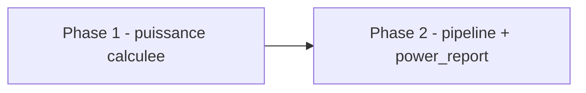

# Plan de correction — Lot A2 : calcul reel de puissance atteinte pour G9 `power_check`

> Sous-chantier 2/3 de
> `.ai/backlog/fixes/EPIC_CLOTURE_ATTESTATIONS_RESIDUELLES_GATES.md`.
> Produit a partir du brouillon d'intake
> `0 - HUMAN START HERE/PLAN_CORRECTION_POWER_CHECK_A2.md`, apres deux
> passes `/evaluate` sur le brouillon. Ce plan ne cree aucune nouvelle regle
> statistique : il applique la decision deja actee dans l'EPIC parent pour
> remplacer le faux `power=0.80` par une puissance calculee depuis les
> rendements pre-OOS de developpement.

---

## 0. Bandeau de statut (a verifier avant toute promotion)

| Question | Reponse |
| --- | --- |
| Un chantier actif couvre-t-il deja ce perimetre (`DONE`, `ACTIVE`, ou `SUPERSEDED`) ? | Non. Lot C est `DONE` (`4e568c5`). Aucun workstream A2/power_check n'existe dans `.ai/checkpoint.json` ou `.ai/backlog/fixes/`. |
| Un verrou de gouvernance actif bloque-t-il ce chantier ? | Non. L'EPIC parent acte explicitement la methode A2 : bootstrap stationnaire par blocs sur rendements pre-OOS de developpement. |
| Ce plan a-t-il besoin d'une decision humaine explicite pour lever un verrou avant d'etre routable via `/start` ? | Non. La decision de methode est deja journalisee dans l'EPIC parent section 10. |
| Ce plan remplace-t-il un document ou chantier existant ? | Non. Il complete Lot A1 (`PLAN_CORRECTION_GATE_STATISTIQUE_OOS_MASQUE`, DONE) et Lot C (`PLAN_CORRECTION_GATES_MECANIQUES_LOT_C`, DONE) sans les rouvrir. |

---

## Audit IA de promotion

- [x] Plan relu dans le contexte du cockpit actif (`AGENTS.md`, `.ai/README.md`, `.ai/checkpoint.json`, `Implementation/Active/HOOK.md`, `Implementation/Active/tracking.json`).
- [x] Bandeau de statut verifie contre l'etat machine reel : aucun workstream A2 actif ou deja route.
- [x] Ce plan est ecrit comme nouveau fichier dans `.ai/backlog/fixes/` ; le brouillon original reste intact jusqu'a archivage par `plan.ps1 start`.
- [x] Chantier classe `fix` : corrige un faux `PASS` possible dans un gate existant.
- [x] Autorite normative identifiee : `Protocole/SOP 01 - Estimation et intervalle de confiance OOS.md`, notamment la puissance cible de 80 %, l'effet minimal detectible derive du gate economique, et la variance long terme pre-OOS.
- [x] Perimetre de fichiers autorises/interdits explicite section 5.
- [x] Prerequis factuels verifies dans le code : `power` defaut `0.80` est valide contre `target_power=0.80`, et aucun appelant ne passe `power=` explicitement.
- [x] Deux passes `/evaluate` sur le brouillon d'intake ont corrige les angles morts : projection de variance pre-OOS vers taille OOS, et specialisation de `power_report` par rapport aux autres champs G9.

## Triage

| Champ | Valeur |
| --- | --- |
| Track | `fix` |
| Lifecycle | `TRIAGED` |
| Scope | Remplacer le faux `power_check` derive du parametre par defaut `power=0.80` par une puissance atteinte calculee depuis une serie pre-OOS de developpement, puis faire refleter `gates["power_report"]` par `oos["power_check"]["status"]`. |
| Non-goals | Ne pas modifier `Protocole/`. Ne pas changer le seuil cible 80 %. Ne pas inventer une autre methode de variance que le bootstrap stationnaire par blocs deja acte. Ne pas utiliser `oos_returns` pour estimer la variance de puissance. Ne pas toucher Lot B/G6. Ne pas modifier `validators/gate_validator.py` ni `VERDICT_VALUES`. Ne pas rouvrir les champs G9 deja corriges par Lot A1 sauf `power_report`. |
| Source | EPIC parent `.ai/backlog/fixes/EPIC_CLOTURE_ATTESTATIONS_RESIDUELLES_GATES.md`, section 10 : methode A2 actee ; brouillon `0 - HUMAN START HERE/PLAN_CORRECTION_POWER_CHECK_A2.md`, deux passes `/evaluate`. |
| Exit criteria | (1) `power_check.status` derive d'une puissance calculee, jamais du defaut `power=0.80`. (2) La puissance utilise une variance long terme estimee exclusivement depuis des rendements pre-OOS de developpement via `stationary_block_indices()`, projetee sur la taille OOS evaluee. (3) `gates["power_report"]` egale `oos["power_check"]["status"]`, tandis que les autres champs G9 restent alignes sur le verdict statistique global. (4) Tests unitaires couvrent puissance suffisante, puissance insuffisante, absence/insuffisance de donnees pre-OOS, et non-utilisation de `oos_returns` comme source de variance. (5) Test d'integration pilote prouve le mapping `power_report -> power_check.status`. (6) Suite runtime complete `PASS`. |

## Statut

| Champ | Valeur |
| --- | --- |
| Statut | `NON_DEMARRE` |
| Date de creation | 2026-07-16 |
| Date d'activation | - |
| Autorite normative | `Protocole/SOP 01 - Estimation et intervalle de confiance OOS.md` ; `Protocole/PAQUET D'EXECUTION EBTA.md` pour G9 |
| Autorite executable | `Implementation/ebta_engine/procedures/oos_confidence_interval.py` et `Implementation/examples/minimal_pilot_pipeline/build_research_package.py` |
| Changement normatif attendu | Aucun |
| Dependances externes | Aucune nouvelle |

---

## 1. Role de ce document et non-objectifs

| Element | Role |
| --- | --- |
| SOP 01 | Autorite normative de l'estimation OOS, de la puissance cible et de la variance long terme pre-OOS. |
| `oos_confidence_interval.py` | Procedure executable qui doit produire le rapport OOS et `power_check`. |
| `build_research_package.py` | Assemble le paquet pilote et transmet les inputs economiques/pre-OOS a la procedure. |
| `test_procedure_oos_ci.py` | Preuve unitaire du calcul et de ses refus. |
| `test_minimal_pilot_pipeline.py` | Preuve d'integration du mapping vers `gates.json`. |
| Ce plan | Carte d'implementation du Lot A2. |

Non-objectifs :

- ne pas modifier la doctrine SOP 01 ;
- ne pas ajouter de dependance scientifique ou technique ;
- ne pas transformer `gate_validator.py` en calculateur de puissance ;
- ne pas corriger Lot B/G6 dans ce chantier ;
- ne pas masquer un verdict `INCONCLUSIVE` par un statut global plus favorable.

---

## 2. Contexte obligatoire a lire avant de coder

1. `AGENTS.md`, `.ai/README.md`, `.ai/checkpoint.json`, `Implementation/Active/HOOK.md`, `Implementation/Active/tracking.json`.
2. `.ai/backlog/fixes/EPIC_CLOTURE_ATTESTATIONS_RESIDUELLES_GATES.md` — decision A2 et ordre C -> A2 -> B.
3. `.ai/archive/20260716_PLAN_CORRECTION_GATES_MECANIQUES_LOT_C.md` — precedent immediat et preuve de cloture.
4. `Protocole/SOP 01 - Estimation et intervalle de confiance OOS.md` — puissance, MDE, variance long terme.
5. `Implementation/ebta_engine/procedures/oos_confidence_interval.py`, `bootstrap.py`, `Implementation/examples/minimal_pilot_pipeline/build_research_package.py`.

Hierarchie d'autorite :

```text
1. Protocole/MANIFESTE DE GEL EBTA.md
2. Protocole/SOP 01 - Estimation et intervalle de confiance OOS.md
3. Protocole/PAQUET D'EXECUTION EBTA.md
4. Implementation/ebta_engine/
5. Implementation/examples/minimal_pilot_pipeline/
```

Regle : si le calcul ne peut pas produire une puissance defendable, le statut
doit devenir `INCONCLUSIVE`, jamais `PASS` par defaut.

---

## 3. Table des gates

| Ordre | Gate | Champ vise | Source corrigee | Sortie si echec |
| --- | --- | --- | --- | --- |
| G9 | `power_report` | `gates["power_report"]` | `oos["power_check"]["status"]` | `INCONCLUSIVE` si puissance < 80 % ou evidence insuffisante |

Les autres champs G9 (`oos_report`, `concatenated_oos_series`,
`oos_bootstrap_report`) restent gouvernes par le verdict statistique global.

---

## 4. Etat des lieux (avant/apres) — reutiliser avant de recreer

### Ce qui existe deja

| Module actuel | Chemin | Role reel verifie | Suffisant ? |
| --- | --- | --- | --- |
| `stationary_block_indices()` | `Implementation/ebta_engine/procedures/bootstrap.py` | Genere les indices bootstrap stationnaires par blocs. | Oui, reutiliser tel quel. |
| `validate_power_target()` | `oos_confidence_interval.py` | Valide une puissance atteinte contre la cible 80 %. | Oui, mais il faut lui passer une puissance calculee. |
| `_statistical_verdict()` | `oos_confidence_interval.py` | Rend `INCONCLUSIVE` si la puissance fournie est < 80 %. | Oui, a alimenter avec la puissance calculee. |
| `_procedure_reports()` | `build_research_package.py` | Appelle `oos_confidence_interval()` sans `power=`. | A etendre pour transmettre les inputs de puissance. |
| `pilot_inputs.json` | `Implementation/examples/minimal_pilot_pipeline/inputs/pilot_inputs.json` | Contient `economic_gate.thresholds.min_annualized_return` et `oos_returns`. | A etendre : aucune serie pre-OOS explicite n'existe aujourd'hui. |

### Ce qui manque reellement

| Brique manquante | Module a modifier | Source de la regle | Reutilisation obligatoire |
| --- | --- | --- | --- |
| Calcul de puissance atteinte | `oos_confidence_interval.py` | SOP 01, decision EPIC A2 | `stationary_block_indices()`, `validate_power_target()` |
| Serie pre-OOS de developpement pilote | `pilot_inputs.json` | SOP 01 variance pre-OOS | Ne pas utiliser `oos_returns` |
| Transmission des thresholds et rendements pre-OOS | `build_research_package.py` | SOP 01 section 10.6 | `economic_gate.thresholds.min_annualized_return` |
| Preuves tests | `test_procedure_oos_ci.py`, `test_minimal_pilot_pipeline.py` | Exit criteria | Patterns de tests existants |

---

## 5. Decision d'architecture

Principe directeur : la puissance est une evidence statistique calculee par
la procedure OOS, mais sa variance vient exclusivement des donnees de
developpement pre-OOS. Le rapport OOS consomme cette evidence ; le validateur
de gates ne calcule rien.

Contrat cible :

```python
def oos_confidence_interval(
    oos_returns: list[float],
    *,
    replications: int,
    mean_block_length: float,
    seed: int,
    pre_oos_development_returns: list[float],
    min_annualized_return: float,
    target_power: float = 0.80,
    alpha: float = 0.05,
    sessions_per_year: int = 252,
) -> dict[str, Any]:
    ...
```

Calcul cible :

```text
daily_mde = log1p(min_annualized_return) / sessions_per_year
pre_oos_bootstrap_means = stationary bootstrap means(pre_oos_development_returns)
pre_oos_mean_se = stdev(pre_oos_bootstrap_means)
long_run_std = pre_oos_mean_se * sqrt(len(pre_oos_development_returns))
oos_mean_se = long_run_std / sqrt(len(oos_returns))
achieved_power = NormalDist().cdf((daily_mde / oos_mean_se) - NormalDist().inv_cdf(1 - alpha))
```

Si une entree est absente, non positive, trop courte, ou donne une erreur type
nulle/non finie, `power_check.status` doit etre `INCONCLUSIVE`.

### Perimetre de fichiers explicite

Autorises :

```text
Implementation/ebta_engine/procedures/oos_confidence_interval.py       MODIFIER
Implementation/examples/minimal_pilot_pipeline/build_research_package.py MODIFIER
Implementation/examples/minimal_pilot_pipeline/inputs/pilot_inputs.json MODIFIER
Implementation/ebta_engine/tests/test_procedure_oos_ci.py              MODIFIER
Implementation/ebta_engine/tests/test_minimal_pilot_pipeline.py        MODIFIER
```

Interdits :

```text
Protocole/                                                     [NORME - intouchable]
Implementation/ebta_engine/procedures/bootstrap.py             [CONTRAT SUFFISANT - reutiliser]
Implementation/ebta_engine/validators/gate_validator.py        [CONTRAT SUFFISANT - ne pas modifier]
Implementation/ebta_engine/package_builder/nautilus_research_package.py [HORS PERIMETRE]
.ai/checkpoint.json                                            [METTRE A JOUR UNIQUEMENT via plan.ps1]
```

---

## 6. Decoupage en phases

### Phase 1 - Calculer la puissance atteinte dans la procedure OOS

Objectif : remplacer le parametre `power=0.80` par une puissance calculee.

Actions :

- Ajouter les entrees explicites `pre_oos_development_returns`,
  `min_annualized_return`, `target_power` et `alpha`.
- Estimer la variance long terme depuis les rendements pre-OOS via
  `stationary_block_indices()`.
- Calculer `achieved_power` avec `statistics.NormalDist`.
- Passer la puissance calculee a `validate_power_target()` et a
  `_statistical_verdict()`.
- Rendre `INCONCLUSIVE` si les donnees pre-OOS sont absentes/insuffisantes ou
  si l'erreur type n'est pas defendable.

Livrables :

- `oos_confidence_interval.py` corrige.
- Tests unitaires puissance suffisante/insuffisante/evidence insuffisante.

Critere de sortie :

- Aucun chemin ne peut produire `power_check.status == "PASS"` via le defaut
  `power=0.80`.

### Phase 2 - Brancher le pipeline pilote et G9 `power_report`

Objectif : alimenter la procedure avec les inputs pre-OOS/economiques et
faire refleter `power_report` par `power_check.status`.

Actions :

- Ajouter une serie `pre_oos_development_returns` dans `pilot_inputs.json`.
- Passer cette serie et `economic_gate.thresholds.min_annualized_return` a
  `oos_confidence_interval()`.
- Ajuster `_write_reports()` pour que `power_report` lise
  `procedure_reports["oos"]["power_check"]["status"]`.
- Garder les trois autres champs G9 sur le verdict statistique global.

Livrables :

- Pipeline pilote `PASS`.
- Test d'integration `power_report == oos["power_check"]["status"]`.

Critere de sortie :

- `python Implementation\examples\minimal_pilot_pipeline\build_research_package.py`
  retourne `status: PASS`. La fixture pilote doit fournir une evidence pre-OOS
  suffisante pour prouver le chemin `PASS`; un `INCONCLUSIVE` pilote serait un
  echec de ce sous-chantier, pas un succes documentable.

### Chemin critique



---

## 7. Artefacts produits

| Etape | Fichier/sortie | Format | Regle source |
| --- | --- | --- | --- |
| Rapport OOS | `reports/oos.json` | JSON | SOP 01 |
| Gate G9 | `reports/gates.json::power_report` | JSON | PAQUET D'EXECUTION EBTA G9 |
| Tests | `test_procedure_oos_ci.py`, `test_minimal_pilot_pipeline.py` | unittest | Ce plan |

---

## 8. Invariants absolus et NO GO

1. `oos_returns` ne sert jamais a estimer la variance long terme de puissance.
2. `power_check.status` ne peut jamais etre `PASS` par simple defaut de signature.
3. `power_report` ne masque pas un `power_check` `INCONCLUSIVE`.
4. Aucune modification normative ni changement de seuil 80 %.

NO GO :

- utiliser une constante de puissance ;
- utiliser une distribution WRC/Test a la place de la source pre-OOS prevue ;
- modifier `VERDICT_VALUES` ;
- convertir un `INCONCLUSIVE` en `PASS` pour garder le package vert.

---

## 9. Verification a chaque etape

```powershell
python -m unittest discover -s Implementation\ebta_engine\tests -t Implementation -p test_procedure_oos_ci.py
python -m unittest discover -s Implementation\ebta_engine\tests -t Implementation -p test_minimal_pilot_pipeline.py
python -m unittest discover -s Implementation\ebta_engine\tests -t Implementation
python Implementation\examples\minimal_pilot_pipeline\build_research_package.py
```

Premier lot executable :

```text
Phase 1 - Calculer la puissance atteinte dans la procedure OOS
```

### Execution sans interruption

Ce plan est executable sans retour humain : la methode et le seuil sont deja
actes dans l'EPIC. S'arreter seulement si l'implementation exige une nouvelle
decision de methode/statut/seuil ou un fichier hors perimetre.

### Autorite decisionnelle accordee

L'IA peut choisir les noms internes et les tests exacts tant que la methode,
le perimetre et les invariants ci-dessus restent respectes.

### Interdiction des raccourcis

Ne jamais garder un package `PASS` en contournant un `power_check`
`INCONCLUSIVE`. Un `INCONCLUSIVE` produit par le calcul reel est un verdict
EBTA valide, pas un echec du chantier.

---

## 10. Journal des decisions humaines (autorisations)

| Date | Decision | Portee |
| --- | --- | --- |
| 2026-07-16 | Lot A2 : reutiliser le bootstrap stationnaire par blocs deja normatif applique aux rendements pre-OOS de developpement pour estimer l'erreur type de la puissance atteinte. | Autorise ce plan sans nouvelle consultation humaine sur la methode. |

---

## 11. Risques et blocages connus

| Risque | Impact | Mitigation / condition de deblocage |
| --- | --- | --- |
| Le package M1 de production devient `INCONCLUSIVE` apres calcul reel | Verdict EBTA legitime, potentiellement bloquant pour package PASS | Documenter en cloture ou dans l'historique runtime ; ne pas masquer |
| La serie pre-OOS pilote ajoutee est trop courte pour demontrer un `PASS` | Tests/pipeline deviennent `INCONCLUSIVE` | Corriger la fixture pilote pre-OOS pour qu'elle prouve le chemin `PASS`, sans utiliser OOS |

---

## 12. Definition of Done

- [ ] Phases 1 et 2 terminees.
- [ ] Exit criteria du Triage atteints.
- [ ] Aucun fichier hors perimetre modifie.
- [ ] Suite runtime complete `PASS`.
- [ ] Bug-hunter cible `PASS`.
- [ ] Plan-conformance-audit `PASS`.

---

## 13. Cloture

| Champ | Valeur |
| --- | --- |
| Resultat final | [A remplir a la cloture] |
| Ecarts par rapport au plan initial | [A remplir a la cloture] |
| Suites a prevoir (hors perimetre de ce plan) | Lot B (`execution_report`/`nav_reconciliation`, decision humaine requise). |

### Resultat d'execution

| Champ | Valeur |
| --- | --- |
| Date | [AAAA-MM-JJ] |
| Phases executees | [liste] |
| Artefact produit | [chemin] |
| Validation | [PASS/FAIL + commande utilisee] |
| Ecart par rapport au plan | [aucun / liste] |

---

## 14. Journal d'audits post-hoc

| Date de l'audit | Ce qui a ete corrige | Pourquoi |
| --- | --- | --- |
| 2026-07-16 | Brouillon passe 1 : precision de la projection variance pre-OOS -> taille OOS, au lieu d'utiliser directement l'erreur type du sample pre-OOS. | Eviter un calcul de puissance avec le mauvais `n`. |
| 2026-07-16 | Brouillon passe 2 : distinction entre verdict statistique global et `power_check.status` pour `gates["power_report"]`. | Eviter que Lot A1 masque un `power_check` reellement `INCONCLUSIVE`. |
| 2026-07-16 | Plan route passe 1 : clarification que le pipeline pilote doit rester `PASS`; seul un package de production reel peut etre documente `INCONCLUSIVE` comme verdict EBTA legitime hors fixture. | Eviter qu'une fixture insuffisante fasse passer un chantier incomplet pour une cloture acceptable. |
| 2026-07-16 | Plan route passe 2 : convergence confirmee ; pas de nouveau verrou humain, pas de dependance nouvelle, perimetre de fichiers ferme et exit criteria binaires. | Autoriser la baseline pre-implementation avant `/continue`. |
