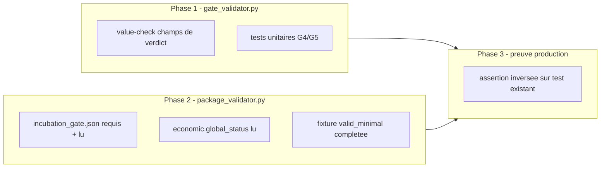

# Plan de correction — Faire refleter au statut global de package un gate reellement en echec

> Plan `fix` produit a partir du risque `R3 — Preuve vs attestation` de
> `0 - HUMAN START HERE/AUDIT_MATURITE_MOTEUR_RECHERCHE_2026-07-13.md`
> (section "Suite proposee", point R3) et de la decouverte documentee dans
> `.ai/archive/20260715_PLAN_CORRECTION_GATE_STATISTIQUE_WRC_MASQUE.md`
> (sections 4, 9, 13, 14) : la correction WRC deja livree rend les artefacts
> JSON individuels honnetes (`gates.json.wrc_status`,
> `economic.json.statistical_status`/`.global_status`,
> `incubation_gate.json.status`), mais `validators/gate_validator.py` et
> `validators/package_validator.py` ne les consomment pas correctement, si
> bien que `validate_package_dir()["status"]` reste `PASS` meme quand un WRC
> reel a echoue. Ce document ne cree aucune nouvelle regle scientifique : il
> corrige deux defauts d'assemblage deja identifies et localises par lecture
> directe du code, pour que le statut global du package cesse d'ignorer les
> gates qui ont deja calcule un echec reel.
>
> Meme nature de defaut que les deux plans precedents de cette famille
> (`.ai/archive/20260710_PLAN_CORRECTION_GATE_ECONOMIQUE_CALIBRATION.md`,
> `.ai/archive/20260715_PLAN_CORRECTION_GATE_STATISTIQUE_WRC_MASQUE.md`) :
> un verdict deja calcule correctement quelque part est ignore par
> l'assembleur en aval, qui retombe sur une lecture trop permissive
> (presence/verite Python au lieu de valeur).

---

## 0. Bandeau de statut (a verifier avant toute promotion)

| Question | Reponse |
| --- | --- |
| Un chantier actif couvre-t-il deja ce perimetre (`DONE`, `ACTIVE`, ou `SUPERSEDED`) ? | Non. `.ai/checkpoint.json::active_workstream_id` est `null` ; tous les workstreams sont `DONE`. `PLAN_CORRECTION_GATE_STATISTIQUE_WRC_MASQUE` (`DONE`, 2026-07-15) a explicitement exclu `validators/` de son perimetre (voir sa section "Interdits") et a documente ce defaut comme suite prioritaire en section 13, sans le corriger. |
| Un verrou de gouvernance actif bloque-t-il ce chantier ? | Oui, un verrou documentaire (pas un verrou machine) : le plan WRC precedent note explicitement que modifier `validators/` "necessite une decision humaine separee" car c'est un module a plus haute autorite que `package_builder/`/`examples/`. Ce verrou est leve par la demande explicite de l'utilisateur en session le 2026-07-15 de rediger ce plan de correction pour R3 (voir section 10, Journal des decisions humaines). Ce plan reste `TRIAGED`, non route, tant que l'utilisateur n'a pas explicitement confirme son execution via `/start`. |
| Ce plan a-t-il besoin d'une decision humaine explicite pour lever ce verrou avant d'etre routable via `/start` ? | La redaction est autorisee (demande explicite de ce jour). Le routage/execution (`/start`) reste une decision separate a confirmer par l'utilisateur, conformement au flux standard du depot. |
| Ce plan remplace-t-il un document ou chantier existant ? | Non. Il complete `PLAN_CORRECTION_GATE_STATISTIQUE_WRC_MASQUE` (`DONE`) sans le rouvrir ni le modifier, et referme explicitement le point "Suites a prevoir" de plus haute priorite qu'il a laisse ouvert. |

---

## Audit IA de promotion

- [x] Plan relu dans le contexte du cockpit actif (`AGENTS.md`, `.ai/README.md`, `.ai/checkpoint.json`, `Implementation/Active/HOOK.md`, `Implementation/Active/tracking.json` — aucun workstream actif).
- [x] Bandeau de statut (section 0) rempli et verifie contre l'etat machine reelle.
- [x] Ce plan est ECRIT COMME NOUVEAU FICHIER dans `.ai/backlog/fixes/` ; aucune observation d'intake source distincte a archiver (source = section documentaire d'un plan deja clos, non deplacee).
- [x] Chantier classe `fix` — corrige un ecart d'assemblage (deux validateurs qui ignorent des valeurs deja calculees) sans changer de norme.
- [x] Autorite normative identifiee : `Protocole/` SOP 02 (WRC), SOP 05 (robustesse), SOP 08 (gate economique), SOP 11 (incubation), `PAQUET D'EXECUTION EBTA.md` sections 2/3/5/6 (contrat des gates G0-G14 et du package) priment sur ce document et sur le code.
- [x] Perimetre de fichiers autorises et interdits explicite (section 5).
- [x] Prerequis factuels verifies directement dans le code le 2026-07-15 (pas supposes) :
  - `validators/gate_validator.py::validate_gates()` ligne 41 : `missing = [name for name in requirements if not evidence.get(name)]` — verifie la verite Python (`bool()`), jamais la valeur. Seuls deux champs de `GATE_REQUIREMENTS` portent aujourd'hui une semantique de verdict `"PASS"/"FAIL"/"INCONCLUSIVE"` plutot qu'une simple attestation booleenne : `wrc_status` (G4) et `pre_oos_robustness_verdict` (G5) — confirme par lecture de `Implementation/examples/minimal_pilot_pipeline/build_research_package.py::_write_reports()` lignes 211 et 215, et par les fixtures `reports/gates.json` existantes (tous les autres champs valent litteralement `true` ou sont des identifiants).
  - `validators/package_validator.py::_semantic_consistency_errors()` (lignes 171-217) ne lit jamais `reports/incubation_gate.json` (absent de `REQUIRED_PACKAGE_PATHS`, ligne 18-41) et ne lit `economic.json` que pour verifier la presence de `thresholds`/`observed_values`/`capacity_grid` quand `economic_status == "PASS"` — jamais la valeur de `economic.json.global_status` ni `.statistical_status`.
  - `reports/incubation_gate.json` est deja produit par les deux chemins de production (`build_research_package.py::_write_reports()` ligne 314, delegue par `nautilus_research_package.py::build_nautilus_research_package()`) et deja liste dans `Implementation/examples/minimal_pilot_pipeline/inputs/package_shape.json::artifact_paths` (donc deja couvert par le manifeste de reproductibilite) — l'ajouter a `REQUIRED_PACKAGE_PATHS` ne casse aucun paquet de production existant.
  - Preuve executable directe du defaut deja presente dans la suite de tests : `Implementation/ebta_engine/tests/test_nautilus_research_package.py::test_real_wrc_fail_reaches_economic_and_incubation_gates` (livre par le plan WRC) construit un `research_package` reel ou `wrc["verdict"] == "FAIL"`, `economic["global_status"] == "FAIL"`, `incubation["status"] == "FAIL"`, et affirme pourtant `report["status"] == "PASS"` (ligne 65) — c'est la preuve mecanique du defaut R3, deja dans le depot.
  - Suite runtime complete verifiee `PASS` avant ce plan : `python -m unittest discover -s Implementation/ebta_engine/tests -t Implementation` → 144 tests, `OK` (2026-07-15).
- [x] Etat des lieux (section 4) verifie directement dans le code pour eviter de reecrire `procedures/wrc.py`, `procedures/economic_gate.py`, `procedures/lifecycle.py`, ou `procedures/robustness.py` — tous deja corrects et testes ; seule la lecture qu'en font les deux validateurs est fautive.

## Triage

| Champ | Valeur |
| --- | --- |
| Track | `fix` |
| Lifecycle | `TRIAGED` |
| Scope | Deux modules, chacun corrige independamment (defense en profondeur, voir section 5) : (1) `Implementation/ebta_engine/validators/gate_validator.py::validate_gates()` — distinguer les champs de `GATE_REQUIREMENTS` qui portent une valeur de verdict connue (`"PASS"`/`"FAIL"`/`"INCONCLUSIVE"`) des champs d'attestation simple, et exiger `== "PASS"` pour les premiers au lieu d'une simple verite Python ; aujourd'hui cela concerne `wrc_status` (G4) et `pre_oos_robustness_verdict` (G5), sans hypothese figee sur ces deux seuls noms (regle generale par ensemble de valeurs connues, pas par liste de champs). (2) `Implementation/ebta_engine/validators/package_validator.py` — ajouter `reports/incubation_gate.json` a `REQUIRED_PACKAGE_PATHS` et etendre `_semantic_consistency_errors()` pour faire echouer le package quand `incubation_gate.json.status != "PASS"` (si present) ou quand `economic.json.global_status` est present et different de `"PASS"`. Inclut la mise a jour de la fixture `Implementation/ebta_engine/fixtures/valid_minimal/reports/incubation_gate.json` (absente aujourd'hui, necessaire pour que le paquet de reference reste `PASS` apres l'ajout du chemin requis) et l'inversion des **deux** assertions `report["status"] == "PASS"` de `test_nautilus_research_package.py` (lignes 35 et 65) qui documentent deja le defaut : elles doivent passer a `"FAIL"`, car leurs deux runners (`_losing_segment_runner` et `_statistical_fail_segment_runner`) produisent chacun un WRC reel `FAIL` (verifie empiriquement 2026-07-15). |
| Non-goals | Ne pas modifier `procedures/wrc.py`, `procedures/economic_gate.py`, `procedures/lifecycle.py`, ou `procedures/robustness.py` (deja corrects et testes, alimentes sans etre reecrits) ; ne pas modifier `Protocole/` ; **ne pas corriger le defaut distinct decouvert en marge de l'audit du code** — `Implementation/examples/minimal_pilot_pipeline/build_research_package.py::_write_reports()` ligne 215 fige `"pre_oos_robustness_verdict": "PASS"` en dur au lieu de lire le verdict deja calcule par `procedures/robustness.py::pre_oos_robustness_verdict()` (fonction existante, non appelee a cet endroit) — c'est un defaut de **contenu** de meme nature que le defaut WRC deja corrige, mais pour le gate de robustesse (G5) ; il merite son propre plan `fix` suivant exactement le patron de `PLAN_CORRECTION_GATE_STATISTIQUE_WRC_MASQUE`, documente ici (section 13) mais explicitement hors perimetre pour ne pas melanger correction de **validateur** (ce plan) et correction de **contenu** (futur plan) dans le meme diff ; ne pas etendre la correction de `validate_gates()` a une refonte des ~35 autres champs d'attestation booleenne de `gates.json` (deja explicitement hors perimetre du plan WRC precedent, meme raison : necessite un mecanisme de decision humaine reel, pas un changement de validateur) ; ne pas modifier `REQUIRED_PACKAGE_PATHS` au-dela de l'ajout de `reports/incubation_gate.json` ; ne pas regenerer ni committer les paquets d'exemple persistes sous `Implementation/research_packages/` ou `Implementation/examples/minimal_pilot_pipeline/research_package/` sauf si necessaire pour prouver la non-regression (voir section 9) ; ne pas toucher au mecanisme `enforce_bias_governance`/`g_bias.json` (deja correct, hors perimetre). |
| Source | Observation d'intake `0 - HUMAN START HERE/OBSERVATION_VALIDATORS_STATUT_GLOBAL_PACKAGE.md` (2026-07-15), issue du risque `R3` de `0 - HUMAN START HERE/AUDIT_MATURITE_MOTEUR_RECHERCHE_2026-07-13.md` (section "Suite proposee") et de la decouverte precise documentee dans `.ai/archive/20260715_PLAN_CORRECTION_GATE_STATISTIQUE_WRC_MASQUE.md` sections 4, 9, 13, 14 (passage `/evaluate` du 2026-07-15). Demande explicite de l'utilisateur en session le 2026-07-15 : "Redige le plan de correction pour R3". |
| Exit criteria | (1) `validate_gates()` distingue les champs de valeur-verdict connue (ensemble `{"PASS", "FAIL", "INCONCLUSIVE"}`) des champs d'attestation simple, et un gate dont un champ de verdict connu vaut `"FAIL"` ou `"INCONCLUSIVE"` n'est plus `"PASS"`. Prouve par un test unitaire direct sur `validate_gates()` (evidence synthetique avec `wrc_status="FAIL"` → `G4.status != "PASS"` ; evidence avec `pre_oos_robustness_verdict="FAIL"` → `G5.status != "PASS"`), sans dependre du defaut de contenu hors perimetre. Note sur le label : l'enum de sortie de `gate_report()` etant `{"PASS", "INCONCLUSIVE"}` (pas de `"FAIL"`), un `wrc_status="FAIL"` dur produira un gate `status="INCONCLUSIVE"` (le champ apparaissant dans `missing`) — c'est acceptable car le statut global bascule quand meme via `gate_failures`, mais l'assertion de test vise `!= "PASS"`, pas `== "FAIL"`. (2) `reports/incubation_gate.json` fait partie de `REQUIRED_PACKAGE_PATHS` et son absence fait echouer `validate_package_dir()` ; aucun changement de `manifests/manifest_builder.py` requis (`package_shape.json::artifact_paths` liste deja ce chemin, et le test de reference reconstruit le manifeste depuis `REQUIRED_PACKAGE_PATHS`, donc `_manifest_artifact_failures()` reste satisfait automatiquement). (3) `_semantic_consistency_errors()` retourne une erreur non vide quand `incubation_gate.json.status != "PASS"` (si present) ou quand `economic.json.global_status` est present et different de `"PASS"` (valeur reelle possible : `"FAIL"` OU `"REJECTED_ECONOMIC"` — la regle testee est `!= "PASS"`, pas l'egalite a `"FAIL"`), independamment de la valeur des cinq booleens economiques. (4) Preuve de non-regression en production : sur le chemin `build_nautilus_research_package()`, **deux** assertions de `test_nautilus_research_package.py` passent de `"PASS"` a `"FAIL"` — `test_real_wrc_fail_reaches_economic_and_incubation_gates` ligne 65 (runner `_statistical_fail_segment_runner`) ET `test_known_loser_is_rejected_by_real_economic_gate_in_production` ligne 35 (runner `_losing_segment_runner`, dont le WRC reel est aussi `FAIL` — verifie empiriquement 2026-07-15). Aucune autre assertion de ces deux tests ne change (notamment `economic_status == "REJECTED_ECONOMIC"` et les `failures` du test known_loser restent valides). (5) `Implementation/ebta_engine/fixtures/valid_minimal` reste un paquet `PASS` de bout en bout apres l'ajout du chemin requis (fixture `incubation_gate.json` ajoutee ; `valid_minimal/economic.json` n'a pas de cle `global_status`, donc la regle « if present » de (3) ne le fait pas basculer). (6) Suite runtime complete reste `PASS`. (7) Zero modification de `procedures/`, `Protocole/`, `governance/`, `manifests/`. |

## Statut

| Champ | Valeur |
| --- | --- |
| Statut | `NON_DEMARRE` |
| Date de creation | 2026-07-15 |
| Date d'activation | - |
| Autorite normative | `Protocole/` (`EBTA-DOC-1.1`), en particulier `PAQUET D'EXECUTION EBTA.md` (contrat des gates G0-G14 et structure du package), SOP 02 (WRC), SOP 05 (robustesse), SOP 08 (gate economique), SOP 11 (incubation) — gele, non modifie par ce plan |
| Autorite executable | `Implementation/ebta_engine/validators/` (module a plus haute autorite que `package_builder/`/`examples/`, modifie ici avec decision humaine explicite, voir section 10) |
| Changement normatif attendu | Aucun — application d'une regle deja normative (un package dont un gate reel a echoue ne doit pas produire un statut global `PASS`), pas de nouvelle regle scientifique |
| Dependances externes | Aucune nouvelle. |

---

## 1. Role de ce document et non-objectifs

| Element | Role |
| --- | --- |
| `Protocole/PAQUET D'EXECUTION EBTA.md` | Autorite normative du contrat des gates G0-G14 et de la structure du package. Inchangee. |
| `procedures/wrc.py`, `procedures/economic_gate.py`, `procedures/lifecycle.py`, `procedures/robustness.py` | Calculs et agregateurs deja corrects. Inchanges. |
| `validators/gate_validator.py::validate_gates()` | Verificateur fautif : lit la verite Python d'un champ, jamais sa valeur, quand ce champ porte un verdict. **Dans le perimetre.** |
| `validators/package_validator.py::validate_package_dir()` / `_semantic_consistency_errors()` | Verificateur fautif : ignore `incubation_gate.json` et la valeur reelle de `economic.json.global_status`. **Dans le perimetre.** |
| `examples/minimal_pilot_pipeline/build_research_package.py::_write_reports()` ligne 215 (`pre_oos_robustness_verdict` fige) | Defaut de **contenu** distinct, de meme nature que le defaut WRC deja corrige. Documente, **hors perimetre** (voir section 13). |
| Ce plan | Corrige la **lecture** des valeurs deja produites par les procedures normatives ; ne recalcule rien. |

Non-objectifs :

- ne pas reecrire `Protocole/` ni les SOP concernees ;
- ne pas introduire de regle, seuil ou statut absent des SOP concernees ;
- ne pas transformer un validateur en calculateur — il continue de lire des valeurs deja produites, jamais de les deriver ;
- ne pas corriger le defaut de contenu du gate robustesse (G5) — seule sa **verification** est corrigee ici, pas la valeur qu'il verifie.

---

## 2. Contexte obligatoire a lire avant de coder

1. `AGENTS.md`, `.ai/README.md`, `.ai/checkpoint.json`, `Implementation/Active/HOOK.md` — etat machine courant (aucun workstream actif).
2. `.ai/archive/20260715_PLAN_CORRECTION_GATE_STATISTIQUE_WRC_MASQUE.md` — chantier precedent de meme famille, dont ce plan reprend le patron de correction et de preuve ; sa section 13 nomme explicitement ce chantier comme suite prioritaire.
3. `.ai/archive/20260710_PLAN_CORRECTION_GATE_ECONOMIQUE_CALIBRATION.md` — meme patron applique au gate economique (booleens en dur).
4. `Protocole/PAQUET D'EXECUTION EBTA.md` sections 2 (gates G0-G14), 4, 5, 6 (structure du package, statut global).
5. Code existant a reutiliser (verifie 2026-07-15) : `validators/gate_validator.py` (`GATE_REQUIREMENTS`, `validate_gates()` ligne 38, `gate_report()` ligne 48) ; `validators/package_validator.py` (`REQUIRED_PACKAGE_PATHS` ligne 18, `validate_package_dir()` ligne 46, `_semantic_consistency_errors()` ligne 171) ; `procedures/lifecycle.py::incubation_gate()` (forme de sortie `{"artifact_type", "status", "failures"}`) ; `procedures/robustness.py::pre_oos_robustness_verdict()` (existe, non appelee par `_write_reports()`) ; `tests/test_nautilus_research_package.py::test_real_wrc_fail_reaches_economic_and_incubation_gates` (preuve deja existante du defaut) ; `tests/test_package_validator.py` (patron de test sur paquet de reference) ; `tests/test_gates.py` (patron de test unitaire sur `validate_gates()`) ; `fixtures/valid_minimal/reports/gates.json` et `.../economic.json` (paquet de reference).

**Hierarchie d'autorite** :

```text
1. Protocole/MANIFESTE DE GEL EBTA.md
2. Protocole/PROTOCOLE EBTA.md
3. Protocole/REGISTRE DES DECISIONS NORMATIVES EBTA.md
4. SOP 01-13 (ici : SOP 02, SOP 05, SOP 08, SOP 11)
5. Protocole/PAQUET D'EXECUTION EBTA.md
6. Implementation/ (dont ce plan)
7. Adaptateurs externes (NautilusTrader)
```

Regle : si le code contredit `Protocole/`, c'est le code qui a tort. Un
gate dont la valeur reelle est `"FAIL"` ne doit jamais etre compte comme
`"PASS"` au seul motif qu'un champ est present et non vide.

---

## 3. Table des gates concernes

| Ordre | Gate/verificateur | Defaut actuel | Correction |
| --- | --- | --- | --- |
| G4 | `validate_gates()` sur `wrc_status` | Chaine `"FAIL"` est truthy → G4 reste `"PASS"` | Comparaison de valeur pour les champs de verdict connu |
| G5 | `validate_gates()` sur `pre_oos_robustness_verdict` | Meme defaut | Meme correction (contenu du champ reste hors perimetre, voir Non-goals) |
| Statut global package | `validate_package_dir()` | N'exploite jamais `incubation_gate.json` ni `economic.json.global_status`/`.statistical_status` | Lecture ajoutee dans `_semantic_consistency_errors()` |

Ce chantier ne touche que la **lecture** de valeurs deja calculees ; il ne
change ni l'ordre ni la logique d'agregation d'aucune procedure normative.

---

## 4. Etat des lieux (avant/apres) — reutiliser avant de recreer

### Ce qui existe deja et fonctionne (verifie 2026-07-15)

| Module | Chemin | Role reel (verifie) | Suffisant ? |
| --- | --- | --- | --- |
| Verdict WRC reel propage | `gates.json.wrc_status` (via `_write_reports()` ligne 211) | Deja `wrc["verdict"]` reel depuis le plan precedent | ✅ Contenu correct, seule la lecture est fautive |
| Verdict robustesse | `procedures/robustness.py::pre_oos_robustness_verdict()` | Fonction de calcul deja correcte, existe | ⚠️ Correcte mais non appelee par `_write_reports()` (hors perimetre, voir Non-goals) |
| Agregateur incubation | `procedures/lifecycle.py::incubation_gate()` | Deja correct, deja alimente par le verdict WRC reel depuis le plan precedent | ✅ Reutiliser tel quel |
| Rapport `incubation_gate.json` | Produit par les deux chemins de production, deja dans `package_shape.json::artifact_paths` | Deja ecrit sur disque, deja dans le manifeste de reproductibilite | ✅ Deja produit, juste jamais lu par `package_validator.py` |
| `validate_gates()` | `validators/gate_validator.py` ligne 38-45 | Vérifie `bool(evidence.get(name))`, jamais la valeur | ❌ A corriger (coeur de ce chantier) |
| `_semantic_consistency_errors()` | `validators/package_validator.py` ligne 171-217 | Ne lit jamais `incubation_gate.json` ; ne lit `economic.json` que pour la presence de trois cles quand `economic_status == "PASS"` | ❌ A corriger (coeur de ce chantier) |
| `REQUIRED_PACKAGE_PATHS` | `validators/package_validator.py` ligne 18-41 | 21 chemins requis, `reports/incubation_gate.json` absent | ❌ A corriger |
| Preuve du defaut (2 tests) | `test_nautilus_research_package.py` : `test_real_wrc_fail_reaches_economic_and_incubation_gates` ligne 65 ET `test_known_loser_is_rejected_by_real_economic_gate_in_production` ligne 35 | Les deux affirment `report["status"] == "PASS"` alors que leur WRC reel est `FAIL` (`economic.global_status` et `incubation.status` deja `FAIL`) — verifie empiriquement 2026-07-15 | ❌ Deux assertions a inverser (preuve de la correction, Phase 3) |

### Ce qui manque reellement

| Brique manquante | Module a modifier | Source de la regle | A reutiliser (pas dupliquer) |
| --- | --- | --- | --- |
| Distinction champ-verdict / champ-attestation dans `validate_gates()` | `validators/gate_validator.py` | Cette observation, contrat G0-G14 de `PAQUET D'EXECUTION EBTA.md` | Aucun nouveau calcul — lecture de valeurs deja produites |
| `reports/incubation_gate.json` dans `REQUIRED_PACKAGE_PATHS` + verification de sa valeur | `validators/package_validator.py` | Cette observation, SOP 11 | `incubation_gate()` deja correct, deja ecrit sur disque |
| Verification de `economic.json.global_status` independamment des cinq booleens | `validators/package_validator.py::_semantic_consistency_errors()` | Cette observation, SOP 08 | `economic_gate_report()` deja correct, deja ecrit sur disque |
| Fixture `incubation_gate.json` pour `fixtures/valid_minimal` | `Implementation/ebta_engine/fixtures/valid_minimal/reports/incubation_gate.json` (nouveau fichier) | Forme deja produite par `incubation_gate()` (`artifact_type`, `status`, `failures`) | Copier la forme du fichier deja produit dans `examples/minimal_pilot_pipeline/research_package/reports/incubation_gate.json` |

---

## 5. Decision d'architecture

Principe directeur : un validateur ne doit jamais confondre "un champ est
present et non vide" avec "un champ porte une valeur acceptable" quand ce
champ encode explicitement un verdict (`"PASS"`/`"FAIL"`/`"INCONCLUSIVE"`).
Les deux corrections de ce plan sont **independantes et complementaires**
(defense en profondeur), pas redondantes :

- Correction 1 (`gate_validator.py`) agit au niveau des 15 gates G0-G14, sur
  le champ brut deja present dans `gates.json`.
- Correction 2 (`package_validator.py`) agit au niveau du package entier, en
  recroisant `incubation_gate.json` et `economic.json.global_status` —
  deux rapports independants qui peuvent un jour diverger de `gates.json`
  sans que Correction 1 seule le detecte (ex. si une future evolution ajoute
  un mode d'echec a `incubation_gate()` sans champ miroir dans
  `GATE_REQUIREMENTS`).

Chacune des deux corrections suffit isolement a faire basculer le scenario
de preuve deja existant (`test_real_wrc_fail_reaches_economic_and_incubation_gates`)
de `PASS` a `FAIL` ; les livrer ensemble ferme les deux angles morts nommes
explicitement par l'audit du plan precedent au lieu de n'en fermer qu'un et
de laisser croire que le probleme est clos.

### Regle generale plutot que liste de champs figee

Plutot que de coder en dur `["wrc_status", "pre_oos_robustness_verdict"]`
dans `validate_gates()` (fragile si un futur champ de verdict est ajoute a
`GATE_REQUIREMENTS` sans mettre a jour le validateur), la correction
reconnait un champ de verdict par son **ensemble de valeurs possibles**
(`{"PASS", "FAIL", "INCONCLUSIVE"}`), coherent avec les valeurs deja
utilisees partout ailleurs dans le moteur (`wrc.py`, `economic_gate.py`,
`lifecycle.py`, `robustness.py`). Un champ dont la valeur n'appartient pas a
cet ensemble (booleen `true`, identifiant, hash) continue d'etre verifie
par simple presence/verite, comme avant — aucun changement de comportement
pour les ~35 autres champs d'attestation.

### Frontieres explicites

| Couche | Elle fait | Elle NE fait PAS |
| --- | --- | --- |
| `procedures/*` (inchangees) | Calculent des verdicts reels | Rien de nouveau ici |
| `validate_gates()` (corrigee) | Lit la valeur d'un champ ; si cette valeur appartient a l'ensemble des verdicts connus, exige `"PASS"` ; sinon, verifie la presence/verite comme avant | Calculer un nouveau verdict ; decider un seuil |
| `_semantic_consistency_errors()` (etendue) | Lit `incubation_gate.json.status` et `economic.json.global_status` deja produits, les compare a `"PASS"` | Recalculer ces statuts ; agreger differemment |
| `REQUIRED_PACKAGE_PATHS` (etendu) | Exige la presence de `reports/incubation_gate.json`, deja produit par les deux chemins de production | Changer la structure du package |

### Contrat d'interface

Aucun nouveau contrat. `GateResult` (dataclass existante) est reutilisee
telle quelle ; son champ `missing` peut desormais contenir un nom de champ
qui est **present mais dont la valeur de verdict est `"FAIL"`/`"INCONCLUSIVE"`**
— nuance a documenter dans le docstring du module (le nom `missing` reste
correct au sens "n'a pas satisfait l'exigence du gate", pas au sens strict
"absent du dictionnaire").

### Decisions deja actees

| Decision | Justification |
| --- | --- |
| Reconnaitre un champ de verdict par ensemble de valeurs (`{"PASS", "FAIL", "INCONCLUSIVE"}`) plutot que par liste de noms de champs codee en dur | Generalise la correction a tout futur champ de verdict ajoute a `GATE_REQUIREMENTS` sans nouvelle modification du validateur ; repond explicitement au constat du plan precedent ("pas seulement G4/WRC") sans re-ouvrir les ~35 champs d'attestation |
| Ne pas corriger le contenu de `pre_oos_robustness_verdict` (toujours fige a `"PASS"`) dans ce plan | Separer strictement correction de **validateur** (lecture) et correction de **contenu** (calcul deja fait ailleurs, juste pas branche) — meme discipline que le plan precedent, qui a refuse de melanger `_procedure_reports()` et `validators/` dans le meme diff |
| Ajouter `reports/incubation_gate.json` a `REQUIRED_PACKAGE_PATHS` plutot que de le lire en optionnel comme `g_bias.json` | `incubation_gate.json` est deja produit inconditionnellement par les deux chemins de production existants (contrairement a `g_bias.json`, optionnel par conception G-BIAS) ; le rendre requis n'introduit aucune regression sur un paquet de production reel, seulement sur la fixture `valid_minimal` qu'on corrige dans le meme lot |

### Structure cible

```text
Implementation/
  ebta_engine/
    validators/
      gate_validator.py        # CORRIGE -- distinction champ-verdict / champ-attestation
      package_validator.py     # CORRIGE -- incubation_gate.json requis + lu, economic.global_status lu
    fixtures/
      valid_minimal/
        reports/
          incubation_gate.json # NOUVEAU -- fixture manquante
    tests/
      test_gates.py                       # ETENDU -- preuve unitaire du value-check G4/G5
      test_package_validator.py           # ETENDU -- preuve unitaire incubation_gate/economic divergents
      test_nautilus_research_package.py   # ASSERTION INVERSEE -- report["status"] PASS -> FAIL
```

### Perimetre de fichiers explicite (autorises / interdits)

**Autorises (creer ou modifier)** :

```text
Implementation/ebta_engine/validators/gate_validator.py                    MODIFIER - Phase 1
Implementation/ebta_engine/validators/package_validator.py                 MODIFIER - Phase 2
Implementation/ebta_engine/fixtures/valid_minimal/reports/incubation_gate.json   CREER - Phase 2
Implementation/ebta_engine/tests/test_gates.py                             MODIFIER - Phase 1
Implementation/ebta_engine/tests/test_package_validator.py                 MODIFIER - Phase 2
Implementation/ebta_engine/tests/test_nautilus_research_package.py         MODIFIER (assertion inversee) - Phase 3
Implementation/HISTORIQUE DES VERSIONS EBTA ENGINE.md                      MODIFIER - trace, toutes phases
```

**Interdits (ne jamais modifier dans ce chantier)** :

```text
Protocole/                                                       [NORME - intouchable]
Implementation/ebta_engine/procedures/wrc.py                     [CONTRAT DEJA CORRECT - reutiliser tel quel]
Implementation/ebta_engine/procedures/economic_gate.py           [CONTRAT DEJA CORRECT - reutiliser tel quel]
Implementation/ebta_engine/procedures/lifecycle.py               [CONTRAT DEJA CORRECT - reutiliser tel quel]
Implementation/ebta_engine/procedures/robustness.py              [CONTRAT DEJA CORRECT - reutiliser tel quel]
Implementation/examples/minimal_pilot_pipeline/build_research_package.py   [DEFAUT DE CONTENU HORS PERIMETRE - futur plan separe]
Implementation/ebta_engine/package_builder/nautilus_research_package.py    [HORS PERIMETRE - aucun changement necessaire]
Implementation/ebta_engine/governance/                           [HORS PERIMETRE - G-BIAS non concerne]
Implementation/ebta_engine/manifests/                            [HORS PERIMETRE - deja compatible, verifie section Audit IA]
.ai/checkpoint.json                                               [METTRE A JOUR UNIQUEMENT via plan.ps1]
```

---

## 6. Decoupage en phases

### Phase 1 - Corriger `validate_gates()` pour verifier la valeur des champs de verdict

Objectif : qu'un gate dont un champ de verdict connu vaut `"FAIL"` ou
`"INCONCLUSIVE"` cesse d'etre rapporte `"PASS"`.

Classification : IMPLEMENTATION_DETAIL

Constat (preuve) :

- `validate_gates()` ligne 41 : `missing = [name for name in requirements if not evidence.get(name)]`. Une chaine `"FAIL"` est truthy en Python — `not "FAIL"` vaut `False` — donc `wrc_status="FAIL"` est compte comme present, jamais comme un echec.

Actions :

- Ajouter une constante module-level `KNOWN_VERDICT_VALUES = {"PASS", "FAIL", "INCONCLUSIVE"}` (ou nom equivalent) dans `gate_validator.py`.
- Ajouter une fonction `_requirement_satisfied(value) -> bool` : si `value` est une chaine appartenant a `KNOWN_VERDICT_VALUES`, retourner `value == "PASS"` ; sinon, retourner `bool(value)` (comportement inchange pour tous les autres champs).
- Remplacer `evidence.get(name)` par `_requirement_satisfied(evidence.get(name))` dans le calcul de `missing` et de `present` de `validate_gates()`.
- Documenter dans le docstring du module que `missing` peut contenir un champ present dont la valeur de verdict est `"FAIL"`/`"INCONCLUSIVE"`, pas seulement un champ absent.
- Ne modifier ni `GATE_REQUIREMENTS`, ni `gate_report()`, ni `GateResult`.

Livrables :

- `validate_gates()` corrigee, fonction `_requirement_satisfied()` testee isolement.
- Test unitaire etendu dans `test_gates.py` : evidence avec `wrc_status="FAIL"` (tous les autres champs G4 presents/vrais) → `results["G4"].status != "PASS"` et `"wrc_status"` dans `results["G4"].missing` ; meme patron pour `pre_oos_robustness_verdict="FAIL"` sur G5 ; cas de non-regression : evidence avec `wrc_status="PASS"` → `results["G4"].status == "PASS"` (le patron `test_gate_report_marks_missing_evidence` existant doit continuer a passer sans modification).

Critere de sortie :

- Nouveaux tests unitaires `PASS`.
- `python -m unittest discover -s Implementation/ebta_engine/tests -t Implementation -p test_gates.py` `PASS`.
- Suite runtime complete reste `PASS`.

### Phase 2 - Corriger `package_validator.py` pour lire `incubation_gate.json` et `economic.json.global_status`

Objectif : que le statut global du package reflete un `incubation_gate.json`
ou un `economic.json` reellement en echec, independamment de Phase 1.

Classification : IMPLEMENTATION_DETAIL

Constat (preuve) :

- `REQUIRED_PACKAGE_PATHS` (ligne 18-41) ne contient pas `reports/incubation_gate.json`.
- `_semantic_consistency_errors()` (ligne 171-217) charge `economic = _load_json(reports_dir / "economic.json", default={})` mais ne verifie que la presence de trois cles quand `economic_status == "PASS"` — jamais `economic.get("global_status")` ni `.get("statistical_status")`.

Actions :

- Ajouter `"reports/incubation_gate.json"` a `REQUIRED_PACKAGE_PATHS`.
- Dans `_semantic_consistency_errors()`, charger `incubation_gate = _load_json(reports_dir / "incubation_gate.json", default={})` et ajouter : si `incubation_gate` est non vide et `incubation_gate.get("status") != "PASS"`, ajouter une erreur explicite (ex. `f"incubation_gate status is {incubation_gate.get('status')}"`).
- Toujours dans `_semantic_consistency_errors()`, ajouter une verification independante du bloc existant : si `economic` est non vide et `economic.get("global_status")` est present et different de `"PASS"`, ajouter une erreur explicite (ex. `f"economic global_status is {economic.get('global_status')}"`) — sans modifier le bloc existant qui verifie `thresholds`/`observed_values`/`capacity_grid`.
- Creer `Implementation/ebta_engine/fixtures/valid_minimal/reports/incubation_gate.json` avec `{"artifact_type": "incubation_gate", "status": "PASS", "failures": []}` (forme identique au rapport deja produit par `incubation_gate()` en production).
- Ne modifier ni `manifest_builder.py`, ni la logique de `_manifest_artifact_failures()`.

Livrables :

- `package_validator.py` corrige, fixture `incubation_gate.json` ajoutee.
- Tests etendus dans `test_package_validator.py` : (a) paquet `valid_minimal` sans `reports/incubation_gate.json` → `missing_paths` contient ce chemin, `status == "FAIL"` ; (b) paquet `valid_minimal` avec `incubation_gate.json` mute a `status="FAIL"` → `semantic_errors` non vide, `status == "FAIL"` ; (c) paquet `valid_minimal` avec `economic.json` mute a `global_status="FAIL"` (les cinq booleens economiques restant `True` par ailleurs) → `semantic_errors` non vide, `status == "FAIL"` ; (c-bis) meme cas avec `global_status="REJECTED_ECONOMIC"` (valeur reelle possible en production, verifiee par sonde) → `semantic_errors` non vide, `status == "FAIL"` : prouve que la regle est bien `!= "PASS"` et non l'egalite a `"FAIL"` ; (d) non-regression : `test_valid_minimal_package_validates_end_to_end` existant reste `PASS` avec la fixture completee (note : `valid_minimal/economic.json` n'a pas de cle `global_status`, donc la regle « if present » ne le fait pas basculer — c'est justement pourquoi la verification doit etre conditionnee a la presence de la cle, pas systematique).

Critere de sortie :

- Nouveaux tests unitaires `PASS`.
- `python -m unittest discover -s Implementation/ebta_engine/tests -t Implementation -p test_package_validator.py` `PASS`.
- Suite runtime complete reste `PASS`.

### Phase 3 - Preuve de non-regression sur le chemin de production reel (inversion des DEUX assertions impactees)

Objectif : prouver que tout scenario a WRC `FAIL` reel, sur le chemin de
production `build_nautilus_research_package()`, fait desormais echouer
`report["status"]`.

Constat (preuve empirique, sonde 2026-07-15) : DEUX des trois tests de
`test_nautilus_research_package.py` construisent des packages dont le WRC
reel est `FAIL`, pas un seul. Le runner `_losing_segment_runner`
(rendements constants `-0.01`) produit `wrc.verdict == "FAIL"`,
`economic.global_status == "FAIL"`, `incubation.status == "FAIL"` — au meme
titre que `_statistical_fail_segment_runner`. Seul `_fake_segment_runner`
(`+0.001`) produit `wrc.verdict == "PASS"` et reste `PASS`. Ne corriger que
l'assertion du test `wrc_fail` laisserait donc le test `known_loser` rouge
apres la correction — et violerait le NO GO (ne jamais laisser un test
existant casser sans le reconcilier). Ces deux inversions sont un
**renforcement** de la these R3, pas un affaiblissement (voir invariant
au-dessous).

Actions :

- Dans `test_nautilus_research_package.py::test_real_wrc_fail_reaches_economic_and_incubation_gates`, remplacer `self.assertEqual(report["status"], "PASS")` (ligne 65) par `self.assertEqual(report["status"], "FAIL")`. Aucune autre assertion de ce test ne change (elles verifient deja `wrc["verdict"] == "FAIL"`, `economic["global_status"] == "FAIL"`, `incubation["status"] == "FAIL"`, ce qui reste vrai ; le bloc `old_economic`/`old_incubation` documentant le defaut du plan WRC precedent reste strictement inchange).
- Dans `test_nautilus_research_package.py::test_known_loser_is_rejected_by_real_economic_gate_in_production`, remplacer `self.assertEqual(report["status"], "PASS")` (ligne 35) par `self.assertEqual(report["status"], "FAIL")`. Aucune autre assertion de ce test ne change : `economic["economic_status"] == "REJECTED_ECONOMIC"` (l.36) et les appartenances `return_hurdle_pass`/`costs_pass` a `failures` (l.37-38) restent vraies et inchangees (verifie par sonde). Le nom du test reste correct : le perdant est desormais rejete par le gate economique ET fait echouer le statut global du package.
- Ajouter au-dessus de chacune des deux lignes un commentaire court expliquant que l'assertion `"PASS"` encodait l'ancien defaut R3 (statut global insensible a un gate reellement en echec) et que sa forme `"FAIL"` prouve desormais la correction.
- Ne PAS modifier le troisieme test `test_nautilus_package_builder_validates_with_injected_segment_runner` (runner `_fake`, WRC `PASS`, doit rester `report["status"] == "PASS"` — verifie par sonde).
- Ne PAS toucher aux runners eux-memes (`_losing_segment_runner`, `_statistical_fail_segment_runner`, `_fake_segment_runner`) ni au writer de fixture `_write_fixture_data`.

Livrables :

- Deux assertions inversees, preuve executable que la correction change reellement l'issue du chemin de production pour tout WRC `FAIL` reel, pas seulement pour un scenario synthetique isole.

Critere de sortie :

- `python -m unittest discover -s Implementation/ebta_engine/tests -t Implementation -p test_nautilus_research_package.py` `PASS` (3 tests, dont deux prouvant desormais un statut global `FAIL`).
- Suite runtime complete reste `PASS`.

### Chemin critique (ordre des phases)



Phases 1 et 2 sont independantes entre elles (peuvent etre executees dans
n'importe quel ordre) mais doivent toutes deux etre terminees avant la
Phase 3, qui verifie l'effet combine sur le chemin de production reel.

---

## 7. Artefacts produits

| Etape | Fichier/sortie | Format | Regle source |
| --- | --- | --- | --- |
| Verificateur de gates corrige | `Implementation/ebta_engine/validators/gate_validator.py` | Python | `PAQUET D'EXECUTION EBTA.md` section 2 |
| Verificateur de package corrige | `Implementation/ebta_engine/validators/package_validator.py` | Python | `PAQUET D'EXECUTION EBTA.md` sections 2, 3, 5, 6 |
| Fixture de reference completee | `Implementation/ebta_engine/fixtures/valid_minimal/reports/incubation_gate.json` | JSON | SOP 11 |
| Preuve de non-regression production | `Implementation/ebta_engine/tests/test_nautilus_research_package.py` (assertion inversee) | Python `unittest` | Ce chantier |

---

## 8. Invariants absolus et NO GO

### Invariants

1. Un champ de `GATE_REQUIREMENTS` dont la valeur appartient a `{"PASS", "FAIL", "INCONCLUSIVE"}` ne doit satisfaire son gate que si sa valeur est exactement `"PASS"`.
2. Un champ de `GATE_REQUIREMENTS` dont la valeur n'appartient pas a cet ensemble (booleen, identifiant, hash) continue d'etre verifie par presence/verite, comme avant — aucune regression sur les ~35 autres champs d'attestation.
3. `incubation_gate.json` et `economic.json` restent des rapports **lus**, jamais recalcules par `package_validator.py`.
4. Le statut global `validate_package_dir()["status"]` doit pouvoir refleter un WRC `FAIL` reel (verifie par la Phase 3), et ce par au moins deux chemins independants (Phase 1 seule et Phase 2 seule doivent chacune suffire, verifie par les tests unitaires cibles des Phases 1 et 2).
5. `procedures/wrc.py`, `procedures/economic_gate.py`, `procedures/lifecycle.py`, `procedures/robustness.py` restent les uniques implementations de leur logique respective ; aucune duplication.

### NO GO

- Coder en dur une liste de noms de champs (`["wrc_status", "pre_oos_robustness_verdict"]`) au lieu de la regle generale par ensemble de valeurs (section 5).
- Corriger le contenu de `pre_oos_robustness_verdict` dans `_write_reports()` sous couvert de ce plan (hors perimetre, voir Non-goals et section 13).
- Affaiblir, contourner, ou supprimer un test existant (y compris le bloc `old_economic`/`old_incubation` de `test_real_wrc_fail_reaches_economic_and_incubation_gates`, qui documente un autre defaut deja corrige et doit rester intact) pour faire passer la correction. **Precision** : l'inversion des deux assertions `report["status"] == "PASS"` → `"FAIL"` (lignes 35 et 65, Phase 3) n'est PAS un affaiblissement interdit par cette clause : ces assertions encodaient l'ancien comportement defaillant (statut global insensible a un WRC `FAIL` reel) ; leur forme `"FAIL"` est la preuve meme de la correction. Toute autre modification d'assertion (au-dela de ces deux lignes precises) reste interdite.
- Rendre `reports/incubation_gate.json` optionnel plutot que requis (contrairement a `g_bias.json`, il est deja produit inconditionnellement).
- Declarer une phase terminee sans preuve executable (section 9).

---

## 9. Verification a chaque etape

```powershell
python -m unittest discover -s Implementation\ebta_engine\tests -t Implementation
```

Cibles par phase :

```powershell
python -m unittest discover -s Implementation\ebta_engine\tests -t Implementation -p test_gates.py
python -m unittest discover -s Implementation\ebta_engine\tests -t Implementation -p test_package_validator.py
python -m unittest discover -s Implementation\ebta_engine\tests -t Implementation -p test_nautilus_research_package.py
```

Validation du paquet pilote reel (doit rester `PASS`, WRC reel actuel deja
`PASS` sur les donnees M1 depuis R4 — sinon investiguer avant de continuer) :

```powershell
python Implementation\examples\minimal_pilot_pipeline\build_research_package.py
```

**Regle transversale bloquante** : la suite runtime complete doit rester
`PASS` avant de demarrer chaque phase suivante.

**Note de portabilite / caveat connu** : les paquets d'exemple deja
persistes sur disque (`Implementation/research_packages/nautilus_mvp`,
`Implementation/research_packages/native_mvp`,
`Implementation/examples/minimal_pilot_pipeline/research_package`) ont ete
generes avant ce plan ; leur `reports/incubation_gate.json` existe deja sur
disque (verifie section Audit IA), donc `missing_paths` ne les casse pas,
mais leur manifeste de reproductibilite deja committe peut ne pas encore
lister ce chemin dans `artifacts` selon la date de derniere regeneration —
si `_manifest_artifact_failures` le signale lors d'une validation manuelle
de ces dossiers persistes, regenerer le paquet concerne via son script de
build (pas une correction du validateur) plutot que de relacher
`REQUIRED_PACKAGE_PATHS`.

### Execution sans interruption

Ce plan est concu pour etre execute integralement (Phases 1 a 3) sans
retour vers l'humain entre les phases.

### Autorite decisionnelle accordee

En dehors du perimetre de fichiers (section 5) et des invariants (section
8), l'IA qui execute ce plan est autorisee a decider seule les details
d'implementation (ex. nom exact de la fonction `_requirement_satisfied`,
formulation exacte des messages d'erreur ajoutes) sans demander de
confirmation humaine.

### Interdiction des raccourcis (aucun faux succes)

Lorsqu'une verification (section 9) echoue : identifier la cause racine,
ne jamais la masquer ; ne jamais desactiver, skipper, ou affaiblir un test
genant ; ne jamais relacher `REQUIRED_PACKAGE_PATHS` ou la regle de
value-check pour faire passer un paquet defaillant ; ne jamais declarer une
phase terminee sans la preuve executable exigee par la section 9.

---

## 10. Journal des decisions humaines (autorisations)

| Date | Decision | Portee |
| --- | --- | --- |
| 2026-07-15 | Demande explicite en conversation de rediger le plan de correction pour R3, apres que le plan WRC precedent a documente ce defaut comme necessitant "une decision humaine separee" avant de toucher `validators/`. | Autorise la redaction de ce plan `fix` touchant `validators/gate_validator.py` et `validators/package_validator.py`. N'autorise pas encore son execution : le routage/`/start` reste une confirmation separate a obtenir avant toute modification de code. |

---

## 11. Risques et blocages connus

| Risque | Impact | Mitigation / condition de deblocage |
| --- | --- | --- |
| Le WRC reel du paquet pilote/Nautilus actuel s'avere `FAIL`/`INCONCLUSIVE` une fois le value-check applique | `validate_package_dir()["status"]` basculerait a `FAIL` pour un paquet aujourd'hui considere `PASS` en pratique | Attendu et accepte si c'est l'etat reel (objectif meme de ce plan) ; ne pas ajuster de parametre statistique pour forcer un `PASS` ; documenter le resultat reel en section 13 |
| Le paquet de reference `fixtures/valid_minimal` casse a l'ajout de `reports/incubation_gate.json` a `REQUIRED_PACKAGE_PATHS` | Regression sur `test_package_validator.py` existant | Fixture `incubation_gate.json` creee dans le meme lot (Phase 2), avant tout test qui en depend |
| Un paquet persiste sur disque (`research_packages/*`) echoue une validation manuelle a cause d'un manifeste desynchronise | Faux signal d'echec sur un artefact deja livre, pas une regression de ce plan | Documente en section 9 (note de portabilite) ; regenerer le paquet concerne, pas relacher le validateur |
| Les paquets persistes `research_packages/nautilus_mvp` et `research_packages/native_mvp` retournent `FAIL` apres correction (verifie par sonde 2026-07-15 : `nautilus_mvp` a deja `wrc.verdict="FAIL"` coherent ; `native_mvp` est un artefact **incoherent** — `wrc.verdict="FAIL"` mais `economic.global_status="PASS"`/`incubation.status="PASS"`, car construit le 2026-07-02 avant la correction WRC) | Aucun impact sur la suite de tests : **aucun test ne valide ces dossiers persistes** (verifie par grep, section Audit IA). Une validation manuelle post-correction retournera `FAIL` a juste titre | Attendu et accepte ; ne pas regenerer ni committer ces paquets dans ce chantier (Non-goals) ; si un besoin de paquet de reference `PASS` apparait, il passera par un plan separe. `native_mvp` est un orphelin incoherent, pas une regression introduite ici |
| Le defaut de contenu du gate robustesse (`pre_oos_robustness_verdict` fige) est presente comme resolu par erreur dans une future communication | Faux sentiment de securite methodologique persistant sur G5, meme risque que celui deja identifie pour R3 | Ce plan documente explicitement la limite (Non-goals, section 13) ; la cloture doit reprendre cette limite mot pour mot |

---

## 12. Definition of Done

- [ ] Phases 1, 2 et 3 validees individuellement (section 9).
- [ ] Exit criteria de la section Triage atteint et verifiable.
- [ ] Aucune modification hors perimetre (section Triage / Non-goals).
- [ ] Aucune regression sur la suite de tests existante.
- [ ] Checklist post-modification `.ai/governance/AI_MODIFICATION_CHECKLIST.md` executee.
- [ ] Aucune implementation partielle, stub, pseudo-code, ou placeholder ne subsiste comme substitut a une brique prevue par ce plan.

---

## 13. Cloture

A remplir au moment de `/close`.

| Champ | Valeur |
| --- | --- |
| Resultat final | A remplir |
| Ecarts par rapport au plan initial | A remplir |
| Suites a prevoir (hors perimetre de ce plan) | **Priorite la plus haute, deja identifiee a la redaction de ce plan** : corriger le defaut de **contenu** du gate robustesse — `Implementation/examples/minimal_pilot_pipeline/build_research_package.py::_write_reports()` ligne 215 fige `"pre_oos_robustness_verdict": "PASS"` au lieu d'appeler `procedures/robustness.py::pre_oos_robustness_verdict()` (fonction deja correcte, deja testee, jamais branchee a cet endroit) — exactement le meme patron que le defaut WRC deja corrige, applique au gate de robustesse (G5) plutot qu'au gate statistique (G4). A traiter par un plan `fix` dedie suivant le gabarit de `PLAN_CORRECTION_GATE_STATISTIQUE_WRC_MASQUE`. Ensuite, dans un ordre de priorite moindre (deja identifie par l'audit R3 et non affecte par ce plan) : refonte des ~35 autres booleens auto-attestes de `gates.json`/`invariant_evidence.json` (attestations de gouvernance necessitant un mecanisme de decision humaine reel) ; realisme couts/slippage/latence (R5) ; robustesse reellement stressee (R6) ; reproductibilite operationnelle (R7). |

### Resultat d'execution (a dupliquer a chaque session d'execution significative)

A remplir au moment de l'execution.

---

## 14. Journal d'audits post-hoc

| Date de l'audit | Ce qui a ete corrige | Pourquoi |
| --- | --- | --- |
| 2026-07-15 | Passage `code-architecture-evaluator` (`/evaluate`) avant baseline pre-implementation, avec analyse d'impact empirique (sonde executee sur les trois runners de `test_nautilus_research_package.py` et grep exhaustif de toutes les assertions `report["status"] == "PASS"` de la suite). **Correction critique (A)** : le plan ne prevoyait d'inverser qu'une seule assertion (`test_real_wrc_fail...` ligne 65). La sonde a revele que `_losing_segment_runner` (test `test_known_loser_is_rejected_by_real_economic_gate_in_production`, ligne 35) produit lui aussi un WRC reel `FAIL` — sa correction fait donc aussi basculer `report["status"]` de `PASS` a `FAIL`. Sans inverser cette seconde assertion, la suite runtime serait rouge apres execution fidele du plan, en contradiction avec le NO GO. Phase 3, Exit criteria (4) et NO GO corriges pour inverser les DEUX assertions et reconcilier explicitement que c'est un renforcement, pas un affaiblissement. **Corrections mineures (B, C)** : documente que `economic.global_status` peut valoir `"REJECTED_ECONOMIC"` autant que `"FAIL"` (regle testee `!= "PASS"`, cas de test c-bis ajoute) ; documente le compromis semantique du label `INCONCLUSIVE` pour un WRC `FAIL` dur (l'enum de `gate_report` n'a pas `FAIL`) ; confirme qu'aucun changement de `manifest_builder.py` n'est requis (couplage `REQUIRED_PACKAGE_PATHS` ↔ manifeste deja satisfait via `package_shape.json`) ; ajoute a la table des risques que `research_packages/nautilus_mvp` (deja `FAIL` coherent) et `native_mvp` (orphelin incoherent) retourneront `FAIL` en validation manuelle sans casser aucun test. | Eviter un faux succes : declarer les phases terminees en suivant le plan initial aurait laisse `test_known_loser...` rouge, poussant un executeur soit a croire a une regression, soit — pire — a affaiblir ce test pour « faire passer » la suite, exactement ce que le NO GO interdit. |
