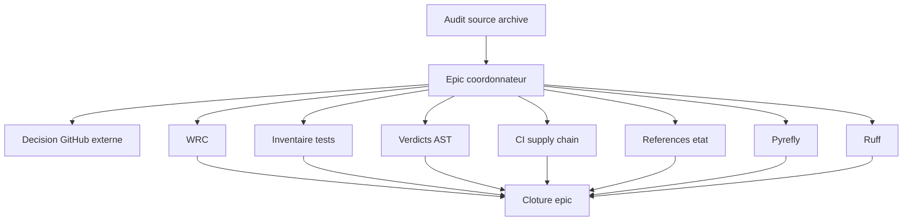

# EPIC — Durcissement post-audit face aux erreurs silencieuses d'IA

## 0. Bandeau de statut

| Question | Reponse |
| --- | --- |
| Un chantier actif couvre-t-il deja ce perimetre ? | Non. `.ai/checkpoint.json::active_workstream_id` vaut `null`. Le chantier historique `EPIC_ROBUSTESSE_GARDE_FOUS_AGENT_CODAGE` est `DONE` ; le present epic traite uniquement les residus identifies le 2026-08-08. |
| Un verrou de gouvernance actif bloque-t-il ce chantier ? | Non pour le routage. Chaque sous-chantier devra toutefois suivre son propre cycle gouverne avant toute implementation. |
| Une decision humaine explicite est-elle necessaire avant routage ? | Non. La commande humaine `/start` autorise l'audit et le routage, pas l'implementation ni les mutations GitHub externes. |
| Ce plan remplace-t-il un chantier existant ? | Non. Il prolonge sans rouvrir le chantier historique clos. |
| Resultat du test multi-lot | `MULTI_LOT`. Au moins deux composantes ont un critere de sortie independant, peuvent etre executees dans un autre ordre sans changer leur sens et peuvent avancer si une autre est bloquee. Le regroupement initial du « Lot 2 » echoue lui-meme a ce test ; il est donc decomposé en sous-chantiers atomiques. |

---

## Audit IA de promotion

- [x] Bootstrap et etat vivant lus : `AGENTS.md`, `.ai/README.md`, `.ai/checkpoint.json`, `Implementation/Active/HOOK.md`, `Implementation/Active/tracking.json`.
- [x] Gouvernance et workflows lus : `.ai/governance/AI_MODIFICATION_CHECKLIST.md`, `.ai/workflows/common/WORKFLOW.md`, `.ai/workflows/core-engine/WORKFLOW.md`.
- [x] Brouillon original conserve intact jusqu'a son archivage mecanique par `plan.ps1 start`.
- [x] Deux passes d'evaluation d'architecture ont converge.
- [x] Test `epic-orchestrator` applique avant le choix de structure.
- [x] Etat des lieux verifie contre le code et la suite complete (`Ran 242 tests ... OK`, 2026-08-08).
- [x] Autorites, perimetres, interdits, prerequis et preuves attendues sont explicites.
- [x] Aucune modification de `Protocole/` ni implementation n'est incluse dans ce `/start`.

### Journal de convergence de l'intake

| Passe | Verification | Correction apportee | Resultat |
| --- | --- | --- | --- |
| 1 | Confrontation de la Partie G au checkpoint, aux workflows, au template et au test multi-lot. | Remplacement du plan consolide a deux chantiers par un epic de coordination. Detection que le « Lot 2 » initial contient plusieurs sorties independantes et ne peut pas rester un chantier unique. | Nouvel angle mort majeur trouve puis corrige. |
| 2 | Relecture directe de `wrc.py`, des tests WRC, du workflow CI, du `pyproject.toml`, du notebook, des chemins d'etat et des litteraux de verdict ; execution de la suite complete. | Separation en sept sous-chantiers fermables independamment ; conservation du reglage GitHub comme action externe non autorisee par `/start` ; reformulation du controle WRC comme regression deterministe et non comme preuve universelle de calibration. | Aucun nouvel angle mort majeur ; convergence. |

## Triage

| Champ | Valeur |
| --- | --- |
| Track | `mainline` |
| Lifecycle | `TRIAGED` apres routage ; non executable tant que les sous-chantiers ne sont pas eux-memes routes, audites, baselines, executes et clos |
| Type de chantier | `MULTI_LOT` |
| Scope | Coordonner les protections retenues par l'audit du 2026-08-08 contre les faux succes, la suppression silencieuse de tests, les references mortes et les defauts de CI/outillage. |
| Non-goals | Aucune modification de `Protocole/`; aucune implementation dans ce chantier mere ; aucun outil ecarte par la Partie F ; aucun push ; aucune mutation GitHub externe sans autorisation distincte ; aucune modification de BACKTRADER. |
| Source | `0 - HUMAN START HERE/AUDIT_ROBUSTESSE_ARCHITECTURE_FACE_ERREURS_IA_2026-08-08.md`, Parties D a G, et commande humaine `/start` du 2026-08-08. |
| Exit criteria | Les dix sous-chantiers listes ci-dessous sont `DONE` dans `.ai/checkpoint.json`, l'action GitHub externe est soit prouvee realisee soit explicitement differee par decision humaine, la suite complete reste `OK`, et l'epic ne contient aucune implementation directe. |

## Sous-chantiers

| # | ID prevu | Titre |
| --- | --- | --- |
| 1 | PLAN_TESTS_WRC_CALIBRATION_METAMORPHIQUE | Calibration deterministe et proprietes metamorphiques du WRC |
| 2 | PLAN_CLIQUET_INVENTAIRE_TESTS | Cliquet mecanique d'inventaire des tests |
| 3 | PLAN_CONTRAT_EXIGENCES_GATES_TYPEES | Contrat type et fail-closed des exigences G0-G14 |
| 4 | PLAN_APPROBATION_LIVE_DERIVEE | Validation du verdict live et approbation signee derivee |
| 5 | PLAN_COHERENCE_VERDICTS_PERSISTES | Derivation et coherence transversale des verdicts persistes |
| 6 | PLAN_GARDE_LITTERAUX_VERDICT | Detection AST de recurrence apres correction des producteurs |
| 7 | PLAN_DURCISSEMENT_CI_SUPPLY_CHAIN | Durcissement minimal de la supply chain CI et hygiene du depot |
| 8 | PLAN_INTEGRITE_REFERENCES_ETAT | Integrite mecanique des chemins du checkpoint et du tracking |
| 9 | PLAN_PYREFLY_CI_NOTEBOOK | Pyrefly en CI et correction du notebook detecte |
| 10 | PLAN_RUFF_CI_BUGS_CIBLES | Ruff en CI avec ruleset bugs cible et correction des findings admis |

## Statut

| Champ | Valeur |
| --- | --- |
| Statut | `NON_DEMARRE` |
| Date de creation | 2026-08-08 |
| Date d'activation | - |
| Autorite normative | `Protocole/` reste l'autorite scientifique EBTA ; aucune evolution normative attendue. |
| Autorite executable | `Implementation/` traduit la norme ; `.ai/` coordonne seulement les workstreams. |
| Changement normatif attendu | Aucun. Toute decouverte exigeant un seuil ou une regle scientifique nouvelle bloque le sous-chantier et remonte a l'humain. |
| Dependances externes | GitHub pour les reglages de protection ; non modifies par ce `/start`. Ruff/Pyrefly ne sont autorises qu'en outillage CI/dev dans leurs futurs sous-chantiers. |

## Carte d'execution IA

| Champ | Contenu operationnel |
| --- | --- |
| Objectif executable | Router, executer et clore chaque sous-chantier dans son propre cycle, puis fermer cet epic de coordination. |
| Autorite et lecture minimale | `AGENTS.md` -> `.ai/README.md` -> checkpoint/hook/tracking -> brouillon source -> ce plan -> workflow du sous-chantier -> code reel concerne. |
| Perimetre autorise | Pour l'epic mere : ce fichier et les mutations de checkpoint produites par `plan.ps1`. Les fichiers techniques ne sont ouverts que par les plans enfants. |
| Interdits absolus | Implementer directement depuis l'epic ; fusionner deux sous-chantiers ; modifier `Protocole/`, BACKTRADER ou les schemas d'etat pour representer une relation parent/enfant ; executer les reglages GitHub sans autorisation distincte. |
| Phase de reprise | Phase 0 : obtenir ou constater la decision sur les reglages GitHub externes, puis rediger et auditer le sous-chantier 1. |
| Preuve attendue | Chaque ID enfant existe puis atteint `DONE` avec les preuves de son workflow ; JSON d'etat valides ; suite unittest complete `OK`. |
| Arret et escalade | Toute nouvelle decision statistique/normative, extension de perimetre, besoin de mutation externe non autorisee, ou non-convergence apres six passes. |

---

## 1. Role de ce document et non-objectifs

| Element | Role |
| --- | --- |
| `Protocole/` | Autorite scientifique, inchangee. |
| `Implementation/` | Runtime et tests a verifier dans les sous-chantiers techniques. |
| `.ai/checkpoint.json` | Etat machine des workstreams, sans relation parent/enfant ajoutee au schema. |
| Ce plan | Point d'ancrage narratif et ordre de coordination ; il ne code aucune protection. |

Non-objectifs :

- ne pas convertir l'audit en autorite normative ;
- ne pas rouvrir ni requalifier les chantiers historiques `DONE` ;
- ne pas installer les familles d'outils explicitement rejetees par l'arbitrage ;
- ne pas confondre un test deterministe sur seeds fixes avec une preuve universelle de validite statistique ;
- ne pas reduire la suite ou affaiblir un gate pour obtenir un resultat vert.

## 2. Contexte obligatoire a lire avant de coder

1. `AGENTS.md`, `.ai/README.md`, `.ai/checkpoint.json`.
2. Les chemins actifs declares par le checkpoint.
3. `.ai/governance/AI_MODIFICATION_CHECKLIST.md`.
4. `.ai/workflows/common/WORKFLOW.md`, puis `core-engine` si le lot touche `Implementation/` ou un gate executable.
5. Le present epic, le brouillon archive et le futur plan enfant concerne.
6. `Protocole/0-README - Comprendre et maintenir le protocole EBTA.md` et la SOP proprietaire seulement si le lot touche une assertion scientifique.

Hierarchie applicable :

```text
1. Protocole/ pour la doctrine scientifique
2. Decisions humaines journalisees
3. Plan enfant audite et baseline
4. Implementation/ et outillage executable
5. Cet epic de coordination
```

## 3. Etat des lieux

### Ce qui existe deja

| Element | Chemin | Etat verifie |
| --- | --- | --- |
| Suite canonique | `Implementation/ebta_engine/tests/` | 242 tests, `OK` le 2026-08-08. |
| WRC | `Implementation/ebta_engine/procedures/wrc.py` | Seed, bootstrap, p-value et verdict reels ; tests de reproductibilite presents, pas de controle de bruit ni de metamorphisme cible. |
| CI | `.github/workflows/ebta-runtime-suite.yml` | Exécute unittest et valide les deux JSON ; actions sur tags, permissions non minimales explicites, numpy/pandas non epingles. |
| Pyrefly | `pyproject.toml` | Interpreteur Windows Nautilus code en dur ; aucune execution CI. |
| References d'etat | `.ai/checkpoint.json`, `Implementation/Active/tracking.json` | Au moins les chemins morts consignes dans le brouillon restent presents. |
| Verdicts d'exemple | `Implementation/examples/minimal_pilot_pipeline/build_research_package.py` | `live_approval: True` et des `gate_reports` litteraux restent visibles dans le chemin actif. |

### Ce qui manque reellement

| Manque | Futur proprietaire |
| --- | --- |
| Regression statistique WRC reproductible et honnete sur sa portee | `PLAN_TESTS_WRC_CALIBRATION_METAMORPHIQUE` |
| Disparition de tests rendue visible | `PLAN_CLIQUET_INVENTAIRE_TESTS` |
| Truthiness generique des preuves G0-G14 remplacee par un contrat type et fail-closed | `PLAN_CONTRAT_EXIGENCES_GATES_TYPEES` |
| Verdict live et approbation signee derives d'une preuve validee | `PLAN_APPROBATION_LIVE_DERIVEE` |
| Verdicts recopies dans les artefacts persistants derives et recoupes | `PLAN_COHERENCE_VERDICTS_PERSISTES` |
| Nouveau verdict litteral dangereux bloque mecaniquement apres correction des producteurs | `PLAN_GARDE_LITTERAUX_VERDICT` |
| CI et supply chain minimales durcies | `PLAN_DURCISSEMENT_CI_SUPPLY_CHAIN` |
| References d'etat mortes detectees | `PLAN_INTEGRITE_REFERENCES_ETAT` |
| Pyrefly portable et execute en CI | `PLAN_PYREFLY_CI_NOTEBOOK` |
| Ruff cible sur les bugs et execute en CI | `PLAN_RUFF_CI_BUGS_CIBLES` |

## 4. Decision d'architecture

Principe : un epic narratif coordonne des workstreams atomiques ; chaque lot possede son propre audit, sa baseline, son diff, ses preuves et sa cloture.

Ce choix est impose par trois faits : les lots ont des sorties independantes ; le schema du checkpoint ne permet pas de lien parent/enfant ; un echec de CI, de chemin ou de lint ne doit pas contaminer la preuve d'un test scientifique distinct.



### Frontieres explicites

| Couche | Elle fait | Elle ne fait pas |
| --- | --- | --- |
| Epic | Ordonne, pointe, journalise les decisions et suit les statuts. | Ne modifie aucun code ni reglage externe. |
| Plans enfants | Definissent un scope ferme et une preuve propre. | Ne modifient pas l'epic en dehors du suivi convenu. |
| `plan.ps1` | Persiste les transitions et bloque la continuation/cloture de l'epic tant que les enfants ne sont pas `DONE`. | Ne prouve pas la veracite semantique des rapports. |

### Perimetre de fichiers explicite

Autorises pour ce chantier mere :

```text
.ai/backlog/mainline/EPIC_DURCISSEMENT_POST_AUDIT_ERREURS_IA.md
.ai/checkpoint.json                         [via plan.ps1 uniquement]
0 - HUMAN START HERE/archive/...            [archivage mecanique du brouillon]
```

Interdits pour ce chantier mere :

```text
Protocole/
Implementation/
.github/
pyproject.toml
.gitignore
.ai/checkpoint.schema.json
D:/TRADING/.../BACKTRADER/
GitHub settings / rulesets / secrets         [autorisation distincte requise]
```

## 5. Decoupage en phases

### Phase 0 - Decision externe GitHub

Objectif : rendre explicite le sort des reglages GitHub proposes sans les executer implicitement.

Classification : GOVERNANCE

Actions :

- demander ou constater une autorisation distincte avant toute mutation GitHub ;
- enregistrer `FAIT` avec preuve ou `DIFFERE` avec decision humaine dans ce plan.

Livrables :

- une decision tracee dans la section 9.

Critere de sortie :

- l'action externe est prouvee realisee ou explicitement differee ; aucun appel GitHub n'est deduit du `/start`.

### Phase 1 - Boucle des sous-chantiers

Objectif : traiter les dix workstreams sans les fusionner.

Classification : GOVERNANCE

Actions :

- revalider le constat du prochain lot contre le code vivant ;
- creer son brouillon propre, appliquer deux boucles `/evaluate`, router, baseliner, continuer, tester et clore ;
- reporter le statut et la preuve dans cet epic avant de passer au suivant.

Livrables :

- dix workstreams `DONE`, chacun avec son propre plan et ses preuves.

Critere de sortie :

- tous les IDs de `## Sous-chantiers` existent et ont `status: DONE` dans `.ai/checkpoint.json`.

### Phase 2 - Cloture consolidee

Objectif : verifier l'effet cumule sans fabriquer un succes global.

Classification : GOVERNANCE

Actions :

- executer la suite complete ;
- appliquer les audits de cloture requis sur l'union des fichiers touches depuis la baseline de l'epic ;
- verifier les JSON et la conformite aux Exit criteria.

Livrables :

- rapport consolide et section de cloture completee.

Critere de sortie :

- suite complete `OK`, JSON valides, aucun finding bloquant ouvert et epic clos via le workflow `common`.

## 6. Artefacts produits

| Etape | Artefact | Regle |
| --- | --- | --- |
| Routage | Ce plan et entree checkpoint | `common/WORKFLOW.md` |
| Chaque lot | Plan enfant, diff et preuves propres | `epic-orchestrator` + workflow applicable |
| Cloture | Etat machine et rapport consolide | Exit criteria de cet epic |

## 7. Invariants absolus et NO GO

### Invariants

1. `Protocole/` reste intact ; un seuil ou une nouvelle doctrine exige une decision humaine et un chantier normatif distinct.
2. Un test WRC sur seeds fixes est une regression deterministe, pas une certification universelle du taux d'erreur.
3. Chaque sous-chantier garde un diff, une baseline et une cloture propres.
4. Un resultat scientifique `FAIL` ou `INCONCLUSIVE` n'est jamais transforme en `PASS` pour satisfaire la CI.
5. Les references d'etat historiques explicitement rejetees ne sont pas falsifiees en chemins actifs ; leur absence doit etre representee honnêtement.

### NO GO

- Implementer un lot depuis ce plan mere.
- Fusionner deux IDs enfants dans un commit ou une cloture.
- Etendre le schema du checkpoint pour ajouter un parent.
- Executer `git push`, modifier un ruleset ou activer une protection GitHub sans autorisation distincte.
- Introduire `ruff --select ALL`, pytest, coverage, Dependabot ou les familles rejetees.
- Modifier BACKTRADER.
- Skipper ou affaiblir un test afin de rendre la suite verte.

## 8. Verification a chaque etape

Etat de reference :

```powershell
python -m unittest discover -s Implementation\ebta_engine\tests -t Implementation
# Attendu au routage : Ran 242 tests ... OK
```

Etat machine apres chaque transition :

```powershell
python -m json.tool .ai\checkpoint.json
python -c "import json, jsonschema; jsonschema.validate(json.load(open('.ai/checkpoint.json', encoding='utf-8')), json.load(open('.ai/checkpoint.schema.json', encoding='utf-8')))"
```

Hygiene du patch :

```powershell
git diff --check
```

Regle de progression : aucun lot suivant ne reprend le scope du precedent ; tout echec reste visible et bloque uniquement la cloture concernee.

Premier lot executable propose apres decisions et audits : `PLAN_TESTS_WRC_CALIBRATION_METAMORPHIQUE`.

## 9. Journal des decisions humaines

| Date | Decision | Portee |
| --- | --- | --- |
| 2026-08-08 | `/start` sur l'audit consolide. | Autorise audit, restructuration, archivage de l'intake et routage de l'epic ; n'autorise ni implementation ni mutation GitHub externe. |
| 2026-08-08 | Arbitrage conserve depuis la Partie F. | Rejette les familles d'outils et surcouches enumerees dans les Non-goals ; priorise la detection du faux succes. |
| 2026-08-09 | `AUDIT_ARCHITECTURE_D_ABORD`. | Autorise un audit cible en lecture seule de l'assemblage des verdicts et le redimensionnement narratif du lot 3 ; n'autorise aucune correction de `Implementation/`. |
| A trancher | Reglages GitHub externes. | Activer et prouver, ou differer explicitement ; aucune action implicite. |

## 10. Risques et blocages connus

| Risque | Impact | Mitigation |
| --- | --- | --- |
| Sur-fragmentation documentaire | Plus de gouvernance que de protection executable. | Plans enfants concis, atomiques ; mesurer a la cloture les lignes de tests/outillage contre les mutations `.ai/`. |
| Test WRC sur-calibre sur des seeds | Faux sentiment de garantie statistique. | Nommer la preuve « regression deterministe » et faire valider toute nouvelle assertion normative. |
| Scanner AST trop large ou trop faible | Bruit ou faux negatifs. | Allowlist annotee, fixtures positives et negatives, scope exact dans le plan enfant. |
| CI partagee modifiee par plusieurs lots | Conflits de diff. | Baselines sequentielles et relecture du fichier vivant avant chaque enfant. |
| Reglages GitHub non representes dans git | Cloture non reproductible. | Preuve externe ou decision `DIFFERE`, jamais supposition. |

## 11. Definition of Done

- [ ] Decision GitHub externe tracee comme realisee avec preuve ou explicitement differee.
- [ ] Les dix sous-chantiers existent et sont `DONE`.
- [ ] Chaque sous-chantier a suivi ses deux boucles d'evaluation, sa baseline et son workflow complet.
- [ ] Les audits `bug-hunter`, `adversarial-tester` et `plan-conformance-audit` requis sont reels et sans finding bloquant.
- [ ] La suite unittest complete est `OK` apres le dernier lot.
- [ ] `.ai/checkpoint.json` et `Implementation/Active/tracking.json` sont valides si touches.
- [ ] Aucun fichier hors perimetre des plans enfants n'a ete modifie.
- [ ] Aucun changement de `Protocole/`, aucune mutation BACKTRADER et aucun push automatique.
- [ ] Le ratio de cout de gouvernance signale par la dissidence de la Partie F est mesure et consigne honnêtement.

## 12. Cloture

| Champ | Valeur |
| --- | --- |
| Resultat final | A renseigner apres fermeture de tous les enfants. |
| Ecarts par rapport au plan initial | La promotion a remplace deux lots techniques composites par sept sous-chantiers atomiques ; l'audit d'architecture du 2026-08-09 a ensuite remplace l'ancien lot 3 composite par quatre workstreams, portant le total a dix. |
| Suites a prevoir | Aucune tant que les sous-chantiers ne sont pas routes individuellement. |

## 13. Journal d'audits post-route

| Passe | Verification | Resultat |
| --- | --- | --- |
| 1 | Relecture du plan normalise contre `epic-orchestrator`, `plan.ps1` et le checkpoint vivant. | Structure `MULTI_LOT` confirmee ; sept IDs enfants bien distincts ; aucune activation directe du parent autorisee avant leur cloture. Aucun nouvel angle mort majeur. |
| 2 | Revalidation du premier lot contre la SOP 02, `procedures/wrc.py`, `bootstrap.py` et `test_procedure_wrc.py`, avec simulations nulles exploratoires hors artefact. | Nature `TEST_FIXTURE` confirmee. Le test devra distinguer strictement regression deterministe et certification statistique ; les runs EBTA reels conservent `alpha=0,05` et `B=5000`. Aucun nouvel angle mort majeur. Convergence. |

## 14. Suite immediate

| Champ | Valeur |
| --- | --- |
| Parent | `BASELINED`, sans appel `continue` direct tant que les enfants ne sont pas tous `DONE`. |
| Enfants clos | Sous-chantiers 1 a 9 — `DONE` ; suite portee a 291 tests `OK`. Pyrefly CI equivalent retourne 0 erreur. |
| Prochain enfant | `PLAN_RUFF_CI_BUGS_CIBLES` — `A_ROUTER` |
| Action | Auditer les 26 findings Ruff avec le ruleset cible `F,E9,B,PLE,RUF`, classifier chaque signal et limiter les corrections aux bugs admis. |
| Blocage | Aucun `--select ALL`, nettoyage stylistique massif ou auto-fix aveugle ; chaque finding doit etre classe avant modification. |

### Suivi des sous-chantiers

| # | ID | Etat | Preuve / suite |
| --- | --- | --- | --- |
| 1 | `PLAN_TESTS_WRC_CALIBRATION_METAMORPHIQUE` | `DONE` | Trois regressions, 245 tests `OK`, Pyrefly 0, adversarial 3/3. |
| 2 | `PLAN_CLIQUET_INVENTAIRE_TESTS` | `DONE` | 246 IDs tries/uniques, garde auto-inclusif, adversarial 3/3. |
| 3 | `PLAN_CONTRAT_EXIGENCES_GATES_TYPEES` | `DONE` | Contrat `identifier` / `verdict_pass` / `boolean_true`, fixture normalisee, 253 tests `OK`, Pyrefly 0, adversarial 7/7. |
| 4 | `PLAN_APPROBATION_LIVE_DERIVEE` | `DONE` | Verdict live exact, preuve liee au `live_version_id`, literals supprimes, 259 tests `OK`, Pyrefly 0, adversarial 10/10. |
| 5 | `PLAN_COHERENCE_VERDICTS_PERSISTES` | `DONE` | Helper unique, INV-010 et recoupement WRC/economic/invariant ; 266 tests `OK`, Pyrefly 0, adversarial sans faux succes. |
| 6 | `PLAN_GARDE_LITTERAUX_VERDICT` | `DONE` | Garde exact-key 32/32, allowlist annotee, nouveau/stale/parse bloquants ; 274 tests `OK`, Pyrefly 0. |
| 7 | `PLAN_DURCISSEMENT_CI_SUPPLY_CHAIN` | `DONE` | Coordinateur clos apres 7A/7B ; actions sur SHA, permissions read-only, pins directs, gitignore racine minimal ; 284 tests `OK`. |
| 8 | `PLAN_INTEGRITE_REFERENCES_ETAT` | `DONE` | Deux pointeurs archives corriges, garde fail-closed a chaque commit, exception RAG exacte ; 289 tests `OK`. |
| 9 | `PLAN_PYREFLY_CI_NOTEBOOK` | `DONE` | Pyrefly 1.1.1 CI portable, notebook corrige sans artefact durable ; 291 tests `OK`. |
| 10 | `PLAN_RUFF_CI_BUGS_CIBLES` | `A_ROUTER` | En attente. |

### Decision humaine du 2026-08-09 et resultat de l'audit du lot 3

Le seuil de la Partie F de l'audit source est atteint : si l'inventaire des
litteraux remonte plus d'environ 20 occurrences au premier passage, le sujet
n'est plus seulement la surveillance ; l'architecture d'assemblage doit etre
reconsideree avant d'ajouter le test.

Verification directe du 2026-08-08 :

- 24 affectations directes `True`/`"PASS"` vers des noms ou cles sensibles
  (`gate`, `verdict`, `status`, `pass`, `approval`, `attestation`,
  `evidence`, `invariant`) hors tests/venv/fixtures ;
- 3 `"PASS"` supplementaires sous le dictionnaire sensible `gate_reports`
  de `Implementation/examples/minimal_pilot_pipeline/build_research_package.py:657-660` ;
- total de premier passage : 27 candidats a trier, avant meme la conception
  d'une allowlist ;
- deux `live_approval: True` actifs sont confirmes dans le meme exemple
  (lignes 614 et 1092 dans l'etat courant).

Arbitrage necessaire :

1. `AUDIT_ARCHITECTURE_D_ABORD` — remplacer la suite immediate par un audit
   cible de l'assemblage des verdicts, puis redimensionner le lot 3 ;
2. `GARDE_AST_MAINTENANT` — accepter explicitement le lot scanner + allowlist
   malgre le seuil depasse, avec tri individuel des 27 candidats ;
3. `DIFFERER_LOT_3` — conserver ce blocage et autoriser le passage au lot 4.

Aucune de ces decisions n'est deduite automatiquement.

Decision recue le 2026-08-09 : `AUDIT_ARCHITECTURE_D_ABORD`.

L'audit cible en quatre passes est consigne dans
`0 - HUMAN START HERE/AUDIT_ROBUSTESSE_ARCHITECTURE_FACE_ERREURS_IA_2026-08-09.md`.
Il classe 22 des 27 occurrences comme calculs derives, attentes de contrat,
fixtures, attestations techniques, constantes humaines documentees ou
evenements structurels. Cinq literals restent des faux succes actifs, mais
trois defauts de contrat plus larges rendent un simple garde AST insuffisant :

1. `gate_validator.py` accepte `REJECTED_ECONOMIC`, `NOT_VALIDATED`, `DENIED`
   et toute chaine inconnue non vide comme preuve satisfaite ;
2. un verdict live soumis `FAIL` produit encore `deployment_gate PASS` et
   `G13 PASS` parce que le verdict est ignore et `live_approval=True` injecte ;
3. INV-010 accepte trois `PASS` litteraux meme quand le rapport economique est
   `REJECTED_ECONOMIC`.

Conclusion d'architecture : l'ancien lot 3 est remplace par quatre
workstreams atomiques 3A a 3D. Les trois corrections de producteurs et de
contrats sont maintenant closes ; le prochain cycle gouverne porte le garde
AST `PLAN_GARDE_LITTERAUX_VERDICT`.
