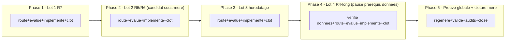

# Plan - Chantier mere : maturite du moteur EBTA pour une vraie campagne de recherche

> Chantier mere de **suivi**, pas d'implementation directe - structure selon
> `.agents/skills/epic-orchestrator/SKILL.md` (test de detection multi-lot
> applique et documente section 0), meme patron que
> `EPIC_ATTESTATIONS_RESIDUELLES_R3` (`DONE`, commit `0bfd32e`) et
> `EPIC_CLOTURE_ATTESTATIONS_RESIDUELLES_GATES` (`DONE`, commit `063246b`). Il
> ne modifie aucun fichier de `Implementation/` lui-meme ; il coordonne quatre
> sous-chantiers distincts (R7, R5/R6, horodatage/attestations, R4-long),
> chacun route, audite, implemente et clos independamment via son propre cycle
> `/start` -> `/evaluate` x2 -> baseline -> `/continue` -> bug-hunter +
> conformance -> `/close`. Redige a partir de la note d'intake
> `0 - HUMAN START HERE/EPIC_MATURITE_MOTEUR_CAMPAGNE_RECHERCHE.md` (contenu de
> fond preserve, structure reformattee selon
> `.ai/backlog/TEMPLATE_PLAN_IMPLEMENTATION.md`). Boucle `/evaluate`
> (code-architecture-evaluator) executee et convergee sur la note d'intake en
> 2 passes le 2026-07-20 - voir section 10.

---

## 0. Bandeau de statut (a verifier avant toute promotion)

| Question | Reponse |
| --- | --- |
| Un chantier actif couvre-t-il deja ce perimetre (`DONE`, `ACTIVE`, ou `SUPERSEDED`) ? | Non. `.ai/checkpoint.json::active_workstream_id` est `null`. Les EPIC C/A2/B et R3 sont `DONE` mais couvraient les attestations residuelles de gates, pas R5/R6/R7/R4-long ni la reproductibilite/le realisme economique. |
| Un verrou de gouvernance actif bloque-t-il ce chantier ? | Non pour ce chantier mere de suivi. NB : R5/R6 (Lot 2) et R4-long (Lot 4) touchent le realisme d'execution/couts et introduisent potentiellement des dependances de donnees ; ces decisions de seuil/methode sont deferees au `/start` de chaque lot (section 10), pas ici. Nautilus reste confine a la frontiere adapter (decision D1-D6 deja actee, pivot `DONE`). |
| Ce plan a-t-il besoin d'une decision humaine explicite pour lever ce verrou avant d'etre routable via `/start` ? | Non pour le routage de ce chantier mere. Les decisions de seuil de calibration (R5), de magnitude de stress (R6) et de perimetre d'attestations (Lot 3) restent a trancher au `/start` du lot concerne. |
| Ce plan remplace-t-il un document ou chantier existant ? | Non. Il poursuit la lignee mainline R1/R2/R4 en levant les risques `OUVERT`/`PARTIEL` de l'audit de maturite, sans rouvrir aucun chantier `DONE`. |

### Test de detection multi-lot (`.agents/skills/epic-orchestrator/SKILL.md`)

Applique explicitement (obligatoire au `/start`, pas laisse implicite).
Verdict : **MULTI_LOT, ce skill s'applique** - les quatre lots satisfont les
trois conditions :

1. **Exit criteria independants** : chaque lot a un critere de sortie
   verifiable sur lui-meme. R7 (data root parametrable + hash reel) se prouve
   seul ; R5/R6 (couts calibres + stress echouable) se prouve seul ;
   l'horodatage se prouve seul ; R4-long (benchmark documente) se prouve seul.
2. **Ordre non contraint par le SENS** : reordonner ne change le sens ni la
   cloture d'aucun lot pris isolement. L'ordre retenu (section 4) est une
   optimisation de qualite de preuve, avec UNE dependance reelle assumee
   (R4-long adosse sa valeur a R7) ; au moins deux lots (R7, horodatage) sont
   pleinement independants de tous les autres, le test est satisfait.
3. **Blocage non contaminant** : une pause sur un lot (ex. decision de seuil
   R6) n'empeche pas les autres d'avancer (regle anti-stagnation, section 4).

Consequence mecanique (`.agents/skills/epic-orchestrator/SKILL.md`, "Contrainte
structurelle") : chaque lot devient son propre workstream distinct, route par
son propre `plan.ps1 start`, avec `-Reason` commencant par `"Sous-chantier
<n>/4 de EPIC_MATURITE_MOTEUR_CAMPAGNE_RECHERCHE"`. Aucun
`parent_workstream_id` dans `.ai/checkpoint.schema.json` (lien narratif). Ce
chantier mere ne code et n'implemente rien lui-meme.

**Recursion assumee** : un lot peut lui-meme s'averer multi-lot a son
ouverture (deja arrive : R3 est devenu mere de D/E/F). Le test se rejoue a
chaque niveau ; si un lot se scinde, il devient a son tour une mere routee
normalement, `checkpoint.json` reste plat, sans nesting preventif. Lot 2
(R5/R6) est le candidat sous-mere le plus probable (split R5 / R6 decide a son
ouverture, pas ici).

---

## Audit IA de promotion

- [x] Plan relu dans le contexte du cockpit actif (`AGENTS.md`, `.ai/README.md`, `.ai/checkpoint.json`, `Implementation/Active/HOOK.md`).
- [x] Bandeau de statut (section 0) rempli et verifie contre l'etat machine reel (`active_workstream_id = null`, tous workstreams `DONE`).
- [x] Ce plan est ECRIT COMME NOUVEAU FICHIER dans `.ai/backlog/mainline/` ; le brouillon original `0 - HUMAN START HERE/EPIC_MATURITE_MOTEUR_CAMPAGNE_RECHERCHE.md` sera archive tel quel par `plan.ps1 start`.
- [x] Chantier classe `mainline` (construit la capacite de campagne manquante, continuation de la lignee R1/R2/R4 ; distinct des EPIC `fix` qui corrigeaient des facades) - justification section 4.
- [x] Autorite normative identifiee : `Protocole/PROTOCOLE EBTA.md`, SOP 05 (robustesse pre-OOS), SOP 09B (modele d'execution/frictions/couts), SOP 12 (reproductibilite/scellement) - gelees, non modifiees par ce chantier ni par ses sous-chantiers.
- [x] Perimetre de fichiers autorises/interdits explicite (section 4) : ce chantier mere ne modifie AUCUN fichier de `Implementation/` - seuls les sous-chantiers le font.
- [x] Aucune modification hors perimetre requise pour activer ce chantier mere.
- [x] Prerequis factuels identifies (section 3 et 10) : constats R5/R6/R7 verifies dans le code le 2026-07-20 ; disponibilite des donnees longues (R4-long) et recreabilite du venv (R7) a statuer a l'ouverture du lot concerne.
- [x] Etat des lieux (section 3) verifie directement dans le code (`local_ohlcv.py:17`, `nautilus_research_package.py:80`/`:355`/`:371-372`/`:569-594`), pas suppose.

## Triage

| Champ | Valeur |
| --- | --- |
| Track | `mainline` |
| Lifecycle | `TRIAGED` |
| Type de chantier | `MULTI_LOT` - verdict motive section 0 ("Test de detection multi-lot"). |
| Scope | Chantier mere de suivi (aucune modification directe de `Implementation/`) coordonnant quatre sous-chantiers independants - R7 (reproductibilite operationnelle), R5/R6 (realisme des couts + stress de robustesse reel), horodatage transversal / attestations, R4-long (benchmark donnees longues + scalabilite du runner) - jusqu'a ce que le moteur EBTA soit reproductible, calibre, stresse et valide a l'echelle campagne, cloturant le sujet "pret pour une vraie campagne de recherche". |
| Non-goals | Ne pas rouvrir R1/R2/R4, le WRC masque, le statut global package, G5, ni les attestations C/A2/B/R3 deja `DONE`. Ne pas exiger un package global `PASS` comme condition de succes (un `FAIL`/`INCONCLUSIVE` reel reste un verdict EBTA legitime : c'est la CAPACITE demontree qui clot le sujet). Ne pas modifier `Protocole/`. Ne pas fusionner deux lots dans un commit/boucle `/evaluate`/cloture. Ne pas etendre `.ai/checkpoint.schema.json` (pas de `parent_workstream_id`). Ne pas construire un vrai cycle live/kill-switch/monitoring (R10, hors perimetre "recherche" - voir section 4). Ce document ne code rien lui-meme. |
| Source | Demande humaine du 2026-07-20 : mettre en place un chantier multi-lot couvrant tous les travaux restants de l'audit de maturite `0 - HUMAN START HERE/AUDIT_MATURITE_MOTEUR_RECHERCHE_2026-07-13.md` (Partie A, section 3), pour cloturer le sujet principal sans re-demander la suite a chaque session. Note d'intake convergee en 2 passes `/evaluate` : `0 - HUMAN START HERE/EPIC_MATURITE_MOTEUR_CAMPAGNE_RECHERCHE.md` (avant archivage par ce `/start`). |
| Exit criteria | (1) Lot 1 R7 `DONE`. (2) Lot 2 R5/R6 `DONE` (ou clos via ses propres sous-chantiers s'il devient mere). (3) Lot 3 horodatage/attestations `DONE` (l'horodatage UTC automatique des jalons vises est prouve par la cloture propre du Lot 3 et son test - visible dans le package pour les jalons qui y figurent, ex. scellement, sans exiger que TOUS les jalons Lot 3 soient package-visibles) ou explicitement differe par decision humaine documentee (section 10). (4) Lot 4 R4-long `DONE`. (5) Preuve globale concrete package-visible : un package de recherche (le `nautilus_mvp` regenere et/ou un package benchmark sur donnee longue) passe `validate_package_dir()` avec preuve documentee que, sur le chemin de production reel : (a) le data root est parametrable et `document_hash` n'est plus le placeholder litteral (R7) ; (b) couts/slippage/latence calibres non nuls et scenarios de robustesse reellement differents et capables d'echouer, un test de contraste le prouve (R5/R6) ; (c) rapport de budget benchmark (temps, memoire, ordres, exposition OOS) existant pour au moins la fenetre longue ciblee (R4-long) ; et CHAQUE gate affiche un verdict reel derive, aucune facade `True` codee en dur ne subsistant dans le perimetre des quatre lots. Le statut global peut rester `FAIL`. (6) Ce chantier mere clos (`plan.ps1 close`) seulement quand (1)-(5) sont satisfaits. |

## Sous-chantiers

> Obligatoire (`MULTI_LOT`). `plan.ps1 continue`/`close` refusent de s'executer
> sur CE chantier mere tant qu'un des ID ci-dessous n'est pas `DONE` dans
> `.ai/checkpoint.json`. Le `/start` reel de chaque lot DOIT utiliser
> exactement ces ID. Si Lot 2 devient un sous-chantier mere,
> `PLAN_REALISME_ECONOMIQUE_R5_R6` reste l'ID a atteindre `DONE` (via sa propre
> cloture generale). La preuve globale (Exit criteria (5)) est l'activite de
> cloture propre de ce chantier mere, pas un lot independant, donc absente de
> cette liste.

| # | ID prevu | Titre |
| --- | --- | --- |
| 1 | PLAN_REPRODUCTIBILITE_OPERATIONNELLE_R7 | Lot 1 - R7 data root parametrable, hash de config reel, doc environnement Nautilus |
| 2 | PLAN_REALISME_ECONOMIQUE_R5_R6 | Lot 2 - R5 couts/slippage/latence calibres et R6 stress de robustesse reel |
| 3 | PLAN_HORODATAGE_TRANSVERSAL_ET_ATTESTATIONS | Lot 3 - horodatage UTC automatique des jalons et attestations humaines/post-OOS explicites |
| 4 | PLAN_BENCHMARK_DONNEES_LONGUES_R4_LONG | Lot 4 - benchmark 1 mois/3 mois/1 an, budget et scalabilite du runner |

## Statut

| Champ | Valeur |
| --- | --- |
| Statut | `EN_COURS - LOTS 1 A 4 DONE; PREUVE GLOBALE BLOQUEE PAR ABSENCE DE PREUVES HUMAINES EXTERNES` |
| Date de creation | 2026-07-20 |
| Date d'activation | - |
| Autorite normative | `Protocole/PROTOCOLE EBTA.md` ; SOP 05 (robustesse pre-OOS, Lot 2/R6) ; SOP 09B (modele d'execution/frictions/couts, Lot 2/R5) ; SOP 12 (reproductibilite/scellement, Lot 1/R7) - gelees, non modifiees par ce chantier |
| Autorite executable | Deleguee aux sous-chantiers. Chemins pressentis : `Implementation/ebta_engine/data/local_ohlcv.py` et `package_builder/nautilus_research_package.py` (R7) ; `risk/robustness.py`, `adapters/nautilus_mapping.py`, `strategies/contracts.py` (R5/R6) ; producteurs d'evenements de jalons (Lot 3) ; `data/` + runner (R4-long) |
| Changement normatif attendu | Aucun - application de regles deja normatives (SOP 09B exige des frictions d'execution explicites ; SOP 05 exige des scenarios de stress reels ; SOP 12 exige la reproductibilite), pas de nouvelle regle |
| Dependances externes | Aucune nouvelle pour ce chantier mere. Chaque sous-chantier documente les siennes (donnees longues pour R4-long ; venv Nautilus pour R7). |

## Carte d'execution IA (lecture prioritaire pour `/continue`)

| Champ | Contenu operationnel |
| --- | --- |
| Objectif executable | Router, coordonner et clore successivement les quatre lots, puis prouver globalement la capacite de campagne (Exit criteria (5)), sans coder dans ce document. |
| Autorite et lecture minimale | Lire `AGENTS.md`, `.ai/README.md`, `.ai/checkpoint.json`, ce plan, puis `.agents/skills/epic-orchestrator/SKILL.md` (procedure "Boucle par lot"), puis le plan de chaque lot au moment ou il est route. `Protocole/` et les SOP citees priment. |
| Perimetre autorise | Ce chantier mere ne modifie que lui-meme (mise a jour de statut apres chaque cloture de lot). Chaque sous-chantier porte son propre perimetre ferme. |
| Interdits absolus | Ne pas modifier `Protocole/` ni `Implementation/` depuis ce document ; ne pas fusionner deux lots ; ne pas construire R10 (live) ; ne pas exiger un package `PASS`. |
| Phase de reprise | Phase 5 - obtenir deux preuves humaines externes valides (revue independante du registre puis approbation du scellement pre-OOS), regenerer `nautilus_mvp`, valider et auditer la cloture. |
| Preuve attendue | Chaque lot `DONE` dans `.ai/checkpoint.json` ; puis la preuve globale de l'Exit criteria (5) (package regenere + `validate_package_dir()` + rapport gate-par-gate + budget benchmark). |
| Arret et escalade | S'arreter pour demander une decision humaine sur : les seuils de calibration R5, la magnitude de stress R6, le perimetre des attestations Lot 3, ou si un prerequis factuel (donnees longues, venv) s'avere manquant/bloquant. Ne jamais inventer un seuil ou une methode. |

---

## 1. Role de ce document et non-objectifs

| Element | Role |
| --- | --- |
| `Protocole/PROTOCOLE EBTA.md` + SOP 05/09B/12 | Autorite normative (robustesse, execution/couts, reproductibilite). Inchangee. |
| `Implementation/ebta_engine/` | Traduction executable - modifiee uniquement par les sous-chantiers, chacun dans son perimetre propre. |
| `0 - HUMAN START HERE/AUDIT_MATURITE_MOTEUR_RECHERCHE_2026-07-13.md` | Source des constats (INTAKE, non normatif). Cite comme source, jamais comme autorite. |
| `Implementation/research_packages/nautilus_mvp` (et/ou un package benchmark) | Artefact de preuve global final (Exit criteria (5)). |
| Ce document | Carte de coordination : ordre des lots, decisions actees, mecanisme de suivi sans modification de schema. Ne code rien. |

Non-objectifs :

- ne pas reecrire `Protocole/` ni les SOP citees ;
- ne pas introduire de regle, seuil, ou verdict absent des autorites normatives citees par chaque sous-chantier ;
- ne pas transformer ce document en un cinquieme sous-chantier d'implementation - il reste un document de suivi pur ;
- ne pas faire de la preuve globale (Exit criteria (5)) une condition de succes garanti `PASS` - un statut reel `FAIL`/`INCONCLUSIVE` apres correction est un succes du chantier ;
- ne pas construire R10 (cycle live/kill-switch/monitoring reel) : recherche != deploiement.

---

## 2. Contexte obligatoire a lire avant de coder

1. `AGENTS.md`, `.ai/README.md`, `.ai/checkpoint.json`, `Implementation/Active/HOOK.md` - etat machine courant (aucun workstream actif).
2. `.agents/skills/epic-orchestrator/SKILL.md` - procedure "Boucle par lot" et regle de blocage, appliquees a chaque lot.
3. `0 - HUMAN START HERE/archive/<date>_EPIC_MATURITE_MOTEUR_CAMPAGNE_RECHERCHE.md` (apres archivage) - la note source, notamment sections 2 (arbitrages), 4 (etat des lieux verifie), 5 (recursion).
4. `0 - HUMAN START HERE/AUDIT_MATURITE_MOTEUR_RECHERCHE_2026-07-13.md` - Partie A (sections 2 a 4) pour la matrice fait/partiel/ouvert et les priorites.
5. `.ai/archive/20260720_EPIC_ATTESTATIONS_RESIDUELLES_R3.md` - patron de chantier mere multi-lot deja clos (reference de forme, y compris la recursion D/E/F).
6. `Protocole/` : SOP 05 (robustesse), SOP 09B (execution/couts), SOP 12 (reproductibilite) - lues au `/start` du lot concerne.
7. Le plan restructure de chaque sous-chantier, au moment ou il est route (pas a l'avance).

**Hierarchie d'autorite** :

```text
1. Protocole/MANIFESTE DE GEL EBTA.md
2. Protocole/PROTOCOLE EBTA.md
3. Protocole/REGISTRE DES DECISIONS NORMATIVES EBTA.md
4. SOP 01-13 (selon le lot : SOP 12 pour R7 ; SOP 09B pour R5 ; SOP 05 pour R6)
5. Protocole/PAQUET D'EXECUTION EBTA.md
6. Implementation/ (dont ce plan et ses sous-chantiers)
7. Adaptateurs externes (NautilusTrader)
```

Regle : si le code contredit l'autorite normative, c'est le code qui a tort.
Si une regle manque, le systeme bloque ou retourne un statut explicite plutot
que de deviner.

---

## 3. Etat des lieux (avant/apres) - reutiliser avant de recreer

### 3.1 Constats initiaux verifies dans le code (2026-07-20)

Reverifies directement (pas herites de l'audit du 2026-07-13) :

| Constat | Preuve code | Lot |
| --- | --- | --- |
| Data root = chemin Windows absolu en dur | `Implementation/ebta_engine/data/local_ohlcv.py:17` (`DEFAULT_DATA_ROOT = Path(r"D:\TRADING\...\Data")`) | R7 |
| Hash de config = placeholder litteral | `package_builder/nautilus_research_package.py:80` (`"document_hash": "NAUTILUS_MVP_CONFIG_HASH_PLACEHOLDER"`) | R7 |
| venv Nautilus local, non suivi par git, a documenter/recreer | `Implementation/adapters/nautilus_env/` | R7 |
| Frais indicatifs, slippage nul | `nautilus_research_package.py:355` (`prob_slippage=0.0`), `:371-372`/`:389-390` (`maker_fee="0.0002"`, `taker_fee="0.0005"`) | R5 |
| Trois scenarios de robustesse identiques, seuil `-1.0` jamais echouable | `nautilus_research_package.py:569-594` : CENTRAL/PLAUSIBLE/EXTREME, tous `minimum_mean_return: -1.0`, seul le label et `blocking` different, aucun choc applique | R6 |
| Downsampling / fenetre courte, donnees longues non exploitees | audit H1 (`_daily_sample`, ~7 barres) - a reverifier a l'ouverture du Lot 4 | R4-long |

Etat actuel apres Lot 1 : les trois lignes R7 ci-dessus sont historiques.
`PLAN_REPRODUCTIBILITE_OPERATIONNELLE_R7` est `DONE` (commits `683e5fe` et
`7636c73`) : resolver argument/`EBTA_DATA_ROOT`/fallback teste, hash SHA-256
reel de `config.json`, venv recreable documente, suite 179 tests PASS.

Etat actuel apres Lot 4 : `PLAN_BENCHMARK_DONNEES_LONGUES_R4_LONG` est
`DONE` (commits `e5fb08c` et `251f700`). Le rapport canonique 1/3/12 mois est
`COMPLETED` : 1 an charge 1 019 520 barres, execute 46 080 bar-evaluations
sur 5 760 timestamps Test uniques, produit 28 ordres, atteint 995 188 736
octets de peak RSS et expose zero OOS. La ligne R4-long ci-dessus est donc
historique; sa limite restante (splitter fixe, couverture 0,56 %) est mesuree,
pas masquee, et toute decision scientifique de calendrier reste hors Lot 4.

### 3.2 Ce qui existe deja et doit etre reutilise (pas duplique)

| Module | Chemin | Role reel | Reutilisation |
| --- | --- | --- | --- |
| `risk/robustness.py` | `Implementation/ebta_engine/risk/robustness.py` | Evalue deja `minimum_mean_return`/`maximum_total_costs` par scenario (SOP 05). Le calcul est reel ; ce sont les scenarios (seuil `-1.0`, pas de choc) qui sont inertes. | R6 : reutiliser le moteur d'evaluation, remplacer les scenarios inertes |
| `adapters/nautilus_mapping.py` | idem | Mappe deja `maker_fee`/`taker_fee`/`prob_slippage`/`latency_nanos` vers Nautilus (`:71-180`). Le cablage existe ; ce sont les valeurs qui sont indicatives/nulles. | R5 : reutiliser le mapping, calibrer les valeurs sources |
| `strategies/contracts.py` | idem | `CostModel`/`FeeModel` portent deja `slippage_bps`, `prob_slippage`, `maker_fee`, `taker_fee`, `latency_nanos`. | R5 : reutiliser les contrats existants |
| Patron Lot F (R3) : capture UTC automatique au scellement | `.ai/archive/20260720_PLAN_CORRECTION_INVARIANT_EVIDENCE_LOT_F.md` | A pose le patron "capture UTC en production, horloge injectee en fixture" pour `pre_oos_sealed_at`. | Lot 3 : generaliser ce patron aux autres jalons |
| `validators/package_validator.py::validate_package_dir()` | idem | Produit deja le verdict global gate-par-gate et l'echec honnete. | Preuve globale (Exit criteria (5)) : reutiliser tel quel |

### 3.3 Ce qui manque reellement (par lot, a reverifier a l'ouverture)

| Brique manquante | Module pressenti | Lot |
| --- | --- | --- |
| Data root injectable (parametre/variable d'environnement) + hash de config reel calcule au lieu du placeholder | `local_ohlcv.py`, `nautilus_research_package.py`, doc venv | R7 |
| Parametres de couts/slippage/latence calibres et sources (au lieu d'indicatifs/nuls) | scenarios de couts dans `nautilus_research_package.py`, `strategies/contracts.py` | R5 |
| Scenarios de robustesse appliquant de vrais chocs differencies (cout, slippage, latence, fills, donnees) et un seuil `minimum_mean_return` reel echouable | `_nautilus_robustness_grid()` + `risk/robustness.py` | R6 |
| Horodatage UTC automatique generalise aux jalons methodologiques au-dela du scellement, et attestations humaines/post-OOS explicitees | producteurs d'evenements de jalons | Lot 3 |
| Chargement de donnees longues + validateur qualite CSV M1 + rapport de budget (temps/memoire/ordres/exposition) + eventuel runner in-process | `data/`, runner de segment | R4-long |

Chaque brique est reverifiee dans le code reel a l'ouverture de son lot
(etape 1 de la boucle epic-orchestrator) : la nature peut avoir change.

---

## 4. Decision d'architecture

Principe directeur : ce chantier mere ne fait que **coordonner**, jamais
**implementer**. Chaque sous-chantier reste seul responsable de son perimetre
de fichiers, de sa boucle `/evaluate`, de sa preuve de non-regression -
exactement comme les sous-chantiers des EPIC C/A2/B et R3.

**Pourquoi `mainline` et pas `fix`** : les EPIC precedents (C/A2/B, R3)
etaient `fix` parce qu'ils **corrigeaient des facades** (attestations codees a
`True`). Ce chantier **construit la capacite scientifique manquante** (couts
reels, stress reel, reproductibilite, validation a l'echelle campagne) : c'est
la continuation directe de la lignee mainline R1/R2/R4 (`advances_mainline:
true`), pas une correction de bug masque. La question qui le definit ("le
moteur est-il pret pour une vraie campagne ?") est une question d'avancement
de la mainline. Le track de CHAQUE lot est decide a son propre `/start` (R7 et
l'horodatage peuvent etre `fix` ; R5/R6 et R4-long sont `mainline`).

**Pourquoi cet ordre (R7 -> R5/R6 -> Lot 3 -> R4-long)** : enabler -> coeur
scientifique -> gouvernance -> validation. R7 d'abord car l'audit le qualifie
"independant, rapide, gros gain" et parce qu'il est le prerequis dur d'un
benchmark portable (R4-long) et ameliore l'integrite des preuves de tous les
lots. R5/R6 ensuite car c'est le plus gros trou scientifique (le gate de
robustesse ne peut structurellement pas echouer aujourd'hui), fait sur une
base reproductible. R4-long en dernier car il consomme R5 (perf/couts) et R7
(portabilite).

**Regle anti-stagnation** (sert l'objectif "ne plus revenir demander la
suite") : si un lot se met en pause sur une decision humaine (section 10),
l'ordre par defaut cede - le prochain lot INDEPENDANT dont la qualite de
preuve ne se degrade pas d'etre avance peut etre execute pendant la pause
(ex. Lot 3 pendant une pause du Lot 2). Seule la paire R7 -> R4-long ne se
reordonne jamais. On ne stoppe jamais tout l'EPIC sur une seule decision en
attente tant qu'un lot independant reste realisable.

**Pourquoi R10 (live) est hors perimetre** : "pret pour une campagne de
RECHERCHE" n'est pas "pret pour un deploiement LIVE". Le cycle reel
incubation/paper/live/kill-switch/monitoring releve du deploiement
operationnel ; il est deja exclu par la decision R3 du 2026-07-17, reconduite
ici. Sa presence residuelle `OUVERT` dans la matrice de l'audit ne bloque pas
la cloture de ce chantier.

### Frontieres explicites

| Couche | Elle fait | Elle NE fait PAS |
| --- | --- | --- |
| Ce chantier mere | Ordonne R7 -> R5/R6 -> Lot 3 -> R4-long, journalise les decisions humaines, met a jour son statut apres chaque cloture, produit la preuve globale finale | Modifier `Implementation/` ; fusionner des lots ; construire R10 |
| Chaque sous-chantier | Route, evalue, implemente, teste, cloture son propre perimetre | Modifier un fichier hors de son perimetre declare |

### Decisions deja actees

| Decision | Justification |
| --- | --- |
| Track mere = `mainline` | Construit une capacite, continuation de R1/R2/R4 (voir ci-dessus) |
| Ordre R7 -> R5/R6 -> Lot 3 -> R4-long | enabler -> coeur -> gouvernance -> validation (voir ci-dessus) |
| Idees annexe rattachees a un lot d'accueil, pas en micro-lots | Evite la dispersion que ce skill combat ; promotion decidee a l'ouverture du lot |
| R10 hors perimetre | recherche != deploiement |

### Perimetre de fichiers explicite (autorises / interdits)

**Autorises (creer ou modifier par CE document, chantier mere)** :

```text
.ai/backlog/mainline/EPIC_MATURITE_MOTEUR_CAMPAGNE_RECHERCHE.md   MODIFIER - mise a jour du statut apres chaque cloture de sous-chantier
```

**Interdits (ne jamais modifier par ce document lui-meme - delegue aux sous-chantiers)** :

```text
Protocole/                                                       [NORME - intouchable]
Implementation/                                                  [DELEGUE aux sous-chantiers, jamais modifie directement ici]
Implementation/research_packages/nautilus_mvp/                   [DELEGUE a la preuve globale finale et aux lots]
.ai/checkpoint.json                                              [METTRE A JOUR UNIQUEMENT via plan.ps1]
.ai/checkpoint.schema.json                                       [PAS D'EXTENSION - lien parent/enfant reste narratif]
```

---

## 5. Decoupage en phases

Rappel mecanique (`.agents/skills/epic-orchestrator/SKILL.md`) : chaque lot est
route via son PROPRE `plan.ps1 start` (brouillon propre dans
`0 - HUMAN START HERE/`, propre boucle `/evaluate` x2), avec `-Reason`
commencant par `"Sous-chantier <n>/4 de EPIC_MATURITE_MOTEUR_CAMPAGNE_RECHERCHE"`.
Avant de rediger le brouillon d'un lot, revalider sa nature dans le code reel a
ce moment-la, et reappliquer le test de detection (le lot peut etre multi-lot).

### Phase 1 - Lot 1 : R7 reproductibilite operationnelle

Objectif : rediger, router, evaluer x2, committer la baseline, implementer,
tester et clore le sous-chantier `PLAN_REPRODUCTIBILITE_OPERATIONNELLE_R7`.

Classification : IMPLEMENTATION_DETAIL

Constat : `DEFAULT_DATA_ROOT` en dur (`local_ohlcv.py:17`), `document_hash`
placeholder (`nautilus_research_package.py:80`), venv non documente.

Actions :

- Rendre le data root injectable (parametre/variable d'environnement) sans casser le defaut local.
- Remplacer le placeholder `document_hash` par un hash de config reel calcule.
- Documenter la recreation du venv Nautilus (sans committer le venv).
- Suivre le cycle complet (brouillon, `/evaluate` x2, baseline, `/continue`, tests, bug-hunter, conformance, `/close`).

Livrables :

- Workstream `PLAN_REPRODUCTIBILITE_OPERATIONNELLE_R7` `DONE` dans `.ai/checkpoint.json`.

Critere de sortie :

- Suite runtime complete `PASS`.
- Data root parametrable prouve par test ; `document_hash` non placeholder sur le chemin de production.

### Phase 2 - Lot 2 : R5/R6 realisme economique et stress de robustesse

Objectif : calibrer les couts/slippage/latence (R5) puis construire de vrais
scenarios de stress echouables (R6), via `PLAN_REALISME_ECONOMIQUE_R5_R6`.

Classification : ADAPTER_MAPPING

Constat : frais indicatifs, slippage nul (`nautilus_research_package.py:355`,
`:371-372`) ; trois scenarios de robustesse identiques, seuil `-1.0`
(`:569-594`) - le gate de robustesse ne peut pas echouer.

Actions :

- Reappliquer le test de detection : Lot 2 est le candidat sous-mere le plus probable (split R5 / R6, + eventuel "durcissement adapter" absorbant les edge cases Nautilus). Decider le split a ce moment-la.
- Calibrer les parametres de couts/slippage/latence avec sources (SOP 09B), decision de methode humaine a demander.
- Remplacer les scenarios inertes par de vrais chocs differencies et un seuil `minimum_mean_return` reel, decision de seuil humaine a demander.
- Ecrire un test de contraste : un scenario stresse doit pouvoir rendre la robustesse `FAIL`.
- Suivre le cycle complet (ou la Boucle par lot recursive si Lot 2 devient mere).

Livrables :

- Workstream `PLAN_REALISME_ECONOMIQUE_R5_R6` `DONE` (directement ou via sa propre cloture generale s'il devient mere).

Critere de sortie :

- Suite runtime complete `PASS`.
- Couts non nuls calibres et scenarios de robustesse capables d'echouer, prouve par test de contraste.

### Phase 3 - Lot 3 : horodatage transversal et attestations

Objectif : generaliser l'horodatage UTC automatique (patron Lot F de R3) aux
autres jalons methodologiques, et expliciter les attestations humaines/post-OOS
legitimes, via `PLAN_HORODATAGE_TRANSVERSAL_ET_ATTESTATIONS`.

Classification : GOVERNANCE

Constat : la cloture de R3 a explicitement identifie ce sujet comme "chantier
transversal distinct" (patron UTC pose seulement pour `pre_oos_sealed_at`).

Actions :

- Identifier les jalons a horodater automatiquement et appliquer le patron (capture UTC en production, horloge injectee en fixture).
- Expliciter les attestations humaines/post-OOS qui ne peuvent pas etre derivees, avec justification, decision de perimetre humaine a demander.
- Suivre le cycle complet.

Livrables :

- Workstream `PLAN_HORODATAGE_TRANSVERSAL_ET_ATTESTATIONS` `DONE` ou explicitement differe par decision humaine documentee (section 10).

Critere de sortie :

- Les jalons vises capturent leur horodatage automatiquement ; les attestations residuelles sont explicites ou derivees.

### Phase 4 - Lot 4 : R4-long benchmark donnees longues et scalabilite

Objectif : benchmark 1 mois / 3 mois / 1 an avec budget et scalabilite du
runner, via `PLAN_BENCHMARK_DONNEES_LONGUES_R4_LONG`.

Classification : ADAPTER_MAPPING

Constat historique avant ouverture : la disponibilite reelle des donnees
longues au data root, rendu parametrable par R7, n'etait pas encore verifiee
au niveau de detail des autres lots.

Resultat : prerequis `DISPONIBLE` et qualite 2020 validee sur 509 760
barres/actif. Le workstream est `DONE`; rapport et limites documentes dans
`Implementation/benchmarks/r4_long/`.

Actions :

- Verifier la disponibilite/qualite des donnees longues (prerequis factuel). Si manquant/bloquant : s'arreter et demander.
- Reappliquer le test de detection (Lot 4 peut se scinder : validateur qualite CSV M1 / benchmark / scalabilite runner).
- Executer les benchmarks avec un rapport de budget (temps, memoire, ordres, exposition OOS) et valider le package.
- Suivre le cycle complet (ou la Boucle par lot recursive si Lot 4 devient mere).

Livrables :

- Workstream `PLAN_BENCHMARK_DONNEES_LONGUES_R4_LONG` `DONE`.

Critere de sortie :

- Rapport de budget benchmark documente sur au moins la fenetre longue ciblee ; package valide.

### Phase 5 - Preuve globale et cloture du chantier mere

Objectif : produire la preuve globale (Exit criteria (5)) et clore ce chantier
mere. Cette phase est l'activite de cloture propre de la mere, pas un lot
independant (comme la "Cloture generale" de
`.agents/skills/epic-orchestrator/SKILL.md` section 3).

Actions :

- Regenerer le package de recherche (`nautilus_research_package.py::main()`) et/ou construire le package benchmark long.
- Executer `validate_package_dir()` et documenter le statut gate-par-gate, y compris tout basculement vers `FAIL`/`INCONCLUSIVE` (succes, pas echec).
- Appliquer bug-hunter en balayage complet sur l'union des fichiers touches par tous les lots (`git diff --stat <baseline>..HEAD`) et plan-conformance-audit contre les Exit criteria de CE chantier mere.
- `plan.ps1 close` sur le chantier mere.

Etat au 2026-07-21 : **BLOQUE HONNETEMENT AVANT OOS**. Les quatre lots sont
`DONE`, mais l'execution de production sans `pre_oos_human_evidence` s'arrete
apres la preparation pre-OOS avec `oos_access_decision.status = DENIED`. Le
repertoire persistant `Implementation/research_packages/nautilus_mvp/` ne
contient alors que `config.json` et `registry.jsonl`; son
`validate_package_dir()` retourne `FAIL` avec 15 gates `INCONCLUSIVE`. Ce
resultat respecte le choix humain `3A`, mais ne satisfait pas encore le
critere package-visible R5/R6 de l'Exit criterion (5). Une fixture
`TEST_FIXTURE` est interdite comme preuve globale. La phase reprendra quand
les deux preuves `EXTERNAL` liees aux sujets exacts seront fournies.

Critere de sortie :

- Les six Exit criteria (section Triage) satisfaits et documentes.

### Chemin critique (ordre des phases)



---

## 6. Artefacts produits

| Etape | Fichier/sortie | Format | Regle source |
| --- | --- | --- | --- |
| Suivi du chantier mere | `.ai/backlog/mainline/EPIC_MATURITE_MOTEUR_CAMPAGNE_RECHERCHE.md` (ce fichier, mis a jour a chaque cloture de sous-chantier) | Markdown | Ce chantier |
| Chaque sous-chantier | Son propre plan dans `.ai/backlog/` puis `.ai/archive/` a la cloture | Markdown | Gabarit `.ai/backlog/TEMPLATE_PLAN_IMPLEMENTATION.md` |
| Preuve globale (Phase 5) | `Implementation/research_packages/nautilus_mvp/` regenere et/ou package benchmark long + rapport gate-par-gate + rapport de budget | JSON research_package + rapports | `validators/package_validator.py` |

---

## 7. Invariants absolus et NO GO

### Invariants

1. Aucun sous-chantier ne demarre son implementation avant que sa propre boucle `/evaluate` (min 2 passes) ait converge et que sa baseline soit committee.
2. Ce chantier mere ne modifie jamais directement un fichier de `Implementation/` - seuls les sous-chantiers le font.
3. `.ai/checkpoint.schema.json` n'est jamais etendu pour ce besoin (lien parent/enfant narratif).
4. Un basculement d'un gate de `PASS` a `FAIL`/`INCONCLUSIVE` apres correction n'est jamais traite comme un echec a masquer.
5. Aucune decision de seuil (calibration R5, magnitude R6, perimetre attestations Lot 3) n'est inventee a la place de l'humain - s'arreter et demander.

### NO GO

- Fusionner deux lots dans un seul commit ou une seule boucle `/evaluate`.
- Coder une regle metier, un seuil de cout, ou une magnitude de stress absents des SOP ou d'une decision humaine tracee.
- Remplacer un `True` litteral (ou un seuil inerte comme `minimum_mean_return=-1.0`) par un autre litteral tout aussi inerte sous couvert de "calibration".
- Construire un cycle live/kill-switch/monitoring reel (R10, hors perimetre).
- Modifier `Protocole/` ou etendre `.ai/checkpoint.schema.json`.
- Declarer ce chantier mere `DONE` avant que les quatre lots le soient (ou soient explicitement differes par decision humaine documentee) et que la preuve globale (Phase 5) soit produite et documentee.

---

## 8. Verification a chaque etape

```powershell
python -m unittest discover -s Implementation\ebta_engine\tests -t Implementation
```

**Regle transversale bloquante** : la suite runtime complete doit rester
`PASS` avant de demarrer chaque phase suivante (chaque sous-chantier).

Preuve globale (Phase 5) :

```powershell
.\Implementation\adapters\nautilus_env\venv\Scripts\python.exe -m ebta_engine.package_builder.nautilus_research_package
python -c "from pathlib import Path; from ebta_engine.validators.package_validator import validate_package_dir; print(validate_package_dir(Path('Implementation/research_packages/nautilus_mvp'))['status'])"
```

**Prochain lot executable propose** :

```text
Lot 2 - PLAN_REALISME_ECONOMIQUE_R5_R6 (revalider le code et le test multi-lot ; obtenir les decisions humaines R5/R6 avant implementation)
```

### Execution sans interruption

Ce chantier mere est concu pour router et coordonner les quatre lots sans
retour vers l'humain entre les lots, SAUF pour les decisions explicitement
listees section 10 (seuils R5, magnitude R6, perimetre attestations Lot 3) ou
un prerequis factuel manquant (donnees longues, venv). En dehors de ces cas,
la regle anti-stagnation (section 4) impose d'avancer un lot independant
plutot que de stopper tout l'EPIC.

### Interdiction des raccourcis (aucun faux succes)

Meme regle que chaque sous-chantier applique individuellement : ne jamais
masquer un echec de verification, ne jamais desactiver un test genant, ne
jamais inventer un seuil ou une methode a la place de l'humain, et ne jamais
remplacer une valeur inerte par une autre valeur inerte sous couvert de
"calibration" ou de "derivation".

---

## 9. Definition of Done

- [x] Lot 1 R7 `DONE` (`683e5fe` implementation ; `7636c73` cloture).
- [x] Lot 2 R5/R6 `DONE` (`8194294` implementation ; `e791dd2` cloture).
- [x] Lot 3 horodatage/attestations `DONE` (`45d8c62` audit global ; `7edf19a` cloture ; trois enfants `DONE`).
- [x] Lot 4 R4-long `DONE` (`e5fb08c` implementation ; `251f700` cloture).
- [ ] Preuve globale (Exit criteria (5)) produite et documentee (Phase 5).
- [x] Aucune modification hors perimetre par ce document lui-meme (section 4).
- [x] Checklist post-modification `.ai/governance/AI_MODIFICATION_CHECKLIST.md` executee a chaque sous-chantier.
- [ ] Aucune implementation partielle/stub/placeholder ne subsiste comme substitut a une brique prevue.

---

## 10. Journal des decisions humaines (autorisations)

| Date | Decision | Portee |
| --- | --- | --- |
| 2026-07-20 | Mettre en place un chantier mere multi-lot couvrant tous les travaux restants de l'audit de maturite, pour ne plus re-demander la suite a chaque session. | Autorise la redaction de la note d'intake, sa boucle `/evaluate`, et ce `/start`. |
| 2026-07-20 | Les trois arbitrages (ordre des lots, absorption des idees annexe, track) sont delegues a l'IA "selon la bonne pratique". | Autorise les choix section 4 (ordre R7 -> R5/R6 -> Lot 3 -> R4-long ; annexes rattachees a un lot d'accueil ; track mainline) sans validation prealable supplementaire. |
| 2026-07-20 | Un sous-chantier peut lui-meme devenir un chantier mere (recursion). | Autorise le split d'un lot a son ouverture si le test de detection se declenche, sans nesting preventif. |
| 2026-07-21 | Choix `1B` : utiliser provisoirement une preuve mixte; rechercher immediatement plusieurs brokers officiels et construire un proxy inter-courtiers, par moyenne lorsque les grandeurs sont comparables. | Debloque R5. Le spread NASDAQ local reste la preuve empirique prioritaire; les sources broker servent de proxy XAUUSD/latence/fill/frais avec provenance, normalisation et limites explicites. Une moyenne heterogene ou un zero silencieux restent interdits. |
| 2026-07-21 | Choix `2A` : calibrer R6 sur les quantiles p50/p95/p99 et reutiliser `minimum_mean_return = 0.0`. | Debloque R6. Le seuil reprend la decision humaine du 2026-07-10; CENTRAL/PLAUSIBLE_BASE/EXTREME doivent consommer des resultats reellement distincts, pas seulement des labels. |
| 2026-07-21 | Choix `3A` : les preuves humaines pre-OOS deviennent des inputs explicites et optionnels; leur absence produit `INCONCLUSIVE`/DENIED; les fixtures restent reservees aux tests. | Debloque l'enfant 3 de `PLAN_HORODATAGE_TRANSVERSAL_ET_ATTESTATIONS` sans inventer d'identite ni rouvrir le cycle post-OOS/live exclu. |

Decisions tranchees le 2026-07-21, a encoder dans les plans enfants :
- R5 : preuve mixte combinant le spread NASDAQ empirique disponible et des
  proxies conservateurs documentes issus de plusieurs brokers officiels pour
  les composantes/actifs sans source; toute limite materielle non bornee doit
  produire `INCONCLUSIVE` plutot qu'un zero silencieux - Lot 2.
- R6 : scenarios p50/p95/p99 reellement distincts et seuil
  `minimum_mean_return = 0.0`, deja approuve pour le hurdle economique le
  2026-07-10 et explicitement reconduit ici pour la robustesse - Lot 2.
- Lot 3 : inputs explicites et optionnels pour les preuves humaines pre-OOS
  (`reviewers`/`approvals`, revue independante du registre et approbation
  pre-OOS); absence `INCONCLUSIVE`/DENIED et fixtures reservees aux tests.
  Les mecanismes post-OOS/live restent hors perimetre.

### Audit preparatoire des decisions R5/R6 (2026-07-20)

Cet audit est une reduction factuelle du blocage, pas une calibration gelee :

- le data root contient 36 CSV tick NASDAQ mensuels couvrant 2023-2025. Bien
  que les noms de fichiers portent `tick-bid`, leurs en-tetes exposent
  `ask`, `bid`, `ask_volume` et `bid_volume`;
- un diagnostic par echantillonnage systematique (une ligne sur 100, janvier
  2023/2024/2025) n'a trouve ni prix invalide ni marche croise. Les spreads
  en points observes ont pour quantiles p50/p95/p99 : 2023
  `1.522/3.512/3.552`, 2024 `1.536/3.525/3.558`, 2025
  `1.999/3.526/3.558`; en points de base, respectivement
  `1.355158/3.143078/3.226963`, `0.916990/2.116056/2.154926` et
  `0.930670/1.668674/1.694506`;
- ces chiffres sont un diagnostic exploratoire, pas encore une fenetre de
  calibration preregistree ni une preuve de provenance. L'inventaire local
  reste `UNVERIFIED_LOCAL_EXPORT`; aucun fournisseur, licence ou identifiant
  de contrat n'est encode;
- aucune donnee tick ask/bid XAUUSD, grille de frais broker/exchange, donnee
  de fills/slippage reel ou mesure de latence d'execution n'a ete trouvee;
- conformement a SOP 09B, une observation historique, une estimation
  point-in-time ou un proxy conservateur documente peuvent alimenter le
  scenario central, mais les composantes manquantes ne peuvent jamais etre
  remplacees silencieusement par zero. Elles imposent sensibilites, limites
  de portee et, lorsqu'elles restent non bornees, `INCONCLUSIVE`/`NOT_VALIDATED`.

Prerequis factuels a statuer (a l'ouverture du lot) :
- Disponibilite/qualite des donnees longues (Lot 4) - **RESOLU : DISPONIBLE** ;
  72 CSV mensuels/actif 2020-2025, canonique 1 an `COMPLETED`.
- Recreabilite documentee du venv Nautilus (Lot 1) - **RESOLU** : smoke
  `nautilus_trader 1.230.0`/`Cache` PASS et guide
  `Implementation/adapters/nautilus_env/README.md` livre.

### Suite immediate

| Lot | Etat | Preuve / action suivante |
| --- | --- | --- |
| 1 - R7 | `DONE` | Workstream archive ; 179 tests, pilote minimal, smoke venv, Pyrefly, bug-hunter et conformance PASS. |
| 2 - R5/R6 | `DONE` | Calibration multi-brokers et locale gelee; couts propages; trois scenarios reels; 96 executions pre-OOS; commits `8194294`/`e791dd2`. |
| 3 - Horodatage | `DONE` | Trois enfants clos; chronologie runtime, attestations mecaniques et contrat de preuves humaines explicites; commits mere `45d8c62`/`7edf19a`. |
| 4 - R4-long | `DONE` | Canonique 1/3/12 mois `COMPLETED`, 195 tests PASS, Pyrefly 0, OOS zero; commits `e5fb08c`/`251f700`. |
| 5 - Preuve globale | `BLOQUEE AVANT OOS` | Les quatre lots sont `DONE`. Fournir les preuves humaines `EXTERNAL` exactes, puis regenerer `nautilus_mvp`; aucune fixture ne peut lever ce blocage. |

---

## 11. Risques et blocages connus

| Risque | Impact | Mitigation / condition de deblocage |
| --- | --- | --- |
| `[RESOLU 2026-07-21]` Lot 2 attendait une decision de contrat de preuve, de stress et de seuil | Aucun blocage humain residuel avant `/start` | Choix `1B/2A`; la faiblesse des proxies doit rester visible dans l'artefact et peut produire `INCONCLUSIVE`. |
| `[RESOLU 2026-07-21]` Lot 3 enfant 3 attendait le contrat des preuves humaines pre-OOS | Aucun blocage humain residuel avant `/start` | Choix `3A`; inputs explicites et optionnels, absence non-PASS, fixtures seulement dans les tests. |
| Donnees longues absentes/insuffisantes au data root - `RESOLU` | Aucun impact residuel sur Lot 4 clos | 72 CSV mensuels/actif verifies; canonique 1 an `COMPLETED`. |
| Un lot s'avere multi-lot (recursion) | Sous-estimation de charge | Reappliquer le test de detection a l'ouverture ; le lot devient mere, route ses propres enfants, sans nesting preventif. |
| La correction R5/R6 fait basculer des gates vers `FAIL`/`INCONCLUSIVE` | Le package reste ou devient rouge | Verdict EBTA legitime, documente en Phase 5, jamais masque (invariant 4). |
| Preuves humaines externes absentes | `nautilus_mvp` s'arrete apres preparation pre-OOS; les rapports package-visibles R5/R6 ne sont pas produits et l'Exit criterion (5) reste manquant | Fournir une revue independante du registre liee a `FAM-LIQUIDITY-SWEEP-NAUTILUS` et une approbation pre-OOS liee au hash du scellement courant, toutes deux `EXTERNAL`, UTC et attestant l'independance. Ne jamais substituer une fixture. |

---

## 12. Definition of Done (cloture)

A remplir au `/close` du chantier mere (apres cloture des quatre lots ou leur
report explicite, et production de la preuve globale Phase 5).

| Champ | Valeur |
| --- | --- |
| Resultat final | [DONE / ... a la cloture] |
| Ecarts par rapport au plan initial | [a remplir] |
| Suites a prevoir (hors perimetre) | R10 (cycle live/kill-switch/monitoring reel), a ouvrir seulement si une strategie survit reellement a l'OOS. |

---

## 13. Journal d'audits post-hoc

| Date de l'audit | Ce qui a ete corrige | Pourquoi |
| --- | --- | --- |
| 2026-07-20 | Note d'intake, passe 1 `/evaluate` : Exit criterion circulaire remplace par une preuve globale concrete ; contradiction R10 levee (hors perimetre) ; application du test de detection clarifiee (independance = cloture par lot, R7->R4-long dependance de preuve assumee) ; prerequis donnees longues ajoute. | Rendre l'Exit criteria binaire/verifiable et le perimetre coherent avant `/start`. |
| 2026-07-20 | Note d'intake, passe 2 `/evaluate` : ajout de la regle anti-stagnation (ne pas bloquer tout l'EPIC sur une decision humaine en attente). Convergence actee apres 2 passes. | Aligner le multi-lot sur l'objectif "ne plus revenir demander la suite". |
| 2026-07-20 | Lot 3 enfant 1/3 `PLAN_CHRONOLOGIE_ET_HORODATAGE_EVENEMENTS_RUNTIME` clos `DONE` (`85b8751`, `83deb27`). | Le chemin reel persiste le registre avant Test, refuse l'OOS si WRC/gates manquent et journalise chaque fold juste avant acces; le smoke reel s'arrete sur `wrc_pass`. |
| 2026-07-20 | Lot 3 enfant 2/3 `PLAN_DERIVATION_ATTESTATIONS_MECANIQUES` clos `DONE` (`f2e1269`, `ecf2224`). | Cinq facades mecaniques retirees; G14 courant devient INCONCLUSIVE faute d'artefacts lifecycle, sans toucher les approbations humaines. |
| 2026-07-20 | Lot 4 `PLAN_BENCHMARK_DONNEES_LONGUES_R4_LONG` clos `DONE` (`e5fb08c`, `251f700`). | Rapport canonique 1/3/12 mois sous budgets, qualite exacte, couverture unique distinguee des evaluations, validator pre-OOS FAIL explicite et zero OOS. |
| 2026-07-21 | Lot 2 `PLAN_REALISME_ECONOMIQUE_R5_R6` clos `DONE` (`8194294`, `e791dd2`). | Calibration R5 gelee, trois stress R6 reels et echouables, validation pre-OOS sur 96 executions Nautilus, suite 201 PASS. |
| 2026-07-21 | Lot 3 `PLAN_HORODATAGE_TRANSVERSAL_ET_ATTESTATIONS` clos `DONE` (`45d8c62`, `7edf19a`). | Trois enfants DONE; preuves humaines explicites et optionnelles, absence non-PASS/DENIED, fixtures test-only, suite 208 PASS. |
| 2026-07-21 | Audit Phase 5 apres activation de la mere. | Quatre lots DONE. `nautilus_mvp` courant : seulement `config.json`/`registry.jsonl`; validateur `FAIL`, 15/15 gates `INCONCLUSIVE`. Le package ne porte pas encore R5/R6; Exit criterion (5) `MANQUANT`. Cloture interdite jusqu'aux deux preuves humaines externes. |
