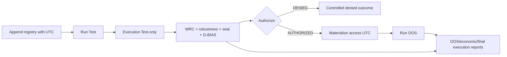

# Plan - Chronologie et horodatage des evenements runtime

> Sous-chantier 1/3 de
> `PLAN_HORODATAGE_TRANSVERSAL_ET_ATTESTATIONS`.

## 0. Bandeau de statut (a verifier avant toute promotion)

| Question | Reponse |
| --- | --- |
| Un chantier actif couvre-t-il deja ce perimetre ? | Non. `.ai/checkpoint.json::active_workstream_id` est `null`; la mere est `TRIAGED`. |
| Un verrou de gouvernance bloque-t-il ce chantier ? | Non. Le protocole impose deja le scellement et l'autorisation avant acces OOS. |
| Une decision humaine est-elle necessaire ? | Non. R5/R6 peuvent conduire a `DENIED`; ce verdict honnete est explicitement accepte. |
| Ce plan remplace-t-il un chantier existant ? | Non. Il corrige la chronologie du builder existant. |

## Audit IA de promotion

- [x] Bootstrap, checkpoint, hook, tracking, entree Protocole et checklist lus.
- [x] `EBTA_Protocol_Guardian`, `epic-orchestrator` et `code-architecture-evaluator` appliques.
- [x] Defaut reproduit par lecture du chemin reel : l'OOS precede actuellement `_procedure_reports()` et `authorize_oos_access()`.
- [x] Brouillon conserve dans `0 - HUMAN START HERE/` jusqu'au routage mecanique.
- [x] Perimetre ferme, autorites, prerequis et logique reutilisable identifies.
- [x] Deux passes `/evaluate` terminees; dependance circulaire de preuve d'execution supprimee du plan.

## Triage

| Champ | Valeur |
| --- | --- |
| Track | `mainline` |
| Lifecycle | `TRIAGED` |
| Type de chantier | `SINGLE` - ordre, decision et timestamps forment un seul invariant testable. |
| Scope | Faire calculer et sceller les preuves pre-OOS avant tout appel runner OOS, produire les evenements d'enregistrement/acces avec une horloge UTC injectable, et arreter proprement le build si l'acces est refuse. |
| Non-goals | Aucun changement de `Protocole/`, schema, API Nautilus, R5/R6, seuil, approbation humaine, gate live/G14 ou preuve externe post-OOS. |
| Source | `/continue` de l'EPIC, enfant 1 du lot horodatage; brouillon `0 - HUMAN START HERE/PLAN_CHRONOLOGIE_ET_HORODATAGE_EVENEMENTS_RUNTIME.md`. |
| Exit criteria | Un runner espion prouve zero appel OOS sur `DENIED`; sur `AUTHORIZED`, decision et journal precedent l'appel OOS; le registre append-only est effectivement ecrit avant Test, pas seulement antidate; les rapports pre-OOS ne sont pas recalcules apres OOS; registre et acces portent UTC runtime ou fixture injectee; suite complete et pilote minimal PASS. |

## Statut

| Champ | Valeur |
| --- | --- |
| Statut | `DONE - implementation et validations terminees` |
| Date de creation | 2026-07-20 |
| Date d'activation | 2026-07-20 |
| Autorite normative | `SOP 03`, `SOP 10`, `SOP 12`, `SOP 13`, `PAQUET D'EXECUTION EBTA.md` |
| Autorite executable | `Implementation/examples/minimal_pilot_pipeline/build_research_package.py` et `Implementation/ebta_engine/package_builder/nautilus_research_package.py` |
| Changement normatif attendu | Aucun |
| Dependances externes | Donnees locales et environnement Nautilus deja disponibles; aucune nouvelle dependance. |

## Carte d'execution IA (lecture prioritaire pour `/continue`)

| Champ | Contenu operationnel |
| --- | --- |
| Objectif executable | Test -> preuves/scellement/decision -> acces OOS horodate, sans possibilite d'appeler l'OOS sur refus. |
| Autorite et lecture minimale | `AGENTS.md`, checkpoint/hook/tracking, entree Protocole, SOP 03/10/12/13, Paquet, ce plan, puis les deux builders. |
| Perimetre autorise | Deux builders, inputs du pilote, leurs tests, historique moteur. |
| Interdits absolus | `Protocole/`, schemas, mappings/bridge Nautilus, R5/R6, approbations, package artificiellement complet sur refus. |
| Phase de reprise | Phase 1 - contrat pre-OOS partage. |
| Preuve attendue | Tests espions ordre/refus, timestamps injectes/runtime, absence de recalcul, suite complete, pilote PASS, Pyrefly. |
| Arret et escalade | Toute necessite de modifier un schema, une SOP, un seuil ou une approbation humaine. |

## 1. Role de ce document et non-objectifs

| Element | Role |
| --- | --- |
| `Protocole/` | Autorite normative inchangee. |
| `Implementation/` | Traduction executable corrigee par ce chantier. |
| Plans `.ai/` | Orchestration seulement; aucun verdict scientifique. |
| Ce plan | Contrat d'implementation ferme et testable. |

Ce plan ne certifie pas une campagne, ne force pas un package global `PASS`,
ne transforme pas une fixture en preuve reelle et ne cree pas une seconde
implementation du WRC, de la robustesse, du scellement ou de G-BIAS.

## 2. Contexte obligatoire a lire avant de coder

1. `AGENTS.md`, `.ai/README.md`, `.ai/checkpoint.json`, hook et tracking actifs.
2. `Protocole/0-README - Comprendre et maintenir le protocole EBTA.md`.
3. `Protocole/SOP 03*`, `SOP 10*`, `SOP 12*`, `SOP 13*` et `PAQUET D'EXECUTION EBTA.md`.
4. `.ai/governance/AI_MODIFICATION_CHECKLIST.md`.
5. Ce plan puis les deux builders et leurs tests.

Hierarchie : Protocole gele > SOP/Paquet > procedures EBTA > builder pilote >
adaptateur Nautilus. Une preuve manquante produit `DENIED`/`INCONCLUSIVE`,
jamais une valeur inventee.

## 3. Table des gates

| Ordre | Gate | Question | Sortie si echec |
| --- | --- | --- | --- |
| 1 | Enregistrement | Les candidats et la configuration sont-ils enregistres avant Test ? | Arret technique explicite. |
| 2 | Preuves Test | WRC, robustesse et execution Test-only sont-ils calcules ? | `DENIED`. |
| 3 | Scellement/G-BIAS | Le pre-OOS est-il scelle et sans biais bloquant ? | `DENIED`. |
| 4 | Autorisation | Les six exigences d'`authorize_oos_access()` passent-elles ? | Aucun appel OOS, sortie controlee. |
| 5 | Acces | Une entree horodatee est-elle materialisee immediatement avant chaque acces ? | Aucun appel OOS. |
| 6 | Rapports aval | Les rapports dependants de l'OOS reutilisent-ils le pre-OOS scelle ? | Package invalide. |

## 4. Etat des lieux (avant/apres) - reutiliser avant de recreer

### Ce qui existe deja

| Module | Role reel | Decision |
| --- | --- | --- |
| `procedures/wrc.py`, `risk/robustness.py` | Calculs pre-OOS existants. | Reutiliser. |
| `procedures/sealing.py` | UTC runtime et horloge fixture aware. | Reutiliser sans modification. |
| `procedures/oos_access.py` | Derive `AUTHORIZED`/`DENIED` depuis six flags. | Reutiliser. |
| `_procedure_reports()` | Calcule aujourd'hui pre-OOS et aval en une passe post-OOS. | Scinder sans dupliquer les calculs. |
| `_execution_nav_evidence()` | Exige aujourd'hui des observations OOS pour `PASS`. | Ajouter un mode/contrat Test-only pre-OOS, conserver la preuve finale stricte. |
| `_write_registry()` | Ecrit un timestamp constant. | Alimenter depuis un timestamp concret capture avant Test. |

### Ce qui manque reellement

| Brique | Emplacement | Reutilisation obligatoire |
| --- | --- | --- |
| Rapport pre-OOS partage | builder pilote | Fonctions WRC, robustesse, scellement, G-BIAS, autorisation existantes. |
| Sortie controlee de refus | builder Nautilus | Decision et `missing_requirements`; aucun faux package VALIDATION_READY. |
| Horloge de bord | builder Nautilus/pilote | UTC aware; fixtures explicites seulement. |
| Journal d'acces effectif | builder Nautilus | Gabarit existant, materialise seulement apres autorisation. |

## 5. Decision d'architecture

Le builder Nautilus orchestre les effets; le pilote expose un calcul pre-OOS
pur. Les preuves pre-OOS sont calculees une fois, puis transmises aux rapports
avals sous une cle interne avec une empreinte stable. La presence de cette cle
interdit le recalcul. Le journal d'acces contient seulement des acces executes;
le gabarit de demande reste separe. Le chemin package initialise son dossier et
append le registre avant le premier runner Test; l'assemblage final preserve ce
journal au lieu de supprimer/recreer le dossier. Un timestamp capture en memoire
puis ecrit apres les simulations est explicitement interdit.

La preservation n'est jamais implicite : le bord Nautilus nettoie le dossier
cible avant le preregistrement, puis transmet a `build_package()` un mode
explicite de reprise pre-OOS. Ce mode verifie que seuls `config.json` et
`registry.jsonl` attendus sont presents et refuse tout dossier stale; le mode
pilote par defaut conserve son reset actuel. Ainsi la correction de chronologie
ne peut pas reutiliser silencieusement les artefacts d'un ancien run.



Contrat logique `pre_oos_reports` : `search_space`, `optimization_log`,
`complexity_selection`, `candidate_matrix`, `wrc`, `wrc_local_reports`,
`robustness`, `sealing`, `g_bias`, `oos_access_decision` et empreinte stable.
Il ne contient aucun rendement OOS ni preuve post-OOS.

Contrat du refus : dictionnaire avec `status: DENIED`,
`oos_access_decision`, preuves pre-OOS compactes et `package_built: false`;
le dossier cible ne doit pas etre presente comme package valide.

### Perimetre de fichiers explicite

Autorises :

```text
Implementation/examples/minimal_pilot_pipeline/build_research_package.py
Implementation/examples/minimal_pilot_pipeline/inputs/pilot_inputs.json
Implementation/ebta_engine/package_builder/nautilus_research_package.py
Implementation/ebta_engine/tests/test_minimal_pilot_pipeline.py
Implementation/ebta_engine/tests/test_nautilus_research_package.py
Implementation/HISTORIQUE DES VERSIONS EBTA ENGINE.md
```

Interdits :

```text
Protocole/
Implementation/ebta_engine/schemas/
Implementation/ebta_engine/adapters/
Implementation/ebta_engine/procedures/oos_access.py
Implementation/ebta_engine/procedures/sealing.py
.ai/checkpoint.json                 [sauf plan.ps1]
R5/R6, gates live/G14 et preuves post-OOS externes
```

## 6. Decoupage en phases

### Phase 1 - Extraire le contrat pre-OOS partage

Objectif : calculer une seule fois toutes les preuves requises avant l'OOS.

Classification : IMPLEMENTATION_DETAIL

Actions :

- Extraire le calcul pre-OOS pur depuis `_procedure_reports()`.
- Ajouter la preuve d'execution Test-only sans exigence OOS circulaire.
- Reutiliser le contrat scelle dans `_procedure_reports()`.

Livrables :

- Helper pre-OOS partage et tests de non-recalcul.

Critere de sortie :

- Un test espion prouve que scellement/decision ne sont executes qu'une fois et avant OOS.

### Phase 2 - Reordonner le builder et traiter le refus

Objectif : rendre physiquement impossible tout appel OOS avant autorisation.

Classification : IMPLEMENTATION_DETAIL

Actions :

- Executer Test, calculer le contrat pre-OOS, brancher sur la decision.
- Retourner le contrat de refus sans construire de package complet.
- Sur autorisation seulement, materialiser le journal puis appeler le runner OOS.

Livrables :

- Orchestration corrigee et tests `DENIED`/`AUTHORIZED`.

Critere de sortie :

- Seed OOS absent des appels sur refus et present seulement apres decision sur autorisation.

### Phase 3 - Horodater les transitions reelles

Objectif : supprimer les timestamps constants du chemin production.

Classification : IMPLEMENTATION_DETAIL

Actions :

- Injecter une horloge UTC au bord public du builder.
- Initialiser et ecrire le registre append-only avant Test; permettre a
  l'assemblage final de preserver ce preregistre sans doublon.
- Capturer l'acces immediatement avant OOS.
- Garder les timestamps fixes uniquement dans l'input fixture explicite.

Livrables :

- Registre et acces horodates; tests aware/runtime et fixture.

Critere de sortie :

- Les valeurs injectees sont retrouvees exactement; sans injection, ISO-8601 UTC aware est produit; un espion filesystem prouve que `registry.jsonl` existe avant le premier appel Test.

### Phase 4 - Non-regression et historique

Objectif : prouver que la correction reste subordonnee aux contrats EBTA.

Actions :

- Adapter les tests historiques qui supposaient a tort un OOS execute apres refus.
- Executer tests cibles, suite complete, pilote, Pyrefly et bug-hunter.
- Documenter le changement dans l'historique moteur.

Livrables :

- Preuves executables et historique.

Critere de sortie :

- Tous les tests passent; aucun bug confirme ni critere manquant.

## 7. Artefacts produits

| Etape | Sortie | Regle source |
| --- | --- | --- |
| Pre-Test | evenements registre UTC | SOP 03 |
| Pre-OOS | preuves et decision scellees | SOP 10/13 |
| Refus | outcome `DENIED`, aucun package complet | SOP 10 |
| Acces | `oos_access_log.jsonl` horodate | SOP 10 / Paquet |
| Aval | rapports OOS/economiques depuis preuves pre-OOS reutilisees | SOP 01/10/12 |

## 8. Invariants absolus et NO GO

1. Aucun appel runner OOS avant `AUTHORIZED`.
2. L'autorisation utilise une execution Test-only; elle ne depend jamais d'une preuve OOS future.
3. Aucun evenement d'acces n'existe sur refus.
4. Aucun recalcul post-OOS ne peut remplacer le scellement ou la decision pre-OOS.
5. Les timestamps marche restent des temps source; l'horloge runtime ne les remplace pas.
6. Une fixture est explicitement injectee, jamais codee dans un writer de production.
7. Le registre est persiste avant Test; une ecriture retrospective avec un ancien timestamp est interdite.

NO GO : assouplir un gate/test, creer un package vide annonce valide, modifier
un schema/SOP, inventer une approbation, ou modifier les adapters Nautilus.

## 9. Verification a chaque etape

```powershell
python -m unittest Implementation.ebta_engine.tests.test_minimal_pilot_pipeline Implementation.ebta_engine.tests.test_nautilus_research_package
python -m unittest discover -s Implementation\ebta_engine\tests -t Implementation
python Implementation\examples\minimal_pilot_pipeline\build_research_package.py
Implementation\adapters\nautilus_env\venv\Scripts\python.exe -m pyrefly check Implementation\examples\minimal_pilot_pipeline\build_research_package.py Implementation\ebta_engine\package_builder\nautilus_research_package.py
```

Le package Nautilus reel n'est lance que si les donnees locales requises sont
presentes. L'absence de ces donnees ne permet pas de remplacer les tests
injectes. Premier lot : helper pre-OOS + test de refus avant tout refactor aval.

### Execution sans interruption

Le plan est executable sans retour humain. Arret uniquement si un schema, une
SOP, un seuil, une approbation ou un fichier hors perimetre devient necessaire.

### Autorite decisionnelle accordee

Les details internes et corrections mineures sont autorises dans la liste
fermee, sans changer les contrats normatifs ni le sens des gates.

### Interdiction des raccourcis

Un outcome `DENIED` honnete est un succes du controle. Il est interdit de
fabriquer une serie OOS, de relacher WRC/G-BIAS ou de coder un timestamp/flag
pour conserver artificiellement un package `PASS`.

## 10. Journal des decisions humaines

| Date | Decision | Portee |
| --- | --- | --- |
| 2026-07-20 | `/continue` de l'EPIC multi-lot. | Autorise l'enfant; aucune levee normative ou R5/R6. |

## 11. Risques et blocages connus

| Risque | Impact | Mitigation |
| --- | --- | --- |
| WRC/robustesse refusent l'OOS | Plus de package Nautilus complet sur ce run. | Outcome `DENIED` teste; ne jamais contourner. |
| Cache pre-OOS mute | Decision post-OOS non fiable. | Copie defensive + empreinte stable + test de non-recalcul. |
| Reprise non destructive reutilise un ancien package | Manifest melange plusieurs runs. | Nettoyage au bord, allowlist `config.json`/`registry.jsonl`, verification des identifiants avant assemblage. |
| Execution Test-only trop permissive | Faux `execution_pass`. | Exiger ordres, NAV presente/positive/non plate sur Test; conserver verification OOS finale separee. |
| Tests historiques supposaient l'ancien bug | Regressions attendues. | Corriger l'attente, jamais le gate. |

## 12. Definition of Done

- [x] Les quatre phases sont validees.
- [x] `DENIED` implique zero appel et zero evenement OOS.
- [x] `AUTHORIZED` implique decision/journal avant appel OOS.
- [x] Rapports pre-OOS reutilises sans recalcul.
- [x] Horodatages runtime/fixture prouves.
- [x] Suite, pilote, Pyrefly et bug-hunter PASS; conformance a valider avant `/close`.
- [x] Aucun fichier hors perimetre touche.

## 13. Cloture

| Champ | Valeur |
| --- | --- |
| Resultat final | DONE - en attente de cloture mecanique |
| Ecarts | Le smoke donnees reelles retourne honnetement `DENIED` (`wrc_pass`) au lieu du precedent package post-OOS; c'est la preuve attendue du gate, pas un contournement. |
| Suites | Reprendre enfant 2 de la mere. |

## 14. Journal d'audits post-hoc

| Date | Correction | Pourquoi |
| --- | --- | --- |
| 2026-07-20 | Passe intake 1 : separation gabarit/journal effectif et outcome de refus hors package complet. | Le schema du package exige OOS/log; le remplir a vide ou artificiellement serait mensonger. |
| 2026-07-20 | Passe intake 2 : preuve d'execution Test-only avant autorisation. | La preuve finale exigeait l'OOS et creait une dependance circulaire. |
| 2026-07-20 | Passe plan route 1 : persistance reelle du registre avant Test, avec assemblage final non destructif. | Capturer un timestamp avant Test mais ecrire le registre apres OOS aurait seulement antedate la preuve. |
| 2026-07-20 | Passe plan route 2 : reprise pre-OOS rendue explicite et protegee contre les dossiers stale; convergence atteinte. | Un simple `reset=False` aurait pu melanger des artefacts de runs differents. Aucun nouvel angle mort majeur apres correction. |

### Resultat d'execution - 2026-07-20

| Champ | Valeur |
| --- | --- |
| Phases executees | 1 a 4 |
| Artefacts | builders pilote/Nautilus, fixture, tests, historique moteur |
| Validation | PASS - 182 tests; Pyrefly 0 erreur; pilote minimal PASS; smoke reel `DENIED` sur `wrc_pass` sans OOS |
| Bug-hunter | 7 diagnostics d'inference sur le spec OOS heterogene, corriges par `OosRunSpec`; balayage final 0 erreur. Revue manuelle : journalisation rendue fold-par-fold avant materialisation/execution. |
| Ecart | Aucun ecart de scope; le verdict reel `DENIED` est conforme au plan. |
