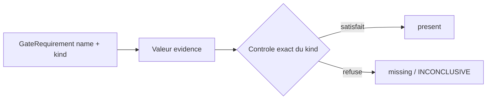
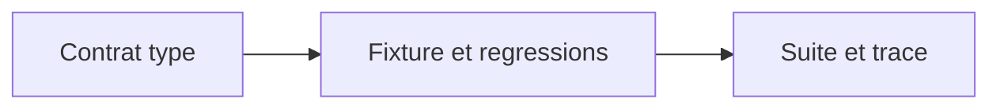

# Plan d'implementation — Contrat d'exigences G0-G14 type et fail-closed

## 0. Bandeau de statut

| Question | Reponse |
| --- | --- |
| Un chantier actif couvre-t-il deja ce perimetre ? | Non. `EPIC_DURCISSEMENT_POST_AUDIT_ERREURS_IA` coordonne sans implementer ; les lots 1 et 2 sont `DONE`. |
| Un verrou de gouvernance actif bloque-t-il ce chantier ? | Non. Le parent designe explicitement ce workstream comme prochain enfant et le changement encode les taxonomies/gates deja normatifs. |
| Une decision humaine explicite manque-t-elle ? | Non. La decision `AUDIT_ARCHITECTURE_D_ABORD` du 2026-08-09 autorise le redimensionnement ; `/continue` sur l'epic autorise la boucle du prochain enfant. |
| Ce plan remplace-t-il un chantier existant ? | Non. Il remplace uniquement la premiere composante de l'ancien lot 3 composite, jamais routee comme workstream. |

Test `epic-orchestrator` : `SINGLE_CHANTIER`. Le contrat type, son evaluation
et ses preuves negatives partagent un seul Exit criteria ; les lots live,
coherence persistee et garde AST restent independants.

## Audit IA de promotion

- [x] Cockpit, checkpoint, hook, tracking, gouvernance et workflows relus.
- [x] Bandeau verifie contre le checkpoint vivant (`active_workstream_id: null`).
- [x] Nouveau fichier backlog distinct du brouillon humain intact.
- [x] Track `mainline` justifie par le parent mainline et le risque critique.
- [x] Autorites normatives identifiees sans modification de `Protocole/`.
- [x] Perimetre ferme explicite en section 5.
- [x] Prerequis et absence de decision normative manquante verifies.
- [x] Code, consommateurs et fixtures relus ; aucune logique concurrente proposee.

## Triage

| Champ | Valeur |
| --- | --- |
| Track | `mainline` |
| Lifecycle | `TRIAGED` apres routage ; non executable avant baseline |
| Type de chantier | `SINGLE` |
| Scope | Encoder la nature de chaque exigence G0-G14 et supprimer le repli truthy qui accepte des statuts negatifs ou inconnus. |
| Non-goals | Aucun changement live/INV-010/AST, aucun schema ou protocole, aucun nouveau statut, aucun BACKTRADER. |
| Source | Epic parent, audit cible du 2026-08-09 finding A1, continuation humaine de l'epic. |
| Exit criteria | Toute exigence est typee ; seul le positif exact de son type passe ; taxonomies negatives/inconnues echouent ; fixture valide normalisee ; suite complete `OK`. |

## Statut

| Champ | Valeur |
| --- | --- |
| Statut | `ACTIVE` — implementation et gates de fermeture termines |
| Date de creation | 2026-08-09 |
| Date d'activation | 2026-08-09 |
| Autorite normative | `Protocole/PAQUET D'EXECUTION EBTA.md` pour G0-G14 et `REGISTRE DES DECISIONS NORMATIVES EBTA.md` pour les taxonomies. |
| Autorite executable | `Implementation/ebta_engine/validators/gate_validator.py`. |
| Changement normatif attendu | Aucun ; classification Guardian `CONTRACT_ENCODING`. |
| Dependances externes | Aucune. |

## Carte d'execution IA

| Champ | Contenu operationnel |
| --- | --- |
| Objectif executable | Remplacer la truthiness par `identifier` / `verdict_pass` / `boolean_true`, migrer la fixture et prouver le fail-closed. |
| Autorite et lecture minimale | Bootstrap repo -> parent -> audit 2026-08-09 -> ce plan -> gate validator/tests/fixtures -> sources normatives citees. |
| Perimetre autorise | Validateur, `test_gates.py`, inventaire tests, fixture gates, historique runtime, plan/checkpoint/rapports du workstream. |
| Interdits absolus | Protocole, schemas, builders, lifecycle/live, invariant validator, BACKTRADER, nouveau statut ou valeur positive inventee. |
| Phase de reprise | Phase 1 apres baseline. |
| Preuve attendue | Test cible, suite canonique, inventaire, prototypes negatifs, audits de fermeture. |
| Arret et escalade | Fichier hors liste requis, nouvelle norme necessaire ou contradiction factuelle avec les sources. |

---

## 1. Role de ce document et non-objectifs

| Element | Role |
| --- | --- |
| `Protocole/` | Autorite des gates et statuts ; reste intacte. |
| `gate_validator.py` | Traduit chaque exigence en controle executable. |
| `package_validator.py` | Consomme `gate_report()` ; sortie publique preservee. |
| Fixtures/tests | Prouvent le positif et les refus sans devenir normatifs. |
| Ce plan | Carte gouvernee de l'unique correction A1. |

Ce document ne corrige ni l'approbation live, ni INV-010, ni les literals de
verdict hors de la fixture necessaire au contrat. Il ne cree pas de nouvelle
taxonomie et ne transforme jamais un non-`PASS` en succes.

## 2. Contexte obligatoire a lire avant de coder

1. `AGENTS.md`, `.ai/README.md`, `.ai/checkpoint.json`, hook et tracking actifs.
2. `.ai/governance/AI_MODIFICATION_CHECKLIST.md` et workflows common/core-engine.
3. Epic parent et audit cible du 2026-08-09.
4. `Protocole/PAQUET D'EXECUTION EBTA.md` section G0-G14 et registre des taxonomies.
5. `gate_validator.py`, `test_gates.py`, fixture `valid_minimal` et producteur minimal.

```text
1. Protocole/ : doctrine et vocabulaire
2. Decisions humaines journalisees
3. Ce plan baseline
4. Implementation/ : traduction executable
```

Si une valeur ne satisfait pas exactement la nature declaree, le gate devient
`INCONCLUSIVE`; aucune heuristique permissive n'est autorisee.

## 3. Table des gates

Le chantier ne change ni l'ordre ni les exigences de G0-G14. Il change
uniquement la facon de verifier chaque champ :

| Nature | Question | Echec |
| --- | --- | --- |
| `identifier` | La valeur est-elle une chaine non vide apres `strip()` ? | Champ dans `missing`, gate `INCONCLUSIVE`. |
| `verdict_pass` | La valeur est-elle exactement la chaine `PASS` ? | Champ dans `missing`, gate `INCONCLUSIVE`. |
| `boolean_true` | La valeur est-elle exactement le singleton `True` ? | Champ dans `missing`, gate `INCONCLUSIVE`. |

## 4. Etat des lieux

### Ce qui existe deja

| Module | Chemin | Role reel | Suffisant ? |
| --- | --- | --- | --- |
| Validateur | `Implementation/ebta_engine/validators/gate_validator.py` | Liste les exigences, mais `_requirement_satisfied()` accepte toute chaine non vide hors trois valeurs. | Non, a remplacer. |
| Taxonomies | `Implementation/ebta_engine/constants.py` | Encode les statuts globaux, locaux, techniques, monitoring et stades. | Oui, ne pas dupliquer. |
| Producteur | `Implementation/examples/minimal_pilot_pipeline/build_research_package.py` | Emet des `PASS`/`FAIL`/`INCONCLUSIVE`, huit identifiants et `live_approval` booleen. | Oui, hors scope. |
| Fixture | `Implementation/ebta_engine/fixtures/valid_minimal/reports/gates.json` | Ancienne forme : booleens `true` pour les pseudo-verdicts. | A normaliser. |
| Tests | `Implementation/ebta_engine/tests/test_gates.py` | Couvre trois statuts et preserve explicitement le faux succes `NOT_VALIDATED`. | A renforcer. |

### Ce qui manque reellement

| Manque | Emplacement | Source | Reutilisation |
| --- | --- | --- | --- |
| Nature par exigence | `gate_validator.py` | Audit A1 + G0-G14 existants | `GATE_REQUIREMENTS` existant. |
| Evaluation fail-closed | `gate_validator.py` | Taxonomies existantes | Sortie `GateResult` existante. |
| Matrice negative | `test_gates.py` | Audit A1 | `ALL_DECISION_STATUSES` peut alimenter les cas. |
| Fixture alignee | `fixtures/valid_minimal/reports/gates.json` | Producteur vivant | Aucun manifeste persiste ; tests le reconstruisent. |

## 5. Decision d'architecture

Principe : la semantique vient du contrat du champ, jamais de la valeur recue.



### Frontieres

| Couche | Elle fait | Elle ne fait pas |
| --- | --- | --- |
| Contrat | Associe chaque nom a un kind immuable. | Ne calcule aucun verdict scientifique. |
| Evaluateur | Compare type et valeur exactement. | N'utilise jamais `bool(value)` comme repli. |
| Package validator | Consomme la sortie inchangee. | Ne devine pas la nature des champs. |

### Contrat cible

```python
RequirementKind = Literal["identifier", "verdict_pass", "boolean_true"]

@dataclass(frozen=True)
class GateRequirement:
    name: str
    kind: RequirementKind
```

- `identifier` : huit champs G0/G3/G13 ; `str` non vide apres trim.
- `boolean_true` : `live_approval` uniquement dans ce lot.
- `verdict_pass` : toutes les autres exigences.
- kind inconnu : erreur explicite, jamais fallback.
- `GateResult` et `gate_report()` gardent leur forme et leur ordre.

### Decisions actees

| Decision | Justification |
| --- | --- |
| Migrer les `true` historiques de la fixture en `PASS` | Aligne la fixture sur le producteur vivant et rend le contrat univoque. |
| Ne pas versionner de manifeste de fixture | Aucun n'existe ; les tests le construisent en temporaire. |
| `value is True` pour le booleen | Evite l'egalite Python `True == 1`. |
| Refuser toute chaine inconnue sur un verdict | Ferme exactement le faux succes A1. |

### Perimetre de fichiers explicite

Autorises :

```text
Implementation/ebta_engine/validators/gate_validator.py
Implementation/ebta_engine/tests/test_gates.py
Implementation/ebta_engine/tests/test_inventory.txt
Implementation/ebta_engine/fixtures/valid_minimal/reports/gates.json
Implementation/HISTORIQUE DES VERSIONS EBTA ENGINE.md
.ai/backlog/mainline/PLAN_CONTRAT_EXIGENCES_GATES_TYPEES.md
.ai/checkpoint.json                         [via plan.ps1 uniquement]
0 - HUMAN START HERE/archive/20260809_PLAN_CONTRAT_EXIGENCES_GATES_TYPEES.md
.ai/archive/20260809_PLAN_CONTRAT_EXIGENCES_GATES_TYPEES.md
0 - HUMAN START HERE/AUDIT_BUG_HUNTER_PLAN_CONTRAT_EXIGENCES_GATES_TYPEES_2026-08-09.md
0 - HUMAN START HERE/AUDIT_ADVERSARIAL_PLAN_CONTRAT_EXIGENCES_GATES_TYPEES_2026-08-09.md
0 - HUMAN START HERE/AUDIT_CONFORMITE_PLAN_CONTRAT_EXIGENCES_GATES_TYPEES_2026-08-09.md
```

Interdits :

```text
Protocole/
Implementation/ebta_engine/schemas/
Implementation/ebta_engine/procedures/
Implementation/ebta_engine/validators/package_validator.py
Implementation/ebta_engine/validators/invariant_validator.py
Implementation/examples/
Implementation/Active/
.ai/checkpoint.schema.json
D:/TRADING/.../BACKTRADER/
```

## 6. Decoupage en phases

### Phase 1 - Encoder le contrat type

Objectif : rendre la nature de chaque exigence explicite et l'evaluation fail-closed.

Classification : CONTRACT_ENCODING

Actions :

- introduire `GateRequirement` immuable et trois kinds fermes ;
- classifier exhaustivement G0-G14 ;
- evaluer chaque requirement selon son kind ;
- lever une erreur sur un kind inconnu ;
- conserver la forme et l'ordre des sorties.

Livrables :

- `gate_validator.py` sans `bool(value)` permissif.

Critere de sortie :

- tests cibles positifs et negatifs du contrat passent.

### Phase 2 - Normaliser la fixture et les regressions

Objectif : aligner la preuve canonique et couvrir toutes les familles de refus.

Classification : TEST_FIXTURE

Actions :

- remplacer dans `valid_minimal/reports/gates.json` les pseudo-verdicts `true`
  par `PASS`, sans toucher aux identifiants ni a `live_approval` ;
- inverser le test `NOT_VALIDATED` ;
- couvrir statuts globaux, locaux, techniques, monitoring, inconnus et mauvais types ;
- couvrir identifiants, booleen strict, kind inconnu, exhaustivite et ordre ;
- mettre a jour `test_inventory.txt`.

Livrables :

- fixture compatible et tests deterministes de non-regression.

Critere de sortie :

- `test_gates.py`, inventaire et package minimal valide passent.

### Phase 3 - Validation et trace runtime

Objectif : prouver la non-regression globale et documenter le changement.

Classification : DOCUMENTATION_CLARIFICATION_NEEDED

Actions :

- executer la suite complete ;
- verifier le paquet fixture avec manifeste temporaire ;
- journaliser finding A1, solution et absence de changement normatif.

Livrables :

- historique runtime et resultats de validation honnetes.

Critere de sortie :

- suite canonique `OK`, diff propre, aucun fichier hors perimetre.

### Chemin critique



## 7. Artefacts produits

| Etape | Artefact | Format | Source |
| --- | --- | --- | --- |
| Phase 1 | Contrat `GATE_REQUIREMENTS` type | Python stdlib | G0-G14 + audit A1 |
| Phase 2 | Fixture gates normalisee | JSON | Producteur vivant |
| Phase 2 | Tests/inventaire | unittest/TXT | Cliquet deja installe |
| Phase 3 | Historique runtime | Markdown | Guardian/checklist |

## 8. Invariants absolus et NO GO

### Invariants

1. Un champ `verdict_pass` n'accepte que la chaine exacte `PASS`.
2. Un kind inconnu ne tombe jamais sur un comportement permissif.
3. Un identifiant non vide ne devient pas un verdict et inversement.
4. `boolean_true` refuse `1` et toute chaine.
5. Aucun `FAIL`, `INCONCLUSIVE`, statut bloquant ou inconnu ne devient `present`.
6. Les formes publiques et l'ordre G0-G14 restent stables.

### NO GO

- conserver ou renommer le test qui attend `NOT_VALIDATED -> PASS` ;
- utiliser `bool(value)` pour un kind non identitaire ;
- accepter `True` comme pseudo-verdict pour eviter de migrer la fixture ;
- toucher live, INV-010, builder, schemas ou Protocole ;
- reduire la suite ou l'inventaire pour obtenir du vert.

## 9. Verification a chaque etape

```powershell
python -m unittest discover -s Implementation\ebta_engine\tests -t Implementation -p test_gates.py
python -m unittest discover -s Implementation\ebta_engine\tests -t Implementation -p test_package_validator.py
python -m unittest discover -s Implementation\ebta_engine\tests -t Implementation -p test_test_inventory.py
python -m unittest discover -s Implementation\ebta_engine\tests -t Implementation
python -m json.tool Implementation\ebta_engine\fixtures\valid_minimal\reports\gates.json
git diff --check
```

Baseline observee avant implementation : 246 tests `OK` le 2026-08-09.

Premier lot executable : encoder le contrat type et faire echouer les tests
negatifs avant toute normalisation de fixture.

Avant la premiere modification de `Implementation/`, l'activation doit aussi
corriger le motif de routage mecanique avec :

```powershell
.ai/tools/plan.ps1 continue -Id PLAN_CONTRAT_EXIGENCES_GATES_TYPEES -Reason "Sous-chantier 3/10 de EPIC_DURCISSEMENT_POST_AUDIT_ERREURS_IA : contrat type et fail-closed des exigences G0-G14."
```

### Execution sans interruption

Le plan est executable integralement sans retour humain. Arret uniquement si
un fichier hors liste, une nouvelle norme ou une dependance externe devient
indispensable. L'IA peut choisir les details internes dans ces limites.

En cas d'echec, corriger la cause racine ; ne jamais affaiblir un test, ajouter
un fallback truthy, transformer un statut ou masquer un resultat non-PASS.

## 10. Journal des decisions humaines

| Date | Decision | Portee |
| --- | --- | --- |
| 2026-08-09 | `AUDIT_ARCHITECTURE_D_ABORD`. | Autorise audit/redimensionnement, pas une nouvelle norme. |
| 2026-08-09 | `/continue` persistant sur l'epic. | Autorise la boucle gouvernee du prochain enfant designe par le parent. |

## 11. Risques et blocages connus

| Risque | Impact | Mitigation |
| --- | --- | --- |
| Fixture historique booleenne | Paquet minimal invalide apres contrat strict. | Normalisation dans le meme lot ; manifeste reconstruit par les tests. |
| `True == 1` | Faux positif booleen. | Identite `is True` + test `1`. |
| API interne `GATE_REQUIREMENTS` | Test helper a adapter. | Recherche repo : seul `test_gates.py` le consomme directement. |
| Omission d'un champ futur | Repli ou champ non controle. | Construction explicite et erreur sur kind inconnu. |

## 12. Definition of Done

- [x] Toutes les phases et commandes de section 9 passent.
- [x] Tous les Exit criteria du Triage sont prouves.
- [x] Aucun fichier hors perimetre n'est modifie par le chantier.
- [x] Suite complete et inventaire restent verts.
- [x] Historique runtime mis a jour ; Protocole intact.
- [x] `bug-hunter`, `adversarial-tester` et `plan-conformance-audit` sans finding bloquant.
- [x] Aucun stub, fallback truthy ou pseudo-PASS ne subsiste dans le scope.

## 13. Cloture

| Champ | Valeur |
| --- | --- |
| Resultat final | Pret pour `READY_TO_CLOSE` : contrat type fail-closed implemente, fixture normalisee, 253 tests `OK`, trois audits sans finding bloquant. |
| Ecarts par rapport au plan initial | Aucun ecart fonctionnel. Le nombre de tests canonique passe de 246 a 253 par ajout de sept regressions. |
| Suites a prevoir | 3B approbation live, 3C coherence persistee, 3D garde AST ; hors scope. |

### Resultat d'execution

| Champ | Valeur |
| --- | --- |
| Date | 2026-08-09 |
| Phases executees | 1 contrat type ; 2 fixture et regressions ; 3 validation et trace runtime. |
| Artefact produit | `GateRequirement` avec kinds `identifier`, `verdict_pass`, `boolean_true`; fixture et matrice negative alignees. |
| Validation | `test_gates.py` 19/19 ; `test_package_validator.py` 10/10 ; inventaire 1/1 ; suite 253/253 ; Pyrefly 0 ; adversarial 7/7 + controle positif ; schema checkpoint et diff a revalider a la fermeture. |
| Ecart par rapport au plan | Aucun. Les brouillons humains preexistants restent hors index et intacts par ce chantier. |

## 14. Journal d'audits post-route

| Passe | Verification | Resultat |
| --- | --- | --- |
| 1 | Fichier normalise confronte au routage vivant, au perimetre ferme et aux consommateurs reels. | Deux ecarts proceduraux corriges : remplacement du glob de rapports par cinq chemins exacts, dont l'archive de fermeture ; commande d'activation munie du motif enfant `3/10`. Aucun changement d'architecture requis. |
| 2 | Relecture apres correction contre `gate_validator.py`, `test_gates.py`, la fixture, le checkpoint et le workflow core-engine. | Aucun nouvel angle mort majeur : contrat exhaustif, sorties preservees, migration et taxonomies negatives couvertes, fichiers autorises fermes. Convergence atteinte. |

## Journal de convergence de l'intake

| Passe | Verification | Resultat |
| --- | --- | --- |
| 1 | Code, consommateurs, producteur et fixtures. | Ajout de la migration `valid_minimal` et de la preuve d'exhaustivite. |
| 2 | Fichiers reels de fixture et tests de manifeste. | Suppression du faux chemin de manifeste ; les manifestes sont temporaires. |
| 3 | Relecture finale du perimetre et des Exit criteria. | Aucun nouvel angle mort majeur ; convergence. |
