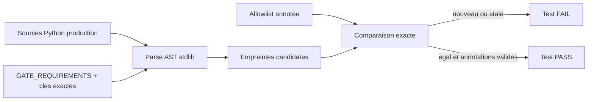

# Plan d'implementation — Garde AST des litteraux de verdict

## 0. Bandeau de statut

| Question | Reponse |
| --- | --- |
| Chantier actif concurrent ? | Non ; enfant 5 `DONE`, checkpoint sans workstream actif. |
| Prerequis 3A-3C ? | Satisfaits : contrats types, approbation live derivee et coherence persistee sont `DONE`. |
| Decision humaine manquante ? | Non ; `AUDIT_ARCHITECTURE_D_ABORD` a explicitement reporte le garde apres ces corrections. |
| Test multi-lot | `SINGLE_CHANTIER` : scanner, inventaire annote et regressions ont un seul critere de sortie. |

## Audit IA de promotion

- [x] Bootstrap, cockpit, gouvernance, workflows et epic relus.
- [x] Audit cible du 2026-08-09 et exigences 3D relus.
- [x] Producteurs 3A-3C verifies `DONE` dans le checkpoint.
- [x] Inventaire AST vivant mesure sur les sources de production.
- [x] Alternative fondee sur fragments de noms rejetee.
- [x] Baseline suite : 266 tests `OK`.

## Triage

| Champ | Valeur |
| --- | --- |
| Track | `mainline` |
| Lifecycle | `TRIAGED` apres routage ; non executable avant baseline |
| Type de chantier | `SINGLE` |
| Classification | `CONTRACT_ENCODING` |
| Scope | Ajouter un garde AST stdlib et un inventaire annote qui bloquent toute nouvelle valeur positive litterale sous une cle semantique protegee. |
| Non-goals | Aucun changement de producteur, taxonomie, gate, schema, Protocole, CI, pyproject, package persistant, BACKTRADER ou reglage GitHub. |
| Source | Epic enfant 6/10 ; audit 2026-08-09 workstream 3D. |
| Exit criteria | Fixture positive bloquee ; trois classes negatives prouvees ; baseline exacte sans exception stale ; chaque exception documentee ; suite complete `OK`. |

## Statut

| Champ | Valeur |
| --- | --- |
| Statut | `IMPLEMENTE_AUDITE` |
| Date | 2026-08-09 |
| Date d'activation | 2026-08-09 |
| Autorite normative | Aucune nouvelle ; le garde protege des contrats executables existants. |
| Autorite executable | `GATE_REQUIREMENTS`, rapports persistants et hurdles economiques existants. |
| Impact protocole | Aucun ; Guardian `CONTRACT_ENCODING`. |

## Carte d'execution IA

| Champ | Contenu |
| --- | --- |
| Objectif | Transformer la classification stabilisee en cliquet de non-regression visible dans la suite canonique. |
| Lecture minimale | Epic, audit 3D, ce plan, gate validator, producteurs actuels, inventaire de tests. |
| Preuve | Unit tests sur sources temporaires, audit exact de la baseline, suite complete, Pyrefly et audits de fermeture. |
| Arret | Toute cle exigeant une nouvelle semantique normative ou toute explosion non explicable de l'inventaire. |

## 1. Role et non-objectifs

Le garde detecte une forme syntaxique risquee ; il ne decide jamais qu'un
verdict est scientifiquement juste. Une occurrence est candidate uniquement
si un literal positif (`"PASS"` ou `True`) alimente une cible exacte protegee.

Il ne scanne pas les comparaisons libres, les tests, fixtures JSON, packages
persistants ou environnements. Il ne modifie aucun producteur existant.

## 2. Contexte obligatoire

1. Bootstrap et cockpit vivant.
2. Epic parent et audit architecture du 2026-08-09, sections 4 et 6/3D.
3. Plans archives 3A, 3B et 3C.
4. `gate_validator.py`, `constants.py`, economic gate et builders.
5. Test inventory et workflow core-engine.

## 3. Etat des lieux

Existe deja : contrats G0-G14 types, producteurs 3A-3C corriges, suite
canonique auto-inclusive et classification de l'audit en six categories.

Manque reellement : le visitor AST, les empreintes stables, l'allowlist
annotee, la comparaison `unapproved`/`stale` et les regressions dediees.

### Contrat du garde

### Sources scannees

```text
Implementation/ebta_engine/**/*.py
Implementation/examples/**/*.py
Implementation/adapters/**/*.py
```

Exclusions exactes par composant de chemin : `tests`, `fixtures`,
`research_packages`, `__pycache__`, `venv`.

### Cles protegees

1. Noms non-`identifier` derives de `GATE_REQUIREMENTS`.
2. Champs exacts : `status`, `verdict`, `decision_status`,
   `statistical_status`, `economic_status`, `global_status`, `statistical`,
   `economic`, `final`.
3. Hurdles exacts : `return_hurdle_pass`, `drawdown_pass`, `capacity_pass`,
   `costs_pass`, `execution_pass`.

Il est interdit d'utiliser `contains`, suffixe `_pass`, regex de fragments ou
heuristique de nom comme autorite de selection.

### Formes AST

- `Assign` et `AnnAssign` vers un nom exact protege ;
- valeur de `dict` sous une cle constante exacte protegee ;
- argument keyword dont le nom exact est protege ;
- literals positifs imbriques dans une expression derivee de ces sinks.

Les comparaisons libres ne sont pas des sinks. Une empreinte contient chemin
relatif, scope qualifie, forme/cible, valeur et ordinal dans le sink ; aucun
numero de ligne n'entre dans l'identite. La ligne courante reste exposee dans
le diagnostic humain, comme metadata informative non comparee.

## 4. Allowlist annotee

Chaque entree porte obligatoirement :

- `fingerprint` exact et unique ;
- `category` parmi `derived_calculation`, `expected_contract`,
  `controlled_fixture`, `technical_attestation`, `human_constant`,
  `structural_event` ;
- `justification` non vide ;
- `decision_source` non vide pointant audit, SOP/DN ou plan clos.

L'audit vivant stabilise trouve 32 candidats legitimes apres correction des cinq faux
succes. Une occurrence nouvelle echoue comme `unapproved`; une entree sans
occurrence echoue comme `stale`; doublon/categorie/annotation invalide echoue
comme erreur d'allowlist.

## 5. Decision d'architecture

Cette architecture separe detection syntaxique et autorite semantique : le
scanner inventorie seulement des sinks exacts deja gouvernes, tandis que la
revue humaine versionnee justifie les cas legitimes. Une heuristique de nom
serait plus courte mais creerait des faux positifs et faux negatifs opaques ;
un linter tiers serait disproportionne et hors arbitrage.



Le module expose des fonctions pures de scan/audit et une CLI locale. Le
test canonique appelle l'audit du repo ; aucun workflow CI n'est modifie dans
ce lot, car la suite est deja executee par la CI existante.

## 6. Perimetre de fichiers

Autorises :

```text
Implementation/ebta_engine/validators/verdict_literal_guard.py
Implementation/ebta_engine/tests/verdict_literal_allowlist.json
Implementation/ebta_engine/tests/test_verdict_literal_guard.py
Implementation/ebta_engine/tests/test_inventory.txt
Implementation/HISTORIQUE DES VERSIONS EBTA ENGINE.md
.ai/backlog/mainline/PLAN_GARDE_LITTERAUX_VERDICT.md
.ai/archive/20260809_PLAN_GARDE_LITTERAUX_VERDICT.md
.ai/checkpoint.json
0 - HUMAN START HERE/archive/20260809_PLAN_GARDE_LITTERAUX_VERDICT.md
0 - HUMAN START HERE/AUDIT_BUG_HUNTER_PLAN_GARDE_LITTERAUX_VERDICT_2026-08-09.md
0 - HUMAN START HERE/AUDIT_ADVERSARIAL_PLAN_GARDE_LITTERAUX_VERDICT_2026-08-09.md
0 - HUMAN START HERE/AUDIT_CONFORMITE_PLAN_GARDE_LITTERAUX_VERDICT_2026-08-09.md
```

Interdits :

```text
Protocole/
.github/
pyproject.toml
Implementation/ebta_engine/schemas/
Implementation/ebta_engine/procedures/
Implementation/ebta_engine/governance/
Implementation/ebta_engine/package_builder/
Implementation/examples/
Implementation/adapters/
Implementation/research_packages/
Implementation/Active/
D:/TRADING/.../BACKTRADER/
```

## 7. Decoupage en phases

### Phase 1 — Scanner pur

- construire les cles protegees depuis le contrat et les ensembles exacts ;
- parcourir les fichiers deterministement ;
- produire les empreintes stables avec contexte lisible ;
- valider strictement la forme de l'allowlist.

### Phase 2 — Baseline et regressions

- inscrire les 32 occurrences courantes avec annotations individuelles ;
- affirmer mecaniquement le total 32 en plus de l'egalite des empreintes ;
- fixture positive d'un `economic_report: "PASS"` persiste ;
- fixtures negatives : calcul derive allowliste, attente de contrat
  allowliste, attestation technique hors cible ;
- prouver occurrence nouvelle, exception stale, doublon et categorie invalide.

### Phase 3 — Integration canonique

- ajouter les IDs de tests a l'inventaire ;
- journaliser la protection runtime ;
- suite complete, Pyrefly, adversarial et conformite.

## 8. Invariants et NO GO

1. Aucun fragment de nom ne selectionne un sink.
2. Toute exception est humaine-lisible et versionnee.
3. L'identite ne depend pas des lignes.
4. Un nouveau literal positif ne peut mettre a jour silencieusement la baseline.
5. Un retrait ne laisse pas une exception morte.
6. Le scanner n'interprete ni seuil ni validite scientifique.

NO GO : auto-approuver les occurrences, generer/recrire l'allowlist pendant
le test, ignorer une erreur de parse, suivre les symlinks hors repo, scanner
la venv, ajouter un plugin AST ou modifier la CI.

## 9. Verification a chaque etape

```powershell
python -m unittest discover -s Implementation\ebta_engine\tests -t Implementation -p test_verdict_literal_guard.py
python -m unittest discover -s Implementation\ebta_engine\tests -t Implementation -p test_test_inventory.py
python -m unittest discover -s Implementation\ebta_engine\tests -t Implementation
Implementation\adapters\nautilus_env\venv\Scripts\python.exe -m pyrefly check Implementation\ebta_engine\validators\verdict_literal_guard.py Implementation\ebta_engine\tests\test_verdict_literal_guard.py --output-format min-text
git diff --check
```

## 10. Journal des decisions humaines

| Date | Decision | Portee |
| --- | --- | --- |
| 2026-08-09 | `AUDIT_ARCHITECTURE_D_ABORD`. | Corriger 3A-3C avant d'installer le garde. |
| 2026-08-09 | `/continue` persistant sur l'epic. | Autorise le cycle gouverne de l'enfant 6/10. |

## 11. Risques

| Risque | Mitigation |
| --- | --- |
| Allowlist de confort | Annotation obligatoire, stale interdit, source de decision. |
| Faux negatifs par nom | Registre exact derive du contrat, pas fragments. |
| Churn de lignes | Empreinte scope/contexte/ordinal sans ligne. |
| Double comptage AST | Un visitor dedie traite chaque sink une fois. |
| Scanner qui se scanne lui-meme | Son fichier ne contient pas de literal positif sous cle protegee ; test de baseline le prouve. |

## 12. Definition of Done

- [x] Scanner stdlib deterministe et fail-closed.
- [x] 32 exceptions exactes, uniques et documentees.
- [x] Fixture positive et trois classes negatives prouvees.
- [x] Nouveau/stale/annotation invalide bloquants.
- [x] Inventaire et suite complete verts.
- [x] Pyrefly et audits sans finding bloquant.
- [x] Aucun fichier interdit touche.

## 13. Cloture

| Champ | Valeur |
| --- | --- |
| Resultat | Garde 32/32 `PASS`, 8 tests cibles sans `SKIP`, 274 tests complets `OK`, Pyrefly 0 erreur et audits conformes. |
| Ecart | Compte exploratoire corrige de 31 a 32 apres suppression d'un faux positif de contexte et inclusion exacte des trois sinks de hurdles economiques. |
| Suite | 7/10 `PLAN_DURCISSEMENT_CI_SUPPLY_CHAIN`. |

## 14. Journal d'audits post-route

| Passe | Verification | Resultat |
| --- | --- | --- |
| 1 | Plan route confronte aux besoins de diagnostic, a la stabilite des empreintes et aux 31 candidats vivants. | Separation ajoutee entre ligne informative et empreinte stable ; total 31 rendu explicitement testable. Aucun fichier de scope ajoute. |
| 2 | Relecture des sources/exclusions, du registre exact de cles, des categories et des scenarios nouveau/stale. | Le garde couvre les sinks exacts sans pretendre analyser tout retour de fonction ; parse/allowlist echouent fermes et la CI existante execute le test canonique. Aucun nouvel angle mort majeur : convergence. |
| 3 | Verification d'implementation du premier inventaire par le visitor final. | Un faux positif de remontee a travers `require_oos=True` a ete supprime en donnant la propriete au premier contexte d'ecriture. L'inventaire stabilise contient 32 occurrences legitimes, dont trois sinks de hurdles economiques ; correction du compte exploratoire 31 sans masquer d'entree. |

## Journal de convergence de l'intake

| Passe | Verification | Resultat |
| --- | --- | --- |
| 1 | Prerequis 3A-3C et audit 3D confrontes au code vivant. | Abandon de l'heuristique de fragments ; registre exact de sinks. |
| 2 | Scan AST exploratoire et frontieres de sources. | 31 occurrences restantes, toutes legitimes a annoter ; faux succes initiaux absents. |
| 3 | Fixtures, inventaire et CI existante relus. | Test canonique suffisant ; aucun diff `.github/` requis. Convergence. |
