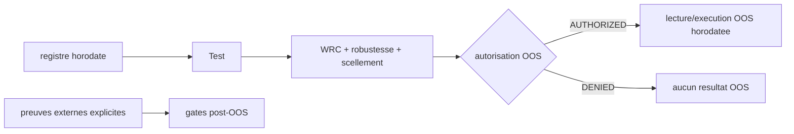

# Plan - Chantier mere Lot 3 : horodatage transversal et attestations

> Sous-chantier 3/4 de
> `EPIC_MATURITE_MOTEUR_CAMPAGNE_RECHERCHE`. Chantier mere de suivi pur :
> aucune modification directe de `Implementation/`. Trois enfants independants
> suivent chacun leur cycle complet.

## 0. Bandeau de statut (a verifier avant toute promotion)

| Question | Reponse |
| --- | --- |
| Un chantier actif couvre-t-il deja ce perimetre ? | Non. `active_workstream_id` est `null`. R7 est `DONE`; R5/R6 attend des decisions humaines. |
| Verrou de gouvernance ? | Aucun pour router la mere et l'enfant chronologie. L'enfant approbations humaines reste bloque avant code sur une decision de perimetre. |
| Decision humaine necessaire avant routage ? | Non pour la mere. Oui avant l'enfant 3, documentee sections 9-10. |
| Remplace-t-il un chantier existant ? | Non. Il generalise le patron UTC du Lot F sans rouvrir ce lot clos. |
| Test multi-lot | `MULTI_LOT`. Chronologie/horodatage, attestations mecaniques et approbations humaines ont des Exit criteria autonomes, peuvent etre reordonnes et un blocage humain du troisieme n'empeche pas les deux premiers. |

## Audit IA de promotion

- [x] Bootstrap, point d'entree Protocole et checklist lus.
- [x] `EBTA_Protocol_Guardian`, `epic-orchestrator` et `code-architecture-evaluator` appliques.
- [x] Constats verifies dans le code reel le 2026-07-20.
- [x] Brouillon converge en trois passes `/evaluate`.
- [x] Autorites : SOP 03, 10, 11, 12, 13 et `PAQUET D'EXECUTION EBTA.md`.
- [x] Aucun changement normatif/schema/dependance autorise par la mere.

## Triage

| Champ | Valeur |
| --- | --- |
| Track | `mainline` |
| Lifecycle | `TRIAGED` |
| Type de chantier | `MULTI_LOT` - trois enfants independants listes ci-dessous. |
| Scope | Coordonner la chronologie et les timestamps runtime, la derivation des attestations mecaniques et le contrat des approbations humaines/post-OOS afin qu'aucune preuve fixture ou constante ne soit presentee comme preuve reelle. |
| Non-goals | Ne pas modifier `Protocole/` ou les schemas, ne pas traiter R5/R6 ou R4-long, ne pas inventer une approbation, ne pas exiger un package global `PASS`, ne pas fusionner les enfants. |
| Source | Demande `/continue` de l'EPIC et regle anti-stagnation apres R7 ; brouillon `0 - HUMAN START HERE/PLAN_HORODATAGE_TRANSVERSAL_ET_ATTESTATIONS.md`. |
| Exit criteria | (1) enfant chronologie `DONE`; (2) enfant attestations mecaniques `DONE`; (3) enfant approbations humaines `DONE`; (4) aucun OOS execute avant gates/scellement/autorisation; (5) aucun timestamp fixture presente comme runtime; (6) aucune facade du perimetre ne produit `PASS`; (7) audits globaux PASS. |

## Sous-chantiers

| # | ID | Titre |
| --- | --- | --- |
| 1 | PLAN_CHRONOLOGIE_ET_HORODATAGE_EVENEMENTS_RUNTIME | Orchestration pre-OOS/OOS et timestamps des transitions produites |
| 2 | PLAN_DERIVATION_ATTESTATIONS_MECANIQUES | Deriver live_version, kill_switch et preuves G14 depuis artefacts reels |
| 3 | PLAN_CONTRAT_APPROBATIONS_HUMAINES_POST_OOS | Reviewer, approbations et preuves externes explicites |

Chaque `routing_reason` commence par `Sous-chantier <n>/3 de
PLAN_HORODATAGE_TRANSVERSAL_ET_ATTESTATIONS`.

## Statut

| Champ | Valeur |
| --- | --- |
| Statut | `NON_DEMARRE` |
| Date de creation | 2026-07-20 |
| Date d'activation | - |
| Autorite normative | SOP 03/10/11/12/13 ; Paquet d'execution |
| Classification | `GOVERNANCE` |
| Changement normatif attendu | Aucun |
| Dependances externes | Aucune nouvelle |

## Carte d'execution IA (lecture prioritaire pour `/continue`)

| Champ | Contenu operationnel |
| --- | --- |
| Objectif executable | Router et clore les trois enfants, puis prouver une chronologie et des attestations sans facade. |
| Autorite et lecture minimale | Ce plan, skill epic, SOP 10/12, Paquet, puis plan de l'enfant courant. |
| Perimetre autorise | Ce document uniquement pour la mere. |
| Interdits absolus | Aucun code depuis la mere; aucune approbation inventee; aucun schema/Protocole. |
| Phase de reprise | Enfant 1 - chronologie et horodatage runtime. |
| Preuve attendue | Enfants `DONE`, tests d'ordre negatif, gates sans constantes, suite et audits globaux. |
| Arret et escalade | Avant enfant 3 pour choisir les approbations humaines obligatoires; toute extension de schema. |

## 1. Role de ce document et non-objectifs

| Element | Role |
| --- | --- |
| SOP 03/10/11/12/13 | Autorites des evenements, acces OOS, cycle post-OOS, paquet et reviewers. |
| `Implementation/` | Traduction executable modifiee uniquement par les enfants. |
| Ce document | Coordination et journal de decisions, sans code. |

Non-objectifs : ne pas certifier scientifiquement un package, fabriquer une
preuve externe, toucher R5/R6, modifier les schemas ou etendre le checkpoint.

## 2. Contexte obligatoire a lire avant de coder

1. `AGENTS.md`, `.ai/README.md`, `.ai/checkpoint.json`.
2. Ce plan et `.agents/skills/epic-orchestrator/SKILL.md`.
3. `Protocole/0-README - Comprendre et maintenir le protocole EBTA.md`.
4. SOP 03, SOP 10, SOP 11, SOP 12, SOP 13.
5. `Protocole/PAQUET D'EXECUTION EBTA.md`.
6. `build_research_package.py`, `nautilus_research_package.py`, `sealing.py`,
   `oos_access.py`, `lifecycle.py`, `manifest_builder.py`.

Hierarchie : Protocole gele > registre/SOP/Paquet > Implementation > adaptateur.

## 3. Etat des lieux (avant/apres)

### Existant a reutiliser

| Module | Role reel | Decision |
| --- | --- | --- |
| `procedures/sealing.py` | UTC runtime + horloge fixture, seulement si scellement PASS. | Reutiliser; ne pas recreer. |
| `governance/bias_gate.py` | Timestamp UTC du rapport G-BIAS. | Conserver sauf besoin teste d'injection. |
| `governance/incident_logger.py` | Timestamp UTC par defaut des incidents. | Conserver. |
| `authorize_oos_access()` | Derive AUTHORIZED/DENIED depuis six flags. | Reutiliser avant toute execution OOS. |
| `deployment_gate()` | Derive le gate depuis paper trading, stage, kill switch et approbation. | Alimenter avec preuves, ne pas contourner. |

### Manques verifies

| Manque | Preuve | Enfant |
| --- | --- | --- |
| Registre timestamp fixe | `_write_registry(): "2026-01-01T00:00:00Z"` | 1 |
| OOS execute avant WRC/scellement/autorisation | `build_nautilus_inputs()` lance `oos_inputs`; gates calcules ensuite par `pilot.build_package()` | 1 |
| Timestamp OOS fixture recopie | builder Nautilus remplace IDs mais pas timestamp | 1 |
| Live/G14 constants | `_write_reports()` : identifiant/booleens fixes | 2 |
| Approbations/reviewers fixtures | `_write_reports()`, `_procedure_reports()`, `manifest_builder.py` | 3 |
| Reproduction/monitoring fixtures recopies | `pilot_inputs.json` utilise comme base Nautilus | 3 |

## 4. Decision d'architecture

Principe : un timestamp atteste une transition au moment ou elle arrive; une
approbation atteste une action d'un acteur identifie; un gate ne fait que deriver
un verdict depuis ces preuves. Aucun de ces trois niveaux ne se substitue aux
autres.



Frontieres :

- donnees marche/disponibilite : temps source, jamais remplace par l'horloge ;
- transitions runtime : horloge UTC injectable au point de transition ;
- preuves externes : fournies et horodatees par leur producteur ;
- gates : derivation pure, `INCONCLUSIVE` si preuve absente.

Perimetre de la mere :

```text
.ai/backlog/mainline/PLAN_HORODATAGE_TRANSVERSAL_ET_ATTESTATIONS.md  MODIFIER
```

Interdits a la mere : `Implementation/`, `Protocole/`, schemas, checkpoint hors
`plan.ps1`.

## 5. Decoupage en phases

### Phase 1 - Enfant chronologie et horodatage

Objectif : garantir l'ordre pre-OOS/OOS et horodater les transitions reelles.

Classification : IMPLEMENTATION_DETAIL

Actions :

- Revalider puis router l'enfant 1 avec boucle complete.
- Prouver par test espion qu'aucun runner OOS n'est appele avant autorisation.
- Prouver la capture UTC runtime et l'injection fixture.

Livrables :

- Workstream enfant 1 `DONE`.

Critere de sortie :

- Acces refuse => zero execution/serie OOS; acces autorise => timestamp capture juste avant lecture.

### Phase 2 - Enfant attestations mecaniques

Objectif : supprimer les facades live/G14 objectivement derivables.

Classification : IMPLEMENTATION_DETAIL

Actions :

- Router l'enfant 2.
- Deriver les preuves presentes; retourner `INCONCLUSIVE` quand l'artefact manque.

Livrables :

- Workstream enfant 2 `DONE`.

Critere de sortie :

- Test de contraste prouve qu'une preuve absente ne produit pas `PASS`.

### Phase 3 - Enfant approbations humaines/post-OOS

Objectif : distinguer fixture, preuve externe et approbation humaine reelle.

Classification : GOVERNANCE

Actions :

- Obtenir et journaliser la decision humaine de perimetre.
- Router/executer l'enfant 3, ou le differer explicitement.

Livrables :

- Workstream enfant 3 `DONE`. Une decision humaine peut choisir un contrat qui
  laisse certaines approbations absentes/`INCONCLUSIVE`, mais l'enfant doit tout
  de meme encoder et tester ce contrat puis etre clos; le backend multi-lot ne
  considere pas `BLOCKED` ou `SUPERSEDED` comme satisfait.

Critere de sortie :

- Absence d'approbation explicite => aucun gate concerne `PASS`.

### Phase 4 - Audit global de la mere

Objectif : verifier l'union des changements des enfants.

Actions :

- Bug-hunter global, suite complete, package/validator et conformance de la mere.

Livrables :

- Preuves globales et plan clos.

Critere de sortie :

- Tous les Exit criteria de la mere sont satisfaits.

## 6. Artefacts produits

| Enfant | Artefact |
| --- | --- |
| 1 | Chronologie pre-OOS/OOS et evenements UTC |
| 2 | Gates live/G14 derives |
| 3 | Contrat explicite des approbations/preuves externes |

## 7. Invariants absolus et NO GO

1. Jamais d'OOS avant autorisation effective.
2. Jamais de timestamp retroactif destine a masquer l'ordre reel.
3. Jamais d'approbation/reviewer fabrique dans le chemin production.
4. Absence de preuve => `INCONCLUSIVE`/DENIED, jamais `PASS`.
5. Fixtures clairement injectees et separees du chemin production.

NO GO : modifier une SOP/schema, fusionner les enfants, garantir un package
`PASS`, ou traiter un booléen humain comme calculable.

## 8. Verification a chaque etape

```powershell
python -m unittest discover -s Implementation\ebta_engine\tests -t Implementation
python Implementation\examples\minimal_pilot_pipeline\build_research_package.py
```

Chaque enfant precise ses tests negatifs, Pyrefly et artefacts. La phase
suivante ne demarre qu'apres sa cloture, sauf pause humaine documentee.

Premier lot executable : `PLAN_CHRONOLOGIE_ET_HORODATAGE_EVENEMENTS_RUNTIME`.

### Execution sans interruption

Les enfants 1 et 2 avancent sans decision humaine. L'enfant 3 impose l'arret
minimal liste section 10; le chantier R5/R6 reste separe.

### Autorite decisionnelle accordee

Details techniques autorises dans les perimetres enfants, sans changement de
statut, schema, seuil ou doctrine.

### Interdiction des raccourcis

Aucun timestamp/True injecte pour rendre un test vert; un package rouge honnete
est acceptable.

## 9. Journal des decisions humaines

| Date | Decision | Portee |
| --- | --- | --- |
| 2026-07-20 | EPIC multi-lot et recursion autorises; regle anti-stagnation. | Autorise ce chantier mere et l'avancement des enfants 1-2 pendant la pause R5/R6. |

## 10. Risques et blocages connus

| Risque | Impact | Mitigation |
| --- | --- | --- |
| R5/R6 non calibres | L'autorisation OOS honnete peut etre refusee. | Resultat legitime; ne pas executer l'OOS ni masquer le refus. |
| Perimetre humain non tranche | Enfant 3 bloque. | Demander la liste exacte; avancer enfants 1-2. |
| Refactor orchestration large | Regression du package builder. | Plan enfant ferme, tests espions d'ordre, suite complete. |
| Preuves post-OOS absentes | G11-G14 deviennent INCONCLUSIVE. | Verdict honnete attendu, pas un echec de chantier. |

## 11. Definition of Done

- [ ] Enfant 1 `DONE`.
- [ ] Enfant 2 `DONE`.
- [ ] Enfant 3 `DONE` (contrat explicite meme si les preuves restent absentes).
- [ ] Aucun OOS avant autorisation.
- [ ] Aucun timestamp/approval fixture presente comme runtime reel.
- [ ] Audits globaux PASS.

## 12. Cloture

| Champ | Valeur |
| --- | --- |
| Resultat final | A remplir |
| Ecarts | A remplir |
| Suites | Retour au Lot 2 R5/R6 ou Lot 4 selon decisions. |

## 13. Journal d'audits post-hoc

| Date | Correction | Pourquoi |
| --- | --- | --- |
| 2026-07-20 | Passe intake 1 : preuves externes separees des timestamps runtime; approbations retirees du lot mecanique. | Eviter de fabriquer reproduction/monitoring ou independance. |
| 2026-07-20 | Passe intake 2 : ordre pre-OOS/OOS ajoute au premier enfant. | Le builder execute actuellement l'OOS avant gates/scellement; un timestamp seul aurait masque la violation. |
| 2026-07-20 | Passe intake 3 : convergence sans nouvel angle mort majeur. | Frontieres et criteres negatifs devenus testables. |
| 2026-07-20 | Passe plan route 1 : suppression du report narratif de l'enfant 3; il doit atteindre `DONE` avec un contrat explicite, meme si les preuves restent absentes. | `plan.ps1` exige tous les IDs enfants `DONE`; un statut differe aurait rendu la mere mecaniquement in-cloturable. |
| 2026-07-20 | Passe plan route 2 : aucun nouvel angle mort majeur; convergence actee. | Les trois enfants ont des criteres binaires, les dependances humaines sont localisees, et la mere reste un suivi pur compatible avec le backend. |
