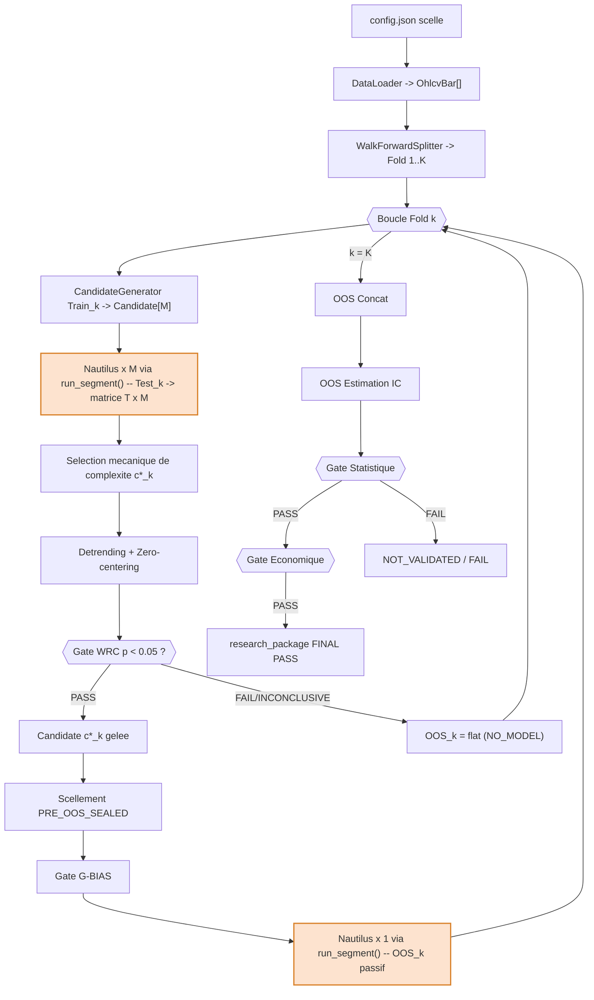
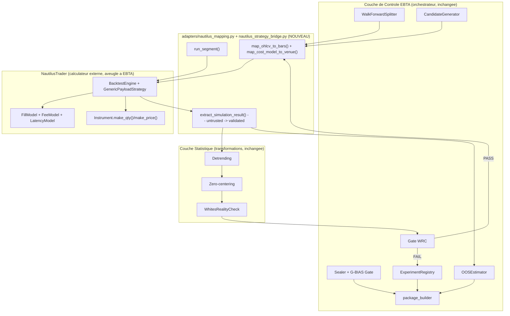

# Plan d'implementation — Migration du moteur de backtest EBTA vers NautilusTrader

> Reecriture structuree (gabarit `.ai/backlog/TEMPLATE_PLAN_IMPLEMENTATION.md`)
> du brouillon original `0 - HUMAN START HERE/Implementation_plan_Nautilus.md`
> (89299+ lignes cumulees, redige et corrige entre le 2026-07-07 et le
> 2026-07-08, incluant trois passes d'audit d'architecture). Le brouillon
> original est archive intact par `plan.ps1 start` sous
> `0 - HUMAN START HERE/archive/`. Cette reecriture reorganise le contenu
> selon la structure imposee par le gabarit et condense les paragraphes de
> commentaire d'audit (corrections successives, historiques de revision) en
> tableaux de decision — le contenu de fond (objectifs, decisions actees,
> contraintes, signatures, gates, artefacts) est preserve integralement.
> Pour le detail narratif complet de chaque correction d'audit, voir le
> brouillon archive.

---

## 0. Bandeau de statut (a verifier avant toute promotion)

| Question | Reponse |
| --- | --- |
| Un chantier actif couvre-t-il deja ce perimetre (`DONE`, `ACTIVE`, ou `SUPERSEDED`) ? | Non activement. Trois chantiers qui couvraient un perimetre proche ou concurrent ont ete clotures le 2026-07-09, avant ce routage : `STEP_3_BACKTRADER_INTEGRATION` (→ `SUPERSEDED`), `PLAN_IMPLEMENTATION_MOTEUR_BACKTEST_EBTA_NATIF` (→ `DONE`, reste `DONE` historiquement — ce pivot ne le renie pas, il le remplace pour la suite), `PLAN_IMPLEMENTATION_MOTEUR_BACKTEST_EBTA_NATIF_EXTENSION` (→ `SUPERSEDED`, c'etait `0 - HUMAN START HERE/implementation_plan - 1.md`, que ce document remplace explicitement). |
| Un verrou de gouvernance actif bloque-t-il ce chantier (ex. "ne pas etendre au-dela du MVP tant que X") ? | Oui a l'origine : `Implementation/Active/HOOK.md` section « Blocages volontaires » interdit de « demarrer d'extension au-dela du MVP » tant que le package natif et la suite runtime restent `PASS`. Ce verrou visait une extension du moteur natif, pas son remplacement. Il a ete leve pour ce perimetre precis par les decisions D1-D6 (2026-07-08, section 10 ci-dessous) et par la cloture explicite de `PLAN_IMPLEMENTATION_MOTEUR_BACKTEST_EBTA_NATIF_EXTENSION` (2026-07-09), qui portait la meme extension. `Implementation/Active/HOOK.md` et `Implementation/Active/tracking.json` restent neanmoins factuellement perimes (ils decrivent encore `NATIVE_ENGINE_PHASE_8_COMPLETED` comme etat courant) et doivent etre mis a jour explicitement avant toute phase de code (voir Phase 0 ci-dessous). |
| Ce plan a-t-il besoin d'une decision humaine explicite pour lever ce verrou avant d'etre routable via `/start` ? | Non — deja leve : decisions D1-D6 actees en conversation le 2026-07-08 (section 10), plus la decision humaine de clore les trois chantiers concurrents le 2026-07-09. Le routage `/start` lui-meme reste le dernier pas mecanique requis par le NO GO du brouillon original (« Demarrer un lot au-dela de LOT 0 avant que HOOK.md/tracking.json/checkpoint.json refletent reellement ce pivot »). |
| Ce plan remplace-t-il un document ou chantier existant ? | Oui — il remplace definitivement `0 - HUMAN START HERE/implementation_plan - 1.md` (chantier `PLAN_IMPLEMENTATION_MOTEUR_BACKTEST_EBTA_NATIF_EXTENSION`, cloture `SUPERSEDED` le 2026-07-09) pour toute la suite du projet. Il ne remplace pas `PLAN_IMPLEMENTATION_MOTEUR_BACKTEST_EBTA_NATIF` (le MVP natif Phases -1 a 8), qui reste `DONE` historiquement (decision D2) : ce plan-ci prend seulement le relais pour la suite du moteur de calcul. |

---

## Audit IA de promotion

- [x] Plan relu dans le contexte du cockpit actif (`AGENTS.md`, `.ai/README.md`, `.ai/checkpoint.json`, `Implementation/Active/HOOK.md`, `Implementation/Active/tracking.json`).
- [x] Bandeau de statut (section 0) rempli et verifie contre l'etat machine reel (checkpoint apres cloture des trois chantiers concurrents le 2026-07-09), pas suppose.
- [x] Ce plan a ete ECRIT COMME NOUVEAU FICHIER dans `.ai/backlog/mainline/` ; le brouillon original reste intact dans `0 - HUMAN START HERE/` jusqu'a l'archivage mecanique par `plan.ps1 start -Path <brouillon> -RewrittenPath <ce fichier>`.
- [x] Chantier classe `mainline` — c'est un remplacement du moteur de calcul du pipeline de recherche EBTA, priorite 1, meme categorie que le chantier natif qu'il remplace.
- [x] Autorite(s) normative(s) applicable(s) identifiee(s) : `Protocole/` (`EBTA-DOC-1.1`) prime sur tout, y compris sur ce document et sur NautilusTrader lui-meme.
- [x] Perimetre de fichiers/dossiers autorises et interdits explicite (section 1, section 8).
- [x] Aucune modification hors perimetre n'est requise pour activer le chantier, hormis la mise a jour de `Implementation/Active/HOOK.md`/`tracking.json`/`.ai/checkpoint.json` — listee et traitee comme Phase 0 (deblocage), pas une modification hors perimetre.
- [x] Prerequis factuels identifies et leur statut : installation Nautilus verifiee empiriquement (disponible), venv reproductible par `subst` (a ecrire, LOT 1 / Phase 2), decisions D1-D6 (disponibles, tranchees), contrats de types `SimulationResult`/`CostModel`/`InstrumentConfig`/`Candidate` (manquants, Phase 1).
- [x] Etat des lieux (section 4) verifie ligne par ligne contre le code reel (`grep` sur `Implementation/`) pour eviter de proposer un module qui duplique une logique deja existante et testee.

## Triage

| Champ | Valeur |
| --- | --- |
| Track | mainline |
| Lifecycle | TRIAGED |
| Scope | Remplacer le moteur de calcul financier du pipeline EBTA (actuellement `backtest/native_engine.py`, un MVP a fenetre figee jamais acheve au-dela de 4 observations) par NautilusTrader (`nautilus_trader==1.230.0`), invoque exclusivement via une frontiere d'adapter dediee (`adapters/nautilus_mapping.py`, `adapters/nautilus_strategy_bridge.py`), sans modifier `Protocole/`, sans modifier `procedures/`, `validators/`, `governance/`, `manifests/`, `package_builder/`. |
| Non-goals | Ne pas reecrire `Protocole/` ; ne pas creer de gate, statut ou seuil absent des SOP ; ne pas faire de BACKTRADER une dependance runtime (statut D3 inchange, reste lecture seule) ; ne pas faire du notebook Jupyter ou des tearsheets Nautilus une source de verdict statistique ou economique ; ne pas ouvrir OOS avant scellement et `G-BIAS PASS` ; ne pas utiliser `PortfolioAnalyzer`/`stats_returns`/Sharpe interne de Nautilus comme verdict EBTA ; ne pas importer `nautilus_trader` en dehors de `adapters/` ; ne pas etendre ce chantier a la mise en production live (`TradingNode`) — hors perimetre, bloque par gouvernance (`G13`). |
| Source | Conversation humaine 2026-07-07/2026-07-08/2026-07-09. Feasibility study initiale : `PROPOSITION_PIVOT_MOTEUR_NAUTILUS_TRADER.md` (decisions de gouvernance D1-D6, section 7, tranchees le 2026-07-08). Brouillon technique detaille : `0 - HUMAN START HERE/implementation_plan - 1.md` originel (`PLAN_IMPLEMENTATION_MOTEUR_BACKTEST_EBTA_NATIF_EXTENSION`, remplace par ce document). Trois passes d'audit d'architecture (`/evaluate`) menees sur le brouillon Nautilus les 2026-07-08. Decision humaine de clore les trois chantiers concurrents et de router ce document : 2026-07-09. |
| Exit criteria | `research_package/` produit par une boucle multi-fold reelle utilisant NautilusTrader via `run_segment()`, valide `PASS` par `validators/package_validator.py::validate_package_dir()`, avec zero modification de `procedures/`, `validators/`, `governance/`, `manifests/`, `package_builder/`, `Protocole/`. Retrait effectif de `backtest/native_engine.py`/`risk/sizing.py` par un commit dedie et trace, seulement apres ce PASS (LOT 5, jamais avant). |

## Statut

| Champ | Valeur |
| --- | --- |
| Statut | NON_DEMARRE |
| Date de creation | 2026-07-09 |
| Date d'activation | - |
| Autorite normative | `Protocole/` (`EBTA-DOC-1.1`), en particulier `Protocole/MANIFESTE DE GEL EBTA.md`, `Protocole/PROTOCOLE EBTA.md`, `Protocole/REGISTRE DES DECISIONS NORMATIVES EBTA.md`, les SOP 01-13 |
| Autorite executable | `Implementation/ebta_engine/` (traduction executable subordonnee) |
| Changement normatif attendu | Aucun — voir section 1 Non-objectifs |
| Dependances externes | `nautilus_trader==1.230.0` (exception stdlib-only accordee par decision D1, confinee a `adapters/nautilus_mapping.py` et `adapters/nautilus_strategy_bridge.py`) ; BACKTRADER reste reference lecture seule, non touche (decision D3) |

---

## 1. Role de ce document et non-objectifs

| Element | Role |
| --- | --- |
| `Protocole/` | Autorite normative absolue : ordre des gates, SOP, decisions, interdictions. Inchange, jamais modifie par ce document. |
| `Implementation/ebta_engine/procedures/`, `validators/`, `governance/`, `manifests/`, `package_builder/` | Traduction executable de la norme — gates, G-BIAS, scellement, assemblage du `research_package`. Inchanges par ce pivot (verifie module par module, section 4). |
| `Implementation/notebooks/` | Cockpit Jupyter d'orchestration, non normatif, jamais source de verdict — tearsheets Nautilus explicitement ignores. |
| `research_package/` | Artefact de preuve final que ce chantier doit continuer a produire, valide `PASS` par `validate_package_dir()`. |
| Ce plan | Carte d'implementation complete : quoi coder, ou, pourquoi, dans quel ordre, pour que NautilusTrader devienne le moteur de calcul financier pur du pipeline EBTA. |

Non-objectifs :

- ne pas reecrire `Protocole/` ;
- ne pas introduire de regle, seuil ou statut absent des SOP ;
- ne pas faire de NautilusTrader (ni de BACKTRADER) une source de verdict statistique ou economique — seul `procedures/` tranche ;
- ne pas faire d'un notebook, d'une visualisation ou d'un tearsheet Nautilus une source de verdict ;
- ne pas ouvrir OOS avant scellement et `G-BIAS PASS` ;
- ne pas importer `nautilus_trader` en dehors de `adapters/` et de son point d'entree d'execution ;
- ne pas ajouter de dependance technique (NumPy compris) sans decision humaine explicite tracee — `nautilus_trader` est la seule exception accordee (D1) ;
- ne pas etendre ce chantier au deploiement live (`TradingNode`) — objectif de portabilite future confirme (decision `E7`), mais hors perimetre d'execution de ce plan (bloque par `G13`).

---

## 2. Contexte obligatoire a lire avant de coder

1. `AGENTS.md` (racine) — bootstrap agent, ordre de lecture obligatoire du depot.
2. `.ai/README.md` — cockpit IA, cycle de vie des chantiers, contrat `/start`/`/continue`/`/close`.
3. `.ai/checkpoint.json` — etat machine macro courant ; verifier `active_workstream_id` et la liste `workstreams` avant toute action.
4. `Implementation/Active/HOOK.md` et `Implementation/Active/tracking.json` — etat machine micro courant. **Perimes au moment de l'ecriture de ce plan** (decrivent encore `NATIVE_ENGINE_PHASE_8_COMPLETED`) — leur mise a jour est la Phase 0 de ce plan, pas une lecture passive.
5. `Protocole/0-README - Comprendre et maintenir le protocole EBTA.md`, puis les SOP citees a chaque section de ce document (SOP 01 IC OOS, SOP 02 WRC/SPA/Romano-Wolf/MCPM, SOP 03 registre et candidates, SOP 04 walk-forward, SOP 05 robustesse, SOP 06 recherche et selection, SOP 07 detrending/zero-centering, SOP 08 gate economique, SOP 09A donnees PIT, SOP 09B modele d'execution, SOP 10 OOS, SOP 12 scellement/reproductibilite, SOP 13 G-BIAS).
6. `.ai/governance/AI_MODIFICATION_CHECKLIST.md` — checklist obligatoire avant toute modification normative, structurante ou impactant `Implementation/`.
7. `Implementation/PROCEDURE_CALCULATION_MAP.md` — mapping SOP → fichier `procedures/`, a ne jamais dupliquer.
8. `Implementation/adapters/nautilus_env/NAUTILUS_API_NOTES.md` et `Implementation/adapters/nautilus_env/INTROSPECTION_2026-07-08.txt` — evidence empirique deja verifiee de l'API Nautilus reelle installee sur ce poste, a preferer a toute hypothese tiree de la documentation seule.
9. Skill `nautilus-docs-research` — a invoquer avant tout appel reel a `nautilus_trader` (signature de classe, methode, enum) qui n'est pas deja verifie dans ce document ou dans `NAUTILUS_API_NOTES.md`.

**Hierarchie d'autorite applicable a ce chantier** :

```text
1. Protocole/MANIFESTE DE GEL EBTA.md
2. Protocole/PROTOCOLE EBTA.md
3. Protocole/REGISTRE DES DECISIONS NORMATIVES EBTA.md
4. SOP 01-13 individuelles
5. Protocole/PAQUET D'EXECUTION EBTA.md
6. Implementation/ (dont ce plan et l'adapter Nautilus)
7. Adaptateurs externes (NautilusTrader, BACKTRADER en lecture seule)
```

Regle : si le code (adapter Nautilus compris) contredit `Protocole/`, c'est le code qui a tort. Si une regle manque, le systeme doit bloquer ou retourner `INCONCLUSIVE`/`DEFERRED_REQUIRES_PIPELINE_DATA` plutot que deviner.

---

## 3. Table des gates (points de decision sequentiels)

Reprise integrale de la table des gates du protocole — ce pivot ne change ni l'ordre ni le sens d'aucune gate, seulement le moteur de calcul brut sous-jacent a `G4`/`G6`/`G9`/`G10`.

| Ordre | Gate | Question posee au systeme | Sortie si echec |
| --- | --- | --- | --- |
| G0 | Preenregistrement | La recherche, les folds, les seeds, les couts, les metriques et les regles sont-ils scelles avant resultat ? | Pas de recherche EBTA valide |
| G1 | Donnees point-in-time | Les donnees etaient-elles disponibles au moment de la decision ? | `FAIL` ou `INCONCLUSIVE` |
| G2 | Registre et candidates | Toutes les candidates influentes sont-elles dans le registre ? | `FAIL` ou `INCONCLUSIVE` |
| G3 | Selection locale | La candidate locale est-elle choisie mecaniquement selon la regle preenregistree ? | `NO_MODEL`, `STOP_PROCESS`, `NOT_VALIDATED` ou `INCONCLUSIVE` |
| G4 | Inference multiple Test | Le WRC local primaire passe-t-il sur la famille complete ? | Pas d'exposition sur `OOS_k` |
| G5 | Robustesse pre-OOS | Les stress-tests decisionnels preenregistres passent-ils ? | OOS non ouvert |
| G6 | Execution et capacite | Le modele d'execution, les couts, la capacite et la NAV sont-ils tradables ? | `REJECTED_ECONOMIC`, `FAIL` ou `INCONCLUSIVE` |
| G7 | Paquet pre-OOS | Le paquet `PRE_OOS_SEALED` est-il complet et hashe ? | OOS non ouvert |
| G8 | Ouverture OOS | L'acces OOS est-il autorise, journalise et precede par `G-BIAS PASS` ? | OOS non ouvert |
| G9 | Estimation OOS globale | L'IC OOS, la puissance et le gate statistique sont-ils calcules sur l'OOS global ? | `NOT_VALIDATED`, `FAIL` ou `INCONCLUSIVE` |
| G10 | Gate economique | La performance nette reelle, les couts, le risque et la capacite passent-ils le hurdle ? | `REJECTED_ECONOMIC` ou `INCONCLUSIVE` |
| G11 | Validation reproductible | Le paquet `VALIDATION_READY` est-il reproductible independamment ? | Pas d'incubation |
| G12 | Incubation | Le processus gele passe-t-il le paper trading prospectif ? | `FAIL`, `INCONCLUSIVE`, `WATCH` ou archivage |
| G13 | Deploiement limite | Le paquet `DEPLOYMENT_CERTIFIED`, les limites et le kill switch sont-ils prets ? | Pas de live |
| G14 | Cycle de vie | Monitoring, incidents, retraits et archive sont-ils journalises ? | Nouvelle version ou retrait |

`G-BIAS` (SOP 13) est transversal : il bloque notamment `G8`, `G11`, l'incubation ou le live s'il est `FAIL`, `INCONCLUSIVE` ou `BURNED`. Nautilus n'intervient qu'au calcul brut sous-jacent a `G4`/`G6`/`G9`/`G10`, jamais a la decision de gate elle-meme.

**Points d'appel Nautilus dans la boucle** (repris de la vue detaillee du brouillon original) : NautilusTrader ne possede aucune boucle EBTA — il n'a aucune notion de fold, de candidate, de famille, ou de concatenation OOS. Il est appele de facon atomique par `adapters/nautilus_mapping.py::run_segment()`, jamais plus de `M + 1` fois par fold (`M` evaluations `Test_k`, `+1` evaluation `OOS_k` si le fold franchit les gates, 0 sinon) — soit un total borne par `K × (M + 1)` sur `K` folds. Toutes les boucles (fold, candidate, concatenation finale) restent des boucles Python ordinaires dans `Implementation/ebta_engine/`, exterieures a tout objet Nautilus. Chaque appel `run_segment()` est independant et sans memoire du point de vue EBTA : il ne recoit jamais l'historique des appels precedents et ne sait jamais s'il execute `Train`, `Test` ou `OOS`.



Les deux seuls noeuds orange (`F`, `M`) sont les seuls points de tout le pipeline ou NautilusTrader est reellement invoque. Tout le reste (boucle fold, selection de complexite, detrending, WRC, scellement, G-BIAS, concatenation OOS, gates finaux) reste exactement le meme code `Implementation/ebta_engine/`.

---

## 4. Etat des lieux (avant/apres) — reutiliser avant de recreer

### Ce qui existe deja

| Module actuel | Chemin | Role reel (verifie) | Suffisant pour l'objectif ? |
| --- | --- | --- | --- |
| `DataLoader` partiel | `data/local_ohlcv.py` | Lit CSV → `OhlcvBar` (dataclass), filtre PIT par `start`/`end`, checksum par fichier | ⚠️ Reutiliser tel quel comme entree de `map_ohlcv_to_bars()` (Brique N1) |
| `StrategyPayload` | `strategies/payloads.py` | Dataclass conforme au schema, expose `to_dict()`/`payload_by_code()`/`build_payload_grid()`, pas de `from_dict()` | ⚠️ A etendre (ajout `from_dict()`, migration schema E1) |
| `validate_package_dir()` | `validators/package_validator.py` | Verifie structure + gates du paquet EBTA | ✅ Inchange |
| `package_builder/` (generique) | `package_builder/`, `examples/minimal_pilot_pipeline/build_research_package.py` | Assemble `research_package/`, orchestre deja `candidate_matrix`, `complexity_selection`, `data_availability`, `detrending`, `economic_gate`, `oos_access`, `oos_confidence_interval`, `optimization`, `robustness`, `sealing`, `search_space`, `walk_forward`, `wrc` | ✅ Inchange — reste l'orchestrateur d'assemblage, machinerie generique reutilisee par `strategies/generator.py` (Phase 5) |
| `package_builder/native_research_package.py` | `package_builder/native_research_package.py` | Point d'entree specifique au moteur natif — verifie : importe `run_native_backtest` (`backtest/native_engine.py`), `mean_return` (`metrics/performance.py`), `build_payload_grid` | ❌ Couple au moteur natif, distinct du `package_builder/` generique ci-dessus — meme sort que `backtest/native_engine.py` (decision E5, retrait Phase 6) |
| `persistence.py` | `persistence.py` | I/O bas niveau JSON/JSONL | ✅ Inchange |
| `governance/` (G-BIAS) | `governance/` | Registre incidents, `bias_gate`, checkers pre-OOS, guard d'acces OOS | ✅ Inchange, conforme SOP 13 |
| `procedures/search_space.py` | `procedures/search_space.py` | `expand_parameter_grid()`, `canonical_candidate_id()`, `build_search_space_snapshot()` | ✅ Inchange — attention : `build_search_space_snapshot()` ne peut que *lire* une cle `complexity` deja presente dans une ligne du produit cartesien, jamais la *deriver* (verifie lignes 70-79) — contrainte structurante pour `payload_factory.py` (Phase 1) |
| `procedures/optimization.py` | `procedures/optimization.py` | `optimize_on_train()` — selection du representant par niveau de complexite sur Train | ✅ Inchange |
| `procedures/complexity_selection.py` | `procedures/complexity_selection.py` | `select_complexity()` — argmax `P_Test_k(c)` + tie-break lexicographique, policy `NO_MODEL` | ✅ Inchange |
| `procedures/candidate_matrix.py` | `procedures/candidate_matrix.py` | `build_candidate_matrix()` — matrice `[T×M]`, rejette si des candidates influentes manquent | ✅ Inchange |
| `procedures/detrending.py` | `procedures/detrending.py` | `detrend_returns()` — `d_t = strat_net - cash - exposure*(market_drift - cash_drift)` (SOP 07) | ✅ Inchange — appele sur les colonnes produites par l'adapter Nautilus |
| `procedures/zero_centering.py` | `procedures/zero_centering.py` | `zero_center_columns()` + garde `assert_not_oos_zero_centering()` | ✅ Inchange |
| `procedures/bootstrap.py` | `procedures/bootstrap.py` | `stationary_block_indices()` + `resample_columns()` | ✅ Inchange |
| `procedures/wrc.py` | `procedures/wrc.py` (341 lignes) | `wrc_test()`, `spa_sensitivity_test()`, `romano_wolf_stepdown()`, `mcpm_permutation_test()` | ✅ Inchange — couvre integralement les gates statistiques |
| `procedures/oos_confidence_interval.py` | `procedures/oos_confidence_interval.py` (185 lignes) | Bootstrap OOS distinct du WRC, IC, p-value, puissance ; leve une erreur si `bootstrap_source` contient `WRC`/`TEST` | ✅ Inchange |
| `procedures/robustness.py` | `procedures/robustness.py` (298 lignes) | Valide un verdict de robustesse deja classifie (`CENTRAL/PLAUSIBLE_BASE/EXTREME`) ; ne calcule pas les scenarios | ✅ Inchange — le calculateur de scenarios (nouveau, `risk/robustness.py`) doit l'alimenter |
| `procedures/economic_gate.py` | `procedures/economic_gate.py` | Agrege des flags deja calcules en statut global, separe gate statistique et gate economique | ✅ Inchange — le calcul brut (nouveau, `metrics/economic_gate.py`) doit l'alimenter |
| `procedures/walk_forward.py` | `procedures/walk_forward.py` (169 lignes) | `validate_walk_forward_schedule()` — valide un calendrier deja construit (overlap, purge, embargo) | ⚠️ Ne construit pas les folds — voir manque ci-dessous |
| `adapters/backtrader_mapping.py` | `adapters/backtrader_mapping.py` | Table de correspondance de cles statique (`REQUIRED_EXTERNAL_KEYS`, `EBTA_ARTIFACT_MAP`, `validate_external_payload()`) — ne pilote aucun moteur, ne reconstruit aucune serie, jamais integree en runtime | ❌ Ne reduit pas le risque de la Brique N5 — prefigure seulement la philosophie (sortie externe non fiable), aucun code reutilisable |
| `backtest/native_engine.py`, `risk/sizing.py` | `Implementation/ebta_engine/` | Moteur de calcul MVP, fenetre figee (`entry_bar = bars[index+3]`, `exit_bar = bars[index+4]`, `max_observations=4`), cout forfaitaire | ❌ Retire (decision E5) — remplacement total, pas de comparaison L5 |
| `features/causal_signals.py`, `trading_signals/decision_frame.py`, `metrics/performance.py` | `Implementation/ebta_engine/` | Verifie par `grep` : docstrings « for the native EBTA MVP »/« Native metric helpers », importes uniquement par `backtest/native_engine.py` et/ou `package_builder/native_research_package.py` — jamais par `procedures/`, `validators/`, `governance/`, `manifests/` | ❌ Cluster natif complet — meme sort que `backtest/native_engine.py` (decision E5), omis du brouillon original, ajoute a l'inventaire lors de l'audit d'architecture (2026-07-09) |
| `Implementation/notebooks/` | Cockpit Jupyter | Orchestration sans logique metier | ✅ Inchange, tearsheets Nautilus ignores (decision B0-4) |
| `Implementation/adapters/nautilus_env/` | Environnement de verification | Venv de test + script d'introspection empirique de `nautilus_trader==1.230.0` (commit `cbd52eb`) | ⚠️ A generaliser en script de setup reproductible dans `Implementation/` (Phase 2, decision E6) — reste une preuve d'installation, pas encore l'environnement de production du chantier |

### Ce qui manque reellement

Contrairement au plan natif — ou la plupart des briques statistiques existaient deja —, **pour ce pivot, rien n'existe encore cote adapter Nautilus.** Chacune des briques ci-dessous s'appuie neanmoins sur une API Nautilus deja mature et verifiee empiriquement (section 2, point 8), pas sur un moteur a ecrire depuis zero.

| Brique manquante | Module a creer | Source de la regle | Ce qui existe deja et doit etre reutilise |
| --- | --- | --- | --- |
| Contrat de types `SimulationResult`, `CostModel`, `InstrumentConfig`, `Candidate` (4 types distincts, decision E2) | `strategies/contracts.py` (stdlib pur, hors `adapters/`) | Transversal — condition prealable a tout le reste | Aucun — `grep` negatif confirme sur tout `Implementation/` ; a concevoir en Phase 1, avant tout code Nautilus |
| Migration `config.schema.json` (decision E3) | `schemas/config.schema.json` + `migrations/` | SOP 12 | Le schema existant (`additionalProperties: false` au niveau racine, `required` ferme) — a etendre, jamais reinterprete via `execution_model` (`additionalProperties: true` qui ne valide rien reellement) |
| Migration `strategy_payload.schema.json` (decisions E1/E10/E11) | `schemas/strategy_payload.schema.json` + `migrations/` | SOP 06 | `entry_criterion`/`exit_criterion` passent de `string` libre a une forme structuree ; `payload_code`/`asset` passent d'un `enum` ferme a une contrainte de forme (`type: string`) |
| `StrategyPayload.from_dict()` | `strategies/payloads.py` | — | La classe existe (`to_dict()`, `payload_by_code()`, `build_payload_grid()}`) — seule la deserialisation manque |
| `payload_factory.py` (decisions E10/E11/E12) | `strategies/payload_factory.py` | SOP 06 §5, §8 | Doit s'appuyer sur `search_space.py::build_search_space_snapshot()` existant, appele une fois par combinaison structurelle (jamais modifie lui-meme) |
| Construction des folds depuis les barres | `data/walk_forward.py::WalkForwardSplitter` | SOP 04 | `procedures/walk_forward.py::validate_walk_forward_schedule()` existe et valide un calendrier deja construit — a appeler apres construction, jamais duplique |
| Conversion barres + instrument | `adapters/nautilus_mapping.py::map_ohlcv_to_bars()` (Brique N1) | SOP 09A | `data/local_ohlcv.py::OhlcvBar` existant en entree ; `BarDataWrangler`, `BarType.from_str()`, `CurrencyPair` Nautilus verifies empiriquement |
| Conversion couts/venue | `adapters/nautilus_mapping.py::map_cost_model_to_venue()` (Brique N2) | SOP 09B | `BacktestEngine.add_venue()`, `FillModel`/sous-classes, `FeeModel`, `LatencyModel`, `LeveragedMarginModel` Nautilus verifies empiriquement |
| Pont strategie generique | `adapters/nautilus_strategy_bridge.py::GenericPayloadStrategy` (Brique N3) | SOP 06, SOP 09B | `Strategy`, `StrategyConfig`, `OrderFactory.bracket()`/`.trailing_stop_market()`, `Clock`, `register_indicator_for_bars()` Nautilus verifies empiriquement |
| Orchestration d'un run | `adapters/nautilus_mapping.py::run_segment()` (Brique N4) | — | `BacktestEngine.run()`/`.reset()`/`.add_data()`/`.add_strategy()` verifies empiriquement — aucun equivalent natif jamais construit (`VectorizedSimulator.run()` n'a jamais existe) |
| Extraction du resultat | `adapters/nautilus_mapping.py::extract_simulation_result()` (Brique N5) | — | `cache.positions_closed()`, `engine.get_result()` verifies empiriquement — **aucun precedent fonctionnel dans le repo**, y compris `adapters/backtrader_mapping.py` qui n'est qu'une table de cles statique |
| Boucle multi-fold | `strategies/generator.py` (le fichier n'existe pas) | SOP 03, SOP 06 | Doit **appeler** `search_space.py`, `optimization.py`, `complexity_selection.py`, `candidate_matrix.py`, puis `run_segment()` — ne reimplemente rien |
| Calcul des scenarios de stress | `risk/robustness.py` | SOP 05 | Doit alimenter `procedures/robustness.py` (validateur de verdict, inchange) |
| Calcul des metriques economiques brutes | `metrics/economic_gate.py` | SOP 08 | Doit alimenter `procedures/economic_gate.py::economic_gate_report()` (agregateur, inchange) |

> **Interdiction transversale** (comme pour le plan natif) : ne jamais creer de seconde implementation d'une procedure deja presente dans `procedures/` (WRC, SPA, Romano-Wolf, MCPM, bootstrap, detrending, zero-centering, IC OOS, robustesse, gate economique) sous un chemin `adapters/`, `statistics/`, `metrics/` ou ailleurs. L'adapter Nautilus traduit des `SimulationResult` ; il ne recalcule jamais un verdict.

---

## 5. Decision d'architecture

**Principe directeur** : separation stricte moteur de backtest / couche de controle EBTA — pas une preference de style, une consequence directe du protocole.

- **Raison 1 — le moteur ne doit rien savoir du protocole.** Le moteur de backtest repond a une seule question : *« Si cette candidate avait ete executee sur cette serie de prix avec ces couts, qu'aurait-on obtenu ? »* C'est un calculateur financier deterministe, aveugle a la notion de `Train`/`Test`/`OOS` et aux gates methodologiques.
- **Raison 2 — sans cette separation, l'erreur methodologique devient invisible.** Rien dans le moteur ne peut empecher un appel a `run_segment(candidate, oos_bars, ...)` sans WRC prealable. La couche de controle est le seul endroit ou ce verrou existe reellement dans le code.
- **Coincidence structurelle favorable** : cette frontiere correspond exactement a celle deja implementee par NautilusTrader lui-meme entre `DataEngine`/`ExecutionEngine`/`RiskEngine` (qui ignorent tout du protocole EBTA) et le code appelant. La frontiere EBTA n'a donc pas besoin d'etre inventee contre l'outil, elle s'aligne avec son architecture native.



### Frontieres explicites

| Couche | Elle fait | Elle NE fait PAS |
| --- | --- | --- |
| Moteur (NautilusTrader, via l'adapter) | Lire les bars OHLCV triees, appliquer les signaux via `GenericPayloadStrategy.on_bar()`, calculer fills/couts/slippage/financement/latence, calculer la NAV mark-to-market, produire `orders`/`fills`/`positions`/`stats_returns` | Verifier s'il s'agit de donnees `Train`/`Test`/`OOS` ; savoir si l'OOS est autorise ; executer WRC ou `G-BIAS` ; sceller ou hasher ; decider du fold suivant ; journaliser dans le registre EBTA |
| Couche de controle EBTA | Decider quel segment soumettre, verifier la completude du registre avant WRC, bloquer l'appel OOS si WRC `FAIL`, sceller avant OOS, forcer `NO_MODEL`, journaliser chaque decision, transmettre le resultat OOS a la couche statistique | Le calcul des PnL/fills/NAV, la generation des signaux, le calcul du slippage/marge/couts, la valorisation mark-to-market |

### Contrat d'interface entre les couches

Le seul objet que l'adapter produit et que la couche EBTA consomme — **a concevoir et ecrire integralement en Phase 1 (stdlib pur, hors `adapters/`)**, aucun equivalent n'existe dans le code actuel (`grep` negatif sur `SimulationResult` dans tout `Implementation/`) :

```python
@dataclass
class SimulationResult:
    # --- Reconstruit par l'adapter depuis Nautilus ---
    candidate_id:   str
    segment:        str              # "train" | "test" | "oos" -- pose par l'appelant, jamais par Nautilus
    daily_returns:  list[float]      # longueur T -- r_net_t : rendement net quotidien
    daily_exposure: list[float]      # longueur T -- e_t in [-1, +1]
    nav:            list[float]      # longueur T+1 -- NAV mark-to-market
    orders:         list[dict]       # journal signal -> ordre -> fill
    fills:          list[dict]
    positions:      list[dict]
    total_costs:    float

    # --- Ajoute par la couche EBTA apres reception ---
    # fold_id, wrc_verdict, sealing_hash, oos_authorized... (orchestrateur, jamais Nautilus)
```

### Decisions deja actees (techniques)

| Decision | Justification |
| --- | --- |
| `SegmentSimulator` (Protocol/ABC) implemente par un fake de test leger, pas par le moteur natif (decision E5) | Le natif est retire, pas maintenu en parallele — un fake stdlib suffit a tester `procedures/` sans installer Nautilus |
| Cache barres converties via `ParquetDataCatalog`, hors `research_package/` (decision B0-3) | Evite de reconvertir les CSV a chaque `run_segment()` ; jamais scelle ni hashe par `manifests/` |
| `OmsType.HEDGING` + compte `MARGIN`/`LeveragedMarginModel` des le MVP (decisions B0-1/B0-2) | SOP 09B exige trades simultanes, pyramiding, marge initiale/maintenance — incompatibles avec `NETTING`/`CASH` |
| `entry_criterion`/`exit_criterion` en schema structure, pas en interpreteur de texte libre (decision E1) | Un interpreteur de texte quasi-naturel grossit sans borne et n'est jamais testable exhaustivement |
| `bias_filter` x `session` x `asset` en grille combinatoire complete (2x4x2 = 16 candidates), pas le sous-ensemble de 5 herite de `sweep_lq.py` (decision E11) | Traite les filtres comme des axes independants ; M revise a 16 (etait 10) pour le calcul `K x (M+1)` du LOT 1 |
| Contrat generique `StructuralAxis`/`StrategyFamilySpec` avec `requires` optionnel (decision E12) | Couvre a la fois les axes independants (E11) et les axes imbriques (comme le vrai `sweep_lq.py`) sans jamais reecrire `payload_factory.py` pour une famille future |
| `payload_code`/`asset` passent d'un `enum` ferme a une contrainte de forme (`type: string`) | Un enum ferme, meme elargi, obligerait une migration de schema a chaque nouvelle famille — contredit l'objectif « zero nouveau schema par famille » |

### Structure cible

> Verifie sur disque (2026-07-09) : `Implementation/adapters/nautilus_env/`
> et `Implementation/ebta_engine/adapters/` sont deux dossiers distincts a
> des niveaux differents — `nautilus_env/` n'a pas de `__init__.py`, il est
> **hors** du package Python importable `ebta_engine`, sibling de
> `ebta_engine/` sous `Implementation/`, pas un sous-dossier de
> `ebta_engine/adapters/`. Les deux nouveaux modules Nautilus vont dans
> `ebta_engine/adapters/` (importable via `from ebta_engine.adapters import
> nautilus_mapping`) ; `nautilus_env/` reste ou il est, seulement etendu
> (Phase 2) par un script de setup versionne.

```text
Implementation/
  adapters/
    nautilus_env/                 # EXISTANT (commit cbd52eb), hors package ebta_engine
      setup_env.ps1                 # NOUVEAU (Phase 2) -- subst + venv reproductible
      requirements.txt               # NOUVEAU (Phase 2) -- nautilus_trader==1.230.0 epingle
      venv/, NAUTILUS_API_NOTES.md, INTROSPECTION_2026-07-08.txt  # EXISTANTS, inchanges
  ebta_engine/
    strategies/
      contracts.py           # NOUVEAU -- SimulationResult, CostModel, InstrumentConfig, Candidate
      payload_factory.py      # NOUVEAU -- squelette + axes structurels + grille de parametres
      payloads.py              # EXISTANT -- + from_dict(), payload_by_code() devient appelant de payload_factory.py
      generator.py             # NOUVEAU -- orchestrateur de boucle fold/candidate
    data/
      walk_forward.py          # NOUVEAU -- WalkForwardSplitter (construction des folds)
      local_ohlcv.py            # EXISTANT -- inchange
    adapters/
      nautilus_mapping.py        # NOUVEAU -- map_ohlcv_to_bars, map_cost_model_to_venue, run_segment, extract_simulation_result
      nautilus_strategy_bridge.py # NOUVEAU -- GenericPayloadStrategy
      backtrader_mapping.py        # EXISTANT -- inchange, reference-only
    risk/
      robustness.py                  # NOUVEAU -- calcul des scenarios de stress
      sizing.py                       # RETIRE en Phase 6 (decision E5), pas avant
    metrics/
      economic_gate.py                 # NOUVEAU -- calcul des metriques economiques brutes
      performance.py                    # RETIRE en Phase 6 (decision E5, cluster natif) -- voir section 4
    features/
      causal_signals.py                  # RETIRE en Phase 6 (decision E5, cluster natif) -- voir section 4
    trading_signals/
      decision_frame.py                   # RETIRE en Phase 6 (decision E5, cluster natif) -- voir section 4
    procedures/, validators/, governance/, manifests/, schemas/, migrations/  # INCHANGES
    package_builder/
      (generique, inchange)                # voir section 4
      native_research_package.py            # RETIRE en Phase 6 (decision E5, cluster natif) -- voir section 4
    backtest/
      native_engine.py                       # RETIRE en Phase 6 (decision E5), pas avant
```

---

## 6. Decoupage en phases

> Convention de chunking mecanique respectee : chaque phase suit `### Phase <id> - <titre>`, puis `Objectif :`, `Classification :`, `Actions :`, `Livrables :`, `Critere de sortie :`, chacun suivi d'une liste a puces `- `.

### Phase 0 - Levee du verrou de gouvernance et synchronisation du cockpit

Objectif : refleter reellement ce pivot dans l'etat machine du projet avant toute phase de code, conformement au NO GO du brouillon original.

Classification : GOVERNANCE

Constat (pourquoi cette phase est necessaire) :

- `Implementation/Active/HOOK.md` et `Implementation/Active/tracking.json` decrivent encore `NATIVE_ENGINE_PHASE_8_COMPLETED` comme etat courant (dernieres mises a jour 2026-07-02), ils ne mentionnent pas ce pivot.
- `.ai/checkpoint.json` ne porte pas encore ce chantier comme `active_workstream_id` au moment de l'ecriture de cette phase.
- Le NO GO du brouillon original (section 8 ci-dessous) interdit explicitement de « demarrer un lot au-dela de LOT 0 avant que `HOOK.md`/`tracking.json`/`checkpoint.json` refletent reellement ce pivot ».

Actions :

- Router ce document via `plan.ps1 start -Audited` (fait par l'appel qui a produit ce fichier).
- Mettre a jour `Implementation/Active/HOOK.md` pour declarer ce chantier comme mainline actif et referencer ce fichier.
- Mettre a jour `Implementation/Active/tracking.json` avec les phases de ce document (via `.ai/tools/tasks_from_plan.ps1` si disponible, sinon manuellement en respectant `tracking.schema.json`).
- Activer le chantier (`/continue`) une fois HOOK.md/tracking.json coherents.

Livrables :

- `Implementation/Active/HOOK.md` reecrit, referencant ce plan.
- `Implementation/Active/tracking.json` reecrit, `current_step` pointant sur la Phase 1 de ce document.
- `.ai/checkpoint.json` avec `active_workstream_id = PLAN_IMPLEMENTATION_MOTEUR_BACKTEST_EBTA_NAUTILUS`.

Critere de sortie :

- `python -m json.tool Implementation\Active\tracking.json` et `python -m json.tool .ai\checkpoint.json` PASS.
- Validation schema des deux fichiers PASS (commandes section 9).
- `git diff --check -- .ai Implementation "0 - HUMAN START HERE"` PASS.

### Phase 1 - Contrat de types et migrations de schema (prealable a tout code Nautilus)

Objectif : ecrire les contrats de donnees stdlib purs que toutes les briques Nautilus consommeront, avant d'ecrire la moindre ligne dependant de `nautilus_trader`.

Classification : CONTRACT_ENCODING

Actions :

- Ecrire `strategies/contracts.py` : `SimulationResult`, `CostModel`, `InstrumentConfig`, `Candidate` (4 types distincts, decision E2), en stdlib pur, hors `adapters/`.
- Ajouter `StrategyPayload.from_dict()` a `strategies/payloads.py` (round-trip avec `to_dict()` existant).
- Migrer `schemas/config.schema.json` (`schema_version` → `1.1.0`, decision E3) : sous-schemas explicites `cost_model`/`instrument_config` sous `execution_model`, plus `complexity_definition`/`complexity_levels` sous `candidate_space`.
- Migrer `schemas/strategy_payload.schema.json` (`schema_version` → `1.1.0`, decision E1) : `entry_criterion`/`exit_criterion` en forme structuree ; `payload_code` et `asset` passent d'un `enum` ferme a `{"type": "string", "minLength": 1}`.
- Concevoir le mecanisme de migration lui-meme avant d'ecrire les migrations concretes : `migrations/` ne contient aujourd'hui qu'un `README.md` de politique (« aucune migration n'est requise tant que... »), aucun runner ni structure de version n'existe encore — ce n'est pas un pattern existant a reutiliser tel quel.
- Ecrire une migration testee dans `migrations/` pour chaque changement de schema, avec ce mecanisme (aucune perte d'information silencieuse, anciens fixtures rejetes ou migres explicitement).
- Ecrire `strategies/payload_factory.py` : `StructuralAxis`, `StrategyFamilySpec`, `generate_family()` (decisions E10/E11/E12) ; appelle `search_space.py::build_search_space_snapshot()` une fois par combinaison structurelle (8 appels pour la famille E-I/J-L), fusionne les listes `candidates` et recalcule un `canonical_hash`/`asset_candidate_count` global.
- Faire de `payload_by_code()`/`build_payload_grid()` (existant) un appelant de `payload_factory.py` — squelette et axes structurels re-exprimes comme donnees, pas de deuxieme implementation parallele.
- Definir `SegmentSimulator` (Protocol/ABC) et l'implementer par un fake de test leger (decision E5 — jamais par le moteur natif, qui est retire, pas adapte).

Livrables :

- `strategies/contracts.py`, `strategies/payload_factory.py`, `strategies/payloads.py::from_dict()`.
- `schemas/config.schema.json` et `schemas/strategy_payload.schema.json` en `schema_version: 1.1.0`, plus les migrations correspondantes dans `migrations/`.
- Fake `SegmentSimulator` de test.

Critere de sortie :

- `procedures/detrending.py` et `procedures/economic_gate.py` consomment un `SimulationResult` reel (produit par le fake de test) sans aucune modification de leur code.
- Tests unitaires sur les 4 types de `contracts.py`, `StrategyPayload.from_dict()`, les 2 migrations de schema, et `payload_factory.py` (16 candidates, 3 paliers 1/4/3, famille factice sans nouveau code Python) — PASS.
- Suite runtime complete (`python -m unittest discover -s Implementation\ebta_engine\tests -t Implementation`) reste PASS.

### Phase 2 - Spike de faisabilite Nautilus

Objectif : prouver que NautilusTrader tourne reellement dans `Implementation/` (pas seulement dans un venv de test isole) et produit un `SimulationResult` coherent, avant d'investir dans les briques completes.

Classification : ADAPTER_MAPPING

Constat :

- L'installation de `nautilus_trader==1.230.0` est deja confirmee empiriquement sur ce poste (`Implementation/adapters/nautilus_env/`, commit `cbd52eb`), mais dans un venv de test, pas encore selon la convention reproductible visee.
- `MAX_PATH` a deja fait echouer le chargement des `.pyd` Cython avec des chemins longs (dont le chemin reel du repo) — un contournement par lecteur court `subst` est requis, pas un dossier ad hoc hors repo.

Actions :

- Ecrire `Implementation/adapters/nautilus_env/setup_env.ps1` : `subst N: <racine du repo>`, creation du venv **dans** ce lecteur court (`N:\Implementation\.venv-nautilus`), dependances scellees dans `Implementation/adapters/nautilus_env/requirements.txt` (`nautilus_trader==1.230.0` epingle).
- Construire le cas jouet deterministe (`tests/fixtures/nautilus_golden_case/`, voir Annexe 6bis « Dispositif de verification automatisee ») : barres OHLCV fixes, un seul trade long, plus une fonction de reference `expected_result()` en Python stdlib pur (calcul independant, sans importer `nautilus_trader`) qui derive `daily_returns`/`nav`/`total_costs` a la main. Le `CostModel`/`InstrumentConfig` du cas jouet doit etre une configuration **degeneree et totalement deterministe** (`prob_fill_on_limit=1`, `prob_slippage=0`, `base_latency_nanos=0`, fill garanti au prix d'ouverture/cloture exact de la barre) — condition necessaire pour que `expected_result()` soit reellement calculable a la main, sans avoir a deviner le comportement probabiliste interne du `FillModel` Nautilus (`random_seed` ne suffit pas a rendre un calcul manuel exact si la probabilite de fill/slippage n'est pas fixee a une valeur degeneree).
- Executer un run simple (1 candidate x 1 fold) de bout en bout via `run_segment()` (version minimale, sans les briques N1-N5 completes si necessaire — objectif : bout-en-bout, pas complet) sur ce cas jouet.
- Comparer automatiquement (assertion avec tolerance, pas de lecture visuelle) le `SimulationResult` produit par Nautilus au `expected_result()` independant.
- Mesurer le temps d'execution par run et extrapoler a `K x (M+1)` avec les M/K reels declares par ce pivot (`M = 16`, decision E11 — jamais une formule raccourcie type `K = floor(N/N_min)`, explicitement rejetee par SOP 04 §6.5).

Livrables :

- `Implementation/adapters/nautilus_env/setup_env.ps1` + `requirements.txt` versionnes.
- `tests/fixtures/nautilus_golden_case/` (barres, payload, `expected_result()`) — reutilise tel quel par la Phase 5 (Brique N5), pas reconstruit deux fois.
- Note de mesure du temps d'execution et extrapolation `K x (M+1)`.

Critere de sortie :

- `BacktestEngine()` s'instancie et tourne depuis le venv reproductible cree par `setup_env.ps1`, execute depuis `Implementation/`.
- Assertion automatisee `SimulationResult(nautilus) == expected_result()` (tolerance explicite, ex. `1e-9`) — PASS, sans intervention humaine a chaque execution.
- Extrapolation `K x (M+1)` documentee avec les M/K reels (pas une formule raccourcie).

### Phase 3 - Brique N1 : ingestion de donnees

Objectif : charger les barres XAUUSD/NASDAQ dans Nautilus sans perte de precision ni lookahead, avec un `Instrument` correctement type pour les deux actifs.

Classification : ADAPTER_MAPPING

Actions :

- Implementer `adapters/nautilus_mapping.py::map_ohlcv_to_bars()` et `build_instrument()` selon la Brique N1 (section 7).
- Identifier la classe d'instrument NASDAQ candidate via le skill `nautilus-docs-research` (CFD / Equity Index CFD, piste posee le 2026-07-08, non encore verifiee contre l'API) ; `Implementation/adapters/nautilus_env/introspect_nautilus_claims.py` peut aider au diagnostic (construction manuelle, lecture du rapport texte produit), mais n'est PAS lui-meme un mecanisme PASS/FAIL (verifie : aucun `assert`, `main()` retourne toujours 0 — voir Annexe 6bis).
- Ecrire un vrai test (`tests/test_nautilus_instrument_nasdaq.py`, `unittest.TestCase`) qui construit reellement l'instrument candidat avec des parametres NASDAQ representatifs et asserte que les champs `margin_init`/`margin_maint`/`maker_fee`/`taker_fee`/`asset_class` existent et se comportent comme documente — PASS/FAIL mecanique reel (echec = `AssertionError`), rejouable a chaque execution de la suite.

Livrables :

- `map_ohlcv_to_bars()`, `build_instrument()` testes (specification detaillee : Annexe 6bis, Brique N1).
- `tests/test_nautilus_instrument_nasdaq.py`, integre a la suite runtime (`python -m unittest discover`).

Critere de sortie :

- Tests round-trip prix/quantite fixed-point sans derive sur XAUUSD et NASDAQ reels — PASS.
- Test `ts_init` = heure de cloture / `ts_init_delta` applique correctement — PASS.
- `instrument.margin_init == config declare` verifie pour les deux actifs.
- `tests/test_nautilus_instrument_nasdaq.py` — PASS. Si elle echoue (classe candidate incorrecte), la Phase 3 s'arrete et remonte le desaccord empirique plutot que de deviner une classe alternative.

### Phase 4 - Briques N2 + N3 : pont strategie et couts

Objectif : rendre une candidate EBTA quelconque executable dans Nautilus sans classe dediee, avec couts/marge/OMS conformes SOP 09B.

Classification : ADAPTER_MAPPING

Actions :

- Implementer `adapters/nautilus_mapping.py::map_cost_model_to_venue()` (Brique N2).
- Implementer `adapters/nautilus_strategy_bridge.py::GenericPayloadStrategy` + `GenericPayloadStrategyConfig` (Brique N3), en s'appuyant sur `entry_criterion`/`exit_criterion` structures (Phase 1).

Livrables :

- `map_cost_model_to_venue()`, `GenericPayloadStrategy`, `GenericPayloadStrategyConfig` testes (specification detaillee : Annexe 6bis, Briques N2/N3).

Critere de sortie :

- `GenericPayloadStrategy` couvre les champs structures de `StrategyPayload` — une seule classe, `StrategyConfig` different par candidate.
- `add_venue()` appele avec les parametres scelles (jamais un `FillModel`/`FeeModel`/`LatencyModel` par defaut non declare).
- Test que `GenericPayloadStrategy` reste identique quelle que soit la candidate — PASS.

### Phase 5 - Briques N4 + N5 : adapter d'extraction et boucle multi-fold

Objectif : produire un `SimulationResult` fiable, branche sur `procedures/` existant sans aucune modification de ces fichiers.

Classification : ADAPTER_MAPPING

Actions :

- Implementer `adapters/nautilus_mapping.py::run_segment()` (Brique N4).
- Implementer `adapters/nautilus_mapping.py::extract_simulation_result()` (Brique N5) — point de risque le plus eleve du pivot, aucun precedent fonctionnel dans le repo.
- Etendre le cas jouet deterministe herite de la Phase 2 (`tests/fixtures/nautilus_golden_case/`) avec 2-3 variantes couvrant les cas structurants (`NO_MODEL`/exposition nulle, trade partiellement rempli, cout non nul) et figer `expected_result()` correspondants ; committer `tests/test_nautilus_golden_case.py` qui execute `extract_simulation_result()` sur chaque variante et asserte l'egalite avec tolerance — ce test devient une porte automatique de la suite runtime a partir de cette phase, plus jamais une verification a la main.
- Ecrire `strategies/generator.py` (boucle multi-fold, orchestrateur — appelle `search_space.py`, `optimization.py`, `complexity_selection.py`, `candidate_matrix.py`, puis `run_segment()`).
- Ecrire `risk/robustness.py` (calcul des scenarios de stress, alimente `procedures/robustness.py`).
- Ecrire `metrics/economic_gate.py` (calcul des metriques economiques brutes, alimente `procedures/economic_gate.py`).
- Ecrire `data/walk_forward.py::WalkForwardSplitter` (construction des folds, alimente `procedures/walk_forward.py::validate_walk_forward_schedule()`).

Livrables :

- `run_segment()`, `extract_simulation_result()`, `strategies/generator.py`, `risk/robustness.py`, `metrics/economic_gate.py`, `data/walk_forward.py` testes (specification detaillee : Annexe 6bis, Briques N4/N5).
- `tests/test_nautilus_golden_case.py`, integre a `python -m unittest discover -s Implementation\ebta_engine\tests` — regression automatique et permanente sur la Brique N5.

Critere de sortie :

- Detrending, WRC, IC OOS, gate economique tournent sur des donnees Nautilus sans changement de signature.
- `tests/test_nautilus_golden_case.py` PASS sur toutes les variantes — remplace la verification manuelle ponctuelle par une assertion rejouable a chaque execution future de la suite (seule verification restante en l'absence de second moteur, decision E5, mais desormais mecanique).
- Test que `run_segment()` ne recoit jamais de metadonnee de segment transmise a Nautilus — PASS.
- Tests `NO_MODEL` conserve dans l'OOS global — PASS.

### Phase 6 - Bascule et retrait du moteur natif

Objectif : produire un `research_package/` complet via Nautilus, valide `PASS`, puis retirer le code natif devenu obsolete.

Classification : IMPLEMENTATION_DETAIL

Actions :

- Generer un `research_package/` complet a partir d'une vraie boucle multi-fold utilisant Nautilus.
- Verifier les invariants methodologiques (section 8) sur des cas synthetiques a verite connue.
- Etape 1 (avant tout changement de cette phase) : poser un tag git annote `pre-nautilus-cutover` sur le dernier commit contenant encore le moteur natif fonctionnel — point de restauration pose avant, pas apres.
- Etape 2 : une fois PASS confirme (research_package + golden tests Phase 5 + tag pose) : retirer `backtest/native_engine.py`, `risk/sizing.py`, `features/causal_signals.py`, `trading_signals/decision_frame.py`, `metrics/performance.py` et `package_builder/native_research_package.py` (cluster complet du moteur natif, verifie par grep — voir section 4) et le `research_package` natif MVP par un commit dedie et trace (decision E5 — jamais melange a un autre changement, commit isole).
- Etape 3 (immediatement apres, meme session, avant de considerer la phase terminee) : verifier mecaniquement que ce commit de retrait qui vient d'etre cree est reellement reversible en simulant l'annulation (`git revert --no-commit <sha-du-commit-que-l-on-vient-de-creer>` puis `git revert --abort` immediat, sans jamais pousser cet essai) — on ne peut pas tester le revert d'un commit avant qu'il existe, donc cette verification suit necessairement le commit, jamais avant.

Livrables :

- `research_package/` produit via Nautilus, `PASS`.
- Tag git `pre-nautilus-cutover` (point de restauration mecanique, pose avant le commit de retrait).
- Commit dedie de retrait du cluster natif complet (les 6 fichiers listes ci-dessus), reversibilite verifiee juste apres sa creation.

Critere de sortie :

- `validate_package_dir()` retourne `PASS` sur le paquet produit via Nautilus.
- Suite runtime complete (y compris `tests/test_nautilus_golden_case.py`, Phase 5) reste `PASS` apres retrait du moteur natif.
- Aucune modification de `procedures/`, `validators/`, `governance/`, `manifests/`, `package_builder/` (hors `native_research_package.py`), `Protocole/` sur l'ensemble du chantier.
- Aucun import residuel vers `backtest.native_engine`, `risk.sizing`, `features.causal_signals`, `trading_signals.decision_frame`, `metrics.performance` ou `package_builder.native_research_package` ailleurs dans `Implementation/` apres le commit de retrait (`grep` de verification).
- Retour arriere verifie juste apres le commit de retrait (Etape 3 ci-dessus), pas avant : `git revert <sha-du-commit-de-retrait>` restaure integralement le cluster natif sans conflit ; en dernier recours, `git reset --hard pre-nautilus-cutover` restaure l'etat complet avant retrait — jamais execute automatiquement, disponible pour decision humaine explicite en cas de defaut decouvert tardivement.

## 6bis. Annexe — Specifications techniques Brique par Brique

> Details d'implementation des Briques N1-N5 (signatures, invariants, tests),
> deliberement separes de la section 6 "Decoupage en phases" — le chunking
> mecanique (`.ai/tools/tasks_from_plan.ps1`) ne reconnait que les labels
> `Objectif`/`Classification`/`Actions`/`Livrables`/`Critere de sortie` et la
> limite `### Phase <id> - <titre>` ; toute prose placee apres `Critere de
> sortie :` a l'interieur d'un bloc de phase (y compris un `#### Brique ...`)
> est absorbee dans le dernier `exit_criteria` genere, verifie par execution
> reelle du script en `-DryRun` lors de l'audit d'architecture de ce plan
> (2026-07-09). Chaque phase de la section 6 renvoie ici depuis sa ligne
> `Livrables`.

### Dispositif de verification automatisee (remplace les etapes "manuelles")

> Ajoute lors de la 5e passe d'audit (2026-07-09), a la demande explicite de
> ne pas dependre d'une validation humaine repetee entre phases : chaque
> point du plan initialement decrit comme "verification manuelle" est
> reformule ici en mecanisme rejouable automatiquement, pour que l'IA puisse
> enchainer les phases sans confirmation humaine a chaque etape, sauf echec
> reel d'une assertion.

**Cas jouet deterministe** (`tests/fixtures/nautilus_golden_case/`, construit
en Phase 2, etendu en Phase 5) :

- Une serie de barres OHLCV fixes et connues (ex. 5-8 barres, valeurs
  arbitraires mais figees dans le fixture, jamais generees aleatoirement).
- Un `StrategyPayload`/`Candidate` simple et deterministe (ex. un seul trade
  long, entree/sortie sur des barres precises, pas de logique conditionnelle
  complexe).
- Une fonction `expected_result()` en Python stdlib pur, committee a cote du
  fixture, qui calcule `daily_returns`/`daily_exposure`/`nav`/`total_costs` a
  la main a partir des memes barres — **sans jamais importer
  `nautilus_trader`**, pour rester une reference independante du moteur
  qu'elle sert a verifier.
- Assertion : `SimulationResult` produit par `run_segment()`/
  `extract_simulation_result()` doit egaler `expected_result()` avec une
  tolerance numerique explicite (ex. `1e-9`), verifiee par
  `unittest.TestCase.assertAlmostEqual` ou equivalent — jamais par lecture
  humaine d'une sortie console.
- Ce cas jouet est construit une fois (Phase 2, verification informelle du
  spike) puis fige comme test de non-regression permanent
  (`tests/test_nautilus_golden_case.py`, Phase 5) — il continue de tourner a
  chaque `python -m unittest discover` des phases suivantes, y compris apres
  le retrait du moteur natif (Phase 6).

**Confirmation d'un fait API Nautilus (ex. classe d'instrument NASDAQ,
Phase 3)** : le skill `nautilus-docs-research` identifie la piste candidate
(lecture de documentation), puis un script d'introspection construit
reellement l'objet candidat et verifie ses attributs par le code.

> [!WARNING]
> **Correction d'audit (2026-07-09, 5e passe).** La redaction initiale
> affirmait que `Implementation/adapters/nautilus_env/introspect_nautilus_claims.py`
> etait deja « le meme patron eprouve » pour ce genre de verification —
> **faux, verifie directement dans le fichier** (`grep -n "assert \|sys.exit\|return 1"`
> ne trouve aucune occurrence pertinente) : `describe()` et
> `construction_checks()` catchent les exceptions pour les **imprimer**
> comme texte (`print(f"... FAIL {exc}")`) et `main()` fait toujours
> `return 0`, quel que soit le contenu affiche. C'est un generateur de
> rapport texte pour lecture humaine
> (`INTROSPECTION_2026-07-08.txt`), **pas un mecanisme PASS/FAIL mecanique**.
> La Phase 3 ne peut donc pas se contenter d'« etendre » ce script comme une
> simple addition a la liste `SYMBOLS` : elle doit soit y ajouter de vrais
> `assert` avec un exit code differencie, soit porter la verification dans
> `tests/` sous forme de `unittest.TestCase` reel (recommande, coherent avec
> le reste de la suite runtime deja `unittest`-based). Le reutiliser comme
> aide au diagnostic (identifier la classe candidate) reste legitime ; le
> citer comme preuve mecanique deja existante ne l'est pas.

**Retour en arriere (Phase 6, retrait du moteur natif)** : tag git
`pre-nautilus-cutover` pose avant le commit de retrait, plus verification
scriptee que ce commit est reellement `git revert`-able avant de l'executer
pour de vrai (voir Phase 6, Actions). Ce n'est pas une simple precaution
documentee — c'est une commande executee et son resultat verifie avant
l'action irreversible elle-meme.

**Politique d'enchainement resultante** : des lors que ces trois dispositifs
sont en place, aucune phase de ce plan ne requiert plus de validation
humaine intermediaire pour continuer — l'IA s'arrete uniquement si une
assertion echoue reellement (golden test, introspection scriptee, suite
runtime), si un fait empirique contredit une hypothese du plan (ex. la classe
NASDAQ candidate echoue), ou juste avant l'action de retrait de la Phase 6
pour rapporter que le tag et la verification de reversibilite sont en place
(rapport, pas une demande d'autorisation — le commit suit si tout est
`PASS`).

### Chemin critique (ordre des phases)

```mermaid
flowchart LR
    subgraph P0["Phase 0 - Gouvernance"]
        p0a[HOOK/tracking/checkpoint]
    end
    subgraph P1["Phase 1 - Contrats + schemas"]
        p1a[SimulationResult, payload_factory]
    end
    subgraph P2["Phase 2 - Spike"]
        p2a[venv reproductible, 1 run]
    end
    subgraph P3["Phase 3 - N1 donnees"]
        p3a[map_ohlcv_to_bars]
    end
    subgraph P4["Phase 4 - N2+N3 pont"]
        p4a[GenericPayloadStrategy]
    end
    subgraph P5["Phase 5 - N4+N5 extraction"]
        p5a[run_segment, extract_simulation_result]
    end
    subgraph P6["Phase 6 - Bascule"]
        p6a[research_package PASS, retrait natif]
    end
    P0 --> P1 --> P2 --> P3 --> P4 --> P5 --> P6
```



### Brique N1 — `adapters/nautilus_mapping.py::map_ohlcv_to_bars()` (Phase 3)

**Role** : SOP 09A — ingestion PIT.

```python
def map_ohlcv_to_bars(
    bars: list[OhlcvBar],
    *,
    bar_type: str,                  # ex. "XAUUSD.SIM-1-DAY-LAST-EXTERNAL"
    ts_init_delta: int = 0,         # nanosecondes -- ts_init doit representer la cloture (anti-lookahead)
) -> tuple[list["Bar"], "Instrument"]:
    """N'accepte jamais de metadonnee de segment (Train/Test/OOS)."""

def build_instrument(
    symbol: str, venue: str, *,
    price_precision: int, size_precision: int,
    price_increment: str, size_increment: str,
    margin_init: str, margin_maint: str,
    maker_fee: str, taker_fee: str,
) -> "CurrencyPair":
    """marge/frais portes par l'Instrument, pas par add_venue() -- verifie empiriquement."""
```

- **Entrees** : `list[OhlcvBar]` EBTA existant, config d'instrument declaree dans `config.json` scelle.
- **Sorties** : `list[Bar]` Nautilus + `Instrument` Nautilus construit.
- **Contraintes verifiees empiriquement** : `Price.from_str()` accepte un raw `i64` borne par `[-9223372036000000000, 9223372036000000000]` (echelle `1e9`) — XAUUSD (~3000) et NASDAQ (~20000) en sont a plusieurs ordres de grandeur.
- **Invariants interdits a violer** : laisser Nautilus deduire lui-meme quel segment il recoit ; construire l'`Instrument` avec des valeurs de marge/frais par defaut non scellees.
- **Test de validation** : round-trip prix/quantite + `ts_init` de cloture.

### Brique N2 — `adapters/nautilus_mapping.py::map_cost_model_to_venue()` (Phase 4)

**Role** : SOP 09B — modele d'execution, frictions, sizing.

```python
def map_cost_model_to_venue(
    engine: "BacktestEngine",
    venue: "Venue",
    cost_model: CostModel,          # [Phase 1]
    *,
    starting_balances: list["Money"],
    seed: int,
) -> None:
    """
    engine.add_venue(
        venue=venue,
        oms_type=OmsType.HEDGING,           # decision B0-1
        account_type=AccountType.MARGIN,    # decision B0-2
        starting_balances=starting_balances,
        margin_model=LeveragedMarginModel(),
        fill_model=FillModel(prob_fill_on_limit=..., prob_slippage=..., random_seed=seed),
        fee_model=MakerTakerFeeModel(),
        latency_model=LatencyModel(base_latency_nanos=cost_model.latency_nanos),
    )
    """
```

- **Entrees** : `CostModel` EBTA (`commission_per_lot`, `slippage_bps`, `financing_rate_daily`, `impact_model`), `starting_balances`, `seed`.
- **Sorties** : aucune valeur de retour — effet de bord sur `engine` via `add_venue()`.
- **Modeles de fill disponibles** (verifies empiriquement) : `FillModel`, `BestPriceFillModel`, `ThreeTierFillModel`, `SizeAwareFillModel`, `TwoTierFillModel`, `VolumeSensitiveFillModel`, `MarketHoursFillModel`, `OneTickSlippageFillModel`, `CompetitionAwareFillModel`, `LimitOrderPartialFillModel`, `ProbabilisticFillModel`. Le choix reste un parametre declare dans `config.json`, jamais code en dur.
- **Modeles de frais disponibles** : `MakerTakerFeeModel`, `FixedFeeModel`, `PerContractFeeModel`.
- **Invariants interdits a violer** : utiliser un `FillModel`/`FeeModel`/`LatencyModel` par defaut non declare dans `config.json` preenregistre.

### Brique N3 — `adapters/nautilus_strategy_bridge.py::GenericPayloadStrategy` (Phase 4)

**Role** : SOP 06, SOP 09B.

```python
class GenericPayloadStrategyConfig(StrategyConfig, frozen=True):
    payload: dict  # StrategyPayload.to_dict()

class GenericPayloadStrategy(Strategy):
    """Unique classe Strategy Nautilus pour toute la famille de candidates.
    Interdit : une classe Python par candidate."""
    def __init__(self, config: GenericPayloadStrategyConfig) -> None:
        super().__init__(config)
        self._payload = StrategyPayload.from_dict(config.payload)  # Phase 1

    def on_start(self) -> None:
        ...  # self.clock.set_timer()/set_time_alert() pour time_filter/session
             # self.register_indicator_for_bars(bar_type, indicator)

    def on_bar(self, bar: "Bar") -> None:
        ...  # entry_criterion / exit_criterion / bias_filter via
             # self.order_factory.bracket(...) / .trailing_stop_market(...)
```

- **`time_filter`/`session`** : traduits vers `self.clock.set_time_alert(...)`/`.set_timer(...)`, jamais une condition Python reevaluee a chaque barre.
- **Types d'ordres (decision B0-1)** : `self.order_factory.bracket(...)` (SL/TP lies) et `.trailing_stop_market(...)`.
- **OMS (decision B0-1)** : `OmsType.HEDGING`.
- **Invariants interdits a violer** : generer une classe Python par candidate ; acceder aux barres futures ; tout raccourci « parce qu'on est en recherche » cassant la portabilite vers `TradingNode`.
- **Dependances** : `strategies/payloads.py::StrategyPayload.from_dict()` (Phase 1).

### Brique N4 — `adapters/nautilus_mapping.py::run_segment()` (Phase 5)

```python
def run_segment(
    candidate: Candidate,               # Phase 1
    bars: list[OhlcvBar],
    cost_model: CostModel,               # Phase 1
    instrument_config: InstrumentConfig, # Phase 1
    *,
    seed: int,
    engine: "BacktestEngine | None" = None,
) -> SimulationResult:                  # Phase 1
    """
    eng = engine or BacktestEngine(BacktestEngineConfig())
    nautilus_bars, instrument = map_ohlcv_to_bars(bars, ...)
    eng.add_instrument(instrument)
    map_cost_model_to_venue(eng, venue, cost_model, seed=seed)
    eng.add_data(nautilus_bars)
    strategy_config = GenericPayloadStrategyConfig(payload=candidate.payload.to_dict())
    eng.add_strategy(GenericPayloadStrategy(strategy_config))
    eng.run()
    result = extract_simulation_result(eng, candidate, segment=...)
    if engine is not None:
        eng.reset(); eng.clear_data(); eng.clear_strategies()
    return result
    """
```

- **Role** : point d'entree unique appele par la boucle multi-fold EBTA.
- **Passage a l'echelle** : `engine.run(streaming=True)` seulement si le spike (Phase 2) mesure un besoin reel sur `K x (M+1)`, pas par anticipation.
- **Invariants interdits a violer** : appeler ceci sur des barres `OOS_k` avant que la couche de controle ait valide WRC + robustesse + G-BIAS + scellement — cette garde reste entierement dans la couche de controle, jamais dans l'adapter.

### Brique N5 — `adapters/nautilus_mapping.py::extract_simulation_result()` (Phase 5)

Le coeur reel de la frontiere « sortie externe non fiable → contrat EBTA valide ». Reconstruire `daily_returns`/`daily_exposure` net-quotidien depuis `positions_closed()` n'est pas documente nativement par Nautilus — c'est un developpement neuf sans precedent fonctionnel dans le repo.

```python
def extract_simulation_result(
    engine: "BacktestEngine",
    candidate: Candidate,      # Phase 1
    *,
    segment: str,
) -> SimulationResult:          # Phase 1
    """
    Reconstruit depuis engine.cache.positions_closed() et engine.get_result().
    Leve NautilusExtractionError plutot que de deviner une valeur manquante --
    jamais de comblement silencieux.
    """
```

- **Invariants interdits a violer** : combler silencieusement un jour manquant dans la serie de rendements, ou deduire une exposition non observee.
- **Test de validation** : `tests/test_nautilus_golden_case.py` (voir « Dispositif de verification automatisee » ci-dessus) — assertion automatisee contre `expected_result()`, tolerance explicite, aucune lecture humaine requise, rejouable a chaque execution de la suite.

---

## 7. Artefacts produits

Noms de fichiers reels verifies contre `Implementation/examples/minimal_pilot_pipeline/research_package/` (le seul `research_package` reel actuellement produit).

| Etape | Fichier/sortie | Format | Regle source |
| --- | --- | --- | --- |
| Preenregistrement | `config.json` | JSON scelle + hash | SOP 12 |
| Folds | `reports/fold_schedule.json` | JSON | SOP 04 |
| Espace de recherche | `reports/search_space.json` | JSON | SOP 06 §5 |
| Calibration Train | `reports/optimization_log.json` | JSON | SOP 06 §9-10 |
| Selection de complexite | `reports/complexity_selection.json` | JSON | SOP 06 §12 |
| Candidates / Matrice | `reports/candidate_matrix.json` | JSON | SOP 03 |
| WRC | `reports/wrc.json` | JSON : p-value, indices bootstrap | SOP 02 |
| Robustesse | `reports/robustness.json` | JSON | SOP 05 |
| Execution / Capacite | `reports/execution.json` | JSON | SOP 09B |
| Scellement | `reports/sealing.json` | JSON | SOP 12 |
| OOS acces | `oos_access_log.jsonl` | JSONL append-only | SOP 10 |
| Detrending (OOS global, seul, sans zero-centering) | `reports/detrending.json` | JSON | SOP 07 |
| Serie OOS | `series/oos_primary_returns.json` | JSON (pas CSV) | SOP 08 |
| Registre complet | `registry.jsonl` | JSONL append-only | SOP 03 |
| Estimation OOS | `reports/oos.json` | JSON : IC, puissance, verdict | SOP 01 |
| Gate economique | `reports/economic.json` | JSON | SOP 08 |
| Biais | `reports/g_bias.json` | JSON | SOP 13 |
| Data availability | `reports/data_availability.json` | JSON | SOP 09A |
| Manifeste final | `manifests/reproducibility_manifest.json` | JSON : hashes | SOP 12 |
| Rapport reproduction | `reports/reproduction.json` + `reports/reproduction_validation.json` | JSON | SOP 12 |
| Cache barres converties (hors paquet) | `.nautilus_cache/*.parquet` | Parquet | — (jamais scelle ni hashe) |

### Structure attendue du `research_package`

```text
research_package/
  config.json
  registry.jsonl
  oos_access_log.jsonl
  reports/
    search_space.json
    optimization_log.json
    complexity_selection.json
    candidate_matrix.json
    data_availability.json
    fold_schedule.json
    detrending.json
    wrc.json
    robustness.json
    execution.json
    economic.json
    oos.json
    sealing.json
    g_bias.json
    reproduction.json
  series/
    oos_primary_returns.json
  manifests/
    reproducibility_manifest.json
```

Le `research_package` reel couvre aussi des artefacts `G11`-`G14` (`incubation_gate.json`, `deployment_gate.json`, `monitoring_plan.json`, `gates.json`, etc.) — hors perimetre de ce pivot (aucun ne depend du moteur de calcul), non detailles ici.

**Ecart connu, non bloquant pour ce pivot** (`SOP 06 §22.1`, bloc `[FREEZE]`) : `code_hash` et `data_hash` n'ont aucun equivalent dans `manifests/manifest_builder.py::build_manifest()`, et aucun champ `timestamp` n'y apparait. Ces manques preexistent au pivot Nautilus (ils touchent `manifests/`, inchange par ce plan) et doivent etre tranches separement — ajout a `build_manifest()`, ou decision explicite que ces champs sont satisfaits autrement.

---

## 8. Invariants absolus et NO GO

### Invariants (non negociables dans le code)

1. Jamais de donnees Test ou OOS dans Train — `WalkForwardSplitter` ne transmet que `train_bars` au `CandidateGenerator`.
2. La candidate transmise a l'OOS est celle de la regle preenregistree, jamais celle que Romano-Wolf identifie comme individuellement significative.
3. Le segment `NO_MODEL` reste dans l'OOS global — le retirer creerait un biais favorable.
4. Un WRC `FAIL` ne peut jamais etre contourne par un SPA `PASS` (`if wrc FAIL and spa PASS: authorize_oos()` ne doit jamais exister).
5. La matrice `[T×M]` transmise au WRC contient toutes les candidates exposees a la selection, y compris les perdantes — jamais filtree a la seule candidate selectionnee.
6. `run_segment()` ne recoit jamais de metadonnee de segment (`"train"`/`"test"`/`"oos"`) transmise a l'interieur de NautilusTrader — le champ `segment` du `SimulationResult` est pose par l'appelant apres reception, jamais lu par `GenericPayloadStrategy`.
7. Zero-centering obligatoire sur `Test_k` (contexte WRC), explicitement interdit sur `OOS_k`/OOS global (`SOP 07 §17` — deja garde par `assert_not_oos_zero_centering()`).
8. La distribution bootstrap WRC (Test) n'est jamais reutilisee pour l'IC OOS — deja garde par `procedures/oos_confidence_interval.py`.

### NO GO (actions explicitement interdites)

- Copier BACKTRADER comme dependance runtime (statut D3 inchange).
- Maintenir un pipeline sectionnel externe comme architecture EBTA.
- Utiliser des conventions externes (Nautilus ou BACKTRADER) comme source de verite EBTA.
- Produire seulement le meilleur payload ou la meilleure candidate — omettre une combinaison strategie x actif evaluee.
- Ouvrir OOS avant scellement.
- Laisser Nautilus (ou son adapter) savoir qu'il execute `Train_k`, `Test_k` ou `OOS_k`.
- Utiliser `PortfolioAnalyzer`/`stats_returns`/Sharpe interne de Nautilus comme verdict statistique ou economique EBTA.
- Importer `nautilus_trader` en dehors de `adapters/` et de son point d'entree d'execution.
- Generer une classe `Strategy` Python par candidate au lieu d'une seule classe generique parametree.
- Creer une seconde implementation d'une procedure deja presente dans `procedures/` sous un nouveau chemin (`adapters/`, `statistics/`, `metrics/`, `risk/`).
- Utiliser un `FillModel`/`FeeModel`/`LatencyModel`/`MarginModel` par defaut non declare dans `config.json` preenregistre.
- Ajouter NumPy ou toute autre dependance sans decision humaine explicite tracee — `nautilus_trader` est la seule exception accordee (D1), confinee a `adapters/`.
- Supprimer effectivement `backtest/native_engine.py`, `risk/sizing.py`, `features/causal_signals.py`, `trading_signals/decision_frame.py`, `metrics/performance.py`, `package_builder/native_research_package.py` ou le `research_package` natif MVP sans un commit dedie et trace (execution reelle seulement au LOT 6/Phase 6, jamais melangee a un autre changement).
- Faire d'un notebook, d'une visualisation ou d'un tearsheet Nautilus une source de verdict.
- Modifier `Protocole/` pour accommoder une contrainte technique de Nautilus.
- Coder une regle methodologique absente des SOP sous pretexte que Nautilus la rendrait « plus facile ».
- Demarrer une phase au-dela de la Phase 0 avant que `HOOK.md`/`tracking.json`/`checkpoint.json` refletent reellement ce pivot.

---

## 9. Verification a chaque etape

```powershell
python -m unittest discover -s Implementation\ebta_engine\tests -t Implementation
python -m json.tool Implementation\Active\tracking.json
python -m json.tool .ai\checkpoint.json
python -c "import json, jsonschema; jsonschema.validate(json.load(open('.ai/checkpoint.json', encoding='utf-8')), json.load(open('.ai/checkpoint.schema.json', encoding='utf-8')))"
python -c "import json, jsonschema; jsonschema.validate(json.load(open('Implementation/Active/tracking.json', encoding='utf-8')), json.load(open('Implementation/Active/tracking.schema.json', encoding='utf-8')))"
git diff --check -- Implementation Protocole .ai "0 - HUMAN START HERE"
```

Pour un paquet produit :

```python
from pathlib import Path
from ebta_engine.validators.package_validator import validate_package_dir

report = validate_package_dir(Path("research_package"))
print(report["status"])
print(report["gate_report"])
print(report["invariant_results"])
```

**Regle transversale bloquante** : la suite de tests de reference doit rester `PASS` avant de demarrer chaque phase suivante ; une phase qui casse la suite existante ne peut pas etre consideree terminee.

**Smoke test specifique a l'adapter Nautilus** (a ecrire des la Phase 2, convention `subst` + venv reproductible, decision E6) :

```powershell
# Version historique, empiriquement verifiee sur ce poste -- a remplacer par
# le script versionne Implementation/adapters/nautilus_env/setup_env.ps1
# avant usage reel (decision E6)
python -m venv C:\ebta_nautilus_venv
C:\ebta_nautilus_venv\Scripts\python.exe -m pip install nautilus_trader
C:\ebta_nautilus_venv\Scripts\python.exe -c "from nautilus_trader.backtest.engine import BacktestEngine; BacktestEngine()"
```

**Notes de portabilite / caveats connus** :

- Le chemin reel du repo (`D:\Livre\Trading\Trading algorithmic\EBTA - David Aronson\...`) depasse le seuil qui a fait echouer le chargement des `.pyd` Cython — non corrige dans ce plan, contourne par `subst` (decision E6), pas une limitation Nautilus a corriger.
- Le determinisme DST/`madsim` de Nautilus ne s'applique pas au code Python/PyO3 utilise ici — la reproductibilite opposable reste entierement portee par `manifests/` (SOP 12), jamais par Nautilus.

**Tests specifiques a ajouter par phase** (liste complete, `[EXISTE DEJA]` signale les tests deja presents dans la suite runtime, a ne pas dupliquer) :

- Phase 1 : `SimulationResult`/`CostModel`/`InstrumentConfig`/`Candidate` (construction, serialisation) ; `StrategyPayload.from_dict()` round-trip ; migrations de schema (rejet ou migration explicite des anciens fixtures) ; `SegmentSimulator` fake produisant un `SimulationResult` consommable tel quel par `detrending.py` ; `payload_factory.py` (16 candidates, 3 paliers 1/4/3, famille factice, `J`/`K`/`L` valides, `payload_code` arbitraire valide, `requires` imbrique reproduit les 5 combinaisons historiques, rejets fail-fast sur `requires` invalide).
- Segmentation Walk-Forward : purge, embargo, warm-up, non-recouvrement OOS (nouveau, `data/walk_forward.py`) ; validation de calendrier `[EXISTE DEJA]` (`procedures/walk_forward.py`).
- Phase 3 : PIT et no-lookahead sur les barres Nautilus ; round-trip prix/quantite fixed-point XAUUSD/NASDAQ reels ; `ts_init` = heure de cloture.
- Generation complete de candidates `[EXISTE DEJA]` (`tests/test_procedure_sop06.py`) ; rejet winner-only `[EXISTE DEJA]` (`candidate_matrix.py`) ; registre incomplet bloque WRC `[EXISTE DEJA]`.
- Phase 4 : `map_cost_model_to_venue()` rejette tout appel sans `CostModel` scelle preenregistre ; `GenericPayloadStrategy` identique quelle que soit la candidate.
- WRC bootstrap conjoint `[EXISTE DEJA]` (`tests/test_procedure_wrc.py`) ; interdiction `SPA PASS -> OOS` si WRC `FAIL` `[EXISTE DEJA]`.
- Phase 5 : `run_segment()` ne recoit jamais de metadonnee de segment ; `NO_MODEL` conserve dans l'OOS global ; bootstrap OOS distinct du bootstrap WRC `[EXISTE DEJA]` (`procedures/oos_confidence_interval.py`) ; gate economique separe du gate statistique `[EXISTE DEJA]` (`procedures/economic_gate.py`) ; `extract_simulation_result()` contre un calcul manuel independant sur un cas jouet ; `procedures/wrc.py`/`oos_confidence_interval.py`/`economic_gate.py` tournent sans modification sur un `SimulationResult` produit par Nautilus ; rejet OOS pre-scellement ou sans `G-BIAS PASS` `[EXISTE DEJA]`.
- Phase 6 : generation `research_package` complet a partir d'une vraie boucle multi-fold Nautilus, `validate_package_dir()` PASS.

**Premier lot executable propose** (premier pas concret apres validation de ce plan) :

```text
Phase 0 - Levee du verrou de gouvernance et synchronisation du cockpit
```

---

## 10. Journal des decisions humaines (autorisations)

| Date | Decision | Portee |
| --- | --- | --- |
| 2026-07-08 | D1 — Exception stdlib-only pour `nautilus_trader` | Accordee, confinee a `adapters/nautilus_mapping.py` et `adapters/nautilus_strategy_bridge.py` |
| 2026-07-08 | D2 — Reouverture du chantier au-dela du blocage `HOOK.md` | Accordee, comme remplacement de brique (nouveau workstream ; le chantier natif reste `DONE` historiquement) |
| 2026-07-08 | D3 — Statut de BACKTRADER | Reste reference lecture seule, inchange |
| 2026-07-08 | D4 — Plateforme Windows 11 Home | Verifiee empiriquement |
| 2026-07-08 | D5 — Version Python | Verifiee — Python 3.13.0 installe, dans la plage 3.12-3.14 exigee |
| 2026-07-08 | D6 — Licence LGPL-3.0 | Deja tranche dans `PROPOSITION_PIVOT` (usage commercial OK) |
| 2026-07-08 | E1 — `entry_criterion`/`exit_criterion` en schema structure, pas interpreteur de texte libre | Migration `schema_version` → `1.1.0` requise (Phase 1) |
| 2026-07-08 | E2 — `InstrumentConfig` separe de `CostModel` (4 types distincts) | `strategies/contracts.py` (Phase 1) |
| 2026-07-08 | E3 — Migration de schema requise pour `config.json` | `schema_version` → `1.1.0`, sous-schemas explicites (Phase 1) |
| 2026-07-08 | E4 — M/K reels uniquement pour juger `K x (M+1)`, jamais de formule raccourcie | M = 16 (revise par E11), K a mesurer reellement (Phase 2) |
| 2026-07-08 | E5 — Le moteur natif n'est plus maintenu ; `SegmentSimulator` implemente par un fake de test leger | Remplacement total, pas de comparaison L5 ; retrait effectif seulement en Phase 6 |
| 2026-07-08 | E6 — `subst` vers un lecteur court mappe sur le repo + script de setup versionne | Convention pour le venv Nautilus (Phase 2) |
| 2026-07-08 | E7 — Portabilite « single codebase → live » confirmee comme objectif produit | S'applique a la Brique N3 (`GenericPayloadStrategy`), pas au perimetre d'execution de ce plan |
| 2026-07-08 | E8 — Le pivot reste justifie malgre le risque de la Brique N5 | Confirmé — remplacer un moteur jouet par un moteur mature reste le bon calcul |
| 2026-07-08 | E9 — Les payloads E-I forment une seule famille (3 paliers de complexite), pas plusieurs familles | `SOP 06 §8.1` s'applique (intra-famille) |
| 2026-07-08 | E10 — Generation modulaire des payloads (squelette + axe structurel + grille), remplace le mapping code en dur | `strategies/payload_factory.py` (Phase 1) |
| 2026-07-08 | E11 — `bias_filter` x `session` x `asset` : grille combinatoire complete (2x4x2 = 16), pas le sous-ensemble de 10 herite | M revise de 10 a 16 pour `K x (M+1)` |
| 2026-07-08 | E12 — Contrat generique `StructuralAxis`/`StrategyFamilySpec` avec `requires` optionnel | Couvre axes independants (E11) et imbriques (`sweep_lq.py`) sans reecriture future |
| 2026-07-08 | NASDAQ — classe d'instrument CFD / Equity Index CFD | A verifier empiriquement (skill `nautilus-docs-research`) avant construction reelle (Phase 3) |
| 2026-07-08 | `risk/robustness.py` dans le perimetre de ce pivot, comme extension de la Brique N5 | Sans lui, `procedures/robustness.py` ne recoit jamais de resultats reels de scenarios (Phase 5) |
| 2026-07-08 | `plateau_rule` absent du pilote reel, a ajouter au schema `optimization_log` | Meme migration `schema_version` → `1.1.0` (Phase 1) |
| 2026-07-09 | Cloture de `STEP_3_BACKTRADER_INTEGRATION` (→ `SUPERSEDED`), `PLAN_IMPLEMENTATION_MOTEUR_BACKTEST_EBTA_NATIF` (→ `DONE`), `PLAN_IMPLEMENTATION_MOTEUR_BACKTEST_EBTA_NATIF_EXTENSION` (→ `SUPERSEDED`) | Nettoyage du cockpit avant routage de ce plan — evite deux chantiers mainline concurrents sur le meme perimetre |
| 2026-07-09 | Routage de ce document via `/start` | Ce fichier devient le chantier mainline actif pour le remplacement du moteur de calcul |

---

## 11. Risques et blocages connus

| Risque | Impact | Mitigation / condition de deblocage |
| --- | --- | --- |
| Brique N5 (`extract_simulation_result()`) sans precedent fonctionnel dans le repo | Reconstruction incorrecte de `daily_returns`/`daily_exposure` invaliderait silencieusement tout le pipeline | Test obligatoire contre un calcul manuel independant sur cas jouet avant tout usage reel (Phase 5) — non negociable |
| `MAX_PATH`/chemins longs cassant le chargement des `.pyd` Cython | Installation Nautilus non fonctionnelle depuis le chemin reel du repo | Convention `subst` + venv dans le lecteur court, versionnee (`setup_env.ps1`, decision E6, Phase 2) |
| Volume d'appels `K x (M+1)` non mesure a l'echelle reelle | Temps d'execution prohibitif pour une recherche reelle | Mesure explicite au spike (Phase 2), extrapolation avec M/K reels (jamais une formule raccourcie, decision E4) ; `streaming=True` disponible si necessaire |
| `Implementation/Active/HOOK.md`/`tracking.json` restes perimes plus longtemps que prevu | Reprise a froid par une IA lisant un etat machine faux (`NATIVE_ENGINE_PHASE_8_COMPLETED`) | Phase 0 bloquante avant toute autre phase (deja actee comme NO GO) |
| Ecart `[FREEZE]` `SOP 06 §22.1` (`code_hash`/`data_hash`/`timestamp` absents de `build_manifest()`) | Manifeste final incomplet au sens strict du protocole | Preexistant au pivot, independant du moteur de calcul — a trancher separement, ne bloque pas ce chantier |
| Classe d'instrument NASDAQ non verifiee empiriquement contre l'API reelle | Construction d'un `Instrument` NASDAQ incorrect | Verification obligatoire via skill `nautilus-docs-research` avant construction reelle (Phase 3) |

---

## 12. Definition of Done

- [ ] Phases 0 a 6 validees individuellement (section 9).
- [ ] Exit criteria de la section Triage atteint et verifiable (`research_package/` PASS via Nautilus, retrait du natif trace).
- [ ] Aucune modification hors perimetre (`Protocole/`, `procedures/`, `validators/`, `governance/`, `manifests/`, `package_builder/` inchanges).
- [ ] Aucune regression sur la suite de tests existante.
- [ ] `Implementation/Active/HOOK.md`, `Implementation/Active/tracking.json`, `.ai/checkpoint.json` mis a jour a chaque phase significative.
- [ ] Checklist post-modification `.ai/governance/AI_MODIFICATION_CHECKLIST.md` executee a chaque modification normative/structurante.

---

## 13. Cloture

A remplir au moment de `/close` :

| Champ | Valeur |
| --- | --- |
| Resultat final | [a remplir] |
| Ecarts par rapport au plan initial | [a remplir] |
| Suites a prevoir (hors perimetre de ce plan) | [a remplir] |

### Resultat d'execution (a dupliquer a chaque session d'execution significative)

| Champ | Valeur |
| --- | --- |
| Date | [a remplir] |
| Phases executees | [a remplir] |
| Artefact produit | [a remplir] |
| Validation | [a remplir] |
| Ecart par rapport au plan | [a remplir] |

---

## 14. Journal d'audits post-hoc

Le brouillon original a subi trois passes d'audit d'architecture (`/evaluate`) le 2026-07-08, condensees ici. Le detail narratif complet (paragraphes de correction, historiques de revision diagramme par diagramme) reste consultable dans le brouillon archive sous `0 - HUMAN START HERE/archive/`.

| Date de l'audit | Ce qui a ete corrige | Pourquoi |
| --- | --- | --- |
| 2026-07-08 (1re passe) | Affirmation que `SimulationResult`, `CostModel`, `Candidate`, `VectorizedSimulator`, `WalkForwardSplitter`, `strategies/generator.py`, `StrategyPayload.from_dict()` etaient des contrats deja existants | `grep` sur tout `Implementation/` ne trouve aucune occurrence — ce sont des briques neuves a concevoir (section 4 de ce document, Phase 1) |
| 2026-07-08 (1re passe) | Comparaison de `adapters/backtrader_mapping.py` a un « precedent architectural » pour `run_segment()` | Ce module n'est qu'une table de correspondance de cles statique — ne reduit pas le risque reel de la Brique N5 |
| 2026-07-08 (1re passe) | Nombre de niveaux de complexite des payloads E-I annonce a 5 | Corrige a 3 paliers (0/1/2), G/H/I a egalite au palier 2, departagees par tie-break, jamais par un rang de session invente |
| 2026-07-08 (2e passe, apres remarque humaine) | Structure des payloads E-I lue comme arbre imbrique (`bias`→`session`) | Corrigee en grille combinatoire independante complete (decision E11, 16 candidates au lieu de 10) |
| 2026-07-08 (2e passe) | `payload_code` propose comme `enum` elargi a 8 valeurs | Corrige en `{"type": "string", "minLength": 1}` — un enum ferme, meme elargi, contredit l'objectif « zero nouveau schema par famille » (E10) |
| 2026-07-08 (2e passe) | Verrous de schema (`payload_code`, `asset` en `enum` ferme) non traites dans la migration prevue | Ajoutes explicitement a la migration `schema_version` → `1.1.0` (Phase 1) |
| 2026-07-08 (2e passe) | Domicile de `complexity_definition`/`complexity_levels` non precise | Tranche : `config.schema.json::candidate_space`, pas seulement `search_space.json` (non valide par schema) |
| 2026-07-08 (3e passe) | Contrat `StructuralAxis` figeait un seul cas (imbrique ou independant) sans mecanisme unifie | Introduction du champ `requires` optionnel (decision E12) couvrant les deux cas sans reecriture future |
| 2026-07-08 (3e passe) | Ambiguite sur le domaine d'un axe dependant quand son prerequis echoue (retombe a `{default}` seul, ou reste ignore) | Clarifie : reduction stricte a `{default}` (contribution 0), verifie arithmetiquement contre les 5 combinaisons historiques `sweep_lq.py` |
| 2026-07-08 (harmonisation diagrammes) | Incoherence Detrending/Zero-centering entre 8 diagrammes du brouillon (present sur Test, absent sur OOS, pas toujours explicite) | Regle unique documentee (section 4/5 de ce document) : obligatoire sur Test (WRC), interdit sur OOS (`SOP 07 §17`, garde `assert_not_oos_zero_centering()`) |
| 2026-07-08 (reconciliation artefacts) | Noms de fichiers narratifs (`train_calibration.json`, `oos_fold_k.csv`, etc.) ne correspondant a aucun fichier reellement produit | Table d'artefacts (section 7 de ce document) corrigee contre le `research_package` pilote reel |
| 2026-07-09 (routage) | Contenu du brouillon original (2508 lignes) restructure selon `TEMPLATE_PLAN_IMPLEMENTATION.md` ; sections narratives d'audit condensees en tableaux | Rendre le plan executable par une IA froide selon le contrat `/start`, sans perte du contenu de fond (objectifs, decisions, contraintes, signatures) |
| 2026-07-09 (4e passe, `/evaluate` sur ce document reecrit) | Briques N1-N5 inserees a l'interieur des blocs de Phase 3/4/5 (section 6) — verifie en executant reellement `.ai/tools/tasks_from_plan.ps1 -DryRun` : le chunking mecanique absorbait le code Python (et, pour la Phase 6, tout le diagramme "Chemin critique" suivant) dans `exit_criteria` | Briques deplacees vers une section separee "6bis. Annexe" (comme le faisait deja le brouillon original, section 7 vs section 10) ; -DryRun re-execute apres correction, `exit_criteria` verifies propres (aucun bloc de code, longueur max normale) sur les 7 phases |
| 2026-07-09 (4e passe) | Etat des lieux (section 4) et perimetre de retrait Phase 6 omettaient `features/causal_signals.py`, `trading_signals/decision_frame.py`, `metrics/performance.py`, `package_builder/native_research_package.py` | `grep` confirme ces 4 modules couples au moteur natif (importes par `backtest/native_engine.py`/`package_builder/native_research_package.py`, jamais par `procedures/`) — meme sort que `backtest/native_engine.py` (decision E5) ; ajoutes a la section 4, a la Phase 6 et au NO GO |
| 2026-07-09 (4e passe) | Structure cible (section 5) plaçait `nautilus_env/` comme sous-dossier de `Implementation/ebta_engine/adapters/` | Verifie sur disque : `nautilus_env/` vit reellement a `Implementation/adapters/nautilus_env/`, hors du package Python `ebta_engine` — contradiction interne avec la Phase 2, qui utilisait deja le bon chemin ; arborescence corrigee |
| 2026-07-09 (4e passe) | Phase 1 presentait la migration de schema comme une simple ecriture de fichier dans `migrations/` | Verifie : `migrations/README.md` ne porte qu'une politique, aucun mecanisme de migration (runner, versionnage) n'existe encore — ajoute comme sous-tache explicite avant les migrations concretes |
| 2026-07-09 (5e passe, apres ajout du dispositif d'autonomie) | Annexe 6bis / Phase 3 affirmaient que `introspect_nautilus_claims.py` etait deja un « patron eprouve » pour des assertions PASS/FAIL mecaniques | Verifie directement dans le fichier (`grep -n "assert \|sys.exit\|return 1"` : zero occurrence pertinente) : `describe()`/`construction_checks()` impriment "FAIL" comme texte, `main()` retourne toujours 0 — c'est un generateur de rapport pour lecture humaine, pas un mecanisme d'assertion. Phase 3 reformulee : un vrai `tests/test_nautilus_instrument_nasdaq.py` (`unittest.TestCase`) a ecrire, le script existant servant seulement d'aide au diagnostic |
| 2026-07-09 (5e passe) | Phase 6, Actions : ordre impossible tel qu'ecrit — testait `git revert --no-commit <sha-du-commit-de-retrait>` "avant" que ce commit existe | On ne peut pas revert un commit qui n'existe pas encore. Reordonne en 3 etapes explicites : (1) tag `pre-nautilus-cutover` avant tout changement, (2) commit de retrait, (3) verification de reversibilite immediatement apres la creation du commit, jamais avant |
| 2026-07-09 (5e passe) | Phase 2 ne precisait pas que le `CostModel` du cas jouet devait etre deterministe | Le `FillModel` reel a une composante probabiliste (`prob_fill_on_limit`, `prob_slippage`) — un cas jouet avec ces parametres non degeneres rendrait `expected_result()` non calculable a la main malgre un seed fixe. Contrainte ajoutee explicitement a la Phase 2 (fill garanti, slippage nul, latence nulle) |
