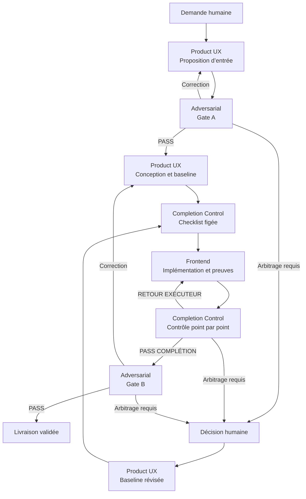

# Workflow de validation UX et de complétion EBTA

## Objet

Ce workflow impose trois contrôles distincts à toute évolution du frontend EBTA :

1. **Gate A — validation des entrées** avant la conception ;
2. **contrôle de complétion** autour de toute implémentation ;
3. **Gate B — validation des sorties** avant la livraison.

L’Agent Product & Research UX EBTA possède l’intention utilisateur, le parcours et
la spécification. L’Agent UX Adversarial EBTA challenge indépendamment la qualité
UX, la fidélité scientifique et la conformité au dépôt. L’Agent Delivery &
Completion Control EBTA transforme la baseline autorisée en checklist fermée et
vérifie que chaque tâche a réellement été livrée et prouvée.

Ces responsabilités ne sont pas interchangeables :

- l’Agent Adversarial répond à **« est-ce la bonne solution ? »** ;
- le Contrôleur répond à **« tout ce qui a été autorisé a-t-il été livré et
  démontré ? »**.

## Dépôt et accès canoniques

Le dépôt de référence est :

- URL : `https://github.com/LucBrice/EBTA---David-Aronson.git`
- identifiant GitHub : `LucBrice/EBTA---David-Aronson`
- branche de référence : `main`

Pour toute lecture de l’état distant, utiliser explicitement le plugin **GitHub**
(`github@openai-curated-remote`) avec cet identifiant. Ne pas déduire le dépôt
d’un ancien contexte, du nom du projet ou d’un dossier local non vérifié.

Un checkout local peut servir à inspecter et modifier les fichiers, mais son
remote et sa branche doivent être vérifiés avant de le considérer comme une
copie du dépôt canonique. En cas d’écart avec GitHub, signaler l’écart et ne pas
inventer lequel représente l’état attendu.

## Rôles et séparation des pouvoirs

| Rôle | Responsabilité | Ne peut pas faire seul |
| --- | --- | --- |
| Orchestrateur | Déclencher les étapes, transmettre les artefacts, conserver les compteurs et faire respecter les gates | Sauter une revue, une checklist ou déclarer une objection close sans preuve |
| Agent Product & Research UX EBTA | Cadrer le besoin, concevoir le parcours, rédiger la spécification, produire et réviser le Paquet de contrôle | S’auto-approuver ou retirer silencieusement une exigence |
| Agent UX Adversarial EBTA | Challenger les entrées et sorties, vérifier l’UX de recherche et la conformité au dépôt | Inventer une norme, implémenter silencieusement sa correction ou remplacer le Contrôleur |
| Agent Frontend | Implémenter la baseline figée et fournir les preuves techniques | Modifier le sens produit ou scientifique, la baseline ou la checklist |
| Agent Delivery & Completion Control EBTA | Atomiser et figer la checklist, contrôler chaque item et produire le rapport de complétion | Reconcevoir la solution, implémenter ses propres corrections ou accepter seul un écart |
| Humain | Arbitrer une décision produit, scientifique ou normative et modifier la baseline autorisée | Déclarer directement `PASS COMPLÉTION`, `PASS` de Gate B ou autoriser un raccourci vers la livraison |

Aucun propriétaire ne valide seul sa propre sortie.

## Autorités EBTA

Avant toute revue substantielle, appliquer le bootstrap du dépôt :

1. `AGENTS.md`
2. `.ai/README.md`
3. `.ai/checkpoint.json`
4. hook actif et tracking actif déclarés dans le checkpoint
5. point d’entrée et documents propriétaires de `Protocole/` si le sujet touche
   une règle, un statut, une preuve ou une décision scientifique
6. `.ai/governance/AI_MODIFICATION_CHECKLIST.md` si le changement est
   structurant ou impacte l’implémentation
7. playbooks pertinents sous `.agents/skills/`

Ordre d’autorité :

`Protocole/` → `Implementation/` → interface.

`.ai/` gouverne le processus. `.agents/` et `.codex/` fournissent des méthodes
ou adaptateurs. Aucun de ces dossiers ne peut créer une doctrine scientifique
concurrente.

## Périmètre de déclenchement

Le workflow s’applique à toute demande qui crée, modifie, audite ou corrige :

- un parcours chercheur ;
- un écran, une maquette ou un composant ;
- une visualisation, un statut ou un verdict ;
- une interaction avec un Research Package, une campagne, un fold, un test de
  robustesse, l’OOS, une position ou un graphique ;
- une exigence backend destinée à l’interface.

Même une petite modification passe par Gate A et Gate B. La profondeur des
revues peut être proportionnée au risque, mais les gates ne sont jamais
supprimées. Le contrôle de complétion est obligatoire dès qu’une implémentation
ou une modification d’artefact est demandée.

## Cycle obligatoire

### Étape 1 — Proposition d’entrée par l’Agent Product UX

L’Agent Product & Research UX produit une **Proposition d’entrée v0** :

- problème utilisateur ;
- utilisateur et niveau de connaissance ;
- décision à rendre possible ;
- faits, hypothèses et inconnues ;
- preuves à afficher ;
- contraintes du dépôt et données backend requises ;
- risques de mauvaise interprétation ;
- premiers critères d’acceptation.

Il ne fige pas encore la solution finale.

### Gate A — Challenge adversarial des entrées

L’Agent UX Adversarial recherche notamment :

- hypothèses non prouvées ;
- règle, métrique, statut ou verdict sans source ;
- besoin réel remplacé par une solution préconçue ;
- état ou scénario d’échec oublié ;
- risque de biais, de cherry-picking ou d’ouverture OOS incorrecte ;
- conflit avec la gouvernance ou les invariants du dépôt ;
- critère non observable ou non testable.

Sortie obligatoire : **Contrat d’entrée** versionné, constats, tests de clôture
et verdict.

- `PASS` : la conception peut commencer.
- `PASS SOUS RÉSERVES` : la conception peut commencer seulement si chaque
  réserve devient une contrainte traçable.
- `BLOQUÉ` : l’Agent Product UX corrige la Proposition d’entrée, puis soumet
  une nouvelle version à la même Gate A. Aucune conception finale ni
  implémentation n’est autorisée entre-temps.

### Étape 2 — Conception et baseline autorisée

À partir du Contrat d’entrée validé, l’Agent Product UX produit :

- parcours et architecture de l’information ;
- hiérarchie `Décision → Preuves essentielles → Analyse` ;
- écrans, composants et interactions ;
- états vide, chargement, erreur, données partielles et succès ;
- données et contrats backend nécessaires ;
- critères d’acceptation observables ;
- risques de régression ;
- plan de vérification ;
- non-objectifs et éléments à préserver.

Chaque écart au Contrat d’entrée est déclaré. Si la conception révèle une
nouvelle intention produit ou une modification du sens scientifique, revenir à
l’étape 1 et à Gate A.

Si aucune implémentation n’est demandée, la spécification passe directement à
Gate B. Si une implémentation est demandée, les étapes 3 à 6 sont obligatoires.

### Étape 3 — Paquet de contrôle transmis au Contrôleur

Avant tout changement de code ou d’artefact, l’Agent Product UX transmet
directement à l’Agent Delivery & Completion Control un **Paquet de contrôle**
versionné contenant :

- identifiant et version de la baseline autorisée ;
- identifiant et verdict de Gate A ;
- Contrat d’entrée applicable ;
- source de chaque décision humaine ou réserve adversariale intégrée ;
- périmètre, non-objectifs et éléments à préserver ;
- liste atomique des tâches à implémenter ;
- critère d’acceptation observable pour chaque tâche ;
- états d’interface à couvrir ;
- fichiers ou composants attendus lorsque connus ;
- preuves, captures et commandes de validation attendues ;
- dépendances, risques, inconnues et arbitrages ouverts.

Une liste de recommandations non transformée en tâches vérifiables n’est pas un
Paquet de contrôle valide.

### Étape 4 — Atomisation et gel de la checklist

Le Contrôleur vérifie l’autorisation et construit une matrice de couverture
bidirectionnelle :

- chaque exigence obligatoire de la baseline est reliée à au moins un item ;
- chaque item cite son exigence source ;
- chaque critère d’acceptation et chaque état requis est couvert ;
- aucune exigence ne disparaît pendant l’atomisation.

Chaque item reçoit un identifiant stable, un critère observable, une preuve
attendue et un statut parmi :

- `À FAIRE`
- `EN COURS`
- `BLOQUÉ`
- `LIVRÉ NON VÉRIFIÉ`
- `VÉRIFIÉ`
- `ÉCART AUTORISÉ`

Le Contrôleur rend :

- `CHECKLIST FIGÉE` si la couverture est totale et l’implémentation peut
  commencer ;
- `BASELINE INCOMPLÈTE` si le Paquet de contrôle est ambigu, non testable,
  incomplet ou non autorisé. Il le retourne alors à l’Agent Product UX.

Ni l’exécuteur ni le Contrôleur ne peut supprimer une tâche obligatoire, la
rendre optionnelle ou déclarer seul un écart.

### Étape 5 — Implémentation et preuves

L’Agent Frontend implémente uniquement la checklist figée et fournit :

- fichiers et zones modifiés ;
- éléments volontairement non touchés ;
- preuve exacte pour chaque item ;
- résultats réels des tests et contrôles ;
- captures ou démonstrations des états pertinents ;
- écarts et blocages connus.

Une déclaration « fait » ou une checklist cochée par son auteur ne constitue pas
une preuve indépendante.

### Étape 6 — Boucle de contrôle de complétion

Le Contrôleur inspecte l’artefact réel ou le diff, examine ou exécute les
validations prévues et classe chaque item.

Verdicts possibles :

- `PASS COMPLÉTION` : tous les items obligatoires sont `VÉRIFIÉ` ou couverts
  par un `ÉCART AUTORISÉ` traçable ;
- `RETOUR EXÉCUTEUR` : au moins un item peut encore être corrigé ou prouvé ;
- `BLOQUÉ` : un obstacle externe temporaire empêche la vérification ;
- `ARBITRAGE HUMAIN REQUIS` : le budget est épuisé ou la clôture exige une
  décision hors de l’autorité des agents.

En cas de `RETOUR EXÉCUTEUR`, le Contrôleur renvoie la checklist complète avec,
pour chaque item ouvert : constat, preuve absente ou échec, correction attendue
et test de clôture. Les items déjà vérifiés sont conservés et recontrôlés si la
correction peut les régresser.

Le cycle ne peut atteindre Gate B qu’après `PASS COMPLÉTION`.

### Gate B — Challenge adversarial des sorties

Pour une implémentation, l’Agent UX Adversarial reçoit :

- le Contrat d’entrée validé ;
- la baseline et le Paquet de contrôle applicables ;
- la checklist figée ;
- la sortie finale et le diff ;
- le dernier rapport de complétion et ses preuves ;
- le verdict `PASS COMPLÉTION` ;
- les autorités applicables.

Pour une spécification sans implémentation, il reçoit le Contrat d’entrée, la
sortie finale, les autorités et les preuves disponibles.

Il teste notamment :

- parcours nominal et parcours d’erreur ;
- compréhension par un chercheur junior ;
- données manquantes ou contradictoires ;
- reprise après interruption ;
- statuts et graphiques potentiellement trompeurs ;
- traçabilité et reproductibilité ;
- conformité au dépôt ;
- régressions fonctionnelles et de compréhension ;
- satisfaction réelle des critères d’acceptation.

Sortie obligatoire : rapport avec constats `BLOQUANT`, `MAJEUR` ou `MINEUR`,
correction testable et verdict.

- Un constat `BLOQUANT` ou `MAJEUR` non accepté renvoie la sortie à l’Agent
  Product UX.
- L’Agent Product UX révise la conception et, si l’implémentation est
  concernée, publie une nouvelle version traçable du Paquet de contrôle.
- Le Contrôleur vérifie et fige la checklist révisée.
- L’exécuteur corrige, le Contrôleur rend un nouveau verdict de complétion,
  puis seulement la Gate B est rejouée.
- Un constat `MINEUR` peut être accepté comme dette uniquement s’il est
  enregistré avec justification et autorité.

Il n’existe aucun raccourci `Gate B → correction → PASS` sans repasser par le
Contrôleur lorsqu’une implémentation a changé.

## Budgets de boucle

Les compteurs sont indépendants pour :

1. Gate A ;
2. le cycle de contrôle de complétion ;
3. Gate B.

Chacun dispose de **trois passages maximum** :

1. soumission initiale ;
2. première correction ;
3. seconde et dernière correction.

L’orchestrateur arrête plus tôt si :

- le même désaccord ou blocage substantiel persiste pendant deux passages
  consécutifs ;
- une décision produit, scientifique ou normative dépasse l’autorité des
  agents ;
- les autorités applicables se contredisent ;
- une preuve indispensable est durablement inaccessible.

Une reformulation, une correction technique ou un nouveau numéro de baseline ne
remet pas le compteur à zéro. Seule une nouvelle décision produit,
scientifique ou normative autorisée ouvre un nouveau cycle, explicitement lié
au précédent.

## Arbitrage humain sans contournement

À l’arrêt d’une boucle, rendre `ARBITRAGE HUMAIN REQUIS` avec :

- étape concernée et numéro du passage ;
- point exact de désaccord ou de blocage ;
- historique synthétique des propositions et corrections tentées ;
- preuves et autorités consultées ;
- au plus trois options avec conséquences ;
- recommandation distincte de chaque rôle concerné ;
- décision précise attendue de l’humain.

La décision humaine est une **décision de chantier**. Elle ne constitue jamais :

- un `PASS COMPLÉTION` ;
- un `PASS` de Gate B ;
- une preuve d’implémentation ;
- une autorisation de livraison directe ;
- une nouvelle règle scientifique générale implicite.

Après arbitrage :

1. l’Agent Product UX traduit la décision en une nouvelle version de la
   baseline et, si une implémentation est concernée, du Paquet de contrôle ;
2. les différences avec la version précédente et la source de l’arbitrage sont
   tracées ;
3. l’Agent Adversarial effectue une seule revue limitée à la conformité de la
   baseline avec la décision humaine, sans rouvrir le point arbitré ;
4. le Contrôleur vérifie la couverture de la décision, atomise et fige la
   checklist révisée ;
5. le cycle normal reprend : implémentation, contrôle de complétion, puis
   Gate B.

Si la décision humaine intervient à Gate A avant qu’une implémentation soit
définie, l’Agent Product UX révise d’abord l’entrée ; la revue de conformité
limitée est effectuée, puis la conception et la transmission au Contrôleur
suivent le cycle normal.

Si la décision est mal traduite, signaler un échec de conformité et revenir à
l’humain. Le point arbitré ne peut pas être redébattu, mais son application
reste soumise à tous les contrôles ordinaires.

Il n’existe **aucun chemin direct** :

`Décision humaine → Livraison`.

## Contrat de transmission

| Passage | Artefacts obligatoires |
| --- | --- |
| Product UX → Gate A | Proposition d’entrée, sources, hypothèses, critères |
| Gate A → Product UX | Contrat d’entrée, constats, tests de clôture, verdict |
| Product UX → Contrôleur | Paquet de contrôle versionné et sources d’autorisation |
| Contrôleur → Exécuteur | Checklist figée, preuves attendues, compteur de cycle |
| Exécuteur → Contrôleur | Artefact ou diff, preuves réelles, résultats de validation |
| Contrôleur → Exécuteur | Rapport complet, items ouverts, corrections et tests de clôture |
| Contrôleur → Gate B | `PASS COMPLÉTION`, rapport, checklist et preuves |
| Gate B → Product UX | Rapport adversarial, corrections attendues et tests de clôture |
| Humain → Product UX | Décision tracée à traduire en baseline révisée |

## Rapport de complétion et métrique de confiance

Le Contrôleur produit un rapport contenant :

1. baseline contrôlée et numéro du passage ;
2. verdict ;
3. tableau complet `ID | Statut | Preuve | Résultat | Écart` ;
4. items ouverts et retour exact à l’exécuteur ;
5. régressions vérifiées ;
6. **livraison réelle** : items obligatoires `VÉRIFIÉ` / total obligatoire ;
7. **clôture gouvernée** : items `VÉRIFIÉ` ou `ÉCART AUTORISÉ` / total
   obligatoire ;
8. dérogations et autorité correspondante ;
9. **confidence score** et distribution des niveaux de preuve ;
10. éléments non vérifiables ;
11. prochaine action.

Niveaux de preuve du confidence score :

- `100` : test ou comportement observé directement et reproductible ;
- `75` : artefact ou diff inspecté directement sans test comportemental
  complet ;
- `40` : preuve indirecte ou partielle ;
- `0` : aucune preuve exploitable ou simple déclaration.

Le score mesure la confiance dans les **preuves du verdict**, pas une
probabilité de qualité globale. Un score élevé ne compense jamais un item
obligatoire manquant.

## Critères de fermeture

Un chantier avec implémentation est fermé seulement si :

- Gate A et Gate B ont été exécutées ;
- la checklist a été figée avant l’implémentation ;
- le dernier verdict du Contrôleur est `PASS COMPLÉTION` ;
- aucun constat bloquant ou majeur non accepté n’est ouvert ;
- chaque statut et verdict visible possède une source et une explication ;
- les scénarios critiques et critères d’acceptation sont couverts ;
- les validations annoncées ont réellement été exécutées ;
- les écarts, réserves, dérogations et décisions humaines sont tracés ;
- le rapport de complétion et sa distribution de preuves sont disponibles ;
- aucune nouvelle source de vérité EBTA n’a été créée.

Une spécification sans implémentation est fermée seulement après Gate A, Gate B
et clôture de leurs constats applicables.

## Vue synthétique



Le schéma ne crée aucun raccourci : après arbitrage humain, la baseline révisée
revient au Contrôleur.

## Invocation recommandée

```text
Applique .ai/workflows/WORKFLOW_VALIDATION_UX_EBTA.md depuis le dépôt canonique.
Utilise $ebta-product-research-ux pour l’entrée, la conception et les corrections.
Utilise $ebta-ux-adversarial à Gate A puis à Gate B.
Pour toute implémentation, utilise $ebta-delivery-completion-control avant le
premier changement afin de figer la checklist, puis après chaque passe pour
contrôler chaque item et ses preuves.
Utilise le plugin GitHub (github@openai-curated-remote) sur
LucBrice/EBTA---David-Aronson, branche main, pour l’état distant.
Une correction de Gate B qui modifie l’implémentation repasse obligatoirement par
le Paquet de contrôle, la checklist figée et PASS COMPLÉTION.
Limite Gate A, le cycle de complétion et Gate B à trois passages chacun.
Un arbitrage humain révise la baseline ; il ne valide jamais directement la
livraison. Après arbitrage, reprends le cycle normal par le Contrôleur.
```

Si l’environnement permet des contextes séparés, exécuter les revues
adversariales et de complétion dans des passes indépendantes. Sinon, imposer au
minimum des passes distinctes qui ne traitent jamais les justifications de
l’auteur ou de l’exécuteur comme des preuves.
