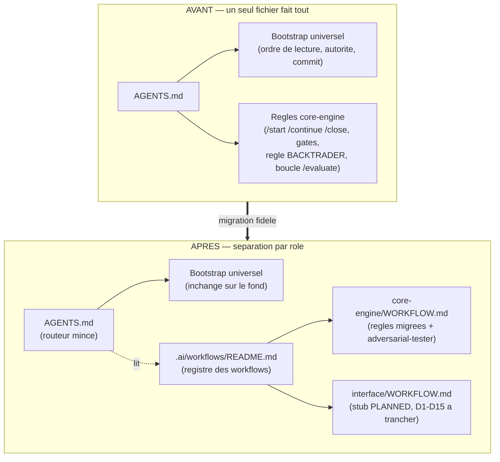
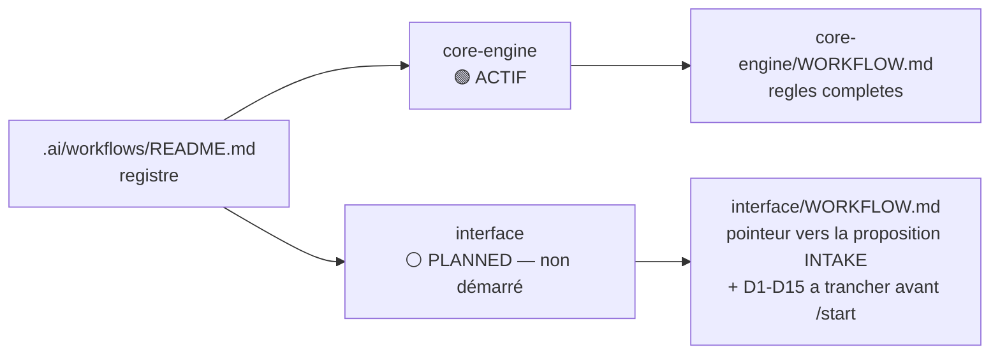
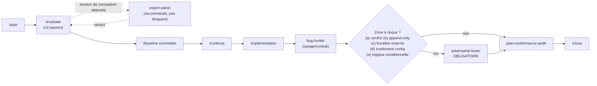
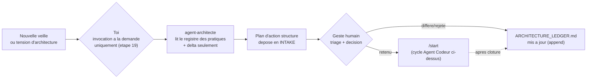
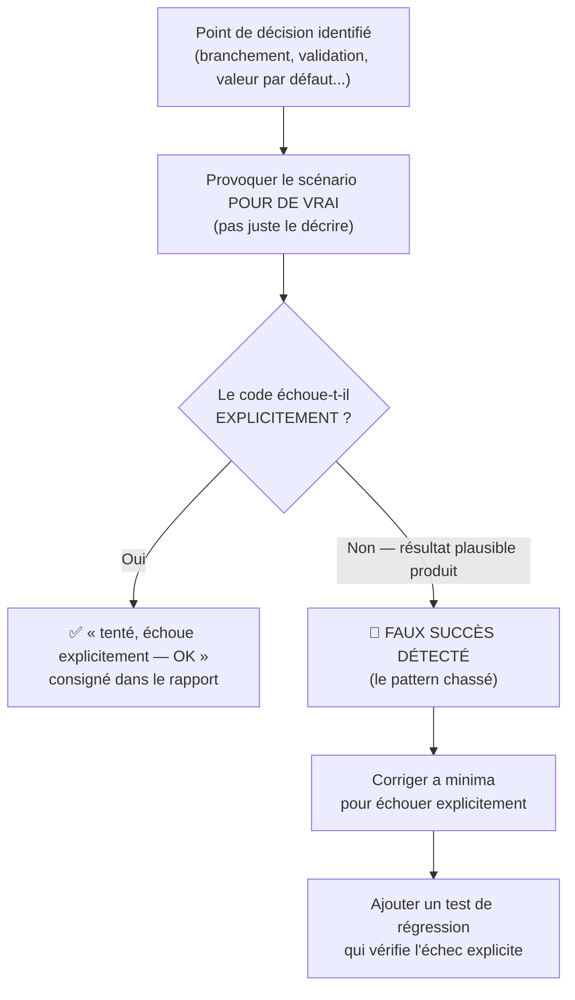
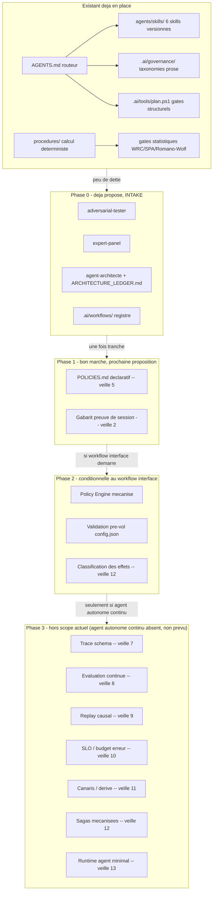

# Formalisation des workflows IA, skill adversarial et conseil d'experts

> [!IMPORTANT]
> **Statut : INTAKE non audité.** Ce document vit dans
> `0 - HUMAN START HERE/` et n'est donc pas exécutable en l'état
> (`AGENTS.md` / `CLAUDE.md`). Avant tout `/start`, il lui manque le triage
> obligatoire (`Track`, `Lifecycle`, `Scope`, `Non-goals`, `Source`,
> `Exit criteria`).
>
> Ce document ne modifie ni `Protocole/`, ni `Implementation/ebta_engine/`.
> Il propose une réorganisation de la gouvernance IA de ce repo
> (`AGENTS.md`, `.ai/`, `.agents/skills/`, `.claude/skills/`) et l'ajout de
> trois skills. Issu d'une longue discussion conversationnelle — ce document
> en reprend **l'intégralité**, y compris les fils abandonnés ou mis en
> pause en cours de route (voir la chronologie ci-dessous), pas seulement
> la conclusion. Aucune écriture réelle des fichiers proposés n'a encore eu
> lieu au moment du dépôt de ce document.

---

## TL;DR

- **Le problème** : un seul fichier (`AGENTS.md`) porte à la fois le
  bootstrap universel du repo et le manuel de procédure détaillé du seul
  workflow existant (« core-engine »). Un second workflow (« interface »)
  arrive bientôt et hériterait de règles qui ne le concernent pas.
- **Ce qu'on fait** : séparer `AGENTS.md` (routeur mince) d'un nouveau
  dossier `.ai/workflows/` (une règle par workflow) ; ajouter trois skills —
  `adversarial-tester` (chasse un seul pattern de bug déjà vu plusieurs fois
  dans ce repo : le succès fabriqué / repli silencieux), `expert-panel`
  (institutionnalise le débat multi-experts qu'on vient de faire, pour les
  prochaines tensions de conception) et **`agent-architecte`** (méta-skill
  qui maintient une mémoire longue de l'état de l'architecture agentique,
  audite les nouvelles veilles face à cette mémoire, et produit un plan
  d'action — jamais une exécution directe).
- **Ce qu'on NE fait PAS maintenant** (décision assumée après débat de
  simplicité) : pas de mécanique de routage automatique (schéma JSON,
  paramètre CLI) pour un `workflow` — ça résoudrait un problème qui n'existe
  pas encore tant qu'il n'y a qu'un seul workflow actif. Pas de journal
  séparé des trouvailles d'`adversarial-tester` — les tests de régression
  suffisent déjà comme mémoire.
- **Trois fils discutés mais laissés ouverts, pas perdus** (détail en fin de
  document, section « Fils ouverts ») : la toute première proposition
  (`POLICIES.md`/mémoire opérationnelle/preuve de session), et deux trous
  d'entrée vérifiés dans le code réel (`config.json` validé seulement
  après coup, aucun Policy Engine côté actions IA).
- **Suite directe de cette discussion** : une nouvelle section audite
  systématiquement l'architecture agentique du repo face aux **13 documents**
  de la veille IA (`D:\Livre\Veille\IA\`), un par un, avec pour chacun où se
  situe la Cible, quoi faire maintenant, quoi différer et pourquoi, la
  prochaine étape clé et le gain net — voir « Audit chronologique — 13
  documents de veille IA vs état réel du repo ». Elle se conclut par une
  feuille de route priorisée. Cet audit ne remplace pas le lot
  skills/workflows ci-dessus : il le situe comme la première étape (Phase 0)
  d'une trajectoire plus longue, et referme partiellement les Fils ouverts
  A, B et C avec un ancrage documentaire précis (veilles #2/#5/#6 pour A,
  #12 pour B, #5 pour C).
- **Rien ne touche** `Protocole/`, `Implementation/ebta_engine/`, ni aucun
  fichier JSON schema-contraint. Uniquement de la documentation/gouvernance
  IA (`.ai/`, `.agents/`, `AGENTS.md`).

---

## Vue d'ensemble visuelle

### Avant / après — où vivent les règles

### Le registre des workflows (état visé à la fin de ce lot)

---

## Chronologie complète de la discussion

Cette section existe pour ne rien perdre du fil réel de la conversation qui
a produit ce document — y compris les détours, les revirements, et les
sujets mis en pause plutôt que tranchés. Chaque étape se termine par une
ligne **Décision / Statut** explicite.

```mermaid
flowchart TD
    P1["1. Veille IA<br/>synthese des 7 editions"] --> P2["2. Proposition initiale<br/>POLICIES.md / lessons-learned / preuve de session"]
    P2 -.mise en pause, pas abandonnee.-> P9
    P2 --> P3["3. Pivot utilisateur<br/>plusieurs workflows a anticiper"]
    P3 --> P4["4. Recommandation initiale<br/>+ mise en garde sur la prematurite"]
    P4 --> P5["5. Decision utilisateur<br/>'on migre maintenant, on formalise tout'<br/>+ constat : pas d'IA adversariale"]
    P5 --> P6["6. Exploration du repo reel<br/>skills, gouvernance, plan.ps1, template"]
    P6 --> P7["7. Conception v1<br/>mecanique complete (schema/CLI/FINDINGS_LOG)"]
    P7 --> P8["8. Debat 1 — portee adversarial-tester<br/>large vs etroit par dossier"]
    P8 --> P8b["8b. Question concrete<br/>strategies ? frontend/backend ?"]
    P8b --> P9["9. Debat 2 — entree vs sortie<br/>+ trous d'entree decouverts (config.json, Policy Engine IA)"]
    P9 -.non traites, restent ouverts.-> FIN
    P9 --> P10["10. Debat 3 — generaliste vs specialise<br/>verdict : pattern unique 'succes fabrique'"]
    P10 --> P11["11. Ajout FINDINGS_LOG.md<br/>memoire qui s'apprecie"]
    P11 --> P12["12. Debat 4 — simplicite (expert 20 ans)<br/>verdict : coupe FINDINGS_LOG + mecanique workflow reportee"]
    P12 --> P13["13. Creation du skill expert-panel<br/>institutionnalise les debats 1/2/3/4"]
    P13 --> P14["14. Mise en forme lecture humaine<br/>TL;DR + diagrammes"]
    P14 --> P15["15. Tentative d'implementation<br/>puis annulation explicite demandee"]
    P15 --> P16["16. Persistance dans<br/>0 - HUMAN START HERE/"]
    P16 --> P17["17. Audit systematique<br/>13 documents de veille vs etat reel<br/>+ feuille de route priorisee"]
    P17 --> P18["18. Debat conseil des 5<br/>mono vs multi-boucle<br/>naissance de l'Agent Architecte"]
    P18 --> P19["19. Clarification<br/>invocation a la demande uniquement<br/>+ paliers non lineaires"]
    P19 --> FIN["Ce document"]
```

### 1–2. Point de départ : veille IA et proposition initiale

La discussion a commencé par une revue de 7 éditions de veille IA (dossier
`D:\Livre\Veille IA`), portant sur l'orchestration d'agents, le Policy
Engine, la mémoire opérationnelle, la gouvernance par capacités, et
l'observabilité des agents. Croisée avec l'état réel de ce repo
(`.ai/`, `.agents/skills/`, `AGENTS.md`), une première proposition a été
formulée : trois ajouts légers, dans l'esprit de ce que la veille
recommandait sans jamais transformer ce repo en système multi-agents
autonome (interdit par `CLAUDE.md`) :

- **`POLICIES.md`** — un tableau `action | autorisée ? | conditions |
  validation requise`, consolidant les règles d'autorisation déjà
  dispersées entre `AGENTS.md` et `.ai/governance/*.md`, avec une place
  réservée aux futures actions du workflow `interface` (écrire
  `config.json` depuis un formulaire, verrouiller un champ scellé G0 côté
  serveur).
- **`.ai/lessons-learned/`** — un fichier court par incident réel (pas
  rétroactif sur tout l'historique), rempli à la clôture d'un
  `PLAN_CORRECTION_*` significatif, relié au skill/policy/test qui en
  découle.
- **Un gabarit de « preuve de session IA »** — formalisant ce
  qu'`AGENTS.md` exige déjà en prose dans la forme de commit (fichiers
  modifiés, tests, risques restants) en un format structuré et cohérent
  d'un chantier à l'autre.

**Décision / Statut : mise en pause, pas abandonnée.** L'utilisateur a
répondu « discutons d'abord » et la conversation a bifurqué directement
vers le sujet des workflows (étape 3) avant qu'aucun de ces trois points ne
soit tranché. Ils ne font **pas** partie du périmètre de fichiers à créer
dans ce document (voir « Fils ouverts » en fin de document) — ce sont des
candidats pour une proposition future séparée, pas pour ce lot-ci.

### 3–4. Le pivot : plusieurs workflows à anticiper

L'utilisateur a signalé qu'un seul workflow de modification de code existe
aujourd'hui, que le passage au front-end approche, et que plusieurs
workflows (agents/outils/prompts/skills différents par cycle) seront
bientôt nécessaires — avec le risque que tout continue à s'empiler dans les
mêmes fichiers de configuration (`AGENTS.md`, `.agents/`).

Première recommandation formulée : extraire les règles par workflow dans
`.ai/workflows/<id>/WORKFLOW.md`, router via la `classification` déjà
présente dans `checkpoint.json`, `AGENTS.md` devenant un routeur mince. Une
réserve explicite a été posée en même temps : construire cette mécanique
maintenant, avant qu'un second workflow existe réellement, risquait de
produire une structure à moitié vide pour un besoin encore hypothétique —
tension qui allait ressurgir plus tard (étape 12).

**Décision / Statut : proposition faite, tradeoff signalé, pas encore
tranché à ce stade.**

### 5. La décision de migrer maintenant, et le constat de l'absence d'IA adversariale

L'utilisateur a tranché explicitement : *« on migre maintenant, on
formalise tout, on se prépare déjà au prochain workflow »* — dépassant
volontairement la réserve de prudence posée à l'étape 4. Dans le même
message, un second constat, tiré de la veille : ce repo n'a pas de
mécanisme d'IA adversariale (au sens GPT-Red / « un agent développe, un
second cherche à le casser, les échecs deviennent des tests permanents »).

**Décision / Statut : les deux tranchés — migration lancée, et un skill
adversarial à concevoir.**

### 6. Exploration du repo réel

Avant de concevoir quoi que ce soit, le repo a été exploré directement
(deux agents `Explore` en parallèle, plus lecture directe de fichiers) pour
ne rien supposer :

- `.agents/skills/` contient exactement 6 skills, tous au même format
  (frontmatter `name`+`description`, corps français, section finale « Ce
  que ce skill ne fait pas »). Deux ont un stub `.claude/skills/`
  (déclenchement automatique — `code-architecture-evaluator`,
  `nautilus-docs-research`) ; les quatre autres (`bug-hunter`,
  `epic-orchestrator`, `plan-conformance-audit`, `EBTA_Protocol_Guardian`)
  n'en ont pas — ce sont des gates procéduraux invoqués à un point précis
  du cycle, sans déclenchement flou.
- `.ai/governance/` porte déjà **4 taxonomies de classification séparées**
  (conflits, knowledge intake, workstream `classification`, hiérarchie
  normative), toutes **purement descriptives** — aucun routage
  comportemental réel nulle part dans le repo.
- `.ai/checkpoint.json` (macro, par workstream) et `Implementation/Active/
  tracking.json` (micro, par step/task) sont deux cockpits volontairement
  séparés (risques R1/R3/R6 déjà documentés dans le repo).
- `.ai/tools/plan.ps1 start` a un paramètre `-Classification`
  (`ValidateSet`) stocké tel quel sur l'objet workstream — **jamais parsé
  depuis le texte du plan**. `Assert-PlanAuditReady` n'exige même pas la
  présence du mot « Classification » dans le document.
- `bug-hunter` est confirmé **réactif** (Pyrefly + suite de tests
  existante), jamais adversarial au sens recherché.

**Décision / Statut : base factuelle établie, utilisée pour toute la suite
de la conception.**

### 7. Conception version 1 — la mécanique complète

Une première version du plan a formalisé « workflow » comme un second axe
de classification à part entière : un champ `workflow` dans
`.ai/checkpoint.schema.json`, un paramètre `-Workflow` dans `plan.ps1`, une
ligne dans le gabarit `TEMPLATE_PLAN_IMPLEMENTATION.md`, des pointeurs dans
`.ai/README.md`/`backlog/README.md`. Le skill adversarial de l'étape 5 a été
scopé, dans cette version, aux dossiers à haut risque (`validators/`,
`governance/`, `manifests/`, gates, schémas, logs append-only), avec un
journal séparé `FINDINGS_LOG.md` pour consigner ses trouvailles.

**Décision / Statut : cette version a ensuite été remise en question à
trois reprises (étapes 8, 10, 12) — voir la suite. Rien de cette version 1
n'a été implémenté tel quel.**

### 8–8b. Débat 1 — la portée d'`adversarial-tester`, et deux questions concrètes

Question posée : le scope « dossiers à haut risque » de l'étape 7 est-il
vraiment la bonne pratique ? Un débat à plusieurs voix (red-team/sécurité,
ingénierie de test/QA, ingénierie de systèmes critiques) a été mené. Le
red-teamer et le QA penchaient pour un scope étroit par dossier ; mais
confronté à l'historique réel de `checkpoint.json`, ce scope aurait **raté
plusieurs bugs déjà trouvés dans ce repo** (`adapters/
nautilus_strategy_bridge.py` n'était pas dans la liste ; `procedures/`,
qui calcule directement le verdict scientifique, avait été oublié). Verdict
tranché : le bon critère n'est pas géographique (quel dossier) mais
sémantique (est-ce que ce code participe à une décision qui, si elle est
fausse, corrompt silencieusement un verdict) — les cinq catégories (a)-(e)
du document actuel.

Question de suivi, très concrète : est-ce que ça inclut créer une
stratégie, faire le front-end, connecter le front au back ? Réponse
apportée et intégrée au scope : une stratégie sans logique conditionnelle
(`requires`) reste recommandée non bloquante ; une stratégie avec logique
conditionnelle est en périmètre obligatoire (catégorie (e), ajoutée à ce
moment précis — elle était absente de la version 1). Le front-end en
lecture seule est hors périmètre ; la connexion en écriture (verrouillage
serveur G0, décision D4 de la proposition d'interface) sera un candidat
naturel du même pattern **le jour où le workflow `interface` démarrera** —
noté dans `interface/WORKFLOW.md`, pas tranché ici.

**Décision / Statut : scope sémantique (a)-(e) adopté, catégorie (e)
ajoutée suite à la question concrète.**

### 9. Débat implicite — entrée vs sortie, et deux trous découverts en aparté

En confirmant sa compréhension du skill (« tu bousilles les succès pour
voir si c'est des vrais succès, au lieu de faire des tests au pif »),
l'utilisateur a demandé si la veille sur le contrôle des entrées (pas
seulement des résultats) trouvait un écho dans ce repo — *« qu'est-ce qu'on
a qui contrôle l'entrée actuellement ? »*. Vérification directe dans le
code :

- **`config.json`** est validé contre son schéma (`config.schema.json` via
  `validate_json_file`), mais seulement par `validate_package_dir()`,
  appelée **après** la construction du package — jamais en pré-vol avant
  d'exécuter les procédures/backtests. Exposition faible aujourd'hui
  (`config.json` est construit par du code interne de confiance), mais
  c'est exactement le chemin d'entrée non fiable que le futur Builder de
  l'interface introduira.
- **Aucun Policy Engine mécanisé** ne valide les paramètres d'une action IA
  avant exécution — seulement des règles en prose dans `AGENTS.md`/
  `.ai/governance/`, jamais appliquées par du code. C'est le même manque
  que celui identifié dès l'étape 2 (`POLICIES.md`).

Une question à choix multiples a été posée pour savoir comment traiter ces
deux trous : durcir `adversarial-tester`, signaler le trou `config.json`
sans le corriger, ajouter un `POLICIES.md` minimal maintenant, ou reporter
`POLICIES.md`. L'utilisateur a choisi **uniquement** « durcir
`adversarial-tester` ».

**Décision / Statut : la procédure du skill a été durcie pour vérifier
explicitement (a) l'entrée est-elle rejetée au point d'entrée et (b) le
résultat est-il correct — un scénario ne « tient » que si les deux sont
vrais. Les deux trous eux-mêmes (config.json post-hoc, absence de Policy
Engine IA) restent non traités, non corrigés, non repris ailleurs dans ce
document — voir « Fils ouverts » en fin de document, pour qu'ils ne se
reperdent pas silencieusement.**

### 10. Débat 2 — spécifique ou généraliste ?

Question posée directement : *« j'ai l'impression qu'on cherche à couvrir
plein de choses, et peut-être que c'est pas ça le plus robuste »*. Débat à
plusieurs voix : la position fuzzing/sécurité (un fuzzer généraliste perd
son budget sur des mutations triviales, les fuzzers efficaces sont
*grammar-aware*) et la position mutation-testing (l'effort de test doit
suivre les *fault classes réellement observées*, pas un catalogue
générique) ont toutes deux plaidé pour la spécialisation — mais **pas** par
catégorie de fichier (retour à l'étape 8). En relisant l'historique complet
de `checkpoint.json`, un fait s'est imposé : **tous les bugs déjà trouvés
dans ce repo sont la même variante d'un seul défaut** — un succès fabriqué,
jamais une race condition, jamais une corruption de schéma. D'où le
verdict : un seul skill, spécialisé sur ce pattern précis (succès fabriqué
/ repli silencieux), les cinq catégories (a)-(e) de l'étape 8 devenant *où
chercher ce pattern*, pas des familles de test indépendantes.

**Décision / Statut : `adversarial-tester` recentré sur un seul pattern
nommé, empiriquement ancré — version encore en vigueur dans ce document.**

### 11. Ajout — une mémoire qui s'apprécie

Question posée : *« pour chaque échec, est-ce qu'il fabrique des tests et
on aura une database qui s'apprécie au fur et à mesure ? »*. Réponse :
les tests de régression (déjà prévus à l'étape 3 de la procédure) protègent
réellement, mais ne forment pas une base consultable — il faudrait fouiller
le code des tests. Un journal `FINDINGS_LOG.md`, append-only, une entrée
par défaut réel trouvé, a été ajouté pour ce rôle.

**Décision / Statut : ajouté à ce stade — puis retiré à l'étape 12 (voir
suite). Ne fait plus partie du périmètre de ce document.**

### 12. Débat 3 — l'avis du pragmatique à 20 ans d'expérience

Question posée : *« si on introduit la vision d'un expert simpliste de 20
ans d'expérience qui privilégie la simplicité monstrueusement efficace...
il dit quoi ? »*. Le pragmatique convoqué a critiqué trois points du plan
tel qu'il existait alors :

1. **La mécanique `.ai/workflows/` complète** (schéma, `-Workflow` CLI,
   gabarit, pointeurs) — *« vous avez un workflow qui tourne, le deuxième
   n'existe même pas, vous construisez un registre pour un N qui vaut
   1,5 »*. Argument retenu : c'est exactement la réserve posée dès l'étape
   4, que l'utilisateur avait alors choisi de dépasser — le pragmatique l'a
   fait revenir avec plus de poids, confronté au fait que le workflow
   `interface` n'a toujours pas démarré.
2. **`FINDINGS_LOG.md`** (étape 11) — *« les tests SONT la mémoire, un
   journal Markdown à côté duplique cette information sans ajouter de
   robustesse »*. Argument retenu.
3. **La mécanique interne d'`adversarial-tester`** (catégories a-e, double
   contrôle entrée/sortie) — jugée en soi réductible à une phrase, mais
   défendue car cohérente avec le formalisme déjà utilisé par les 5 autres
   skills existants du repo. Argument **pas** retenu comme coupe.

**Décision / Statut : `FINDINGS_LOG.md` supprimé du périmètre ; la
mécanique de routage `workflow` (schéma/CLI/gabarit/pointeurs) reportée
explicitement au jour où `interface` démarrera réellement — les deux
coupes actuellement en vigueur dans ce document (voir « Non-objectifs »).**

### 13. Création du skill `expert-panel`

Demande explicite : *« tu vas créer un skill qui va faire un débat quand on
conçoit un plan comme ça — un conseil d'administration d'experts »*.
Ce skill institutionnalise exactement la méthode utilisée aux étapes 8, 10
et 12 de cette chronologie : convoquer plusieurs personas authentiquement en
désaccord, composés au cas par cas selon le sujet, jusqu'à un verdict
tranché — pas un simple débat théâtral où tout le monde finit d'accord.

**Décision / Statut : ajouté au périmètre de ce document, avec un
`EXAMPLE_REPORT.md` condensant le débat de l'étape 8 comme référence.**

### 14. Mise en forme pour une lecture humaine

Demande explicite de structurer le plan avec des diagrammes de logique, des
TL;DR, et de réfléchir à ce qui apporte de la valeur pour une lecture
humaine agréable — pas seulement un document technique dense. Le format
actuel (TL;DR, diagrammes mermaid avant/après et de flux, tableaux) en
résulte, validé explicitement par l'utilisateur (« ça me va, on peut
avancer »).

**Décision / Statut : format adopté, toujours en vigueur pour ce
document.**

### 15. Tentative d'implémentation, puis annulation explicite

Après validation du format, une tentative d'écrire réellement les fichiers
du plan a commencé (les deux `SKILL.md`, `.ai/workflows/`). L'utilisateur a
immédiatement demandé l'annulation complète — *« attention ne modifie rien,
on planifie juste là »* la première fois, puis *« annule d'abord les
implémentations... retour en arrière »* la seconde fois après une nouvelle
tentative. Tous les fichiers créés ont été supprimés (`git status`
confirmé propre, à l'exception des deux fichiers déjà présents avant cette
conversation).

**Décision / Statut : aucun fichier de ce plan n'existe réellement dans le
repo au moment du dépôt de ce document — uniquement ce document lui-même,
dans `0 - HUMAN START HERE/`, en attente de triage.**

### 16. Persistance de ce document

Demande explicite de sauvegarder le plan dans `0 - HUMAN START HERE/` pour
le faire persister, selon la convention déjà en place dans ce repo
(`PROPOSITION_INTERFACE_...md`, `PROPOSITION_PIVOT_MOTEUR_NAUTILUS_
TRADER.md`) — puis, constatant que la première version persistée ne
reprenait que la conclusion et pas l'intégralité des débats, demande
explicite de tout réintégrer sans rien perdre. C'est cette version-ci.

### 17. Audit systématique vs les 13 documents de veille IA

Reprenant directement cette discussion (nouvelle session, même fil),
demande explicite : confronter l'architecture agentique du repo cible à
l'**intégralité** du corpus `D:\Livre\Veille\IA` (13 documents, #1 à #13,
17→29 juillet 2026) — pas seulement les thèmes déjà couverts par le lot
skills/workflows ci-dessus — document par document, avec pour chacun : où se
situe la Cible aujourd'hui, quoi implémenter maintenant, quoi différer et
pourquoi, la prochaine étape clé, et le gain de valeur net. Décision
explicite : ne pas créer un nouveau fichier séparé, mais **enrichir et
restructurer ce document existant**, dans la continuité de sa propre
convention établie à l'étape 16 (« réintégrer sans rien perdre »). Les deux
propositions déjà présentes dans ce document (`adversarial-tester`,
`expert-panel`, `.ai/workflows/`) doivent être référencées et positionnées
sur la chronologie de la veille, pas ré-auditées en détail ni dupliquées.

Exploration factuelle menée avant l'audit (deux agents en parallèle) :
inventaire complet des 13 fichiers de veille (thèmes, ordre, fils
transversaux) et cartographie précise de l'état réel du repo (skills,
gouvernance, `plan.ps1`, mémoire opérationnelle, Policy Engine, validation
`config.json`, statut des deux propositions déjà en INTAKE). Constat
marquant : les veilles #7 à #13 ont elles-mêmes déjà été rédigées en
connaissance de l'état public du dépôt EBTA (elles citent les 208 tests de
la clôture du 21 juillet, le workflow UX adversarial du 24 juillet, le
comportement `DENIED/FAIL` du package pré-OOS) et proposent chacune un
fichier concret pour ce projet précis (`TRACE_SCHEMA.md`,
`evals/agents/registry.yaml`, `incidents/INC-0001/`, `reliability/
SLO_CONTRACT.yaml`, `reliability/AGENT_CANARY_CONTRACT.yaml`, `reliability/
EFFECT_COMPENSATION_CONTRACT.yaml`, `agents/protocol_review/
AGENT_CONTRACT.yaml`) — aucun de ces fichiers n'existe dans le repo à ce
jour ; l'audit ci-dessous évalue lesquels sont réellement prioritaires
plutôt que de les créer par réflexe.

**Décision / Statut : audit produit et intégré à ce document (sections
« Audit chronologique » et « Feuille de route priorisée » ci-dessous). Le
document reste `INTAKE` — aucune implémentation n'a eu lieu dans ce lot.**

### 18. Débat conseil des 5 — mono-agent vs multi-boucle, naissance de l'Agent Architecte

Question posée par l'utilisateur : on a admis que le mono-agent était la
bonne approche (Phase 3 de l'audit) sans vraiment en analyser le *pourquoi*
— or « multi-agent » ne signifie pas forcément « plusieurs LLM » ; ça peut
désigner un seul LLM orchestrant plusieurs boucles d'exécution
indépendantes. Cadre d'application soumis au débat : un **Agent Codeur**
(code dans le dépôt selon les normes/workflows établis, portable d'un LLM à
l'autre) et un **Agent Architecte** — méta-agent invoqué ponctuellement pour
auditer de nouvelles veilles, comparer les approches, et produire un plan
d'action que l'Agent Codeur exécute ensuite.

En l'absence du skill `expert-panel` réellement écrit sur disque (toujours
INTAKE), le débat a été mené directement en conversation, avec la même
méthode : cinq voix authentiquement en désaccord, ancrées dans le repo réel.

- **La spécialiste orchestration** (veille #1/#3) : les rôles Architecte/
  Codeur sont déjà deux boucles cognitivement différentes, vécues dans cette
  session même — les nommer explicite le contrat.
- **Le gardien `CLAUDE.md`** (lecture littérale) : le mot qui compte dans
  l'interdiction est *autonome*, pas *multiple*. Deux boucles enchaînées par
  un geste humain entre les deux ne violent rien ; une chaîne automatique
  sans ce geste franchirait la ligne rouge.
- **Le pragmatique 20 ans** (déjà convoqué à l'étape 12) : le besoin décrit
  est déjà couvert à 80 % par `code-architecture-evaluator` et
  `expert-panel` (proposé) — ne pas dupliquer une responsabilité en créant
  un troisième objet sans nécessité démontrée.
- **L'ingénieure fiabiliste** (veilles #10-13, classées Phase 3 hors scope
  dans l'audit) : tel que décrit, l'Agent Architecte correspond au Palier 1
  de la veille #1 (« agent spécialisé et supervisé »), pas au Palier 2/3
  (orchestration autonome) — rien ne contredit la conclusion de l'audit si
  la formalisation reste dans cette limite.
- **La voix du besoin vécu** (celle qui vient de produire l'audit
  chronologique de ce document) : le coût est réel et mesurable — lire 13
  veilles et cartographier le repo a consommé un tour de conversation
  entier, sans procédure répétable. Un skill versionné transforme ce travail
  ad hoc en procédure reproductible.

**Verdict tranché** : pas un agent séparé — un nouveau skill (`Agent
Architecte`), plus une clarification conceptuelle du rôle déjà existant
(`Agent Codeur` = le workflow `core-engine` déjà documenté dans ce fichier,
déjà portable par construction puisque `.agents/skills/` est déjà cross-AI).
Ligne rouge explicite : l'Agent Architecte produit un **plan**, jamais une
**exécution** ; le passage du plan à l'implémentation reste un geste humain
(`/start`). Le jour où l'un déclenche l'autre sans ce geste, ce n'est plus
ce skill — c'est la Phase 3 déjà classée hors scope, qui exige une décision
humaine explicite rouvrant `CLAUDE.md`.

L'utilisateur a validé ce verdict et fixé le nom (`Agent Architecte`, pas
`architecture-steward`) ainsi que quatre piliers de mission obligatoires
pour sa définition :

1. **Conscience de l'état actuel** — une vision précise et à jour de l'état
   réel du dépôt à chaque invocation.
2. **Lien veille → évolution** — identifier les évolutions nécessaires en
   s'appuyant directement sur ce qu'une veille précise préconise (ex.
   passer à un palier d'orchestration supérieur parce qu'une veille
   spécifique le justifie).
3. **Cohérence globale long terme** — une vision alignée et cohérente même
   après un très grand nombre de veilles analysées (l'utilisateur cite
   1000 veilles comme ordre de grandeur).
4. **Efficacité et scalabilité** — ne jamais recharger ni relire
   l'intégralité des rapports de veille déjà traités avant de pouvoir
   émettre une proposition pertinente.

**Décision / Statut : validé, intégré au périmètre de ce document (voir
« 3. `.agents/skills/agent-architecte/SKILL.md` » ci-dessous). Le
`ARCHITECTURE_LEDGER.md` y répond structurellement au pilier 4 : c'est la
mémoire compacte que le skill lit en premier, jamais les 13 documents de
veille bruts sauf pour le delta non encore consigné.**

### 19. Clarification — mode d'invocation et non-linéarité des paliers

Deux précisions apportées par l'utilisateur sur la définition d'Agent
Architecte de l'étape 18.

**Mode d'invocation.** Question posée : uniquement à la demande, ou
automatisable (ex. cron nocturne analysant les nouvelles veilles) ? Une
clarification factuelle a d'abord été apportée : c'est **faisable**,
techniquement (mécanismes de planification disponibles sur cette
plateforme) et même du point de vue de la gouvernance de ce repo —
`CLAUDE.md` interdit l'introduction d'agents autonomes **sans décision
humaine explicite**, pas de façon absolue ; une décision assumée ici
suffirait. Une automatisation bornée (« avis + plan INTAKE si modification
nécessaire, l'humain fait `/start` s'il veut ») a été jugée sûre par
construction, puisque `0 - HUMAN START HERE/` est déjà, par la bannière de
ce document lui-même, un cul-de-sac non exécutable. La question du **quel
outil** a ensuite mis en évidence une contrainte concrète : ce repo est un
dossier Windows local sans remote GitHub confirmé, ce qui écarte la
planification cloud native de cette plateforme (accès disque local
incertain) au profit d'un Planificateur de tâches Windows local — mais
cette option elle-même impliquerait de créer une configuration système
persistante, hors du périmètre de simple documentation de ce lot.

**Décision / Statut : l'utilisateur a tranché pour la simplicité —
invocation strictement à la demande humaine, aucune automatisation. La
sortie du skill reste néanmoins toujours la même quelle que soit l'occasion
de son invocation : un plan déposé dans `0 - HUMAN START HERE/`, jamais une
exécution — ce qui rend la question du mode d'invocation peu critique en
pratique une fois ce choix fait.**

**Non-linéarité des paliers et croisement entre veilles.** L'utilisateur a
signalé que la veille ne doit pas être traitée document par document de
façon strictement séquentielle : chaque veille définit ses propres paliers
d'implémentation, et des allers-retours entre veilles sont nécessaires pour
croiser les concepts et faire évoluer l'architecture par étapes — une
pratique différée peut voir sa condition de déclenchement remplie par une
**autre** veille ou par un changement d'état du repo, pas seulement par une
nouvelle édition sur le même sujet.

**Précision apportée par l'utilisateur** : « palier » ne désigne pas une
échelle inventée pour les besoins de ce document — ce sont, au mot près,
deux sections que **chaque** document de `D:\Livre\Veille\IA` possède déjà
dans un format homogène (vérifié sur les 13 documents lors de l'audit de
l'étape 17) : la section **« Paliers de progression »** (Palier 0 à 3, ou
4 selon la veille — chacun avec Objectif, Prérequis, Composants, **Critère
de passage**, et Risque d'une mise en place prématurée) et la section
**« Bon timing de mise en place »** (Trop tôt / Bon moment / Trop tard). Le
champ « palier actuel » du registre des pratiques doit donc être renseigné
en citant le Critère de passage effectivement atteint dans la veille
source, pas une estimation libre — et la colonne « condition de
déclenchement » d'une pratique différée doit reprendre le texte du palier
suivant non encore atteint (ou le repère Trop tôt/Bon moment/Trop tard
correspondant), pas une reformulation. C'est exactement la logique déjà
appliquée dans l'« Audit chronologique » de ce document (ex. #7 à #13 sont
différées en citant explicitement le « Bon moment » non encore atteint de
chaque veille) — le skill doit reproduire ce même ancrage textuel de
façon systématique, jamais une appréciation approximative.

**Décision / Statut : intégré à la conception du skill — le
`ARCHITECTURE_LEDGER.md` devient un registre à deux niveaux (veilles
ingérées + pratiques nommées, chaque palier et chaque condition de
déclenchement cités depuis les sections « Paliers de progression »/« Bon
timing de mise en place » de la veille source, jamais reformulés), et la
procédure inclut désormais un rebalayage systématique des pratiques
différées, pas uniquement un traitement du delta du jour. Voir la
procédure révisée dans « 3. `.agents/skills/agent-architecte/SKILL.md` »
ci-dessous.**

---

## Pourquoi ce lot (résumé condensé de la chronologie ci-dessus)

Le repo n'a aujourd'hui qu'**un seul workflow réel** : les changements de
code sous `Implementation/ebta_engine/`, gouvernés par
`/start → /evaluate → /continue → /close`, avec bug-hunter et
plan-conformance-audit obligatoires avant clôture. Toutes ces règles sont
encodées en dur dans `AGENTS.md`.

Un **second workflow** est en approche : l'interface de pilotage
(`0 - HUMAN START HERE/PROPOSITION_INTERFACE_PILOTAGE_VISUEL_RECHERCHE_
EBTA.md`), encore `INTAKE`, 15 décisions (D1-D15) à trancher avant de
démarrer. Continuer à tout empiler dans `AGENTS.md` lui ferait hériter de
règles qui ne le concernent pas.

Second constat, tiré des veilles IA (#2 et #6) : **aucun skill actuel ne
fait d'« adversarial testing »** — une passe qui essaie activement de casser
ce qu'un changement est censé garantir, et transforme tout échec réel en
test permanent. `bug-hunter` est réactif (typage + suite existante), pas
adversarial.

**Ce qui a déjà été vérifié dans le repo réel** (pas supposé) — voir
chronologie, étape 6, pour le détail complet.

---

## Comment ça marche concrètement

### Le cycle `/start → /close` avec deux des trois nouveaux skills insérés

(Le troisième, `agent-architecte`, opère à un niveau distinct — hors de ce
cycle d'exécution — détaillé juste après dans « Le méta-cycle ».)

### Le méta-cycle : de la veille au plan, de l'Agent Architecte à l'Agent Codeur

Le cycle ci-dessus (`/start → /close`) est celui de l'**Agent Codeur** — le
rôle d'exécution, déjà entièrement couvert par `core-engine`. L'**Agent
Architecte** opère un cran au-dessus, avec un geste humain explicite à la
frontière entre les deux (la ligne rouge actée au débat de l'étape 18) :

Deux gestes humains distincts encadrent ce montage, pas un seul : toi qui
invoques `agent-architecte` (aucune automatisation, étape 19), puis toi qui
décides du triage avant `/start`. Aucune flèche n'existe entre
`agent-architecte` et `/start` sans passer par ces deux cases — c'est
précisément ce qui distingue ce montage d'une orchestration autonome
interdite par `CLAUDE.md`.

### La logique interne d'`adversarial-tester` — un seul pattern chassé

Pas du fuzzing généraliste : une question précise posée à **chaque point de
décision** du code touché.

**Pourquoi ce pattern précis et pas un catalogue générique ?** Historique
réel vérifié dans `checkpoint.json` — chaque bug déjà trouvé dans ce repo en
est une variante : gates codés en dur à `True`, stub buy-and-hold,
`LIVE_LIMITED_STARTED` auto-attesté (commit `3bcfe35`), `requires` qui
retombe silencieusement sur le défaut
(`strategies/payload_factory.py::StructuralAxis.allowed_values`),
`except Exception: return 0.0` qui avale l'erreur
(`adapters/nautilus_strategy_bridge.py::_call_float`). Zéro race condition,
zéro corruption de schéma — jamais observées ici. D'où le choix : spécialisé
sur ce pattern, pas générique.

---

## Détail des fichiers à créer / modifier

### 1. `.agents/skills/adversarial-tester/SKILL.md` (nouveau)

Frontmatter `name`+`description`, corps français, sections `# Rôle`,
`# Quand s'invoquer`, `# Procédure`, `# Règle de blocage`,
`# Ce que ce skill ne fait pas` — même moule que les 5 skills existants. Pas
de stub `.claude/skills/` (gate procédural déterministe, même statut que
bug-hunter).

- **Rôle** : chasser le succès fabriqué / repli silencieux (voir diagramme
  ci-dessus). Recouvre le principe de la veille #5 : pour chaque scénario,
  vérifier (a) l'entrée invalide est-elle rejetée *au point d'entrée* et (b)
  le résultat est-il correct — un scénario ne « tient » que si (a) **et**
  (b).
- **Quand s'invoquer** — obligatoire avant `/close` si le chantier touche du
  code qui : **(a)** produit/consomme un verdict (`validators/`,
  `governance/`, `procedures/`, un fichier de gate), **(b)** écrit un
  artefact persisté/append-only (`manifests/`, `registry.jsonl`,
  `oos_access_log.jsonl`, écriture de `reports/*.json`), **(c)** franchit
  une frontière externe non fiable (`adapters/`), **(d)** construit/scelle
  `config.json` ou un artefact G0 (`package_builder/`), ou **(e)** contient
  une logique conditionnelle/dérivée de paramètres (`strategies/`).
  Recommandé, non bloquant ailleurs. *Note pour le futur workflow
  `interface`* : le verrouillage serveur G0 (D4 de la proposition
  d'interface) sera un candidat naturel du même pattern — à statuer dans
  `interface/WORKFLOW.md`, pas ici.
- **Procédure** : (1) lister les points de décision + comportement d'échec
  attendu, (2) provoquer réellement chaque violation, (3) tout faux succès
  → correction + test de régression qui vérifie l'échec explicite, (4)
  relancer la suite complète.
- **Règle de blocage** : `/close` refusé tant qu'un faux succès trouvé reste
  non corrigé/non testé/non escaladé.
- **Ce que ce skill ne fait pas** : pas de fuzzing générique ; ne remplace
  ni bug-hunter, ni EBTA_Protocol_Guardian, ni plan-conformance-audit ; un
  vrai trou normatif escalade via `NORMATIVE_CHANGE_POLICY.md`.

`EXAMPLE_REPORT.md` : exemple travaillé construit sur deux défauts réels déjà
vérifiés dans le code (`requires` en repli silencieux dans
`payload_factory.py`, `_call_float` qui avale les exceptions dans
`nautilus_strategy_bridge.py`), même format que `bug-hunter/
EXAMPLE_REPORT.md`.

### 2. `.agents/skills/expert-panel/SKILL.md` (nouveau)

Même moule. Stub `.claude/skills/expert-panel/SKILL.md` inclus (même
pattern que `code-architecture-evaluator` — déclenchement semi-flou).

- **Rôle** : convoquer plusieurs personas authentiquement en désaccord sur
  une tension de conception réelle, arguments ancrés dans le repo réel
  (jamais des platitudes), jusqu'à un **verdict tranché** — jamais un simple
  pour/contre non résolu.
- **Rapport avec `code-architecture-evaluator`** : complémentaire — celui-ci
  audite la structure (SOLID, angles morts) ; `expert-panel` tranche une
  tension de valeurs.
- **Quand s'invoquer** : pas systématique (pour ne pas recréer la ceremony
  qu'on vient de couper) — quand une tension réelle surgit
  (`code-architecture-evaluator`, l'IA, ou demande explicite). Recommandé,
  pas un nouveau gate bloquant.
- **Procédure** : (1) formuler la tension comme question fermée, (2) choisir
  3-5 personas orthogonaux *pertinents au sujet précis* (composition au cas
  par cas), (3) chaque persona argumente sur le contexte réel, désaccords
  confrontés sans les lisser, (4) verdict tranché — « ça dépend » sans
  décision n'est pas une sortie valide.
- **Ce que ce skill ne fait pas** : ne remplace pas
  `code-architecture-evaluator` ; ne se substitue pas à l'humain sur une
  décision normative.

`EXAMPLE_REPORT.md` : condensé du débat réel de l'étape 8 de la chronologie
(portée d'`adversarial-tester`).

### 3. `.agents/skills/agent-architecte/SKILL.md` (nouveau)

Même moule que les skills existants. Stub `.claude/skills/agent-architecte/
SKILL.md` inclus (déclenchement semi-flou, même pattern que
`code-architecture-evaluator`).

- **Rôle** : maintenir une mémoire longue de l'état de l'architecture
  agentique de ce repo, confronter cette mémoire à une nouvelle veille ou à
  une tension de conception, et produire un **plan d'action structuré** —
  jamais une exécution directe. Née du débat de l'étape 18 de la
  chronologie (conseil des 5, mono-agent vs multi-boucle) ; formalise le
  rôle d'« Agent Architecte » face au workflow d'exécution existant
  (« Agent Codeur » = terme conceptuel pour `core-engine`, déjà documenté
  dans ce fichier — aucun nouvel artefact requis pour ce second rôle, il
  existe déjà).
- **Mode d'invocation — tranché à l'étape 19** : **strictement à la
  demande humaine, jamais automatisé.** Une automatisation planifiée (cron
  nocturne, notification mécanique) a été explorée et écartée — pas parce
  qu'elle était infaisable (elle l'est, techniquement et même du point de
  vue de la clause `CLAUDE.md` « sans décision humaine explicite »), mais
  parce que le besoin réel ne le justifie pas : ce skill reste invoqué comme
  les 6 autres, dans une session, par toi. **Sa sortie reste néanmoins
  toujours la même quelle que soit l'occasion de l'invocation : un plan
  déposé dans `0 - HUMAN START HERE/`, jamais une exécution.** Cette
  propriété est ce qui rend le mode d'invocation peu critique en pratique —
  le filet de sécurité (INTAKE = non exécutable par construction) est le
  même que tu invoques le skill toi-même ou, hypothétiquement, qu'il soit un
  jour déclenché autrement.
- **Rapport avec `code-architecture-evaluator` et `expert-panel`** :
  complémentaire, pas redondant. `code-architecture-evaluator` audite un
  plan déjà écrit face au code ; `expert-panel` tranche une tension
  ponctuelle par le débat ; `agent-architecte` opère à l'échelle du temps
  long — il invoque les deux autres au besoin, mais son objet propre est la
  mémoire longue et le lien veille → évolution, qu'aucun des deux autres ne
  couvre.
- **Quand s'invoquer** : (1) quand une ou plusieurs nouvelles veilles
  arrivent et doivent être confrontées à l'état du repo ; (2) quand il faut
  vérifier si la condition de déclenchement d'une pratique différée
  (Phase 1/2/3 de la feuille de route, ou toute pratique du registre décrit
  ci-dessous) est désormais remplie — y compris quand ce n'est *pas* une
  nouvelle veille qui a changé, mais l'état du repo lui-même (ex. la Phase 0
  vient d'être implémentée) ; (3) sur demande humaine explicite d'un état
  des lieux de l'architecture agentique. Non systématique, pas un gate
  bloquant sur `/close`.
- **Traiter la veille par pratique, pas par document, et jamais de façon
  linéaire** (clarification de l'étape 19) : une veille ne s'implémente pas
  d'un bloc le jour de sa lecture — elle introduit ou fait progresser une ou
  plusieurs *pratiques* nommées (Policy Engine, mémoire opérationnelle,
  observabilité, évaluation continue, replay causal, SLO, canari/dérive,
  sagas/compensation, runtime d'agent minimal, Supervisor Pattern/Skills,
  sécurité par capacités, preuves/orchestration programmable — le
  vocabulaire déjà utilisé dans l'« Audit chronologique » de ce document).
  Une pratique peut être alimentée par plusieurs veilles à des dates
  différentes, et la condition de déclenchement d'une pratique différée peut
  dépendre d'une **autre** pratique ou d'un changement d'état du repo, pas
  seulement de l'arrivée d'une nouvelle veille sur le même sujet. Le skill
  doit donc systématiquement croiser, pas seulement empiler.
- **Procédure** (mappée aux quatre piliers fixés par l'utilisateur à
  l'étape 18, révisée à l'étape 19 pour la non-linéarité) :
  1. **Lire le registre des pratiques** (voir `ARCHITECTURE_LEDGER.md`
     ci-dessous) en premier — c'est la mémoire de synthèse, compacte par
     construction, jamais les documents de veille bruts déjà ingérés.
     Réponse directe au pilier « Efficacité & Scalabilité ».
  2. **Lire le registre des veilles ingérées** pour identifier le delta :
     quels documents sont nouveaux depuis la dernière entrée ; ne lire en
     entier que ces documents-là.
  3. **Cartographier factuellement** l'état réel du repo, ciblé sur les
     zones concernées par le delta (pas une redécouverte complète à chaque
     invocation, sauf la toute première) — réponse au pilier « Conscience
     de l'état actuel ».
  4. **Rattacher chaque nouveauté du delta à une ou plusieurs pratiques**
     du registre (créer une nouvelle ligne de pratique seulement si aucune
     existante ne convient) — jamais un rattachement 1 veille = 1 pratique
     supposé par défaut.
  5. **Rebalayer aussi les pratiques déjà différées ou hors scope**, pas
     seulement celles touchées par le delta du jour : leur condition de
     déclenchement peut désormais être remplie à cause d'une autre pratique
     qui vient d'avancer, ou d'un changement d'état du repo — pas
     nécessairement à cause d'une nouvelle lecture. C'est le sens concret
     des « allers-retours entre veilles » demandés à l'étape 19. Réponse
     aux piliers « Lien veille → évolution » et « Cohérence globale long
     terme ».
  6. **Citer, jamais reformuler, le palier et le timing** : pour toute
     pratique, le champ « palier actuel » et la « condition de
     déclenchement » du registre doivent reprendre le texte exact de la
     section **« Paliers de progression »** (le Critère de passage du
     palier atteint) et de la section **« Bon timing de mise en place »**
     (Trop tôt / Bon moment / Trop tard) de la veille source — présentes
     dans les 13 documents sous un format homogène (vérifié à l'étape 17).
     Jamais une appréciation libre du skill.
  7. **Ne jamais recontredire un verdict déjà écrit** dans le registre des
     pratiques sans raison nouvelle explicite et documentée (append d'une
     ligne de révision, jamais une réécriture silencieuse).
  8. **Produire un plan d'action structuré** (même gabarit que l'« Audit
     chronologique » de ce document : où se situe la Cible, quoi faire
     maintenant, quoi différer et pourquoi, prochaine étape, gain net),
     déposé dans `0 - HUMAN START HERE/` comme tout autre INTAKE — jamais
     exécuté par le skill lui-même.
  9. **Mettre à jour les deux registres** en ajout (append-only, même
     éthique que `registry.jsonl`/`oos_access_log.jsonl`).
- **`ARCHITECTURE_LEDGER.md`** (nouvel artefact, emplacement proposé :
  `.ai/architecture/ARCHITECTURE_LEDGER.md`) — **deux registres, pas un** :
  - *Registre des veilles ingérées* (journal factuel, append-only) :
    `id | date | sujet | thèmes/pratiques rattachés | date d'ingestion`.
  - *Registre des pratiques* (la mémoire de décision réelle, une ligne par
    pratique nommée, pas par document) : `pratique | palier atteint (cité
    depuis « Paliers de progression » de la veille source) | veilles
    contributrices | statut (intégré/différé/hors scope/reconsidéré) |
    condition de déclenchement (citée depuis « Paliers de progression »/
    « Bon timing de mise en place ») | dernière réévaluation | historique
    bref des révisions`. Reste compact même après un très grand
    nombre de veilles, puisqu'indexé par un nombre borné de pratiques
    récurrentes, pas par le nombre de documents lus — réponse directe au
    pilier « Efficacité & Scalabilité » à l'échelle citée par l'utilisateur
    (« même après 1000 veilles »).
  Le premier remplissage des deux registres reprend directement l'« Audit
  chronologique — 13 documents de veille IA » déjà produit dans ce
  document : le skill n'aura pas à repartir de zéro le jour de sa création.
- **Ce que ce skill ne fait pas** : n'exécute jamais de changement de code
  ou de structure lui-même — ça reste `/start` → Agent Codeur, avec le geste
  humain entre les deux ; ne remplace ni `code-architecture-evaluator` ni
  `expert-panel` ; n'introduit ni RAG, ni embeddings, ni base vectorielle
  pour « retrouver » les veilles pertinentes — `ARCHITECTURE_LEDGER.md`
  reste un fichier texte structuré, append-only, de taille bornée par
  construction ; ne déclenche jamais automatiquement `/start` ou l'Agent
  Codeur en chaîne (ligne rouge de l'étape 18) ; ne tourne jamais sans
  invocation humaine (décision de l'étape 19).

`EXAMPLE_REPORT.md` : reprend directement l'« Audit chronologique » de ce
document comme premier exemple travaillé (au lieu d'un cas fictif).

### 4-6. `.ai/workflows/` (nouveau dossier)

| Fichier | Contenu |
| --- | --- |
| `README.md` | Concept de « workflow », tableau-registre (`core-engine` actif, `interface` planned), note explicite : registre de référence aujourd'hui, **pas encore un mécanisme routé**. |
| `core-engine/WORKFLOW.md` | Migration **fidèle** (pas de résumé) du contenu procédural actuel d'`AGENTS.md` : `/start`/`/continue`/`/close`, boucle `/evaluate`, règle BACKTRADER, gates bug-hunter/plan-conformance-audit/epic-orchestrator. **Ajout net** : `adversarial-tester` inséré dans la séquence de clôture ; `expert-panel` mentionné comme recommandé pendant `/evaluate`. |
| `interface/WORKFLOW.md` | Stub `PLANNED — non démarré`. Pointeur vers la proposition d'interface + rappel D1-D15. Aucune règle de gate inventée (même éthique anti-fabrication que le reste du repo). Porte la note différée sur le pattern D4/G0 (voir skill 1). |

### 7. `AGENTS.md` (édition — devient un routeur mince)

**Conservé** : Read Order (+ étape « consulter `.ai/workflows/README.md` »),
Responsibility Map (+ ligne `.ai/workflows/`), règles vraiment universelles
(source de vérité unique, `Protocole/`, `.ai/governance/`, intake par
`0 - HUMAN START HERE/`, forme de commit obligatoire), section
« Conversational Commands » réduite à un pointeur vers le bon `WORKFLOW.md`.

**Retiré** (déplacé vers `core-engine/WORKFLOW.md`) : règle BACKTRADER,
détail complet des boucles `/evaluate`, liste des gates.

### 8. `.ai/governance/AI_MODIFICATION_CHECKLIST.md` (édition légère)

Ajouter `adversarial-tester` à la liste des skills à appliquer, avec sa
condition de déclenchement — même style que la mention actuelle de
bug-hunter/plan-conformance-audit. Ajouter également `agent-architecte`
comme skill recommandé (pas bloquant) lors de l'arrivée d'une nouvelle
veille ou d'une revue périodique de l'architecture agentique.

---

## Ordre d'exécution proposé

1. Skills `adversarial-tester` + `expert-panel` + `agent-architecte`
   (autonomes, sans dépendance entre eux). `ARCHITECTURE_LEDGER.md` est créé
   à ce moment, pré-rempli depuis l'« Audit chronologique » de ce document.
2. `.ai/workflows/README.md` + `core-engine/WORKFLOW.md` (migration fidèle,
   à lire intégralement en amont) + `interface/WORKFLOW.md` (stub).
3. `AGENTS.md` réduit — seulement une fois `core-engine/WORKFLOW.md`
   confirmé complet (jamais un instant sans règle documentée nulle part).
4. `.ai/governance/AI_MODIFICATION_CHECKLIST.md`.

## Vérification proposée

- Relire `AGENTS.md` + `core-engine/WORKFLOW.md` côte à côte : aucune règle
  perdue dans la migration (comparaison section par section).
- `git diff --check` sur les fichiers touchés.
- Aucune commande Python/pytest nécessaire : ce lot ne touche ni
  `Implementation/ebta_engine/`, ni aucun fichier JSON schema-contraint.

## Non-objectifs de ce lot (et pourquoi)

| Non-objectif | Pourquoi |
| --- | --- |
| Démarrer le workflow `interface` | D1-D15 non tranchés — seulement un emplacement `PLANNED` réservé. |
| Modifier `Protocole/`/`Implementation/ebta_engine/` | Hors périmètre — ce lot est gouvernance IA uniquement. |
| Construire la mécanique de routage `workflow` (schéma, `-Workflow` CLI, gabarit, pointeurs README) | Débat de simplicité tranché (chronologie, étape 12) : rien ne route de comportement tant qu'il n'y a qu'un workflow réel — à construire quand `interface` démarre vraiment. |
| Créer `FINDINGS_LOG.md` | Ajouté (étape 11) puis retiré après débat (étape 12) : les tests de régression sont déjà la protection et la mémoire. |
| Dupliquer `workflow` dans `tracking.json`/`tasks_from_plan.ps1` | Granularité différente (macro workstream vs micro tâche). |
| Toucher `.codex/`/`.agents/AGENTS.md` | Rien à y changer. |
| Agents autonomes / RAG / vector DB | Interdit explicitement par `CLAUDE.md` — les trois skills restent invoqués par la même IA unique, jamais des agents séparés. |
| `agent-architecte` déclenchant `/start` ou l'Agent Codeur automatiquement | Ligne rouge actée au débat de l'étape 18 : le skill produit un plan, jamais une exécution ; le passage à l'implémentation reste un geste humain. Automatiser ce geste rouvrirait l'interdiction `CLAUDE.md` sur les agents autonomes — hors périmètre de ce lot. |

---

## Fils ouverts — discutés, intégrés à la feuille de route, pas au lot Phase 0

Ces trois points ont été vérifiés ou proposés en cours de discussion, mais
n'ont **délibérément pas** été intégrés au périmètre de fichiers de la
Phase 0 (« Détail des fichiers à créer » ci-dessus). Ils ne sont pour
autant **pas** de simples notes en suspens qui risqueraient de se perdre :
chacun a désormais une place précise et déjà spécifiée dans la « Feuille de
route priorisée » (Fil A → Phase 1, Fils B et C → Phase 2). Le jour où l'un
de ces fils est priorisé, la future proposition n'aura pas à repartir de
zéro — elle reprendra directement la spécification déjà écrite ici (voir
chaque « Ancrage veille » ci-dessous et la table des phases).

### A. Proposition initiale de la veille — `POLICIES.md`, `lessons-learned/`, preuve de session

Voir chronologie, étape 1-2, pour le détail complet. Statut : jamais
tranchée ni pour ni contre — simplement mise de côté au profit de la
discussion sur les workflows. Le manque qu'elle adressait (règles
d'autorisation dispersées entre `AGENTS.md` et `.ai/governance/*.md`,
aucune mémoire opérationnelle consultable au-delà des tests, forme de
preuve de session non structurée) reste réel et non comblé par ce document.

**Ancrage veille (étape 17)** : ce fil recoupe directement trois documents
indépendants du corpus `D:\Livre\Veille\IA` — #2 (registre de preuves
structuré par tâche), #5 (action du jour : créer `POLICIES.md` avec un
tableau `Action | Autorisée ? | Conditions | Validation requise`) et #6
(template `Lesson Learned` par incident validé, distinct des tests). Voir
« Audit chronologique » ci-dessous, sous-sections #2/#5/#6, et « Feuille de
route priorisée » (Phase 1) pour la priorisation proposée.

### B. `config.json` validé seulement après construction, jamais avant exécution

Vérifié dans le code réel (chronologie, étape 9) :
`Implementation/ebta_engine/package_builder/*.py::_write_config()` écrit
`config.json` sans validation de schéma préalable ; `validate_package_dir()`
ne le valide qu'après coup, en audit. Exposition faible aujourd'hui (source
interne de confiance), mais deviendra un vrai risque le jour où le Builder
de l'interface (workflow `interface`, encore `PLANNED`) permettra à un
humain de construire `config.json` via un formulaire — la proposition
d'interface elle-même anticipe partiellement ce risque (D4, D15) mais
uniquement dans son propre périmètre, pas comme règle générale du moteur.

**Ancrage veille (étape 17)** : recoupe la veille #12 (classification des
effets d'écriture avant de les autoriser) : `config.json` écrit sans
validation préalable correspond aujourd'hui à un effet traité comme
« différable » sans la garde qu'exigerait une entrée non fiable. Voir
« Audit chronologique », sous-section #12, et « Feuille de route
priorisée » (Phase 2 — validation pré-vol de `config.json`, conditionnée au
démarrage réel du workflow `interface`, au même titre que le Policy Engine
mécanisé du Fil C).

### C. Aucun Policy Engine mécanisé côté actions IA

Vérifié (chronologie, étape 9) : les règles d'autorisation d'une action IA
(quel outil, quelles conditions, quelle validation) existent uniquement en
prose dans `AGENTS.md`/`.ai/governance/`, jamais vérifiées par du code avant
exécution — contrairement au principe de la veille #5 (« Policy Engine »,
séparation décision/exécution). C'est le même manque, sous un angle
différent, que le `POLICIES.md` du point A.

**Ancrage veille (étape 17)** : la veille #5 propose elle-même un premier
palier bon marché — un `POLICIES.md` déclaratif (tableau Action/Autorisée/
Conditions/Validation), pas un moteur mécanisé — cohérent avec le principe
de simplicité déjà tranché à l'étape 12 de la chronologie. Voir « Audit
chronologique », sous-section #5, et « Feuille de route priorisée »
(Phases 1 et 2 — le `POLICIES.md` déclaratif est priorisé en Phase 1, le
moteur mécanisé est différé en Phase 2, conditionné au démarrage réel du
workflow `interface`).

---

## Audit chronologique — 13 documents de veille IA vs état réel du repo

Cette section reprend un à un les 13 documents de `D:\Livre\Veille\IA`, dans
leur ordre de publication (#1 → #13, pas l'ordre alphabétique Windows —
`#1` puis `#10, #11, #12, #13` puis `#2...` mélangerait la progression
pédagogique voulue par la source). Chaque veille contient elle-même une
section « Application à ton projet » — le pont vers la Cible est donc
souvent déjà à moitié construit par la source ; le travail ici est de le
confirmer ou de le corriger face à l'état réel du code, pas de le refaire de
zéro.

**Une distinction structurante avant de commencer** : une bonne partie du
corpus (#7 à #13) présuppose un **agent autonome qui exécute des missions en
continu**, produit des trajectoires non déterministes à répétition, et
tourne sans supervision humaine pas-à-pas — un service, au sens SRE du
terme. Ce repo n'est pas ça. C'est un système à IA unique, piloté par un
humain, session par session, où chaque « run » est déjà entièrement
supervisé pas-à-pas. `CLAUDE.md` interdit d'ailleurs explicitement les
agents autonomes multi-agents. Appliquer les *pratiques* de #7-#13
(traces, replay, SLO, canaris) sans avoir l'*infrastructure* qu'elles
présupposent produirait des artefacts orphelins — un `TRACE_SCHEMA.md` que
rien ne remplit, un budget d'erreur que rien ne consomme. L'audit ci-dessous
applique ce filtre systématiquement plutôt que de créer un fichier par
veille par réflexe.

### #1 — Assistant → travailleur autonome (17/07)

**Sujet** : passer du chatbot ponctuel à une organisation d'agents (rôles,
responsabilités, gouvernance), paliers 0→3.

**Où se situe la Cible** : le repo est déjà une « organisation » au sens
documentaire — rôles via les 6 skills, règles via `AGENTS.md`/
`.ai/governance/` — mais avec une seule IA exécutante par session, pas une
flotte d'agents spécialisés (Architecte/Dev/Reviewer/QA...). Correspond au
Palier 1 de la veille (« agent spécialisé et supervisé »), pas au Palier 2/3.

**À implémenter maintenant** : rien de nouveau — le lot `adversarial-tester`/
`expert-panel` déjà proposé dans ce document formalise deux rôles
fonctionnels sans multiplier les agents réels, cohérent avec « un seul
exécutant, plusieurs rôles ».

**À différer** : la vraie multi-agence (plusieurs IA autonomes en
parallèle, palier 2/3) — interdite par `CLAUDE.md`, et de toute façon
prématurée tant qu'un seul workflow (`core-engine`) est stabilisé.

**Prochaine étape clé** : aucune action technique ; garder la distinction
« organisation par rôles » ≠ « multi-agents autonomes » explicite dans
`.ai/workflows/README.md` s'il est créé.

**Gain de valeur net** : aucun à chercher ici au-delà de la clarté
conceptuelle — évite de confondre la formalisation de rôles (utile, déjà en
cours) avec une architecture multi-agents (interdite, hors sujet).

### #2 — Orchestration programmable et preuves (19/07)

**Sujet** : Programmatic Tool Calling (déléguer les boucles mécaniques au
code), registre de preuves structuré, couple « agent producteur / agent
adversarial ».

**Où se situe la Cible** : déjà largement acquis structurellement.
`.ai/tools/plan.ps1` encode déjà en code déterministe (pas en jugement d'un
LLM) les gates de structure de plan (`Assert-PlanAuditReady`), et
`procedures/` (`wrc.py`, `bootstrap.py`...) encode déjà les calculs
statistiques en Python déterministe — exactement la règle pratique de la
veille (`if corrected_p_value <= alpha and stability_tests_passed: ...`).
Le couple « agent produit / agent adversarial cherche à casser » est
précisément ce que propose déjà `adversarial-tester` (INTAKE, non tranché,
détail plus haut dans ce document).

**À implémenter maintenant** : rien de structurel — le vrai manque est le
**registre de preuves formel** (l'objet `task_id`/`objective`/
`tests_executed`/`claims`/`evidence` de la veille) : aujourd'hui la preuve
d'une session est en prose libre dans le format de commit imposé par
`AGENTS.md`, jamais un objet structuré. C'est exactement le Fil ouvert A
déjà identifié (gabarit de preuve de session) — cet audit confirme qu'il
mérite d'être priorisé tôt : bon marché, déjà à moitié spécifié par la
veille.

**À différer** : le palier 3 (orchestration multi-agents gouvernée avec
Policy Engine et journal immuable) — hors de portée tant qu'il n'y a qu'une
IA exécutante.

**Prochaine étape clé** : reprendre le Fil ouvert A (gabarit de preuve de
session structuré) dans une future proposition dédiée — pas dans ce lot.

**Gain de valeur net** : une preuve de session structurée rendrait le format
de commit imposé par `AGENTS.md` vérifiable mécaniquement plutôt que lu en
prose — réduit le risque de « succès fabriqué » documentaire, le même
pattern qu'`adversarial-tester` cible déjà côté code.

### #3 — Superviser une équipe d'agents (20/07)

**Sujet** : Supervisor Pattern, Skills persistants versionnés, prompts
traités comme du code.

**Où se situe la Cible** : très largement déjà acquis — `.agents/skills/`
EST exactement les « Skills persistants versionnés » recommandés (fichiers
Git, historique, revue). Le Supervisor Pattern n'est pas nécessaire tant
qu'il n'y a qu'un seul exécutant (l'IA joue tous les rôles séquentiellement,
orchestrée par `AGENTS.md` + `plan.ps1`).

**À implémenter maintenant** : rien — c'est le point le plus mûr du repo
face à cette veille.

**À différer** : le vrai Supervisor Pattern (plusieurs agents dev/test/
research distincts) — hors sujet tant qu'un seul workflow existe et que
`CLAUDE.md` interdit les agents autonomes séparés.

**Prochaine étape clé** : aucune — signaler cet acquis dans
`.ai/workflows/README.md` comme référence si le sujet revient pour le
workflow `interface`.

**Gain de valeur net** : confirme que la structure actuelle des skills est
déjà alignée avec la pratique documentée — pas de dette à combler ici.

### #4 — Contexte d'exécution (21/07)

**Sujet** : Execution Context Engineering, séparation décision/exécution,
« preuves avant confiance ».

**Où se situe la Cible** : le principe « l'agent propose, le moteur
d'exécution vérifie permissions/règles/tests/politiques » est partiellement
acquis via `plan.ps1` (validation mécanique de structure) et les gates
procéduraux (`bug-hunter`, `plan-conformance-audit`) — mais uniquement pour
la structure des plans, pas pour les « actions » IA au sens large (pas de
Policy Engine générique, cf. #5).

**À implémenter maintenant** : rien de nouveau par rapport au Fil ouvert C
déjà signalé (absence de Policy Engine).

**À différer** : une « plateforme de contexte gouvernée » (palier 3) —
largement prématurée.

**Prochaine étape clé** : voir #5 (Policy Engine), prolongement direct de
ce concept.

**Gain de valeur net** : confirme, via une seconde source de veille
indépendante, que le Fil ouvert C est le vrai manque structurant plutôt
qu'une invention de cette conversation.

### #5 — Gouvernance et sécurité par capacités (22/07)

**Sujet** : Policy Engine, Capability Security, MCP/outils traités comme
non fiables.

**Où se situe la Cible** : c'est le manque le plus net confirmé
factuellement — aucun Policy Engine mécanisé, autorisations en prose
uniquement (Fil ouvert C). La veille propose elle-même une action concrète
immédiate : créer `POLICIES.md` à la racine avec un tableau `Action |
Autorisée ? | Conditions | Validation requise` — exactement la toute
première idée de cette discussion (Fil ouvert A, étapes 1-2 de la
chronologie).

**À implémenter maintenant** : le premier palier seulement — un
`POLICIES.md` minimal, non exhaustif, consolidant les règles d'autorisation
déjà dispersées entre `AGENTS.md` et `.ai/governance/*.md`. Bon marché,
purement documentaire, actionnable sans dépendre du workflow `interface`.

**À différer** : le Policy Engine mécanisé (code qui bloque réellement une
action avant exécution) — n'a de sens que lorsqu'une action IA non
supervisée existe réellement (ex. le futur Builder du workflow `interface`
écrivant `config.json`). Avant cela, un moteur de policy formaliserait des
règles qu'aucune automatisation ne peut de toute façon violer aujourd'hui
(l'IA agit toujours sous supervision humaine directe, session par session).

**Prochaine étape clé** : trancher enfin le Fil ouvert A/C — « mis en
pause » depuis le début de cette discussion ; cet audit montre qu'il
recoupe une pratique nommée et documentée par deux veilles indépendantes
(#4, #5), ce qui renforce sa priorité pour une future proposition dédiée.

**Gain de valeur net** : un `POLICIES.md`, même minimal, rend explicite et
consultable en un seul endroit ce qui est aujourd'hui dispersé et implicite
— sans construire de mécanique prématurée, cohérent avec la décision de
simplicité déjà actée à l'étape 12 de la chronologie.

### #6 — Mémoire opérationnelle et amélioration continue (23/07)

**Sujet** : Operational Memory, « Closing the Loop », template `Lesson
Learned`.

**Où se situe la Cible** : décision déjà prise et documentée dans ce
document (étapes 11-12 de la chronologie) : **pas** de `FINDINGS_LOG.md`
séparé — les tests de régression jouent ce rôle. Cette décision reste
défendable au vu de la veille elle-même : son « Palier 1 — Lessons learned
manuelles » décrit une fiche par incident *validé*, pas un journal
automatique de toute trouvaille — ce que ce document avait déjà anticipé en
le jugeant superflu par rapport aux tests.

**À implémenter maintenant** : rien de nouveau — la décision de l'étape 12
tient.

**À différer** : la boucle complète « Closing the Loop » (paliers 2-4,
transformation systématique de chaque incident en règle/Skill/Policy) —
déjà partiellement couverte par la règle de blocage d'`adversarial-tester`
(« tout faux succès → correction + test de régression »), qui EST une
fermeture de boucle minimale, sans mécanique supplémentaire.

**Prochaine étape clé** : si le rythme des incidents augmente au point que
les tests de régression seuls deviennent difficiles à parcourir,
reconsidérer `FINDINGS_LOG.md` — pas avant, pour ne pas revenir sur une
décision de simplicité déjà tranchée sans nouveau signal.

**Gain de valeur net** : confirme, par une double lecture indépendante
(l'expert pragmatique de l'étape 12 + cette veille), que couper
`FINDINGS_LOG.md` était la bonne décision, pas une simplification hâtive.

### #7 — Observabilité des agents (24/07)

**Sujet** : traces/spans, corrélation mission→décision→preuve, « EBTA Trace
Schema v0.1 » proposé par la veille elle-même.

**Où se situe la Cible** : rien n'existe — mais ce repo n'exécute pas un
agent en continu avec des dizaines d'appels d'outils par mission. Chaque
« run » est une session Claude Code supervisée par un humain, avec un
historique déjà consultable. Le besoin qui justifie une trace structurée
(reconstruire une trajectoire sans relire tous les logs, corréler plusieurs
agents) n'est pas encore présent.

**À implémenter maintenant** : rien.

**À différer** : tout le sujet — trace schema, spans, corrélation
d'artefacts — jusqu'à ce qu'une vraie boucle de recherche automatisée
(plusieurs étapes machine, pas une session humaine supervisée) existe. La
veille elle-même situe ça « avant de multiplier les agents, les retries et
les décisions automatisées » — condition non remplie ici.

**Prochaine étape clé** : aucune ; à reconsidérer seulement si une
automatisation de campagne réellement autonome (walk-forward, multi-
candidats) tourne un jour sans supervision humaine pas-à-pas.

**Gain de valeur net** : nul aujourd'hui — construire un trace schema
maintenant produirait un artefact à côté d'un système qui n'en a pas
l'usage, contraire au principe de simplicité déjà établi à l'étape 12.

### #8 — Évaluation continue des agents (25/07)

**Sujet** : `Pass@k`/`Pass^k`, jeux gelé/vivant, pyramide d'évaluation à
cinq couches, distinction capacité/régression.

**Où se situe la Cible** : présuppose un agent qui produit des trajectoires
non déterministes répétées en masse (plusieurs runs comparés). Ce repo n'a
qu'une suite de tests déterministes classique (`python -m unittest`), qui
EST déjà la couche 1 (« vérifications déterministes ») de la pyramide à cinq
couches proposée — un acquis, pas un manque.

**À implémenter maintenant** : rien.

**À différer** : tout le reste de la pyramide (couches 2-5 : trajectoire,
juges sémantiques, calibration humaine, production) — n'a de sens qu'avec
des agents exécutant des missions de façon répétée et comparable, pas des
sessions Claude Code ponctuelles.

**Prochaine étape clé** : aucune.

**Gain de valeur net** : nul dans l'immédiat — confirme simplement que la
couche déterministe (déjà là via `unittest`) est la bonne fondation si ce
sujet redevient pertinent plus tard.

### #9 — Replay causal des incidents (26/07)

**Sujet** : Incident Replay Package, replay contrôlé vs simple relance,
distinction point d'exécution / point de décision.

**Où se situe la Cible** : présuppose des traces (#7) et un harnais
d'évaluation (#8) qui n'existent pas — la veille le dit elle-même
explicitement pour EBTA : « le moteur avancé viendra lorsque ton
organisation IA exécutera assez de missions autonomes pour produire des
incidents difficiles à diagnostiquer manuellement ». Ce n'est pas le cas
ici : chaque incident passé du repo (ex. `LIVE_LIMITED_STARTED`
auto-attesté, `_call_float` qui avale les exceptions) a été diagnostiqué
manuellement, avec succès, via git blame/tests/lecture de code — sans
qu'un replay formel ait manqué.

**À implémenter maintenant** : rien.

**À différer** : tout — Incident Package, Tool Proxy record/replay.

**Prochaine étape clé** : aucune.

**Gain de valeur net** : nul aujourd'hui.

### #10 — SLO pour systèmes d'agents (27/07)

**Sujet** : SLI/SLO/budget d'erreur/burn rate, six familles de SLI.

**Où se situe la Cible** : présuppose un service avec un volume de missions
répétées mesurable dans le temps — pas applicable à un repo où chaque
session est un travail supervisé ponctuel, pas un service continu.

**À implémenter maintenant** : rien.

**À différer** : tout.

**Prochaine étape clé** : aucune.

**Gain de valeur net** : nul aujourd'hui.

### #11 — Dérive et canaris agentiques (28/07)

**Sujet** : shadow traffic, canari agentique, contrat de promotion
`PROMOTE`/`HOLD`/`ROLLBACK`.

**Où se situe la Cible** : présuppose plusieurs versions d'un même agent
déployées en production comparées entre elles — n'existe pas ; il n'y a
qu'une seule IA (Claude Code) utilisée directement par l'humain, pas une
« version candidate » déployée à côté d'une « version de contrôle ».

**À implémenter maintenant** : rien.

**À différer** : tout.

**Prochaine étape clé** : aucune.

**Gain de valeur net** : nul aujourd'hui.

### #12 — Sagas et compensation des effets agentiques (29/07)

**Sujet** : classification des effets (Classe 0 pur → Classe 4
irréversible), journal d'effets, compensation, pivot d'irréversibilité.

**Où se situe la Cible** : point notable — le comportement actuel du
package builder ressemble déjà, empiriquement, à une bonne frontière de
commit selon la veille elle-même (« le comportement du package refusé
ressemble déjà à une bonne frontière de commit : les preuves autorisées
sont persistées, tandis que les artefacts interdits ne sont pas créés »).
Mais aucune classification explicite des effets n'existe pour les autres
écritures (registre append-only, manifestes, `config.json`).

**À implémenter maintenant** : rien de mécanique — mais une clarification
conceptuelle bon marché est possible en lecture seule : documenter, dans
une future proposition, la classe d'effet de chaque écriture déjà
existante (`registry.jsonl`/`oos_access_log.jsonl` = append-only, donc
Classe 3 « compensable avec résidu » par construction ; `config.json` =
Classe 1 « différable » si validé en pré-vol, cf. Fil ouvert B ; artefacts
OOS = Classe 4 « irréversible », déjà protégés par le gate `DENIED/FAIL`).
C'est une lecture a posteriori du code existant, pas une nouvelle mécanique.

**À différer** : tout mécanisme réel (outbox, clés d'idempotence, machine à
états de saga) — le repo n'a pas de workflow distribué multi-services ; un
seul processus Python écrit séquentiellement sur disque local, sans échec
partiel observé à ce jour.

**Prochaine étape clé** : si le futur Builder de l'interface (workflow
`interface`, D4/D15) introduit une écriture `config.json` externe et non
fiable, relire ce point avant de le démarrer — pas avant.

**Gain de valeur net** : nul en implémentation immédiate ; en lecture,
confirme que les invariants actuels (refus honnête sans artefact OOS)
suivent déjà, sans le nommer, le bon principe de la veille (« prévention
pour les effets irréversibles »).

### #13 — Agent minimal bout-en-bout (29/07)

**Sujet** : boucle mission→proposition→policy→outil→validation→arrêt,
contrats de mission/outil/arrêt, « noyau de boucle, pas une plateforme ».

**Où se situe la Cible** : ce concept décrit un *runtime* d'agent autonome
(boucle programmatique qui appelle un LLM en boucle avec des outils
bornés) — ce repo n'en a pas et n'en a pas besoin : **Claude Code EST déjà
ce runtime** (boucle outil/modèle gérée par l'application hôte, pas par
EBTA). Le « contrat de mission » (but, outils autorisés, preuves requises,
budget, états terminaux) a un équivalent partiel et informel dans le
triage `/start` (`Track`/`Lifecycle`/`Scope`/`Non-goals`/`Exit criteria`) —
mais jamais formalisé comme un contrat validé mécaniquement avant
exécution.

**À implémenter maintenant** : rien de nouveau.

**À différer** : tout runtime d'agent minimal dédié — EBTA n'a pas vocation
à réimplémenter une boucle agentique, il s'appuie sur celle de Claude Code.

**Prochaine étape clé** : aucune ; noter simplement que si un jour un
sous-processus EBTA doit tourner sans supervision humaine pas-à-pas (ex.
exécution automatique d'une campagne walk-forward complète), ce contrat de
mission/outil/arrêt est le bon gabarit à reprendre — pas avant.

**Gain de valeur net** : nul aujourd'hui — confirme que Claude Code fournit
déjà la boucle, évitant une réinvention.

---

## Feuille de route priorisée

Synthèse de l'audit ci-dessus, du plus proche au plus différé. Chaque phase
ne démarre que si la précédente est tranchée — aucune ne doit être
implémentée en parallèle par anticipation.

**Précision (ajoutée après l'étape 19)** : ce séquençage strict Phase 0→3
concerne les **macro-phases de ce lot de propositions** — il ne contredit
pas la non-linéarité actée à l'étape 19 pour le traitement interne des
*pratiques* de veille par `agent-architecte` (une pratique différée peut
être débloquée par une autre pratique ou un changement d'état du repo, hors
ordre). Ce sont deux échelles distinctes : la feuille de route ci-dessous
gate l'implémentation de ce document ; le registre des pratiques
d'`agent-architecte` gate, lui, l'analyse continue des veilles futures,
indépendamment de l'avancement des phases ci-dessous.

| Phase | Contenu | Condition de déclenchement | Statut |
| --- | --- | --- | --- |
| **Phase 0** | `adversarial-tester`, `expert-panel`, `agent-architecte` + `ARCHITECTURE_LEDGER.md`, `.ai/workflows/` (détail plus haut dans ce document) | Déjà proposée — attend le triage humain de ce document | INTAKE |
| **Phase 1** | `POLICIES.md` minimal (veille #5) + gabarit de preuve de session structuré (veille #2) — les deux referment le Fil ouvert A | Phase 0 tranchée ; aucune dépendance technique | Non proposée — candidat pour un futur document dédié |
| **Phase 2** | Policy Engine mécanisé (veille #5) + validation pré-vol de `config.json` (Fil ouvert B) + classification explicite des effets d'écriture (veille #12) | Le workflow `interface` démarre réellement (D1-D15 tranchés) — pas avant | Différée, conditionnelle |
| **Phase 3** | Observabilité de trajectoire (#7), évaluation continue (#8), replay causal (#9), SLO (#10), canaris/dérive (#11), sagas mécanisées (#12), runtime d'agent minimal dédié (#13) | Un sous-processus EBTA exécute des missions de façon autonome et continue, sans supervision humaine pas-à-pas — changement d'architecture majeur, non prévu, non tranché | Hors scope actuel |

---

## Prochaine étape

Ce document reste `INTAKE`. La suite naturelle, si retenu : triage humain
(`Track`, `Lifecycle`, `Scope`, `Non-goals`, `Source`, `Exit criteria`), puis
`/start` — suivi de la boucle `/evaluate` habituelle de ce repo avant toute
implémentation réelle, en commençant par la Phase 0 de la feuille de route
(`adversarial-tester`, `expert-panel`, `agent-architecte`,
`.ai/workflows/`, détaillés plus haut dans ce document). Les fils ouverts
A, B et C ne sont pas perdus pour autant : ils sont déjà spécifiés comme
Phases 1 et 2 de la feuille de route (voir « Fils ouverts » et « Feuille de
route priorisée » ci-dessus) — ils feront l'objet d'un chantier séparé, en
reprenant directement cette spécification plutôt qu'en repartant de zéro,
une fois la Phase 0 tranchée. La Phase 3 (observabilité, évaluation continue,
replay, SLO, canaris, sagas mécanisées, runtime d'agent minimal — veilles
#7 à #13) reste explicitement hors scope tant qu'aucun sous-processus EBTA
n'exécute de missions de façon autonome et continue sans supervision
humaine pas-à-pas ; elle ne doit pas être ressortie sans ce changement
d'architecture préalable, non prévu à ce jour.
