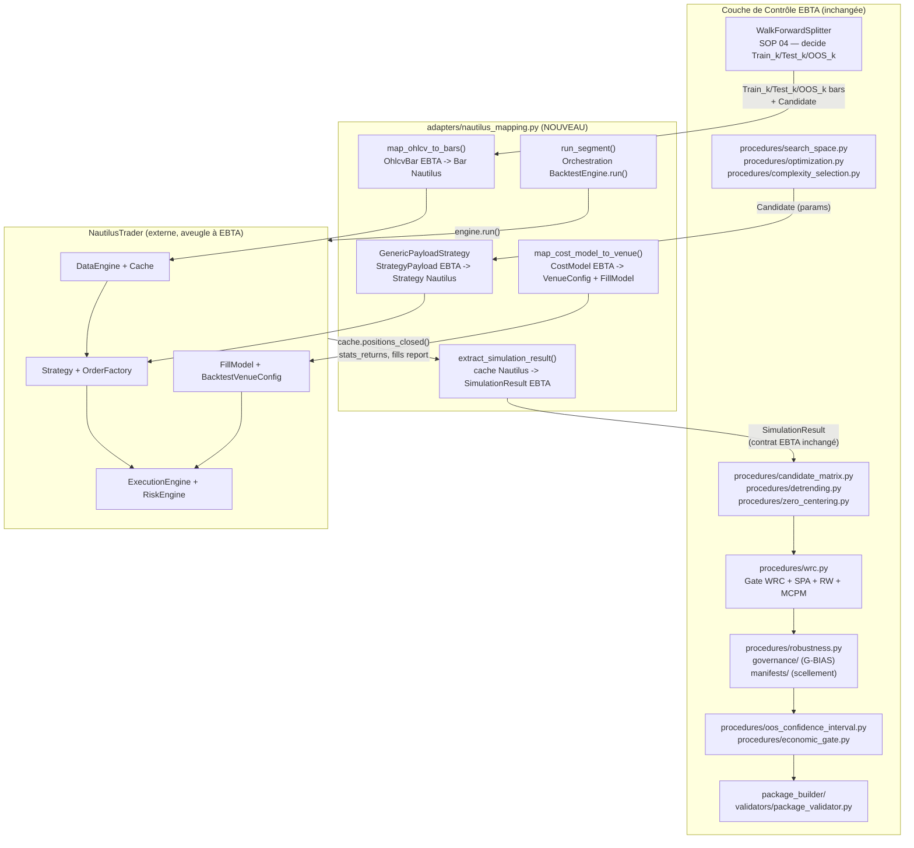
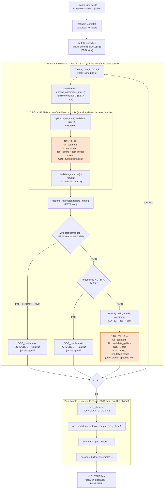
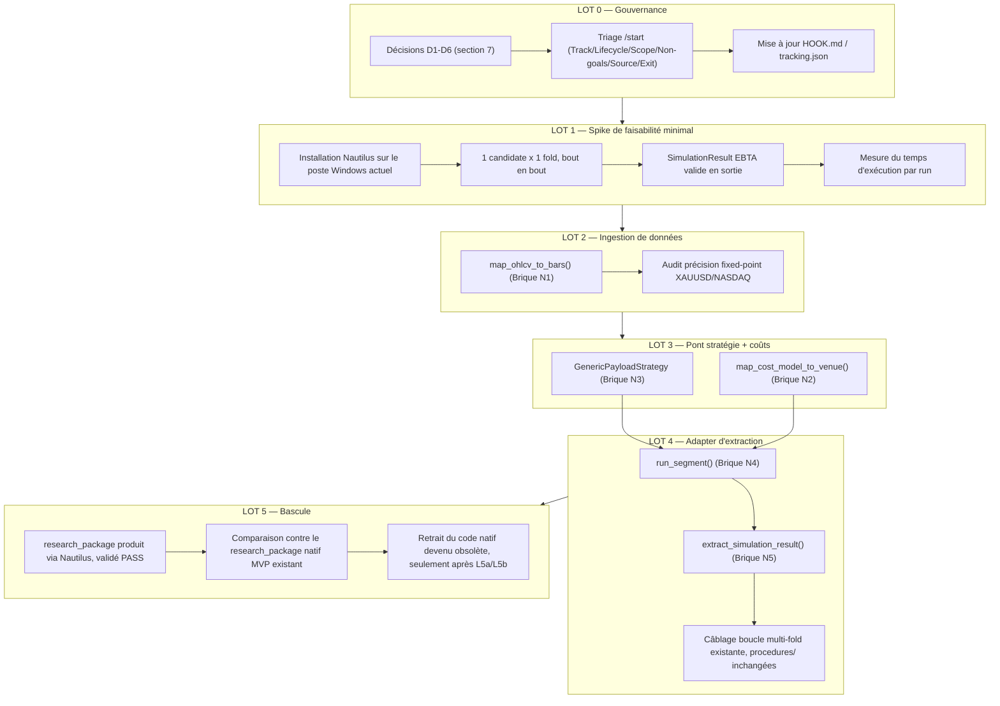

# Pivot Architectural : NautilusTrader comme Moteur de Backtest EBTA
## Étude de faisabilité et plan de bascule (remplacement du moteur natif)

---

> [!IMPORTANT]
> **Statut : INTAKE non audité.** Ce document vit dans
> `0 - HUMAN START HERE/` et n'est donc pas exécutable en l'état
> (`AGENTS.md` / `CLAUDE.md`). Avant tout `/start`, il lui manque le triage
> obligatoire (`Track`, `Lifecycle`, `Scope`, `Non-goals`, `Source`,
> `Exit criteria`).
>
> **Ce document propose de rouvrir un chantier marqué `DONE`.**
> `.ai/checkpoint.json` et `Implementation/Active/HOOK.md` déclarent
> `PLAN_IMPLEMENTATION_MOTEUR_BACKTEST_EBTA_NATIF` `DONE` avec
> `NATIVE_ENGINE_PHASE_8_COMPLETED`, et bloquent explicitement toute
> extension au-delà du MVP tant qu'une décision humaine ne lève pas ce
> verrou. Ce document n'est pas une extension du moteur natif : c'est une
> proposition de **remplacement** d'une de ses briques (le moteur de calcul
> financier pur) par un moteur externe, NautilusTrader. C'est un changement
> de nature différente de celui déjà bloqué par le `HOOK.md`, mais tout
> aussi soumis à décision humaine explicite — et plus encore, puisqu'il
> touche une règle de conception plus fondamentale (voir section 7).
>
> **Ce document introduirait une dépendance technique externe** dans un
> moteur conçu `stdlib-only`. `CLAUDE.md` l'interdit explicitement sans
> décision humaine explicite : *« Adding technical dependencies (the engine
> is stdlib-only by design) »* fait partie des « Modifications forbidden
> without an explicit human decision ». Rien dans ce document ne doit être
> exécuté avant que cette décision soit tracée (voir LOT 0, section 8).
>
> Ce document ne modifie pas `Protocole/`. Il ne modifie aucun fichier
> existant sous `Implementation/`. Il propose un plan.

---

## 0. Rôle du Document et Contexte

L'utilisateur a exprimé, le 2026-07-07, le constat que développer un moteur
de backtest natif complet (event loop, fills, slippage, financement,
sizing réaliste — la Brique 3 du plan
`.ai/backlog/mainline/PLAN_IMPLEMENTATION_MOTEUR_BACKTEST_EBTA_NATIF.md`,
et le lot LOT 2 de son extension bloquée) devient d'une complexité
disproportionnée par rapport à la mission réelle du projet : **valider des
stratégies selon le protocole EBTA**, pas maintenir un moteur d'exécution
financier.

L'intuition posée est correcte et confirmée par la lecture de la
documentation NautilusTrader (`https://nautilustrader.io/docs/latest/`,
consultée le 2026-07-07 — voir Annexe A pour les pages exactes) : un moteur
de backtest, qu'il s'agisse de Backtrader, de NautilusTrader ou du moteur
natif EBTA, répond à une seule question — *« si cette candidate avait été
exécutée sur cette série de prix avec ces coûts, qu'aurait-on obtenu ? »* —
et produit des chiffres (fills, PnL, NAV, ordres). Rien dans cette question
n'exige un moteur maison.

Position de ce document :

| Élément | Rôle | Change avec ce plan ? |
|---|---|---|
| `Protocole/` | Autorité normative : ordre des gates, SOP, décisions, interdictions. | Non |
| `Implementation/ebta_engine/procedures/` | Calculs SOP testés, stdlib-only (WRC, detrending, bootstrap, IC OOS, robustesse, gate économique, walk-forward). | Non |
| `Implementation/ebta_engine/validators/`, `governance/`, `manifests/`, `package_builder/` | Gates, G-BIAS, scellement, assemblage du `research_package`. | Non |
| `Implementation/ebta_engine/backtest/native_engine.py`, `risk/sizing.py` | Moteur de calcul financier pur actuel (MVP, fenêtre figée). | **Oui — candidat au remplacement** |
| **NautilusTrader** | Nouveau moteur de calcul financier pur, externe, borné par un adapter. | **Nouveau composant, jamais source de vérité méthodologique** |
| `Implementation/ebta_engine/adapters/` | Frontière qui traite la sortie du moteur externe comme non fiable et la mappe vers les contrats EBTA. | **Étendu** (nouveau fichier, `backtrader_mapping.py` inchangé) |
| Ce document | Carte de faisabilité et de bascule : ce qui change, ce qui ne change pas, ce qui doit être tranché avant tout code. | — |

Non-objectifs de ce document :

- ne pas réécrire `Protocole/` ;
- ne pas changer l'ordre des gates G0-G14 ni les invariants méthodologiques
  (SOP 01 à 13) ;
- ne pas faire de NautilusTrader — ni de sa couche de statistiques internes
  (`PortfolioAnalyzer`) — une source de vérité scientifique EBTA ;
- ne pas décider ici, unilatéralement, de lever le verrou stdlib-only : ce
  document pose la question, il ne la tranche pas ;
- ne pas supprimer le moteur natif MVP existant avant qu'un équivalent
  Nautilus soit validé.

---

## 1. Ce Qui Ne Change Pas (Rappel)

La séparation posée en section 3 de
`0 - HUMAN START HERE/implementation_plan - 1.md` reste intégralement
valable et normative pour ce pivot :

> Le moteur de backtest ne sait pas qu'il existe un protocole EBTA. La
> couche de contrôle transforme un simulateur générique en processus de
> recherche conforme EBTA.

Ce principe est en fait **exactement** le principe d'architecture de
NautilusTrader lui-même : sa documentation d'architecture décrit un
`DataEngine`, un `ExecutionEngine` et un `RiskEngine` qui ignorent tout du
protocole EBTA — ils exécutent des ordres sur des barres, point. La
frontière moteur/contrôle que le projet EBTA a déjà décidée n'a donc pas
besoin d'être réinventée : elle correspond directement à la frontière entre
NautilusTrader (moteur) et `Implementation/ebta_engine/` (contrôle).

Les 15 gates (G0-G14), les invariants méthodologiques (section 1.2 du plan
natif), et la totalité de `procedures/` restent inchangés et continuent
d'être la seule source de vérité pour :

- le detrending et le zero-centering (`procedures/detrending.py`,
  `procedures/zero_centering.py`) ;
- le WRC, SPA, Romano-Wolf, MCPM (`procedures/wrc.py`) ;
- l'estimation OOS globale (`procedures/oos_confidence_interval.py`) ;
- la robustesse pré-OOS — validation de verdict (`procedures/robustness.py`) ;
- le gate économique — agrégation de statut (`procedures/economic_gate.py`) ;
- la validation du calendrier Walk-Forward (`procedures/walk_forward.py`) ;
- la sélection de complexité et la matrice candidates
  (`procedures/complexity_selection.py`, `procedures/candidate_matrix.py`) ;
- G-BIAS (`governance/`), le scellement (`manifests/`), la validation du
  paquet (`validators/package_validator.py`).

**Rien de tout cela n'importe, n'appelle, ni ne dépend de NautilusTrader.**
NautilusTrader ne fournit que des séries brutes ; EBTA continue de calculer
lui-même Sharpe, drawdown, p-values et verdicts.

---

## 2. Ce Que NautilusTrader Apporte Réellement

Résumé des points de la documentation officielle directement pertinents
pour EBTA (Annexe A pour le détail des pages consultées).

### 2.1 Architecture interne

NautilusTrader est structuré autour d'un `NautilusKernel` (orchestrateur),
d'un `MessageBus` (pub/sub inter-composants), d'un `Cache` (état en
mémoire : instruments, comptes, ordres, positions), d'un `DataEngine`, d'un
`ExecutionEngine` et d'un `RiskEngine`. Le cœur est écrit en **Rust**
(`crates/`), exposé via des extensions **Cython**, avec une API finale en
**Python**. Le mode backtest et le mode live partagent le même noyau ; en
backtest, les données historiques sont traitées de façon synchrone,
mono-thread, avec un ordonnancement d'événements déterministe (timers
triés, événements triés par `ts_event`) — une propriété directement utile
pour la reproductibilité que SOP 12 exige (scellement, hash).

> [!IMPORTANT]
> Correction (2026-07-07, suite à l'analyse Annexe B) : NautilusTrader
> possède un second contrat de déterminisme, plus fort, nommé **DST**
> (`concepts/dst`), fondé sur `madsim` et garantissant un rejeu **bit-à-bit**
> d'une exécution à seed égal. Ce contrat **exclut explicitement** *"Python
> strategies and PyO3 bindings"* de sa garantie — or `GenericPayloadStrategy`
> (Brique N3) est du code Python. Le déterminisme dont bénéficie réellement
> ce pivot est donc uniquement celui décrit au paragraphe ci-dessus
> (ordonnancement `ts_event` trié, seed fixé sur le `FillModel`,
> "same-process only, peut varier cross-process dans de rares cas" selon la
> doc) — pas la garantie DST formelle. **La reproductibilité opposable reste
> et demeure entièrement portée par `manifests/` (SOP 12), pas par
> Nautilus.** Voir Annexe B, bloc A, ligne « Determinism Contract ».

### 2.2 Deux niveaux d'API de backtest

- **`BacktestEngine`** (bas niveau) : on lui fournit manuellement barres,
  venues, instruments, coûts, puis `engine.run()`. `engine.reset()` permet
  d'enchaîner plusieurs runs en conservant données/instruments/venues —
  pertinent pour exécuter M candidates sur un même `Test_k`.
- **`BacktestNode`** (haut niveau) : orchestre une liste de
  `BacktestRunConfig` indépendants (chacun avec ses propres données, venues,
  configuration de stratégie), pensé pour les *parameter sweeps* — c'est le
  mécanisme naturel pour « toutes les candidates × tous les folds ».

### 2.3 Stratégies paramétrées, pas codées en dur

Une stratégie hérite de `Strategy`, reçoit un objet `StrategyConfig`
(Pydantic-like, sérialisable) au constructeur, et lit ses paramètres via
`self.config`. **Une seule classe de stratégie générique, paramétrée
différemment par candidate**, est le pattern recommandé par la
documentation elle-même pour les *parameter sweeps* — ce qui correspond
exactement à la façon dont EBTA génère déjà sa famille de candidates via
`procedures/search_space.py::expand_parameter_grid()`.

### 2.4 Ingestion de données externes

Le chemin documenté est `DataLoader` (lecture du format brut → DataFrame
pandas) puis `DataWrangler` (DataFrame → objets Nautilus), stockés
optionnellement dans un `ParquetDataCatalog`. Contraintes strictes :
`ts_init`/`ts_event` en nanosecondes Unix, précision fixed-point exacte pour
prix/quantités (une valeur non multiple de l'échelle interne cause un
`panic` Rust), et pour les barres, `ts_init` doit représenter l'**heure de
clôture** (sinon `ts_init_delta` à appliquer) — une exigence anti-lookahead
qui rejoint directement l'invariant PIT déjà défendu par
`data/local_ohlcv.py` et `data/walk_forward.py` côté EBTA.

### 2.5 Modèle de coûts et de fills configurable

`BacktestVenueConfig` + un `FillModel` (probabiliste, meilleur-prix,
multi-niveaux ou dépendant de la taille) couvrent exactement le rôle prévu
pour `backtest/cost_model.py` (Brique 3 du plan natif) :
commission, slippage probabiliste, financement, avec `random_seed` pour la
reproductibilité.

### 2.6 Résultats en sortie

Après `engine.run()`, `engine.get_result()` fournit des statistiques
(`stats_returns`, `stats_pnls`, `stats_general`), et `engine.cache` expose
`positions_closed()`, avec des rapports (`generate_fills_report()`, etc.)
sous forme de `DataFrame` pandas. **C'est la matière première de
l'adapter** — pas un remplacement de nos propres calculs. La documentation
ne détaille pas de mécanisme natif pour reconstruire précisément une série
`daily_returns` au sens EBTA (net, quotidien, alignée sur le calendrier de
detrending) : ce mapping est un vrai travail d'adapter (voir section 4,
Brique N5).

### 2.7 Ce que le concept d'« adapter » Nautilus ne couvre pas

Dans le vocabulaire Nautilus, un « adapter » connecte un fournisseur de
données ou une venue *externe* **vers l'intérieur** de Nautilus (Binance,
Interactive Brokers, etc.). Il n'existe pas de mécanisme officiel pour
l'inverse — encapsuler Nautilus comme sous-composant d'un système tiers.
**C'est donc EBTA qui doit écrire et posséder entièrement cette frontière**,
exactement comme il le fait déjà pour Backtrader dans
`adapters/backtrader_mapping.py`, avec la même philosophie : traiter la
sortie externe comme non fiable, ne jamais importer ses conventions comme
normes EBTA.

---

## 3. Schéma de la Frontière Moteur / Contrôle avec NautilusTrader



### 3.1 Frontière exacte

| NautilusTrader (via l'adapter) fait | NautilusTrader ne fait jamais |
|---|---|
| Lire les barres dans l'ordre chronologique, appliquer les signaux de la stratégie générique | Savoir qu'il exécute `Train_k`, `Test_k` ou `OOS_k` — l'adapter ne lui transmet que des barres brutes |
| Calculer fills, slippage, financement via `FillModel`/`BacktestVenueConfig` | Décider si le WRC est `PASS` ou `FAIL` |
| Calculer NAV mark-to-market, exposition, ordres, positions | Sceller ou hasher quoi que ce soit (SOP 12 reste `manifests/`) |
| Produire `stats_returns`, `positions_closed()`, rapports de fills | Vérifier `G-BIAS` ou journaliser dans `registry.jsonl` |
| Garantir un ordonnancement déterministe des événements pour un run donné | Décider si un fold passe au suivant, ou si `NO_MODEL` s'applique |
| — | Calculer le Sharpe, le drawdown ou le hurdle économique *au sens EBTA* — `procedures/economic_gate.py` recalcule tout depuis les séries brutes extraites, jamais depuis `PortfolioAnalyzer` |

### 3.2 Vue d'Ensemble : Input, Output et Boucles

Le point le plus important à comprendre avant de lire la cartographie
brique par brique (section 4) : **NautilusTrader ne possède aucune boucle
EBTA**. Il n'a aucune notion de fold, de candidate, de famille, de
concaténation OOS. Il est appelé de façon atomique, un nombre fini de fois,
toujours par la couche de contrôle — jamais l'inverse. Toutes les boucles
(fold, candidate, concaténation finale) restent des boucles Python
ordinaires dans `Implementation/ebta_engine/`, à l'extérieur de tout objet
Nautilus.

#### 3.2.1 Les trois boucles emboîtées, et où Nautilus intervient



Légende : les deux seuls nœuds encadrés en orange (🧭 *NAUTILUS*) sont les
seuls points du schéma où NautilusTrader est réellement invoqué. Tout le
reste du diagramme — les deux boucles (`k`, `m`), les gates, le scellement,
la concaténation, le verdict final — reste exclusivement du code
`Implementation/ebta_engine/` déjà existant ou déjà prévu par le plan
natif.

Deux constats structurants :

1. **Nautilus n'est jamais appelé plus de `M + 1` fois par fold** (`M`
   évaluations `Test_k`, `+1` évaluation `OOS_k` si le fold franchit les
   gates — 0 sinon). Sur `K` folds, le nombre total d'appels atomiques est
   borné par `K × (M + 1)` — c'est le chiffre à mesurer lors du spike de
   faisabilité (LOT 1, section 8) pour juger de la viabilité à l'échelle
   réelle de l'univers de candidates.
2. **Chaque appel est indépendant et sans mémoire d'un point de vue EBTA** :
   `run_segment()` ne reçoit jamais l'historique des appels précédents, et
   ne renvoie jamais d'information sur *quel* fold ou *quelle* candidate il
   vient d'exécuter au-delà de ce que l'appelant lui a fourni. (`engine.reset()`
   peut être utilisé côté implémentation pour amortir le coût de démarrage
   Nautilus entre appels — c'est un détail de performance de la Brique N4,
   pas une boucle qui change la sémantique : chaque `run_segment()` reste
   conceptuellement un calcul autonome.)

#### 3.2.2 Table Input → Boucle → Output par niveau

| Niveau | Qui pilote la boucle | Entrée (input) | Itère sur | Sortie (output) | Nautilus impliqué ? |
|---|---|---|---|---|---|
| 0 — Recherche complète | EBTA (`package_builder`) | `config.json` scellé + univers de données brutes | — (une seule passe) | `research_package/` final validé `PASS`/`FAIL` | Non directement — orchestre les niveaux inférieurs |
| 1 — Boucle Fold | EBTA (`WalkForwardSplitter`) | `bars_complet`, `fold_schedule.json` | `k = 1..K` | `OOS_k` (rempli ou flat/`NO_MODEL`) par fold | Non — décide seulement quand appeler le niveau 3 |
| 2 — Boucle Candidate | EBTA (`search_space` + boucle `strategies/generator.py`) | `Train_k`, `Test_k`, grille de paramètres | `m = 1..M` | `candidate_matrix.json` `[T×M]` sur `Test_k` | Non — orchestre les appels atomiques du niveau 3 |
| 3 — Appel atomique | **NautilusTrader (via `adapters/nautilus_mapping.py::run_segment()`)** | 1 candidate + 1 segment de barres + `cost_model` + `seed` | Aucune boucle — un seul calcul | `SimulationResult` (daily_returns, exposure, nav, orders, fills, positions, coûts) | **Oui — seul niveau où Nautilus s'exécute** |
| Post-boucle — Verdict global | EBTA (`oos_confidence_interval.py`, `economic_gate.py`) | `OOS_1 .. OOS_K` concaténés | — (une seule passe) | `oos_global.json`, `economic.json` | Non |

#### 3.2.3 Ce que cette vue d'ensemble change (ou ne change pas) par rapport au moteur natif

Ce schéma de boucles est **identique** à celui déjà décrit en section 2.2
et 4 du plan natif (`0 - HUMAN START HERE/implementation_plan - 1.md`) —
la boucle Fold, la boucle Candidate, et le verdict global existaient déjà
et ne bougent pas. La seule chose qui change est **ce qui répond à
l'appel atomique du niveau 3** : c'était `VectorizedSimulator.run()`
(Brique 3, jamais construit au-delà d'un MVP à fenêtre figée), c'est
désormais `adapters/nautilus_mapping.py::run_segment()`. L'appelant
(niveaux 0 à 2, post-boucle) ne change pas une seule ligne.

---

## 4. Cartographie Composant Nautilus → Brique EBTA

| Composant Nautilus | Remplace / étend quelle brique du plan natif | Ce qui reste 100% EBTA (inchangé) |
|---|---|---|
| `BacktestEngine` / `BacktestNode` | `backtest/native_engine.py` (Brique 3 — moteur de calcul pur) | La décision de *quels* segments et *quelles* candidates lui soumettre (`WalkForwardSplitter`, boucle multi-fold) |
| `Strategy` + `StrategyConfig` | La partie « exécution d'une candidate » de `strategies/generator.py` | La génération de la famille complète de candidates (`procedures/search_space.py`, `procedures/optimization.py`, `procedures/complexity_selection.py`) |
| `FillModel` + `BacktestVenueConfig` | `backtest/cost_model.py` (prévu, jamais construit) | Le modèle de coûts *déclaré* et scellé dans `config.json` reste la source de vérité préenregistrée ; l'adapter ne fait que le traduire |
| `DataLoader` / `DataWrangler` / `ParquetDataCatalog` | Étend `data/local_ohlcv.py` côté ingestion technique | La garantie PIT et la découpe Train/Test/OOS restent `data/walk_forward.py` — jamais déléguées au catalogue Nautilus |
| `cache.positions_closed()`, `stats_returns`, rapports de fills | Alimente le contrat `SimulationResult` | Le contrat `SimulationResult` lui-même (dataclass déjà spécifiée section 3.4 du plan natif) — inchangé |
| `PortfolioAnalyzer` (Sharpe, PnL, stats internes) | **Rien** — explicitement non utilisé comme verdict | `procedures/economic_gate.py`, `procedures/oos_confidence_interval.py` restent l'unique source de Sharpe/drawdown/IC opposables |
| Déterminisme (seed, ordonnancement `ts_event`) | Soutient la reproductibilité | Le hash et le scellement SOP 12 restent calculés et vérifiés par `manifests/` — Nautilus fournit un input reproductible, pas une preuve |
| `risk/sizing.py::unit_notional_size()` | Devient un mapping vers le sizing natif Nautilus (`instrument.make_qty`) | La règle de sizing *déclarée* dans `StrategyPayload.sizing_model` reste la source de vérité ; l'adapter traduit, ne décide pas |

Ce qui **disparaît** du plan natif si ce pivot est retenu : la construction
prévue de `backtest/simulator.py`, `backtest/cost_model.py`, et l'extension
de `native_engine.py` au-delà de sa fenêtre figée (LOT 2 du plan natif
bloqué) — remplacés par le câblage de l'adapter Nautilus. Rien d'autre dans
l'inventaire du plan natif (LOT 1, 3, 4, 5) ne change.

### 4.1 Bilan Explicite : Briques Nautilus Retenues vs Briques Natives Jetées

> [!NOTE]
> Précision de vocabulaire : **BACKTRADER** (le framework externe réel) et
> le **moteur natif EBTA** (`backtest/native_engine.py`, écrit pour le
> remplacer) sont deux choses différentes. BACKTRADER n'a jamais été une
> dépendance runtime — il est resté lecture seule/référence (`HOOK.md`,
> section 0) et ce pivot ne change rien à ce statut : il n'y a rien à
> « jeter » côté BACKTRADER puisqu'il n'a jamais été intégré. Ce qui est
> réellement mis de côté par ce pivot, c'est le **moteur natif EBTA
> lui-même** (le code écrit en interne pour remplacer BACKTRADER), détaillé
> ci-dessous.

**A — Briques natives Nautilus effectivement retenues (utilisées telles
quelles, sans réécriture EBTA) :**

| Brique Nautilus (API réelle, doc §2) | Utilisée dans quelle brique de ce plan | Rôle EBTA couvert |
|---|---|---|
| `BacktestEngine` (bas niveau) / `BacktestNode` (haut niveau) | Brique N4 (`run_segment()`) | Le calcul d'un run — équivalent de `VectorizedSimulator.run()` jamais construit |
| `Strategy` (classe de base) + `StrategyConfig` | Brique N3 (`GenericPayloadStrategy`) | Exécution paramétrée d'une candidate, une classe générique par famille, pas par candidate |
| `OrderFactory` (`self.order_factory.limit/market(...)`) | Brique N3 | Soumission d'ordres depuis la logique `entry_criterion`/`exit_criterion` du `StrategyPayload` |
| `FillModel` (probabiliste, `BestPriceFillModel`, `ThreeTierFillModel`, `SizeAwareFillModel`) + `BacktestVenueConfig` | Brique N2 (`map_cost_model_to_venue()`) | Le modèle d'exécution/coûts — remplace `backtest/cost_model.py` jamais construit |
| `DataLoader` + `DataWrangler` (ex. `BarDataWrangler`) | Brique N1 (`map_ohlcv_to_bars()`) | Conversion `OhlcvBar` EBTA → `Bar` Nautilus |
| `ParquetDataCatalog` (optionnel) | Brique N1, en option de stockage intermédiaire | Persistance technique des barres converties, hors du `research_package` lui-même |
| `Instrument.make_qty()` / `make_price()` | Brique N3, N1 | Conversion fixed-point pilotée par Nautilus plutôt que par un sizing maison |
| `cache.positions_closed()`, `engine.get_result()`, `generate_fills_report()`, `stats_returns`/`stats_pnls`/`stats_general` (comme **données brutes**, jamais comme verdict) | Brique N5 (`extract_simulation_result()`) | Matière première pour reconstruire `SimulationResult` — jamais consommées comme Sharpe/drawdown final |
| `random_seed` déterministe + ordonnancement `ts_event` trié | Briques N2, N4 | Support de la reproductibilité — ne remplace pas le hash/scellement SOP 12 (`manifests/`) |

**B — Briques natives EBTA (« maison », écrites pour remplacer BACKTRADER)
mises de côté si ce pivot est retenu :**

| Brique native actuelle | Fichier | Statut avec ce pivot |
|---|---|---|
| Moteur de calcul MVP | `backtest/native_engine.py::run_native_backtest()` | **Jeté.** Calcul réel (`math.log(exit_bar.close/entry_bar.close)` signé) mais fenêtre figée (`entry_bar = bars[index+3]`, `exit_bar = bars[index+4]`, `max_observations=4`) et coût forfaitaire (`0.00001`) — remplacé par Brique N4 (`run_segment()`). |
| Simulateur complet prévu | `backtest/simulator.py` (jamais construit, seulement spécifié en Brique 3 du plan natif) | **Abandonné avant construction** — n'existe qu'en spécification, jamais écrit. |
| Modèle de coûts prévu | `backtest/cost_model.py` (jamais construit) | **Abandonné avant construction** — remplacé par le mapping Brique N2 vers `FillModel`/`BacktestVenueConfig`. |
| Sizing simplifié actuel | `risk/sizing.py::unit_notional_size()` (`capital * risk_fraction`, notionnel fixe) | **Jeté.** Remplacé par `Instrument.make_qty()` piloté par `StrategyPayload.sizing_model`. |
| Sizing réaliste prévu | `risk/position_sizer.py` (jamais construit, prévu en Brique 3 du plan natif) | **Abandonné avant construction.** |

Rien d'autre n'est jeté : `procedures/*.py` (WRC, detrending, bootstrap, IC
OOS, robustesse, gate économique, walk-forward, search space, optimization,
complexity selection, candidate matrix), `validators/`, `governance/`,
`manifests/`, `package_builder/`, `strategies/payloads.py` restent
strictement identiques (déjà établi section 1 et 4).

---

## 5. Briques à Construire

### Brique N1 — `adapters/nautilus_mapping.py::map_ohlcv_to_bars()`

| Élément | Détail |
|---|---|
| Rôle | Convertit `list[OhlcvBar]` (type EBTA déjà existant, `data/local_ohlcv.py`) en objets `Bar` Nautilus. |
| Construit aussi | La définition d'`Instrument` associée (XAUUSD, NASDAQ) — `price_increment`, `size_increment`, `lot_size`, `multiplier`, et surtout **`margin_init`, `margin_maint`, `maker_fee`, `taker_fee`**, qui sont portés par l'`Instrument` lui-même dans Nautilus, pas par `BacktestVenueConfig`. La part du `CostModel` EBTA relative à la marge et aux frais est donc mappée ici, pas dans la Brique N2. |
| Contraintes dures | `ts_init` = heure de clôture (ou `ts_init_delta` explicite) ; prix/quantités convertis en fixed-point par multiplication-arrondi exacte de l'échelle interne, jamais par troncature flottante ; plage numérique (mode standard-precision 64-bit sur Windows, cf. D4 section 7) à valider sur les ordres de grandeur réels NASDAQ (~15 000-20 000) et XAUUSD (~2 000-3 000) au LOT 1. |
| Interdit | Laisser Nautilus déduire lui-même quel segment (Train/Test/OOS) il reçoit — la fonction ne prend que des barres, jamais de métadonnée de segment. |
| Test requis | Round-trip prix/quantité sans dérive flottante sur un échantillon XAUUSD/NASDAQ réel. |

> [!NOTE]
> **Décision figée (2026-07-07, voir Annexe B).** `ParquetDataCatalog` est
> utilisé dès le MVP comme cache intermédiaire des barres converties, pour
> éviter de reconvertir les CSV XAUUSD/NASDAQ à chaque appel `run_segment()`.
> Ce catalogue reste un **cache technique**, explicitement hors du
> `research_package/` — il ne devient jamais un artefact scellé ou hashé par
> `manifests/`, et sa purge/reconstruction ne modifie aucune preuve EBTA.

### Brique N2 — `adapters/nautilus_mapping.py::map_cost_model_to_venue()`

| Élément | Détail |
|---|---|
| Rôle | Traduit le `CostModel` EBTA (commission_per_lot, slippage_bps, financing_rate_daily — signature déjà posée en Brique 3 du plan natif) vers `BacktestVenueConfig` + `FillModel` Nautilus, ainsi que vers un `LatencyModel` (`base_latency_nanos`) pour le délai de soumission d'ordre — dimension explicitement listée par SOP 09B parmi les frictions d'exécution. Les frais maker/taker (`MakerTakerFeeModel`) sont résolus depuis l'`Instrument` construit en Brique N1, pas configurés ici. |
| Interdit | Utiliser un `FillModel` ou un `LatencyModel` par défaut non déclaré dans `config.json` préenregistré — le modèle de coûts (y compris le délai) reste scellé avant résultat (G0). |

> [!NOTE]
> **Décision figée (2026-07-07, voir Annexe B).** Le compte Nautilus mappé
> est de type **MARGIN** (`LeveragedMarginModel`) dès le MVP, pas `CASH`.
> Justification tirée directement de
> `Protocole/SOP 09B - Modèle d'exécution frictions capacité et sizing.md` :
> le contrat d'exécution SOP 09B énumère explicitement, section « Financement,
> cash et marge » (§20), *« coût du levier, taux débiteur, coût overnight,
> marge initiale et maintenance, haircuts, appels de marge, liquidation
> forcée »*, et impose, avant soumission d'ordre, la vérification
> d'*« exposition brute et nette, levier, marge »*. Un compte `CASH` Nautilus
> n'a aucune notion de marge et ne peut pas représenter ces éléments — la
> Brique N2 doit donc produire un `BacktestVenueConfig(account_type="MARGIN")`
> avec un `MarginModel` explicite dès le premier spike, sous peine de laisser
> le gate économique (SOP 08) s'appuyer sur un modèle de compte qui ne peut
> structurellement pas représenter ce que SOP 09B exige.

### Brique N3 — `adapters/nautilus_strategy_bridge.py::GenericPayloadStrategy`

| Élément | Détail |
|---|---|
| Rôle | Une unique classe `Strategy` Nautilus, paramétrée par `StrategyConfig`, qui traduit en direct les champs déjà existants de `strategies/payloads.py::StrategyPayload` (`entry_criterion`, `exit_criterion`, `bias_filter`, `time_filter`, `session`, `risk_model`, `sizing_model`) en appels `on_bar()` / `order_factory`. |
| `time_filter` / `session` | Traduits vers le `Clock` natif de la `Strategy` (`self.clock.set_time_alert(...)`, `self.clock.set_timer(...)`) plutôt que réimplémentés comme condition Python évaluée à chaque barre dans `on_bar()`. |
| `entry_criterion` / `exit_criterion` à base d'indicateur | Résolus via `nautilus_trader.indicators` (SMA, EMA, RSI, MACD, ATR, Bollinger, etc. — implémentation Rust/Cython), enregistrés par `self.register_indicator_for_bars(...)`, plutôt que recalculés en Python pur — cohérent avec la contrainte de performance de la conclusion Annexe B §B.7. |
| Interdit | Générer une classe Python par candidate (viole le principe « famille complète, pas de cas particuliers cachés ») — une seule classe générique, un `StrategyConfig` différent par candidate, exactement le pattern *parameter sweep* documenté par Nautilus. |
| Dépend de | `strategies/payloads.py` (inchangé). |

> [!NOTE]
> **Décision figée (2026-07-07, voir Annexe B).** Le périmètre d'exécution
> est **étendu** dès le MVP : `GenericPayloadStrategy` doit savoir émettre
> des ordres `Trailing-Stop-Market`/`Trailing-Stop-Limit` et des structures
> `bracket` (entrée + stop + cible liés), et l'OMS mappé est **HEDGING**
> (positions multiples simultanées par instrument), pas seulement `NETTING`.
> Justification tirée de `Protocole/SOP 09B`, section « Le contrat définit »
> (ligne ~426-434) : *« capital de référence, trades simultanés, pyramiding,
> coûts, partial fills, sorties partielles, regroupement des legs »* — le
> pyramiding et les « trades simultanés » exigent structurellement plusieurs
> positions ouvertes concurrentes sur le même instrument, ce que `NETTING`
> ne permet pas de représenter. `entry_criterion`/`exit_criterion` restant
> des champs texte libres dans `strategy_payload.schema.json` (aucun enum
> de type d'ordre), c'est bien `GenericPayloadStrategy` qui porte
> l'interprétation de ces règles vers les types d'ordres Nautilus adéquats —
> pas le schéma, qui reste inchangé.

### Brique N4 — `adapters/nautilus_mapping.py::run_segment()`

```python
def run_segment(
    candidate: Candidate,
    bars: list[OhlcvBar],
    cost_model: CostModel,
    *,
    seed: int,
) -> SimulationResult:
    """
    Signature strictement équivalente à VectorizedSimulator.run() (Brique 3
    du plan natif). L'appelant (couche de contrôle EBTA) ne sait pas si
    l'implémentation est native ou Nautilus.
    """
```

| Élément | Détail |
|---|---|
| Rôle | Point d'entrée unique appelé par la boucle multi-fold EBTA. Construit ou réinitialise (`engine.reset()`) un `BacktestEngine`, exécute, délègue l'extraction à la Brique N5. |
| Passage à l'échelle | Si `K × (M + 1)` (section 3.2.1) dépasse ce que la mémoire disponible permet de charger d'un coup, `BacktestEngine`/`BacktestNode` supportent un mode `streaming` natif (`engine.add_data(batch)` → `engine.run(streaming=True)` → `engine.clear_data()`), déjà utilisé en interne par `BacktestNode` — à activer seulement si le spike LOT 1 mesure un besoin réel, pas par anticipation. |
| Interdit | Appeler ceci sur des barres `OOS_k` avant que la couche de contrôle ait validé WRC + robustesse + G-BIAS + scellement — cette garde reste entièrement dans la couche de contrôle (section 3.5, Moments M3/M4 du plan natif), pas dans l'adapter. |

### Brique N5 — `adapters/nautilus_mapping.py::extract_simulation_result()`

Le cœur réel de la frontière « untrusted external output → validated EBTA
contract », dans le même esprit que `backtrader_mapping.py`.

| Élément | Détail |
|---|---|
| Rôle | Reconstruit `daily_returns`, `daily_exposure`, `nav`, `orders`, `fills`, `positions`, `total_costs` (champs déjà spécifiés dans `SimulationResult`, section 3.4 du plan natif) à partir de `cache.positions_closed()`, `stats_returns`, et des rapports de fills. |
| Interdit | Combler silencieusement un jour manquant dans la série de rendements, ou déduire une exposition non observée — lever une erreur explicite (`NautilusExtractionError`) plutôt que deviner. |
| Test requis | Comparaison d'un run Nautilus simple contre un calcul manuel indépendant (PnL, NAV) sur un cas jouet, avant tout usage réel. |

---

## 6. Contrat d'Interface — Inchangé

Le seul objet que l'adapter Nautilus produit et que la couche EBTA consomme
reste exactement `SimulationResult`, déjà spécifié en section 3.4 du plan
natif :

```python
@dataclass
class SimulationResult:
    candidate_id:   str
    segment:        str              # posé par l'appelant, jamais par Nautilus
    daily_returns:  list[float]
    daily_exposure: list[float]
    nav:            list[float]
    orders:         list[dict]
    fills:          list[dict]
    positions:      list[dict]
    total_costs:    float
```

Aucun champ n'est ajouté, aucun n'est retiré. `procedures/detrending.py`,
`procedures/wrc.py`, `procedures/oos_confidence_interval.py` et
`procedures/economic_gate.py` reçoivent exactement les mêmes types qu'avec
le moteur natif — ils ne savent pas, et n'ont pas besoin de savoir, que le
moteur a changé.

---

## 7. Conflits de Gouvernance à Trancher Explicitement (avant tout code)

| # | Conflit | Ce qui doit être décidé |
|---|---|---|
| D1 | `nautilus_trader` est une dépendance externe lourde (Rust + Cython + PyO3) dans un moteur `stdlib-only by design` (`CLAUDE.md`). | Décision humaine explicite. Proposition de confinement : `nautilus_trader` n'est importé que par `adapters/nautilus_mapping.py`, `adapters/nautilus_strategy_bridge.py` et leur point d'entrée d'exécution — jamais par `procedures/`, `validators/`, `governance/`, `manifests/`, `package_builder/`. À documenter comme exception explicite et bornée à la couche adapter, au même titre que Backtrader l'était en lecture seule. |
| D2 | Réouverture du chantier `PLAN_IMPLEMENTATION_MOTEUR_BACKTEST_EBTA_NATIF` (`DONE`) et du blocage `HOOK.md` sur l'extension au-delà du MVP. | Décision humaine explicite : ce plan n'est pas l'extension bloquée (qui visait un moteur natif complet) mais un remplacement de brique. Le `HOOK.md` et `tracking.json` devront être mis à jour pour refléter la nouvelle direction si elle est retenue. |
| D3 | Statut de BACKTRADER : reste-t-il « référence historique en lecture seule » (statut actuel), ou est-il purement et simplement abandonné au profit de Nautilus ? | Décision humaine explicite, sans quoi deux moteurs de référence coexistent sans rôle clair. |
| D4 | Plateforme : NautilusTrader est officiellement supporté sur **Windows Server 2022+** (wheels précision standard uniquement, pas de mode 128-bit à cause d'une limitation MSVC `__int128`) ; le poste de développement actuel est **Windows 11 Home**, non listé explicitement dans les plateformes officiellement supportées. | À vérifier par un spike d'installation (LOT 1) avant tout engagement — risque d'incompatibilité ou de comportement non garanti hors plateforme officiellement testée. |
| D5 | Version Python : NautilusTrader exige **Python 3.12–3.14**. `CLAUDE.md` ne fixe aucune version explicite pour `Implementation/ebta_engine/` (seulement « Python 3 standard library only »). | Vérifier la version Python réellement utilisée sur ce poste et sa compatibilité, avant LOT 1. |
| D6 | Licence de NautilusTrader : **LGPL-3.0** (vérifiée sur `LICENSE` du dépôt `nautechsystems/nautilus_trader`). | Usage commercial autorisé, aucune obligation de publier le code EBTA (usage en bibliothèque, aucune modification du cœur Nautilus prévue). Nuance à retenir : seule une modification distribuée du cœur Nautilus lui-même devrait être repartagée sous LGPL — non applicable à l'usage prévu ici. Point tranché, ne bloque plus LOT 0. |

**Aucun LOT au-delà de LOT 0 ne doit démarrer avant que D1 à D6 soient
explicitement tranchés** (au même format que la décision `1A/2B/3A` du
2026-07-02 déjà tracée dans le plan mainline).

---

## 8. Priorisation — Chemin Critique



| Lot | Ce qu'il débloque | Critère de sortie |
|---|---|---|
| LOT 0 — Gouvernance | Décisions D1-D6 tracées, triage `/start` effectué. | `.ai/checkpoint.json`, `HOOK.md`, `tracking.json` cohérents avec la nouvelle direction. |
| LOT 1 — Spike de faisabilité | Preuve concrète que Nautilus tourne sur ce poste et produit un `SimulationResult` cohérent, avant tout investissement supplémentaire. | Un run simple, comparé manuellement, correspond à un calcul indépendant ; temps d'exécution mesuré et jugé viable à l'échelle M × K. |
| LOT 2 — Ingestion | Barres XAUUSD/NASDAQ chargées sans perte de précision ni lookahead. | Tests round-trip prix/quantité + `ts_init` de clôture validés. |
| LOT 3 — Pont stratégie + coûts | Une candidate EBTA quelconque exécutable dans Nautilus sans classe dédiée. | `GenericPayloadStrategy` couvre les champs `StrategyPayload` déjà schématisés. |
| LOT 4 — Adapter d'extraction | `SimulationResult` fiable, branché sur `procedures/` existant sans aucune modification de ces fichiers. | Detrending, WRC, IC OOS, gate économique tournent sur des données Nautilus sans changement de signature. |
| LOT 5 — Bascule | `research_package` complet, validé `PASS` par `validate_package_dir()`, comparable au paquet natif MVP déjà produit. | Décision humaine de retrait du moteur natif, seulement après comparaison satisfaisante. |

---

## 9. NO GO d'Implémentation

- Laisser Nautilus (ou son adapter) savoir qu'il exécute `Train_k`,
  `Test_k` ou `OOS_k` — cette décision reste entièrement dans la couche de
  contrôle EBTA.
- Utiliser `PortfolioAnalyzer`/`stats_returns`/Sharpe interne de Nautilus
  comme verdict statistique ou économique EBTA — `procedures/economic_gate.py`
  et `procedures/oos_confidence_interval.py` restent l'unique source.
- Importer `nautilus_trader` en dehors de `adapters/` et de son point
  d'entrée d'exécution.
- Générer une classe `Strategy` Python par candidate au lieu d'une seule
  classe générique paramétrée.
- Démarrer LOT 1 ou au-delà avant que les décisions D1-D6 (section 7)
  soient explicitement tranchées par un humain.
- Supprimer `backtest/native_engine.py` ou le `research_package` natif MVP
  existant avant qu'un équivalent Nautilus soit produit et validé (LOT 5).
- Modifier `Protocole/` pour accommoder une contrainte technique de
  Nautilus (ex. précision fixed-point, format de timestamp).
- Coder une règle méthodologique absente des SOP sous prétexte que
  Nautilus la rendrait « plus facile ».

---

## 10. Résumé Narratif

Le constat de départ est juste : ni Backtrader, ni NautilusTrader, ni le
moteur natif EBTA ne changent la question à laquelle répond un moteur de
backtest — produire des fills, un PnL et une NAV à partir d'une candidate
et d'une série de prix. Ce que le protocole EBTA exige, en revanche, c'est
que cette réponse soit produite au bon moment, dans le bon ordre, et sous
contrôle — et cette exigence vit entièrement dans
`Implementation/ebta_engine/procedures/`, `validators/`, `governance/`,
`manifests/` et `package_builder/`, aucun de ces modules ne changeant avec
ce pivot.

NautilusTrader apporte un moteur de calcul financier mature (fills
probabilistes, financement, gestion de venue, déterminisme d'exécution) là
où le moteur natif EBTA n'a aujourd'hui qu'un MVP à fenêtre figée. Le prix
à payer est une dépendance externe substantielle dans un système conçu pour
n'en avoir aucune, une contrainte de plateforme non encore vérifiée sur ce
poste, et un travail d'adapter réel (traduire `StrategyPayload` en
`Strategy` Nautilus, et reconstruire fidèlement `SimulationResult` depuis
les objets Nautilus) qui ne doit rien laisser à la supposition.

Ce document ne recommande pas encore la bascule : il pose les conditions
(section 7) et le chemin (section 8) qui permettraient de la décider en
connaissance de cause, en commençant par un spike de faisabilité minimal
(LOT 1) avant tout engagement plus large.

---

## Annexe A — Sources Documentaires Consultées (2026-07-07)

- [Architecture](https://nautilustrader.io/docs/latest/concepts/architecture)
- [Backtesting](https://nautilustrader.io/docs/latest/concepts/backtesting)
- [Strategies](https://nautilustrader.io/docs/latest/concepts/strategies)
- [Data](https://nautilustrader.io/docs/latest/concepts/data)
- [Installation](https://nautilustrader.io/docs/latest/getting_started/installation)
- [Reports](https://nautilustrader.io/docs/latest/concepts/reports)
- [Adapters](https://nautilustrader.io/docs/latest/concepts/adapters)

Ces pages ont été résumées via un modèle intermédiaire ; en cas de décision
d'engagement réel (au-delà de LOT 0), les extraits cités en section 2
doivent être revérifiés directement sur la documentation source, notamment
les détails de précision fixed-point (section 2.4) et de licence (D6,
non trouvée dans ces pages).

### A.1 Sources complémentaires (2026-07-07, pour l'Annexe B)

- [Concepts — table des matières](https://nautilustrader.io/docs/latest/concepts/)
- [Overview](https://nautilustrader.io/docs/latest/concepts/overview)
- [Execution](https://nautilustrader.io/docs/latest/concepts/execution)
- [Orders](https://nautilustrader.io/docs/latest/concepts/orders)
- [Positions](https://nautilustrader.io/docs/latest/concepts/positions)
- [Cache](https://nautilustrader.io/docs/latest/concepts/cache)
- [Message Bus](https://nautilustrader.io/docs/latest/concepts/message_bus)
- [Accounting](https://nautilustrader.io/docs/latest/concepts/accounting)
- [Portfolio](https://nautilustrader.io/docs/latest/concepts/portfolio)
- [Actors](https://nautilustrader.io/docs/latest/concepts/actors)
- [Order Book](https://nautilustrader.io/docs/latest/concepts/order_book)
- [Custom Data](https://nautilustrader.io/docs/latest/concepts/custom_data)
- [Live Trading](https://nautilustrader.io/docs/latest/concepts/live)
- [Logging](https://nautilustrader.io/docs/latest/concepts/logging)
- [Visualization](https://nautilustrader.io/docs/latest/concepts/visualization)
- [Configuration](https://nautilustrader.io/docs/latest/concepts/configuration)
- [Rust](https://nautilustrader.io/docs/latest/concepts/rust)
- [DST](https://nautilustrader.io/docs/latest/concepts/dst)
- [Event Sourcing](https://nautilustrader.io/docs/latest/concepts/event_sourcing)
- [Integrations](https://nautilustrader.io/docs/latest/integrations/)
- [Instruments](https://nautilustrader.io/docs/latest/concepts/instruments) *(seconde passe, 2026-07-07)*
- [Value Types](https://nautilustrader.io/docs/latest/concepts/value_types) *(seconde passe — plages numériques précises non trouvées, cf. B.2)*
- [Backtesting](https://nautilustrader.io/docs/latest/concepts/backtesting) *(re-consultée pour `LatencyModel`/streaming)*
- [Strategies](https://nautilustrader.io/docs/latest/concepts/strategies) *(re-consultée pour `Clock`/indicateurs)*
- [LICENSE](https://raw.githubusercontent.com/nautechsystems/nautilus_trader/develop/LICENSE) *(D6, LGPL-3.0)*

Ainsi que la lecture directe de
`Protocole/SOP 08 - Mesures de performance et série de rendement de référence.md`,
`Protocole/SOP 09B - Modèle d'exécution frictions capacité et sizing.md`, et
`Implementation/ebta_engine/schemas/strategy_payload.schema.json` pour
trancher les décisions figées ci-dessous (Annexe B, §B.0).

---

## Annexe B — Cartographie Exhaustive des Composants NautilusTrader

> [!NOTE]
> Cette annexe répond à une demande explicite d'audit : *« notre
> implémentation respecte-t-elle la philosophie native de l'outil, et
> exploitons-nous ses capacités de manière optimale ? »* Elle couvre
> l'intégralité des pages `concepts/` de la documentation officielle
> (voir Annexe A.1), classées en six blocs fonctionnels. Pour chaque
> composant : cas d'usage prévu par Nautilus, statut retenu pour ce pipeline
> de recherche (Oui/Non/Partiellement), et potentiel pour une industrialisation
> future.

### B.0 Décisions Figées le 2026-07-07

Les points suivants étaient ouverts (« Partiellement » / « à trancher ») lors
de la première passe de cartographie. Ils ont été explicitement tranchés
avant intégration dans cette annexe, et se répercutent dans les Briques N1,
N2, N3 (section 5).

| # | Point ouvert | Décision figée | Justification |
|---|---|---|---|
| B0-1 | Types d'ordres / OMS pour `GenericPayloadStrategy` (Brique N3) | **Étendu** : trailing-stop, bracket, OMS `HEDGING` dès le MVP | `Protocole/SOP 09B`, « Le contrat définit » : *« trades simultanés, pyramiding, [...], sorties partielles, regroupement des legs »* — incompatible avec `NETTING` seul |
| B0-2 | Type de compte pour `CostModel` (Brique N2) | **MARGIN** (`LeveragedMarginModel`) dès le MVP, pas `CASH` | `Protocole/SOP 09B` §20 « Financement, cash et marge » : *« coût du levier [...] marge initiale et maintenance [...] appels de marge »* — `CASH` ne peut pas représenter ces notions |
| B0-3 | Ingestion de données (Brique N1) | `ParquetDataCatalog` utilisé dès le MVP comme cache intermédiaire | Évite de reconvertir les CSV XAUUSD/NASDAQ à chaque appel `run_segment()` ; reste un cache technique hors `research_package/` |
| B0-4 | Visualisation / tearsheets Nautilus | **Ignorés** — le cockpit Jupyter EBTA existant (`Implementation/notebooks/`) reste l'unique outil d'exploration | Décision humaine explicite : ne pas multiplier les outils non-décisionnels |

### B.1 Noyau & Architecture

| Composant | Cas d'usage prévu par Nautilus | Statut pipeline EBTA | Pourquoi | Potentiel futur |
|---|---|---|---|---|
| `NautilusKernel` | Orchestrateur unique partagé backtest/live | **Oui (implicite)** | Toute utilisation de `BacktestEngine` en dépend ; jamais piloté directement | Fondation qui rend le pivot vers le live possible sans réécriture |
| Core Rust (`crates/`) | Types primitifs, moteur, calcul haute performance | **Oui (transparent)** | Bénéfice sans appel direct (Cython/PyO3 fait l'interface) | Voie Rust pur pertinente seulement pour du HFT/market-making, hors périmètre EBTA |
| `MessageBus` | Découplage pub/sub, request/response, point-à-point | **Non exploité directement, présent en interne** | L'adapter consomme les résultats *après* le run (`cache`/`engine.get_result()`), pas en flux ; aucun backend externe requis en backtest | Utile si un `Actor` EBTA de monitoring s'y abonne un jour (post-LOT 5) |
| `Cache` | Stockage central en mémoire (instruments, ordres, positions, historique) | **Oui, en lecture seule post-run** | Brique N5 lit `cache.positions_closed()` ; réinitialisé à chaque run par défaut — cohérent avec « chaque appel `run_segment()` est indépendant » (section 3.2.1) | `RedisCacheConfig`/`PostgresCacheConfig` pertinents pour une recherche distribuée multi-machines |
| Configuration typée (`Config`, `msgspec`, `bon::Builder`) | Contrats stricts, rejet des clés inconnues, sérialisables | **Oui, à adopter systématiquement** | `StrategyConfig`/`BacktestVenueConfig` transportent `Candidate.parameters` ; leur politique « fail fast on unknown fields » rejoint la philosophie de préenregistrement scellé (G0) | Alignement philosophique fort avec EBTA — rien à ajouter |
| Logging (MPSC Rust) | Logging haute performance, JSON ou texte, par composant | **Partiellement, jamais comme source de vérité** | Utile en debug technique ; `registry.jsonl` reste l'unique journal opposable (SOP 03) | Redirection JSON possible vers un futur pipeline d'observabilité, toujours subordonné au registre EBTA |
| Determinism Contract (DST / `madsim`) | Rejeu bit-à-bit garanti, seed unique | ⚠️ **Non applicable à notre usage** | Exclut explicitement le code Python/PyO3 — voir correction section 2.1 | Pertinent seulement si la voie Rust pur est adoptée un jour |
| Rust pur (API v2, `nautilus_actor!`/`nautilus_strategy!`) | Stratégies compilées sans runtime Python | **Non, à ce stade** | « API en développement actif, signatures peuvent changer » ; le besoin EBTA est l'itération de recherche, pas la latence | Pertinent seulement si la latence live devient un jour critique — hors périmètre EBTA (recherche de biais statistique) |
| Plugins (Rust cdylibs) | Extensions compilées pour un nœud live | **Non** | Concerne l'extension d'un `TradingNode` live, sans rapport avec le backtest de recherche | Nul à ce stade |

### B.2 Données & Marché

| Composant | Cas d'usage prévu | Statut pipeline EBTA | Pourquoi | Potentiel futur |
|---|---|---|---|---|
| `DataLoader` / `DataWrangler` | Format brut (CSV, etc.) → objets Nautilus | **Oui — Brique N1** | Point d'entrée de `map_ohlcv_to_bars()` pour les CSV XAUUSD/NASDAQ | — |
| `ParquetDataCatalog` | Stockage Parquet, dual-backend Rust/PyArrow, cloud-native | **Oui dès le MVP (décision figée B0-3)** | Cache intermédiaire des barres converties ; reste hors `research_package/` | Pertinent si le volume croît (multi-actifs, tick data) |
| Custom Data (`@customdataclass_pyo3`, `DataRegistry`) | Injecter des données non-marché (signaux macro, sentiment) | **Non à ce stade** | `StrategyPayload` porte déjà `bias_filter`/`time_filter` ; pas besoin d'un canal séparé pour le MVP | Utile si des filtres de régime/données alternatives deviennent des inputs déclarés au préenregistrement |
| Order Book (L1/L2/L3, own order book) | Microstructure fine, market making, exécution réaliste au tick | **Non** | Données actuelles = barres OHLCV, pas de market-by-order/price ; la granularité doit correspondre au `book_type` | Gain de réalisme si des données tick/DOM XAUUSD deviennent disponibles (slippage réel) |
| Instruments, Value Types (Price/Quantity/Money fixed-point) | Définition d'actifs (`price_increment`, `size_increment`, `lot_size`, `multiplier`, `margin_init`, `margin_maint`, `maker_fee`, `taker_fee`), arithmétique fixed-point sûre | **Oui, contrainte dure — Brique N1** | Conversion fixed-point exacte obligatoire (sous peine de `panic` Rust) ; marge et frais sont portés par l'`Instrument`, pas par le venue (cf. décision B0-2 sur le compte MARGIN) | Plage numérique exacte du mode standard-precision (64-bit, Windows) sur les ordres de grandeur NASDAQ/XAUUSD reste à valider empiriquement au LOT 1 |
| Continuous Futures / Synthetics / Options / Greeks | Contrats à terme roulés, instruments synthétiques, Greeks temps réel | **Non** | L'univers actuel (XAUUSD, NASDAQ) ne nécessite ni roulement de futures ni pricing d'options | Pertinent uniquement si l'univers stratégie-actif s'étend aux dérivés listés — à ne pas anticiper prématurément |

### B.3 Stratégie & Exécution

| Composant | Cas d'usage prévu | Statut pipeline EBTA | Pourquoi | Potentiel futur |
|---|---|---|---|---|
| `Actor` (classe de base, sans ordres) | Composants transverses : agrégation de données, monitoring, indicateurs partagés | **Non à ce stade, à surveiller** | Le besoin actuel est capté entièrement par `Strategy` | Un `Actor` EBTA dédié au monitoring (SOP 14) pourrait un jour séparer proprement « qui trade » de « qui surveille » |
| `Strategy` + `StrategyConfig` | Logique de trading paramétrée, réutilisable backtest→live | **Oui — Brique N3, cœur du pivot** | `GenericPayloadStrategy` unique paramétrée par candidate | Composant le plus stratégique — voir conclusion §B.6 |
| `OrderFactory` | Construction d'ordres typés | **Oui — Brique N3** | Appelé depuis `GenericPayloadStrategy` | — |
| Orders (types avancés : stop, trailing, bracket, iceberg, TIF) | Couvrir tous les styles d'exécution réels | **Oui, étendu (décision figée B0-1)** | Trailing-stop et bracket nécessaires dès le MVP (pyramiding/trades simultanés, SOP 09B) | — |
| `ExecutionEngine` (OMS Netting/Hedging) | Cycle de vie complet ordre→fill, gestion de position agrégée | **Oui — OMS `HEDGING` (décision figée B0-1)** | Le pyramiding et les trades simultanés exigés par SOP 09B imposent des positions multiples concurrentes par instrument | — |
| `ExecAlgorithm` (TWAP, etc.) | Découper un ordre parent en ordres enfants sur une fenêtre de temps | **Non** | Hors du périmètre « signal → fill » du moteur actuel ; question de capacité de marché, pas de sélection de candidate | Pertinent seulement si la gate de capacité économique (SOP 08) l'exige un jour |
| `RiskEngine` (pre-trade checks) | Validation d'ordre avant transmission (limites, précision) | **Oui, garde-fou technique, jamais gate méthodologique** | Rejette un ordre mal formé (bug), mais ne remplace jamais `procedures/robustness.py` ou G-BIAS | — |
| `FillModel` + `BacktestVenueConfig` | Modèle d'exécution configurable | **Oui — Brique N2, compte MARGIN (décision figée B0-2)** | Remplace `backtest/cost_model.py` jamais construit | — |
| `LatencyModel` (`base_latency_nanos`) | Simuler un délai de soumission d'ordre avant traitement par le venue | **Oui — Brique N2** | SOP 09B liste explicitement le « délai » parmi les dimensions d'exécution/friction ; sans lui, cette dimension du `CostModel` resterait non représentée | — |
| `FeeModel` (`MakerTakerFeeModel`) | Frais maker/taker résolus depuis l'`Instrument` | **Oui — Brique N1/N2** | Cohérent avec le fait que `maker_fee`/`taker_fee` sont portés par l'`Instrument`, pas configurés séparément ; confirmation trouvée par recherche secondaire, à revérifier sur la doc source avant implémentation (LOT 3) | — |
| Indicateurs techniques natifs (`nautilus_trader.indicators` — SMA, EMA, RSI, MACD, ATR, Bollinger, etc., Rust/Cython) | Calcul d'indicateurs haute performance, enregistrés via `self.register_indicator_for_bars(...)` | **Oui, à privilégier — Brique N3** | Si `entry_criterion`/`exit_criterion` (champs texte libres du `StrategyPayload`) encodent une règle à base d'indicateur, les utiliser nativement plutôt qu'en réimplémentation Python évite un aller-retour Python↔Rust par barre (cf. conclusion §B.7) | — |
| `Clock` (`set_time_alert`, `set_timer`) | Planifier des alertes/timers dans le référentiel temporel du run | **Oui — Brique N3** | Mécanisme natif pour traduire `time_filter`/`session` du `StrategyPayload`, au lieu d'une condition Python réévaluée à chaque barre | — |
| Positions (cycle de vie, PnL réalisé/latent) | Agrégation des fills, calcul de performance | **Oui — Brique N5** | Source directe de `daily_returns`/`nav` dans `SimulationResult` | — |

### B.4 Comptabilité & Portefeuille

| Composant | Cas d'usage prévu | Statut pipeline EBTA | Pourquoi | Potentiel futur |
|---|---|---|---|---|
| Accounting (Cash/Margin/Betting) | Modéliser le type de compte réel | **MARGIN dès le MVP (décision figée B0-2)** | SOP 09B §20 exige marge initiale/maintenance, appels de marge, coût du levier | — |
| Margin Models (Standard/Leveraged) | Calcul de marge initiale/maintenance | **Oui — `LeveragedMarginModel` (décision figée B0-2)** | Modèle par défaut adapté aux venues à effet de levier, cohérent avec XAUUSD/NASDAQ | — |
| `Portfolio` (vue unifiée multi-stratégies) | Agrégation temps réel de plusieurs stratégies/instruments actives simultanément | **Non — explicitement hors scope recherche** | La boucle EBTA exécute une candidate à la fois sur un segment à la fois (section 3.2) ; jamais de portefeuille multi-candidates actif pendant la recherche | Potentiel stratégique réel en production : gérer un panier de stratégies `DEPLOYMENT_CERTIFIED` (G13) simultanément |

### B.5 Backtest, Reporting & Observabilité

| Composant | Cas d'usage prévu | Statut pipeline EBTA | Pourquoi | Potentiel futur |
|---|---|---|---|---|
| `BacktestEngine` (bas niveau) | Un run manuel, contrôle fin | **Oui — Brique N4** | `run_segment()` s'appuie dessus, `engine.reset()` amortit le coût de démarrage | — |
| `BacktestNode` (haut niveau) | Orchestrer une liste de `BacktestRunConfig` indépendants — *parameter sweep* natif | **Oui, à privilégier pour LOT 4/5** | Mécanisme conçu par Nautilus pour « M candidates × K folds » | Base naturelle pour distribuer la recherche sur plusieurs cœurs/machines |
| Mode `streaming` (`add_data(batch)` → `run(streaming=True)` → `clear_data()`) | Traiter des données plus grandes que la mémoire disponible, chunking déjà utilisé en interne par `BacktestNode` | **Non par défaut, à activer si le LOT 1 le justifie — Brique N4** | Réponse déjà native au risque de volume `K × (M+1)` (section 3.2.1) ; ne pas l'activer par anticipation sans mesure réelle | Devient central si l'univers de candidates ou l'historique de barres grossit fortement |
| Reports (`ReportProvider`, DataFrames pandas) | Rapports structurés ordres/fills/positions/comptes | **Oui, comme matière première uniquement** | Alimente Brique N5, jamais un verdict en soi | — |
| Visualization (tearsheets Plotly HTML) | Exploration visuelle rapide, partage de résultats | **Non — ignoré (décision figée B0-4)** | Le cockpit Jupyter EBTA existant reste l'unique outil d'exploration ; déjà couvert par le NO-GO « viz jamais source de verdict » (section 9) | — |
| Event Sourcing (durable event store, `correlation_id`/`causation_id`) | Traçabilité causale complète, vérification d'intégrité | **Non exploité — fonctionnalité encore en alpha** | G-BIAS (SOP 13) et le scellement (SOP 12) résolvent déjà ce problème par le registre append-only + hash | Pourrait un jour **compléter** (jamais remplacer) la chaîne de preuve EBTA pour l'audit fin d'un incident post-déploiement (SOP 14) |

### B.6 Live & Intégrations

| Composant | Cas d'usage prévu | Statut pipeline EBTA | Pourquoi | Potentiel futur |
|---|---|---|---|---|
| `TradingNode` (live) | Déploiement production, mêmes `Strategy`/`Actor` qu'en backtest | **Non — hors scope recherche, bloqué par gouvernance** | Le protocole EBTA interdit toute ouverture live avant `DEPLOYMENT_CERTIFIED` (G13) | **Potentiel stratégique numéro un de tout ce pivot** — voir conclusion ci-dessous |
| Réconciliation d'état live (`LiveExecutionEngine`) | Aligner l'état interne sur la réalité du marché au démarrage | **Non** | Pas de connexion venue réelle en recherche | Nécessaire à l'incubation (G12) si celle-ci utilise un vrai paper trading connecté |
| Adapters/Integrations (20+ venues : Binance, IB, Databento, etc.) | Connecter des venues/data providers réels | **Non** | Source de données = CSV locaux XAUUSD/NASDAQ, jamais une venue live à ce stade | L'adapter Interactive Brokers (marqué « stable ») couvrirait XAUUSD/NASDAQ réels sans travail d'intégration à refaire, si l'incubation/live futurs l'utilisent |

### B.7 Conclusion : « Single Codebase » et Articulation avec le Pipeline EBTA

Le pitch central de NautilusTrader — *"strategies deploy from research to
production with no code changes, providing research-to-live parity"* — n'est
pas une fonctionnalité optionnelle à activer plus tard : **c'est la
contrainte de conception qui doit gouverner l'écriture de la Brique N3 dès
aujourd'hui.**

1. **`GenericPayloadStrategy` doit rester un traducteur pur de
   `StrategyPayload`, jamais un code spécifique au backtest.** Toute logique
   « parce qu'on est en recherche » (raccourcis, accès direct aux barres
   futures, hooks offline) casserait la portabilité vers `TradingNode` — et
   ferait perdre l'avantage qui justifie le coût de la dépendance (D1,
   section 7). C'est le seul fichier de tout le pivot qui doit être écrit
   *comme s'il* tournait un jour en live.

2. **Le déterminisme réellement disponible est plus faible que ce que « DST »
   suggère** (voir correction section 2.1) : la reproductibilité opposable
   reste entièrement portée par `manifests/` (SOP 12), pas par Nautilus.

3. **Pour maximiser le moteur Rust, il faut minimiser les allers-retours
   Python↔Rust, pas la quantité de code Python** : charger toutes les barres
   une fois avec `sort=False` puis un seul `sort_data()`, préférer
   `BacktestNode` avec une liste de `BacktestRunConfig` plutôt que de
   réinstancier des objets Python à chaque candidate, garder
   `GenericPayloadStrategy.on_bar()` aussi fine que possible. Le coût
   dominant à l'échelle `K × (M+1)` (section 3.2.1) sera le nombre d'appels
   et la taille des séries traitées côté Rust, pas la complexité du Python
   applicatif.

4. **Le vrai retour sur investissement du pivot n'est pas dans le backtest
   lui-même — il est dans ce que le pipeline n'aura jamais à reconstruire.**
   Une fois une candidate `DEPLOYMENT_CERTIFIED` (G13), le même
   `StrategyConfig` gelé, le même `GenericPayloadStrategy`, et un adapter de
   venue déjà stable dans l'écosystème Nautilus (ex. Interactive Brokers)
   deviennent le chemin de mise en production — sans réécrire de moteur
   d'exécution. C'est la différence structurelle avec le moteur natif EBTA,
   qui n'aurait jamais eu vocation à tourner en live.
