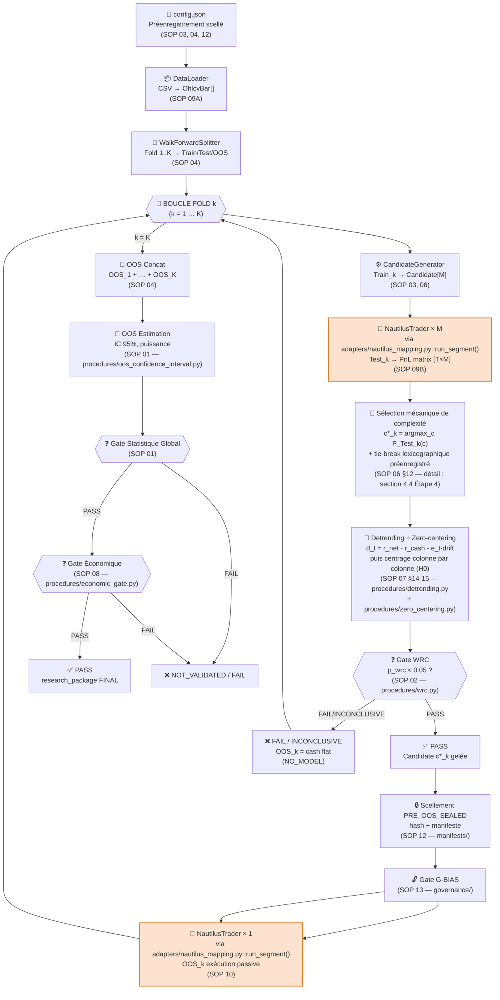
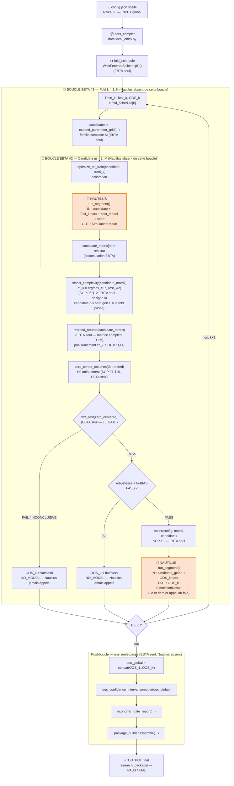
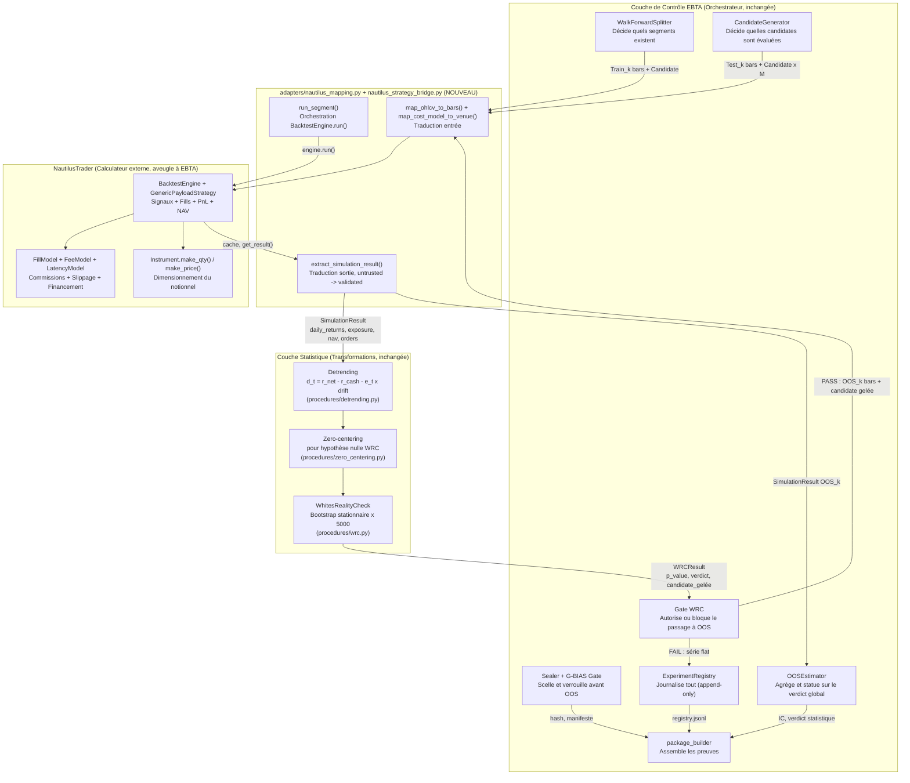
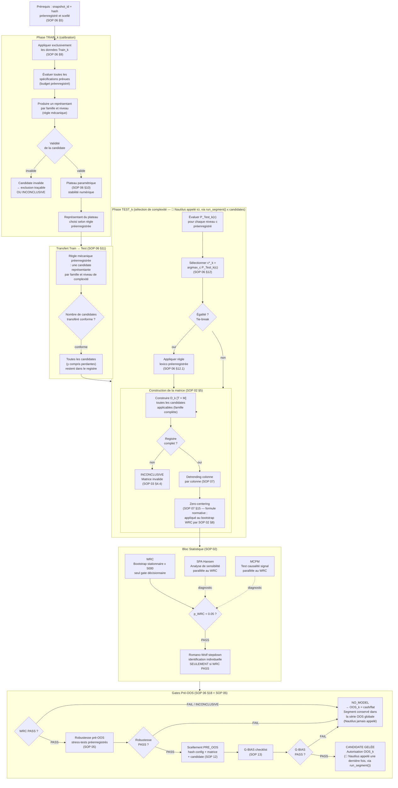
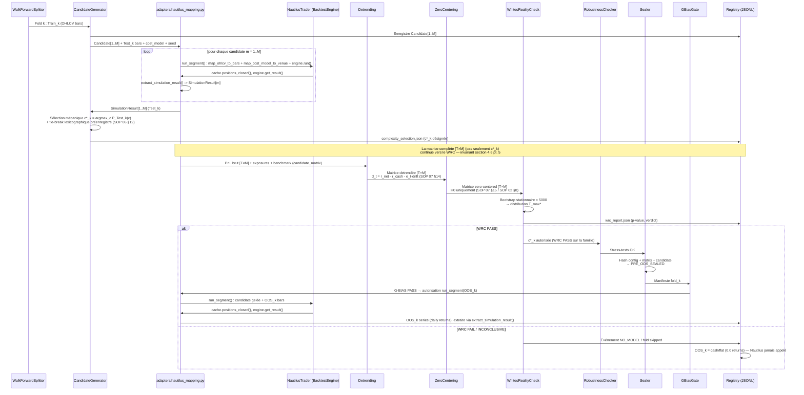
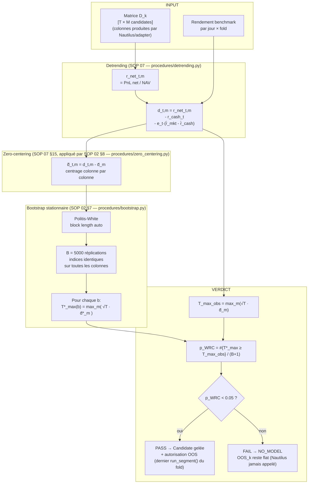
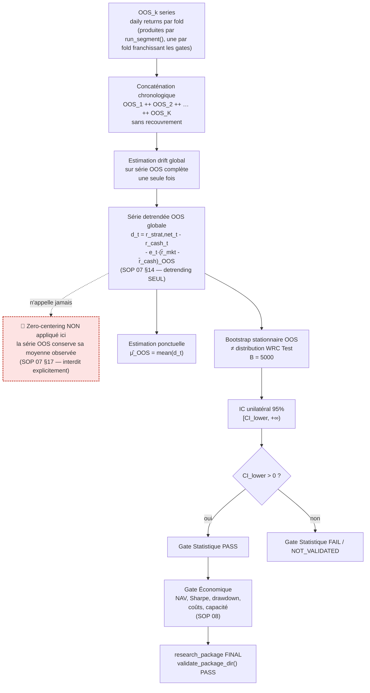
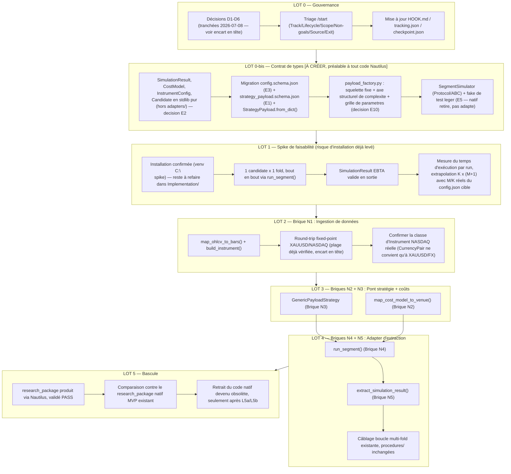

# Architecture Technique du Moteur EBTA — Édition NautilusTrader
## Traduction du Protocole en Code Python Exécutable (Remplace `implementation_plan - 1.md`)

---

> [!IMPORTANT]
> **Statut : INTAKE non audité.** Ce document vit dans `0 - HUMAN START HERE/`
> et n'est donc pas exécutable en l'état (`AGENTS.md` / `CLAUDE.md`). Avant
> tout `/start`, il lui manque le triage obligatoire (`Track`, `Lifecycle`,
> `Scope`, `Non-goals`, `Source`, `Exit criteria`).
>
> **Ce document a vocation à remplacer définitivement
> `implementation_plan - 1.md` pour la suite du projet.** Il n'est pas un
> addendum qui pointe vers l'ancien document pour le détail — il reproduit
> et adapte l'intégralité de son contenu (les diagrammes, les tables de
> gates, la boucle Train/Test/OOS gate par gate, l'inventaire des briques,
> les artefacts, la feuille de route, les règles de validation) en
> substituant partout le moteur de calcul financier pur natif
> (`backtest/native_engine.py`, jamais achevé au-delà d'un MVP à fenêtre
> figée) par NautilusTrader, appelé via une frontière d'adapter dédiée
> (`adapters/nautilus_mapping.py`, `adapters/nautilus_strategy_bridge.py`).
> Tout ce qui ne dépend pas du moteur de calcul (Protocole, gates,
> `procedures/`, `validators/`, `governance/`, `manifests/`,
> `package_builder/`) est repris à l'identique — ce n'est pas oublié, c'est
> délibérément inchangé, et donc reproduit ici pour que ce document reste la
> seule référence technique à lire.
>
> **Les 6 décisions de gouvernance D1-D6 posées par
> `PROPOSITION_PIVOT_MOTEUR_NAUTILUS_TRADER.md` section 7 ont été tranchées
> le 2026-07-08** :
>
> | # | Décision | Statut |
> |---|---|---|
> | D1 | Exception `stdlib-only` pour `nautilus_trader` | **Accordée**, confinée à `adapters/nautilus_mapping.py` et `adapters/nautilus_strategy_bridge.py` |
> | D2 | Réouverture du chantier au-delà du blocage `HOOK.md` | **Accordée**, comme remplacement de brique (nouveau workstream ; le chantier natif reste `DONE` historiquement, voir section 0.1) |
> | D3 | Statut de BACKTRADER | **Reste référence lecture seule**, inchangé |
> | D4 | Plateforme Windows 11 Home | **Vérifiée empiriquement** — voir encart ci-dessous |
> | D5 | Version Python | **Vérifiée** — Python 3.13.0 installé, dans la plage 3.12–3.14 exigée |
> | D6 | Licence LGPL-3.0 | Déjà tranché dans `PROPOSITION_PIVOT` (usage commercial OK) |
>
> Ce document peut donc spécifier du code d'implémentation réel. Il reste
> néanmoins `INTAKE` : aucune ligne de `Implementation/` n'a été modifiée, et
> `HOOK.md`/`tracking.json`/`checkpoint.json` n'ont pas encore été mis à jour
> (objet du LOT 0, section 10).

> [!NOTE]
> **Fondations empiriques vérifiées le 2026-07-08.** Un environnement
> virtuel de test (`nautilus_trader==1.230.0`, wheel `cp313-win_amd64`) a été
> installé et interrogé directement (`inspect.signature`, construction
> d'objets réels) sur ce poste (Windows 11 Famille, Python 3.13.0), plutôt
> que de se fier uniquement aux résumés de documentation. Résultats
> significatifs, réutilisés dans les sections techniques ci-dessous :
>
> 1. **Installation et exécution confirmées** : `BacktestEngine()`
>    s'instancie et tourne réellement sur ce poste. Piège rencontré à
>    retenir pour LOT 1 : l'installation a été faite via `subst` sur un
>    chemin court (`N:\venv`) puis vérifiée depuis
>    `Implementation/adapters/nautilus_env/venv`; si `N:` n'existe pas dans
>    un nouveau shell, utiliser le chemin réel du venv ou relancer le script
>    `Implementation/adapters/nautilus_env/setup_nautilus_env.ps1`.
> 2. **Plage numérique fixed-point vérifiée** : `Price.from_str()` accepte
>    des valeurs jusqu'à un raw `i64` borné par
>    `[-9223372036000000000, 9223372036000000000]` (échelle `1e9` en
>    précision standard) — soit une valeur maximale d'environ 9,2 milliards.
>    NASDAQ (~20 000) et XAUUSD (~3 000) en sont à plusieurs ordres de
>    grandeur.
> 3. **`MakerTakerFeeModel`, `FixedFeeModel`, `PerContractFeeModel`**
>    confirmés directement dans `nautilus_trader.backtest.models`.
> 4. **Modèles de fill confirmés et plus riches que documenté** :
>    `FillModel`, `BestPriceFillModel`, `ThreeTierFillModel`,
>    `SizeAwareFillModel`, `TwoTierFillModel`, `VolumeSensitiveFillModel`,
>    `MarketHoursFillModel`, `OneTickSlippageFillModel`,
>    `CompetitionAwareFillModel`, `LimitOrderPartialFillModel`,
>    `ProbabilisticFillModel`.
> 5. **`MarginModel` vit dans `nautilus_trader.accounting.margin_models`**,
>    expose `StandardMarginModel` et `LeveragedMarginModel` — formule
>    confirmée : `Initial Margin = (notional_value / leverage) * instrument.margin_init`.
> 6. **Construction réelle d'un `Instrument` (`CurrencyPair` XAUUSD)
>    confirmée**, portant `margin_init`, `margin_maint`, `maker_fee`,
>    `taker_fee` comme champs de constructeur directs.
> 7. **`OmsType.HEDGING` et `AccountType.MARGIN`** sont des membres d'énum
>    réels (`nautilus_trader.model.enums`).
> 8. **`OrderFactory.bracket()` et `.trailing_stop_market()`** existent avec
>    des signatures riches (SL/TP liés, `trailing_offset`,
>    `contingency_type`).

> [!NOTE]
> **Évidence locale conservée.** L'introspection empirique de
> `nautilus_trader==1.230.0` est archivée dans
> `Implementation/adapters/nautilus_env/INTROSPECTION_2026-07-08.txt`, avec le
> script ciblé `Implementation/adapters/nautilus_env/introspect_nautilus_claims.py`.
> Les sources documentaires restent la documentation officielle et la référence
> API Python ; les faits ci-dessous sont qualifiés séparément dans
> `Implementation/adapters/nautilus_env/NAUTILUS_API_NOTES.md`.

> [!WARNING]
> **Corrections d'audit (2026-07-08).** Une relecture de ce document contre
> l'état réel de `Implementation/ebta_engine/` a montré que plusieurs
> affirmations « déjà spécifié » / « inchangé » étaient fausses : les types
> `SimulationResult`, `CostModel`, `Candidate`, la classe
> `VectorizedSimulator`, le module `data/walk_forward.py` (et sa classe
> `WalkForwardSplitter`), le module `strategies/generator.py`, et la méthode
> `StrategyPayload.from_dict()` **n'existent dans aucun fichier du
> codebase**. Ce ne sont pas des contrats préexistants que ce pivot
> réutiliserait tels quels — ce sont des briques neuves que ce pivot doit
> concevoir et écrire en plus de l'adapter Nautilus lui-même (voir LOT 0-bis,
> section 10). De même, `adapters/backtrader_mapping.py`, présenté plus loin
> comme un « précédent architectural » pour `run_segment()`, n'est en
> réalité qu'une table de correspondance de noms de clés statique
> (`REQUIRED_EXTERNAL_KEYS`, `EBTA_ARTIFACT_MAP`) : il ne pilote aucun
> moteur et ne reconstruit aucune série — il ne réduit donc pas le risque de
> la Brique N5 (`extract_simulation_result()`), qui reste un développement
> entièrement neuf. Les sections ci-dessous ont été annotées **[À CRÉER]**
> partout où ce point s'applique, plutôt que réécrites en intégralité, pour
> conserver la trace de ce qui a changé entre la version initiale et cette
> révision.

> [!IMPORTANT]
> **Décisions de discussion figées le 2026-07-08 (post-audit).** Les points
> encore ouverts après la première correction d'audit ont été tranchés en
> conversation. Chaque décision est justifiée ci-dessous, avec vérification
> directe du code/du protocole plutôt que par supposition — le détail est
> répercuté aux endroits concernés du document.
>
> | # | Point ouvert | Décision figée | Justification vérifiée |
> |---|---|---|---|
> | E1 | `entry_criterion`/`exit_criterion` : DSL ou interpréteur ? | **Schéma structuré**, pas d'interpréteur de texte libre | Best practice scalabilité/maintenabilité : un interpréteur de texte quasi-naturel ne peut pas être testé exhaustivement et grossit sans borne à chaque nouvelle candidate. Coût réel mesuré : `strategy_payload.schema.json` a `entry_criterion`/`exit_criterion` en `"type": "string"` pur et `additionalProperties: false` — passer en structuré est une vraie migration de schéma (`schema_version` → `1.1.0`, via `migrations/`), pas un ajout gratuit |
> | E2 | `InstrumentConfig` séparé de `CostModel`, ou fusionné ? | **Séparé** — 4 types au LOT 0-bis : `SimulationResult`, `CostModel`, `InstrumentConfig`, `Candidate` | Single Responsibility : l'instrument (marge, frais, précision) est une donnée statique par actif ; `CostModel` est une hypothèse de friction par expérience appelée à varier (scénarios de stress `risk/robustness.py`) sans toucher à l'instrument. Les fusionner coupleraient deux axes de variation indépendants |
> | E3 | `config.json` a-t-il déjà de la place pour ces types ? | **Non — migration de schéma requise**, à faire au LOT 0-bis | Vérifié : `config.schema.json` a `additionalProperties: false` au niveau racine avec un `required` fermé. `execution_model` est `additionalProperties: true`, mais s'y appuyer sans schéma explicite serait une fausse sécurité (aucune validation réelle, contraire à la philosophie « fail fast on unknown fields » que ce document loue chez Nautilus, §B.1). Décision : étendre formellement `execution_model` avec des sous-schémas `cost_model`/`instrument_config` explicites, `schema_version` → `1.1.0` |
> | E4 | Quels M et K réels pour juger la viabilité `K×(M+1)` (LOT 1) ? | **Ne jamais inventer ou calculer K par une formule raccourcie** ; utiliser les M/K réels déjà déclarés par le pilote existant comme ancre — **M révisé à 16 par la décision `E11`, voir ci-dessous** | `Protocole/SOP 04 §6.5` **rejette explicitement** — avec l'exemple précis `K = floor(N/N_min)` — toute formule mécanique ou plage arbitraire (« 3 à 10 folds ») comme justification suffisante de K ; K doit être préenregistré et justifié (précision visée, couverture de régimes, observations OOS effectives, diagnostic de stabilité). `SOP 03 §9.4` : M n'est pas assets × stratégies automatiquement — chaque couple `stratégie × actif` évalué est une candidate distincte si l'actif est sélectionnable. Le pilote historique déclarait **M = 10** (5 payloads E-I × 2 actifs) ; `E11` étend délibérément cette base à **M = 16** (grille combinatoire complète, voir ci-dessous) — ce n'est plus le chiffre du pilote hérité tel quel, mais un chiffre tout aussi réel et préenregistré, pas inventé après coup |
> | E11 | `bias_filter` et `session` sont-ils deux axes indépendants (grille complète) ou un arbre de raffinements imbriqués (comme le sous-entendait E-I) ? | **Grille combinatoire complète, indépendante** : `bias_filter` (2 valeurs) × `session` (4 valeurs) × `asset` (2 valeurs) = **16 candidates**, remplace le sous-ensemble de 10 hérité de `sweep_lq.py` | Décision humaine explicite (2026-07-08) : traiter les deux filtres comme des bascules orthogonales plutôt que comme un raffinement conditionnel (« session n'a de sens que si bias est actif », implicite dans `PAYLOAD_DECOMPOSITION_E_TO_I.md`). Extension légitime au sens `SOP 06 §7` (préenregistrée avant tout résultat — rien n'a encore tourné), mais c'est une extension EBTA assumée au-delà du répertoire de stratégies source, pas une simple reformulation d'E-I : 3 combinaisons nouvelles (`bias=no` + `session=asia/london/us`) n'ont jamais existé dans `sweep_lq.py` |
> | E5 | Portée de « adapter le natif pour implémenter `SegmentSimulator` » ? | **Le moteur natif n'est plus maintenu** — LOT 0-bis implémente `SegmentSimulator` par un **fake de test léger** (pas par `native_engine.py`), Nautilus reste l'unique implémentation réelle | Décision humaine explicite (2026-07-08) : le pivot n'est plus une comparaison à deux moteurs mais un remplacement total. Le natif était un jouet à fenêtre figée (4 observations, sans event loop réel) — le garder en vie uniquement pour comparaison n'apporte rien et double la gouvernance à maintenir |
> | E6 | Best practice pour le venv Nautilus vs MAX_PATH ? | **`subst` vers un lecteur court mappé sur le repo + script de setup versionné**, pas un dossier ad hoc hors repo | Les chemins `C:\nspike`/`C:\ebta_nautilus_venv` de l'encart empirique ne sont reproductibles sur aucun autre poste/CI sans connaissance tribale. Un script versionné (`subst` + création du venv dedans + dépendances scellées) est plug-and-play : un seul script à lancer |
> | E7 | Portabilité « single codebase → live » (§B.7) : objectif réel ? | **Oui, confirmé** — la stratégie tournera en production plus tard | La rigueur maximale déjà recommandée pour `GenericPayloadStrategy` (aucun raccourci « parce qu'on est en recherche ») n'est plus une précaution optionnelle mais un objectif produit confirmé |
> | E8 | Le pivot est-il toujours justifié vu le risque maintenant visible ? | **Oui, confirmé** — remplacer un moteur jouet par un moteur mature et éprouvé reste le bon calcul | Sans second moteur pour se faire vérifier (E5), le test manuel indépendant de la Brique N5 (comparaison contre un calcul PnL/NAV fait à la main) devient la seule vérification restante — non négociable, pas une case à cocher |
> | E10 | Les payloads E-I doivent-ils rester codés en dur (`payload_by_code()`), ou générés à partir d'une architecture modulaire ? | **Modulaire, 3 axes séparés** : squelette fixe, axe structurel de complexité (préenregistré), grille de paramètres variables — remplace tout mapping `payload_code -> complexity` codé en dur | `Protocole/SOP 06 §8` : *« La complexité est mesurée par une fonction ou un ordre préenregistré »* — un dict `{"E":1,...,"I":5}` en dur dans le code n'est pas une fonction/ordre préenregistré et documenté, c'est une décision cachée dans le code. Décision humaine explicite (2026-07-08) : séparer paramètres fixes et variables pour que les futures familles de stratégies se configurent sans nouveau code Python par famille |
> | E12 | L'axe structurel doit-il coder en dur « indépendant » (E11) ou « imbriqué » (E9 v1), ou existe-t-il un contrat unique couvrant les deux pour de futures familles ? | **Un seul contrat `StructuralAxis`/`StrategyFamilySpec` avec dépendance optionnelle `requires`** — `requires=None` reproduit la grille plate d'`E11` ; `requires={"axe": "valeur"}` reproduit un raffinement imbriqué (comme la lecture initiale d'E9, ou le vrai `sweep_lq.py`) — sans code séparé pour les deux cas | Décision humaine explicite (2026-07-08) : « le système doit être le plus scalable, plug-and-play et maintenable possible » — un contrat qui figerait un seul des deux cas (plat ou imbriqué) obligerait à réécrire `payload_factory.py` dès qu'une future famille a besoin de l'autre forme. Le champ `requires` optionnel généralise sans dupliquer de logique ; validation fail-fast (axe référencé déjà déclaré, valeur existante, pas de cycle) cohérente avec la philosophie déjà actée pour `E3` |
>
> **E9, E11, NASDAQ, `risk/robustness.py` et `plateau_rule` ont été tranchés
> en conversation le 2026-07-08** (voir encarts de décision ci-dessous) — ces
> points ne sont plus ouverts. **E10 et E11 sont détaillés séparément
> ci-dessous** car ils redéfinissent la mécanique de génération des payloads
> plutôt que de trancher un point isolé.
>
> **E9 — [Tranché, 2026-07-08, corrigé deux fois : audit d'architecture puis
> extension `E11`] Statut des payloads E-I : une seule famille, pas
> plusieurs familles distinctes.** Décision humaine explicite initiale :
> « c'est la même stratégie mais avec des filtres successifs » — tous les
> payloads (E-I d'origine, plus les 3 combinaisons ajoutées par `E11`)
> forment une seule famille de recherche paramétrée par les mêmes deux axes
> structurels (`bias_filter`, `session`), pas des familles qualitativement
> distinctes. `SOP 06 §8.1` s'applique (sélection intra-famille), pas `§8.2`
> (inter-familles).
>
> **Historique de correction (à ne pas reproduire dans une future lecture
> rapide du document)** : la première rédaction de cette décision affirmait
> « 5 niveaux de complexité » (faux — `payload_by_code()` donne réellement
> 3 paliers 0/1/2 avec G=H=I à égalité, corrigé lors de l'audit
> d'architecture). Cette seconde rédaction elle-même supposait encore un
> **arbre de raffinements imbriqués** (« session n'a de sens que si bias est
> actif »), ce qui reproduisait fidèlement `sweep_lq.py` mais empêchait de
> traiter les deux filtres comme des axes indépendants. `E11` (ci-dessous)
> a tranché explicitement pour l'axe indépendant complet : le nombre de
> niveaux de complexité réel est maintenant **3 paliers (0, 1, 2) avec une
> distribution 1/4/3 combinaisons** (2/8/6 candidates une fois les 2 actifs
> comptés) — voir `E11` pour le détail et la justification du choix
> combinatoire plutôt qu'imbriqué. Conséquence directe sur le code vérifié :
> - `procedures/complexity_selection.py::select_complexity()` peut être
>   appelée directement sur les `representatives` des 8 combinaisons E-I
>   étendues : son argmax global avec tie-break lexicographique
>   (`complexity`, `stability`, `turnover`, `cost`, `exposure`,
>   `candidate_id`) est le comportement normatif attendu pour une famille
>   unique à plusieurs niveaux, sans normalisation inter-familles à
>   construire.
> - `procedures/search_space.py::expand_parameter_grid()` reste appelé avec
>   un seul `research_family_id` couvrant les 3 paliers ; la règle
>   inter-*actifs* déjà préenregistrée (`asset_selection_rule`:
>   `evaluate_all_declared_assets`) n'a pas besoin d'équivalent
>   inter-familles, puisqu'il n'y a qu'une seule famille.
> - **Action restante avant de considérer LOT 0-bis complet** : documenter
>   explicitement dans `config.json` (migration `schema_version` → `1.1.0`,
>   `E3`) que les 8 combinaisons constituent les niveaux de complexité d'une
>   même `research_family_id`. Depuis `E10`/`E11` ci-dessous, ce n'est plus
>   un mapping en dur à ajouter à `payloads.py` : c'est la sortie mécanique
>   de la grille combinatoire préenregistrée.
>
> **NASDAQ — [Tranché, 2026-07-08] Classe d'instrument : CFD / Equity Index
> CFD**, cohérent avec la décision `B0-2` (compte `MARGIN`,
> `LeveragedMarginModel`) déjà prise pour XAUUSD — pas un future (roulement
> de contrat explicitement hors périmètre ailleurs dans ce document, voir
> B.2). À vérifier empiriquement via le skill `nautilus-docs-research` au
> LOT 2 avant construction de l'`Instrument` NASDAQ réel.
>
> **`risk/robustness.py` — [Tranché, 2026-07-08] Dans le périmètre de ce
> pivot, comme extension de la Brique N5.** Décision humaine : sans ce
> calculateur, `procedures/robustness.py` (le verdict G5, déjà existant et
> inchangé) ne reçoit jamais de résultats réels de scénarios de stress —
> aucune candidate ne peut donc jamais franchir la gate pré-OOS. Comme les
> scénarios de stress s'exécutent via le même `run_segment()` Nautilus
> (candidate + barres perturbées + `cost_model` choqué), ce n'est pas un
> chantier indépendant mais une extension naturelle de la Brique N5 — voir
> section 7 pour son inventaire.
>
> **`plateau_rule` — [Tranché, 2026-07-08] Absence confirmée sur le pilote
> réel** (`Implementation/examples/minimal_pilot_pipeline/research_package/
> reports/optimization_log.json` : seul `representative_rule`:
> `best_train_score_per_complexity` y figure, aucun champ `plateau_rule`).
> Décision humaine : ajouter `plateau_rule` au schéma `optimization_log`
> comme partie du LOT 0-bis, dans la même migration `schema_version` →
> `1.1.0` déjà prévue pour E1/E3/E9 — un seul point de migration au lieu de
> plusieurs — avec la logique de preuve de plateau (voisins, dispersion,
> largeur minimale, SOP 06 §10) ajoutée à
> `procedures/complexity_selection.py`.
>
> **E10 — [Tranché, 2026-07-08] Architecture de génération des payloads :
> squelette fixe + axe structurel de complexité préenregistré + grille de
> paramètres variables, plutôt que des payloads codés en dur par famille.**
> Décision humaine explicite : *« Plutôt que de coder les payloads en dur,
> on devrait plutôt modulariser l'approche [...] séparer les paramètres
> variables de la stratégie et les paramètres fixes [...] pour les futures
> stratégies, on aura juste à configurer ces deux types de paramètres, et le
> système générera automatiquement le nombre de payloads et la complexité en
> suivant le protocole. »* Cette décision **remplace** le mapping en dur
> `payload_code -> complexity` envisagé plus tôt dans la même conversation
> (dict `{"E":1,...,"I":5}` codé dans `payloads.py`), qui était exactement
> l'anti-pattern que cette décision corrige. Trois axes, pas deux, parce que
> les payloads E-I mélangent en réalité deux choses différentes qu'il ne
> faut pas confondre :
>
> 1. **Squelette fixe** — identité invariante de la famille : `strategy_family`,
>    `entry_level`, `risk_model`, `sizing_model`, `direction`, `timeframe`,
>    et la forme structurée de `entry_criterion`/`exit_criterion` (post
>    migration `E1`). Déclaré une seule fois par `research_family_id`, pas
>    dupliqué par combinaison — c'est déjà ce que E-I partagent tel quel
>    dans `payload_by_code()` aujourd'hui (`entry_level`, `risk_model`,
>    `sizing_model`, `entry_criterion`, `exit_criterion` identiques quelle
>    que soit la combinaison de filtres).
> 2. **Axe(s) structurel(s) de complexité** — *(révisé par `E11` pour E-I,
>    généralisé par `E12` ci-dessous en un contrat unique)*. `bias_filter`
>    (`no`/`yes`) et `session` (`all`/`asia`/`london`/`us`) sont deux
>    bascules déclarées **indépendantes** pour cette famille précise
>    (décision `E11`) ; `complexity_definition` (la règle : « complexité =
>    somme des contributions des axes structurels actifs ») et
>    `complexity_levels` (les 3 paliers résultants : 0, 1, 2) deviennent des
>    champs du snapshot de recherche (`SOP 06 §5` les exige déjà nommément —
>    ils sont aujourd'hui absents du pilote réel, comme `search_space.json`
>    du pilote le montre). Le contrat qui porte ces axes (`StructuralAxis`,
>    `E12`) supporte aussi la dépendance conditionnelle entre axes pour de
>    futures familles qui en auraient réellement besoin, sans changement de
>    code — voir `E12`.
> 3. **Grille de paramètres variables** — paramètres continus/discrets
>    (`lookback`, seuils, fenêtres numériques) : reste orthogonal à la
>    complexité, déjà géré tel quel par
>    `procedures/search_space.py::expand_parameter_grid()`, sans changement.
>
> **Conséquence pour les futures familles de stratégies** : ajouter une
> nouvelle famille ne demandera plus d'écrire une nouvelle fonction Python
> du type `payload_by_code()` — seulement de déclarer son squelette fixe,
> ses axes structurels (indépendants — grille — ou imbriqués si la famille
> l'exige réellement, avec justification) et sa grille de paramètres
> variables ; le nombre de payloads et leur niveau de complexité s'en
> déduisent mécaniquement.
>
> **Action requise avant que LOT 0-bis soit considéré complet** : concevoir
> un nouveau module (proposition : `strategies/payload_factory.py`, distinct
> de `strategies/generator.py` qui orchestre les boucles fold/candidate,
> pas la génération des specs elles-mêmes — Single Responsibility, même
> logique que la séparation `E2`) qui combine les 3 axes en candidates
> `StrategyPayload` avec `complexity` déjà posé explicitement (jamais par
> défaut à `0`), et migrer `config.schema.json`/`strategy_payload.schema.json`
> (`schema_version` → `1.1.0`, même migration que E1/E3/E9/E11) pour porter
> `complexity_definition`/`complexity_levels` de façon vérifiable dans le
> paquet. Voir section 7 (inventaire des briques) et section 11.3 (tests)
> pour le détail d'implémentation.
>
> **E11 — [Tranché, 2026-07-08] `bias_filter` × `session` × `asset` : grille
> combinatoire complète (2×4×2 = 16), pas le sous-ensemble de 10 hérité de
> `sweep_lq.py`.** Décision humaine explicite : traiter les trois dimensions
> comme des axes indépendants plutôt que comme une progression imbriquée.
> Conséquences vérifiées :
> - **8 combinaisons `bias_filter`/`session`** (au lieu de 5) : `no/all`
>   (= E), `no/asia`, `no/london`, `no/us` **(3 combinaisons nouvelles, sans
>   équivalent dans `sweep_lq.py`)**, `yes/all` (= F), `yes/asia` (= G),
>   `yes/london` (= H), `yes/us` (= I). × 2 actifs = **M = 16 candidates**.
> - **3 paliers de complexité, distribution 1/4/3 combinaisons (2/8/6
>   candidates)** : palier 0 = `no/all` (1 combinaison) ; palier 1 =
>   `no/asia`, `no/london`, `no/us`, `yes/all` (4 combinaisons à égalité) ;
>   palier 2 = `yes/asia`, `yes/london`, `yes/us` (3 combinaisons à égalité,
>   c'était déjà G/H/I). Toutes les égalités intra-palier se départagent par
>   le tie-break déjà codé dans `select_complexity()`, jamais par un rang de
>   session inventé.
> - **`PAYLOAD_DECOMPOSITION_E_TO_I.md` (`Implementation/`) reste inchangé**
>   — c'est la trace historique fidèle de ce que `sweep_lq.py` fait
>   réellement (5 combinaisons seulement). L'extension à 16 est une décision
>   EBTA propre à ce pivot, documentée uniquement ici, jamais rétro-écrite
>   dans la trace de provenance BACKTRADER — ne pas modifier ce fichier pour
>   « faire coller » les deux.
> - **Nomenclature — corrigée lors de la 2ᵉ passe d'audit** : `payload_code`
>   ne doit **pas** rester un `enum` fermé, même élargi à 8 valeurs — un
>   enum fermé n'est jamais « juste un label », il faudrait re-migrer le
>   schéma à chaque nouvelle famille future, exactement l'anti-pattern que
>   `E10` corrige. `payload_code` devient `{"type": "string", "minLength":
>   1}` (contrainte de forme, pas de liste fermée) ; `E` à `I` gardent leurs
>   lettres historiques par continuité de lecture (`J`/`K`/`L` pour les 3
>   nouvelles combinaisons `no/asia`, `no/london`, `no/us`), mais rien dans
>   le schéma n'impose ces lettres précises. L'identité réelle et opposable
>   d'une candidate reste `candidate_id` (hash déterministe du
>   `canonical_spec`, déjà produit par `stable_id()` dans `search_space.py`).
> - `E4` est révisé en conséquence : le pilote historique déclarait `M = 10`,
>   ce pivot déclare désormais `M = 16` comme base préenregistrée pour la
>   volumétrie `K×(M+1)` du LOT 1.
>
> **E12 — [Tranché, 2026-07-08] Contrat générique `StructuralAxis` /
> `StrategyFamilySpec`, avec dépendance optionnelle `requires`, pour que
> `payload_factory.py` couvre à la fois les axes indépendants (`E11`) et les
> axes imbriqués (comme le vrai `sweep_lq.py`) sans jamais être réécrit.**
> Décision humaine explicite : « le système doit être le plus scalable, le
> plus plug-and-play et le plus maintenable possible ». Un contrat qui ne
> supporterait qu'une seule des deux formes obligerait une réécriture de
> `payload_factory.py` dès qu'une future famille a besoin de l'autre —
> exactement l'anti-pattern que `E10` corrige déjà pour le code, appliqué
> maintenant au contrat lui-même. Un seul champ optionnel unifie les deux
> cas plutôt que deux chemins de code séparés :
>
> ```python
> @dataclass(frozen=True)
> class StructuralAxis:
>     name: str
>     values: dict[Any, int]              # valeur -> contribution à la complexité
>     default: Any                        # valeur "hors service" de cet axe —
>                                          # doit être une clé de `values` avec
>                                          # contribution 0 (validé, voir plus bas)
>     requires: tuple[str, Any] | None = None
>     # None        -> axe indépendant : domaine complet (toutes les clés de
>     #                `values`) combiné en produit cartésien avec les autres
>     #                axes indépendants (reproduit E11 : bias_filter, session)
>     # ("axe","v") -> axe dépendant d'un seul parent (déjà déclaré) : quand
>     #                ce parent vaut "v", domaine complet (comme ci-dessus) ;
>     #                sinon domaine **restreint à {default} seul** (pas
>     #                ignoré, pas itéré en entier) — reproduit le vrai
>     #                sweep_lq.py : bias_filter=yes -> session parcourt
>     #                {all,asia,london,us} (4 valeurs, donne F/G/H/I) ;
>     #                bias_filter=no -> session restreint à {all} (1 valeur,
>     #                donne E) ; total 5, jamais 8 ni 4
>
> @dataclass(frozen=True)
> class StrategyFamilySpec:
>     strategy_family: str
>     skeleton: dict[str, Any]                    # champs fixes, axe 1
>     structural_axes: list[StructuralAxis]        # axe 2, indépendant ou non
>     variable_parameters: dict[str, list[Any]]    # axe 3, passé tel quel à
>                                                   # expand_parameter_grid()
>     asset_universe: list[str]
>
> def generate_family(spec: StrategyFamilySpec) -> tuple[list[StrategyPayload], dict]:
>     ...  # produit les payloads + complexity_definition/complexity_levels
> ```
>
> **Correction de 3ᵉ audit** : la rédaction initiale disait « retombe à sa
> valeur par défaut, contribution 0 » sans préciser si le domaine de l'axe
> dépendant restait complet ou se réduisait à une seule valeur quand le
> prérequis échoue — vérifié arithmétiquement contre `payload_by_code()` que
> seule la réduction à `{default}` reproduit les 5 combinaisons réelles
> (E seule pour `bias_filter=no`, F/G/H/I pour `bias_filter=yes`). D'où
> l'ajout du champ `default` explicite et la reformulation précise ci-dessus.
>
> **Validation fail-fast obligatoire à la construction de `StrategyFamilySpec`**
> (cohérent avec la philosophie déjà actée pour `E3`, « fail fast on unknown
> fields ») : `requires` doit référencer un axe **déjà déclaré** avant lui
> dans `structural_axes` (interdit les cycles et les références en avant) et
> une valeur qui existe réellement dans les `values` de cet axe ; noms
> d'axes uniques ; contributions de `values` en entiers ≥ 0 uniquement
> (jamais un rang négatif ou inventé) ; **`default` doit être une clé de
> `values` dont la contribution est exactement `0`** (ajouté en 3ᵉ passe
> d'audit — sinon la définition « complexité = nombre de raffinements actifs »
> devient fausse silencieusement pour toute branche où le prérequis échoue).
>
> **Pour `E11` (cette famille précise)** : `bias_filter` et `session` sont
> tous deux déclarés avec `requires=None` — ce choix reste celui d'`E11`, `E12`
> ne le change pas, il fournit seulement le mécanisme qui aurait aussi permis
> l'inverse. **Portée volontairement limitée** : l'axe 3 (grille de
> paramètres variables) reste hors de ce mécanisme de complexité — `SOP 06
> §8` mesure la complexité sur la forme de la règle, pas sur le réglage
> numérique d'une forme donnée ; l'étendre à l'axe 3 serait un changement de
> sens, pas une généralisation légitime.
>
> **Corrections d'audit d'architecture (2026-07-08, `/evaluate` lancé sur ce
> document, deux passes) — points vérifiés et corrigés :**
>
> 1. **Nombre de paliers, corrigé deux fois** : d'abord « 5 niveaux » →
>    « 3 paliers, G/H/I à égalité » (1ʳᵉ passe d'audit), puis la structure
>    elle-même (arbre imbriqué → grille indépendante complète, décision
>    `E11`, 2ᵉ passe suite à la remarque humaine sur les combinaisons
>    manquantes). `payload_factory.py` doit supporter nativement un
>    **ordre partiel avec égalités déclarées** (plusieurs candidates au même
>    palier) — c'est le cas normal dès le MVP, pas une extension future.
> 2. **Verrous de schéma non traités** : `schemas/strategy_payload.schema.json`
>    fige aujourd'hui `"payload_code": {"enum": ["E","F","G","H","I"]}` et
>    `"asset": {"enum": ["NASDAQ","XAUUSD"]}` (vérifié, `additionalProperties:
>    false` au niveau racine). Sans généraliser ces deux énumérations dans la
>    même migration `schema_version` → `1.1.0` (au minimum ajouter `J`, `K`,
>    `L` à l'enum `payload_code`), les 3 nouvelles combinaisons d'`E11`
>    échouent à la validation de schéma dès leur première génération —
>    pas seulement les futures familles hypothétiques.
> 3. **Domicile de `complexity_definition`/`complexity_levels` précisé** :
>    aucun `search_space.schema.json` n'existe (vérifié, absent de
>    `schemas/`) — `search_space.json` n'est structurellement validé par
>    rien. Ces deux champs doivent donc vivre dans
>    `config.schema.json::candidate_space` (déjà `additionalProperties: true`,
>    vérifié), avec des sous-propriétés explicites ajoutées à la migration
>    `1.1.0` — pas seulement déposés dans le rapport `search_space.json` non
>    validé, ce qui reproduirait exactement la « fausse sécurité »
>    qu'`E3` dénonce déjà pour `execution_model`.
> 4. **Frontière `payload_factory.py` / `strategies/generator.py` précisée** :
>    `payload_factory.py` produit la liste de `StrategyPayload` (squelette +
>    axes + grille) ; `strategies/generator.py` l'appelle en tout premier,
>    avant `search_space.py`, et orchestre ensuite les boucles fold/candidate
>    — jamais l'inverse, et `payload_factory.py` n'appelle jamais
>    `search_space.py` lui-même (Single Responsibility, cf. `E2`).
> 5. **`payload_by_code()`/`build_payload_grid()` deviennent un appelant de
>    `payload_factory.py`**, pas une implémentation parallèle et
>    indéfiniment codée en dur : le squelette et les axes structurels (E-I
>    étendus par `E11`) sont réexprimés comme *données* passées à
>    `payload_factory.py`, pour éviter que les deux chemins divergent
>    silencieusement (source unique de vérité).

---

## 0. Rôle du Document

### 0.1 Position par rapport aux documents existants

| Document | Rôle | Statut |
|---|---|---|
| `Protocole/` | Autorité normative absolue : ordre des gates, SOP, décisions, interdictions. | Inchangé, jamais modifié par aucun document technique |
| `implementation_plan - 1.md` | Ancien plan technique, spécifiait un moteur de calcul natif jamais achevé au-delà d'un MVP. | **Remplacé par ce document** pour toute la suite du projet ; conservé comme trace historique, plus la référence à lire |
| `PROPOSITION_PIVOT_MOTEUR_NAUTILUS_TRADER.md` | Étude de faisabilité + décisions de gouvernance D1-D6 (toutes tranchées). | Conservé comme trace de décision ; ce document en reprend et développe la matière technique |
| `.ai/backlog/mainline/PLAN_IMPLEMENTATION_MOTEUR_BACKTEST_EBTA_NATIF.md` | Chantier natif marqué `DONE` (`NATIVE_ENGINE_PHASE_8_COMPLETED`). | Reste `DONE` historiquement (décision D2) ; ce document ouvre un nouveau workstream, il ne le réouvre pas |
| **Ce document** | Carte d'implémentation technique complète et autosuffisante du pipeline EBTA avec NautilusTrader comme moteur de calcul financier pur. | Référence technique unique à partir de maintenant |

Ce document raconte le pipeline dans son ordre réel, comme le faisait
`implementation_plan - 1.md` :

```text
Protocole EBTA
  -> contrats exécutables
  -> pipeline de recherche
  -> boucles Train/Test/OOS
  -> gates statistiques et économiques
  -> appel atomique au moteur de calcul (NautilusTrader, via adapter)
  -> artefacts de preuve
  -> research_package validable
```

Il ne modifie pas le protocole. Il traduit les exigences de `Protocole/` et
des SOP en modules Python, décisions de gate, artefacts et lots
d'implémentation — avec NautilusTrader comme moteur de calcul financier pur
à la place du moteur natif inachevé.

### 0.2 Position des Éléments du Système

| Élément | Rôle | Change avec ce document ? |
|---|---|---|
| `Protocole/` | Autorité normative : ordre des gates, SOP, décisions, interdictions. | Non |
| `Implementation/ebta_engine/procedures/` | Calculs SOP testés, stdlib-only (WRC, detrending, bootstrap, IC OOS, robustesse, gate économique, walk-forward, search space, optimization, complexity selection, candidate matrix). | Non |
| `Implementation/ebta_engine/validators/`, `governance/`, `manifests/`, `package_builder/` | Gates, G-BIAS, scellement, assemblage du `research_package`. | Non |
| `Implementation/ebta_engine/strategies/payloads.py` | Contrat `StrategyPayload` schématisé. | **Migration requise (décision E1)** — `entry_criterion`/`exit_criterion` passent de texte libre à un schéma structuré ; `from_dict()` à ajouter |
| `Implementation/ebta_engine/strategies/payload_factory.py` | Génération modulaire des payloads (squelette fixe + axe structurel de complexité préenregistré + grille de paramètres variables), pour que les futures familles se configurent sans nouvelle fonction Python. | **Nouveau (décision E10)** — remplace le modèle `payload_by_code()` codé en dur comme point d'entrée générique pour toute nouvelle famille |
| `Implementation/notebooks/` | Cockpit Jupyter d'orchestration, non normatif, non source de verdict. | Non (tearsheets Nautilus ignorés) |
| `Implementation/ebta_engine/backtest/native_engine.py`, `risk/sizing.py` | Moteur de calcul financier pur MVP actuel, fenêtre figée. | **Retiré — décision humaine explicite (E5, 2026-07-08) : plus de comparaison L5, remplacement total, pas de maintien en parallèle** |
| **NautilusTrader** (`nautilus_trader==1.230.0`) | Nouveau moteur de calcul financier pur, externe, borné par un adapter. | **Nouveau composant, jamais source de vérité méthodologique — seule implémentation réelle du moteur (décision E5)** |
| `Implementation/ebta_engine/adapters/nautilus_mapping.py`, `adapters/nautilus_strategy_bridge.py` | Frontière moteur/contrôle — traite la sortie de Nautilus comme non fiable. | **Nouveau.** `adapters/backtrader_mapping.py` existe déjà mais n'est qu'une table de correspondance de clés statique, sans pilotage de moteur ni reconstruction de série — il ne préfigure que la *philosophie* (sortie externe non fiable), pas l'implémentation |
| `SimulationResult`, `CostModel`, `InstrumentConfig`, `Candidate` (types contractuels) | Frontière de données entre l'adapter et `procedures/` — voir 3.4. | **[À CRÉER] Nouveau, 4 types distincts (décision E2)**. Ne figurent dans aucun module actuel (`grep` négatif sur tout `Implementation/`) — contrairement à ce qu'affirme le reste de ce document, ce ne sont pas des contrats déjà posés par le plan natif à réutiliser tels quels |
| `research_package/` | Paquet de preuve produit par le pipeline et validé par EBTA. | Non — structure et contenu inchangés |
| Ce plan | Carte d'implémentation complète : quoi coder, où le coder, pourquoi, dans quel ordre. | — |

### 0.3 Non-Objectifs

- ne pas réécrire `Protocole/` ;
- ne pas créer de gate, statut ou seuil absent des SOP ;
- ne pas faire de BACKTRADER une dépendance runtime (statut D3 inchangé) ;
- ne pas faire du notebook, de la visualisation ou des tearsheets Nautilus une source de verdict ;
- ne pas ouvrir OOS avant scellement et `G-BIAS PASS` ;
- ne pas faire de `PortfolioAnalyzer`/`stats_returns` Nautilus une source de vérité statistique ou économique EBTA ;
- ne pas importer `nautilus_trader` en dehors de `adapters/` (périmètre D1).

---

## 1. Ce Que le Protocole Demande

EBTA ne valide pas une règle isolée. EBTA valide un **processus de recherche
et de sélection**, inchangé par ce pivot :

```text
intention
  -> configuration préenregistrée
  -> données point-in-time
  -> folds Walk-Forward
  -> calibration Train_k
  -> sélection Test_k
  -> WRC local
  -> robustesse pré-OOS
  -> scellement PRE_OOS_SEALED
  -> G-BIAS
  -> ouverture OOS_k
  -> exécution passive
  -> estimation OOS globale
  -> gate statistique
  -> gate économique
  -> paquet reproductible
  -> incubation/live éventuel
```

Le code doit donc produire deux choses en même temps :

1. des résultats financiers calculés correctement (désormais via
   NautilusTrader, via l'adapter) ;
2. des preuves méthodologiques vérifiables que les résultats ont été
   produits dans le bon ordre (toujours via `procedures/`, `governance/`,
   `manifests/` — inchangés).

### 1.1 Ordre des Gates à Respecter

| Ordre | Gate | Question posée au code | Sortie si échec |
|---|---|---|---|
| G0 | Préenregistrement | La recherche, les folds, les seeds, les coûts, les métriques et les règles sont-ils scellés avant résultat ? | Pas de recherche EBTA valide |
| G1 | Données point-in-time | Les données étaient-elles disponibles au moment de la décision ? | `FAIL` ou `INCONCLUSIVE` |
| G2 | Registre et candidates | Toutes les candidates influentes sont-elles dans le registre ? | `FAIL` ou `INCONCLUSIVE` |
| G3 | Sélection locale | La candidate locale est-elle choisie mécaniquement selon la règle préenregistrée ? | `NO_MODEL`, `STOP_PROCESS`, `NOT_VALIDATED` ou `INCONCLUSIVE` |
| G4 | Inférence multiple Test | Le WRC local primaire passe-t-il sur la famille complète ? | Pas d'exposition sur `OOS_k` |
| G5 | Robustesse pré-OOS | Les stress-tests décisionnels préenregistrés passent-ils ? | OOS non ouvert |
| G6 | Exécution et capacité | Le modèle d'exécution, les coûts, la capacité et la NAV sont-ils tradables ? | `REJECTED_ECONOMIC`, `FAIL` ou `INCONCLUSIVE` |
| G7 | Paquet pré-OOS | Le paquet `PRE_OOS_SEALED` est-il complet et hashé ? | OOS non ouvert |
| G8 | Ouverture OOS | L'accès OOS est-il autorisé, journalisé et précédé par `G-BIAS PASS` ? | OOS non ouvert |
| G9 | Estimation OOS globale | L'IC OOS, la puissance et le gate statistique sont-ils calculés sur l'OOS global ? | `NOT_VALIDATED`, `FAIL` ou `INCONCLUSIVE` |
| G10 | Gate économique | La performance nette réelle, les coûts, le risque et la capacité passent-ils le hurdle ? | `REJECTED_ECONOMIC` ou `INCONCLUSIVE` |
| G11 | Validation reproductible | Le paquet `VALIDATION_READY` est-il reproductible indépendamment ? | Pas d'incubation |
| G12 | Incubation | Le processus gelé passe-t-il le paper trading prospectif ? | `FAIL`, `INCONCLUSIVE`, `WATCH` ou archivage |
| G13 | Déploiement limité | Le paquet `DEPLOYMENT_CERTIFIED`, les limites et le kill switch sont-ils prêts ? | Pas de live |
| G14 | Cycle de vie | Monitoring, incidents, retraits et archive sont-ils journalisés ? | Nouvelle version ou retrait |

`G-BIAS` est transversal. Il ne renumérote pas `G0` à `G14`, mais bloque
notamment `G8`, `G11`, l'incubation ou le live s'il est `FAIL`,
`INCONCLUSIVE` ou `BURNED`. **Rien dans cette table ne change avec ce
pivot** — Nautilus n'intervient qu'au calcul brut sous-jacent à G4/G6/G9/G10,
jamais à la décision de gate elle-même (voir section 3).

### 1.2 Invariants Méthodologiques que le Code Doit Rendre Difficiles à Violer

1. Jamais de données Test ou OOS pendant la calibration Train.
2. Jamais d'ouverture OOS après WRC `FAIL` ou `INCONCLUSIVE`.
3. Jamais de sélection, réparation ou arbitrage sur OOS.
4. Jamais de matrice WRC réduite aux candidates prometteuses.
5. Jamais de suppression des folds `NO_MODEL` dans l'OOS global.
6. Jamais de SPA, Romano-Wolf ou MCPM utilisé comme rattrapage d'un WRC `FAIL`.
7. Jamais de gate économique utilisé pour remplacer le gate statistique.
8. Jamais de notebook, visualisation, tearsheet ou artefact externe (Nautilus inclus) comme source de verdict.
9. **[Ajout Nautilus]** Jamais de `stats_returns`/`PortfolioAnalyzer` Nautilus consommé directement par un gate — toujours via `SimulationResult` puis recalcul par `procedures/`.
10. **[Ajout Nautilus]** Jamais de segment (`Train`/`Test`/`OOS`) communiqué à Nautilus autrement que comme barres brutes, sans métadonnée de contexte.

---

## 2. Vue Globale du Pipeline Exécutable

> [!NOTE]
> **Harmonisation des diagrammes (2026-07-08).** Ce document contenait
> initialement 10 diagrammes Mermaid racontant plusieurs fois la même
> histoire à des grains différents, au point qu'un lecteur (humain ou IA)
> risquait de perdre le fil ou de traiter deux versions divergentes du même
> fait comme deux vérités distinctes (voir l'incident réel de
> désynchronisation detrending/zero-centering documenté après le diagramme
> 5.1, qui a nécessité un re-passage manuel sur 8 diagrammes). Après revue
> diagramme par diagramme, deux ont été **supprimés parce que strictement
> redondants (aucune information propre)** :
> - **2.2 (« Ordre d'Exécution Global »)** — doublon plus grossier de 2.1 et
>   2.4, sans nœud de sélection ni de matrice propre ; voir 2.1 pour la vue
>   d'ensemble et 2.4 pour le détail des boucles.
> - **3.5 (« Direction du Flux d'Information »)** — doublon exact de 3.2
>   (mêmes 4 composants, même flux, simplement renumérotés 1-8) ; voir 3.2.
>
> Les autres diagrammes (2.1, 2.4, 3.2, 4.2, 4.3, 5.1, 5.3, section 10) sont
> **conservés intégralement** : chacun répond à une question que les autres
> ne couvrent pas (vue d'ensemble, comptage d'appels Nautilus pour le
> dimensionnement `K×(M+1)`, architecture moteur/contrôle, détail
> méthodologique SOP par SOP, graphe d'appels module-à-module pour
> l'implémentation, mathématiques du WRC, mathématiques de l'IC OOS,
> feuille de route des lots). Les supprimer aurait retiré de l'information
> utile à l'implémentation sans réduire de doublon réel — priorité donnée à
> la traçabilité pour l'IA qui implémentera le code plutôt qu'à la
> minimisation brute du nombre de diagrammes.

Le pipeline EBTA est un orchestrateur de recherche. Il ne se limite pas à
`data -> signal -> PnL`. Il doit enchaîner les blocs de recherche, produire
les artefacts attendus, puis faire passer ces artefacts dans les
validateurs EBTA. Le moteur de calcul qui répond à l'étape « Simulation »
est désormais NautilusTrader, appelé via l'adapter — c'est la seule
différence avec le pipeline décrit dans `implementation_plan - 1.md`.

### 2.1 Schéma Global du Pipeline



Les deux seuls nœuds orange (`F`, `M`) sont les seuls points de tout le
pipeline où NautilusTrader est réellement invoqué. Tout le reste — la
boucle fold, la sélection de complexité, le detrending, le WRC, le
scellement, `G-BIAS`, la concaténation OOS, les deux gates finaux — est
exactement le même code `Implementation/ebta_engine/` que dans
`implementation_plan - 1.md`.

> [!NOTE]
> **Correction d'audit (cohérence inter-graphiques).** Le nœud `F2` a été
> ajouté à ce schéma parce que le mécanisme de sélection mécanique de la
> candidate (`c*_k = argmax_c P_Test_k(c)`, SOP 06 §12) n'apparaissait
> auparavant que dans la section 4 (Étape 4, section 4.4) et l'inventaire
> des briques (section 6.1, `procedures/complexity_selection.py`) — jamais
> dans les diagrammes de vue globale, alors que la table des gates
> (section 1.1, `G3`) le mentionne explicitement. Sans ce nœud, un lecteur
> qui ne consulte que la section 2 pouvait croire que la matrice `[T×M]`
> passe directement du calcul Nautilus au WRC sans qu'aucune candidate ne
> soit mécaniquement désignée — ce n'est pas le cas : `c*_k` est
> sélectionnée par la couche EBTA *avant* le WRC, sur les mêmes résultats
> `Test_k`, indépendamment de la construction de la matrice complète (qui,
> elle, continue de porter les `M` candidates en entier vers le WRC, sans
> filtrage — voir invariant 4.6 pt. 5).
>
> **Chaque diagramme du document a été revérifié individuellement** (pas
> seulement celui-ci) pour ce même défaut — un premier passage avait
> corrigé 2.1 et 4.3 mais laissé passer 2.4, ce qui a été signalé et
> corrigé séparément (voir note après le diagramme 5.1 pour le détail
> exhaustif diagramme par diagramme, sélection *et* zero-centering).
> **2.2 a depuis été supprimé** (harmonisation 2026-07-08, voir note
> juste en dessous) plutôt que corrigé — il n'avait de toute façon aucun
> nœud de sélection ni de matrice séparé pour *aucune* étape (son grain
> était `D1`-`D7`, un nœud par fold entier), donc rien à harmoniser sur ce
> point précis, seulement une redondance de grain avec 2.1/2.4. La
> spécification mécanique complète (règle primaire, plateau, transfert,
> tie-break, interdictions) reste intégralement en section 4.2 et 4.4,
> jamais dupliquée ailleurs pour éviter une désynchronisation entre copies.

### 2.2 Ordre d'Exécution Global (fusionné dans 2.1 / 2.4)

> [!NOTE]
> **Diagramme supprimé (harmonisation 2026-07-08).** Ce diagramme montrait
> la même séquence que 2.1 (vue d'ensemble) à un grain intermédiaire, et la
> même boucle de fold que 2.4 sans le détail des appels Nautilus ni de la
> sélection de complexité. Il n'apportait aucune information que 2.1 ou 2.4
> ne couvrent déjà. Pour la vue d'ensemble du pipeline, voir 2.1 ; pour le
> détail exact des boucles fold/candidate et le comptage des appels
> Nautilus, voir 2.4.

### 2.3 Étapes de Recherche et Traduction en Code

| Étape pipeline | Ce que le protocole demande | Brique Python responsable | Artefact principal |
|---|---|---|---|
| Préenregistrement | Hypothèse, univers, folds, coûts, seeds et gates scellés | `package_builder/`, schémas, validateurs | `config.json` |
| Données PIT | Données disponibles à la date de décision, sans leakage | `data/local_ohlcv.py`, `data/walk_forward.py` | `data_availability.json`, `fold_schedule.json` |
| Segmentation | `Train_k`, `Test_k`, `OOS_k`, purge, embargo, warm-up | `WalkForwardSplitter` | `fold_schedule.json` |
| Candidates | Famille complète, candidates perdantes incluses | `strategies/payload_factory.py` (génération, décision E10), `strategies/payloads.py`, `strategies/generator.py` (orchestration boucle), `registry/` | `candidate_matrix.json`, `registry.jsonl` |
| **Simulation Test** | PnL, NAV, exposition, coûts sur Test | **`adapters/nautilus_mapping.py::run_segment()`** (NautilusTrader) | matrices de rendements |
| Sélection de complexité | Sélectionner mécaniquement `c*_k = argmax_c P_Test_k(c)` par famille/niveau, avec tie-break lexicographique préenregistré (SOP 06 §12) ; désigne la candidate qui sera gelée si le fold franchit les gates — ne filtre pas la matrice `[T×M]` transmise au WRC | `procedures/complexity_selection.py` | `complexity_selection.json` |
| WRC | Gate primaire de data-mining bias | `procedures/wrc.py`, `procedures/detrending.py`, `procedures/zero_centering.py` (H0 uniquement, SOP 07 §15) | `wrc_fold_k.json` |
| Secondaires | SPA/MCPM diagnostics ; Romano-Wolf conditionnel | `procedures/wrc.py` (fonctions intégrées) | sections secondaires du WRC |
| Robustesse | Stress-tests pré-OOS | `risk/robustness.py` (calcul, nouveau) + `procedures/robustness.py` (verdict, existant) | `robustness_fold_k.json` |
| Scellement | Hash de config, matrice, candidate, code, environnement | `procedures/sealing.py`, `manifests/` | `pre_oos_sealed_fold_k.json` |
| G-BIAS | Contrôle biais humain/IA avant OOS | `governance/bias_gate.py` | `g_bias.json` |
| **OOS passif** | Exécution de la candidate gelée sans ajustement | **`adapters/nautilus_mapping.py::run_segment()`** (NautilusTrader) | `oos_fold_k.csv` |
| OOS global | Concaténation puis IC OOS propre | `procedures/oos_confidence_interval.py` | `oos_global.json` |
| Économie | NAV nette, Sharpe, drawdown, coûts, capacité | `metrics/economic_gate.py` (calcul, nouveau) + `procedures/economic_gate.py` (agrégation, existant) | `economic.json` |
| Paquet | Assemblage et validation | `package_builder/`, `validators/package_validator.py` | `research_package/` |

Seules les deux lignes en gras changent de brique responsable par rapport à
`implementation_plan - 1.md` — toutes les autres lignes restent identiques.
La ligne « Sélection de complexité » a été ajoutée par correction d'audit
(cohérence inter-graphiques, voir note section 2.1) ; elle ne change aucune
brique — `procedures/complexity_selection.py` était déjà listé comme
inchangé en section 6.1 — elle comblait seulement une omission de ce
tableau récapitulatif.

### 2.4 Vue Détaillée des Boucles et Volumétrie des Appels Nautilus

Le point le plus important à comprendre avant d'écrire le moindre code
d'adapter, repris intégralement de `PROPOSITION_PIVOT` section 3.2 :
**NautilusTrader ne possède aucune boucle EBTA**. Il n'a aucune notion de
fold, de candidate, de famille, de concaténation OOS. Il est appelé de façon
atomique, un nombre fini de fois, toujours par la couche de contrôle —
jamais l'inverse. Toutes les boucles (fold, candidate, concaténation
finale) restent des boucles Python ordinaires dans
`Implementation/ebta_engine/`, à l'extérieur de tout objet Nautilus.



Légende : les deux seuls nœuds encadrés en orange (🧭 *NAUTILUS*) sont les
seuls points du schéma où NautilusTrader est réellement invoqué. Tout le
reste du diagramme — les deux boucles (`k`, `m`), les gates, le scellement,
la concaténation, le verdict final — reste exclusivement du code
`Implementation/ebta_engine/` déjà existant ou déjà prévu par ce plan.

Deux constats structurants (repris de `PROPOSITION_PIVOT` section 3.2.1) :

1. **Nautilus n'est jamais appelé plus de `M + 1` fois par fold** (`M`
   évaluations `Test_k`, `+1` évaluation `OOS_k` si le fold franchit les
   gates — 0 sinon). Sur `K` folds, le nombre total d'appels atomiques est
   borné par `K × (M + 1)` — c'est le chiffre à mesurer lors du spike de
   faisabilité (LOT 1, section 10) pour juger de la viabilité à l'échelle
   réelle de l'univers de candidates.
2. **Chaque appel est indépendant et sans mémoire d'un point de vue EBTA** :
   `run_segment()` ne reçoit jamais l'historique des appels précédents, et
   ne renvoie jamais d'information sur *quel* fold ou *quelle* candidate il
   vient d'exécuter au-delà de ce que l'appelant lui a fourni.
   (`engine.reset()` peut être utilisé côté implémentation pour amortir le
   coût de démarrage Nautilus entre appels — c'est un détail de performance
   de la Brique N4, pas une boucle qui change la sémantique : chaque
   `run_segment()` reste conceptuellement un calcul autonome.)

#### 2.4.1 Table Input → Boucle → Output par Niveau

| Niveau | Qui pilote la boucle | Entrée (input) | Itère sur | Sortie (output) | Nautilus impliqué ? |
|---|---|---|---|---|---|
| 0 — Recherche complète | EBTA (`package_builder`) | `config.json` scellé + univers de données brutes | — (une seule passe) | `research_package/` final validé `PASS`/`FAIL` | Non directement — orchestre les niveaux inférieurs |
| 1 — Boucle Fold | EBTA (`WalkForwardSplitter`) | `bars_complet`, `fold_schedule.json` | `k = 1..K` | `OOS_k` (rempli ou flat/`NO_MODEL`) par fold | Non — décide seulement quand appeler le niveau 3 |
| 2 — Boucle Candidate | EBTA (`search_space` + boucle `strategies/generator.py`) | `Train_k`, `Test_k`, grille de paramètres | `m = 1..M` | `candidate_matrix.json` `[T×M]` sur `Test_k` | Non — orchestre les appels atomiques du niveau 3 |
| 3 — Appel atomique | **NautilusTrader (via `adapters/nautilus_mapping.py::run_segment()`)** | 1 candidate + 1 segment de barres + `cost_model` + `seed` | Aucune boucle — un seul calcul | `SimulationResult` (daily_returns, exposure, nav, orders, fills, positions, coûts) | **Oui — seul niveau où Nautilus s'exécute** |
| 2.5 — Verdict intra-fold, après la boucle candidate | EBTA (`complexity_selection.py`, `detrending.py`, `zero_centering.py`, `wrc.py`, `robustness.py`, `sealing.py`, `bias_gate.py`) | `candidate_matrix.json` `[T×M]` sur `Test_k` | — (une seule passe par fold : sélection puis detrending puis zero-centering puis WRC) | `complexity_selection.json` (`c*_k`), `wrc_fold_k.json`, verdict `PASS`/`NO_MODEL`, autorisation ou non de l'appel OOS (niveau 3 une 2e fois) | Non — pilote seulement la ré-autorisation du niveau 3 pour l'appel OOS |
| Post-boucle — Verdict global | EBTA (`oos_confidence_interval.py`, `economic_gate.py`) | `OOS_1 .. OOS_K` concaténés | — (une seule passe) | `oos_global.json`, `economic.json` | Non |

---

## 3. Séparation Moteur de Backtest / Couche de Contrôle EBTA

### 3.1 Pourquoi cette Séparation est Structurellement Nécessaire

La question n'est pas de style ou de préférence architecturale. Elle
découle directement du protocole, et reste vraie quel que soit le moteur
choisi derrière la frontière.

Le **moteur de backtest** répond à une seule question : *"Si cette
candidate avait été exécutée sur cette série de prix avec ces coûts,
qu'aurait-on obtenu ?"* C'est un calculateur financier déterministe. Il n'a
aucune raison de savoir si on lui soumet des données `Train`, `Test` ou
`OOS`, et aucune raison de connaître les gates méthodologiques.

La **couche de contrôle EBTA** répond à une question différente : *"A-t-on
le droit d'utiliser ce résultat, dans ce contexte, à ce stade du
processus ?"* Elle encadre, séquence et bloque les appels au moteur selon
les règles des SOP.

**Sans cette séparation, la fraude ou l'erreur méthodologique devient
invisible.** Rien dans le moteur ne peut empêcher quelqu'un d'appeler
`run_segment(candidate, oos_bars, ...)` sans avoir d'abord passé le WRC. La
couche de contrôle est le seul endroit où ce verrou existe réellement dans
le code.

> [!IMPORTANT]
> Le moteur de backtest ne sait pas qu'il existe un protocole EBTA. La couche
> de contrôle transforme un simulateur générique en processus de recherche
> conforme EBTA. Ce principe est en fait **exactement** le principe
> d'architecture de NautilusTrader lui-même : sa documentation d'architecture
> décrit un `DataEngine`, un `ExecutionEngine` et un `RiskEngine` qui
> ignorent tout du protocole EBTA — ils exécutent des ordres sur des barres,
> point. La frontière moteur/contrôle que le projet EBTA a déjà décidée n'a
> donc pas besoin d'être réinventée : elle correspond directement à la
> frontière entre NautilusTrader (moteur) et `Implementation/ebta_engine/`
> (contrôle).

### 3.2 Schéma d'Imbrication



### 3.3 Frontière Exacte des Couches

#### Moteur de backtest (NautilusTrader, via l'adapter)

| Il fait | Il ne fait pas |
|---|---|
| Lire les bars OHLCV dans l'ordre chronologique (tri `ts_event`) | Vérifier qu'il s'agit de données `Train`, `Test` ou `OOS` |
| Appliquer les signaux de la candidate via `GenericPayloadStrategy.on_bar()`, anti-lookahead | Savoir si l'OOS est autorisé |
| Calculer les fills via `FillModel`/`BestPriceFillModel`/etc. | Exécuter le WRC ou vérifier `G-BIAS` |
| Appliquer commissions (`FeeModel`), slippage, financement, latence (`LatencyModel`) | Sceller ou hasher quoi que ce soit |
| Calculer la NAV mark-to-market quotidienne (`Cache`, `Portfolio`) | Décider si on peut passer au fold suivant |
| Produire `orders`, `fills`, `positions`, `cache.positions_closed()`, `stats_returns` | Journaliser dans le registre EBTA |

En résumé : le moteur reçoit une série de barres et une candidate. Il
produit des chiffres. Il est aveugle au contexte méthodologique — la
frontière est même plus stricte qu'avec un moteur natif maison, puisque
NautilusTrader n'a **aucun** moyen de connaître l'existence du protocole
EBTA.

#### Couche de contrôle EBTA

| Elle fait | Elle délègue au moteur (via l'adapter) |
|---|---|
| Décider quel segment soumettre au moteur (`Train`, `Test`, `OOS`) | Le calcul des PnL, fills et NAV |
| Vérifier que le registre est complet avant WRC | La génération des signaux de la candidate |
| Bloquer l'appel OOS si le WRC est `FAIL` | Le calcul du slippage, de la marge et des coûts |
| Sceller le contexte cryptographiquement avant OOS | La valorisation mark-to-market quotidienne |
| Forcer la politique `NO_MODEL` si aucune candidate ne passe | |
| Journaliser chaque décision dans le registre append-only | |
| Passer le résultat OOS à la couche statistique | |

### 3.4 Contrat d'Interface entre Moteur et Contrôle **[À CRÉER]**

> [!WARNING]
> Correction d'audit : le paragraphe et le code ci-dessous étaient présentés
> comme la reprise d'un contrat « déjà spécifié pour le moteur natif ». Un
> `grep` sur tout `Implementation/` ne trouve aucune occurrence de
> `SimulationResult` : ce type n'a jamais été implémenté, seulement évoqué
> en prose dans `implementation_plan - 1.md`. Le moteur natif réellement
> présent (`backtest/native_engine.py::run_native_backtest()`) retourne un
> `BacktestResult` différent (`candidate_key`, `returns`, `nav`, `orders`,
> `fills`, `positions` — pas de `daily_returns`/`daily_exposure`/`segment`/
> `total_costs`). Ce contrat est donc **à concevoir et écrire en stdlib pur,
> hors `adapters/`**, avant tout code Nautilus (LOT 0-bis, section 10) — ce
> n'est pas une préservation d'existant.

Le seul objet que l'adapter produira et que la couche EBTA consommera sera
un `SimulationResult` — sa forme ci-dessous est une **proposition de
spécification**, pas la reprise d'un contrat existant, afin que le reste du
pipeline n'ait aucune raison de savoir que le moteur a changé une fois ce
type effectivement écrit et testé.

```python
@dataclass
class SimulationResult:
    # --- Ce que l'adapter reconstruit depuis Nautilus ---
    candidate_id:   str
    segment:        str              # "train" | "test" | "oos" (posé par l'appelant, jamais par Nautilus)
    daily_returns:  list[float]      # longueur T — r_net_t : rendement net quotidien
    daily_exposure: list[float]      # longueur T — e_t ∈ [-1, +1]
    nav:            list[float]      # longueur T+1 — NAV mark-to-market
    orders:         list[dict]       # journal signal → ordre → fill
    fills:          list[dict]
    positions:      list[dict]
    total_costs:    float

    # --- Ce que la couche EBTA ajoute après réception ---
    # fold_id, wrc_verdict, sealing_hash, oos_authorized...
    # Ces métadonnées appartiennent à l'orchestrateur et au research_package.
```

### 3.5 Direction du Flux d'Information (fusionné dans 3.2)

> [!NOTE]
> **Diagramme supprimé (harmonisation 2026-07-08).** Ce diagramme
> renumérotait (1 à 8) exactement le même flux entre les 4 mêmes
> composants (`EBTA_CTRL`, `ADAPTER`, `ENGINE`, `STATS`) déjà représentés
> avec plus de détail (sous-nœuds inclus) en 3.2 — doublon sans
> information propre. Voir 3.2 pour le schéma d'imbrication complet.
>
> Le seul fait qui n'était pas rendu aussi explicite en 3.2 mérite d'être
> conservé ici en texte : l'ajout de `ADAPTER` comme intermédiaire
> obligatoire est la seule différence structurelle avec le flux du moteur
> natif — la couche EBTA ne voit jamais directement `ENGINE`, un principe
> plus strict que le moteur natif, où rien n'empêchait structurellement un
> appel direct.

### 3.6 Moments d'Intervention de la Couche EBTA

| Moment | Ce que fait la couche EBTA | Ce qu'elle empêche |
|---|---|---|
| M1 — Avant Train | Décide les dates exactes de `Train_k`, vérifie purge et embargo. | Un `Train_k` qui empiète sur `Test_k` ou `OOS_k`. |
| M2 — Avant WRC | Vérifie que le registre est complet et que la matrice `[T×M]` est reconstructible. | Un WRC sur univers incomplet. |
| M3 — Gate WRC | Lit le `WRCResult`; si `FAIL`, produit `NO_MODEL` et n'appelle jamais `run_segment()` sur OOS. | Ouverture OOS après WRC raté. |
| M4 — Avant OOS | Scelle config + matrice + candidate, puis applique `G-BIAS`. | Ajustement entre WRC et ouverture OOS. |
| M5 — Réception OOS | Enregistre le hash de la série dans `oos_access_log.jsonl` et le registre, après extraction par l'adapter. | Modification silencieuse d'une série OOS après réception. |
| M6 — Verdict global | Concatène les OOS, lance `OOSEstimator`, compare aux gates préenregistrés. | Sélection post-hoc du meilleur sous-ensemble de folds. |

### 3.7 Pourquoi Garder Cette Séparation

1. **Le moteur peut être testé indépendamment.** On peut vérifier le PnL, la
   NAV et le slippage produits par Nautilus sans monter toute
   l'infrastructure EBTA.
2. **La couche de contrôle rend la recherche auditable.** Les preuves
   d'absence d'accès OOS, de scellement et de `G-BIAS PASS` ne vivent pas
   dans NautilusTrader.
3. **La séparation empêche les contaminations accidentelles.** Le moteur ne
   peut recevoir les barres OOS que si l'adapter les lui transmet après les
   gates M3, M4 et M5.
4. **[Ajout Nautilus]** L'adapter rend la substitution de moteur observable
   et testable : `run_segment()` visera une signature équivalente à celle
   décrite pour `VectorizedSimulator.run()` dans `implementation_plan - 1.md`
   — **mais cette classe n'a jamais été construite** (elle n'existe qu'en
   spécification, jamais écrite, cf. section 6.1). L'équivalence est donc un
   objectif de conception, pas une garantie déjà vérifiable contre du code
   existant. Comparer les deux moteurs sur les mêmes entrées (LOT 5) suppose
   d'abord d'écrire un `SegmentSimulator` minimal côté natif (voir LOT 0-bis,
   section 10) pour avoir quelque chose de réel à comparer.

---

## 4. Boucle Train / Test / OOS

> Sources normatives : SOP 06 §§ 3, 9, 10, 11, 12, 13, 17, 18, 19, 21, 22 ;
> SOP 04 §§ 2, 3, 6 ; SOP 02 §§ 3, 9, 10, 11 ; SOP 03 §§ 4, 5 ; SOP 09B pour
> le modèle d'exécution matérialisé par Nautilus.

### 4.1 Ce que Valide un Fold

SOP 04 §2 est explicite : le Walk-Forward ne valide pas une règle fixe. Il
valide un **processus** : la capacité d'un algorithme préenregistré à
produire successivement des règles exploitables sans utiliser d'information
future. Ce constat ne dépend en rien du moteur de calcul utilisé pour
Test_k/OOS_k.

Dans chaque fold, le processus est :

```text
snapshot_univers (immuable, hashé)
  → calibration sur Train_k          [DONNÉES : Train_k uniquement]
  → candidate représentative par famille/niveau de complexité
  → évaluation sur Test_k            [DONNÉES : Test_k uniquement — via Nautilus/adapter]
  → sélection mécanique du niveau de complexité optimal
  → construction de la matrice complète [T × M] sur Test_k
  → WRC local + SPA + MCPM (parallèles) + Romano-Wolf (si PASS)
  → gel de la candidate unique
  → déploiement éventuel sur OOS_k   [DONNÉES : OOS_k uniquement — via Nautilus/adapter]
```

`Test_k` est une **donnée de sélection**. Sa performance est biaisée par
l'optimisation. Elle ne constitue jamais une estimation finale — que le
calcul sous-jacent vienne du moteur natif ou de Nautilus ne change rien à
cette règle.

### 4.2 Schéma de la Boucle Train/Test avec Gates

Ce schéma est purement méthodologique — il ne mentionne aucun moteur de
calcul par son nom, parce qu'aucune étape ci-dessous ne dépend du choix
Nautilus vs natif. Il est reproduit ici intégralement (pas de renvoi externe)
pour que ce document reste la seule référence à consulter.



### 4.3 Zoom sur la Boucle de Fold



### 4.4 Décisions, Artefacts et Chemins de Sortie par Étape

> [!NOTE]
> Les noms de fichiers « Artefact » ci-dessous (`train_calibration.json`,
> `candidate_transfer.json`, `wrc_fold_k.json`, `robustness_fold_k.json`,
> `pre_oos_sealed_fold_k.json`, `oos_fold_k.csv`) sont **narratifs** — ils
> désignent la nature de la preuve exigée par `SOP 06`, pas nécessairement
> le nom de fichier réel produit par `package_builder/`. Voir la table de
> réconciliation en section 8 (`config.json` → `manifests/`) pour les noms
> réels vérifiés (`optimization_log.json`, `wrc.json`, `robustness.json`,
> `sealing.json`, `series/oos_primary_returns.json`, etc.) avant d'écrire
> du code qui dépend de ces noms.

#### Étape 0 — Prérequis : snapshot préenregistré

| Élément | Détail |
|---|---|
| Ce qui se passe | Avant tout accès à `Train_k`, le run référence un snapshot immuable hashé contenant l'univers complet, les familles, les paramètres, le budget, la métrique primaire, le modèle de coûts (y compris le choix du `FillModel`/`FeeModel`/`LatencyModel` Nautilus — section 7, Brique N2). |
| Gate | Hash du snapshot == hash de référence. |
| PASS | Accès autorisé à `Train_k`. |
| FAIL | Arrêt immédiat : snapshot non reproductible. |
| Artefact | `config.json` + `universe_snapshot_hash`. |

#### Étape 1 — Calibration sur `Train_k`

| Élément | Détail |
|---|---|
| Ce qui se passe | La calibration Train reste un processus EBTA pur (`procedures/optimization.py::optimize_on_train()`) — elle n'appelle jamais Nautilus, qui n'intervient qu'à l'évaluation Test/OOS (voir 4.4 Étape 6a et 9). |
| Boucle interne | Il n'y a pas de boucle entre Train et Test. Train calibre. Test évalue. |
| Interdit | Lire Test ou OOS pendant Train ; arrêter dès qu'un résultat favorable apparaît sans règle d'arrêt ; garder seulement la meilleure seed. |
| Gate | Complétude des séries quotidiennes + critères de validité préenregistrés. |
| Si candidat invalide | Exclusion traçable si la règle ex ante le permet, sinon `INCONCLUSIVE`. |
| Artefact | `train_calibration.json`. |

#### Étape 2 — Plateau paramétrique

| Élément | Détail |
|---|---|
| Ce qui se passe | Si la procédure est préenregistrée, vérifier que le maximum Train est stable : voisins, dispersion, largeur minimale. |
| Gate | Maximum en plateau valide == voisinage numériquement suffisant. |
| FAIL plateau | Grille étendue selon règle préenregistrée, ou `INCONCLUSIVE`. |
| Interdit | Choisir visuellement un plateau ; conclure sur un voisinage insuffisant. |
| Artefact | Section `[PLATEAU]` dans `train_calibration.json`. |

#### Étape 3 — Transfert Train → Test

| Élément | Détail |
|---|---|
| Ce qui se passe | La règle mécanique préenregistrée détermine combien et quelles candidates passent sur `Test_k`. |
| Interdit | Choisir k après lecture de Test ; réduire la famille après observation ; ne garder que la future gagnante. |
| Artefact | `candidate_transfer.json` + registre complet. |

#### Étape 4 — Sélection de complexité sur `Test_k`

| Élément | Détail |
|---|---|
| Ce qui se passe | Pour chaque niveau de complexité c préenregistré, mesurer `P_Test_k(c)` (calculé à partir des `SimulationResult` produits par Nautilus, un par candidate) puis sélectionner `c*_k = argmax_c P_Test_k(c)`. |
| Tie-break | Règle lexicographique préenregistrée : complexité faible > stabilité forte > turnover faible > coûts faibles > identifiant canonique. |
| Interdit | Départager par OOS ; modifier l'espace après lecture Test ; sélectionner visuellement. |
| Artefact | `complexity_selection.json`. |

> [!NOTE]
> **Portée tranchée (décision `E9`, encart en tête de document, 2026-07-08,
> corrigée lors de l'audit d'architecture).** Les payloads E-I forment une
> seule famille de recherche, pas 5 familles distinctes — mais avec **3
> paliers de complexité** (0 = aucun filtre, 1 = biais, 2 = biais+session),
> pas 5 : G, H et I partagent le même palier 2 (même nombre de filtres
> actifs), départagés entre eux par le tie-break de `select_complexity()`
> (`stability`/`turnover`/`cost`/`exposure`/`candidate_id`), jamais par un
> rang de complexité inventé entre sessions. Cette règle est donc
> normativement une sélection *intra-famille* (`SOP 06 §8.1`/`§12`), pas
> inter-familles (`§8.2`) : `select_complexity()` peut être appelée
> directement sur les `representatives` des 3 paliers E-I, sans
> normalisation inter-familles à construire. Reste à documenter
> explicitement ce statut dans `config.json` (migration `schema_version` →
> `1.1.0`) pour que le paquet le porte lui-même plutôt que la conversation
> qui l'a tranché.

#### Étape 5 — Construction de la matrice `[T × M]`

| Élément | Détail |
|---|---|
| Ce qui se passe | Construire `D_k` sur `Test_k`, avec T jours et M candidates dans la famille complète (chaque colonne provient d'un appel `run_segment()` distinct), pas seulement la gagnante. |
| Gate | `ExperimentRegistry.is_complete(fold_id) == True`. |
| PASS | Construction de la matrice autorisée. |
| FAIL | `INCONCLUSIVE` ; WRC interdit. |
| Ensuite | Detrending colonne par colonne, puis zero-centering pour la distribution nulle WRC. |
| Artefact | `candidate_matrix.json`. |

#### Étape 6 — Bloc statistique

**6a — WRC, gate primaire**

| Élément | Détail |
|---|---|
| Ce qui se passe | Bootstrap stationnaire conjoint sur T indices, mêmes indices pour toutes les colonnes. `B = 5000`. `T_max_obs = max_m(sqrt(T) * d_bar_m)`. Les colonnes proviennent des `SimulationResult` Nautilus, mais le calcul lui-même est 100% `procedures/wrc.py`, aucune dépendance Nautilus. |
| Gate | `p_WRC < alpha`, avec `alpha = 0.05` préenregistré. |
| PASS | Candidate sélectionnée autorisée à passer aux gates pré-OOS. |
| FAIL | `NOT_VALIDATED` : `NO_MODEL` pour ce fold. Romano-Wolf ne s'exécute pas. |
| INCONCLUSIVE | Registre incomplet, données invalides ou minimum informationnel non atteint : `NO_MODEL`. |
| Artefact | `wrc_fold_k.json` section `[PRIMARY_RESULT]`. |

**6b — SPA et MCPM, diagnostics parallèles**

| Élément | Détail |
|---|---|
| Ce qui se passe | SPA : statistique studentisée + troncature de Hansen. MCPM : permutation préenregistrée des rendements futurs. |
| Effet décisionnel | Aucun. Un SPA `PASS` ne renverse pas un WRC `FAIL`. |
| Artefact | `wrc_fold_k.json` section `[SECONDARY_RESULTS]`. |

**6c — Romano-Wolf, conditionnel**

| Élément | Détail |
|---|---|
| Ce qui se passe | Stepdown : classement des candidates par statistique individuelle décroissante, test séquentiel et monotonie des p-values ajustées. |
| Condition | Seulement si WRC `PASS`. |
| Effet décisionnel | Aucun sur l'autorisation OOS. La candidate transmise à l'OOS reste celle de la règle préenregistrée. |
| Artefact | `wrc_fold_k.json` section `[ROMANO_WOLF]`. |

#### Étape 7 — Gates pré-OOS

Ces gates sont cumulatifs : tous doivent passer simultanément.

| Gate | Source | PASS → | FAIL → |
|---|---|---|---|
| WRC `PASS` | SOP 02 | Continuer | `NO_MODEL`, fin du fold |
| Stabilité / Plateau | SOP 06 | Continuer | `NO_MODEL` ou `INCONCLUSIVE` |
| Robustesse pré-OOS | SOP 05 | Continuer | `NO_MODEL` |
| Exécution / Capacité | SOP 09B (modèle Nautilus mappé — section 7, Brique N2) | Continuer | `REJECTED_ECONOMIC` |
| Matrice statistique complète | SOP 02 | Continuer | `INCONCLUSIVE` |
| `G-BIAS` | SOP 13 | Continuer | Blocage et revue humaine |

Si tous passent : scellement `PRE_OOS`, candidate gelée, `OOS_k` autorisé
(dernier appel `run_segment()` du fold, section 2.1 nœud `M`).

Si au moins un échoue : `NO_MODEL` selon la politique préenregistrée, ou
`STOP_PROCESS` si la politique le prévoit — et Nautilus n'est **jamais**
appelé pour ce fold.

| Artefact | Contenu |
|---|---|
| `robustness_fold_k.json` | Stress-tests, statuts individuels, verdict global. |
| `pre_oos_sealed_fold_k.json` | SHA-256, timestamp, candidate gelée, reviewer. |
| `g_bias.json` | Checklist `G-BIAS`, incidents détectés, statut. |

#### Étape 8 — `NO_MODEL`

| Élément | Détail |
|---|---|
| Ce qui se passe | Aucune candidate n'est déployée sur `OOS_k`. Le segment temporel reste dans l'OOS global avec exposition = 0 et rendement = cash/flat selon convention préenregistrée. `run_segment()` n'est jamais invoqué pour ce fold. |
| Interdit | Exclure ce segment de la concaténation OOS ; forcer la meilleure candidate Train ou Test. |
| Calendrier | Le fold suivant se déroule selon le calendrier préenregistré. |
| Artefact | Événement `NO_MODEL` dans `registry.jsonl` + série `oos_fold_k.csv` flat. |

#### Étape 9 — Exécution sur `OOS_k`

| Élément | Détail |
|---|---|
| Ce qui se passe | L'adapter appelle `run_segment()` une seule fois, avec uniquement les barres `OOS_k` + la candidate gelée. NautilusTrader exécute passivement, sans optimisation ni réajustement — `GenericPayloadStrategy` ne sait pas qu'il s'agit d'OOS (section 3.3). |
| Interdit | Modifier la candidate après ouverture OOS ; lire les résultats OOS pour adapter les folds suivants. |
| Journalisation | Hash de la série `OOS_k` enregistré dans `oos_access_log.jsonl`, après extraction par `extract_simulation_result()`. |
| Artefact | `oos_fold_k.csv` : date, r_net, r_strat_gross, exposure, nav, costs. |

### 4.5 Synthèse des Décisions par Étape

| Étape | Succès → | Échec → | Artefact produit |
|---|---|---|---|
| 0. Snapshot | Accès `Train_k` autorisé | Arrêt total | `config.json` |
| 1. Calibration Train | Représentants produits | `INCONCLUSIVE` si série manquante | `train_calibration.json` |
| 2. Plateau | Représentant stable sélectionné | Extension grille ou `INCONCLUSIVE` | section `[PLATEAU]` |
| 3. Transfert | Candidates transférées au Test | `FAIL` si règle violée | `candidate_transfer.json` |
| 4. Complexité Test | `c*_k` sélectionné mécaniquement (via M appels `run_segment()`) | `INCONCLUSIVE` si budget incomplet | `complexity_selection.json` |
| 5. Matrice `[T×M]` | Matrice complète et hashée | `INCONCLUSIVE` | `candidate_matrix.json` |
| 6a. WRC | `PASS` → gates pré-OOS | `NOT_VALIDATED` → `NO_MODEL` | `wrc_fold_k.json` `[PRIMARY]` |
| 6b. SPA / MCPM | Diagnostic informatif | Diagnostic informatif | `wrc_fold_k.json` `[SECONDARY]` |
| 6c. Romano-Wolf | Candidates individuelles identifiées | Ne s'exécute pas si WRC `FAIL` | `wrc_fold_k.json` `[RW]` |
| 7. Gates pré-OOS | Candidate gelée, OOS autorisé | `NO_MODEL` ou `STOP_PROCESS` | `pre_oos_sealed_fold_k.json` |
| 8. `NO_MODEL` | Segment OOS = flat/cash | Pas d'échec supplémentaire | event `registry.jsonl` |
| 9. `OOS_k` | Série OOS produite (1 appel `run_segment()`) | Anomalie → `INCONCLUSIVE` global | `oos_fold_k.csv` |

### 4.6 Invariants Absolus de la Boucle

Ces règles sont non négociables dans le code :

1. **Jamais de données Test ou OOS dans Train.** Le `WalkForwardSplitter`
   doit rendre cela physiquement impossible en ne transmettant que
   `train_bars` au `CandidateGenerator`.
2. **La candidate transmise à l'OOS est celle de la règle préenregistrée**,
   pas la candidate que Romano-Wolf identifie comme individuellement
   significative.
3. **Le segment `NO_MODEL` reste dans l'OOS global.** Le retirer créerait un
   biais favorable.
4. **Un WRC `FAIL` ne peut pas être contourné par SPA.** Le code
   `if wrc FAIL and spa PASS: authorize_oos()` ne doit jamais exister.
5. **La matrice contient toutes les candidates exposées à la sélection**, y
   compris les perdantes.
6. **[Ajout Nautilus]** `run_segment()` ne reçoit jamais de métadonnée de
   segment (`"train"`/`"test"`/`"oos"`) transmise à l'intérieur de
   NautilusTrader — le champ `segment` du `SimulationResult` est posé par
   l'appelant *après* réception, jamais lu par `GenericPayloadStrategy`.

---

## 5. Gates Statistiques : WRC, Analyses Secondaires et OOS

Cette section est purement statistique — elle ne dépend d'aucun moteur de
calcul, natif ou Nautilus. Elle est reproduite intégralement (identique à
`implementation_plan - 1.md` section 5) pour que ce document reste
autosuffisant.

### 5.1 Flux Interne du WRC



> [!NOTE]
> **Correction d'audit (harmonisation detrending / zero-centering).** Ce
> document mentionnait tantôt « Detrending » seul, tantôt
> « Detrending + Zero-centering », sans règle explicite pour choisir entre
> les deux formulations selon le contexte. La règle unique, tirée de
> `SOP 07 §14` (ordre normatif des opérations) et `§17-18` (interdiction du
> zero-centering sur l'OOS, double centrage) :
> - **Sur `Test_k` (contexte WRC)** : detrending **puis** zero-centering
>   sont deux transformations distinctes et toutes deux obligatoires
>   (`procedures/detrending.py` puis `procedures/zero_centering.py`) — le
>   zero-centering construit `H0` pour le bootstrap conjoint et n'existe
>   que dans ce contexte (`SOP 07 §15`, appliqué par `SOP 02 §8`).
> - **Sur `OOS_k` / OOS global (contexte IC, SOP 01)** : detrending
>   **seul** — le zero-centering y est explicitement interdit (`SOP 07
>   §17` : « Zero-center l'OOS détruirait précisément le paramètre à
>   estimer »).
>
> Diagrammes et tables effectivement modifiés pour appliquer cette règle
> (nœuds renommés, pas seulement commentés) :
> - **2.1** (vue globale) : nœud `G` renommé `Detrending + Zero-centering`,
>   avec les deux modules cités (`procedures/detrending.py` +
>   `procedures/zero_centering.py`).
> - **2.2** (ordre d'exécution) : nœud `D3` était déjà
>   `Detrending + Zero-center` — inchangé, déjà correct au moment de cette
>   règle ; **le diagramme a depuis été supprimé** (harmonisation
>   2026-07-08, section 2.2) car redondant avec 2.1/2.4, donc ce point n'a
>   plus d'objet.
> - **2.3** (table des étapes) : ligne `WRC` complétée avec
>   `procedures/zero_centering.py` en plus de `procedures/wrc.py` et
>   `procedures/detrending.py`.
> - **2.4** (volumétrie des boucles) : **manqué au premier passage,
>   corrigé après signalement.** Le nœud unique `DETREND` (qui allait
>   directement à `WRC`) est scindé en trois nœuds séquentiels `SEL`
>   (sélection `c*_k`, `SOP 06 §12`) → `DETREND` → `ZEROCENTER`
>   (`SOP 07 §15`) → `WRC` ; la table 2.4.1 gagne une ligne « 2.5 » pour ce
>   verdict intra-fold, absente jusqu'ici entre le niveau 3 (appel
>   atomique) et le post-boucle global.
> - **3.2** (imbrication moteur/contrôle) : `DT` → `ZC` → `WRC` déjà
>   représentés comme deux nœuds distincts — inchangé, déjà correct.
> - **3.5** (flux d'information) : nœud `STATS` renommé
>   `Detrending + Zero-centering (H0) + WRC`. **Le diagramme a depuis été
>   supprimé** (harmonisation 2026-07-08, section 3.5) car redondant avec
>   3.2, donc ce point n'a plus d'objet.
> - **4.2** (boucle Train/Test/OOS) : `M4` (Detrending) → `M5`
>   (Zero-centering) déjà deux nœuds distincts — citation de `M5`
>   corrigée de « SOP 02 §8 » à « SOP 07 §15, appliqué par SOP 02 §8 ».
> - **4.3** (séquence de fold) : participant unique `DT` scindé en `DT`
>   (Detrending) et `ZC` (ZeroCentering) ; l'échange `DT->>WRC` devient
>   `DT->>ZC` puis `ZC->>WRC`.
> - **5.1** (flux interne WRC) : `DETREND`/`ZEROCENTER` déjà deux
>   sous-graphes distincts — citation de `ZEROCENTER` corrigée de même.
> - **5.3** (estimation OOS globale) : le contenu était déjà correct
>   (detrending seul, sans zero-centering) mais **restait implicite** —
>   l'absence de zero-centering n'était pas dite, seulement déduisible.
>   Ajout d'un nœud `NZC` explicite (« Zero-centering NON appliqué ici »,
>   style visuel distinct — bordure rouge en tirets) et d'un paragraphe
>   citant `SOP 07 §17` et la garde de code
>   `assert_not_oos_zero_centering()` (section 6.1) juste après le
>   diagramme.
> - **Table des artefacts (section 8)** : ligne `Detrending (OOS global)`
>   complétée avec la même précision explicite (« seul, sans
>   zero-centering »).
>
> Toute occurrence future de « Detrending » dans un diagramme ou un
> tableau doit donc être lue comme : zero-centering inclus si le contexte
> est `Test_k`/WRC (rendu explicite par un second nœud/sous-graphe/
> participant), zero-centering exclu et *dit explicitement* si le contexte
> est OOS — jamais une absence silencieuse dans un cas comme dans l'autre.

### 5.2 Positionnement des Méthodes SOP 02

| Méthode | Rôle SOP exact | Exécuté quand ? | Peut autoriser l'OOS ? | Peut renverser WRC `FAIL` ? |
|---|---|---|---|---|
| WRC | Gate confirmatoire primaire. Teste si le max de l'univers dépasse le hasard. | Toujours sur `Test_k` | Oui, seul à le faire | — |
| SPA | Analyse de sensibilité. Réduit l'influence des très mauvaises candidates via statistique studentisée et troncature Hansen. | En parallèle du WRC, mêmes données `Test_k` | Non | Non |
| Romano-Wolf | Identifie quelles candidates individuelles sont significatives avec contrôle FWER. | Uniquement si WRC `PASS` | Non | Non |
| MCPM | Test secondaire de relation causale signal → rendement. | En parallèle du WRC, mêmes données `Test_k` | Non | Non |

Le SPA réduit une source de perte de puissance du WRC quand l'univers
contient beaucoup de très mauvaises candidates, mais cela reste un
diagnostic. Si le WRC est `FAIL`, un SPA favorable ne change rien à la
décision.

Romano-Wolf ne réduit pas le risque de Type II de la décision globale. Il
identifie des candidates individuellement significatives dans un univers
déjà validé globalement.

### 5.3 Estimation OOS Globale

L'OOS est l'estimation passive du processus gelé. Le Test est le lieu de
l'inférence multiple ; l'OOS est le lieu du verdict global.



Règle critique : la distribution bootstrap OOS est construite sur la série
OOS **detrendée mais jamais zero-centered**. Contrairement au Test_k
(section 5.1), où le zero-centering est une étape obligatoire, il est
**explicitement interdit** sur l'OOS (`SOP 07 §17` : « Zero-center l'OOS
détruirait précisément le paramètre à estimer » — la moyenne observée
`d_t` *est* l'estimand `μ̂_OOS`, la centrer à zéro reviendrait à supprimer
l'information que le test cherche justement à mesurer). Le nœud `NZC`
ci-dessus n'est donc pas une étape du pipeline : c'est une négation
explicite, ajoutée pour qu'un lecteur ne le lise pas comme un oubli. Ce
même detrending-seul-sans-zero-centering s'applique à `reports/
detrending.json` (section 8, `segment_id: "OOS_GLOBAL"`, vérifié dans le
paquet pilote réel — aucun champ de centrage n'y figure).
`procedures/zero_centering.py` porte d'ailleurs une garde dédiée,
`assert_not_oos_zero_centering()` (section 6.1), qui lève une erreur si ce
module est appelé sur un segment marqué `OOS` — l'interdiction n'est donc
pas qu'une règle de style, elle est mécaniquement bloquée dans le code
existant.

La distribution WRC calculée sur Test ne doit jamais être réutilisée pour
l'IC OOS — invariant distinct mais du même ordre (ne pas mélanger deux
distributions bootstrap construites pour des hypothèses différentes),
déjà garanti par `procedures/oos_confidence_interval.py`, qui lève une
erreur explicite si `bootstrap_source` contient `WRC` ou `TEST`.

---

## 6. Inventaire des Briques Python

### 6.1 Ce qui Existe Déjà et Reste Inchangé

| Module actuel | Chemin | Rôle réel (vérifié) | Statut avec ce pivot |
|---|---|---|---|
| `DataLoader` partiel | `data/local_ohlcv.py` | Lit CSV → `OhlcvBar` (dataclass), filtre PIT par `start`/`end`, checksum par fichier | Inchangé, alimente `map_ohlcv_to_bars()` (Brique N1) |
| `StrategyPayload` | `strategies/payloads.py` | Dataclass conforme au schéma `entry_criterion`, `exit_criterion`, `bias_filter`, `time_filter`, `session`, `risk_model`, `sizing_model`, `parameters`, `payload_version`, `payload_hash`, déjà enregistrée dans `schemas/strategy_payload.schema.json` | Inchangé, entrée directe de `GenericPayloadStrategyConfig` (Brique N3) |
| `validate_package_dir()` | `validators/` | Vérifie la structure et les gates du paquet EBTA | Inchangé |
| `package_builder/` | `package_builder/`, `examples/minimal_pilot_pipeline/build_research_package.py` | Assemble le `research_package/` et orchestre déjà `candidate_matrix`, `complexity_selection`, `data_availability`, `detrending`, `economic_gate`, `incubation_report`, `lifecycle`, `ml_manifest`, `monitoring`, `oos_access`, `oos_confidence_interval`, `optimization`, `registry_lineage`, `reproduction_report`, `robustness`, `sealing`, `search_space`, `walk_forward`, `wrc` | Inchangé — reste l'orchestrateur d'assemblage |
| `persistence.py` | `persistence.py` | I/O bas niveau JSON/JSONL | Inchangé |
| `governance/` | `governance/` | `G-BIAS`, registre incidents, `bias_gate` | Inchangé, conforme SOP 13 |
| `procedures/search_space.py` | `procedures/search_space.py` | `expand_parameter_grid()`, `canonical_candidate_id()` | Inchangé — couvre la Brique 2 (`CandidateGenerator`) |
| `procedures/optimization.py` | `procedures/optimization.py` | `optimize_on_train()` — sélection du représentant par niveau de complexité sur Train | Inchangé — couvre l'Étape 1 |
| `procedures/complexity_selection.py` | `procedures/complexity_selection.py` | `select_complexity()` — argmax `P_Test_k(c)` + tie-break, policy `NO_MODEL` | Inchangé — couvre l'Étape 4 |
| `procedures/candidate_matrix.py` | `procedures/candidate_matrix.py` | `build_candidate_matrix()` — matrice `[T×M]`, rejette si des candidates influentes manquent | Inchangé — couvre l'Étape 5 |
| `procedures/detrending.py` | `procedures/detrending.py` | `detrend_returns()` — `d_t = strat_net - cash - exposure*(market_drift - cash_drift)` (SOP 07) | Inchangé — appelé sur les colonnes produites par l'adapter Nautilus |
| `procedures/zero_centering.py` | `procedures/zero_centering.py` | `zero_center_columns()` + garde `assert_not_oos_zero_centering()` | Inchangé |
| `procedures/bootstrap.py` | `procedures/bootstrap.py` | `stationary_block_indices()` + `resample_columns()` | Inchangé |
| `procedures/wrc.py` | `procedures/wrc.py` (341 lignes) | `wrc_test()` : bootstrap conjoint, statistique max, p-value, verdict, `spa_sensitivity_test()`, `romano_wolf_stepdown()`, `mcpm_permutation_test()` | Inchangé — couvre intégralement les gates statistiques |
| `procedures/oos_confidence_interval.py` | `procedures/oos_confidence_interval.py` (185 lignes) | `oos_confidence_interval()` : bootstrap OOS distinct du WRC, IC, p-value, puissance | Inchangé |
| `procedures/robustness.py` | `procedures/robustness.py` (298 lignes) | Valide un verdict de robustesse déjà classifié (`CENTRAL/PLAUSIBLE_BASE/EXTREME`, PASS/FAIL) ; ne calcule pas les scénarios eux-mêmes | Inchangé — le calculateur de scénarios (nouveau) doit alimenter ce validateur, voir 6.2 |
| `procedures/economic_gate.py` | `procedures/economic_gate.py` | `economic_gate_report()` : agrège des flags déjà calculés en un statut global, sépare gate statistique et gate économique | Inchangé — le calcul des métriques brutes (nouveau) doit alimenter cet agrégateur, voir 6.2 |
| `procedures/walk_forward.py` | `procedures/walk_forward.py` (169 lignes) | `validate_walk_forward_schedule()` : valide un calendrier de folds déjà construit (overlap, purge, embargo) | Inchangé — ne construit pas les folds, voir 6.2 |
| `adapters/backtrader_mapping.py` | `Implementation/ebta_engine/adapters/` | Table de correspondance de clés statique (`REQUIRED_EXTERNAL_KEYS`, `EBTA_ARTIFACT_MAP`, `validate_external_payload()`) — ne pilote aucun moteur, ne reconstruit aucune série, jamais intégrée en runtime | **Inchangé**, préfigure uniquement la *philosophie* (sortie externe non fiable, aucune convention externe importée comme norme EBTA) — **ne réduit pas le risque réel de la Brique N5** (`extract_simulation_result()`), qui reste un développement entièrement neuf sans précédent fonctionnel dans le repo |
| `backtest/native_engine.py`, `risk/sizing.py` | `Implementation/ebta_engine/` | Moteur de calcul MVP actuel, fenêtre figée (`entry_bar = bars[index+3]`, `exit_bar = bars[index+4]`, `max_observations=4`), coût forfaitaire | **Retiré (décision E5, 2026-07-08)** — plus de comparaison L5, remplacement total assumé |
| Notebooks Jupyter | `Implementation/notebooks/` | Cockpit d'orchestration | Inchangé, sans logique métier ; tearsheets Nautilus explicitement ignorés (décision B0-4) |

### 6.2 Ce qui Manque Réellement pour ce Pivot

Contrairement au plan natif — où la plupart des briques statistiques
existaient déjà et où le vrai manque était la construction des folds et de
la simulation financière —, **pour ce pivot, rien n'existe encore côté
adapter Nautilus.** `adapters/nautilus_mapping.py` et
`adapters/nautilus_strategy_bridge.py` sont à créer intégralement, mais
chacune de leurs 5 briques s'appuie sur une API Nautilus déjà mature et
vérifiée (encart en tête de document) plutôt que sur un moteur à écrire
depuis zéro.

| Brique à créer | Module | SOP source | S'appuie sur (API réelle vérifiée) |
|---|---|---|---|
| **Contrat de types** `SimulationResult`, `CostModel`, `InstrumentConfig`, `Candidate` (4 types distincts, décision E2) | Nouveau module stdlib pur, hors `adapters/` (ex. `strategies/contracts.py`) | — (transversal, condition préalable aux Briques N1-N5) | Aucune — à concevoir en LOT 0-bis (section 10) avant tout code Nautilus ; sans ce contrat écrit et testé, N1-N5 s'appuient sur des types qui n'existent pas |
| **Migration `config.schema.json`** (décision E3) | `Implementation/ebta_engine/schemas/config.schema.json` | SOP 12 (préenregistrement) | Vérifié : `additionalProperties: false` au niveau racine, `required` fermé — aucune place pour `cost_model`/`instrument_config` sans migration explicite (`schema_version` → `1.1.0`, via `migrations/`) ; ne pas s'appuyer sur `additionalProperties: true` de `execution_model`, qui ne valide rien réellement |
| **Migration `strategy_payload.schema.json`** (décision E1 + corrections d'audit E10/E11, révisée à la 2ᵉ passe) | `Implementation/ebta_engine/schemas/strategy_payload.schema.json` | SOP 06 | Vérifié : `entry_criterion`/`exit_criterion` en `"type": "string"` pur — passage à une représentation structurée, `schema_version` → `1.1.0`, ré-écriture structurée des 8 combinaisons E-I/J-L. **Corrections d'audit ajoutées à la même migration** : `"payload_code": {"enum": ["E","F","G","H","I"]}` (ligne 31 vérifiée) devient `{"type": "string", "minLength": 1}` — **pas un enum élargi** : un enum fermé, même à 8 valeurs, contredirait l'objectif « zéro nouveau schéma par famille » d'`E10` (corrigé après une contradiction relevée en 2ᵉ passe d'audit, où `E11` qualifiait déjà `payload_code` de « simple label ») ; `E`-`L` restent les valeurs utilisées par convention pour ce pilote, sans être imposées par le schéma. `"asset": {"enum": ["NASDAQ","XAUUSD"]}` (ligne 28 vérifiée) généralisé de la même façon (`type: string` avec contrainte de forme plutôt qu'un enum fermé) |
| `StrategyPayload.from_dict()` | `strategies/payloads.py` | — | La classe existe (`to_dict()`, `payload_by_code()`, `build_payload_grid()`) mais n'a pas de `from_dict()` — méthode à ajouter avant que la Brique N3 puisse désérialiser `GenericPayloadStrategyConfig.payload` |
| **Générateur de payloads modulaire** `payload_factory.py` (décisions E10/E11/E12, remplace le mapping en dur envisagé plus tôt) | Nouveau module, `strategies/payload_factory.py` — appelé par `strategies/generator.py` en tout premier, avant `search_space.py` ; ne doit jamais appeler `search_space.py` lui-même (Single Responsibility, cf. E2) | SOP 06 §5 (snapshot), §8 (mesure de la complexité) | Implémente le contrat générique `E12` : `StructuralAxis` (nom, `values: dict[valeur, contribution]`, `requires: dict|None` optionnel), `StrategyFamilySpec` (squelette + liste d'axes structurels + grille de paramètres variables + univers d'actifs), `generate_family(spec)`. Pour la famille E-I/J-L : (1) **squelette fixe** — `strategy_family`, `entry_level`, `risk_model`, `sizing_model`, `direction`, `timeframe`, `entry_criterion`/`exit_criterion` structurés (post `E1`) ; (2) **2 `StructuralAxis` indépendants** (`bias_filter` ∈ {no, yes}, `session` ∈ {all, asia, london, us}, tous deux `requires=None` — décision `E11`) = 8 combinaisons, `complexity` = somme des contributions, 3 paliers (0/1/2, distribution 1/4/3, égalités déclarées explicitement — jamais départagées par un rang de session inventé) ; (3) **grille de paramètres variables**, réutilise `expand_parameter_grid()` tel quel, sans changement, mais **jamais pour l'axe 2** (voir incompatibilité mécanique ci-dessous). **Validation fail-fast à la construction de `StrategyFamilySpec`** (`E12`) : `requires` référence un axe déjà déclaré et une valeur existante (pas de cycle), noms d'axes uniques, contributions entières ≥ 0. **`complexity_definition`/`complexity_levels` vivent dans `config.schema.json::candidate_space`** (déjà `additionalProperties: true`, vérifié) avec des sous-propriétés explicites ajoutées à la migration — pas seulement dans `search_space.json`, qui n'a aucun schéma de validation (`schemas/search_space.schema.json` absent, vérifié). **Incompatibilité mécanique vérifiée et sa résolution** : `build_search_space_snapshot()` (relu, `search_space.py` lignes 70-79) calcule `complexity = values.get(complexity_key, 0)` où `values` est une ligne du produit cartésien de `expand_parameter_grid(parameters)` — cette API ne peut *dériver* `complexity` à partir des axes structurels, elle ne peut que *lire* une clé déjà présente, qui serait sinon multipliée cartésiennement à tort avec les autres clés. `payload_factory.py` doit donc calculer lui-même en Python le produit des `StructuralAxis` (en respectant `requires`), puis appeler `build_search_space_snapshot()` **une fois par combinaison structurelle** (8 appels pour E-I/J-L), avec les valeurs d'axes structurels et `complexity` épinglés en listes à un seul élément et la vraie grille de paramètres variables (axe 3) en valeurs multiples, puis **fusionner lui-même** les listes `candidates` résultantes et recalculer un `canonical_hash`/`asset_candidate_count` global — ces deux derniers champs ne doivent jamais rester ceux d'un seul appel partiel |
| `payload_by_code()` / `build_payload_grid()` (existant) | `strategies/payloads.py` | — | **Corrigé lors de l'audit d'architecture** : doit devenir un appelant de `payload_factory.py` (squelette + grille combinatoire réexprimés comme données de configuration), étendu aux 3 nouvelles combinaisons `J`/`K`/`L` (`E11`, valeurs de convention, pas des valeurs d'enum imposées par le schéma) ; pas une implémentation parallèle codée en dur indéfiniment — sinon les deux chemins peuvent diverger silencieusement (source unique de vérité) |
| Construction des folds depuis les barres | `data/walk_forward.py` (`WalkForwardSplitter.split()`) | SOP 04 | N'existe pas (seul `procedures/walk_forward.py::validate_walk_forward_schedule()` existe, et il valide un calendrier déjà construit, il ne le construit pas) |
| Conversion barres + instrument | `adapters/nautilus_mapping.py::map_ohlcv_to_bars()` | SOP 09A | `BarDataWrangler.process()`, `BarType.from_str()`, `CurrencyPair(...)` (section 7, Brique N1) |
| Conversion coûts/venue | `adapters/nautilus_mapping.py::map_cost_model_to_venue()` | SOP 09B | `BacktestEngine.add_venue()`, `FillModel`/sous-classes, `FeeModel`, `LatencyModel`, `LeveragedMarginModel` (section 7, Brique N2) |
| Pont stratégie générique | `adapters/nautilus_strategy_bridge.py::GenericPayloadStrategy` | SOP 06, SOP 09B | `Strategy`, `StrategyConfig`, `OrderFactory.bracket()`/`.trailing_stop_market()`, `Clock`, `register_indicator_for_bars()` (section 7, Brique N3) |
| Orchestration d'un run | `adapters/nautilus_mapping.py::run_segment()` | — (équivalent visé à `VectorizedSimulator.run()`, **jamais construit**, cf. 6.1) | `BacktestEngine.run()`, `.reset()`, `.add_data()`, `.add_strategy()` (section 7, Brique N4) |
| Extraction du résultat | `adapters/nautilus_mapping.py::extract_simulation_result()` | — (contrat `SimulationResult` **[À CRÉER]**, section 3.4) | `cache.positions_closed()`, `engine.get_result()` (section 7, Brique N5) |
| Boucle multi-fold | `strategies/generator.py` (orchestrateur de boucle) **[À CRÉER]** — le fichier n'existe pas | SOP 03, SOP 06 | Doit **appeler** `procedures/search_space.py`, `optimization.py`, `complexity_selection.py`, `candidate_matrix.py`, puis `adapters/nautilus_mapping.py::run_segment()` — ne réimplémente rien |
| Exécution des scénarios de stress pré-OOS | `risk/robustness.py` (calcul des scénarios) | SOP 05 | Doit produire l'évidence consommée par `procedures/robustness.py`, qui reste le validateur de verdict ; peut lui-même appeler `run_segment()` sur des barres perturbées |
| Calcul des métriques économiques brutes | `metrics/economic_gate.py` (calcul, pas agrégation) | SOP 08 | Doit alimenter `procedures/economic_gate.py::economic_gate_report()` depuis les `SimulationResult` OOS |
| Sizing configuré | Mapping vers `Instrument.make_qty()`, piloté par `StrategyPayload.sizing_model` | SOP 09B | `risk/sizing.py::unit_notional_size()` mis de côté (remplacé, pas étendu — contrairement au plan natif) |

> [!IMPORTANT]
> Comme pour le plan natif, ne pas créer de seconde implémentation d'une
> procédure déjà présente dans `procedures/` (WRC, SPA, Romano-Wolf, MCPM,
> bootstrap, detrending, zero-centering, IC OOS, robustesse, gate
> économique) sous un chemin `adapters/` ou ailleurs. L'adapter Nautilus ne
> fait que traduire des `SimulationResult` ; il ne recalcule jamais un
> verdict.

### 6.3 Bilan Explicite : Briques Nautilus Retenues vs Briques Natives Jetées

Repris intégralement de `PROPOSITION_PIVOT` section 4.1, parce que ce
tableau est la trace la plus directe de *pourquoi* chaque composant Nautilus
a été choisi, et de ce que ce pivot met précisément de côté.

> [!NOTE]
> Précision de vocabulaire : **BACKTRADER** (le framework externe réel) et
> le **moteur natif EBTA** (`backtest/native_engine.py`, écrit pour le
> remplacer) sont deux choses différentes. BACKTRADER n'a jamais été une
> dépendance runtime — il est resté lecture seule/référence (statut D3
> inchangé) et ce pivot ne change rien à ce statut : il n'y a rien à
> « jeter » côté BACKTRADER puisqu'il n'a jamais été intégré. Ce qui est
> réellement mis de côté par ce pivot, c'est le **moteur natif EBTA
> lui-même** (le code écrit en interne pour remplacer BACKTRADER), détaillé
> ci-dessous.

**A — Briques natives Nautilus effectivement retenues (utilisées telles
quelles, sans réécriture EBTA) :**

| Brique Nautilus (API réelle, vérifiée section « Fondations empiriques ») | Utilisée dans quelle brique de ce plan | Rôle EBTA couvert |
|---|---|---|
| `BacktestEngine` (bas niveau) / `BacktestNode` (haut niveau) | Brique N4 (`run_segment()`) | Le calcul d'un run — équivalent de `VectorizedSimulator.run()` jamais construit |
| `Strategy` (classe de base) + `StrategyConfig` | Brique N3 (`GenericPayloadStrategy`) | Exécution paramétrée d'une candidate, une classe générique par famille, pas par candidate |
| `OrderFactory` (`self.order_factory.limit/market/bracket/trailing_stop_market(...)`) | Brique N3 | Soumission d'ordres depuis la logique `entry_criterion`/`exit_criterion` du `StrategyPayload` |
| `FillModel` (probabiliste, `BestPriceFillModel`, `ThreeTierFillModel`, `SizeAwareFillModel`, et davantage — voir encart en tête de document) + `add_venue(...)` | Brique N2 (`map_cost_model_to_venue()`) | Le modèle d'exécution/coûts — remplace `backtest/cost_model.py` jamais construit |
| `DataLoader` + `DataWrangler` (`BarDataWrangler`) | Brique N1 (`map_ohlcv_to_bars()`) | Conversion `OhlcvBar` EBTA → `Bar` Nautilus |
| `ParquetDataCatalog` (décision figée B0-3) | Brique N1, en option de stockage intermédiaire | Persistance technique des barres converties, hors du `research_package` lui-même |
| `Instrument.make_qty()` / `make_price()` | Brique N3, N1 | Conversion fixed-point pilotée par Nautilus plutôt que par un sizing maison |
| `cache.positions_closed()`, `engine.get_result()`, rapports de fills, `stats_returns`/`stats_pnls`/`stats_general` (comme **données brutes**, jamais comme verdict) | Brique N5 (`extract_simulation_result()`) | Matière première pour reconstruire `SimulationResult` — jamais consommées comme Sharpe/drawdown final |
| `random_seed` déterministe + ordonnancement `ts_event` trié | Briques N2, N4 | Support de la reproductibilité — ne remplace pas le hash/scellement SOP 12 (`manifests/`) |

**B — Briques natives EBTA (« maison », écrites pour remplacer BACKTRADER)
mises de côté par ce pivot :**

| Brique native actuelle | Fichier | Statut avec ce pivot |
|---|---|---|
| Moteur de calcul MVP | `backtest/native_engine.py::run_native_backtest()` | **Jeté.** Calcul réel (`math.log(exit_bar.close/entry_bar.close)` signé) mais fenêtre figée (`entry_bar = bars[index+3]`, `exit_bar = bars[index+4]`, `max_observations=4`) et coût forfaitaire (`0.00001`) — remplacé par Brique N4 (`run_segment()`). |
| Simulateur complet prévu | `backtest/simulator.py` (jamais construit, seulement spécifié en Brique 3 du plan natif) | **Abandonné avant construction** — n'existe qu'en spécification, jamais écrit. |
| Modèle de coûts prévu | `backtest/cost_model.py` (jamais construit) | **Abandonné avant construction** — remplacé par le mapping Brique N2 vers `FillModel`/`add_venue()`. |
| Sizing simplifié actuel | `risk/sizing.py::unit_notional_size()` (`capital * risk_fraction`, notionnel fixe) | **Jeté.** Remplacé par `Instrument.make_qty()` piloté par `StrategyPayload.sizing_model`. |
| Sizing réaliste prévu | `risk/position_sizer.py` (jamais construit, prévu en Brique 3 du plan natif) | **Abandonné avant construction.** |

Rien d'autre n'est jeté : `procedures/*.py` (WRC, detrending, bootstrap, IC
OOS, robustesse, gate économique, walk-forward, search space, optimization,
complexity selection, candidate matrix), `validators/`, `governance/`,
`manifests/`, `package_builder/`, `strategies/payloads.py` restent
strictement identiques (déjà établi sections 0.2 et 6.1).

---

## 7. Spécifications Techniques Brique par Brique

Les signatures ci-dessous sont vérifiées contre l'API réelle installée
(`nautilus_trader==1.230.0`, venv
`Implementation/adapters/nautilus_env/venv`) au moment de la rédaction de ce
document, pas seulement contre la documentation en ligne — voir encart en
tête de document et `Implementation/adapters/nautilus_env/INTROSPECTION_2026-07-08.txt`.

### Brique N1 — `adapters/nautilus_mapping.py::map_ohlcv_to_bars()`

**Rôle SOP** : SOP 09A — ingestion PIT.

```python
def map_ohlcv_to_bars(
    bars: list[OhlcvBar],          # type EBTA existant, data/local_ohlcv.py
    *,
    bar_type: str,                  # ex. "XAUUSD.SIM-1-DAY-LAST-EXTERNAL"
    ts_init_delta: int = 0,         # nanosecondes ; ts_init doit représenter la clôture (anti-lookahead)
) -> tuple[list["Bar"], "Instrument"]:
    """
    Convertit une série EBTA en objets Nautilus. N'accepte jamais de
    métadonnée de segment (Train/Test/OOS) — l'appelant ne lui transmet
    que des barres brutes (invariant section 3.3, section 4.6 pt. 6).

    Implémentation de référence vérifiée :
      1. pandas.DataFrame(columns=["open","high","low","close","volume"],
                           index=pd.DatetimeIndex(...))  # index = timestamp
      2. BarType.from_str(bar_type)  -> BarType
      3. BarDataWrangler(bar_type=..., instrument=instrument).process(
             df, default_volume=..., ts_init_delta=ts_init_delta)
         -> list[Bar]
    """

def build_instrument(
    symbol: str, venue: str, *,
    price_precision: int, size_precision: int,
    price_increment: str, size_increment: str,
    margin_init: str, margin_maint: str,
    maker_fee: str, taker_fee: str,
) -> "CurrencyPair":
    """
    Construit l'Instrument porteur de marge/frais (confirmé : ces 4 champs
    vivent sur l'Instrument, pas sur add_venue() — vérifié empiriquement,
    encart en tête de document, pt. 6). Utilise
    nautilus_trader.model.instruments.CurrencyPair pour XAUUSD (asset_class
    FX) ; un instrument de type Equity/Future/CFD selon la classe d'actif
    réelle pour NASDAQ, à confirmer au LOT 2.
    """
```

| Élément | Détail |
|---|---|
| Entrées | `list[OhlcvBar]` EBTA existant, config d'instrument (`price_increment`, `size_increment`, `margin_init`, `margin_maint`, `maker_fee`, `taker_fee` — déclarés dans `config.json` scellé, jamais un défaut Nautilus non déclaré). |
| Sorties | `list[Bar]` Nautilus + `Instrument` Nautilus construit. |
| Contraintes dures documentées et vérifiées empiriquement | La référence API Python documente `Price.from_str()` et `Price.from_raw()`, une précision jusqu'à 16 décimales et les bornes fixed-point. Introspection locale : `Price.from_str("3000")`, `Price.from_str("20000")` et `Price.from_str("9200000000")` passent ; `Price.from_str("17014118346046")` échoue car le raw dépasse `[-9223372036000000000, 9223372036000000000]` ; `Price.from_raw(9223372036000000000, 0)` passe et `Price.from_raw(9223372037000000000, 0)` échoue. `ts_init` doit représenter l'heure de clôture de la barre — sinon `ts_init_delta` doit être appliqué explicitement. |
| Interdit | Laisser Nautilus déduire lui-même quel segment il reçoit ; utiliser `Price.from_str()` avec une précision non déclarée dans `config.json` ; construire l'`Instrument` avec des valeurs de marge/frais par défaut non scellées. |
| Test requis | Round-trip prix/quantité sans dérive flottante sur un échantillon XAUUSD/NASDAQ réel ; construction d'un `CurrencyPair` XAUUSD et d'un instrument NASDAQ, vérification `instrument.margin_init == config déclaré`. |

> [!NOTE]
> **Décision figée (B0-3, `PROPOSITION_PIVOT`).** `ParquetDataCatalog`
> (`nautilus_trader.persistence.catalog.ParquetDataCatalog(path, ...)`,
> signature vérifiée) sert de cache technique intermédiaire des barres
> converties, explicitement hors `research_package/` — jamais scellé ni
> hashé par `manifests/`.

### Brique N2 — `adapters/nautilus_mapping.py::map_cost_model_to_venue()`

**Rôle SOP** : SOP 09B — modèle d'exécution, frictions, sizing.

```python
def map_cost_model_to_venue(
    engine: "BacktestEngine",
    venue: "Venue",
    cost_model: CostModel,          # [À CRÉER] — spécifié en Brique 3 du plan natif mais jamais
                                    # implémenté ; à écrire en LOT 0-bis, pas un type existant
    *,
    starting_balances: list["Money"],
    seed: int,
) -> None:
    """
    Traduit le CostModel EBTA scellé vers engine.add_venue(...). Le modèle
    de coûts (y compris latence) reste scellé avant résultat (G0) — aucun
    paramètre par défaut Nautilus non déclaré dans config.json.

    Signature réelle vérifiée de add_venue() (extrait des paramètres
    pertinents pour ce mapping) :

      engine.add_venue(
          venue=venue,
          oms_type=OmsType.HEDGING,           # décision figée B0-1
          account_type=AccountType.MARGIN,    # décision figée B0-2
          starting_balances=starting_balances,
          # Signature empirique : margin_model: MarginModel = None.
          # LeveragedMarginModel() s'instancie réellement depuis
          # nautilus_trader.accounting.margin_models, aussi réexporté via
          # nautilus_trader.backtest.models.
          margin_model=LeveragedMarginModel(),
          fill_model=FillModel(
              prob_fill_on_limit=cost_model.fill_prob_limit,
              prob_slippage=cost_model.fill_prob_slippage,
              random_seed=seed,
          ),
          fee_model=MakerTakerFeeModel(),      # frais résolus depuis l'Instrument (Brique N1)
          latency_model=LatencyModel(
              base_latency_nanos=cost_model.latency_nanos,
          ),
      )
    """
```

| Élément | Détail |
|---|---|
| Entrées | `CostModel` EBTA (`commission_per_lot`, `slippage_bps`, `financing_rate_daily`, `impact_model` — signature déjà posée en Brique 3 du plan natif), `starting_balances`, `seed`. |
| Sorties | Aucune valeur de retour — effet de bord sur `engine` via `add_venue()`. |
| Modèles de fill disponibles (documentés et vérifiés empiriquement) | `FillModel` (probabiliste simple), `BestPriceFillModel`, `ThreeTierFillModel`, `SizeAwareFillModel`, `TwoTierFillModel`, `VolumeSensitiveFillModel`, `MarketHoursFillModel`, `OneTickSlippageFillModel`, `CompetitionAwareFillModel`, `LimitOrderPartialFillModel`, `ProbabilisticFillModel`. Le choix exact reste un paramètre déclaré dans `config.json`, jamais un choix codé en dur dans l'adapter. |
| Modèles de frais disponibles (documentés et vérifiés empiriquement) | `MakerTakerFeeModel`, `FixedFeeModel`, `PerContractFeeModel`. |
| Interdit | Utiliser un `FillModel`, `FeeModel` ou `LatencyModel` par défaut non déclaré dans `config.json` préenregistré. |

### Brique N3 — `adapters/nautilus_strategy_bridge.py::GenericPayloadStrategy`

**Rôle SOP** : SOP 06, SOP 09B.

```python
class GenericPayloadStrategyConfig(StrategyConfig, frozen=True):
    """
    Sous-classe de StrategyConfig (base réelle vérifiée : strategy_id,
    order_id_tag, oms_type, manage_contingent_orders, manage_stop, ...).
    Porte un seul champ métier : le StrategyPayload EBTA sérialisé.
    """
    payload: dict          # StrategyPayload.to_dict() — entry/exit_criterion,
                            # bias_filter, time_filter, session, risk_model,
                            # sizing_model, parameters (EBTA, inchangé)

class GenericPayloadStrategy(Strategy):
    """
    Unique classe Strategy Nautilus pour toute la famille de candidates.
    Interdit : une classe Python par candidate (viole la génération de
    famille complète EBTA et casse le pattern parameter-sweep Nautilus).
    """
    def __init__(self, config: GenericPayloadStrategyConfig) -> None:
        super().__init__(config)
        self._payload = StrategyPayload.from_dict(config.payload)  # [À CRÉER] :
        # strategies/payloads.py n'expose aujourd'hui que to_dict() ; from_dict()
        # doit être ajouté à StrategyPayload avant que ce code soit exécutable.

    def on_start(self) -> None:
        # self.clock.set_timer(...) / set_time_alert(...) pour time_filter/session
        # self.register_indicator_for_bars(bar_type, indicator) pour
        # entry_criterion/exit_criterion à base d'indicateur (SMA/EMA/RSI/...)
        ...

    def on_bar(self, bar: "Bar") -> None:
        # Évalue entry_criterion / exit_criterion / bias_filter du payload,
        # soumet via self.order_factory.bracket(...) ou
        # .trailing_stop_market(...) selon le risk_model déclaré.
        ...
```

| Élément | Détail |
|---|---|
| `time_filter` / `session` | Traduits vers `self.clock.set_time_alert(...)` / `.set_timer(...)` (méthodes documentées officiellement sur `self.clock`; chemin d'import direct de `Clock` non exposé par l'introspection locale), pas une condition Python réévaluée à chaque barre. |
| `entry_criterion` / `exit_criterion` à base d'indicateur | Résolus via `nautilus_trader.indicators.*` (modules réels vérifiés : `averages`, `momentum`, `trend`, `volatility`, `volume`), enregistrés par `self.register_indicator_for_bars(bar_type, indicator)`. |
| Types d'ordres (décision figée B0-1) | `self.order_factory.bracket(...)` (SL/TP liés, signature vérifiée avec `contingency_type`, `tp_*`, `sl_*`) et `.trailing_stop_market(...)` (signature vérifiée avec `trailing_offset`, `trigger_type`). |
| OMS (décision figée B0-1) | `OmsType.HEDGING` — membre d'énum réel vérifié. |
| Interdit | Générer une classe Python par candidate ; accéder aux barres futures ; tout raccourci « parce qu'on est en recherche » qui casserait la portabilité vers `TradingNode`. |
| Dépend de | `strategies/payloads.py::StrategyPayload` (existe, mais nécessite l'ajout de `from_dict()` — voir ci-dessus) et de sa méthode `to_dict()` (existante, inchangée). |

> [!NOTE]
> **Décision figée (E1, 2026-07-08) : `entry_criterion`/`exit_criterion`
> passent à un schéma structuré, pas à un interpréteur de texte libre.**
> Aujourd'hui, dans `strategies/payloads.py::payload_by_code()`, ces champs
> contiennent des phrases en langage quasi-naturel (ex. *« M1 liquidity
> sweep plus engulfing with strict M3 close confirmation »*) — `type:
> "string"` pur dans `strategy_payload.schema.json`, `additionalProperties:
> false` au niveau racine. **Aucun parseur ni grammaire reliant ces chaînes
> à du code exécutable n'existe dans le repo.** Un interpréteur de texte
> libre grossirait sans borne et resterait non testable exhaustivement à
> chaque nouvelle candidate — anti-pattern direct pour un projet se voulant
> scalable/maintenable/plug-and-play. Décision : faire évoluer
> `strategy_payload.schema.json` (migration `schema_version` → `1.1.0`, via
> `migrations/`, cf. architecture `Implementation/PROCEDURE_CALCULATION_MAP.md`)
> vers une représentation structurée — type d'indicateur, paramètres,
> opérateur de comparaison, combinateur — et ré-exprimer structurellement
> les 5 payloads E-I existants. Ce travail de migration de schéma fait
> partie du LOT 0-bis (section 10), avant d'écrire `GenericPayloadStrategy`,
> pas pendant.

### Brique N4 — `adapters/nautilus_mapping.py::run_segment()`

```python
def run_segment(
    candidate: Candidate,               # [À CRÉER] — voir LOT 0-bis, section 10
    bars: list[OhlcvBar],
    cost_model: CostModel,               # [À CRÉER] — voir LOT 0-bis, section 10
    instrument_config: InstrumentConfig, # [À CRÉER] — voir LOT 0-bis, section 10
    *,
    seed: int,
    engine: "BacktestEngine | None" = None,   # réutilisé via .reset() si fourni
) -> SimulationResult:                  # [À CRÉER] — voir 3.4
    """
    Signature respectant le contrat `SegmentSimulator` (Protocol/ABC, LOT
    0-bis) — l'ancienne cible de comparaison `VectorizedSimulator.run()`
    (Brique 3 du plan natif) n'a jamais été construite, et le moteur natif
    lui-même est retiré (décision E5, 2026-07-08) : il n'y a plus de second
    moteur pour vérifier l'équivalence par comparaison. L'unique
    implémentation réelle de `SegmentSimulator` est cet adapter Nautilus ;
    un fake de test léger (LOT 0-bis, pas le natif) sert uniquement à tester
    `procedures/` sans installer Nautilus.

    Implémentation de référence, basée sur les méthodes réelles vérifiées
    de BacktestEngine (add_venue, add_instrument, add_data, add_strategy,
    run, reset, get_result) :

      eng = engine or BacktestEngine(BacktestEngineConfig())
      nautilus_bars, instrument = map_ohlcv_to_bars(bars, ...)
      eng.add_instrument(instrument)
      map_cost_model_to_venue(eng, venue, cost_model, seed=seed)
      eng.add_data(nautilus_bars)
      strategy_config = GenericPayloadStrategyConfig(payload=candidate.payload.to_dict())
      eng.add_strategy(GenericPayloadStrategy(strategy_config))
      eng.run()
      result = extract_simulation_result(eng, candidate, segment=...)
      if engine is not None:
          # reset() conserve composants, données, instruments et venues ;
          # nettoyer explicitement les séries/stratégies variables avant
          # l'appel suivant.
          eng.reset()
          eng.clear_data()
          eng.clear_strategies()
      return result
    """
```

| Élément | Détail |
|---|---|
| Rôle | Point d'entrée unique appelé par la boucle multi-fold EBTA. |
| Passage à l'échelle | `engine.run(streaming=True)` + `add_data(batch)` + `clear_data()` (mode `streaming` documenté dans `BacktestEngine.run()`) — à activer seulement si le spike LOT 1 mesure un besoin réel sur `K × (M+1)`, pas par anticipation. Pour les runs répétés non streaming, `reset()` ne suffit pas : la doc précise que données, instruments, venues et stratégies persistent, donc `clear_data()`/`clear_strategies()` sont requis si ces éléments changent. |
| Interdit | Appeler ceci sur des barres `OOS_k` avant que la couche de contrôle ait validé WRC + robustesse + G-BIAS + scellement — cette garde reste entièrement dans la couche de contrôle (section 3, Moments M3/M4), jamais dans l'adapter. |

### Brique N5 — `adapters/nautilus_mapping.py::extract_simulation_result()`

Le cœur réel de la frontière « untrusted external output → validated EBTA
contract ». **Contrairement à ce que suggère la comparaison avec
`backtrader_mapping.py` ailleurs dans ce document, ce dernier n'est qu'une
table de correspondance de clés statique — il n'existe aucun code
équivalent à `extract_simulation_result()` dans le repo aujourd'hui.** Cette
brique est un développement neuf sans précédent fonctionnel, et
probablement le point de risque le plus élevé de tout le pivot (reconstruire
`daily_returns`/`daily_exposure` net-quotidien depuis `positions_closed()`
n'est pas documenté nativement par Nautilus, cf. PROPOSITION_PIVOT §2.6).

```python
def extract_simulation_result(
    engine: "BacktestEngine",
    candidate: Candidate,      # [À CRÉER] — voir LOT 0-bis, section 10
    *,
    segment: str,
) -> SimulationResult:          # [À CRÉER] — voir 3.4
    """
    Reconstruit SimulationResult à partir de :
      - engine.cache.positions_closed()   (méthode réelle vérifiée sur Cache)
      - engine.get_result()               (BacktestResult, méthode vérifiée)
    Lève NautilusExtractionError plutôt que de deviner un rendement ou une
    exposition manquants — jamais de comblement silencieux.
    """
```

| Élément | Détail |
|---|---|
| Interdit | Combler silencieusement un jour manquant dans la série de rendements, ou déduire une exposition non observée. |
| Test requis | Comparaison d'un run Nautilus simple contre un calcul manuel indépendant (PnL, NAV) sur un cas jouet, avant tout usage réel. |

---

## 8. Artefacts Produits à Chaque Stade

> [!WARNING]
> **Correction d'audit (réconciliation des noms d'artefacts).** La table
> et l'arborescence ci-dessous nommaient des fichiers narratifs
> (`train_calibration.json`, `candidate_transfer.json`, `wrc_fold_k.json`,
> `robustness_fold_k.json`, `pre_oos_sealed_fold_k.json`, `oos_fold_k.csv`,
> `oos_concat.csv`) qui **ne correspondent à aucun fichier réellement
> produit** par `package_builder/` — vérifié directement contre
> `Implementation/examples/minimal_pilot_pipeline/research_package/`, le
> seul `research_package` réel actuellement produit par le pipeline
> existant (section 6.1 le désignait déjà comme « Inchangé », mais ses
> noms de fichiers réels n'avaient pas été reportés dans cette section 8).
> Différences relevées : les rapports sont **agrégés par type**, un seul
> fichier par procédure (pas un fichier par fold — le multi-fold semble
> distingué par un champ interne `fold_id`, à confirmer sur un paquet
> réellement multi-fold puisque le pilote actuel n'en couvre qu'un) ; la
> série OOS est en **JSON** (`series/oos_primary_returns.json`), pas en
> CSV ; le scellement s'appelle `sealing.json`, pas `pre_oos_sealed_fold_k.json`.
> La table et l'arborescence ci-dessous ont été corrigées pour refléter
> les noms réels vérifiés. Les correspondances non vérifiées directement
> (marquées **à confirmer**) restent une hypothèse raisonnable déduite du
> nom de la brique responsable (section 6.1), pas un fait vérifié au même
> niveau que le reste de cette correction.

| Stade | Fichier réel vérifié | Ancien nom (avant correction, à ne plus utiliser) | SOP | Format |
|---|---|---|---|---|
| Préenregistrement | `config.json` | *(inchangé)* | SOP 12 | JSON scellé + hash |
| Folds | `reports/fold_schedule.json` | *(inchangé)* | SOP 04 | JSON |
| Espace de recherche | `reports/search_space.json` | *(absent de ce document avant correction)* | SOP 06 §5 | JSON |
| Calibration Train | `reports/optimization_log.json` | `train_calibration.json` | SOP 06 §9-10 | JSON |
| Transfert Train→Test | **à confirmer** — aucun fichier dédié observé dans l'échantillon inspecté ; vraisemblablement absorbé par `optimization_log.json`/`search_space.json` | `candidate_transfer.json` | SOP 06 §11 | JSON |
| Sélection de complexité | `reports/complexity_selection.json` | *(inchangé — nom déjà correct)* | SOP 06 §12 | JSON |
| Candidates / Matrice | `reports/candidate_matrix.json` | *(inchangé — nom déjà correct)* | SOP 03 | JSON |
| WRC | `reports/wrc.json` | `wrc_fold_k.json` | SOP 02 | JSON : p-value, indices bootstrap |
| Robustesse | `reports/robustness.json` | `robustness_fold_k.json` | SOP 05 | JSON |
| Exécution / Capacité | `reports/execution.json` | *(absent de ce document avant correction)* | SOP 09B | JSON |
| Scellement | `reports/sealing.json` | `pre_oos_sealed_fold_k.json` | SOP 12 | JSON |
| OOS accès | `oos_access_log.jsonl` | *(inchangé)* | SOP 10 | JSONL append-only |
| Detrending (OOS global) — **seul, sans zero-centering** (interdit par `SOP 07 §17`, garde `assert_not_oos_zero_centering()`) | `reports/detrending.json` | *(absent de ce document avant correction)* | SOP 07 | JSON |
| Série OOS | `series/oos_primary_returns.json` | `oos_fold_k.csv` / `oos_concat.csv` | SOP 08 | **JSON, pas CSV** |
| Registre complet | `registry.jsonl` | *(inchangé)* | SOP 03 | JSONL append-only |
| Estimation OOS | `reports/oos.json` | `oos_global.json` | SOP 01 | JSON : IC, puissance, verdict |
| Gate économique | `reports/economic.json` | *(inchangé — nom déjà correct)* | SOP 08 | JSON |
| Biais | `reports/g_bias.json` | *(inchangé — nom déjà correct)* | SOP 13 | JSON |
| Data availability | `reports/data_availability.json` | *(absent de ce document avant correction)* | SOP 09A | JSON |
| Manifeste final | `manifests/reproducibility_manifest.json` | `manifests/hash_tree.json` | SOP 12 | JSON : hashes |
| Rapport reproduction | `reports/reproduction.json` + `reports/reproduction_validation.json` | `reproduction.json` | SOP 12 | JSON |
| **[Ajout Nautilus]** Cache barres converties | `.nautilus_cache/*.parquet` (`ParquetDataCatalog`, décision B0-3) | *(inchangé)* | — | **Hors `research_package/`** — cache technique, jamais scellé ni hashé |

> [!NOTE]
> Le `research_package` réel produit par `package_builder/` va au-delà de
> ce que ce document couvre (gates `G0`-`G10`, pré-OOS et OOS) : il inclut
> aussi des artefacts pour `G11`-`G14` (`incubation_gate.json`,
> `incubation_report.json`, `deployment_gate.json`, `live_deployment.json`,
> `monitoring_plan.json`, `monitoring_consultation_log.json`,
> `registry_review.json`, `oos_access_decision.json`,
> `invariant_evidence.json`, `ml_manifest.json`, `gates.json`), ainsi
> qu'un `gates.json` agrégeant l'état booléen de la quasi-totalité des
> preuves attendues par `validators/package_validator.py`. Ces artefacts
> restent hors du périmètre de ce pivot (aucun ne dépend du moteur de
> calcul) et ne sont donc pas détaillés ici, mais leur existence n'était
> mentionnée nulle part dans ce document avant cette correction — un
> lecteur qui n'aurait consulté que ce document aurait pu croire que la
> liste ci-dessus (avant correction) était exhaustive.

### 8.1 Structure Attendue du `research_package`

Arborescence corrigée pour correspondre à
`Implementation/examples/minimal_pilot_pipeline/research_package/`
(inspection directe du dossier, 2026-07-08), limitée aux artefacts
couverts par ce document (`G0`-`G10` ; les artefacts `G11`-`G14` cités
dans la note ci-dessus existent réellement mais sont omis ici pour rester
dans le périmètre de ce pivot) :

```text
research_package/
  config.json
  registry.jsonl
  oos_access_log.jsonl
  reports/
    search_space.json
    optimization_log.json
    complexity_selection.json
    candidate_matrix.json
    data_availability.json
    fold_schedule.json
    detrending.json
    wrc.json
    robustness.json
    execution.json
    economic.json
    oos.json
    sealing.json
    g_bias.json
    reproduction.json
  series/
    oos_primary_returns.json
  manifests/
    reproducibility_manifest.json
```

Le paquet n'est pas une simple sortie de backtest. C'est la preuve que le
pipeline a suivi le protocole, produit les artefacts exigés, puis passé la
validation EBTA — **strictement identique**, que le calcul sous-jacent ait
été produit par le moteur natif ou par NautilusTrader. Le cache
`ParquetDataCatalog` (ci-dessus) vit explicitement en dehors de cette
arborescence.

### 8.2 Correspondance avec le Manifeste `SOP 06 §22.1`

> [!WARNING]
> **Point 2 identifié par l'audit — correspondance jamais faite
> explicitement dans ce document.** `SOP 06 §22.1` exige un « manifeste de
> recherche » unique, structuré en blocs `[IDENTITY]`, `[SEARCH]`,
> `[TRAIN]`, `[TEST]`, `[GATES]`, `[FREEZE]`. Ce document ne dit nulle part
> quel(s) artefact(s) réel(s) portent chacun de ces champs. Le paquet réel
> ne matérialise pas ce manifeste comme **un seul fichier** — les champs
> sont répartis entre plusieurs rapports (section 8). La table ci-dessous
> reconstruit cette correspondance ; les cellules **absent** sont un vrai
> manque, pas une reformulation.

| Bloc `SOP 06 §22.1` | Champ | Artefact réel qui le porte | Statut |
|---|---|---|---|
| `[IDENTITY]` | `project_id`, `research_family_id`, `fold_id`, `run_id`, `universe_snapshot_id/hash` | `config.json` + champ `fold_id` répété dans chaque rapport (`reports/optimization_log.json` le porte déjà — vérifié) | Couvert, dispersé plutôt que centralisé |
| `[SEARCH]` | `search_type`, `families`, `complexity_definition`, `complexity_levels`, `budget`, `stop_rule`, `seeds` | `reports/search_space.json` (`asset_selection_axis`, `asset_selection_rule`, `candidate_asset_map`, `candidates[].canonical_spec` — vérifié) | Couvert pour l'axe actif ; **`families` au sens multi-familles non couvert — voir `E9`** |
| `[TRAIN]` | `train_period`, `calibration_rule`, `plateau_rule`, `representatives` | `reports/optimization_log.json` (`evaluations[]`, `train_score`, `complexity` — vérifié) ; **`plateau_rule` absent du pilote réel inspecté — décision tranchée (2026-07-08) : ajouté au schéma au LOT 0-bis, migration `schema_version` → `1.1.0`** | Partiellement couvert — `plateau_rule` à ajouter au LOT 0-bis (non bloquant pour la suite, action planifiée) |
| `[TEST]` | `test_period`, `primary_metric`, `candidate_matrix_path/hash`, `selected_complexity`, `selected_candidate_id` | `reports/complexity_selection.json` porte `selected_candidate_id`, `selected_complexity`, `test_score` (vérifié dans `procedures/complexity_selection.py::select_complexity()`) ; `candidate_matrix_hash` **absent de cette fonction** — à vérifier dans `procedures/candidate_matrix.py` ou `manifests/` avant de considérer ce champ couvert | Partiellement couvert — hash à tracer |
| `[GATES]` | `stability_status`, `wrc_status`, `robustness_status`, `execution_status`, `deployment_authorized` | Éclaté entre `reports/wrc.json`, `reports/robustness.json`, `reports/execution.json`, `reports/gates.json` (ce dernier agrège un état booléen par preuve, vérifié) | Couvert, mais dispersé — aucun fichier ne réplique le bloc `[GATES]` sous cette forme exacte |
| `[FREEZE]` | `code_hash`, `config_hash`, `data_hash`, `reviewer`, `timestamp` | `reports/sealing.json` ne les porte pas (échantillon inspecté : `{"artifact_type": "sealing_report", "status": "PASS", "violations": []}`). Vérifié directement dans `manifests/manifest_builder.py::build_manifest()` : `config_hash` **est bien présent** (`configuration.config_hash`, `sha256_file` du `config.json`) et `reviewers` **est bien présent** (liste, pas un champ singulier `reviewer`). En revanche `code_hash` **n'existe pas** — seul un `code_environment` non-hashé (`{"runtime": "EBTA-ENGINE-0.1.0", "language": "..."}`) est présent, ce n'est pas un hash de code au sens de `SOP 06 §22.1` ; `data_hash` **n'existe pas non plus** — seul `data_snapshots` (issu de `config.json`) est repris tel quel, sans agrégation en un hash unique ; aucun champ `timestamp` n'apparaît dans `build_manifest()` | **Écart concret confirmé** : `code_hash`, `data_hash` et `timestamp` du bloc `[FREEZE]` de `SOP 06 §22.1` n'ont pas d'équivalent dans le code réel — à combler avant de clore LOT 0-bis, pas une simple question de nommage comme pour `[TEST]`/`[GATES]` |

**Conclusion pour LOT 0-bis** : ce document ne doit plus affirmer que
`package_builder/` couvre déjà entièrement `SOP 06 §22.1` sans
vérification. `[IDENTITY]`, `[SEARCH]` (axe actif), `[TEST]`
(`selected_candidate_id`/`selected_complexity`) et une partie de
`[FREEZE]` (`config_hash`, `reviewers`) sont vérifiés directement dans le
code et n'exigent aucun développement neuf. Trois manques sont en
revanche **confirmés, pas seulement suspectés** : `code_hash` et
`data_hash` (`[FREEZE]`) n'ont aucun équivalent dans
`manifests/manifest_builder.py::build_manifest()` (qui ne hash que
`config.json` et les artefacts listés individuellement, jamais le code
source ni les données sources agrégées en un seul hash), et aucun champ
`timestamp` n'y apparaît non plus. `candidate_matrix_hash` (`[TEST]`) et
la preuve de plateau (`[TRAIN]`) restent à vérifier dans
`procedures/candidate_matrix.py` et `procedures/optimization.py` avant de
conclure. Ces manques ne bloquent pas le pivot Nautilus lui-même (aucun
n'est lié au moteur de calcul), mais ils doivent être tranchés — ajout de
`code_hash`/`data_hash`/`timestamp` à `build_manifest()`, ou décision
explicite que ces champs de `SOP 06 §22.1` sont satisfaits autrement —
avant de considérer `package_builder/` conforme à `SOP 06 §22.1`.

---

## 9. Contrôle de Cohérence : Rien de Nouveau N'est Ajouté au Verdict

Cette section n'a pas d'équivalent dans `implementation_plan - 1.md` — elle
est ajoutée spécifiquement pour ce pivot, parce que l'introduction d'un
moteur externe est le point du plan le plus susceptible de faire glisser
silencieusement une source de vérité statistique vers Nautilus.

| Ce que Nautilus produit | Ce qui le consomme réellement | Ce que Nautilus ne produit jamais |
|---|---|---|
| `daily_returns`, `daily_exposure`, `nav` (via `SimulationResult`) | `procedures/detrending.py`, `procedures/wrc.py`, `procedures/oos_confidence_interval.py`, `procedures/economic_gate.py` | Un p-value, un IC, un statut `PASS`/`FAIL` |
| `stats_returns`, `stats_pnls`, `stats_general` (`engine.get_result()`) | Rien côté verdict — matière première ignorée après extraction vers `SimulationResult` | Un Sharpe ou drawdown *opposable* |
| `cache.positions_closed()` | `extract_simulation_result()` (Brique N5), une seule fois | Une décision de gate |

---

## 10. Priorisation — Chemin Critique vers l'Exécutable



| Lot | Ce qu'il débloque | Critère de sortie |
|---|---|---|
| LOT 0 — Gouvernance | `.ai/checkpoint.json`, `HOOK.md`, `tracking.json` cohérents avec ce pivot ; ce document et `PROPOSITION_PIVOT` routés hors de `0 - HUMAN START HERE/`. | Fait via `/start`. |
| LOT 0-bis — Contrat de types **[nouveau, ajouté par l'audit d'architecture]** | `SimulationResult`, `CostModel`, `InstrumentConfig`, `Candidate` écrits et testés en stdlib pur, hors `adapters/` (décision E2, 4 types distincts) ; migration `config.schema.json` (décision E3) et `strategy_payload.schema.json` (décision E1, criteria structurés, `payload_code` étendu à `J`/`K`/`L`, `asset` généralisé, + `complexity_definition`/`complexity_levels` des décisions E10/E11) ; `StrategyPayload.from_dict()` ajouté ; `strategies/payload_factory.py` (décisions E10/E11 : squelette fixe + grille combinatoire `bias_filter`×`session` + grille de paramètres variables) ; un `SegmentSimulator` (Protocol/ABC) défini et implémenté par un **fake de test léger** (décision E5 — le moteur natif est retiré, pas adapté). | `procedures/detrending.py` et `procedures/economic_gate.py` consomment un `SimulationResult` réel (produit par le fake de test) sans modification de leur code ; tests unitaires sur les quatre types, les deux migrations de schéma (avec `payload_code` à 8 valeurs et `asset` généralisé), et `payload_factory.py` (reproduction des 8 combinaisons réelles avec 3 paliers 1/4/3 + génération d'une famille factice sans nouveau code Python) passent. |
| LOT 1 — Spike de faisabilité | Preuve que Nautilus tourne dans `Implementation/` (pas seulement dans un venv de test isolé, cf. décision E6) et produit un `SimulationResult` cohérent. | Un run simple, comparé manuellement, correspond à un calcul indépendant ; temps d'exécution mesuré et extrapolé à `K × (M+1)` en utilisant **les M/K réels déjà déclarés par ce pivot** (M = 16, huit combinaisons `bias_filter`×`session` × deux actifs, `SOP 03 §9.4`, décision `E11` révisant le chiffre historique du pilote M=10), jamais une formule raccourcie type `K = floor(N/N_min)` — explicitement rejetée par `SOP 04 §6.5` (décision E4) ; toute échelle de production plus grande devra passer par sa propre justification SOP 03/04 avant réemploi de ce critère. |
| LOT 2 — Brique N1 | Barres XAUUSD/NASDAQ chargées sans perte de précision ni lookahead, `Instrument` correctement typé pour les deux actifs. | Tests round-trip prix/quantité + `ts_init` de clôture validés + classe d'instrument NASDAQ CFD/Equity Index CFD (tranché 2026-07-08, à vérifier empiriquement via le skill `nautilus-docs-research` avant construction réelle). |
| LOT 3 — Briques N2 + N3 | Une candidate EBTA quelconque exécutable dans Nautilus sans classe dédiée, avec coûts/marge/OMS conformes SOP 09B. Préalable désormais tranché : `entry_criterion`/`exit_criterion` passent en schéma structuré (décision E1, LOT 0-bis) — plus un point ouvert. | `GenericPayloadStrategy` couvre les champs structurés de `StrategyPayload` ; `add_venue()` appelé avec les paramètres scellés. |
| LOT 4 — Briques N4 + N5 | `SimulationResult` fiable, branché sur `procedures/` existant sans aucune modification de ces fichiers. | Detrending, WRC, IC OOS, gate économique tournent sur des données Nautilus sans changement de signature. Brique N5 vérifiée par comparaison manuelle indépendante (cas jouet) — **seule vérification restante en l'absence de second moteur (décision E5)**, non négociable. |
| LOT 5 — Bascule | `research_package` complet, validé `PASS` par `validate_package_dir()`. | Décision humaine de retrait du moteur natif **déjà actée (décision E5)** — pas de comparaison à produire, le natif n'est plus maintenu. Le critère réel est la vérification des invariants méthodologiques (section 1.2, 4.6) sur des cas synthétiques à vérité connue. |

---

## 11. Règles de Validation du Plan d'Implémentation

### 11.1 Validations Minimales à Chaque Lot

```powershell
python -m unittest discover -s Implementation\ebta_engine\tests -t Implementation
python -m json.tool Implementation\Active\tracking.json
python -m json.tool .ai\checkpoint.json
git diff --check -- Implementation Protocole .ai "0 - HUMAN START HERE"
```

Pour un paquet produit :

```python
from pathlib import Path
from ebta_engine.validators.package_validator import validate_package_dir

report = validate_package_dir(Path("research_package"))
print(report["status"])
print(report["gate_report"])
print(report["invariant_results"])
```

### 11.2 Smoke Test Spécifique à l'Adapter Nautilus (à ajouter dès LOT 1)

> [!NOTE]
> **Décision figée (E6, 2026-07-08) : `subst` vers un lecteur court mappé
> sur le repo + script de setup versionné, pas un dossier ad hoc hors
> repo.** Les chemins `C:\nspike`/`C:\ebta_nautilus_venv` de l'encart
> empirique en tête de document ont fonctionné, mais ne sont reproductibles
> sur aucun autre poste ou CI sans connaissance tribale du nom exact du
> dossier. Le chemin réel du repo
> (`D:\Livre\Trading\Trading algorithmic\EBTA - David Aronson\...`) dépasse
> lui aussi le seuil qui a fait échouer le chargement des `.pyd` Cython.
> Convention retenue, à écrire comme script versionné au LOT 1 (ex.
> `Implementation/adapters/nautilus_env/setup_env.ps1`) :
> 1. `subst N: "D:\Livre\Trading\Trading algorithmic\EBTA - David Aronson"`
>    (lecteur court mappé sur la racine du repo — un seul appel, documenté,
>    reproductible sur n'importe quel poste) ;
> 2. créer le venv **dans** ce lecteur court (`N:\Implementation\.venv-nautilus`),
>    donc logiquement toujours à l'intérieur du repo, jamais dans un dossier
>    externe non versionné ;
> 3. dépendances scellées dans un fichier versionné (ex.
>    `Implementation/adapters/nautilus_env/requirements.txt` avec
>    `nautilus_trader==1.230.0` épinglé), jamais une installation `pip`
>    ad hoc en ligne de commande.
> Le smoke test ci-dessous est à réécrire selon cette convention avant
> d'être exécuté pour de vrai — la version `C:\ebta_nautilus_venv` reste ici
> à titre d'exemple historique de ce qui a été empiriquement vérifié.

```powershell
# Exemple historique (empiriquement vérifié) — à remplacer par le script
# versionné décrit ci-dessus avant usage réel (décision E6)
python -m venv C:\ebta_nautilus_venv
C:\ebta_nautilus_venv\Scripts\python.exe -m pip install nautilus_trader
C:\ebta_nautilus_venv\Scripts\python.exe -c "from nautilus_trader.backtest.engine import BacktestEngine; BacktestEngine()"
```

### 11.3 Tests Spécifiques à Ajouter

- **[LOT 0-bis, préalable]** tests unitaires sur `SimulationResult`, `CostModel`, `InstrumentConfig`, `Candidate` (construction, sérialisation, décision E2) et sur `StrategyPayload.from_dict()` (round-trip avec `to_dict()`) — ces types n'existent pas encore, ce ne sont pas des tests de non-régression ;
- **[LOT 0-bis, préalable]** tests de migration des schémas `config.schema.json` (décision E3) et `strategy_payload.schema.json` (décision E1) : `schema_version` bumpé, anciens fixtures rejetés ou migrés explicitement, aucune perte d'information silencieuse (cf. `migrations/`) ;
- **[LOT 0-bis, préalable]** test qu'un `SegmentSimulator` minimal, implémenté par un **fake de test léger** (décision E5 — pas le natif, retiré), produit un `SimulationResult` valide consommable tel quel par `procedures/detrending.py` — condition de sortie du LOT 0-bis ;
- **[LOT 0-bis, préalable]** tests sur `strategies/payload_factory.py` (décisions E10/E11, corrigés deux fois lors de l'audit d'architecture) : (a) à partir du squelette fixe + grille combinatoire `bias_filter` × `session` (2×4 = 8 combinaisons) × 2 actifs, le générateur produit exactement **16 candidates** réparties sur **3 paliers de complexité (0, 1, 2) avec une distribution 1/4/3 combinaisons** (`no/all` seul au palier 0 ; `no/asia`, `no/london`, `no/us`, `yes/all` à égalité au palier 1 ; `yes/asia`, `yes/london`, `yes/us` à égalité au palier 2), jamais départagées par un rang inventé entre sessions, et sans jamais retomber sur `complexity: 0` par défaut hors du palier 0 réel ; (b) une famille factice à 2 axes indépendants avec une grille de 3 paramètres produit le bon nombre de candidates sans écrire de nouvelle fonction Python ; (c) `complexity_definition`/`complexity_levels` apparaissent bien dans `config.schema.json::candidate_space` du snapshot produit, conformément à `SOP 06 §5` ; (d) les 3 nouvelles combinaisons `J`/`K`/`L` (`no`+`asia`/`london`/`us`) et un actif hors `{NASDAQ, XAUUSD}` passent la validation de `strategy_payload.schema.json` une fois `payload_code`/`asset` généralisés ; (e) `payload_by_code()`/`build_payload_grid()` produisent des candidates identiques (même `payload_hash`) avant et après leur réimplémentation en appelant `payload_factory.py`, pour prouver l'absence de divergence entre les deux chemins ; (f) `Implementation/PAYLOAD_DECOMPOSITION_E_TO_I.md` reste inchangé après ces travaux — vérification que rien dans le LOT 0-bis n'a réécrit la trace de provenance BACKTRADER pour y faire apparaître J/K/L ; (g) **[ajouté à la 2ᵉ passe d'audit]** `payload_factory.py` appelle bien `build_search_space_snapshot()` une fois par combinaison `(bias_filter, session)` (8 appels, `complexity` épinglé en liste à un seul élément par appel, jamais mélangé dans la même grille que `bias_filter`/`session`), puis fusionne les 8 listes `candidates` et recalcule un `canonical_hash`/`asset_candidate_count` global sur les 16 — un test dédié vérifie que ce hash change si une seule des 16 candidates change, et qu'aucune combinaison `bias_filter`×`complexity` incohérente (ex. `no`+`2`) n'apparaît jamais dans le snapshot fusionné ; (h) `payload_code` généré (`E`-`L`) passe la validation même si le schéma n'impose plus de liste fermée — un `payload_code` arbitraire (`"XYZ"`) passe aussi, prouvant que ce n'est bien qu'un label ; (i) **[ajouté à la 3ᵉ passe, contrat `E12`]** un `StructuralAxis` avec `requires={"bias_filter": "yes"}` (ex. `session` imbriqué) produit exactement les 5 combinaisons historiques d'E-I (pas 8) quand `bias_filter` est le seul autre axe déclaré — preuve que le même contrat couvre la forme imbriquée sans code séparé ; (j) `StrategyFamilySpec` rejette explicitement (erreur, pas silence) un `requires` référençant un axe non déclaré, un axe déclaré après lui, une valeur absente de l'axe référencé, un nom d'axe dupliqué, une contribution négative, ou un `default` absent de `values`/dont la contribution n'est pas `0` ;
- tests de segmentation Walk-Forward : purge, embargo, warm-up, non-recouvrement OOS (nouveau, côté `data/walk_forward.py` ; la validation de calendrier est `[EXISTE DÉJÀ]` côté `procedures/walk_forward.py`) ;
- tests PIT et no-lookahead sur les barres Nautilus (nouveau, côté `map_ohlcv_to_bars()`) ;
- test round-trip prix/quantité fixed-point sans dérive, sur XAUUSD et NASDAQ réels (nouveau, Brique N1) ;
- test `ts_init` = heure de clôture / `ts_init_delta` appliqué correctement (nouveau, Brique N1) ;
- tests de génération complète de candidates `[EXISTE DÉJÀ]` (`tests/test_procedure_sop06.py` couvre `search_space`/`optimization`/`complexity_selection`/`candidate_matrix`) ;
- tests de rejet `winner-only` `[EXISTE DÉJÀ]` (`candidate_matrix.py` rejette une famille incomplète) ;
- tests de registre incomplet qui bloquent WRC `[EXISTE DÉJÀ]` (même mécanisme) ;
- test que `map_cost_model_to_venue()` rejette tout appel sans `CostModel` scellé préenregistré (nouveau, Brique N2) ;
- tests WRC avec bootstrap conjoint sur colonnes `[EXISTE DÉJÀ]` (`tests/test_procedure_wrc.py`) ;
- tests interdisant `SPA PASS -> OOS` si WRC `FAIL` `[EXISTE DÉJÀ]` (statut `NOT_RUN` tant que WRC n'est pas `PASS`, déjà dans `procedures/wrc.py`) ;
- test que `GenericPayloadStrategy` reste identique quelle que soit la candidate — une seule classe, `StrategyConfig` différent (nouveau, Brique N3) ;
- test que `run_segment()` ne reçoit jamais de métadonnée de segment transmise à Nautilus (nouveau, Brique N4) ;
- tests `NO_MODEL` conservé dans l'OOS global (nouveau, dépend de la boucle multi-fold) ;
- tests bootstrap OOS distinct du bootstrap WRC `[EXISTE DÉJÀ]` (`procedures/oos_confidence_interval.py` lève une erreur si la source contient `WRC`/`TEST`) ;
- tests gate économique séparé du gate statistique `[EXISTE DÉJÀ]` (`procedures/economic_gate.py`) ;
- test `extract_simulation_result()` contre un calcul manuel indépendant sur un cas jouet (nouveau, Brique N5) ;
- test que `procedures/wrc.py`, `procedures/oos_confidence_interval.py`, `procedures/economic_gate.py` tournent sans modification sur un `SimulationResult` produit par Nautilus (nouveau, LOT 4 — non-régression du contrat d'interface) ;
- tests de rejet OOS pré-scellement ou sans `G-BIAS PASS` `[EXISTE DÉJÀ]` (`tests/test_procedure_governance.py`, `tests/test_package_validator.py`) ;
- test génération `research_package` complet à partir d'une vraie boucle multi-fold utilisant Nautilus, comparé au paquet natif MVP existant (nouveau, LOT 5).

### 11.4 NO GO d'Implémentation

- Copier BACKTRADER comme dépendance runtime (statut D3 inchangé).
- Maintenir un pipeline sectionnel externe comme architecture EBTA.
- Utiliser des sections ou conventions externes comme source de vérité EBTA.
- Produire seulement le meilleur payload ou la meilleure candidate.
- Omettre une combinaison `stratégie × actif` évaluée.
- Ouvrir OOS avant scellement.
- Laisser Nautilus (ou son adapter) savoir qu'il exécute `Train_k`, `Test_k` ou `OOS_k`.
- Utiliser `PortfolioAnalyzer`/`stats_returns`/Sharpe interne de Nautilus comme verdict statistique ou économique EBTA.
- Importer `nautilus_trader` en dehors de `adapters/` et de son point d'entrée d'exécution.
- Générer une classe `Strategy` Python par candidate au lieu d'une seule classe générique paramétrée.
- Créer une seconde implémentation d'une procédure déjà présente dans `Implementation/ebta_engine/procedures/` (WRC, SPA, Romano-Wolf, MCPM, bootstrap, detrending, zero-centering, IC OOS, robustesse, gate économique) sous un nouveau chemin (`adapters/`, `statistics/`, `metrics/`, `risk/`).
- Utiliser un `FillModel`/`FeeModel`/`LatencyModel`/`MarginModel` par défaut non déclaré dans `config.json` préenregistré.
- Ajouter NumPy (ou toute autre dépendance) sans décision humaine explicite tracée — `nautilus_trader` est la seule exception accordée (D1), confinée à `adapters/`.
- Supprimer effectivement les fichiers `backtest/native_engine.py`/`risk/sizing.py` ou le `research_package` natif MVP sans un commit dédié et tracé (la décision de principe E5 acte le retrait, mais l'exécution — suppression réelle des fichiers — reste une action distincte à faire au LOT 5, pas avant, et jamais mélangée à un autre changement).
- Faire d'un notebook, d'une visualisation ou d'un tearsheet Nautilus une source de verdict.
- Modifier `Protocole/` pour accommoder une contrainte technique de Nautilus (précision fixed-point, format de timestamp, etc.).
- Coder une règle méthodologique absente des SOP sous prétexte que Nautilus la rendrait « plus facile ».
- Démarrer un lot au-delà de LOT 0 avant que `HOOK.md`/`tracking.json`/`checkpoint.json` reflètent réellement ce pivot (même si D1-D6 sont tranchées en conversation, le routage formel via `/start` reste requis).

---

## 12. Résumé Narratif du Pipeline

Le protocole impose d'abord une recherche préenregistrée et contrôlée. Le
code commence donc par matérialiser `config.json`, les données
point-in-time et les folds Walk-Forward — exactement comme avec le moteur
natif, puisque rien de tout cela ne dépend du choix du moteur de calcul.

Chaque fold est ensuite une petite recherche fermée : `Train_k` calibre,
`Test_k` sélectionne et teste la famille complète — chaque candidate évaluée
via un appel atomique `run_segment()` à NautilusTrader —, WRC décide si une
candidate peut être gelée, la robustesse et `G-BIAS` vérifient que rien ne
contamine l'ouverture OOS, puis `OOS_k` est exécuté passivement (un dernier
appel `run_segment()`) ou remplacé par `NO_MODEL` — auquel cas Nautilus
n'est jamais sollicité.

Après le dernier fold, le pipeline ne choisit pas les meilleurs segments. Il
concatène tous les `OOS_k`, y compris les périodes `NO_MODEL`, puis estime
une série OOS globale avec un bootstrap distinct du WRC. Le gate statistique
décide si le processus est validé ; le gate économique décide ensuite s'il
est tradable. Les deux gates restent séparés, et aucun des deux ne consulte
jamais directement une statistique interne de Nautilus.

La couche de contrôle EBTA orchestre les décisions, les verrous et les
preuves — inchangée. Le moteur de calcul, désormais NautilusTrader appelé
via un adapter dédié, ne calcule que signaux, ordres, fills, coûts, NAV et
rendements, sans jamais savoir qu'il existe un protocole EBTA. Le
`research_package` final prouve que ces deux couches se sont emboîtées
correctement et que le pipeline EBTA est exécutable de bout en bout — avec
un moteur de calcul financier mature à la place d'un MVP à fenêtre figée,
sans qu'une seule ligne de `Protocole/`, `procedures/`, `validators/`,
`governance/` ou `manifests/` n'ait eu besoin de changer.

---

## Annexe B — Cartographie Exhaustive des Composants NautilusTrader

Reprise intégrale de `PROPOSITION_PIVOT_MOTEUR_NAUTILUS_TRADER.md` Annexe
B, parce qu'elle répond à une question qui reste normative pour toute
implémentation future : *« notre implémentation respecte-t-elle la
philosophie native de l'outil, et exploitons-nous ses capacités de manière
optimale ? »* Elle couvre l'intégralité des pages `concepts/` de la
documentation officielle Nautilus, classées en six blocs fonctionnels. Pour
chaque composant : cas d'usage prévu par Nautilus, statut retenu pour ce
pipeline de recherche (Oui/Non/Partiellement), et potentiel pour une
industrialisation future. **Cette annexe n'ajoute aucune brique à
construire** au-delà de N1-N5 (section 7) — elle documente pourquoi le
reste de la surface Nautilus est délibérément inutilisé.

### B.0 Décisions Figées le 2026-07-07

Les points suivants étaient ouverts (« Partiellement » / « à trancher »)
lors de la première passe de cartographie. Ils ont été explicitement
tranchés avant intégration dans cette annexe, et se répercutent dans les
Briques N1, N2, N3 (section 7).

| # | Point ouvert | Décision figée | Justification |
|---|---|---|---|
| B0-1 | Types d'ordres / OMS pour `GenericPayloadStrategy` (Brique N3) | **Étendu** : trailing-stop, bracket, OMS `HEDGING` dès le MVP | `Protocole/SOP 09B`, « Le contrat définit » : *« trades simultanés, pyramiding, [...], sorties partielles, regroupement des legs »* — incompatible avec `NETTING` seul |
| B0-2 | Type de compte pour `CostModel` (Brique N2) | **MARGIN** (`LeveragedMarginModel`) dès le MVP, pas `CASH` | `Protocole/SOP 09B` §20 « Financement, cash et marge » : *« coût du levier [...] marge initiale et maintenance [...] appels de marge »* — `CASH` ne peut pas représenter ces notions |
| B0-3 | Ingestion de données (Brique N1) | `ParquetDataCatalog` utilisé dès le MVP comme cache intermédiaire | Évite de reconvertir les CSV XAUUSD/NASDAQ à chaque appel `run_segment()` ; reste un cache technique hors `research_package/` |
| B0-4 | Visualisation / tearsheets Nautilus | **Ignorés** — le cockpit Jupyter EBTA existant (`Implementation/notebooks/`) reste l'unique outil d'exploration | Décision humaine explicite : ne pas multiplier les outils non-décisionnels |

### B.1 Noyau & Architecture

| Composant | Cas d'usage prévu par Nautilus | Statut pipeline EBTA | Pourquoi | Potentiel futur |
|---|---|---|---|---|
| `NautilusKernel` | Orchestrateur unique partagé backtest/live | **Oui (implicite)** | Toute utilisation de `BacktestEngine` en dépend ; jamais piloté directement | Fondation qui rend le pivot vers le live possible sans réécriture |
| Core Rust (`crates/`) | Types primitifs, moteur, calcul haute performance | **Oui (transparent)** | Bénéfice sans appel direct (Cython/PyO3 fait l'interface) | Voie Rust pur pertinente seulement pour du HFT/market-making, hors périmètre EBTA |
| `MessageBus` | Découplage pub/sub, request/response, point-à-point | **Non exploité directement, présent en interne** | L'adapter consomme les résultats *après* le run (`cache`/`engine.get_result()`), pas en flux ; aucun backend externe requis en backtest | Utile si un `Actor` EBTA de monitoring s'y abonne un jour (post-LOT 5) |
| `Cache` | Stockage central en mémoire (instruments, ordres, positions, historique) | **Oui, en lecture seule post-run** | Brique N5 lit `cache.positions_closed()` ; réinitialisé à chaque run par défaut — cohérent avec « chaque appel `run_segment()` est indépendant » (section 2.4) | `RedisCacheConfig`/`PostgresCacheConfig` pertinents pour une recherche distribuée multi-machines |
| Configuration typée (`Config`, `msgspec`, `bon::Builder`) | Contrats stricts, rejet des clés inconnues, sérialisables | **Oui, à adopter systématiquement** | `StrategyConfig`/`add_venue()` transportent `Candidate.parameters` ; leur politique « fail fast on unknown fields » rejoint la philosophie de préenregistrement scellé (G0) | Alignement philosophique fort avec EBTA — rien à ajouter |
| Logging (MPSC Rust) | Logging haute performance, JSON ou texte, par composant | **Partiellement, jamais comme source de vérité** | Utile en debug technique ; `registry.jsonl` reste l'unique journal opposable (SOP 03) | Redirection JSON possible vers un futur pipeline d'observabilité, toujours subordonné au registre EBTA |
| Determinism Contract (DST / `madsim`) | Rejeu bit-à-bit garanti, seed unique | ⚠️ **Non applicable à notre usage** | Exclut explicitement le code Python/PyO3 — voir correction section 3.2 (encart déterminisme) | Pertinent seulement si la voie Rust pur est adoptée un jour |
| Rust pur (API v2, `nautilus_actor!`/`nautilus_strategy!`) | Stratégies compilées sans runtime Python | **Non, à ce stade** | « API en développement actif, signatures peuvent changer » ; le besoin EBTA est l'itération de recherche, pas la latence | Pertinent seulement si la latence live devient un jour critique — hors périmètre EBTA (recherche de biais statistique) |
| Plugins (Rust cdylibs) | Extensions compilées pour un nœud live | **Non** | Concerne l'extension d'un `TradingNode` live, sans rapport avec le backtest de recherche | Nul à ce stade |

### B.2 Données & Marché

| Composant | Cas d'usage prévu | Statut pipeline EBTA | Pourquoi | Potentiel futur |
|---|---|---|---|---|
| `DataLoader` / `DataWrangler` | Format brut (CSV, etc.) → objets Nautilus | **Oui — Brique N1** | Point d'entrée de `map_ohlcv_to_bars()` pour les CSV XAUUSD/NASDAQ | — |
| `ParquetDataCatalog` | Stockage Parquet, dual-backend Rust/PyArrow, cloud-native | **Oui dès le MVP (décision figée B0-3)** | Cache intermédiaire des barres converties ; reste hors `research_package/` | Pertinent si le volume croît (multi-actifs, tick data) |
| Custom Data (`@customdataclass_pyo3`, `DataRegistry`) | Injecter des données non-marché (signaux macro, sentiment) | **Non à ce stade** | `StrategyPayload` porte déjà `bias_filter`/`time_filter` ; pas besoin d'un canal séparé pour le MVP | Utile si des filtres de régime/données alternatives deviennent des inputs déclarés au préenregistrement |
| Order Book (L1/L2/L3, own order book) | Microstructure fine, market making, exécution réaliste au tick | **Non** | Données actuelles = barres OHLCV, pas de market-by-order/price ; la granularité doit correspondre au `book_type` | Gain de réalisme si des données tick/DOM XAUUSD deviennent disponibles (slippage réel) |
| Instruments, Value Types (Price/Quantity/Money fixed-point) | Définition d'actifs (`price_increment`, `size_increment`, `lot_size`, `multiplier`, `margin_init`, `margin_maint`, `maker_fee`, `taker_fee`), arithmétique fixed-point sûre | **Oui, contrainte dure — Brique N1** | Conversion fixed-point exacte obligatoire (sous peine de `panic` Rust) ; marge et frais sont portés par l'`Instrument`, pas par le venue (cf. décision B0-2 sur le compte MARGIN) | Plage numérique déjà vérifiée empiriquement (encart en tête de document) sur les ordres de grandeur NASDAQ/XAUUSD |
| Continuous Futures / Synthetics / Options / Greeks | Contrats à terme roulés, instruments synthétiques, Greeks temps réel | **Non** | L'univers actuel (XAUUSD, NASDAQ) ne nécessite ni roulement de futures ni pricing d'options | Pertinent uniquement si l'univers stratégie-actif s'étend aux dérivés listés — à ne pas anticiper prématurément |

### B.3 Stratégie & Exécution

| Composant | Cas d'usage prévu | Statut pipeline EBTA | Pourquoi | Potentiel futur |
|---|---|---|---|---|
| `Actor` (classe de base, sans ordres) | Composants transverses : agrégation de données, monitoring, indicateurs partagés | **Non à ce stade, à surveiller** | Le besoin actuel est capté entièrement par `Strategy` | Un `Actor` EBTA dédié au monitoring (SOP 14) pourrait un jour séparer proprement « qui trade » de « qui surveille » |
| `Strategy` + `StrategyConfig` | Logique de trading paramétrée, réutilisable backtest→live | **Oui — Brique N3, cœur du pivot** | `GenericPayloadStrategy` unique paramétrée par candidate | Composant le plus stratégique — voir conclusion B.7 |
| `OrderFactory` | Construction d'ordres typés | **Oui — Brique N3** | Appelé depuis `GenericPayloadStrategy` | — |
| Orders (types avancés : stop, trailing, bracket, iceberg, TIF) | Couvrir tous les styles d'exécution réels | **Oui, étendu (décision figée B0-1)** | Trailing-stop et bracket nécessaires dès le MVP (pyramiding/trades simultanés, SOP 09B) — confirmés réels : `OrderFactory.bracket()`, `.trailing_stop_market()` | — |
| `ExecutionEngine` (OMS Netting/Hedging) | Cycle de vie complet ordre→fill, gestion de position agrégée | **Oui — OMS `HEDGING` (décision figée B0-1)** | Le pyramiding et les trades simultanés exigés par SOP 09B imposent des positions multiples concurrentes par instrument | — |
| `ExecAlgorithm` (TWAP, etc.) | Découper un ordre parent en ordres enfants sur une fenêtre de temps | **Non** | Hors du périmètre « signal → fill » du moteur actuel ; question de capacité de marché, pas de sélection de candidate | Pertinent seulement si la gate de capacité économique (SOP 08) l'exige un jour |
| `RiskEngine` (pre-trade checks) | Validation d'ordre avant transmission (limites, précision) | **Oui, garde-fou technique, jamais gate méthodologique** | Rejette un ordre mal formé (bug), mais ne remplace jamais `procedures/robustness.py` ou G-BIAS | — |
| `FillModel` + `add_venue(...)` | Modèle d'exécution configurable | **Oui — Brique N2, compte MARGIN (décision figée B0-2)** | Remplace `backtest/cost_model.py` jamais construit | — |
| `LatencyModel` (`base_latency_nanos`) | Simuler un délai de soumission d'ordre avant traitement par le venue | **Oui — Brique N2** | SOP 09B liste explicitement le « délai » parmi les dimensions d'exécution/friction ; sans lui, cette dimension du `CostModel` resterait non représentée | — |
| `FeeModel` (`MakerTakerFeeModel`, confirmé directement dans le code — encart en tête de document) | Frais maker/taker résolus depuis l'`Instrument` | **Oui — Brique N1/N2** | Cohérent avec le fait que `maker_fee`/`taker_fee` sont portés par l'`Instrument`, pas configurés séparément | — |
| Indicateurs techniques natifs (`nautilus_trader.indicators` — moyennes, momentum, tendance, volatilité, volume, Rust/Cython) | Calcul d'indicateurs haute performance, enregistrés via `self.register_indicator_for_bars(...)` | **Oui, à privilégier — Brique N3** | Si `entry_criterion`/`exit_criterion` (champs texte libres du `StrategyPayload`) encodent une règle à base d'indicateur, les utiliser nativement plutôt qu'en réimplémentation Python évite un aller-retour Python↔Rust par barre (cf. conclusion B.7) | — |
| `Clock` (`set_time_alert`, `set_timer`) | Planifier des alertes/timers dans le référentiel temporel du run | **Oui — Brique N3** | Mécanisme natif pour traduire `time_filter`/`session` du `StrategyPayload`, au lieu d'une condition Python réévaluée à chaque barre | — |
| Positions (cycle de vie, PnL réalisé/latent) | Agrégation des fills, calcul de performance | **Oui — Brique N5** | Source directe de `daily_returns`/`nav` dans `SimulationResult` | — |

### B.4 Comptabilité & Portefeuille

| Composant | Cas d'usage prévu | Statut pipeline EBTA | Pourquoi | Potentiel futur |
|---|---|---|---|---|
| Accounting (Cash/Margin/Betting) | Modéliser le type de compte réel | **MARGIN dès le MVP (décision figée B0-2)** | SOP 09B §20 exige marge initiale/maintenance, appels de marge, coût du levier | — |
| Margin Models (Standard/Leveraged) | Calcul de marge initiale/maintenance | **Oui — `LeveragedMarginModel` (décision figée B0-2, confirmée dans `nautilus_trader.accounting.margin_models`)** | Modèle par défaut adapté aux venues à effet de levier, cohérent avec XAUUSD/NASDAQ | — |
| `Portfolio` (vue unifiée multi-stratégies) | Agrégation temps réel de plusieurs stratégies/instruments actives simultanément | **Non — explicitement hors scope recherche** | La boucle EBTA exécute une candidate à la fois sur un segment à la fois (section 2.4) ; jamais de portefeuille multi-candidates actif pendant la recherche | Potentiel stratégique réel en production : gérer un panier de stratégies `DEPLOYMENT_CERTIFIED` (G13) simultanément |

### B.5 Backtest, Reporting & Observabilité

| Composant | Cas d'usage prévu | Statut pipeline EBTA | Pourquoi | Potentiel futur |
|---|---|---|---|---|
| `BacktestEngine` (bas niveau) | Un run manuel, contrôle fin | **Oui — Brique N4** | `run_segment()` s'appuie dessus ; `engine.reset()` peut amortir le coût de démarrage seulement si l'adapter nettoie explicitement les données/stratégies variables (`clear_data()`, `clear_strategies()`) | — |
| `BacktestNode` (haut niveau) | Orchestrer une liste de `BacktestRunConfig` indépendants — *parameter sweep* natif | **Oui, à privilégier pour LOT 4/5** | Mécanisme conçu par Nautilus pour « M candidates × K folds » | Base naturelle pour distribuer la recherche sur plusieurs cœurs/machines |
| Mode `streaming` (`add_data(batch)` → `run(streaming=True)` → `clear_data()`) | Traiter des données plus grandes que la mémoire disponible, chunking déjà utilisé en interne par `BacktestNode` | **Non par défaut, à activer si le LOT 1 le justifie — Brique N4** | Réponse déjà native au risque de volume `K × (M+1)` (section 2.4) ; ne pas l'activer par anticipation sans mesure réelle | Devient central si l'univers de candidates ou l'historique de barres grossit fortement |
| Reports (`ReportProvider`, DataFrames pandas) | Rapports structurés ordres/fills/positions/comptes | **Oui, comme matière première uniquement** | Alimente Brique N5, jamais un verdict en soi | — |
| Visualization (tearsheets Plotly HTML) | Exploration visuelle rapide, partage de résultats | **Non — ignoré (décision figée B0-4)** | Le cockpit Jupyter EBTA existant reste l'unique outil d'exploration ; déjà couvert par le NO-GO « viz jamais source de verdict » (section 11.4) | — |
| Event Sourcing (durable event store, `correlation_id`/`causation_id`) | Traçabilité causale complète, vérification d'intégrité | **Non exploité — fonctionnalité encore en alpha** | G-BIAS (SOP 13) et le scellement (SOP 12) résolvent déjà ce problème par le registre append-only + hash | Pourrait un jour **compléter** (jamais remplacer) la chaîne de preuve EBTA pour l'audit fin d'un incident post-déploiement (SOP 14) |

### B.6 Live & Intégrations

| Composant | Cas d'usage prévu | Statut pipeline EBTA | Pourquoi | Potentiel futur |
|---|---|---|---|---|
| `TradingNode` (live) | Déploiement production, mêmes `Strategy`/`Actor` qu'en backtest | **Non — hors scope recherche, bloqué par gouvernance** | Le protocole EBTA interdit toute ouverture live avant `DEPLOYMENT_CERTIFIED` (G13) | **Potentiel stratégique numéro un de tout ce pivot** — voir conclusion B.7 |
| Réconciliation d'état live (`LiveExecutionEngine`) | Aligner l'état interne sur la réalité du marché au démarrage | **Non** | Pas de connexion venue réelle en recherche | Nécessaire à l'incubation (G12) si celle-ci utilise un vrai paper trading connecté |
| Adapters/Integrations (20+ venues : Binance, IB, Databento, etc.) | Connecter des venues/data providers réels | **Non** | Source de données = CSV locaux XAUUSD/NASDAQ, jamais une venue live à ce stade | L'adapter Interactive Brokers (marqué « stable ») couvrirait XAUUSD/NASDAQ réels sans travail d'intégration à refaire, si l'incubation/live futurs l'utilisent |

### B.7 Conclusion : « Single Codebase » et Articulation avec le Pipeline EBTA

Le pitch central de NautilusTrader — *"strategies deploy from research to
production with no code changes, providing research-to-live parity"* — n'est
pas une fonctionnalité optionnelle à activer plus tard : **c'est la
contrainte de conception qui doit gouverner l'écriture de la Brique N3 dès
aujourd'hui.**

1. **`GenericPayloadStrategy` doit rester un traducteur pur de
   `StrategyPayload`, jamais un code spécifique au backtest.** Toute logique
   « parce qu'on est en recherche » (raccourcis, accès direct aux barres
   futures, hooks offline) casserait la portabilité vers `TradingNode` — et
   ferait perdre l'avantage qui justifie le coût de la dépendance (D1,
   section 0). C'est le seul fichier de tout le pivot qui doit être écrit
   *comme s'il* tournait un jour en live.
2. **Le déterminisme réellement disponible est plus faible que ce que « DST »
   suggère** (voir encart déterminisme, section 3.2) : la reproductibilité
   opposable reste entièrement portée par `manifests/` (SOP 12), pas par
   Nautilus.
3. **Pour maximiser le moteur Rust, il faut minimiser les allers-retours
   Python↔Rust, pas la quantité de code Python** : charger toutes les barres
   une fois avec `sort=False` puis un seul `sort_data()`, préférer
   `BacktestNode` avec une liste de `BacktestRunConfig` plutôt que de
   réinstancier des objets Python à chaque candidate, garder
   `GenericPayloadStrategy.on_bar()` aussi fine que possible. Le coût
   dominant à l'échelle `K × (M+1)` (section 2.4) sera le nombre d'appels
   et la taille des séries traitées côté Rust, pas la complexité du Python
   applicatif.
4. **Le vrai retour sur investissement du pivot n'est pas dans le backtest
   lui-même — il est dans ce que le pipeline n'aura jamais à reconstruire.**
   Une fois une candidate `DEPLOYMENT_CERTIFIED` (G13), le même
   `StrategyConfig` gelé, le même `GenericPayloadStrategy`, et un adapter de
   venue déjà stable dans l'écosystème Nautilus (ex. Interactive Brokers)
   deviennent le chemin de mise en production — sans réécrire de moteur
   d'exécution. C'est la différence structurelle avec le moteur natif EBTA,
   qui n'aurait jamais eu vocation à tourner en live.

> [!IMPORTANT]
> Cette conclusion a une conséquence directe et vérifiable sur la Brique N3
> (section 7) : tout écart entre `GenericPayloadStrategy` et une stratégie
> Nautilus « normale » écrite pour tourner en live doit être traité comme un
> défaut de conception, pas comme une facilité de recherche acceptable.
