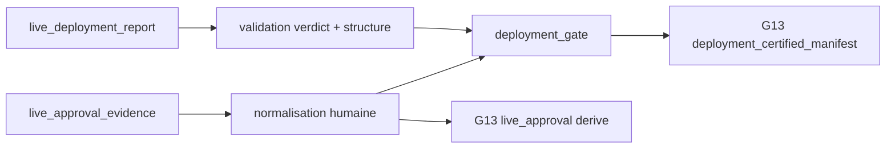

# Plan d'implementation — Approbation live derivee

## 0. Bandeau de statut

| Question | Reponse |
| --- | --- |
| Chantier actif concurrent ? | Non. Le sous-chantier 3/10 est `DONE` et le checkpoint ne declare aucun workstream actif. |
| Decision humaine manquante ? | Non. L'epic designe 4/10 ; le contrat d'approbation humaine externe/test-only existe deja et sera reutilise sans identite inventee. |
| Nature | `SINGLE_CHANTIER` : validation live, preuve d'approbation et propagation G13 partagent un seul Exit criteria bout en bout. |
| Changement normatif | Aucun ; traduction executable de SOP 11, G13 et DN-036/DN-040. |

## Audit IA de promotion

- [x] Checkpoint, epic, audit A2, code et tests vivants relus.
- [x] SOP 11, G13 et registre normatif confrontes au contrat existant.
- [x] Reutilisation de `human_evidence.py` choisie avant toute nouvelle structure.
- [x] Perimetre ferme et non-goals explicites.
- [x] Test `epic-orchestrator` : `SINGLE_CHANTIER`.
- [x] Aucun schema, protocole ou BACKTRADER requis.

## Triage

| Champ | Valeur |
| --- | --- |
| Track | `mainline` |
| Lifecycle | `TRIAGED` apres routage ; non executable avant baseline |
| Type de chantier | `SINGLE` |
| Classification | `CONTRACT_ENCODING` |
| Scope | Refuser tout verdict live non-PASS, valider une approbation humaine liee a la version live, puis deriver deployment gate et G13 sans literal positif. |
| Non-goals | Pas de cryptographie, identite humaine reelle, schema, protocole, live trading, INV-010, coherence inter-rapports, garde AST ou BACKTRADER. |
| Source | Epic parent, audit 2026-08-09 finding A2 et contrat pre-OOS humain deja `DONE`. |
| Exit criteria | Verdict live non-PASS/inconnu bloque ; preuve absente/invalide/hors sujet/fixture non autorisee bloque ; preuve valide exacte passe ; G13 consomme les resultats valides ; suite complete `OK`. |

## Statut

| Champ | Valeur |
| --- | --- |
| Statut | `NON_DEMARRE` |
| Date | 2026-08-09 |
| Autorite normative | SOP 11 ; G13 du paquet d'execution ; DN-036 et DN-040. |
| Autorite executable | `incubation_report.py`, `human_evidence.py`, `lifecycle.py`, builder pilote. |
| Baseline | 253 tests `OK`. |

## Carte d'execution IA

| Champ | Contenu |
| --- | --- |
| Objectif | Fermer le faux passage `FAIL -> deployment PASS -> G13 PASS`. |
| Reutilisation | Generaliser minimalement le normaliseur humain existant ; sujet attendu = `live_version_id`. |
| Preuve attendue | Tests unitaires de contraste, test bout en bout, Pyrefly, adversarial, conformite. |
| Arret | Nouvelle autorite, signature cryptographique ou schema requis. |

## 1. Contexte obligatoire a lire avant de coder

1. Bootstrap et cockpit vivant, gouvernance et workflow core-engine.
2. Epic parent, audit de robustesse du 2026-08-09 finding A2 et plan 3A archive.
3. SOP 11, G13 du paquet d'execution et DN-036/DN-040.
4. Plan archive des approbations humaines pre-OOS et son contrat executable.
5. Validateurs live/humains, lifecycle, builder pilote et tests cites au scope.

## 2. Frontieres et Etat des lieux

| Couche | Etat actuel | Cible |
| --- | --- | --- |
| `validate_live_deployment_report` | Verifie forme mais accepte tout verdict connu et ignore son sens. | Seul verdict exact `PASS` permet status `PASS`; inconnu/non-PASS bloque. |
| `human_evidence.py` | Contrat robuste reserve aux preuves pre-OOS. | Exposer la normalisation d'une entree reutilisable sans changer la semantique pre-OOS. |
| `deployment_gate` | Consomme un booleen `live_approval=True`. | Exiger `live_deployment_status == PASS` et `live_approval_status == PASS`. |
| Builder pilote | Injecte deux `True` actifs. | Normaliser une preuve optionnelle, la persister dans le rapport live et deriver G13. |
| Tests | Aucun contraste live hostile. | Matrice negative et controle positif exact. |

Le mot « signee » est encode par le contrat deja gouverne : ID de preuve,
reviewer, statut APPROVED, scope, horodatage UTC, reference source, sujet exact
et attestation d'independance. Ce lot ne pretend pas verifier une signature
cryptographique et n'en invente aucune.

## 2. Decision d'architecture



Contrat :

1. `normalize_human_approval_evidence()` devient le point reutilisable, avec
   le comportement actuel de `_normalize_entry()`.
2. La preuve live optionnelle porte le meme record que le pre-OOS et son
   `subject_id` doit egaler exactement `live_version_id`.
3. `TEST_FIXTURE` reste refuse par defaut et exige
   `allow_test_fixture_human_evidence=True`; l'option n'est jamais serialisee.
4. Le rapport live persiste l'entree normalisee sous
   `deployment_approval`, rendant source et failures auditables.
5. `deployment_gate` consomme deux statuts, jamais une valeur positive locale.
6. G13 conserve son contrat public : `live_approval` est un booleen derive
   de `decision_status == PASS`, compatible avec le kind `boolean_true`.

## 3. Perimetre de fichiers explicite

Autorises :

```text
Implementation/ebta_engine/governance/human_evidence.py
Implementation/ebta_engine/procedures/incubation_report.py
Implementation/ebta_engine/procedures/lifecycle.py
Implementation/examples/minimal_pilot_pipeline/build_research_package.py
Implementation/ebta_engine/tests/test_human_approval_evidence.py
Implementation/ebta_engine/tests/test_incubation_report.py
Implementation/ebta_engine/tests/test_procedure_governance.py
Implementation/ebta_engine/tests/test_minimal_pilot_pipeline.py
Implementation/ebta_engine/tests/test_inventory.txt
Implementation/HISTORIQUE DES VERSIONS EBTA ENGINE.md
.ai/backlog/mainline/PLAN_APPROBATION_LIVE_DERIVEE.md
.ai/archive/20260809_PLAN_APPROBATION_LIVE_DERIVEE.md
.ai/checkpoint.json
0 - HUMAN START HERE/archive/20260809_PLAN_APPROBATION_LIVE_DERIVEE.md
0 - HUMAN START HERE/AUDIT_BUG_HUNTER_PLAN_APPROBATION_LIVE_DERIVEE_2026-08-09.md
0 - HUMAN START HERE/AUDIT_ADVERSARIAL_PLAN_APPROBATION_LIVE_DERIVEE_2026-08-09.md
0 - HUMAN START HERE/AUDIT_CONFORMITE_PLAN_APPROBATION_LIVE_DERIVEE_2026-08-09.md
```

Interdits :

```text
Protocole/
Implementation/ebta_engine/schemas/
Implementation/ebta_engine/validators/
Implementation/ebta_engine/manifests/
Implementation/ebta_engine/package_builder/
Implementation/examples/minimal_pilot_pipeline/inputs/
Implementation/examples/minimal_pilot_pipeline/research_package/
Implementation/Active/
D:/TRADING/.../BACKTRADER/
```

## 6. Decoupage en phases

### Phase 1 — Validation des deux preuves

- exposer le normaliseur generique sans regression pre-OOS ;
- refuser verdict live `FAIL`, `INCONCLUSIVE`, `WATCH`, `SUSPENDED`
  et toute valeur inconnue ;
- normaliser la preuve live avec sujet exact et fixture test-only ;
- ajouter les tests unitaires de forme, statut, sujet, UTC, independance et scope.

### Phase 2 — Propagation bout en bout

- ajouter les statuts live/approbation a `deployment_gate` ;
- supprimer les deux `live_approval=True` du builder ;
- persister la preuve normalisee dans `live_deployment.json` produit en temporaire ;
- deriver G13 depuis la preuve et le rapport valides ;
- prouver absence, mauvaise preuve et verdict hostile jusqu'au gate final.

### Phase 3 — Validation et trace

- mettre a jour l'inventaire et l'historique ;
- lancer tests cibles, package pilote temporaire et suite complete ;
- executer bug-hunter, adversarial-tester et plan-conformance-audit.

## 5. Invariants et NO GO

1. Un verdict live autre que la chaine exacte `PASS` ne produit jamais
   `live_deployment.status PASS`.
2. Absence ou invalidite de preuve ne devient jamais approbation.
3. Une fixture n'est acceptee que par option explicite de test.
4. Le sujet approuve est la version live exacte.
5. Aucun reviewer, ID, timestamp ou `True` d'approbation n'est fabrique.
6. Les deux literals actifs signales par A2 disparaissent.
7. Aucun verdict scientifique non-PASS n'est transforme.

NO GO : accepter un dict truthy, deduire une identite, ajouter un fallback,
modifier un schema/protocole, reutiliser une approbation pre-OOS comme preuve
live ou faire passer le test uniquement via fixture implicite.

## 9. Verification a chaque etape

```powershell
python -m unittest discover -s Implementation\ebta_engine\tests -t Implementation -p test_human_approval_evidence.py
python -m unittest discover -s Implementation\ebta_engine\tests -t Implementation -p test_incubation_report.py
python -m unittest discover -s Implementation\ebta_engine\tests -t Implementation -p test_procedure_governance.py
python -m unittest discover -s Implementation\ebta_engine\tests -t Implementation -p test_minimal_pilot_pipeline.py
python -m unittest discover -s Implementation\ebta_engine\tests -t Implementation -p test_test_inventory.py
python -m unittest discover -s Implementation\ebta_engine\tests -t Implementation
git diff --check
```

## 10. Journal des decisions humaines

| Date | Decision | Portee |
| --- | --- | --- |
| 2026-07-21 | Inputs humains explicites optionnels et fixtures test-only. | Contrat reutilise ; aucune identite inventee. |
| 2026-08-09 | `AUDIT_ARCHITECTURE_D_ABORD`. | Autorise le redimensionnement en 3A-3D, pas une nouvelle norme. |
| 2026-08-09 | `/continue` sur l'epic. | Autorise la boucle gouvernee du prochain enfant 4/10. |

## 7. Definition of Done

- [ ] Matrice negative et controle positif passent.
- [ ] G13 ne consomme aucun literal d'approbation.
- [ ] Fixture refusee par defaut et visible si autorisee.
- [ ] Rapport live persiste preuve normalisee et failures.
- [ ] Suite complete/inventaire verts ; Pyrefly zero.
- [ ] Trois audits de fermeture sans finding bloquant.
- [ ] Protocole, schemas, package builder, artefacts persistants et BACKTRADER intacts.

## 8. Cloture

| Champ | Valeur |
| --- | --- |
| Resultat | A renseigner. |
| Ecart | A renseigner. |
| Suite | 5/10 `PLAN_COHERENCE_VERDICTS_PERSISTES`. |

## 9. Journal d'audits post-route

| Passe | Verification | Resultat |
| --- | --- | --- |
| 1 | A executer apres routage. | En attente. |
| 2 | A executer apres correction. | En attente. |

## Journal de convergence de l'intake

| Passe | Verification | Resultat |
| --- | --- | --- |
| 1 | A2 confronte aux producteurs/consommateurs live. | Ajout de l'exigence `live_deployment_status PASS` dans deployment gate. |
| 2 | Recherche de contrats humains reutilisables. | Reutilisation du record pre-OOS ; aucun nouveau schema ni identite. |
| 3 | Relecture chronologie, fixtures et persistance. | Preuve live distincte du pre-OOS, sujet version live, rapport temporaire auditable ; convergence. |
