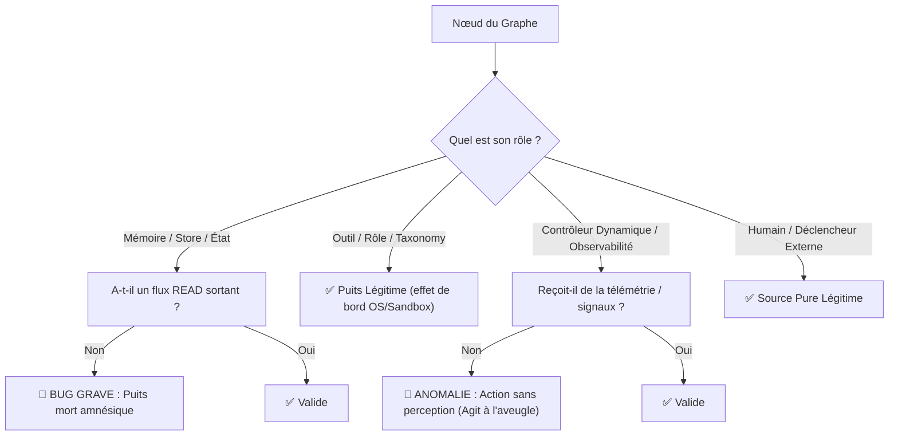

# 🏛️ Analyse Critique : Puits Morts & Sources Sans Ingestion — Sont-ils de Vrais Problèmes ?

**Fichier audité :** [`IA - Diagramme architecture`](file:///d:/Livre/Veille/IA%20-%20Diagramme%20architecture)  
**Question clé :** *Est-ce un problème architectural réel si certains nœuds sont des puits morts ou des sources sans ingestion, ou est-ce une simple convention graphique ?*

---

## 🎯 Réponse Courte & Règle d'Or

> **Non, ce n'est pas toujours un problème.** Tout dépend de la **nature sémantique** du composant :
> 1. **Puits Mort Légitime :** Un puits est normal s'il représente un *catalogue statique*, un *outil exécuté* dont l'effet passe par le conteneur, ou le *système cible final*.
> 2. **Puits Mort Problématique (Bug d'Architecture) :** Un composant de **mémoire, d'état ou de preuve** qui ne possède que des écritures (`WRITE`) et aucune lecture (`READ`) est un **trou noir informationnel**. Il brise la capacité du système à apprendre, à reprendre après crash et à s'adapter.
> 3. **Source Sans Ingestion Légitime :** Normal pour un *déclencheur externe* (l'utilisateur humain) ou des *règles statiques a priori* (politiques de sécurité).
> 4. **Source Problématique (Rupture de Causalité) :** Un composant de *surveillance dynamique* ou de *contrôle d'incident* qui agit sans jamais recevoir d'événements ni de métriques.

---

## ⚖️ Grille d'Évaluation : Analyse Nœud par Nœud



---

## 1. Analyse des Puits Morts : Pourquoi et Pour Qui c'est un Problème ?

### 🚨 Catégorie A : Les VRAIS Problèmes (Bugs de Conception)

| Nœud | In / Out | Pourquoi c'est un problème grave | Conséquence dans un système IA réel |
| :--- | :---: | :--- | :--- |
| **`node_evidence_store`** | 8 IN / 0 OUT | **Amnésie du système.** On stocke 8 types de preuves (logs, runs de backtest, validations, code), mais aucun agent ne vient les relire. | Les agents recommencent chaque tâche de zéro sans tirer parti des essais précédents ni des analyses d'échecs passées. |
| **`node_task_state`** | 2 IN / 0 OUT | **Rupture d'orchestration.** L'état d'avancement des sous-tâches est sauvegardé mais l'Orchestrateur n'a pas de flèche pour le consulter. | L'orchestrateur ne peut pas savoir de manière déterministe quelles étapes sont finies, en cours ou échouées. |
| **`node_checkpoint`** | 2 IN / 0 OUT | **Incapacité de reprise.** Un snapshot est créé, mais le nœud `node_resume` (reprise après panne) n'y est pas connecté. | En cas de crash ou de timeout d'un agent, l'état sauvegardé ne peut pas être restauré automatiquement. |
| **`node_memory`** | 1 IN / 0 OUT | **Mémoire morte.** Écrire dans une mémoire qui n'est jamais relue consomme de la ressource sans valeur ajoutée. | Perte du contexte conversationnel ou inter-agents. |

---

### ✅ Catégorie B : Les Puits LÉGITIMES (Faux Positifs)

Ces nœuds n'ont pas besoin d'arêtes sortantes directes car leur effet est modélisé par ailleurs :

| Nœud | In / Out | Pourquoi ce N'EST PAS un problème |
| :--- | :---: | :--- |
| **`node_tool_shell`, `node_tool_git`, etc.** | 1-2 IN / 0 OUT | Les outils sont appelés par le `node_tool_router` ; leur résultat d'exécution est réinjecté via l'environnement (`node_sandbox`) et produit le `node_artifact`. |
| **`node_agent_specializations`** | 1 IN / 0 OUT | Il s'agit d'un **catalogue de rôles conceptuels** (Coding Agent, Reviewer, etc.) et non d'une brique de traitement du pipeline. |
| **`node_target_system`** (en partie) | 3 IN / 0 OUT | C'est le récepteur final du déploiement. (Même si une arête de télémétrie vers l'observabilité reste une bonne pratique). |

---

## 2. Analyse des Sources Sans Ingestion : Est-ce un Problème ?

### 🚨 Catégorie A : Les VRAIS Problèmes (Agir à l'Aveugle)

| Nœud | In / Out | Pourquoi c'est un problème | Correction Nécessaire |
| :--- | :---: | :--- | :--- |
| **`node_observability`** | 0 IN / 7 OUT | **Rupture causale.** Il surveille 7 briques mais ne reçoit aucun flux de données (logs, métriques, événements de sandbox). | Ajouter des flux d'ingestion `TELEMETRY` depuis `node_sandbox` et `node_ci`. |
| **`node_recovery_controller`** | 0 IN / 5 OUT | **Déclencheur fantôme.** Il déclenche les retries et rollbacks sans arête montrant d'où vient l'alerte d'incident. | Ajouter une arête depuis `node_decision_gate (FAIL)`. |

---

### ✅ Catégorie B : Les Sources LÉGITIMES

| Nœud | In / Out | Pourquoi ce N'EST PAS un problème |
| :--- | :---: | :--- |
| **`node_user`** | 0 IN / 2 OUT | C'est l'**initiateur humain originel** (point de départ absolu du graphe). |
| **`node_policy`** | 0 IN / 5 OUT | Représente les **règles fixes d'entreprise / sécurité** préconfigurées au démarrage. |

---

## 📊 Tableau Récapitulatif : Verdict Final

```
Total Nœuds du Graphe : 71
├── Puits analysés (23)
│    ├── 🔴 5 Vrais Bugs de Modélisation (Stores sans lecture : Evidence, Task State, Checkpoint, Memory, Data)
│    └── 🟢 18 Puits Normaux (Outils déterministes, catalogues, rôles)
└── Sources analysées (5)
     ├── 🔴 2 Anomalies de Causalité (Observabilité & Recovery sans ingestion)
     └── 🟢 3 Sources Légitimes (User, Policy, Validation scientifique initiale)
```

### 💡 Conclusion Opérationnelle
Corriger ces **7 nœuds identifiés en rouge** transforme un diagramme purement "visuel" en un **graphe exécutable et robuste**, où chaque donnée produite est réexploitée par les agents pour fiabiliser le système.
