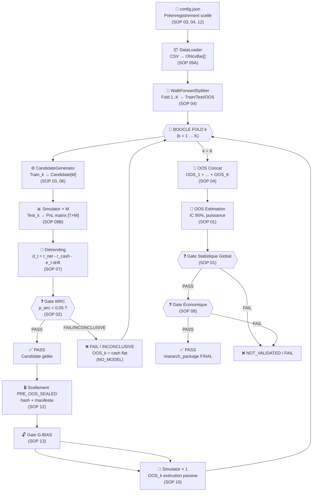
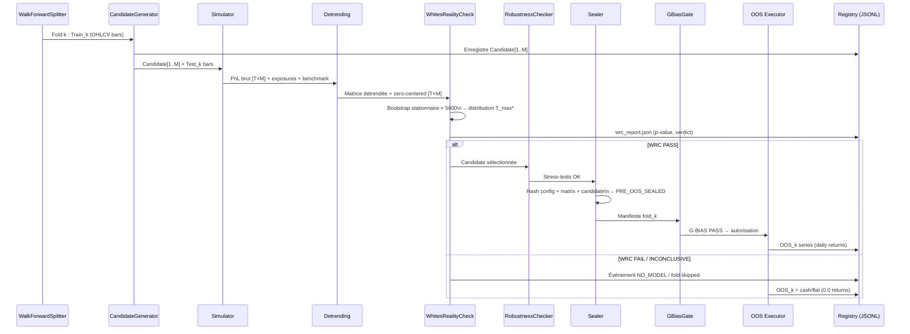
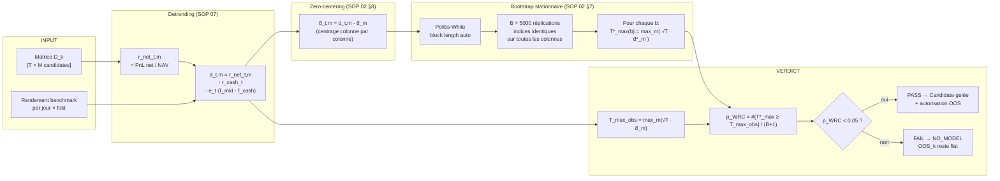
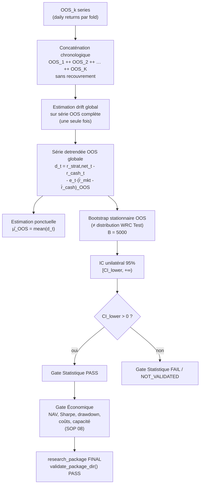
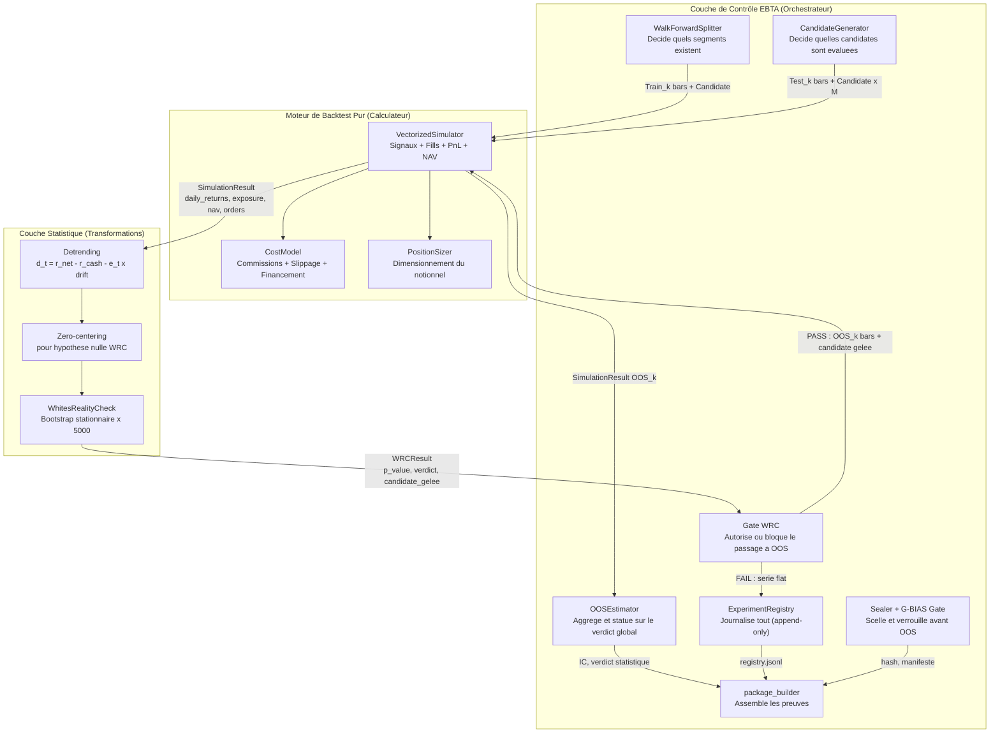
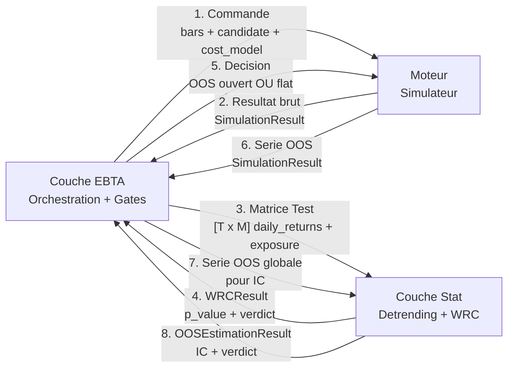
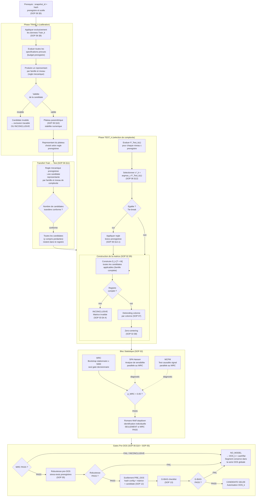
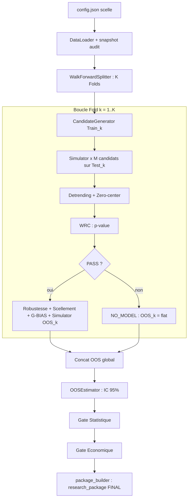
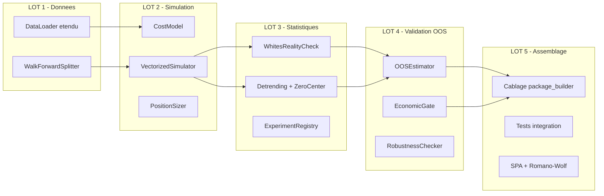

# Architecture Technique du Moteur EBTA
## Traduction du Protocole en Code Python Exécutable

---

## Schéma 1 — Vue Globale du Pipeline



---

## Schéma 2 — Zoom sur la Boucle de Fold



---

## Schéma 3 — Flux Interne du WRC (SOP 02)



---

## Schéma 4 — Estimation OOS Globale (SOP 01)



---

## 1. Inventaire des Briques — État de l'Art

### 1.1 Ce qui existe (Infrastructure / Supervision)

| Module actuel | Chemin | Rôle réel | Suffisant pour le vrai moteur ? |
|---|---|---|---|
| `DataLoader` (partiel) | `data/local_ohlcv.py` | Lit CSV → `OhlcvBar` namedtuple | ✅ Bon socle, à étendre |
| `StrategyPayload` | `strategies/payloads.py` | Dataclass représentant une stratégie (asset, code) | ✅ Conserver, étendre |
| `native_engine.py` (stub) | `backtest/native_engine.py` | **Bouchon** : 4 obs max, PnL fictif | ❌ À remplacer complètement |
| `unit_notional_size()` | `risk/sizing.py` | Renvoie un notionnel fixe | ❌ Beaucoup trop simplifié |
| `mean_return()` | `metrics/performance.py` | Calcule une moyenne | ❌ Fonctionnellement vide |
| `validate_package_dir()` | `validators/` | Vérifie la structure du paquet EBTA | ✅ À conserver tel quel |
| `package_builder/` | `package_builder/` | Assemble le `research_package/` | ✅ Orchestre — conserver |
| `persistence.py` | `persistence.py` | I/O bas niveau JSON/JSONL | ✅ À conserver |
| `governance/` | `governance/` | G-BIAS, registre incidents, bias_gate | ✅ Complet, conforme SOP 13 |
| `procedures/` | `procedures/` | Procédures OOS, scellement | ✅ Enveloppe correcte |
| Notebooks Jupyter | `Implementation/notebooks/` | Cockpit d'orchestration | ✅ Conserver |

### 1.2 Ce qui manque (Le vrai moteur)

| Brique manquante | Module à créer | SOP source |
|---|---|---|
| Walk-Forward Splitter | `data/walk_forward.py` | SOP 04 |
| Simulation financière réelle | `backtest/simulator.py` | SOP 09B |
| Modèle de coûts configuré | `backtest/cost_model.py` | SOP 09B |
| Génération matrice candidates | `strategies/generator.py` | SOP 03, 06 |
| Sélection locale Test_k | `strategies/selection.py` | SOP 06 |
| Detrending et zero-centering | `metrics/detrending.py` | SOP 07 |
| WRC + Bootstrap stationnaire | `statistics/wrc.py` | SOP 02 |
| SPA (analyse secondaire) | `statistics/spa.py` | SOP 02 |
| Romano-Wolf stepdown | `statistics/romano_wolf.py` | SOP 02 |
| MCPM | `statistics/mcpm.py` | SOP 02 |
| Estimation OOS globale | `statistics/oos_estimation.py` | SOP 01 |
| Tests de robustesse | `risk/robustness.py` | SOP 05 |
| Sizing configuré | `risk/position_sizer.py` | SOP 09B |
| Registre append-only | `registry/experiment_registry.py` | SOP 03 |
| Gate économique | `metrics/economic_gate.py` | SOP 08 |

---

## 2. Spécifications Techniques — Brique par Brique

---

### Brique 1 — `data/walk_forward.py`
**Rôle SOP** : SOP 04 — Segmentation temporelle et Walk-Forward

```python
@dataclass(frozen=True)
class FoldSpec:
    fold_id:      str            # ex. "FOLD-001"
    warmup_start: date
    train_start:  date
    train_end:    date
    test_start:   date
    test_end:     date
    oos_start:    date
    oos_end:      date

@dataclass
class Fold:
    spec:      FoldSpec
    warmup:    list[OhlcvBar]    # lookback, non évalué
    train:     list[OhlcvBar]    # calibration
    test:      list[OhlcvBar]    # inférence WRC
    oos:       list[OhlcvBar]    # exécution passive (scellé avant accès)

class WalkForwardSplitter:
    def __init__(self, config: WalkForwardConfig): ...

    def split(self, bars: list[OhlcvBar]) -> list[Fold]:
        """
        Produit K folds strictement non-chevauchants (OOS).
        Garantit :
          - purge entre train et test (= max_holding_period)
          - embargo optionnel entre test et OOS
          - warm-up isolé (non évalué)
          - non-superposition des segments OOS
        """

    def validate_no_oos_overlap(self, folds: list[Fold]) -> None:
        """Lève OOSOverlapError si deux OOS se chevauchent."""
```

**Entrées** : `list[OhlcvBar]`, `WalkForwardConfig` (train_len, test_len, oos_len, step, purge, embargo, warmup, calendar)
**Sorties** : `list[Fold]` — chaque fold contient 4 segments distincts
**Dépendances** : `data/local_ohlcv.py` (lecture CSV)
**Artefact produit** : `fold_schedule.json` (daté, hashé)

---

### Brique 2 — `strategies/generator.py`
**Rôle SOP** : SOP 03 (registre), SOP 06 (candidats)

```python
@dataclass(frozen=True)
class Candidate:
    candidate_id:  str            # hash déterministe des paramètres
    strategy_code: str            # ex. "EMA_CROSSOVER"
    asset:         str            # ex. "XAUUSD"
    params:        dict           # {"fast": 10, "slow": 30}
    version:       str            # PROCESS_VERSION_ID

class CandidateGenerator:
    def generate(
        self,
        payload: StrategyPayload,
        train_bars: list[OhlcvBar],
        config: SearchSpaceConfig,
    ) -> list[Candidate]:
        """
        Produit la famille COMPLÈTE des candidates applicables.
        Enregistre chaque candidate dans l'ExperimentRegistry (SOP 03).
        INTERDIT : supprimer des candidates perdantes a posteriori.
        """
```

**Entrées** : `StrategyPayload`, données `Train_k`, espace de recherche (`SearchSpaceConfig`)
**Sorties** : `list[Candidate]` — la famille complète M candidates
**Dépendances** : `strategies/payloads.py`, `registry/experiment_registry.py`
**Artefact produit** : `candidate_matrix.json`

---

### Brique 3 — `backtest/cost_model.py` et `backtest/simulator.py`
**Rôle SOP** : SOP 09B — Modèle d'exécution, frictions, sizing

```python
@dataclass(frozen=True)
class CostModel:
    commission_per_lot:  float     # coût fixe par lot (préenregistré)
    slippage_bps:        float     # glissement en points de base
    financing_rate_daily: float    # taux de financement overnight
    impact_model:        str       # "zero" | "linear" | "sqrt"

@dataclass
class SimulationResult:
    candidate_id:   str
    segment:        str              # "train" | "test" | "oos"
    daily_returns:  np.ndarray       # shape (T,) — rendements nets quotidiens
    daily_exposure: np.ndarray       # shape (T,) — exposition e_t ∈ [-1, +1]
    nav:            np.ndarray       # shape (T+1,) — NAV mark-to-market
    orders:         list[dict]       # journal ordre-fill-position
    fills:          list[dict]
    positions:      list[dict]
    total_costs:    float

class VectorizedSimulator:
    def __init__(self, cost_model: CostModel): ...

    def run(
        self,
        candidate: Candidate,
        bars: list[OhlcvBar],
    ) -> SimulationResult:
        """
        Calcule, pour TOUTE la série (sans limite d'observations) :
        1. Génération des signaux de la candidate sur les bars (anti-lookahead)
        2. Calcul des fills avec slippage au prix du lendemain open
        3. P&L mark-to-market quotidien (overnight inclus)
        4. Application des coûts (commission, financement)
        5. NAV = NAV_prev × (1 + r_net_t)
        """
```

**Entrées** : `Candidate`, `list[OhlcvBar]`, `CostModel`
**Sorties** : `SimulationResult` complet
**Ce que le stub ne fait PAS** : il limite à 4 observations, n'applique pas le slippage réel, ne calcule pas l'exposition quotidienne.
**Dépendances** : `strategies/generator.py`, `risk/position_sizer.py`

---

### Brique 4 — `metrics/detrending.py`
**Rôle SOP** : SOP 07 — Detrending Aronson

```python
def compute_detrended_series(
    strategy_returns: np.ndarray,    # r_strat,net_t — rendements nets quotidiens
    cash_returns: np.ndarray,        # r_cash_t — rendement cash quotidien
    exposure: np.ndarray,            # e_t ∈ [-1, +1]
    market_returns: np.ndarray,      # r_mkt_t — benchmark sur même calendrier
) -> np.ndarray:
    """
    Formule normative SOP 07 §6 / SOP 01 §4.1.1 :
        d_t = r_strat,net_t - r_cash_t - e_t × (r̄_mkt - r̄_cash)

    - r̄_mkt et r̄_cash = moyennes sur le MÊME segment (Train, Test, ou OOS global)
    - Le drift est estimé UNE SEULE FOIS par segment
    - Cette valeur n'affecte JAMAIS les signaux ou le sizing
    """
    r_bar_mkt  = market_returns.mean()
    r_bar_cash = cash_returns.mean()
    drift_adj  = exposure * (r_bar_mkt - r_bar_cash)
    return strategy_returns - cash_returns - drift_adj

def zero_center(d_matrix: np.ndarray) -> np.ndarray:
    """
    SOP 02 §8 — Zero-centering colonne par colonne.
    d̃_t,m = d_t,m - d̄_m
    Appliqué SEULEMENT pour construire la distribution nulle du WRC.
    NE PAS utiliser pour l'estimation ponctuelle OOS.
    """
    return d_matrix - d_matrix.mean(axis=0)
```

**Entrées** : tableaux NumPy issus du `Simulator`
**Sorties** : `np.ndarray` de shape `(T,)` (série scalaire) ou `(T, M)` (matrice WRC)
**Invariant** : activation/désactivation du detrending ne modifie AUCUN signal

---

### Brique 5 — `statistics/wrc.py`
**Rôle SOP** : SOP 02 — White's Reality Check (test primaire)

```python
@dataclass
class WRCResult:
    observed_statistic: float       # T_max_obs = max_m(√T · d̄_m)
    exceedance_count:   int         # #{T*_max ≥ T_max_obs}
    p_value:            float       # (exceedance_count + 1) / (B + 1)
    monte_carlo_error:  float       # erreur numérique bootstrap
    selected_candidate: Candidate
    verdict:            str         # "PASS" | "FAIL" | "INCONCLUSIVE"
    oos_authorized:     bool
    bootstrap_seed:     int

class WhitesRealityCheck:
    """
    Algorithme SOP 02 §9 :
    1. Construire D_k [T × M] de rendements detrendés
    2. Zero-center chaque colonne (§8)
    3. Calculer T_max_obs = max_m(√T · d̄_m)
    4. Pour b = 1..B=5000 :
       a. Bootstrap stationnaire joint sur T indices (Politis-White)
       b. Calculer d̄*_m(b) pour chaque colonne
       c. T*_max(b) = max_m(√T · d̄*_m(b))
    5. p_WRC = (#{T*_max(b) ≥ T_max_obs} + 1) / (B + 1)
    6. verdict = PASS si p_WRC < alpha (= 0.05)
    """

    def __init__(self, n_replications: int = 5_000, alpha: float = 0.05): ...

    def run(
        self,
        d_matrix: np.ndarray,           # [T × M] detrendé (AVANT zero-center)
        candidates: list[Candidate],
        seed: int,
    ) -> WRCResult: ...

    def _stationary_block_bootstrap(
        self,
        T: int,
        block_length: float,            # calculé par Politis-White-Patton
        seed: int,
        n_replications: int,
    ) -> np.ndarray:                    # shape [B × T] d'indices
        """
        RÈGLE CRITIQUE (SOP 02 §7.1) :
        Les MÊMES indices temporels sont appliqués à TOUTES les colonnes.
        Rééchantillonner chaque candidate indépendamment est INTERDIT.
        """
```

**Entrées** : matrice `[T × M]` de rendements detrendés, liste de candidates
**Sorties** : `WRCResult` — p-value, verdict, candidate sélectionnée, autorisation OOS
**Dépendances** : `metrics/detrending.py`, `strategies/generator.py`
**Artefact produit** : `wrc.json` (rapport complet SOP 02 §17)

---

### Brique 6 — `statistics/spa.py`, `statistics/romano_wolf.py`, `statistics/mcpm.py`
**Rôle SOP** : SOP 02 §10, §11, §12 — Analyses secondaires

> [!WARNING]
> **Audit de positionnement (2026-07-03)** — Ces trois méthodes ne sont ni des alternatives au WRC, ni des mécanismes de rattrapage. Leur rôle, leur séquençage et leurs interdictions sont distincts les uns des autres.

#### Tableau comparatif des quatre méthodes (SOP 02)

| Méthode | Rôle SOP exact | Exécuté quand ? | Peut autoriser l'OOS ? | Peut renverser WRC FAIL ? |
|---|---|---|---|---|
| **WRC** | Gate confirmatoire primaire. Teste si le max de l'univers dépasse le hasard. | Toujours sur `Test_k` | **Seul à le faire** (§15.1) | — |
| **SPA** | Analyse de sensibilité. Réduit l'influence des très mauvaises candidates via statistique studentisée et troncature Hansen. | En parallèle du WRC, mêmes données `Test_k`, même moment | **Non** (§10.1 explicite) | **Non** (§10.1 explicite) |
| **Romano-Wolf** | Identifie quelles candidates individuelles sont significatives (contrôle FWER). | **Uniquement si WRC PASS** (§11.1) | Non — ne modifie pas la candidate transmise à l'OOS (§15.4) | **Non** (§11.1 explicite) |
| **MCPM** | Test secondaire de la relation causale signal → rendement. Permutation des rendements futurs. | En parallèle du WRC, mêmes données `Test_k` | **Non** (§12.2 explicite) | **Non** (§12.2 explicite) |

#### Note sur l'interprétation "réduction du risque de Type II"

Le SPA réduit effectivement une source de perte de puissance spécifique au WRC : quand l'univers contient beaucoup de très mauvaises candidates, elles tirent la distribution nulle vers le bas et rendent le test conservateur (SOP 02 §9.4). Le SPA corrige cela via la troncature de Hansen — mais comme diagnostic de sensibilité, pas comme décision. **Si le WRC est `FAIL`, le SPA `PASS` ne change rien à la décision.**

Romano-Wolf ne réduit pas le risque de Type II de la décision globale. Il contrôle la FWER sur les tests **individuels** après un WRC `PASS`. Son rôle est d'identifier les candidates individuellement significatives dans un univers déjà validé globalement — pas de protéger contre un WRC trop sévère.

```python
class HansenSPA:
    """
    SOP 02 §10 — Analyse secondaire de sensibilité.

    Séquençage : s'exécute EN PARALLÈLE du WRC sur les mêmes données Test_k.
    Réduit l'influence des candidates clairement mauvaises via la statistique
    studentisée et la troncature de Hansen (≠ simple zero-centering WRC).

    INTERDIT par SOP 02 §10.1 :
    - autoriser l'OOS si le WRC primaire FAIL
    - renverser le verdict primaire
    - être choisi après observation parce que sa p-value est plus faible

    Résultat : informatif uniquement → wrc_report.json (section spa_pvalue)
    """
    def run(
        self,
        d_matrix: np.ndarray,     # [T × M] detrendé (AVANT zero-center)
        candidates: list[Candidate],
        seed: int,
    ) -> SPAResult: ...

class RomanoWolfStepdown:
    """
    Identification des candidates individuellement significatives.
    Exécuté APRÈS rejet du test global (WRC PASS).
    Algorithme stepdown monotone.
    """
    def run(self, d_matrix: np.ndarray, ...) -> list[RomanoWolfEntry]: ...
```

---

### Brique 7 — `statistics/oos_estimation.py`
**Rôle SOP** : SOP 01 — Estimation et Intervalle de Confiance OOS

```python
@dataclass
class OOSEstimationResult:
    point_estimate:    float       # μ̂_OOS = mean(d_t) sur la série globale
    ci_lower_95:       float       # borne inférieure IC 95% unilatéral
    ci_upper_95:       float
    p_value:           float       # test μ > 0
    power:             float       # puissance calculée (préenregistrée)
    n_observations:    int         # nombre de jours OOS total
    statistical_gate:  str         # "PASS" | "FAIL" | "NOT_VALIDATED" | "INCONCLUSIVE"
    bootstrap_seed:    int

class OOSEstimator:
    """
    SOP 01 §4 — Estimation sur la série OOS concaténée.

    RÈGLE CRITIQUE :
    La distribution bootstrap ICI est construite sur la série OOS.
    La distribution WRC (Test) NE DOIT PAS être réutilisée ici.
    Ce sont deux estimands différents.
    """

    def estimate(
        self,
        oos_results: list[SimulationResult],     # par fold (ordre chronologique)
        benchmark_oos: np.ndarray,               # rendements benchmark sur OOS global
        cash_oos: np.ndarray,
        n_replications: int = 5_000,
        seed: int = ...,
    ) -> OOSEstimationResult:
        """
        1. Concaténer chronologiquement daily_returns et daily_exposure
        2. Appliquer detrending une seule fois sur la série OOS globale
        3. IC : bootstrap stationnaire sur série OOS (≠ bootstrap WRC)
        4. Calculer p-value (test unilatéral μ > 0)
        """
```

**Entrées** : liste ordonnée des `SimulationResult` OOS, séries benchmark et cash
**Sorties** : `OOSEstimationResult`
**Artefact produit** : `series/oos_concat.csv` + `reports/oos_global.json`

---

### Brique 8 — `risk/robustness.py`
**Rôle SOP** : SOP 05 — Tests de robustesse pré-OOS

```python
@dataclass
class RobustnessResult:
    tests_run:     list[str]
    all_passed:    bool
    verdict:       str          # "PASS" | "FAIL" | "INCONCLUSIVE"
    details:       list[dict]

class RobustnessChecker:
    """
    Stress-tests décisionnels PRÉENREGISTRÉS (SOP 05).
    Exécutés sur la candidate gelée, AVANT ouverture de l'OOS.
    Exemples de tests :
      - décalage de paramètres de ±1 cran
      - bruitage des données d'entrée (±0.5% prix)
      - modification de la date de début (±5 jours)
    INTERDIT : utiliser l'OOS pour réparer une robustesse insuffisante.
    """
    def run(
        self,
        candidate: Candidate,
        train_bars: list[OhlcvBar],
        test_bars: list[OhlcvBar],
        config: RobustnessConfig,
    ) -> RobustnessResult: ...
```

**Artefact produit** : `reports/robustness.json`

---

### Brique 9 — `registry/experiment_registry.py`
**Rôle SOP** : SOP 03 — Registre append-only

```python
class ExperimentRegistry:
    """
    Journal APPEND-ONLY de tout l'effort de recherche.
    Toute candidate évaluée, tout run exécuté, tout événement de décision.
    Format : JSONL (une ligne = un événement immuable).
    INTERDIT : modifier ou supprimer une entrée passée.
    """

    def log_candidate(self, c: Candidate) -> None: ...
    def log_run(self, run: RunRecord) -> None: ...
    def log_selection(self, fold_id: str, selected_id: str) -> None: ...
    def log_wrc_verdict(self, fold_id: str, result: WRCResult) -> None: ...
    def log_oos_open(self, fold_id: str, authorization_id: str) -> None: ...
    def log_oos_close(self, fold_id: str, daily_series_hash: str) -> None: ...
    def get_candidate_count(self, fold_id: str) -> int: ...
    def is_complete(self, fold_id: str) -> bool: ...
```

**Format** : `registry.jsonl` (append-only, jamais modifiable)
**Gate bloquant** : `is_complete()` doit être `True` avant d'autoriser le WRC

---

### Brique 10 — `metrics/economic_gate.py`
**Rôle SOP** : SOP 08 — Gate Économique

```python
@dataclass
class EconomicMetrics:
    mean_net_return_annual: float
    sharpe_ratio:           float
    max_drawdown:           float
    avg_daily_exposure:     float
    trade_count:            int
    total_costs:            float
    nav_final:              float
    economic_gate:          str     # "PASS" | "REJECTED_ECONOMIC" | "INCONCLUSIVE"

def compute_economic_gate(
    oos_results: list[SimulationResult],
    hurdle: EconomicHurdle,          # préenregistré : Sharpe min, drawdown max…
) -> EconomicMetrics:
    """
    Évalue la NAV nette RÉELLE (non detrendée) sur l'OOS global.
    Séparé du gate statistique.
    Un gate économique REJECTED_ECONOMIC ne remplace PAS un gate statistique FAIL.
    """
```

---

## 3. Séparation Moteur de Backtest / Couche de Contrôle EBTA

### 3.1 Pourquoi cette séparation est structurellement nécessaire

La question n'est pas de style ou de préférence architecturale. Elle découle directement du protocole.

Le **moteur de backtest** répond à une seule question : *"Si cette candidate avait été exécutée sur cette série de prix avec ces coûts, qu'aurait-on obtenu ?"* C'est un calculateur financier déterministe. Il n'a aucune raison de savoir si on lui soumet des données `Train`, `Test` ou `OOS`, et aucune raison de connaître les gates méthodologiques.

La **couche de contrôle EBTA** répond à une question radicalement différente : *"A-t-on le droit d'utiliser ce résultat, dans ce contexte, à ce stade du processus ?"* Elle encadre, séquence et bloque les appels au moteur selon les règles des SOPs.

**Sans cette séparation, la fraude ou l'erreur méthodologique devient invisible.** Rien dans le moteur ne peut empêcher quelqu'un d'appeler `simulator.run(candidate, oos_bars)` sans avoir d'abord passé le WRC. La couche de contrôle est le seul endroit où ce verrou existe réellement dans le code.

> [!IMPORTANT]
> Le moteur de backtest ne sait pas qu'il existe un protocole EBTA. La couche de contrôle est ce qui transforme un simulateur générique en processus de recherche conforme EBTA.

---

### 3.2 Schéma de l'Imbrication — Vue Architecturale



---

### 3.3 Ce que fait chaque couche — Frontière exacte

#### Le Moteur de Backtest (ce qu'il fait et ce qu'il ignore)

| Il fait | Il ne fait PAS |
|---|---|
| Lire les bars OHLCV dans l'ordre chronologique | Vérifier qu'il s'agit de données `Train`, `Test` ou `OOS` |
| Appliquer les signaux de la candidate (anti-lookahead) | Savoir si l'OOS est "autorisé" |
| Calculer les fills au prix du lendemain open | Exécuter le WRC ou vérifier le G-BIAS |
| Appliquer commissions, slippage, financement | Sceller ou hasher quoi que ce soit |
| Calculer la NAV mark-to-market quotidienne | Décider si on peut passer au fold suivant |
| Produire `orders`, `fills`, `positions`, `daily_returns`, `exposure` | Journaliser quoi que ce soit dans le registre |

**En résumé** : le moteur ne reçoit qu'une série de barres et une candidate. Il produit des chiffres. Il est aveugle au contexte méthodologique.

#### La Couche de Contrôle EBTA (ce qu'elle fait et ce qu'elle délègue)

| Elle fait | Elle délègue au moteur |
|---|---|
| Décider quel segment soumettre au moteur (Train ? Test ? OOS ?) | Le calcul des PnL, fills et NAV |
| Vérifier que le registre est complet avant le WRC (SOP 03) | La génération des signaux de la candidate |
| Bloquer l'appel OOS si le WRC est `FAIL` | Le calcul du slippage et des coûts |
| Sceller le contexte cryptographiquement avant OOS (SOP 12) | La valorisation mark-to-market quotidienne |
| Forcer la politique `NO_MODEL` si aucun candidat ne passe | |
| Journaliser chaque décision dans le registre append-only (SOP 03) | |
| Passer le résultat OOS à la couche statistique (SOP 01) | |

---

### 3.4 Le Contrat d'Interface — Ce qui circule entre les deux

Le seul objet que le moteur produit et que la couche EBTA consomme est le `SimulationResult`.

```python
@dataclass
class SimulationResult:
    # --- Ce que le moteur calcule ---
    candidate_id:   str
    segment:        str              # "train" | "test" | "oos" (posé par l'appelant, pas le moteur)
    daily_returns:  np.ndarray       # (T,) — r_net_t : rendement net quotidien
    daily_exposure: np.ndarray       # (T,) — e_t ∈ [-1, +1]
    nav:            np.ndarray       # (T+1,) — NAV mark-to-market
    orders:         list[dict]       # journal signal → ordre → fill
    fills:          list[dict]
    positions:      list[dict]
    total_costs:    float

    # --- Ce que la couche EBTA ajoute APRES reception ---
    # (pas dans le moteur — dans les classes de la couche EBTA)
    # fold_id, wrc_verdict, sealing_hash, oos_authorized... sont des métadonnées
    # ajoutées par l'orchestrateur dans le research_package, pas par le simulateur.
```

**Direction du flux d'information :**



---

### 3.5 Les Moments Précis d'Intervention de la Couche EBTA

La couche de contrôle intervient à **6 moments clés** dans le pipeline :

| Moment | Ce que fait la couche EBTA | Ce qu'elle empêche |
|---|---|---|
| **M1 — Avant Train** | Décide les dates exactes de `Train_k` (SOP 04). Vérifie la purge et l'embargo. | Un `Train_k` qui empiète sur le `Test_k` ou l'`OOS_k`. |
| **M2 — Avant WRC** | Vérifie que le registre est complet (SOP 03). Vérifie que la matrice `[T×M]` est reconstructible. | Un WRC exécuté sur un univers incomplet (biais favorable). |
| **M3 — Gate WRC** | Lit le `WRCResult`. Si `FAIL` → `NO_MODEL`. **Ne transmet pas les barres OOS au moteur.** | L'ouverture d'un OOS après un WRC raté — la violation la plus grave du protocole. |
| **M4 — Avant OOS** | Scelle le contexte (hash de config + matrice + candidate). Passe la checklist G-BIAS (SOP 13). | Tout changement "d'ajustement" entre le WRC et l'ouverture OOS. |
| **M5 — Réception série OOS** | Enregistre le hash de la série dans le journal d'accès OOS (SOP 10). Journalise dans le registre. | La modification silencieuse d'une série OOS après réception. |
| **M6 — Verdict Global** | Concatène chronologiquement les OOS. Soumet à `OOSEstimator`. Compare au hurdle préenregistré. | La sélection post-hoc du "meilleur" sous-ensemble de folds. |

---

### 3.6 Cette Séparation est-elle Vraiment Nécessaire ?

**Oui, et voici les trois raisons concrètes :**

**Raison 1 — Le moteur peut être testé indépendamment.** On peut vérifier que le simulateur calcule correctement un PnL, un NAV, un slippage — sans avoir besoin de monter l'infrastructure EBTA complète. Les 93 tests existants testent déjà cette couche en isolation. Mélanger les deux rendrait les tests impossibles.

**Raison 2 — La couche de contrôle est ce qui rend la recherche auditable.** Si quelqu'un demande "prouve que tu n'as pas vu l'OOS avant d'avoir gelé la candidate", la réponse se trouve entièrement dans la couche de contrôle (journal d'accès, hash de scellement, G-BIAS checklist). Le moteur ne peut pas répondre à cette question — il n'a pas de mémoire des contextes précédents.

**Raison 3 — La séparation empêche les contaminations accidentelles.** Sans cette frontière architecturale, un développeur peut involontairement écrire `simulator.run(candidate, all_bars)` et accéder aux données OOS sans le savoir. Avec la séparation, le moteur ne peut physiquement recevoir les barres OOS que si la couche de contrôle les lui envoie — et elle ne le fait qu'après M3, M4 et M5.


## 4. Boucle Train / Test — Logique Méthodologique Complète

> Sources normatives : SOP 06 §§ 3, 9, 10, 11, 12, 13, 17, 18, 19, 21, 22 · SOP 04 §§ 2, 3, 6 · SOP 02 §§ 3, 9, 10, 11 · SOP 03 §§ 4, 5

---

### 4.1 Vue d'ensemble — Ce que valide un fold

SOP 04 §2 est explicite sur ce point : le Walk-Forward ne valide pas une règle fixe. Il valide un **processus** — la capacité d'un algorithme préenregistré à produire successivement des règles exploitables sans jamais utiliser d'information future.

Dans chaque fold, ce processus est :

```
snapshot_univers (immuable, hashé)
  → calibration sur Train_k          [DONNÉES : Train_k uniquement]
  → candidate représentative par famille/niveau de complexité
  → évaluation sur Test_k            [DONNÉES : Test_k uniquement]
  → sélection mécanique du niveau de complexité optimal
  → construction de la matrice complète [T × M] sur Test_k
  → WRC local + SPA + MCPM (parallèles) + Romano-Wolf (si PASS)
  → gel de la candidate unique
  → déploiement éventuel sur OOS_k   [DONNÉES : OOS_k uniquement]
```

`Test_k` est une **donnée de sélection**. Sa performance est biaisée par l'optimisation. Elle ne constitue jamais une estimation finale (SOP 06 §3).

---

### 4.2 Schéma de la Boucle Train/Test avec Gates



---

### 4.3 Chaque Etape — Decision, Artefact, Chemin de Sortie

#### ETAPE 0 — Prerequis : Snapshot preregistre

| Element | Detail |
|---|---|
| **Ce qui se passe** | Avant tout acces a `Train_k`, le run reference un snapshot immuable hashé contenant l'univers complet, les familles, les parametres, le budget, la metrique primaire, le modele de couts (SOP 06 §5) |
| **Gate** | Hash du snapshot == hash reference |
| **PASS** | Acces autorise a `Train_k` |
| **FAIL** | Arret immediat — snapshot non reproductible |
| **Artefact** | `config.json` + `universe_snapshot_hash` |

---

#### ETAPE 1 — Calibration sur Train_k (SOP 06 §9)

| Element | Detail |
|---|---|
| **Ce qui se passe** | Le simulateur applique EXCLUSIVEMENT les donnees `Train_k`. Il evalue toutes les specifications prevues (optimisation parametrique, rule searching, ou ML). Il produit un representant par famille et niveau de complexite selon une regle mecanique. |
| **Boucle interne** | Il n'y a PAS de boucle entre Train et Test. Train calibre. Test evalue. Ce sont deux phases sequentielles, jamais croisees. |
| **INTERDIT** | Lire des donnees Test ou OOS pendant Train. Arreter des qu'un resultat favorable apparait sans regle d'arret preregistree. Garder seulement la meilleure seed. |
| **Gate** | Completude des series quotidiennes + criteres de validite preregistres |
| **Si candidat invalide** | Exclusion tracable si regle ex ante le permet, sinon `INCONCLUSIVE` pour la famille concernee |
| **Artefact produit** | `train_calibration.json` (tous les representants, parametres calibres, series quotidiennes Train, seeds) |

---

#### ETAPE 2 — Plateau Paramétrique (SOP 06 §10, optionnel si preregistre)

| Element | Detail |
|---|---|
| **Ce qui se passe** | Si la procedure de plateau est preregistree : verifier que le maximum Train est stable (nombre de voisins, dispersion, largeur minimale). Selectionner un representant du plateau selon une regle fixe (centre geometrique, mediane, moindre complexite). |
| **Gate** | Maximum en plateau valide == voisinage numeriquement suffisant |
| **FAIL plateau** | Grille etendue selon regle preregistree, OU `INCONCLUSIVE` |
| **INTERDIT** | Choisir visuellement un plateau. Conclure sur un voisinage insuffisant. |
| **Artefact** | Section `[PLATEAU]` dans `train_calibration.json` |

---

#### ETAPE 3 — Transfert Train → Test (SOP 06 §11)

| Element | Detail |
|---|---|
| **Ce qui se passe** | La regle mecanique preregistree determine COMBIEN et QUELLES candidates passent sur Test_k. Regle primaire : une representative par famille et niveau de complexite. |
| **INTERDIT** | Choisir k apres lecture de Test_k. Reduire la famille apres observation. Ne garder que la future gagnante. Toute candidate ayant influence une decision reste dans le registre. |
| **Artefact** | `candidate_transfer.json` (liste des candidates transferees + registre complete) |

---

#### ETAPE 4 — Selection de Complexite sur Test_k (SOP 06 §12)

| Element | Detail |
|---|---|
| **Ce qui se passe** | Pour chaque niveau de complexite c preregistre, mesurer P_Test_k(c). Selectionner c*_k = argmax_c P_Test_k(c). En cas d'egalite : appliquer la regle lexicographique preregistree dans l'ordre : complexite faible > stabilite forte > turnover faible > couts faibles > identifiant canonique. |
| **INTERDIT** | Departager par l'OOS. Modifier l'espace apres lecture du Test sans nouvelle version. Selectionner visuellement. |
| **Artefact** | `complexity_selection.json` (c*_k, courbe P_Test_k(c), decision de tie-break si applicable) |

---

#### ETAPE 5 — Construction de la Matrice [T x M] (SOP 02 §5, SOP 03)

| Element | Detail |
|---|---|
| **Ce qui se passe** | Construire la matrice D_k de shape [T x M] sur Test_k. T = nombre de jours Test_k. M = nombre total de candidates dans la famille complete (PAS seulement la gagnante). Verifier que le registre est complet et que toutes les series sont reconstructibles. |
| **Gate** | `ExperimentRegistry.is_complete(fold_id) == True` |
| **PASS** | Construction de la matrice autorisee |
| **FAIL (registre incomplet)** | `INCONCLUSIVE` — WRC interdit (SOP 03 §4.4). Arret du fold. |
| **Ensuite** | Detrending colonne par colonne (SOP 07 §8.2). Zero-centering (SOP 02 §8). |
| **Artefact** | `candidate_matrix.json` (shape, hash, identite de chaque colonne) |

---

#### ETAPE 6 — Bloc Statistique (SOP 02)

Ce bloc a une structure parallele + conditionnelle precise.

**6a — WRC (gate primaire, toujours execute)**

| Element | Detail |
|---|---|
| **Ce qui se passe** | Bootstrap stationnaire conjoint sur T indices (memes indices pour toutes les colonnes). B=5000 replications. T_max_obs = max_m(sqrt(T) * d-bar_m). p_WRC = (# {T*_max >= T_max_obs} + 1) / (B+1). |
| **Gate** | p_WRC < alpha (alpha = 0.05 preregistre) |
| **PASS** | Candidate selectionnee autorisee a passer aux gates pre-OOS |
| **FAIL** | `NOT_VALIDATED` : NO_MODEL pour ce fold. Romano-Wolf ne s'execute pas. |
| **INCONCLUSIVE** | Registre incomplet, donnees invalides, minimum informationnel non atteint : NO_MODEL |
| **Artefact** | `wrc_fold_k.json` — section [PRIMARY_RESULT] : p_value, observed_stat, exceedance_count, verdict, candidate_id, bootstrap_seed |

**6b — SPA et MCPM (paralleles au WRC, toujours executes, meme si WRC FAIL)**

| Element | Detail |
|---|---|
| **Ce qui se passe** | SPA : statistique studentisee + troncature de Hansen. MCPM : permutation preregistree des rendements futurs. Les deux tournent sur les memes donnees Test_k en parallele du WRC. |
| **Effet sur la decision** | AUCUN. Un SPA PASS ne renverse pas un WRC FAIL (SOP 02 §10.1 et §15.1 explicites). |
| **Artefact** | `wrc_fold_k.json` — section [SECONDARY_RESULTS] : spa_pvalue, mcpm_pvalue |

**6c — Romano-Wolf (conditionnel : seulement si WRC PASS)**

| Element | Detail |
|---|---|
| **Ce qui se passe** | Stepdown : classe les candidates par statistique individuelle decroissante. Teste la plus forte, la retire si rejetee, recalcule sur les restantes. Impose la monotonie des p-values ajustees. |
| **Effet sur la decision** | AUCUN sur l'autorisation OOS (SOP 02 §15.4). Identifie les candidates individuellement significatives pour le rapport — mais la candidate transmise a l'OOS reste celle designee par la regle de selection preregistree. |
| **Si WRC FAIL** | Romano-Wolf NE S'EXECUTE PAS. |
| **Artefact** | `wrc_fold_k.json` — section [ROMANO_WOLF] : tableau par candidate (rang, stat, p_brute, p_ajustee, etape de sortie) |

---

#### ETAPE 7 — Gates Pre-OOS (SOP 06 §18 + SOP 05)

Ces gates sont **cumulatifs** : tous doivent passer simultanement.

| Gate | Source | PASS → | FAIL → |
|---|---|---|---|
| **WRC PASS** | SOP 02 §15.1 | Continuer | NO_MODEL, fin du fold |
| **Stabilite / Plateau** | SOP 06 §10 | Continuer | NO_MODEL ou INCONCLUSIVE |
| **Robustesse pre-OOS** | SOP 05 | Continuer | NO_MODEL |
| **Execution / Capacite** | SOP 09B | Continuer | REJECTED_ECONOMIC |
| **Matrice statistique complete** | SOP 02 §5.4 | Continuer | INCONCLUSIVE |
| **G-BIAS checklist** | SOP 13 | Continuer | Blocage — revue humaine requise |

**Si tous passent** : scellement PRE_OOS (hash SHA-256 de config + matrice + candidate). La candidate est gelée. OOS_k autorise.

**Si au moins un echoue** : NO_MODEL selon la politique preregistree, OU STOP_PROCESS si la politique le prevoit.

| Artefact | Contenu |
|---|---|
| `robustness_fold_k.json` | Tests de stress, statuts individuels, verdict global |
| `pre_oos_sealed_fold_k.json` | Hash SHA-256, timestamp, identite candidate gelee, reviewer |
| `g_bias.json` | Checklist G-BIAS, incidents detectes, statut |

---

#### ETAPE 8 — NO_MODEL (SOP 06 §19 — chemin d'echec)

| Element | Detail |
|---|---|
| **Ce qui se passe** | Aucune candidate n'est deployee sur OOS_k. Le segment temporel reste dans l'OOS global avec exposition = 0 et rendement = cash/flat selon la convention preregistree. |
| **INTERDIT** | Exclure ce segment de la concatenation OOS globale (creerait un biais favorable). Forcer la meilleure candidate Train ou Test. |
| **Calendrier** | Le fold suivant se deroule selon le calendrier preregistre, independamment de ce resultat. |
| **Artefact** | Evenement `NO_MODEL` dans `registry.jsonl` + serie OOS_k de zeros (exposure=0) dans `oos_fold_k.csv` |

---

#### ETAPE 9 — Execution sur OOS_k (chemin de succes)

| Element | Detail |
|---|---|
| **Ce qui se passe** | Le simulateur recoit UNIQUEMENT les barres OOS_k + la candidate gelee. Il execute passivement (aucune optimisation, aucun reajustement). Il produit `SimulationResult` OOS. |
| **INTERDIT** | Toute modification de la candidate apres ouverture OOS. Toute lecture des resultats OOS pour adapter les folds suivants. |
| **Journalisation** | Hash de la serie OOS_k enregistre dans `oos_access_log.jsonl` a l'ouverture (SOP 10). |
| **Artefact** | `oos_fold_k.csv` (date, r_net, r_strat_gross, exposure, nav, costs) |

---

### 4.4 Tableau de Synthese — Decisions par Etape

| Etape | Succes → | Echec → | Artefact produit |
|---|---|---|---|
| 0. Snapshot | Acces Train_k autorise | ARRET total — snapshot invalide | `config.json` |
| 1. Calibration Train | Representants produits | INCONCLUSIVE si serie manquante | `train_calibration.json` |
| 2. Plateau (optionnel) | Representant stable selectionne | Extension grille OU INCONCLUSIVE | section PLATEAU |
| 3. Transfert | Candidates transferees au Test | FAIL si regle violee | `candidate_transfer.json` |
| 4. Complexite Test | c*_k selectionne mecaniquement | INCONCLUSIVE si budget incomplet | `complexity_selection.json` |
| 5. Matrice [T×M] | Matrice complete et hashee | INCONCLUSIVE (registre incomplet) | `candidate_matrix.json` |
| 6a. WRC | PASS → gates pre-OOS | NOT_VALIDATED → NO_MODEL | `wrc_fold_k.json` [PRIMARY] |
| 6b. SPA / MCPM | Diagnostic informatif | Diagnostic informatif (pas de blocage) | `wrc_fold_k.json` [SECONDARY] |
| 6c. Romano-Wolf | Candidats individuels identifies | Ne s'execute pas si WRC FAIL | `wrc_fold_k.json` [RW] |
| 7. Gates pre-OOS | Candidate gelee, OOS autorise | NO_MODEL ou STOP_PROCESS | `pre_oos_sealed_fold_k.json` |
| 8. NO_MODEL | Segment OOS = flat/cash | (pas d'echec supplementaire) | event `registry.jsonl` |
| 9. OOS_k | Serie OOS_k produite | (anomalie → INCONCLUSIVE global) | `oos_fold_k.csv` |

---

### 4.5 Invariants Absolus de la Boucle Train/Test

Ces regles sont non negociables dans le code :

1. **Jamais de donnees Test ou OOS dans la phase Train.** Le `WalkForwardSplitter` doit rendre cela physiquement impossible en ne transmettant que `train_bars` au `CandidateGenerator`.

2. **La candidate transmise a l'OOS est celle designee par la regle preregistree**, pas la candidate que Romano-Wolf a identifiee comme individuellement significative, pas la "meilleure en Test".

3. **Le segment NO_MODEL reste dans l'OOS global.** Le concatenateur OOS doit inclure ces periodes avec exposure=0. Les exclure creerait un biais favorable non documente (SOP 06 §24).

4. **Un WRC FAIL ne peut pas etre contourne par SPA.** La logique `if wrc FAIL and spa PASS: authorize_oos()` est une violation directe de SOP 02 §10.1 et §15.1. Ce code ne doit jamais exister.

5. **La matrice doit contenir TOUTES les candidates exposees a la selection** — y compris les perdantes (SOP 02 §4.1). Construire la matrice seulement avec les candidates prometteuses est interdit.

## 5. Ordre d'Exécution Global



---

## 4. Artefacts Produits à Chaque Stade

| Stade | Fichier | SOP | Format |
|---|---|---|---|
| Préenregistrement | `config.json` | SOP 12 | JSON scellé + hash |
| Folds | `fold_schedule.json` | SOP 04 | JSON |
| Par fold — Candidates | `candidate_matrix.json` | SOP 03 | JSON |
| Par fold — WRC | `wrc_fold_k.json` | SOP 02 | JSON (p-value, indices bootstrap) |
| Par fold — Robustesse | `robustness_fold_k.json` | SOP 05 | JSON |
| Par fold — Scellement | `pre_oos_sealed_fold_k.json` | SOP 12 | JSON + SHA-256 |
| Par fold — OOS accès | `oos_access_log.jsonl` | SOP 10 | JSONL append-only |
| Par fold — Série OOS | `oos_fold_k.csv` | SOP 08 | CSV (date, r_net, exposure, nav) |
| Registre complet | `registry.jsonl` | SOP 03 | JSONL append-only |
| OOS global concaténé | `oos_concat.csv` | SOP 01 | CSV |
| Estimation OOS | `oos_global.json` | SOP 01 | JSON (IC, puissance, verdict) |
| Gate économique | `economic.json` | SOP 08 | JSON (Sharpe, NAV, drawdown) |
| Biais | `g_bias.json` | SOP 13 | JSON (incidents, verdict) |
| Manifeste final | `manifests/hash_tree.json` | SOP 12 | JSON (hashes SHA-256) |
| Rapport reproduction | `reproduction.json` | SOP 12 | JSON |

---

## 5. Priorisation — Chemin Critique vers l'Exécutable



**Ordre de priorité :**

| Lot | Ce qu'il débloque |
|---|---|
| **LOT 1** — Walk-Forward + DataLoader | Toutes les briques suivantes ont besoin de segments bien découpés |
| **LOT 2** — Simulator + CostModel | Sans PnL net réel, le detrending et le WRC n'ont aucune donnée correcte |
| **LOT 3** — Detrending + WRC | Le cœur probabiliste d'Aronson — bloque la décision d'ouverture OOS |
| **LOT 4** — OOS Estimation + Gate Économique | Le verdict final — seule preuve opposable du protocole |
| **LOT 5** — Assemblage + Secondaires | Connexion au package_builder existant + analyses secondaires (SPA, RW) |

> [!IMPORTANT]
> Les **Lots 1 à 4 correspondent aux briques que le protocole rend obligatoires** pour obtenir un verdict EBTA valide (PASS/FAIL). Le Lot 5 finalise le câblage avec l'infrastructure existante.

> [!NOTE]
> À chaque lot, la règle de validation est : `python -m unittest discover ...` doit rester **PASS à 93+ tests** avant de commencer le lot suivant.
